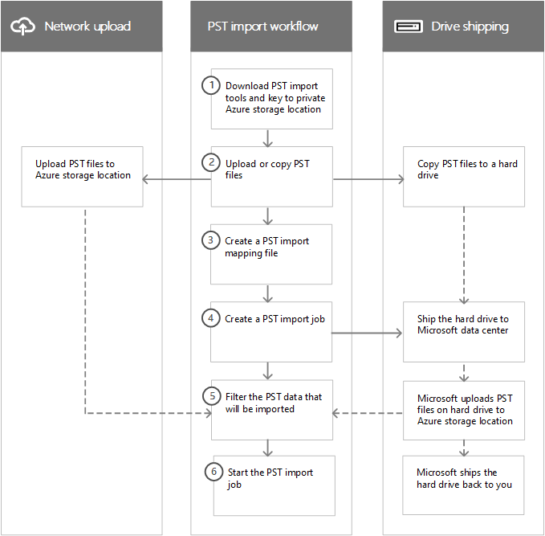

# Obtenga información sobre la importación de archivos PST de su organización

> [!NOTE]
> Este artículo está dirigido a administradores. ¿Está intentando importar archivos PST a su propio buzón? Consulte [Importar el correo electrónico, los contactos y el calendario desde un archivo .pst de Outlook](https://go.microsoft.com/fwlink/p/?LinkID=785075).

Puede usar el servicio de importación en el <a href="https://go.microsoft.com/fwlink/p/?linkid=2077149" target="_blank">portal de cumplimiento de Microsoft Purview</a> para importar archivos PST de forma masiva rápidamente a buzones de Exchange Online de su organización. Hay dos maneras de importar archivos PST a Microsoft 365:

- **Carga de red**  : cargue los archivos PST a través de la red en una ubicación temporal de Azure Storage en la nube de Microsoft. A continuación, use el servicio de importación de Microsoft 365 para importar los datos PST a los buzones de su organización.

- **Trasvase de unidades**  : Copie los archivos PST a un disco duro cifrado por BitLocker y envíe físicamente la unidad a Microsoft. Cuando Microsoft reciba la unidad de disco duro, el personal del centro de datos cargará los datos a una ubicación temporal de Azure Storage en la nube de Microsoft. A continuación, use el servicio de importación de Microsoft 365 para importar los datos a los buzones de su organización.

## Instrucciones detalladas

Consulte uno de los siguientes temas con instrucciones paso a paso para importar grandes cantidades de archivos PST de su organización a Microsoft 365.

- [Usar la carga de red para importar archivos PST a Microsoft 365](use-network-upload-to-import-pst-files.md)

- [Usar el envío de unidades para importar los archivos PST](use-drive-shipping-to-import-pst-files-to-office-365.md)

## Cómo funciona la importación de archivos PST

A continuación, le presentamos una ilustración y una descripción del proceso completo de importación de PST. La ilustración muestra el flujo de trabajo principal y resalta las diferencias entre la carga por red y los métodos de envío de unidades.

1. **Descargar las herramientas de importación de PST y la clave de la ubicación privada de Azure Storage**: el primer paso es descargar la herramienta y la clave de acceso utilizadas para cargar los archivos PST o copiarlos en una unidad de disco duro. Puede obtenerlos en la página **Importar** del portal de cumplimiento. La clave le ofrece (a usted o al personal del centro de datos de Microsoft en el caso de envío de unidades) los permisos necesarios para cargar los archivos PST a una ubicación privada y segura de Azure Storage. Esta clave de acceso es exclusiva para su organización y le ayuda a evitar el acceso no autorizado a archivos PST tras su carga en la nube de Microsoft. Tenga en cuenta que para importar archivos PST a Microsoft 365 su organización no necesita una suscripción a Azure separada.

2. **Cargar o copiar los archivos PST**: El siguiente paso depende de si decidió importar los archivos PST mediante la carga en la red o el envío de unidades. En ambos casos, usará la herramienta y la clave de almacenamiento segura que obtuvo en el paso anterior.

    - **Carga en la red:** la herramienta AzCopy.exe (descargada en el paso 1) le permite cargar y almacenar los archivos PST en una ubicación de Azure Storage en la nube de Microsoft. La ubicación de Azure Storage a la que carga sus archivos PST está ubicada en el mismo centro de datos regional de Microsoft que su organización.

      Para poder cargar los archivos PST que quiere importar, estos deben encontrarse en un recurso compartido de archivos o en un servidor de archivos de su organización.

    - **Envío de discos:** la herramienta WAImportExport.exe (descargada en el paso 1) le permite copiar los archivos PST en la unidad de disco duro. Esta herramienta cifra la unidad de disco duro con BitLocker y, a continuación, copia los PST a la unidad de disco duro. Como en la carga por red, los archivos PST que desea copiar al disco duro deben encontrarse en un recurso compartido de archivos o en un servidor de archivos de su organización.

3. **Crear un archivo de asignación de importación de PST**: una vez cargados los archivos PST en la ubicación Azure Storage o copiados en un disco duro, el siguiente paso es crear un archivo de valores separados por comas (CSV) que especifique a qué buzones de usuario se importarán los archivos PST (y un archivo PST se puede importar al buzón principal de un usuario o a su buzón de archivo). [Descargar una copia del archivo de asignación de importación de PST](https://go.microsoft.com/fwlink/p/?LinkId=544717). El servicio de importación de Microsoft 365 usará la información para importar los archivos PST.

4. **Crear un trabajo de importación de PST**: el siguiente paso es crear un trabajo de importación de PST en la página **Importar archivos PST** en el portal de cumplimiento y enviar el archivo de asignación de importación de PST creado en el paso anterior. Para la carga en la red (debido a que los archivos PST se han cargado en Azure), Microsoft 365 analiza los datos de los archivos PST y, a continuación, le permite establecer filtros para controlar qué datos se importan a los buzones especificados en el archivo de asignación de importación de PST.

    El método de envío de unidades conlleva algunos pasos adicionales en esta parte del proceso.

    - Usted envía físicamente la unidad de disco duro a un centro de datos de Microsoft (la dirección de envío del centro de datos de Microsoft se mostrará cuando se cree el trabajo de importación).

    - Cuando Microsoft reciba la unidad de disco duro, el personal del centro de datos cargará los archivos PST de la unidad en la ubicación de Azure Storage de su organización. Como se ha explicado anteriormente, sus archivos PST se cargan en una ubicación de Azure Storage que se encuentra en el mismo centro de datos regional de Microsoft que su organización.

      > [!NOTE]
      > Cargar los archivos PST de la unidad a la ubicación de Azure lleva de unos 7 a 10 días hábiles después de que Microsoft la reciba.

      Como en la carga por red, Microsoft 365 analiza los datos de los archivos PST y, a continuación, le permite establecer filtros para controlar qué datos se importan a los buzones especificados en el archivo de asignación de importación de PST.

    - Microsoft le envía de vuelta la unidad de disco duro.

5. **Filtrar los datos PST que se importarán a los buzones**: después de crear el trabajo de importación (y de que los archivos PST se carguen en la ubicación de Azure Storage tras el envío de la unidad), Microsoft 365 analiza los datos de los archivos PST (de forma segura) identificando la antigüedad de los elementos y los diferentes tipos de mensajes incluidos en los archivos PST. Una vez se haya completado el análisis y los datos estén listos para la importación, tiene la opción de importar todos los datos incluidos en los archivos PST o de recortar solo algunos de ellos, estableciendo filtros para controlar los datos para importar.

6. **Iniciar el trabajo de importación de PST**: tras iniciarse el trabajo de importación, Microsoft 365 usa la información del archivo de asignación de importación de PST para importar los archivos PST desde la ubicación Azure Storage a los buzones de los usuarios. La información de estado sobre el trabajo de importación (incluida la información sobre cada archivo PST que se va a importar) se muestra en la página **Importar archivos PST** del portal de cumplimiento. Cuando finalice el trabajo de importación, el estado del trabajo aparecerá como **Completado**.

## ¿Por qué importar datos de correo electrónico a Microsoft 365?

- Es una buena forma de importar los datos de mensajería de archivo de su organización a Microsoft 365.

- Puede usar la [Importación inteligente](filter-data-when-importing-pst-files.md) para filtrar y seleccionar qué elementos de los archivos PST se importan a los buzones de destino. Esto le permite limitar los datos importados a aquellos que usted seleccione.

- Importar datos de correo a Microsoft 365 ayuda a satisfacer las necesidades de cumplimiento de la organización, ya que le permite:

  - Habilitar [buzones de archivo](enable-archive-mailboxes.md) y [archivado de ampliación automática](autoexpanding-archiving.md) proporciona a los usuarios un mayor espacio de almacenamiento en su buzón.

  - Establezca los buzones en [Suspensión por litigio](./create-a-litigation-hold.md) para conservar el contenido.

  - Use la [Herramienta de búsqueda de contenido](content-search.md) para buscar en el contenido del buzón.

  - Use los [casos de eDiscovery](./get-started-core-ediscovery.md) para administrar las investigaciones legales de su organización.

  - Use las [directivas de retención](retention.md) en el portal de cumplimiento para controlar cuánto tiempo se conserva el contenido del buzón y, después, eliminar el contenido después de que expire el período de retención.

  - Use [las directivas de cumplimiento con la comunidad](communication-compliance.md) para examinar los mensajes, asegurarse de que son compatibles con los estándares de mensaje y agregar un tipo de clasificación.

- Importar datos a Microsoft 365 le ayuda a protegerse contra la pérdida de datos. Los datos de correo electrónico que se importan a Microsoft 365 heredan las características de alta disponibilidad de Exchange Online.

- Los datos de correo electrónico están disponibles para los usuarios en todos los dispositivos porque se almacenan en la nube.

## Importar datos de SharePoint en Microsoft 365

También puede importar archivos y documentos a sitios de SharePoint y cuentas de OneDrive de su organización. Para obtener más información, consulte los siguientes artículos:

- [Migrar a SharePoint Online](/sharepointmigration/migrate-to-sharepoint-online)

- [Presentación de la herramienta de migración de SharePoint](/sharepointmigration/introducing-the-sharepoint-migration-tool)

- [Migrar a SharePoint Online con PowerShell](/sharepointmigration/overview-spmt-ps-cmdlets)

- [Migrar su contenido de recursos compartidos a SharePoint Online con Azure Data Box](/sharepointmigration/how-to-migrate-file-share-content-to-spo-using-azuredatabox)

## Preguntas frecuentes sobre la importación de archivos PST

Estas son algunas de las preguntas más frecuentes sobre el uso del servicio de importación de Microsoft 365 para importar grandes cantidades de archivos PST a los buzones de correo de Microsoft 365.

- [Uso de la carga en la red para importar archivos PST](#using-network-upload-to-import-pst-files)

- [Uso del envío de unidades para importar los archivos PST](#using-drive-shipping-to-import-pst-files)

### Uso de la carga en la red para importar archivos PST

#### ¿Qué permisos son necesarios para crear trabajos de importación en el servicio de importación de Microsoft 365 mediante la carga de red?

Debe tener asignado el rol Importación y exportación de buzones en Exchange Online para importar archivos PST a los buzones de Microsoft 365. De forma predeterminada, este rol no está asignado a ningún grupo de roles en Exchange Online. Puede agregar la función de importación y exportación de buzones al grupo de funciones de administración de la organización. O bien, puede crear un nuevo grupo de funciones, asignar la función Importación y exportación de buzones y luego agregarse a sí mismo o a otros usuarios como miembro. Para obtener más información, consulte las secciones "Agregar una función a un grupo de funciones" o "Crear un grupo de funciones" en [Administrar grupos de funciones en Exchange Online](/Exchange/permissions-exo/role-groups).

Además, para crear trabajos de importación en el portal de cumplimiento, debe cumplirse una de las siguientes condiciones:

- Debe tener asignado el rol de Destinatarios de correo en Exchange Online. De forma predeterminada, este rol se asigna a los grupos de roles de Administración de la organización y Administración de destinatarios.

    O bien:

- Necesita ser administrador global en su organización.

> [!TIP]
> Considere la posibilidad de crear un nuevo grupo de roles en Exchange Online que esté diseñado específicamente para importar archivos PST a Microsoft 365. Para obtener el nivel mínimo de privilegios necesarios para importar archivos PST, asigne los roles Importación, exportación y destinatarios de correo al nuevo grupo de roles y luego agregue miembros.

#### ¿Dónde está disponible la carga en la red?

La carga en la red está disponible actualmente en estas regiones: Estados Unidos, Canadá, Brasil, Reino Unido, Francia, Alemania, Suiza, Noruega, Europa, India, Asia Oriental, Sudeste asiático, Japón, República de Corea, Australia y Emiratos Árabes Unidos. La carga en la red estará disponible en más regiones en el futuro.

#### ¿Cuál es el precio de la importación de archivos PST mediante carga de red?

Usar carga de red para importar archivos PST es gratuito.

Esto también significa que, una vez eliminados los archivos PST del área Azure Storage, ya no se muestran en la lista de archivos de un trabajo de importación completado en el [Centro de administración de Microsoft 365](https://go.microsoft.com/fwlink/p/?linkid=2024339). Aunque un trabajo de importación puede seguir apareciendo en la página **Importar datos a Microsoft 365**, es posible que la lista de archivos PST esté vacía al ver los detalles de los trabajos de importación anteriores.

#### ¿Qué versión del formato de archivo PST se admite para la importación en Microsoft 365?

Hay dos versiones del formato de archivo PST: ANSI y Unicode. Se recomienda importar archivos que usen el formato de archivo PST Unicode. Sin embargo, los archivos que usan el formato de archivo PST ANSI, como los de los idiomas que usan un juego de caracteres de doble byte (DBCS), también se pueden importar a Microsoft 365. Para obtener más información sobre la importación de archivos PST ANSI, vea el paso 4 de [Usar la carga de red para importar archivos PST a Microsoft 365](./use-network-upload-to-import-pst-files.md).

Además, los archivos PST de Outlook 2007 y versiones posteriores se pueden importar a Microsoft 365.

#### Después de cargar mis archivos PST en el área de Azure Storage, ¿cuánto tiempo se mantienen en Azure antes de eliminarse?

Cuando use el método de carga en la red para importar archivos PST, cárguelos en un contenedor de blobs de Azure denominado `ingestiondata`. Si no hay trabajos de importación en curso en la página **Importar archivos PST** en el portal de cumplimiento), todos los archivos PST del contenedor de `ingestiondata` en Azure se eliminan 30 días después de crear el trabajo de importación más reciente en el portal de cumplimiento. Esto también significa que tiene que crear un nuevo trabajo de importación en el portal de cumplimiento (descrito en el paso 5 de las instrucciones de carga de red) en un plazo de 30 días a partir de la carga de archivos PST en Azure.

Esto también significa que, una vez eliminados los archivos PST del área Azure Storage, ya no se muestran en la lista de archivos de un trabajo de importación completado en el portal de cumplimiento. Aunque un trabajo de importación puede seguir apareciendo en la página **Importar archivos PST** en el portal de cumplimiento, es posible que la lista de archivos PST esté vacía al ver los detalles de los trabajos de importación anteriores.

#### ¿Cuánto tiempo se tarda en importar un archivo PST a un buzón mediante la carga de red?

Depende de la capacidad de su red, pero normalmente se necesitan varias horas para que cada terabyte (TB) de datos se cargue en el área de Azure Storage para su organización. Una vez que los archivos PST se copian en el área de Azure Storage, se importa un archivo PST a un buzón de correo de Microsoft 365 a una velocidad de aproximadamente 24 GB por día\*. Si esta velocidad no satisface sus necesidades, puede considerar otros métodos para migrar datos de correo electrónico a Microsoft 365. Para obtener más información, vea [Formas de migrar varias cuentas de correo electrónico a Microsoft 365](/Exchange/mailbox-migration/mailbox-migration).

Si se importan distintos archivos PST a diferentes buzones de destino, el proceso de importación se producirá en paralelo; en otras palabras, cada par de PST y buzón se importará de forma simultánea. Si se importan varios archivos PST al mismo buzón, se importarán secuencialmente (de uno en uno), no simultáneamente.

> [!NOTE]
> \* Esta tasa no está garantizada. La carga de trabajo del servidor y los problemas de rendimiento transitorios pueden reducir esta tasa.

#### ¿Cómo el proceso de importación de PST controla los elementos duplicados del correo electrónico?

El proceso de importación de PST comprueba la existencia de elementos duplicados sin copiar los elementos de un archivo PST al buzón o al archivo si existe un elemento coincidente en la carpeta de destino del buzón o del archivo de destino. Si vuelve a importar el mismo archivo PST y especifica una carpeta de destino diferente (con la propiedad TargetRootFolder en el archivo de asignación de importación PST) a la especificada en el trabajo de importación anterior, se volverán a importar todos los elementos del archivo PST.

#### ¿Hay un límite de tamaño de mensaje al importar archivos PST mediante la carga de red?

Sí. Si un archivo PST contiene un elemento de buzón de más de 150 MB, el elemento se ignorará y no se importará durante el proceso de importación. No se importan los elementos mayores de 150 MB porque 150 MB es el límite de tamaño de mensajes en Exchange Online. Para más información, consulte [Límites de mensajes en Exchange Online](/office365/servicedescriptions/exchange-online-service-description/exchange-online-limits#message-limits).

#### ¿Las propiedades de los mensajes, como cuando el mensaje se envía o se recibe, la lista de destinatarios y otras propiedades, se conservan cuando se importan los archivos PST en un buzón de Microsoft 365?

Sí. Ninguno de los metadatos de los mensajes originales cambiará durante el proceso de importación.

#### ¿Existe algún límite en el número de niveles de una jerarquía de carpetas para un archivo PST que quiero importar a un buzón?

Sí. No puede importar archivos PST que tengan 300 o más niveles de carpetas anidadas.

#### ¿Puedo usar la carga de red para importar archivos PST a un buzón inactivo en Microsoft 365?

Yes, this capability is now available.

#### Can I use network upload to import PST files to an online archive mailbox in an Exchange hybrid deployment?

Yes, this capability is now available.

#### ¿Puedo usar la carga de red para importar archivos PST en carpetas públicas de Exchange Online?

No, no puede importar archivos PST en carpetas públicas.

### Uso del envío de unidades para importar los archivos PST

#### ¿Qué permisos son necesarios para crear trabajos de importación en el servicio de importación de Microsoft 365 mediante el trasvase de unidades?

Debe tener asignado el rol de exportación e importación de buzón para importar archivos PST en buzones de Microsoft 365. De manera predeterminada, este rol no está asignado a ningún grupo de rol en Exchange Online. Puede agregar el rol de exportación e importación de buzón en el grupo de rol de administración de la organización. O puede crear un nuevo grupo de rol, asignar el rol de exportación e importación de buzón y, después, agregarse o agregar a otros usuarios como miembro. Para obtener más información, consulte las secciones "Agregar un rol a un grupo de roles" o "Crear un grupo de roles" en [Administrar grupos de roles](/Exchange/permissions-exo/role-groups).

Además, para crear trabajos de importación en el portal de cumplimiento, debe cumplirse una de las siguientes condiciones:

- Debe tener asignado el rol de Destinatarios de correo en Exchange Online. De forma predeterminada, este rol se asigna a los grupos de roles de Administración de la organización y Administración de destinatarios.

    O bien:

- Necesita ser administrador global en su organización.

> [!TIP]
> Considere la posibilidad de crear un nuevo grupo de roles en Exchange Online que esté diseñado específicamente para importar archivos PST a Microsoft 365. Para obtener el nivel mínimo de privilegios necesarios para importar archivos PST, asigne los roles Importación, exportación y destinatarios de correo al nuevo grupo de roles y luego agregue miembros.

#### ¿Dónde está disponible el envío de unidades?

El envío de unidades está disponible actualmente en los Estados Unidos, Canadá, Brasil, Reino Unido, Europa, India, Este de Asia, Sudeste Asiático, Japón, República de Corea y Australia. El envío de unidades estará disponible en más regiones en el futuro.

> [!NOTE]
> En este momento, el envío de unidades para importar archivos PST no está disponible en Alemania y Suiza. Estas preguntas más frecuentes se actualizarán cuando se disponga de envío de unidades en estos países.

#### ¿Qué contratos de licencias comerciales admiten el envío de unidades?

El envío de unidades para importar archivos PST a Microsoft 365 está disponible a través de un contrato empresarial de Microsoft (EA). El envío de Drive no está disponible a través de un Acuerdo de productos y servicios de Microsoft (MPSA).

#### ¿Cuál es el precio de usar el envío de unidades para importar archivos PST en Microsoft 365?

El costo de usar el envío de unidades para importar archivos PST a buzones de Microsoft 365 es de 2 USD por GB de datos. Por ejemplo, si envía una unidad de disco duro que contiene 1000 GB (1 TB) de archivos PST, el costo es de 2000 USD. Puede trabajar con un asociado para pagar la tarifa de importación. Para obtener información sobre cómo buscar un partner, consulta [Buscar a tu partner o revendedor de Microsoft](../admin/manage/find-your-partner-or-reseller.md).

#### ¿Qué tipo de unidades de disco duro se admiten para el envío de unidades?

Solo se admiten unidades de estado sólido (SSD) de 2,5 pulgadas o unidades de disco duro internas SATA II/III de 2,5 o 3,5 pulgadas para su uso con el servicio de importación de Microsoft 365. Puede usar unidades de disco duro de hasta 10 TB. Para los trabajos de importación, solo se procesará el primer volumen de datos del disco duro. El volumen de datos debe tener formato NTFS. Al copiar datos en una unidad de disco duro, puede conectarlos directamente mediante un conector SSD de 2,5 pulgadas o 2,5 o 3,5 pulgadas SATA II/III, o bien puede conectarlos externamente mediante un adaptador USB SATA II/III externo de 2,5 pulgadas o 2,5 o 3,5 pulgadas SATA II/III.

> [!IMPORTANT]
> Las unidades de disco duro externas que vienen con un adaptador USB integrado no son compatibles con el servicio de importación de Microsoft 365. Además, no se puede usar el disco dentro del uso de mayúsculas y minúsculas de una unidad de disco duro externa. No envíes unidades de disco duro externas.

#### How many hard drives can I ship for a single import job?

You can ship a maximum of 10 hard drives for a single import job.

#### Después de enviar mi unidad de disco duro, ¿cuánto tiempo tarda en llegar al centro de datos de Microsoft?

Eso depende de varias cosas, como su proximidad al centro de datos de Microsoft y qué tipo de opción de envío ha usado para enviar la unidad de disco duro (es decir, envío en un día, en dos días o entrega mediante red terrestre). Con la mayoría de los transportistas, puede usar el número de seguimiento para realizar un seguimiento del estado de su envío.

#### Tras la recepción de mi unidad de disco duro en el centro de datos de Microsoft, ¿cuánto tiempo se tarda en cargar los archivos PST en Azure?

Una vez que su disco duro se reciba en el centro de datos de Microsoft, tardará entre 7 y 10 días laborables en cargar los archivos PST en la ubicación de Azure Storage de su organización. Los archivos PST se cargarán en un contenedor de Azure denominado blob`ingestiondata`.

#### ¿Cuánto tiempo se tarda en importar un archivo PST a un buzón mediante el envío de unidades?

Una vez que los archivos PST se han cargado al área de Azure Storage, Microsoft 365 analiza los datos de los archivos PST (de forma segura) para identificar la antigüedad de los elementos y los diferentes tipos de mensajes incluidos en los archivos PST. Cuando se haya completado este análisis, podrá importar todos los datos de los archivos PST o establecer filtros para determinar qué datos importa. Después de iniciar el trabajo de importación, se importa un archivo PST a un buzón de Microsoft 365 a una velocidad de aproximadamente 24 GB al día.\*Si esta velocidad no satisface sus necesidades, puede considerar otros métodos para obtener datos de correo electrónico en Microsoft 365. Para obtener más información, vea [Formas de migrar varias cuentas de correo electrónico a Microsoft 365](/Exchange/mailbox-migration/mailbox-migration).

Si se importan distintos archivos PST a diferentes buzones de destino, el proceso de importación se producirá en paralelo; en otras palabras, cada par de PST y buzón se importará de forma simultánea. Si se importan varios archivos PST al mismo buzón, se importarán secuencialmente (de uno en uno), no simultáneamente.

> [!NOTE]
> \* Esta tasa no está garantizada. La carga de trabajo del servidor y los problemas de rendimiento transitorios pueden reducir esta tasa.

#### Después de que Microsoft cargue mis archivos PST a Azure, ¿cuánto tiempo se conservarán en Azure antes de su eliminación?

Todos los archivos PST de la ubicación Azure Storage de la organización (en el contenedor de blobs denominado `ingestiondata`) se eliminan 30 días después de que se creara el trabajo de importación más reciente en la página **Importar archivos PST** en el portal de cumplimiento.

Esto también significa que, una vez eliminados los archivos PST del área Azure Storage, ya no se muestran en la lista de archivos de un trabajo de importación completado en el portal de cumplimiento. Aunque un trabajo de importación puede seguir apareciendo en la página **Importar archivos PST** en el portal de cumplimiento, es posible que la lista de archivos PST esté vacía al ver los detalles de los trabajos de importación anteriores.

#### ¿Qué versión del formato de archivo PST se admite para la importación en Microsoft 365?

Hay dos versiones del formato de archivo PST: ANSI y Unicode. Se recomienda importar archivos que usen el formato de archivo PST Unicode. Sin embargo, los archivos que usan el formato de archivo PST ANSI, como los de los idiomas que usan un juego de caracteres de doble byte (DBCS), también se pueden importar a Microsoft 365. Para obtener más información sobre la importación de archivos PST ANSI, vea el paso 3 de [Usar el envío de unidades para importar los archivos PST de la organización a Microsoft 365](use-drive-shipping-to-import-pst-files-to-office-365.md#step-3-create-the-pst-import-mapping-file).

Además, los archivos PST de Outlook 2007 y versiones posteriores se pueden importar a Microsoft 365.

#### ¿Hay un límite de tamaño de mensaje al importar archivos PST mediante el envío de unidades?

Sí. Si un archivo PST contiene un elemento de buzón de más de 150 MB, el elemento se ignorará y no se importará durante el proceso de importación. No se importan los elementos mayores de 150 MB porque 150 MB es el límite de tamaño de mensajes en Exchange Online. Para más información, consulte [Límites de mensajes en Exchange Online](/office365/servicedescriptions/exchange-online-service-description/exchange-online-limits#message-limits).

  **¿Cómo el proceso de importación de PST controla los elementos duplicados del correo electrónico?

El proceso de importación de PST comprueba la existencia de elementos duplicados sin copiar los elementos de un archivo PST al buzón o al archivo si existe un elemento coincidente en la carpeta de destino del buzón o del archivo de destino. Si vuelve a importar el mismo archivo PST y especifica una carpeta de destino diferente (con la propiedad TargetRootFolder en el archivo de asignación de importación PST) a la especificada en el trabajo de importación anterior, se volverán a importar todos los elementos del archivo PST.

#### ¿Se conservan las propiedades del mensaje, como cuando se envió o recibió el mensaje, la lista de destinatarios y otras propiedades, cuando los archivos PST se importan a un buzón de correo de Microsoft 365 mediante el envío de unidades?

Sí. Los metadatos de los mensajes originales no se modifican durante el proceso de importación.

#### ¿Existe algún límite en el número de niveles de una jerarquía de carpetas para un archivo PST que quiero importar a un buzón?

Sí. No puede importar archivos PST que tengan 300 o más niveles de carpetas anidadas.

#### ¿Puedo usar el envío de unidades para importar archivos PST en un buzón inactivo en Microsoft 365?

Yes, this capability is now available.

#### Can I use drive shipping to import PST files to an online archive mailbox in an Exchange hybrid deployment?

Yes, this capability is now available.

#### ¿Puedo usar el envío de unidades para importar archivos PST en carpetas públicas de Exchange Online?

No, no puede importar archivos PST en carpetas públicas.

#### ¿Puede Microsoft borrar los datos de mi unidad de disco duro antes de que me la envíen de nuevo?

No, Microsoft can't wipe hard drives before shipping them back to customers. Hard drives are returned to you in the same state they were in when they were received by Microsoft.

#### Can Microsoft shred my hard drive instead of shipping it back to me?

No, Microsoft can't destroy your hard drive. Hard drives are returned to you in the same state they were in when they were received by Microsoft.

#### What courier services are supported for return shipping?

If you're a customer in the United States or Europe, Microsoft uses FedEx to return your hard drive. For all other regions, Microsoft uses DHL.

#### What are the return shipping costs?

Return shipping costs vary, depending on your proximity to the Microsoft data center that you shipped your hard drive to. Microsoft will bill your FedEx or DHL account to return your hard drive. The cost of return shipping is your responsibility.

#### Can I use a custom courier shipping service, such as FedEx Custom Shipping, to ship my hard drive to Microsoft?

Sí.

#### If I have to ship my hard drive to another country, is there anything I need to do?

La unidad de disco duro que envíe a Microsoft puede tener que atravesar fronteras internacionales. Si este es el caso, es responsable de garantizar que la unidad y los datos que contiene se importen o exporten según las leyes aplicables. Antes de enviar una unidad de disco duro, compruebe con sus asesores que la unidad y los datos pueden enviarse legalmente al centro de datos de Microsoft especificado. Esto ayudará a garantizar que llegan a Microsoft de manera puntual.
