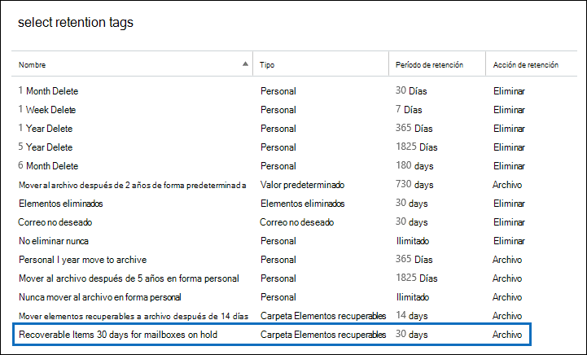
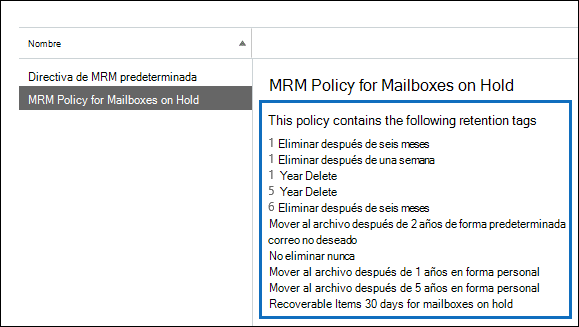

# <a name="increase-the-recoverable-items-quota-for-mailboxes-on-hold"></a>Aumentar la cuota de elementos recuperables para los buzones de correo en retención

La directiva de retención predeterminada de Exchange, denominada Directiva de *MRM* predeterminada, que se aplica automáticamente a los nuevos buzones de Exchange Online contiene una etiqueta de retención denominada Elementos recuperables que se mueve al archivo durante 14 días. Esta etiqueta de retención mueve los elementos de la carpeta Elementos recuperables del buzón principal del usuario a la carpeta Elementos recuperables del buzón de archivo del usuario después de que expire el período de retención de 14 días para un elemento. Para que esto suceda, el buzón de archivo del usuario debe estar habilitado. Si el buzón de archivo no está habilitado, no se hace ninguna acción, lo que significa que los elementos de la carpeta Elementos recuperables de un buzón en suspensión no se mueven al buzón de archivo después de que expire el período de retención de 14 días. Dado que no se elimina nada de un buzón en retención, es posible que se supere la cuota de almacenamiento de la carpeta Elementos recuperables, especialmente si el buzón de archivo del usuario no está habilitado. 
  
Para ayudar a reducir la posibilidad de superar este límite, la cuota de almacenamiento de la carpeta Elementos recuperables aumenta automáticamente de 30 GB a 100 GB cuando se coloca una retención en un buzón en Exchange Online. Si el buzón de archivo está habilitado, la cuota de almacenamiento de la carpeta Elementos recuperables del buzón de archivo también se incrementa de 30 GB a 100 GB. Si la característica de archivado de expansión automática en Exchange Online está habilitada, la cuota de almacenamiento de la carpeta Elementos recuperables del archivo del usuario será ilimitada.
  
  En la tabla siguiente se resume la cuota de almacenamiento de la carpeta Elementos recuperables. 
  
|**Ubicación de la carpeta Elementos recuperables**|**Buzones que no están en suspensión**|**Buzones en suspensión**|
|:-----|:-----|:-----|
|Buzón principal  <br/> |30 GB  <br/> |100 GB  <br/> |
|Buzón de archivo<sup>\*</sup> <br/> |Ilimitado  <br/> |Ilimitado  <br/> |
|**Cuota de almacenamiento total de la carpeta Elementos recuperables** <br/> |Ilimitado  <br/> |Ilimitado  <br/> |
   
> [!NOTE]
> <sup>\*</sup> La cuota de almacenamiento inicial para el buzón de archivo es de 100 GB para los usuarios con una licencia de Exchange Online (plan 2). Sin embargo, cuando el archivado de expansión automática está activado para los buzones en retención, la cuota de almacenamiento para el buzón de archivo y la carpeta Elementos recuperables aumenta a 110 GB. Se aprovisionará espacio de almacenamiento de archivo adicional cuando sea necesario, lo que da como resultado una cantidad ilimitada de almacenamiento de archivo. Para obtener más información sobre el archivado de expansión automática, vea Información general sobre el [archivado ilimitado en Office 365.](unlimited-archiving.md) 
  
Cuando la cuota de almacenamiento de la carpeta Elementos recuperables en el buzón principal de un buzón en suspensión está a punto de alcanzar su límite, puede hacer lo siguiente:
  
- **Habilite el buzón de archivo y active el archivado de expansión automática.** Puede habilitar una capacidad de almacenamiento ilimitada para la carpeta Elementos recuperables simplemente habilitando el buzón de archivo y, a continuación, activando la característica de archivado de expansión automática en Exchange Online. Esto da como resultado 110 GB para la carpeta Elementos recuperables en el buzón principal y una cantidad ilimitada de capacidad de almacenamiento para la carpeta Elementos recuperables en el archivo del usuario. Vea cómo: [Habilitar buzones de](enable-archive-mailboxes.md) archivo en el Centro de seguridad & cumplimiento y Habilitar archivado ilimitado [en Office 365.](enable-unlimited-archiving.md)
    
    > [!NOTE]
    > Después de habilitar el archivo para un buzón que está a punto de superar la cuota de almacenamiento de la carpeta Elementos recuperables, es posible que desee ejecutar el Asistente para carpeta administrada para activar manualmente el asistente para procesar el buzón de modo que los elementos expirados se trasladen a la carpeta Elementos recuperables del buzón de archivo. Vea el [paso 4](#optional-step-4-run-the-managed-folder-assistant-to-apply-the-new-retention-settings) para obtener instrucciones. Tenga en cuenta que podrían moverse otros elementos del buzón del usuario al nuevo buzón de archivo. Considere la posibilidad de avisar al usuario de que esto puede ocurrir después de habilitar el buzón de archivo. 
  
- **Cree una directiva de retención de Exchange personalizada para los buzones en suspensión.** Además de habilitar el buzón de archivo y expandir automáticamente el archivado para los buzones en retención por juicio o en retención por juicio, es posible que también desee crear una directiva de retención de Exchange personalizada para los buzones en suspensión. In-Place Esto le permite aplicar una directiva de retención a los buzones de correo en suspensión que es diferente de la directiva de MRM predeterminada que se aplica a los buzones que no están en suspensión y le permite aplicar etiquetas de retención diseñadas para buzones de correo en suspensión. Esto incluye la creación de una nueva etiqueta de retención para la carpeta Elementos recuperables. 
    
En el resto de este tema se describen los procedimientos paso a paso para crear una directiva de retención de Exchange personalizada para buzones de correo en suspensión.
  
[Paso 1: Crear una etiqueta de retención personalizada para la carpeta Elementos recuperables](#step-1-create-a-custom-retention-tag-for-the-recoverable-items-folder)

[Paso 2: Crear una nueva directiva de retención de Exchange para buzones en suspensión](#step-2-create-a-new-exchange-retention-policy-for-mailboxes-on-hold)

[Paso 3: Aplicar la nueva directiva de retención de Exchange a buzones en suspensión](#step-3-apply-the-new-exchange-retention-policy-to-mailboxes-on-hold)

[Paso 4 (opcional): Ejecutar el Asistente para carpeta administrada para aplicar la nueva configuración de retención](#optional-step-4-run-the-managed-folder-assistant-to-apply-the-new-retention-settings)
  
## <a name="step-1-create-a-custom-retention-tag-for-the-recoverable-items-folder"></a>Paso 1: Crear una etiqueta de retención personalizada para la carpeta Elementos recuperables

El primer paso consiste en crear una etiqueta de retención personalizada (denominada etiqueta de directiva de retención o RPT) para la carpeta Elementos recuperables. Como se ha explicado anteriormente, esta RPT mueve elementos de la carpeta Elementos recuperables del buzón de correo principal del usuario a la carpeta Elementos recuperables del buzón de archivo del usuario. Debe usar PowerShell para crear una RPT para la carpeta Elementos recuperables. No puede usar el Centro de administración de Exchange (EAC). 
  
1. [Conectarse a Exchange Online mediante PowerShell remoto](https://go.microsoft.com/fwlink/p/?LinkId=517283)
    
2. Ejecute el comando siguiente para crear una RPT para la carpeta Elementos recuperables:  
    
    ```powershell
    New-RetentionPolicyTag -Name <Name of RPT> -Type RecoverableItems -AgeLimitForRetention <Number of days> -RetentionAction MoveToArchive
    ```

    Por ejemplo, el siguiente comando crea una RPT para la carpeta Elementos recuperables denominada "Elementos recuperables 30 días para buzones en retención", con un período de retención de 30 días. Esto significa que, una vez que un elemento haya estado en la carpeta Elementos recuperables durante 30 días, se moverá a la carpeta Elementos recuperables del buzón de archivo del usuario.
    
    ```powershell
    New-RetentionPolicyTag -Name "Recoverable Items 30 days for mailboxes on hold" -Type RecoverableItems -AgeLimitForRetention 30 -RetentionAction MoveToArchive
    ```

    > [!TIP]
    > Se recomienda que el período de retención (definido por el parámetro  _AgeLimitForRetention)_ para la RPT de elementos recuperables sea el mismo que el período de retención de elementos eliminados para los buzones a los que se aplicará la RPT. Esto permite que un usuario durante todo el período de retención de elementos eliminados recupere los elementos eliminados antes de moverlos al buzón de archivo. En el ejemplo anterior, el período de retención se estableció en 30 días en función de la suposición de que el período de retención de elementos eliminados para los buzones también es de 30 días. De forma predeterminada, un buzón de Exchange Online está configurado para conservar los elementos eliminados durante 14 días. Pero puedes cambiar esta configuración a un máximo de 30 días. Para obtener más información, vea Cambiar el período de retención de [elementos eliminados para un buzón en Exchange Online.](https://www.microsoft.com/?ref=go) 
  
## <a name="step-2-create-a-new-exchange-retention-policy-for-mailboxes-on-hold"></a>Paso 2: Crear una nueva directiva de retención de Exchange para buzones en suspensión

El siguiente paso consiste en crear una directiva de retención y agregarle etiquetas de retención, incluida la RPT de Elementos recuperables que creó en el paso 1. Esta nueva directiva se aplicará a los buzones de correo en suspensión en el paso siguiente.  
  
Antes de crear la directiva de retención, determine las etiquetas de retención adicionales que quiere agregar. Para obtener una lista de las etiquetas de retención que se agregan a la directiva de MRM predeterminada y para obtener información sobre cómo crear etiquetas de retención, vea lo siguiente:
  
- [Directiva de retención predeterminada de Exchange Online ](https://go.microsoft.com/fwlink/p/?LinkId=746954)
    
- [Carpetas predeterminadas que admiten etiquetas de la directiva de retención](https://go.microsoft.com/fwlink/p/?LinkId=746957)
    
- La sección "Crear una etiqueta de retención" en el [tema Crear una directiva de](https://go.microsoft.com/fwlink/p/?LinkId=404422) retención.
    
Puede usar el EAC o Exchange Online PowerShell para crear una directiva de retención.
  
### <a name="use-the-eac-to-create-a-retention-policy"></a>Uso de EAC para crear una directiva de retención
  
1. En el EAC, vaya a Directivas **de** retención de administración de cumplimiento y, a continuación, haga clic \>  **en Agregar**  icono.
    
2. En la página **Nueva directiva de retención**, en **Nombre**, escriba un nombre que describa el propósito de la directiva, como **MRM Policy for Mailboxes on Hold** (Directiva de MRM para buzones de correo en suspensión).  
    
3. En **Etiquetas de retención,** haga **clic en** Agregar icono  .
    
4. En la lista de etiquetas de retención, seleccione la RPT de Elementos recuperables que ha creado en el paso 1 y, después, haga clic en **Agregar**.
    
    
  
5. Seleccione las etiquetas de retención adicionales que quiera agregar a la directiva de retención. Por ejemplo, podría interesarle agregar las mismas etiquetas que se incluyen en la directiva de MRM predeterminada.
    
6. Cuando termine de agregar reglas de retención, haga clic en **Aceptar**.
    
7. Haga clic en **Guardar** para crear la directiva de retención. 
    
    Observe que las etiquetas de retención vinculadas a la directiva de retención se muestran en el panel de detalles
    
    
  
### <a name="use-exchange-online-powershell-to-create-a-retention-policy"></a>Usar Exchange Online PowerShell para crear una directiva de retención
  
Ejecute el comando siguiente para crear una directiva de retención para buzones en suspensión.  
  
```powershell
New-RetentionPolicy <Name of retention policy>  -RetentionPolicyTagLinks <list of retention tags>

```

Por ejemplo, el siguiente comando crea la directiva de retención y las etiquetas de retención vinculadas que se muestran en la ilustración anterior.
  
```powershell
New-RetentionPolicy "MRM Policy for Mailboxes on Hold"  -RetentionPolicyTagLinks "Recoverable Items 30 days for mailboxes on hold","1 Month Delete","1 Week Delete","1 Year Delete","5 Year Delete","6 Month Delete","Default 2 year move to archive","Junk Email","Never Delete","Personal 1 year move to archive","Personal 5 year move to archive"
```

## <a name="step-3-apply-the-new-exchange-retention-policy-to-mailboxes-on-hold"></a>Paso 3: Aplicar la nueva directiva de retención de Exchange a buzones en suspensión

El último paso consiste en aplicar la nueva directiva de retención que ha creado en el paso 2 a buzones de correo en suspensión de su organización. Puede usar el EAC o Exchange Online PowerShell para aplicar la directiva de retención a un único buzón o a varios buzones. 
  
### <a name="use-the-eac-to-apply-the-new-retention-policy"></a>Usar el EAC para aplicar la nueva directiva de retención
  
1. Vaya a **Buzones**  >  **de destinatarios.**
    
2. En la vista de lista, seleccione el buzón al que desea aplicar la directiva de retención y, a continuación, haga clic **en el icono** Editar  edición.
    
3. En la página **Buzón de usuario**, haga clic en **Características de buzón de correo**.
    
4. En **Directiva de retención**, seleccione la directiva de retención que ha creado en el paso 2 y, después, haga clic en **Guardar**.
    
También puede usar el EAC para aplicar la directiva de retención a varios buzones.
  
1. Vaya a **Buzones**  >  **de destinatarios.**
    
2. En la vista de lista, use las teclas Mayús o Ctrl para seleccionar varios buzones.
    
3. En el panel de detalles, haga clic en **Más opciones**.
    
4. En **Directiva de retención**, haga clic en **Actualizar**.
    
5. En la página **Directiva de retención de asignación masiva**, seleccione la directiva de retención que ha creado en el paso 2 y, después, haga clic en **Guardar**.  
    
### <a name="use-exchange-online-powershell-to-apply-the-new-retention-policy"></a>Usar Exchange Online PowerShell para aplicar la nueva directiva de retención
  
Puede usar Exchange Online PowerShell para aplicar una nueva directiva de retención a un único buzón. Pero la verdadera potencia de PowerShell es que puede usarlo para identificar rápidamente todos los buzones de la organización que están en retención por juicio o en retención In-Place y, a continuación, aplicar la nueva directiva de retención a todos los buzones de correo en retención en un solo comando. Estos son algunos ejemplos de cómo usar Exchange PowerShell para aplicar una directiva de retención a uno o más buzones. Todos los ejemplos aplican la directiva de retención que ha creado en el paso 2.
  
En este ejemplo se aplica la nueva directiva de retención al buzón de Pilar Pinilla.
  
```powershell
Set-Mailbox "Pilar Pinilla" -RetentionPolicy "MRM Policy for Mailboxes on Hold"
```

En este ejemplo se aplica la nueva directiva de retención a todos los buzones de correo de la organización que se encuentran en retención por juicio.
  
```powershell
$LitigationHolds = Get-Mailbox -ResultSize unlimited | Where-Object {$_.LitigationHoldEnabled -eq 'True'}
```

```powershell
$LitigationHolds.DistinguishedName | Set-Mailbox -RetentionPolicy "MRM Policy for Mailboxes on Hold"
```

En este ejemplo se aplica la nueva directiva de retención a todos los buzones de correo de la organización que se encuentran en Conservación local.
  
```powershell
$InPlaceHolds = Get-Mailbox -ResultSize unlimited | Where-Object {$_.InPlaceHolds -ne $null}
```

```powershell
$InPlaceHolds.DistinguishedName | Set-Mailbox -RetentionPolicy "MRM Policy for Mailboxes on Hold"
```

Puede usar el cmdlet **Get-Mailbox** para comprobar que se ha aplicado la nueva directiva de retención. 
  
A continuación presentamos algunos ejemplos para comprobar que los comandos de los ejemplos anteriores han aplicado la directiva de retención Directiva de MRM para buzones de correo en suspensión a los buzones que se encuentran en retención por juicio y en Conservación local.
  
```powershell
Get-Mailbox "Pilar Pinilla" | Select RetentionPolicy
```

```powershell
Get-Mailbox -ResultSize unlimited | Where-Object {$_.LitigationHoldEnabled -eq 'True'} | FT DisplayName,RetentionPolicy -Auto
```

```powershell
Get-Mailbox -ResultSize unlimited | Where-Object {$_.InPlaceHolds -ne $null} | FT DisplayName,RetentionPolicy -Auto
```

## <a name="optional-step-4-run-the-managed-folder-assistant-to-apply-the-new-retention-settings"></a>Paso 4 (opcional): Ejecutar el Asistente para carpeta administrada para aplicar la nueva configuración de retención

Después de aplicar la nueva directiva de retención de Exchange a los buzones de correo en suspensión, puede tardar hasta 7 días en Exchange Online para que el Asistente para carpeta administrada procese estos buzones con la configuración de la nueva directiva de retención. En lugar de esperar a que se ejecute el Asistente para carpeta administrada, puede usar el cmdlet **Start-ManagedFolderAssistant** para activar manualmente el asistente, de modo que procese los buzones a los que les ha aplicado la nueva directiva de retención. 
  
Ejecute el comando siguiente para iniciar el Asistente para carpeta administrada en el buzón del Pilar Pinilla.
  
```powershell
Start-ManagedFolderAssistant "Pilar Pinilla"
```

Ejecute los comandos siguientes para iniciar el Asistente para carpeta administrada en todos los buzones en suspensión.
  
```powershell
$MailboxesOnHold = Get-Mailbox -ResultSize unlimited | Where-Object {($_.InPlaceHolds -ne $null) -or ($_.LitigationHoldEnabled -eq "True")}
```

```powershell
$MailboxesOnHold.DistinguishedName | Start-ManagedFolderAssistant
```

## <a name="more-information"></a>Más información

- Después de habilitar el buzón de archivo de un usuario, considere la posibilidad de informar al usuario de que otros elementos del buzón (no solo los elementos de la carpeta Elementos recuperables) se podrían mover al buzón de archivo. Esto se debe a que la directiva de MRM predeterminada que se asigna a los buzones de Exchange Online contiene una etiqueta de retención (denominada Movimiento a archivo de 2 años predeterminado) que mueve los elementos al buzón de archivo dos años después de la fecha en que el elemento se entregó al buzón o creó el usuario. Para obtener más información, vea [Directiva de retención predeterminada en Exchange Online ](https://go.microsoft.com/fwlink/p/?LinkId=746954)
    
- Después de habilitar el buzón de archivo de un usuario, también puede decir al usuario que puede recuperar los elementos eliminados en la carpeta Elementos recuperables de su buzón de archivo. Para hacerlo en Outlook, seleccione  la carpeta Elementos eliminados en  el buzón de archivo y, a continuación, haga clic en Recuperar elementos eliminados del servidor en la **pestaña** Inicio. Para obtener más información acerca de la recuperación de elementos eliminados, vea [Recuperar elementos eliminados en Outlook para Windows](https://go.microsoft.com/fwlink/p/?LinkId=624829). 
