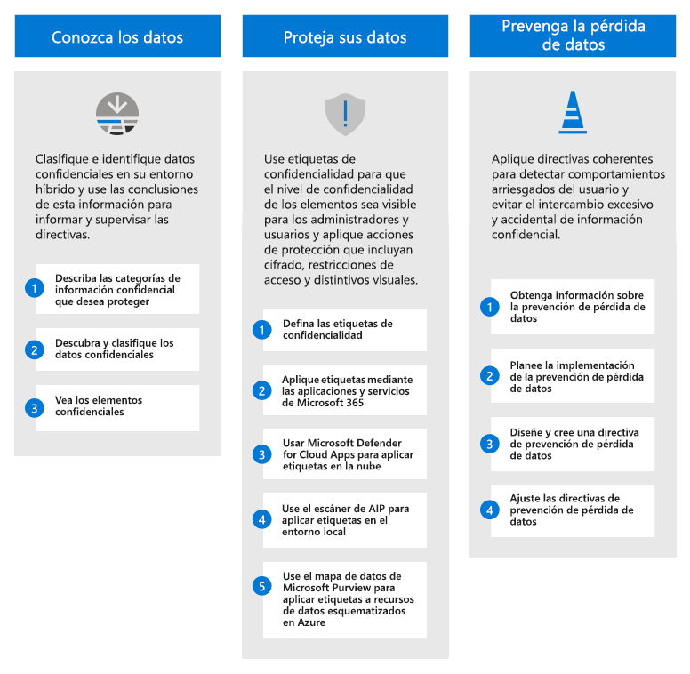
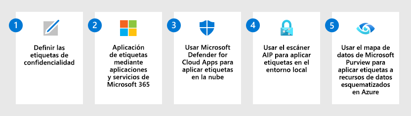

# Implementación de una solución de protección de la información con Microsoft Purview

>*[Licencias para el Centro de seguridad y cumplimiento de Microsoft 365](/office365/servicedescriptions/microsoft-365-service-descriptions/microsoft-365-tenantlevel-services-licensing-guidance/microsoft-365-security-compliance-licensing-guidance)*

Su estrategia de protección de la información se basa en sus necesidades empresariales. Muchas organizaciones deben cumplir los reglamentos, las leyes y las prácticas empresariales. Además, las organizaciones deben proteger la información de su propiedad, como los datos de proyectos específicos.

Microsoft Purview Information Protection (anteriormente conocida como Information Protection) proporciona un marco, un proceso y funcionalidades que puede usar para lograr sus objetivos de negocio específicos. 

## Marco de Microsoft Purview Information Protection

Utilice Microsoft Purview Information Protection para descubrir, clasificar, proteger y controlar la información confidencial donde esta resida o hacia donde se transfiera.

Vea la siguiente sesión de Ignite para consultar cómo estas funcionalidades se admiten y se basan entre sí: [Conozca sus datos, protéjalos y evite su pérdida con Microsoft Information Protection](https://myignite.microsoft.com/archives/IG20-OD273).

Para el gobierno de datos, consulte [Implementación de una solución de gobierno de datos con Microsoft Purview](data-governance-solution.md).

## Licencias

Las funcionalidades de Microsoft Purview Information Protection se incluyen con Microsoft Purview. Los requisitos de licencia pueden variar incluso dentro de las funcionalidades, en función de las opciones de configuración. Para identificar los requisitos y las opciones de licencia, consulte la [guía de Microsoft 365 para el cumplimiento y la seguridad](/office365/servicedescriptions/microsoft-365-service-descriptions/microsoft-365-tenantlevel-services-licensing-guidance/microsoft-365-security-compliance-licensing-guidance).

## Conocer los datos

Saber dónde residen los datos confidenciales suele ser el mayor desafío de muchas organizaciones. La clasificación de datos de Microsoft Purview Information Protection le ayuda a descubrir y clasificar con precisión las cantidades cada vez mayores de datos que crea su organización. Las representaciones gráficas le ayudan a obtener información sobre estos datos para que pueda configurar y supervisar directivas con las que protegerlos y controlarlos.

|Paso|Descripción|Más información|
|:---|:----------|:---------------|
|1| Describa las categorías de información confidencial que desea proteger.    Ya ha podido hacerse una idea de qué tipo de información es más valiosa para la organización y cuál no. Trabaje con las partes interesadas para describir estas categorías, ya que son el punto de partida. | [Obtener más información acerca de los tipos de información confidencial](sensitive-information-type-learn-about.md) 
 [Obtenga información sobre los clasificadores entrenables](classifier-learn-about.md)|
|2| Descubra y clasifique los datos confidenciales.    Los datos confidenciales de los elementos se pueden encontrar mediante muchos métodos diferentes que incluyen directivas de prevención de pérdida de datos predeterminadas, etiquetado manual por parte de los usuarios y reconocimiento de patrones automatizado mediante tipos de información confidencial o aprendizaje automático. | [Obtenga información sobre la clasificación de datos](data-classification-overview.md) 
 [Vídeo: Clasificación de los datos en el centro de cumplimiento](https://www.microsoft.com/videoplayer/embed/RE4vx8x)|
|3| Vea sus elementos confidenciales.     Use el explorador de contenido y el explorador de actividades para analizar con más detalle los elementos confidenciales y las acciones que los usuarios realizan en estos elementos.| [Introducción al explorador de contenido](data-classification-content-explorer.md) 
 [Introducción al explorador de actividad](data-classification-activity-explorer.md)|

## Proteger los datos

Con la información que obtuvo al saber dónde residen los datos confidenciales, puede protegerlos de forma más eficaz. Sin embargo, no es necesario esperar, puede empezar a protegerlos inmediatamente con una combinación de etiquetado manual, predeterminado y automático. A continuación, use el [Explorador de contenido](data-classification-content-explorer.md) y el [explorador de actividad](data-classification-activity-explorer.md) de la sección anterior para confirmar qué elementos se etiquetan y cómo se usan las etiquetas.

|Paso|Descripción|Más información|
|:---|-----------|:---------------|
| 1|Defina las [etiquetas de confidencialidad](sensitivity-labels.md) y las directivas que van a proteger los datos de su organización.   Además de identificar la confidencialidad del contenido, estas etiquetas pueden aplicar acciones de protección, como encabezados, pies de página, marcas de agua y cifrado. | [Introducción a las etiquetas de confidencialidad](get-started-with-sensitivity-labels.md)    [Crear y configurar etiquetas de confidencialidad y sus directivas](create-sensitivity-labels.md)    [Restringir el acceso al contenido mediante el uso de etiquetas de confidencialidad para aplicar el cifrado](encryption-sensitivity-labels.md) |
| 2|Etiquete y proteja los elementos de aplicaciones y servicios de Microsoft 365.   Las etiquetas de confidencialidad son compatibles con Word, Excel, PowerPoint, Outlook y los contenedores de Microsoft 365 que incluyen sitios de SharePoint y OneDrive, y grupos de Microsoft 365. Use una combinación de métodos de etiquetado, como el etiquetado manual, el etiquetado automático, una etiqueta predeterminada y el etiquetado obligatorio.| [Administrar etiquetas de confidencialidad en las aplicaciones de Office](sensitivity-labels-office-apps.md)    [Habilitar etiquetas de confidencialidad para los archivos de Office en SharePoint y OneDrive](sensitivity-labels-sharepoint-onedrive-files.md)    [Habilitar la coautoría para archivos cifrados con etiquetas de confidencialidad](sensitivity-labels-coauthoring.md)    [Configurar una etiqueta de confidencialidad predeterminada para una biblioteca de documentos de SharePoint](sensitivity-labels-sharepoint-default-label.md)    [Aplicar una etiqueta de confidencialidad automáticamente al contenido](apply-sensitivity-label-automatically.md)    [Usar etiquetas de confidencialidad con Microsoft Teams, grupos de Microsoft 365 y sitios de SharePoint](sensitivity-labels-teams-groups-sites.md)    [Usar etiquetas de confidencialidad para establecer el vínculo de uso compartido predeterminado para sitios y documentos en SharePoint y OneDrive](sensitivity-labels-default-sharing-link.md)    [Aplicar una etiqueta de confidencialidad a un modelo en Microsoft SharePoint Syntex](/microsoft-365/contentunderstanding/apply-a-sensitivity-label-to-a-model)    [Etiquetas de confidencialidad en Power BI](/power-bi/admin/service-security-sensitivity-label-overview) |
|3|Descubra, etiquete y proteja los elementos confidenciales que residen en almacenes de datos en la nube mediante [Microsoft Defender for Cloud Apps](/cloud-app-security/what-is-cloud-app-security) con las etiquetas de confidencialidad.| [Descubrir, clasificar, etiquetar y proteger la información regulada y confidencialidad almacenada en la nube](/cloud-app-security/best-practices#discover-classify-label-and-protect-regulated-and-sensitive-data-stored-in-the-cloud)|
|4|Descubra, etiquete y proteja los elementos confidenciales que residen en almacenes de datos locales mediante la implementación del [escáner de etiquetado unificado de Azure Information Protection](/azure/information-protection/deploy-aip-scanner) con las etiquetas de confidencialidad.| [Configuración e instalación del escáner de etiquetas unificado de Azure Information Protection](/azure/information-protection/deploy-aip-scanner-configure-install)|
|5|Amplíe las etiquetas de confidencialidad a Azure mediante [Mapa de datos de Microsoft Purview](/azure/purview/overview) para descubrir y etiquetar elementos de Azure Blob Storage, archivos de Azure, Azure Data Lake Storage Gen1 y Azure Data Lake Storage Gen12. | [Etiquetado en el mapa de datos de Microsoft Purview](/azure/purview/create-sensitivity-label)|

Si es un desarrollador que quiere extender las etiquetas de confidencialidad a aplicaciones de línea de negocio o aplicaciones SaaS de terceros, consulte la [instalación y configuración del SDK de Microsoft Information Protection (MIP)](/information-protection/develop/setup-configure-mip). 

### Funcionalidades de protección adicionales

Microsoft Purview incluye funcionalidades adicionales para ayudar a proteger los datos. No todos los clientes necesitan estas funcionalidades, y algunas podrían sustituirse por versiones más recientes.

Use la página [Proteger los datos con Microsoft Purview](information-protection.md) para obtener la lista completa de funcionalidades de protección.

## Prevenir la pérdida de datos

Implemente directivas de prevención de pérdida de datos (DLP) para regular y evitar el uso compartido, la transferencia o el uso inadecuados de datos confidenciales entre aplicaciones y servicios. Estas directivas ayudan a los usuarios a tomar las decisiones correctas y las medidas adecuadas cuando se usan datos confidenciales.

|Paso|Descripción|Más información|
|:---|:----------|:---------------|
|1|Obtenga información sobre la prevención de pérdida de datos.    Las organizaciones tienen información confidencial bajo su control, como datos financieros, datos de su propiedad, números de tarjetas de crédito, registros médicos o números de la seguridad social. Para poder proteger estos datos confidenciales y reducir el riesgo, necesitan una manera de evitar que sus usuarios los compartan inapropiadamente con personas que no deberían tenerlos. Esta práctica se denomina prevención de pérdida de datos.| [Obtenga más información acerca de la prevención contra la pérdida de datos](dlp-learn-about-dlp.md)|
|2|Planee la implementación de la prevención de pérdida de datos.    Todas las organizaciones planean e implementan la prevención de pérdida de datos de forma diferente, ya que las necesidades empresariales, los objetivos, los recursos y la situación de cada una son únicos. Sin embargo, hay elementos que son comunes a todas las implementaciones de DLP correctas. | [Plan de prevención de pérdida de datos](dlp-overview-plan-for-dlp.md)|
|3|Diseñe y cree una directiva de prevención de pérdida de datos.    Crear una directiva de prevención de pérdida de datos es rápido y sencillo, pero obtener una con la que se consigan los resultados previstos puede llevar mucho tiempo si tienen que realizar muchos ajustes. Dedicar tiempo a diseñar una directiva antes de implementarla permite conseguir los resultados deseados más rápido y con menos problemas no deseados que el hecho de optimizarla solo a base de prueba y error.| [Diseñar una directiva DLP](dlp-policy-design.md) 
 [Referencia de la directiva DLP](dlp-policy-reference.md) 
[Crear, probar y optimizar una directiva DLP](create-test-tune-dlp-policy.md)|
|4|Ajuste las directivas de prevención de pérdida de datos.    Después de implementar una directiva DLP, verá lo bien que responde al objetivo previsto. Use esa información para ajustar la configuración de la directiva y mejorar su rendimiento. | [Crear, probar y optimizar una directiva DLP](create-test-tune-dlp-policy.md)|

## Recursos de aprendizaje

Módulos de aprendizaje para consultores y administradores:

- [Introducción a la protección de la información y la administración del ciclo de vida de los datos en Microsoft Purview](/learn/modules/m365-compliance-information-governance)
- [Clasificar los datos para protección y gobierno](/learn/modules/m365-compliance-information-classify-data)
- [Protección de información en Microsoft Purview](/learn/modules/m365-compliance-information-protect-information)
- [Evitar la pérdida de datos en Microsoft Purview](/learn/modules/m365-compliance-information-prevent-data-loss)

Si quiere ayudar a formar a los usuarios para que apliquen y usen las etiquetas de confidencialidad que configure para ellos, consulte [Documentación de usuario final para las etiquetas de confidencialidad](get-started-with-sensitivity-labels.md#end-user-documentation-for-sensitivity-labels).

Al implementar directivas de prevención de pérdida de datos para Teams, es posible que le resulten útil la siguiente guía para el usuario final como introducción a esta tecnología con algunos mensajes potenciales que podrían ver: [Teams sobre prevención de pérdida de datos (DLP) y directivas de cumplimiento de comunicaciones ](https://support.microsoft.com/office/teams-messages-about-data-loss-prevention-dlp-and-communication-compliance-policies-c5631c3f-f61b-4306-a6ac-6603d9fc5ff0).
