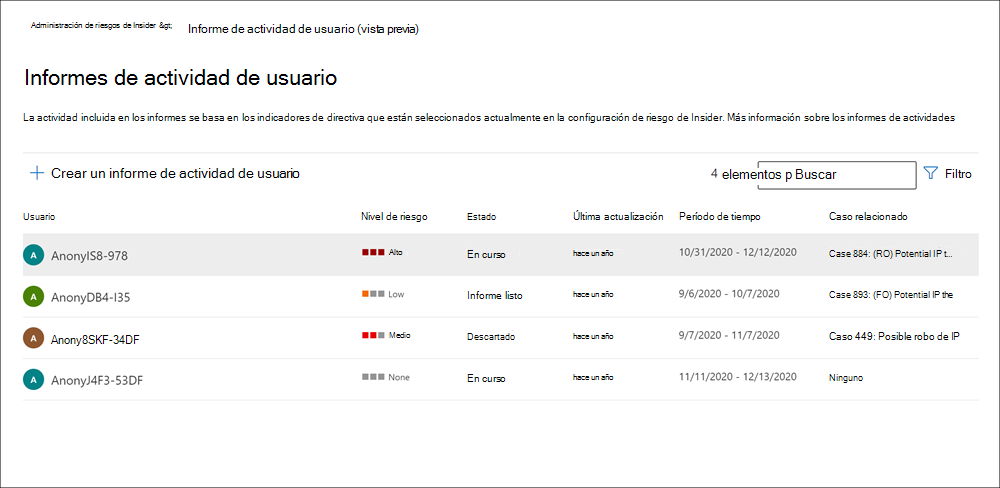

# Investigar actividades de administración de riesgos de insiderInvestigate insider risk management activities

Investigar actividades de usuario arriesgadas es un primer paso importante para minimizar los riesgos de información interna para su organización.Investigating risky user activities is an important first step in minimizing insider risks for your organization. Estos riesgos pueden ser actividades que generan alertas de directivas de administración de riesgos internas o riesgos de actividades detectadas por las directivas, pero que no crean inmediatamente una alerta de administración de riesgos internas para los usuarios.These risks may be activities that generate alerts from insider risk management policies, or risks from activities that are detected by policies but do not immediately create an insider risk management alert for users. Puede investigar estos tipos de actividades mediante los informes de actividad de usuario **(versión preliminar)** o con el panel **de alertas**.You can investigate these types of activities by using the **User activity reports (preview)** or with the **Alert dashboard**.

## Informes de actividad de usuario (versión preliminar)User activity reports (preview)

Los informes de actividad de usuario permiten examinar las actividades de usuarios específicos durante un período de tiempo definido sin tener que asignarlas de forma temporal o explícita a una directiva de administración de riesgos de insider.User activity reports allow you to examine activities for specific users for a defined time period without having to assign them temporarily or explicitly to an insider risk management policy. En la mayoría de los escenarios de administración de riesgos internas, los usuarios se definen explícitamente en las directivas y pueden tener alertas de directiva (según los eventos desencadenantes) y puntuaciones de riesgo asociadas con las actividades.In most insider risk management scenarios, users are explicitly defined in policies, and they may have policy alerts (depending on triggering events) and risk scores associated with the activities. Pero en algunos escenarios, es posible que desee examinar las actividades de los usuarios que no están definidas explícitamente en una directiva.But in some scenarios, you may want to examine the activities for users that aren't explicitly defined in a policy. Pueden ser usuarios que haya recibido una sugerencia sobre el usuario y las actividades potencialmente arriesgadas, o usuarios que normalmente no necesitan asignarse a una directiva de administración de riesgos de insider.These may be users that you've received a tip about the user and potentially risky activities, or users that typically don't need to be assigned to an insider risk management policy.

Después de configurar los indicadores en  la página de administración de riesgos Configuración información interna, se detecta actividad de usuario para la actividad de riesgo asociada con los indicadores seleccionados.After you've configured indicators on the insider risk management **Settings** page, user activity is detected for risky activity associated with the selected indicators. No es necesario configurar una directiva para que los informes de actividad de los usuarios detecten e informen actividades de riesgo por parte de los usuarios de la organización.You do not have to configure a policy for user activity reports to detect and report risky activities by users in your organization. Las actividades incluidas en los informes de actividad de usuario no requieren la activación de eventos para que se muestren las actividades.Activities included in user activity reports do not require triggering events for the activities to be displayed. Esta configuración significa que toda la actividad detectada para el usuario está disponible para su revisión, independientemente de si tiene un evento desencadenante o si crea una alerta.This configuration means that all detected activity for the user is available for review, regardless if it has a triggering event or if it creates an alert. Los informes se crean por usuario y pueden incluir todas las actividades durante un período personalizado de 90 días.Reports are created on a per-user basis and can include all activities for a custom 90-day period. No se admiten varios informes para el mismo usuario.Multiple reports for the same user aren't supported.

Después de examinar las actividades de un usuario, los investigadores pueden descartar actividades individuales como benignas, compartir o enviar por correo electrónico un vínculo al informe con otros investigadores, o elegir asignar al usuario de forma temporal o explícita a una directiva de administración de riesgos de insider.After examining activities for a user, investigators can dismiss individual activities as benign, share or email a link to the report with other investigators, or choose to assign the user temporarily or explicitly to an insider risk management policy. Los usuarios deben estar asignados al grupo de *roles Investigadores* de administración de riesgos de Insider para ver la **página Informes de actividad de** usuario.Users must be assigned to the *Insider Risk Management Investigators* role group to view the **User activity reports** page.  

Para empezar, seleccione Administrar **informes**  en la sección Investigar actividad del usuario en la página Información general sobre la administración de riesgos **de** insider.You can get started by selecting **Manage reports** in the **Investigate user activity** section on the insider risk management **Overview** page. Para ver las actividades de un usuario, seleccione primero **Crear informe** de actividad de usuario y complete los siguientes campos en el panel Nuevo informe de **actividad de** usuario:To view activities for a user, first select **Create user activity report** and complete the following fields in the **New user activity report** pane:

- **Usuario:** buscar un usuario por nombre o dirección de correo electrónico**User**: Search for a user by name or email address
- **Fecha de inicio:** use el control de calendario para seleccionar la fecha de inicio de las actividades del usuario.**Start date**: Use the calendar control to select the start date for user activities.
- **Fecha de finalización:** use el control de calendario para seleccionar la fecha de finalización de las actividades del usuario.**End date**: Use the calendar control to select the end date for user activities. La fecha de finalización seleccionada debe ser mayor que dos días después de la fecha de inicio seleccionada y no más de 90 días a partir de la fecha de inicio seleccionada.The end date selected must be greater than two days after the selected start date and no greater than 90 days from the selected start date.
Los nuevos informes suelen tardar hasta 10 horas antes de que estén listos para su revisión.New reports typically take up to 10 hours before they are ready for review. Cuando el informe esté listo, verá Informe  *listo* en la columna Estado de la página Informe de actividad de usuario.When the report is ready, you'll see *Report ready* in the **Status** column on the User activity report page. Seleccione el usuario para ver el informe detallado:Select the user to view the detailed report:

El **informe de actividad de usuario** del usuario seleccionado contiene las pestañas Actividad **de** usuario y Explorador **de** actividades:The **User activity report** for the selected user contains the **User activity** and **Activity explorer** tabs:

- **Actividad de usuario:** use esta vista de gráfico para investigar actividades y ver las actividades potenciales que se producen en secuencias.**User activity**: Use this chart view to investigate activities and view potential activities that occur in sequences. Esta pestaña está estructurada para permitir la revisión rápida de un caso, incluida una escala de tiempo histórica de todas las actividades, detalles de actividad, la puntuación de riesgo actual para el usuario en el caso, la secuencia de eventos de riesgo y controles de filtrado para ayudar con los esfuerzos de investigación.This tab is structured to enable quick review of a case, including a historical timeline of all activities, activity details, the current risk score for the user in the case, the sequence of risk events, and filtering controls to help with investigative efforts.
- **Explorador de** actividades: la **pestaña Explorador de** actividades proporciona a los investigadores de riesgos una herramienta de análisis completa que proporciona información detallada sobre las actividades.**Activity explorer**: The **Activity explorer** tab provides risk investigators with a comprehensive analytic tool that provides detailed information about activities. Con el explorador de actividades, los revisores pueden revisar rápidamente una escala de tiempo de actividad de riesgo detectada e identificar y filtrar todas las actividades de riesgo asociadas con alertas.With the Activity explorer, reviewers can quickly review a timeline of detected risky activity and identify and filter all risk activities associated with alerts. Para obtener más información sobre cómo usar el explorador de actividades, vea la sección Explorador *de* actividades más adelante en este artículo.To learn more about using the Activity explorer, see the *Activity explorer* section later in this article.

## Panel de alertasAlert dashboard

Las alertas de administración de riesgos internos se generan automáticamente a través de los indicadores de riesgo definidos en las directivas de administración de riesgos internos.Insider risk management alerts are automatically generated by risk indicators defined in insider risk management policies. Estas alertas ofrecen a los investigadores y analistas de cumplimiento una vista actualizada del estado de riesgo actual y permiten que su organización valore y tome medidas en función de los riesgos detectados.These alerts give compliance analysts and investigators an all-up view of the current risk status and allow your organization to triage and take actions for discovered risks. De forma predeterminada, las directivas generan una cierta cantidad de alertas de gravedad baja, media y alta, pero puede aumentar o disminuir el volumen de alertas según sus necesidades. By default, policies generate a certain amount of low, medium, and high severity alerts, but you can [increase or decrease the alert volume](insider-risk-management-settings.md#alert-volume) to suit your needs. Además, puede configurar el umbral de alerta para los indicadores de [directiva](insider-risk-management-settings.md#indicator-level-settings-preview) al crear una nueva directiva con el asistente para directivas.Additionally, you can configure the [alert threshold for policy indicators](insider-risk-management-settings.md#indicator-level-settings-preview) when creating a new policy with the policy wizard.

Consulte el [vídeo Insider Risk Management Alerts Triage Experience](https://www.youtube.com/watch?v=KgmpxBLJLPI) para obtener información general sobre cómo las alertas proporcionan detalles, contexto y contenido relacionado para la actividad de riesgo y cómo hacer que el proceso de investigación sea más eficaz.Check out the [Insider Risk Management Alerts Triage Experience video](https://www.youtube.com/watch?v=KgmpxBLJLPI) for an overview of how alerts provide details, context, and related content for risky activity and how to make your investigation process more effective.

El panel de alertas de riesgo **interno** le permite ver y actuar en las alertas generadas por las directivas de riesgo de insider.The insider risk **Alert dashboard** allows you to view and act on alerts generated by insider risk policies. Cada widget de informe muestra información de los últimos 30 días.Each report widget displays information for last 30 days.

- **Total de alertas que necesitan revisión:** se muestra el número total de alertas que necesitan revisión y evaluación, incluido un desglose por gravedad de alerta.**Total alerts that need review**: The total number of alerts needing review and triage are listed, including a breakdown by alert severity.
- Alertas abiertas en los últimos **30** días: el número total de alertas creadas por la directiva coincide en los últimos 30 días, ordenadas por niveles de gravedad de alerta altos, medianos y bajos.**Open alerts over past 30 days**: The total number of alerts created by policy matches over the last 30 days, sorted by high, medium, and low alert severity levels.
- **Tiempo promedio para resolver alertas:** un resumen de estadísticas de alertas útiles:**Average time to resolve alerts**: A summary of useful alert statistics:
  - Tiempo medio para resolver alertas de gravedad alta, expresado en horas, días o meses.Average time to resolve high severity alerts, listed in hours, days, or months.
  - Tiempo medio para resolver alertas de gravedad media, expresado en horas, días o meses.Average time to resolve medium severity alerts, listed in hours, days, or months.
  - Tiempo medio para resolver alertas de gravedad baja, expresado en horas, días o meses.Average time to resolve low severity alerts, listed in hours, days, or months.

> [!NOTE]
> La administración de riesgos internos usa la limitación de alertas integrada para ayudar a proteger y optimizar su investigación de riesgos y experiencia de revisión.Insider risk management uses built-in alert throttling to help protect and optimize your risk investigation and review experience. Esta limitación protege contra problemas que pueden causar una sobrecarga de alertas de directiva, como conectores de datos mal configurados o directivas DLP.This throttling guards against issues that might result in an overload of policy alerts, such as misconfigured data connectors or DLP policies. Como resultado, es posible que haya un retraso al mostrar nuevas alertas para un usuario.As a result, there might be a delay in displaying new alerts for a user.

## Estado de alerta y gravedadAlert status and severity

Puede realizar una triage de alertas en uno de los siguientes estados:You can triage alerts into one of the following statuses:

- **Confirmado:** una alerta confirmada y asignada a un caso nuevo o existente.**Confirmed**: An alert confirmed and assigned to a new or existing case.
- **Descartado:** una alerta descartada como benigna en el proceso de evaluación.**Dismissed**: An alert dismissed as benign in the triage process.
- **Revisión de** necesidades: una nueva alerta en la que aún no se han realizado acciones de evaluación.**Needs review**: A new alert where triage actions have not yet been taken.
- **Resuelto:** una alerta que forma parte de un caso cerrado y resuelto.**Resolved**: An alert that is part of a closed and resolved case.

Las puntuaciones de riesgo de alerta se calculan automáticamente a partir de varios indicadores de actividad de riesgo.Alert risk scores are automatically calculated from several risk activity indicators. Estos indicadores incluyen el tipo de actividad de riesgo, el número y la frecuencia de la aparición de la actividad, el historial de actividad de riesgo del usuario y la adición de riesgos de actividad que pueden aumentar la gravedad de la actividad.These indicators include the type of risk activity, the number and frequency of the activity occurrence, the history of user risk activity, and the addition of activity risks that may boost the seriousness of the activity. La puntuación de riesgo de la alerta impulsa la asignación mediante la programación de un nivel de gravedad de riesgo para cada alerta y no se puede personalizar.The alert risk score drives the programmatic assignment of a risk severity level for each alert and cannot be customized. Si las alertas siguen sin evaluarse y las actividades de riesgo siguen acumulándose en la alerta, el nivel de gravedad del riesgo puede aumentar.If alerts remain untriaged and risk activities continue to accrue to the alert, the risk severity level can increase. Los analistas e investigadores de riesgos pueden usar la gravedad del riesgo de alerta para ayudar a evaluar las alertas de acuerdo con las directivas y estándares de riesgo de su organización.Risk analysts and investigators can use the alert risk severity to help triage alerts in accordance with your organization's risk policies and standards.

Los niveles de gravedad del riesgo de alerta son:Alert risk severity levels are:

- **Gravedad alta:** las actividades e indicadores de la alerta representan un riesgo significativo.**High severity**: The activities and indicators for the alert pose significant risk. Las actividades de riesgo asociadas son graves, repetitivas y se acentúan con fuerza a otros factores de riesgo significativos.The associated risk activities are serious, repetitive, and corelate strongly to other significant risk factors.
- **Gravedad media:** las actividades e indicadores de la alerta representan un riesgo moderado.**Medium severity**: The activities and indicators for the alert pose a moderate risk. Las actividades de riesgo asociadas son moderados, frecuentes y tienen cierta correlación con otros factores de riesgo.The associated risk activities are moderate, frequent, and have some correlation to other risk factors.
- **Gravedad baja:** las actividades e indicadores de la alerta representan un riesgo menor.**Low severity**: The activities and indicators for the alert pose a minor risk. Las actividades de riesgo asociadas son menores, más poco frecuentes y no se pueden realizar en otros factores de riesgo significativos.The associated risk activities are minor, more infrequent, and do not corelate to other significant risk factors.

## Filtrar alertas en el panel de alertasFilter alerts on the Alert dashboard

Según el número y el tipo de directivas activas de administración de riesgos internos de su organización, revisar una larga cola de alertas puede ser todo un reto.Depending on the number and type of active insider risk management policies in your organization, reviewing a large queue of alerts can be challenging. El uso de filtros de alerta puede ayudar a los analistas e investigadores a ordenar las alertas por varios atributos.Using alert filters can help analysts and investigators sort alerts by several attributes. Para filtrar alertas en el **panel de alertas,** seleccione el control **Filtro.**To filter alerts on the **Alerts dashboard**, select the **Filter** control. Puede filtrar alertas por uno o varios atributos:You can filter alerts by one or more attributes:

- **Estado:** seleccione uno o más valores de estado para filtrar la lista de alertas.**Status**: Select one or more status values to filter the alert list. Las opciones son *Confirmada*, *Descartada*, *Falta por revisar*, y *Resuelta*.The options are *Confirmed*, *Dismissed*, *Needs review*, and *Resolved*.
- **Gravedad:** seleccione uno o más niveles de gravedad de riesgo de alerta para filtrar la lista de alertas.**Severity**: Select one or more alert risk severity levels to filter the alert list. Las opciones son *Alta*, *Media*, y *Baja*.The options are *High*, *Medium*, and *Low*.
- **Hora detectada:** seleccione las fechas de inicio y finalización para cuando se creó la alerta.**Time detected**: Select the start and end dates for when the alert was created.
- **Directiva:** seleccione una o varias directivas para filtrar las alertas generadas por las directivas seleccionadas.**Policy**: Select one or more policies to filter the alerts generated by the selected policies.

## Alertas de búsqueda en el panel de alertasSearch alerts on the Alert dashboard

Para buscar una palabra específica en el nombre de la alerta, seleccione el control **Búsqueda** y escriba la palabra que desea buscar.To search the alert name for a specific word, select the **Search** control and type the word to search. Los resultados de búsqueda muestran cualquier alerta de directiva que contenga la palabra definida en la búsqueda.The search results display any policy alert containing the word defined in the search.

## Alertas de triajeTriage alerts

Para realizar una evaluación de una alerta de riesgo insider, siga estos pasos:To triage an insider risk alert, complete the following steps:

1. En el [Centro de cumplimiento de Microsoft 365](https://compliance.microsoft.com), vaya a Administración de riesgos de **Insider** y seleccione la **pestaña** Alertas.In the [Microsoft 365 compliance center](https://compliance.microsoft.com), go to **Insider risk management** and select the **Alerts** tab.
2. En el **panel De alertas,** seleccione la alerta que desea triage.On the **Alerts dashboard**, select the alert you want to triage.
3. En el **panel de detalles Alertas,** puede revisar las siguientes pestañas y realizar una evaluación de la alerta:On the **Alerts detail pane**, you can review the following tabs and triage the alert:
    - **Resumen:** esta pestaña contiene información general sobre la alerta y le permite confirmar la alerta y crear un nuevo caso o le permite descartar la alerta.**Summary**: This tab contains general information about the alert and allows you to confirm the alert and create a new case or allows you to dismiss the alert. Incluye el estado actual de la alerta y el nivel de gravedad del riesgo de alerta, enumerados como *High*, *Medium* o *Low*.It includes the current status for the alert and the alert risk severity level, listed as *High*, *Medium*, or *Low*. El nivel de gravedad puede aumentar o disminuir con el tiempo si la alerta no está triaged.The severity level may increase or decrease over time if the alert is not triaged.
        - **Qué sucedió (versión preliminar):** muestra las tres actividades de riesgo y las coincidencias de directiva principales durante el período de evaluación de actividad, incluido el tipo de infracción asociada a la actividad y el número de repeticiones.**What happened (preview)**: Displays the top three risk activities and policy matches during the activity evaluation period, including the type of violation associated with the activity and the number of occurrences.
        - **Detalles del usuario:** muestra información general sobre el usuario asignado a la alerta.**User details**: Displays general information about the user assigned to the alert. Si la anonimización está habilitada, los campos nombre de usuario, dirección de correo electrónico, alias y organización se anonimizan.If anonymization is enabled, the username, email address, alias, and organization fields are anonymized.
        - **Detalles de** la alerta: incluye el período de tiempo desde que se generó la alerta, se enumeran las directivas que generaron la alerta y se muestra el caso generado a partir de la alerta.**Alert details**: Includes the length of time since the alert was generated, the policies that generated the alert are listed, and the case generated from the alert is listed. Para las alertas nuevas, el **campo Caso** muestra Ninguno.For new alerts, the **Case** field displays None.
        - **Contenido detectado (versión preliminar):** incluye contenido asociado a las actividades de riesgo de la alerta y resume los eventos de actividad por áreas clave.**Content detected (preview)**: Includes content associated with the risk activities for the alert and summarizes activity events by key areas. Al seleccionar un vínculo de actividad, se abre el explorador de actividades y se muestran detalles adicionales sobre la actividad.Selecting an activity link opens the Activity explorer and displays additional details about the activity.
    - **Actividad de usuario:** esta pestaña muestra el historial de actividades del usuario asociado a la alerta.**User activity**: This tab displays the activity history for the user associated with the alert. Este historial incluye otras alertas y actividades relacionadas con los indicadores de riesgo definidos en la plantilla asignada a la directiva para esta alerta.This history includes other alerts and activities related to risk indicators defined in the template assigned to the policy for this alert. Este historial permite a los analistas de riesgos e investigadores tener en cuenta cualquier comportamiento de riesgo pasado para el empleado como parte del proceso de evaluación.This history allows risk analysts and investigators to factor in any past risky behavior for the employee as part of the triage process.
    - **Acciones:** las siguientes acciones están disponibles para cada alerta:**Actions**: The following actions are available for each alert:
        - **Vista expandida abierta:** abre el panel **del explorador de** actividades.**Open expanded view**: Opens the **Activity explorer** dashboard.
        - **Confirmar y crear caso:** use esta acción para confirmar y crear un nuevo caso para todas las alertas asociadas con un usuario.**Confirm and create case**: Use this action to confirm and create a new case for all the alerts associated with a user. Esta acción cambia automáticamente el estado de alerta a *Confirmado*.This action automatically changes the alert status to *Confirmed*.
        - **Descartar alerta:** use esta acción para descartar la alerta.**Dismiss alert**: Use this action to dismiss the alert. Esta acción cambia el estado de alerta a *Resuelto*.This action changes the alert status to *Resolved*.

## Explorador de actividades (versión preliminar)Activity explorer (preview)

> [!NOTE]
> El explorador de actividades está disponible en el área de administración de alertas para usuarios con eventos desencadenados después de que esta característica esté disponible en la organización.Activity explorer is available in the alert management area for users with triggering events after this feature is available in your organization.

El explorador de actividades proporciona a los investigadores y analistas de riesgos una herramienta de análisis completa que proporciona información detallada sobre las alertas.The Activity explorer provides risk investigators and analysts with a comprehensive analytic tool that provides detailed information about alerts. Con el explorador de actividades, los revisores pueden revisar rápidamente una escala de tiempo de actividad de riesgo detectada e identificar y filtrar todas las actividades de riesgo asociadas con alertas.With the Activity explorer, reviewers can quickly review a timeline of detected risky activity and identify and filter all risk activities associated with alerts. Para filtrar alertas en el Explorador de actividades, seleccione el control Filtro.To filter alerts on the Activity explorer, select the Filter control. Puede filtrar las alertas por uno o varios atributos enumerados en el panel de detalles de la alerta.You can filter alerts by one or more attributes listed in the details pane for the alert. El explorador de actividades también admite columnas personalizables para ayudar a los investigadores y analistas a centrar el panel en la información más importante para ellos.Activity explorer also supports customizable columns to help investigators and analysts focus the dashboard on the information most important to them.

Para usar el **explorador de actividades,** siga estos pasos:To use the **Activity explorer**, complete the following steps:

1. En el Centro de cumplimiento de Microsoft 365, vaya a Administración de riesgos **de Insider** y seleccione la **pestaña** Alertas.In the Microsoft 365 compliance center, go to **Insider risk management** and select the **Alerts** tab.
2. En el **panel De alertas,** seleccione la alerta que desea triage.On the **Alerts dashboard**, select the alert you want to triage.
3. En el **panel de detalles Alertas,** **seleccione Abrir vista expandida**.On the **Alerts detail pane**, select **Open expanded view**.
4. En la página de la alerta seleccionada, seleccione la **pestaña Explorador de** actividades.On the page for the selected alert, select the **Activity explorer** tab.

Al revisar las actividades en el explorador de actividades, los investigadores y analistas pueden seleccionar una actividad específica y abrir el panel de detalles de la actividad.When reviewing activities in the Activity explorer, investigators and analysts can select a specific activity and open the activity details pane. El panel muestra información detallada sobre la actividad que los investigadores y analistas pueden usar durante el proceso de evaluación de alertas.The pane displays detailed information about the activity that investigators and analysts can use during the alert triage process. La información detallada puede proporcionar contexto para la alerta y ayudar a identificar el ámbito completo de la actividad de riesgo que desencadenó la alerta.The detailed information may provide context for the alert and assist with identifying the full scope of the risk activity that triggered the alert.

## Crear un caso para una alertaCreate a case for an alert

A medida que se revisa y se revisa la alerta, puede crear un nuevo caso para investigar aún más la actividad de riesgo.As alert is reviewed and triaged, you can create a new case to further investigate the risk activity. Para crear un caso para una alerta, siga estos pasos:To create a case for an alert, follow these steps:

1. En el [Centro de cumplimiento de Microsoft 365](https://compliance.microsoft.com), vaya a Administración de riesgos de **Insider** y seleccione la **pestaña** Alertas.In the [Microsoft 365 compliance center](https://compliance.microsoft.com), go to **Insider risk management** and select the **Alerts** tab.
2. En el **panel De alertas,** seleccione la alerta para la que desea confirmar y crear un nuevo caso.On the **Alerts dashboard**, select the alert you want to confirm and create a new case for.
3. En el **panel Detalles de alertas,** seleccione **Acciones**  >  **Confirmar alertas & crear caso**.On the **Alerts details pane**, select **Actions** > **Confirm alerts & create case**.
4. En el **cuadro de diálogo** Confirmar alerta y crear caso de riesgo interno, escriba un nombre para el caso, seleccione usuarios para agregar como colaboradores y agregue comentarios según corresponda.On the **Confirm alert and create insider risk case** dialog, enter a name for the case, select users to add as contributors, and add comments as applicable. Los comentarios se agregan automáticamente al caso como nota de caso.Comments are automatically added to the case as a case note.
5. Seleccione **Crear caso** para crear un nuevo caso o **cancelar** para cerrar el cuadro de diálogo sin crear un caso.Select **Create case** to create a new case or select **Cancel** to close the dialog without creating a case.

Una vez creado el caso, los investigadores y analistas pueden administrar y actuar en el caso.After the case is created, investigators and analysts can manage and act on the case. Para obtener más información, consulte el artículo sobre casos de administración [de riesgos de Insider.](insider-risk-management-cases.md)For more information, see the [Insider risk management case](insider-risk-management-cases.md) article.
