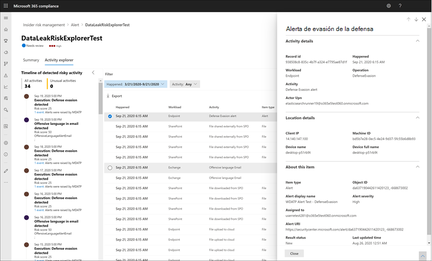

# Alertas de administración de riesgos de InsiderInsider risk management alerts

Las alertas de administración de riesgos de Insider se generan automáticamente mediante indicadores de riesgo definidos en las directivas de administración de riesgos internas.Insider risk management alerts are automatically generated by risk indicators defined in insider risk management policies. Estas alertas dan a los analistas e investigadores de cumplimiento una vista general del estado de riesgo actual y permiten a su organización realizar una evaluación y tomar medidas para los riesgos detectados.These alerts give compliance analysts and investigators an all-up view of the current risk status and allow your organization to triage and take actions for discovered risks. De forma predeterminada, las directivas generan una cierta cantidad de alertas de gravedad baja, media y alta, pero puedes aumentar o disminuir el volumen de alertas para adaptarlo a tus necesidades. By default, policies generate a certain amount of low, medium, and high severity alerts, but you can [increase or decrease the alert volume](insider-risk-management-settings.md#alert-volume) to suit your needs. Además, puedes configurar el umbral de alerta para los indicadores de [directiva](insider-risk-management-settings.md#indicator-level-settings-preview) al crear una nueva directiva con el asistente para directivas.Additionally, you can configure the [alert threshold for policy indicators](insider-risk-management-settings.md#indicator-level-settings-preview) when creating a new policy with the policy wizard.

## Panel de alertasAlert dashboard

El panel de **alertas de** riesgo interno te permite ver y actuar sobre las alertas generadas por las directivas de riesgo de Insider.The insider risk **Alert dashboard** allows you to view and act on alerts generated by insider risk policies. Cada widget de informe muestra información de los últimos 30 días.Each report widget displays information for last 30 days.

- **Alertas para revisar:** se muestra el número total de alertas que necesitan revisión y evaluación, incluido un desglose por gravedad de alerta.**Alerts to review**: The total number of alerts needing review and triage are listed, including a breakdown by alert severity.
- **Open alerts over past 30 days:** The total number of alerts created by policy matches over the last 30 days, sorted by high, medium, and low alert severity levels.**Open alerts over past 30 days**: The total number of alerts created by policy matches over the last 30 days, sorted by high, medium, and low alert severity levels.
- **Tiempo promedio para resolver alertas:** un resumen de estadísticas de alertas útiles:**Average time to resolve alerts**: A summary of useful alert statistics:
    - Tiempo promedio para resolver alertas de gravedad alta, enumeradas en horas, días o meses.Average time to resolve high severity alerts, listed in hours, days, or months.
    - Tiempo medio para resolver alertas de gravedad media, enumeradas en horas, días o meses.Average time to resolve medium severity alerts, listed in hours, days, or months.
    - Tiempo promedio para resolver alertas de gravedad baja, enumeradas en horas, días o meses.Average time to resolve low severity alerts, listed in hours, days, or months.

>[!NOTE]
>La administración de riesgos de Insider usa la limitación de alertas integrada para ayudar a proteger y optimizar la experiencia de investigación y revisión de riesgos.Insider risk management uses built-in alert throttling to help protect and optimize your risk investigation and review experience. Esta limitación protege contra problemas que pueden provocar una sobrecarga de alertas de directiva, como conectores de datos mal configurados o directivas DLP.This throttling guards against issues that might result in an overload of policy alerts, such as misconfigured data connectors or DLP policies. Como resultado, puede haber un retraso en la visualización de nuevas alertas para un usuario.As a result, there might be a delay in displaying new alerts for a user.

## Estado y gravedad de la alertaAlert status and severity

Puedes realizar una triage de las alertas en uno de los siguientes estados:You can triage alerts into one of the following statuses:

- **Confirmado:** alerta confirmada y asignada a un caso nuevo o existente.**Confirmed**: An alert confirmed and assigned to a new or existing case.
- **Descartado:** una alerta descartada como benigna en el proceso de evaluación.**Dismissed**: An alert dismissed as benign in the triage process.
- **Necesita revisión:** una nueva alerta en la que aún no se han realizado acciones de evaluación.**Needs review**: A new alert where triage actions have not yet been taken.
- **Resuelto:** alerta que forma parte de un caso cerrado y resuelto.**Resolved**: An alert that is part of a closed and resolved case.

Las puntuaciones de riesgo de alerta se calculan automáticamente a partir de varios indicadores de actividad de riesgo.Alert risk scores are automatically calculated from several risk activity indicators. Estos indicadores incluyen el tipo de actividad de riesgo, el número y la frecuencia de la repetición de la actividad, el historial de actividad de riesgo de usuario y la adición de riesgos de actividad que pueden aumentar la gravedad de la actividad.These indicators include the type of risk activity, the number and frequency of the activity occurrence, the history of user risk activity, and the addition of activity risks that may boost the seriousness of the activity. La puntuación de riesgo de alerta dirige la asignación mediante programación de un nivel de gravedad de riesgo para cada alerta y no se puede personalizar.The alert risk score drives the programmatic assignment of a risk severity level for each alert and cannot be customized. Si las alertas siguen sin evaluarse y las actividades de riesgo siguen acumulándose a la alerta, el nivel de gravedad del riesgo puede aumentar.If alerts remain untriaged and risk activities continue to accrue to the alert, the risk severity level can increase. Los analistas e investigadores de riesgos pueden usar la gravedad de riesgo de alerta para ayudar a evaluar las alertas de acuerdo con las directivas y estándares de riesgo de su organización.Risk analysts and investigators can use the alert risk severity to help triage alerts in accordance with your organization's risk policies and standards.

Los niveles de gravedad de riesgo de alerta son:Alert risk severity levels are:

- **Gravedad alta: las** actividades y los indicadores de la alerta representan un riesgo significativo.**High severity**: The activities and indicators for the alert pose significant risk. Las actividades de riesgo asociadas son graves, repetitivas y se relacionan con otros factores de riesgo importantes.The associated risk activities are serious, repetitive, and corelate strongly to other significant risk factors.
- **Gravedad media:** las actividades y los indicadores de la alerta representan un riesgo moderado.**Medium severity**: The activities and indicators for the alert pose a moderate risk. Las actividades de riesgo asociadas son moderadas, frecuentes y tienen cierta correlación con otros factores de riesgo.The associated risk activities are moderate, frequent, and have some correlation to other risk factors.
- **Gravedad baja:** las actividades y los indicadores de la alerta representan un riesgo menor.**Low severity**: The activities and indicators for the alert pose a minor risk. Las actividades de riesgo asociadas son menores, más poco frecuentes y no se reducen a otros factores de riesgo significativos.The associated risk activities are minor, more infrequent, and do not corelate to other significant risk factors.

## Filtrar alertas en el panel de alertasFilter alerts on the Alert dashboard

Según el número y el tipo de directivas de administración de riesgos internas activas de la organización, revisar una cola grande de alertas puede ser difícil.Depending on the number and type of active insider risk management policies in your organization, reviewing a large queue of alerts can be challenging. El uso de filtros de alerta puede ayudar a los analistas e investigadores a ordenar las alertas por varios atributos.Using alert filters can help analysts and investigators sort alerts by several attributes. Para filtrar alertas en el panel **alertas,** seleccione el control **de** filtro.To filter alerts on the **Alerts dashboard**, select the **Filter** control. Puedes filtrar las alertas por uno o varios atributos:You can filter alerts by one or more attributes:

- **Estado:** seleccione uno o más valores de estado para filtrar la lista de alertas.**Status**: Select one or more status values to filter the alert list. Las opciones son *Confirmado,* *Descartado*, *Necesita revisión* y *Resuelto.*The options are *Confirmed*, *Dismissed*, *Needs review*, and *Resolved*.
- **Gravedad:** seleccione uno o más niveles de gravedad de riesgo de alerta para filtrar la lista de alertas.**Severity**: Select one or more alert risk severity levels to filter the alert list. Las opciones son *Alta,* *Media* y *Baja.*The options are *High*, *Medium*, and *Low*.
- **Hora detectada:** seleccione las fechas de inicio y finalización para cuando se creó la alerta.**Time detected**: Select the start and end dates for when the alert was created.
- **Directiva:** seleccione una o más directivas para filtrar las alertas generadas por las directivas seleccionadas.**Policy**: Select one or more policies to filter the alerts generated by the selected policies.

## Buscar alertas en el panel de alertasSearch alerts on the Alert dashboard

Para buscar una palabra específica en el nombre de la alerta, seleccione el control **de** búsqueda y escriba la palabra en la que buscar.To search the alert name for a specific word, select the **Search** control and type the word to search. Los resultados de la búsqueda muestran cualquier alerta de directiva que contenga la palabra definida en la búsqueda.The search results display any policy alert containing the word defined in the search.

## Alertas de triageTriage alerts

Para realizar una evaluación de una alerta de riesgo interno, siga estos pasos:To triage an insider risk alert, complete the following steps:

1. En el [Centro de cumplimiento de Microsoft 365,](https://compliance.microsoft.com)vaya a Administración de riesgos de **Insider** y seleccione la **pestaña Alertas.**In the [Microsoft 365 compliance center](https://compliance.microsoft.com), go to **Insider risk management** and select the **Alerts** tab.
2. En el **panel Alertas,** selecciona la alerta que quieras triage.On the **Alerts dashboard**, select the alert you want to triage.
3. En el **panel de detalles alertas,** puede revisar las siguientes pestañas y realizar una evaluación de la alerta:On the **Alerts detail pane**, you can review the following tabs and triage the alert:
    - **Resumen:** esta pestaña contiene información general sobre la alerta y le permite confirmar la alerta y crear un nuevo caso o le permite descartar la alerta.**Summary**: This tab contains general information about the alert and allows you to confirm the alert and create a new case or allows you to dismiss the alert. Incluye el estado actual de la alerta y el nivel de gravedad de riesgo de alerta, enumerado como *Alto,* *Medio* o *Bajo.*It includes the current status for the alert and the alert risk severity level, listed as *High*, *Medium*, or *Low*. El nivel de gravedad puede aumentar o disminuir con el tiempo si la alerta no se ha recortado.The severity level may increase or decrease over time if the alert is not triaged.
        - **Qué ha ocurrido:** muestra las tres actividades de riesgo principales y coincidencias de directivas durante el período de evaluación de la actividad, incluido el tipo de infracción asociada a la actividad.**What happened**: Displays the top three risk activities and policy matches during the activity evaluation period, including the type of violation associated with the activity.
        - **Detalles del usuario:** muestra información general sobre el usuario asignado a la alerta.**User details**: Displays general information about the user assigned to the alert. Si la anonimización está habilitada, el nombre de usuario, la dirección de correo electrónico, el alias y los campos de la organización se anonimizan.If anonymization is enabled, the username, email address, alias, and organization fields are anonymized.
        - **Detalles de** la alerta: incluye el período de tiempo desde que se generó la alerta, se enumeran las directivas que generaron la alerta y se muestra el caso generado a partir de la alerta.**Alert details**: Includes the length of time since the alert was generated, the policies that generated the alert are listed, and the case generated from the alert is listed. Para las nuevas alertas, el **campo Caso** muestra Ninguno.For new alerts, the **Case** field displays None.
        - **Contenido detectado:** incluye contenido asociado a las actividades de riesgo de la alerta y resume los eventos de actividad por áreas clave.**Content detected**: Includes content associated with the risk activities for the alert and summarizes activity events by key areas. Al seleccionar un vínculo de actividad, se abre el Explorador de actividades y se muestran detalles adicionales sobre la actividad.Selecting an activity link opens the Activity explorer and displays additional details about the activity.
    - **Actividad de usuario:** esta pestaña muestra el historial de actividades del usuario asociado a la alerta.**User activity**: This tab displays the activity history for the user associated with the alert. Este historial incluye otras alertas y actividades relacionadas con los indicadores de riesgo definidos en la plantilla asignada a la directiva para esta alerta.This history includes other alerts and activities related to risk indicators defined in the template assigned to the policy for this alert. Este historial permite a los analistas de riesgos e investigadores tener en cuenta cualquier comportamiento de riesgo pasado para el empleado como parte del proceso de evaluación.This history allows risk analysts and investigators to factor in any past risky behavior for the employee as part of the triage process.
    - **Acciones:** las siguientes acciones están disponibles para cada alerta:**Actions**: The following actions are available for each alert:
        - **Vista expandida abierta:** abre el panel **del Explorador de** actividades.**Open expanded view**: Opens the **Activity explorer** dashboard.
        - **Confirmar y crear caso:** use esta acción para confirmar y crear un nuevo caso para todas las alertas asociadas con un usuario.**Confirm and create case**: Use this action to confirm and create a new case for all the alerts associated with a user. Esta acción cambia automáticamente el estado de alerta a *Confirmado*.This action automatically changes the alert status to *Confirmed*.
        - **Descartar alerta:** use esta acción para descartar la alerta.**Dismiss alert**: Use this action to dismiss the alert. Esta acción cambia el estado de alerta a *Resuelto.*This action changes the alert status to *Resolved*.

## Explorador de actividades (versión preliminar)Activity explorer (preview)

>[!NOTE]
>El explorador de actividades está disponible en el área de administración de alertas para los usuarios con eventos desencadenados después de que esta característica esté disponible en la organización.Activity explorer is available in the alert management area for users with triggering events after this feature is available in your organization.

El explorador de actividades proporciona a los analistas y investigadores de riesgos una herramienta analítica completa que proporciona información detallada sobre las alertas.The Activity explorer provides risk investigators and analysts with a comprehensive analytic tool that provides detailed information about alerts. Con el explorador de actividades, los revisores pueden revisar rápidamente una escala de tiempo de actividad de riesgo detectada e identificar y filtrar todas las actividades de riesgo asociadas con las alertas.With the Activity explorer, reviewers can quickly review a timeline of detected risky activity and identify and filter all risk activities associated with alerts. Para filtrar alertas en el Explorador de actividades, seleccione el control Filtro.To filter alerts on the Activity explorer, select the Filter control. Puedes filtrar las alertas por uno o más atributos enumerados en el panel de detalles de la alerta.You can filter alerts by one or more attributes listed in the details pane for the alert. El explorador de actividades también admite columnas personalizables para ayudar a los investigadores y analistas a centrar el panel en la información más importante para ellos.Activity explorer also supports customizable columns to help investigators and analysts focus the dashboard on the information most important to them.

Para usar el **Explorador de actividades,** siga estos pasos:To use the **Activity explorer**, complete the following steps:

1. En el Centro de cumplimiento de Microsoft 365, vaya a Administración de riesgos de **Insider** y seleccione la **pestaña Alertas.**In the Microsoft 365 compliance center, go to **Insider risk management** and select the **Alerts** tab.
2. En el **panel Alertas,** selecciona la alerta que quieras triage.On the **Alerts dashboard**, select the alert you want to triage.
3. En el panel **de detalles Alertas,** seleccione **Abrir vista expandida.**On the **Alerts detail pane**, select **Open expanded view**.
4. En la página de la alerta seleccionada, seleccione la **pestaña Explorador de** actividades.On the page for the selected alert, select the **Activity explorer** tab.

Al revisar las actividades en el explorador de actividades, los investigadores y analistas pueden seleccionar una actividad específica y abrir el panel de detalles de la actividad.When reviewing activities in the Activity explorer, investigators and analysts can select a specific activity and open the activity details pane. El panel muestra información detallada sobre la actividad que los investigadores y analistas pueden usar durante el proceso de evaluación de alertas.The pane displays detailed information about the activity that investigators and analysts can use during the alert triage process. La información detallada puede proporcionar contexto para la alerta y ayudar a identificar el ámbito completo de la actividad de riesgo que desencadenó la alerta.The detailed information may provide context for the alert and assist with identifying the full scope of the risk activity that triggered the alert.

## Crear un caso para una alertaCreate a case for an alert

A medida que la alerta se revisa y se revisa, puede crear un nuevo caso para investigar aún más la actividad de riesgo.As alert is reviewed and triaged, you can create a new case to further investigate the risk activity. Para crear un caso para una alerta, siga estos pasos:To create a case for an alert, follow these steps:

1. En el [Centro de cumplimiento de Microsoft 365,](https://compliance.microsoft.com)vaya a Administración de riesgos de **Insider** y seleccione la **pestaña Alertas.**In the [Microsoft 365 compliance center](https://compliance.microsoft.com), go to **Insider risk management** and select the **Alerts** tab.
2. En el **panel alertas,** seleccione la alerta para la que desea confirmar y crear un nuevo caso.On the **Alerts dashboard**, select the alert you want to confirm and create a new case for.
3. En el panel **de detalles de alertas,** seleccione **Acciones**  >  **Confirmar alertas & crear caso.**On the **Alerts details pane**, select **Actions** > **Confirm alerts & create case**.
4. En el **cuadro de diálogo** Confirmar alerta y crear casos de riesgo interno, escriba un nombre para el caso, seleccione los usuarios que desea agregar como colaboradores y agregue comentarios según corresponda.On the **Confirm alert and create insider risk case** dialog, enter a name for the case, select users to add as contributors, and add comments as applicable. Los comentarios se agregan automáticamente al caso como nota de caso.Comments are automatically added to the case as a case note.
5. Seleccione **Crear caso** para crear un nuevo caso o Cancelar para cerrar el cuadro de diálogo sin crear un caso. Select **Create case** to create a new case or select **Cancel** to close the dialog without creating a case.

Una vez creado el caso, los investigadores y analistas pueden administrar y actuar en el caso.After the case is created, investigators and analysts can manage and act on the case. Consulta el artículo [sobre casos de administración de riesgos de Insider](insider-risk-management-cases.md) para obtener más información.See the [Insider risk management case](insider-risk-management-cases.md) article for more details.
