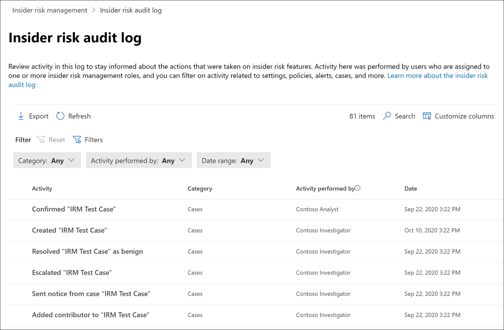

# Registro de auditoría de administración de riesgos internos

>[!IMPORTANT]
>Administración de riesgos internos de Microsoft Purview correlaciona varias señales para identificar posibles riesgos internos malintencionados o involuntarios, como el robo de IP, la pérdida de datos y las infracciones de seguridad. La administración de riesgos internos permite a los clientes crear directivas para administrar la seguridad y el cumplimiento. Creados con privacidad por diseño, los usuarios se seudonimizan de forma predeterminada y los controles de acceso basados en roles y los registros de auditoría están en su lugar para ayudar a garantizar la privacidad del nivel de usuario.

El registro de auditoría de administración de riesgos internos le permite mantenerse informado sobre las acciones realizadas en las características de administración de riesgos internos. Este registro permite una revisión independiente de las acciones realizadas por los usuarios asignados a uno o varios grupos de roles de administración de riesgos internos. El registro de auditoría de administración de riesgos internos se habilita automáticamente en su organización y no se puede deshabilitar.

El registro de auditoría se actualiza de forma automática e inmediata siempre que se detecten actividades de riesgo identificadas. El registro de auditoría conserva información durante 180 días (unos seis meses). Después de 180 días, los datos se eliminan permanentemente del registro.

Las áreas de la detección de actividad de riesgo identificada incluyen:

- Directivas
- Casos
- Alertas
- Configuración
- Usuarios
- Plantillas de aviso

Para ver y exportar datos desde el registro de auditoría, los usuarios deben estar asignados a los grupos de roles *Insider Risk Management* o *Insider Risk Management Auditors* . Para obtener más información sobre los grupos de roles de administración de riesgos internos, consulte [Introducción a la administración de riesgos internos Paso 1: Habilitar permisos](insider-risk-management-configure.md#step-1-required-enable-permissions-for-insider-risk-management).

> [!NOTE]
> El registro de auditoría de administración de riesgos internos no está asociado al registro de auditoría de Microsoft 365, ya que son sistemas de auditoría independientes y capturan información sobre áreas independientes. Deshabilitar la auditoría de Microsoft 365 no afecta a la auditoría de actividad dentro de la administración de riesgos internos.

[!INCLUDE [purview-preview](../includes/purview-preview.md)]

## Visualización de la actividad en el registro de auditoría de riesgos internos

Para ver la actividad de características detectada para la administración de riesgos internos, vaya a y seleccione el vínculo **Registro de auditoría de riesgos** internos en el área superior derecha de cualquier pestaña de administración de riesgos internos. De forma predeterminada, verá la siguiente información para las actividades de administración de riesgos internos:

- **Actividad:** Descripción de la actividad de riesgo identificada tomada dentro de la solución de administración de riesgos internos por un usuario.
- **Categoría:** Área o elemento donde se realizó la actividad de riesgo identificada. Por ejemplo, verá *Directivas* como la categoría cuando se realizaron actividades de cambio de directiva.
- **Actividad realizada por:** Nombre de usuario del usuario que realizó la actividad de riesgo identificada.
- **Fecha:** Fecha y hora en que se realizó la actividad de riesgo identificada. La fecha y hora son la fecha y hora locales de su organización.

Para obtener más información sobre una actividad registrada, seleccione la actividad para mostrar el panel de detalles de la actividad. Este panel incluye información adicional sobre la actividad de riesgo identificada.

## Columnas y filtrado

Para facilitar a los auditores la revisión de los registros de auditoría, el filtrado se admite en el **registro de auditoría de riesgos de Insider**. Para el filtrado básico, las columnas de cola están disponibles para agregarlas a la vista con el fin de proporcionar diferentes dinámicas en los archivos y mensajes. Puede filtrar las actividades de riesgo identificadas por los campos **Categoría, Intervalo de fechas** y **Actividad realizada por** .

Para agregar o quitar encabezados de columna para la cola, use el control **Personalizar columnas** y seleccione en las opciones de columna. Estas columnas se asignan a condiciones comunes admitidas en el **registro de auditoría de riesgos de Insider** y se enumeran más adelante en este artículo.

## Exportación de registros de auditoría

Los usuarios asignados a los grupos de roles *Insider Risk Management* o *Insider Risk Management Auditors* pueden exportar la actividad del registro de auditoría a un archivo .csv (valores separados por comas) seleccionando **Exportar** en la página **Registro de auditoría de riesgos** internos. En función de la actividad de registro de auditoría, es posible que algunos campos no se incluyan en la cola filtrada y, por tanto, esos campos aparecerán en blanco en el archivo exportado.

El archivo contiene información de actividad del registro de auditoría para los campos siguientes:

- **Actividad realizada por:** Nombre del usuario que modifica un valor de elemento. Los usuarios enumerados aquí se han asignado a uno o varios de los siguientes grupos de roles de [administración de riesgos internos](insider-risk-management-configure.md#step-1-required-enable-permissions-for-insider-risk-management): *Insider Risk Management*, *Insider Risk Management Admins*, *Insider Risk Management Analysts*, *Insider Risk Management Investigators*. Cada grupo de roles tiene distintos niveles de permisos para administrar las características de riesgo internos.
- **Actividad:** Tipo de actividad realizada en un elemento. Los valores son *Viewed, Deleted, Added, Edit policy, Case, User, Alert* y *Settings.*
- **Agregado**: objetos que se agregaron durante la actividad de riesgo identificada, como usuarios, tipos de archivo o dominios.
- **Volumen de alertas**: nivel de volumen de alertas definido en la configuración de administración de riesgos internos.
- **Importe**: importes de indicador personalizados seleccionados actualmente para una directiva.
- **Id. de recurso**: id. de recurso del recurso físico de prioridad en el que se realizó la actividad.
- **Categoría:** Categoría del elemento modificado. Los valores son *directivas, casos, usuarios, alertas, configuración* y *plantillas de aviso.*
- **Fecha:** Fecha y hora, que aparecen en la fecha y hora locales de la organización.
- **Descripción**: entrada de descripción por parte del usuario para el objeto en el que se actúa (por ejemplo, una directiva o un grupo de usuarios prioritarios).
- **Directiva DLP**: directiva de Prevención de pérdida de datos de Microsoft Purview (DLP) seleccionada para desencadenar la inclusión en una directiva de administración de riesgos internos.
- **Indicador**: indicador en la configuración de riesgo interno en la que se realizó la actividad (por ejemplo, agregar o quitar un indicador).
- **Plantilla de aviso**: observe la plantilla en la que se realizó la actividad de riesgo identificada.
- **Número de días**: ventana de activación de directiva definida en la configuración de riesgo interno.
- **Número de archivos**: límite de volumen de archivos definido en la configuración de administración de riesgos internos.
- **Plantilla de directiva**: plantilla de directiva a la que pertenecen los indicadores que actuaron.
- **Importe anterior**: importes de indicador personalizados previamente seleccionados para una directiva.
- **Grupo de usuarios prioritario**: grupo de usuarios prioritario en el que se realizó la actividad de riesgo identificada.
- **Quitado**: objetos que se quitaron durante la actividad de riesgo identificada, como usuarios, tipos de archivo o dominios.
- **Remitente**: campo Remitente de la plantilla de aviso en la que se realizó la actividad de riesgo identificada.
- **Directiva de destino**: directiva en la que se realizó la actividad de riesgo identificada (por ejemplo, agregar un usuario a un usuario o quitarlo).
- **Cuerpo del mensaje de plantilla**: cuerpo del mensaje de la plantilla de aviso en la que se realizó la actividad de riesgo identificada.
- **Asunto de la plantilla**: campo asunto de la plantilla de aviso en la que se realizó la actividad de riesgo identificada.
- **Usuario:** Usuario en el que se realizó la actividad de riesgo identificada.