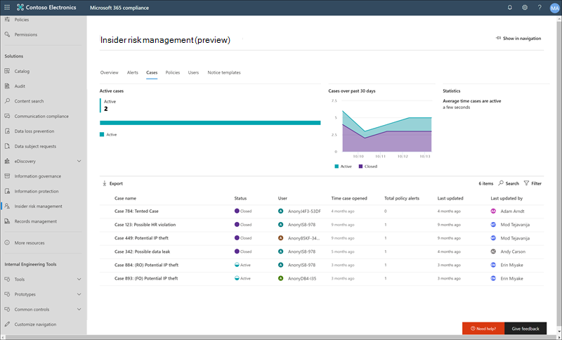
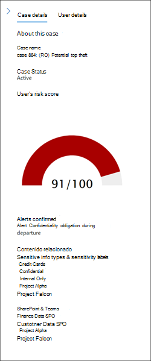
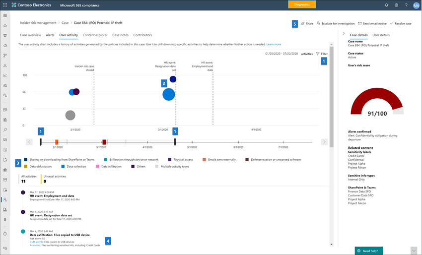
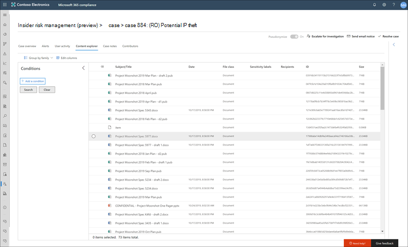

# Casos de administración de riesgos de Insider (versión preliminar)Insider risk management cases (preview)

Los casos son el corazón de la administración de riesgos del Insider y le permiten investigar y realizar acciones profundamente en los problemas generados por los indicadores de riesgo definidos en las directivas.Cases are the heart of insider risk management and allow you to deeply investigate and take action on issues generated by risk indicators defined in your policies. Los casos se crean manualmente a partir de alertas en las situaciones en las que se necesitan acciones adicionales para resolver un problema relacionado con el cumplimiento de un empleado.Cases are manually created from alerts in the situations where further action is needed to address a compliance-related issue for an employee. Cada caso está en el ámbito de un único empleado y se pueden agregar varias alertas para el empleado a un caso existente o a un nuevo caso.Each case is scoped to a single employee and multiple alerts for the employee can be added to an existing case or to a new case. Después de investigar los detalles de un caso, puede emprender acciones enviando un aviso al empleado, resolviendo el caso como benigno o remitiéndose a un dato o a una investigación de empleado.After investigating the details of a case, you can take action by sending the employee a notice, resolving the case as benign, or escalating to a data or employee investigation.

## Panel de casosCase dashboard

El **Panel de casos** de administración de riesgos de Insider le permite ver y emprender acciones en casos.The insider risk management **Cases dashboard** allows you to view and take action on cases. Cada widget de informe del panel muestra información de los últimos 30 días.Each report widget on the dashboard displays information for last 30 days.

- **Casos activos**: el número total de casos activos en investigación.**Active cases**: The total number of active cases under investigation.
- **Casos durante los últimos 30 días**: el número total de casos creados, ordenados por estado *activo* y *cerrado* .**Cases over past 30 days**: The total number of cases created, sorted by *Active* and *Closed* status.
- **Estadísticas**: tiempo promedio de los casos activos, enumerados en horas, días o meses.**Statistics**: Average time of active cases, listed in hours, days, or months.

La cola de casos enumera todos los casos activos y cerrados para la organización, además del estado actual de los siguientes atributos de caso:The case queue lists all active and closed cases for your organization, in addition to the current state of the following case attributes:

- **Nombre de caso**: nombre del caso, definido cuando se confirma una alerta y se crea el caso.**Case name**: The name of the case, defined when an alert is confirmed and the case is created.  
- **Status**: el estado del caso, ya sea *activo* o *cerrado*.**Status**: The status of the case, either *Active* or *Closed*.
- **User**: el empleado del caso.**User**: The employee for the case.
- **Caso de tiempo de apertura**: tiempo que ha pasado desde que se abrió el caso.**Time case opened**: The time that has passed since the case was opened.
- **Total de alertas de directiva**: el número de coincidencias de directivas incluidas en el caso.**Total policy alerts**: The number of policy matches included in the case. Este número puede aumentar si se agregan nuevas alertas al caso.This number may increase if new alerts are added to the case.
- **Última actualización**: el tiempo que ha pasado desde que se ha agregado una nota de caso o un cambio en el estado de caso.**Last updated**: The time that has passed since there has been an added case note or change in the case state.
- **Última actualización**: el nombre del analista o investigador de administración de riesgos de Insider que ha actualizado el caso por última vez.**Last updated by**: The name of the insider risk management analyst or investigator that last updated the case.

Use el control de **búsqueda** para buscar nombres de casos específicos de texto y usar el filtro de casos para ordenar los casos por los siguientes atributos:Use the **Search** control to search case names for specific text and use the case filter to sort cases by the following attributes:

- EstadoStatus
- Tiempo de uso abierto, fecha de inicio y fecha de finalizaciónTime case opened, start date, and end date
- Última actualización, fecha de inicio y fecha de finalizaciónLast updated, start date, and end date

## Investigar un casoInvestigate a case

Es fundamental realizar una investigación más profunda de las alertas de administración de riesgos de Insider para llevar a cabo las acciones correctivas adecuadas.Deeper investigation into insider risk management alerts is critical to taking proper corrective actions. Los casos de administración de riesgos de internación son la herramienta de administración central para profundizar en el historial de actividades de riesgo de los empleados y en los detalles de las alertas y explorar el contenido y los mensajes expuestos a los riesgos.Insider risk management cases are the central management tool to dive deeper into employee risk activity history and alert details, and to explore the content and messages exposed to risks. Los analistas de riesgos y investigadores también usan casos para centralizar comentarios y notas de revisión y para procesar la resolución de casos.Risk analysts and investigators also use cases to centralize review feedback and notes and to process case resolution. 

Al seleccionar un caso, se abren las herramientas de administración de casos y se permite a los analistas e investigadores profundizar en los detalles de los casos.Selecting a case opens the case management tools and allows analysts and investigators to dig into the details of cases.

### Introducción al casoCase overview

La ficha **información general del caso** resume la actividad de alerta y el historial de nivel de riesgo en el caso.The **Case overview** tab summarizes the alert activity and risk level history for the case. El widget **alertas** muestra la coincidencia de la Directiva con el caso, incluido el estado de la alerta, la gravedad del riesgo de la alerta y el momento en que se detectó la alerta.The **Alerts** widget shows the policy matches for the case, including the status of the alert, the alert risk severity, and when the alert was detected. El gráfico **historial de nivel de riesgo** muestra el nivel de riesgo de usuario en los últimos 30 días.The **Risk level history** chart displays the user risk level over the last 30 days. El gráfico de líneas permite a los analistas y investigadores ver rápidamente la tendencia del riesgo global del usuario a lo largo del tiempo.The line chart allows analysts and investigators to quickly see the trend in overall user risk over time. El widget de **contenido de actividad de riesgos** resume los tipos de datos y el contenido que se incluyen en las alertas que se agregan al caso.The **Risk activity content** widget summarizes the types of data and content contained in alerts added to the case. Este widget proporciona una vista completa de todo el conjunto de datos y contenido en riesgo en el caso.This widget gives an all-up view of the entire data and content set at risk in the case.

El panel de **detalles de caso** está disponible en todas las pestañas de administración de casos y resume los detalles de casos para investigadores y analistas de riesgos.The **Case details** pane is available on all case management tabs and summarizes the case details for risk analysts and investigators. Incluye las siguientes áreas:It includes the following areas:

- **Nombre de caso**: nombre del caso, prefijo de un número de secuencia de caso generado automáticamente y el nombre del riesgo asociado con la plantilla de directiva que coincide con la primera alerta confirmada.**Case name**: The name of the case, prefixed with an autogenerated case sequence number and the name of the risk associated with the policy template that the first confirmed alert matches. 
- **Estado del caso**: estado actual del caso, ya sea *activo* o *cerrado*.**Case status**: The current status of the case, either *Active* or *Closed*.
- **Puntuación de riesgo del usuario**: el nivel de riesgo calculado actual del usuario para el caso.**User's risk score**: The current calculated risk level of the user for the case. Esta puntuación se calcula cada 24 horas y usa los resultados de riesgo de alertas de todas las alertas activas asociadas al usuario.This score is calculated every 24 hours and uses the alert risk scores from all active alerts associated to the user.
- **Alertas confirmadas**: lista de alertas del usuario confirmada para el caso.**Alerts confirmed**: List of alerts for the user confirmed for the case.
- **Contenido en riesgo**: lista de contenido, ordenada por tipos y orígenes de contenido.**Content at risk**: List of content, sorted by content sources and types. Por ejemplo, por caso de contenido de alertas en SharePoint Online, es posible que aparezcan nombres de archivo o carpeta asociados a la actividad de riesgo para las alertas en el caso.For example, for case alert content in SharePoint Online, you may see folder or file names listed that are associated with the risk activity for alerts in the case.

### AlertasAlerts

La ficha **alertas** resume las alertas actuales incluidas en el caso.The **Alerts** tab summarizes the current alerts included in the case. Se pueden agregar nuevas alertas a un caso existente y se agregarán a la cola de **alertas** a medida que se asignen.New alerts may be added to an existing case and they will be added to the **Alert** queue as they are assigned. Los siguientes atributos de alerta aparecen en la cola:The following alert attributes are listed the queue:

- EstadoStatus
- SeveritySeverity
- Tiempo detectadoTime detected

Seleccione una alerta de la cola para mostrar la página de detalles de la **alerta** .Select an alert from the queue to display the **Alert detail** page.

Use el control de búsqueda para buscar nombres de alertas de texto específico y use el filtro de alerta para ordenar los casos por los siguientes atributos:Use the search control to search alert names for specific text and use the alert filter to sort cases by the following attributes:

- EstadoStatus
- SeveritySeverity
- Tiempo detectado, fecha de inicio y fecha de finalizaciónTime detected, start date, and end date

### Actividad de usuarioUser activity

La ficha de **actividad de usuario** es una de las herramientas más eficaces para el análisis y la investigación de riesgos internos para los casos de la solución de administración de riesgos de Insider.The **User activity** tab is one of the most powerful tools for internal risk analysis and investigation for cases in the insider risk management solution. Esta ficha está estructurada para habilitar la revisión rápida de un caso, incluida una escala de tiempo histórica de todas las alertas, todos los detalles de las alertas, la puntuación de riesgo actual para el usuario en el caso y los controles para emprender acciones efectivas que contengan los riesgos en el caso.This tab is structured to enable quick review of a case, including a historical timeline of all alerts, all alerts details, the current risk score for the user in the case, and controls to take effective action to contain the risks in the case.

1. **Filtros de tiempo de fecha y de ventana**: de forma predeterminada, los últimos seis meses de alertas confirmadas en el caso se muestran en el gráfico de actividad del usuario.**Date and window time filters**: By default, the last six months of alerts confirmed in the case are displayed in the User activity chart. Puede filtrar fácilmente la vista de gráfico con los controles deslizantes situados en ambos extremos de la ventana gráfico o definiendo fechas de inicio y finalización específicas en el control de filtro de gráfico.You can easily filter the chart view with either the slider controls at both ends of the chart window, or by defining specific start and end dates in the chart filter control.
2. **Actividad de alertas de riesgos y detalles**: las actividades de riesgo se muestran visualmente como burbujas de color en el gráfico de actividad del usuario.**Risk alert activity and details**: Risk activities are visually displayed as colored bubbles in the User activity chart. Las burbujas se crean para diferentes categorías de riesgo y el tamaño de la burbuja es proporcional al número de actividades de riesgo para la categoría.Bubbles are created for different categories of risk and bubble size is proportional to the number of risk activities for the category. Seleccione una burbuja para mostrar los detalles de cada actividad de riesgo.Select a bubble to display the details for each risk activity. Entre los detalles se incluyen:Details include:
    - **Fecha** de la actividad de riesgo.**Date** of the risk activity.
    - Categoría de la **actividad de riesgo**.The **risk activity category**. Por ejemplo, *correo electrónico con datos adjuntos enviados fuera de la organización* o *archivos descargados desde SharePoint Online*.For example, *Email(s) with attachments sent outside the organization* or *File(s) downloaded from SharePoint Online*.
    - **Puntuación de riesgo** para la alerta.**Risk score** for the alert. Esta puntuación es la puntuación numérica para el nivel de gravedad de riesgo de alertas.This score is the numerical score for the alert risk severity level.
    - Número de **archivos** o **mensajes de correo electrónico** asociados a la alerta.Number of **files** or **emails** associated with the alert. También se encuentran disponibles vínculos a cada archivo o correo electrónico asociado con la actividad de riesgo.Links to each file or email associated with the risk activity is also available.
3. **Leyenda de actividad de riesgo**: en la parte inferior del gráfico de actividad de usuario, una leyenda con código de color ayuda a determinar rápidamente la categoría de riesgo para cada alerta.**Risk activity legend**: Across the bottom of the user activity chart, a color-coded legend helps you quickly determine risk category for each alert.
4. **Actividad de riesgo cronología**: se enumera toda la cronología de todas las alertas de riesgo asociadas con el caso, incluidos todos los detalles disponibles en la burbuja de alerta correspondiente.**Risk activity chronology**: The full chronology of all risk alerts associated with the case are listed, including all the details available in the corresponding alert bubble.
5. **Acciones de casos**: las opciones para resolver el caso se muestran en la barra de herramientas acción de escenario.**Case actions**: Options for resolving the case are on the case action toolbar. Puede resolver un caso, enviar un aviso por correo electrónico al empleado o remitir el caso a una investigación de los datos o de un empleado.You can resolve a case, send an email notice to the employee, or escalate the case for a data or employee investigation.

### Explorador de contenidoContent explorer

La ficha **Explorador de contenido** permite a los analistas de riesgos y a los investigadores revisar las copias de todos los archivos individuales y los mensajes de correo electrónico asociados a las alertas de riesgos.The **Content explorer** tab allows risk analysts and investigators to review copies of all individual files and email messages associated with risk alerts. Por ejemplo, si se crea una alerta cuando un empleado descarga cientos de archivos de SharePoint Online a un dispositivo USB y la actividad desencadena una alerta de Directiva, todos los archivos descargados para la alerta se capturan y se copian en el caso de administración de riesgos de Insider desde orígenes de almacenamiento originales.For example, if an alert is created when an employee downloads hundreds of files from SharePoint Online to a USB device and the activity triggers a policy alert, all the downloaded files for the alert are captured and copied to the insider risk management case from original storage sources.

El explorador de contenido es una herramienta eficaz con características básicas y avanzadas de búsqueda y filtrado.The content explorer is a powerful tool with basic and advanced search and filtering features. Para obtener más información sobre el uso del explorador de contenido, vea el [Explorador de contenido de administración de riesgos de Insider](insider-risk-management-content-explorer.md).To learn more about using the content explorer, see [Insider risk management content explorer](insider-risk-management-content-explorer.md).

### Notas del casoCase notes

La ficha **notas del caso** es donde los analistas de riesgos y los investigadores comparten comentarios, comentarios e información sobre su trabajo en el caso.The **Case notes** tab in the case is where risk analysts and investigators share comments, feedback, and insights about their work for the case. Las notas son adiciones permanentes a un caso y no se pueden editar ni eliminar después de guardar la nota.Notes are permanent additions to a case and cannot be edited or deleted after the note is saved. Cuando se crea un caso desde una alerta, los comentarios introducidos en el cuadro de diálogo **confirmar ADVERTENCIA y crear caso de riesgo de Insider** se agregan automáticamente como una nota de caso.When a case is created from an alert, the comments entered in the **Confirm alert and create insider risk case** dialog are automatically added as a case note.

El panel de notas de caso muestra las notas del usuario que creó la nota y el tiempo que ha transcurrido desde que se guardó la nota.The case notes dashboard displays notes by the user that created the note and the time that has passed since the note was saved. Para buscar en el campo de texto Nota de caso una palabra clave específica, use el botón **Buscar** del panel caso y escriba una palabra clave específica.To search the case note text field for a specific keyword, use the **Search** button on the case dashboard and enter a specific keyword.

Para agregar una nota a un caso:To add a note to a case:

1. En el [centro de cumplimiento de Microsoft 365](https://compliance.microsoft.com), vaya a **Administración de riesgos de Insider** y seleccione la pestaña **casos** .In the [Microsoft 365 compliance center](https://compliance.microsoft.com), go to **Insider risk management** and select the **Cases** tab.
2. Seleccione un caso y, a continuación, seleccione la pestaña **notas de caso** .Select a case, then select the **Case notes** tab.
3. Seleccione **Agregar nota de caso**.Select **Add case note**.
4. En el cuadro de diálogo **Agregar nota de caso** , escriba la nota para el caso.On the **Add case note** dialog, type your note for the case. Seleccione **Guardar** para agregar la nota al caso o seleccione **Cancelar** cierre sin guardar la nota en el caso.Select **Save** to add the note to the case or select **Cancel** close without saving the note to the case.

### ColaboradoresContributors

La ficha **colaboradores** , en caso de que los analistas de riesgos y los investigadores puedan agregar otros revisores al caso.The **Contributors** tab in the case is where risk analysts and investigators can add other reviewers to the case. De forma predeterminada, todos los usuarios asignados a los roles de **analistas de administración de riesgos** de Insider y **investigadores de administración de riesgos de Insider** se enumeran como colaboradores para cada caso activo y cerrado.Be default, all users assigned the **Insider Risk Management Analysts** and **Insider Risk Management Investigators** roles are listed as contributors for each active and closed case.

Todos los casos de administración de riesgos de Insider deben administrarse con los controles de acceso adecuados en su ubicación para mantener la confidencialidad y la integridad de la investigación.All insider risk management cases must be managed with appropriate access controls in place to maintain confidentiality and integrity of the investigation. Para ayudar a mantener el control de acceso de los casos, a los usuarios se les asignan dos tipos de acceso a los casos:To help maintain access control of cases, users are assigned one of two types of access to cases:

- **Acceso permanente**: el acceso permanente se concede automáticamente a los usuarios con los roles de **analistas de administración de riesgos** de Insider y **investigadores de administración de riesgos de Insider** cuando se crea el caso desde una alerta.**Permanent access**: Permanent access is automatically granted to users with the **Insider Risk Management Analysts** and **Insider Risk Management Investigators** roles when the case is created from an alert. El acceso permanente concede un control total sobre el caso durante la vigencia del caso y concede la capacidad de agregar otros colaboradores de caso.Permanent access grants full control of the case for the lifetime of the case and grants the ability to add other case contributors.
- **Acceso temporal**: los colaboradores solo conceden acceso temporal a los usuarios que tienen acceso permanente en el caso.**Temporary access**: Temporary access is only granted to users by contributors that have permanent access for the case. Normalmente, este nivel de acceso se concede al usuario que necesita agregar notas a un caso.Typically, this access level is granted to user that needs to add notes to a case. Los colaboradores con acceso temporal tienen todos el control de la administración de casos excepto:Contributors with temporary access have all case management control except:
    - Permiso para confirmar o descartar alertasPermission to confirm or dismiss alerts
    - Permiso para editar los colaboradores en los casosPermission to edit the contributors for cases
    - Permiso para ver archivos y mensajes en el explorador de contenidoPermission to view files and messages in the Content Explorer

Para agregar un colaborador a un caso:To add a contributor to a case:

1. En el [centro de cumplimiento de Microsoft 365](https://compliance.microsoft.com), vaya a **Administración de riesgos de Insider** y seleccione la pestaña **casos** .In the [Microsoft 365 compliance center](https://compliance.microsoft.com), go to **Insider risk management** and select the **Cases** tab.
2. Seleccione un caso y, a continuación, seleccione la pestaña **colaboradores** .Select a case, then select the **Contributors** tab.
3. Seleccione **Agregar colaborador**.Select **Add contributor**.
4. En el cuadro de diálogo **Agregar colaborador** , empiece a escribir el nombre del usuario que desea agregar y, a continuación, seleccione el usuario de la lista de usuarios sugeridos.On the **Add contributor** dialog, start typing the name of the user you want to add and then select the user from the suggested user list. Esta lista se genera a partir de Azure Active Directory de su suscripción de inquilino.This list is generated from the Azure Active Directory of your tenant subscription.
5. En el cuadro de diálogo **Agregar colaborador** , seleccione el nivel de acceso para el colaborador.On the **Add contributor** dialog, select the access level for the contributor. Puede seleccionar **permanente** o **temporal**.You can select **Permanent** or **Temporary**.
6. Seleccione **Agregar** para agregar al usuario como colaborador o **Cancelar** cierre el cuadro de diálogo sin agregar el usuario como colaborador.Select **Add** to add the user as a contributor or select **Cancel** close the dialog without adding the user as a contributor.

## Acciones de casoCase actions

Los analistas de riesgos y los investigadores pueden tomar medidas en un caso en uno de varios métodos, en función de la gravedad del caso, el historial del riesgo del empleado y las directrices de riesgo de la organización.Risk analysts and investigators can take action on a case in one of several methods, depending on the severity of the case, the history of risk of the employee, and the risk guidelines of your organization. En algunas situaciones, es posible que deba remitir un caso a un empleado o una investigación de datos para colaborar con otras áreas de la organización y profundizar en las actividades de riesgo.In some situations, you may need to escalate a case to an employee or data investigation to collaborate with other areas of your organization and to dive deeper into risk activities. La administración de riesgos de Insider se integra estrechamente con otras características de cumplimiento de Microsoft 365 para ayudarle con la administración de la resolución de un extremo a otro.Insider risk management is tightly integrated with other Microsoft 365 compliance features to help you with end-to-end resolution management.

### Enviar un avisoSend a notice

En la mayoría de los casos, las acciones de los empleados que crean alertas de coincidencia de directivas son involuntarias o accidentales.In most cases, employee actions that create policy match alerts are inadvertent or accidental. El envío de un aviso de aviso al empleado mediante correo electrónico es un método eficaz para documentar la revisión y la acción de los casos, así como un método para recordar a los empleados las directivas corporativas o dirigirlos a un aprendizaje de actualización.Sending a reminder notice to the employee via email is an effective method for documenting case review and action, as well as a method to remind employees of corporate policies or point them to refresher training. Los avisos se generan a partir de [plantillas de aviso](insider-risk-management-notices.md) creadas para la infraestructura de administración de riesgos de Insider.Notices are generated from [notice templates that you create](insider-risk-management-notices.md) for your insider risk management infrastructure.

Es importante recordar que enviar un aviso a un empleado ***no*** resuelve el caso como *cerrado*.It's important to remember that sending a notice to an employee ***does not*** resolve the case as *Closed*. En algunos casos, es posible que desee dejar un caso abierto después de enviar un aviso a un empleado para buscar actividades de riesgo adicionales sin abrir un nuevo caso.In some cases, you may want to leave a case open after sending a notice to an employee to look for additional risk activities without opening a new case. Si desea resolver un caso después de enviar un aviso, debe seleccionar el paso **resolver caso** como un paso posterior tras enviar un aviso.If you want to resolve a case after sending a notice, you must select the **Resolve case** as a follow-on step after sending a notice.

Para enviar un aviso al empleado asignado a un caso:To send a notice to the employee assigned to a case:

1. En el [centro de cumplimiento de Microsoft 365](https://compliance.microsoft.com), vaya a **Administración de riesgos de Insider** y seleccione la pestaña **casos** .In the [Microsoft 365 compliance center](https://compliance.microsoft.com), go to **Insider risk management** and select the **Cases** tab.
2. Seleccione un caso y, a continuación, seleccione el botón **Enviar notificación de correo electrónico** en la barra de herramientas acción de escenario.Select a case, then select the **Send e-mail notice** button on the case action toolbar.
3. En el cuadro de diálogo **notificación de correo electrónico de envío** , seleccione el control desplegable **Seleccionar plantilla de notificación** para seleccionar la plantilla de aviso del aviso.On the **Send e-mail notice** dialog, select the **Choose a notice template** dropdown control to select the notice template for the notice. Esta selección rellenará previamente el resto de los campos de la notificación.This selection pre-fills the other fields on the notice.
4. Revise los campos de aviso y actualice según corresponda.Review the notice fields and update as appropriate. Los valores especificados aquí reemplazarán los valores de la plantilla.The values entered here will override the values on the template.
5. Seleccione **Enviar** para enviar el aviso al empleado o seleccione **Cancelar** para cerrar el cuadro de diálogo sin enviar el aviso al empleado.Select **Send** to send the notice to the employee or select **Cancel** close the dialog without sending the notice to the employee. Se agregan todos los avisos enviados a la cola de notas de casos en el panel de **notas de caso** .All sent notices are added to the case notes queue on the **Case notes** dashboard.

### Escalar para investigaciónEscalate for investigation

Remitir el caso a la investigación de los empleados en situaciones en las que se necesita una revisión legal adicional para la actividad de riesgo del empleado.Escalate the case for employee investigation in situations where additional legal review is needed for the employee's risk activity. Esta escalado abre un nuevo caso de exhibición avanzada de documentos electrónicos en su organización de Microsoft 365.This escalation opens a new Advanced eDiscovery case in your Microsoft 365 organization. EDiscovery avanzado proporciona un flujo de trabajo de un extremo a otro para preservar, recopilar, revisar, analizar y exportar contenido que responde a las investigaciones legales internas y externas de la organización.Advanced eDiscovery provides an end-to-end workflow to preserve, collect, review, analyze, and export content that's responsive to your organization's internal and external legal investigations. También permite que su equipo legal administre todo el flujo de trabajo de notificación de retención legal para comunicarse con los custodios que participan en un caso.It also lets your legal team manage the entire legal hold notification workflow to communicate with custodians involved in a case. La asignación de un revisor como custodio en un caso de eDiscovery avanzado creado a partir de un caso de administración de riesgos de Insider ayuda al equipo legal a tomar las medidas adecuadas y administrar la preservación del contenido.Assigning a reviewer as a custodian in an Advanced eDiscovery case created from an insider risk management case helps your legal team take appropriate action and manage content preservation. Para obtener más información acerca de los casos avanzados de eDiscovery, consulte [Overview of Advanced eDsicovery en Microsoft 365](overview-ediscovery-20.md).To learn more about Advanced eDiscovery cases, see [Overview of Advanced eDsicovery in Microsoft 365](overview-ediscovery-20.md).

Para remitir un caso a una investigación de empleado:To escalate a case to an employee investigation:

1. En el [centro de cumplimiento de Microsoft 365](https://compliance.microsoft.com), vaya a **Administración de riesgos de Insider** y seleccione la pestaña **casos** .In the [Microsoft 365 compliance center](https://compliance.microsoft.com), go to **Insider risk management** and select the **Cases** tab.
2. Seleccione un caso y, a continuación, seleccione el botón **remitir a investigación** en la barra de herramientas acción de escenario.Select a case, then select the **Escalate for investigation** button on the case action toolbar.
3. En el cuadro de diálogo **escalar para investigación** , escriba un nombre para la nueva investigación de empleado.On the **Escalate for investigation** dialog, enter a name for the new employee investigation. Si es necesario, escriba notas sobre el caso y seleccione **escalar**.If needed, enter notes about the case and select **Escalate**.
5. Seleccione **confirmar** para crear el caso de investigación de empleado o seleccione **Cancelar** para cerrar el cuadro de diálogo sin crear un nuevo caso de investigación de empleado.Select **Confirm** to create the employee investigation case or select **Cancel** to close the dialog without creating a new employee investigation case.

Una vez que el caso de administración de riesgos de Insider se ha remitido a un caso de investigación de un nuevo empleado, puede revisar el nuevo caso en el área**Advanced** **eDiscovery** > del centro de cumplimiento de Microsoft 365.After the insider risk management case has been escalated to a new employee investigation case, you can review the new case in the **eDiscovery** > **Advanced** area in the Microsoft 365 compliance center.

### Resolver el casoResolve the case

Una vez que los analistas de riesgos y los investigadores han completado su revisión e investigación, se puede resolver un caso para emprender acciones en todas las alertas incluidas actualmente en el caso.After risk analysts and investigators have completed their review and investigation, a case can be resolved to take action on all the alerts currently included in the case. La resolución de un caso agrega una clasificación de resolución, cambia el estado de caso a *cerrado*y los motivos de acción de resolución se agregan automáticamente a la cola de notas de casos en el panel de **notas de caso** .Resolving a case adds a resolution classification, changes the case status to *Closed*, and the resolution action reasons are automatically added to the case notes queue on the **Case notes** dashboard. Los casos se resuelven como:Cases are resolved as either:

- **Benigno**: clasificación para los casos en los que las alertas de coincidencia de Directiva se evalúan como de bajo riesgo, no grave o falso positivo.**Benign**: The classification for cases where policy match alerts are evaluated as low risk, non-serious, or false positive.
- **Infracción de directiva confirmada**: clasificación de casos en los que las alertas de coincidencia de la Directiva se evalúan como peligroso, serio o como resultado de un intento malintencionado.**Confirmed policy violation**: The classification for cases where policy match alerts are evaluated as risky, serious, or the result of malicious intent.

Para resolver un caso:To resolve a case:

1. En el [centro de cumplimiento de Microsoft 365](https://compliance.microsoft.com), vaya a **Administración de riesgos de Insider** y seleccione la pestaña **casos** .In the [Microsoft 365 compliance center](https://compliance.microsoft.com), go to **Insider risk management** and select the **Cases** tab.
2. Seleccione un caso y, a continuación, seleccione el botón **resolver caso** en la barra de herramientas de acciones de escenario.Select a case, then select the **Resolve case** button on the case action toolbar.
3. En el cuadro de diálogo **resolver caso** , seleccione el control desplegable **resolver como** para seleccionar la clasificación de resolución para el caso.On the **Resolve case** dialog, select the **Resolve as** dropdown control to select the resolution classification for the case. Las opciones son infracción de directiva **benigna** o **confirmada**.The options are **Benign** or **Confirmed policy violation**.
4. En el cuadro de diálogo **resolver caso** , especifique los motivos de la clasificación de resolución en el campo de texto **acción tomada** .On the **Resolve case** dialog, enter the reasons for the resolution classification in the **Action taken** text field.
5. Seleccione **resolver** para cerrar el caso o seleccione **Cancelar** cierre el cuadro de diálogo sin resolver el caso.Select **Resolve** to close the case or select **Cancel** close the dialog without resolving the case.
