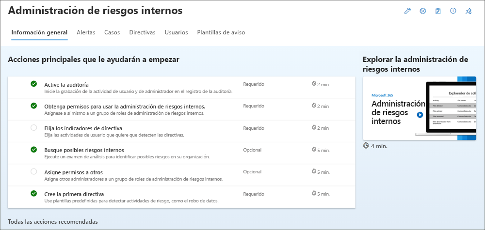

# Introducción a la administración de riesgos internos

Use directivas de administración de riesgos internos para identificar las actividades de riesgo y las herramientas de administración para actuar sobre alertas de riesgo en su organización. Complete los pasos siguientes para configurar los requisitos previos y configurar una directiva de administración de riesgos internos.

> [!IMPORTANT]
> La solución de administración de riesgos internos proporciona una opción de nivel de inquilino para ayudar a los clientes a facilitar la gobernanza interna en el nivel de usuario. Los administradores de nivel de inquilino pueden configurar permisos para proporcionar acceso a esta solución a los miembros de la organización y configurar conectores de datos en el portal de cumplimiento Microsoft Purview importar datos pertinentes para admitir la identificación a nivel de usuario de actividad potencialmente arriesgada. Los clientes reconocen que el administrador puede calcular información relacionada con el comportamiento, el carácter o el rendimiento del usuario individual relacionada materialmente con el empleo y ponerla a disposición de otros usuarios de la organización. Además, los clientes reconocen que deben llevar a cabo su propia investigación completa relacionada con el comportamiento, el carácter o el rendimiento del usuario individual materialmente relacionados con el empleo, y no solo confiar en información del servicio de administración de riesgos internos. Los clientes son los únicos responsables de usar el servicio de administración de riesgos internos y cualquier característica o servicio asociado de conformidad con todas las leyes aplicables, incluidas las leyes relacionadas con la identificación individual del usuario y las acciones de corrección.

Para obtener más información sobre cómo las directivas de riesgo internos pueden ayudarle a administrar los riesgos en su organización, consulte [Información sobre la administración de riesgos](insider-risk-management.md) internos.

## Suscripciones y licencias

Antes de empezar a trabajar con la administración de riesgos internos, debe confirmar su [suscripción a Microsoft 365](https://www.microsoft.com/microsoft-365/compare-all-microsoft-365-plans) y cualquier complemento. Para acceder y usar la administración de riesgos internos, su organización debe tener una de las siguientes suscripciones o complementos:

- suscripción Microsoft 365 E5/A5/F5/G5 (versión de pago o de prueba)
- suscripción Microsoft 365 E3/A3/F3/G3 + el complemento de cumplimiento Microsoft 365 E5/A5/F5/G5
- suscripción Microsoft 365 E3/A3/F3/G3 + el complemento Microsoft 365 E5/A5/F5/G5 Insider Risk Management
- Suscripción a Office 365 E3 + Enterprise Mobility + Security E3 + el complemento Cumplimiento de Microsoft 365 E5

A los usuarios incluidos en las directivas de administración de riesgos internos se les debe asignar una de las licencias anteriores.

> [!IMPORTANT]
> La administración de riesgos internos está disponible actualmente en inquilinos hospedados en regiones geográficas y países compatibles con las dependencias del servicio de Azure. Para comprobar que la administración de riesgos internos es compatible con su organización, consulte [Disponibilidad de dependencias de Azure por país o región](/troubleshoot/azure/general/dependency-availability-by-country).

Si no tiene un plan E5 Microsoft 365 Enterprise existente y quiere probar la administración de riesgos internos, puede [agregar Microsoft 365](/office365/admin/try-or-buy-microsoft-365) a su suscripción existente o [registrarse para obtener una prueba](https://www.microsoft.com/microsoft-365/enterprise) de Microsoft 365 Enterprise E5.

## Acciones recomendadas (versión preliminar)

Las acciones recomendadas pueden ayudar a su organización a obtener rápidamente la administración de riesgos internos. Incluidas en la página **Información general** , las acciones recomendadas le ayudarán a seguir los pasos para configurar e implementar directivas.

Las siguientes recomendaciones están disponibles para ayudarle a empezar a trabajar con o maximizar la configuración de administración de riesgos internos:

- **Activar auditoría**: cuando está activada, la actividad de usuario y administrador de la organización se registra en el registro de auditoría de Microsoft 365. Los exámenes de análisis y directivas de riesgo internos usan este registro para detectar actividades de riesgo.
- **Obtener permisos para la administración de riesgos de usuario**: el nivel de acceso que tiene para las características de administración de riesgos internos depende del grupo de roles que se le haya asignado. Para acceder a las acciones recomendadas y configurarlas, los usuarios deben estar asignados a los grupos de roles *Insider Risk Management* o *Insider Risk Management Admins* .
- **Elegir indicadores de directiva**: los indicadores son esencialmente las actividades de usuario que desea detectar e investigar. Puede elegir indicadores para realizar un seguimiento de la actividad en varias ubicaciones y servicios de Microsoft 365.
- **Buscar posibles riesgos internos**: ejecute un análisis para detectar posibles riesgos internos que se produzcan en su organización. Después de evaluar los resultados, revise las directivas recomendadas para configurar.
- **Asignar permisos a otros usuarios**: si hay miembros del equipo adicionales que serán responsables de administrar las características de riesgo internos, deberá asignarlas a los grupos de roles adecuados.
- **Crear la primera directiva**: para recibir alertas sobre actividades potencialmente de riesgo, debe configurar directivas basadas en plantillas predefinidas que definan las actividades de usuario que desea detectar e investigar.

Cada acción recomendada incluida en esta experiencia tiene cuatro atributos:

- **Acción**: nombre y descripción de la acción recomendada.
- **Estado**: estado de la acción recomendada. Los valores *no se inician*, *En curso*, *Guardado para más adelante* o *Completado*.
- **Obligatorio u opcional**: si la acción recomendada es necesaria u opcional para que las características de administración de riesgos internos funcionen según lo esperado.
- **Tiempo estimado para completar**: tiempo estimado para completar la acción recomendada en minutos.

Seleccione una recomendación de la lista para empezar a configurar la administración de riesgos internos. Cada acción recomendada le guía por las actividades necesarias para la recomendación, incluidos los requisitos, qué esperar y el impacto de configurar la característica en su organización.   Cada acción recomendada se marca automáticamente como completa cuando se configura o tendrá que seleccionar manualmente la acción como completada cuando se haya configurado.

## Paso 1 (obligatorio): Habilitar permisos para la administración de riesgos internos

> [!IMPORTANT]
> Después de configurar los grupos de roles, los permisos del grupo de roles pueden tardar hasta 30 minutos en aplicarse a los usuarios asignados en toda la organización.

Hay seis grupos de roles que se usan para configurar las características de administración de riesgos internos. Para que **la administración de riesgos de Insider** esté disponible como opción de menú en portal de cumplimiento Microsoft Purview y para continuar con estos pasos de configuración, debe estar asignado a uno de los siguientes roles o grupos de roles:

- Rol [*de administrador global*](/azure/active-directory/roles/permissions-reference#global-administrator) de Azure Active Directory
- Rol [*administrador de cumplimiento de*](/azure/active-directory/roles/permissions-reference#compliance-administrator) Azure Active Directory
- portal de cumplimiento Microsoft Purview grupo [*de roles De administración de la organización*](/microsoft-365/security/office-365-security/permissions-in-the-security-and-compliance-center)
- portal de cumplimiento Microsoft Purview grupo de roles [*administrador de cumplimiento*](/microsoft-365/security/office-365-security/permissions-in-the-security-and-compliance-center)
- *Grupo de roles de Administración de riesgos* internos
- *Grupo de roles de Administración administración de riesgos* internos

En función de cómo desee administrar las directivas y alertas de administración de riesgos internos, deberá asignar usuarios a grupos de roles específicos para administrar diferentes conjuntos de características de administración de riesgos internos. Tiene la opción de asignar usuarios con diferentes responsabilidades de cumplimiento a grupos de roles específicos para administrar distintas áreas de las características de administración de riesgos internos. O bien, puede decidir asignar todas las cuentas de usuario para administradores, analistas, investigadores y visores designados al grupo de roles Administración de riesgos internos. Use un único grupo de roles o varios grupos de roles para adaptarse mejor a los requisitos de administración de cumplimiento.

Al trabajar con la administración de riesgos internos, elegirá entre estas opciones de grupo de roles y las acciones de solución:

|Acciones|Administración de riesgos de Insider|Administración de riesgos internos Administración|Analistas de administración de riesgos internos|Investigadores de administración de riesgos internos|Auditores de administración de riesgos internos|
|---|---|---|---|---|---|
|Configuración de directivas y opciones|Sí|Sí|No|No|No|
|Información de análisis de acceso|Sí|Sí|Sí|No|No|
|Acceso & investigar alertas|Sí|No|Sí|Sí|No|
|Acceso & investigar casos|Sí|No|Sí|Sí|No|
|Acceso & ver el Explorador de contenido|Sí|No|No|Sí|No|
|Configuración de plantillas de aviso|Sí|No|Sí|Sí|No|
|Ver & exportar registros de auditoría|Sí|No|No|No|Sí|

> [!IMPORTANT]
> Asegúrese de que siempre tiene al menos un usuario en *insider Risk Management* o *Insider Risk Management Administración* grupos de roles (según la opción que elija) para que la configuración de administración de riesgos internos no entre en un escenario de "administrador cero" si determinados usuarios abandonan la organización.

Los miembros de los siguientes roles pueden asignar usuarios a grupos de roles de administración de riesgos internos y tener los mismos permisos de solución incluidos en el grupo de roles *insider Risk Management Administración*:

- *Administrador global* de Azure Active Directory
- *Administrador de cumplimiento de* Azure Active Directory
- administración de la *organización* portal de cumplimiento Microsoft Purview
- *Administrador de cumplimiento de* portal de cumplimiento Microsoft Purview

> [!NOTE]
> Estos grupos de roles no se admiten actualmente en Privileged Identity Management (PIM). Para más información sobre PIM, consulte [Asignación de roles de Azure AD en Privileged Identity Management](/azure/active-directory/privileged-identity-management/pim-how-to-add-role-to-user).

### Adición de usuarios a un grupo de roles de administración de riesgos internos

Complete los pasos siguientes para agregar usuarios a un grupo de roles de administración de riesgos internos:

1. Inicie sesión en [portal de cumplimiento Microsoft Purview](https://compliance.microsoft.com) con las credenciales de una cuenta de administrador en la organización de Microsoft 365.

2. En el Centro de cumplimiento de seguridad &amp; , vaya a **Permisos**. Seleccione el vínculo para ver y administrar roles en Office 365.

3. Seleccione el grupo de roles de administración de riesgos internos al que desea agregar usuarios y, a continuación, seleccione **Editar grupo de roles**.

4. Seleccione **Elegir miembros** en el panel de navegación izquierdo y, a continuación, seleccione **Editar**.

5. Seleccione **Agregar** y, a continuación, active la casilla para todos los usuarios que quiera agregar al grupo de roles.

6. Seleccione **Agregar** y, después, **Listo**.

7. Seleccione **Guardar** para agregar los usuarios al grupo de roles. Seleccione **Cerrar** para completar los pasos.

## Paso 2 (obligatorio): Habilitación del registro de auditoría de Microsoft 365

La administración de riesgos internos usa registros de auditoría de Microsoft 365 para la información de usuario y las actividades identificadas en las directivas y la información de análisis. Los registros de auditoría de Microsoft 365 son un resumen de todas las actividades de su organización y las directivas de administración de riesgos internos pueden usar estas actividades para generar información sobre directivas.

La auditoría está habilitada para organizaciones de Microsoft 365 de forma predeterminada. Algunas organizaciones pueden haber deshabilitado la auditoría por motivos específicos. Si la auditoría está deshabilitada para su organización, puede deberse a que otro administrador la ha desactivado. Se recomienda confirmar que es correcto volver a activar la auditoría al completar este paso.

Para obtener instrucciones paso a paso para activar la auditoría, consulte [Activar o desactivar la búsqueda de registros de auditoría](turn-audit-log-search-on-or-off.md). Después de activar la auditoría, se muestra un mensaje que dice que el registro de auditoría se está preparando y que puede ejecutar una búsqueda en un par de horas después de que se complete la preparación. Solo tiene que realizar esta acción una vez. Para obtener más información sobre el uso del registro de auditoría de Microsoft 365, consulte [Buscar en el registro de auditoría](search-the-audit-log-in-security-and-compliance.md).

## Paso 3 (opcional): Habilitación y visualización de información de análisis de riesgos internos

El análisis de administración de riesgos internos le permiten realizar una evaluación de los posibles riesgos internos en su organización sin necesidad de configurar ninguna directiva de riesgos internos. Esta evaluación puede ayudar a su organización a identificar áreas potenciales de mayor riesgo para los usuarios y ayudar a determinar el tipo y el alcance de las directivas de administración de riesgos internos que puede considerar configurar. Esta evaluación también puede ayudarle a determinar las necesidades de licencias adicionales o la optimización futura de las directivas existentes. Los resultados del análisis pueden tardar hasta 48 horas antes de que la información esté disponible como informes para su revisión. Para más información sobre la información de análisis, consulte [Configuración de administración de riesgos de Insider: Análisis](insider-risk-management-settings.md#analytics) y consulte el [vídeo de Insider Risk Management Analytics](https://www.youtube.com/watch?v=5c0P5MCXNXk) para ayudar a comprender cómo el análisis puede ayudar a acelerar la identificación de posibles riesgos internos y ayudarle a tomar medidas rápidamente.

Para habilitar insider risk Analytics, debe ser miembro del grupo de roles *Insider Risk Management*, *Insider Risk Management Administración* o Microsoft 365 *Global admin*.

Complete los pasos siguientes para habilitar el análisis de riesgos internos:

1. En el [portal de cumplimiento Microsoft Purview](https://compliance.microsoft.com), vaya a **Administración de riesgos de Insider**.
2. Seleccione **Ejecutar examen** en la tarjeta **Buscar riesgos internos en** la tarjeta de la organización en la pestaña **Información general sobre** la administración de riesgos internos. Esta acción activa el análisis de la organización. También puede activar el examen en su organización; para ello, vaya a Configuración  >  de **riesgo de Insider****Analytics** y habilite **Examinar la actividad de usuario del inquilino para identificar posibles riesgos** internos.
3. En el panel **Detalles de Analytics** , seleccione **Ejecutar examen para iniciar el examen de su organización**. Los resultados del análisis pueden tardar hasta 48 horas antes de que la información esté disponible como informes para su revisión.

Después de revisar la información de análisis, elija las directivas de riesgo internos y configure los requisitos previos asociados que mejor se adapten a la estrategia de mitigación de riesgos internos de su organización.

## Paso 4 (recomendado): Configuración de los requisitos previos para las directivas

La mayoría de las directivas de administración de riesgos internos tienen requisitos previos que deben configurarse para que los indicadores de directiva generen alertas de actividad pertinentes. Configure los requisitos previos adecuados en función de las directivas que planee configurar para su organización.

### Configuración del conector de RR. HH. de Microsoft 365

La administración de riesgos internos admite la importación de datos de usuario y registro importados desde plataformas de administración de riesgos de terceros y recursos humanos. El conector de datos de Recursos humanos (RR. HH.) de Microsoft 365 permite extraer datos de recursos humanos de archivos CSV, incluidas las fechas de finalización del usuario, las fechas de último empleo, las notificaciones del plan de mejora del rendimiento, las acciones de revisión del rendimiento y el estado de cambio en el nivel de trabajo. Estos datos ayudan a impulsar los indicadores de alerta en las directivas de administración de riesgos internos y es una parte importante de la configuración de cobertura completa de la administración de riesgos en su organización. Si configura más de un conector de RR. HH. para su organización, la administración de riesgos internos extraerá automáticamente los indicadores de todos los conectores de RR. HH.

El conector de RR. HH. de Microsoft 365 es necesario cuando se usan las siguientes plantillas de directiva:

- Filtraciones de datos por parte de usuarios inconformes
- Robo de datos de usuario de salida
- Uso indebido de los datos generales de los pacientes
- Infracciones de la directiva de seguridad por parte de los usuarios que abandonan la organización
- Infracciones de la directiva de seguridad por parte de usuarios inconformes

Consulte el artículo [Configuración de un conector para importar datos de RR. HH](import-hr-data.md) . para obtener instrucciones paso a paso para configurar el conector de RR. HH. de Microsoft 365 para su organización. Después de configurar el conector de RR. HH., vuelva a estos pasos de configuración.

### Configuración de un conector de datos específico del sector sanitario

La administración de riesgos internos admite la importación de datos de usuario y registro importados desde terceros en sistemas de registro médico electrónico (EMR) existentes. Los conectores de datos de Microsoft Healthcare y Epic le permiten extraer datos de actividad del sistema EMR con archivos CSV, incluido el acceso inadecuado a registros de pacientes, actividades de volumen sospechosas y actividades de edición y exportación. Estos datos ayudan a impulsar los indicadores de alerta en las directivas de administración de riesgos internos y es una parte importante de la configuración de cobertura completa de la administración de riesgos en su organización.

Si configura más de un conector de Healthcare o Epic para su organización, la administración de riesgos internos admite automáticamente señales de eventos y actividades de todos los conectores healthcare y epic.
El conector de Microsoft 365 Healthcare o Epic es necesario cuando se usan las siguientes plantillas de directiva:

- Uso indebido de los datos generales de los pacientes

Consulte el artículo [Configuración de un conector para importar datos sanitarios](import-healthcare-data.md) o [Configuración de un conector para importar datos de Epic EHR](import-epic-data.md) para obtener instrucciones paso a paso para configurar un conector específico de la atención sanitaria para su organización. Después de configurar un conector, vuelva a estos pasos de configuración.

### Configuración de directivas de prevención de pérdida de datos (DLP)

La administración de riesgos internos admite el uso de directivas DLP para ayudar a identificar la exposición intencionada o accidental de información confidencial a partes no deseadas para alertas DLP de alto nivel de gravedad. Al configurar una directiva de administración de riesgos internos con cualquiera de las plantillas **de pérdida de datos** , tiene la opción de asignar una directiva DLP específica a la directiva para estos tipos de alertas.

Las directivas DLP ayudan a identificar a los usuarios para activar la puntuación de riesgos en la administración de riesgos internos para alertas DLP de alta gravedad para información confidencial y son una parte importante de la configuración de la cobertura de administración de riesgos completa en su organización. Para obtener más información sobre la administración de riesgos internos y las consideraciones de integración y planeamiento de directivas DLP, consulte [Directivas de administración de riesgos internos](insider-risk-management-policies.md#general-data-leaks).

> [!IMPORTANT]
>Asegúrese de que ha completado lo siguiente:
>
> - Comprende y configura correctamente los usuarios dentro del ámbito en las directivas de administración de riesgos DLP y insider para generar la cobertura de directivas que espera.
> - Asegúrese de que la configuración **informes de incidentes** de la directiva DLP para la administración de riesgos internos que se usa con estas plantillas esté configurada para las alertas de nivel de gravedad *alta* . Las alertas de administración de riesgos internos no se generarán a partir de directivas DLP con el campo **Informes de incidentes** establecido en *Bajo* o *Medio*.

Una directiva DLP es opcional cuando se usan las siguientes plantillas de directiva:

- Filtraciones de datos generales
- Filtraciones de datos por parte de usuarios prioritarios

Consulte el artículo [Creación, prueba y optimización de una directiva DLP](create-test-tune-dlp-policy.md) para obtener instrucciones paso a paso para configurar directivas DLP para su organización. Después de configurar una directiva DLP, vuelva a estos pasos de configuración.

### Configuración de grupos de usuarios prioritarios

La administración de riesgos internos incluye compatibilidad para asignar grupos de usuarios prioritarios a directivas para ayudar a identificar actividades de riesgo únicas para el usuario con posiciones críticas, altos niveles de acceso a datos y redes, o un historial anterior de comportamiento de riesgo. Crear un grupo de usuarios prioritario y asignar usuarios a las directivas de ámbito de ayuda del grupo a las circunstancias únicas presentadas por estos usuarios.

Se requiere un grupo de usuarios prioritario cuando se usan las siguientes plantillas de directiva:

- Infracciones de la directiva de seguridad por parte de los usuarios prioritarios
- Filtraciones de datos por parte de usuarios prioritarios

Consulte el artículo [Introducción a la configuración de administración de riesgos](insider-risk-management-settings.md#priority-user-groups-preview) internos para obtener instrucciones paso a paso para crear un grupo de usuarios prioritario. Después de configurar un grupo de usuarios de prioridad, vuelva a estos pasos de configuración.

### Configuración del conector de badging físico (opcional)

La administración de riesgos internos admite la importación de datos de usuario y registro desde plataformas de control físico y acceso. El conector de badging físico permite extraer datos de acceso de archivos JSON, incluidos los identificadores de usuario, los identificadores de punto de acceso, la hora y las fechas de acceso y el estado de acceso. Estos datos ayudan a impulsar los indicadores de alerta en las directivas de administración de riesgos internos y es una parte importante de la configuración de cobertura completa de la administración de riesgos en su organización. Si configura más de un conector de badging físico para su organización, la administración de riesgos internos extrae automáticamente los indicadores de todos los conectores de badging físicos. La información del conector de badging físico complementa otras señales de riesgo internos cuando se usan todas las plantillas de directivas de riesgo internos.

> [!IMPORTANT]
> Para que las directivas de administración de riesgos internos usen y correlacionen los datos de señal relacionados con los usuarios que salen y finalizan con datos de eventos de las plataformas de control físico y acceso, también debe configurar el conector de RR. HH. de Microsoft 365. Si habilita el conector de badging físico sin habilitar el conector de RR. HH. de Microsoft 365, las directivas de administración de riesgos internos solo procesarán eventos para el acceso físico no autorizado para los usuarios de su organización.

Consulte el artículo [Configuración de un conector para importar datos físicos](import-physical-badging-data.md) incorrectos para obtener instrucciones paso a paso para configurar el conector de badging físico para su organización. Una vez configurado el conector, vuelva a estos pasos de configuración.

### Configuración de Microsoft Defender para punto de conexión (opcional)

[Microsoft Defender para punto de conexión](/windows/security/threat-protection/microsoft-defender-atp/microsoft-defender-advanced-threat-protection) es una plataforma de seguridad de punto de conexión empresarial diseñada para ayudar a las redes empresariales a prevenir, detectar, investigar y responder a amenazas avanzadas. Para tener una mejor visibilidad de las infracciones de seguridad en su organización, puede importar y filtrar alertas de Defender para punto de conexión para las actividades que se usan en las directivas creadas a partir de plantillas de directivas de infracción de seguridad de administración de riesgos internos.

Si crea directivas de infracción de seguridad, deberá tener Microsoft Defender para punto de conexión configuradas en su organización y habilitar Defender para punto de conexión para la integración de administración de riesgos internos en el Centro de seguridad de Defender para importar alertas de infracción de seguridad. Para obtener más información sobre los requisitos, consulte el artículo [Requisitos mínimos para Microsoft Defender para punto de conexión](/windows/security/threat-protection/microsoft-defender-atp/minimum-requirements).

Consulte el artículo [Configuración de características avanzadas en Defender para punto de conexión para](/windows/security/threat-protection/microsoft-defender-atp/advanced-features#share-endpoint-alerts-with-microsoft-compliance-center) obtener instrucciones paso a paso para configurar Defender para punto de conexión para la integración de administración de riesgos internos. Después de configurar el Microsoft Defender para punto de conexión, vuelva a estos pasos de configuración.

## Paso 5 (obligatorio): Configuración de los valores de riesgo internos

[La configuración de riesgos internos](insider-risk-management-settings.md) se aplica a todas las directivas de administración de riesgos internos, independientemente de la plantilla que elija al crear una directiva. La configuración se ajusta con el control de la **Configuración de riesgos internos** que se encuentra en la parte superior de todas las pestañas de administración de riesgos internos. Estas opciones controlan la privacidad, los indicadores, la supervisión de períodos y las detecciones inteligentes.

Antes de configurar una directiva, defina los siguientes valores de riesgo internos:

1. En la [portal de cumplimiento Microsoft Purview](https://compliance.microsoft.com), vaya a **Administración de riesgos de Insider** y seleccione **Configuración de riesgos** internos en la esquina superior derecha de cualquier página.
2. En la página **Privacidad** , seleccione una configuración de privacidad para mostrar los nombres de usuario de las alertas de directiva.
3. En la página **Indicadores** , seleccione los indicadores de alerta que desea aplicar a todas las directivas de riesgo internos.

    > [!IMPORTANT]
    > Para recibir alertas de actividad de riesgo definidas en las directivas, debe seleccionar uno o varios indicadores. Si los indicadores no están configurados en Configuración, los indicadores no se podrán seleccionar en las directivas de riesgo internos.

4. En la página **Períodos de tiempo de** directiva, seleccione los [períodos de tiempo de directiva](insider-risk-management-settings.md#policy-timeframes) que entrarán en vigor para un usuario cuando desencadene una coincidencia para una directiva de riesgo interno.
5. En la página **Detecciones inteligentes** , configure las siguientes opciones para las directivas de riesgo internos:
    - [Exclusiones de tipos de archivo](insider-risk-management-settings.md#file-type-exclusions)
    - [Número mínimo de eventos diarios para aumentar la puntuación de actividad inusual](insider-risk-management-settings.md#minimum-number-of-daily-events-to-boost-score-for-unusual-activity)
    - [Nivel de volumen de alertas](insider-risk-management-settings.md#alert-volume)
    - [estado de alerta de Microsoft Defender para punto de conexión](insider-risk-management-settings.md#microsoft-defender-for-endpoint-preview)
    - [Configuración del dominio](insider-risk-management-settings.md#domains)
6. En la página **Exportar alertas**, habilite la exportación de información de alertas de riesgo internos mediante las API de administración de Office 365 si es necesario.
7. En la página **Grupos de usuarios prioritarios** , cree un grupo de usuarios de prioridad y agregue usuarios si no se crean en el **paso 3**.
8. En la página **Flujos de Power Automate** , configure un flujo a partir de plantillas de flujo de riesgo internos o cree un nuevo flujo. Consulte el artículo [Introducción a la configuración de administración de riesgos](insider-risk-management-settings.md#power-automate-flows-preview) internos para obtener instrucciones paso a paso.
9. En la **página Activos prioritarios**, configure los recursos de prioridad para usar los datos de la plataforma de control físico y acceso importada por el conector de badging físico. Consulte el artículo [Introducción a la configuración de administración de riesgos](insider-risk-management-settings.md#priority-physical-assets-preview) internos para obtener instrucciones paso a paso.
10. En la página **Microsoft Teams** , habilite la integración de Microsoft Teams con la administración de riesgos internos para crear automáticamente un equipo para la colaboración de casos o usuarios. Consulte el artículo [Introducción a la configuración de administración de riesgos](insider-risk-management-settings.md#microsoft-teams-preview) internos para obtener instrucciones paso a paso.
11. Seleccione **Guardar** para habilitar esta configuración para las directivas de riesgo internos.

## Paso 6 (obligatorio): Creación de una directiva de administración de riesgos internos

Las directivas de administración de riesgos internos incluyen usuarios asignados y definen los tipos de indicadores de riesgo que se configuran para las alertas. Para que las actividades puedan desencadenar alertas, es necesario configurar una directiva. Use el asistente para directivas para crear nuevas directivas de administración de riesgos internos.

1. En el [portal de cumplimiento Microsoft Purview](https://compliance.microsoft.com), vaya a **Administración de riesgos** internos y seleccione la pestaña **Directivas**.
2. Seleccione **Crear directiva** para abrir el asistente de directivas.
3. En la página **Plantilla de directiva**, elija una categoría de directiva y luego seleccione la plantilla para la nueva directiva. Estas plantillas están compuestas por condiciones y señales que definen las actividades de riesgo que desea detectar e investigar. Revise los requisitos previos de la plantilla, los eventos desencadenantes y las actividades detectadas para confirmar que esta plantilla de directiva se ajusta a sus necesidades.

    > [!IMPORTANT]
    > Algunas plantillas de directivas tienen requisitos previos que deben configurarse para que la directiva genere las alertas relevantes. Si no ha configurado los requisitos previos de la directiva aplicable, vea el **Paso 4** anterior.

4. Seleccione **Siguiente** para continuar.
5. En la página **Nombre y descripción**, siga los siguientes campos:
    - **Nombre (obligatorio)**: escriba un nombre descriptivo para la directiva. Este nombre no se puede cambiar después de crear la directiva.
    - **Descripción (opcional)**: escriba una descripción para la directiva.

6. Seleccione **Siguiente** para continuar.
7. En la página **Usuarios y grupos**, seleccione **Incluir todos los usuarios y grupos** o **Incluir usuarios y grupos específicos** para definir qué usuarios o grupos se incluyen en la directiva, o si ha elegido una plantilla basada en usuarios prioritarios; seleccione **Agregar o editar grupos de usuarios prioritarios**. Si se selecciona **Incluir a todos los usuarios y grupos**, se buscarán los eventos desencadenantes de todos los usuarios y grupos de su organización para empezar a asignar puntuaciones de riesgo para la directiva. Seleccionar **Incluir usuarios y grupos específicos** permite definir qué usuarios y grupos se asignan a la directiva. No se admiten las cuentas de usuario invitado.
8. Seleccione **Siguiente** para continuar.
9. En la página **Contenido a priorizar**, puede asignar (si es necesario) las fuentes a priorizar, lo que aumenta la posibilidad de generar una alerta de alta gravedad para estas fuentes. Seleccione una de las siguientes opciones:

    - **Quiero especificar sitios de SharePoint, etiquetas de confidencialidad, tipos de información confidencial o extensiones de archivo como contenido prioritario**. Al seleccionar esta opción se habilitarán las páginas de detalles del asistente para configurar estos canales.
    - **No deseo especificar el contenido prioritario en este momento (podrá hacerlo una vez que se haya creado la directiva)**. Al seleccionar esta opción, se omitirán las páginas de detalles del canal en el asistente.

10. Seleccione **Siguiente** para continuar.

11. Si ha seleccionado **I want to specify SharePoint sites, sensitivity labels, sensitive information types and/or file extensions as priority content** in the previous step, you'll see the detail pages for *SharePoint sites*, *sensitive info types*, *sensitivity labels* and *file extensions*. Use estas páginas de detalles para definir SharePoint, los tipos de información confidencial, las etiquetas de confidencialidad y las extensiones de archivo para priorizar en la directiva.

    - **Sitios de SharePoint**: seleccione **Agregar sitio de SharePoint** y seleccione los sitios de SharePoint a los que tiene acceso y desea priorizar. Por ejemplo, *"group1@contoso.sharepoint.com/sites/group1"*.
    - **Tipo de información confidencial**: seleccione **Agregar tipo de información confidencial** y seleccione los tipos de confidencialidad que desea priorizar. Por ejemplo, *"Número de cuenta bancaria de EE. UU."* y *"Número de tarjeta de crédito"*.
    - **Etiquetas de confidencialidad**: seleccione **Agregar etiquetas de confidencialidad** y seleccionar las etiquetas que desea priorizar. Por ejemplo, *"Confidencial"* y *"Secreto"*.
    - Extensiones de archivo: agregue hasta 50 extensiones de archivo. Puede incluir u omitir '.' con la extensión de archivo. Por ejemplo, *.py* o *py* daría prioridad a los archivos de Python.

    > [!NOTE]
    > Los usuarios que configuran la directiva y seleccionan sitios de Share Point prioritarios pueden seleccionar sitios de SharePoint a los que tienen permiso de acceso. Si el usuario actual no puede seleccionar sitios de SharePoint en la directiva, otro usuario con los permisos necesarios puede seleccionar los sitios para la directiva más adelante o el usuario actual debe tener acceso a los sitios necesarios.

12. Seleccione **Siguiente** para continuar.
13. Si ha seleccionado las plantillas *General data leaks* or *Data leaks by priority users (Pérdidas de datos generales o pérdidas de datos por parte de usuarios prioritarios* ), verá las opciones en la página **Desencadenadores** de esta directiva para los eventos de desencadenamiento personalizados y los indicadores de directiva. Tiene la opción de seleccionar una directiva DLP o indicadores para desencadenar eventos que lleven a los usuarios asignados a la directiva en el ámbito para la puntuación de actividad. Si selecciona la opción **User matches a datas prevention (DLP) policy triggering event (Usuario coincide con una opción de evento desencadenante de la directiva de prevención de pérdida de datos [DLP]** ), debe seleccionar una directiva DLP en la lista desplegable directiva DLP para habilitar los indicadores desencadenantes de la directiva DLP para esta directiva de administración de riesgos internos. Si selecciona la opción **User performs an exfiltration activity triggering event (El usuario realiza una actividad de filtración desencadenante de eventos** ), debe seleccionar uno o varios de los indicadores enumerados para el evento de desencadenamiento de directivas.

    > [!IMPORTANT]
    > Si no puede seleccionar un indicador de la lista, se debe a que no están habilitados para su organización. Para que estén disponibles para seleccionar y asignar a la directiva, habilite los indicadores en **Indicadores de la** directiva de configuración  >  de **administración** >  de riesgos **internos.**

    Si ha seleccionado otras plantillas de directiva, no se admiten eventos desencadenadores personalizados. Los eventos de desencadenamiento de directivas integrados se aplican y seguirá en el paso 23 sin definir atributos de directiva.

14. Seleccione **Siguiente** para continuar.
15. Si ha seleccionado las plantillas *General data leaks* or *Data leaks by priority users (Pérdidas de datos generales o pérdidas de datos por parte de usuarios prioritarios* ) y ha seleccionado **el usuario realiza una actividad de filtración e indicadores asociados**, puede elegir umbrales personalizados o predeterminados para el indicador que desencadena los eventos que ha seleccionado. Elija **Usar umbrales predeterminados (recomendados)** o **Usar umbrales personalizados para los eventos desencadenantes**.
16. Seleccione **Siguiente** para continuar.
17. Si ha seleccionado **Usar umbrales personalizados para los eventos desencadenantes**, para cada indicador de evento desencadenante que haya seleccionado en el paso 13, elija el nivel adecuado para generar el nivel deseado de alertas de actividad. Puede usar los umbrales recomendados, umbrales personalizados o umbrales basados en actividades anómalas (para determinados indicadores) por encima de la norma diaria para los usuarios.
18. Seleccione **Siguiente** para continuar.
19. En la página **Indicadores** de directiva, verá los [indicadores](insider-risk-management-settings.md#indicators) que ha definido como disponibles en la página **Indicadores** de **configuración de** >  riesgo interno. Seleccione los indicadores que desea aplicar a la directiva.

    > [!IMPORTANT]
    > Si los indicadores de esta página no se pueden seleccionar, tendrá que seleccionar los indicadores que desea habilitar para todas las directivas. Puede usar el botón **Habilitar indicadores** del asistente o seleccionar los indicadores en la página **Administración de riesgos internos** > **Configuración** > **Indicadores de directiva**.

    Si ha seleccionado al menos un indicador de *Office* o *Dispositivo*, seleccione los **Impulsores de la puntuación de riesgo** según corresponda. Los impulsores de la puntuación de riesgo solo se aplican a los indicadores seleccionados.
    Si ha seleccionado una plantilla de directiva de *Robo de datos* o *Filtración de datos*, seleccione uno o más métodos de **Detección de Secuencia** y un método de **Detección de filtración acumulada** para aplicar a la directiva.

20. Seleccione **Siguiente** para continuar.
21. En la página **Decidir si usar umbrales de indicadores predeterminados o personalizados** , elija umbrales personalizados o predeterminados para los indicadores de directiva que ha seleccionado. Elija **Usar umbrales predeterminados para todos los indicadores** o **Especificar umbrales personalizados** para los indicadores de directiva seleccionados. Si ha seleccionado Especificar umbrales personalizados, elija el nivel adecuado para generar el nivel deseado de alertas de actividad para cada indicador de directiva.
22. Seleccione **Siguiente** para continuar.
23. En la página **Revisión**, revise la configuración que ha elegido para la directiva y cualquier sugerencia o advertencia sobre sus selecciones. Seleccione **Editar** para cambiar cualquiera de los valores de la directiva o seleccione **Enviar** para crear y activar la directiva.

## Pasos siguientes

Después de completar estos pasos para crear la primera directiva de administración de riesgos internos, empezará a recibir alertas de indicadores de actividad después de aproximadamente 24 horas. Configure directivas adicionales según sea necesario mediante las instrucciones del paso 4 de este artículo o los pasos descritos en [Creación de una nueva directiva de riesgo interno](insider-risk-management-policies.md#create-a-new-policy).

Para más información sobre la investigación de alertas de riesgo internos y el **panel Alertas**, consulte [Actividades de administración de riesgos](insider-risk-management-activities.md#alert-dashboard) internos.
