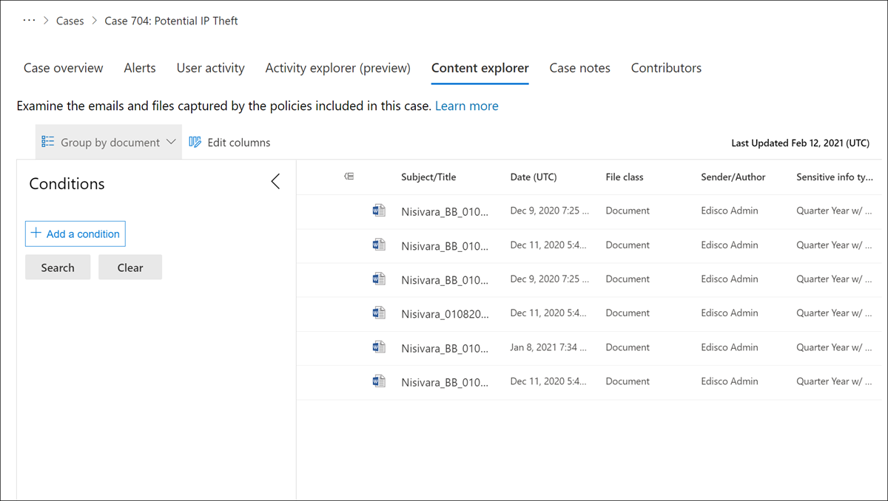

# Explorador de contenido de administración de riesgos de Insider

El Explorador de contenido de administración de riesgos interno permite a los usuarios asignados al rol Investigadores de administración de riesgos de *Insider* examinar el contexto y los detalles del contenido asociado con la actividad en las alertas. Para todas las alertas que se confirman en un caso, las copias de datos y archivos de mensajes se archivan como una instantánea en el momento de los elementos, mientras se mantienen los archivos y mensajes originales en los orígenes de almacenamiento. La copia de datos y mensajes es transparente para el usuario asociado con la alerta y para el propietario del contenido. Si el contenido incluye permisos de administración de derechos de información, estos permisos se mantienen para el contenido copiado y los usuarios asignados al rol Investigadores de administración de riesgos de *Insider* necesitarán estos permisos y derechos si necesitan abrir y ver los archivos. A cada archivo y mensaje se les asigna automáticamente un identificador de archivo único en el caso de administración de riesgos de Insider con fines de administración. Los documentos asociados con actividades de indicador de dispositivo no se incluyen en el Explorador de contenido.

## Opciones de columna

Para facilitar a los analistas e investigadores de riesgos la revisión de los datos y mensajes capturados y la revisión del contexto del caso, se incluyen varias herramientas de filtrado y ordenación en el Explorador de contenido. Para la ordenación básica, las columnas de clase **Date** y **File** admiten la ordenación mediante los títulos de columna en el panel de cola de contenido. Hay otras columnas de cola que se pueden agregar a la vista para proporcionar diferentes tablas dinámicas en los archivos y mensajes.

Para agregar o quitar encabezados de columna para la cola de contenido, use el **control** Editar columnas y seleccione entre las siguientes opciones de columna. Estas columnas se asignan a las condiciones de propiedad comunes, de correo electrónico y de documento admitidas en el Explorador de contenido y se enumeran más adelante en este artículo.

| **Opción de columna** | **Descripción** |
|:------------------|:----------------|
| **Author** | El campo de autor de los documentos de Office, que persiste si se copia un documento. Por ejemplo, si un usuario crea un documento y lo envía por correo electrónico a otra persona que lo carga en SharePoint, el documento conservará el autor original. |
| **Bcc** | Disponible para los mensajes de correo electrónico, los usuarios en el campo de mensaje CCO. |
| **Cc** | Disponible para los mensajes de correo electrónico, los usuarios en el campo de mensaje CC. |
| **Ruta compuesta** | Ruta de acceso legible para personas que describe el origen del elemento. |
| **Id. de conversación** | Identificador de conversación del mensaje. |
| **Índice de conversación** | Índice de conversación del mensaje. |
| **Hora de creación** | La hora en que se creó el archivo o el mensaje de correo electrónico. |
| **Fecha** | Para correo electrónico, la fecha en que un destinatario recibió un mensaje o en que un remitente envió un mensaje. Para los documentos, la fecha en que se modificó un documento por última vez. |
| **Tema dominante** | Tema dominante calculado para el análisis. |
| **Id. del conjunto de correo electrónico** | Id. de grupo de todos los mensajes del mismo conjunto de correo electrónico. |
| **Id. de familia** | Id. de familia agrupa todos los elementos; para el correo electrónico, esta columna incluye el mensaje y todos los datos adjuntos; para documentos, esta columna incluye el documento y los elementos incrustados. |
| **Clase File** | Para el contenido de SharePoint y OneDrive: **Documento;** para el contenido de Exchange: **Correo electrónico o **datos adjuntos.** |
| **Id. de archivo** | Identificador de documento único dentro del caso. |
| **Icono de tipo de archivo** | La extensión de un archivo; por ejemplo, docx, uno, pptx o xlsx. Este campo es la misma propiedad que la propiedad de sitio FileExtension. |
| **Id.** | Identificador GUID del archivo. |
| **Identificador inmutable** | Identificador inmutable almacenado en Office 365. |
| **Tipo inclusivo** | Tipo inclusivo calculado para análisis: **0,** no inclusivo; **1:** inclusive; **2** : menos inclusivo; **3:** copia inclusiva. |
| **Última modificación** | La fecha en la que el documento se modificó por última vez. |
| **Marcado como representativo** | Un documento de cada conjunto de duplicados exactos se marca como representante. |
| **Tipo de mensaje** | El tipo de mensaje de correo electrónico que se debe buscar. Valores posibles: contactos, documentos, correo electrónico, datos externos, faxes, mensajería instantánea, diarios, reuniones, microsoft teams (devuelve elementos de chats, reuniones y llamadas en Microsoft Teams), notas, publicaciones, fuentes rss, tareas, correo de voz |
| **Participantes** | Lista de todos los participantes de un mensaje; por ejemplo, Remitente, Para, CC, CCO. |
| **Identificador de tabla dinámica** | Identificador de una tabla dinámica. |
| **Received** | La fecha en la que un destinatario recibió un mensaje de correo electrónico. Este campo es la misma propiedad que la propiedad De correo electrónico recibido. |
| **Destinatarios** | Todos los campos de destinatario de un mensaje de correo electrónico. Estos campos son Para, CC y CCO. |
| **Id. de representante** | Identificador numérico de cada conjunto de duplicados exactos. |
| **Sender** | El remitente de un mensaje de correo electrónico. |
| **Remitente/autor** | Para correo electrónico, la persona que envió un mensaje. Para los documentos, la persona mencionada en el campo del autor de documentos de Office. Puede escribir más de un nombre, separados por comas. Dos o más valores están conectados de forma lógica por el operador de OR. |
| **Sent** | La fecha en la que un remitente envió un mensaje de correo electrónico. Este campo es la misma propiedad que la propiedad Correo electrónico enviado. |
| **Tamaño** | Para los correos electrónicos y documentos, el tamaño del elemento (en bytes). |
| **Asunto** | El texto en la línea de asunto de un mensaje de correo electrónico. |
| **Asunto/Título** | Para correo electrónico, el texto en la línea de asunto de un mensaje. Para los documentos, el título del documento. Como se ha explicado anteriormente, la propiedad Title es metadatos especificados en Microsoft Office documentos. Puede escribir el nombre de más de un asunto o título, separados por comas. Dos o más valores están conectados de forma lógica por el operador de OR. |
| **Lista de temas** | Lista de temas calculada para análisis. |
| **Title** | El título del documento. La propiedad Título son metadatos que se especifican en los documentos de Office. Es diferente del nombre de archivo del documento. |
| **Para** | El destinatario de un mensaje de correo electrónico en el campo Para. |

## Condiciones de búsqueda avanzadas

Puede agregar condiciones de búsqueda para restringir el ámbito de una búsqueda y devolver un conjunto de resultados más refinado. Cada condición agrega una cláusula a la consulta de búsqueda que se crea y se ejecuta cuando se inicia la búsqueda. Una condición está conectada lógicamente a la consulta de palabras clave (especificada en el cuadro de palabras clave) mediante un operador lógico (que se representa como c:c) que es similar en funcionalidad al operador AND. Esto significa que los elementos deben satisfacer tanto la consulta de palabras clave como una o más condiciones que se incluirán en los resultados de la búsqueda. Esta funcionalidad es la forma en que las condiciones ayudan a restringir los resultados.

Para herramientas avanzadas de filtro y búsqueda, expanda el **panel** Filtro en el lado izquierdo de la cola de contenido. Seleccione el **botón Agregar una condición** para abrir la lista de condiciones:

### Operadores usados con condiciones

|**Operador**|**Equivalente de consulta**|**Descripción**|
|:-----------|:-------------------|:--------------|
| **After** |`property>date`| Se usa con condiciones de fecha. Devuelve los elementos que se enviaron, recibieron o modificaron después de la fecha especificada.|
| **Before** |`property<date`| Se usa con condiciones de fecha. Devuelve los elementos que se enviaron, recibieron o modificaron antes de la fecha especificada.|
| **Between** |`date..date`| Se usa con condiciones de fecha y tamaño. Cuando se usa con una condición de fecha, devuelve los elementos que se enviaron, recibieron o modificaron durante el intervalo de fechas especificado. Cuando se usa con una condición de tamaño, devuelve los elementos cuyo tamaño está dentro del intervalo especificado.|
| **Contiene todo** |`(property:value) OR (property:value)`| Se usa con condiciones para las propiedades que especifican un valor de cadena. Devuelve elementos que contienen uno o más valores de cadena especificados. |
| **Contiene cualquiera de** |`(property:value) OR (property:value)`| Se usa con condiciones para las propiedades que especifican un valor de cadena. Devuelve elementos que contienen cualquier parte de uno o más valores de cadena especificados.|
| **No contiene ninguno de** |`-property:value`    `NOT property:value`| Se usa con condiciones para las propiedades que especifican un valor de cadena. Devuelve elementos que no contienen ninguna parte del valor de cadena especificado.|
| **No es igual a ninguna de las** |`-property=value`    `NOT property=value`| Se usa con condiciones para las propiedades que especifican un valor de cadena. Devuelve elementos que no contienen la cadena especificada.|
| **Es igual a** |`size=value`| Devuelve elementos que son iguales al tamaño especificado. 1|
| **Es igual a cualquiera de** |`(property=value) OR (property=value)`| Se usa con condiciones para las propiedades que especifican un valor de cadena. Devuelve elementos que coinciden exactamente con uno o más valores de cadena especificados.|
| **Es igual a ninguno de** |`(property=value) OR (property=value)`| Se usa con condiciones para las propiedades que especifican un valor de cadena. Devuelve elementos que no coinciden con uno o más valores de cadena especificados. |
| **Mayor que** |`size>value`| Devuelve elementos en los que la propiedad especificada es mayor que el valor especificado. 1|
| **Mayor o igual** |`size>=value`| Devuelve elementos en los que la propiedad especificada es mayor o igual que el valor especificado. 1|
| **Menor que** |`size<value`| Devuelve elementos que son mayores o iguales que el valor específico. 1|
| **Menor o igual** |`size<=value`| Devuelve elementos que son mayores o iguales que el valor específico. 1|
| **No es igual** |`size<>value`| Devuelve elementos que no son iguales al tamaño especificado. 1|

> [!NOTE]
> 1 Este operador solo está disponible para las condiciones que usan la propiedad Size.

### Condiciones de propiedad comunes

| **Opción de condición** | **Descripción** |
|:---------------------|:----------------|
| **Date** | Para correo electrónico, la fecha en que un destinatario recibió un mensaje o en que un remitente envió un mensaje. Para los documentos, la fecha en que se modificó un documento por última vez. |
| **Remitente/autor** | Para correo electrónico, la persona que envió un mensaje. Para los documentos, la persona mencionada en el campo del autor de documentos de Office. Puede escribir más de un nombre, separados por comas. Dos o más valores están conectados de forma lógica por el operador de **OR**. |
| **Tamaño** | Para los correos electrónicos y documentos, el tamaño del elemento (en bytes). |
| **Asunto/Título** | Para correo electrónico, el texto en la línea de asunto de un mensaje. Para los documentos, el título del documento. La propiedad Title de los documentos son metadatos especificados en Microsoft Office documentos. Puede escribir el nombre de más de un asunto o título, separados por comas. Dos o más valores están conectados de forma lógica por el operador de OR. |

### Condiciones de propiedad de correo electrónico

En la tabla siguiente se enumeran las condiciones de propiedad de los mensajes de correo electrónico disponibles en el Explorador de contenido.

| **Opción de condición** | **Descripción** |
|:---------------------|:----------------|
| **Bcc** | El campo CCO de un mensaje de correo electrónico. |
| **Cc** | El campo CC de un mensaje de correo electrónico. |
| **Seguridad del correo electrónico** | Configuración de seguridad del mensaje. |
| **Confidencialidad de correo electrónico** | Configuración de confidencialidad del mensaje. |
| **Id. del conjunto de correo electrónico** | Id. de grupo de todos los mensajes del mismo conjunto de correo electrónico. |
| **From** | El remitente de un mensaje de correo electrónico. |
| **Tiene datos adjuntos** | Indica si un mensaje tiene datos adjuntos. Use los valores **true** o **false**. |
| **Importance** | La importancia de un mensaje de correo electrónico, que un remitente puede especificar al enviar un mensaje. De manera predeterminada, los mensajes se envían con importancia normal, a menos que el remitente establezca la importancia como **alta** o **baja**.   |
| **Fecha de finalización de la reunión** | Fecha de finalización de la reunión para reuniones. |
| **Fecha de inicio de la reunión** | Fecha de inicio de la reunión para las reuniones. |
| **Tipo de mensaje** | El tipo de mensaje de correo electrónico que se debe buscar. Valores posibles: contactos, documentos, correo electrónico, datos externos, faxes, mensajería instantánea, diarios, reuniones, microsoft teams (devuelve elementos de chats, reuniones y llamadas en Microsoft Teams), notas, publicaciones, fuentes rss, tareas, correo de voz |
| **Dominio de participante** | Lista de todos los dominios de participantes de un mensaje. |
| **Participantes** | Todos los campos de personas de un mensaje de correo electrónico. Estos campos son From, To, CC y CCO. |
| **Received** | La fecha en la que un destinatario recibió un mensaje de correo electrónico. |
| **Dominios de destinatario** | Lista de todos los dominios de destinatarios de un mensaje. |
| **Sender** | Campo Remitente (de) para tipos de mensaje.  El formato **es DisplayName \<SmtpAddress>**. |
| **Dominio del remitente** | Dominio del remitente. |
| **Asunto** | El texto en la línea de asunto de un mensaje de correo electrónico.    **Nota:** Cuando se usa la propiedad Subject en una consulta, la búsqueda devuelve todos los mensajes en los que la línea de asunto contiene el texto que está buscando. En otras palabras, la consulta no devuelve solo los mensajes que tienen una coincidencia exacta. Por ejemplo, si busca , los resultados incluirán mensajes con el asunto `subject:"Quarterly Financials"` "Finanzas trimestrales 2018". |
| **Para** | El campo Para de un mensaje de correo electrónico. |
| **Único en el conjunto de correo electrónico** | False si hay un duplicado de los datos adjuntos en su conjunto de correo electrónico. |

## Condiciones de propiedad del documento

En la tabla siguiente se enumeran las condiciones de propiedad de los documentos disponibles en el Explorador de contenido. Muchas de estas condiciones de propiedad se comparten con conjuntos de revisión incluidos en casos de [eDiscovery avanzado.](document-metadata-fields-in-Advanced-eDiscovery.md)

| **Opción de condición** | **Descripción** |
|:---------------------|:----------------|
| **Puntuación de privilegios abogado-cliente** | Puntuación de contenido del modelo de privilegios abogado-cliente. |
| **Author** | El campo de autor de los documentos de Office, que persiste si se copia un documento. Por ejemplo, si un usuario crea un documento y lo envía por correo electrónico a otra persona que lo carga en SharePoint, el documento conservará el autor original. |
| **Etiquetas de cumplimiento** | Etiquetas de cumplimiento aplicadas en Office 365. |
| **Ruta compuesta** | Ruta de acceso legible para personas que describe el origen del elemento. |
| **Id. de conversación** | Identificador de conversación del mensaje. |
| **Hora de creación** | La hora en que se creó el archivo o el mensaje de correo electrónico. |
| **Custodian** | Nombre del administrador con el que se asoció el elemento. |
| **Tema dominante** | Tema dominante calculado para el análisis. |
| **Id. de familia** | Id. de familia agrupa todos los elementos; para el correo electrónico, este campo incluye el mensaje y todos los datos adjuntos; para los documentos, este campo incluye el documento y los elementos incrustados. |
| **Clase File** | Para el contenido de SharePoint y OneDrive: **Documento;** para el contenido de Exchange: **Correo electrónico o **datos adjuntos.** |
| **Tipos de archivo** | La extensión de un archivo; por ejemplo, docx, uno, pptx o xlsx. |
| **Tiene un abogado participante** | True cuando al menos uno de los participantes se encuentra en la lista de abogados; de lo contrario, el valor es False. |
| **Identificador inmutable** | Identificador inmutable almacenado en Office 365. |
| **Tipo inclusivo** | Tipo inclusivo calculado para análisis: **0,** no inclusivo; **1:** inclusive; **2** : menos inclusivo; **3:** copia inclusiva. |
| **Clase Item** | Clase de elemento proporcionada por exchange Server; por ejemplo, **IPM. Nota** |
| **Última modificación** | La fecha en la que el documento se modificó por última vez. |
| **Id. de carga** | Id. de carga, en el que el elemento se cargó en un conjunto de revisión. |
| **Nombre de la ubicación** | Cadena que identifica el origen del elemento.  Para Exchange, este campo será la dirección SMTP del buzón. Para SharePoint y OneDrive, la dirección URL de la colección de sitios. |
| **Marcado como representativo** | Un documento de cada conjunto de duplicados exactos se marca como representante. |
| **Extensión de archivo nativo** | Extensión nativa del elemento. |
| **Nombre de archivo nativo** | Nombre de archivo nativo del elemento. |
| **NdEtSortExclAttach** | Concatenación del conjunto de correo electrónico y el conjunto de ND para una ordenación eficaz en el tiempo de revisión; D se agrega como prefijo a los conjuntos de ND y E se agrega a los conjuntos de correo electrónico. |
| **Identificador de tabla dinámica** | Identificador de una tabla dinámica. |
| **Potencialmente con privilegios** | True si el modelo de detección de privilegios abogado-cliente considera que el documento puede tener privilegios. |
| **Estado de procesamiento** | Estado de procesamiento después de agregar el elemento a un conjunto de revisión. |
| **Percentil de lectura** | Percentil de lectura para el documento basado en relevancia. |
| **Puntuación de relevancia** | Puntuación de relevancia de un documento basado en relevancia. |
| **Etiqueta de relevancia** | Puntuación de relevancia de un documento basado en relevancia. |
| **Id. de representante** | Identificador numérico de cada conjunto de duplicados exactos. |
| **Tags** | Etiquetas aplicadas en un conjunto de revisión. |
| **Lista de temas** | Lista de temas calculada para análisis. |
| **Title** | El título del documento. La propiedad Título son metadatos que se especifican en los documentos de Office. Es diferente del nombre de archivo del documento. |
| **Se ha corregido** | True si se ha corregido el elemento; de lo contrario, False. |
| **Conteo de palabras** | El número de palabras de un archivo. |
