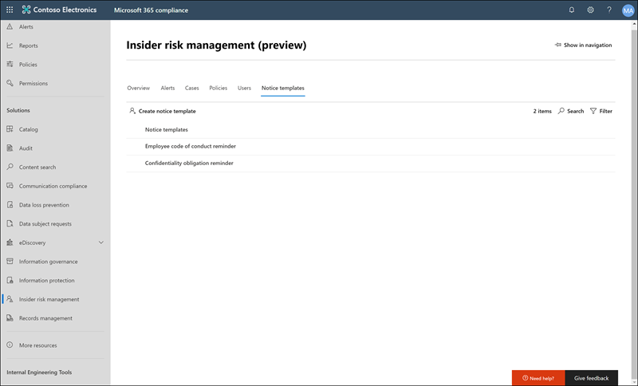

# <a name="insider-risk-management-notice-templates-preview"></a>Plantillas de aviso de administración de riesgos de Insider (versión preliminar)

Las plantillas de aviso de administración de riesgos de Insider permiten enviar mensajes de correo electrónico a los empleados cuando sus actividades generan una coincidencia de directiva y una alerta. En la mayoría de los casos, las acciones de los empleados que generan alertas son el resultado de errores o actividades involuntarias sin intención. Los avisos sirven como sencillos avisos a los empleados para que tengan más cuidado o proporcionen vínculos o información para un aprendizaje de refresco o recursos de directivas corporativas. Los avisos pueden ser una parte importante del programa de formación de cumplimiento interno y pueden ayudar a crear una pista de auditoría documentada para los empleados con actividades recurrentes de riesgo.

Cree plantillas de aviso si desea enviar a los usuarios un aviso de recordatorio de correo electrónico sobre las coincidencias de directivas como parte del proceso de resolución de problemas. Los avisos solo pueden enviarse a la dirección de correo electrónico del empleado asociada a la alerta específica que se está revisando. Al seleccionar una plantilla de notificación para aplicar a una coincidencia de Directiva, puede optar por aceptar los valores de campo definidos en la plantilla o sobrescribir los campos según sea necesario.

## <a name="notice-templates-dashboard"></a>Panel plantillas de aviso

El **Panel plantillas de notificaciones** muestra una lista de plantillas de aviso configuradas y le permite crear nuevas plantillas de aviso. Las plantillas de aviso se enumeran en orden de fecha inverso con la plantilla de aviso más reciente que aparece en primer lugar.



## <a name="html-for-notices"></a>HTML para avisos

Si desea crear más de un mensaje de correo electrónico basado en texto sencillo para las notificaciones, puede crear un mensaje más detallado usando HTML en el campo cuerpo del mensaje de una plantilla de notificación. El siguiente ejemplo proporciona el formato del cuerpo del mensaje para una plantilla básica de notificación de correo electrónico basada en HTML:

```HTML
<!DOCTYPE html>
<html>
<body>
<h2>Action Required: Contoso Employee Code of Conduct Policy Training</h2>
<p>A recent activity you've performed has generated a risk alert prohibited by the Contoso Employee <a href='https://www.contoso.com'>Code of Conduct Policy</a>.</p>
<p>You are required to attend the Contoso Employee Code of Conduct <a href='https://www.contoso.com'>training</a> within the next 14 days. Please contact <a href='mailto:hr@contoso.com'>Human Resources</a> with any questions about this training request.</p>
<p>Thank you,</p>
<p><em>Human Resources</em></p>
</body>
</html>
```

> [!NOTE]
> La implementación de atributos de href HTML en las plantillas de aviso de administración de riesgos de Insider solo admiten comillas simples en lugar de comillas dobles para las referencias a direcciones URL.

## <a name="create-a-new-notice-template"></a>Crear una nueva plantilla de aviso

Para crear una nueva plantilla de aviso de administración de riesgos de Insider, use el Asistente para notificaciones de la solución de **Administración de riesgos de Insider** en el centro de cumplimiento de Microsoft 365.

Complete los siguientes pasos para crear una nueva plantilla de aviso de administración de riesgos de Insider:

1. En el [centro de cumplimiento de Microsoft 365](https://compliance.microsoft.com), vaya a **Administración de riesgos de Insider** y seleccione la pestaña **plantillas de notificación** .
2. Seleccione **Crear plantilla de notificación** para abrir el Asistente para anuncios.
3. En la página **crear una nueva plantilla de notificación** , complete los campos siguientes:
    - **Nombre de plantilla**: escriba un nombre descriptivo para el aviso. Este nombre aparece en la lista de avisos en el panel de notificación y en la lista de selección de aviso al enviar avisos desde un caso.
    - **Enviar desde**: escriba la dirección de correo electrónico del remitente para el aviso. Esta dirección aparecerá en el campo **desde:** de todos los avisos que se envían a los empleados a menos que se cambie al enviar un aviso desde un caso.
    - Campos **CC y CCO** : usuarios o grupos opcionales a los que se les notificará la coincidencia de la Directiva, seleccionada en Active Directory de la suscripción.
    - **Asunto**: la información que aparece en la línea de asunto del mensaje admite caracteres de texto.
    - **Cuerpo del mensaje**: información que aparece en el cuerpo del mensaje, compatible con texto o con valores HTML.
4. Seleccione **crear** para crear y guardar la plantilla de aviso o seleccione **Cancelar** para cerrar sin guardar la plantilla de aviso.

## <a name="update-a-notice-template"></a>Actualizar una plantilla de aviso

Para actualizar una plantilla de aviso de administración de riesgos de Insider existente, siga estos pasos:

1. En el [centro de cumplimiento de Microsoft 365](https://compliance.microsoft.com), vaya a **Administración de riesgos de Insider** y seleccione la pestaña **plantillas de notificación** .
2. En el panel de notificación, seleccione la plantilla de notificación que desea administrar.
3. En la página Detalles de la notificación, seleccione **Editar**
4. En la página **Editar** , puede editar los campos siguientes:
    - **Nombre de plantilla**: escriba un nuevo nombre descriptivo para el aviso. Este nombre aparece en la lista de avisos en el panel de notificación y en la lista de selección de aviso al enviar avisos desde un caso.
    - **Send from**: actualizar la dirección de correo electrónico del remitente para el aviso. Esta dirección aparecerá en el campo **desde:** de todos los avisos que se envían a los empleados a menos que se cambie al enviar un aviso desde un caso.
    - Campos **CC y CCO** : actualizar grupos o usuarios opcionales para recibir una notificación de la coincidencia de la Directiva, seleccionada en Active Directory de la suscripción.
    - **Asunto**: la información de actualización que aparece en la línea de asunto del mensaje admite caracteres de texto.
    - **Cuerpo del mensaje**: actualizar la información que aparece en el cuerpo del mensaje, admite texto o valores HTML.
5. Seleccione **Guardar** para actualizar y guardar el aviso o seleccione **Cancelar** para cerrar sin guardar la plantilla de aviso.

## <a name="delete-a-notice-template"></a>Eliminar una plantilla de aviso

Para eliminar una plantilla de aviso de administración de riesgos de Insider existente, siga estos pasos:

1. En el [centro de cumplimiento de Microsoft 365](https://compliance.microsoft.com), vaya a **Administración de riesgos de Insider** y seleccione la pestaña **plantillas de notificación** .
2. En el panel de notificación, seleccione la plantilla de aviso que desea eliminar.
3. Seleccione el icono **eliminar** en la barra de herramientas.
4. Para eliminar la plantilla de aviso, seleccione **sí** en el cuadro de diálogo eliminar. Para cancelar la eliminación, seleccione **Cancelar**.
