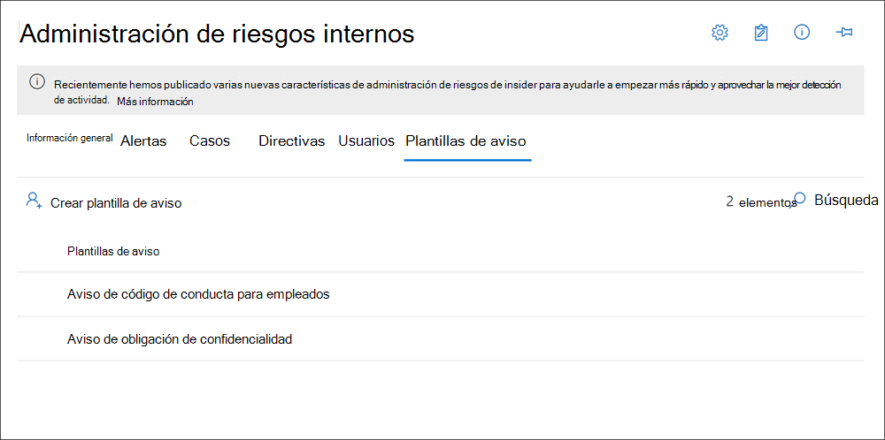

# <a name="insider-risk-management-notice-templates"></a>Plantillas de aviso de administración de riesgos de Insider

Las plantillas de aviso de administración de riesgos de Insider permiten enviar mensajes de correo electrónico a los usuarios cuando sus actividades generan una alerta y coincidencia de directiva. En la mayoría de los casos, las acciones de usuario que generan alertas son el resultado de errores o actividades involuntarias sin mala intención. Los avisos sirven como simples avisos a los usuarios para que tengan más cuidado, proporcionen vínculos a información para el aprendizaje de actualización o a recursos de directivas corporativas. Los avisos pueden ser una parte importante del programa de aprendizaje de cumplimiento interno y pueden ayudar a crear una pista de auditoría documentada para los usuarios con actividades de riesgo periódicas.

Cree plantillas de aviso si desea enviar a los usuarios un aviso de aviso por correo electrónico para las coincidencias de directiva como parte del proceso de resolución de problemas. Los avisos solo se pueden enviar a la dirección de correo electrónico del usuario asociada con la alerta específica que se está revisando. Al seleccionar una plantilla de aviso para aplicar a una coincidencia de directiva, puede elegir aceptar los valores de campo definidos en la plantilla o sobrescribir los campos según sea necesario.

## <a name="notice-templates-dashboard"></a>Panel de plantillas de aviso

El **panel de plantillas de avisos** muestra una lista de plantillas de avisos configuradas y le permite crear nuevas plantillas de avisos. Las plantillas de aviso se muestran en orden de fecha inverso con la plantilla de aviso más reciente al principio de la lista.



## <a name="html-for-notices"></a>HTML para avisos

Si desea crear más que un mensaje de correo electrónico simple basado en texto para notificaciones, puede crear un mensaje más detallado mediante HTML en el campo cuerpo del mensaje de una plantilla de aviso. En el siguiente ejemplo se proporciona el formato del cuerpo del mensaje para una plantilla básica de notificación de correo electrónico basada en HTML:

```HTML
<!DOCTYPE html>
<html>
<body>
<h2>Action Required: Contoso User Code of Conduct Policy Training</h2>
<p>A recent activity you've performed has generated a risk alert prohibited by the Contoso User <a href='https://www.contoso.com'>Code of Conduct Policy</a>.</p>
<p>You are required to attend the Contoso User Code of Conduct <a href='https://www.contoso.com'>training</a> within the next 14 days. Please contact <a href='mailto:hr@contoso.com'>Human Resources</a> with any questions about this training request.</p>
<p>Thank you,</p>
<p><em>Human Resources</em></p>
</body>
</html>
```

> [!NOTE]
> La implementación de atributos href HTML en las plantillas de aviso de administración de riesgos insider admiten actualmente sólo comillas simples en lugar de comillas dobles para las referencias url.

## <a name="create-a-new-notice-template"></a>Crear una nueva plantilla de aviso

Para crear una nueva plantilla de aviso de administración de riesgos de **insider,** usará el Asistente para avisos en la solución de administración de riesgos insider en el centro de Microsoft 365 cumplimiento.

Complete los siguientes pasos para crear una nueva plantilla de aviso de administración de riesgos insider:

1. En el [centro Microsoft 365 cumplimiento,](https://compliance.microsoft.com)vaya a Administración de riesgos **de Insider** y seleccione la pestaña **Plantillas de** aviso.
2. Seleccione **Crear plantilla de aviso** para abrir el asistente para avisos.
3. En la **página Crear una nueva plantilla de aviso,** complete los siguientes campos:
    - **Nombre de plantilla:** escriba un nombre descriptivo para el aviso. Este nombre aparece en la lista de avisos en el panel de avisos y en la lista de selección de avisos al enviar avisos desde un caso.
    - **Enviar desde:** escriba la dirección de correo electrónico del remitente para el aviso. Esta dirección aparecerá en el **campo De:** en todos los avisos enviados a los usuarios a menos que se cambie al enviar un aviso desde un caso.
    - Campos CC y **CCO:** usuarios o grupos opcionales que se notificarán de la coincidencia de directiva, seleccionados desde Active Directory para la suscripción.
    - **Asunto:** la información que aparece en la línea de asunto del mensaje admite caracteres de texto.
    - **Cuerpo del mensaje:** información que aparece en el cuerpo del mensaje, admite valores de texto o HTML.
4. Seleccione **Crear** para crear y guardar la plantilla de aviso o **seleccione Cancelar** para cerrarla sin guardar la plantilla de aviso.

## <a name="update-a-notice-template"></a>Actualizar una plantilla de aviso

Para actualizar una plantilla de aviso de administración de riesgos insider existente, siga estos pasos:

1. En el [centro Microsoft 365 cumplimiento,](https://compliance.microsoft.com)vaya a Administración de riesgos **de Insider** y seleccione la pestaña **Plantillas de** aviso.
2. En el panel de avisos, seleccione la plantilla de aviso que desea administrar.
3. En la página de detalles del aviso, seleccione **Editar**
4. En la **página** Editar, puede editar los campos siguientes:
    - **Nombre de plantilla:** escriba un nuevo nombre descriptivo para el aviso. Este nombre aparece en la lista de avisos en el panel de avisos y en la lista de selección de avisos al enviar avisos desde un caso.
    - **Enviar desde**: Actualizar la dirección de correo electrónico del remitente para el aviso. Esta dirección aparecerá en el **campo De:** en todos los avisos enviados a los usuarios a menos que se cambie al enviar un aviso desde un caso.
    - Campos CC y **CCO:** actualice los usuarios o grupos opcionales que se notificarán de la coincidencia de directiva, seleccionados en Active Directory para su suscripción.
    - **Asunto:** actualiza la información que aparece en la línea de asunto del mensaje y admite caracteres de texto.
    - **Cuerpo del mensaje:** actualice la información que aparece en el cuerpo del mensaje, admite valores de texto o HTML.
5. Seleccione **Guardar** para actualizar y guardar el aviso o **seleccione Cancelar** para cerrar sin guardar la plantilla de aviso.

## <a name="delete-a-notice-template"></a>Eliminar una plantilla de aviso

Para eliminar una plantilla de aviso de administración de riesgos insider existente, siga estos pasos:

1. En el [centro Microsoft 365 cumplimiento,](https://compliance.microsoft.com)vaya a Administración de riesgos **de Insider** y seleccione la pestaña **Plantillas de** aviso.
2. En el panel de avisos, seleccione la plantilla de aviso que desea eliminar.
3. Seleccione el **icono Eliminar** de la barra de herramientas.
4. Para eliminar la plantilla de aviso, seleccione **Sí** en el cuadro de diálogo eliminar. Para cancelar la eliminación, seleccione **Cancelar**.
