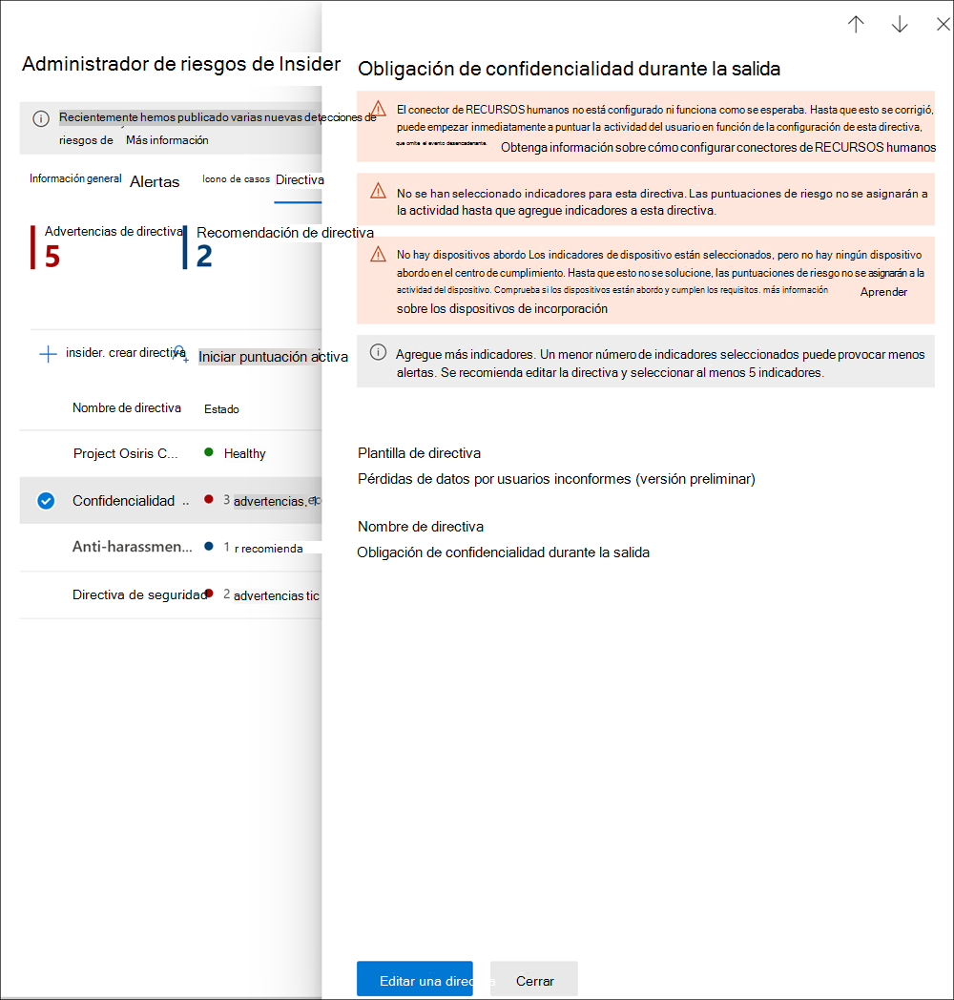

# <a name="insider-risk-management-policies"></a><span data-ttu-id="4c9f7-104">Directivas de administración de riesgos internos</span><span class="sxs-lookup"><span data-stu-id="4c9f7-104">Insider risk management policies</span></span>

<span data-ttu-id="4c9f7-105">Las directivas de administración de riesgos internos determinan qué usuarios deben estar dentro del ámbito de búsqueda y qué tipos de indicadores de riesgo están configurados para las alertas.</span><span class="sxs-lookup"><span data-stu-id="4c9f7-105">Insider risk management policies determine which users are in-scope and which types of risk indicators are configured for alerts.</span></span> <span data-ttu-id="4c9f7-106">Puede crear rápidamente una directiva que se aplique a todos los usuarios de su organización o definir usuarios o grupos individuales para su administración en una directiva.</span><span class="sxs-lookup"><span data-stu-id="4c9f7-106">You can quickly create a policy that applies to all users in your organization or define individual users or groups for management in a policy.</span></span> <span data-ttu-id="4c9f7-107">Las directivas son compatibles con las prioridades de contenido para centrar las condiciones de las directivas en varios o determinados Microsoft Teams, sitios de SharePoint, tipos de confidencialidad de datos y etiquetas de datos.</span><span class="sxs-lookup"><span data-stu-id="4c9f7-107">Policies support content priorities to focus policy conditions on multiple or specific Microsoft Teams, SharePoint sites, data sensitivity types, and data labels.</span></span> <span data-ttu-id="4c9f7-108">Mediante el uso de plantillas, puede seleccionar indicadores de riesgo específicos y personalizar los umbrales de los eventos para los indicadores de directivas, personalizando eficazmente las puntuaciones de riesgo y el nivel y la frecuencia de las alertas.</span><span class="sxs-lookup"><span data-stu-id="4c9f7-108">Using templates, you can select specific risk indicators and customize event thresholds for policy indicators, effectively customizing risk scores, and level and frequency of alerts.</span></span> <span data-ttu-id="4c9f7-109">Además, los impulsores de la puntuación de riesgo y las detecciones de anomalías ayudan a identificar la actividad del usuario que es de mayor importancia o más inusual.</span><span class="sxs-lookup"><span data-stu-id="4c9f7-109">Additionally, risk score boosters and anomaly detections help identify user activity that is of higher importance or more unusual.</span></span> <span data-ttu-id="4c9f7-110">Las ventanas de la directiva permiten definir el marco temporal para aplicar la directiva a las actividades de alerta y se usan para determinar la duración de la directiva una vez activada.</span><span class="sxs-lookup"><span data-stu-id="4c9f7-110">Policy windows allow you to define the time frame to apply the policy to alert activities and are used to determine the duration of the policy once activated.</span></span>

<span data-ttu-id="4c9f7-111">Vea el vídeo sobre la [configuración de las directivas de administración de riesgos internos](https://www.youtube.com/watch?v=kudK5ajZTUo) para obtener una visión general de cómo las directivas creadas con las plantillas de directivas integradas pueden ayudarle a tomar rápidamente medidas sobre los posibles riesgos.</span><span class="sxs-lookup"><span data-stu-id="4c9f7-111">Check out the [Insider Risk Management Policies Configuration video](https://www.youtube.com/watch?v=kudK5ajZTUo) for an overview of how policies created with built-in policy templates can help you to quickly take action on potential risks.</span></span>

## <a name="policy-dashboard"></a><span data-ttu-id="4c9f7-112">Panel de directivas</span><span class="sxs-lookup"><span data-stu-id="4c9f7-112">Policy dashboard</span></span>

<span data-ttu-id="4c9f7-113">El **Panel de control de la directiva** le permite ver rápidamente las directivas de su organización, el estado de las mismas, agregar manualmente usuarios a las directivas y ver el estado de las alertas asociadas a cada directiva.</span><span class="sxs-lookup"><span data-stu-id="4c9f7-113">The **Policy dashboard** allows you to quickly see the policies in your organization, the health of the policy, manually add users to policies, and the view the status of alerts associated with each policy.</span></span>

- <span data-ttu-id="4c9f7-114">**Nombre de la directiva**: el nombre asignado a la directiva en el asistente de directivas educativas.</span><span class="sxs-lookup"><span data-stu-id="4c9f7-114">**Policy name**: The name assigned to the policy in the policy wizard.</span></span>
- <span data-ttu-id="4c9f7-115">**Estado**: el estado de cada directiva.</span><span class="sxs-lookup"><span data-stu-id="4c9f7-115">**Status**: The health status for each policy.</span></span> <span data-ttu-id="4c9f7-116">Muestra el número de advertencias y recomendaciones de las directivas, o un estado *Correcto* para las directivas sin problemas.</span><span class="sxs-lookup"><span data-stu-id="4c9f7-116">Displays number of policy warnings and recommendations, or a status of *Healthy* for policies without issues.</span></span>  <span data-ttu-id="4c9f7-117">Puede hacer clic en la directiva para ver los detalles del estado para cualquier advertencia o recomendación.</span><span class="sxs-lookup"><span data-stu-id="4c9f7-117">You can click on the policy to see the health status details for any warnings or recommendations.</span></span>
- <span data-ttu-id="4c9f7-118">**Alertas activas**: el número de alertas activas para cada directiva.</span><span class="sxs-lookup"><span data-stu-id="4c9f7-118">**Active alerts**: The number of active alerts for each policy.</span></span>
- <span data-ttu-id="4c9f7-119">**Alertas confirmadas**: el número total de alertas que generaron casos de la directiva en los últimos 365 días.</span><span class="sxs-lookup"><span data-stu-id="4c9f7-119">**Confirmed alerts**: The total number of alerts the resulted in cases from the policy in the last 365 days.</span></span>
- <span data-ttu-id="4c9f7-120">**Acciones realizadas en alertas**: el número total de alertas que se confirmaron o descartaron durante los últimos 365 días.</span><span class="sxs-lookup"><span data-stu-id="4c9f7-120">**Actions taken on alerts**: The total number of alerts that were confirmed or dismissed for the last 365 days.</span></span>
- <span data-ttu-id="4c9f7-121">**Efectividad de la alerta de la directiva**: el porcentaje determinado por el total de alertas confirmadas dividido entre el total de acciones realizadas en alertas (que es la suma de alertas que se confirmaron o descartaron durante el año pasado).</span><span class="sxs-lookup"><span data-stu-id="4c9f7-121">**Policy alert effectiveness**: The percentage determined by total confirmed alerts divided by total actions taken on alerts (which is the sum of alerts that were confirmed or dismissed over the past year).</span></span>


## <a name="policy-recommendations-from-analytics-preview"></a><span data-ttu-id="4c9f7-123">Recomendaciones de directivas a partir de los análisis (versión preliminar)</span><span class="sxs-lookup"><span data-stu-id="4c9f7-123">Policy recommendations from analytics (preview)</span></span>

<span data-ttu-id="4c9f7-124">Los análisis de riesgos internos le permiten realizar una evaluación de los posibles riesgos internos en su organización sin necesidad de configurar ninguna directiva de riesgos internos.</span><span class="sxs-lookup"><span data-stu-id="4c9f7-124">Insider risk analytics enables you to conduct an evaluation of potential insider risks in your organization without configuring any insider risk policies.</span></span> <span data-ttu-id="4c9f7-125">Esta evaluación puede ayudar a su organización a identificar áreas potenciales de mayor riesgo para los usuarios y ayudar a determinar el tipo y el alcance de las directivas de administración de riesgos internos que puede considerar configurar.</span><span class="sxs-lookup"><span data-stu-id="4c9f7-125">This evaluation can help your organization identify potential areas of higher user risk and help determine the type and scope of insider risk management policies you may consider configuring.</span></span>

<span data-ttu-id="4c9f7-126">Para obtener más información sobre los análisis de riesgos internos y las recomendaciones de directivas, vea [Configuración de la administración de riesgos internos: Análisis (versión preliminar)](insider-risk-management-settings.md#analytics-preview).</span><span class="sxs-lookup"><span data-stu-id="4c9f7-126">To learn more about insider risk analytics and policy recommendations, see [Insider risk management settings: Analytics (preview)](insider-risk-management-settings.md#analytics-preview).</span></span>

## <a name="policy-templates"></a><span data-ttu-id="4c9f7-127">Plantillas de directiva</span><span class="sxs-lookup"><span data-stu-id="4c9f7-127">Policy templates</span></span>

<span data-ttu-id="4c9f7-128">Las plantillas de administración de riesgos internos son condiciones predefinidas de la directiva que definen los tipos de indicadores de riesgo y el modelo de puntuación de riesgos que usa la directiva.</span><span class="sxs-lookup"><span data-stu-id="4c9f7-128">Insider risk management templates are pre-defined policy conditions that define the types of risk indicators and risk scoring model used by the policy.</span></span> <span data-ttu-id="4c9f7-129">Cada directiva debe tener una plantilla asignada en el asistente de creación de directivas antes de que se cree la directiva.</span><span class="sxs-lookup"><span data-stu-id="4c9f7-129">Each policy must have a template assigned in the policy creation wizard before the policy is created.</span></span> <span data-ttu-id="4c9f7-130">La administración de riesgos internos admite hasta cinco directivas para cada plantilla de directivas.</span><span class="sxs-lookup"><span data-stu-id="4c9f7-130">Insider risk management supports up to five policies for each policy template.</span></span> <span data-ttu-id="4c9f7-131">Cuando se crea una nueva directiva de riesgos internos con el asistente de directivas, se elige una de las siguientes plantillas de directivas:</span><span class="sxs-lookup"><span data-stu-id="4c9f7-131">When you create a new insider risk policy with the policy wizard, you'll choose from one of the following policy templates:</span></span>

### <a name="data-theft-by-departing-users"></a><span data-ttu-id="4c9f7-132">Robo de datos por parte de los usuarios que abandonan la organización</span><span class="sxs-lookup"><span data-stu-id="4c9f7-132">Data theft by departing users</span></span>

<span data-ttu-id="4c9f7-133">Cuando los usuarios abandonan su organización, existen indicadores de riesgo específicos que suelen asociarse al robo de datos por parte de los usuarios que abandonan la organización.</span><span class="sxs-lookup"><span data-stu-id="4c9f7-133">When users leave your organization, there are specific risk indicators typically associated with data theft by departing users.</span></span> <span data-ttu-id="4c9f7-134">Esta plantilla de directiva utiliza los indicadores de filtración para la puntuación del riesgo y se centra en la detección y las alertas en esta área de riesgo.</span><span class="sxs-lookup"><span data-stu-id="4c9f7-134">This policy template uses exfiltration indicators for risk scoring and focuses on detection and alerts in this risk area.</span></span> <span data-ttu-id="4c9f7-135">El robo de datos por parte de los usuarios que abandonan la organización puede incluir la descarga de archivos de SharePoint Online, la impresión de archivos y la copia de datos en servicios personales de mensajería y almacenamiento en la nube cerca de sus fechas de renuncia y finalización del empleo.</span><span class="sxs-lookup"><span data-stu-id="4c9f7-135">Data theft for departing users may include downloading files from SharePoint Online, printing files, and copying data to personal cloud messaging and storage services near their employment resignation and end dates.</span></span> <span data-ttu-id="4c9f7-136">Al usar el conector de recursos humanos de Microsoft 365 o la opción de supervisar automáticamente la eliminación de cuentas de usuario en Azure Active Directory para su organización, esta plantilla comienza a puntuar los indicadores de riesgo relacionados con estas actividades y cómo se correlacionan con el estado de empleo del usuario.</span><span class="sxs-lookup"><span data-stu-id="4c9f7-136">By using either the Microsoft 365 HR connector or the option to automatically monitor for user account deletion in Azure Active Directory for your organization, this template starts scoring for risk indicators relating to these activities and how they correlate with user employment status.</span></span>

>[!IMPORTANT]
><span data-ttu-id="4c9f7-137">Al usar esta plantilla, puede configurar un conector de recursos humanos de Microsoft 365 para importar periódicamente la información de las fechas de renuncia y finalización de los usuarios de su organización.</span><span class="sxs-lookup"><span data-stu-id="4c9f7-137">When using this template, you can configure a Microsoft 365 HR connector to periodically import resignation and termination date information for users in your organization.</span></span> <span data-ttu-id="4c9f7-138">Vea el artículo [Importar datos con el conector de recursos humanos](import-hr-data.md) para obtener una guía paso a paso para configurar el conector de recursos humanos de Microsoft 365 para su organización.</span><span class="sxs-lookup"><span data-stu-id="4c9f7-138">See the [Import data with the HR connector](import-hr-data.md) article for step-by-step guidance to configure the Microsoft 365 HR connector for your organization.</span></span> <span data-ttu-id="4c9f7-139">Si decide no usar el conector de recursos humanos, debe seleccionar la opción Cuenta de usuario eliminada de Azure AD al configurar los eventos desencadenantes en el asistente de directivas.</span><span class="sxs-lookup"><span data-stu-id="4c9f7-139">If you choose not to use the HR connector, you must select the User account deleted from Azure AD option when configuring trigger events in the policy wizard.</span></span>

### <a name="general-data-leaks"></a><span data-ttu-id="4c9f7-140">Filtraciones de datos generales</span><span class="sxs-lookup"><span data-stu-id="4c9f7-140">General data leaks</span></span>

<span data-ttu-id="4c9f7-141">La protección de los datos y la prevención de las filtraciones es un reto constante para la mayoría de las organizaciones, especialmente con el rápido crecimiento de los nuevos datos creados por los usuarios, los dispositivos y los servicios.</span><span class="sxs-lookup"><span data-stu-id="4c9f7-141">Protecting data and preventing data leaks is a constant challenge for most organizations, particularly with the rapid grow of new data created by users, devices, and services.</span></span> <span data-ttu-id="4c9f7-142">Los usuarios tienen la posibilidad de crear, almacenar y compartir información a través de servicios y dispositivos que hacen que la administración de las filtraciones de datos sea cada vez más compleja y difícil.</span><span class="sxs-lookup"><span data-stu-id="4c9f7-142">Users are empowered to create, store, and share information across services and devices that make managing data leaks increasingly more complex and difficult.</span></span> <span data-ttu-id="4c9f7-143">Las filtraciones de datos pueden incluir la divulgación accidental de información fuera de su organización o el robo de datos con fines malintencionados.</span><span class="sxs-lookup"><span data-stu-id="4c9f7-143">Data leaks can include accidental oversharing of information outside your organization or data theft with malicious intent.</span></span> <span data-ttu-id="4c9f7-144">Con una directiva de prevención de pérdida de datos (DLP) asignada o el evento desencadenante incorporado, esta plantilla comienza a marcar las detecciones en tiempo real de descargas de datos sospechosas de SharePoint Online, el uso compartido de archivos y carpetas, la impresión de archivos y la copia de datos en servicios personales de mensajería y almacenamiento en la nube.</span><span class="sxs-lookup"><span data-stu-id="4c9f7-144">With an assigned Data Loss Prevention (DLP) policy or the built-in triggering event, this template starts scoring real-time detections of suspicious SharePoint Online data downloads, file and folder sharing, printing files, and copying data to personal cloud messaging and storage services.</span></span>

<span data-ttu-id="4c9f7-145">Al usar una plantilla de *Filtración de datos*, puede asignar una directiva DLP para activar indicadores en la directiva de riesgo interno para alertas de alta gravedad en su organización.</span><span class="sxs-lookup"><span data-stu-id="4c9f7-145">When using a *Data leaks* template, you can assign a DLP policy to trigger indicators in the insider risk policy for high severity alerts in your organization.</span></span> <span data-ttu-id="4c9f7-146">Cada vez que una regla de directiva DLP genera una alerta de alta gravedad que se agrega al registro de auditoría de Office 365, las directivas de riesgo interno creadas con esta plantilla examinan automáticamente la alerta de DLP de alta gravedad.</span><span class="sxs-lookup"><span data-stu-id="4c9f7-146">Whenever a high severity alert is generated by a DLP policy rule is added to the Office 365 audit log, insider risk policies created with this template automatically examine the high severity DLP alert.</span></span> <span data-ttu-id="4c9f7-147">Si la alerta contiene un usuario dentro del ámbito definido en la directiva de riesgo interno, la alerta es procesada por la directiva de riesgo interno como una nueva alerta y se le asigna una gravedad de riesgo interno y una puntuación de riesgo.</span><span class="sxs-lookup"><span data-stu-id="4c9f7-147">If the alert contains an in-scope user defined in the insider risk policy, the alert is processed by the insider risk policy as a new alert and assigned an insider risk severity and risk score.</span></span> <span data-ttu-id="4c9f7-148">Esta directiva le permite evaluar esta alerta en contexto con otras actividades incluidas en el caso.</span><span class="sxs-lookup"><span data-stu-id="4c9f7-148">This policy allows you to evaluate this alert in context with other activities included in the case.</span></span> <span data-ttu-id="4c9f7-149">Si no elige una directiva DLP, debe seleccionar el evento desencadenante incorporado.</span><span class="sxs-lookup"><span data-stu-id="4c9f7-149">If you don't choose a DLP policy, you must select the built-in triggering event.</span></span>

#### <a name="data-leaks-policy-guidelines"></a><span data-ttu-id="4c9f7-150">Directrices de la directiva sobre filtración de datos</span><span class="sxs-lookup"><span data-stu-id="4c9f7-150">Data leaks policy guidelines</span></span>

<span data-ttu-id="4c9f7-151">Al crear o modificar las directivas DLP para usarlas con las directivas de administración de riesgos internos, tenga en cuenta las siguientes directrices:</span><span class="sxs-lookup"><span data-stu-id="4c9f7-151">When creating or modifying DLP policies for use with insider risk management policies, consider the following guidelines:</span></span>

- <span data-ttu-id="4c9f7-152">Establezca prioridad a los eventos de filtración de datos y sea selectivo a la hora de asignar la configuración de los **Informes de incidentes** a *Alto* cuando configure las reglas en sus directivas DLP.</span><span class="sxs-lookup"><span data-stu-id="4c9f7-152">Prioritize data exfiltration events and be selective when assigning **Incident reports** settings to *High* when configuring rules in your DLP policies.</span></span> <span data-ttu-id="4c9f7-153">Por ejemplo, enviar por correo electrónico documentos confidenciales a un competidor conocido debería ser un evento de filtración de nivel de alerta *Alto*.</span><span class="sxs-lookup"><span data-stu-id="4c9f7-153">For example, emailing sensitive documents to a known competitor should be a *High* alert level exfiltration event.</span></span> <span data-ttu-id="4c9f7-154">La sobreasignación del nivel *Alto* en la configuración de los **Informes de incidentes** en otras reglas de directivas DLP puede aumentar el ruido en el flujo de trabajo de las alertas de administración de riesgos internos y dificultar la evaluación adecuada de estas alertas por parte de los investigadores y analistas de datos.</span><span class="sxs-lookup"><span data-stu-id="4c9f7-154">Over-assigning the *High* level in the **Incident reports** settings in other DLP policy rules can increase the noise in the insider risk management alert workflow and make it more difficult for your data investigators and analysts to properly evaluate these alerts.</span></span> <span data-ttu-id="4c9f7-155">Por ejemplo, la asignación de niveles de alerta *Alto* a las actividades de denegación de acceso en las directivas DLP hace que sea más difícil evaluar los comportamientos y actividades de los usuarios de riesgo.</span><span class="sxs-lookup"><span data-stu-id="4c9f7-155">For example, assigning *High* alert levels to access denial activities in DLP policies makes it more challenging to evaluate truly risky user behavior and activities.</span></span>
- <span data-ttu-id="4c9f7-156">Asegúrese de comprender y configurar correctamente los usuarios dentro del ámbito de aplicación tanto en la DLP como en las directivas de administración de riesgos internos.</span><span class="sxs-lookup"><span data-stu-id="4c9f7-156">Make sure you understand and properly configure the in-scope users in both the DLP and insider risk management policies.</span></span> <span data-ttu-id="4c9f7-157">Solo los usuarios definidos como dentro del ámbito de las directivas de administración de riesgos internos usando la plantilla de **Filtración de datos** tendrán alertas de directivas DLP de alta gravedad procesadas.</span><span class="sxs-lookup"><span data-stu-id="4c9f7-157">Only users defined as in-scope for insider risk management policies using the **Data leaks** template will have high severity DLP policy alerts processed.</span></span> <span data-ttu-id="4c9f7-158">Además, únicamente los usuarios definidos como dentro del ámbito de una regla para una alerta DLP de alta gravedad serán examinados por la directiva de administración de riesgos internos para su consideración.</span><span class="sxs-lookup"><span data-stu-id="4c9f7-158">Additionally, only users defined as in-scope in a rule for a high severity DLP alert will be examined by the insider risk management policy for consideration.</span></span> <span data-ttu-id="4c9f7-159">Es importante que no configure, sin saberlo, a los usuarios dentro del ámbito de búsqueda tanto en su DLP como en las directivas de riesgo interno de manera conflictiva.</span><span class="sxs-lookup"><span data-stu-id="4c9f7-159">It is important that you don't unknowingly configure in-scope users in both your DLP and insider risk policies in a conflicting manner.</span></span>

     <span data-ttu-id="4c9f7-160">Por ejemplo, si sus reglas de directiva DLP se limitan a los usuarios del equipo de ventas y la directiva de riesgo interno creada a partir de la plantilla de **Filtración de datos** ha definido a todos los usuarios como dentro del ámbito de búsqueda, la directiva de riesgo interno solo procesará realmente las alertas de DLP de alta gravedad para los usuarios del equipo de ventas.</span><span class="sxs-lookup"><span data-stu-id="4c9f7-160">For example, if your DLP policy rules are scoped to only users on the Sales Team and the insider risk policy created from the **Data leaks** template has defined all users as in-scope, the insider risk policy will only actually process high severity DLP alerts for the users on the Sales Team.</span></span> <span data-ttu-id="4c9f7-161">La directiva de riesgo interno no recibirá ninguna alerta de DLP de alta prioridad para que los usuarios procesen las alertas que no están definidas en las reglas de DLP en este ejemplo.</span><span class="sxs-lookup"><span data-stu-id="4c9f7-161">The insider risk policy won't receive any high priority DLP alerts for users to process that aren't defined in the DLP rules in this example.</span></span> <span data-ttu-id="4c9f7-162">Por el contrario, si su directiva de administración de riesgos internos creada a partir de las plantillas de **Filtración de datos** tiene un ámbito solo para los usuarios del equipo de ventas y la directiva DLP asignada tiene un ámbito para todos los usuarios, la directiva de riesgos internos solo procesará las alertas de DLP de alta gravedad para los miembros del equipo de ventas.</span><span class="sxs-lookup"><span data-stu-id="4c9f7-162">Conversely, if your insider risk management policy created from **Data leaks** templates is scoped to only users on the Sales Team and the assigned DLP policy is scoped to all users, the insider risk policy will only process high severity DLP alerts for members of the Sales Team.</span></span> <span data-ttu-id="4c9f7-163">La directiva de administración de riesgos internos ignorará las alertas de DLP de alta gravedad para todos los usuarios que no pertenezcan al equipo de ventas.</span><span class="sxs-lookup"><span data-stu-id="4c9f7-163">The insider risk management policy will ignore high severity DLP alerts for all users not on the Sales Team.</span></span>

- <span data-ttu-id="4c9f7-164">Asegúrese de que la configuración de la regla de **Informes de incidentes** en la directiva DLP usada para esta plantilla de administración de riesgos internos esté configurada para alertas de nivel de gravedad *Alto*.</span><span class="sxs-lookup"><span data-stu-id="4c9f7-164">Make sure the **Incident reports** rule setting in the DLP policy used for this insider risk management template is configured for *High* severity level alerts.</span></span> <span data-ttu-id="4c9f7-165">El nivel de gravedad *Alto* es el de los eventos desencadenantes y las alertas de administración de riesgos internos no se generarán a partir de las reglas de las directivas DLP con el campo **Informes de incidentes** configurado en *Bajo* o *Medio*.</span><span class="sxs-lookup"><span data-stu-id="4c9f7-165">The *High* severity level is the triggering events and insider risk management alerts won't be generated from rules in DLP policies with the **Incident reports** field set at *Low* or *Medium*.</span></span>

    

     >[!NOTE]
     ><span data-ttu-id="4c9f7-167">Al crear una nueva directiva DLP usando las plantillas incorporadas, tendrá que seleccionar la opción **Crear o personalizar reglas DLP avanzadas** para configurar el ajuste de **Informes de incidentes** para el nivel de gravedad *Alto*.</span><span class="sxs-lookup"><span data-stu-id="4c9f7-167">When creating a new DLP policy using the built-in templates, you'll need to select the **Create or customize advanced DLP rules** option to configure the **Incident reports** setting for the *High* severity level.</span></span>

<span data-ttu-id="4c9f7-168">Cada directiva de administración de riesgos internos creada a partir de la plantilla de **Filtración de datos** solo puede tener asignada una directiva DLP.</span><span class="sxs-lookup"><span data-stu-id="4c9f7-168">Each insider risk management policy created from the **Data leaks** template can only have one DLP policy assigned.</span></span> <span data-ttu-id="4c9f7-169">Considere la posibilidad de crear una directiva DLP dedicada que combine las diferentes actividades que desea detectar y que actúe como evento desencadenante de las directivas de riesgo interno que usan la plantilla de **Filtración de datos**.</span><span class="sxs-lookup"><span data-stu-id="4c9f7-169">Consider creating a dedicated DLP policy that combines the different activities you want to detect and act as triggering events for  insider risk policies that use the **Data leaks** template.</span></span>

<span data-ttu-id="4c9f7-170">Vea el artículo [Crear, probar y ajustar una directiva DLP](create-test-tune-dlp-policy.md) para obtener una guía paso a paso para configurar las directivas DLP para su organización.</span><span class="sxs-lookup"><span data-stu-id="4c9f7-170">See the [Create, test, and tune a DLP policy](create-test-tune-dlp-policy.md) article for step-by-step guidance to configure DLP policies for your organization.</span></span>

### <a name="data-leaks-by-priority-users-preview"></a><span data-ttu-id="4c9f7-171">Filtración de datos por parte de usuarios prioritarios (versión preliminar)</span><span class="sxs-lookup"><span data-stu-id="4c9f7-171">Data leaks by priority users (preview)</span></span>

<span data-ttu-id="4c9f7-172">La protección de los datos y la prevención de las filtraciones de datos para los usuarios de su organización puede depender de su posición, del nivel de acceso a la información confidencial o del historial de riesgos.</span><span class="sxs-lookup"><span data-stu-id="4c9f7-172">Protecting data and preventing data leaks for users in your organization may depend on their position, level of access to sensitive information, or risk history.</span></span> <span data-ttu-id="4c9f7-173">Las filtraciones de datos pueden incluir la divulgación accidental de información altamente confidencial fuera de su organización o el robo de datos con fines malintencionados.</span><span class="sxs-lookup"><span data-stu-id="4c9f7-173">Data leaks can include accidental oversharing of highly sensitive information outside your organization or data theft with malicious intent.</span></span> <span data-ttu-id="4c9f7-174">Con una directiva de Prevención de Pérdida de Datos (DLP) asignada, esta plantilla comienza a puntuar las detecciones de actividad sospechosa en tiempo real y da lugar a una mayor probabilidad de alertas de riesgo interno y alertas con niveles de gravedad más altos.</span><span class="sxs-lookup"><span data-stu-id="4c9f7-174">With an assigned Data Loss Prevention (DLP) policy, this template starts scoring real-time detections of suspicious activity and result in an increased likelihood of insider risk alerts and alerts with higher severity levels.</span></span> <span data-ttu-id="4c9f7-175">Los usuarios prioritarios se definen en [grupos de usuarios prioritarios](insider-risk-management-settings.md#priority-user-groups-preview) configurados en el área de configuración de la administración de riesgos internos.</span><span class="sxs-lookup"><span data-stu-id="4c9f7-175">Priority users are defined in [priority user groups](insider-risk-management-settings.md#priority-user-groups-preview) configured in the insider risk management settings area.</span></span>

<span data-ttu-id="4c9f7-176">Al igual que con la **Plantilla de filtración de datos general**, debe asignar una directiva DLP para activar indicadores en la directiva de riesgo interno para alertas de alta gravedad en su organización.</span><span class="sxs-lookup"><span data-stu-id="4c9f7-176">As with the **General data leaks template**, you must assign a DLP policy to trigger indicators in the insider risk policy for high severity alerts in your organization.</span></span> <span data-ttu-id="4c9f7-177">Siga las directrices de la directiva sobre filtración de datos indicadas anteriormente cuando cree una directiva utilizando esta plantilla.</span><span class="sxs-lookup"><span data-stu-id="4c9f7-177">Follow the Data leaks policy guidelines above when creating a policy using this template.</span></span> <span data-ttu-id="4c9f7-178">Además, tendrá que asignar a la directiva los grupos de usuarios prioritarios creados en **Administración de riesgos internos** > **Configuración** > **Grupos de usuarios prioritarios**.</span><span class="sxs-lookup"><span data-stu-id="4c9f7-178">Additionally, you will need to assign priority user groups created in **Insider risk management** > **Settings** > **Priority user groups** to the policy.</span></span>

### <a name="data-leaks-by-disgruntled-users-preview"></a><span data-ttu-id="4c9f7-179">Filtraciones de datos por parte de usuarios inconformes (versión preliminar)</span><span class="sxs-lookup"><span data-stu-id="4c9f7-179">Data leaks by disgruntled users (preview)</span></span>

<span data-ttu-id="4c9f7-180">Cuando los usuarios experimentan factores de estrés laboral, pueden sentirse inconformes, lo que puede aumentar las posibilidades de que se produzcan actividades de riesgo interno.</span><span class="sxs-lookup"><span data-stu-id="4c9f7-180">When users experience employment stressors, they may become disgruntled, which may increase the chances of insider risk activity.</span></span> <span data-ttu-id="4c9f7-181">Esta plantilla comienza a puntuar la actividad del usuario cuando se identifica un indicador asociado al descontento.</span><span class="sxs-lookup"><span data-stu-id="4c9f7-181">This template starts scoring user activity when an indicator associated with disgruntlement is identified.</span></span> <span data-ttu-id="4c9f7-182">Algunos ejemplos son las notificaciones de mejora del rendimiento, las revisiones de bajo rendimiento o los cambios de estado del trabajo.</span><span class="sxs-lookup"><span data-stu-id="4c9f7-182">Examples include performance improvement notifications, poor performance reviews, or changes to job level status.</span></span> <span data-ttu-id="4c9f7-183">Las filtraciones de datos de usuarios inconformes pueden incluir la descarga de archivos de SharePoint Online y la copia de datos en servicios personales de mensajería en la nube y de almacenamiento cerca de eventos de estrés laboral.</span><span class="sxs-lookup"><span data-stu-id="4c9f7-183">Data leaks for disgruntled users may include downloading files from SharePoint Online and copying data to personal cloud messaging and storage services near employment stressor events.</span></span>

<span data-ttu-id="4c9f7-184">Cuando se utiliza esta plantilla, también se debe configurar un conector de recursos humanos de Microsoft 365 para importar periódicamente las notificaciones de mejora del rendimiento, el estado de la revisión del rendimiento deficiente o la información de cambio de nivel de trabajo de los usuarios de su organización.</span><span class="sxs-lookup"><span data-stu-id="4c9f7-184">When using this template, you must also configure a Microsoft 365 HR connector to periodically import performance improvement notifications, poor performance review status, or job level change information for users in your organization.</span></span> <span data-ttu-id="4c9f7-185">Vea el artículo [Importar datos con el conector de recursos humanos](import-hr-data.md) para obtener una guía paso a paso para configurar el conector de recursos humanos de Microsoft 365 para su organización.</span><span class="sxs-lookup"><span data-stu-id="4c9f7-185">See the [Import data with the HR connector](import-hr-data.md) article for step-by-step guidance to configure the Microsoft 365 HR connector for your organization.</span></span>

### <a name="general-security-policy-violations-preview"></a><span data-ttu-id="4c9f7-186">Infracciones generales de la directiva de seguridad (versión preliminar)</span><span class="sxs-lookup"><span data-stu-id="4c9f7-186">General security policy violations (preview)</span></span>

<span data-ttu-id="4c9f7-187">En muchas organizaciones, los usuarios tienen permiso para instalar software en sus dispositivos o para modificar la configuración de los mismos para ayudarles con sus tareas.</span><span class="sxs-lookup"><span data-stu-id="4c9f7-187">In many organizations, users have permission to install software on their devices or to modify device settings to help with their tasks.</span></span> <span data-ttu-id="4c9f7-188">Ya sea de forma involuntaria o con fines malintencionados, los usuarios pueden instalar software malintencionado o deshabilitar características de seguridad importantes que ayudan a proteger la información de su dispositivo o de sus recursos de red.</span><span class="sxs-lookup"><span data-stu-id="4c9f7-188">Either inadvertently or with malicious intent, users may install malware or disable important security features that help protect information on their device or on your network resources.</span></span> <span data-ttu-id="4c9f7-189">Esta plantilla de directiva usa alertas de seguridad de ATP de Microsoft Defender para empezar a puntuar estas actividades y centrar la detección y las alertas en esta área de riesgo.</span><span class="sxs-lookup"><span data-stu-id="4c9f7-189">This policy template uses security alerts from Microsoft Defender for Endpoint to start scoring these activities and focus detection and alerts to this risk area.</span></span> <span data-ttu-id="4c9f7-190">Use esta plantilla para proporcionar información sobre las infracciones de la directiva de seguridad en escenarios en los que los usuarios pueden tener un historial de infracciones de la directiva de seguridad que puede ser un indicador de riesgo interno.</span><span class="sxs-lookup"><span data-stu-id="4c9f7-190">Use this template to provide insights for security policy violations in scenarios when users may have a history of security policy violations that may be an indicator of insider risk.</span></span>

<span data-ttu-id="4c9f7-191">Deberá tener configurado ATP de Microsoft Defender en su organización y habilitar Defender para punto de conexión para la integración de la administración de riesgos internos en el Centro de seguridad de Defender para importar las alertas de infracciones de seguridad.</span><span class="sxs-lookup"><span data-stu-id="4c9f7-191">You'll need to have Microsoft Defender for Endpoint configured in your organization and enable Defender for Endpoint for insider risk management integration in the Defender Security Center to import security violation alerts.</span></span> <span data-ttu-id="4c9f7-192">Para obtener más información sobre cómo configurar Defender para punto de conexión para la integración de la administración de riesgos internos, vea [Configurar las características avanzadas de Defender para punto de conexión](/windows/security/threat-protection/microsoft-defender-atp/advanced-features#share-endpoint-alerts-with-microsoft-compliance-center).</span><span class="sxs-lookup"><span data-stu-id="4c9f7-192">For more information on configuring Defender for Endpoint for insider risk management integration, see [Configure advanced features in Defender for Endpoint](/windows/security/threat-protection/microsoft-defender-atp/advanced-features#share-endpoint-alerts-with-microsoft-compliance-center).</span></span>

### <a name="security-policy-violations-by-departing-users-preview"></a><span data-ttu-id="4c9f7-193">Infracciones de la directiva de seguridad por parte de los usuarios que abandonan la organización (versión preliminar)</span><span class="sxs-lookup"><span data-stu-id="4c9f7-193">Security policy violations by departing users (preview)</span></span>

<span data-ttu-id="4c9f7-194">Los usuarios que abandonan la organización, ya sea en términos positivos o negativos, pueden suponer un mayor riesgo de infracción de la directiva de seguridad.</span><span class="sxs-lookup"><span data-stu-id="4c9f7-194">Departing users, whether leaving on positive or negative terms, may be higher risks for security policy violations.</span></span> <span data-ttu-id="4c9f7-195">Para ayudar a protegerse contra las infracciones de seguridad involuntarias o malintencionadas de los usuarios que abandonan la organización, esta plantilla de directiva usa las alertas de Defender para punto de conexión para proporcionar información sobre las actividades relacionadas con la seguridad.</span><span class="sxs-lookup"><span data-stu-id="4c9f7-195">To help protect against inadvertent or malicious security violations for departing users, this policy template uses Defender for Endpoint alerts to provide insights into security-related activities.</span></span> <span data-ttu-id="4c9f7-196">Estas actividades incluyen la instalación por parte del usuario de software malintencionado u otras aplicaciones potencialmente dañinas y la desactivación de las funciones de seguridad de sus dispositivos.</span><span class="sxs-lookup"><span data-stu-id="4c9f7-196">These activities include the user installing malware or other potentially harmful applications and disabling security features on their devices.</span></span> <span data-ttu-id="4c9f7-197">Al usar el [conector de recursos humanos de Microsoft 365](import-hr-data.md) o la opción de supervisar automáticamente la eliminación de cuentas de usuario en Azure Active Directory para su organización, esta plantilla comienza a puntuar los indicadores de riesgo relacionados con estas actividades de seguridad y cómo se correlacionan con el estado de empleo del usuario.</span><span class="sxs-lookup"><span data-stu-id="4c9f7-197">By using either the [Microsoft 365 HR connector](import-hr-data.md) or the option to automatically monitor for user account deletion in Azure Active Directory for your organization, this template starts scoring for risk indicators relating to these security activities and how they correlate with user employment status.</span></span>

<span data-ttu-id="4c9f7-198">Deberá tener configurado ATP de Microsoft Defender en su organización y habilitar Defender para punto de conexión para la integración de la administración de riesgos internos en el Centro de seguridad de Defender para importar las alertas de infracciones de seguridad.</span><span class="sxs-lookup"><span data-stu-id="4c9f7-198">You'll need to have Microsoft Defender for Endpoint configured in your organization and enable Defender for Endpoint for insider risk management integration in the Defender Security Center to import security violation alerts.</span></span> <span data-ttu-id="4c9f7-199">Para obtener más información sobre cómo configurar Defender para punto de conexión para la integración de la administración de riesgos internos, vea [Configurar las características avanzadas de Defender para punto de conexión](/windows/security/threat-protection/microsoft-defender-atp/advanced-features#share-endpoint-alerts-with-microsoft-compliance-center).</span><span class="sxs-lookup"><span data-stu-id="4c9f7-199">For more information on configuring Defender for Endpoint for insider risk management integration, see [Configure advanced features in Defender for Endpoint](/windows/security/threat-protection/microsoft-defender-atp/advanced-features#share-endpoint-alerts-with-microsoft-compliance-center).</span></span>

### <a name="security-policy-violations-by-priority-users-preview"></a><span data-ttu-id="4c9f7-200">Infracciones de la directiva de seguridad por parte de los usuarios prioritarios (versión preliminar)</span><span class="sxs-lookup"><span data-stu-id="4c9f7-200">Security policy violations by priority users (preview)</span></span>

<span data-ttu-id="4c9f7-201">La protección contra las infracciones de seguridad de los usuarios de su organización puede depender de su posición, nivel de acceso a la información confidencial o historial de riesgos.</span><span class="sxs-lookup"><span data-stu-id="4c9f7-201">Protecting against security violations for users in your organization may depend on their position, level of access to sensitive information, or risk history.</span></span> <span data-ttu-id="4c9f7-202">Dado que las infracciones de seguridad por parte de los usuarios prioritarios pueden tener un impacto significativo en las áreas críticas de su organización, esta plantilla de directiva comienza a puntuar estos indicadores y usa las alertas de Microsoft Defender para punto de conexión para proporcionar información sobre las actividades relacionadas con la seguridad de estos usuarios.</span><span class="sxs-lookup"><span data-stu-id="4c9f7-202">Because security violations by priority users may have a significant impact on your organization's critical areas, this policy template starts scoring on these indicators and uses Microsoft Defender for Endpoint alerts to provide insights into security-related activities for these users.</span></span> <span data-ttu-id="4c9f7-203">Estas actividades pueden incluir que los usuarios prioritarios instalen software malintencionado u otras aplicaciones potencialmente dañinas y desactiven las funciones de seguridad de sus dispositivos.</span><span class="sxs-lookup"><span data-stu-id="4c9f7-203">These activities may include the priority users installing malware or other potentially harmful applications and disabling security features on their devices.</span></span> <span data-ttu-id="4c9f7-204">Los usuarios prioritarios se definen en grupos de usuarios prioritarios configurados en el área de configuración de la administración de riesgos internos.</span><span class="sxs-lookup"><span data-stu-id="4c9f7-204">Priority users are defined in priority user groups configured in the insider risk management settings area.</span></span>

<span data-ttu-id="4c9f7-205">Deberá tener configurado ATP de Microsoft Defender en su organización y habilitar Defender para punto de conexión para la integración de la administración de riesgos internos en el Centro de seguridad de Defender para importar las alertas de infracciones de seguridad.</span><span class="sxs-lookup"><span data-stu-id="4c9f7-205">You'll need to have Microsoft Defender for Endpoint configured in your organization and enable Defender for Endpoint for insider risk management integration in the Defender Security Center to import security violation alerts.</span></span> <span data-ttu-id="4c9f7-206">Para obtener más información sobre cómo configurar Defender para punto de conexión para la integración de la administración de riesgos internos, vea [Configurar las características avanzadas de Defender para punto de conexión](/windows/security/threat-protection/microsoft-defender-atp/advanced-features#share-endpoint-alerts-with-microsoft-compliance-center).</span><span class="sxs-lookup"><span data-stu-id="4c9f7-206">For more information on configuring Defender for Endpoint for insider risk management integration, see [Configure advanced features in Defender for Endpoint](/windows/security/threat-protection/microsoft-defender-atp/advanced-features#share-endpoint-alerts-with-microsoft-compliance-center).</span></span> <span data-ttu-id="4c9f7-207">Además, tendrá que asignar a la directiva los grupos de usuarios prioritarios creados en **Administración de riesgos internos** > **Configuración** > **Grupos de usuarios prioritarios**.</span><span class="sxs-lookup"><span data-stu-id="4c9f7-207">Additionally, you will need to assign priority user groups created in **Insider risk management** > **Settings** > **Priority user groups** to the policy.</span></span>

### <a name="security-policy-violations-by-disgruntled-users-preview"></a><span data-ttu-id="4c9f7-208">Infracciones de la directiva de seguridad por parte de usuarios inconformes (versión preliminar)</span><span class="sxs-lookup"><span data-stu-id="4c9f7-208">Security policy violations by disgruntled users (preview)</span></span>

<span data-ttu-id="4c9f7-209">Los usuarios que experimentan factores de estrés laboral pueden correr un mayor riesgo de infringir las directivas de seguridad de forma involuntaria o malintencionada.</span><span class="sxs-lookup"><span data-stu-id="4c9f7-209">Users that experience employment stressors may be at a higher risk for inadvertent or malicious security policy violations.</span></span> <span data-ttu-id="4c9f7-210">Estos factores de estrés pueden incluir la asignación al usuario de un plan de mejora del rendimiento, un estado de revisión de bajo rendimiento o la degradación de su puesto actual.</span><span class="sxs-lookup"><span data-stu-id="4c9f7-210">These stressors may include the user being placed on a performance improvement plan, poor performance review status, or being demoted from their current position.</span></span> <span data-ttu-id="4c9f7-211">Esta plantilla de directiva comienza a puntuar el riesgo en base a estos indicadores y a las actividades asociadas a estos eventos para estos usuarios.</span><span class="sxs-lookup"><span data-stu-id="4c9f7-211">This policy template starts risk scoring based on these indicators and activities associated with these events for these users.</span></span>

<span data-ttu-id="4c9f7-212">Cuando se utiliza esta plantilla, también se debe configurar un conector de recursos humanos de Microsoft 365 para importar periódicamente las notificaciones de mejora del rendimiento, el estado de la revisión del rendimiento deficiente o la información de cambio de nivel de trabajo de los usuarios de su organización.</span><span class="sxs-lookup"><span data-stu-id="4c9f7-212">When using this template, you must also configure a Microsoft 365 HR connector to periodically import performance improvement notifications, poor performance review status, or job level change information for users in your organization.</span></span> <span data-ttu-id="4c9f7-213">Vea el artículo [Importar datos con el conector de recursos humanos](import-hr-data.md) para obtener una guía paso a paso para configurar el conector de recursos humanos de Microsoft 365 para su organización.</span><span class="sxs-lookup"><span data-stu-id="4c9f7-213">See the [Import data with the HR connector](import-hr-data.md) article for step-by-step guidance to configure the Microsoft 365 HR connector for your organization.</span></span>

<span data-ttu-id="4c9f7-214">También deberá tener configurado ATP de Microsoft Defender en su organización y habilitar Defender para punto de conexión para la integración de la administración de riesgos internos en el Centro de seguridad de Defender para importar las alertas de infracciones de seguridad.</span><span class="sxs-lookup"><span data-stu-id="4c9f7-214">You'll also need to have Microsoft Defender for Endpoint configured in your organization and enable Defender for Endpoint for insider risk management integration in the Defender Security Center to import security violation alerts.</span></span> <span data-ttu-id="4c9f7-215">Para obtener más información sobre cómo configurar Defender para punto de conexión para la integración de la administración de riesgos internos, vea [Configurar las características avanzadas de Defender para punto de conexión](/windows/security/threat-protection/microsoft-defender-atp/advanced-features#share-endpoint-alerts-with-microsoft-compliance-center).</span><span class="sxs-lookup"><span data-stu-id="4c9f7-215">For more information on configuring Defender for Endpoint for insider risk management integration, see [Configure advanced features in Defender for Endpoint](/windows/security/threat-protection/microsoft-defender-atp/advanced-features#share-endpoint-alerts-with-microsoft-compliance-center).</span></span>

### <a name="policy-template-prerequisites-and-triggering-events"></a><span data-ttu-id="4c9f7-216">Requisitos previos de la plantilla de directiva y eventos desencadenantes</span><span class="sxs-lookup"><span data-stu-id="4c9f7-216">Policy template prerequisites and triggering events</span></span>

<span data-ttu-id="4c9f7-217">Dependiendo de la plantilla que elija para una directiva de administración de riesgos internos, los eventos desencadenantes y los requisitos previos de la directiva varían.</span><span class="sxs-lookup"><span data-stu-id="4c9f7-217">Depending on the template you choose for an insider risk management policy, the triggering events and policy prerequisites vary.</span></span> <span data-ttu-id="4c9f7-218">Los eventos desencadenantes son requisitos previos que determinan si un usuario está activo para una directiva de administración de riesgos internos.</span><span class="sxs-lookup"><span data-stu-id="4c9f7-218">Triggering events are prerequisites that determine if a user is active for an insider risk management policy.</span></span> <span data-ttu-id="4c9f7-219">Si un usuario se agrega a una directiva de administración de riesgos internos pero no tiene un evento desencadenante, la actividad del usuario no se evalúa por la directiva a menos que se agregue manualmente en el panel Usuarios.</span><span class="sxs-lookup"><span data-stu-id="4c9f7-219">If a user is added to an insider risk management policy but does not have a triggering event, the user activity is not evaluated by the policy unless they are manually added in the Users dashboard.</span></span> <span data-ttu-id="4c9f7-220">Los requisitos previos de la directiva son elementos necesarios para que la directiva reciba las señales o actividades necesarias para evaluar el riesgo.</span><span class="sxs-lookup"><span data-stu-id="4c9f7-220">Policy prerequisites are required items so that the policy receives the signals or activities necessary to evaluate risk.</span></span>

<span data-ttu-id="4c9f7-221">La siguiente tabla enumera los eventos desencadenantes y los requisitos previos para las directivas creadas a partir de cada plantilla de directivas de administración de riesgos internos:</span><span class="sxs-lookup"><span data-stu-id="4c9f7-221">The following table lists the triggering events and prerequisites for policies created from each insider risk management policy template:</span></span>

| <span data-ttu-id="4c9f7-222">**Plantilla de directiva**</span><span class="sxs-lookup"><span data-stu-id="4c9f7-222">**Policy template**</span></span> | <span data-ttu-id="4c9f7-223">**Desencadenar eventos para directivas**</span><span class="sxs-lookup"><span data-stu-id="4c9f7-223">**Triggering events for policies**</span></span> | <span data-ttu-id="4c9f7-224">**Requisitos previos**</span><span class="sxs-lookup"><span data-stu-id="4c9f7-224">**Prerequisites**</span></span> |
| :------------------ | :--------------------------------- | :---------------- |
| <span data-ttu-id="4c9f7-225">Robo de datos por parte de los usuarios que abandonan la organización</span><span class="sxs-lookup"><span data-stu-id="4c9f7-225">Data theft by departing users</span></span> | <span data-ttu-id="4c9f7-226">Indicador de la fecha de renuncia o finalización del conector de recursos humanos</span><span class="sxs-lookup"><span data-stu-id="4c9f7-226">Resignation or termination date indicator from HR connector</span></span> | <span data-ttu-id="4c9f7-227">(opcional) Conector de recursos humanos de Microsoft 365 configurado para los indicadores de fecha de finalización y renuncia o integración de Azure Active Directory habilitada</span><span class="sxs-lookup"><span data-stu-id="4c9f7-227">(optional) Microsoft 365 HR connector configured for termination and resignation date indicators or Azure Active Directory integration enabled</span></span> |
| <span data-ttu-id="4c9f7-228">Filtraciones de datos generales</span><span class="sxs-lookup"><span data-stu-id="4c9f7-228">General data leaks</span></span> | <span data-ttu-id="4c9f7-229">Actividad de la directiva de filtración de datos que crea una alerta de gravedad alta</span><span class="sxs-lookup"><span data-stu-id="4c9f7-229">Data leak policy activity that creates a High severity alert</span></span> | <span data-ttu-id="4c9f7-230">(opcional) Directiva DLP configurada para alertas de alta gravedad o evento desencadenante de filtración de datos incorporado</span><span class="sxs-lookup"><span data-stu-id="4c9f7-230">(optional) DLP policy configured for High severity alerts or built-in data exfiltration triggering event</span></span> |
| <span data-ttu-id="4c9f7-231">Filtraciones de datos por parte de usuarios prioritarios</span><span class="sxs-lookup"><span data-stu-id="4c9f7-231">Data leaks by priority users</span></span> | <span data-ttu-id="4c9f7-232">La actividad de la directiva de filtración de datos que crea una alerta de *Alta gravedad* o desencadena un evento de filtración incorporado</span><span class="sxs-lookup"><span data-stu-id="4c9f7-232">Data leak policy activity that creates a *High severity* alert or built-in exfiltration event triggers</span></span> | <span data-ttu-id="4c9f7-233">(opcional) Directiva DLP configurada para alertas de alta gravedad</span><span class="sxs-lookup"><span data-stu-id="4c9f7-233">(optional) DLP policy configured for High severity alerts</span></span> <br><br> <span data-ttu-id="4c9f7-234">Grupos de usuarios prioritarios configurados en la configuración de riesgo interno</span><span class="sxs-lookup"><span data-stu-id="4c9f7-234">Priority user groups configured in insider risk settings</span></span> |
| <span data-ttu-id="4c9f7-235">Filtraciones de datos por parte de usuarios inconformes</span><span class="sxs-lookup"><span data-stu-id="4c9f7-235">Data leaks by disgruntled users</span></span> | <span data-ttu-id="4c9f7-236">Indicadores de mejora del rendimiento, bajo rendimiento o cambio de nivel de trabajo del conector de recursos humanos</span><span class="sxs-lookup"><span data-stu-id="4c9f7-236">Performance improvement, poor performance, or job level change indicators from HR connector</span></span> | <span data-ttu-id="4c9f7-237">Conector de recursos humanos de Microsoft 365 configurado para los indicadores de inconformidad</span><span class="sxs-lookup"><span data-stu-id="4c9f7-237">Microsoft 365 HR connector configured for disgruntlement indicators</span></span> |
| <span data-ttu-id="4c9f7-238">Infracciones generales de la directiva de seguridad</span><span class="sxs-lookup"><span data-stu-id="4c9f7-238">General security policy violations</span></span> | <span data-ttu-id="4c9f7-239">Evasión defensiva de los controles de seguridad o del software no deseado detectado por ATP de Microsoft Defender</span><span class="sxs-lookup"><span data-stu-id="4c9f7-239">Defensive evasion of security controls or unwanted software detected by Microsoft Defender for Endpoint</span></span> | <span data-ttu-id="4c9f7-240">Suscripción activa a ATP de Microsoft Defender</span><span class="sxs-lookup"><span data-stu-id="4c9f7-240">Active Microsoft Defender for Endpoint subscription</span></span> <br><br> <span data-ttu-id="4c9f7-241">Integración de ATP de Microsoft Defender con el Centro de cumplimiento de Microsoft 365 configurado</span><span class="sxs-lookup"><span data-stu-id="4c9f7-241">Microsoft Defender for Endpoint integration with Microsoft 365 compliance center configured</span></span> |
| <span data-ttu-id="4c9f7-242">Infracciones de la directiva de seguridad por parte de los usuarios que abandonan la organización</span><span class="sxs-lookup"><span data-stu-id="4c9f7-242">Security policy violations by departing users</span></span> | <span data-ttu-id="4c9f7-243">Indicadores de la fecha de renuncia o finalización del contrato desde el conector de recursos humanos o la eliminación de la cuenta de Azure Active Directory</span><span class="sxs-lookup"><span data-stu-id="4c9f7-243">Resignation or termination date indicators from HR connector or Azure Active Directory account deletion</span></span> | <span data-ttu-id="4c9f7-244">(opcional) Conector de recursos humanos de Microsoft 365 configurado para los indicadores de fecha de finalización y renuncia.</span><span class="sxs-lookup"><span data-stu-id="4c9f7-244">(optional) Microsoft 365 HR connector configured for termination and resignation date indicators</span></span> <br><br> <span data-ttu-id="4c9f7-245">Suscripción activa a ATP de Microsoft Defender</span><span class="sxs-lookup"><span data-stu-id="4c9f7-245">Active Microsoft Defender for Endpoint subscription</span></span> <br><br> <span data-ttu-id="4c9f7-246">Integración de ATP de Microsoft Defender con el Centro de cumplimiento de Microsoft 365 configurado</span><span class="sxs-lookup"><span data-stu-id="4c9f7-246">Microsoft Defender for Endpoint integration with Microsoft 365 compliance center configured</span></span> |
| <span data-ttu-id="4c9f7-247">Infracciones de la directiva de seguridad por parte de los usuarios prioritarios</span><span class="sxs-lookup"><span data-stu-id="4c9f7-247">Security policy violations by priority users</span></span> | <span data-ttu-id="4c9f7-248">Evasión defensiva de los controles de seguridad o del software no deseado detectado por ATP de Microsoft Defender</span><span class="sxs-lookup"><span data-stu-id="4c9f7-248">Defensive evasion of security controls or unwanted software detected by Microsoft Defender for Endpoint</span></span> | <span data-ttu-id="4c9f7-249">Suscripción activa a ATP de Microsoft Defender</span><span class="sxs-lookup"><span data-stu-id="4c9f7-249">Active Microsoft Defender for Endpoint subscription</span></span> <br><br> <span data-ttu-id="4c9f7-250">Integración de ATP de Microsoft Defender con el Centro de cumplimiento de Microsoft 365 configurado</span><span class="sxs-lookup"><span data-stu-id="4c9f7-250">Microsoft Defender for Endpoint integration with Microsoft 365 compliance center configured</span></span> <br><br> <span data-ttu-id="4c9f7-251">Grupos de usuarios prioritarios configurados en la configuración de riesgo interno</span><span class="sxs-lookup"><span data-stu-id="4c9f7-251">Priority user groups configured in insider risk settings</span></span> |
| <span data-ttu-id="4c9f7-252">Infracciones de la directiva de seguridad por parte de un usuario inconforme</span><span class="sxs-lookup"><span data-stu-id="4c9f7-252">Security policy violations by disgruntled user</span></span> | <span data-ttu-id="4c9f7-253">Indicadores de mejora del rendimiento, bajo rendimiento o cambio de nivel de trabajo del conector de recursos humanos</span><span class="sxs-lookup"><span data-stu-id="4c9f7-253">Performance improvement, poor performance, or job level change indicators from HR connector</span></span> | <span data-ttu-id="4c9f7-254">Conector de recursos humanos de Microsoft 365 configurado para los indicadores de inconformidad</span><span class="sxs-lookup"><span data-stu-id="4c9f7-254">Microsoft 365 HR connector configured for disgruntlement indicators</span></span> <br><br> <span data-ttu-id="4c9f7-255">Suscripción activa a ATP de Microsoft Defender</span><span class="sxs-lookup"><span data-stu-id="4c9f7-255">Active Microsoft Defender for Endpoint subscription</span></span> <br><br> <span data-ttu-id="4c9f7-256">Integración de ATP de Microsoft Defender con el Centro de cumplimiento de Microsoft 365 configurado</span><span class="sxs-lookup"><span data-stu-id="4c9f7-256">Microsoft Defender for Endpoint integration with Microsoft 365 compliance center configured</span></span> |

## <a name="prioritize-content-in-policies"></a><span data-ttu-id="4c9f7-257">Priorizar los contenidos en las directivas</span><span class="sxs-lookup"><span data-stu-id="4c9f7-257">Prioritize content in policies</span></span>

<span data-ttu-id="4c9f7-258">Las directivas de administración de riesgos internos permiten especificar una mayor prioridad para los contenidos en función de dónde se almacenan o cómo se clasifican.</span><span class="sxs-lookup"><span data-stu-id="4c9f7-258">Insider risk management policies support specifying a higher priority for content depending on where it is stored or how it is classified.</span></span> <span data-ttu-id="4c9f7-259">Especificar el contenido como prioritario aumenta la puntuación de riesgo de cualquier actividad asociada, lo que a su vez aumenta la posibilidad de generar una alerta de alta gravedad.</span><span class="sxs-lookup"><span data-stu-id="4c9f7-259">Specifying content as a priority increases the risk score for any associated activity, which in turn increases the chance of generating a high severity alert.</span></span> <span data-ttu-id="4c9f7-260">Sin embargo, algunas actividades no generarán ninguna alerta a menos que el contenido relacionado contenga tipos de información confidencial incorporados o personalizados o se haya especificado como prioridad en la directiva.</span><span class="sxs-lookup"><span data-stu-id="4c9f7-260">However, some activities won't generate an alert at all unless the related content contains built-in or custom sensitive info types or was specified as a priority in the policy.</span></span>

<span data-ttu-id="4c9f7-261">Por ejemplo, su organización tiene un sitio de SharePoint dedicado a un proyecto altamente confidencial.</span><span class="sxs-lookup"><span data-stu-id="4c9f7-261">For example, your organization has a dedicated SharePoint site for a highly confidential project.</span></span> <span data-ttu-id="4c9f7-262">Las filtraciones de información en este sitio de SharePoint podrían comprometer el proyecto y tendrían un impacto significativo en su éxito.</span><span class="sxs-lookup"><span data-stu-id="4c9f7-262">Data leaks for information in this SharePoint site could compromise the project and would have a significant impact on its success.</span></span> <span data-ttu-id="4c9f7-263">Al priorizar este sitio de SharePoint en una directiva de filtración de datos, las puntuaciones de riesgo para las actividades puntuadas se incrementan automáticamente.</span><span class="sxs-lookup"><span data-stu-id="4c9f7-263">By prioritizing this SharePoint site in a Data leaks policy, risk scores for qualifying activities are automatically increased.</span></span> <span data-ttu-id="4c9f7-264">Esta priorización aumenta la probabilidad de que estas actividades generen una alerta de riesgo interno y eleva el nivel de gravedad de la alerta.</span><span class="sxs-lookup"><span data-stu-id="4c9f7-264">This prioritization increases the likelihood that these activities generate an insider risk alert and raises the severity level for the alert.</span></span>

<span data-ttu-id="4c9f7-265">Cuando se crea una directiva de administración de riesgos internos en el asistente de directivas, se puede elegir entre las siguientes prioridades:</span><span class="sxs-lookup"><span data-stu-id="4c9f7-265">When you create an insider risk management policy in the policy wizard, you can choose from the following priorities:</span></span>

- <span data-ttu-id="4c9f7-266">**Sitios de SharePoint**: cualquier actividad asociada a todos los tipos de archivo en sitios de SharePoint definidos se asigna una mayor puntuación de riesgo.</span><span class="sxs-lookup"><span data-stu-id="4c9f7-266">**SharePoint sites**: Any activity associated with all file types in defined SharePoint sites is assigned a higher risk score.</span></span> 
- <span data-ttu-id="4c9f7-267">**Tipos de información confidencial**: cualquier actividad asociada a un contenido que contenga [tipos de información confidencial](sensitive-information-type-entity-definitions.md) se le asigna una puntuación de riesgo más alta.</span><span class="sxs-lookup"><span data-stu-id="4c9f7-267">**Sensitive information types**: Any activity associated with content that contains [sensitive information types](sensitive-information-type-entity-definitions.md) are assigned a higher risk score.</span></span>
- <span data-ttu-id="4c9f7-268">**Etiquetas de confidencialidad**: a cualquier actividad asociada a un contenido que tenga aplicadas [etiquetas de confidencialidad](sensitivity-labels.md) específicas se le asigna una puntuación de riesgo más alta.</span><span class="sxs-lookup"><span data-stu-id="4c9f7-268">**Sensitivity labels**: Any activity associated with content that has specific [sensitivity labels](sensitivity-labels.md) applied are assigned a higher risk score.</span></span>

## <a name="sequence-detection-preview"></a><span data-ttu-id="4c9f7-269">Detección de secuencias (versión preliminar)</span><span class="sxs-lookup"><span data-stu-id="4c9f7-269">Sequence detection (preview)</span></span>

<span data-ttu-id="4c9f7-270">Las actividades de riesgo pueden no producirse como eventos aislados.</span><span class="sxs-lookup"><span data-stu-id="4c9f7-270">Risky activities may not occur as isolated events.</span></span> <span data-ttu-id="4c9f7-271">Estos riesgos suelen formar parte de una secuencia más amplia de eventos.</span><span class="sxs-lookup"><span data-stu-id="4c9f7-271">These risks are frequently part of a larger sequence of events.</span></span> <span data-ttu-id="4c9f7-272">Una secuencia es un grupo de dos o más actividades del usuario realizadas una tras otra que podrían sugerir un riesgo elevado.</span><span class="sxs-lookup"><span data-stu-id="4c9f7-272">A sequence is a group of two or more user activities performed one after the other that might suggest an elevated risk.</span></span> <span data-ttu-id="4c9f7-273">La identificación de estas actividades relacionadas es una parte importante de la evaluación del riesgo global.</span><span class="sxs-lookup"><span data-stu-id="4c9f7-273">Identifying these related activities is an important part of evaluating overall risk.</span></span> <span data-ttu-id="4c9f7-274">Cuando la detección de secuencias está activada para las directivas de robo o filtración de datos, los conocimientos de las actividades de información de secuencias se muestran en la pestaña **Actividad del usuario** dentro de un caso de administración de riesgos internos.</span><span class="sxs-lookup"><span data-stu-id="4c9f7-274">When sequence detection is enabled for data theft or data leaks policies, insights from sequence information activities are displayed on the **User activity** tab within an insider risk management case.</span></span> <span data-ttu-id="4c9f7-275">Las siguientes plantillas de directivas admiten la detección de secuencias:</span><span class="sxs-lookup"><span data-stu-id="4c9f7-275">The following policy templates support sequence detection:</span></span>

- <span data-ttu-id="4c9f7-276">Robo de datos por parte de los usuarios que abandonan la organización</span><span class="sxs-lookup"><span data-stu-id="4c9f7-276">Data theft by departing users</span></span>
- <span data-ttu-id="4c9f7-277">Filtraciones de datos generales</span><span class="sxs-lookup"><span data-stu-id="4c9f7-277">General data leaks</span></span>
- <span data-ttu-id="4c9f7-278">Filtraciones de datos por parte de usuarios prioritarios</span><span class="sxs-lookup"><span data-stu-id="4c9f7-278">Data leaks by priority users</span></span>
- <span data-ttu-id="4c9f7-279">Filtraciones de datos por parte de usuarios inconformes</span><span class="sxs-lookup"><span data-stu-id="4c9f7-279">Data leaks by disgruntled users</span></span>

<span data-ttu-id="4c9f7-280">Estas directivas de administración de riesgos internos pueden usar indicadores específicos y el orden en que ocurren para detectar cada paso en una secuencia de riesgo.</span><span class="sxs-lookup"><span data-stu-id="4c9f7-280">These insider risk management policies can use specific indicators and the order that they occur to detect each step in a sequence of risk.</span></span> <span data-ttu-id="4c9f7-281">Los nombres de los archivos se usan cuando se asignan las actividades a través de una secuencia.</span><span class="sxs-lookup"><span data-stu-id="4c9f7-281">File names are used when mapping activities across a sequence.</span></span> <span data-ttu-id="4c9f7-282">Estos riesgos se organizan en cuatro principales categorías de actividad:</span><span class="sxs-lookup"><span data-stu-id="4c9f7-282">These risks are organized into four main categories of activity:</span></span>

- <span data-ttu-id="4c9f7-283">**Colección**: estas señales de categoría se centran en las actividades de descarga de los usuarios de la directiva dentro del ámbito de búsqueda.</span><span class="sxs-lookup"><span data-stu-id="4c9f7-283">**Collection**: These category signals focus on download activities by in-scope policy users.</span></span> <span data-ttu-id="4c9f7-284">Un ejemplo de actividad en esta categoría sería la descarga de archivos de los sitios de SharePoint.</span><span class="sxs-lookup"><span data-stu-id="4c9f7-284">An example activity in this category would be downloading files from SharePoint sites.</span></span>
- <span data-ttu-id="4c9f7-285">**Filtración**: estas señales de categoría se centran en las actividades de uso compartido o extracción a fuentes internas y externas por parte de los usuarios de la directiva dentro del ámbito de búsqueda.</span><span class="sxs-lookup"><span data-stu-id="4c9f7-285">**Exfiltration**: These category signals focus on sharing or extraction activities to internal and external sources by in-scope policy users.</span></span> <span data-ttu-id="4c9f7-286">Un ejemplo de actividad en esta categoría sería el envío de correos electrónicos con archivos adjuntos de su organización a destinatarios externos.</span><span class="sxs-lookup"><span data-stu-id="4c9f7-286">An example activity in this category would be sending emails with attachments from your organization to external recipients.</span></span>
- <span data-ttu-id="4c9f7-287">**Ofuscación**: estas señales de categoría se centran en el enmascaramiento de las actividades de riesgo por parte de los usuarios de la directiva dentro del ámbito de búsqueda.</span><span class="sxs-lookup"><span data-stu-id="4c9f7-287">**Obfuscation**: These category signals focus on the masking of risky activities by in-scope policy users.</span></span> <span data-ttu-id="4c9f7-288">Un ejemplo de actividad en esta categoría sería renombrar archivos en un dispositivo.</span><span class="sxs-lookup"><span data-stu-id="4c9f7-288">An example activity in this category would be renaming files on a device.</span></span>
- <span data-ttu-id="4c9f7-289">**Limpieza**: estas señales de categoría se centran en las actividades de eliminación por parte de los usuarios de la directiva dentro del ámbito de búsqueda.</span><span class="sxs-lookup"><span data-stu-id="4c9f7-289">**Clean-up**: These category signals focus on deletion activities by in-scope policy users.</span></span> <span data-ttu-id="4c9f7-290">Una actividad de ejemplo en esta categoría eliminaría archivos de un dispositivo.</span><span class="sxs-lookup"><span data-stu-id="4c9f7-290">An example activity in this category would be deleting files from a device.</span></span>

>[!NOTE]
><span data-ttu-id="4c9f7-291">La detección de secuencias utiliza los indicadores habilitados en la configuración global para la administración de riesgos internos y los indicadores seleccionados en una directiva.</span><span class="sxs-lookup"><span data-stu-id="4c9f7-291">Sequence detection uses indicators that are enabled in the global settings for insider risk management and indicators that are selected in a policy.</span></span> <span data-ttu-id="4c9f7-292">Si no se seleccionan los indicadores adecuados, la detección de la secuencia no funcionará.</span><span class="sxs-lookup"><span data-stu-id="4c9f7-292">If appropriate indicators are not selected, sequence detection will not work.</span></span>

<span data-ttu-id="4c9f7-293">Puede personalizar la configuración de umbral individual para cada tipo de detección de secuencia cuando se configure en la directiva.</span><span class="sxs-lookup"><span data-stu-id="4c9f7-293">You can customize individual threshold settings for each sequence detection type when configured in the policy.</span></span> <span data-ttu-id="4c9f7-294">Esta configuración de umbral ajusta las alertas según el volumen de archivos asociados con la secuencia.</span><span class="sxs-lookup"><span data-stu-id="4c9f7-294">These threshold settings adjust alerts based on the volume of files associated with the sequence.</span></span>

<span data-ttu-id="4c9f7-295">Para obtener más información sobre la administración de la detección de secuencias en la vista de la **Actividad del usuario**, vea [Casos de administración de riesgos internos: actividad de los usuarios](insider-risk-management-cases.md#user-activity).</span><span class="sxs-lookup"><span data-stu-id="4c9f7-295">To learn more about sequence detection management in the **User activity** view, see [Insider risk management cases: User activity](insider-risk-management-cases.md#user-activity).</span></span>

## <a name="cumulative-exfiltration-detection-preview"></a><span data-ttu-id="4c9f7-296">Detección de filtración acumulada (versión preliminar)</span><span class="sxs-lookup"><span data-stu-id="4c9f7-296">Cumulative exfiltration detection (preview)</span></span>

<span data-ttu-id="4c9f7-297">Los indicadores de riesgo interno ayudan a identificar niveles inusuales de actividades de riesgo cuando se evalúan diariamente para los usuarios que están dentro del ámbito de búsqueda de las directivas de riesgo interno.</span><span class="sxs-lookup"><span data-stu-id="4c9f7-297">Insider risk indicators help identify unusual levels of risk activities when evaluated daily for users that are in-scope for insider risk policies.</span></span> <span data-ttu-id="4c9f7-298">La detección de filtración acumulada usa modelos de aprendizaje automático para ayudarle a identificar cuándo las actividades de filtración de los usuarios superan los promedios de la organización cuando se miden a lo largo del tiempo y en varios tipos de actividades de filtración.</span><span class="sxs-lookup"><span data-stu-id="4c9f7-298">Cumulative exfiltration detection uses machine learning models to help you identify when user exfiltration activities exceed the organizational averages when measured over time and over multiple exfiltration activity types.</span></span> <span data-ttu-id="4c9f7-299">Los analistas e investigadores de administración de riesgos internos pueden utilizar los conocimientos de detección de filtración acumulada para ayudar a identificar las actividades de filtración que no suelen generar alertas, pero que están por encima de lo que es típico para su organización.</span><span class="sxs-lookup"><span data-stu-id="4c9f7-299">Insider risk management analysts and investigators may use cumulative exfiltration detection insights to help identify exfiltration activities that may not typically generate alerts but are above what is typical for their organization.</span></span> <span data-ttu-id="4c9f7-300">Algunos ejemplos pueden ser que los usuarios que abandonan la organización filtren lentamente los datos durante varios días, o que los usuarios compartan repetidamente los datos a través de múltiples canales más de lo habitual para el uso compartido de datos de su organización.</span><span class="sxs-lookup"><span data-stu-id="4c9f7-300">Some examples may be departing users slowly exfiltrate data across a range of days, or when users repeatedly share data across multiple channels more than usual for data sharing for your organization.</span></span>

<span data-ttu-id="4c9f7-301">La detección de filtración acumulada está activada de forma predeterminada cuando se utilizan las siguientes plantillas de directivas:</span><span class="sxs-lookup"><span data-stu-id="4c9f7-301">Cumulative exfiltration detection is enabled by default when using the following policy templates:</span></span>

- <span data-ttu-id="4c9f7-302">Robo de datos por parte de los usuarios que abandonan la organización</span><span class="sxs-lookup"><span data-stu-id="4c9f7-302">Data theft by departing users</span></span>
- <span data-ttu-id="4c9f7-303">Filtraciones de datos generales</span><span class="sxs-lookup"><span data-stu-id="4c9f7-303">General data leaks</span></span>
- <span data-ttu-id="4c9f7-304">Filtraciones de datos por parte de usuarios prioritarios</span><span class="sxs-lookup"><span data-stu-id="4c9f7-304">Data leaks by priority users</span></span>
- <span data-ttu-id="4c9f7-305">Filtraciones de datos por parte de usuarios inconformes</span><span class="sxs-lookup"><span data-stu-id="4c9f7-305">Data leaks by disgruntled users</span></span>

>[!NOTE]
><span data-ttu-id="4c9f7-306">La detección de filtración acumulada utiliza los indicadores de filtración activados en la configuración global para la administración de riesgos internos y los indicadores de filtración seleccionados en una directiva.</span><span class="sxs-lookup"><span data-stu-id="4c9f7-306">Cumulative exfiltration detection uses exfiltration indicators that are enabled in the global settings for insider risk management and exfiltration indicators that are selected in a policy.</span></span> <span data-ttu-id="4c9f7-307">Como tal, la detección de filtración acumulada solo se evalúa para los indicadores de filtración necesarios seleccionados.</span><span class="sxs-lookup"><span data-stu-id="4c9f7-307">As such, cumulative exfiltration detection is only evaluated for the necessary exfiltration indicators selected.</span></span>

<span data-ttu-id="4c9f7-308">Cuando la detección de filtración acumulada está activada para las directivas de robo o filtración de datos, la información de las actividades de filtración acumulada se muestra en la pestaña **Actividad del usuario** dentro de un caso de administración de riesgos internos.</span><span class="sxs-lookup"><span data-stu-id="4c9f7-308">When cumulative exfiltration detection is enabled for data theft or data leak policies, insights from cumulative exfiltration activities are displayed on the **User activity** tab within an insider risk management case.</span></span>

<span data-ttu-id="4c9f7-309">Para obtener más información sobre la administración de las actividades de los usuarios, vea los [Casos de administración de riesgos internos: actividades de los usuarios](insider-risk-management-cases.md#user-activity).</span><span class="sxs-lookup"><span data-stu-id="4c9f7-309">To learn more about the User activity management, see [Insider risk management cases: User activities](insider-risk-management-cases.md#user-activity).</span></span>

## <a name="policy-health-preview"></a><span data-ttu-id="4c9f7-310">Estado de la directiva (versión preliminar)</span><span class="sxs-lookup"><span data-stu-id="4c9f7-310">Policy health (preview)</span></span>

<span data-ttu-id="4c9f7-311">El estado de la directiva le permite conocer los posibles problemas de sus directivas de administración de riesgos internos.</span><span class="sxs-lookup"><span data-stu-id="4c9f7-311">The policy health status gives you insights into potential issues with your insider risk management policies.</span></span> <span data-ttu-id="4c9f7-312">La columna de Estado en la pestaña de Directivas puede alertarle de los problemas de las directivas que pueden impedir que se informe de la actividad del usuario o de por qué el número de alertas de actividad es inusual.</span><span class="sxs-lookup"><span data-stu-id="4c9f7-312">The Status column on the Policies tab can alert you to policies issues that may prevent user activity from being reported or why the number of activity alerts is unusual.</span></span> <span data-ttu-id="4c9f7-313">El estado de la directiva también puede confirmar que la directiva está en buen estado y no necesita atención o cambios de configuración.</span><span class="sxs-lookup"><span data-stu-id="4c9f7-313">The policy health status can also confirm that the policy is healthy and doesn't need attention or configuration changes.</span></span>

<span data-ttu-id="4c9f7-314">Si hay problemas con una directiva, el estado de la misma muestra advertencias de notificación y recomendaciones para ayudarle a tomar medidas para resolver los problemas de la directiva.</span><span class="sxs-lookup"><span data-stu-id="4c9f7-314">If there are issues with a policy, the policy health status displays notification warnings and recommendations to help you take action to resolve policy issues.</span></span> <span data-ttu-id="4c9f7-315">Estas notificaciones pueden ayudarle a resolver los siguientes problemas:</span><span class="sxs-lookup"><span data-stu-id="4c9f7-315">These notifications can help you resolve the following issues:</span></span>

- <span data-ttu-id="4c9f7-316">Directivas con configuración incompleta.</span><span class="sxs-lookup"><span data-stu-id="4c9f7-316">Policies with incomplete configuration.</span></span> <span data-ttu-id="4c9f7-317">Estos problemas pueden incluir la falta de usuarios o grupos en la directiva o otros pasos de configuración de la directiva incompletos.</span><span class="sxs-lookup"><span data-stu-id="4c9f7-317">These issues may include missing users or groups in the policy or other incomplete policy configuration steps.</span></span>
- <span data-ttu-id="4c9f7-318">Directivas con problemas de configuración de indicadores.</span><span class="sxs-lookup"><span data-stu-id="4c9f7-318">Policies with indicator configuration issues.</span></span> <span data-ttu-id="4c9f7-319">Los indicadores son una parte importante de cada directiva.</span><span class="sxs-lookup"><span data-stu-id="4c9f7-319">Indicators are an important part of each policy.</span></span> <span data-ttu-id="4c9f7-320">Si no se configuran los indicadores, o si se seleccionan muy pocos, la directiva puede no evaluar las actividades de riesgo como se espera.</span><span class="sxs-lookup"><span data-stu-id="4c9f7-320">If indicators aren't configured, or if too few indicators are selected, the policy may not evaluate risky activities as expected.</span></span>
- <span data-ttu-id="4c9f7-321">Los activadores de directivas no funcionan, o los requisitos de activación de directivas no están bien configurados.</span><span class="sxs-lookup"><span data-stu-id="4c9f7-321">Policy triggers aren't working, or policy trigger requirements aren't properly configured.</span></span> <span data-ttu-id="4c9f7-322">La funcionalidad de la directiva puede depender de otros servicios o requisitos de configuración para detectar eficazmente los eventos desencadenantes para activar la asignación de la puntuación de riesgo a los usuarios en la directiva.</span><span class="sxs-lookup"><span data-stu-id="4c9f7-322">Policy functionality may depend on other services or configuration requirements to effectively detect triggering events to activate risk score assignment to users in the policy.</span></span> <span data-ttu-id="4c9f7-323">Estas dependencias pueden incluir problemas con la configuración del conector, el uso compartido de alertas de ATP de Microsoft Defender o la configuración de la directiva de prevención de pérdida de datos.</span><span class="sxs-lookup"><span data-stu-id="4c9f7-323">These dependencies may include issues with connector configuration, Microsoft Defender for Endpoint alert sharing, or data loss prevention policy configuration settings.</span></span>
- <span data-ttu-id="4c9f7-324">Los límites de volumen se acercan o superan los límites.</span><span class="sxs-lookup"><span data-stu-id="4c9f7-324">Volume limits are nearing or over limits.</span></span> <span data-ttu-id="4c9f7-325">Las directivas de administración de riesgos internos usan numerosos servicios y puntos de conexión de Microsoft 365 para agregar señales de actividad de riesgo.</span><span class="sxs-lookup"><span data-stu-id="4c9f7-325">Insider risk management policies use numerous Microsoft 365 services and endpoints to aggregate risk activity signals.</span></span> <span data-ttu-id="4c9f7-326">Dependiendo del número de usuarios en sus directivas, los límites de volumen pueden retrasar la identificación y notificación de las actividades de riesgo.</span><span class="sxs-lookup"><span data-stu-id="4c9f7-326">Depending on the number of users in your policies, volume limits may delay identification and reporting of risk activities.</span></span> <span data-ttu-id="4c9f7-327">Obtenga más información sobre estos límites en la sección Límites de la plantilla de directiva de este artículo.</span><span class="sxs-lookup"><span data-stu-id="4c9f7-327">Learn more about these limits in the Policy template limits section of this article.</span></span>

<span data-ttu-id="4c9f7-328">Para ver rápidamente el estado de la directiva, navegue por la pestaña Directiva y la columna Estado.</span><span class="sxs-lookup"><span data-stu-id="4c9f7-328">To quickly view the health status for a policy, navigate the Policy tab and the Status column.</span></span> <span data-ttu-id="4c9f7-329">Aquí verá las siguientes opciones de estado de la directiva para cada directiva:</span><span class="sxs-lookup"><span data-stu-id="4c9f7-329">Here you will see the following policy health status options for each policy:</span></span>

- <span data-ttu-id="4c9f7-330">Buen estado: no se han detectado problemas con la directiva.</span><span class="sxs-lookup"><span data-stu-id="4c9f7-330">Healthy: No issues have been identified with the policy.</span></span>
- <span data-ttu-id="4c9f7-331">Recomendaciones: hay algunos problemas con la directiva que pueden impedir que ésta funcione como se espera.</span><span class="sxs-lookup"><span data-stu-id="4c9f7-331">Recommendations: There are some issues with the policy that may prevent the policy from operating as expected.</span></span>
- <span data-ttu-id="4c9f7-332">Advertencias: hay problemas con la directiva que le impedirán identificar las actividades de riesgo.</span><span class="sxs-lookup"><span data-stu-id="4c9f7-332">Warnings: There are issues with the policy that will prevent it from identifying risky activities.</span></span>

<span data-ttu-id="4c9f7-333">Para obtener más detalles sobre cualquier recomendación o advertencia, seleccione una directiva en la pestaña **Directiva** para abrir la tarjeta de detalles de la misma.</span><span class="sxs-lookup"><span data-stu-id="4c9f7-333">For more details about any recommendations or warnings, select a policy on the **Policy** tab to open the policy details card.</span></span> <span data-ttu-id="4c9f7-334">En la sección de notificaciones de la tarjeta de datos se mostrará más información sobre las recomendaciones y advertencias, incluidas las directrices sobre cómo resolver estos problemas.</span><span class="sxs-lookup"><span data-stu-id="4c9f7-334">More information about the recommendations and warnings, including guidance on how to address these issues, will be displayed in the Notifications section of the details card.</span></span>



<span data-ttu-id="4c9f7-336">Use la siguiente tabla para obtener más información sobre las recomendaciones y las notificaciones de advertencia, así como sobre las acciones a realizar para resolver posibles problemas.</span><span class="sxs-lookup"><span data-stu-id="4c9f7-336">Use the following table to learn more about recommendations and warning notifications and actions to take to resolve potential issues.</span></span>

|<span data-ttu-id="4c9f7-337">**Mensajes de notificación**</span><span class="sxs-lookup"><span data-stu-id="4c9f7-337">**Notification messages**</span></span>|<span data-ttu-id="4c9f7-338">**Plantillas de directiva**</span><span class="sxs-lookup"><span data-stu-id="4c9f7-338">**Policy templates**</span></span>|<span data-ttu-id="4c9f7-339">**Causas / Probar esta acción para corregir**</span><span class="sxs-lookup"><span data-stu-id="4c9f7-339">**Causes / Try this action to fix**</span></span>|
|:------------------------|:-------------------|:---------------------------|
| <span data-ttu-id="4c9f7-340">La directiva no está asignando puntuaciones de riesgo a la actividad</span><span class="sxs-lookup"><span data-stu-id="4c9f7-340">Policy isn't assigning risk scores to activity</span></span> | <span data-ttu-id="4c9f7-341">Todas las plantillas de directiva</span><span class="sxs-lookup"><span data-stu-id="4c9f7-341">All policy templates</span></span> | <span data-ttu-id="4c9f7-342">Es posible que desee revisar el ámbito de búsqueda de la directiva y la configuración de los eventos desencadenantes para que la directiva pueda asignar puntuaciones de riesgo a la actividad</span><span class="sxs-lookup"><span data-stu-id="4c9f7-342">You may want to review your policy scope and triggering event configuration so that the policy can assign risk scores to activity</span></span> <br><br> <span data-ttu-id="4c9f7-343">1. Revise los usuarios seleccionados para la directiva.</span><span class="sxs-lookup"><span data-stu-id="4c9f7-343">1. Review the users that are selected for the policy.</span></span> <span data-ttu-id="4c9f7-344">Si tiene pocos usuarios seleccionados, es posible que desee seleccionar usuarios adicionales.</span><span class="sxs-lookup"><span data-stu-id="4c9f7-344">If you have few users selected, you may want to select additional users.</span></span> <br> <span data-ttu-id="4c9f7-345">2. Si está usando un conector de recursos humanos, compruebe que su conector de recursos humanos está enviando los datos correctos.</span><span class="sxs-lookup"><span data-stu-id="4c9f7-345">2. If you're using an HR connector, check that your HR connector is sending the correct data.</span></span> <br> <span data-ttu-id="4c9f7-346">3. Si está usando una directiva DLP como evento desencadenante, compruebe la configuración de su directiva DLP para asegurarse de que está configurada para ser usada en esta directiva.</span><span class="sxs-lookup"><span data-stu-id="4c9f7-346">3. If you're using a DLP policy as your triggering event, check your DLP policy configuration to ensure it is configured to be used in this policy.</span></span> <br> <span data-ttu-id="4c9f7-347">4. Para las directivas de infracción de seguridad, revise el estado de evaluación de prioridades de alertas de ATP de Microsoft Defender seleccionado en Configuración de riesgos internos > Detecciones inteligentes.</span><span class="sxs-lookup"><span data-stu-id="4c9f7-347">4. For security violation policies, review the Microsoft Defender for Endpoint alert triage status selected in Insider risk settings > Intelligent detections.</span></span> <span data-ttu-id="4c9f7-348">Confirme que el filtro de alerta no es demasiado estrecho.</span><span class="sxs-lookup"><span data-stu-id="4c9f7-348">Confirm that the alert filter isn't too narrow.</span></span> |
| <span data-ttu-id="4c9f7-349">La directiva no ha generado ninguna alerta</span><span class="sxs-lookup"><span data-stu-id="4c9f7-349">Policy hasn't generated any alerts</span></span> | <span data-ttu-id="4c9f7-350">Todas las plantillas de directiva</span><span class="sxs-lookup"><span data-stu-id="4c9f7-350">All policy templates</span></span> | <span data-ttu-id="4c9f7-351">Es posible que desee revisar la configuración de su directiva para que esté analizando la puntuación de la actividad que le interesa.</span><span class="sxs-lookup"><span data-stu-id="4c9f7-351">You may want to review your policy configuration so that you are analyzing the scoring the activity that you care about.</span></span> <br><br> <span data-ttu-id="4c9f7-352">1. Confirme que ha seleccionado los indicadores que desea puntuar.</span><span class="sxs-lookup"><span data-stu-id="4c9f7-352">1. Confirm that you've selected indicators that you want to score.</span></span> <span data-ttu-id="4c9f7-353">Cuantos más indicadores se seleccionen, más actividades se asignarán a las puntuaciones de riesgo.</span><span class="sxs-lookup"><span data-stu-id="4c9f7-353">The more indicators selected, the more activities are assigned risk scores.</span></span> <br> <span data-ttu-id="4c9f7-354">2. Revisar la personalización del umbral para la directiva.</span><span class="sxs-lookup"><span data-stu-id="4c9f7-354">2. Review threshold customization for policy.</span></span> <span data-ttu-id="4c9f7-355">Si los umbrales seleccionados no se alinean con la tolerancia al riesgo de su organización, ajuste las selecciones para que se creen alertas basadas en sus umbrales preferidos.</span><span class="sxs-lookup"><span data-stu-id="4c9f7-355">If the thresholds selected do not align with your organization's risk tolerance, adjust the selections so that alerts are created based on your preferred thresholds.</span></span> <br> <span data-ttu-id="4c9f7-356">3. Revise los usuarios y grupos seleccionados para la directiva.</span><span class="sxs-lookup"><span data-stu-id="4c9f7-356">3. Review the users and groups selected for the policy.</span></span> <span data-ttu-id="4c9f7-357">Confirme que ha seleccionado todos los usuarios y grupos aplicables.</span><span class="sxs-lookup"><span data-stu-id="4c9f7-357">Confirm you've selected all of the applicable users and groups.</span></span> <br> <span data-ttu-id="4c9f7-358">4. Para las directivas de infracción de seguridad, confirme que ha seleccionado el estado de evaluación de prioridades de alertas que desea puntuar para las alertas de ATP de Microsoft Defender en Detecciones inteligentes en la configuración.</span><span class="sxs-lookup"><span data-stu-id="4c9f7-358">4. For security violation policies, confirm you've selected the alert triage status that you want to score for Microsoft Defender for Endpoint alerts in Intelligent Detections in settings.</span></span>|
| <span data-ttu-id="4c9f7-359">No hay usuarios ni grupos incluidos en esta directiva</span><span class="sxs-lookup"><span data-stu-id="4c9f7-359">No users or groups are included in this policy</span></span> | <span data-ttu-id="4c9f7-360">Todas las plantillas de directiva</span><span class="sxs-lookup"><span data-stu-id="4c9f7-360">All policy templates</span></span> | <span data-ttu-id="4c9f7-361">Los usuarios o grupos no están asignados a la directiva.</span><span class="sxs-lookup"><span data-stu-id="4c9f7-361">Users or groups aren't assigned to the policy.</span></span> <br><br> <span data-ttu-id="4c9f7-362">Edite su directiva y seleccione los usuarios o grupos para la misma.</span><span class="sxs-lookup"><span data-stu-id="4c9f7-362">Edit your policy and select users or groups for the policy.</span></span> |
| <span data-ttu-id="4c9f7-363">No se han seleccionado indicadores para esta directiva.</span><span class="sxs-lookup"><span data-stu-id="4c9f7-363">No indicators have been selected for this policy</span></span> | <span data-ttu-id="4c9f7-364">Todas las plantillas de directiva</span><span class="sxs-lookup"><span data-stu-id="4c9f7-364">All policy templates</span></span> | <span data-ttu-id="4c9f7-365">Los indicadores no han sido seleccionados para la directiva</span><span class="sxs-lookup"><span data-stu-id="4c9f7-365">Indicators haven't been selected for the policy</span></span> <br><br> <span data-ttu-id="4c9f7-366">Edite su directiva y seleccione los indicadores adecuados para la misma.</span><span class="sxs-lookup"><span data-stu-id="4c9f7-366">Edit your policy and select appropriate policy indicators for the policy.</span></span> |
| <span data-ttu-id="4c9f7-367">Esta directiva no incluye a ningún grupo de usuarios prioritarios</span><span class="sxs-lookup"><span data-stu-id="4c9f7-367">No priority user groups are included in this policy</span></span> | <span data-ttu-id="4c9f7-368">- Filtraciones de datos por parte de usuarios prioritarios</span><span class="sxs-lookup"><span data-stu-id="4c9f7-368">- Data leaks by priority users</span></span> <br> <span data-ttu-id="4c9f7-369">- Infracciones de directiva de seguridad por usuario prioritario</span><span class="sxs-lookup"><span data-stu-id="4c9f7-369">- Security policy violations by priority users</span></span> | <span data-ttu-id="4c9f7-370">Los grupos de usuarios prioritarios no están asignados a la directiva.</span><span class="sxs-lookup"><span data-stu-id="4c9f7-370">Priority user groups aren't assigned to the policy.</span></span> <br><br> <span data-ttu-id="4c9f7-371">Configure grupos de usuarios prioritarios en las configuraciones de administración de riesgos internos y asigne grupos de usuarios prioritarios a la directiva.</span><span class="sxs-lookup"><span data-stu-id="4c9f7-371">Configure priority user groups in Insider risk management settings and assign priority user groups to the policy.</span></span> |
| <span data-ttu-id="4c9f7-372">No se ha seleccionado ningún evento desencadenante para esta directiva</span><span class="sxs-lookup"><span data-stu-id="4c9f7-372">No triggering event has been selected for this policy</span></span> | <span data-ttu-id="4c9f7-373">Todas las plantillas de directiva</span><span class="sxs-lookup"><span data-stu-id="4c9f7-373">All policy templates</span></span> | <span data-ttu-id="4c9f7-374">No se ha configurado un evento desencadenante para la directiva</span><span class="sxs-lookup"><span data-stu-id="4c9f7-374">A triggering event isn't configured for the policy</span></span> <br><br> <span data-ttu-id="4c9f7-375">Las puntuaciones de riesgo no se asignarán a las actividades de los usuarios hasta que se edite la directiva y se seleccione un evento desencadenante.</span><span class="sxs-lookup"><span data-stu-id="4c9f7-375">Risk scores won't be assigned to user activities until you edit the policy and select a triggering event.</span></span> |
| <span data-ttu-id="4c9f7-376">El conector de recursos humanos no está configurado o no funciona como se esperaba</span><span class="sxs-lookup"><span data-stu-id="4c9f7-376">HR connector isn't configured or working as expected</span></span> | <span data-ttu-id="4c9f7-377">- Robo de datos por parte del usuario que abandona la organización</span><span class="sxs-lookup"><span data-stu-id="4c9f7-377">- Data theft by departing user</span></span> <br> <span data-ttu-id="4c9f7-378">- Infracciones de la directiva de seguridad por parte del usuario que abandona la organización</span><span class="sxs-lookup"><span data-stu-id="4c9f7-378">- Security policy violations by departing user</span></span> <br> <span data-ttu-id="4c9f7-379">- Filtraciones de datos por parte de usuarios inconformes</span><span class="sxs-lookup"><span data-stu-id="4c9f7-379">- Data leaks by disgruntled users</span></span> <br> <span data-ttu-id="4c9f7-380">- Infracciones de la directiva de seguridad por parte de usuarios inconformes</span><span class="sxs-lookup"><span data-stu-id="4c9f7-380">- Security policy violations by disgruntled users</span></span> | <span data-ttu-id="4c9f7-381">Hay un problema con el conector de recursos humanos.</span><span class="sxs-lookup"><span data-stu-id="4c9f7-381">There is an issue with the HR connector.</span></span> <br><br> <span data-ttu-id="4c9f7-382">1. Si está utilizando un conector de recursos humanos, compruebe que su conector de recursos humanos está enviando datos correctos</span><span class="sxs-lookup"><span data-stu-id="4c9f7-382">1. If you're using an HR connector, check that your HR connector is sending correct data</span></span> <br><br> <span data-ttu-id="4c9f7-383">O</span><span class="sxs-lookup"><span data-stu-id="4c9f7-383">OR</span></span> <br><br> <span data-ttu-id="4c9f7-384">2. Seleccione el evento desencadenante de la cuenta Azure AD eliminada.</span><span class="sxs-lookup"><span data-stu-id="4c9f7-384">2. Select the Azure AD account deleted triggering event.</span></span> |
| <span data-ttu-id="4c9f7-385">No hay dispositivos incorporados</span><span class="sxs-lookup"><span data-stu-id="4c9f7-385">No devices are onboarded</span></span> | <span data-ttu-id="4c9f7-386">- Robo de datos por parte de los usuarios que abandonan la organización</span><span class="sxs-lookup"><span data-stu-id="4c9f7-386">- Data theft by departing users</span></span> <br> <span data-ttu-id="4c9f7-387">- Filtración de datos generales</span><span class="sxs-lookup"><span data-stu-id="4c9f7-387">- General data leaks</span></span> <br> <span data-ttu-id="4c9f7-388">- Filtraciones de datos por parte de usuarios inconformes</span><span class="sxs-lookup"><span data-stu-id="4c9f7-388">- Data leaks by disgruntled users</span></span> <br> <span data-ttu-id="4c9f7-389">- Filtraciones de datos por parte de usuarios prioritarios</span><span class="sxs-lookup"><span data-stu-id="4c9f7-389">- Data Leaks by priority users</span></span> | <span data-ttu-id="4c9f7-390">Los indicadores de dispositivos están seleccionados pero no hay ningún dispositivo incorporado a Microsoft 365</span><span class="sxs-lookup"><span data-stu-id="4c9f7-390">Device indicators are selected but there aren't any devices onboarded to the Microsoft 365</span></span> <br><br> <span data-ttu-id="4c9f7-391">Compruebe si los dispositivos están incorporados y cumplen los requisitos.</span><span class="sxs-lookup"><span data-stu-id="4c9f7-391">Check whether devices are onboarded and meet requirements.</span></span> |
| <span data-ttu-id="4c9f7-392">El conector de recursos humanos no ha cargado datos recientemente</span><span class="sxs-lookup"><span data-stu-id="4c9f7-392">HR connector hasn't uploaded data recently</span></span> | <span data-ttu-id="4c9f7-393">- Robo de datos por parte del usuario que abandona la organización</span><span class="sxs-lookup"><span data-stu-id="4c9f7-393">- Data theft by departing user</span></span> <br> <span data-ttu-id="4c9f7-394">- Infracciones de la directiva de seguridad por parte del usuario que abandona la organización</span><span class="sxs-lookup"><span data-stu-id="4c9f7-394">- Security policy violations by departing user</span></span> <br> <span data-ttu-id="4c9f7-395">- Filtraciones de datos por parte de usuarios inconformes</span><span class="sxs-lookup"><span data-stu-id="4c9f7-395">- Data leaks by disgruntled users</span></span> <br> <span data-ttu-id="4c9f7-396">- Infracciones de la directiva de seguridad por parte de usuarios inconformes</span><span class="sxs-lookup"><span data-stu-id="4c9f7-396">- Security policy violations by disgruntled users</span></span> | <span data-ttu-id="4c9f7-397">El conector de recursos humanos no ha importado datos en más de 7 días.</span><span class="sxs-lookup"><span data-stu-id="4c9f7-397">HR connector has not imported data in more than 7 days.</span></span> <br><br> <span data-ttu-id="4c9f7-398">Compruebe que su conector de recursos humanos está configurado correctamente y que envía datos.</span><span class="sxs-lookup"><span data-stu-id="4c9f7-398">Check that your HR connector is configured correctly and sending data.</span></span> |
| <span data-ttu-id="4c9f7-399">No podemos comprobar el estado de su conector de recursos humanos en este momento, vuelva a comprobarlo más tarde</span><span class="sxs-lookup"><span data-stu-id="4c9f7-399">We are unable to check the status of your HR connector right now, please check again later</span></span> | <span data-ttu-id="4c9f7-400">- Robo de datos por parte del usuario que abandona la organización</span><span class="sxs-lookup"><span data-stu-id="4c9f7-400">- Data theft by departing user</span></span> <br> <span data-ttu-id="4c9f7-401">- Infracciones de la directiva de seguridad por parte del usuario que abandona la organización</span><span class="sxs-lookup"><span data-stu-id="4c9f7-401">- Security policy violations by departing user</span></span> <br> <span data-ttu-id="4c9f7-402">- Filtraciones de datos por parte de usuarios inconformes</span><span class="sxs-lookup"><span data-stu-id="4c9f7-402">- Data leaks by disgruntled users</span></span> <br> <span data-ttu-id="4c9f7-403">- Infracciones de la directiva de seguridad por parte de usuarios inconformes</span><span class="sxs-lookup"><span data-stu-id="4c9f7-403">- Security policy violations by disgruntled users</span></span> | <span data-ttu-id="4c9f7-404">La solución de administración de riesgos internos no puede comprobar el estado de su conector de recursos humanos.</span><span class="sxs-lookup"><span data-stu-id="4c9f7-404">The insider risk management solution is unable to check the status of your HR connector.</span></span> <br><br> <span data-ttu-id="4c9f7-405">Compruebe que su conector de recursos humanos está configurado correctamente y envía datos, o vuelva a comprobar el estado de la directiva.</span><span class="sxs-lookup"><span data-stu-id="4c9f7-405">Check that your HR connector is configured correctly and sending data, or come back and check the policy status.</span></span>  |
| <span data-ttu-id="4c9f7-406">La directiva DLP no está seleccionada como evento desencadenante</span><span class="sxs-lookup"><span data-stu-id="4c9f7-406">DLP policy isn't selected as the triggering event</span></span> | <span data-ttu-id="4c9f7-407">- Filtraciones de datos generales</span><span class="sxs-lookup"><span data-stu-id="4c9f7-407">- General Data leaks</span></span> <br> <span data-ttu-id="4c9f7-408">- Filtraciones de datos por parte de usuarios prioritarios</span><span class="sxs-lookup"><span data-stu-id="4c9f7-408">- Data leaks by priority users</span></span> | <span data-ttu-id="4c9f7-409">Una directiva DLP no se ha seleccionado como un evento de desencadenador o la directiva DLP seleccionada se ha eliminado.</span><span class="sxs-lookup"><span data-stu-id="4c9f7-409">A DLP policy has not been selected as a triggering event or the selected DLP policy has been deleted.</span></span> <br><br> <span data-ttu-id="4c9f7-410">Edite la directiva y seleccione una directiva DLP activa o "El usuario realiza una actividad de filtración" como evento desencadenante en la configuración de la directiva.</span><span class="sxs-lookup"><span data-stu-id="4c9f7-410">Edit the policy and either select an active DLP policy or 'User performs an exfiltration activity' as the triggering event in the policy configuration.</span></span> |
| <span data-ttu-id="4c9f7-411">La directiva DLP usada en esta directiva de riesgos internos está desactivada</span><span class="sxs-lookup"><span data-stu-id="4c9f7-411">DLP policy used in this policy is turned off</span></span> | <span data-ttu-id="4c9f7-412">- Filtraciones de datos generales</span><span class="sxs-lookup"><span data-stu-id="4c9f7-412">- General Data leaks</span></span> <br> <span data-ttu-id="4c9f7-413">- Filtraciones de datos por parte de usuarios prioritarios</span><span class="sxs-lookup"><span data-stu-id="4c9f7-413">- Data leaks by priority users</span></span> | <span data-ttu-id="4c9f7-414">La directiva DLP usada en esta directiva está desactivada.</span><span class="sxs-lookup"><span data-stu-id="4c9f7-414">DLP policy used in this policy is turned off.</span></span> <br><br> <span data-ttu-id="4c9f7-415">1. Activar la directiva DLP asignada a esta directiva.</span><span class="sxs-lookup"><span data-stu-id="4c9f7-415">1. Turn the DLP policy assigned to this policy on.</span></span> <br><br> <span data-ttu-id="4c9f7-416">O</span><span class="sxs-lookup"><span data-stu-id="4c9f7-416">OR</span></span> <br><br> <span data-ttu-id="4c9f7-417">2. Edite esta directiva y seleccione una nueva directiva DLP o "El usuario realiza una actividad de filtración" como evento desencadenante en la configuración de la directiva.</span><span class="sxs-lookup"><span data-stu-id="4c9f7-417">2. Edit this policy and either select a new DLP policy or 'User performs an exfiltration activity' as the triggering event in the policy configuration.</span></span> |
| <span data-ttu-id="4c9f7-418">La directiva DLP no cumple con los requisitos</span><span class="sxs-lookup"><span data-stu-id="4c9f7-418">DLP policy doesn't meet requirements</span></span> | <span data-ttu-id="4c9f7-419">- Filtraciones de datos generales</span><span class="sxs-lookup"><span data-stu-id="4c9f7-419">- General Data leaks</span></span> <br> <span data-ttu-id="4c9f7-420">- Filtraciones de datos por parte de usuarios prioritarios</span><span class="sxs-lookup"><span data-stu-id="4c9f7-420">- Data leaks by priority users</span></span> | <span data-ttu-id="4c9f7-421">Las directivas DLP usadas como eventos desencadenantes deben ser configuradas para generar alertas de alta gravedad.</span><span class="sxs-lookup"><span data-stu-id="4c9f7-421">DLP policies used as triggering events must be configured to generate high severity alerts.</span></span> <br><br>  <span data-ttu-id="4c9f7-422">1. Edite su directiva DLP para asignar las alertas aplicables como de *Alta gravedad*.</span><span class="sxs-lookup"><span data-stu-id="4c9f7-422">1. Edit your DLP policy to assign applicable alerts as *High severity*.</span></span> <br><br> <span data-ttu-id="4c9f7-423">O</span><span class="sxs-lookup"><span data-stu-id="4c9f7-423">OR</span></span> <br><br> <span data-ttu-id="4c9f7-424">2. Edite esta directiva y seleccione *El usuario realiza una actividad de filtración* como evento desencadenante.</span><span class="sxs-lookup"><span data-stu-id="4c9f7-424">2. Edit this policy and select *User performs an exfiltration activity* as the triggering event.</span></span> |
| <span data-ttu-id="4c9f7-425">Su organización no tiene una suscripción a ATP de Microsoft Defender</span><span class="sxs-lookup"><span data-stu-id="4c9f7-425">Your organization doesn't have a Microsoft Defender for Endpoint subscription</span></span> | <span data-ttu-id="4c9f7-426">- Infracciones generales de la directiva de seguridad</span><span class="sxs-lookup"><span data-stu-id="4c9f7-426">- General security policy violations</span></span> <br> <span data-ttu-id="4c9f7-427">- Infracciones de la directiva de seguridad por parte de los usuarios que abandonan la organización</span><span class="sxs-lookup"><span data-stu-id="4c9f7-427">- Security policy violations by departing users</span></span> <br> <span data-ttu-id="4c9f7-428">- Infracciones de la directiva de seguridad por parte de usuarios inconformes</span><span class="sxs-lookup"><span data-stu-id="4c9f7-428">- Security policy violations by disgruntled users</span></span> <br> <span data-ttu-id="4c9f7-429">- Infracciones de directiva de seguridad por usuario prioritario</span><span class="sxs-lookup"><span data-stu-id="4c9f7-429">- Security policy violations by priority users</span></span> | <span data-ttu-id="4c9f7-430">No se ha detectado una suscripción activa a ATP de Microsoft Defender para su organización.</span><span class="sxs-lookup"><span data-stu-id="4c9f7-430">An active Microsoft Defender for Endpoint subscription wasn't detected for your organization.</span></span> <br><br> <span data-ttu-id="4c9f7-431">Hasta que se agregue una suscripción a ATP de Microsoft Defender, estas directiva no asignarán puntuaciones de riesgo a la actividad de los usuarios.</span><span class="sxs-lookup"><span data-stu-id="4c9f7-431">Until a Microsoft Defender for Endpoint subscription is added, these policies won't assign risk scores to user activity.</span></span> |
| <span data-ttu-id="4c9f7-432">Las alertas de ATP de Microsoft Defender no se comparten con el centro de cumplimiento</span><span class="sxs-lookup"><span data-stu-id="4c9f7-432">Microsoft Defenders for Endpoint alerts aren't being shared with the compliance center</span></span> | <span data-ttu-id="4c9f7-433">- Infracciones generales de la directiva de seguridad</span><span class="sxs-lookup"><span data-stu-id="4c9f7-433">- General security policy violations</span></span> <br> <span data-ttu-id="4c9f7-434">- Infracciones de la directiva de seguridad por parte de los usuarios que abandonan la organización</span><span class="sxs-lookup"><span data-stu-id="4c9f7-434">- Security policy violations by departing users</span></span> <br> <span data-ttu-id="4c9f7-435">- Infracciones de la directiva de seguridad por parte de usuarios inconformes</span><span class="sxs-lookup"><span data-stu-id="4c9f7-435">- Security policy violations by disgruntled users</span></span> <br> <span data-ttu-id="4c9f7-436">- Infracciones de directiva de seguridad por usuario prioritario</span><span class="sxs-lookup"><span data-stu-id="4c9f7-436">- Security policy violations by priority users</span></span> | <span data-ttu-id="4c9f7-437">Las alertas de ATP de Microsoft Defender no se comparten con el centro de cumplimiento.</span><span class="sxs-lookup"><span data-stu-id="4c9f7-437">Microsoft Defender for Endpoint alerts aren't being shared with the compliance center.</span></span> <br><br> <span data-ttu-id="4c9f7-438">Configurar el uso compartido de las alertas de ATP de Microsoft Defender.</span><span class="sxs-lookup"><span data-stu-id="4c9f7-438">Configure sharing of Microsoft Defender for Endpoint alerts.</span></span> |
| <span data-ttu-id="4c9f7-439">Se está acercando al límite máximo de usuarios puntuados activamente para esta plantilla de directiva.</span><span class="sxs-lookup"><span data-stu-id="4c9f7-439">You are approaching the maximum limit of users being actively scored for this policy template.</span></span> | <span data-ttu-id="4c9f7-440">Todas las plantillas de directiva</span><span class="sxs-lookup"><span data-stu-id="4c9f7-440">All policy templates</span></span> | <span data-ttu-id="4c9f7-441">Cada plantilla de directiva tiene un número máximo de usuarios dentro del ámbito de búsqueda.</span><span class="sxs-lookup"><span data-stu-id="4c9f7-441">Each policy template has a maximum number of in-scope users.</span></span> <span data-ttu-id="4c9f7-442">Vea los detalles de la sección de límites de la plantilla.</span><span class="sxs-lookup"><span data-stu-id="4c9f7-442">See the template limit section details.</span></span> <br><br> <span data-ttu-id="4c9f7-443">Revise los usuarios en la pestaña Usuarios y quite los usuarios que ya no necesiten ser puntuados.</span><span class="sxs-lookup"><span data-stu-id="4c9f7-443">Review the users in the Users tab and remove any users who do not need to be scored anymore.</span></span> |

## <a name="policy-template-limits"></a><span data-ttu-id="4c9f7-444">Límites del modelo de directiva</span><span class="sxs-lookup"><span data-stu-id="4c9f7-444">Policy template limits</span></span>

<span data-ttu-id="4c9f7-445">Las plantillas de directivas de administración de riesgos internos usan límites para administrar el volumen y la tasa de procesamiento de las actividades de riesgo de los usuarios dentro del ámbito de búsqueda y cómo este proceso se integra con los servicios de apoyo de Microsoft 365.</span><span class="sxs-lookup"><span data-stu-id="4c9f7-445">Insider risk management policy templates use limits to manage the volume and rate of processing for in-scope user risk activities and how this process is integrated with supporting Microsoft 365 services.</span></span> <span data-ttu-id="4c9f7-446">Cada plantilla de directiva tiene un número máximo de usuarios a los que se pueden asignar activamente puntuaciones de riesgo para la directiva que puede soportar y procesar e informar eficazmente de las actividades de riesgo.</span><span class="sxs-lookup"><span data-stu-id="4c9f7-446">Each policy template has a maximum number of users that can be actively assigned risk scores for the policy that it can support and effectively process and report risk activities.</span></span> <span data-ttu-id="4c9f7-447">Los usuarios dentro del ámbito de búsqueda son usuarios con eventos desencadenantes para la directiva.</span><span class="sxs-lookup"><span data-stu-id="4c9f7-447">In-scope users are users with triggering events for the policy.</span></span>

<span data-ttu-id="4c9f7-448">El límite de cada directiva se calcula en función del número total de usuarios únicos que reciben puntuaciones de riesgo por tipo de plantilla de directiva.</span><span class="sxs-lookup"><span data-stu-id="4c9f7-448">The limit for each policy is calculated based on the total number of unique users receiving risk scores per policy template type.</span></span> <span data-ttu-id="4c9f7-449">Si el número de usuarios para un tipo de plantilla de directiva se acerca o supera el límite de usuarios, el rendimiento de la directiva se verá reducido.</span><span class="sxs-lookup"><span data-stu-id="4c9f7-449">If the number of users for a policy template type is near or exceeds the user limit, the policy performance will be reduced.</span></span> <span data-ttu-id="4c9f7-450">Para ver el número actual de usuarios de una directiva, vaya a la pestaña Directiva y a la columna Usuarios en el ámbito de búsqueda.</span><span class="sxs-lookup"><span data-stu-id="4c9f7-450">To view the current number of users for a policy, navigate to the Policy tab and the Users in scope column.</span></span> <span data-ttu-id="4c9f7-451">Puede tener hasta cinco directivas para cualquier plantilla de directiva.</span><span class="sxs-lookup"><span data-stu-id="4c9f7-451">You may have up to five policies for any policy template.</span></span> <span data-ttu-id="4c9f7-452">Estos límites máximos se aplican a los usuarios en todas las directivas que utilizan una plantilla de directiva determinada.</span><span class="sxs-lookup"><span data-stu-id="4c9f7-452">These maximum limits apply to users across all policies using a given policy template.</span></span>

<span data-ttu-id="4c9f7-453">Use la siguiente tabla para determinar el número máximo de usuarios dentro del ámbito de búsqueda que admite cada plantilla de directiva:</span><span class="sxs-lookup"><span data-stu-id="4c9f7-453">Use the following table to determine the maximum number of in-scope users supported for each policy template:</span></span>

|<span data-ttu-id="4c9f7-454">**Plantilla de directiva**</span><span class="sxs-lookup"><span data-stu-id="4c9f7-454">**Policy template**</span></span>|<span data-ttu-id="4c9f7-455">**Máximo de usuarios actuales en el ámbito de aplicación**</span><span class="sxs-lookup"><span data-stu-id="4c9f7-455">**Current in-scope user maximum**</span></span>|
|:------------------|:--------------------------------|
| <span data-ttu-id="4c9f7-456">Filtración de datos generales</span><span class="sxs-lookup"><span data-stu-id="4c9f7-456">General data leak</span></span> | <span data-ttu-id="4c9f7-457">15 000</span><span class="sxs-lookup"><span data-stu-id="4c9f7-457">15,000</span></span> |
| <span data-ttu-id="4c9f7-458">Filtración de datos por usuarios inconformes</span><span class="sxs-lookup"><span data-stu-id="4c9f7-458">Data leak by disgruntled users</span></span> | <span data-ttu-id="4c9f7-459">7 500</span><span class="sxs-lookup"><span data-stu-id="4c9f7-459">7,500</span></span> |
| <span data-ttu-id="4c9f7-460">Filtración de datos por parte de usuarios prioritarios</span><span class="sxs-lookup"><span data-stu-id="4c9f7-460">Data leak by priority users</span></span> | <span data-ttu-id="4c9f7-461">1 000 </span><span class="sxs-lookup"><span data-stu-id="4c9f7-461">1,000</span></span> |
| <span data-ttu-id="4c9f7-462">Robo de datos por parte de los usuarios que abandonan la organización</span><span class="sxs-lookup"><span data-stu-id="4c9f7-462">Data theft by departing users</span></span> | <span data-ttu-id="4c9f7-463">20 000</span><span class="sxs-lookup"><span data-stu-id="4c9f7-463">20,000</span></span> |
| <span data-ttu-id="4c9f7-464">Infracciones generales de la directiva de seguridad</span><span class="sxs-lookup"><span data-stu-id="4c9f7-464">General security policy violations</span></span> | <span data-ttu-id="4c9f7-465">1 000 </span><span class="sxs-lookup"><span data-stu-id="4c9f7-465">1,000</span></span> |
| <span data-ttu-id="4c9f7-466">Infracciones de directiva de seguridad por usuarios prioritarios</span><span class="sxs-lookup"><span data-stu-id="4c9f7-466">Security policy violation by priority users</span></span> | <span data-ttu-id="4c9f7-467">1 000 </span><span class="sxs-lookup"><span data-stu-id="4c9f7-467">1,000</span></span> |
| <span data-ttu-id="4c9f7-468">Infracciones de la directiva de seguridad por parte de los usuarios que abandonan la organización</span><span class="sxs-lookup"><span data-stu-id="4c9f7-468">Security policy violations by departing users</span></span> | <span data-ttu-id="4c9f7-469">15 000</span><span class="sxs-lookup"><span data-stu-id="4c9f7-469">15,000</span></span> |
| <span data-ttu-id="4c9f7-470">Infracciones de la directiva de seguridad por parte de usuarios inconformes</span><span class="sxs-lookup"><span data-stu-id="4c9f7-470">Security policy violations by disgruntled users</span></span> | <span data-ttu-id="4c9f7-471">7 500</span><span class="sxs-lookup"><span data-stu-id="4c9f7-471">7,500</span></span> |

## <a name="create-a-new-policy"></a><span data-ttu-id="4c9f7-472">Crear una nueva directiva</span><span class="sxs-lookup"><span data-stu-id="4c9f7-472">Create a new policy</span></span>

<span data-ttu-id="4c9f7-473">Para crear una nueva directiva de administración de riesgos internos, usará el asistente de directivas en la solución de **Administración de riesgos internos** en el Centro de cumplimiento de Microsoft 365.</span><span class="sxs-lookup"><span data-stu-id="4c9f7-473">To create a new insider risk management policy, you'll use the policy wizard in **Insider risk management** solution in the Microsoft 365 compliance center.</span></span>

<span data-ttu-id="4c9f7-474">Siga los siguientes pasos para crear una nueva directiva:</span><span class="sxs-lookup"><span data-stu-id="4c9f7-474">Complete the following steps to create a new policy:</span></span>

1. <span data-ttu-id="4c9f7-475">En [Centro de cumplimiento de Microsoft 365](https://compliance.microsoft.com), vaya **Administración de riesgos internos** y seleccione la pestaña **Directivas**.</span><span class="sxs-lookup"><span data-stu-id="4c9f7-475">In the [Microsoft 365 compliance center](https://compliance.microsoft.com), go to **Insider risk management** and select the **Policies** tab.</span></span>
2. <span data-ttu-id="4c9f7-476">Seleccione **Crear directiva** para abrir el asistente de directivas.</span><span class="sxs-lookup"><span data-stu-id="4c9f7-476">Select **Create policy** to open the policy wizard.</span></span>
3. <span data-ttu-id="4c9f7-477">En la página **Plantilla de directiva**, elija una categoría de directiva y luego seleccione la plantilla para la nueva directiva.</span><span class="sxs-lookup"><span data-stu-id="4c9f7-477">On the **Policy template** page, choose a policy category and then select the template for the new policy.</span></span> <span data-ttu-id="4c9f7-478">Estas plantillas están compuestas por condiciones y señales que definen las actividades de riesgo que desea detectar e investigar.</span><span class="sxs-lookup"><span data-stu-id="4c9f7-478">These templates are made up of conditions and indicators that define the risk activities you want to detect and investigate.</span></span> <span data-ttu-id="4c9f7-479">Revise los requisitos previos de la plantilla, los eventos desencadenantes y las actividades detectadas para confirmar que esta plantilla de directiva se ajusta a sus necesidades.</span><span class="sxs-lookup"><span data-stu-id="4c9f7-479">Review the template prerequisites, triggering events, and detected activities to confirm this policy template fits your needs.</span></span>

    >[!IMPORTANT]
    ><span data-ttu-id="4c9f7-480">Algunas plantillas de directivas tienen requisitos previos que deben configurarse para que la directiva genere las alertas relevantes.</span><span class="sxs-lookup"><span data-stu-id="4c9f7-480">Some policy templates have prerequisites that must be configured for the policy to generate relevant alerts.</span></span> <span data-ttu-id="4c9f7-481">Si no ha configurado los requisitos previos de la directiva aplicable, vea el **Paso 4** anterior.</span><span class="sxs-lookup"><span data-stu-id="4c9f7-481">If you haven't configured the applicable policy prerequisites, see **Step 4** above.</span></span>

4. <span data-ttu-id="4c9f7-482">Seleccione **Siguiente** para continuar.</span><span class="sxs-lookup"><span data-stu-id="4c9f7-482">Select **Next** to continue.</span></span>
5. <span data-ttu-id="4c9f7-483">En la página **Nombre y descripción**, siga los siguientes campos:</span><span class="sxs-lookup"><span data-stu-id="4c9f7-483">On the **Name and description** page, complete the following fields:</span></span>
    - <span data-ttu-id="4c9f7-484">**Nombre (obligatorio)**: escriba un nombre descriptivo para la directiva.</span><span class="sxs-lookup"><span data-stu-id="4c9f7-484">**Name (required)**: Enter a friendly name for the policy.</span></span> <span data-ttu-id="4c9f7-485">Este nombre no se puede cambiar después de crear la directiva.</span><span class="sxs-lookup"><span data-stu-id="4c9f7-485">This name cannot be changed after the policy is created.</span></span>
    - <span data-ttu-id="4c9f7-486">**Descripción (opcional)**: escriba una descripción para la directiva.</span><span class="sxs-lookup"><span data-stu-id="4c9f7-486">**Description (optional)**: Enter a description for the policy.</span></span>

6. <span data-ttu-id="4c9f7-487">Seleccione **Siguiente** para continuar.</span><span class="sxs-lookup"><span data-stu-id="4c9f7-487">Select **Next** to continue.</span></span>
7. <span data-ttu-id="4c9f7-488">En la página **Usuarios y grupos**, seleccione **Incluir todos los usuarios y grupos** o **Incluir usuarios y grupos específicos** para definir qué usuarios o grupos se incluyen en la directiva, o si ha elegido una plantilla basada en usuarios prioritarios; seleccione **Agregar o editar grupos de usuarios prioritarios**.</span><span class="sxs-lookup"><span data-stu-id="4c9f7-488">On the **Users and groups** page, select **Include all users and groups** or **Include specific users and groups** to define which users or groups are included in the policy, or if you've chosen a priority users-based template; select **Add or edit priority user groups**.</span></span> <span data-ttu-id="4c9f7-489">Si se selecciona **Incluir a todos los usuarios y grupos**, se buscarán los eventos desencadenantes de todos los usuarios y grupos de su organización para empezar a asignar puntuaciones de riesgo para la directiva.</span><span class="sxs-lookup"><span data-stu-id="4c9f7-489">Selecting **Include all users and groups** will look for triggering events for all users and groups in your organization to start assigning risk scores for the policy.</span></span> <span data-ttu-id="4c9f7-490">Seleccionar **Incluir usuarios y grupos específicos** permite definir qué usuarios y grupos se asignan a la directiva.</span><span class="sxs-lookup"><span data-stu-id="4c9f7-490">Selecting **Include specific users and groups** allows you to define which users and groups to assign to the policy.</span></span>
8. <span data-ttu-id="4c9f7-491">Seleccione **Siguiente** para continuar.</span><span class="sxs-lookup"><span data-stu-id="4c9f7-491">Select **Next** to continue.</span></span>
9. <span data-ttu-id="4c9f7-492">En la página **Contenido a priorizar**, puede asignar (si es necesario) las fuentes a priorizar, lo que aumenta la posibilidad de generar una alerta de alta gravedad para estas fuentes.</span><span class="sxs-lookup"><span data-stu-id="4c9f7-492">On the **Content to prioritize** page, you can assign (if needed) the sources to prioritize, which increases the chance of generating a high severity alert for these sources.</span></span> <span data-ttu-id="4c9f7-493">Seleccione una de las siguientes opciones:</span><span class="sxs-lookup"><span data-stu-id="4c9f7-493">Select one of the following choices:</span></span>

    - <span data-ttu-id="4c9f7-494">**Deseo especificar sitios de SharePoint, etiquetas de confidencialidad, y/o tipos de información confidencial como contenido prioritario**.</span><span class="sxs-lookup"><span data-stu-id="4c9f7-494">**I want to specify SharePoint sites, sensitivity labels, and/or sensitive information types as priority content**.</span></span> <span data-ttu-id="4c9f7-495">Al seleccionar esta opción se habilitarán las páginas de detalles del asistente para configurar estos canales.</span><span class="sxs-lookup"><span data-stu-id="4c9f7-495">Selecting this option will enable detail pages in the wizard to configure these channels.</span></span>
    - <span data-ttu-id="4c9f7-496">**No deseo especificar el contenido prioritario en este momento (podrá hacerlo una vez que se haya creado la directiva)**.</span><span class="sxs-lookup"><span data-stu-id="4c9f7-496">**I don't want to specify priority content right now (you'll be able to do this after the policy is created)**.</span></span> <span data-ttu-id="4c9f7-497">Al seleccionar esta opción, se omitirán las páginas de detalles del canal en el asistente.</span><span class="sxs-lookup"><span data-stu-id="4c9f7-497">Selecting this option will skip the channel detail pages in the wizard.</span></span>

10. <span data-ttu-id="4c9f7-498">Seleccione **Siguiente** para continuar.</span><span class="sxs-lookup"><span data-stu-id="4c9f7-498">Select **Next** to continue.</span></span>

11. <span data-ttu-id="4c9f7-499">Si ha seleccionado **Deseo especificar sitios de SharePoint, etiquetas de confidencialidad o tipos de información confidencial como contenido prioritario** en el paso anterior, verá las páginas de detalles de los *sitios de SharePoint*, *Tipos de información confidencial* y *Etiquetas de confidencialidad*.</span><span class="sxs-lookup"><span data-stu-id="4c9f7-499">If you selected **I want to specify SharePoint sites, sensitivity labels, and/or sensitive information types as priority content** in the previous step, you'll see the detail pages for *SharePoint sites*, *Sensitive info types*, and *Sensitivity labels*.</span></span> <span data-ttu-id="4c9f7-500">Use estas páginas detalladas para definir el SharePoint, los tipos de información confidencial y las etiquetas de confidencialidad para priorizar en la directiva.</span><span class="sxs-lookup"><span data-stu-id="4c9f7-500">Use these detail pages to define the SharePoint, sensitive info types, and sensitivity labels to prioritize in the policy.</span></span>

    - <span data-ttu-id="4c9f7-501">**Sitios de SharePoint**: seleccione **Agregar sitio de SharePoint** y seleccione los sitios de SharePoint a los que tiene acceso y desea priorizar.</span><span class="sxs-lookup"><span data-stu-id="4c9f7-501">**SharePoint sites**: Select **Add SharePoint site** and select the SharePoint sites you have access to and want to prioritize.</span></span> <span data-ttu-id="4c9f7-502">Por ejemplo, *"group1@contoso.sharepoint.com/sites/group1"*.</span><span class="sxs-lookup"><span data-stu-id="4c9f7-502">For example, *"group1@contoso.sharepoint.com/sites/group1"*.</span></span>
    - <span data-ttu-id="4c9f7-503">**Tipo de información confidencial**: seleccione **Agregar tipo de información confidencial** y seleccione los tipos de confidencialidad que desea priorizar.</span><span class="sxs-lookup"><span data-stu-id="4c9f7-503">**Sensitive info type**: Select **Add sensitive info type** and select the sensitivity types you want to prioritize.</span></span> <span data-ttu-id="4c9f7-504">Por ejemplo, *"Número de cuenta bancaria de EE. UU."* y *"Número de tarjeta de crédito"*.</span><span class="sxs-lookup"><span data-stu-id="4c9f7-504">For example, *"U.S. Bank Account Number"* and *"Credit Card Number"*.</span></span>
    - <span data-ttu-id="4c9f7-505">**Etiquetas de confidencialidad**: seleccione **Agregar etiquetas de confidencialidad** y seleccionar las etiquetas que desea priorizar.</span><span class="sxs-lookup"><span data-stu-id="4c9f7-505">**Sensitivity labels**: Select **Add sensitivity label** and select the labels you want to prioritize.</span></span> <span data-ttu-id="4c9f7-506">Por ejemplo, *"Confidencial"* y *"Secreto"*.</span><span class="sxs-lookup"><span data-stu-id="4c9f7-506">For example, *"Confidential"* and *"Secret"*.</span></span>

12. <span data-ttu-id="4c9f7-507">Seleccione **Siguiente** para continuar.</span><span class="sxs-lookup"><span data-stu-id="4c9f7-507">Select **Next** to continue.</span></span>
13. <span data-ttu-id="4c9f7-508">En la página **Indicadores y eventos desencadenantes**, verá los [indicadores](insider-risk-management-settings.md#indicators)que ha definido como disponibles en la página **Configuración de riesgos internos** > **Indicadores**.</span><span class="sxs-lookup"><span data-stu-id="4c9f7-508">On the **Indicators and triggering events** page, you'll see the [indicators](insider-risk-management-settings.md#indicators) that you've defined as available on the **Insider risk settings** > **Indicators** page.</span></span> <span data-ttu-id="4c9f7-509">Si ha seleccionado una plantilla de *Filtración de datos* al principio del asistente, deberá seleccionar una directiva DLP de la lista desplegable de **directivas DLP** para activar los indicadores de activación de la directiva o seleccionar el evento desencadenante incorporado.</span><span class="sxs-lookup"><span data-stu-id="4c9f7-509">If you selected a *Data leaks* template at the beginning of the wizard, you must select a DLP policy from the **DLP policy** dropdown list to enable triggering indicators for the policy or select the built-in triggering event.</span></span>

    >[!IMPORTANT]
    ><span data-ttu-id="4c9f7-510">Si los indicadores de esta página no se pueden seleccionar, tendrá que seleccionar los indicadores que desea habilitar para todas las directivas.</span><span class="sxs-lookup"><span data-stu-id="4c9f7-510">If indicators on this page can't be selected, you'll need to select the indicators you want to enable for all policies.</span></span> <span data-ttu-id="4c9f7-511">Puede usar el botón **Habilitar indicadores** del asistente o seleccionar los indicadores en la página **Administración de riesgos internos** > **Configuración** > **Indicadores de directiva**.</span><span class="sxs-lookup"><span data-stu-id="4c9f7-511">You can use the **Turn on indicators** button in the wizard or select indicators on the **Insider risk management** > **Settings** > **Policy indicators** page.</span></span>

    <span data-ttu-id="4c9f7-512">Seleccione los indicadores que desea aplicar a la directiva.</span><span class="sxs-lookup"><span data-stu-id="4c9f7-512">Select the indicators you want to apply to the policy.</span></span> <span data-ttu-id="4c9f7-513">Si prefiere no usar la configuración del umbral de la directiva predeterminada para estos indicadores, desactive la opción **Usar umbrales predeterminados recomendados por Microsoft** y escriba los valores del umbral para cada indicador seleccionado.</span><span class="sxs-lookup"><span data-stu-id="4c9f7-513">If you prefer not to use the default policy threshold settings for these indicators, disable the **Use default thresholds recommended by Microsoft** and enter the threshold values for each selected indicator.</span></span>

    - <span data-ttu-id="4c9f7-514">Si ha seleccionado al menos un indicador de *Office* o *Dispositivo*, seleccione los **Impulsores de la puntuación de riesgo** según corresponda.</span><span class="sxs-lookup"><span data-stu-id="4c9f7-514">If you've selected at least one *Office* or *Device* indicator, select the **Risk score boosters** as appropriate.</span></span> <span data-ttu-id="4c9f7-515">Los impulsores de la puntuación de riesgo solo se aplican a los indicadores seleccionados.</span><span class="sxs-lookup"><span data-stu-id="4c9f7-515">Risk score boosters are only applicable for selected indicators.</span></span>
    - <span data-ttu-id="4c9f7-516">Si ha seleccionado una plantilla de directiva de *Robo de datos* o *Filtración de datos*, seleccione uno o más métodos de **Detección de Secuencia** y un método de **Detección de filtración acumulada** para aplicar a la directiva.</span><span class="sxs-lookup"><span data-stu-id="4c9f7-516">If you've selected a *Data theft* or *Data leaks* policy template, select one or more **Sequence detection** methods and a **Cumulative exfiltration detection** method to apply to the policy.</span></span>

14. <span data-ttu-id="4c9f7-517">Seleccione **Siguiente** para continuar.</span><span class="sxs-lookup"><span data-stu-id="4c9f7-517">Select **Next** to continue.</span></span>
15. <span data-ttu-id="4c9f7-518">En la página **Umbrales de los indicadores**, seleccione la opción de usar los umbrales de los indicadores predeterminados o de especificar umbrales personalizados para los indicadores individuales.</span><span class="sxs-lookup"><span data-stu-id="4c9f7-518">On the **Indicator thresholds** page, select the option to use default indicator thresholds or to specify custom thresholds for individual indicators.</span></span> <span data-ttu-id="4c9f7-519">Para cada indicador, elija el nivel adecuado para generar el nivel deseado de alertas de actividad.</span><span class="sxs-lookup"><span data-stu-id="4c9f7-519">For each indicator, choose the appropriate level to generate the desired level of activity alerts.</span></span>
16. <span data-ttu-id="4c9f7-520">Seleccione **Siguiente** para continuar.</span><span class="sxs-lookup"><span data-stu-id="4c9f7-520">Select **Next** to continue.</span></span>
17. <span data-ttu-id="4c9f7-521">En la página **Revisión**, revise la configuración que ha elegido para la directiva y cualquier sugerencia o advertencia sobre sus selecciones.</span><span class="sxs-lookup"><span data-stu-id="4c9f7-521">On the **Review** page, review the settings you've chosen for the policy and any suggestions or warnings for your selections.</span></span> <span data-ttu-id="4c9f7-522">Seleccione **Editar** para cambiar cualquiera de los valores de la directiva o seleccione **Enviar** para crear y activar la directiva.</span><span class="sxs-lookup"><span data-stu-id="4c9f7-522">Select **Edit** to change any of the policy values or select **Submit** to create and activate the policy.</span></span>

## <a name="update-a-policy"></a><span data-ttu-id="4c9f7-523">Actualizar una directiva</span><span class="sxs-lookup"><span data-stu-id="4c9f7-523">Update a policy</span></span>

<span data-ttu-id="4c9f7-524">Para actualizar una directiva de administración de riesgos internos existente, utilizará el asistente de directivas en la solución de **Administración de riesgos internos** en el Centro de cumplimiento de Microsoft 365.</span><span class="sxs-lookup"><span data-stu-id="4c9f7-524">To update an existing insider risk management policy, you'll use the policy wizard in **Insider risk management** solution in the Microsoft 365 compliance center.</span></span>

<span data-ttu-id="4c9f7-525">Siga los siguientes pasos para administrar una directiva existente:</span><span class="sxs-lookup"><span data-stu-id="4c9f7-525">Complete the following steps to manage an existing policy:</span></span>

1. <span data-ttu-id="4c9f7-526">En [Centro de cumplimiento de Microsoft 365](https://compliance.microsoft.com), vaya **Administración de riesgos internos** y seleccione la pestaña **Directivas**.</span><span class="sxs-lookup"><span data-stu-id="4c9f7-526">In the [Microsoft 365 compliance center](https://compliance.microsoft.com), go to **Insider risk management** and select the **Policies** tab.</span></span>
2. <span data-ttu-id="4c9f7-527">En el panel de directivas, seleccione la directiva que desea administrar.</span><span class="sxs-lookup"><span data-stu-id="4c9f7-527">On the policy dashboard, select the policy you want to manage.</span></span>
3. <span data-ttu-id="4c9f7-528">En la página de detalles de la directiva, seleccione **Editar directiva**</span><span class="sxs-lookup"><span data-stu-id="4c9f7-528">On the policy details page, select **Edit policy**</span></span>
4. <span data-ttu-id="4c9f7-529">En el asistente de directivas, no se puede editar lo siguiente:</span><span class="sxs-lookup"><span data-stu-id="4c9f7-529">In the policy wizard, you cannot edit the following:</span></span>
    - <span data-ttu-id="4c9f7-530">**Plantilla de la directiva**: la plantilla utilizada para definir los tipos de indicadores de riesgo supervisados por la directiva.</span><span class="sxs-lookup"><span data-stu-id="4c9f7-530">**Policy template**: The template used to define the types of risk indicators monitored by the policy.</span></span>
    - <span data-ttu-id="4c9f7-531">**Nombre**: el nombre amigable para la directiva.</span><span class="sxs-lookup"><span data-stu-id="4c9f7-531">**Name**: The friendly name for the policy</span></span>
5. <span data-ttu-id="4c9f7-532">En la página **Nombre y descripción**, actualice la descripción de la directiva en el campo **Descripción**.</span><span class="sxs-lookup"><span data-stu-id="4c9f7-532">On the **Name and description** page, update the description for the policy in the **Description** field.</span></span>
6. <span data-ttu-id="4c9f7-533">Seleccione **Siguiente** para continuar.</span><span class="sxs-lookup"><span data-stu-id="4c9f7-533">Select **Next** to continue.</span></span>
7. <span data-ttu-id="4c9f7-534">En la página **Usuarios y grupos**, seleccione **Incluir todos los usuarios y grupos** o **Incluir usuarios y grupos específicos** para definir qué usuarios o grupos se incluyen en la directiva, o si ha elegido una plantilla basada en usuarios prioritarios; seleccione **Agregar o editar grupos de usuarios prioritarios**.</span><span class="sxs-lookup"><span data-stu-id="4c9f7-534">On the **Users and groups** page, select **Include all users and groups** or **Include specific users and groups** to define which users or groups are included in the policy, or if you've chosen a priority users-based template; select **Add or edit priority user groups**.</span></span> <span data-ttu-id="4c9f7-535">Si se selecciona **Incluir a todos los usuarios y grupos**, se buscarán los eventos desencadenantes de todos los usuarios y grupos de su organización para empezar a asignar puntuaciones de riesgo para la directiva.</span><span class="sxs-lookup"><span data-stu-id="4c9f7-535">Selecting **Include all users and groups** will look for triggering events for all users and groups in your organization to start assigning risk scores for the policy.</span></span> <span data-ttu-id="4c9f7-536">Seleccionar **Incluir usuarios y grupos específicos** permite definir qué usuarios y grupos se asignan a la directiva.</span><span class="sxs-lookup"><span data-stu-id="4c9f7-536">Selecting **Include specific users and groups** allows you to define which users and groups to assign to the policy.</span></span>
8. <span data-ttu-id="4c9f7-537">Seleccione **Siguiente** para continuar.</span><span class="sxs-lookup"><span data-stu-id="4c9f7-537">Select **Next** to continue.</span></span>
9. <span data-ttu-id="4c9f7-538">En la página **Contenido a priorizar**, puede asignar (si es necesario) las fuentes a priorizar, lo que aumenta la posibilidad de generar una alerta de alta gravedad para estas fuentes.</span><span class="sxs-lookup"><span data-stu-id="4c9f7-538">On the **Content to prioritize** page, you can assign (if needed) the sources to prioritize, which increases the chance of generating a high severity alert for these sources.</span></span> <span data-ttu-id="4c9f7-539">Seleccione una de las siguientes opciones:</span><span class="sxs-lookup"><span data-stu-id="4c9f7-539">Select one of the following choices:</span></span>

    - <span data-ttu-id="4c9f7-540">**Deseo especificar sitios de SharePoint, etiquetas de confidencialidad, y/o tipos de información confidencial como contenido prioritario**.</span><span class="sxs-lookup"><span data-stu-id="4c9f7-540">**I want to specify SharePoint sites, sensitivity labels, and/or sensitive information types as priority content**.</span></span> <span data-ttu-id="4c9f7-541">Al seleccionar esta opción se habilitarán las páginas de detalles del asistente para configurar estos canales.</span><span class="sxs-lookup"><span data-stu-id="4c9f7-541">Selecting this option will enable detail pages in the wizard to configure these channels.</span></span>
    - <span data-ttu-id="4c9f7-542">**No deseo especificar el contenido prioritario en este momento (podrá hacerlo una vez que se haya creado la directiva)**.</span><span class="sxs-lookup"><span data-stu-id="4c9f7-542">**I don't want to specify priority content right now (you'll be able to do this after the policy is created)**.</span></span> <span data-ttu-id="4c9f7-543">Al seleccionar esta opción, se omitirán las páginas de detalles del canal en el asistente.</span><span class="sxs-lookup"><span data-stu-id="4c9f7-543">Selecting this option will skip the channel detail pages in the wizard.</span></span>

10. <span data-ttu-id="4c9f7-544">Seleccione **Siguiente** para continuar.</span><span class="sxs-lookup"><span data-stu-id="4c9f7-544">Select **Next** to continue.</span></span>

11. <span data-ttu-id="4c9f7-545">Si ha seleccionado **Deseo especificar sitios de SharePoint, etiquetas de confidencialidad o tipos de información confidencial como contenido prioritario** en el paso anterior, verá las páginas de detalles de los *sitios de SharePoint*, *Tipos de información confidencial* y *Etiquetas de confidencialidad*.</span><span class="sxs-lookup"><span data-stu-id="4c9f7-545">If you selected **I want to specify SharePoint sites, sensitivity labels, and/or sensitive information types as priority content** in the previous step, you'll see the detail pages for *SharePoint sites*, *Sensitive info types*, and *Sensitivity labels*.</span></span> <span data-ttu-id="4c9f7-546">Use estas páginas detalladas para definir el SharePoint, los tipos de información confidencial y las etiquetas de confidencialidad para priorizar en la directiva.</span><span class="sxs-lookup"><span data-stu-id="4c9f7-546">Use these detail pages to define the SharePoint, sensitive info types, and sensitivity labels to prioritize in the policy.</span></span>

    - <span data-ttu-id="4c9f7-547">**Sitios de SharePoint**: seleccione **Agregar sitio de SharePoint** y seleccione los sitios de SharePoint a los que tiene acceso y desea priorizar.</span><span class="sxs-lookup"><span data-stu-id="4c9f7-547">**SharePoint sites**: Select **Add SharePoint site** and select the SharePoint sites you have access to and want to prioritize.</span></span> <span data-ttu-id="4c9f7-548">Por ejemplo, *"group1@contoso.sharepoint.com/sites/group1"*.</span><span class="sxs-lookup"><span data-stu-id="4c9f7-548">For example, *"group1@contoso.sharepoint.com/sites/group1"*.</span></span>
    - <span data-ttu-id="4c9f7-549">**Tipo de información confidencial**: seleccione **Agregar tipo de información confidencial** y seleccione los tipos de confidencialidad que desea priorizar.</span><span class="sxs-lookup"><span data-stu-id="4c9f7-549">**Sensitive info type**: Select **Add sensitive info type** and select the sensitivity types you want to prioritize.</span></span> <span data-ttu-id="4c9f7-550">Por ejemplo, *"Número de cuenta bancaria de EE. UU."* y *"Número de tarjeta de crédito"*.</span><span class="sxs-lookup"><span data-stu-id="4c9f7-550">For example, *"U.S. Bank Account Number"* and *"Credit Card Number"*.</span></span>
    - <span data-ttu-id="4c9f7-551">**Etiquetas de confidencialidad**: seleccione **Agregar etiquetas de confidencialidad** y seleccionar las etiquetas que desea priorizar.</span><span class="sxs-lookup"><span data-stu-id="4c9f7-551">**Sensitivity labels**: Select **Add sensitivity label** and select the labels you want to prioritize.</span></span> <span data-ttu-id="4c9f7-552">Por ejemplo, *"Confidencial"* y *"Secreto"*.</span><span class="sxs-lookup"><span data-stu-id="4c9f7-552">For example, *"Confidential"* and *"Secret"*.</span></span>

12. <span data-ttu-id="4c9f7-553">Seleccione **Siguiente** para continuar.</span><span class="sxs-lookup"><span data-stu-id="4c9f7-553">Select **Next** to continue.</span></span>
13. <span data-ttu-id="4c9f7-554">En la página **Indicadores y eventos desencadenantes**, verá los [indicadores](insider-risk-management-settings.md#indicators)que ha definido como disponibles en la página **Configuración de riesgos internos** > **Indicadores**.</span><span class="sxs-lookup"><span data-stu-id="4c9f7-554">On the **Indicators and triggering events** page, you'll see the [indicators](insider-risk-management-settings.md#indicators) that you've defined as available on the **Insider risk settings** > **Indicators** page.</span></span> <span data-ttu-id="4c9f7-555">Si ha seleccionado una plantilla de *Filtración de datos* al principio del asistente, deberá seleccionar una directiva DLP de la lista desplegable de **directivas DLP** para activar los indicadores de activación de la directiva o seleccionar el evento desencadenante incorporado.</span><span class="sxs-lookup"><span data-stu-id="4c9f7-555">If you selected a *Data leaks* template at the beginning of the wizard, you must select a DLP policy from the **DLP policy** dropdown list to enable triggering indicators for the policy or select the built-in triggering event.</span></span>

    >[!IMPORTANT]
    ><span data-ttu-id="4c9f7-556">Si los indicadores de esta página no se pueden seleccionar, tendrá que seleccionar los indicadores que desea habilitar para todas las directivas.</span><span class="sxs-lookup"><span data-stu-id="4c9f7-556">If indicators on this page can't be selected, you'll need to select the indicators you want to enable for all policies.</span></span> <span data-ttu-id="4c9f7-557">Puede usar el botón **Habilitar indicadores** del asistente o seleccionar los indicadores en la página **Administración de riesgos internos** > **Configuración** > **Indicadores de directiva**.</span><span class="sxs-lookup"><span data-stu-id="4c9f7-557">You can use the **Turn on indicators** button in the wizard or select indicators on the **Insider risk management** > **Settings** > **Policy indicators** page.</span></span>

    <span data-ttu-id="4c9f7-558">Seleccione los indicadores que desea aplicar a la directiva.</span><span class="sxs-lookup"><span data-stu-id="4c9f7-558">Select the indicators you want to apply to the policy.</span></span> <span data-ttu-id="4c9f7-559">Si prefiere no usar la configuración del umbral de la directiva predeterminada para estos indicadores, desactive la opción **Usar umbrales predeterminados recomendados por Microsoft** y escriba los valores del umbral para cada indicador seleccionado.</span><span class="sxs-lookup"><span data-stu-id="4c9f7-559">If you prefer not to use the default policy threshold settings for these indicators, disable the **Use default thresholds recommended by Microsoft** and enter the threshold values for each selected indicator.</span></span>

    - <span data-ttu-id="4c9f7-560">Si ha seleccionado al menos un indicador de *Office* o *Dispositivo*, seleccione los **Impulsores de la puntuación de riesgo** según corresponda.</span><span class="sxs-lookup"><span data-stu-id="4c9f7-560">If you've selected at least one *Office* or *Device* indicator, select the **Risk score boosters** as appropriate.</span></span> <span data-ttu-id="4c9f7-561">Los impulsores de la puntuación de riesgo solo se aplican a los indicadores seleccionados.</span><span class="sxs-lookup"><span data-stu-id="4c9f7-561">Risk score boosters are only applicable for selected indicators.</span></span>
    - <span data-ttu-id="4c9f7-562">Si ha seleccionado una plantilla de directiva de *Robo de datos* o *Filtración de datos*, seleccione uno o más métodos de **Detección de Secuencia** y un método de **Detección de filtración acumulada** para aplicar a la directiva.</span><span class="sxs-lookup"><span data-stu-id="4c9f7-562">If you've selected a *Data theft* or *Data leaks* policy template, select one or more **Sequence detection** methods and a **Cumulative exfiltration detection** method to apply to the policy.</span></span>

14. <span data-ttu-id="4c9f7-563">Seleccione **Siguiente** para continuar.</span><span class="sxs-lookup"><span data-stu-id="4c9f7-563">Select **Next** to continue.</span></span>
15. <span data-ttu-id="4c9f7-564">En la página **Umbrales de los indicadores**, seleccione la opción de usar los umbrales de los indicadores predeterminados o de especificar umbrales personalizados para los indicadores individuales.</span><span class="sxs-lookup"><span data-stu-id="4c9f7-564">On the **Indicator thresholds** page, select the option to use default indicator thresholds or to specify custom thresholds for individual indicators.</span></span> <span data-ttu-id="4c9f7-565">Para cada indicador, elija el nivel adecuado para generar el nivel deseado de alertas de actividad.</span><span class="sxs-lookup"><span data-stu-id="4c9f7-565">For each indicator, choose the appropriate level to generate the desired level of activity alerts.</span></span>
16. <span data-ttu-id="4c9f7-566">Seleccione **Siguiente** para continuar.</span><span class="sxs-lookup"><span data-stu-id="4c9f7-566">Select **Next** to continue.</span></span>
17. <span data-ttu-id="4c9f7-567">En la página **Revisión**, revise la configuración que ha elegido para la directiva y cualquier sugerencia o advertencia sobre sus selecciones.</span><span class="sxs-lookup"><span data-stu-id="4c9f7-567">On the **Review** page, review the settings you've chosen for the policy and any suggestions or warnings for your selections.</span></span> <span data-ttu-id="4c9f7-568">Seleccione **Editar** para cambiar cualquiera de los valores de la directiva o seleccione **Enviar** para crear y activar la directiva.</span><span class="sxs-lookup"><span data-stu-id="4c9f7-568">Select **Edit** to change any of the policy values or select **Submit** to create and activate the policy.</span></span>

## <a name="copy-a-policy"></a><span data-ttu-id="4c9f7-569">Copiar una directiva</span><span class="sxs-lookup"><span data-stu-id="4c9f7-569">Copy a policy</span></span>

<span data-ttu-id="4c9f7-570">Es posible que tenga que crear una nueva directiva que sea similar a una directiva existente pero que solo necesite unos pocos cambios de configuración.</span><span class="sxs-lookup"><span data-stu-id="4c9f7-570">You may need to create a new policy that is similar to an existing policy but needs just a few configuration changes.</span></span> <span data-ttu-id="4c9f7-571">En lugar de crear una nueva directiva desde cero, puede copiar una directiva existente y luego modificar las áreas que deben actualizarse en la nueva directiva.</span><span class="sxs-lookup"><span data-stu-id="4c9f7-571">Instead of creating a new policy from scratch, you can copy an existing policy and then modify the areas that need to be updated in the new policy.</span></span>

<span data-ttu-id="4c9f7-572">Siga los siguientes pasos para copiar una directiva existente:</span><span class="sxs-lookup"><span data-stu-id="4c9f7-572">Complete the following steps to copy an existing policy:</span></span>

1. <span data-ttu-id="4c9f7-573">En Centro de cumplimiento de Microsoft 365, vaya Administración de riesgos internos y seleccione la pestaña Directivas.</span><span class="sxs-lookup"><span data-stu-id="4c9f7-573">In the Microsoft 365 compliance center, go to Insider risk management and select the Policies tab.</span></span>
2. <span data-ttu-id="4c9f7-574">En el panel de directivas, seleccione la directiva que desea copiar.</span><span class="sxs-lookup"><span data-stu-id="4c9f7-574">On the policy dashboard, select the policy you want to copy.</span></span>
3. <span data-ttu-id="4c9f7-575">En la página de detalles de la directiva, seleccione Copiar.</span><span class="sxs-lookup"><span data-stu-id="4c9f7-575">On the policy details page, select Copy.</span></span>
4. <span data-ttu-id="4c9f7-576">En el asistente de directivas, asigne un nombre a la nueva directiva y actualice la configuración de la misma según sea necesario.</span><span class="sxs-lookup"><span data-stu-id="4c9f7-576">In the policy wizard, name the new policy and update the policy configuration as needed.</span></span>

## <a name="immediately-start-scoring-user-activity"></a><span data-ttu-id="4c9f7-577">Iniciar inmediatamente la puntuación de la actividad de los usuarios</span><span class="sxs-lookup"><span data-stu-id="4c9f7-577">Immediately start scoring user activity</span></span>

<span data-ttu-id="4c9f7-578">Puede haber escenarios en los que necesite comenzar inmediatamente a asignar puntuaciones de riesgo a los usuarios con directivas de riesgo interno fuera del flujo de trabajo de eventos desencadenantes de la administración de riesgos internos.</span><span class="sxs-lookup"><span data-stu-id="4c9f7-578">There may be scenarios where you need to immediately start assigning risk scores to users with insider risk policies outside of the insider risk management triggering event workflow.</span></span> <span data-ttu-id="4c9f7-579">Use **Iniciar actividad de puntuación para usuarios** en la pestaña **Directivas** para agregar manualmente un usuario (o usuarios) a una o más directivas de riesgo interno durante una cantidad de tiempo específica, para comenzar inmediatamente a asignar puntuaciones de riesgo a su actividad, y para omitir el requisito de que un usuario tenga un indicador desencadenante (como una coincidencia de directivas DLP).</span><span class="sxs-lookup"><span data-stu-id="4c9f7-579">Use **Start scoring activity for users** on the **Policies** tab to manually add a user (or users) to one or more insider risk policies for a specific amount of time, to immediately start assigning risk scores to their activity, and to bypass the requirement for a user to have a triggering indicator (like a DLP policy match).</span></span> <span data-ttu-id="4c9f7-580">También puede agregar una razón para agregar el usuario a la directiva, que aparecerá en la escala de tiempo de la actividad de los usuarios.</span><span class="sxs-lookup"><span data-stu-id="4c9f7-580">You can also add a reason for adding the user to the policy, which will appear on the users' activity timeline.</span></span> <span data-ttu-id="4c9f7-581">Los usuarios agregados manualmente a las directivas se muestran en el panel de **Usuarios** y se crean alertas si la actividad cumple con los umbrales de alerta de las directivas.</span><span class="sxs-lookup"><span data-stu-id="4c9f7-581">Users manually added to policies are displayed in the **Users** dashboard and alerts are created if activity meets the policy alert thresholds.</span></span>

<span data-ttu-id="4c9f7-582">Algunos escenarios en los que puede querer empezar inmediatamente a puntuar las actividades de los usuarios:</span><span class="sxs-lookup"><span data-stu-id="4c9f7-582">Some scenarios where you may want to immediately start scoring user activities:</span></span>

- <span data-ttu-id="4c9f7-583">Cuando los usuarios se identifican con las preocupaciones de riesgo y desea iniciar inmediatamente la asignación de puntuaciones de riesgo a su actividad para una o varias de sus directivas</span><span class="sxs-lookup"><span data-stu-id="4c9f7-583">When users are identified with risk concerns and you want to immediately start assigning risk scores to their activity for one or more of your policies</span></span>
- <span data-ttu-id="4c9f7-584">Cuando hay un incidente que puede requerir que inicie inmediatamente la asignación de puntuaciones de riesgo a la actividad de los usuarios involucrados para una o varias de las directivas</span><span class="sxs-lookup"><span data-stu-id="4c9f7-584">When there is an incident that may require you to immediately start assigning risk scores to involved users' activity for one or more of your policies</span></span>
- <span data-ttu-id="4c9f7-585">Cuando aún no ha configurado su conector de recursos humanos, pero desea iniciar la asignación de puntuaciones de riesgo a actividades de usuario para eventos de recursos humanos cargando un archivo .csv para los usuarios</span><span class="sxs-lookup"><span data-stu-id="4c9f7-585">When you have not configured your HR connector yet, but you want to start assigning risk scores to user activities for HR events by uploading a .csv file for the users</span></span>

>[!NOTE]
><span data-ttu-id="4c9f7-586">Los nuevos usuarios agregados manualmente pueden tardar varias horas en aparecer en el panel de **Usuarios**.</span><span class="sxs-lookup"><span data-stu-id="4c9f7-586">It may take several hours for new manually-added users to appear in the **Users** dashboard.</span></span> <span data-ttu-id="4c9f7-587">Las actividades de los 90 días anteriores de estos usuarios pueden tardar hasta 24 horas en aparecer.</span><span class="sxs-lookup"><span data-stu-id="4c9f7-587">Activities for the previous 90 days for these users may take up to 24 hours to display.</span></span> <span data-ttu-id="4c9f7-588">Para ver las actividades de los usuarios agregados manualmente, vaya a la pestaña **Usuarios** y seleccione el usuario en el panel **Usuarios** y abra la pestaña **Actividad del usuario** en el panel de detalles.</span><span class="sxs-lookup"><span data-stu-id="4c9f7-588">To view activities for manually added users, navigate to the **Users** tab and select the user on the **Users** dashboard and open the **User activity** tab on the details pane.</span></span>

<span data-ttu-id="4c9f7-589">Para iniciar manualmente la actividad de puntuación de los usuarios en una o más directivas de administración de riesgos internos, siga los siguientes pasos:</span><span class="sxs-lookup"><span data-stu-id="4c9f7-589">To manually start scoring activity for users in one or more insider risk management policies, complete the following steps:</span></span>

1. <span data-ttu-id="4c9f7-590">En [Centro de cumplimiento de Microsoft 365](https://compliance.microsoft.com), vaya **Administración de riesgos internos** y seleccione la pestaña **Directivas**.</span><span class="sxs-lookup"><span data-stu-id="4c9f7-590">In the [Microsoft 365 compliance center](https://compliance.microsoft.com), go to **Insider risk management** and select the **Policies** tab.</span></span>
2. <span data-ttu-id="4c9f7-591">En el panel de directivas, seleccione la directiva o directivas a las que desea agregar usuarios.</span><span class="sxs-lookup"><span data-stu-id="4c9f7-591">On the policy dashboard, select the policy or policies you want to add users to.</span></span>
3. <span data-ttu-id="4c9f7-592">Seleccione **Iniciar la actividad de puntuación para los usuarios**.</span><span class="sxs-lookup"><span data-stu-id="4c9f7-592">Select **Start scoring activity for users**.</span></span>
4. <span data-ttu-id="4c9f7-593">En el campo **Razón del panel** y luego en el panel **Agregar usuarios a múltiples directivas**, agregue una razón para agregar los usuarios.</span><span class="sxs-lookup"><span data-stu-id="4c9f7-593">In the **Reason field** in the **Add users to multiple policies** pane, add a reason for adding the users.</span></span>
5. <span data-ttu-id="4c9f7-594">En el campo **Esto debe durar (elija entre 5 y 30 días)**, defina el número de días para puntuar la actividad del usuario para la directiva a la que se agrega</span><span class="sxs-lookup"><span data-stu-id="4c9f7-594">In the **This should last for (choose between 5 and 30 days)** field, define the number of days to score the user's activity for the policy they are added to</span></span>
6. <span data-ttu-id="4c9f7-595">Para buscar usuarios en su Active Directory, use el campo **Buscar usuario para agregar a las directivas**.</span><span class="sxs-lookup"><span data-stu-id="4c9f7-595">To search your Active Directory for users, use the **Search user to add to policies** field.</span></span> <span data-ttu-id="4c9f7-596">Escriba el nombre del usuario que desea agregar a las directivas.</span><span class="sxs-lookup"><span data-stu-id="4c9f7-596">Type the name of the user you want to add to the policies.</span></span> <span data-ttu-id="4c9f7-597">Seleccione el nombre del usuario y repita esta acción para asignar usuarios adicionales a las directivas.</span><span class="sxs-lookup"><span data-stu-id="4c9f7-597">Select the user name and repeat to assign additional users to the policies.</span></span> <span data-ttu-id="4c9f7-598">La lista de usuarios que ha seleccionado aparece en la sección de usuarios del panel Agregar usuarios a múltiples directivas.</span><span class="sxs-lookup"><span data-stu-id="4c9f7-598">The list of users you've selected appear in the users section of the Add users to multiple policies pane.</span></span>
7. <span data-ttu-id="4c9f7-599">Para importar una lista de usuarios que desea agregar a las directivas, seleccione **Importar** para importar un archivo .csv (valores separados por comas).</span><span class="sxs-lookup"><span data-stu-id="4c9f7-599">To import a list of users to add to the policies, select **Import** to import a .csv (comma-separated values) file.</span></span> <span data-ttu-id="4c9f7-600">El archivo debe tener el siguiente formato y debe enumerar los nombres de los usuarios principales en el archivo:</span><span class="sxs-lookup"><span data-stu-id="4c9f7-600">The file must be in the following format and you must list the user principal names in the file:</span></span>

    ```csv
    nombre principal de usuario
    user1@domain.com
    user2@domain.com
    ```

8. <span data-ttu-id="4c9f7-601">Seleccione Agregar usuarios a las directivas para aceptar los cambios y agregar usuarios a las directivas o seleccione Cancelar para descartar los cambios y cerrar el diálogo.</span><span class="sxs-lookup"><span data-stu-id="4c9f7-601">Select the Add users to policies to accept the changes and add users to the policies or select Cancel to discard the changes and close the dialog.</span></span>

## <a name="stop-scoring-users-in-a-policy"></a><span data-ttu-id="4c9f7-602">Dejar de puntuar a los usuarios en una directiva</span><span class="sxs-lookup"><span data-stu-id="4c9f7-602">Stop scoring users in a policy</span></span>

<span data-ttu-id="4c9f7-603">Para dejar de puntuar a los usuarios en una directiva, vea el artículo [Usuarios de la administración de riesgos internos: quitar usuarios de la asignación dentro del ámbito de búsqueda de las directivas](insider-risk-management-users.md#remove-users-from-in-scope-assignment-to-policies).</span><span class="sxs-lookup"><span data-stu-id="4c9f7-603">To stop scoring users in a policy, see the [Insider risk management users: Remove users from in-scope assignment to policies](insider-risk-management-users.md#remove-users-from-in-scope-assignment-to-policies) article.</span></span>

## <a name="delete-a-policy"></a><span data-ttu-id="4c9f7-604">Eliminar una directiva</span><span class="sxs-lookup"><span data-stu-id="4c9f7-604">Delete a policy</span></span>

>[!NOTE]
><span data-ttu-id="4c9f7-605">Al eliminar una directiva no elimina las alertas activas o archivadas generadas a partir de la misma.</span><span class="sxs-lookup"><span data-stu-id="4c9f7-605">Deleting a policy does not delete active or archived alerts generated from the policy.</span></span>

<span data-ttu-id="4c9f7-606">Para eliminar una directiva de administración de riesgos internos existente, siga estos pasos:</span><span class="sxs-lookup"><span data-stu-id="4c9f7-606">To delete an existing insider risk management policy, complete the following steps:</span></span>

1. <span data-ttu-id="4c9f7-607">En [Centro de cumplimiento de Microsoft 365](https://compliance.microsoft.com), vaya **Administración de riesgos internos** y seleccione la pestaña **Directivas**.</span><span class="sxs-lookup"><span data-stu-id="4c9f7-607">In the [Microsoft 365 compliance center](https://compliance.microsoft.com), go to **Insider risk management** and select the **Policies** tab.</span></span>
2. <span data-ttu-id="4c9f7-608">En el panel de directivas, seleccione la directiva que desea eliminar.</span><span class="sxs-lookup"><span data-stu-id="4c9f7-608">On the policy dashboard, select the policy you want to delete.</span></span>
3. <span data-ttu-id="4c9f7-609">Seleccione **Eliminar** la barra de herramientas del panel.</span><span class="sxs-lookup"><span data-stu-id="4c9f7-609">Select **Delete** on the dashboard toolbar.</span></span>
4. <span data-ttu-id="4c9f7-610">En el cuadro de dialogo **Eliminar**, seleccione **Sí** para eliminar la directiva o **Cancelar** para cerrarlo.</span><span class="sxs-lookup"><span data-stu-id="4c9f7-610">On the **Delete** dialog, Select **Yes** to delete the policy, or select **Cancel** to close the dialog.</span></span>
