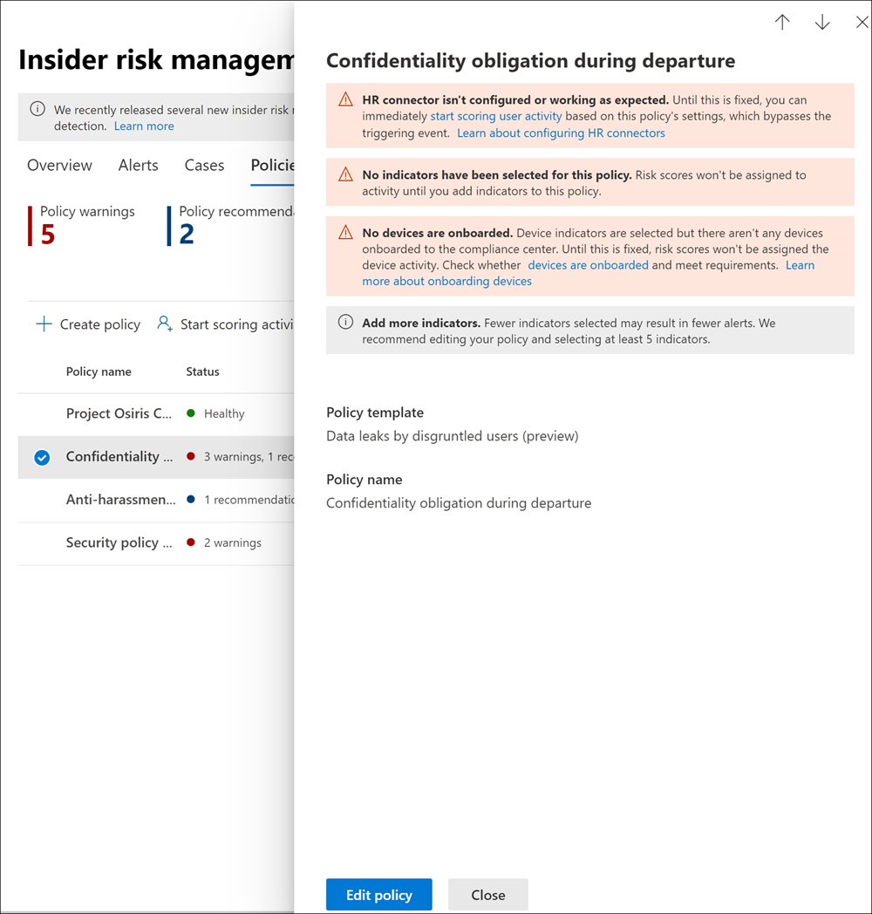

# <a name="insider-risk-management-policies"></a>Directivas de administración de riesgos internos

> [!IMPORTANT]
> Administración de riesgos internos de Microsoft Purview correlaciona varias señales para identificar riesgos internos potencialmente malintencionados o involuntarios, como el robo de IP, la pérdida de datos y las infracciones de seguridad. Insider Risk Management permite a los clientes crear directivas para administrar la seguridad y el cumplimiento. Creados con privacidad por diseño, los usuarios se seudonimizan de forma predeterminada y los controles de acceso basados en roles y los registros de auditoría están en su lugar para ayudar a garantizar la privacidad del nivel de usuario.

Las directivas de administración de riesgos internos determinan qué usuarios deben estar dentro del ámbito de búsqueda y qué tipos de indicadores de riesgo están configurados para las alertas. Puede crear rápidamente una directiva de seguridad que se aplique a todos los usuarios de su organización o definir usuarios o grupos individuales para la administración en una directiva. Las directivas son compatibles con las prioridades de contenido para centrar las condiciones de las directivas en varios o determinados Microsoft Teams, sitios de SharePoint, tipos de confidencialidad de datos y etiquetas de datos. Mediante el uso de plantillas, puede seleccionar indicadores de riesgo específicos y personalizar los umbrales de los eventos para los indicadores de directivas, personalizando eficazmente las puntuaciones de riesgo y el nivel y la frecuencia de las alertas. 

También puede configurar directivas rápidas de pérdida de datos y robo de datos si abandona las directivas de usuario que definen automáticamente las condiciones de directiva en función de los resultados del análisis más reciente. Además, los refuerzos de puntuación de riesgo y las detecciones de anomalías ayudan a identificar la actividad potencialmente riesgosa del usuario que es de mayor importancia o inusual. Las ventanas de la directiva permiten definir el marco temporal para aplicar la directiva a las actividades de alerta y se usan para determinar la duración de la directiva una vez activada.

Consulte el [vídeo Configuración de directivas de Insider Risk Management](https://www.youtube.com/watch?v=kudK5ajZTUo) para obtener información general sobre cómo las directivas creadas con plantillas de directivas integradas pueden ayudarle a actuar rápidamente sobre posibles riesgos.

[!INCLUDE [purview-preview](../includes/purview-preview.md)]

## <a name="policy-dashboard"></a>Panel de directivas

El **panel Directiva** permite ver rápidamente las directivas de su organización, el estado de la directiva, agregar manualmente usuarios a las directivas de seguridad y ver el estado de las alertas asociadas a cada directiva.

- **Nombre de directiva**: nombre asignado a la directiva en el Asistente para directivas.
- **Estado**: estado de mantenimiento de cada directiva. Muestra el número de advertencias y recomendaciones de las directivas, o un estado *Correcto* para las directivas sin problemas.  Puede seleccionar la directiva para ver los detalles del estado de mantenimiento de las advertencias o recomendaciones.
- **Alertas activas**: número de alertas activas para cada directiva.
- **Alertas confirmadas**: número total de alertas que dieron lugar a casos de la directiva en los últimos 365 días.
- **Acciones realizadas en las alertas**: número total de alertas que se confirmaron o descartaron durante los últimos 365 días.
- **Eficacia de las alertas** de directiva: porcentaje determinado por el total de alertas confirmadas divididas por el total de acciones realizadas en las alertas (que es la suma de las alertas que se confirmaron o descartaron durante el año pasado).


## <a name="policy-recommendations-from-analytics"></a>Recomendaciones de directivas de análisis

El análisis de riesgos internos le ofrece una vista agregada de las actividades de usuario anonimizadas relacionadas con la seguridad y el cumplimiento, lo que le permite evaluar posibles riesgos internos en su organización sin configurar ninguna directiva de riesgo interno. Esta evaluación puede ayudar a su organización a identificar posibles áreas de mayor riesgo y ayudar a determinar el tipo y el ámbito de las directivas de administración de riesgos internos que puede considerar configurar. Si decide actuar sobre los resultados de análisis de pérdidas generales de datos o robo de datos mediante directivas de usuarios que abandonan, incluso tiene la opción de configurar una directiva rápida basada en estos resultados.

Para obtener más información sobre las recomendaciones de directivas y análisis de riesgos internos, consulte [Configuración de administración de riesgos internos: Análisis](insider-risk-management-settings.md#analytics).

## <a name="quick-policies-from-recommended-actions-preview"></a>Directivas rápidas de acciones recomendadas (versión preliminar)

Para muchas organizaciones, empezar a trabajar con una directiva inicial puede ser un desafío. Si no está familiarizado con la administración de riesgos internos y está usando las acciones recomendadas para empezar, puede configurar una directiva rápida para acelerar una directiva *general de pérdidas de datos* o *robo de datos mediante la salida de la directiva de los usuarios* . La configuración rápida de la directiva se rellena automáticamente en función de los resultados del examen de análisis más reciente de su organización. Por ejemplo, si el examen detectase posibles actividades de fuga de datos, la directiva rápida incluiría los indicadores usados para detectar esas actividades. 

Para empezar, revise la configuración de directiva rápida y configure la directiva con una sola selección. Si necesita personalizar una directiva rápida, puede cambiar las condiciones durante la configuración inicial o después de que se haya creado la directiva. Además, puede mantenerse al día con los resultados de detección de una directiva rápida configurando notificaciones por correo electrónico cada vez que tenga una advertencia de directiva o cada vez que la directiva genere una alerta de gravedad alta.

## <a name="policy-templates"></a>Plantillas de directiva

Las plantillas de administración de riesgos internos son condiciones predefinidas de la directiva que definen los tipos de indicadores de riesgo y el modelo de puntuación de riesgos que usa la directiva. Cada directiva debe tener una plantilla asignada en el asistente de creación de directivas antes de que se cree la directiva. La administración de riesgos internos admite hasta cinco directivas para cada plantilla de directivas. Al crear una nueva directiva de riesgo interno con el asistente para directivas, elija entre una de las siguientes plantillas de directiva:

### <a name="data-theft-by-departing-users"></a>Robo de datos por parte de los usuarios que abandonan la organización

Cuando los usuarios abandonan la organización, normalmente hay indicadores de riesgo específicos asociados al posible robo de datos por parte de los usuarios que abandonan la organización. Esta plantilla de directiva utiliza los indicadores de filtración para la puntuación del riesgo y se centra en la detección y las alertas en esta área de riesgo. El robo de datos por parte de los usuarios que abandonan la organización puede incluir la descarga de archivos de SharePoint Online, la impresión de archivos y la copia de datos en servicios personales de mensajería y almacenamiento en la nube cerca de sus fechas de renuncia y finalización del empleo. Al usar el conector de RR. HH. de Microsoft o la opción para comprobar automáticamente la eliminación de cuentas de usuario en Azure Active Directory para su organización, esta plantilla comienza a puntuar los indicadores de riesgo relacionados con estas actividades y cómo se correlacionan con el estado de empleo del usuario.

> [!IMPORTANT]
> Al usar esta plantilla, puede configurar un conector de recursos humanos de Microsoft 365 para importar periódicamente la información de las fechas de renuncia y finalización de los usuarios de su organización. Consulte el artículo [Importación de datos con el conector de RR. HH](import-hr-data.md) . para obtener instrucciones paso a paso para configurar el conector de RR. HH. de Microsoft 365. Si decide no usar el conector de RR. HH., debe seleccionar la opción Cuenta de usuario eliminada de Azure Active Directory al configurar eventos de desencadenador en el Asistente para directivas.

### <a name="general-data-leaks"></a>Filtraciones de datos generales

La protección de datos y la prevención de fugas de datos es un desafío constante para la mayoría de las organizaciones, especialmente con el rápido crecimiento de nuevos datos creados por usuarios, dispositivos y servicios. Los usuarios tienen la posibilidad de crear, almacenar y compartir información a través de servicios y dispositivos que hacen que la administración de las filtraciones de datos sea cada vez más compleja y difícil. Las filtraciones de datos pueden incluir la divulgación accidental de información fuera de su organización o el robo de datos con fines malintencionados. Con una directiva de Prevención de pérdida de datos de Microsoft Purview asignada (DLP), eventos desencadenantes integrados o personalizables, esta plantilla comienza a puntuar las detecciones en tiempo real de descargas de datos sospechosas de SharePoint Online, el uso compartido de archivos y carpetas, la impresión de archivos y la copia de datos en servicios de almacenamiento y mensajería en la nube personales.

Al usar una plantilla de *Filtración de datos*, puede asignar una directiva DLP para activar indicadores en la directiva de riesgo interno para alertas de alta gravedad en su organización. Cada vez que una regla de directiva DLP genera una alerta de alta gravedad que se agrega al registro de auditoría de Office 365, las directivas de riesgo interno creadas con esta plantilla examinan automáticamente la alerta de DLP de alta gravedad. Si la alerta contiene un usuario dentro del ámbito definido en la directiva de riesgo interno, la alerta es procesada por la directiva de riesgo interno como una nueva alerta y se le asigna una gravedad de riesgo interno y una puntuación de riesgo. También puede optar por asignar indicadores seleccionados como eventos desencadenantes de una directiva. Esta flexibilidad y personalización ayuda a limitar la directiva solo a las actividades cubiertas por los indicadores. Esta directiva le permite evaluar esta alerta en contexto con otras actividades incluidas en el caso.

#### <a name="data-leaks-policy-guidelines"></a>Directrices de la directiva sobre filtración de datos

Al crear o modificar directivas de prevención de pérdida de datos para usarlas con directivas de administración de riesgos internos, tenga en cuenta las siguientes directrices:

- Establezca prioridad a los eventos de filtración de datos y sea selectivo a la hora de asignar la configuración de los **Informes de incidentes** a *Alto* cuando configure las reglas en sus directivas DLP. Por ejemplo, enviar por correo electrónico documentos confidenciales a un competidor conocido debería ser un evento de filtración de nivel de alerta *Alto*. La sobreasignación del nivel *Alto* en la configuración de los **Informes de incidentes** en otras reglas de directivas DLP puede aumentar el ruido en el flujo de trabajo de las alertas de administración de riesgos internos y dificultar la evaluación adecuada de estas alertas por parte de los investigadores y analistas de datos. Por ejemplo, la asignación de niveles de alerta *Alto* a las actividades de denegación de acceso en las directivas DLP hace que sea más difícil evaluar los comportamientos y actividades de los usuarios de riesgo.
- Al usar una directiva DLP como evento desencadenante, asegúrese de comprender y configurar correctamente los usuarios dentro del ámbito en las directivas de administración de riesgos dlp y insider. Solo los usuarios definidos como dentro del ámbito de las directivas de administración de riesgos internos usando la plantilla de **Filtración de datos** tendrán alertas de directivas DLP de alta gravedad procesadas. Además, solo los usuarios definidos como en el ámbito de una regla para una alerta DLP de gravedad alta serán analizados por la directiva de administración de riesgos internos para su consideración. Es importante que no configure sin saberlo usuarios en el ámbito tanto en las directivas de riesgo DLP como internas de forma conflictiva.

     Por ejemplo, si las reglas de directiva DLP se limitan solo a los usuarios del equipo de ventas y la directiva de riesgo interno creada a partir de la plantilla **Pérdidas de datos** ha definido a todos los usuarios como en el ámbito, la directiva de riesgo interno solo procesará alertas DLP de alta gravedad para los usuarios del equipo de ventas. La directiva de riesgo interno no recibirá ninguna alerta de DLP de alta prioridad para que los usuarios procesen las alertas que no están definidas en las reglas de DLP en este ejemplo. Por el contrario, si su directiva de administración de riesgos internos creada a partir de las plantillas de **Filtración de datos** tiene un ámbito solo para los usuarios del equipo de ventas y la directiva DLP asignada tiene un ámbito para todos los usuarios, la directiva de riesgos internos solo procesará las alertas de DLP de alta gravedad para los miembros del equipo de ventas. La directiva de administración de riesgos internos ignorará las alertas de DLP de alta gravedad para todos los usuarios que no pertenezcan al equipo de ventas.

- Asegúrese de que la configuración de la regla de **Informes de incidentes** en la directiva DLP usada para esta plantilla de administración de riesgos internos esté configurada para alertas de nivel de gravedad *Alto*. El nivel de gravedad *Alto* es el de los eventos desencadenantes y las alertas de administración de riesgos internos no se generarán a partir de las reglas de las directivas DLP con el campo **Informes de incidentes** configurado en *Bajo* o *Medio*.

    

     > [!NOTE]
     > Al crear una nueva directiva DLP usando las plantillas incorporadas, tendrá que seleccionar la opción **Crear o personalizar reglas DLP avanzadas** para configurar el ajuste de **Informes de incidentes** para el nivel de gravedad *Alto*.

Cada directiva de administración de riesgos internos creada a partir de la plantilla **Pérdidas de datos** solo puede tener asignada una directiva DLP al usar esta opción de evento desencadenante. Considere la posibilidad de crear una directiva DLP dedicada que combine las diferentes actividades que desea detectar y que actúe como evento desencadenante de las directivas de riesgo interno que usan la plantilla de **Filtración de datos**.

Vea el artículo [Crear, probar y ajustar una directiva DLP](create-test-tune-dlp-policy.md) para obtener una guía paso a paso para configurar las directivas DLP para su organización.

### <a name="data-leaks-by-priority-users-preview"></a>Filtración de datos por parte de usuarios prioritarios (versión preliminar)

La protección de los datos y la prevención de las filtraciones de datos para los usuarios de su organización puede depender de su posición, del nivel de acceso a la información confidencial o del historial de riesgos. Las filtraciones de datos pueden incluir la divulgación accidental de información altamente confidencial fuera de su organización o el robo de datos con fines malintencionados. Con una directiva de prevención de pérdida de datos asignada (DLP) como opción de evento desencadenante, esta plantilla comienza a puntuar las detecciones en tiempo real de actividad sospechosa y da como resultado una mayor probabilidad de alertas y alertas de riesgo interno con niveles de gravedad más altos. Los usuarios prioritarios se definen en [grupos de usuarios prioritarios](insider-risk-management-settings.md#priority-user-groups-preview) configurados en el área de configuración de la administración de riesgos internos.

Al igual que con la **plantilla Pérdidas de datos generales**, puede elegir una directiva DLP para desencadenar indicadores en la directiva de riesgo interno para alertas de gravedad alta en su organización. Siga las directrices de directiva de pérdida de datos para las directivas DLP al crear una directiva con la opción DLP al usar esta plantilla. También puede optar por asignar indicadores seleccionados como eventos desencadenantes de una directiva. Esta flexibilidad y personalización ayudan a limitar la directiva solo a las actividades cubiertas por los indicadores. Además, deberá asignar grupos de usuarios prioritarios creados en **Configuración** >  de **administración** >  de riesgos internos Grupos de **usuarios prioritarios** a la directiva.

### <a name="data-leaks-by-disgruntled-users-preview"></a>Filtraciones de datos por parte de usuarios inconformes (versión preliminar)

Cuando los usuarios experimentan factores de estrés laboral, pueden sentirse inconformes, lo que puede aumentar las posibilidades de que se produzcan actividades de riesgo interno. Esta plantilla comienza a puntuar la actividad del usuario cuando se identifica un indicador asociado al descontento. Algunos ejemplos pueden ser las notificaciones de mejora del rendimiento, las revisiones de rendimiento deficientes, los cambios en el estado del nivel de trabajo o el correo electrónico y otros mensajes que pueden indicar descontento. Las pérdidas de datos de los usuarios descontentos pueden incluir la descarga de archivos de SharePoint Online y la copia de datos en servicios de almacenamiento y mensajería en la nube personales.

Al usar esta plantilla, debe configurar un conector de RR. HH., seleccionar la opción para [integrar las señales de descontento de cumplimiento de comunicaciones de los](/microsoft-365/compliance/communication-compliance-policies#policy-for-insider-risk-management-integration-preview) mensajes de usuario o elegir ambas. El conector de RR. HH. permite la importación periódica de notificaciones de mejora del rendimiento, estados de revisión de rendimiento deficientes o información de cambios de nivel de trabajo para los usuarios de la organización. La integración de descontento de cumplimiento de comunicaciones importa señales para los mensajes de usuario que pueden contener contenido de texto potencialmente amenazante, hostigador o discriminatorio. Las alertas asociadas generadas en Cumplimiento de comunicaciones no necesitan evaluarse, corregirse ni cambiarse en estado para integrarse con la directiva de administración de riesgos internos.

Para configurar un conector de RR. HH., consulte el artículo [Importación de datos con el conector de RR. HH](import-hr-data.md) . Para configurar la integración con el cumplimiento de comunicaciones, seleccione esta opción en el asistente al configurar la directiva.

### <a name="general-security-policy-violations-preview"></a>Infracciones generales de la directiva de seguridad (versión preliminar)

En muchas organizaciones, los usuarios tienen permiso para instalar software en sus dispositivos o para modificar la configuración de los mismos para ayudarles con sus tareas. Ya sea de forma involuntaria o con fines malintencionados, los usuarios pueden instalar software malintencionado o deshabilitar características de seguridad importantes que ayudan a proteger la información de su dispositivo o de sus recursos de red. Esta plantilla de directiva usa alertas de seguridad de ATP de Microsoft Defender para empezar a puntuar estas actividades y centrar la detección y las alertas en esta área de riesgo. Use esta plantilla para proporcionar información sobre las infracciones de la directiva de seguridad en escenarios en los que los usuarios pueden tener un historial de infracciones de la directiva de seguridad que puede ser un indicador de riesgo interno.

Deberá tener configurado ATP de Microsoft Defender en su organización y habilitar Defender para punto de conexión para la integración de la administración de riesgos internos en el Centro de seguridad de Defender para importar las alertas de infracciones de seguridad. Para obtener más información sobre cómo configurar Defender para punto de conexión para la integración de la administración de riesgos internos, vea [Configurar las características avanzadas de Defender para punto de conexión](/windows/security/threat-protection/microsoft-defender-atp/advanced-features#share-endpoint-alerts-with-microsoft-compliance-center).

### <a name="general-patient-data-misuse-preview"></a>Uso indebido general de datos de pacientes (versión preliminar)

La protección de los datos del registro sanitario y la prevención del uso indebido de los datos personales de los pacientes es una preocupación importante para las organizaciones del sector sanitario. Este uso indebido puede incluir fugas de datos confidenciales a personas no autorizadas, modificaciones fraudulentas de los registros de pacientes o el robo de registros de atención médica de pacientes. La prevención de este uso indebido de los datos de los pacientes, ya sea por falta de conocimiento, negligencia o fraude por parte de los usuarios, también es un componente clave en el cumplimiento de los requisitos normativos de la Ley de portabilidad y responsabilidad de seguros de salud (HIPAA) y la Ley de Tecnología de información sanitaria para la salud económica y clínica (HITECH). Ambos actos establecen los requisitos para proteger la información sanitaria protegida por el paciente (PHI).

Esta plantilla de directiva permite la puntuación de riesgos para usuarios internos que detecta actividades sospechosas asociadas a registros hospedados en sistemas de registros médicos electrónicos (EMR) existentes. La detección se centra en el acceso no autorizado, la visualización, la modificación y la exportación de datos de los pacientes. Tendrá que configurar un conector el [conector de Microsoft Healthcare](import-healthcare-data.md) o el [conector Epic](import-epic-data.md) para admitir la detección de actividades de acceso, filtración o ofuscación en el sistema EMR.

Al usar esta plantilla, también debe configurar un conector de RR. HH. de Microsoft para importar periódicamente los datos de perfil de la organización para los usuarios de la organización. Consulte el artículo [Configuración de un conector para importar datos de RR. HH](/microsoft-365/compliance/import-hr-data) . para obtener instrucciones paso a paso para configurar el conector de RR. HH. de Microsoft 365.

### <a name="general-risky-browser-usage-preview"></a>Uso general del explorador de riesgo (versión preliminar)

La identificación de visitas de usuarios a sitios web potencialmente inadecuados o inaceptables en dispositivos y redes de la organización es una parte importante de la minimización de riesgos de seguridad, legales y normativos. Los usuarios que visitan involuntariamente o a propósito estos tipos de sitios web pueden exponer a la organización a acciones legales de otros usuarios, infringir los requisitos normativos, elevar los riesgos de seguridad de la red o poner en peligro las operaciones y oportunidades empresariales actuales y futuras. Este uso indebido suele definirse en la directiva de uso aceptable de una organización para los dispositivos de usuario y los recursos de red de la organización, pero a menudo es difícil identificar y actuar rápidamente.

Para ayudar a protegerse frente a estos riesgos, esta directiva puede ayudar a detectar y habilitar la puntuación de riesgos para la exploración web que podría infringir la directiva de uso aceptable de su organización, como visitar sitios que suponen una amenaza (por ejemplo, sitios de phishing) o contienen contenido para adultos. Hay varios tipos de categorías disponibles para la categorización automática de las actividades de exploración web por parte de los usuarios en el ámbito.

Al usar esta plantilla de directiva, necesitará varios requisitos previos. Para obtener más información, consulte [Información sobre y configuración de la detección de señales del explorador de administración de riesgos internos](/microsoft-365/compliance/insider-risk-management-browser-support).

### <a name="security-policy-violations-by-departing-users-preview"></a>Infracciones de la directiva de seguridad por parte de los usuarios que abandonan la organización (versión preliminar)

Los usuarios que abandonan la organización, ya sea en términos positivos o negativos, pueden suponer un mayor riesgo de infracción de la directiva de seguridad. Para ayudar a protegerse contra las infracciones de seguridad involuntarias o malintencionadas de los usuarios que abandonan la organización, esta plantilla de directiva usa las alertas de Defender para punto de conexión para proporcionar información sobre las actividades relacionadas con la seguridad. Estas actividades incluyen la instalación por parte del usuario de software malintencionado u otras aplicaciones potencialmente dañinas y la desactivación de las funciones de seguridad de sus dispositivos. Al usar el [conector de RR. HH. de Microsoft](import-hr-data.md) o la opción para comprobar automáticamente la eliminación de cuentas de usuario en Azure Active Directory para su organización, esta plantilla comienza a puntuar indicadores de riesgo relacionados con estas actividades de seguridad y cómo se correlacionan con el estado de empleo del usuario.

Deberá tener configurado ATP de Microsoft Defender en su organización y habilitar Defender para punto de conexión para la integración de la administración de riesgos internos en el Centro de seguridad de Defender para importar las alertas de infracciones de seguridad. Para obtener más información sobre cómo configurar Defender para punto de conexión para la integración de la administración de riesgos internos, vea [Configurar las características avanzadas de Defender para punto de conexión](/windows/security/threat-protection/microsoft-defender-atp/advanced-features#share-endpoint-alerts-with-microsoft-compliance-center).

### <a name="security-policy-violations-by-priority-users-preview"></a>Infracciones de la directiva de seguridad por parte de los usuarios prioritarios (versión preliminar)

La protección contra las infracciones de seguridad de los usuarios de su organización puede depender de su posición, nivel de acceso a la información confidencial o historial de riesgos. Dado que las infracciones de seguridad por parte de los usuarios prioritarios pueden tener un impacto significativo en las áreas críticas de su organización, esta plantilla de directiva comienza a puntuar en estos indicadores y usa alertas de Microsoft Defender para punto de conexión para proporcionar información sobre las actividades relacionadas con la seguridad de estos usuarios. Estas actividades pueden incluir que los usuarios prioritarios instalen software malintencionado u otras aplicaciones potencialmente dañinas y desactiven las funciones de seguridad de sus dispositivos. Los usuarios prioritarios se definen en grupos de usuarios prioritarios configurados en el área de configuración de la administración de riesgos internos.

Deberá tener configurado ATP de Microsoft Defender en su organización y habilitar Defender para punto de conexión para la integración de la administración de riesgos internos en el Centro de seguridad de Defender para importar las alertas de infracciones de seguridad. Para obtener más información sobre cómo configurar Defender para punto de conexión para la integración de la administración de riesgos internos, vea [Configurar las características avanzadas de Defender para punto de conexión](/windows/security/threat-protection/microsoft-defender-atp/advanced-features#share-endpoint-alerts-with-microsoft-compliance-center). Además, deberá asignar grupos de usuarios prioritarios creados en **Configuración** >  de **administración** >  de riesgos internos Grupos de **usuarios prioritarios** a la directiva.

### <a name="security-policy-violations-by-disgruntled-users-preview"></a>Infracciones de la directiva de seguridad por parte de usuarios inconformes (versión preliminar)

Los usuarios que experimentan factores de estrés laboral pueden correr un mayor riesgo de infringir las directivas de seguridad de forma involuntaria o malintencionada. Estos factores de estrés pueden dar lugar a comportamientos que dan lugar a que el usuario se coloque en un plan de mejora del rendimiento, un estado de revisión de rendimiento deficiente, se degrada de su posición actual o el usuario que envía correo electrónico y otros mensajes que pueden indicar descontento. Esta plantilla de directiva comienza a puntuar el riesgo en base a estos indicadores y a las actividades asociadas a estos eventos para estos usuarios.

Al usar esta plantilla, debe configurar un conector de RR. HH. o seleccionar la opción para [integrar las señales de descontento de cumplimiento de comunicaciones de los](/microsoft-365/compliance/communication-compliance-policies#policy-for-insider-risk-management-integration-preview) mensajes de usuario, o ambas. El conector de RR. HH. permite la importación periódica de notificaciones de mejora del rendimiento, estados de revisión de rendimiento deficientes o información de cambios de nivel de trabajo para los usuarios de la organización. La integración de descontento de cumplimiento de comunicaciones importa señales para los mensajes de usuario que pueden contener contenido de texto potencialmente amenazante, hostigador o discriminatorio. Las alertas asociadas generadas en cumplimiento de comunicaciones no necesitan evaluarse, corregirse ni cambiarse en estado para integrarse con la directiva de administración de riesgos internos. Para configurar un conector de RR. HH., consulte el artículo [Importación de datos con el conector de RR. HH](import-hr-data.md) . Para configurar la integración con el cumplimiento de comunicaciones, seleccionará esta opción en el asistente al configurar la directiva.

También deberá tener configurado ATP de Microsoft Defender en su organización y habilitar Defender para punto de conexión para la integración de la administración de riesgos internos en el Centro de seguridad de Defender para importar las alertas de infracciones de seguridad. Para obtener más información sobre cómo configurar Defender para punto de conexión para la integración de la administración de riesgos internos, vea [Configurar las características avanzadas de Defender para punto de conexión](/windows/security/threat-protection/microsoft-defender-atp/advanced-features#share-endpoint-alerts-with-microsoft-compliance-center).

### <a name="policy-template-prerequisites-and-triggering-events"></a>Requisitos previos de la plantilla de directiva y eventos desencadenantes

Dependiendo de la plantilla que elija para una directiva de administración de riesgos internos, los eventos desencadenantes y los requisitos previos de la directiva varían. Los eventos desencadenantes son requisitos previos que determinan si un usuario está activo para una directiva de administración de riesgos internos. Si un usuario se agrega a una directiva de administración de riesgos internos pero no tiene un evento desencadenante, la directiva no evalúa la actividad del usuario a menos que se agregue manualmente en el panel Usuarios. Los requisitos previos de la directiva son elementos necesarios para que la directiva reciba las señales o actividades necesarias para evaluar el riesgo.

La siguiente tabla enumera los eventos desencadenantes y los requisitos previos para las directivas creadas a partir de cada plantilla de directivas de administración de riesgos internos:

| **Plantilla de directiva** | **Desencadenar eventos para directivas** | **Requisitos previos** |
| :------------------ | :--------------------------------- | :---------------- |
| **Robo de datos por parte de los usuarios que abandonan la organización** | Indicador de fecha de renuncia o finalización del conector de RR. HH. o eliminación de la cuenta de Azure Active Directory | (opcional) Conector de recursos humanos de Microsoft 365 configurado para los indicadores de fecha de finalización y renuncia. |
| **Filtraciones de datos generales** | La actividad de la directiva de filtración de datos que crea una alerta de *Alta gravedad* o desencadena un evento de filtración incorporado | Directiva DLP configurada para *alertas de gravedad alta* <br><br> O <br><br> Indicadores desencadenadores personalizados |
| **Filtraciones de datos por parte de usuarios prioritarios** | La actividad de la directiva de filtración de datos que crea una alerta de *Alta gravedad* o desencadena un evento de filtración incorporado | Directiva DLP configurada para *alertas de gravedad alta* <br><br> O <br><br> Indicadores desencadenadores personalizados <br><br> Grupos de usuarios prioritarios configurados en la configuración de riesgo interno |
| **Filtraciones de datos por parte de usuarios inconformes** | - Mejora del rendimiento, rendimiento deficiente o indicadores de cambio de nivel de trabajo del conector de RR. HH. <br> - Mensajes que contienen un lenguaje potencialmente amenazante, hostigador o discriminatorio | Conector de recursos humanos de Microsoft 365 configurado para los indicadores de inconformidad <br><br> AND/OR <br><br> Integración de cumplimiento de comunicaciones y directiva de descontento dedicada |
| **Infracciones generales de la directiva de seguridad** | La evasión de defensa de los controles de seguridad o el software no deseado detectado por Microsoft Defender para punto de conexión | Suscripción activa a ATP de Microsoft Defender <br><br> integración Microsoft Defender para punto de conexión con portal de cumplimiento Microsoft Purview configurados |
| **Uso indebido de los datos generales de los pacientes** | Evasión de la defensa de los controles de seguridad de los sistemas EMR <br><br> Indicadores de coincidencia de direcciones de usuario y paciente de sistemas de RR. HH. | Indicadores de acceso sanitario seleccionados en la configuración de riesgo interno o de directiva <br><br> Conector de RR. HH. de Microsoft 365 configurado para la coincidencia de direcciones <br><br> Conector de Microsoft Healthcare o Epic configurado |
| **Uso general del explorador de riesgo** | Actividad de exploración del usuario relacionada con la seguridad que coincide con al menos un *indicador de exploración* seleccionado | Consulte la lista completa de requisitos previos en el [artículo de detección de señales del explorador](/microsoft-365/compliance/insider-risk-management-browser-support). |
| **Infracciones de la directiva de seguridad por parte de los usuarios que abandonan la organización** | Indicadores de la fecha de renuncia o finalización del contrato desde el conector de recursos humanos o la eliminación de la cuenta de Azure Active Directory | (opcional) Conector de recursos humanos de Microsoft 365 configurado para los indicadores de fecha de finalización y renuncia. <br><br> Suscripción activa a ATP de Microsoft Defender <br><br> integración Microsoft Defender para punto de conexión con portal de cumplimiento Microsoft Purview configurados |
| **Infracciones de la directiva de seguridad por parte de los usuarios prioritarios** | La evasión de defensa de los controles de seguridad o el software no deseado detectado por Microsoft Defender para punto de conexión | Suscripción activa a ATP de Microsoft Defender <br><br> integración Microsoft Defender para punto de conexión con portal de cumplimiento Microsoft Purview configurados <br><br> Grupos de usuarios prioritarios configurados en la configuración de riesgo interno |
| **Infracciones de la directiva de seguridad por parte de un usuario inconforme** | - Mejora del rendimiento, rendimiento deficiente o indicadores de cambio de nivel de trabajo del conector de RR. HH. <br> - Mensajes que contienen un lenguaje potencialmente amenazante, hostigador o discriminatorio | Conector de recursos humanos de Microsoft 365 configurado para los indicadores de inconformidad <br><br> AND/OR <br><br> Integración de cumplimiento de comunicaciones y directiva de descontento dedicada <br><br> Y <br><br> Suscripción activa a ATP de Microsoft Defender <br><br> integración Microsoft Defender para punto de conexión con portal de cumplimiento Microsoft Purview configurados |

## <a name="prioritize-content-in-policies"></a>Priorizar los contenidos en las directivas

Las directivas de administración de riesgos internos admiten la especificación de una prioridad más alta para el contenido en función de dónde se almacene, el tipo de contenido o cómo se clasifique. También puede elegir si desea asignar puntuaciones de riesgo a todas las actividades detectadas por una directiva o solo a las actividades que incluyan contenido de prioridad. Especificar el contenido como prioritario aumenta la puntuación de riesgo de cualquier actividad asociada, lo que a su vez aumenta la posibilidad de generar una alerta de alta gravedad. Sin embargo, algunas actividades no generarán ninguna alerta a menos que el contenido relacionado contenga tipos de información confidencial incorporados o personalizados o se haya especificado como prioridad en la directiva.

Por ejemplo, su organización tiene un sitio de SharePoint dedicado a un proyecto altamente confidencial. Las filtraciones de información en este sitio de SharePoint podrían comprometer el proyecto y tendrían un impacto significativo en su éxito. Al priorizar este sitio de SharePoint en una directiva de filtración de datos, las puntuaciones de riesgo para las actividades puntuadas se incrementan automáticamente. Esta priorización aumenta la probabilidad de que estas actividades generen una alerta de riesgo interno y eleva el nivel de gravedad de la alerta.

Además, puede optar por centrarse en esta directiva para la actividad del sitio de SharePoint que solo incluye contenido prioritario para este proyecto. Se asignarán puntuaciones de riesgo y se generarán alertas solo cuando las actividades especificadas incluyan contenido de prioridad. Las actividades sin contenido prioritario no se puntuarán, pero podrá revisarlas si se genera una alerta.

> [!NOTE]
> Si configura una directiva para generar alertas solo para la actividad que incluye contenido prioritario, no se aplicarán cambios a los refuerzos de puntuación de riesgo.

Cuando se crea una directiva de administración de riesgos internos en el asistente de directivas, se puede elegir entre las siguientes prioridades:

- **Sitios de SharePoint**: cualquier actividad asociada a todos los tipos de archivo en sitios de SharePoint definidos se asigna una mayor puntuación de riesgo. Los usuarios que configuran la directiva y seleccionan sitios de SharePoint prioritarios pueden seleccionar sitios de SharePoint a los que tienen permiso de acceso. Si el usuario actual no puede seleccionar sitios de SharePoint en la directiva, otro usuario con los permisos necesarios puede seleccionar los sitios para la directiva más adelante o el usuario actual debe tener acceso a los sitios necesarios.
- **Tipos de información confidencial**: cualquier actividad asociada a un contenido que contenga [tipos de información confidencial](sensitive-information-type-entity-definitions.md) se le asigna una puntuación de riesgo más alta.
- **Etiquetas de confidencialidad**: a cualquier actividad asociada a un contenido que tenga aplicadas [etiquetas de confidencialidad](sensitivity-labels.md) específicas se le asigna una puntuación de riesgo más alta.
- **Extensiones de archivo**: cualquier actividad asociada al contenido que tenga extensiones de archivo específicas. Los usuarios que configuran una directiva de robo/pérdida de datos que selecciona **Extensiones de archivo para priorizar** en el asistente para directivas pueden definir hasta 50 extensiones de archivo para priorizar en la directiva. Las extensiones especificadas pueden incluir o omitir un "." como primer carácter de la extensión con prioridad.
- **Clasificadores que se pueden entrenar**: cualquier actividad asociada con el contenido que se incluye en un [clasificador que se puede entrenar](/microsoft-365/compliance/classifier-learn-about). Los usuarios que configuran una directiva que selecciona Clasificadores entrenables en el asistente para directivas pueden seleccionar hasta 5 clasificadores entrenables para aplicar a la directiva. Estos clasificadores pueden ser clasificadores existentes que identifican patrones de información confidencial, como seguridad social, tarjeta de crédito o números de cuenta bancaria o clasificadores personalizados creados en su organización.

## <a name="sequence-detection-preview"></a>Detección de secuencias (versión preliminar)

Es posible que las actividades de administración de riesgos no se produzcan como eventos aislados. Estos riesgos suelen formar parte de una secuencia más amplia de eventos. Una secuencia es un grupo de dos o más actividades potencialmente arriesgadas realizadas una tras otra que podrían sugerir un riesgo elevado. La identificación de estas actividades de usuario relacionadas es una parte importante de la evaluación del riesgo general. Cuando se selecciona la detección de secuencias para directivas de robo de datos o pérdidas de datos, la información de las actividades de información de secuencia se muestra en la pestaña **Actividad del usuario** dentro de un caso de administración de riesgos internos. Las siguientes plantillas de directivas admiten la detección de secuencias:

- Robo de datos por parte de los usuarios que abandonan la organización
- Filtraciones de datos generales
- Filtraciones de datos por parte de usuarios prioritarios
- Filtraciones de datos por parte de usuarios inconformes

Estas directivas de administración de riesgos internos pueden usar indicadores específicos y el orden en que ocurren para detectar cada paso en una secuencia de riesgo. En el caso de las *directivas creadas a partir de las fugas de datos generales* y *las pérdidas de datos por plantillas de usuario prioritarias* , también puede seleccionar qué secuencias desencadenan la directiva. Los nombres de los archivos se usan cuando se asignan las actividades a través de una secuencia. Estos riesgos se organizan en cuatro tipos principales de detección de secuencias:

- **Recopilación**: detecta las actividades de descarga por parte de los usuarios de directivas dentro del ámbito. Entre las actividades de administración de riesgos de ejemplo se incluyen la descarga de archivos de sitios de SharePoint o el traslado de archivos a una carpeta comprimida.
- **Filtración**: detecta actividades de uso compartido o extracción en orígenes internos y externos por parte de los usuarios de directivas dentro del ámbito. Una actividad de administración de riesgos de ejemplo incluye el envío de correos electrónicos con datos adjuntos de la organización a destinatarios externos.
- **Ofuscación**: detecta el enmascaramiento de actividades potencialmente arriesgadas por parte de los usuarios de directivas dentro del ámbito. Entre las actividades de administración de riesgos de ejemplo se incluyen el cambio de nombre de los archivos en un dispositivo o la eliminación o degradación de etiquetas de confidencialidad en archivos de SharePoint.
- **Limpieza**: detecta las actividades de eliminación por parte de los usuarios de directivas dentro del ámbito. Una actividad de administración de riesgos de ejemplo incluye la eliminación de archivos de un dispositivo.

> [!NOTE]
> La detección de secuencias usa indicadores habilitados en la configuración global para la administración de riesgos internos. Si no se seleccionan los indicadores adecuados, podrá activar estos indicadores en el paso de detección de secuencia del asistente para directivas.

Puede personalizar la configuración de umbral individual para cada tipo de detección de secuencia cuando se configure en la directiva. Esta configuración de umbral ajusta las alertas en función del volumen de archivos asociados al tipo de secuencia.

Para obtener más información sobre la administración de la detección de secuencias en la vista de la **Actividad del usuario**, vea [Casos de administración de riesgos internos: actividad de los usuarios](insider-risk-management-cases.md#user-activity).

## <a name="cumulative-exfiltration-detection-preview"></a>Detección de filtración acumulada (versión preliminar)

Con la privacidad activada de forma predeterminada, los indicadores de riesgo internos ayudan a identificar niveles inusuales de actividades de riesgo cuando se evalúan diariamente para los usuarios que están en el ámbito de las directivas de riesgo internos. La detección acumulativa de filtraciones usa modelos de aprendizaje automático para ayudarle a identificar cuándo las actividades de filtración que realiza un usuario durante un tiempo determinado superan la cantidad normal realizada por los usuarios de su organización durante los últimos 30 días en varios tipos de actividad de filtración. Por ejemplo, si un usuario compartiese más archivos que la mayoría de los usuarios durante el mes pasado, esta actividad se detectaría y clasificaría como una actividad de filtración acumulativa.

Los analistas e investigadores de administración de riesgos internos pueden utilizar los conocimientos de detección de filtración acumulada para ayudar a identificar las actividades de filtración que no suelen generar alertas, pero que están por encima de lo que es típico para su organización. Algunos ejemplos pueden ser que los usuarios que abandonan la organización filtren lentamente los datos durante varios días, o que los usuarios compartan repetidamente los datos a través de múltiples canales más de lo habitual para el uso compartido de datos de su organización.  Las puntuaciones de riesgo más altas se asignan a actividades de filtración acumulativas para sitios de SharePoint, tipos de información confidencial y contenido con [etiquetas de confidencialidad configuradas](/microsoft-365/compliance/sensitivity-labels#label-priority-order-matters) como contenido prioritario en una directiva o para la actividad que implica etiquetas configuradas como de alta prioridad en Microsoft Purview Information Protection.

La detección de filtración acumulada está activada de forma predeterminada cuando se utilizan las siguientes plantillas de directivas:

- Robo de datos por parte de los usuarios que abandonan la organización
- Filtraciones de datos generales
- Filtraciones de datos por parte de usuarios prioritarios
- Filtraciones de datos por parte de usuarios inconformes

> [!NOTE]
> La detección de filtración acumulada utiliza los indicadores de filtración activados en la configuración global para la administración de riesgos internos y los indicadores de filtración seleccionados en una directiva. Como tal, la detección de filtración acumulada solo se evalúa para los indicadores de filtración necesarios seleccionados. Las actividades de filtración acumulativas para [etiquetas de confidencialidad configuradas](sensitivity-labels.md) en el contenido de prioridad generan puntuaciones de riesgo más altas.

Cuando la detección de filtración acumulada está activada para las directivas de robo o filtración de datos, la información de las actividades de filtración acumulada se muestra en la pestaña **Actividad del usuario** dentro de un caso de administración de riesgos internos.

Para obtener más información sobre la administración de las actividades de los usuarios, vea los [Casos de administración de riesgos internos: actividades de los usuarios](insider-risk-management-cases.md#user-activity).

## <a name="policy-health"></a>Estado de la directiva

El estado de la directiva le permite conocer los posibles problemas de sus directivas de administración de riesgos internos. La columna **Estado** de la pestaña **Directivas** puede alertarle de problemas de directivas que pueden impedir que se notifique la actividad del usuario o por qué el número de alertas de actividad es inusual. El estado de la directiva también puede confirmar que la directiva está en buen estado y no necesita atención o cambios de configuración.

If there are issues with a policy, the policy health status displays notification warnings and recommendations to help you take action to resolve policy issues. These notifications can help you resolve the following issues:

- **Directivas con configuración incompleta**. Estos problemas pueden incluir la falta de usuarios o grupos en la directiva o otros pasos de configuración de la directiva incompletos.
- **Directivas con problemas de configuración de indicadores**. Los indicadores son una parte importante de cada directiva. Si no se configuran los indicadores, o si se seleccionan muy pocos, la directiva puede no evaluar las actividades de riesgo como se espera.
- **Los desencadenadores de directiva no funcionan o los requisitos del desencadenador de directiva no están configurados correctamente**. La funcionalidad de la directiva puede depender de otros servicios o requisitos de configuración para detectar eficazmente los eventos desencadenantes para activar la asignación de la puntuación de riesgo a los usuarios en la directiva. Estas dependencias pueden incluir problemas con la configuración del conector, el uso compartido de alertas de ATP de Microsoft Defender o la configuración de la directiva de prevención de pérdida de datos.
- **Los límites de volumen se acercan o superan los límites**. Las directivas de administración de riesgos internos usan numerosos servicios y puntos de conexión de Microsoft 365 para agregar señales de actividad de riesgo. Dependiendo del número de usuarios en sus directivas, los límites de volumen pueden retrasar la identificación y notificación de las actividades de riesgo. Obtenga más información sobre estos límites en la sección Límites de la plantilla de directiva de este artículo.

Para ver rápidamente el estado de mantenimiento de una directiva, vaya a la pestaña **Directiva** y a la columna **Estado** . Aquí verá las siguientes opciones de estado de mantenimiento de la directiva para cada directiva:

- *Correcto*: no se han identificado problemas con la directiva.
- *Recomendaciones*: problema con la directiva que puede impedir que la directiva funcione según lo previsto.
- *Advertencias*: un problema con la directiva que puede impedir que identifique actividades potencialmente de riesgo.

Para obtener más detalles sobre cualquier recomendación o advertencia, seleccione una directiva en la pestaña **Directiva** para abrir la tarjeta de detalles de la misma. En la sección **Notificaciones** de la tarjeta de detalles se muestra más información sobre las recomendaciones y advertencias, incluidas las instrucciones sobre cómo solucionar estos problemas.



### <a name="notification-messages"></a>Mensajes de notificación

Use la siguiente tabla para obtener más información sobre las recomendaciones y las notificaciones de advertencia, así como sobre las acciones a realizar para resolver posibles problemas.

|**Mensajes de notificación**|**Plantillas de directiva**|**Causas / Probar esta acción para corregir**|
|:------------------------|:-------------------|:----------------------------------|
|**La directiva no está asignando puntuaciones de riesgo a la actividad**| Todas las plantillas de directiva | Es posible que quiera revisar el ámbito de la directiva y desencadenar la configuración de eventos para que la directiva pueda asignar puntuaciones de riesgo a las actividades. <br><br> 1. Revise los usuarios seleccionados para la directiva. Si tiene pocos usuarios seleccionados, es posible que desee seleccionar usuarios adicionales. <br> 2. Si está usando un conector de recursos humanos, compruebe que su conector de recursos humanos está enviando los datos correctos. <br> 3. Si usa una directiva DLP como evento desencadenante, compruebe la configuración de la directiva DLP para asegurarse de que está configurada para usarse en esta directiva. <br> 4. For security violation policies, review the Microsoft Defender for Endpoint alert triage status selected in Insider risk settings > Intelligent detections. Confirm that the alert filter isn't too narrow.|
|**La directiva no ha generado ninguna alerta**| Todas las plantillas de directiva|Es posible que quiera revisar la configuración de la directiva para que esté analizando la actividad de puntuación más relevante. <br><br> 1. Confirme que ha seleccionado los indicadores que desea puntuar. Cuantos más indicadores se seleccionen, más actividades se asignarán a las puntuaciones de riesgo. <br> 2. Revisar la personalización del umbral para la directiva. Si los umbrales seleccionados no se alinean con la tolerancia al riesgo de su organización, ajuste las selecciones para que las alertas se creen en función de los umbrales que prefiera. <br> 3. Revise los usuarios y grupos seleccionados para la directiva. Confirme que ha seleccionado todos los usuarios y grupos aplicables. <br> 4. Para las directivas de infracción de seguridad, confirme que ha seleccionado el estado de evaluación de prioridades de alertas que desea puntuar para las alertas de ATP de Microsoft Defender en Detecciones inteligentes en la configuración.|
|**No hay usuarios ni grupos incluidos en esta directiva**| Todas las plantillas de directiva | Los usuarios o grupos no están asignados a la directiva. <br><br> Edite su directiva y seleccione los usuarios o grupos para la misma.|
|**No se han seleccionado indicadores para esta directiva.**| Todas las plantillas de directiva | Los indicadores no han sido seleccionados para la directiva <br><br> Edite su directiva y seleccione los indicadores adecuados para la misma.|
|**Esta directiva no incluye a ningún grupo de usuarios prioritarios**|- Filtraciones de datos por parte de usuarios prioritarios <br> - Infracciones de directiva de seguridad por usuario prioritario|Los grupos de usuarios prioritarios no están asignados a la directiva. <br><br> Configure grupos de usuarios prioritarios en las configuraciones de administración de riesgos internos y asigne grupos de usuarios prioritarios a la directiva.|
|**No se ha seleccionado ningún evento desencadenante para esta directiva**| Todas las plantillas de directiva | No se ha configurado un evento desencadenante para la directiva <br><br> Las puntuaciones de riesgo no se asignarán a las actividades de los usuarios hasta que se edite la directiva y se seleccione un evento desencadenante.|
|**El conector de recursos humanos no está configurado o no funciona como se esperaba**|- Robo de datos por parte del usuario que abandona la organización <br> - Infracciones de la directiva de seguridad por parte del usuario que abandona la organización <br> - Filtraciones de datos por parte de usuarios inconformes <br> - Infracciones de la directiva de seguridad por parte de usuarios inconformes|Hay un problema con el conector de RR. HH. <br><br> 1. Si está utilizando un conector de recursos humanos, compruebe que su conector de recursos humanos está enviando datos correctos <br><br> O <br><br> 2. Seleccione el evento desencadenante de la cuenta Azure AD eliminada.|
|**No hay dispositivos incorporados**|- Robo de datos por parte de los usuarios que abandonan la organización <br> - Filtración de datos generales <br> - Filtraciones de datos por parte de usuarios inconformes <br> - Filtraciones de datos por parte de usuarios prioritarios|Los indicadores de dispositivo están seleccionados, pero no hay ningún dispositivo incorporado al portal de cumplimiento <br><br> Compruebe si los dispositivos están incorporados y cumplen los requisitos.|
|**El conector de recursos humanos no ha cargado datos recientemente**|- Robo de datos por parte del usuario que abandona la organización <br> - Infracciones de la directiva de seguridad por parte del usuario que abandona la organización <br> - Filtraciones de datos por parte de usuarios inconformes <br> - Infracciones de la directiva de seguridad por parte de usuarios inconformes|El conector de RR. HH. no ha importado datos en más de 7 días. <br><br> Compruebe que su conector de recursos humanos está configurado correctamente y que envía datos.|
|**No podemos comprobar el estado del conector de RR. HH. en este momento, vuelva a comprobarlo más tarde.**|- Robo de datos por parte del usuario que abandona la organización <br> - Infracciones de la directiva de seguridad por parte del usuario que abandona la organización <br> - Filtraciones de datos por parte de usuarios inconformes <br> - Infracciones de la directiva de seguridad por parte de usuarios inconformes|La solución de administración de riesgos internos no puede comprobar el estado de su conector de recursos humanos. <br><br> Compruebe que su conector de recursos humanos está configurado correctamente y envía datos, o vuelva a comprobar el estado de la directiva.|
|**La directiva DLP no está seleccionada como evento desencadenante**|- Filtraciones de datos generales <br> - Filtraciones de datos por parte de usuarios prioritarios|No se ha seleccionado una directiva DLP como un evento desencadenante o se ha eliminado la directiva DLP seleccionada. <br><br> Edite la directiva y seleccione una directiva DLP activa o "El usuario realiza una actividad de filtración" como evento desencadenante en la configuración de la directiva.|
|**La directiva DLP usada en esta directiva de riesgos internos está desactivada** |- Filtraciones de datos generales <br> - Filtraciones de datos por parte de usuarios prioritarios|La directiva DLP usada en esta directiva está desactivada. <br><br> 1. Activar la directiva DLP asignada a esta directiva. <br><br> O <br><br> 2. Edite esta directiva y seleccione una nueva directiva DLP o "El usuario realiza una actividad de filtración" como evento desencadenante en la configuración de la directiva.|
|**La directiva DLP no cumple con los requisitos**|- Filtraciones de datos generales <br> - Filtraciones de datos por parte de usuarios prioritarios|Las directivas DLP usadas como eventos desencadenantes deben ser configuradas para generar alertas de alta gravedad. <br><br>  1. Edite su directiva DLP para asignar las alertas aplicables como de *Alta gravedad*. <br><br> O <br><br> 2. Edite esta directiva y seleccione *El usuario realiza una actividad de filtración* como evento desencadenante.|
|**Su organización no tiene una suscripción a ATP de Microsoft Defender**|- Infracciones generales de la directiva de seguridad <br> - Infracciones de la directiva de seguridad por parte de los usuarios que abandonan la organización <br> - Infracciones de la directiva de seguridad por parte de usuarios inconformes <br> - Infracciones de directiva de seguridad por usuario prioritario|No se ha detectado una suscripción activa a ATP de Microsoft Defender para su organización. <br><br> Hasta que se agregue una suscripción a ATP de Microsoft Defender, estas directiva no asignarán puntuaciones de riesgo a la actividad de los usuarios.|
|**Microsoft Defender para punto de conexión alertas no se comparten con el portal de cumplimiento**|- Infracciones generales de la directiva de seguridad <br> - Infracciones de la directiva de seguridad por parte de los usuarios que abandonan la organización <br> - Infracciones de la directiva de seguridad por parte de usuarios inconformes <br> - Infracciones de directiva de seguridad por usuario prioritario|Microsoft Defender para punto de conexión alertas no se comparten con el portal de cumplimiento. <br><br> Configurar el uso compartido de las alertas de ATP de Microsoft Defender.|
|**Se está acercando al límite máximo de usuarios puntuados activamente para esta plantilla de directiva.**|Todas las plantillas de directiva|Cada plantilla de directiva tiene un número máximo de usuarios dentro del ámbito de búsqueda. Vea los detalles de la sección de límites de la plantilla. <br><br> Revise los usuarios de la pestaña Usuarios y quite los usuarios que ya no necesiten puntuar.|
|**El desencadenamiento del evento se produce repetidamente para más del 15 % de los usuarios de esta directiva**|Todas las plantillas de directiva|Ajuste el evento desencadenante para ayudar a reducir la frecuencia con la que los usuarios se introducen en el ámbito de la directiva.|

## <a name="policy-template-limits"></a>Límites del modelo de directiva

Las plantillas de directivas de administración de riesgos internos usan límites para administrar el volumen y la tasa de procesamiento de las actividades de riesgo de los usuarios dentro del ámbito de búsqueda y cómo este proceso se integra con los servicios de apoyo de Microsoft 365. Cada plantilla de directiva tiene un número máximo de usuarios a los que se pueden asignar puntuaciones de riesgo de forma activa para la directiva que puede admitir y procesar de forma eficaz e informar de actividades potencialmente de riesgo. Los usuarios dentro del ámbito de búsqueda son usuarios con eventos desencadenantes para la directiva.

El límite de cada directiva se calcula en función del número total de usuarios únicos que reciben puntuaciones de riesgo por tipo de plantilla de directiva. Si el número de usuarios para un tipo de plantilla de directiva se acerca o supera el límite de usuarios, el rendimiento de la directiva se verá reducido. Para ver el número actual de usuarios de una directiva, vaya a la pestaña Directiva y a la columna Usuarios en el ámbito de búsqueda. Puede tener hasta cinco directivas para cualquier plantilla de directiva. Estos límites máximos se aplican a los usuarios en todas las directivas que utilizan una plantilla de directiva determinada.

Use la siguiente tabla para determinar el número máximo de usuarios dentro del ámbito de búsqueda que admite cada plantilla de directiva:

|**Plantilla de directiva**|**Máximo de usuarios actuales en el ámbito de aplicación**|
|:------------------|:--------------------------------|
|Filtración de datos generales|15 000|
|Filtración de datos por usuarios inconformes|7 500|
|Filtración de datos por parte de usuarios prioritarios|1 000 |
|Robo de datos por parte de los usuarios que abandonan la organización|20 000|
|Infracciones generales de la directiva de seguridad|1 000 |
|Uso indebido de los datos generales de los pacientes|5,000|
|Uso general del explorador de riesgo|7,000|
|Infracciones de directiva de seguridad por usuarios prioritarios|1 000 |
|Infracciones de la directiva de seguridad por parte de los usuarios que abandonan la organización|15 000|
|Infracciones de la directiva de seguridad por parte de usuarios inconformes|7 500|
|Pruebas forenses|5 usuarios para la versión preliminar|

## <a name="create-a-new-policy"></a>Crear una nueva directiva

Para crear una nueva directiva de administración de riesgos internos, normalmente usará el asistente para directivas en la solución **de administración de riesgos Insider** en el portal de cumplimiento Microsoft Purview. También puede crear directivas rápidas para pérdidas generales de datos y robo de datos si aparta a los usuarios de los exámenes de Analytics, si procede.

Complete los pasos siguientes para crear una nueva directiva mediante el Asistente para directivas:

1. En el [portal de cumplimiento Microsoft Purview](https://compliance.microsoft.com), vaya a **Administración de riesgos** internos y seleccione la pestaña **Directivas**.
2. Seleccione **Crear directiva** para abrir el asistente de directivas.
3. En la página **Plantilla de directiva**, elija una categoría de directiva y luego seleccione la plantilla para la nueva directiva. Estas plantillas están compuestas por condiciones y señales que definen las actividades de riesgo que desea detectar e investigar. Revise los requisitos previos de la plantilla, los eventos desencadenantes y las actividades detectadas para confirmar que esta plantilla de directiva se ajusta a sus necesidades.

    > [!IMPORTANT]
    > Algunas plantillas de directivas tienen requisitos previos que deben configurarse para que la directiva genere las alertas relevantes. Si no ha configurado los requisitos previos de directiva aplicables, consulte el **paso 4** en [Introducción a la administración de riesgos](/microsoft-365/compliance/insider-risk-management-configure) internos.

4. Seleccione **Siguiente** para continuar.
5. En la página **Nombre y descripción**, siga los siguientes campos:
    - **Nombre (obligatorio)**: escriba un nombre descriptivo para la directiva. Este nombre no se puede cambiar después de crear la directiva.
    - **Descripción (opcional)**: escriba una descripción para la directiva.

6. Seleccione **Siguiente** para continuar.
7. En la página **Usuarios y grupos**, seleccione **Incluir todos los usuarios y grupos** o **Incluir usuarios y grupos específicos** para definir qué usuarios o grupos se incluyen en la directiva, o si ha elegido una plantilla basada en usuarios prioritarios; seleccione **Agregar o editar grupos de usuarios prioritarios**. Si se selecciona **Incluir a todos los usuarios y grupos**, se buscarán los eventos desencadenantes de todos los usuarios y grupos de su organización para empezar a asignar puntuaciones de riesgo para la directiva. Seleccionar **Incluir usuarios y grupos específicos** permite definir qué usuarios y grupos se asignan a la directiva. No se admiten las cuentas de usuario invitado.
8. Seleccione **Siguiente** para continuar.
9. En la página **Contenido a priorizar**, puede asignar (si es necesario) las fuentes a priorizar, lo que aumenta la posibilidad de generar una alerta de alta gravedad para estas fuentes. Seleccione una de las siguientes opciones:

    - **Quiero priorizar el contenido**. Al seleccionar esta opción, podrá priorizar *los sitios de SharePoint*, *las etiquetas de confidencialidad, los* *tipos de información confidencial* y los tipos de contenido *de extensiones de* archivo. Si elige esta opción, debe seleccionar al menos un tipo de contenido de prioridad.
    - **No quiero especificar el contenido de prioridad en este momento**. Al seleccionar esta opción, se omitirán las páginas de detalles de contenido de prioridad del asistente.

10. Seleccione **Siguiente** para continuar.

11. Si ha seleccionado **Quiero priorizar el contenido** en el paso anterior, verá las páginas de detalles de *los sitios de SharePoint*, *los tipos de información confidencial*, *las etiquetas de confidencialidad*, *las extensiones de archivo* y la *puntuación*. Use estas páginas de detalles para definir SharePoint, los tipos de información confidencial, las etiquetas de confidencialidad y las extensiones de archivo para priorizar en la directiva. La página *Detalles de puntuación* permite limitar la directiva para asignar solo puntuaciones de riesgo al contenido de prioridad.

    - **Sitios de SharePoint**: seleccione **Agregar sitio de SharePoint** y seleccione los sitios de SharePoint a los que tiene acceso y desea priorizar. Por ejemplo, *"group1@contoso.sharepoint.com/sites/group1"*.
    - **Tipo de información confidencial**: seleccione **Agregar tipo de información confidencial** y seleccione los tipos de confidencialidad que desea priorizar. Por ejemplo, *"Número de cuenta bancaria de EE. UU."* y *"Número de tarjeta de crédito"*.
    - **Etiquetas de confidencialidad**: seleccione **Agregar etiquetas de confidencialidad** y seleccionar las etiquetas que desea priorizar. Por ejemplo, *"Confidencial"* y *"Secreto"*.
    - **Extensiones de archivo**: agregue hasta 50 extensiones de archivo. Puede incluir u omitir '.' con la extensión de archivo. Por ejemplo, *.py* o *py* daría prioridad a los archivos de Python.
    - **Puntuación**: decida si desea asignar puntuaciones de riesgo a todas las actividades detectadas por esta directiva o solo para las actividades que incluyan contenido prioritario. Elija **Obtener alertas para toda la actividad** o **Obtener alertas solo para la actividad que incluye contenido prioritario**.

    > [!NOTE]
    > Los usuarios que configuran la directiva y determinan la prioridad de los sitios de SharePoint pueden seleccionar los sitios de SharePoint a los que tienen permiso de acceso. Si el usuario actual no puede seleccionar sitios de SharePoint en la directiva, otro usuario con los permisos necesarios puede seleccionar los sitios para la directiva más adelante o el usuario actual debe tener acceso a los sitios necesarios.

12. Seleccione **Siguiente** para continuar.
13. Si ha seleccionado las plantillas *General data leaks* or *Data leaks by priority users (Pérdidas de datos generales o pérdidas de datos por parte de usuarios prioritarios* ), verá opciones en la página **Desencadenadores de esta directiva** para eventos desencadenadores personalizados e indicadores de directiva. Tiene la opción de seleccionar una directiva DLP o indicadores para desencadenar eventos que lleven a los usuarios asignados a la directiva en el ámbito para la puntuación de actividad. Si selecciona la opción **User matches a datas prevention (DLP) policy triggering event (Usuario coincide con una opción de evento desencadenante de la directiva de prevención de pérdida de datos [DLP]** ), debe seleccionar una directiva DLP en la lista desplegable directiva DLP para habilitar los indicadores desencadenantes de la directiva DLP para esta directiva de administración de riesgos internos. Si selecciona la opción **User performs an exfiltration activity triggering event (El usuario realiza una actividad de filtración desencadenante de eventos** ), debe seleccionar uno o varios de los indicadores enumerados para el evento de desencadenamiento de directivas.
    >[!IMPORTANT]
    >Si no puede seleccionar un indicador de la lista, se debe a que no están habilitados para su organización. Para que estén disponibles para seleccionar y asignar a la directiva, habilite los indicadores en **Indicadores de la** directiva de configuración  >  de **administración** >  de riesgos **internos.**

    Si ha seleccionado otras plantillas de directiva, no se admiten eventos desencadenadores personalizados. Los eventos de desencadenamiento de directivas integrados se aplican y seguirá en el paso 23 sin definir atributos de directiva.

14. Si ha seleccionado las *fugas de datos por parte de usuarios descontentos* o *infracciones de directivas de seguridad por plantillas de usuarios descontentos* , verá opciones en la página **Desencadenadores de esta directiva** para la integración con eventos de conector de datos de RR. HH. y cumplimiento de comunicaciones. Tiene la opción de asignar puntuaciones de riesgo cuando los usuarios envíen mensajes que contengan un lenguaje potencialmente amenazante, hostigador o discriminatorio, o para que los usuarios entren en el ámbito de la directiva después de que se notifiquen eventos de descontento en el sistema de RR. HH. Si selecciona la opción **Disgruntlement triggers from communication compliance (preview),** puede aceptar la directiva de cumplimiento de comunicaciones predeterminada (creada automáticamente), elegir un ámbito de directiva creado anteriormente para este desencadenador o crear otra directiva con ámbito. Si selecciona **eventos del conector de datos de RR. HH**., debe configurar un conector de datos de RR. HH. para su organización.
15. Seleccione **Siguiente** para continuar.
16. Si ha seleccionado las plantillas *General data leaks* or *Data leaks by priority users (Pérdidas de datos generales o pérdidas de datos por parte de usuarios prioritarios* ) y ha seleccionado **el usuario realiza una actividad de filtración e indicadores asociados**, puede elegir umbrales personalizados o predeterminados para el indicador que desencadena los eventos que ha seleccionado. Elija **Usar umbrales predeterminados (recomendados)** o **Usar umbrales personalizados para los eventos desencadenantes**.
17. Seleccione **Siguiente** para continuar.
18. Si ha seleccionado **Usar umbrales personalizados para los eventos desencadenantes**, para cada indicador de evento desencadenante que haya seleccionado en el paso 13, elija el nivel adecuado para generar el nivel deseado de alertas de actividad.
19. Seleccione **Siguiente** para continuar.
20. En la página **Indicadores** de directiva, verá los [indicadores](insider-risk-management-settings.md#indicators) que ha definido como disponibles en la página **Indicadores** de **configuración de** >  riesgo interno. Seleccione los indicadores que desea aplicar a la directiva.

    > [!IMPORTANT]
    > Si los indicadores de esta página no se pueden seleccionar, tendrá que seleccionar los indicadores que desea habilitar para todas las directivas. Puede usar el botón **Habilitar indicadores** del asistente o seleccionar los indicadores en la página **Administración de riesgos internos** > **Configuración** > **Indicadores de directiva**.

    Si ha seleccionado al menos un indicador de *Office* o *Dispositivo*, seleccione los **Impulsores de la puntuación de riesgo** según corresponda. Los impulsores de la puntuación de riesgo solo se aplican a los indicadores seleccionados.
    Si ha seleccionado una plantilla de directiva de *Robo de datos* o *Filtración de datos*, seleccione uno o más métodos de **Detección de Secuencia** y un método de **Detección de filtración acumulada** para aplicar a la directiva.
    Si ha seleccionado la plantilla *General risky usage policy (Directiva general de uso de explorador de riesgo* ), seleccione uno o varios de los **indicadores de exploración**.

21. Seleccione **Siguiente** para continuar.
22. En la página **Decidir si usar umbrales de indicadores predeterminados o personalizados** , elija umbrales personalizados o predeterminados para los indicadores de directiva que ha seleccionado. Elija **Usar umbrales predeterminados para todos los indicadores** o **Especificar umbrales personalizados** para los indicadores de directiva seleccionados. Si ha seleccionado Especificar umbrales personalizados, elija el nivel adecuado para generar el nivel deseado de alertas de actividad para cada indicador de directiva.
23. Seleccione **Siguiente** para continuar.
24. En la página **Revisión**, revise la configuración que ha elegido para la directiva y cualquier sugerencia o advertencia sobre sus selecciones. Seleccione **Editar** para cambiar cualquiera de los valores de la directiva o seleccione **Enviar** para crear y activar la directiva.

## <a name="update-a-policy"></a>Actualizar una directiva

Para actualizar una directiva de administración de riesgos internos existente, usará el asistente para directivas en la solución **de administración de riesgos Insider** en el portal de cumplimiento Microsoft Purview.

Siga los siguientes pasos para administrar una directiva existente:

1. En el [portal de cumplimiento Microsoft Purview](https://compliance.microsoft.com), vaya a **Administración de riesgos** internos y seleccione la pestaña **Directivas**.
2. En el panel de directivas, seleccione la directiva que desea administrar.
3. En la página de detalles de la directiva, seleccione **Editar directiva**
4. En el Asistente para directivas, no puede editar lo siguiente:
    - **Plantilla de directiva**: plantilla que se usa para definir los tipos de indicadores de riesgo comprobados por la directiva.
    - **Nombre**: el nombre amigable para la directiva.
5. En la página **Nombre y descripción**, actualice la descripción de la directiva en el campo **Descripción**.
6. Seleccione **Siguiente** para continuar.
7. En la página **Usuarios y grupos**, seleccione **Incluir todos los usuarios y grupos** o **Incluir usuarios y grupos específicos** para definir qué usuarios o grupos se incluyen en la directiva, o si ha elegido una plantilla basada en usuarios prioritarios; seleccione **Agregar o editar grupos de usuarios prioritarios**. Al seleccionar **Incluir todos los usuarios y grupos** , se buscarán desencadenar eventos relacionados con la seguridad y el cumplimiento para que todos los usuarios y grupos de la organización empiecen a asignar puntuaciones de riesgo para la directiva. Seleccionar **Incluir usuarios y grupos específicos** permite definir qué usuarios y grupos se asignan a la directiva. No se admiten las cuentas de usuario invitado.
8. Seleccione **Siguiente** para continuar.
9. En la página **Contenido a priorizar**, puede asignar (si es necesario) las fuentes a priorizar, lo que aumenta la posibilidad de generar una alerta de alta gravedad para estas fuentes. Seleccione una de las siguientes opciones:

    - **Quiero priorizar el contenido**. Al seleccionar esta opción, podrá priorizar *los sitios de SharePoint*, *las etiquetas de confidencialidad, los* *tipos de información confidencial* y los tipos de contenido *de extensiones de* archivo. Si elige esta opción, debe seleccionar al menos un tipo de contenido de prioridad.
    - **No quiero especificar el contenido de prioridad en este momento**. Al seleccionar esta opción, se omitirán las páginas de detalles de contenido de prioridad del asistente.

10. Seleccione **Siguiente** para continuar.

11. Si ha seleccionado **Quiero priorizar el contenido** en el paso anterior, verá las páginas de detalles de *los sitios de SharePoint*, *los tipos de información confidencial*, *las etiquetas de confidencialidad*, *las extensiones de archivo* y la *puntuación*. Use estas páginas de detalles para definir SharePoint, los tipos de información confidencial, las etiquetas de confidencialidad y las extensiones de archivo para priorizar en la directiva. La página *Detalles de puntuación* permite limitar la directiva para asignar solo puntuaciones de riesgo al contenido de prioridad.

    - **Sitios de SharePoint**: seleccione **Agregar sitio de SharePoint** y seleccione los sitios de SharePoint a los que tiene acceso y desea priorizar. Por ejemplo, *"group1@contoso.sharepoint.com/sites/group1"*.
    - **Tipo de información confidencial**: seleccione **Agregar tipo de información confidencial** y seleccione los tipos de confidencialidad que desea priorizar. Por ejemplo, *"Número de cuenta bancaria de EE. UU."* y *"Número de tarjeta de crédito"*.
    - **Etiquetas de confidencialidad**: seleccione **Agregar etiquetas de confidencialidad** y seleccionar las etiquetas que desea priorizar. Por ejemplo, *"Confidencial"* y *"Secreto"*.
    - **Extensiones de archivo**: agregue hasta 50 extensiones de archivo. Puede incluir u omitir '.' con la extensión de archivo. Por ejemplo, *.py* o *py* daría prioridad a los archivos de Python.
    - **Puntuación**: decida si desea asignar puntuaciones de riesgo a todas las actividades detectadas por esta directiva o solo para las actividades que incluyan contenido prioritario. Elija **Obtener alertas para toda la actividad** o **Obtener alertas solo para la actividad que incluye contenido prioritario**.

    > [!NOTE]
    > Los usuarios que configuran la directiva y seleccionan sitios de SharePoint prioritarios pueden seleccionar sitios de SharePoint a los que tienen permiso de acceso. Si el usuario actual no puede seleccionar sitios de SharePoint en la directiva, otro usuario con los permisos necesarios puede seleccionar los sitios para la directiva más adelante o el usuario actual debe tener acceso a los sitios necesarios.

12. Seleccione **Siguiente** para continuar.
13. Si ha seleccionado las plantillas *General data leaks* or *Data leaks by priority users (Pérdidas de datos generales o pérdidas de datos por parte de usuarios prioritarios* ), verá opciones en la página **Desencadenadores de esta directiva** para eventos desencadenadores personalizados e indicadores de directiva. Tiene la opción de seleccionar una directiva DLP o indicadores para desencadenar eventos que lleven a los usuarios asignados a la directiva en el ámbito para la puntuación de actividad. Si selecciona la opción **User matches a datas prevention (DLP) policy triggering event (Usuario coincide con una opción de evento desencadenante de la directiva de prevención de pérdida de datos [DLP]** ), debe seleccionar una directiva DLP en la lista desplegable directiva DLP para habilitar los indicadores desencadenantes de la directiva DLP para esta directiva de administración de riesgos internos. Si selecciona la opción **User performs an exfiltration activity triggering event (El usuario realiza una actividad de filtración desencadenante de eventos** ), debe seleccionar uno o varios de los indicadores enumerados para el evento de desencadenamiento de directivas.
    > [!IMPORTANT]
    > Si no puede seleccionar un indicador de la lista, se debe a que no están habilitados para su organización. Para que estén disponibles para seleccionar y asignar a la directiva, habilite los indicadores en **Indicadores de la** directiva de configuración  >  de **administración** >  de riesgos **internos.**

    Si ha seleccionado otras plantillas de directiva, no se admiten eventos desencadenadores personalizados. Los eventos de desencadenamiento de directivas integrados se aplican y seguirá en el paso 23 sin definir atributos de directiva.

14. Si ha seleccionado las *fugas de datos por parte de usuarios descontentos* o *infracciones de directivas de seguridad por plantillas de usuarios descontentos* , verá opciones en la página **Desencadenadores de esta directiva** para [la integración con](/microsoft-365/compliance/communication-compliance-policies#policy-for-insider-risk-management-integration-preview) eventos de conector de datos de RR. HH. y cumplimiento de comunicaciones. Tiene la opción de asignar puntuaciones de riesgo cuando los usuarios envíen mensajes que contengan un lenguaje potencialmente amenazante, hostigador o discriminatorio, o para que los usuarios entren en el ámbito de la directiva después de que se notifiquen eventos de descontento en el sistema de RR. HH. Si selecciona la opción **Disgruntlement triggers from communication compliance (preview),** puede aceptar la directiva de cumplimiento de comunicaciones predeterminada (creada automáticamente), elegir un ámbito de directiva creado anteriormente para este desencadenador o crear otra directiva con ámbito. Si selecciona **eventos del conector de datos de RR. HH**., debe configurar un conector de datos de RR. HH. para su organización.
15. Seleccione **Siguiente** para continuar.
16. Si ha seleccionado las plantillas *General data leaks* or *Data leaks by priority users (Pérdidas de datos generales o pérdidas de datos por parte de usuarios prioritarios* ) y ha seleccionado **el usuario realiza una actividad de filtración e indicadores asociados**, puede elegir umbrales personalizados o predeterminados para el indicador que desencadena los eventos que ha seleccionado. Elija **Usar umbrales predeterminados (recomendados)** o **Usar umbrales personalizados para los eventos desencadenantes**.
17. Seleccione **Siguiente** para continuar.
18. Si ha seleccionado **Usar umbrales personalizados para los eventos desencadenantes**, para cada indicador de evento desencadenante que haya seleccionado en el paso 13, elija el nivel adecuado para generar el nivel deseado de alertas de actividad.
19. Seleccione **Siguiente** para continuar.
20. En la página **Indicadores** de directiva, verá los [indicadores](insider-risk-management-settings.md#indicators) que ha definido como disponibles en la página **Indicadores** de **configuración de** >  riesgo interno. Seleccione los indicadores que desea aplicar a la directiva.

    > [!IMPORTANT]
    > Si los indicadores de esta página no se pueden seleccionar, tendrá que seleccionar los indicadores que desea habilitar para todas las directivas. Puede usar el botón **Habilitar indicadores** del asistente o seleccionar los indicadores en la página **Administración de riesgos internos** > **Configuración** > **Indicadores de directiva**.

    Si ha seleccionado al menos un indicador de *Office* o *Dispositivo*, seleccione los **Impulsores de la puntuación de riesgo** según corresponda. Los impulsores de la puntuación de riesgo solo se aplican a los indicadores seleccionados.
    Si ha seleccionado una plantilla de directiva de *Robo de datos* o *Filtración de datos*, seleccione uno o más métodos de **Detección de Secuencia** y un método de **Detección de filtración acumulada** para aplicar a la directiva.

21. Seleccione **Siguiente** para continuar.
22. En la página **Decidir si usar umbrales de indicadores predeterminados o personalizados** , elija umbrales personalizados o predeterminados para los indicadores de directiva que ha seleccionado. Elija **Usar umbrales predeterminados para todos los indicadores** o **Especificar umbrales personalizados** para los indicadores de directiva seleccionados. Si ha seleccionado Especificar umbrales personalizados, elija el nivel adecuado para generar el nivel deseado de alertas de actividad para cada indicador de directiva.
23. Seleccione **Siguiente** para continuar.
24. En la página **Revisión**, revise la configuración que ha elegido para la directiva y cualquier sugerencia o advertencia sobre sus selecciones. Seleccione **Editar** para cambiar cualquiera de los valores de la directiva o seleccione **Enviar** para crear y activar la directiva.

## <a name="copy-a-policy"></a>Copiar una directiva

Es posible que tenga que crear una nueva directiva que sea similar a una directiva existente pero que solo necesite unos pocos cambios de configuración. En lugar de crear una nueva directiva desde cero, puede copiar una directiva existente y luego modificar las áreas que deben actualizarse en la nueva directiva.

Siga los siguientes pasos para copiar una directiva existente:

1. En el [portal de cumplimiento Microsoft Purview](https://compliance.microsoft.com), vaya a **Administración de riesgos** internos y seleccione la pestaña **Directivas**.
2. En el panel de directivas, seleccione la directiva que desea copiar.
3. En la página de detalles de la directiva, seleccione Copiar.
4. En el asistente de directivas, asigne un nombre a la nueva directiva y actualice la configuración de la misma según sea necesario.

## <a name="immediately-start-scoring-security-related-user-activity"></a>Iniciar inmediatamente la puntuación de la actividad de usuario relacionada con la seguridad

Puede haber escenarios en los que necesite comenzar inmediatamente a asignar puntuaciones de riesgo a los usuarios con directivas de riesgo interno fuera del flujo de trabajo de eventos desencadenantes de la administración de riesgos internos. Use **Iniciar actividad de puntuación para usuarios** en la pestaña **Directivas** para agregar manualmente un usuario (o usuarios) a una o más directivas de riesgo interno durante una cantidad de tiempo específica, para comenzar inmediatamente a asignar puntuaciones de riesgo a su actividad, y para omitir el requisito de que un usuario tenga un indicador desencadenante (como una coincidencia de directivas DLP). También puede agregar una razón para agregar el usuario a la directiva, que aparecerá en la escala de tiempo de la actividad de los usuarios. Los usuarios agregados manualmente a las directivas se muestran en el panel de **Usuarios** y se crean alertas si la actividad cumple con los umbrales de alerta de las directivas. Puede agregar hasta 4000 usuarios por directiva al agregar usuarios para la puntuación inmediata.

Algunos escenarios en los que puede querer empezar inmediatamente a puntuar las actividades de los usuarios:

- Cuando los usuarios se identifican con problemas de riesgo y desea empezar inmediatamente a asignar puntuaciones de riesgo a su actividad para una o varias de las directivas.
- Cuando hay un incidente que puede requerir que empiece a asignar inmediatamente puntuaciones de riesgo a la actividad de los usuarios implicados para una o varias de las directivas.
- Si aún no ha configurado el conector de RR. HH., pero quiere empezar a asignar puntuaciones de riesgo a las actividades de usuario para eventos de RR. HH. mediante la carga de un archivo .csv para los usuarios.

> [!NOTE]
> Los nuevos usuarios agregados manualmente pueden tardar varias horas en aparecer en el panel de **Usuarios**. Las actividades de los 90 días anteriores de estos usuarios pueden tardar hasta 24 horas en aparecer. Para ver las actividades de los usuarios agregados manualmente, vaya a la pestaña **Usuarios** y seleccione el usuario en el panel **Usuarios** y abra la pestaña **Actividad del usuario** en el panel de detalles.

Para iniciar manualmente la actividad de puntuación de los usuarios en una o más directivas de administración de riesgos internos, siga los siguientes pasos:

1. En el [portal de cumplimiento Microsoft Purview](https://compliance.microsoft.com), vaya a **Administración de riesgos** internos y seleccione la pestaña **Directivas**.
2. En el panel de directivas, seleccione la directiva o directivas a las que desea agregar usuarios.
3. Seleccione **Iniciar la actividad de puntuación para los usuarios**.
4. En el campo **Razón del panel** y luego en el panel **Agregar usuarios a múltiples directivas**, agregue una razón para agregar los usuarios.
5. En el campo **This should last for (choose between 5 and 30 days) (Esto debe durar entre 5 y 30 días),** defina el número de días a los que puntuar la actividad del usuario para la directiva a la que se agrega.
6. Para buscar usuarios en su Active Directory, use el campo **Buscar usuario para agregar a las directivas**. Escriba el nombre del usuario que desea agregar a las directivas. Seleccione el nombre del usuario y repita esta acción para asignar usuarios adicionales a las directivas. La lista de usuarios que ha seleccionado aparece en la sección de usuarios del panel Agregar usuarios a múltiples directivas.
7. Para importar una lista de usuarios que desea agregar a las directivas, seleccione **Importar** para importar un archivo .csv (valores separados por comas). El archivo debe tener el siguiente formato y debe enumerar los nombres de los usuarios principales en el archivo:

    ```csv
    user principal name
    user1@domain.com
    user2@domain.com
    ```

8. Seleccione Agregar usuarios a las directivas para aceptar los cambios y agregar usuarios a las directivas o seleccione Cancelar para descartar los cambios y cerrar el diálogo.

## <a name="stop-scoring-users-in-a-policy"></a>Dejar de puntuar a los usuarios en una directiva

Para dejar de puntuar a los usuarios en una directiva, vea el artículo [Usuarios de la administración de riesgos internos: quitar usuarios de la asignación dentro del ámbito de búsqueda de las directivas](insider-risk-management-users.md#remove-users-from-in-scope-assignment-to-policies).

## <a name="delete-a-policy"></a>Eliminar una directiva

> [!NOTE]
> Al eliminar una directiva no elimina las alertas activas o archivadas generadas a partir de la misma.

Para eliminar una directiva de administración de riesgos internos existente, siga estos pasos:

1. En el [portal de cumplimiento Microsoft Purview](https://compliance.microsoft.com), vaya a **Administración de riesgos** internos y seleccione la pestaña **Directivas**.
2. En el panel de directivas, seleccione la directiva que desea eliminar.
3. Seleccione **Eliminar** la barra de herramientas del panel.
4. En el cuadro de dialogo **Eliminar**, seleccione **Sí** para eliminar la directiva o **Cancelar** para cerrarlo.
