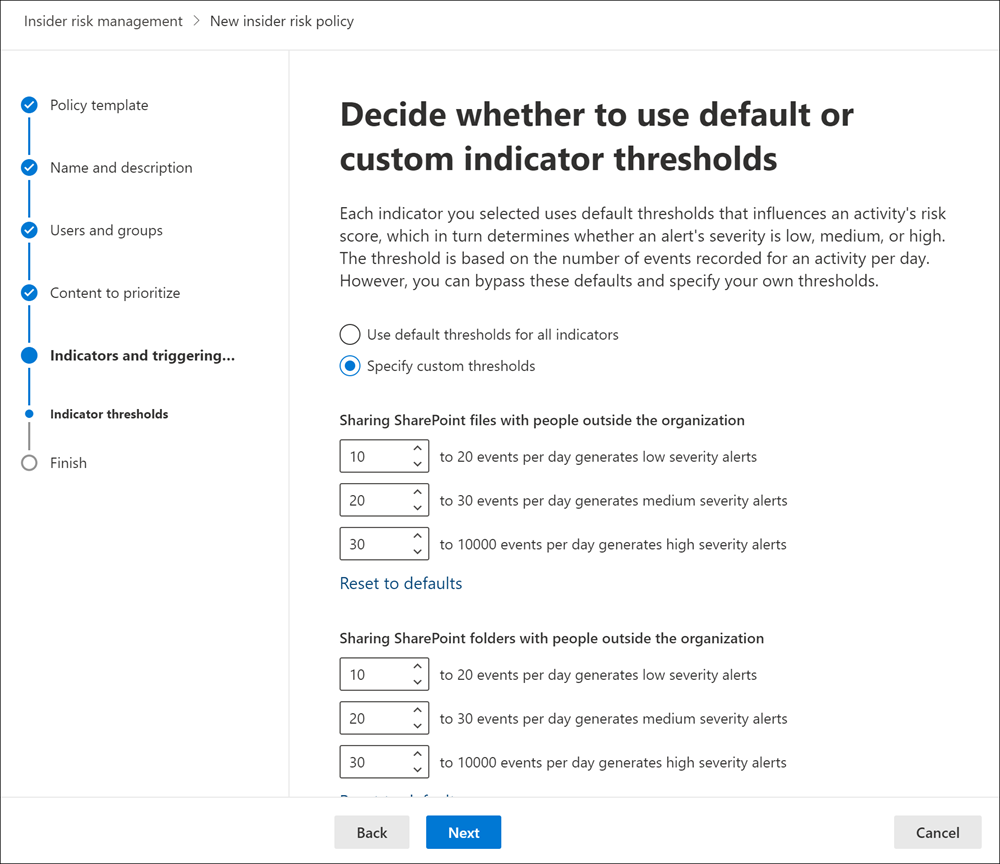
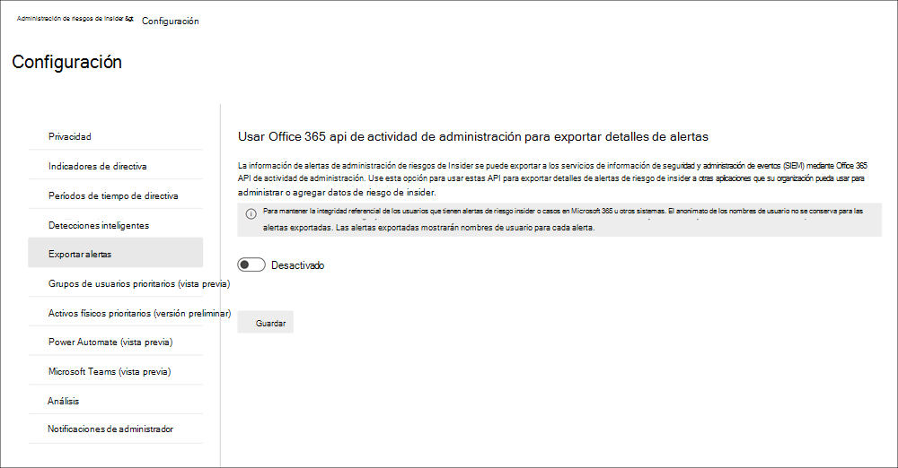
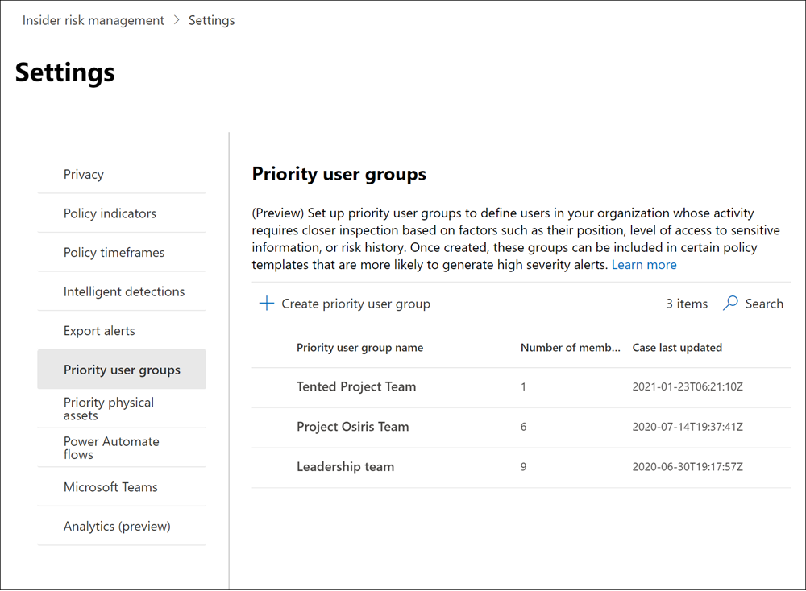
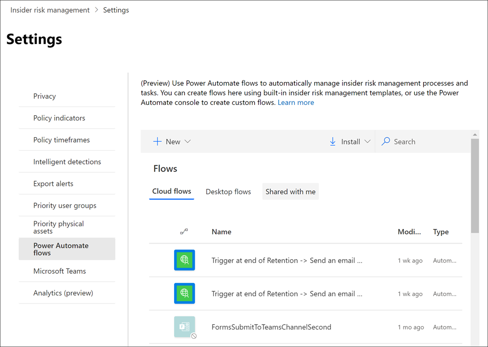
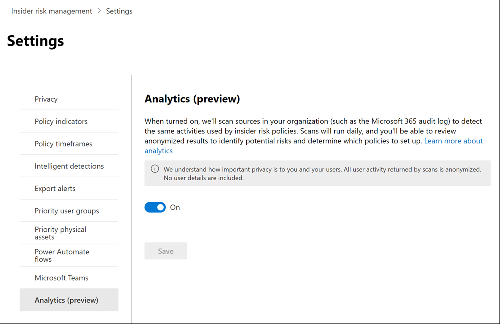

# Introducción a la configuración de administración de riesgos de insiderGet started with insider risk management settings

La configuración de administración de riesgos de Insider se aplica a todas las directivas de administración de riesgos de insider, independientemente de la plantilla que elija al crear una directiva.Insider risk management settings apply to all insider risk management policies, regardless of the template you choose when creating a policy. La configuración se ajusta con el control de la **Configuración de riesgos internos** que se encuentra en la parte superior de todas las pestañas de administración de riesgos internos.Settings are configured using the **Insider risk settings** control located at the top of all insider risk management tabs. Estos componentes de directiva de control de configuración para las siguientes áreas:These settings control policy components for the following areas:

- PrivacidadPrivacy
- IndicadoresIndicators
- Escalas de tiempo de la directivaPolicy timelines
- Detecciones inteligentesIntelligent detections
- Exportar alertas (versión preliminar)Export alerts (preview)
- Grupos de usuarios prioritarios (versión preliminar)Priority user groups (preview)
- Activos físicos prioritarios (versión preliminar)Priority physical assets (preview)
- Power Automate flujos (versión preliminar)Power Automate flows (preview)
- Microsoft Teams (versión preliminar)Microsoft Teams (preview)
- Análisis (versión preliminar)Analytics (preview)

Antes de empezar y crear directivas de administración de riesgos internas, es importante comprender esta configuración y elegir los niveles que mejor se adapten a las necesidades de cumplimiento de la organización.Before you get started and create insider risk management policies, it's important to understand these settings and choose setting levels best for the compliance needs for your organization.

## PrivacidadPrivacy

Proteger la privacidad de los usuarios que tienen coincidencias de directivas es importante y puede ayudar a promover la objetividad en las revisiones de análisis e investigaciones de datos de alertas de riesgos internos.Protecting the privacy of users that have policy matches is important and can help promote objectivity in data investigation and analysis reviews for insider risk alerts. Para los usuarios con una coincidencia de directiva de riesgo de insider, puede elegir una de las siguientes opciones:For users with an insider risk policy match, you can choose one of the following settings:

- **Mostrar versiones anónimas** de nombres de usuario: los nombres de los usuarios se anonimizan para impedir que administradores, investigadores de datos y revisores vean quién está asociado con alertas de directiva.**Show anonymized versions of usernames**: Names of users are anonymized to prevent admins, data investigators, and reviewers from seeing who is associated with policy alerts. Por ejemplo, el usuario “Grace Taylor” aparecería con un pseudónimo aleatorizado, como “AnonIS8-988” en todas las áreas relacionadas con la experiencia de administración de riesgos internos.For example, a user 'Grace Taylor' would appear with a randomized pseudonym such as 'AnonIS8-988' in all areas of the insider risk management experience. Al elegir esta configuración, se anonimizan todos los usuarios con coincidencias de directivas actuales y pasadas, y se aplica a todas las directivas.Choosing this setting anonymizes all users with current and past policy matches and applies to all policies. La información del perfil de usuario en la alerta de riesgo insider y los detalles del caso no estarán disponibles cuando se elija esta opción.User profile information in the insider risk alert and case details will not be available when this option is chosen. Sin embargo, los nombres de usuario se muestran al agregar nuevos usuarios a directivas existentes o al asignar usuarios a nuevas directivas.However, usernames are displayed when adding new users to existing policies or when assigning users to new policies. Si decide desactivar esta configuración, se mostrarán nombres de usuario para todos los usuarios que tengan coincidencias de directiva actuales o pasadas.If you choose to turn off this setting, usernames will be displayed for all users that have current or past policy matches.
- **No mostrar versiones anónimas de** nombres de usuario: los nombres de usuario se muestran para todas las coincidencias de directiva actuales y pasadas para alertas y casos.**Do not show anonymized versions of usernames**: Usernames are displayed for all current and past policy matches for alerts and cases. La información de perfil de usuario (nombre, título, alias y organización o departamento) se muestra para el usuario para todas las alertas y casos de administración de riesgos de insider.User profile information (the name, title, alias, and organization or department) is displayed for the user for all insider risk management alerts and cases.

## IndicadoresIndicators

Las plantillas de directiva de riesgo insider definen el tipo de actividades de riesgo que desea detectar e investigar.Insider risk policy templates define the type of risk activities that you want to detect and investigate. Cada plantilla de directiva se basa en indicadores específicos que corresponden a desencadenadores específicos y actividades de riesgo.Each policy template is based on specific indicators that correspond to specific triggers and risk activities. Todos los indicadores están deshabilitados de forma predeterminada y debe seleccionar uno o más indicadores de directiva antes de configurar una directiva de administración de riesgos insider.All indicators are disabled by default, and you must select one or more policy indicators before configuring an insider risk management policy.

Las directivas desencadenan alertas cuando los usuarios realizan actividades relacionadas con indicadores de directiva que cumplen un umbral obligatorio.Alerts are triggered by policies when users perform activities related to policy indicators that meet a required threshold. La administración de riesgos de Insider usa dos tipos de indicadores:Insider risk management uses two types of indicators:

- **Eventos desencadenamiento:** eventos que determinan si un usuario está activo en una directiva de administración de riesgos de insider.**Triggering events**: Events that determine if a user is active in an insider risk management policy. Si un usuario se agrega a una directiva de administración de riesgos de insider no tiene un evento desencadenante, la directiva no evalúa la actividad del usuario.If a user is added to an insider risk management policy does not have a triggering event, the user activity is not evaluated by the policy. Por ejemplo, el usuario A se agrega  a una directiva creada a partir del robo de datos al salir de la plantilla de directiva de usuarios y la directiva y el Microsoft 365 de recursos humanos están configurados correctamente.For example, User A is added to a policy created from the *Data theft by departing users* policy template and the policy and Microsoft 365 HR connector are properly configured. Hasta que el usuario A tenga una fecha de finalización notificada por el conector de recursos humanos, las actividades del usuario A no se evalúan mediante esta directiva de administración de riesgos de insider para el riesgo.Until User A has a termination date reported by the HR connector, User A activities aren't evaluated by this insider risk management policy for risk. Otro ejemplo de un evento desencadenante  es si un usuario tiene una alerta de directiva DLP de alta gravedad al usar *directivas de pérdida de* datos.Another example of a triggering event is if a user has a *High* severity DLP policy alert when using *Data leaks* policies.
- **Indicadores de directiva:** indicadores incluidos en directivas de administración de riesgos internas que se usan para determinar una puntuación de riesgo para un usuario en el ámbito.**Policy indicators**: Indicators included in insider risk management policies used to determine a risk score for an in-scope user. Estos indicadores de directiva solo se activan después de que se produzca un evento desencadenante para un usuario.These policy indicators are only activated after a triggering event occurs for a user. Algunos ejemplos de indicadores de directiva son cuando un usuario copia datos en servicios de almacenamiento en la nube personales o dispositivos de almacenamiento portátiles, si se quita una cuenta de usuario de Azure Active Directory o si un usuario comparte archivos y carpetas internos con partes externas no autorizadas.Some examples of policy indicators are when a user copies data to personal cloud storage services or portable storage devices, if a user account is removed from Azure Active Directory, or if a user shares internal files and folders with unauthorized external parties.

Los indicadores de directiva se segmentan en las siguientes áreas.Policy indicators are segmented into the following areas. Puede elegir los indicadores para activar y personalizar los límites de eventos del indicador para cada nivel de indicador al crear una directiva de riesgo de información interna:You can choose the indicators to activate and customize indicator event limits for each indicator level when creating an insider risk policy:

- **Office:** estos incluyen indicadores de directiva para SharePoint sitios, Microsoft Teams y mensajería de correo electrónico.**Office indicators**: These include policy indicators for SharePoint sites, Microsoft Teams, and email messaging.
- **Indicadores de dispositivo:** estos incluyen indicadores de directiva para la actividad, como compartir archivos a través de la red o con dispositivos.**Device indicators**: These include policy indicators for activity such as sharing files over the network or with devices. Los indicadores incluyen actividades que implican todos los tipos de archivo, excepto la actividad de archivos ejecutables (.exe) y la biblioteca de vínculos dinámicos (.dll).Indicators include activities involving all file types, excluding executable (.exe) and dynamic link library (.dll) file activity. Si selecciona Indicadores **de dispositivo,** la actividad solo se procesará para dispositivos con Windows 10 compilación 1809 o posterior y primero debe incorporar dispositivos al centro de cumplimiento.If you select **Device indicators**, activity is processed only for devices with Windows 10 Build 1809 or higher and you must first onboard devices to the compliance center. Para obtener más información sobre cómo configurar dispositivos para la integración con riesgos de insider, consulta la siguiente sección Habilitar indicadores de dispositivos y [dispositivos integrados](insider-risk-management-settings.md#OnboardDevices) en este artículo.For more information on configuring devices for integration with insider risk, see the following [Enable device indicators and onboard devices](insider-risk-management-settings.md#OnboardDevices) section in this article.
- **Indicador de infracción de** directivas de seguridad (versión preliminar): estos incluyen indicadores de Microsoft Defender para Endpoint relacionados con la instalación de software no aprobado o malintencionado o la omisión de controles de seguridad.**Security policy violation indicator (preview)**: These include indicators from Microsoft Defender for Endpoint related to unapproved or malicious software installation or bypassing security controls. Para recibir alertas en la administración de riesgos de insider, debe tener habilitada una licencia de Defender for Endpoint activa e integración de riesgos de insider.To receive alerts in insider risk management, you must have an active Defender for Endpoint license and insider risk integration enabled. Para obtener más información sobre cómo configurar Defender for Endpoint para la integración de la administración de riesgos insider, consulte [Configure advanced features in Microsoft Defender for Endpoint](/windows/security/threat-protection/microsoft-defender-atp/advanced-features\#share-endpoint-alerts-with-microsoft-compliance-center).For more information on configuring Defender for Endpoint for insider risk management integration, see [Configure advanced features in Microsoft Defender for Endpoint](/windows/security/threat-protection/microsoft-defender-atp/advanced-features\#share-endpoint-alerts-with-microsoft-compliance-center).
- **Indicadores de acceso físico (versión preliminar):** estos incluyen indicadores de directiva para el acceso físico a activos confidenciales.**Physical access indicators (preview)**: These include policy indicators for physical access to sensitive assets. Por ejemplo, el intento de acceso a un área restringida en los registros del sistema de administración de errores físicos se puede compartir con directivas de administración de riesgos internas.For example, attempted access to a restricted area in your physical badging system logs can be shared with insider risk management policies. Para recibir estos tipos de alertas en la administración de riesgos de insider, debe tener activos físicos prioritarios habilitados en la administración de riesgos de insider y el conector de datos de protección física [configurado.](import-physical-badging-data.md)To receive these types of alerts in insider risk management, you must have priority physical assets enabled in insider risk management and the [Physical badging data connector](import-physical-badging-data.md) configured. Para obtener más información sobre cómo configurar el acceso físico, consulte la sección [Prioridad de acceso físico](#priority-physical-assets-preview) en este artículo.To learn more about configuring physical access, see the [Priority physical access section](#priority-physical-assets-preview) in this article.
- **Microsoft Cloud App Security indicadores (versión preliminar):** estos incluyen indicadores de directiva de alertas compartidas de Cloud App Security.**Microsoft Cloud App Security indicators (preview)**: These include policy indicators from shared alerts from Cloud App Security. La detección de anomalías habilitada automáticamente en Cloud App Security comienza inmediatamente a detectar y recopilar resultados, lo que apunta a numerosas anomalías de comportamiento entre los usuarios y las máquinas y dispositivos conectados a la red.Automatically enabled anomaly detection in Cloud App Security immediately starts detecting and collating results, targeting numerous behavioral anomalies across your users and the machines and devices connected to your network. Para incluir estas actividades en alertas de directivas de administración de riesgos insider, seleccione uno o más indicadores en esta sección.To include these activities in insider risk management policy alerts, select one or more indicators in this section. Para obtener más información sobre Cloud App Security análisis y detección de anomalías, consulte [Get behavioral analytics and anomaly detection](/cloud-app-security/anomaly-detection-policy).To learn more about Cloud App Security analytics and anomaly detection, see [Get behavioral analytics and anomaly detection](/cloud-app-security/anomaly-detection-policy).
- **Aumentadores de puntuación de** riesgo: estos incluyen aumentar la puntuación de riesgo para actividades inusuales o infracciones de directivas anteriores.**Risk score boosters**: These include raising the risk score for unusual activities or past policy violations. Habilitar los aumentadores de puntuación de riesgo aumenta las puntuaciones de riesgo y la probabilidad de alertas para este tipo de actividades.Enabling risk score boosters increases risk scores and the likelihood of alerts for these types of activities. En el caso de actividades inusuales, se aumentan las puntuaciones si la actividad detectada se desvía del comportamiento típico del usuario.For unusual activities, scores are boosted if the detected activity deviates from the user's typical behavior. Por ejemplo, un aumento significativo en las descargas diarias de archivos.For example, a significant increase in daily file downloads. La actividad inusual se presenta como un aumento en el porcentaje (por ejemplo, "100 % por encima de la actividad habitual") y afectará la puntuación de riesgo de forma diferente en función de la actividad.Unusual activity is presented as an increase in percentage (for example, '100% above usual activity') and will impact the risk score differently depending on the activity. Para los usuarios con infracciones de directivas anteriores, se aumentan las puntuaciones si un usuario ha resuelto anteriormente más de un caso como una infracción de directiva confirmada.For users with previous policy violations, scores are boosted if a user had more than one case previously resolved as a confirmed policy violation. Los aumentadores de puntuación de riesgo solo se pueden seleccionar si se seleccionan uno o varios indicadores.Risk score boosters can only be selected if one or more indicators are selected.

En algunos casos, es posible que desee limitar los indicadores de directiva de riesgo de insider que se aplican a las directivas de riesgo de insider en su organización.In some cases, you may want to limit the insider risk policy indicators that are applied to insider risk policies in your organization. Puede desactivar los indicadores de directiva para áreas específicas deshabilitándolos de todas las directivas de riesgo de insider.You can turn off the policy indicators for specific areas by disabling them from all insider risk policies. Los eventos desencadenamiento no se pueden modificar para plantillas de directiva de riesgo interno.Triggering events cannot be modified for insider risk policy templates.

Para definir los indicadores de directiva de riesgo de insider que están habilitados en todas las directivas de riesgo de **insider,** vaya a Configuración de riesgos de Insider Indicadores y seleccione uno o varios indicadores  >   de directiva.To define the insider risk policy indicators that are enabled in all insider risk policies, navigate to **Insider risk settings** > **Indicators** and select one or more policy indicators. Los indicadores seleccionados en la página Configuración de indicadores no se pueden configurar individualmente al crear o editar una directiva de riesgo de insider en el asistente para directivas.The indicators selected on the Indicators settings page cannot be individually configured when creating or editing an insider risk policy in the policy wizard.

> [!NOTE]
> Los nuevos usuarios agregados manualmente pueden tardar varias horas en aparecer en el panel **Usuarios.**It may take several hours for new manually-added users to appear in the **Users dashboard**. Las actividades de los 90 días anteriores de estos usuarios pueden tardar hasta 24 horas en aparecer.Activities for the previous 90 days for these users may take up to 24 hours to display. Para ver las actividades de los usuarios agregados manualmente, seleccione el usuario en el panel Usuarios y abra la pestaña **Actividad de** usuario en el panel de detalles. To view activities for manually added users, select the user on the **Users dashboard** and open the **User activity** tab on the details pane.

### Habilitar indicadores de dispositivos y dispositivos integradosEnable device indicators and onboard devices

Para habilitar la supervisión de actividades de riesgo en dispositivos e incluir indicadores de directiva para estas actividades, los dispositivos deben cumplir los siguientes requisitos y debe completar los siguientes pasos de incorporación.To enable the monitoring of risk activities on devices and include policy indicators for these activities, your devices must meet the following requirements and you must complete the following onboarding steps.

#### Paso 1: Preparar los puntos de conexiónStep 1: Prepare your endpoints

Asegúrese de que los dispositivos Windows 10 que planea informar en la administración de riesgos de insider cumplan estos requisitos.Make sure that the Windows 10 devices that you plan on reporting in insider risk management meet these requirements.

1. Debe ejecutar Windows 10 x64 compilación 1809 o posterior y debe haber instalado la actualización de Windows 10 (compilación del sistema operativo [17763.1075)](https://support.microsoft.com/help/4537818/windows-10-update-kb4537818) a partir del 20 de febrero de 2020.Must be running Windows 10 x64 build 1809 or later and must have installed the [Windows 10 update (OS Build 17763.1075)](https://support.microsoft.com/help/4537818/windows-10-update-kb4537818) from February 20, 2020.
2. La cuenta de usuario usada para iniciar sesión en el dispositivo Windows 10 debe ser una cuenta Azure Active Directory (AAD) activa.The user account used to log into the Windows 10 device must be an active Azure Active Directory (AAD) account. El Windows 10 puede ser [AAD,](/azure/active-directory/devices/concept-azure-ad-join)AAD híbrido o unido a Active Directory, o AAD registrado.The Windows 10 device may be [AAD](/azure/active-directory/devices/concept-azure-ad-join), hybrid AAD, or Active Directory joined, or AAD registered.
3. Instale microsoft Chromium explorador perimetral en el dispositivo de extremo para supervisar las acciones de la actividad de carga en la nube.Install Microsoft Chromium Edge browser on the endpoint device to monitor actions for the cloud upload activity. Consulte [Descargar el nuevo Microsoft Edge basado en Chromium](https://support.microsoft.com/help/4501095/download-the-new-microsoft-edge-based-on-chromium).See, [Download the new Microsoft Edge based on Chromium](https://support.microsoft.com/help/4501095/download-the-new-microsoft-edge-based-on-chromium).

#### Paso 2: Incorporación de dispositivosStep 2: Onboarding devices

Debes habilitar la supervisión de dispositivos e incorporar los puntos de conexión para poder supervisar las actividades de administración de riesgos de información interna en un dispositivo.You must enable device monitoring and onboard your endpoints before you can monitor for insider risk management activities on a device. Ambas acciones se toman en el portal Microsoft 365 cumplimiento.Both actions are taken in the Microsoft 365 Compliance portal.

Cuando quieras incorporar dispositivos que aún no se han incorporado, descargarás el script adecuado e implementarás como se describe en los pasos siguientes.When you want to onboard devices that haven't been onboarded yet, you'll download the appropriate script and deploy as outlined in the following steps.

Si ya tiene dispositivos incorporados en [ Microsoft Defender para punto de conexión (MDATP)](/windows/security/threat-protection/), estos aparecerán en la lista de dispositivos administrados.If you already have devices onboarded into [Microsoft Defender for Endpoint](/windows/security/threat-protection/), they will already appear in the managed devices list. Siga [el paso 3: Si tiene dispositivos incorporados en Microsoft Defender para endpoint](insider-risk-management-settings.md#OnboardStep3) en la siguiente sección.Follow [Step 3: If you have devices onboarded into Microsoft Defender for Endpoint](insider-risk-management-settings.md#OnboardStep3) in the next section.

En este escenario de implementación, incorporará dispositivos que aún no se han incorporado y solo desea supervisar las actividades de riesgo interno en Windows 10 dispositivos.In this deployment scenario, you'll onboard devices that have not been onboarded yet, and you just want to monitor insider risk activities on Windows 10 devices.

1. Abra el [Centro de cumplimiento de Microsoft](https://compliance.microsoft.com).Open the [Microsoft compliance center](https://compliance.microsoft.com).
2. Abra la página de configuración del Centro de cumplimiento y elija **Incorporar dispositivos**.Open the Compliance Center settings page and choose **Onboard devices**.

   > [!NOTE]
   > Aunque, por lo general, habilitar la incorporación de dispositivos tarda aproximadamente 60 segundos, espere 30 minutos antes de ponerse en contacto con el soporte técnico de Microsoft.While it usually takes about 60 seconds for device onboarding to be enabled, please allow up to 30 minutes before engaging with Microsoft support.

3. Elija **Administración de dispositivos** para abrir la lista de **Dispositivos**.Choose **Device management** to open the **Devices** list. La lista estará vacía hasta que haya incorporado dispositivos.The list will be empty until you onboard devices.
4. Elija **Incorporación** para iniciar el proceso de incorporación.Choose **Onboarding** to begin the onboarding process.
5. Elija la forma en que desea implementar en estos más dispositivos de la **lista Método de** implementación y, a continuación, descargue el **paquete**.Choose the way you want to deploy to these more devices from the **Deployment method** list and then **download package**.
6. Siga los procedimientos adecuados que puede consultar en [Herramientas y métodos de incorporación para equipos con Windows 10](/windows/security/threat-protection/microsoft-defender-atp/configure-endpoints).Follow the appropriate procedures in [Onboarding tools and methods for Windows 10 machines](/windows/security/threat-protection/microsoft-defender-atp/configure-endpoints). Este vínculo le lleva a una página de aterrizaje en la que puede acceder a los procedimientos de Microsoft Defender para punto de conexión que coinciden con el paquete de implementación que seleccionó en el paso 5:This link takes you to a landing page where you can access Microsoft Defender for Endpoint procedures that match the deployment package you selected in step 5:
    - Incorporar equipos con Windows 10 usando Directiva de grupoOnboard Windows 10 machines using Group Policy
    - Incorporar equipos con Windows con Microsoft Endpoint Configuration ManagerOnboard Windows machines using Microsoft Endpoint Configuration Manager
    - Incorporar equipos con Windows 10 con herramientas de administración de dispositivos móvilesOnboard Windows 10 machines using Mobile Device Management tools
    - Incorporar equipos con Windows 10 usando un script localOnboard Windows 10 machines using a local script
    - Incorporar equipos de infraestructura de escritorio virtual no persistente (VDI).Onboard non-persistent virtual desktop infrastructure (VDI) machines.

Una vez que se haya hecho y se incorpore el punto de conexión, debe estar visible en la lista de dispositivos y el punto de conexión empezará a informar de los registros de actividad de auditoría a la administración de riesgos de insider.Once done and endpoint is onboarded, it should be visible in the devices list and the endpoint will start reporting audit activity logs to insider risk management.

> [!NOTE]
> Esta experiencia requiere la aplicación de una licencia.This experience is under license enforcement. Sin la licencia necesaria, los datos no serán visibles ni accesibles.Without the required license, data will not be visible or accessible.

#### Paso 3: Si tienes dispositivos incorporados en Microsoft Defender para endpointStep 3: If you have devices onboarded into Microsoft Defender for Endpoint

Si Microsoft Defender para endpoint ya está implementado y hay puntos de conexión en los que se informa, todos estos puntos de conexión aparecerán en la lista de dispositivos administrados.If Microsoft Defender for Endpoint is already deployed and there are endpoints reporting in, all these endpoints will appear in the managed devices list. Puedes seguir incorporando nuevos dispositivos a la administración de riesgos de insider para ampliar la cobertura mediante la sección [Paso 2: Dispositivos de incorporación.](insider-risk-management-settings.md#OnboardStep2)You can continue to onboard new devices into insider risk management to expand coverage by using the [Step 2: Onboarding devices](insider-risk-management-settings.md#OnboardStep2) section.

1. Abra el [Centro de cumplimiento de Microsoft](https://compliance.microsoft.com).Open the [Microsoft compliance center](https://compliance.microsoft.com).
2. Abra la página de configuración del Centro de cumplimiento y elija **Habilitar supervisión de dispositivos**.Open the Compliance Center settings page and choose **Enable device monitoring**.
3. Elija **Administración de dispositivos** para abrir la lista de **Dispositivos**.Choose **Device management** to open the **Devices** list. Debería ver la lista de dispositivos que ya están informando en Microsoft Defender para endpoint.You should see the list of devices that are already reporting into Microsoft Defender for Endpoint.
4. Elige **Incorporación si** necesitas incorporar más dispositivos.Choose **Onboarding** if you need to onboard more devices.
5. Elija la forma en que desea implementar en estos más dispositivos de la **lista Método de** implementación y, a continuación, Descargue el **paquete**.Choose the way you want to deploy to these more devices from the **Deployment method** list and then **Download package**.
6. Siga los procedimientos adecuados que puede consultar en [Herramientas y métodos de incorporación para equipos con Windows 10](/windows/security/threat-protection/microsoft-defender-atp/configure-endpoints).Follow the appropriate procedures in [Onboarding tools and methods for Windows 10 machines](/windows/security/threat-protection/microsoft-defender-atp/configure-endpoints). Este vínculo le lleva a una página de aterrizaje en la que puede acceder a los procedimientos de Microsoft Defender para punto de conexión que coinciden con el paquete de implementación que seleccionó en el paso 5:This link takes you to a landing page where you can access Microsoft Defender for Endpoint procedures that match the deployment package you selected in step 5:
    - Incorporar equipos con Windows 10 usando Directiva de grupoOnboard Windows 10 machines using Group Policy
    - Incorporar equipos con Windows con Microsoft Endpoint Configuration ManagerOnboard Windows machines using Microsoft Endpoint Configuration Manager
    - Incorporar equipos con Windows 10 con herramientas de administración de dispositivos móvilesOnboard Windows 10 machines using Mobile Device Management tools
    - Incorporar equipos con Windows 10 usando un script localOnboard Windows 10 machines using a local script
    - Incorporar equipos de infraestructura de escritorio virtual no persistente (VDI).Onboard non-persistent virtual desktop infrastructure (VDI) machines.

Una vez hecho y el punto de conexión está incorporado, debe estar visible en la tabla **Dispositivos** y el punto de conexión empezará a informar de los registros de actividad de auditoría a la administración de riesgos de insider.Once done and endpoint is onboarded, it should be visible under the **Devices** table and the endpoint will start reporting audit activity logs to insider risk management.

> [!NOTE]
>Esta experiencia requiere la aplicación de una licencia.This experience is under license enforcement. Sin la licencia necesaria, los datos no serán visibles ni accesibles.Without the required license, data will not be visible or accessible.

### Configuración del nivel del indicador (versión preliminar)Indicator level settings (preview)

Al crear una directiva en el asistente para directivas, puede configurar cómo el número diario de eventos de riesgo debe influir en la puntuación de riesgo de las alertas de riesgo de insider.When creating a policy in the policy wizard, you can configure how the daily number of risk events should influence the risk score for insider risk alerts. Esta configuración de indicador le ayuda a controlar cómo el número de repeticiones de eventos de riesgo en su organización debe afectar a la puntuación de riesgo y, por lo tanto, la gravedad de alerta asociada, para estos eventos.These indicator settings help you control how the number of occurrences of risk events in your organization should affect the risk score, and so the associated alert severity, for these events. Si lo prefiere, también puede optar por mantener los niveles de umbral de eventos predeterminados recomendados por Microsoft para todos los indicadores habilitados.If you prefer, you can also choose to keep the default event threshold levels recommended by Microsoft for all enabled indicators.

Por ejemplo, decide habilitar los indicadores SharePoint en la configuración de la directiva de riesgo de insider y establecer umbrales personalizados para eventos SharePoint al configurar indicadores para una nueva directiva de *pérdidas* de datos de riesgo interno.For example, you decide to enable SharePoint indicators in the insider risk policy settings and to set custom thresholds for SharePoint events when configuring indicators for a new insider risk *Data leaks* policy. Mientras se encuentra en el asistente para directivas de riesgo insider, se configuran tres niveles de eventos diarios diferentes para cada indicador SharePoint para influir en la puntuación de riesgo de las alertas asociadas a estos eventos.While in the insider risk policy wizard, you configure three different daily event levels for each SharePoint indicator to influence the risk score for alerts associated with these events.

Para el primer nivel de evento diario, se establece el umbral en *10* o más eventos por día para un menor impacto en la puntuación de riesgo de los eventos, *20* o más eventos por día para un impacto medio en la puntuación de riesgo de los eventos y *30* o más eventos por día un impacto mayor en la puntuación de riesgo para los eventos.For the first daily event level, you set the threshold at *10 or more events per day* for a lower impact to the risk score for the events, *20 or more events per day* for a medium impact to the risk score for the events, and *30 or more events per day* a higher impact to the risk score for the events. Estas configuraciones significan de forma eficaz:These settings effectively mean:

- Si hay entre 1 y 9 SharePoint eventos que tienen lugar después de desencadenar el evento, las puntuaciones de riesgo se verán mínimamente afectadas y tienden a no generar una alerta.If there are 1-9 SharePoint events that take place after triggering event, risk scores are minimally impacted and would tend not to generate an alert.
- Si hay entre 10 y 19 eventos SharePoint que tienen lugar después de un evento desencadenante, la puntuación de riesgo es inherentemente inferior y los niveles de gravedad de alerta tienden a ser de un nivel bajo.If there are 10-19  SharePoint events that take place after a triggering event, the risk score is inherently lower and alert severity levels would tend to be at a low level.
- Si hay entre 20 y 29 eventos SharePoint que tienen lugar después de un desencadenamiento, la puntuación de riesgo es inherentemente mayor y los niveles de gravedad de alerta tienden a estar en un nivel medio.If there are 20-29 SharePoint events that take place after a triggering, the risk score is inherently higher and alert severity levels would tend to be at a medium level.
- Si hay 30 o más eventos SharePoint que tienen lugar después de un desencadenamiento, la puntuación de riesgo es inherentemente mayor y los niveles de gravedad de alerta tienden a estar en un nivel alto.If there are 30 or more SharePoint events that take place after a triggering, the risk score is inherently higher and alert severity levels would tend to be at a high level.

## Períodos de tiempo de las directivasPolicy timeframes

Los períodos de tiempo de las directivas permiten definir períodos de revisión pasados y futuros que se activan después de coincidencias de directivas basadas en eventos y actividades para las plantillas de directivas de administración de riesgos internos.Policy timeframes allow you to define past and future review periods that are triggered after policy matches based on events and activities for the insider risk management policy templates. Según la plantilla de directiva que elija, están disponibles los siguientes plazos de directiva:Depending on the policy template you choose, the following policy timeframes are available:

- **Ventana activación:** disponible para todas  las plantillas de directiva, la ventana Activación es el número definido de días que la ventana se activa **después** de un evento desencadenante.**Activation window**: Available for all policy templates, the *Activation window* is the defined number of days that the window activates **after** a triggering event. La ventana se activa de 1 a 30 días después de que se produzca un evento desencadenante para cualquier usuario asignado a la directiva.The window activates for 1 to 30 days after a triggering event occurs for any user assigned to the policy. Por ejemplo, ha configurado una directiva de administración de riesgos insider y ha establecido la *ventana* Activación en 30 días.For example, you've configured an insider risk management policy and set the *Activation window* to 30 days. Han pasado varios meses desde que configuró la directiva y se produce un evento desencadenante para uno de los usuarios incluidos en la directiva.Several months have passed since you configured the policy, and a triggering event occurs for one of the users included in the policy. El evento desencadenante  activa la ventana Activación y la directiva está activa para ese usuario durante 30 días después de que se produjo el evento desencadenante.The triggering event activates the *Activation window* and the policy is active for that user for 30 days after the triggering event occurred.
- **Detección de** actividad pasada: disponible  para todas las plantillas de directiva, la detección de actividad Pasada es el número definido de días que se activa la ventana antes **de** un evento desencadenante.**Past activity detection**: Available for all policy templates, the *Past activity detection* is the defined number of days that the window activates **before** a triggering event. La ventana se activa de 0 a 180 días antes de que se produzca un evento desencadenante para cualquier usuario asignado a la directiva.The window activates for 0 to 180 days before a triggering event occurs for any user assigned to the policy. Por ejemplo, ha configurado una directiva de administración de riesgos de insider y ha establecido la detección de actividad *pasada* en 90 días.For example, you've configured an insider risk management policy and set the *Past activity detection* to 90 days. Han pasado varios meses desde que configuró la directiva y se produce un evento desencadenante para uno de los usuarios incluidos en la directiva.Several months have passed since you configured the policy, and a triggering event occurs for one of the users included in the policy. El evento desencadenante  activa la detección de actividad Past y la directiva recopila actividades históricas para ese usuario durante 90 días antes del evento desencadenante.The triggering event activates the *Past activity detection* and the policy gathers historic activities for that user for 90 days prior to the triggering event.

## Detecciones inteligentesIntelligent detections

La configuración de detección inteligente ayuda a refinar cómo se procesan las detecciones de actividades de riesgo para las alertas.Intelligent detection settings help refine how the detections of risky activities are processed for alerts. En determinadas circunstancias, es posible que deba definir los tipos de archivo que se deben omitir o desea aplicar un nivel de detección para los archivos para ayudar a definir una barra mínima para las alertas.In certain circumstances, you may need to define file types to ignore, or you want to enforce a detection level for files to help define a minimum bar for alerts. Use esta configuración para controlar el volumen de alerta general, las exclusiones de tipos de archivo y los límites de volumen de archivo.Use these settings to control overall alert volume, file type exclusions, and file volume limits.

### Exclusiones de tipos de archivoFile type exclusions

Para excluir tipos de archivo específicos de todas las coincidencias de directivas de administración de riesgos insider, escriba extensiones de tipo de archivo separadas por comas.To exclude specific file types from all insider risk management policy matching, enter file type extensions separated by commas. Por ejemplo, para excluir determinados tipos de archivos de música de coincidencias de directivas, puede escribir aac,mp3,wav,wma en el campo **Exclusiones de tipos de archivo**.For example, to exclude certain types of music files from policy matches you may enter aac,mp3,wav,wma in the **File type exclusions** field. Todas las directivas de administración de riesgos internas omitirán los archivos con estas extensiones.Files with these extensions will be ignored by all insider risk management policies.

### Umbral de actividad de archivos inusualThreshold for unusual file activity

Para definir un nivel de archivo mínimo antes de que se notifican alertas de actividad en directivas de riesgo de insider, escriba el número de archivos.To define a minimum file level before activity alerts are reported in insider risk policies, enter the number of files. Por ejemplo, escribiría "10" si no desea generar alertas de riesgo internas cuando un usuario descarga 10 archivos o menos, incluso si las directivas consideran esta actividad como inusual.For example, you would enter '10' if you do not want to generate insider risk alerts when a user downloads 10 files or less, even if the policies consider this activity as unusual.

### Volumen de alertasAlert volume

A las actividades de usuario detectadas por las directivas de riesgo de insider se les asigna una puntuación de riesgo específica, que a su vez determina la gravedad de la alerta (baja, mediana, alta).User activities detected by insider risk policies are assigned a specific risk score, which in turn determines the alert severity (low, medium, high). De forma predeterminada, generaremos una cierta cantidad de alertas de gravedad baja, media y alta, pero puede aumentar o disminuir el volumen según sus necesidades.By default, we'll generate a certain amount of low, medium, and high severity alerts, but you can increase or decrease the volume to suit your needs. Para ajustar el volumen de alertas de todas las directivas de administración de riesgos internas, elija una de las siguientes opciones:To adjust the volume of alerts for all insider risk management policies, choose one of the following settings:

- **Menos alertas:** verá todas las alertas de gravedad alta, menos alertas de gravedad media y ninguna de gravedad baja.**Fewer alerts**: You'll see all high severity alerts, fewer medium severity alerts, and no low severity ones. Este nivel de configuración significa que es posible que se pierdan algunos verdaderos positivos.This setting level means you might miss some true positives.
- **Volumen predeterminado:** verá todas las alertas de gravedad alta y una cantidad equilibrada de alertas de gravedad media y baja.**Default volume**: You'll see all high severity alerts and a balanced amount of medium and low severity alerts.
- **Más alertas:** verá todas las alertas de gravedad media y alta y la mayoría de las alertas de gravedad baja.**More alerts**: You'll see all medium and high severity alerts and most low severity alerts. Este nivel de configuración puede dar como resultado más falsos positivos.This setting level might result in more false positives.

### Microsoft Defender para endpoint (versión preliminar)Microsoft Defender for Endpoint (preview)

[Microsoft Defender para endpoint](/windows/security/threat-protection/microsoft-defender-atp/microsoft-defender-advanced-threat-protection) es una plataforma de seguridad de extremo de empresa diseñada para ayudar a las redes empresariales a prevenir, detectar, investigar y responder a amenazas avanzadas.[Microsoft Defender for Endpoint](/windows/security/threat-protection/microsoft-defender-atp/microsoft-defender-advanced-threat-protection) is an enterprise endpoint security platform designed to help enterprise networks prevent, detect, investigate, and respond to advanced threats. Para tener una mejor visibilidad de las infracciones de seguridad en su organización, puede importar y filtrar alertas de Defender para puntos de conexión para las actividades que se usan en las directivas creadas a partir de plantillas de directiva de infracción de seguridad de la administración de riesgos insider.To have better visibility of security violations in your organization, you can import and filter Defender for Endpoint alerts for activities used in policies created from insider risk management security violation policy templates.

Según los tipos de señales que le interesen, puede elegir importar alertas a la administración de riesgos de información interna en función del estado de evaluación de alertas de Defender for Endpoint.Depending on the types of signals you are interested in, you can choose to import alerts to insider risk management based on the Defender for Endpoint alert triage status. Puede definir uno o varios de los siguientes estados de triaje de alertas en la configuración global que se va a importar:You can define one or more of the following alert triage statuses in the global settings to import:

- UnknownUnknown
- NuevoNew
- En cursoIn progress
- ResueltoResolved

Las alertas de Defender para endpoint se importan diariamente.Alerts from Defender for Endpoint are imported daily. Según el estado del triage que elijas, es posible que veas varias actividades de usuario para la misma alerta que los cambios de estado del triage en Defender for Endpoint.Depending on the triage status you choose, you may see multiple user activities for the same alert as the triage status changes in Defender for Endpoint.

Por ejemplo, si selecciona *Nuevo* *,* En curso y Resuelto para esta configuración, cuando se genera una alerta de Microsoft Defender para extremo y el estado es *Nuevo*, se importa una actividad de alerta inicial para el usuario en riesgo interno. For example, if you select *New*, *In progress*, and *Resolved* for this setting, when a Microsoft Defender for Endpoint alert is generated and the status is *New*, an initial alert activity is imported for the user in insider risk. Cuando el estado de evaluación de Defender for Endpoint cambia a *En* curso, se importa una segunda actividad para esta alerta para el usuario en riesgo interno.When the Defender for Endpoint triage status changes to *In progress*, a second activity for this alert is imported for the user in insider risk. Cuando se establece el estado final de evaluación de Defender para el extremo de *Resuelto,* se importa una tercera actividad para esta alerta para el usuario en riesgo interno.When the final Defender for Endpoint triage status of *Resolved* is set, a third activity for this alert is imported for the user in insider risk. Esta funcionalidad permite a los investigadores seguir la progresión de las alertas de Defender for Endpoint y elegir el nivel de visibilidad que su investigación requiere.This functionality allows investigators to follow the progression of the Defender for Endpoint alerts and choose the level of visibility that their investigation requires.

> [!IMPORTANT]
> Deberá tener configurado ATP de Microsoft Defender en su organización y habilitar Defender para punto de conexión para la integración de la administración de riesgos internos en el Centro de seguridad de Defender para importar las alertas de infracciones de seguridad.You'll need to have Microsoft Defender for Endpoint configured in your organization and enable Defender for Endpoint for insider risk management integration in the Defender Security Center to import security violation alerts. Para obtener más información sobre cómo configurar Defender para punto de conexión para la integración de la administración de riesgos internos, vea [Configurar las características avanzadas de Defender para punto de conexión](/windows/security/threat-protection/microsoft-defender-atp/advanced-features\#share-endpoint-alerts-with-microsoft-compliance-center).For more information on configuring Defender for Endpoint for insider risk management integration, see [Configure advanced features in Defender for Endpoint](/windows/security/threat-protection/microsoft-defender-atp/advanced-features\#share-endpoint-alerts-with-microsoft-compliance-center).

### Dominios (versión preliminar)Domains (preview)

La configuración de dominio le ayuda a definir los niveles de riesgo de las actividades en dominios específicos.Domain settings help you define risk levels for activities to specific domains. Estas actividades incluyen compartir archivos, enviar mensajes de correo electrónico, descargar o cargar contenido.These activities include sharing files, sending email messages, downloading, or uploading content. Al especificar dominios en esta configuración, puede aumentar o disminuir la puntuación de riesgo para la actividad que tiene lugar con estos dominios.By specifying domains in these settings, you can increase or decrease the risk scoring for activity that takes place with these domains.

Use Agregar dominio para definir un dominio para cada una de las opciones de configuración del dominio.Use Add domain to define a domain for each of the domain settings. Además, puedes usar caracteres comodín para ayudar a hacer coincidir las variaciones de dominios raíz o subdominios.Additionally, you can use wildcards to help match variations of root domains or subdomains. Por ejemplo, para especificar sales.wingtiptoys.com y support.wingtiptoys.com, se usa la entrada comodín '\*.wingtiptoys.com' para coincidir con estos subdominios (y cualquier otro subdominio en el mismo nivel).For example, to specify sales.wingtiptoys.com and support.wingtiptoys.com, you use the wildcard entry '\*.wingtiptoys.com' to match these subdomains (and any other subdomain at the same level). Para especificar subdominios de varios niveles para un dominio raíz, debe seleccionar la casilla Incluir **subdominios de varios niveles.**To specify multi-level subdomains for a root domain, you must select the **Include Multi-Level Subdomains** checkbox.

Para cada una de las siguientes opciones de configuración de dominio, puede especificar hasta 500 dominios:For each of the following domain settings, you can enter up to 500 domains:

- **Dominios no permitidos:** Al especificar dominios no permitidos, la actividad que tenga lugar con estos dominios tendrá mayores *puntuaciones* de riesgo.**Unallowed domains:** By specifying unallowed domains, activity that takes place with these domains will have *higher* risk scores. Algunos ejemplos son actividades que implican compartir contenido con alguien (como enviar correo electrónico a alguien con una dirección gmail.com) y cuando los usuarios descargan contenido en un dispositivo desde uno de estos dominios no permitidos.Some examples are activities involving sharing content with someone (such as sending email to someone with a gmail.com address) and when users download content to a device from one of these unallowed domains.
- **Dominios permitidos:** Las directivas omitirán determinadas actividades relacionadas con dominios permitidos y no generarán alertas.**Allowed domains:** Certain activity related to allowed domains will be ignored by your policies and won't generate alerts. Estas actividades incluyen:These activities include:

    - Correo electrónico enviado a dominios externosEmail sent to external domains
    - Archivos, carpetas, sitios compartidos con dominios externosFiles, folders, sites shared with external domains
    - Archivos cargados en dominios externos (mediante Microsoft Edge explorador)Files uploaded to external domains (using Microsoft Edge browser)

    Al especificar dominios permitidos en la configuración, esta actividad con estos dominios se trata de forma similar a la forma en que se trata la actividad de la organización interna.By specifying allowed domains in settings, this activity with these domains is treated similarly to how internal organization activity is treated. Por ejemplo, los dominios agregados aquí se asignan a actividades que pueden implicar compartir contenido con alguien fuera de la organización (por ejemplo, enviar correo electrónico a alguien con una dirección gmail.com usuario).For example, domains added here map to activities may involve sharing content with someone outside your organization (such as sending email to someone with a gmail.com address).

- **Dominios de terceros:** Si su organización usa dominios de terceros con fines empresariales (como el almacenamiento en la nube), indójelos aquí para que pueda recibir alertas de actividad relacionadas con el indicador de dispositivo *Use un* explorador para descargar contenido de un sitio de terceros.**Third party domains:** If your organization uses third-party domains for business purposes (such as cloud storage), include them here so you can receive alerts for activity related to the device indicator *Use a browser to download content from a third-party site*.

## Exportar alertas (versión preliminar)Export alerts (preview)

La información de alertas de administración de riesgos de Insider se puede exportar a los servicios de administración de eventos y de información de seguridad (SIEM) mediante el esquema de la API de Office 365 [actividad de administración.](/office/office-365-management-api/office-365-management-activity-api-schema#security-and-compliance-alerts-schema)Insider risk management alert information is exportable to security information and event management (SIEM) services via the [Office 365 Management Activity API schema](/office/office-365-management-api/office-365-management-activity-api-schema#security-and-compliance-alerts-schema). Puede usar las API de Office 365 actividad de administración para exportar información de alerta a otras aplicaciones que su organización puede usar para administrar o agregar información de riesgo de información interna.You can use the Office 365 Management Activity APIs to export alert information to other applications your organization may use to manage or aggregate insider risk information.

Para usar las API para revisar la información de alerta de riesgo de insider:To use the APIs to review insider risk alert information:

1. Habilite la Office 365 api de actividad de administración en la administración de riesgos de **Insider**  >  **Configuración**  >  **exportar alertas**.Enable Office 365 Management Activity API support in **Insider risk management** > **Settings** > **Export alerts**. De forma predeterminada, esta configuración está deshabilitada para la Microsoft 365 organización.By default, this setting is disabled for your Microsoft 365 organization.
2. Filtre las actividades Office 365 auditoría comunes *por SecurityComplianceAlerts*.Filter the common Office 365 audit activities by *SecurityComplianceAlerts*.
3. Filtrar *SecurityComplianceAlerts* por la *categoría InsiderRiskManagement.*Filter *SecurityComplianceAlerts* by the *InsiderRiskManagement* category.

La información de alerta contiene información del esquema de alerta de seguridad y cumplimiento y el esquema Office 365 de la API de actividad de administración.Alert information contains information from the security and compliance alert schema and the Office 365 Management Activity API common schema.

Los siguientes campos y valores se exportan para alertas de administración de riesgos insider para el esquema de alertas de seguridad & cumplimiento:The following fields and values are exported for insider risk management alerts for the Security & Compliance alert schema:

| **Parámetro Alert****Alert parameter** | **Descripción****Description** |
|:------------------|:----------------|
| AlertTypeAlertType | El tipo de alerta es *Custom*.Type of the alert is *Custom*.  |
| AlertIdAlertId | GUID de la alerta.The GUID of the alert. Las alertas de administración de riesgos de Insider son mutables.Insider risk management alerts are mutable. A medida que cambia el estado de alerta, se genera un nuevo registro con el mismo AlertID.As alert status changes, a new log with the same AlertID is generated. Este AlertID se puede usar para correlacionar las actualizaciones de una alerta.This AlertID can be used to correlate updates for an alert. |
| CategoríaCategory | La categoría de la alerta *es InsiderRiskManagement*.The category of the alert is *InsiderRiskManagement*. Esta categoría se puede usar para distinguir de estas alertas de otras alertas de seguridad & cumplimiento.This category can be used to distinguish from these alerts from other Security & Compliance alerts. |
| ComentariosComments | Comentarios predeterminados para la alerta.Default comments for the alert. Los valores *son Nueva alerta* (registrada cuando se crea una alerta) y Alerta *actualizada* (registrada cuando hay una actualización de una alerta).Values are *New Alert* (logged when an alert is created) and *Alert Updated* (logged when there is an update to an alert). Use alertID para correlacionar las actualizaciones de una alerta.Use the AlertID to correlate updates for an alert. |
| DatosData | Los datos de la alerta incluyen el identificador de usuario único, el nombre principal del usuario y la fecha y hora (UTC) cuando el usuario se desencadenó en una directiva.The data for the alert, includes the unique user ID, user principal name, and date and time (UTC) when user was triggered into a policy. |
| NombreName | Nombre de la directiva para la directiva de administración de riesgos insider que generó la alerta.Policy name for insider risk management policy that generated the alert. |
| PolicyIdPolicyId | GUID de la directiva de administración de riesgos insider que desencadenó la alerta.The GUID of the insider risk management policy that triggered the alert. |
| GravedadSeverity | Gravedad de la alerta.The severity of the alert. Los valores *son High,* *Medium* o *Low*.Values are *High*, *Medium*, or *Low*. |
| OrigenSource | El origen de la alerta.The source of the alert. El valor es *Office 365 seguridad & cumplimiento*.The value is *Office 365 Security & Compliance*. |
| EstadoStatus | El estado de la alerta.The status of the alert. Los valores *son Active* (*Needs Review* in insider risk), *Investigating* (*Confirmed* in insider risk), Resolved ( *Resolved* in insider risk), Dismissed (  *Dismissed* in insider risk).Values are *Active* (*Needs Review* in insider risk), *Investigating* (*Confirmed* in insider risk), *Resolved* (*Resolved* in insider risk), *Dismissed* (*Dismissed* in insider risk). |
| VersiónVersion | La versión del esquema de alerta de seguridad y cumplimiento.The version of the security and compliance alert schema. |

Los siguientes campos y valores se exportan para alertas de administración de riesgos insider para el esquema Office 365 api común de [la API de actividad de administración.](/office/office-365-management-api/office-365-management-activity-api-schema#common-schema)The following fields and values are exported for insider risk management alerts for the [Office 365 Management Activity API common schema](/office/office-365-management-api/office-365-management-activity-api-schema#common-schema).

- UserIdUserId
- IdId
- RecordTypeRecordType
- CreationTimeCreationTime
- OperaciónOperation
- OrganizationIdOrganizationId
- UserTypeUserType
- UserKeyUserKey

## Grupos de usuarios prioritarios (versión preliminar)Priority user groups (preview)

Los usuarios de la organización pueden tener diferentes niveles de riesgo según su posición, nivel de acceso a información confidencial o historial de riesgos.Users in your organization may have different levels of risk depending on their position, level of access to sensitive information, or risk history. Priorizar el examen y la puntuación de las actividades de estos usuarios puede ayudarle a alertar sobre posibles riesgos que pueden tener mayores consecuencias para su organización.Prioritizing the examination and scoring of the activities of these users can help alert you to potential risks that may have higher consequences for your organization. Los grupos de usuarios prioritarios en la administración de riesgos de insider ayudan a definir los usuarios de la organización que necesitan una inspección más estrecha y una puntuación de riesgos más confidencial.Priority user groups in insider risk management help define the users in your organization that need closer inspection and more sensitive risk scoring. Junto con las infracciones de la directiva de seguridad por parte de los usuarios prioritarios y las pérdidas de datos por plantillas de directiva de usuarios *prioritarios,* los usuarios agregados a un grupo de usuarios prioritarios tienen una mayor probabilidad de *alertas* y alertas de riesgo interno con niveles de gravedad más altos.Coupled with the *Security policy violations by priority users* and *Data leaks by priority users* policy templates, users added to a priority user group have an increased likelihood of insider risk alerts and alerts with higher severity levels.

Por ejemplo, debe protegerse contra pérdidas de datos para un proyecto altamente confidencial en el que los usuarios tienen acceso a información confidencial.For example, you need to protect against data leaks for a highly confidential project where users have access to sensitive information. Puede crear un grupo de *usuarios Project* *prioridad* de usuarios confidenciales para los usuarios de la organización que trabajan en este proyecto.You choose to create *Confidential Project* *Users* priority user group for users in your organization that work on this project. Con el asistente para directivas y la plantilla de directiva Pérdidas  de datos por usuarios *prioritarios,* se crea una nueva directiva y se asigna a la directiva el grupo Usuarios de prioridad Project confidencial.Using the policy wizard and the *Data leaks by priority users* policy template, you create a new policy and assign the *Confidential Project Users* priority users group to the policy. Las actividades examinadas por la directiva para los miembros del grupo de usuarios prioritarios de *Project* Confidenciales son más sensibles al riesgo y las actividades de estos usuarios serán más probables que generen una alerta y tengan alertas con niveles de gravedad más altos.Activities examined by the policy for members of the *Confidential Project Users* priority user group are more sensitive to risk and activities by these users will be more likely to generate an alert and have alerts with higher severity levels.

### Crear un grupo de usuarios de prioridadCreate a priority user group

Para crear un nuevo grupo de usuarios de prioridad, usará la configuración de controles en la solución de administración de riesgos **insider** en el Centro de cumplimiento de Microsoft 365.To create a new priority user group, you'll use setting controls in the **Insider risk management** solution in the Microsoft 365 compliance center. Para crear un grupo de usuarios de prioridad, debe ser miembro del grupo de roles *Insider Risk Management* o *Insider Risk Management Admin.*To create a priority user group, you must be a member of the *Insider Risk Management* or *Insider Risk Management Admin* role group.

Complete los pasos siguientes para crear un grupo de usuarios de prioridad:Complete the following steps to create a priority user group:

1. En el [Centro de cumplimiento de Microsoft 365](https://compliance.microsoft.com), vaya a Administración de riesgos **de Insider** y seleccione **Configuración de riesgos de Insider**.In the [Microsoft 365 compliance center](https://compliance.microsoft.com), go to **Insider risk management** and select **Insider risk settings**.
2. Seleccione la **pestaña Grupos de usuarios prioritarios**Select the **Priority user groups** tab
3. En la **pestaña Grupos de usuarios prioritarios,** seleccione Crear grupo de usuarios **prioritarios** para iniciar el Asistente para la creación de grupos.On the **Priority user groups** tab, select **Create priority user group** to start the group creation wizard.
4. En la **página Definir grupo,** complete los campos siguientes:On the **Define group** page, complete the following fields:
    - **Nombre (obligatorio):** escriba un nombre descriptivo para el grupo de usuarios de prioridad.**Name (required)**: Enter a friendly name for the priority user group. No puede cambiar el nombre del grupo de usuarios de prioridad después de completar el asistente.You can't change the name of the priority user group after you complete the wizard.
    - **Descripción (opcional):** escriba una descripción para el grupo de usuarios de prioridad.**Description (optional)**: Enter a description for the priority user group.
5. Seleccione **Siguiente** para continuar.Select **Next** to continue.
6. En **la** página Elegir  miembros, seleccione Elegir miembros para buscar y seleccione qué cuentas de usuario habilitadas para correo se incluyen en el grupo o active la casilla **Seleccionar** todo para agregar todos los usuarios de la organización al grupo.On the **Choose members** page, select **Choose members** to search and select which mail-enabled user accounts are included in the group or select the **Select all** checkbox to add all users in your organization to the group. Seleccione **Agregar** para continuar o **Cancelar** para cerrar sin agregar ningún usuario al grupo.Select **Add** to continue or **Cancel** to close without adding any users to the group.
7. Seleccione **Siguiente** para continuar.Select **Next** to continue.
8. En la **página Revisar,** revise la configuración que ha elegido para el grupo de usuarios de prioridad.On the **Review** page, review the settings you've chosen for the priority user group. Seleccione **Editar** para cambiar cualquiera de los valores de grupo o seleccione **Enviar** para crear y activar el grupo de usuarios de prioridad.Select **Edit** to change any of the group values or select **Submit** to create and activate the priority user group.
9. En la página de confirmación, seleccione **Listo** para salir del asistente.On the confirmation page, select **Done** to exit the wizard.

### Actualizar un grupo de usuarios de prioridadUpdate a priority user group

Para actualizar un grupo de usuarios de prioridad existente, usará la configuración de controles en la solución de administración de riesgos **insider** en el Centro de cumplimiento de Microsoft 365.To update an existing priority user group, you'll use setting controls in the **Insider risk management** solution in the Microsoft 365 compliance center. Para actualizar un grupo de usuarios de prioridad, debe ser miembro del grupo de roles *Insider Risk Management* o *Insider Risk Management Admin.*To update a priority user group, you must be a member of the *Insider Risk Management* or *Insider Risk Management Admin* role group.

Siga estos pasos para editar un grupo de usuarios prioritario:Complete the following steps to edit a priority user group:

1. En el [Centro de cumplimiento de Microsoft 365](https://compliance.microsoft.com), vaya a Administración de riesgos **de Insider** y seleccione **Configuración de riesgos de Insider**.In the [Microsoft 365 compliance center](https://compliance.microsoft.com), go to **Insider risk management** and select **Insider risk settings**.
2. Seleccione la **pestaña Grupos de usuarios prioritarios**Select the **Priority user groups** tab
3. Seleccione el grupo de usuarios de prioridad que desea editar y seleccione **Editar grupo**.Select the priority user group you want to edit and select **Edit group**.
4. En la **página Definir grupo,** actualice el campo Descripción si es necesario.On the **Define group** page, update the Description field if needed. No puede actualizar el nombre del grupo de usuarios de prioridad.You can't update the name of the priority user group. Seleccione **Siguiente** para continuar.Select **Next** to continue.
5. En la **página Elegir miembros,** agregue nuevos miembros al grupo mediante el **control Elegir miembros.**On the **Choose members** page, add new members to the group using the **Choose members** control. Para quitar un usuario del grupo, seleccione la "X" junto al usuario que desea quitar.To remove a user from the group, select the 'X' next to the user you wish to remove. Seleccione **Siguiente** para continuar.Select **Next** to continue.
6. En la **página Revisar,** revise la configuración de actualización que ha elegido para el grupo de usuarios de prioridad.On the **Review** page, review the update settings you've chosen for the priority user group. Seleccione **Editar** para cambiar cualquiera de los valores de grupo o **seleccione Enviar** para actualizar el grupo de usuarios de prioridad.Select **Edit** to change any of the group values or select **Submit** to update the priority user group.
7. En la página de confirmación, seleccione **Listo** para salir del asistente.On the confirmation page, select **Done** to exit the wizard.

### Eliminar un grupo de usuarios de prioridadDelete a priority user group

Para eliminar un grupo de usuarios de prioridad existente, usará los controles de configuración en la solución de administración de riesgos **Insider** en el Centro de cumplimiento de Microsoft 365.To delete an existing priority user group, you'll use setting controls in the **Insider risk management** solution in the Microsoft 365 compliance center. Para eliminar un grupo de usuarios de prioridad, debe ser miembro del grupo de roles *Insider Risk Management* o *Insider Risk Management Admin.*To delete a priority user group, you must be a member of the *Insider Risk Management* or *Insider Risk Management Admin* role group.

> [!IMPORTANT]
> Al eliminar un grupo de usuarios de prioridad, se eliminará de cualquier directiva activa a la que esté asignado.Deleting a priority user group will remove it from any active policy to which it is assigned. Si elimina un grupo de usuarios de prioridad asignado a una directiva activa, la directiva no contendrá usuarios en el ámbito y estará inactiva y no creará alertas.If you delete a priority user group that is assigned to an active policy, the policy will not contain any in-scope users and will effectively be idle and will not create alerts.

Siga estos pasos para eliminar un grupo de usuarios prioritario:Complete the following steps to delete a priority user group:

1. En el [Centro de cumplimiento de Microsoft 365](https://compliance.microsoft.com), vaya a Administración de riesgos **de Insider** y seleccione **Configuración de riesgos de Insider**.In the [Microsoft 365 compliance center](https://compliance.microsoft.com), go to **Insider risk management** and select **Insider risk settings**.
2. Seleccione la **pestaña Grupos de usuarios prioritarios**Select the **Priority user groups** tab
3. Seleccione el grupo de usuarios de prioridad que desea editar y seleccione **Eliminar en** el menú del panel.Select the priority user group you want to edit and select **Delete** from the dashboard menu.
4. En el **cuadro de diálogo** Eliminar, seleccione **Sí** para eliminar el grupo de usuarios de prioridad o **seleccione Cancelar** para volver al panel.On the **Delete** dialog, select **Yes** to delete the priority user group or select **Cancel** to return to the dashboard.

## Activos físicos prioritarios (versión preliminar)Priority physical assets (preview)

Identificar el acceso a activos físicos prioritarios y correlacionar la actividad de acceso a eventos de usuario es un componente importante de la infraestructura de cumplimiento.Identifying access to priority physical assets and correlating access activity to user events is an important component of your compliance infrastructure. Estos activos físicos representan ubicaciones de prioridad en la organización, como edificios de empresas, centros de datos o salas de servidores.These physical assets represent priority locations in your organization, such as company buildings, data centers, or server rooms. Las actividades de riesgo de Insider pueden asociarse con usuarios que trabajan horas inusuales, intentar acceder a estas áreas confidenciales o seguras no autorizadas y solicitudes de acceso a áreas de alto nivel sin necesidades legítimas.Insider risk activities may be associated with users working unusual hours, attempting to access these unauthorized sensitive or secure areas, and requests for access to high-level areas without legitimate needs.

Con los activos físicos prioritarios habilitados y el conector de datos de protección física configurado, la administración de riesgos de insider integra las señales de los sistemas de control físico y acceso con otras actividades de riesgo del usuario. With priority physical assets enabled and the [Physical badging data connector](import-physical-badging-data.md) configured, insider risk management integrates signals from your physical control and access systems with other user risk activities. Al examinar patrones de comportamiento en los sistemas de acceso físico y correlacionar estas actividades con otros eventos de riesgo de insider, la administración de riesgos de insider puede ayudar a los investigadores y analistas de cumplimiento a tomar decisiones de respuesta más fundamentadas para las alertas.By examining patterns of behavior across physical access systems and correlating these activities with other insider risk events, insider risk management can help compliance investigators and analysts make more informed response decisions for alerts. El acceso a los activos físicos prioritarios se puntua e identifica en los conocimientos de forma diferente al acceso a activos que no son prioritarios.Access to priority physical assets are scored and identified in insights differently from access to non-priority assets.

Por ejemplo, la organización tiene un sistema de mala gestión para los usuarios que supervisa y aprueba el acceso físico a áreas de trabajo normales y de proyectos confidenciales.For example, your organization has a badging system for users that monitors and approves physical access to normal working and sensitive project areas. Tiene varios usuarios trabajando en un proyecto confidencial y estos usuarios volverán a otras áreas de su organización cuando se complete el proyecto.You have several users working on a sensitive project and these users will return to other areas of your organization when the project is completed. A medida que el proyecto confidencial se acerca a su finalización, desea asegurarse de que el trabajo del proyecto permanece confidencial y de que el acceso a las áreas del proyecto está estrechamente controlado.As the sensitive project nears completion, you want to make sure that the project work remains confidential and that access to the project areas is tightly controlled.

Puede habilitar el conector de datos de protección física en Microsoft 365 importar información de acceso desde el sistema de protección física y especificar activos físicos prioritarios en la administración de riesgos de insider.You choose to enable the Physical badging data connector in Microsoft 365 to import access information from your physical badging system and specify priority physical assets in insider risk management. Al importar información desde el sistema de administración de proyectos y correlacionar la información de acceso físico con otras actividades de riesgo identificadas en la administración de riesgos de información interna, observa que uno de los usuarios del proyecto está accediendo a las oficinas del proyecto después del horario laboral normal y también exporta grandes cantidades de datos a un servicio de almacenamiento en la nube personal desde su área de trabajo normal.By importing information from your badging system and correlating physical access information with other risk activities identified in insider risk management, you notice that one of the users on the project is accessing the project offices after normal working hours and is also exporting large amounts of data to a personal cloud storage service from their normal work area. Esta actividad de acceso físico asociada a la actividad en línea puede apuntar a posibles robos de datos y los investigadores y analistas de cumplimiento pueden tomar las acciones adecuadas según las circunstancias de este usuario.This physical access activity associated with the online activity may point to possible data theft and compliance investigators and analysts can take appropriate actions as dictated by the circumstances for this user.

### Configurar activos físicos prioritariosConfigure priority physical assets

Para configurar activos físicos prioritarios, configurará el conector de badging físico y usará los controles de configuración en la solución de administración de riesgos **Insider** en el Centro de cumplimiento de Microsoft 365.To configure priority physical assets, you'll configure the Physical badging connector and use setting controls in the **Insider risk management** solution in the Microsoft 365 compliance center. Para configurar activos físicos prioritarios, debe ser miembro del grupo de roles Administración de riesgos de *Insider* o Administración de riesgos *de Insider.*To configure priority physical assets, you must be a member of the *Insider Risk Management* or *Insider Risk Management Admin role group*.

Siga estos pasos para configurar activos físicos prioritarios:Complete the following steps to configure priority physical assets:

1. Siga los pasos de configuración para la administración de riesgos insider en el artículo Introducción a la administración de [riesgos insider.](insider-risk-management-configure.md)Follow the configuration steps for insider risk management in the [Getting started with insider risk management](insider-risk-management-configure.md) article. En el paso 3, asegúrese de configurar el conector de badging físico.In Step 3, make sure you configure the Physical badging connector.

    > [!IMPORTANT]
    > Para que las directivas de administración de riesgos internas usen y correlacionan los datos de señal relacionados con los usuarios que salen y terminan con los datos de eventos de las plataformas de control físico y acceso, también debe configurar el conector de Microsoft 365 recursos humanos.For insider risk management policies to use and correlate signal data related to departing and terminated users with event data from your physical control and access platforms, you must also configure the Microsoft 365 HR connector. Si habilita el conector de protección física sin habilitar el conector de recursos humanos de Microsoft 365, las directivas de administración de riesgos internas solo procesarán eventos para actividades de acceso físico para los usuarios de la organización.If you enable the Physical badging connector without enabling the Microsoft 365 HR connector, insider risk management policies will only process events for physical access activities for users in your organization.

2. En el [Centro de cumplimiento de Microsoft 365](https://compliance.microsoft.com), vaya a Administración de riesgos **de Insider** y seleccione Configuración de riesgo **de Insider**  >  **Activos físicos prioritarios.**In the [Microsoft 365 compliance center](https://compliance.microsoft.com), go to **Insider risk management** and select **Insider risk settings** > **Priority physical assets**.
3. En  la página Activos físicos prioritarios, puede agregar manualmente los identificadores de activos físicos que desea supervisar para los eventos de activos importados por el conector de pérdida física o importar un archivo .csv de todos los identificadores de activos físicos importados por el conector de configuración de activos físicos: a) Para agregar manualmente identificadores de activos físicos, elija Agregar activos físicos prioritarios, escriba un identificador de activo físico y, a continuación, seleccione **Agregar**.On the **Priority physical assets** page, you can either manually add the physical asset IDs you want to monitor for the asset events imported by the Physical badging connector or import a .csv file of all physical assets IDs imported by the Physical badging connector: a) To manually add physical assets IDs, choose **Add priority physical assets**, enter a physical asset ID, then select **Add**. Escriba otros IDs de activos físicos y, a continuación, seleccione Agregar activos físicos **prioritarios** para guardar todos los activos especificados.Enter other physical asset IDs and then select **Add priority physical assets** to save all the assets entered.
    b) Para agregar una lista de los IDs de activos físicos de un archivo .csv, elija **Importar activos físicos prioritarios.**b) To add a list of physical asset IDs from a .csv file, choose **Import priority physical assets**. En el cuadro de diálogo explorador de archivos, seleccione .csv archivo que desea importar y, a continuación, **seleccione Abrir**.From the file explorer dialog, select the .csv file you wish to import, then select **Open**. Los IDs de activos físicos de .csv archivos se agregan a la lista.The physical asset IDs from the .csv files are added to the list.
4. Vaya a la **pestaña Indicadores de directiva** en Configuración.Navigate to the **Policy indicators** tab in Settings.
5. En la **página Indicadores de** directiva, vaya a la sección **Indicadores** de acceso físico y active la casilla Acceso físico después de la finalización o error en el acceso al **activo confidencial.**On the **Policy indicators** page, navigate to the **Physical access indicators** section and select the checkbox for **Physical access after termination or failed access to sensitive asset**.
6. Seleccione **Guardar** para configurar y salir.Select **Save** to configure and exit.

### Eliminar un activo físico de prioridadDelete a priority physical asset

Para eliminar un activo físico de prioridad existente, usarás la configuración de controles en la solución de administración de riesgos Insider en el Centro de cumplimiento de Microsoft 365.To delete an existing priority physical asset, you'll use setting controls in the Insider risk management solution in the Microsoft 365 compliance center. Para eliminar un activo físico de prioridad, debe ser miembro del grupo de roles Insider Risk Management o Insider Risk Management Admin.To delete a priority physical asset, you must be a member of the Insider Risk Management or Insider Risk Management Admin role group.

> [!IMPORTANT]
> La eliminación de un activo físico de prioridad lo elimina del examen por cualquier directiva activa a la que se incluyó anteriormente.Deleting a priority physical asset removes it from examination by any active policy to which it was previously included. Las alertas generadas por actividades asociadas al activo físico de prioridad no se eliminan.Alerts generated by activities associated with the priority physical asset aren't deleted.

Siga estos pasos para eliminar un activo físico de prioridad:Complete the following steps to delete a priority physical asset:

1. En el [Centro de cumplimiento de Microsoft 365](https://compliance.microsoft.com), vaya a Administración de riesgos **de Insider** y seleccione Configuración de riesgo **de Insider**  >  **Activos físicos prioritarios.**In the [Microsoft 365 compliance center](https://compliance.microsoft.com), go to **Insider risk management** and select **Insider risk settings** > **Priority physical assets**.
2. En la **página Activos físicos prioritarios,** seleccione el activo que desea eliminar.On the **Priority physical assets** page, select the asset you want to delete.
3. Seleccione **Eliminar** en el menú de acciones para eliminar el activo.Select **Delete** on the action menu to delete the asset.

## Power Automate flujos (versión preliminar)Power Automate flows (preview)

[Microsoft Power Automate](/power-automate/getting-started) es un servicio de flujo de trabajo que automatiza las acciones entre aplicaciones y servicios.[Microsoft Power Automate](/power-automate/getting-started) is a workflow service that automates actions across applications and services. Mediante el uso de flujos de plantillas o creados manualmente, puede automatizar tareas comunes asociadas con estas aplicaciones y servicios.By using flows from templates or created manually, you can automate common tasks associated with these applications and services. Al habilitar los flujos Power Automate para la administración de riesgos de información interna, puede automatizar tareas importantes para los casos y los usuarios.When you enable Power Automate flows for insider risk management, you can automate important tasks for cases and users. Puede configurar los flujos de Power Automate para recuperar información de usuarios, alertas y casos y compartir esta información con las partes interesadas y otras aplicaciones, así como automatizar acciones en la administración de riesgos de información interna, como publicar notas de caso.You can configure Power Automate flows to retrieve user, alert, and case information and share this information with stakeholders and other applications, as well as automate actions in insider risk management, such as posting to case notes. Power Automate se aplican a los casos y a cualquier usuario en el ámbito de una directiva.Power Automate flows are applicable for cases and any user in scope for a policy.

Los clientes con Microsoft 365 que incluyen la administración de riesgos de insider no necesitan licencias adicionales Power Automate para usar las plantillas de administración de riesgos Power Automate insider recomendadas.Customers with Microsoft 365 subscriptions that include insider risk management do not need additional Power Automate licenses to use the recommended insider risk management Power Automate templates. Estas plantillas se pueden personalizar para admitir su organización y cubrir los escenarios principales de administración de riesgos de insider.These templates can be customized to support your organization and cover core insider risk management scenarios. Si elige usar características de Power Automate premium en estas plantillas, cree una plantilla personalizada con el conector de cumplimiento de Microsoft 365 o use plantillas de Power Automate para otras áreas de cumplimiento en Microsoft 365, puede que necesite más licencias de Power Automate.If you choose to use premium Power Automate features in these templates, create a custom template using the Microsoft 365 compliance connector, or use Power Automate templates for other compliance areas in Microsoft 365, you may need more Power Automate licenses.

Las siguientes Power Automate se proporcionan a los clientes para admitir la automatización de procesos para los usuarios y casos de administración de riesgos de insider:The following Power Automate templates are provided to customers to support process automation for insider risk management users and cases:

- Notificar a los usuarios cuando se agregan a una directiva de riesgo de **insider:** esta plantilla es para organizaciones que tienen directivas internas, privacidad o requisitos normativos que los usuarios deben recibir una notificación cuando están sujetos a directivas de administración de riesgos internas.**Notify users when they're added to an insider risk policy**: This template is for organizations that have internal policies, privacy, or regulatory requirements that users must be notified when they are subject to insider risk management policies. Cuando este flujo se configura y selecciona para un usuario en la página de usuarios, los usuarios y sus administradores se envían un mensaje de correo electrónico cuando el usuario se agrega a una directiva de administración de riesgos de insider.When this flow is configured and selected for a user in the users page, users and their managers are sent an email message when the user is added to an insider risk management policy. Esta plantilla también admite la actualización de una lista SharePoint hospedado en un sitio de SharePoint para ayudar a realizar un seguimiento de los detalles de los mensajes de notificación, como la fecha y hora y el destinatario del mensaje.This template also supports updating a SharePoint list hosted on a SharePoint site to help track notification message details like date/time and the message recipient. Si ha elegido anonimizar a los usuarios en la configuración de **privacidad,** los flujos creados a partir de esta plantilla no funcionarán según lo previsto para que se mantenga la privacidad del usuario.If you've chosen to anonymize users in **Privacy settings**, flows created from this template will not function as intended so that user privacy is maintained. Power Automate flujos con esta plantilla están disponibles en el panel **Usuarios**.Power Automate flows using this template are available on the **Users dashboard**.
- **Solicitar** información de recursos humanos o empresas sobre un usuario en un caso de riesgo interno: al actuar en un caso, es posible que los analistas de riesgos e investigadores de insider necesiten consultar con recursos humanos u otras partes interesadas para comprender el contexto de las actividades del caso.**Request information from HR or business about a user in an insider risk case**: When acting on a case, insider risk analysts and investigators may need to consult with HR or other stakeholders to understand the context of the case activities. Cuando este flujo se configura y selecciona para un caso, los analistas e investigadores envían un mensaje de correo electrónico a las partes interesadas de recursos humanos y empresariales configuradas para este flujo.When this flow is configured and selected for a case, analysts and investigators send an email message to HR and business stakeholders configured for this flow. A cada destinatario se le envía un mensaje con opciones de respuesta preconfiguradas o personalizables.Each recipient is sent a message with pre-configured or customizable response options. Cuando los destinatarios seleccionan una opción de respuesta, la respuesta se registra como una nota de caso e incluye información de fecha y hora y destinatario.When recipients select a response option, the response is recorded as a case note and includes recipient and date/time information. Si ha elegido anonimizar a los usuarios en la configuración de **privacidad,** los flujos creados a partir de esta plantilla no funcionarán según lo previsto para que se mantenga la privacidad del usuario.If you've chosen to anonymize users in **Privacy settings**, flows created from this template will not function as intended so that user privacy is maintained. Power Automate flujos con esta plantilla están disponibles en el panel **Casos**.Power Automate flows using this template are available on the **Cases dashboard**.
- **Notificar al administrador cuando un usuario** tiene una alerta de riesgo de información interna: es posible que algunas organizaciones necesiten recibir una notificación de administración inmediata cuando un usuario tenga una alerta de administración de riesgos de información interna.**Notify manager when a user has an insider risk alert**: Some organizations may need to have immediate management notification when a user has an insider risk management alert. Cuando se configura y selecciona este flujo, se envía un mensaje de correo electrónico al administrador del usuario del caso con la siguiente información sobre todas las alertas de caso:When this flow is configured and selected, the manager for the case user is sent an email message with the following information about all case alerts:
    - Directiva aplicable para la alertaApplicable policy for the alert
    - Fecha y hora de la alertaDate/Time of the alert
    - Nivel de gravedad de la alertaSeverity level of the alert

    El flujo actualiza automáticamente las notas de caso que el mensaje se envió y que se activó el flujo.The flow automatically updates the case notes that the message was sent and that the flow was activated. Si ha elegido anonimizar a los usuarios en la configuración de **privacidad,** los flujos creados a partir de esta plantilla no funcionarán según lo previsto para que se mantenga la privacidad del usuario.If you've chosen to anonymize users in **Privacy settings**, flows created from this template will not function as intended so that user privacy is maintained. Power Automate flujos con esta plantilla están disponibles en el panel **Casos**.Power Automate flows using this template are available on the **Cases dashboard**.
- Cree un registro para casos de riesgo de **insider en ServiceNow:** esta plantilla es para las organizaciones que desean usar su solución ServiceNow para realizar un seguimiento de los casos de administración de riesgos de insider.**Create record for insider risk case in ServiceNow**: This template is for organizations that want to use their ServiceNow solution to track insider risk management cases.  Cuando en un caso, los analistas e investigadores de riesgos de insider pueden crear un registro para el caso en ServiceNow.When in a case, insider risk analysts and investigators can create a record for the case in ServiceNow. Puede personalizar esta plantilla para rellenar campos seleccionados en ServiceNow en función de los requisitos de su organización.You can customize this template to populate selected fields in ServiceNow based on your organization's requirements. Power Automate flujos con esta plantilla están disponibles en el panel **Casos**.Power Automate flows using this template are available on the **Cases dashboard**. Para obtener más información sobre los campos de ServiceNow disponibles, consulte el artículo de referencia [de ServiceNow Connector.](/connectors/service-now/)For more information on available ServiceNow fields, see the [ServiceNow Connector reference](/connectors/service-now/) article.

### Crear un flujo Power Automate de la plantilla de administración de riesgos insiderCreate a Power Automate flow from insider risk management template

Para crear un flujo de Power Automate a partir de una plantilla de administración de riesgos insider recomendada, usará los controles de configuración de la solución de  administración de riesgos **Insider** en Centro de cumplimiento de Microsoft 365 o la opción Administrar flujos **de Power Automate** del control **Automatizar** cuando trabaje directamente en los paneles Casos o **Usuarios.**To create a Power Automate flow from a recommended  insider risk management template, you'll use the settings controls in the **Insider risk management** solution in the Microsoft 365 compliance center or the **Manage Power Automate flows** option from the **Automate** control when working directly in the **Cases** or **Users dashboards**.

Para crear un flujo Power Automate en el área de configuración, debe ser miembro del grupo de roles *Insider Risk Management* o *Insider Risk Management Admin.*To create a Power Automate flow in the settings area, you must be a member of the *Insider Risk Management* or *Insider Risk Management Admin* role group. Para crear un flujo Power Automate con la opción Administrar flujos de **Power Automate,** debe ser miembro de al menos un grupo de roles de administración de riesgos interno.To create a Power Automate flow with the **Manage Power Automate flows** option, you must be a member of at least one insider risk management role group.

Siga estos pasos para crear un flujo Power Automate de una plantilla de administración de riesgos insider recomendada:Complete the following steps to create a Power Automate flow from a recommended insider risk management template:

1. En el [Centro de cumplimiento de Microsoft 365](https://compliance.microsoft.com/), vaya a Administración de riesgos **de Insider** y seleccione Configuración de riesgos de **Insider**  >  **Power Automate flujos**.In the [Microsoft 365 compliance center](https://compliance.microsoft.com/), go to **Insider risk management** and select **Insider risk settings** > **Power Automate flows**. También puede acceder desde las páginas **de** paneles **Casos** o Usuarios **seleccionando Automatizar**  >  **administrar Power Automate flujos**.You can also access from the **Cases** or **Users dashboards** pages by choosing **Automate** > **Manage Power Automate flows**.
2. En la **página Power Automate flujos,** seleccione una plantilla recomendada de las plantillas de administración de riesgos de Insider que le pueden **gustar** en la página.On the **Power Automate flows** page, select a recommended template from the **Insider risk management templates you may like** section on the page.
3. El flujo enumera las conexiones incrustadas necesarias para el flujo y tendrá en cuenta si los estados de conexión están disponibles.The flow lists the embedded connections needed for the flow and will note if the connection statuses are available. Si es necesario, actualice las conexiones que no se muestran como disponibles.If needed, update any connections that aren't displayed as available. Seleccione **Continuar**.Select **Continue**.
4. De forma predeterminada, los flujos recomendados se configuran previamente con la administración de riesgos insider recomendada y los campos de datos de servicio Microsoft 365 necesarios para completar la tarea asignada para el flujo.By default, the recommended flows are pre-configured with the recommended insider risk management and Microsoft 365 service data fields required to complete the assigned task for the flow. Si es necesario, personalice los componentes de flujo mediante el control **Mostrar** opciones avanzadas y configurando las propiedades disponibles para el componente de flujo.If needed, customize the flow components by using the **Show advanced options** control and configuring the available properties for the flow component.
5. Si es necesario, agregue cualquier otro paso al flujo seleccionando el **botón Nuevo** paso.If needed, add any other steps to the flow by selecting the **New step** button. En la mayoría de los casos, esto no debe ser necesario para las plantillas predeterminadas recomendadas.In most cases, this should not be needed for the recommended default templates.
6. Seleccione **Guardar borrador** para guardar el flujo para una configuración adicional o seleccione **Guardar** para completar la configuración del flujo.Select **Save draft** to save the flow for further configuration or select **Save** to complete the configuration for the flow.
7. Seleccione **Cerrar** para volver a la **página Power Automate flujo.**Select **Close** to return to the **Power Automate flow** page. La nueva plantilla aparecerá como un  flujo en las pestañas Mis flujos y estará disponible automáticamente en el control desplegable **Automatizar** al trabajar con casos de administración de riesgos insider para el usuario que crea el flujo.The new template will be listed as a flow on the **My flows** tabs and is automatically available from the **Automate** dropdown control when working with insider risk management cases for the user creating the flow.

> [!IMPORTANT]
> Si otros usuarios de la organización necesitan acceso al flujo, el flujo debe compartirse.If other users in your organization need access to the flow, the flow must be shared.

### Crear un flujo de Power Automate personalizado para la administración de riesgos de insiderCreate a custom Power Automate flow for insider risk management

Algunos procesos y flujos de trabajo de su organización pueden estar fuera de las plantillas de flujo de administración de riesgos internos recomendadas y es posible que tenga la necesidad de crear flujos de Power Automate personalizados para áreas de administración de riesgos internos.Some processes and workflows for your organization may be outside of the recommended insider risk management flow templates and you may have the need to create custom Power Automate flows for insider risk management areas. Power Automate los flujos son flexibles y admiten una personalización extensa, pero hay pasos que deben realizarse para integrarse con las características de administración de riesgos de insider.Power Automate flows are flexible and support extensive customization, but there are steps that need to be taken to integrate with insider risk management features.

Siga estos pasos para crear una plantilla de Power Automate personalizada para la administración de riesgos de insider:Complete the following steps to create a custom Power Automate template for insider risk management:

1. **Compruebe su Power Automate de** flujo de datos: para crear flujos de Power Automate personalizados que usan desencadenadores de administración de riesgos insider, necesitará una licencia Power Automate usuario.**Check your Power Automate flow license**: To create customized Power Automate flows that use insider risk management triggers, you'll need a Power Automate license. Las plantillas de flujo de administración de riesgos insider recomendadas no requieren licencias adicionales y se incluyen como parte de la licencia de administración de riesgos de insider.The recommended insider risk management flow templates do not require extra licensing and are included as part of your insider risk management license.
2. **Crear un flujo automatizado:** cree un flujo que realice una o varias tareas después de que se desencadene mediante un evento de administración de riesgos interno.**Create an automated flow**: Create a flow that performs one or more tasks after it's triggered by an insider risk management event. Para obtener información detallada sobre cómo crear un flujo automatizado, vea [Create a flow in Power Automate](/power-automate/get-started-logic-flow).For details on how to create an automated flow, see [Create a flow in Power Automate](/power-automate/get-started-logic-flow).
3. **Seleccione el Microsoft 365 de cumplimiento:** busque y seleccione el Microsoft 365 de cumplimiento.**Select the Microsoft 365 compliance connector**: Search for and select the Microsoft 365 compliance connector. Este conector habilita acciones y desencadenadores de administración de riesgos insider.This connector enables insider risk management triggers and actions. Para obtener más información sobre los conectores, consulte el artículo información general [sobre la referencia de](/connectors/connector-reference/) conector.For more information on connectors, see the [Connector reference overview](/connectors/connector-reference/) article.
4. **Elegir desencadenadores de administración de riesgos insider para el flujo:** la administración de riesgos de Insider tiene dos desencadenadores disponibles para flujos de Power Automate personalizados:**Choose insider risk management triggers for your flow**: Insider risk management has two triggers available for custom Power Automate flows:
    - **Para un caso de administración de riesgos insider** seleccionado: los flujos con este desencadenador se pueden seleccionar en la página del panel De casos de administración de riesgos de insider.**For a selected insider risk management case**: Flows with this trigger can be selected from the insider risk management Cases dashboard page.
    - **Para un usuario de administración de riesgos interno** seleccionado: los flujos con este desencadenador se pueden seleccionar desde la página del panel de usuarios de administración de riesgos de insider.**For a selected insider risk management user**: Flows with this trigger can be selected from the insider risk management Users dashboard page.
5. Elija acciones de administración de riesgos de insider para su flujo: puede elegir entre varias acciones para que la administración de riesgos insider incluya en el flujo personalizado:Choose insider risk management actions for your flow: You can choose from several actions for insider risk management to include in your custom flow:
    - Obtener alerta de administración de riesgos de insiderGet insider risk management alert
    - Obtener un caso de administración de riesgos internoGet insider risk management case
    - Obtener usuario de administración de riesgos internoGet insider risk management user
    - Obtener alertas de administración de riesgos de información interna para un casoGet insider risk management alerts for a case
    - Agregar nota de caso de administración de riesgos insiderAdd insider risk management case note

### Compartir un flujo Power Automate de datosShare a Power Automate flow

De forma predeterminada, Power Automate flujos creados por un usuario solo están disponibles para ese usuario.By default, Power Automate flows created by a user are only available to that user. Para que otros usuarios de administración de riesgos de insider tengan acceso y usen un flujo, el creador del flujo debe compartir el flujo.For other insider risk management users to have access and use a flow, the flow must be shared by the flow creator. Para compartir un flujo, usará los controles de configuración de la solución de administración de riesgos **Insider** en la Centro de cumplimiento de Microsoft 365  o  la opción Administrar flujos **de Power Automate** del control Automatizar al trabajar directamente en las páginas del panel Casos o Usuarios.To share a flow, you'll use the settings controls in the **Insider risk management solution** in the Microsoft 365 compliance center or the **Manage Power Automate flows** option from the Automate control when working directly in the **Cases** or **Users dashboard** pages. Una vez que haya compartido un flujo, todos los usuarios con los que se ha compartido pueden acceder al flujo en el menú desplegable Automatizar **control** de los paneles **Caso** **y Usuario.**Once you have shared a flow, everyone who it has been shared with can access the flow in the **Automate** control dropdown in the **Case** and **User dashboards**.

Para compartir un flujo Power Automate en el área de configuración, debe ser miembro del grupo de roles *Insider Risk Management* o *Insider Risk Management Admin.*To share a Power Automate flow in the settings area, you must be a member of the *Insider Risk Management* or *Insider Risk Management Admin* role group. Para compartir un flujo Power Automate con la opción Administrar **flujos de Power Automate,** debe ser miembro de al menos un grupo de roles de administración de riesgos interno.To share a Power Automate flow with the **Manage Power Automate flows** option, you must be a member of at least one insider risk management role group.

Siga estos pasos para compartir un flujo Power Automate datos:Complete the following steps to share a Power Automate flow:

1. En el [Centro de cumplimiento de Microsoft 365](https://compliance.microsoft.com), vaya a Administración de riesgos **de Insider** y seleccione Configuración de riesgos de **Insider**  >  **Power Automate flujos**.In the [Microsoft 365 compliance center](https://compliance.microsoft.com), go to **Insider risk management** and select **Insider risk settings** > **Power Automate flows**. También puede acceder desde las páginas **de** paneles **Casos** o Usuarios **seleccionando Automatizar**  >  **administrar Power Automate flujos**.You can also access from the **Cases** or **Users dashboards** pages by choosing **Automate** > **Manage Power Automate flows**.
2. En la **página Power Automate flujos,** seleccione la **pestaña Mis flujos** o Flujos **de** equipo.On the **Power Automate flows** page, select the **My flows** or **Team flows** tab.
3. Seleccione el flujo que desea compartir y, a continuación, **seleccione Compartir** en el menú opciones de flujo.Select the flow to share, then select **Share** from the flow options menu.
4. En la página de uso compartido de flujo, escriba el nombre del usuario o grupo que desea agregar como propietario del flujo.On the flow sharing page, enter the name of the user or group you want to add as an owner for the flow.
5. En el cuadro de diálogo Conexión **usada,** seleccione **Aceptar** para confirmar que el usuario o grupo agregado tendrá acceso total al flujo.On the **Connection Used** dialog, select **OK** to acknowledge that the added user or group will have full access to the flow.

### Editar un flujo Power Automate datosEdit a Power Automate flow

Para editar un flujo, usará los controles de configuración de la solución de administración de riesgos **Insider** en Centro de cumplimiento de Microsoft 365 o la  opción Administrar flujos **de Power Automate** del control **Automatizar** al trabajar directamente en los paneles **Casos** o Usuarios .To edit a flow, you'll use the settings controls in the **Insider risk management** solution in the Microsoft 365 compliance center or the **Manage Power Automate flows** option from the **Automate** control when working directly in the **Cases** or **Users dashboards**.

Para editar un flujo Power Automate en el área de configuración, debe ser miembro del grupo de roles *Insider Risk Management* o *Insider Risk Management Admin.*To edit a Power Automate flow in the settings area, you must be a member of the *Insider Risk Management* or *Insider Risk Management Admin* role group. Para editar un flujo Power Automate con la opción Administrar **Power Automate flujos,** debe ser miembro de al menos un grupo de roles de administración de riesgos interno.To edit a Power Automate flow with the **Manage Power Automate flows** option, you must be a member of at least one insider risk management role group.

Siga estos pasos para editar un flujo Power Automate datos:Complete the following steps to edit a Power Automate flow:

1. En el [Centro de cumplimiento de Microsoft 365](https://compliance.microsoft.com), vaya a Administración de riesgos **de Insider** y seleccione Configuración de riesgos de **Insider**  >  **Power Automate flujos**.In the [Microsoft 365 compliance center](https://compliance.microsoft.com), go to **Insider risk management** and select **Insider risk settings** > **Power Automate flows**. También puede acceder desde las páginas **de** paneles **Casos** o Usuarios **seleccionando Automatizar**  >  **administrar Power Automate flujos**.You can also access from the **Cases** or **Users dashboards** pages by choosing **Automate** > **Manage Power Automate flows**.
2. En la **página Power Automate flujos** de flujo, seleccione un flujo para editar y seleccione Editar **en** el menú control de flujo.On the **Power Automate flows** page, select a flow to edit and select **Edit** from the flow control menu.
3. Seleccione los **puntos suspensivos** Configuración cambiar una configuración de componente de flujo o puntos suspensivos  >     >  **Eliminar** para eliminar un componente de flujo.Select the **ellipsis** > **Settings** to change a flow component setting or **ellipsis** > **Delete** to delete a flow component.
4. Seleccione **Guardar** y, a continuación, **Cerrar** para completar la edición del flujo.Select **Save** and then **Close** to complete editing the flow.

### Eliminar un flujo Power Automate datosDelete a Power Automate flow

Para eliminar un flujo, usará los controles de configuración de la solución de administración de riesgos **Insider** en Centro de cumplimiento de Microsoft 365 o la  opción Administrar flujos **de Power Automate** del control **Automatizar** cuando trabaje directamente en los paneles **Casos** o Usuarios .To delete a flow, you'll use the settings controls in the **Insider risk management** solution in the Microsoft 365 compliance center or the **Manage Power Automate flows** option from the **Automate** control when working directly in the **Cases** or **Users dashboards**. Cuando se elimina un flujo, se quita como una opción para todos los usuarios.When a flow is deleted, it is removed as an option for all users.

Para eliminar un flujo Power Automate en el área de configuración, debe ser miembro del grupo de roles Administración de riesgos de *Insider* o Administración de riesgos *insider.*To delete a Power Automate flow in the settings area, you must be a member of the *Insider Risk Management* or *Insider Risk Management Admin* role group. Para eliminar un flujo Power Automate con la opción Administrar **Power Automate flujos,** debe ser miembro de al menos un grupo de roles de administración de riesgos interno.To delete a Power Automate flow with the **Manage Power Automate flows** option, you must be a member of at least one insider risk management role group.

Siga estos pasos para eliminar un flujo Power Automate datos:Complete the following steps to delete a Power Automate flow:

1. En el [Centro de cumplimiento de Microsoft 365](https://compliance.microsoft.com), vaya a Administración de riesgos **de Insider** y seleccione Configuración de riesgos de **Insider**  >  **Power Automate flujos**.In the [Microsoft 365 compliance center](https://compliance.microsoft.com), go to **Insider risk management** and select **Insider risk settings** > **Power Automate flows**. También puede acceder desde las páginas **de** paneles **Casos** o Usuarios **seleccionando Automatizar**  >  **administrar Power Automate flujos**.You can also access from the **Cases** or **Users dashboards** pages by choosing **Automate** > **Manage Power Automate flows**.
2. En la **página Power Automate flujos** de flujo, seleccione un flujo para eliminar y seleccione Eliminar **en** el menú control de flujo.On the **Power Automate flows** page, select a flow to delete and select **Delete** from the flow control menu.
3. En el cuadro de diálogo de confirmación de eliminación, seleccione **Eliminar** para quitar el flujo o **seleccione Cancelar** para salir de la acción de eliminación.On the deletion confirmation dialog, select **Delete** to remove the flow or select **Cancel** to exit the deletion action.

## Microsoft Teams (versión preliminar)Microsoft Teams (preview)

Los analistas e investigadores de cumplimiento pueden usar fácilmente Microsoft Teams colaboración en casos de administración de riesgos de información interna.Compliance analysts and investigators can easily use Microsoft Teams for collaboration on insider risk management cases. Pueden coordinar y comunicarse con otras partes interesadas en Microsoft Teams para:They can coordinate and communicate with other stakeholders in Microsoft Teams to:

- Coordinar y revisar actividades de respuesta para casos en canales Teams privadosCoordinate and review response activities for cases in private Teams channels
- Compartir y almacenar archivos y pruebas de forma segura relacionados con casos individualesSecurely share and store files and evidence related to individual cases
- Seguimiento y revisión de las actividades de respuesta de analistas e investigadoresTrack and review response activities by analysts and investigators

Después Microsoft Teams para la administración de riesgos de insider, se crea un equipo de Microsoft Teams dedicado cada vez que se confirma una alerta y se crea un caso.After Microsoft Teams is enabled for insider risk management, a dedicated Microsoft Teams team is created every time an alert is confirmed and a case is created. De forma predeterminada, el equipo incluye automáticamente todos los miembros de los grupos de roles *Insider Risk Management*, *Insider Risk Management Analysts* y *Insider Risk Management Investigators* (hasta 100 usuarios iniciales).By default, the team automatically includes all members of the *Insider Risk Management*, *Insider Risk Management Analysts*, and *Insider Risk Management Investigators* role groups (up to 100 initial users). Los colaboradores de la organización adicionales pueden agregarse al equipo después de crearlo y según corresponda.Additional organization contributors may be added to the team after it is created and as appropriate. Para los casos existentes creados antes de habilitar Microsoft Teams, los analistas e investigadores pueden elegir crear un nuevo equipo de Microsoft Teams al trabajar en un caso si es necesario.For existing cases created before enabling Microsoft Teams, analysts and investigators can choose to create a new Microsoft Teams team when working in a case if needed.  Una vez resuelto el caso asociado en la administración de riesgos de insider, el equipo se archiva automáticamente (se mueve a oculto y de solo lectura).Once you resolve the associated case in insider risk management, the team is automatically archived (moved to hidden and read-only).

Para obtener más información sobre cómo usar equipos y canales en Microsoft Teams, vea [Overview of teams and channels in Microsoft Teams](/MicrosoftTeams/teams-channels-overview).For more information on how to use teams and channels in Microsoft Teams, see [Overview of teams and channels in Microsoft Teams](/MicrosoftTeams/teams-channels-overview).

Habilitar Microsoft Teams compatibilidad con casos es rápido y fácil de configurar.Enabling Microsoft Teams support for cases is quick and easy to configure. Para habilitar Microsoft Teams para la administración de riesgos de insider, siga estos pasos:To enable Microsoft Teams for insider risk management, complete the following steps:

1. En el [Centro de cumplimiento de Microsoft 365](https://compliance.microsoft.com), vaya a **Insider risk management**  >  **Insider risk settings**.In the [Microsoft 365 compliance center](https://compliance.microsoft.com), go to **Insider risk management** > **Insider risk settings**.
2. Seleccione la **Microsoft Teams** pestaña.Select the **Microsoft Teams** tab.
3. Habilite Microsoft Teams integración para la administración de riesgos de insider.Enable Microsoft Teams integration for insider risk management.
4. Seleccione **Guardar** para configurar y salir.Select **Save** to configure and exit.

### Crear un equipo Microsoft Teams para casos existentesCreate a Microsoft Teams team for existing cases

Si habilita la Microsoft Teams para la administración de riesgos de insider después de tener casos existentes, deberá crear manualmente un equipo para cada caso según sea necesario.If you enable Microsoft Teams support for insider risk management after you have existing cases, you'll need to manually create a team for each case as needed. Después de habilitar Microsoft Teams en la configuración de administración de riesgos de insider, los nuevos casos crearán automáticamente un nuevo Microsoft Teams equipo.After enabling Microsoft Teams support in insider risk management settings, new cases will automatically create a new Microsoft Teams team.

Los usuarios necesitan permiso para crear Microsoft 365 grupos en la organización para crear un equipo Microsoft Teams a partir de un caso.Users need permission to create Microsoft 365 groups in your organization to create a Microsoft Teams team from a case. Para obtener más información acerca de la administración de permisos para Microsoft 365, vea [Manage who can create Microsoft 365 Groups](../solutions/manage-creation-of-groups.md).For more information about managing permissions for Microsoft 365 Groups, see [Manage who can create Microsoft 365 Groups](../solutions/manage-creation-of-groups.md).

Para crear un equipo para un caso, usará el control Crear equipo de Microsoft cuando trabaje directamente en un caso existente.To create a team for a case, you'll use the Create Microsoft Team control when working directly in an existing case. Siga estos pasos para crear un nuevo equipo:Complete the following steps to create a new team:

1. En el [Centro de cumplimiento de Microsoft 365](https://compliance.microsoft.com), vaya a **Insider risk management**  >  **Cases** y seleccione un caso existente.In the [Microsoft 365 compliance center](https://compliance.microsoft.com), go to **Insider risk management** > **Cases** and select an existing case.
2. En el menú acción caso, seleccione **Crear Microsoft Team**.On the case action menu, select **Create Microsoft Team**.
3. En el **campo Nombre del** equipo, escriba un nombre para el nuevo Microsoft Teams equipo.In the **Team name** field, enter a name for the new Microsoft Teams team.
4. Seleccione **Crear equipo de Microsoft** y, a continuación, seleccione **Cerrar**.Select **Create Microsoft team** and then select **Close**.

Según el número de usuarios asignados a grupos de roles de administración de riesgos insider, puede tardar 15 minutos en agregarse al equipo de Microsoft Teams para un caso.Depending on the number of users assigned to insider risk management role groups, it may take 15 minutes for all investigators and analysts to be added to the Microsoft Teams team for a case.

## Análisis (versión preliminar)Analytics (preview)

Los análisis de riesgos internos le permiten realizar una evaluación de los posibles riesgos internos en su organización sin necesidad de configurar ninguna directiva de riesgos internos.Insider risk analytics enables you to conduct an evaluation of potential insider risks in your organization without configuring any insider risk policies. Esta evaluación puede ayudar a su organización a identificar áreas potenciales de mayor riesgo para los usuarios y ayudar a determinar el tipo y el alcance de las directivas de administración de riesgos internos que puede considerar configurar.This evaluation can help your organization identify potential areas of higher user risk and help determine the type and scope of insider risk management policies you may consider configuring. Los exámenes de análisis ofrecen las siguientes ventajas para su organización:Analytics scans offer the following advantages for your organization:

- Fácil de configurar: para empezar con los exámenes de análisis, puede seleccionar Ejecutar examen cuando se le solicite la recomendación de análisis o ir a Configuración de riesgos de Insider > pestaña Análisis y habilitar análisis.Easy to configure: To get started with analytics scans, you can select Run scan when prompted by the analytics recommendation or go to Insider risk settings > Analytics tab and enable analytics.
- Requisitos mínimos de privacidad: los resultados y las perspectivas del examen se devuelven como actividad de usuario anonimizada, los revisores no identifican nombres de usuario individuales.Minimal privacy requirements: Scan results and insights are returned as anonymized user activity, individual user names are not identifiable by reviewers.
- Comprender los posibles riesgos a través de información consolidada: los resultados del examen pueden ayudarle a identificar rápidamente las posibles áreas de riesgo para los usuarios y qué directiva sería mejor para ayudar a mitigar estos riesgos.Understand potential risks through consolidated insights: Scan results can help you quickly identify potential risk areas for your users and which policy would be best to help mitigate these risks.

Consulte el vídeo análisis de administración de riesgos de Insider para comprender cómo los análisis pueden ayudar a acelerar la identificación de posibles riesgos de [insider](https://www.youtube.com/watch?v=5c0P5MCXNXk) y ayudarle a tomar medidas rápidamente.Check out the [Insider Risk Management Analytics video](https://www.youtube.com/watch?v=5c0P5MCXNXk) to help understand how analytics can help accelerate the identification of potential insider risks and help you to quickly take action.

El análisis busca eventos de actividad de riesgo de varios orígenes para ayudar a identificar información sobre posibles áreas de riesgo.Analytics scans for risk activity events from several sources to help identify insights into potential areas of risk. Según la configuración actual, el análisis busca actividades de riesgo que califiquen en las siguientes áreas:Depending on your current configuration, analytics looks for qualifying risk activities in the following areas:

- **Microsoft 365 registros de auditoría:** incluidos en todos los exámenes, este es el origen principal para identificar la mayoría de las actividades potencialmente arriesgadas.**Microsoft 365 audit logs**: Included in all scans, this is the primary source for identifying most of the potentially risky activities.
- **Exchange Online:** incluida en todos los exámenes, la actividad Exchange Online ayuda a identificar actividades en las que los datos adjuntos se envía por correo electrónico a los contactos o servicios externos.**Exchange Online**: Included in all scans, Exchange Online activity helps identify activities where data in attachments are emailed to external contacts or services.
- **Azure Active Directory:** incluido en todos los exámenes, el historial Azure Active Directory ayuda a identificar actividades de riesgo asociadas con usuarios con cuentas de usuario eliminadas.**Azure Active Directory**: Included in all scans, Azure Active Directory history helps identify risky activities associated with users with deleted user accounts.
- **Microsoft 365 de datos de** recursos humanos: si están configurados, los eventos del conector de RECURSOS humanos ayudan a identificar actividades de riesgo asociadas con usuarios que tienen fechas de dimisión o próximas terminaciones.**Microsoft 365 HR data connector**: If configured, HR connector events help identify risky activities associated with users that have resignation or upcoming termination dates.

La información de análisis de los exámenes se basa en las mismas señales de actividad de riesgo que usan las directivas de administración de riesgos internas y los resultados de informes basados en actividades de usuario de secuencia y únicas.Analytics insights from scans are based on the same risk activity signals used by insider risk management policies and report results based on both single and sequence user activities. Sin embargo, la puntuación de riesgos para el análisis se basa en hasta 30 días de actividad, mientras que las directivas de riesgo de insider usan la actividad diaria para obtener información.However, the risk scoring for analytics is based on up to 30 days of activity while insider risk policies use daily activity for insights. Cuando habilite y ejecute análisis por primera vez en su organización, verá los resultados del examen durante un día.When you first enable and run analytics in your organization, you'll see the scan results for one day. Si dejas el análisis habilitado, verás los resultados de cada examen diario agregados a los informes de información para un intervalo máximo de los 30 días anteriores de actividad.If you leave analytics enabled, you'll see the results of each daily scan added to the insight reports for a maximum range of the previous 30 days of activity.

### Habilitar análisis e iniciar el examenEnable analytics and start your scan

Para habilitar el análisis de riesgos de insider, debe ser miembro del grupo de roles Administración de riesgos de Insider, Administrador de administración de riesgos de Insider o Microsoft 365 de roles de administración global.To enable insider risk analytics, you must be a member of the Insider Risk Management, Insider Risk Management Admin or Microsoft 365 Global admin role group.
Siga estos pasos para habilitar el análisis de riesgos de insider:Complete the following steps to enable insider risk analytics:

1. En el [Centro de cumplimiento de Microsoft 365](https://compliance.microsoft.com), vaya a **Administración de riesgos de Insider**.In the [Microsoft 365 compliance center](https://compliance.microsoft.com), go to **Insider risk management**.
2. Seleccione **Ejecutar examen en** la pestaña Examinar los riesgos de **insider en** la tarjeta de la organización en la pestaña Información general sobre la administración de riesgos de insider.  Esto activa el análisis de la organización.Select **Run scan** on the **Scan for insider risks in your organization** card on the insider risk management **Overview** tab. This turns on analytics scanning for your organization. También puede activar el examen en su organización navegando a Configuración de riesgos de **Insider** Analytics y habilitando Examinar la actividad del usuario del inquilino para identificar posibles riesgos de  >   **insider**.You can also turn on scanning in your organization by navigating to **Insider risk settings** > **Analytics** and enabling **Scan your tenant's user activity to identify potential insider risks**.
3. En el **panel de detalles de Analytics,** seleccione Ejecutar **examen** para iniciar el examen de su organización.On the **Analytics details** pane, select **Run scan** to start the scan for your organization. Los resultados del examen de análisis pueden tardar hasta 24 horas antes de que la información esté disponible como informes para su revisión.Analytics scan results may take up to 24 hours before insights are available as reports for review.

### Visualización de información de análisis y creación de nuevas directivasViewing analytics insights and creating new policies

Una vez completado el primer examen de análisis para su organización, puede ver los conocimientos y recomendaciones de las actividades potencialmente arriesgadas por los usuarios.After the first analytics scan is complete for your organization, you can view the insights and recommendations for potentially risky activities by your users. Los exámenes diarios continuarán a menos que desactives los análisis de tu organización.Daily scans will continue unless you turn off analytics for your organization. Para ver posibles riesgos para su  organización, vaya a la pestaña Información general y seleccione **Ver** resultados en la tarjeta análisis de riesgos **de Insider (versión** preliminar).To view potential risks for your organization, go to the **Overview** tab and select **View results** on the **Insider risk analytics (preview)** card. Si el examen de la organización no se ha completado, verá un mensaje que indica que el examen sigue activo.If the scan for your organization isn't complete, you'll see a message that the scan is still active.

Para los exámenes completados, verá los posibles riesgos detectados en su organización y los conocimientos y recomendaciones para abordar estos riesgos.For completed scans, you'll see the potential risks discovered in your organization and insights and recommendations to address these risks. Los riesgos identificados y los conocimientos específicos se incluyen en los informes agrupados por área, el número total de usuarios con riesgos identificados, el porcentaje de estos usuarios con actividades potencialmente arriesgadas y una directiva de riesgos insider recomendada para ayudar a mitigar estos riesgos.Identified risks and specific insights are included in reports grouped by area, the total number of users with identified risks, the percentage of these users with potentially risky activities, and a recommended insider risk policy to help mitigate these risks. Los informes incluyen:The reports include:

- **Información sobre pérdidas** de datos: actividades para todos los usuarios que pueden incluir el exceso accidental de información fuera de la organización o filtraciones de datos por parte de usuarios con intenciones malintencionadas.**Data leaks insights**: Activities for all users that may include accidental oversharing of information outside your organization or data leaks by users with malicious intent.
- Información sobre el robo de datos: actividades para usuarios que salen o usuarios con cuentas de Azure Active Directory **eliminadas** que pueden incluir el uso compartido arriesgado de información fuera de la organización o el robo de datos por parte de usuarios con intenciones malintencionadas.**Data theft insights**: Activities for departing users or users with deleted Azure Active Directory accounts that may include risky sharing of information outside your organization or data theft by users with malicious intent.
- **Información de exfiltración** superior: actividades de todos los usuarios que pueden incluir el uso compartido de datos fuera de la organización.**Top exfiltration insights**: Activities by all users that may include sharing data outside of your organization.

Para mostrar más información para una información, seleccione **Ver detalles** para mostrar el panel de detalles de la información.To display more information for an insight, select **View details** to display the details pane for the insight. El panel de detalles incluye los resultados completos  de la información, una recomendación de directiva de riesgo interno y el botón Crear directiva para ayudarle a crear rápidamente la directiva recomendada.The details pane includes the complete insight results, an insider risk policy recommendation, and the **Create policy** button to quickly help you create the recommended policy. Si selecciona Crear directiva, se le llevará al Asistente para directivas y seleccionará automáticamente la plantilla de directiva recomendada relacionada con la información.Selecting Create policy takes you to the policy wizard and automatically selects the recommended policy template related to the insight. Por ejemplo, si la información de análisis es para la actividad *de* pérdida de datos, la plantilla de directiva de *pérdidas* de datos generales se seleccionará previamente en el asistente para directivas.For example, if the analytics insight is for *Data leak* activity, the *General data leaks* policy template will be pre-selected in the policy wizard for you.

### Desactivar análisisTurn off analytics

Para desactivar el análisis de riesgos de *insider,* debe ser miembro del grupo de roles de administración global Insider Risk Management , *Insider Risk Management Admin* o Microsoft 365 Global *admin.*To turn off insider risk analytics, you must be a member of the *Insider Risk Management*, *Insider Risk Management Admin*, or Microsoft 365 *Global admin* role group. Después de deshabilitar el análisis, los informes de información de análisis permanecerán estáticos y no se actualizarán para nuevos riesgos.After you disable analytics, analytics insight reports will remain static and not be updated for new risks.

Complete los siguientes pasos para desactivar el análisis de riesgos de insider:Complete the following steps to turn off insider risk analytics:

1. En el [Centro de cumplimiento de Microsoft 365](https://compliance.microsoft.com), vaya a **Administración de riesgos de Insider**.In the [Microsoft 365 compliance center](https://compliance.microsoft.com), go to **Insider risk management**.
2. Selecciona **Configuración de riesgos de Insider** Página  >  **de** análisis.Select **Insider risk settings** > **Analytics** page.
3. En la **página Análisis,** desactive Examinar la actividad de usuario del inquilino para identificar posibles riesgos **de información interna.**On the **Analytics** page, turn off **Scan your tenant's user activity to identify potential insider risks**.