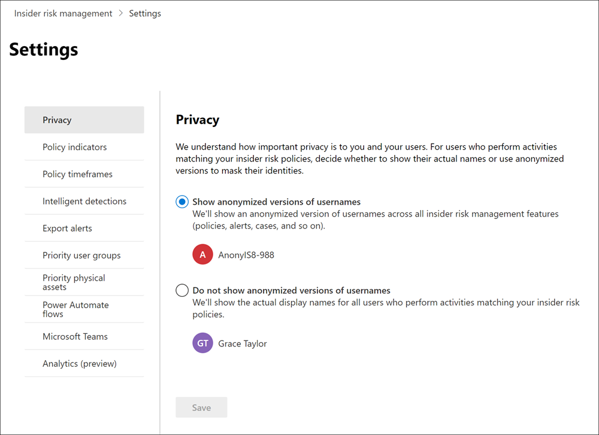

# Introducción a la configuración de administración de riesgos de InsiderGet started with insider risk management settings

La configuración de la administración de riesgos de Insider se aplica a todas las directivas de administración de riesgos de Insider, independientemente de la plantilla que elija al crear una directiva.Insider risk management settings apply to all insider risk management policies, regardless of the template you chose when creating a policy. La configuración se configura con el control de **configuración de riesgos de Insider** ubicado en la parte superior de todas las pestañas de administración de riesgos de Insider.Settings are configured using the **Insider risk settings** control located at the top of all insider risk management tabs. Esta configuración controla los componentes de directiva para las siguientes áreas:These settings control policy components for the following areas:

- PrivacidadPrivacy
- IndicadoresIndicators
- Escalas de tiempo de DirectivaPolicy timelines
- Detecciones inteligentesIntelligent detections
- Exportar alertas (versión preliminar)Export alerts (preview)
- Grupos de usuarios con prioridad (versión preliminar)Priority user groups (preview)
- Activos de prioridad física (versión preliminar)Priority physical assets (preview)
- Flujos de automatización de la potencia (versión preliminar)Power Automate flows (preview)
- Microsoft Teams (versión preliminar)Microsoft Teams (preview)

Antes de empezar y crear directivas de administración de riesgos de Insider, es importante comprender esta configuración y elegir los niveles de configuración mejor para las necesidades de cumplimiento de la organización.Before you get started and create insider risk management policies, it's important to understand these settings and choose setting levels best for the compliance needs for your organization.

## PrivacidadPrivacy

La protección de la privacidad de los usuarios que tienen coincidencias de directivas es importante y puede ayudar a promover la objetividad en la investigación de datos y análisis de revisiones de alertas de riesgo de Insider.Protecting the privacy of users that have policy matches is important and can help promote objectivity in data investigation and analysis reviews for insider risk alerts. Para los usuarios con una directiva de riesgo de Insider coinciden, puede elegir una de las siguientes opciones:For users with an insider risk policy match, you can choose one of the following settings:

- **Mostrar anonimizan versiones de**nombres de usuario: los nombres de los usuarios se anonimizan para evitar que los administradores, investigadores de datos y revisores vean quiénes están asociados con las alertas de directiva.**Show anonymized versions of usernames**: Names of users are anonymized to prevent admins, data investigators, and reviewers from seeing who is associated with policy alerts. Por ejemplo, un usuario de "el período de gracia de Taylor" aparecería con un Pseudonym aleatorio como "AnonIS8-988" en todas las áreas de la experiencia de administración de riesgos de Insider.For example, a user 'Grace Taylor' would appear with a randomized pseudonym such as 'AnonIS8-988' in all areas of the insider risk management experience. La elección de esta opción anonymizes todos los usuarios con coincidencias de directivas actuales y pasadas y se aplica a todas las directivas.Choosing this setting anonymizes all users with current and past policy matches and applies to all policies. Cuando se selecciona esta opción, la información de Perfil de usuario en la alerta de riesgo de Insider y los detalles de casos no estarán disponibles.User profile information in the insider risk alert and case details will not be available when this option is chosen. Sin embargo, los nombres de usuario se muestran cuando se agregan nuevos usuarios a directivas existentes o cuando se asignan usuarios a nuevas directivas.However, usernames are displayed when adding new users to existing policies or when assigning users to new policies. Si decide desactivar esta opción, los nombres de usuario se mostrarán para todos los usuarios que tengan coincidencias de directivas actuales o pasadas.If you choose to turn off this setting, usernames will be displayed for all users that have current or past policy matches.
- **No mostrar anonimizan versiones de nombres de usuario**: los nombres de usuario se muestran en todas las coincidencias de directivas actuales y pasadas para alertas y casos.**Do not show anonymized versions of usernames**: Usernames are displayed for all current and past policy matches for alerts and cases. La información del perfil de usuario (el nombre, el cargo, el alias y la organización o departamento) se muestra al usuario para todos los casos y alertas de administración de riesgos del Insider.User profile information (the name, title, alias, and organization or department) is displayed for the user for all insider risk management alerts and cases.

## IndicadoresIndicators

Plantillas de directivas de riesgos de Insider definen el tipo de actividades de riesgo que desea detectar e investigar.Insider risk policy templates define the type of risk activities that you want to detect and investigate. Cada plantilla de Directiva se basa en indicadores específicos que corresponden a desencadenadores y actividades de riesgos específicos.Each policy template is based on specific indicators that correspond to specific triggers and risk activities. Todos los indicadores están deshabilitados de forma predeterminada y debe seleccionar uno o más indicadores de Directiva antes de configurar una directiva de administración de riesgos de Insider.All indicators are disabled by default, and you must select one or more policy indicators before configuring an insider risk management policy.

Las directivas desencadenan alertas cuando los usuarios realizan actividades relacionadas con los indicadores de directiva que cumplen un umbral requerido.Alerts are triggered by policies when users perform activities related to policy indicators that meet a required threshold. La administración de riesgos de Insiders usa dos tipos de indicadores:Insider risk management uses two types of indicators:

- **Desencadenar eventos**: eventos que determinan si un usuario está activo para una directiva de administración de riesgos de Insider.**Triggering events**: Events that determine if a user is active for an insider risk management policy. Si se agrega un usuario a una directiva de administración de riesgos de Insider, no se produce un evento desencadenante, la Directiva no evalúa la actividad del usuario.If a user is added to an insider risk management policy does not have a triggering event, the user activity is not evaluated by the policy. Por ejemplo, el usuario A se agrega a una directiva creada a partir de la plantilla de directiva de los *usuarios que inician el robo de datos* y la Directiva y el conector de 365 de RRHH de Microsoft están configurados correctamente.For example, User A is added to a policy created from the *Data theft by departing users* policy template and the policy and Microsoft 365 HR connector are properly configured. Hasta que el usuario A tiene una fecha de finalización notificada por el conector de recursos humanos, esta directiva de administración de riesgos de Insider no evalúa las actividades del usuario A.Until User A has a termination date reported by the HR connector, User A activities aren't evaluated by this insider risk management policy for risk. Otro ejemplo de un evento desencadenante es si un usuario tiene una alerta de directiva DLP de gravedad *alta* al usar directivas de *pérdida de datos* .Another example of a triggering event is if a user has a *High* severity DLP policy alert when using *Data leaks* policies.
- **Indicadores de directiva**: indicadores incluidos en las directivas de administración de riesgos de Insider usadas para determinar una puntuación de riesgo para un usuario dentro del ámbito.**Policy indicators**: Indicators included in insider risk management policies used to determine a risk score for an in-scope user. Estos indicadores de directiva solo se activan después de que se produzca un evento desencadenador para un usuario.These policy indicators are only activated after a triggering event occurs for a user. Algunos ejemplos de indicadores de Directiva son cuando un usuario copia datos en servicios de almacenamiento en la nube personal o dispositivos de almacenamiento portátil, o si un usuario comparte archivos y carpetas internos con partes externas no autorizadas.Some examples of policy indicators are when a user copies data to personal cloud storage services or portable storage devices, or if a user shares internal files and folders with unauthorized external parties.

Los indicadores de Directiva se segmentan en las siguientes áreas.Policy indicators are segmented into the following areas. Puede elegir los indicadores para activar y personalizar los límites de eventos de indicador para cada nivel de indicador al crear una directiva de riesgos de Insider:You can choose the indicators to activate and customize indicator event limits for each indicator level when creating an insider risk policy:

- **Indicadores de Office**: incluyen indicadores de directiva para los sitios de SharePoint, los equipos y la mensajería de correo electrónico.**Office indicators**: These include policy indicators for SharePoint sites, Teams, and email messaging.
- **Indicadores de dispositivo**: Estos incluyen indicadores de directiva para actividades como compartir archivos a través de la red o con dispositivos.**Device indicators**: These include policy indicators for activity such as sharing files over the network or with devices. Los indicadores incluyen actividades relacionadas con los archivos de Microsoft Office. Archivos CSV y. Archivos PDF.Indicators include activity involving Microsoft Office files, .CSV files, and .PDF files. Si seleccionas **indicadores de dispositivo**, la actividad solo se procesa para dispositivos con Windows 10 compilación 1809 o posterior.If you select **Device indicators**, activity is processed only for devices with Windows 10 Build 1809 or higher. Para obtener más información sobre la configuración de dispositivos para la integración con riesgos de Insider, consulte la sección [habilitar los indicadores de dispositivo y los dispositivos integrados](insider-risk-management-settings.md#OnboardDevices) .For more information on configuring devices for integration with insider risk, see the following [Enable device indicators and onboard devices](insider-risk-management-settings.md#OnboardDevices) section.
- **Indicador de infracción**de la Directiva de seguridad: incluyen indicadores de ATP de Microsoft defender relacionados con la instalación de software no aprobado o malintencionado o la omisión de controles de seguridad.**Security policy violation indicator**: These include indicators from Microsoft Defender ATP related to unapproved or malicious software installation or bypassing security controls. Para recibir alertas en la administración de riesgos de Insiders, debe tener habilitada una licencia de ATP de Microsoft defender activa y una integración de riesgos de Insider.To receive alerts in insider risk management, you must have an active Microsoft Defender ATP license and insider risk integration enabled. Para obtener más información sobre cómo configurar ATP de Microsoft defender para la integración de la administración de riesgos de Insider, vea [Configure Advanced Features in Microsoft defender ATP](https://docs.microsoft.com/windows/security/threat-protection/microsoft-defender-atp/advanced-features\#share-endpoint-alerts-with-microsoft-compliance-center).For more information on configuring Microsoft Defender ATP for insider risk management integration, see [Configure advanced features in Microsoft Defender ATP](https://docs.microsoft.com/windows/security/threat-protection/microsoft-defender-atp/advanced-features\#share-endpoint-alerts-with-microsoft-compliance-center).
- **Elevadores de puntuación de riesgo**: incluyen la elevación de la puntuación de riesgo para actividades inusuales o infracciones de directivas pasadas.**Risk score boosters**: These include raising the risk score for unusual activities or past policy violations. La habilitación de los elevadores de puntuación de riesgo aumenta los resultados de los riesgos y la probabilidad de que se presenten alertas para estos tipos de actividades.Enabling risk score boosters increase risk scores and the likelihood of alerts for these types of activities. Los elevadores de puntuación de riesgo solo se pueden seleccionar si uno o más de los indicadores anteriores están seleccionados.Risk score boosters can only be selected if one or more indicators above are selected.

En algunos casos, es posible que quiera limitar los indicadores de directiva de riesgos de Insider que se aplican a las directivas de riesgo de Insider de su organización.In some cases, you may want to limit the insider risk policy indicators that are applied to insider risk policies in your organization. Puede desactivar los indicadores de directiva para áreas específicas al deshabilitarlas de todas las directivas de riesgo de Insider.You can turn off the policy indicators for specific areas by disabling them from all insider risk policies. Los eventos desencadenantes no se pueden modificar para las plantillas de directiva de riesgos de Insider.Triggering events cannot be modified for insider risk policy templates.

Para definir los indicadores de directiva de riesgos de Insider que están habilitados en todas las directivas de riesgo de Insider, vaya a indicadores de **configuración de riesgos**de Insider  >  **Indicators** y seleccione uno o más indicadores de directiva.To define the insider risk policy indicators that are enabled in all insider risk policies, navigate to **Insider risk settings** > **Indicators** and select one or more policy indicators. Los indicadores seleccionados en la página de configuración de indicadores no se pueden configurar individualmente al crear o editar una directiva de riesgos del Insider en el Asistente para directivas.The indicators selected on the Indicators settings page cannot be individually configured when creating or editing an insider risk policy in the policy wizard.

>[!NOTE]
>Puede tardar varias horas en aparecer nuevos usuarios agregados manualmente en el **Panel de usuarios**.It may take several hours for new manually-added users to appear in the **Users dashboard**. Las actividades de los 90 días anteriores para estos usuarios pueden tardar hasta 24 horas en mostrarse.Activities for the previous 90 days for these users may take up to 24 hours to display. Para ver las actividades de los usuarios agregados manualmente, seleccione el usuario en el **Panel de usuarios** y abra la ficha **actividad de usuario** en el panel de detalles.To view activities for manually added users, select the user on the **Users dashboard** and open the **User activity** tab on the details pane.

### Habilitar los indicadores de dispositivo y los dispositivos integradosEnable device indicators and onboard devices

Para habilitar la supervisión de actividades de riesgo en los dispositivos e incluir indicadores de directiva para estas actividades, los dispositivos deben cumplir los siguientes requisitos y debe completar los siguientes pasos de incorporación.To enable the monitoring of risk activities on devices and include policy indicators for these activities, your devices must meet the following requirements and you must complete the following onboarding steps.

#### Paso 1: preparar los puntos de conexiónStep 1: Prepare your endpoints

Asegúrese de que los dispositivos con Windows 10 que va a informar de la administración de riesgos de Insider cumplan estos requisitos.Make sure that the Windows 10 devices that you plan on reporting in insider risk management meet these requirements.

1. Debe ejecutar Windows 10 x64 compilación 1809 o posterior y debe tener instalada la [actualización de Windows 10 (SO compilación 17763,1075)](https://support.microsoft.com/help/4537818/windows-10-update-kb4537818) del 20 de febrero de 2020.Must be running Windows 10 x64 build 1809 or later and must have installed the [Windows 10 update (OS Build 17763.1075)](https://support.microsoft.com/help/4537818/windows-10-update-kb4537818) from February 20, 2020.
2. Todos los dispositivos deben estar [unidos a Azure Active Directory (AAD)](https://docs.microsoft.com/azure/active-directory/devices/concept-azure-ad-join) o unidos a Azure AD híbrido.All devices must be [Azure Active Directory (AAD) joined](https://docs.microsoft.com/azure/active-directory/devices/concept-azure-ad-join), or Hybrid Azure AD joined.
3. Instale el examinador perimetral de Microsoft cromo en el dispositivo de extremo para supervisar las acciones para la actividad de carga en la nube.Install Microsoft Chromium Edge browser on the endpoint device to monitor actions for the cloud upload activity. Consulte [Descargar el nuevo Microsoft Edge basado en Chromium](https://support.microsoft.com/help/4501095/download-the-new-microsoft-edge-based-on-chromium).See, [Download the new Microsoft Edge based on Chromium](https://support.microsoft.com/help/4501095/download-the-new-microsoft-edge-based-on-chromium).

#### Paso 2: dispositivos de incorporaciónStep 2: Onboarding devices

Debe habilitar la supervisión de dispositivos e incorporar los puntos de conexión antes de poder supervisar las actividades de administración de riesgos de Insider en un dispositivo.You must enable device monitoring and onboard your endpoints before you can monitor for insider risk management activities on a device. Ambas acciones se realizan en el portal de cumplimiento de Microsoft 365.Both of these actions are done in the Microsoft 365 Compliance portal.

Cuando quiera incorporar dispositivos que todavía no han sido incorporados, deberá descargar el script adecuado e implementarlo como se describe en los siguientes pasos.When you want to onboard devices that haven't been onboarded yet, you'll download the appropriate script and deploy as outlined in the following steps.

Si ya tiene dispositivos incorporados en [ Microsoft Defender para punto de conexión (MDATP)](https://docs.microsoft.com/windows/security/threat-protection/), estos aparecerán en la lista de dispositivos administrados.If you already have devices onboarded into [Microsoft Defender for Endpoint](https://docs.microsoft.com/windows/security/threat-protection/), they will already appear in the managed devices list. Siga el [paso 3: Si tiene dispositivos integrados en Microsoft defender para el punto de conexión](insider-risk-management-settings.md#OnboardStep3) en la sección siguiente.Follow [Step 3: If you have devices onboarded into Microsoft Defender for Endpoint](insider-risk-management-settings.md#OnboardStep3) in the next section.

En este escenario de implementación, incorporará dispositivos que aún no se han incorporado y que solo quiere supervisar actividades de riesgo de Insider en dispositivos con Windows 10.In this deployment scenario, you'll onboard devices that have not been onboarded yet, and you just want to monitor insider risk activities on Windows 10 devices.

1. Abra el [Centro de cumplimiento de Microsoft](https://compliance.microsoft.com).Open the [Microsoft compliance center](https://compliance.microsoft.com).
2. Abra la página de configuración del Centro de cumplimiento y elija **Incorporar dispositivos**.Open the Compliance Center settings page and choose **Onboard devices**.

   > [!NOTE]
   > Aunque, por lo general, habilitar la incorporación de dispositivos tarda aproximadamente 60 segundos, espere 30 minutos antes de ponerse en contacto con el soporte técnico de Microsoft.While it usually takes about 60 seconds for device onboarding to be enabled, please allow up to 30 minutes before engaging with Microsoft support.

3. Elija **Administración de dispositivos** para abrir la lista de **Dispositivos**.Choose **Device management** to open the **Devices** list. La lista estará vacía hasta que haya incorporado dispositivos.The list will be empty until you onboard devices.
4. Elija **Incorporación** para iniciar el proceso de incorporación.Choose **Onboarding** to begin the onboarding process.
5. Elija el modo en que desea implementar estos dispositivos adicionales de la lista **Método de implementación** y, después, **Descargar paquete**.Choose the way you want to deploy to these additional devices from the **Deployment method** list and then **download package**.
6. Siga los procedimientos adecuados que puede consultar en [Herramientas y métodos de incorporación para equipos con Windows 10](https://docs.microsoft.com/windows/security/threat-protection/microsoft-defender-atp/configure-endpoints).Follow the appropriate procedures in [Onboarding tools and methods for Windows 10 machines](https://docs.microsoft.com/windows/security/threat-protection/microsoft-defender-atp/configure-endpoints). Este vínculo le lleva a una página de destino en la que puede acceder a los procedimientos de Microsoft Defender para punto de conexión que coinciden con el paquete de implementación que seleccionó en el paso 5:This link take you to a landing page where you can access Microsoft Defender for Endpoint procedures that match the deployment package you selected in step 5:
    - Incorporar equipos con Windows 10 usando Directiva de grupoOnboard Windows 10 machines using Group Policy
    - Incorporar equipos con Windows con Microsoft Endpoint Configuration ManagerOnboard Windows machines using Microsoft Endpoint Configuration Manager
    - Incorporar equipos con Windows 10 con herramientas de administración de dispositivos móvilesOnboard Windows 10 machines using Mobile Device Management tools
    - Incorporar equipos con Windows 10 usando un script localOnboard Windows 10 machines using a local script
    - Incorporar equipos de infraestructura de escritorio virtual no persistente (VDI).Onboard non-persistent virtual desktop infrastructure (VDI) machines.

Una vez hecho, el punto de conexión está incorporado, debe estar visible en la lista de dispositivos y el punto de conexión iniciará el informe de registros de actividad de auditoría a la administración de riesgos de Insider.Once done and endpoint is onboarded, it should be visible in the devices list and the endpoint will start reporting audit activity logs to insider risk management.

> [!NOTE]
> Esta experiencia requiere la aplicación de una licencia.This experience is under license enforcement. Sin la licencia necesaria, los datos no serán visibles ni accesibles.Without the required license, data will not be visible or accessible.

#### Paso 3: Si tiene dispositivos integrados en Microsoft defender para el punto de conexiónStep 3: If you have devices onboarded into Microsoft Defender for Endpoint

Si Microsoft defender para el punto de conexión ya está implementado y hay informes de puntos de conexión en, todos estos extremos aparecerán en la lista de dispositivos administrados.If Microsoft Defender for Endpoint is already deployed and there are endpoints reporting in, all these endpoints will appear in the managed devices list. Puede seguir incorporando nuevos dispositivos en la administración de riesgos de Insider para ampliar la cobertura mediante la sección [Step 2: entrening Devices](insider-risk-management-settings.md#OnboardStep2) .You can continue to onboard new devices into insider risk management to expand coverage by using the [Step 2: Onboarding devices](insider-risk-management-settings.md#OnboardStep2) section.

1. Abra el [Centro de cumplimiento de Microsoft](https://compliance.microsoft.com).Open the [Microsoft compliance center](https://compliance.microsoft.com).
2. Abra la página de configuración del Centro de cumplimiento y elija **Habilitar supervisión de dispositivos**.Open the Compliance Center settings page and choose **Enable device monitoring**.
3. Elija **Administración de dispositivos** para abrir la lista de **Dispositivos**.Choose **Device management** to open the **Devices** list. Debe ver la lista de dispositivos sobre los que ya se envían informes a Microsoft Defender para punto de conexión.You should see the list of devices that are already reporting in to Microsoft Defender for Endpoint.
4. Elija **Incorporación** si necesita incorporar dispositivos adicionales.Choose **Onboarding** if you need to onboard additional devices.
5. Elija el modo en que desea implementar estos dispositivos adicionales de la lista **Método de implementación** y, después, **Descargar paquete**.Choose the way you want to deploy to these additional devices from the **Deployment method** list and then **Download package**.
6. Siga los procedimientos adecuados que puede consultar en [Herramientas y métodos de incorporación para equipos con Windows 10](https://docs.microsoft.com/windows/security/threat-protection/microsoft-defender-atp/configure-endpoints).Follow the appropriate procedures in [Onboarding tools and methods for Windows 10 machines](https://docs.microsoft.com/windows/security/threat-protection/microsoft-defender-atp/configure-endpoints). Este vínculo le lleva a una página de destino en la que puede acceder a los procedimientos de Microsoft Defender para punto de conexión que coinciden con el paquete de implementación que seleccionó en el paso 5:This link take you to a landing page where you can access Microsoft Defender for Endpoint procedures that match the deployment package you selected in step 5:
    - Incorporar equipos con Windows 10 usando Directiva de grupoOnboard Windows 10 machines using Group Policy
    - Incorporar equipos con Windows con Microsoft Endpoint Configuration ManagerOnboard Windows machines using Microsoft Endpoint Configuration Manager
    - Incorporar equipos con Windows 10 con herramientas de administración de dispositivos móvilesOnboard Windows 10 machines using Mobile Device Management tools
    - Incorporar equipos con Windows 10 usando un script localOnboard Windows 10 machines using a local script
    - Incorporar equipos de infraestructura de escritorio virtual no persistente (VDI).Onboard non-persistent virtual desktop infrastructure (VDI) machines.

Una vez realizado y el extremo está incorporado, debe estar visible en la tabla **dispositivos** y el extremo iniciará el informe de registros de actividad de auditoría a la administración de riesgos de Insider.Once done and endpoint is onboarded, it should be visible under the **Devices** table and the endpoint will start reporting audit activity logs to insider risk management.

> [!NOTE]
>Esta experiencia requiere la aplicación de una licencia.This experience is under license enforcement. Sin la licencia necesaria, los datos no serán visibles ni accesibles.Without the required license, data will not be visible or accessible.

### Configuración de nivel de indicador (versión preliminar)Indicator level settings (preview)

Al crear una directiva en el Asistente para directivas, puede configurar la forma en que el número diario de eventos de riesgo debe influir en la puntuación de riesgo de las alertas de riesgo de Insider.When creating a policy in the policy wizard, you can configure how the daily number of risk events should influence the risk score for insider risk alerts. Estas opciones de indicador le ayudan a controlar cómo el número de repeticiones de eventos de riesgo de su organización debe afectar a la puntuación del riesgo y, por lo tanto, a la gravedad de la alerta asociada para estos eventos.These indicator settings help you control how the number of occurrences of risk events in your organization should affect the risk score, and consequently the associated alert severity, for these events. Si lo prefiere, también puede mantener los niveles predeterminados de umbral de eventos recomendados por Microsoft para todos los indicadores habilitados.If you prefer, you can also choose to keep the default event threshold levels recommended by Microsoft for all enabled indicators.

Por ejemplo, decide habilitar los indicadores de SharePoint en la configuración de la Directiva de riesgos de Insider y establecer umbrales personalizados para eventos de SharePoint al configurar indicadores para una nueva Directiva de *pérdidas de datos* de riesgo de Insider.For example, you decide to enable SharePoint indicators in the insider risk policy settings and to set custom thresholds for SharePoint events when configuring indicators for a new insider risk *Data leaks* policy. En el Asistente para directivas de riesgos de Insider, se configuran tres niveles de eventos diarios distintos para cada indicador de SharePoint para influir en la puntuación de riesgo para las alertas asociadas con estos eventos.While in the insider risk policy wizard, you configure three different daily event levels for each SharePoint indicator to influence the risk score for alerts associated with these events.

Para el primer nivel de eventos diarios, establezca el umbral en *10 o más eventos por día* para una menor repercusión en la puntuación de riesgo para los eventos, *20 o más eventos por* día para un impacto medio en la puntuación de riesgo para los eventos, y *30 o más eventos por día* de mayor impacto en la puntuación de riesgo para los eventos.For the first daily event level, you set the threshold at *10 or more events per day* for a lower impact to the risk score for the events, *20 or more events per day* for a medium impact to the risk score for the events, and *30 or more events per day* a higher impact to the risk score for the events. Esta configuración significa realmente:These settings effectively mean:

- Si hay 1-9 eventos de SharePoint que tienen lugar después de desencadenar el evento, los resultados de los riesgos se ven afectados de forma mínima y no generar una alerta.If there are 1-9 SharePoint events that take place after triggering event, risk scores are minimally impacted and would tend not to generate an alert.
- Si hay 10-19 eventos de SharePoint que se producen después de un evento de desencadenamiento, la puntuación de riesgo es intrínsecamente baja y los niveles de gravedad de alerta tienden a estar en un nivel bajo.If there are 10-19  SharePoint events that take place after a triggering event, the risk score is inherently lower and alert severity levels would tend to be at a low level.
- Si hay 20-29 eventos de SharePoint que se producen después de un desencadenamiento, la puntuación de riesgo es intrínsecamente superior y los niveles de gravedad de alerta tienden a ser de nivel medio.If there are 20-29 SharePoint events that take place after a triggering, the risk score is inherently higher and alert severity levels would tend to be at a medium level.
- Si hay 30 o más eventos de SharePoint que se producen después de un desencadenamiento, la puntuación de riesgo es intrínsecamente superior y los niveles de gravedad de alerta tienden a ser de un nivel alto.If there are 30 or more SharePoint events that take place after a triggering, the risk score is inherently higher and alert severity levels would tend to be at a high level.

## Plazos de la DirectivaPolicy timeframes

Los plazos de la Directiva permiten definir períodos de revisión pasados y futuros que se desencadenan después de las coincidencias de directivas basadas en eventos y actividades para las plantillas de directiva de administración de riesgos de Insider.Policy timeframes allow you to define past and future review periods that are triggered after policy matches based on events and activities for the insider risk management policy templates. Según la plantilla de directiva que elija, estarán disponibles los siguientes intervalos de tiempo de la Directiva:Depending on the policy template you choose, the following policy timeframes are available:

- **Ventana activación**: disponible para todas las plantillas de Directiva, la *ventana de activación* es el número de días definido que la ventana activa **después** de un evento desencadenante.**Activation window**: Available for all policy templates, the *Activation window* is the defined number of days that the window activates **after** a triggering event. La ventana se activa durante 1 a 30 días después de que se produzca un evento desencadenante para cualquier usuario asignado a la Directiva.The window activates for 1 to 30 days after a triggering event occurs for any user assigned to the policy. Por ejemplo, ha configurado una directiva de administración de riesgos de Insider y ha establecido la *ventana de activación* en 30 días.For example, you've configured an insider risk management policy and set the *Activation window* to 30 days. Transcurridos varios meses desde la configuración de la Directiva y se produce un evento desencadenante para uno de los usuarios incluidos en la Directiva.Several months have passed since you configured the policy and a triggering event occurs for one of the users included in the policy. El evento desencadenador activa la *ventana de activación* y la Directiva está activa para ese usuario durante 30 días después de que se haya producido el evento desencadenante.The triggering event activates the *Activation window* and the policy is active for that user for 30 days after the triggering event occurred.
- **Detección de actividad pasada**: disponible para todas las plantillas de Directiva, la *detección de actividad anterior* es el número de días definidos que la ventana activa **antes** de un evento desencadenante.**Past activity detection**: Available for all policy templates, the *Past activity detection* is the defined number of days that the window activates **before** a triggering event. La ventana se activa de 0 a 180 días antes de que se produzca un evento desencadenante para cualquier usuario asignado a la Directiva.The window activates for 0 to 180 days before a triggering event occurs for any user assigned to the policy. Por ejemplo, ha configurado una directiva de administración de riesgos de Insider y ha establecido la *detección de actividad pasada* en 90 días.For example, you've configured an insider risk management policy and set the *Past activity detection* to 90 days. Transcurridos varios meses desde la configuración de la Directiva y se produce un evento desencadenante para uno de los usuarios incluidos en la Directiva.Several months have passed since you configured the policy and a triggering event occurs for one of the users included in the policy. El evento desencadenador activa la *detección de actividad pasada* y la Directiva recopila actividades históricas para ese usuario durante 90 días antes del evento desencadenante.The triggering event activates the *Past activity detection* and the policy gathers historic activities for that user for 90 days prior to the triggering event.

## Detecciones inteligentesIntelligent detections

La configuración de detección inteligente ayuda a refinar cómo se procesan las detecciones de actividades de riesgo para las alertas.Intelligent detection settings help refine how the detections of risky activities are processed for alerts. En determinadas circunstancias, es posible que necesite definir tipos de archivo para omitir o desea aplicar un nivel de detección para los archivos a fin de definir una barra mínima para las alertas.In certain circumstances, you may need to define files types to ignore or you want to enforce a detection level for files to help define a minimum bar for alerts. Al usar directivas de lenguaje ofensivo, es posible que deba aumentar o disminuir la sensibilidad de la detección para controlar la cantidad de coincidencias de directivas de informes.When using offensive language policies, you may need to increase or decrease the detection sensitivity to control the amount of reported policy matches. Use estas opciones para controlar el volumen general de alertas, las exclusiones de los tipos de archivo, los límites del volumen de archivos y la sensibilidad de la detección de idiomas ofensivos.Use these settings to control overall alert volume, file type exclusions, file volume limits, and the offensive language detection sensitivity.

### Detecciones de anomalíasAnomaly detections

Las detecciones anómalas incluyen la configuración de las exclusiones de tipo de archivo y los límites del volumen de archivo.Anomalous detections include settings for file type exclusions and file volume limits.

- **Exclusiones de tipo de archivo**: para excluir tipos de archivo específicos de toda la coincidencia de directivas de administración de riesgos de Insider, escriba extensiones de tipo de archivo separadas por comas.**File type exclusions**: To exclude specific file types from all insider risk management policy matching, enter file type extensions separated by commas. Por ejemplo, para excluir determinados tipos de archivos de música de las coincidencias de directivas, puede escribir *AAC, MP3, WAV, WMA* en el campo **exclusiones de tipo de archivo** .For example, to exclude certain types of music files from policy matches you may enter *aac,mp3,wav,wma* in the **File type exclusions** field. Todas las directivas de administración de riesgos de Insider omitirán los archivos con estas extensiones.Files with these extensions would be ignored by all insider risk management policies.
- **Límite de volumen de archivo desactivado**: para definir un nivel de archivo mínimo antes de notificar las alertas de actividad en las directivas de riesgo de Insider, escriba el número de archivos.**File volume cut-off limit**: To define a minimum file level before activity alerts are reported in insider risk policies, enter the number of files. Por ejemplo, escribiría ' 10 ' si no desea generar alertas de riesgo de Insider cuando un usuario descarga 10 archivos o menos, incluso si las directivas consideran que esta actividad es una anomalía.For example, you would enter '10' if you do not want to generate insider risk alerts when a user downloads 10 files or less, even if the policies consider this activity an anomaly.

### Detecciones de idiomas ofensivosOffensive language detections

>[!IMPORTANT]
>A partir del 16 de octubre de 2020, ya no podrá crear directivas con esta plantilla.Starting October 16, 2020, you will no longer be able to create policies using this template. Todas las directivas activas que usen esta plantilla funcionarán hasta que se eliminen de forma permanente en el 2021 de enero.Any active policies that use this template will work until they're permanently removed in January 2021. Estamos en desuso el clasificador integrado integrado que admite esta plantilla, ya que ha generado un gran número de falsos positivos.We are deprecating the Offensive Language built-in classifier that supports this template because it has been producing a high number of false positives. Para solucionar los problemas de lenguaje ofensivo, se recomienda usar las directivas de [cumplimiento normativo de comunicaciones](communication-compliance.md) de Microsoft 365.To address risk issues for offensive language, we recommend using Microsoft 365 [communication compliance](communication-compliance.md) policies. Para obtener más información acerca de los clasificadores integrados, consulte [Getting Started with trainable Classifiers](classifier-get-started-with.md).For more information about built-in classifiers, see [Getting started with trainable classifiers](classifier-get-started-with.md).

Para ajustar la confidencialidad del clasificador de idioma ofensivo para las directivas que usan el *idioma ofensivo en* la plantilla de correo electrónico, elija una de las siguientes opciones:To adjust the sensitivity of the offensive language classifier for policies using the *Offensive language in email* template, choose one of the following settings:

- **Bajo**: el nivel de confidencialidad más bajo con el intervalo más amplio para la detección de un idioma y una opinión ofensivos.**Low**: The lowest sensitivity level with the broadest range for detection offensive language and sentiment. La probabilidad de falsos positivos para la coincidencia de idiomas ofensivos es elevada.The probability of false positives for offensive language matching is elevated.
- **Media**: el nivel de confidencialidad de nivel medio con un intervalo equilibrado para la sumisión y el lenguaje ofensivo de detección.**Medium**: The mid-level sensitivity level with a balanced range for detection offensive language and sentiment. La probabilidad de falsos positivos para la coincidencia de lenguaje ofensivo es la media.The probability of false positives for offensive language matching is average.
- **Alta**: el nivel de confidencialidad más alto con un intervalo estrecho para la detección de lenguaje ofensivo y su opinión.**High**: The highest sensitivity level with a narrow range for detection offensive language and sentiment. La probabilidad de falsos positivos para la coincidencia de lenguaje ofensivo es baja.The probability of false positives for offensive language matching is low.

### Volumen de alertasAlert volume

Las actividades de usuario detectadas por las directivas de riesgo de Insider tienen asignada una puntuación de riesgo específica, que a su vez determina la gravedad de la alerta (baja, media, alta).User activities detected by insider risk policies are assigned a specific risk score, which in turn determines the alert severity (low, medium, high). De forma predeterminada, se generará una determinada cantidad de alertas de gravedad baja, media y alta, pero puede aumentar o disminuir el volumen según sus necesidades.By default, we'll generate a certain amount of low, medium, and high severity alerts, but you can increase or decrease the volume to suit your needs. Para ajustar el volumen de alertas de todas las directivas de administración de riesgos de Insider, elija una de las siguientes opciones:To adjust the volume of alerts for all insider risk management policies, choose one of the following settings:

- **Menos alertas**: verá todas las alertas de gravedad alta, menos alertas de mediana gravedad y no hay gravedad baja.**Fewer alerts**: You'll see all high severity alerts, fewer medium severity alerts, and no low severity ones. Este nivel de configuración significa que podría omitir algunos verdaderos positivos.This setting level means you might miss some true positives.
- **Volumen predeterminado**: verá todas las alertas de gravedad alta y una cantidad equilibrada de alertas de gravedad media y baja.**Default volume**: You'll see all high severity alerts and a balanced amount of medium and low severity alerts.
- **Más alertas**: verá todas las alertas de gravedad media y alta y la mayoría de las alertas de gravedad baja.**More alerts**: You'll see all medium and high severity alerts and most low severity alerts. Este nivel de configuración puede tener como resultado más falsos positivos.This setting level might result in more false positives.

### Protección contra amenazas avanzada de Microsoft defender (vista previa)Microsoft Defender Advanced Threat Protection (preview)

La [protección contra amenazas avanzada de Microsoft defender](https://docs.microsoft.com/windows/security/threat-protection/microsoft-defender-atp/microsoft-defender-advanced-threat-protection) (ATP) es una plataforma de seguridad de extremos corporativos diseñada para ayudar a las redes empresariales a prevenir, detectar, investigar y responder a amenazas avanzadas.[Microsoft Defender Advanced Threat Protection](https://docs.microsoft.com/windows/security/threat-protection/microsoft-defender-atp/microsoft-defender-advanced-threat-protection) (ATP) is an enterprise endpoint security platform designed to help enterprise networks prevent, detect, investigate, and respond to advanced threats. Para tener una mejor visibilidad de la infracción de seguridad en su organización, puede importar y filtrar las alertas de ATP de Microsoft defender para actividades usadas en directivas creadas a partir de plantillas de directivas de infracción de seguridad de administración de riesgos de Insider.To have better visibility of security violation in your organization, you can import and filter Microsoft Defender ATP alerts for activities used in policies created from insider risk management security violation policy templates.

En función de los tipos de señales que le interesen, puede optar por importar las alertas a la administración de riesgos de Insider en función del estado de clasificación de alertas de ATP de Microsoft defender.Depending on the types of signals you are interested in, you can choose to import alerts to insider risk management based on the Microsoft Defender ATP alert triage status. Puede definir uno o más de los siguientes Estados de clasificación de alertas en la configuración global que se va a importar:You can define one or more of the following alert triage statuses in the global settings to import:

- UnknownUnknown
- NuevoNew
- En cursoIn progress
- ResueltoResolved

Las alertas de Microsoft defender ATP se importan diariamente.Alerts from Microsoft Defender ATP are imported daily. Según el estado de clasificación que elija, es posible que vea varias actividades de usuario para la misma alerta que los cambios de estado de clasificación en ATP de Microsoft defender.Depending on the triage status you choose, you may see multiple user activities for the same alert as the triage status changes in Microsoft Defender ATP.

Por ejemplo, si selecciona *nuevo*, *en curso*y *resuelto* para esta configuración, cuando se genera una alerta de ATP de Microsoft defender y el estado es *nuevo*, se importa una actividad de alerta inicial para el usuario en riesgo de Insider.For example, if you select *New*, *In progress*, and *Resolved* for this setting, when a Microsoft Defender ATP alert is generated and the status is *New*, an initial alert activity is imported for the user in insider risk. Cuando el estado de clasificación de ATP de Microsoft defender cambia a *en curso*, se importa una segunda actividad para esta alerta para el usuario en riesgo de Insider.When the Microsoft Defender ATP triage status changes to *In progress*, a second activity for this alert is imported for the user in insider risk. Una vez que se ha establecido el estado de clasificación de la evaluación de ATP de Microsoft defender *, se importa* una tercera actividad para esta alerta para el usuario en riesgo de Insider.When the final Microsoft Defender ATP triage status of *Resolved* is set, a third activity for this alert is imported for the user in insider risk. Esta funcionalidad permite a los investigadores seguir la progresión de las alertas de ATP de Microsoft defender y elegir el nivel de visibilidad que requiere la investigación.This functionality allows investigators to follow the progression of the Microsoft Defender ATP alerts and choose the level of visibility that their investigation requires.

>[!IMPORTANT]
>Necesitará tener Microsoft defender ATP configurado en su organización y habilitar ATP de Microsoft defender para la integración de la administración de riesgos de Insider en el centro de seguridad de defender para importar las alertas de infracción de seguridad.You'll need to have Microsoft Defender ATP configured in your organization and enable Microsoft Defender ATP for insider risk management integration in the Defender Security Center to import security violation alerts. Para obtener más información sobre cómo configurar ATP de Microsoft defender para la integración de la administración de riesgos de Insider, vea [Configure Advanced Features in Microsoft defender ATP](https://docs.microsoft.com/windows/security/threat-protection/microsoft-defender-atp/advanced-features\#share-endpoint-alerts-with-microsoft-compliance-center).For more information on configuring Microsoft Defender ATP for insider risk management integration, see [Configure advanced features in Microsoft Defender ATP](https://docs.microsoft.com/windows/security/threat-protection/microsoft-defender-atp/advanced-features\#share-endpoint-alerts-with-microsoft-compliance-center).

### Dominios (versión preliminar)Domains (preview)

La configuración de dominio ayuda a definir los niveles de riesgo para las comunicaciones a dominios específicos.Domain settings help you define risk levels for communications to specific domains. Estas comunicaciones incluyen el uso compartido de archivos, mensajes de correo electrónico o la descarga de contenido.These communications include sharing files, email messages, or downloading content. Al especificar dominios en esta configuración, puede aumentar o disminuir la puntuación de riesgos para la actividad que se realiza con estos dominios.By specifying domains in these settings, you can increase or decrease the risk scoring for activity that takes place with these domains. Por ejemplo, para especificar contoso.com y sales.wingtiptoys.com como dominios permitidos, escribirá "contoso.com sales.wingtiptoys.com" en el campo **dominios permitidos** .For example, to specify contoso.com and sales.wingtiptoys.com as allowed domains, you will enter 'contoso.com sales.wingtiptoys.com' in the **Allowed domains** field.

Para cada una de las siguientes opciones de dominio, puede introducir hasta 500 dominios:For each of the following domain settings, you can enter up to 500 domains:

- **Dominios no permitidos:** Al especificar dominios no permitidos, la actividad que tiene lugar con estos dominios tendrá una puntuación de riesgo *mayor* .**Unallowed domains:** By specifying unallowed domains, activity that takes place with these domains will have *higher* risk scores.
- **Dominios permitidos:** Al especificar dominios permitidos en la configuración, la actividad que se realiza con estos dominios tendrá una *menor* puntuación de riesgos y se tratará de forma similar a cómo se trata la actividad de la organización interna.**Allowed domains:** By specifying allowed domains in settings, activity that takes place with these domains will have *lower* risk scores and is treated similarly to how internal organization activity is treated. Por ejemplo, las actividades de correo electrónico en estos dominios se analizan de forma similar a cómo se analiza la actividad de correo electrónico interna.For example, email activities to these domains are analyzed similarly to how internal email activity is analyzed.
- **Dominios de terceros:** Los dominios de terceros son dominios que se usan con fines empresariales en la organización y el contenido confidencial se puede almacenar en estas ubicaciones.**Third party domains:** Third party domains are domains used for business purposes at your organization and sensitive content may be stored across these locations. Al especificar un dominio de terceros, puede recibir alertas para cualquier actividad arriesgada en estos dominios.By specifying a third party domain, you can receive alerts for any risky activity on these domains.

## Exportar alertas (versión preliminar)Export alerts (preview)

La información de alerta de administración de riesgos de Insider es exportable a los servicios de administración de eventos e información de seguridad (SIEM) a través del [esquema de API de actividad de administración 365 de Office](https://docs.microsoft.com/office/office-365-management-api/office-365-management-activity-api-schema#security-and-compliance-alerts-schema).Insider risk management alert information is exportable to security information and event management (SIEM) services via the [Office 365 Management Activity API schema](https://docs.microsoft.com/office/office-365-management-api/office-365-management-activity-api-schema#security-and-compliance-alerts-schema). Puede usar las API de actividad de administración de Office 365 para exportar información de alertas a otras aplicaciones que su organización puede usar para administrar o agregar información de riesgos de Insider.You can use the Office 365 Management Activity APIs to export alert information to other applications your organization may use to manage or aggregate insider risk information.

Para usar las API para revisar la información de alertas de los riesgos de Insider:To use the APIs to review insider risk alert information:

1. Habilitar la API de actividad de administración 365 de Office en la exportación de configuración de **Administración de riesgos de Insider**  >  **Settings**  >  **Export**.Enable Office 365 Management Activity API support in **Insider risk management** > **Settings** > **Export**. De forma predeterminada, esta opción está deshabilitada para la organización de Microsoft 365.By default, this setting is disabled for your Microsoft 365 organization.
2. Filtrar las actividades de auditoría comunes de Office 365 por *SecurityComplianceAlerts*.Filter the common Office 365 audit activities by *SecurityComplianceAlerts*.
3. Filtrar *SecurityComplianceAlerts* por la categoría *InsiderRiskManagement* .Filter *SecurityComplianceAlerts* by the *InsiderRiskManagement* category.

La información de alerta contiene información del esquema de alerta de seguridad y cumplimiento y del esquema común de la API de actividad de administración de Office 365.Alert information contains information from the security and compliance alert schema and the Office 365 Management Activity API common schema.

Los siguientes campos y valores se exportan para las alertas de administración de riesgos de Insider para el esquema de alerta de cumplimiento de & de seguridad:The following fields and values are exported for insider risk management alerts for the Security & Compliance alert schema:

| **Parámetro de alerta****Alert parameter** | **Descripción****Description** |
|:------------------|:----------------|
| AlertTypeAlertType | El tipo de la alerta es *personalizado*.Type of the alert is *Custom*.  |
| AlertIdAlertId | GUID de la alerta.The GUID of the alert. Las alertas de administración de riesgos de Insider son mutables.Insider risk management alerts are mutable. Cuando el estado de alerta cambia, se genera un nuevo registro con el mismo AlertID.As alert status changes, a new log with the same AlertID is generated. Esta AlertID se puede usar para correlacionar las actualizaciones de una alerta.This AlertID can be used to correlate updates for an alert. |
| CategoríaCategory | La categoría de la alerta es *InsiderRiskManagement*.The category of the alert is *InsiderRiskManagement*. Esta categoría puede usarse para distinguir estas alertas de otras alertas de seguridad & cumplimiento.This category can be used to distinguish from these alerts from other Security & Compliance alerts. |
| ComentariosComments | Comentarios predeterminados para la alerta.Default comments for the alert. Los valores son *alertas nuevas* (registradas cuando se crea una alerta) y *alertas actualizadas* (registradas cuando hay una actualización de una alerta).Values are *New Alert* (logged when an alert is created) and *Alert Updated* (logged when there is an update to an alert). Use AlertID para correlacionar las actualizaciones de una alerta.Use the AlertID to correlate updates for an alert. |
| DatosData | Los datos de la alerta incluyen el identificador de usuario único, el nombre principal de usuario y la fecha y hora (UTC) cuando el usuario se desencadenó en una directiva.The data for the alert, includes the unique user ID, user principal name, and date and time (UTC) when user was triggered into a policy. |
| NombreName | Nombre de la Directiva para la Directiva de administración de riesgos de Insider que generó la alerta.Policy name for insider risk management policy that generated the alert. |
| PolicyIdPolicyId | El GUID de la Directiva de administración de riesgos de Insider que activó la alerta.The GUID of the insider risk management policy that triggered the alert. |
| SeveritySeverity | La gravedad de la alerta.The severity of the alert. Los valores son *alta*, *media*o *baja*.Values are *High*, *Medium*, or *Low*. |
| OrigenSource | Origen de la alerta.The source of the alert. El valor es *Office 365 Security & Compliance*.The value is *Office 365 Security & Compliance*. |
| EstadoStatus | El estado de la alerta.The status of the alert. Los valores *están activos* (*necesita revisión* en el riesgo de Insider), la *investigación* (*confirmada* en el riesgo de Insider), *resuelto* (*resuelto* en el riesgo de Insider), *despedido* (se*descarta* en el riesgo de Insider).Values are *Active* (*Needs Review* in insider risk), *Investigating* (*Confirmed* in insider risk), *Resolved* (*Resolved* in insider risk), *Dismissed* (*Dismissed* in insider risk). |
| VersiónVersion | La versión del esquema de alertas de seguridad y cumplimiento.The version of the security and compliance alert schema. |

Los siguientes campos y valores se exportan para las alertas de administración de riesgos de Insider del [esquema común de la API de actividad de administración de Office 365](https://docs.microsoft.com/office/office-365-management-api/office-365-management-activity-api-schema#common-schema).The following fields and values are exported for insider risk management alerts for the [Office 365 Management Activity API common schema](https://docs.microsoft.com/office/office-365-management-api/office-365-management-activity-api-schema#common-schema).

- UserIdUserId
- IdId
- RecordTypeRecordType
- CreationTimeCreationTime
- OperaciónOperation
- OrganizationIdOrganizationId
- UserTypeUserType
- UserKeyUserKey

## Grupos de usuarios con prioridad (versión preliminar)Priority user groups (preview)

Los usuarios de la organización pueden tener distintos niveles de riesgo en función de su posición, el nivel de acceso a la información confidencial o el historial de riesgos.Users in your organization may have different levels of risk depending on their position, level of access to sensitive information, or risk history. La priorización del examen y la puntuación de las actividades de estos usuarios puede ayudar a alertarle de posibles riesgos que puedan tener consecuencias más altas para la organización.Prioritizing the examination and scoring of the activities of these users can help alert you to potential risks that may have higher consequences for your organization. Los grupos de usuarios con prioridad en la ayuda de administración de riesgos de Insider definen los usuarios de la organización que necesitan una inspección más estrecha y una puntuación de riesgo más confidencial.Priority user groups in insider risk management help define the users in your organization that need closer inspection and more sensitive risk scoring. Junto con las *infracciones de directivas de seguridad por los usuarios prioritarios* y las *pérdidas de datos por prioridad* de las plantillas de Directiva, los usuarios agregados a un grupo de usuarios con prioridad aumentan las probabilidades de alertas de riesgo de Insider y alertas con niveles de gravedad más elevados.Coupled with the *Security policy violations by priority users* and *Data leaks by priority users* policy templates, users added to a priority user group have an increased likelihood of insider risk alerts and alerts with higher severity levels.

Por ejemplo, debe protegerse contra pérdidas de datos para un proyecto extremadamente confidencial en el que los usuarios tienen acceso a información confidencial.For example, you need to protect against data leaks for a highly confidential project where users have access to sensitive information. Elija crear *usuarios* de *proyecto confidenciales* grupo de usuarios con prioridad para los usuarios de su organización que trabajen en este proyecto.You choose to create *Confidential Project* *Users* priority user group for users in your organization that work on this project. Mediante el Asistente para directivas y la plantilla de directiva de *pérdidas de datos por usuarios prioritarios* , se crea una nueva Directiva y se asigna el grupo de prioridad usuarios de *proyecto confidencial* a la Directiva.Using the policy wizard and the *Data leaks by priority users* policy template, you create a new policy and assign the *Confidential Project Users* priority users group to the policy. Actividades examinadas por la Directiva para miembros del grupo de usuarios con prioridad *confidencial los usuarios de Project* es más sensible al riesgo y las actividades de estos usuarios serán más probables que generen una alerta y que tengan alertas con niveles de gravedad más elevados.Activities examined by the policy for members of the *Confidential Project Users* priority user group are more sensitive to risk and activities by these users will be more likely to generate an alert and have alerts with higher severity levels.

### Crear un grupo de usuarios con prioridadCreate a priority user group

Para crear un nuevo grupo de usuarios con prioridad, use los controles de configuración de la solución de **Administración de riesgos de Insider** en el centro de cumplimiento de Microsoft 365.To create a new priority user group, you'll use setting controls in the **Insider risk management** solution in the Microsoft 365 compliance center. Para crear un grupo de usuarios con prioridad, debe ser miembro del grupo de roles de *Administración de riesgos de Insiders* o administradores de administración de riesgos de *Insider* .To create a priority user group, you must be a member of the *Insider Risk Management* or *Insider Risk Management Admin* role group.

Complete los pasos siguientes para crear un grupo de usuarios con prioridad:Complete the following steps to create a priority user group:

1. En el [centro de cumplimiento de Microsoft 365](https://compliance.microsoft.com), vaya a **Administración de riesgos de Insider** y seleccione **configuración de riesgos de Insider**.In the [Microsoft 365 compliance center](https://compliance.microsoft.com), go to **Insider risk management** and select **Insider risk settings**.
2. Seleccione la ficha **grupos de usuarios con prioridad**Select the **Priority user groups** tab
3. En la ficha **grupos de usuarios con prioridad** , seleccione **Crear grupo de usuarios con prioridad** para iniciar el Asistente para la creación de grupos.On the **Priority user groups** tab, select **Create priority user group** to start the group creation wizard.
4. En la página **definir grupo** , complete los campos siguientes:On the **Define group** page, complete the following fields:
    - **Nombre (obligatorio)**: escriba un nombre descriptivo para el grupo de usuarios con prioridad.**Name (required)**: Enter a friendly name for the priority user group. No puede cambiar el nombre del grupo de usuarios de prioridad después de completar el asistente.You can't change the name of the priority user group after you complete the wizard.
    - **Descripción (opcional)**: escriba una descripción para el grupo de usuarios con prioridad.**Description (optional)**: Enter a description for the priority user group.
5. Seleccione **siguiente** para continuar.Select **Next** to continue.
6. En la página **elegir miembros** , seleccione **elegir miembros** para buscar y seleccione las cuentas de usuario habilitadas para correo que se incluirán en el grupo o seleccione la casilla **seleccionar todo** para agregar todos los usuarios de la organización al grupo.On the **Choose members** page, select **Choose members** to search and select which mail-enabled user accounts are included in the group or select the **Select all** checkbox to add all users in your organization to the group. Seleccione **Agregar** para continuar o **Cancelar** para cerrar sin agregar ningún usuario al grupo.Select **Add** to continue or **Cancel** to close without adding any users to the group.
7. Seleccione **siguiente** para continuar.Select **Next** to continue.
8. En la página **revisión** , revise la configuración que ha elegido para el grupo de usuarios de prioridad.On the **Review** page, review the settings you've chosen for the priority user group. Seleccione **Editar** para cambiar cualquiera de los valores de grupo o seleccione **Enviar** para crear y activar el grupo de usuarios con prioridad.Select **Edit** to change any of the group values or select **Submit** to create and activate the priority user group.
9. En la página Confirmación, seleccione **listo** para salir del asistente.On the confirmation page, select **Done** to exit the wizard.

### Actualizar un grupo de usuarios con prioridadUpdate a priority user group

Para actualizar un grupo de usuarios con prioridad existente, debe usar los controles de configuración de la solución de **Administración de riesgos de Insider** en el centro de cumplimiento de Microsoft 365.To update an existing priority user group, you'll use setting controls in the **Insider risk management** solution in the Microsoft 365 compliance center. Para actualizar un grupo de usuarios con prioridad, debe ser miembro del grupo de roles de *Administración de riesgos de Insiders* o administradores de administración de riesgos de *Insider* .To update a priority user group, you must be a member of the *Insider Risk Management* or *Insider Risk Management Admin* role group.

Complete los pasos siguientes para editar un grupo de usuarios con prioridad:Complete the following steps to edit a priority user group:

1. En el [centro de cumplimiento de Microsoft 365](https://compliance.microsoft.com), vaya a **Administración de riesgos de Insider** y seleccione **configuración de riesgos de Insider**.In the [Microsoft 365 compliance center](https://compliance.microsoft.com), go to **Insider risk management** and select **Insider risk settings**.
2. Seleccione la ficha **grupos de usuarios con prioridad**Select the **Priority user groups** tab
3. Seleccione el grupo de usuarios con prioridad que desea editar y seleccione **Editar Grupo**.Select the priority user group you want to edit and select **Edit group**.
4. En la página **definir grupo** , actualice el campo Descripción si es necesario.On the **Define group** page, update the Description field if needed. No puede actualizar el nombre del grupo de usuarios de prioridad.You can't update the name of the priority user group. Seleccione **siguiente** para continuar.Select **Next** to continue.
5. En la página **elegir miembros** , agregue nuevos miembros al grupo mediante el control **elegir miembros** .On the **Choose members** page, add new members to the group using the **Choose members** control. Para quitar un usuario del grupo, seleccione la "X" junto al usuario que desea quitar.To remove a user from the group, select the 'X' next to the user you wish to remove. Seleccione **siguiente** para continuar.Select **Next** to continue.
6. En la página **revisión** , revise la configuración de actualización que ha elegido para el grupo de usuarios de prioridad.On the **Review** page, review the update settings you've chosen for the priority user group. Seleccione **Editar** para cambiar cualquiera de los valores de grupo o seleccione **Enviar** para actualizar el grupo de usuarios con prioridad.Select **Edit** to change any of the group values or select **Submit** to update the priority user group.
7. En la página Confirmación, seleccione **listo** para salir del asistente.On the confirmation page, select **Done** to exit the wizard.

### Eliminar un grupo de usuarios con prioridadDelete a priority user group

Para eliminar un grupo de usuarios con prioridad existente, debe usar los controles de configuración de la solución de **Administración de riesgos de Insider** en el centro de cumplimiento de Microsoft 365.To delete an existing priority user group, you'll use setting controls in the **Insider risk management** solution in the Microsoft 365 compliance center. Para eliminar un grupo de usuarios con prioridad, debe ser miembro del grupo de roles de *Administración de riesgos de Insiders* o administradores de administración de riesgos de *Insider* .To delete a priority user group, you must be a member of the *Insider Risk Management* or *Insider Risk Management Admin* role group.

>[!IMPORTANT]
>Eliminar un grupo de usuarios con prioridad lo quitará de cualquier directiva activa a la que esté asignado.Deleting a priority user group will remove it from any active policy to which it is assigned. Si elimina un grupo de usuarios con prioridad asignado a una Directiva activa, la Directiva no contendrá ningún usuario dentro del ámbito y, de hecho, estará inactiva y no creará alertas.If you delete a priority user group that is assigned to an active policy, the policy will not contain any in-scope users and will effectively be idle and will not create alerts.

Complete los siguientes pasos para eliminar un grupo de usuarios con prioridad:Complete the following steps to delete a priority user group:

1. En el [centro de cumplimiento de Microsoft 365](https://compliance.microsoft.com), vaya a **Administración de riesgos de Insider** y seleccione **configuración de riesgos de Insider**.In the [Microsoft 365 compliance center](https://compliance.microsoft.com), go to **Insider risk management** and select **Insider risk settings**.
2. Seleccione la ficha **grupos de usuarios con prioridad**Select the **Priority user groups** tab
3. Seleccione el grupo de usuarios con prioridad que desea editar y seleccione **eliminar** en el menú del panel.Select the priority user group you want to edit and select **Delete** from the dashboard menu.
4. En el cuadro de diálogo **eliminar** , seleccione **sí** para eliminar el grupo de prioridad de usuario o seleccione **Cancelar** para volver al panel.On the **Delete** dialog, select **Yes** to delete the priority user group or select **Cancel** to return to the dashboard.

## Activos de prioridad física (versión preliminar)Priority physical assets (preview)

Identificar el acceso a los activos físicos prioritarios y correlacionar la actividad de acceso a los eventos de usuario es un componente importante de la infraestructura de cumplimiento.Identifying access to priority physical assets and correlating access activity to user events is an important component of your compliance infrastructure. Estos activos físicos representan ubicaciones de prioridad en su organización, como edificios de empresas, centros de datos o salas de servidores.These physical assets represent priority locations in your organization, such as company buildings, data centers, or server rooms. Las actividades de riesgo de Insider pueden asociarse con los usuarios que trabajan en horas inusuales, intentar obtener acceso a estas áreas seguras o confidenciales no autorizadas, y solicitudes de acceso a áreas de alto nivel sin necesidades legítimas.Insider risk activities may be associated with users working unusual hours, attempting to access these unauthorized sensitive or secure areas, and requests for access to high-level areas without legitimate needs.

Con la prioridad de activos físicos habilitada y el [conector de datos físico distintivos](import-physical-badging-data.md) configurado, la administración de riesgos de Insider integra las señales de su control físico y accede a los sistemas con otras actividades de riesgo de los usuarios.With priority physical assets enabled and the [Physical badging data connector](import-physical-badging-data.md) configured, insider risk management integrates signals from your physical control and access systems with other user risk activities. Mediante el examen de patrones de comportamiento en sistemas de acceso físico y la correlación de estas actividades con otros eventos de riesgo de Insider, la administración de riesgos de Insider puede ayudar a los investigadores y a los analistas de cumplimiento a tomar decisiones de respuesta para las alertas.By examining patterns of behavior across physical access systems and correlating these activities with other insider risk events, insider risk management can help compliance investigators and analysts make more informed response decisions for alerts. El acceso a los activos físicos prioritarios se puntúa y se identifica de manera diferente que el acceso a los activos sin prioridad.Access to priority physical assets are scored and identified in insights differently from access to non-priority assets.

Por ejemplo, su organización tiene un sistema distintivos para los usuarios que supervisa y aprueba el acceso físico a las áreas de proyecto confidenciales y de trabajo normal.For example, your organization has a badging system for users that monitors and approves physical access to normal working and sensitive project areas. Tiene varios usuarios trabajando en un proyecto confidencial y estos usuarios volverán a otras áreas de la organización cuando se complete el proyecto.You have several users working on a sensitive project and these users will return to other areas of your organization when the project is completed. A medida que el proyecto confidencial se acerque a su finalización, querrá asegurarse de que el trabajo del proyecto permanece confidencial y que el acceso a las áreas del proyecto está muy controlado.As the sensitive project nears completion, you want to make sure that the project work remains confidential and that access to the project areas is tightly controlled.

Elija Habilitar el conector de datos físico distintivos en Microsoft 365 para importar la información de acceso desde el sistema de distintivos físico y especificar los activos con prioridad en la administración de riesgos de Insider.You choose to enable the Physical badging data connector in Microsoft 365 to import access information from your physical badging system and specify priority physical assets in insider risk management. Al importar información de su sistema de distintivos y correlacionar la información de acceso físico con otras actividades de riesgo identificadas en la administración de riesgos de Insider, observa que uno de los usuarios del proyecto tiene acceso a las oficinas de proyecto después del horario de trabajo normal y que también está exportando grandes cantidades de datos a un servicio de almacenamiento en la nube de trabajo normal.By importing information from your badging system and correlating physical access information with other risk activities identified in insider risk management, you notice that one of the users on the project is accessing the project offices after normal working hours and is also exporting large amounts of data to a personal cloud storage service from their normal work area. Esta actividad de acceso físico asociada con la actividad en línea puede apuntar a posibles investigadores y analistas de cumplimiento y analistas pueden tomar las medidas oportunas según las circunstancias de este usuario.This physical access activity associated with the online activity may point to possible data theft and compliance investigators and analysts can take appropriate actions as dictated by the circumstances for this user.

### Configurar los activos físicos con prioridadConfigure priority physical assets

Para configurar los activos físicos con prioridad, debe configurar el conector de distintivos físico y usar los controles de configuración de la solución de **Administración de riesgos de Insider** en el centro de cumplimiento de Microsoft 365.To configure priority physical assets, you'll configure the Physical badging connector and use setting controls in the **Insider risk management** solution in the Microsoft 365 compliance center. Para configurar los activos físicos con prioridad, debe ser miembro del grupo de roles de *Administración de riesgos de Insiders* o administradores de administración de riesgos de *Insider*.To configure priority physical assets, you must be a member of the *Insider Risk Management* or *Insider Risk Management Admin role group*.

Complete los pasos siguientes para configurar los activos físicos con prioridad:Complete the following steps to configure priority physical assets:

1. Siga los pasos de configuración de la administración de riesgos de Insider en el artículo [Introducción a la administración de riesgos de Insider](insider-risk-management-configure.md) .Follow the configuration steps for insider risk management in the [Getting started with insider risk management](insider-risk-management-configure.md) article. En el paso 3, asegúrese de configurar el conector de distintivos físico.In Step 3, make sure you configure the Physical badging connector.

    >[!IMPORTANT]
    >Para que las directivas de administración de riesgos de Insider puedan usar y correlacionar datos de señal relacionados con los usuarios que se desponen y finalizan con datos de eventos de las plataformas de acceso y control físico, también debe configurar el conector de 365 de RRHH de Microsoft.For insider risk management policies to use and correlate signal data related to departing and terminated users with event data from your physical control and access platforms, you must also configure the Microsoft 365 HR connector. Si habilita el conector de distintivos físico sin habilitar el conector de 365 de h de Microsoft, las directivas de administración de riesgos de Insider solo procesarán eventos de actividades de acceso físico para los usuarios de su organización.If you enable the Physical badging connector without enabling the Microsoft 365 HR connector, insider risk management policies will only process events for physical access activities for users in your organization.

2. En el [centro de cumplimiento de Microsoft 365](https://compliance.microsoft.com), vaya a **Administración de riesgos de Insider** y seleccione **configuración de riesgos de internación**  >  **prioridad de activos físicos**.In the [Microsoft 365 compliance center](https://compliance.microsoft.com), go to **Insider risk management** and select **Insider risk settings** > **Priority physical assets**.
3. En la página **activos con prioridad** , puede Agregar manualmente los identificadores de activos físicos que desea supervisar para los eventos de activos importados por el conector de distintivos físico o importar un. Archivo CSV de todos los identificadores de activos físicos importados por el conector distintivos físico: a) para agregar manualmente identificadores de activos físicos, elija **Agregar activos físicos con prioridad**, especifique un identificador de activo físico y, a continuación, seleccione **Agregar**.On the **Priority physical assets** page, you can either manually add the physical asset IDs you want to monitor for the asset events imported by the Physical badging connector or import a .CSV file of all physical assets IDs imported by the Physical badging connector: a) To manually add physical assets IDs, choose **Add priority physical assets**, enter a physical asset ID, then select **Add**. Especifique otros identificadores de activos físicos y, a continuación, seleccione **Agregar activos físicos con prioridad** para guardar todos los activos especificados.Enter additional physical asset IDs and then select **Add priority physical assets** to save all the assets entered.
    b) para agregar una lista de identificadores de activos físicos desde un. Archivo CSV, elija **importar activos físicos con prioridad**.b) To add a list of physical asset IDs from a .CSV file, choose **Import priority physical assets**. En el cuadro de diálogo explorador de archivos, seleccione. Archivo CSV que desea importar y, a continuación, seleccione **abrir**.From the file explorer dialog, select the .CSV file you wish to import, then select **Open**. Los identificadores de activos físicos del. Los archivos CSV se agregan a la lista.The physical asset IDs from the .CSV files are added to the list.
4. Vaya a la ficha **indicadores de directiva** en configuración.Navigate to the **Policy indicators** tab in Settings.
5. En la página **indicadores de directiva** , vaya a la sección indicadores de **acceso físico** y active la casilla de **acceso físico tras la finalización o error de acceso al activo confidencial**.On the **Policy indicators** page, navigate to the **Physical access indicators** section and select the checkbox for **Physical access after termination or failed access to sensitive asset**.
6. Seleccione **Guardar** para configurar y salir.Select **Save** to configure and exit.

### Eliminación de un activo físico con prioridadDelete a priority physical asset

Para eliminar un activo físico con prioridad existente, debe usar los controles de configuración de la solución de administración de riesgos de Insider en el centro de cumplimiento de Microsoft 365.To delete an existing priority physical asset, you'll use setting controls in the Insider risk management solution in the Microsoft 365 compliance center. Para eliminar un activo físico con prioridad, debe ser miembro del grupo de roles de administración de riesgos de Insider o de administrador de administración de riesgos de Insider.To delete a priority physical asset, you must be a member of the Insider Risk Management or Insider Risk Management Admin role group.

>[!IMPORTANT]
>La eliminación de un activo físico con prioridad quita el examen de cualquier directiva activa a la que se incluyó anteriormente.Deleting a priority physical asset removes it from examination by any active policy to which it was previously included. Las alertas generadas por actividades asociadas con el activo físico de prioridad no se eliminan.Alerts generated by activities associated with the priority physical asset aren't deleted.

Complete los siguientes pasos para eliminar un activo físico con prioridad:Complete the following steps to delete a priority physical asset:

1. En el [centro de cumplimiento de Microsoft 365](https://compliance.microsoft.com), vaya a **Administración de riesgos de Insider** y seleccione **configuración de riesgos de internación**  >  **prioridad de activos físicos**.In the [Microsoft 365 compliance center](https://compliance.microsoft.com), go to **Insider risk management** and select **Insider risk settings** > **Priority physical assets**.
2. En la página **activos físicos con prioridad** , seleccione el recurso que desea eliminar.On the **Priority physical assets** page, select the asset you want to delete.
3. Seleccione **eliminar** en el menú Acción para eliminar el recurso.Select **Delete** on the action menu to delete the asset.

## Flujos de automatización de la potencia (versión preliminar)Power Automate flows (preview)

[Microsoft Power Automate](https://docs.microsoft.com/power-automate/getting-started) es un servicio de flujo de trabajo que automatiza acciones en aplicaciones y servicios.[Microsoft Power Automate](https://docs.microsoft.com/power-automate/getting-started) is a workflow service that automates actions across applications and services. Mediante el uso de flujos de plantillas o creados manualmente, puede automatizar tareas comunes asociadas con estas aplicaciones y servicios.By using flows from templates or created manually, you can automate common tasks associated with these applications and services. Cuando habilita los flujos de alimentación automatizada para la administración de riesgos de Insider, puede automatizar tareas importantes para casos y usuarios.When you enable Power Automate flows for insider risk management, you can automate important tasks for cases and users. Puede configurar los flujos de alimentación automatizada para recuperar información de usuarios, alertas y casos, y compartir esta información con las partes interesadas y otras aplicaciones, así como automatizar acciones en la administración de riesgos de Insider, como la publicación en notas de mayúsculas o minúsculas.You can configure Power Automate flows to retrieve user, alert, and case information and share this information with stakeholders and other applications, as well as automate actions in insider risk management, such as posting to case notes. Los flujos de alimentación automatizada se aplican a los casos y a los usuarios del ámbito de una directiva.Power Automate flows are applicable for cases and any user in scope for a policy.

Los clientes con suscripciones de Microsoft 365 que incluyen la administración de riesgos de Insider no necesitan otras licencias de Power automatizada para usar las plantillas recomendadas de administración de riesgos de Insider.Customers with Microsoft 365 subscriptions that include insider risk management do not need additional Power Automate licenses to use the recommended insider risk management Power Automate templates. Estas plantillas se pueden personalizar para apoyar a su organización y cubrir los principales escenarios de administración de riesgos de Insider.These templates can be customized to support your organization and cover core insider risk management scenarios. Si decide usar las características de automatizar la alimentación avanzada en estas plantillas, cree una plantilla personalizada con el conector de cumplimiento de Microsoft 365 o use las plantillas de Power automatizada para otras áreas de cumplimiento en Microsoft 365, es posible que necesite otras licencias de Power automatizada.If you choose to use premium Power Automate features in these templates, create a custom template using the Microsoft 365 compliance connector, or use Power Automate templates for other compliance areas in Microsoft 365, you may need additional Power Automate licenses.

>[!IMPORTANT]
>¿Recibe mensajes para la validación de licencia adicional al probar los flujos de alimentación automatizada?Are you receiving prompts for additional license validation when testing Power Automate flows? Es posible que su organización no haya recibido todavía actualizaciones de servicio para esta característica de vista previa.Your organization may not have received service updates for this preview feature yet. Las actualizaciones se están implementando y todas las organizaciones con suscripciones de Microsoft 365 que incluyan la administración de riesgos de Insider deben disponer de soporte de licencia para los flujos creados a partir de las plantillas de Power automatization recomendadas antes del 30 de octubre de 2020.Updates are being deployed and all organizations with Microsoft 365 subscriptions that include insider risk management should have license support for flows created from the recommended Power Automate templates by October 30, 2020.

Las siguientes plantillas de automatización se proporcionan a los clientes para que admitan la automatización de procesos para usuarios y casos de la administración de riesgos de Insider:The following Power Automate templates are provided to customers to support process automation for insider risk management users and cases:

- **Notificar a los usuarios cuando se agregan a una directiva de riesgos de Insider**: esta plantilla es para organizaciones que tienen requisitos de directivas, privacidad o normativas internas que los usuarios deben recibir una notificación cuando están sujetos a las directivas de administración de riesgos de Insider.**Notify users when they're added to an insider risk policy**: This template is for organizations that have internal policies, privacy, or regulatory requirements that users must be notified when they are subject to insider risk management policies. Cuando este flujo está configurado y seleccionado para un usuario de la página usuarios, a los usuarios y a sus administradores se les envía un mensaje de correo electrónico cuando el usuario se agrega a una directiva de administración de riesgos de Insider.When this flow is configured and selected for a user in the users page, users and their managers are sent an email message when the user is added to an insider risk management policy. Esta plantilla también admite la actualización de una lista de SharePoint hospedada en un sitio de SharePoint para ayudar a hacer un seguimiento de los detalles de los mensajes de notificación, como la fecha y la hora y el destinatario del mensaje.This template also supports updating a SharePoint list hosted on a SharePoint site to help track notification message details like date/time and the message recipient. Si ha elegido anonimia a los usuarios en la **configuración de privacidad**, los flujos creados a partir de esta plantilla no funcionarán como se esperaba para que se mantenga la privacidad del usuario.If you've chosen to anonymize users in **Privacy settings**, flows created from this template will not function as intended so that user privacy is maintained. La automatización de la alimentación los flujos con esta plantilla están disponibles en el **Panel de usuarios**.Power Automate flows using this template are available on the **Users dashboard**.
- **Solicitar información de recursos humanos o empresas sobre un usuario en un caso de riesgo de Insider**: cuando actúe en un caso, es posible que los analistas e investigadores de riesgos para Insiders tengan que consultar con recursos humanos u otras partes interesadas para comprender el contexto de las actividades de caso.**Request information from HR or business about a user in an insider risk case**: When acting on a case, insider risk analysts and investigators may need to consult with HR or other stakeholders to understand the context of the case activities. Cuando este flujo está configurado y seleccionado para un caso, los analistas e investigadores envían un mensaje de correo electrónico a las partes interesadas de RRHH y empresas configuradas para este flujo.When this flow is configured and selected for a case, analysts and investigators send an email message to HR and business stakeholders configured for this flow. A cada destinatario se le envía un mensaje con opciones de respuesta preconfiguradas o personalizables.Each recipient is sent a message with pre-configured or customizable response options. Cuando los destinatarios seleccionan una opción de respuesta, la respuesta se registra como una nota de caso e incluye la información de destinatarios y fecha y hora.When recipients select a response option, the response is recorded as a case note and includes recipient and date/time information. Si ha elegido anonimia a los usuarios en la **configuración de privacidad**, los flujos creados a partir de esta plantilla no funcionarán como se esperaba para que se mantenga la privacidad del usuario.If you've chosen to anonymize users in **Privacy settings**, flows created from this template will not function as intended so that user privacy is maintained. La automatización de la alimentación los flujos con esta plantilla están disponibles en el **Panel casos**.Power Automate flows using this template are available on the **Cases dashboard**.
- **Notificar al administrador cuando un usuario tiene una alerta de riesgo de Insider**: es posible que algunas organizaciones necesiten una notificación de administración inmediata cuando un usuario tiene una alerta de administración de riesgos de Insider.**Notify manager when a user has an insider risk alert**: Some organizations may need to have immediate management notification when a user has an insider risk management alert. Cuando se configura y se selecciona este flujo, se envía un mensaje de correo electrónico al administrador del caso al usuario con la siguiente información acerca de todas las alertas de casos:When this flow is configured and selected, the manager for the case user is sent an email message with the following information about all case alerts: 
    - Directiva aplicable para la alertaApplicable policy for the alert
    - Fecha y hora de la alertaDate/Time of the alert
    - Nivel de gravedad de la alertaSeverity level of the alert

    El flujo actualiza automáticamente las notas de mayúsculas y minúsculas en las que se envió el mensaje y se activó el flujo.The flow automatically updates the case notes that the message was sent and that the flow was activated. Si ha elegido anonimia a los usuarios en la **configuración de privacidad**, los flujos creados a partir de esta plantilla no funcionarán como se esperaba para que se mantenga la privacidad del usuario.If you've chosen to anonymize users in **Privacy settings**, flows created from this template will not function as intended so that user privacy is maintained. La automatización de la alimentación los flujos con esta plantilla están disponibles en el **Panel casos**.Power Automate flows using this template are available on the **Cases dashboard**.

- **Agregar aviso de calendario para realizar un seguimiento de un caso de riesgo de Insider**: esta plantilla permite a los investigadores y analistas de riesgos agregar recordatorios de calendario para los casos a su calendario de Office 365 Outlook.**Add calendar reminder to follow up on an insider risk case**: This template allows risk investigators and analysts to add calendar reminders for cases to their Office 365 Outlook calendar. Este flujo elimina la necesidad de que los usuarios salgan o cambien del flujo de trabajo de administración de riesgos de Insider al procesar los casos y las alertas de clasificación.This flow eliminates the need for users to exit or switch out of the insider risk management workflow when processing cases and triaging alerts. Cuando este flujo está configurado y seleccionado, se agrega un aviso al calendario de Office 365 Outlook para el usuario que ejecuta el flujo.When this flow is configured and selected, a reminder is added to Office 365 Outlook calendar for the user running the flow. La automatización de la alimentación los flujos con esta plantilla están disponibles en el **Panel casos**.Power Automate flows using this template are available on the **Cases dashboard**.

### Crear un flujo de automatización de potencia desde la plantilla de administración de riesgos de InsiderCreate a Power Automate flow from insider risk management template

Para crear un flujo de automatización de potencia desde una plantilla de administración de riesgos de Insider recomendada, use los controles de configuración de la solución de **Administración de riesgos de Insider** en el centro de cumplimiento de Microsoft 365 o la opción **administrar flujos de automatización de energía** del control **automatizar** cuando trabaje directamente en los paneles de **casos** o **usuarios**.To create a Power Automate flow from a recommended  insider risk management template, you'll use the settings controls in the **Insider risk management** solution in the Microsoft 365 compliance center or the **Manage Power Automate flows** option from the **Automate** control when working directly in the **Cases** or **Users dashboards**.

Para crear un flujo de autoconsumo en el área de configuración, debe ser miembro del grupo de roles *Administración de riesgos de Insider* o administrador de administración de riesgos de *Insider* .To create a Power Automate flow in the settings area, you must be a member of the *Insider Risk Management* or *Insider Risk Management Admin* role group. Para crear un flujo de automatización de potencia con la opción **administrar flujos de automatización eléctrica** , debe pertenecer al menos a un grupo de roles de administración de riesgos de la Insider.To create a Power Automate flow with the **Manage Power Automate flows** option, you must be a member of at least one insider risk management role group.

Complete los pasos siguientes para crear un flujo de automatización de eficacia desde una plantilla de administración de riesgos de Insider recomendada:Complete the following steps to create a Power Automate flow from a recommended insider risk management template:

1. En el [centro de cumplimiento de Microsoft 365](https://compliance.microsoft.com/), vaya a **Administración de riesgos de Insider** y seleccione **configuración de riesgos de Insider**para la  >  **automatización de flujos de energía**.In the [Microsoft 365 compliance center](https://compliance.microsoft.com/), go to **Insider risk management** and select **Insider risk settings** > **Power Automate flows**. También puede acceder a desde las páginas **casos** o **usuarios de paneles** eligiendo **automatizar**  >  **administrar flujos de alimentación automatizada**.You can also access from the **Cases** or **Users dashboards** pages by choosing **Automate** > **Manage Power Automate flows**.
2. En la página **flujos de automatización eléctrica** , seleccione una plantilla recomendada de las **plantillas de administración de riesgos** de localizador a las que se refiere la sección de la página.On the **Power Automate flows** page, select a recommended template from the **Insider risk management templates you may like** section on the page.
3. El flujo enumera las conexiones incrustadas necesarias para el flujo y observará si los Estados de conexión están disponibles.The flow lists the embedded connections needed for the flow and will note if the connection statuses are available. Si es necesario, actualice las conexiones que no se muestren como disponibles.If needed, update any connections that aren't displayed as available. Seleccione **continuar**.Select **Continue**.
4. De forma predeterminada, los flujos recomendados están preconfigurados con los campos de datos de servicio de Microsoft 365 recomendados de administración de riesgos de Insider recomendados para completar la tarea asignada al flujo.By default, the recommended flows are pre-configured with the recommended insider risk management and Microsoft 365 service data fields required to complete the assigned task for the flow. Si es necesario, Personalice los componentes de flujo mediante el control **Mostrar opciones avanzadas** y configurando las propiedades disponibles para el componente de flujo.If needed, customize the flow components by using the **Show advanced options** control and configuring the available properties for the flow component.
5. Si es necesario, agregue pasos adicionales al flujo seleccionando el botón **nuevo paso** .If needed, add any additional steps to the flow by selecting the **New step** button. En la mayoría de los casos, esto no debería ser necesario para las plantillas predeterminadas recomendadas.In most cases, this should not be needed for the recommended default templates.
6. Seleccione **Guardar borrador** para guardar el flujo para más configuraciones o seleccione **Guardar** para completar la configuración del flujo.Select **Save draft** to save the flow for further configuration or select **Save** to complete the configuration for the flow.
7. Seleccione **cerrar** para volver a la página **flujo de energía automatizada** .Select **Close** to return to the **Power Automate flow** page. La nueva plantilla se mostrará como un flujo en las fichas **Mis flujos** y estará disponible automáticamente en el control desplegable **automatizar** al trabajar con casos de administración de riesgos de Insider para el usuario que crea el flujo.The new template will be listed as a flow on the **My flows** tabs and is automatically available from the **Automate** dropdown control when working with insider risk management cases for the user creating the flow.

>[!IMPORTANT]
>Si otros usuarios de su organización necesitan tener acceso al flujo, el flujo debe compartirse.If other users in your organization need access to the flow, the flow must be shared.

### Crear un flujo de automatización de energía personalizada para la administración de riesgos de InsiderCreate a custom Power Automate flow for insider risk management

Algunos procesos y flujos de trabajo de su organización pueden estar fuera de las plantillas de flujo de administración de riesgos de Insider recomendadas y es posible que tenga que crear flujos de alimentación automatizada personalizados para áreas de administración de riesgos de Insider.Some processes and workflows for your organization may be outside of the recommended insider risk management flow templates and you may have the need to create custom Power Automate flows for insider risk management areas. Los flujos de automatización de la potencia son flexibles y admiten una amplia personalización, pero hay pasos que deben realizarse para integrarse con las características de administración de riesgos de Insider.Power Automate flows are flexible and support extensive customization, but there are steps that need to be taken to integrate with insider risk management features.

Complete los siguientes pasos para crear una plantilla de Power automatizada personalizada para la administración de riesgos de Insider:Complete the following steps to create a custom Power Automate template for insider risk management:

1. **Consulte su licencia de flujo de automatización de energía**: para crear flujos de alimentación automatizada personalizados que usan desencadenadores de administración de riesgos de Insider, necesitará una licencia de automatización de la potencia.**Check your Power Automate flow license**: To create customized Power Automate flows that use insider risk management triggers, you'll need a Power Automate license. Las plantillas de flujo de administración de riesgos de Insider recomendadas no requieren licencias adicionales y se incluyen como parte de la licencia de administración de riesgos de Insider.The recommended insider risk management flow templates do not require additional licensing and are included as part of your insider risk management license.
2. **Cree un flujo automatizado**: cree un flujo que realice una o varias tareas después de que se desencadene por un evento de administración de riesgos de Insider.**Create an automated flow**: Create a flow that performs one or more tasks after it's triggered by an insider risk management event. Para obtener más información sobre cómo crear un flujo automatizado, consulte [Create a Flow with Power automaticing](https://docs.microsoft.com/power-automate/get-started-logic-flow).For details on how to create an automated flow, see [Create a flow in Power Automate](https://docs.microsoft.com/power-automate/get-started-logic-flow).
3. **Seleccione el conector de cumplimiento de microsoft 365**: Busque y seleccione el conector de cumplimiento de Microsoft 365.**Select the Microsoft 365 compliance connector**: Search for and select the Microsoft 365 compliance connector. Este conector habilita las acciones y los desencadenadores de administración de riesgos de Insider.This connector enables insider risk management triggers and actions. Para obtener más información acerca de los conectores, consulte el artículo de [información general de referencia de conector](https://docs.microsoft.com/connectors/connector-reference/) .For more information on connectors, see the [Connector reference overview](https://docs.microsoft.com/connectors/connector-reference/) article.
4. **Elija los desencadenadores de administración de riesgos de Insider para su flujo: la**administración de riesgos de Insider tiene dos desencadenadores disponibles para flujos de alimentación automatizada personalizados:**Choose insider risk management triggers for your flow**: Insider risk management has two triggers available for custom Power Automate flows:
    - **Para un caso de administración de riesgos de Insider seleccionado**: los flujos con este desencadenador se pueden seleccionar en la página de panel de escenarios de administración de riesgos de Insider.**For a selected insider risk management case**: Flows with this trigger can be selected from the insider risk management Cases dashboard page.
    - **Para un usuario seleccionado de la administración de riesgos de Insider**: los flujos con este desencadenador se pueden seleccionar en la página del panel de usuarios de administración de riesgos de Insider.**For a selected insider risk management user**: Flows with this trigger can be selected from the insider risk management Users dashboard page.
5. Elija las acciones de administración de riesgos de Insider para su flujo: puede elegir entre varias acciones de administración de riesgos de Insider para incluirla en el flujo personalizado:Choose insider risk management actions for your flow: You can choose from several actions for insider risk management to include in your custom flow:
    - Obtener alerta de administración de riesgos de InsiderGet insider risk management alert
    - Obtener caso de administración de riesgos de InsiderGet insider risk management case
    - Obtener usuario de administración de riesgos de InsiderGet insider risk management user
    - Obtener alertas de administración de riesgos de Insider para un casoGet insider risk management alerts for a case
    - Agregar Nota del caso de administración de riesgos de InsiderAdd insider risk management case note

### Compartir un flujo de automatización de la alimentaciónShare a Power Automate flow

De forma predeterminada, los flujos de automatización creados por un usuario solo están disponibles para ese usuario.By default, Power Automate flows created by a user are only available to that user. Para que otros usuarios de administración de riesgos de Insider puedan tener acceso y usar un flujo, el flujo debe compartirse con el creador del flujo.For other insider risk management users to have access and use a flow, the flow must be shared by the flow creator. Para compartir un flujo, use los controles de configuración de la **solución de administración de riesgos de Insider** en el centro de cumplimiento de Microsoft 365 o la opción **administrar flujos de automatización de energía** del control automatizar cuando trabaje directamente en las páginas de panel de **usuarios** o **casos** .To share a flow, you'll use the settings controls in the **Insider risk management solution** in the Microsoft 365 compliance center or the **Manage Power Automate flows** option from the Automate control when working directly in the **Cases** or **Users dashboard** pages. Una vez que haya compartido un flujo, todos los usuarios con los que se haya compartido pueden tener acceso al flujo **en el cuadro** desplegable de control automatizar en los paneles **caso** y **usuario**.Once you have shared a flow, everyone who it has been shared with can access the flow in the **Automate** control dropdown in the **Case** and **User dashboards**.

Para compartir un flujo de autoconsumo en el área de configuración, debe ser miembro del grupo de roles *Administración de riesgos de Insider* o administrador de administración de riesgos de *Insider* .To share a Power Automate flow in the settings area, you must be a member of the *Insider Risk Management* or *Insider Risk Management Admin* role group. Para compartir un flujo de automatización automatizada con la opción **administrar flujos de alimentación automatizada** , debe ser miembro de al menos un grupo de roles de administración de riesgos de Insider.To share a Power Automate flow with the **Manage Power Automate flows** option, you must be a member of at least one insider risk management role group.

Complete los pasos siguientes para compartir un flujo de automatización de la alimentación:Complete the following steps to share a Power Automate flow:

1. En el [centro de cumplimiento de Microsoft 365](htttps://compliance.microsoft.com), vaya a **Administración de riesgos de Insider** y seleccione **configuración de riesgos de Insider**para la  >  **automatización de flujos de energía**.In the [Microsoft 365 compliance center](htttps://compliance.microsoft.com), go to **Insider risk management** and select **Insider risk settings** > **Power Automate flows**. También puede acceder a desde las páginas **casos** o **usuarios de paneles** eligiendo **automatizar**  >  **administrar flujos de alimentación automatizada**.You can also access from the **Cases** or **Users dashboards** pages by choosing **Automate** > **Manage Power Automate flows**.
2. En la página **flujos de automatización eléctrica** , seleccione la pestaña **Mis flujos** o **flujos de equipo** .On the **Power Automate flows** page, select the **My flows** or **Team flows** tab.
3. Seleccione el flujo que desea compartir y, a continuación, seleccione **compartir** en el menú opciones de flujo.Select the flow to share, then select **Share** from the flow options menu.
4. En la página uso compartido de flujo, escriba el nombre del usuario o grupo que desea agregar como propietario del flujo.On the flow sharing page, enter the name of the user or group you want to add as an owner for the flow.
5. En el cuadro de diálogo **conexión utilizada** , seleccione **Aceptar** para confirmar que el flujo de usuario o grupo agregado tendrá acceso total al flujo.On the **Connection Used** dialog, select **OK** to acknowledge that the added user or group will have full access to the flow.

### Edición de un flujo de automatización de la alimentaciónEdit a Power Automate flow

Para editar un flujo, use los controles de configuración de la solución de **Administración de riesgos de Insider** en el centro de cumplimiento de Microsoft 365 o la opción **administrar flujos de alimentación automatizada** desde el control **automatizado** cuando trabaja directamente en los **paneles de usuarios**o **casos** .To edit a flow, you'll use the settings controls in the **Insider risk management** solution in the Microsoft 365 compliance center or the **Manage Power Automate flows** option from the **Automate** control when working directly in the **Cases** or **Users dashboards**.

Para editar un flujo de automatización de energía en el área configuración, debe ser miembro del grupo de roles *Administración de riesgos de Insider* o administrador de administración de riesgos de *Insider* .To edit a Power Automate flow in the settings area, you must be a member of the *Insider Risk Management* or *Insider Risk Management Admin* role group. Para editar un flujo de automatización automatizada con la opción **administrar flujos de alimentación automatizada** , debe ser miembro de al menos un grupo de roles de administración de riesgos de Insider.To edit a Power Automate flow with the **Manage Power Automate flows** option, you must be a member of at least one insider risk management role group.

Complete los pasos siguientes para editar un flujo de automatización de consumo:Complete the following steps to edit a Power Automate flow:

1. En el [centro de cumplimiento de Microsoft 365](htttps://compliance.microsoft.com), vaya a **Administración de riesgos de Insider** y seleccione **configuración de riesgos de Insider**para la  >  **automatización de flujos de energía**.In the [Microsoft 365 compliance center](htttps://compliance.microsoft.com), go to **Insider risk management** and select **Insider risk settings** > **Power Automate flows**. También puede acceder a desde las páginas **casos** o **usuarios de paneles** eligiendo **automatizar**  >  **administrar flujos de alimentación automatizada**.You can also access from the **Cases** or **Users dashboards** pages by choosing **Automate** > **Manage Power Automate flows**.
2. En la página **flujos de automatización eléctrica** , seleccione un flujo para editarlo y seleccione **Editar** en el menú de control de flujo.On the **Power Automate flows** page, select a flow to edit and select **Edit** from the flow control menu.
3. Seleccione la configuración de **puntos suspensivos**  >  **Settings** para cambiar una configuración del componente de flujo o **puntos suspensivos**  >  **Delete** para eliminar un componente de flujo.Select the **ellipsis** > **Settings** to change a flow component setting or **ellipsis** > **Delete** to delete a flow component.
4. Seleccione **Guardar** y, a continuación, **cerrar** para completar la edición del flujo.Select **Save** and then **Close** to complete editing the flow.

### Eliminar un flujo de automatización de alimentaciónDelete a Power Automate flow

Para eliminar un flujo, use los controles de configuración de la solución de **Administración de riesgos de Insider** en el centro de cumplimiento de Microsoft 365 o la opción **administrar flujos de alimentación automatizada** desde el control **automatizado** cuando trabaja directamente en los **paneles de usuarios**o **casos** .To delete a flow, you'll use the settings controls in the **Insider risk management** solution in the Microsoft 365 compliance center or the **Manage Power Automate flows** option from the **Automate** control when working directly in the **Cases** or **Users dashboards**. Cuando se elimina un flujo, se quita como una opción para todos los usuarios.When a flow is deleted, it is removed as an option for all users.

Para eliminar un flujo de automatización de alimentación en el área configuración, debe ser miembro del grupo de roles *Administración de riesgos de Insider* o *Administrador de administración de riesgos de Insider* .To delete a Power Automate flow in the settings area, you must be a member of the *Insider Risk Management* or *Insider Risk Management Admin* role group. Para eliminar un flujo de automatización de alimentación con la opción **administrar flujos de alimentación automatizada** , debe ser miembro de al menos un grupo de roles de administración de riesgos de Insider.To delete a Power Automate flow with the **Manage Power Automate flows** option, you must be a member of at least one insider risk management role group.

Complete los pasos siguientes para eliminar un flujo de automatización de la alimentación:Complete the following steps to delete a Power Automate flow:

1. En el [centro de cumplimiento de Microsoft 365](htttps://compliance.microsoft.com), vaya a **Administración de riesgos de Insider** y seleccione **configuración de riesgos de Insider**para la  >  **automatización de flujos de energía**.In the [Microsoft 365 compliance center](htttps://compliance.microsoft.com), go to **Insider risk management** and select **Insider risk settings** > **Power Automate flows**. También puede acceder a desde las páginas **casos** o **usuarios de paneles** eligiendo **automatizar**  >  **administrar flujos de alimentación automatizada**.You can also access from the **Cases** or **Users dashboards** pages by choosing **Automate** > **Manage Power Automate flows**.
2. En la página **flujos de automatización eléctrica** , seleccione un flujo para eliminar y seleccione **eliminar** en el menú de control de flujo.On the **Power Automate flows** page, select a flow to delete and select **Delete** from the flow control menu.
3. En el cuadro de diálogo de confirmación de eliminación, seleccione **eliminar** para quitar el flujo o seleccione **Cancelar** para salir de la acción de eliminación.On the deletion confirmation dialog, select **Delete** to remove the flow or select **Cancel** to exit the deletion action.

## Microsoft Teams (versión preliminar)Microsoft Teams (preview)

Los analistas de cumplimiento e investigadores pueden usar fácilmente Microsoft Teams para colaborar en casos de administración de riesgos de Insider.Compliance analysts and investigators can easily use Microsoft Teams for collaboration on insider risk management cases. Pueden coordinar y comunicarse con otras partes interesadas en Microsoft Teams para:They can coordinate and communicate with other stakeholders in Microsoft Teams to:

- Coordinar y revisar actividades de respuesta para casos en canales de equipos privadosCoordinate and review response activities for cases in private Teams channels
- Compartir y almacenar de forma segura archivos y pruebas relacionados con casos individualesSecurely share and store files and evidence related to individual cases
- Seguimiento y revisión de las actividades de respuesta por parte de analistas e investigadoresTrack and review response activities by analysts and investigators

Una vez que Microsoft Teams está habilitado para la administración de riesgos de Insider, se crea un equipo dedicado de Microsoft Teams cada vez que se confirma una alerta y se crea un caso.After Microsoft Teams is enabled for insider risk management, a dedicated Microsoft Teams team is created every time an alert is confirmed and a case is created. De forma predeterminada, el equipo incluye automáticamente a todos los miembros de los grupos de funciones de *Administración de riesgos*de Insider, *analistas de administración*de riesgos de Insider y investigadores de administración de riesgos de *insider* (hasta 100 usuarios iniciales).By default, the team automatically includes all members of the *Insider Risk Management*, *Insider Risk Management Analysts*, and *Insider Risk Management Investigators* role groups (up to 100 initial users). Se pueden agregar colaboradores de organización adicionales al equipo después de su creación y según corresponda.Additional organization contributors may be added to the team after it is created and as appropriate. Para los casos existentes creados antes de la habilitación de Microsoft Teams, los analistas e investigadores pueden optar por crear un nuevo equipo de Microsoft Teams al trabajar en un caso si es necesario.For existing cases created before enabling Microsoft Teams, analysts and investigators can choose to create a new Microsoft Teams team when working in a case if needed.  Una vez que se resuelve el caso asociado en la administración de riesgos de Insider, el equipo se archiva automáticamente (se mueve a oculto y de solo lectura).Once you resolve the associated case in insider risk management, the team is automatically archived (moved to hidden and read-only).

Para obtener más información sobre cómo usar equipos y canales en Microsoft Teams, vea [información general sobre los equipos y canales en Microsoft Teams](https://docs.microsoft.com/MicrosoftTeams/teams-channels-overview).For more information on how to use teams and channels in Microsoft Teams, see [Overview of teams and channels in Microsoft Teams](https://docs.microsoft.com/MicrosoftTeams/teams-channels-overview).

La habilitación de la compatibilidad con Microsoft Teams para casos es rápida y fácil de configurar.Enabling Microsoft Teams support for cases is quick and easy to configure. Para habilitar Microsoft Teams para la administración de riesgos de Insider, siga los pasos que se indican a continuación:To enable Microsoft Teams for insider risk management, complete the following steps:

1. En el [centro de cumplimiento de Microsoft 365](htttps://compliance.microsoft.com), vaya a configuración de riesgos de Insider de **Administración de riesgos de Insider**  >  **Insider risk settings**.In the [Microsoft 365 compliance center](htttps://compliance.microsoft.com), go to **Insider risk management** > **Insider risk settings**.
2. Seleccione la pestaña **Microsoft Teams** .Select the **Microsoft Teams** tab.
3. Habilite la integración de Microsoft Teams para la administración de riesgos de Insider.Enable Microsoft Teams integration for insider risk management.
4. Seleccione **Guardar** para configurar y salir.Select **Save** to configure and exit.

### Crear un equipo de Microsoft Teams para casos existentesCreate a Microsoft Teams team for existing cases

Si habilita la compatibilidad con Microsoft Teams para la administración de riesgos de Insider después de tener casos, tendrá que crear manualmente un equipo para cada caso, según sea necesario.If you enable Microsoft Teams support for insider risk management after you have existing cases, you'll need to manually create a team for each case as needed. Después de habilitar la compatibilidad de Microsoft Teams con la configuración de la administración de riesgos de Insider, se creará automáticamente un nuevo equipo de Microsoft Teams.After enabling Microsoft Teams support in insider risk management settings, new cases will automatically create a new Microsoft Teams team.

Los usuarios necesitan permiso para crear grupos de 365 de Microsoft en su organización para crear un equipo de Microsoft Teams a partir de un caso.Users need permission to create Microsoft 365 groups in your organization to create a Microsoft Teams team from a case. Para obtener más información acerca de la administración de permisos para grupos de Microsoft 365, consulte [Manage The Can Create microsoft 365 Groups](https://docs.microsoft.com/microsoft-365/solutions/manage-creation-of-groups).For more information about managing permissions for Microsoft 365 Groups, see [Manage who can create Microsoft 365 Groups](https://docs.microsoft.com/microsoft-365/solutions/manage-creation-of-groups).

Para crear un equipo para un caso, deberá usar el control de Microsoft Teams cuando trabaje directamente en un caso existente.To create a team for a case, you'll use the Create Microsoft Team control when working directly in an existing case. Complete los siguientes pasos para crear un nuevo equipo:Complete the following steps to create a new team:

1. En el [centro de cumplimiento de Microsoft 365](htttps://compliance.microsoft.com), vaya a escenarios de **Administración de riesgos de Insider**  >  **Cases** y seleccione un caso existente.In the [Microsoft 365 compliance center](htttps://compliance.microsoft.com), go to **Insider risk management** > **Cases** and select an existing case.
2. En el menú Acción de escenario, seleccione **crear Microsoft Team**.On the case action menu, select **Create Microsoft Team**.
3. En el campo **nombre del equipo** , escriba un nombre para el nuevo equipo de Microsoft Teams.In the **Team name** field, enter a name for the new Microsoft Teams team.
4. Seleccione **crear Microsoft Team** y, a continuación, haga clic en **cerrar**.Select **Create Microsoft team** and then select **Close**.

Según el número de usuarios asignados a los grupos de roles de administración de riesgos de Insider, es posible que se detengan 15 minutos para que todos los investigadores y analistas se agreguen al equipo de Microsoft Teams para un caso.Depending on the number of users assigned to insider risk management role groups, it may take 15 minutes for all investigators and analysts to be added to the Microsoft Teams team for a case.
