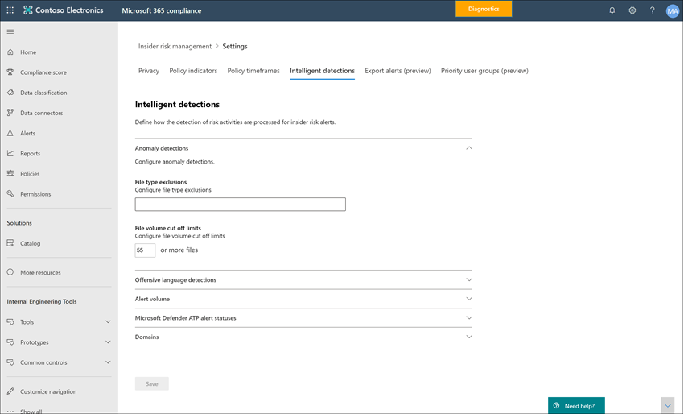

# Introducción a la configuración de administración de riesgos de InsiderGet started with insider risk management settings

La configuración de la administración de riesgos de Insider se aplica a todas las directivas de administración de riesgos de Insider, independientemente de la plantilla que elija al crear una directiva.Insider risk management settings apply to all insider risk management policies, regardless of the template you chose when creating a policy. La configuración se configura con el control de **configuración de riesgos de Insider** ubicado en la parte superior de todas las pestañas de administración de riesgos de Insider.Settings are configured using the **Insider risk settings** control located at the top of all insider risk management tabs. Esta configuración controla los componentes de directiva para las siguientes áreas:These settings control policy components for the following areas:

- PrivacidadPrivacy
- IndicadoresIndicators
- Escalas de tiempo de DirectivaPolicy timelines
- Detecciones inteligentesIntelligent detections
- Exportar alertasExport alerts
- Grupos de usuarios con prioridadPriority user groups

Antes de empezar y crear directivas de administración de riesgos de Insider, es importante comprender esta configuración y elegir los niveles de configuración mejor para las necesidades de cumplimiento de la organización.Before you get started and create insider risk management policies, it's important to understand these settings and choose setting levels best for the compliance needs for your organization.

## PrivacidadPrivacy

La protección de la privacidad de los usuarios que tienen coincidencias de directivas es importante y puede ayudar a promover la objetividad en la investigación de datos y análisis de revisiones de alertas de riesgo de Insider.Protecting the privacy of users that have policy matches is important and can help promote objectivity in data investigation and analysis reviews for insider risk alerts. Para los usuarios con una directiva de riesgo de Insider coinciden, puede elegir una de las siguientes opciones:For users with an insider risk policy match, you can choose one of the following settings:

- **Mostrar anonimizan versiones de nombres de**usuario: los nombres de usuario son anonimizan para evitar que los administradores, investigadores de datos y revisores vean quiénes están asociados a las alertas de directiva.**Show anonymized versions of usernames**: User names are anonymized to prevent admins, data investigators, and reviewers from seeing who is associated with policy alerts. Por ejemplo, un usuario de "el período de gracia de Taylor" aparecería con un Pseudonym aleatorio como "AnonIS8-988" en todas las áreas de la experiencia de administración de riesgos de Insider.For example, a user 'Grace Taylor' would appear with a randomized pseudonym such as 'AnonIS8-988' in all areas of the insider risk management experience. La elección de esta opción anonymizes todos los usuarios con coincidencias de directivas actuales y pasadas y se aplica a todas las directivas.Choosing this setting anonymizes all users with current and past policy matches and applies to all policies. Cuando se selecciona esta opción, la información de Perfil de usuario en la alerta de riesgo de Insider y los detalles de casos no estarán disponibles.User profile information in the insider risk alert and case details will not be available when this option is chosen. Sin embargo, los nombres de usuario se muestran cuando se agregan nuevos usuarios a directivas existentes o cuando se asignan usuarios a nuevas directivas.However, usernames are displayed when adding new users to existing policies or when assigning users to new policies. Si decide desactivar esta opción, los nombres de usuario se mostrarán para todos los usuarios que tengan coincidencias de directivas actuales o pasadas.If you choose to turn off this setting, usernames will be displayed for all users that have current or past policy matches.
- **No mostrar anonimizan versiones de nombres de usuario**: los nombres de usuario se muestran en todas las coincidencias de directivas actuales y pasadas para alertas y casos.**Do not show anonymized versions of usernames**: Usernames are displayed for all current and past policy matches for alerts and cases. La información del perfil de usuario (el nombre, el cargo, el alias y la organización o departamento) se muestra al usuario para todos los casos y alertas de administración de riesgos del Insider.User profile information (the name, title, alias, and organization or department) is displayed for the user for all insider risk management alerts and cases.

## IndicadoresIndicators

Plantillas de directivas de riesgos de Insider definen el tipo de actividades de riesgo que desea detectar e investigar.Insider risk policy templates define the type of risk activities that you want to detect and investigate. Cada plantilla de Directiva se basa en indicadores específicos que corresponden a desencadenadores y actividades de riesgos específicos.Each policy template is based on specific indicators that correspond to specific triggers and risk activities. Todos los indicadores están deshabilitados de forma predeterminada y debe seleccionar uno o más indicadores de Directiva antes de configurar una directiva de administración de riesgos de Insider.All indicators are disabled by default, and you must select one or more policy indicators before configuring an insider risk management policy.

Las directivas desencadenan alertas cuando los usuarios realizan actividades relacionadas con los indicadores de directiva que cumplen un umbral requerido.Alerts are triggered by policies when users perform activities related to policy indicators that meet a required threshold. La administración de riesgos de Insiders usa dos tipos de indicadores:Insider risk management uses two types of indicators:

- **Desencadenar eventos**: eventos que determinan si un usuario está activo para una directiva de administración de riesgos de Insider.**Triggering events**: Events that determine if a user is active for an insider risk management policy. Si se agrega un usuario a una directiva de administración de riesgos de Insider, no se produce un evento desencadenante, la Directiva no evalúa la actividad del usuario.If a user is added to an insider risk management policy does not have a triggering event, the user activity is not evaluated by the policy. Por ejemplo, el usuario A se agrega a una directiva creada a partir de la plantilla de directiva de los *usuarios que inician el robo de datos* y la Directiva y el conector de 365 de RRHH de Microsoft están configurados correctamente.For example, User A is added to a policy created from the *Data theft by departing users* policy template and the policy and Microsoft 365 HR connector are properly configured. Hasta que el usuario A tiene una fecha de finalización notificada por el conector de recursos humanos, esta directiva de administración de riesgos de Insider no evalúa las actividades del usuario A.Until User A has a termination date reported by the HR connector, User A activities aren't evaluated by this insider risk management policy for risk. Otro ejemplo de un evento desencadenante es si un usuario tiene una alerta de directiva DLP de gravedad *alta* al usar directivas de *pérdida de datos* .Another example of a triggering event is if a user has a *High* severity DLP policy alert when using *Data leaks* policies.
- **Indicadores de directiva**: indicadores incluidos en las directivas de administración de riesgos de Insider usadas para determinar una puntuación de riesgo para un usuario dentro del ámbito.**Policy indicators**: Indicators included in insider risk management policies used to determine a risk score for an in-scope user. Estos indicadores de directiva solo se activan después de que se produzca un evento desencadenador para un usuario.These policy indicators are only activated after a triggering event occurs for a user. Algunos ejemplos de indicadores de Directiva son cuando un usuario copia datos en servicios de almacenamiento en la nube personal o dispositivos de almacenamiento portátil, o si un usuario comparte archivos y carpetas internos con partes externas no autorizadas.Some examples of policy indicators are when a user copies data to personal cloud storage services or portable storage devices, or if a user shares internal files and folders with unauthorized external parties.

Los indicadores de Directiva se segmentan en las siguientes áreas.Policy indicators are segmented into the following areas. Puede elegir los indicadores para activar y personalizar los límites de eventos de indicador para cada nivel de indicador al crear una directiva de riesgos de Insider:You can choose the indicators to activate and customize indicator event limits for each indicator level when creating an insider risk policy:

- **Indicadores de Office**: incluyen indicadores de directiva para los sitios de SharePoint, los equipos y la mensajería de correo electrónico.**Office indicators**: These include policy indicators for SharePoint sites, Teams, and email messaging.
- **Indicadores de dispositivo**: Estos incluyen indicadores de directiva para actividades como compartir archivos a través de la red o con dispositivos.**Device indicators**: These include policy indicators for activity such as sharing files over the network or with devices. Los indicadores incluyen actividades relacionadas con los archivos de Microsoft Office. Archivos CSV y. Archivos PDF.Indicators include activity involving Microsoft Office files, .CSV files, and .PDF files. Si seleccionas **indicadores de dispositivo**, la actividad solo se procesa para dispositivos con Windows 10 compilación 1809 o posterior.If you select **Device indicators**, activity is processed only for devices with Windows 10 Build 1809 or higher. Para obtener más información sobre la configuración de dispositivos para la integración con riesgos de Insider, vea [Getting Started with Endpoint DLP](endpoint-dlp-getting-started.md).For more information on configuring devices for integration with insider risk, see [Getting started with Endpoint DLP](endpoint-dlp-getting-started.md).
- **Indicador de infracción**de la Directiva de seguridad: incluyen indicadores de ATP de Microsoft defender relacionados con la instalación de software no aprobado o malintencionado o la omisión de controles de seguridad.**Security policy violation indicator**: These include indicators from Microsoft Defender ATP related to unapproved or malicious software installation or bypassing security controls. Para recibir alertas en la administración de riesgos de Insiders, debe tener habilitada una licencia de ATP de Microsoft defender activa y una integración de riesgos de Insider.To receive alerts in insider risk management, you must have an active Microsoft Defender ATP license and insider risk integration enabled. Para obtener más información sobre cómo configurar ATP de Microsoft defender para la integración de la administración de riesgos de Insider, vea [Configure Advanced Features in Microsoft defender ATP](https://docs.microsoft.com/windows/security/threat-protection/microsoft-defender-atp/advanced-features\#share-endpoint-alerts-with-microsoft-compliance-center).For more information on configuring Microsoft Defender ATP for insider risk management integration, see [Configure advanced features in Microsoft Defender ATP](https://docs.microsoft.com/windows/security/threat-protection/microsoft-defender-atp/advanced-features\#share-endpoint-alerts-with-microsoft-compliance-center).
- **Elevadores de puntuación de riesgo**: incluyen la elevación de la puntuación de riesgo para actividades inusuales o infracciones de directivas pasadas.**Risk score boosters**: These include raising the risk score for unusual activities or past policy violations. La habilitación de los elevadores de puntuación de riesgo aumenta los resultados de los riesgos y la probabilidad de que se presenten alertas para estos tipos de actividades.Enabling risk score boosters increase risk scores and the likelihood of alerts for these types of activities. Los elevadores de puntuación de riesgo solo se pueden seleccionar si uno o más de los indicadores anteriores están seleccionados.Risk score boosters can only be selected if one or more indicators above are selected.

En algunos casos, es posible que quiera limitar los indicadores de directiva de riesgos de Insider que se aplican a las directivas de riesgo de Insider de su organización.In some cases, you may want to limit the insider risk policy indicators that are applied to insider risk policies in your organization. Puede desactivar los indicadores de directiva para áreas específicas al deshabilitarlas de todas las directivas de riesgo de Insider.You can turn off the policy indicators for specific areas by disabling them from all insider risk policies. Los eventos desencadenantes no se pueden modificar para las plantillas de directiva de riesgos de Insider.Triggering events cannot be modified for insider risk policy templates.

Para definir los indicadores de directiva de riesgos de Insider que están habilitados en todas las directivas de riesgo de Insider, vaya a indicadores de **configuración de riesgos**de Insider  >  **Indicators** y seleccione uno o más indicadores de directiva.To define the insider risk policy indicators that are enabled in all insider risk policies, navigate to **Insider risk settings** > **Indicators** and select one or more policy indicators. Los indicadores seleccionados en la página de configuración de indicadores no se pueden configurar individualmente al crear o editar una directiva de riesgos del Insider en el Asistente para directivas.The indicators selected on the Indicators settings page cannot be individually configured when creating or editing an insider risk policy in the policy wizard.

>[!NOTE]
>Puede tardar varias horas en aparecer nuevos usuarios agregados manualmente en el **Panel de usuarios**.It may take several hours for new manually-added users to appear in the **Users dashboard**. Las actividades de los 90 días anteriores para estos usuarios pueden tardar hasta 24 horas en mostrarse.Activities for the previous 90 days for these users may take up to 24 hours to display. Para ver las actividades de los usuarios agregados manualmente, seleccione el usuario en el **Panel de usuarios** y abra la ficha **actividad de usuario** en el panel de detalles.To view activities for manually added users, select the user on the **Users dashboard** and open the **User activity** tab on the details pane.

### Configuración de nivel de indicador (versión preliminar)Indicator level settings (preview)

Al crear una directiva en el Asistente para directivas, puede configurar la forma en que el número diario de eventos de riesgo debe influir en la puntuación de riesgo de las alertas de riesgo de Insider.When creating a policy in the policy wizard, you can configure how the daily number of risk events should influence the risk score for insider risk alerts. Estas opciones de indicador le ayudan a controlar cómo el número de repeticiones de eventos de riesgo de su organización debe afectar a la puntuación del riesgo y, por lo tanto, a la gravedad de la alerta asociada para estos eventos.These indicator settings help you control how the number of occurrences of risk events in your organization should affect the risk score, and consequently the associated alert severity, for these events. Si lo prefiere, también puede mantener los niveles predeterminados de umbral de eventos recomendados por Microsoft para todos los indicadores habilitados.If you prefer, you can also choose to keep the default event threshold levels recommended by Microsoft for all enabled indicators.

Por ejemplo, decide habilitar los indicadores de SharePoint en la configuración de la Directiva de riesgos de Insider y establecer umbrales personalizados para eventos de SharePoint al configurar indicadores para una nueva Directiva de *pérdidas de datos* de riesgo de Insider.For example, you decide to enable SharePoint indicators in the insider risk policy settings and to set custom thresholds for SharePoint events when configuring indicators for a new insider risk *Data leaks* policy. En el Asistente para directivas de riesgos de Insider, se configuran tres niveles de eventos diarios distintos para cada indicador de SharePoint para influir en la puntuación de riesgo para las alertas asociadas con estos eventos.While in the insider risk policy wizard, you configure three different daily event levels for each SharePoint indicator to influence the risk score for alerts associated with these events.

Para el primer nivel de eventos diarios, establezca el umbral en *10 o más eventos por día* para una menor repercusión en la puntuación de riesgo para los eventos, *20 o más eventos por* día para un impacto medio en la puntuación de riesgo para los eventos, y *30 o más eventos por día* de mayor impacto en la puntuación de riesgo para los eventos.For the first daily event level, you set the threshold at *10 or more events per day* for a lower impact to the risk score for the events, *20 or more events per day* for a medium impact to the risk score for the events, and *30 or more events per day* a higher impact to the risk score for the events. Esta configuración significa realmente:These settings effectively mean:

- Si hay 1-9 eventos de SharePoint que tienen lugar después de desencadenar el evento, los resultados de los riesgos se ven afectados de forma mínima y no generar una alerta.If there are 1-9 SharePoint events that take place after triggering event, risk scores are minimally impacted and would tend not to generate an alert.
- Si hay 10-19 eventos de SharePoint que se producen después de un evento de desencadenamiento, la puntuación de riesgo es intrínsecamente baja y los niveles de gravedad de alerta tienden a estar en un nivel bajo.If there are 10-19  SharePoint events that take place after a triggering event, the risk score is inherently lower and alert severity levels would tend to be at a low level.
- Si hay 20-29 eventos de SharePoint que se producen después de un desencadenamiento, la puntuación de riesgo es intrínsecamente superior y los niveles de gravedad de alerta tienden a ser de nivel medio.If there are 20-29 SharePoint events that take place after a triggering, the risk score is inherently higher and alert severity levels would tend to be at a medium level.
- Si hay 30 o más eventos de SharePoint que se producen después de un desencadenamiento, la puntuación de riesgo es intrínsecamente superior y los niveles de gravedad de alerta tienden a ser de un nivel alto.If there are 30 or more SharePoint events that take place after a triggering, the risk score is inherently higher and alert severity levels would tend to be at a high level.

## Plazos de la DirectivaPolicy timeframes

Los plazos de la Directiva permiten definir períodos de revisión pasados y futuros que se desencadenan después de las coincidencias de directivas basadas en eventos y actividades para las plantillas de directiva de administración de riesgos de Insider.Policy timeframes allow you to define past and future review periods that are triggered after policy matches based on events and activities for the insider risk management policy templates. Según la plantilla de directiva que elija, estarán disponibles los siguientes intervalos de tiempo de la Directiva:Depending on the policy template you choose, the following policy timeframes are available:

- **Ventana activación**: disponible para todas las plantillas de Directiva, la *ventana de activación* es el número de días definido que la ventana activa **después** de un evento desencadenante.**Activation window**: Available for all policy templates, the *Activation window* is the defined number of days that the window activates **after** a triggering event. La ventana se activa durante 1 a 30 días después de que se produzca un evento desencadenante para cualquier usuario asignado a la Directiva.The window activates for 1 to 30 days after a triggering event occurs for any user assigned to the policy. Por ejemplo, ha configurado una directiva de administración de riesgos de Insider y ha establecido la *ventana de activación* en 30 días.For example, you've configured an insider risk management policy and set the *Activation window* to 30 days. Transcurridos varios meses desde la configuración de la Directiva y se produce un evento desencadenante para uno de los usuarios incluidos en la Directiva.Several months have passed since you configured the policy and a triggering event occurs for one of the users included in the policy. El evento desencadenador activa la *ventana de activación* y la Directiva está activa para ese usuario durante 30 días después de que se haya producido el evento desencadenante.The triggering event activates the *Activation window* and the policy is active for that user for 30 days after the triggering event occurred.
- **Detección de actividad pasada**: disponible para todas las plantillas de Directiva, la *detección de actividad anterior* es el número de días definidos que la ventana activa **antes** de un evento desencadenante.**Past activity detection**: Available for all policy templates, the *Past activity detection* is the defined number of days that the window activates **before** a triggering event. La ventana se activa de 0 a 180 días antes de que se produzca un evento desencadenante para cualquier usuario asignado a la Directiva.The window activates for 0 to 180 days before a triggering event occurs for any user assigned to the policy. Por ejemplo, ha configurado una directiva de administración de riesgos de Insider y ha establecido la *detección de actividad pasada* en 90 días.For example, you've configured an insider risk management policy and set the *Past activity detection* to 90 days. Transcurridos varios meses desde la configuración de la Directiva y se produce un evento desencadenante para uno de los usuarios incluidos en la Directiva.Several months have passed since you configured the policy and a triggering event occurs for one of the users included in the policy. El evento desencadenador activa la *detección de actividad pasada* y la Directiva recopila actividades históricas para ese usuario durante 90 días antes del evento desencadenante.The triggering event activates the *Past activity detection* and the policy gathers historic activities for that user for 90 days prior to the triggering event.

## Detecciones inteligentesIntelligent detections

La configuración de detección inteligente ayuda a refinar cómo se procesan las detecciones de actividades de riesgo para las alertas.Intelligent detection settings help refine how the detections of risky activities are processed for alerts. En determinadas circunstancias, es posible que necesite definir tipos de archivo para omitir o desea aplicar un nivel de detección para los archivos a fin de definir una barra mínima para las alertas.In certain circumstances, you may need to define files types to ignore or you want to enforce a detection level for files to help define a minimum bar for alerts. Al usar directivas de lenguaje ofensivo, es posible que deba aumentar o disminuir la sensibilidad de la detección para controlar la cantidad de coincidencias de directivas de informes.When using offensive language policies, you may need to increase or decrease the detection sensitivity to control the amount of reported policy matches. Use estas opciones para controlar el volumen general de alertas, las exclusiones de los tipos de archivo, los límites del volumen de archivos y la sensibilidad de la detección de idiomas ofensivos.Use these settings to control overall alert volume, file type exclusions, file volume limits, and the offensive language detection sensitivity.

### Detecciones de anomalíasAnomaly detections

Las detecciones anómalas incluyen la configuración de las exclusiones de tipo de archivo y los límites del volumen de archivo.Anomalous detections include settings for file type exclusions and file volume limits.

- **Exclusiones de tipo de archivo**: para excluir tipos de archivo específicos de toda la coincidencia de directivas de administración de riesgos de Insider, escriba extensiones de tipo de archivo separadas por comas.**File type exclusions**: To exclude specific file types from all insider risk management policy matching, enter file type extensions separated by commas. Por ejemplo, para excluir determinados tipos de archivos de música de las coincidencias de directivas, puede escribir *AAC, MP3, WAV, WMA* en el campo **exclusiones de tipo de archivo** .For example, to exclude certain types of music files from policy matches you may enter *aac,mp3,wav,wma* in the **File type exclusions** field. Todas las directivas de administración de riesgos de Insider omitirán los archivos con estas extensiones.Files with these extensions would be ignored by all insider risk management policies.
- **Límite de volumen de archivo desactivado**: para definir un nivel de archivo mínimo antes de notificar las alertas de actividad en las directivas de riesgo de Insider, escriba el número de archivos.**File volume cut-off limit**: To define a minimum file level before activity alerts are reported in insider risk policies, enter the number of files. Por ejemplo, escribiría ' 10 ' si no desea generar alertas de riesgo de Insider cuando un usuario descarga 10 archivos o menos, incluso si las directivas consideran que esta actividad es una anomalía.For example, you would enter '10' if you do not want to generate insider risk alerts when a user downloads 10 files or less, even if the policies consider this activity an anomaly.

### Detecciones de idiomas ofensivosOffensive language detections

Para ajustar la confidencialidad del clasificador de idioma ofensivo para las directivas que usan el *idioma ofensivo en* la plantilla de correo electrónico, elija una de las siguientes opciones:To adjust the sensitivity of the offensive language classifier for policies using the *Offensive language in email* template, choose one of the following settings:

- **Bajo**: el nivel de confidencialidad más bajo con el intervalo más amplio para la detección de un idioma y una opinión ofensivos.**Low**: The lowest sensitivity level with the broadest range for detection offensive language and sentiment. La probabilidad de falsos positivos para la coincidencia de idiomas ofensivos es elevada.The probability of false positives for offensive language matching is elevated.
- **Media**: el nivel de confidencialidad de nivel medio con un intervalo equilibrado para la sumisión y el lenguaje ofensivo de detección.**Medium**: The mid-level sensitivity level with a balanced range for detection offensive language and sentiment. La probabilidad de falsos positivos para la coincidencia de lenguaje ofensivo es la media.The probability of false positives for offensive language matching is average.
- **Alta**: el nivel de confidencialidad más alto con un intervalo estrecho para la detección de lenguaje ofensivo y su opinión.**High**: The highest sensitivity level with a narrow range for detection offensive language and sentiment. La probabilidad de falsos positivos para la coincidencia de lenguaje ofensivo es baja.The probability of false positives for offensive language matching is low.

### Volumen de alertasAlert volume

Las actividades de usuario detectadas por las directivas de riesgo de Insider tienen asignada una puntuación de riesgo específica, que a su vez determina la gravedad de la alerta (baja, media, alta).User activities detected by insider risk policies are assigned a specific risk score, which in turn determines the alert severity (low, medium, high). De forma predeterminada, se generará una determinada cantidad de alertas de gravedad baja, media y alta, pero puede aumentar o disminuir el volumen según sus necesidades.By default, we'll generate a certain amount of low, medium, and high severity alerts, but you can increase or decrease the volume to suit your needs. Para ajustar el volumen de alertas de todas las directivas de administración de riesgos de Insider, elija una de las siguientes opciones:To adjust the volume of alerts for all insider risk management policies, choose one of the following settings:

- **Menos alertas**: verá todas las alertas de gravedad alta, menos alertas de mediana gravedad y no hay gravedad baja.**Fewer alerts**: You'll see all high severity alerts, fewer medium severity alerts, and no low severity ones. Este nivel de configuración significa que podría omitir algunos verdaderos positivos.This setting level means you might miss some true positives.
- **Volumen predeterminado**: verá todas las alertas de gravedad alta y una cantidad equilibrada de alertas de gravedad media y baja.**Default volume**: You'll see all high severity alerts and a balanced amount of medium and low severity alerts.
- **Más alertas**: verá todas las alertas de gravedad media y alta y la mayoría de las alertas de gravedad baja.**More alerts**: You'll see all medium and high severity alerts and most low severity alerts. Este nivel de configuración puede tener como resultado más falsos positivos.This setting level might result in more false positives.

### Protección contra amenazas avanzada de Microsoft defender (vista previa)Microsoft Defender Advanced Threat Protection (preview)

La [protección contra amenazas avanzada de Microsoft defender](https://docs.microsoft.com/windows/security/threat-protection/microsoft-defender-atp/microsoft-defender-advanced-threat-protection) (ATP) es una plataforma de seguridad de extremos corporativos diseñada para ayudar a las redes empresariales a prevenir, detectar, investigar y responder a amenazas avanzadas.[Microsoft Defender Advanced Threat Protection](https://docs.microsoft.com/windows/security/threat-protection/microsoft-defender-atp/microsoft-defender-advanced-threat-protection) (ATP) is an enterprise endpoint security platform designed to help enterprise networks prevent, detect, investigate, and respond to advanced threats. Para tener una mejor visibilidad de la infracción de seguridad en su organización, puede importar y filtrar las alertas de ATP de Microsoft defender para actividades usadas en directivas creadas a partir de plantillas de directivas de infracción de seguridad de administración de riesgos de Insider.To have better visibility of security violation in your organization, you can import and filter Microsoft Defender ATP alerts for activities used in policies created from insider risk management security violation policy templates.

En función de los tipos de señales que le interesen, puede optar por importar las alertas a la administración de riesgos de Insider en función del estado de clasificación de alertas de ATP de Microsoft defender.Depending on the types of signals you are interested in, you can choose to import alerts to insider risk management based on the Microsoft Defender ATP alert triage status. Puede definir uno o más de los siguientes Estados de clasificación de alertas en la configuración global que se va a importar:You can define one or more of the following alert triage statuses in the global settings to import:

- UnknownUnknown
- NewNew
- En cursoIn progress
- ResueltoResolved

Las alertas de Microsoft defender ATP se importan diariamente.Alerts from Microsoft Defender ATP are imported daily. Según el estado de clasificación que elija, es posible que vea varias actividades de usuario para la misma alerta que los cambios de estado de clasificación en ATP de Microsoft defender.Depending on the triage status you choose, you may see multiple user activities for the same alert as the triage status changes in Microsoft Defender ATP.

Por ejemplo, si selecciona *nuevo*, *en curso*y *resuelto* para esta configuración, cuando se genera una alerta de ATP de Microsoft defender y el estado es *nuevo*, se importa una actividad de alerta inicial para el usuario en riesgo de Insider.For example, if you select *New*, *In progress*, and *Resolved* for this setting, when a Microsoft Defender ATP alert is generated and the status is *New*, an initial alert activity is imported for the user in insider risk. Cuando el estado de clasificación de ATP de Microsoft defender cambia a *en curso*, se importa una segunda actividad para esta alerta para el usuario en riesgo de Insider.When the Microsoft Defender ATP triage status changes to *In progress*, a second activity for this alert is imported for the user in insider risk. Una vez que se ha establecido el estado de clasificación de la evaluación de ATP de Microsoft defender *, se importa* una tercera actividad para esta alerta para el usuario en riesgo de Insider.When the final Microsoft Defender ATP triage status of *Resolved* is set, a third activity for this alert is imported for the user in insider risk. Esta funcionalidad permite a los investigadores seguir la progresión de las alertas de ATP de Microsoft defender y elegir el nivel de visibilidad que requiere la investigación.This functionality allows investigators to follow the progression of the Microsoft Defender ATP alerts and choose the level of visibility that their investigation requires.

>[!IMPORTANT]
>Necesitará tener Microsoft defender ATP configurado en su organización y habilitar ATP de Microsoft defender para la integración de la administración de riesgos de Insider en el centro de seguridad de defender para importar las alertas de infracción de seguridad.You'll need to have Microsoft Defender ATP configured in your organization and enable Microsoft Defender ATP for insider risk management integration in the Defender Security Center to import security violation alerts. Para obtener más información sobre cómo configurar ATP de Microsoft defender para la integración de la administración de riesgos de Insider, vea [Configure Advanced Features in Microsoft defender ATP](https://docs.microsoft.com/windows/security/threat-protection/microsoft-defender-atp/advanced-features\#share-endpoint-alerts-with-microsoft-compliance-center).For more information on configuring Microsoft Defender ATP for insider risk management integration, see [Configure advanced features in Microsoft Defender ATP](https://docs.microsoft.com/windows/security/threat-protection/microsoft-defender-atp/advanced-features\#share-endpoint-alerts-with-microsoft-compliance-center).

### Dominios (versión preliminar)Domains (preview)

La configuración de dominio ayuda a definir los niveles de riesgo para las comunicaciones a dominios específicos.Domain settings help you define risk levels for communications to specific domains. Estas comunicaciones incluyen el uso compartido de archivos, mensajes de correo electrónico o la descarga de contenido.These communications include sharing files, email messages, or downloading content. Al especificar dominios en esta configuración, puede aumentar o disminuir la puntuación de riesgos para la actividad que se realiza con estos dominios.By specifying domains in these settings, you can increase or decrease the risk scoring for activity that takes place with these domains. Por ejemplo, para especificar contoso.com y sales.wingtiptoys.com como dominios permitidos, escribirá "contoso.com sales.wingtiptoys.com" en el campo **dominios permitidos** .For example, to specify contoso.com and sales.wingtiptoys.com as allowed domains, you will enter 'contoso.com sales.wingtiptoys.com' in the **Allowed domains** field.

Para cada una de las siguientes opciones de dominio, puede introducir hasta 500 dominios:For each of the following domain settings, you can enter up to 500 domains:

- **Dominios no permitidos:** Al especificar dominios no permitidos, la actividad que tiene lugar con estos dominios tendrá una puntuación de riesgo *mayor* .**Unallowed domains:** By specifying unallowed domains, activity that takes place with these domains will have *higher* risk scores.
- **Dominios permitidos:** Al especificar dominios permitidos en la configuración, la actividad que se realiza con estos dominios tendrá una *menor* puntuación de riesgos y se tratará de forma similar a cómo se trata la actividad de la organización interna.**Allowed domains:** By specifying allowed domains in settings, activity that takes place with these domains will have *lower* risk scores and is treated similarly to how internal organization activity is treated. Por ejemplo, las actividades de correo electrónico en estos dominios se analizan de forma similar a cómo se analiza la actividad de correo electrónico interna.For example, email activities to these domains are analyzed similarly to how internal email activity is analyzed.
- **Dominios de terceros:** Los dominios de terceros son dominios que se usan con fines empresariales en la organización y el contenido confidencial se puede almacenar en estas ubicaciones.**Third party domains:** Third party domains are domains used for business purposes at your organization and sensitive content may be stored across these locations. Al especificar un dominio de terceros, puede recibir alertas para cualquier actividad arriesgada en estos dominios.By specifying a third party domain, you can receive alerts for any risky activity on these domains.

## Exportar alertas (versión preliminar)Export alerts (preview)

La información de alerta de administración de riesgos de Insider es exportable a los servicios de administración de eventos e información de seguridad (SIEM) a través del [esquema de API de actividad de administración 365 de Office](https://docs.microsoft.com/office/office-365-management-api/office-365-management-activity-api-schema#security-and-compliance-alerts-schema).Insider risk management alert information is exportable to security information and event management (SIEM) services via the [Office 365 Management Activity API schema](https://docs.microsoft.com/office/office-365-management-api/office-365-management-activity-api-schema#security-and-compliance-alerts-schema). Puede usar las API de actividad de administración de Office 365 para exportar información de alertas a otras aplicaciones que su organización puede usar para administrar o agregar información de riesgos de Insider.You can use the Office 365 Management Activity APIs to export alert information to other applications your organization may use to manage or aggregate insider risk information.

Para usar las API para revisar la información de alertas de los riesgos de Insider:To use the APIs to review insider risk alert information:

1. Habilite la compatibilidad con la API de actividad de administración 365 de Office en la configuración de administración de riesgos de Insider.Enable Office 365 Management Activity API support in the insider risk management settings. De forma predeterminada, esta opción está deshabilitada para la organización de Microsoft 365.By default, this setting is disabled for your Microsoft 365 organization.
2. Filtrar las actividades de auditoría comunes de Office 365 por *SecurityComplianceAlerts*.Filter the common Office 365 audit activities by *SecurityComplianceAlerts*.
3. Filtrar *SecurityComplianceAlerts* por la categoría *InsiderRiskManagement* .Filter *SecurityComplianceAlerts* by the *InsiderRiskManagement* category.

## Grupos de usuarios con prioridad (versión preliminar)Priority user groups (preview)

Los usuarios de la organización pueden tener distintos niveles de riesgo en función de su posición, el nivel de acceso a la información confidencial o el historial de riesgos.Users in your organization may have different levels of risk depending on their position, level of access to sensitive information, or risk history. La priorización del examen y la puntuación de las actividades de estos usuarios puede ayudar a alertarle de posibles riesgos que puedan tener consecuencias más altas para la organización.Prioritizing the examination and scoring of the activities of these users can help alert you to potential risks that may have higher consequences for your organization. Los grupos de usuarios con prioridad en la ayuda de administración de riesgos de Insider definen los usuarios de la organización que necesitan una inspección más estrecha y una puntuación de riesgo más confidencial.Priority user groups in insider risk management help define the users in your organization that need closer inspection and more sensitive risk scoring. Junto con las *infracciones de directivas de seguridad por los usuarios prioritarios* y las *pérdidas de datos por prioridad* de las plantillas de Directiva, los usuarios agregados a un grupo de usuarios con prioridad aumentan las probabilidades de alertas de riesgo de Insider y alertas con niveles de gravedad más elevados.Coupled with the *Security policy violations by priority users* and *Data leaks by priority users* policy templates, users added to a priority user group have an increased likelihood of insider risk alerts and alerts with higher severity levels.

Por ejemplo, debe protegerse contra pérdidas de datos para un proyecto extremadamente confidencial en el que los usuarios tienen acceso a información confidencial.For example, you need to protect against data leaks for a highly confidential project where users have access to sensitive information. Elija crear *usuarios* de *proyecto confidenciales* grupo de usuarios con prioridad para los usuarios de su organización que trabajen en este proyecto.You choose to create *Confidential Project* *Users* priority user group for users in your organization that work on this project. Mediante el Asistente para directivas y la plantilla de directiva de *pérdidas de datos por usuarios prioritarios* , se crea una nueva Directiva y se asigna el grupo de prioridad usuarios de *proyecto confidencial* a la Directiva.Using the policy wizard and the *Data leaks by priority users* policy template, you create a new policy and assign the *Confidential Project Users* priority users group to the policy. Actividades examinadas por la Directiva para miembros del grupo de usuarios con prioridad *confidencial los usuarios de Project* es más sensible al riesgo y las actividades de estos usuarios serán más probables que generen una alerta y que tengan alertas con niveles de gravedad más elevados.Activities examined by the policy for members of the *Confidential Project Users* priority user group are more sensitive to risk and activities by these users will be more likely to generate an alert and have alerts with higher severity levels.

### Crear un grupo de usuarios con prioridadCreate a priority user group

Para crear un nuevo grupo de usuarios con prioridad, use los controles de configuración de la solución de **Administración de riesgos de Insider** en el centro de cumplimiento de Microsoft 365.To create a new priority user group, you'll use setting controls in the **Insider risk management** solution in the Microsoft 365 compliance center. Para crear un grupo de usuarios con prioridad, debe ser miembro del grupo de roles de *Administración de riesgos de Insiders* o administradores de administración de riesgos de *Insider* .To create a priority user group, you must be a member of the *Insider Risk Management* or *Insider Risk Management Admin* role group.

Complete los pasos siguientes para crear un grupo de usuarios con prioridad:Complete the following steps to create a priority user group:

1. En el [centro de cumplimiento de Microsoft 365](https://compliance.microsoft.com), vaya a **Administración de riesgos de Insider** y seleccione **configuración de riesgos de Insider**.In the [Microsoft 365 compliance center](https://compliance.microsoft.com), go to **Insider risk management** and select **Insider risk settings**.
2. Seleccione la ficha **grupos de usuarios con prioridad**Select the **Priority user groups** tab
3. En la ficha **grupos de usuarios con prioridad** , seleccione **Crear grupo de usuarios con prioridad** para iniciar el Asistente para la creación de grupos.On the **Priority user groups** tab, select **Create priority user group** to start the group creation wizard.
4. En la página **definir grupo** , complete los campos siguientes:On the **Define group** page, complete the following fields:
    - **Nombre (obligatorio)**: escriba un nombre descriptivo para el grupo de usuarios con prioridad.**Name (required)**: Enter a friendly name for the priority user group. No puede cambiar el nombre del grupo de usuarios de prioridad después de completar el asistente.You can't change the name of the priority user group after you complete the wizard.
    - **Descripción (opcional)**: escriba una descripción para el grupo de usuarios con prioridad.**Description (optional)**: Enter a description for the priority user group.
5. Seleccione **siguiente** para continuar.Select **Next** to continue.
6. En la página **elegir miembros** , seleccione **elegir miembros** para buscar y seleccione las cuentas de usuario habilitadas para correo que se incluirán en el grupo o seleccione la casilla **seleccionar todo** para agregar todos los usuarios de la organización al grupo.On the **Choose members** page, select **Choose members** to search and select which mail-enabled user accounts are included in the group or select the **Select all** checkbox to add all users in your organization to the group. Seleccione **Agregar** para continuar o **Cancelar** para cerrar sin agregar ningún usuario al grupo.Select **Add** to continue or **Cancel** to close without adding any users to the group.
7. Seleccione **siguiente** para continuar.Select **Next** to continue.
8. En la página **revisión** , revise la configuración que ha elegido para el grupo de usuarios de prioridad.On the **Review** page, review the settings you've chosen for the priority user group. Seleccione **Editar** para cambiar cualquiera de los valores de grupo o seleccione **Enviar** para crear y activar el grupo de usuarios con prioridad.Select **Edit** to change any of the group values or select **Submit** to create and activate the priority user group.
9. En la página Confirmación, seleccione **listo** para salir del asistente.On the confirmation page, select **Done** to exit the wizard.

### Actualizar un grupo de usuarios con prioridadUpdate a priority user group

Para actualizar un grupo de usuarios con prioridad existente, debe usar los controles de configuración de la solución de **Administración de riesgos de Insider** en el centro de cumplimiento de Microsoft 365.To update an existing priority user group, you'll use setting controls in the **Insider risk management** solution in the Microsoft 365 compliance center. Para actualizar un grupo de usuarios con prioridad, debe ser miembro del grupo de roles de *Administración de riesgos de Insiders* o administradores de administración de riesgos de *Insider* .To update a priority user group, you must be a member of the *Insider Risk Management* or *Insider Risk Management Admin* role group.

Complete los pasos siguientes para editar un grupo de usuarios con prioridad:Complete the following steps to edit a priority user group:

1. En el [centro de cumplimiento de Microsoft 365](https://compliance.microsoft.com), vaya a **Administración de riesgos de Insider** y seleccione **configuración de riesgos de Insider**.In the [Microsoft 365 compliance center](https://compliance.microsoft.com), go to **Insider risk management** and select **Insider risk settings**.
2. Seleccione la ficha **grupos de usuarios con prioridad**Select the **Priority user groups** tab
3. Seleccione el grupo de usuarios con prioridad que desea editar y seleccione **Editar Grupo**.Select the priority user group you want to edit and select **Edit group**.
4. En la página **definir grupo** , actualice el campo Descripción si es necesario.On the **Define group** page, update the Description field if needed. No puede actualizar el nombre del grupo de usuarios de prioridad.You can't update the name of the priority user group. Seleccione **siguiente** para continuar.Select **Next** to continue.
5. En la página **elegir miembros** , agregue nuevos miembros al grupo mediante el control **elegir miembros** .On the **Choose members** page, add new members to the group using the **Choose members** control. Para quitar un usuario del grupo, seleccione la "X" junto al usuario que desea quitar.To remove a user from the group, select the 'X' next to the user you wish to remove. Seleccione **siguiente** para continuar.Select **Next** to continue.
6. En la página **revisión** , revise la configuración de actualización que ha elegido para el grupo de usuarios de prioridad.On the **Review** page, review the update settings you've chosen for the priority user group. Seleccione **Editar** para cambiar cualquiera de los valores de grupo o seleccione **Enviar** para actualizar el grupo de usuarios con prioridad.Select **Edit** to change any of the group values or select **Submit** to update the priority user group.
7. En la página Confirmación, seleccione **listo** para salir del asistente.On the confirmation page, select **Done** to exit the wizard.

### Eliminar un grupo de usuarios con prioridadDelete a priority user group

Para eliminar un grupo de usuarios con prioridad existente, debe usar los controles de configuración de la solución de **Administración de riesgos de Insider** en el centro de cumplimiento de Microsoft 365.To delete an existing priority user group, you'll use setting controls in the **Insider risk management** solution in the Microsoft 365 compliance center. Para eliminar un grupo de usuarios con prioridad, debe ser miembro del grupo de roles de *Administración de riesgos de Insiders* o administradores de administración de riesgos de *Insider* .To delete a priority user group, you must be a member of the *Insider Risk Management* or *Insider Risk Management Admin* role group.

>[!IMPORTANT]
>Eliminar un grupo de usuarios con prioridad lo quitará de cualquier directiva activa a la que esté asignado.Deleting a priority user group will remove it from any active policy to which it is assigned. Si elimina un grupo de usuarios con prioridad asignado a una Directiva activa, la Directiva no contendrá ningún usuario dentro del ámbito y, de hecho, estará inactiva y no creará alertas.If you delete a priority user group that is assigned to an active policy, the policy will not contain any in-scope users and will effectively be idle and will not create alerts.

Complete los siguientes pasos para eliminar un grupo de usuarios con prioridad:Complete the following steps to delete a priority user group:

1. En el [centro de cumplimiento de Microsoft 365](https://compliance.microsoft.com), vaya a **Administración de riesgos de Insider** y seleccione **configuración de riesgos de Insider**.In the [Microsoft 365 compliance center](https://compliance.microsoft.com), go to **Insider risk management** and select **Insider risk settings**.
2. Seleccione la ficha **grupos de usuarios con prioridad**Select the **Priority user groups** tab
3. Seleccione el grupo de usuarios con prioridad que desea editar y seleccione **eliminar** en el menú del panel.Select the priority user group you want to edit and select **Delete** from the dashboard menu.
4. En el cuadro de diálogo **eliminar** , seleccione **sí** para eliminar el grupo de prioridad de usuario o seleccione **Cancelar** para volver al panel.On the **Delete** dialog, select **Yes** to delete the priority user group or select **Cancel** to return to the dashboard.