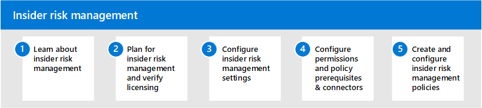

# Administración de riesgos de Insider en Microsoft 365Insider risk management in Microsoft 365

Cada vez más, los empleados tienen más acceso para crear, administrar y compartir datos en un amplio espectro de plataformas y servicios.Increasingly, employees have more access to create, manage, and share data across a broad spectrum of platforms and services. En la mayoría de los casos, las organizaciones tienen recursos y herramientas limitados para identificar y mitigar los riesgos en toda la organización, a la vez que cumplen los requisitos de cumplimiento y los estándares de privacidad de los empleados.In most cases, organizations have limited resources and tools to identify and mitigate organization-wide risks while also meeting compliance requirements and employee privacy standards. Estos riesgos pueden incluir el robo de datos al dejar en parte a los empleados y filtrar los datos de la información fuera de la organización mediante un uso compartido accidental o un propósito malintencionado.These risks may include data theft by departing employees and data leaks of information outside your organization by accidental oversharing or malicious intent.

La administración de riesgos de Insider de Microsoft 365 usa toda la amplitud de los indicadores de servicio y de terceros para ayudarle a identificar, clasificar y actuar con rapidez en la actividad de los usuarios arriesgados.Insider risk management in Microsoft 365 uses the full breadth of service and 3rd-party indicators to help you quickly identify, triage, and act on risky user activity. Mediante el uso de registros de Microsoft 365 y Microsoft Graph, la administración de riesgos de Insider le permite definir directivas específicas para identificar los indicadores de riesgo y emprender acciones para mitigar estos riesgos.By using logs from Microsoft 365 and Microsoft Graph, insider risk management allows you to define specific policies to identify risk indicators and to take action to mitigate these risks.

## Configurar la administración de riesgos de Insider para Microsoft 365Configure insider risk management for Microsoft 365

Siga estos pasos para configurar la administración de riesgos de Insiders para su organización:Use the following steps to configure insider risk management for your organization:

1. Obtenga información sobre la [Administración de riesgos de Insider](insider-risk-management.md) en Microsoft 365Learn about [insider risk management](insider-risk-management.md) in Microsoft 365
2. Planeación de la [Administración de riesgos de Insider y comprobación de licencias](insider-risk-management-plan.md)Plan for [insider risk management and verify licensing](insider-risk-management-plan.md)
3. Configurar las [Opciones de administración de riesgos de Insider](insider-risk-management-settings.md)Configure [insider risk management settings](insider-risk-management-settings.md)
4. Configurar [los permisos y los](insider-risk-management-configure.md#step-1-enable-permissions-for-insider-risk-management) [requisitos previos de la Directiva & conectores](insider-risk-management-configure.md#step-3-configure-prerequisites-for-templates)Configure [permissions](insider-risk-management-configure.md#step-1-enable-permissions-for-insider-risk-management) and [policy prerequisites & connectors](insider-risk-management-configure.md#step-3-configure-prerequisites-for-templates)
5. Crear y configurar [directivas de administración de riesgos de Insider](insider-risk-management-configure.md#step-5-create-an-insider-risk-management-policy)Create and configure [insider risk management policies](insider-risk-management-configure.md#step-5-create-an-insider-risk-management-policy)

## Más información sobre la administración de riesgos de InsiderMore information about insider risk management

- [Administrar directivas de riesgos de InsiderManage insider risk policies](insider-risk-management-policies.md)
- [Investigar alertas de riesgos internosInvestigate insider risk alerts](insider-risk-management-alerts.md)
- [Actuar en casos de riesgo de InsiderAct on insider risk cases](insider-risk-management-cases.md)