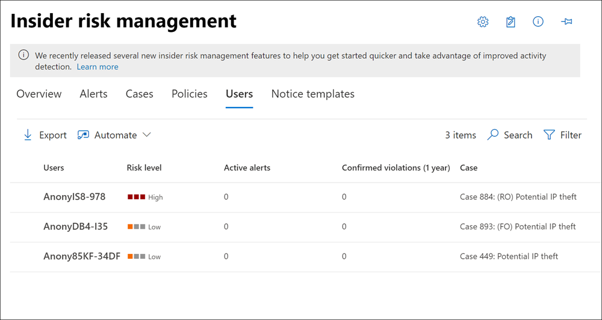

# Panel de usuarios de administración de riesgos de InsiderInsider risk management Users dashboard

El **Panel de usuarios** es una herramienta importante en el flujo de trabajo de administración de riesgos de Insider y ayuda a los investigadores y analistas a comprender mejor las actividades de riesgo.The **Users dashboard** is an important tool in the insider risk management workflow and helps investigators and analysts have a more complete understanding of risk activities. Este panel ofrece vistas y características de administración para satisfacer las necesidades administrativas entre la creación de directivas de administración de riesgos de Insider y la administración de casos de administración de riesgos de Insider.This dashboard offers views and management features to meet administrative needs between the creating insider risk management policies and managing insider risk management cases.

Una vez que se agregan usuarios a las directivas de administración de riesgos de Insider, los procesos en segundo plano evalúan automáticamente las actividades de usuario para [desencadenar indicadores](insider-risk-management-policies.md#indicators).After users are added to insider risk management policies, background processes are automatically evaluating user activities for [triggering indicators](insider-risk-management-policies.md#indicators). Una vez que se han desencadenado los indicadores, se les asignan los resultados de las actividades de usuario.After triggering indicators are present, user activities are assigned risk scores. Algunas de estas actividades pueden dar como resultado una alerta de riesgo de Insider, pero algunas actividades podrían no cumplir un nivel de puntuación de riesgo mínimo y no se creará una alerta de riesgo de Insider.Some of these activities may result in an insider risk alert, but some activities may not meet a minimum risk score level and an insider risk alert won't be created. El **Panel de usuarios** le permite ver los usuarios con estos tipos de indicadores y puntuaciones de riesgos, así como los usuarios que tienen alertas activas de riesgo de Insider.The **Users dashboard** allows you to view users with these types of indicators and risk scores, as well users that have active insider risk alerts.

Además, puede haber escenarios en los que necesite agregar temporalmente usuarios a directivas de riesgo de Insider después de que se informe de un evento inusual fuera del flujo de trabajo de administración de riesgos de Insider.Additionally, there may be scenarios where you need to add temporarily users to insider risk policies after an unusual event is reported outside of the insider risk management workflow. El **Panel de usuarios** le permite agregar manualmente un usuario a una directiva de riesgos de Insider durante un período de tiempo específico y omitir el requisito de que un usuario tenga un indicador de activación.The **Users dashboard** allows you to manually add a user to an insider risk policy for a specific amount of time and bypass the requirement for a user to have a triggering indicator. Estos usuarios siempre se muestran en el panel usuarios cuando se asigna activamente a una directiva.These users are always displayed in the Users dashboard when actively assigned to a policy.

Obtenga más información sobre cómo el panel de usuarios muestra a los usuarios en los siguientes escenarios:Learn more about how the Users dashboard displays users in the following scenarios:

- Usuarios del panel con alertas de directiva de riesgos de Insider activosDashboard users with active insider risk policy alerts
- Usuarios del panel con indicadores de activaciónDashboard users with triggering indicators
- Usuarios de panel agregados temporalmente a directivasDashboard users added temporarily to policies

## Usuarios del panel con alertas de directiva de riesgos de Insider activosDashboard users with active insider risk policy alerts

El **Panel usuarios** muestra automáticamente todos los usuarios con alertas de directiva de riesgos de Insider activos.The **Users dashboard** automatically displays all users with active insider risk policy alerts. Estos usuarios con alertas tienen un indicador de desencadenamiento y una puntuación de riesgo de actividad que cumple los requisitos para crear una alerta de riesgo de Insider.These users with alerts have both a triggering indicator and an activity risk score that meets the requirements for creating an insider risk alert. Para ver las actividades de estos usuarios, seleccione el usuario en el **Panel usuarios** y vaya a la pestaña **actividad de usuario** .Activities for these users are viewed by selecting the user in the **Users dashboard** and navigating to the **User activity** tab.

## Usuarios del panel con indicadores de activaciónDashboard users with triggering indicators

El **Panel usuarios** muestra automáticamente todos los usuarios con indicadores de desencadenamiento, pero que no tienen una puntuación de riesgo de actividad que crearía una actividad de riesgo de Insider.The **Users dashboard** automatically displays all users with triggering indicators, but that don't have an activity risk score that would create an insider risk activity. Por ejemplo, se muestra un usuario con una fecha de retirada notificada porque este evento es un indicador de desencadenamiento, pero no es una actividad que tiene una puntuación de riesgo.For example, a user with a reported resignation date is displayed because this event is a triggering indicator, but isn't an activity that has a risk score. Para ver las actividades de estos usuarios, seleccione el usuario en el **Panel usuarios** y vaya a la pestaña **actividad de usuario** .Activities for these users are viewed by selecting the user in the **Users dashboard** and navigating to the **User activity** tab.

## Usuarios de panel agregados temporalmente a directivasDashboard users added temporarily to policies

El **Panel de usuarios** le permite agregar temporalmente usuarios a una directiva de administración de riesgos de Insider existente después de un evento inusual fuera del flujo de trabajo de administración de riesgos de Insider.The **Users dashboard** allows you to temporarily add users to an existing insider risk management policy after an unusual event outside of the insider risk management workflow. Agregar usuarios temporalmente también es una forma de agregar usuarios a una directiva de administración de riesgos de Insider para probar la Directiva, incluso si no se ha configurado un conector necesario.Temporarily adding users is also a way to add users to an insider risk management policy for testing the policy, even if a required connector isn't configured.

Cuando se agrega manualmente un usuario a una directiva, las actividades de usuario de los 90 días anteriores se puntuan y se agregan a la escala de tiempo de **actividad del usuario** .When a user is manually added to a policy, the user activities for the previous 90 days are scored and added to the **User activity** timeline. Por ejemplo, un usuario que no está en el ámbito actual de una directiva de riesgos de Insider y el usuario tiene actividades de pérdida de datos que se notifican al departamento legal de la organización.For example, a user not currently in-scope in an insider risk policy and the user has data leak activities reported to the legal department in your organization. El departamento jurídico recomienda configurar nuevos requisitos de supervisión a corto plazo para el usuario.The legal department recommends that you configure new short-term monitoring requirements for the user. Puede asignar temporalmente el usuario a la Directiva de *pérdidas de datos* durante un período de tiempo designado (ventana de activación).You can temporarily assign the user to your *Data leaks* policy for a designated length of time (activation window). Todos los usuarios agregados temporalmente se muestran en el **Panel usuarios** , ya que se condonan los requisitos del indicador de activación.All users added temporarily are displayed in the **Users dashboard** because triggering indicator requirements are waived.

>[!NOTE]
>Puede tardar varias horas en aparecer nuevos usuarios agregados manualmente en el **Panel de usuarios**.It may take several hours for new manually-added users to appear in the **Users dashboard**. Las actividades de los 90 días anteriores para estos usuarios pueden tardar hasta 24 horas en mostrarse.Activities for the previous 90 days for these users may take up to 24 hours to display. Para ver las actividades de los usuarios agregados manualmente, seleccione el usuario en el **Panel de usuarios** y abra la ficha **actividad de usuario** en el panel de detalles.To view activities for manually added users, select the user on the **Users dashboard** and open the **User activity** tab on the details pane.

El usuario se quita automáticamente de la Directiva de Insider y del **Panel de usuarios** cuando la hora definida en la **ventana de activación** expira si:The user is automatically removed from the insider policy and the **Users dashboard** when the time defined in the **Activation window** expires if:

- el usuario no tiene indicadores ni alertas de directiva de riesgos de Insider.the user doesn't have any triggering indicators or insider risk policy alerts, and
- Si la duración de la **ventana de activación** definida manualmente es superior a la duración de la ventana de **activación** de directiva global.if the manually defined **Activation window** duration is longer than the global policy **Activation window** duration. 

La configuración de la **ventana de activación** con la duración más larga siempre invalida la configuración de la **ventana de activación** con una duración menor.The **Activation window** setting with the longest duration always overrides the **Activation window** setting with a shorter duration. Por ejemplo, ha configurado la **ventana de activación** en la pestaña **intervalos de tiempo** global de la Directiva de la configuración global de administración de riesgos de Insider durante 15 días, que se aplica automáticamente a todas las directivas de riesgo de Insider.For example, you've configured the **Activation window** on the global **Policy timeframes** tab in the insider risk management global settings for 15 days, which is automatically applied to all your insider risk policies. 

Se agrega temporalmente a un usuario a sus *datos pérdidas* de directiva de riesgo de Insider y se definen 30 días como **ventana de activación** para este usuario.You temporarily add a user to your *Data leaks* insider risk policy and define 30 days as the **Activation window** for this user. La configuración de 15 días de la **ventana de activación** global se reemplaza definiendo la configuración de la **ventana de activación** de 30 días para el usuario agregado temporalmente.The global **Activation window** setting of 15 days is overridden by defining the **Activation window** setting of 30 days for the temporarily added user. El usuario agregado temporalmente permanecerá en el **Panel usuarios** y estará en el ámbito de la Directiva durante 30 días.The temporarily added user will remain in the **Users dashboard** and be in-scope for the policy for 30 days.

En el escenario opuesto donde la configuración de la **ventana de activación** global es más larga que la configuración de la **ventana de activación** definida para un usuario agregado temporalmente, la configuración de la ventana de **activación** global invalidará la configuración de la **ventana de activación** del usuario agregado temporalmente.In the opposite scenario where the global **Activation window** setting is longer than the **Activation window** setting defined for a temporarily added user, the global **Activation window** setting would override the **Activation window** setting for the temporarily added user. El usuario agregado temporalmente permanecerá en el **Panel usuarios** y estará en el ámbito de la Directiva durante el número de días definido en la configuración de la **ventana de activación** global.The temporarily added user will remain in the **Users dashboard** and be in-scope for the policy for the number of days defined in the global **Activation window** settings.

## Ver información de usuario en el panel de usuariosView user information on the Users dashboard

Cada usuario que se muestra en el **Panel de usuarios** tiene la siguiente información:Each user displayed in the **Users dashboard** has the following information:

- **Users**: el nombre de usuario de un usuario.**Users**: The username for a user. Este campo es anonimizan si está habilitada la configuración de anonymization global para la administración de riesgos de Insider.This field is anonymized if the global anonymization setting for insider risk management is enabled.
- **Nivel de riesgo**: el nivel de riesgo calculado actual del usuario.**Risk level**: The current calculated risk level of the user. Esta puntuación se calcula cada 24 horas y usa los resultados de riesgo de alertas de todas las alertas activas asociadas al usuario.This score is calculated every 24 hours and uses the alert risk scores from all active alerts associated to the user. Para los usuarios que solo tengan indicadores desencadenantes, el nivel de riesgo es cero.For users with only triggering indicators, the risk level is zero.
- **Alertas activas**: el número de alertas activas para todas las directivas.**Active alerts**: The number of active alerts for all policies.
- **Infracciones confirmadas**: el número de casos resueltos como *infracción de la Directiva confirmada* para el usuario.**Confirmed violations**: The number of cases resolved as *confirmed policy violation* for the user.
- **Caso**: el caso activo actual para el usuario.**Case**: The current active case for the user.

>[!NOTE]
>El número de usuarios que se muestran en el **Panel usuarios** puede estar limitado en algunos casos, según el volumen de alertas activas y las directivas coincidentes.The number of users displayed on the **Users dashboard** may be limited in some instances, depending on the volume of active alerts and matching policies. Los usuarios con alertas activas se muestran en el **Panel de usuarios** a medida que se generan las alertas y es posible que haya casos raros en los que se alcance el número máximo de usuarios mostrados.Users with active alerts are displayed on the **Users dashboard** as the alerts are generated, and there may be rare cases when the maximum number of displayed users is reached. Si esto ocurre, los usuarios con alertas activas que no se muestran se agregarán al **Panel usuarios** , ya que las alertas de usuario existentes se evaluarán.If this happens, users with active alerts who aren't displayed will be added to the **Users dashboard** as existing user alerts are triaged.

## Ver detalles del usuarioView user details

Para ver más detalles sobre la actividad de riesgos para un usuario, abra el panel de detalles del usuario haciendo doble clic en un usuario en el **Panel de usuarios**.To view more details about risk activity for a user, open the user details pane by double-clicking a user in the **Users dashboard**. En el panel de detalles, puede ver la siguiente información:On the details pane, you can view the following information:

- Ficha **Perfil de usuario****User profile** tab
    - **Nombre y título**: el nombre y el título de la ubicación del usuario de Azure Active Directory.**Name and title**: The name and position title for the user from Azure Active Directory. Estos campos de usuario estarán anonimizan o estarán vacíos si está habilitada la configuración de anonymization global para la administración de riesgos de Insider.These user fields will be anonymized or empty if the global anonymization setting for insider risk management is enabled.
    - **Correo electrónico del usuario**: la dirección de correo electrónico del usuario.**User email**: The email address for the user.
    - **Alias**: el alias de red del usuario.**Alias**: The network alias for the user.
    - **Organización o departamento**: la organización o el Departamento del usuario.**Organization or department**: The organization or department for the user.

- Ficha **actividad del usuario****User activity** tab
    - **Historial de la actividad reciente de los usuarios**: enumera los indicadores desencadenadores y los indicadores de riesgo Insider para las actividades de usuario hasta los últimos 180 días.**History of recent user activity**: Lists both triggering indicators and insider risk indicators for user activities up to the last 180 days. También se puntuan todas las actividades pertinentes a los indicadores de riesgo de Insider, aunque es posible que las actividades hayan generado una alerta de riesgo de Insider.All activities pertinent to insider risk indicators are also scored, though the activities may or may not have generated an insider risk alert. Los ejemplos de indicador de activación pueden ser una fecha de retirada o la fecha del último trabajo programado del usuario.Triggering indicator examples may be a resignation date or the last scheduled date of work for the user. Los indicadores de riesgo de Insider son actividades que se determinan que tienen un elemento de riesgo y que se definen en las directivas en las que se incluye el usuario.Insider risk indicators are activities determined to have an element of risk and are defined in policies that the user is included in. Las actividades de eventos y riesgos se muestran con el elemento más reciente enumerado primero.Event and risk activities are listed with the most recent item listed first.

## Agregar temporalmente un usuario a una directivaTemporarily add a user to a policy

Para agregar temporalmente un usuario a una directiva de administración de riesgos de Insider, use la pestaña **usuarios** de la solución de **Administración de riesgos de Insider** en el centro de cumplimiento de Microsoft 365.To temporarily add a user to an insider risk management policy, you'll use the **Users** tab in the **Insider risk management** solution in the Microsoft 365 compliance center. Los usuarios agregan manualmente los requisitos del indicador de omisión de desencadenadores para la Directiva a la que se agregan y se muestran en el **Panel de usuarios**.Users added manually bypass triggering indicator requirements for the policy they are added to and are displayed in the **Users dashboard**. Para agregar de forma permanente un usuario a una directiva de administración de riesgos de Insider, use el Asistente para directivas.To permanently add a user to an insider risk management policy, you'll use the policy wizard.

Complete los siguientes pasos para agregar un usuario a una directiva de riesgos de Insider existente:Complete the following steps to add a user to an existing insider risk policy:

1. En el [centro de cumplimiento de Microsoft 365](https://compliance.microsoft.com), vaya a **Administración de riesgos de Insider** y seleccione la pestaña **usuarios** .In the [Microsoft 365 compliance center](https://compliance.microsoft.com), go to **Insider risk management** and select the **Users** tab.
2. Seleccione **Agregar un usuario a una directiva** en la barra de herramientas.Select **Add a user to a policy** on the toolbar.
3. En el cuadro de diálogo **Agregar un nuevo usuario** , empiece a escribir un nombre de usuario en el campo **usuario** .On the **Add a new user** dialog, start typing a user name in the **User** field. Seleccione el usuario que desea agregar a una directiva.Select the user you want to add to a policy.
4. Seleccione la flecha desplegable del campo de **Directiva** para mostrar las directivas de administración de riesgos de Insider configuradas.Select the dropdown arrow for the **Policy** field to display configured insider risk management policies. Seleccione la Directiva a la que desea agregar el usuario.Select the policy to add the user to.
5. Use el control deslizante de la **ventana de activación** para definir el tiempo que el usuario se incluye en una directiva y se muestra en el panel usuarios.Use the **Activation window** slider control to define how long the user is included in a policy and displayed in the Users dashboard. El tiempo que especifique determina cuánto tiempo estará activa la Directiva para este usuario y se iniciará cuando se genere la primera alerta o se detecte un indicador de desencadenamiento (como una coincidencia de directiva DLP).The time you specify determines how long the policy is active for this user and starts when the first alert is generated or a triggering indicator (like a DLP policy match) is detected. El intervalo para la **ventana de activación** es de 5 a 30 días.The range for the **Activation window** is 5 to 30 days.
6. Seleccione **Agregar** y **confirme** para agregar el usuario a la Directiva.Select **Add** and then **Confirm** to add the user to the policy.

>[!NOTE]
>Puede tardar varias horas en aparecer nuevos usuarios agregados manualmente en el **Panel de usuarios**.It may take several hours for new manually-added users to appear in the **Users dashboard**. Las actividades de los 90 días anteriores para estos usuarios pueden tardar hasta 24 horas en mostrarse.Activities for the previous 90 days for these users may take up to 24 hours to display. Para ver las actividades de los usuarios agregados manualmente, seleccione el usuario en el **Panel de usuarios** y abra la ficha **actividad de usuario** en el panel de detalles.To view activities for manually added users, select the user on the **Users dashboard** and open the **User activity** tab on the details pane.
