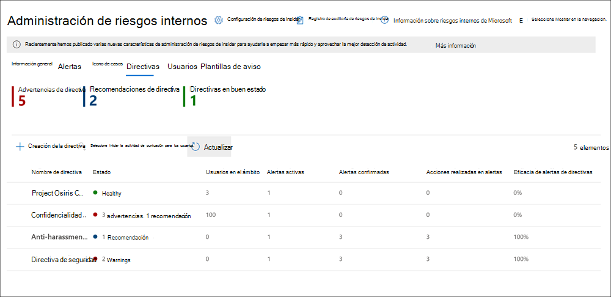
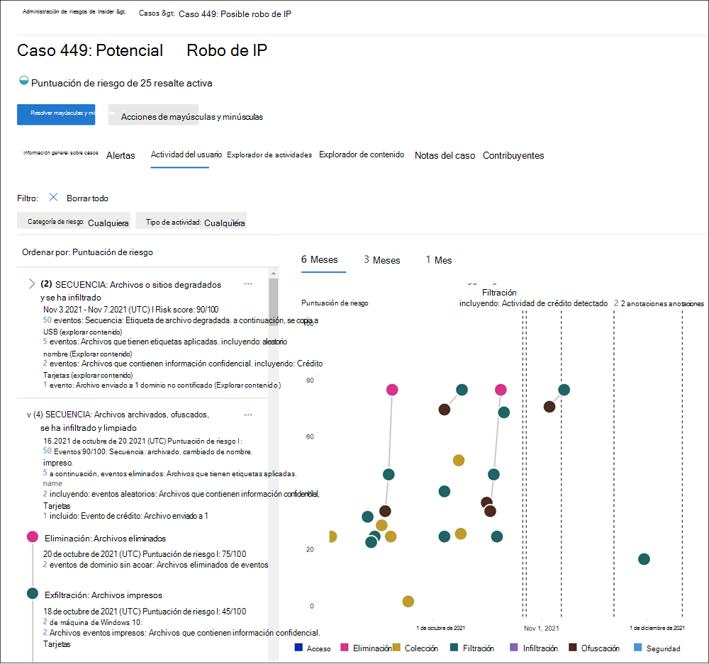

# Administración de riesgos de Insider en Microsoft 365Insider risk management in Microsoft 365

La administración de riesgos de Insider es una solución en Microsoft 365 que contribuye a minimizar los riesgos internos, ya que permite detectar, investigar y realizar acciones en actividades de riesgo de la organización.Insider risk management is a solution in Microsoft 365 that helps minimize internal risks by enabling you to detect, investigate, and take action on risky activities in your organization. Las directivas personalizadas le permiten detectar y realizar acciones en actividades malintencionadas e involuntarias de riesgos en su organización, incluidos el reajuste de casos a la exhibición avanzada de documentos electrónicos de Microsoft si es necesario.Custom policies allow you to detect and take action on malicious and inadvertent risk activities in your organization, including escalating cases to Microsoft Advanced eDiscovery if needed. Los analistas de riesgos de la organización pueden emprender rápidamente las acciones adecuadas para asegurarse de que los usuarios cumplan los estándares de cumplimiento de la organización.Risk analysts in your organization can quickly take appropriate actions to make sure users are compliant with your organization's compliance standards.

Vea el vídeo a continuación para obtener información sobre cómo la administración de riesgos de Insider puede ayudar a su organización a prevenir, detectar y contener riesgos, a la vez que prioriza los valores de la organización, la cultura y la experiencia de los empleados:Watch the video below to learn how insider risk management can help your organization prevent, detect, and contain risks while prioritizing your organization values, culture, and employee experience:
 
 
>[!VIDEO https://www.microsoft.com/videoplayer/embed/RE4j9CN]

## Pain Points de riesgo modernoModern risk pain points

La administración y minimización de los riesgos en la organización comienza con la comprensión de los tipos de riesgos que se encuentran en el lugar de trabajo moderno.Managing and minimizing risk in your organization starts with understanding the types of risks found in the modern workplace. Algunos riesgos están controlados por eventos externos y factores y se encuentran fuera del control directo.Some risks are driven by external events and factors and are outside direct control. Otros riesgos están controlados por eventos internos y actividades de los empleados que pueden eliminarse y evitarse.Other risks are driven by internal events and employee activities that can be eliminated and avoided. Algunos ejemplos son los riesgos de comportamiento ilegal, inapropiado, no autorizado o poco ético y acciones de empleados y directores.Some examples are risks from illegal, inappropriate, unauthorized, or unethical behavior and actions by employees and managers. Estos comportamientos incluyen una amplia gama de riesgos internos de los empleados:These behaviors include a broad range of internal risks from employees:

- Pérdidas de datos confidenciales y derrame de datosLeaks of sensitive data and data spillage
- Violaciones de confidencialidadConfidentiality violations
- Robo de propiedad intelectual (IP)Intellectual property (IP) theft
- EstafaFraud
- Comercio de InsidersInsider trading
- Violaciones de cumplimiento de normativasRegulatory compliance violations

Los empleados en el lugar de trabajo moderno tienen acceso para crear, administrar y compartir datos en un amplio espectro de plataformas y servicios.Employees in the modern workplace have access to create, manage, and share data across a broad spectrum of platforms and services. En la mayoría de los casos, las organizaciones tienen recursos y herramientas limitados para identificar y mitigar los riesgos en toda la organización, al tiempo que cumplen los estándares de privacidad de los empleados.In most cases, organizations have limited resources and tools to identify and mitigate organization-wide risks while also meeting employee privacy standards.

La administración de riesgos de Insider de Microsoft 365 usa toda la amplitud de los indicadores de servicio y de terceros para ayudarle a identificar, clasificar y realizar acciones en la actividad de riesgos rápidamente.Insider risk management in Microsoft 365 uses the full breadth of service and 3rd-party indicators to help you quickly identify, triage, and take action on risk activity. Mediante el uso de registros de Microsoft 365 y Microsoft Graph, la administración de riesgos de Insider le permite definir directivas específicas para identificar los indicadores de riesgo.By using logs from Microsoft 365 and Microsoft Graph, insider risk management allows you to define specific policies to identify risk indicators. Estas directivas le permiten identificar actividades arriesgadas y emprender acciones para mitigar estos riesgos.These policies allow you to identify risky activities and to take action to mitigate these risks.

La administración de riesgos de Insider se centra en los siguientes principios:Insider risk management is centered around the following principles:

- **Transparencia**: equilibre la privacidad de los empleados frente al riesgo de la organización con la arquitectura de privacidad por diseño.**Transparency**: Balance employee privacy versus organization risk with privacy-by-design architecture.
- **Configurable**: directivas configurables basadas en la industria, la geográfica y los grupos empresariales.**Configurable**: Configurable policies based on industry, geographical, and business groups.
- **Integrado**: flujo de trabajo integrado en las soluciones de cumplimiento de Microsoft 365.**Integrated**: Integrated workflow across Microsoft 365 compliance solutions.
- **Accionable**: proporciona información para habilitar notificaciones de los empleados, investigaciones de datos e investigaciones de los empleados.**Actionable**: Provides insights to enable employee notifications, data investigations, and employee investigations.

## Flujo de trabajoWorkflow

La administración de riesgos de Insiders le ayuda a identificar, investigar y emprender acciones para enfrentar los riesgos internos de la organización.Insider risk management helps you identify, investigate, and take action to address internal risks in your organization. Con las plantillas de directivas centradas, la señalización exhaustiva de las actividades en el servicio de Microsoft 365 y un flujo de trabajo flexible, puede usar información que requiere acción para identificar y resolver rápidamente el comportamiento arriesgado.With focused policy templates, comprehensive activity signaling across the Microsoft 365 service, and a flexible workflow, you can use actionable insights to quickly identify and resolve risky behavior.

La identificación y resolución de actividades de riesgo internas y problemas de cumplimiento de la administración de riesgos de Insider en Microsoft 365 usa el siguiente flujo de trabajo:Identifying and resolving internal risk activities and compliance issues with insider risk management in Microsoft 365 uses the following workflow:

### DirectivasPolicies

Las directivas de administración de riesgos de Insider se crean mediante plantillas predefinidas y condiciones de directivas que definen qué indicadores de riesgo se examinan en las áreas de características de Microsoft 365.Insider risk management policies are created using pre-defined templates and policy conditions that define what risk indicators are examined in Microsoft 365 feature areas. Estas condiciones incluyen cómo se usan los indicadores para las alertas, qué usuarios se incluyen en la Directiva, qué servicios se priorizan y el período de tiempo de supervisión.These conditions include how indicators are used for alerts, what users are included in the policy, which services are prioritized, and the monitoring time period.

Puede seleccionar entre las siguientes [plantillas de directiva](insider-risk-management-policies.md#policy-templates) para empezar rápidamente con la administración de riesgos de Insider:You can select from the following [policy templates](insider-risk-management-policies.md#policy-templates) to quickly get started with insider risk management:

- Robo de datos del empleadoDeparting employee data theft
- Pérdidas de datosData leaks
- Lenguaje ofensivo en el correo electrónicoOffensive language in email

Para obtener más información, vea [directivas de administración de riesgos de Insider](insider-risk-management-policies.md).For more information, see [Insider risk management policies](insider-risk-management-policies.md).

### AlertasAlerts

Los indicadores de riesgo generan automáticamente alertas que coinciden con las condiciones de la Directiva y se muestran en el **Panel alertas**.Alerts are automatically generated by risk indicators that match policy conditions and are displayed in the **Alerts dashboard**. Este panel habilita una vista rápida de todas las alertas que necesitan revisar, abrir alertas a lo largo del tiempo y estadísticas de alertas de la organización.This dashboard enables a quick view of all alerts needing review, open alerts over time, and alert statistics for your organization. Todas las alertas de Directiva se muestran con información asociada para ayudarle a identificar rápidamente el estado actual de las alertas existentes y nuevas alertas que necesitan acción:All policy alerts are displayed with associated information to help you quickly identify the current status of existing alerts and new alerts that need action:

- EstadoStatus
- SeveritySeverity
- Tiempo detectadoTime detected
- CaseCase
- Estado del casoCase status

Para obtener más información, vea [alertas de administración de riesgos de Insider](insider-risk-management-alerts.md).For more information, see [Insider risk management alerts](insider-risk-management-alerts.md).

### PrioridadesTriage

Las nuevas actividades que necesitan investigación generan automáticamente alertas a las que se asigna un estado de *revisión de necesidades* .New activities that need investigation automatically generate alerts that are assigned a *Needs review* status. Los revisores pueden identificar rápidamente estas alertas y desplazarse por cada una para evaluar y clasificar.Reviewers can quickly identify these alerts and scroll through each to evaluate and triage. 

Las alertas se resuelven abriendo un nuevo caso, asignando la alerta a un caso existente o desechando la alerta.Alerts are resolved by opening a new case, assigning the alert to an existing case, or dismissing the alert. Mediante el uso de filtros de alerta, es fácil identificar rápidamente las alertas por estado, gravedad o tiempo detectado.Using alert filters, it's easy to quickly identify alerts by status, severity, or time detected. Como parte del proceso de evaluación de prioridades, los revisores pueden ver los detalles de la alerta para la coincidencia de la Directiva, ver la actividad de usuario asociada a la coincidencia, ver la gravedad de la alerta y revisar la información de Perfil de usuario.As part of the triage process, reviewers can view alert details for the policy match, view user activity associated with the match, see the severity of the alert, and review user profile information.

### AveriguarInvestigate

Los casos se crean para las alertas que requieren una revisión y una investigación más detalladas de los detalles y las circunstancias en las que coincide la Directiva.Cases are created for alerts that require deeper review and investigation of the details and circumstances around the policy match. El **Panel de caso** proporciona una vista general de todos los casos activos, casos abiertos a lo largo del tiempo, y estadísticas de casos para la organización.The **Case dashboard** provides an all-up view of all active cases, open cases over time, and case statistics for your organization. Los revisores pueden filtrar rápidamente los casos por estado, la fecha en la que se abrió el caso y la fecha en que se actualizó por última vez el caso.Reviewers can quickly filter cases by status, the date the case was opened, and the date the case was last updated.

Al seleccionar un caso en el panel del caso, se abre el caso de investigación y revisión.Selecting a case on the case dashboard opens the case for investigation and review. Este paso es el corazón del flujo de trabajo de administración de riesgos de Insider.This step is the heart of the insider risk management workflow. Esta área es donde los indicadores de actividad de riesgos, las condiciones de las directivas, los detalles de las alertas y los detalles de los empleados se sintetizan en una vista integrada para los revisores.This area is where risk activity indicators, policy conditions, alerts details, and employee details are synthesized into an integrated view for reviewers. Las principales herramientas de investigación de esta área son:The primary investigation tools in this area are:

- **Actividad de usuario**: la actividad de los usuarios se muestra automáticamente en un gráfico interactivo que traza las actividades de riesgo a lo largo del tiempo y por nivel de riesgo para las actividades de riesgo actuales o pasadas.**User activity**: User activity is automatically displayed in an interactive chart that plots risk activities over time and by risk level for current or past risk activities. Los revisores pueden filtrar y ver rápidamente todo el historial de riesgos para el empleado y profundizar en actividades específicas para obtener más información.Reviewers can quickly filter and view the entire risk history for the employee and drill into specific activities for more details.
- **Explorador de contenido**: todos los archivos de datos y mensajes de correo electrónico asociados con actividades de riesgo de alertas se capturan automáticamente y se muestran en el explorador de contenido.**Content explorer**: All data files and email messages associated with alert risk activities are automatically captured and displayed in the content explorer. Los revisores pueden filtrar y ver los archivos y los mensajes por origen de datos, tipo de archivo, etiquetas, conversación y muchos más atributos.Reviewers can filter and view files and messages by data source, file type, tags, conversation, and many more attributes.
- **Notas del caso**: los revisores proporcionan notas para un caso en la sección Notas de caso.**Case notes**: Reviewers provide notes for a case in the Case Notes section. Esta lista consolida todas las notas en una vista central e incluye la información enviada por el revisor y la fecha.This list consolidates all notes in a central view and include reviewer and date submitted information.

Para obtener más información, vea [casos de administración de riesgos de Insider](insider-risk-management-cases.md).For more information, see [Insider risk management cases](insider-risk-management-cases.md).

### AcciónAction

Una vez que se han investigado los casos, los revisores pueden tomar medidas rápidamente para resolver el caso o colaborar con otras partes interesadas de riesgo de la organización.After cases are investigated, reviewers can quickly take action to resolve the case or collaborate with other risk stakeholders in your organization. Cuando los empleados infringen accidental o involuntariamente las condiciones de las directivas, se puede enviar una notificación de recordatorio simple al empleado a partir de plantillas de notificación que puede configurar para su organización.When employees accidentally or inadvertently violate policy conditions, a simple reminder notice can be sent to the employee from notice templates you can configure for your organization. Estos avisos pueden servir como recordatorios sencillos o dirigir al empleado a un entrenamiento o guía de refresco para ayudar a evitar un comportamiento arriesgado futuro.These notices may serve as simple reminders or may direct the employee to refresher training or guidance to help prevent future risky behavior. Para obtener más información, consulte [plantillas de aviso de administración de riesgos de Insider](insider-risk-management-notices.md).For more information, see [Insider risk management notice templates](insider-risk-management-notices.md).

En las situaciones más graves, es posible que necesite compartir la información del caso de administración de riesgos de Insider con otros revisores de la organización.In the most serious situations, you may need to share the insider risk management case information with other reviewers in your organization. La administración de riesgos de Insider se integra estrechamente con otras características de cumplimiento de Microsoft 365 para ayudarle con la resolución de riesgos de un extremo a otro.Insider risk management is tightly integrated with other Microsoft 365 compliance features to help you with end-to-end risk resolution. Escalar un caso para la investigación le permite transferir datos y administrar el caso a la exhibición avanzada de documentos electrónicos en Microsoft 365.Escalating a case for investigation allows you to transfer data and management of the case to Advanced eDiscovery in Microsoft 365. EDiscovery avanzado proporciona un flujo de trabajo de un extremo a otro para preservar, recopilar, revisar, analizar y exportar contenido que responde a las investigaciones internas y externas de la organización.Advanced eDiscovery provides an end-to-end workflow to preserve, collect, review, analyze, and export content that's responsive to your organization's internal and external investigations. Permite a los equipos legales administrar todo el flujo de trabajo de notificación de retención legal.It allows legal teams to manage the entire legal hold notification workflow. Para obtener más información sobre los casos avanzados de eDiscovery, vea [información general sobre EDiscovery avanzado en Microsoft 365](overview-ediscovery-20.md).To learn more about Advanced eDiscovery cases, see [Overview of Advanced eDiscovery in Microsoft 365](overview-ediscovery-20.md).

## EscenariosScenarios

La administración de riesgos de Insiders puede ayudarle a detectar, investigar y emprender acciones para mitigar los riesgos internos de su organización en varios escenarios comunes:Insider risk management can help you detect, investigate, and take action to mitigate internal risks in your organization in several common scenarios:

### Robo de datos al que se parte del empleadoData theft by departing employee

Cuando los empleados dejan una organización, ya sea voluntariamente o como resultado de la terminación, a menudo hay preocupaciones legítimas de que los datos de la empresa, el cliente y los empleados estén en riesgo.When employees leave an organization, either voluntarily or as the result of termination, there is often legitimate concerns that company, customer, and employee data are at risk. Los empleados pueden asumir inocentemente que los datos del proyecto no son propios o pueden sentirse tentados a tomar los datos de la compañía para obtener un beneficio personal y infringir la política de la compañía y los estándares legales.Employees may innocently assume that project data isn't proprietary or they may be tempted to take company data for personal gain and in violation of company policy and legal standards. Las directivas de administración de riesgos de Insider que usan la plantilla de directiva de robo de datos del empleado que la [integran](insider-risk-management-policies.md#policy-templates) automáticamente detectan actividades normalmente asociadas con este tipo de robo.Insider risk management policies that use the [Departing employee data theft](insider-risk-management-policies.md#policy-templates) policy template automatically detect activities typically associated with this type of theft. Con esta Directiva, recibirá automáticamente alertas para actividades sospechosas asociadas con el robo de empleados, de modo que pueda realizar las acciones de investigación adecuadas.With this policy, you'll automatically receive alerts for suspicious activities associated with departing employees theft so you can take appropriate investigative actions. Para esta plantilla de Directiva, se necesita configurar un [conector de Microsoft 365](import-hr-data.md) para la organización.Configuring a [Microsoft 365 HR Connector](import-hr-data.md) for your organization is required for this policy template.

### Pérdida intencional o involuntaria de información confidencial o confidencialIntentional or unintentional leak of sensitive or confidential information

En la mayoría de los casos, los empleados intentan manejar correctamente la información confidencial o confidencial.In most cases, employees try their best to properly handle sensitive or confidential information. Pero, en ocasiones, los empleados cometen errores y la información se comparten de forma accidental fuera de su organización o infringen sus directivas de protección de la información.But occasionally employees make mistakes and information is accidentally shared outside your organization or in violation of your information protection policies. A veces, los empleados pueden perder o compartir intencionadamente información confidencial y confidencial con malas intenciones y para obtener una ganancia personal potencial.Sometimes employees may intentionally leak or share sensitive and confidential information with malicious intent and for potential personal gain. Las directivas de administración de riesgos de Insider creadas mediante la plantilla de directiva de [pérdidas de datos](insider-risk-management-policies.md#policy-templates) detectan automáticamente las actividades asociadas normalmente al uso compartido de información confidencial.Insider risk management policies created using the [Data leaks](insider-risk-management-policies.md#policy-templates) policy template automatically detect activities typically associated with sharing sensitive or confidential information. La configuración de al menos una [Directiva de protección contra la pérdida de datos (DLP)](create-test-tune-dlp-policy.md) de Microsoft 365 para la organización es necesaria para esta plantilla de directiva.Configuring at least one Microsoft 365 [Data Loss Protection (DLP) policy](create-test-tune-dlp-policy.md) for your organization is required for this policy template.

### Acciones y comportamientos que infringen las directivas corporativasActions and behaviors that violate corporate policies

Las comunicaciones entre empleados son a menudo una fuente de infracciones accidentales o malintencionadas de las directivas corporativas.Employee-to-employee communications are often a source of inadvertent or malicious violations of corporate policies. Estas infracciones pueden incluir un lenguaje ofensivo, amenazas y el Cyber-acosos entre empleados.These violations can include offensive language, threats, and cyber-bullying between employees. Este tipo de actividad contribuye a un entorno de trabajo hostil y puede dar lugar a acciones legales con los empleados y la organización de mayor tamaño.This type of activity contributes to a hostile work environment and can result in legal actions against both employees and the larger organization. La administración de riesgos de Insiders usa nuevos clasificadores de Microsoft 365 integrados y el [lenguaje ofensivo en la plantilla de directiva de correo electrónico](insider-risk-management-policies.md#policy-templates) .Insider risk management uses new built-in Microsoft 365 classifiers and the [Offensive language in email](insider-risk-management-policies.md#policy-templates) policy template. Estos clasificadores y plantillas permiten la configuración rápida de una directiva para detectar automáticamente y alertarle de este tipo de comportamiento.These classifiers and templates enable the quick configuration of a policy to automatically detect and alert you of this kind of behavior.

## ¿Está listo para empezar?Ready to get started?

- Consulte [planeación de la administración de riesgos de Insiders](insider-risk-management-plan.md) para obtener más sobre cómo prepararse para habilitar directivas de administración de riesgos de Insider en su organización.See [Plan for insider risk management](insider-risk-management-plan.md) for how to prepare to enable insider risk management policies in your organization.
- Consulte Introducción a la [Administración de riesgos de Insider](insider-risk-management-configure.md) para configurar los requisitos previos, crear directivas y empezar a recibir alertas.See [Get started with insider risk management](insider-risk-management-configure.md) to configure prerequisites, create policies, and start receiving alerts.
