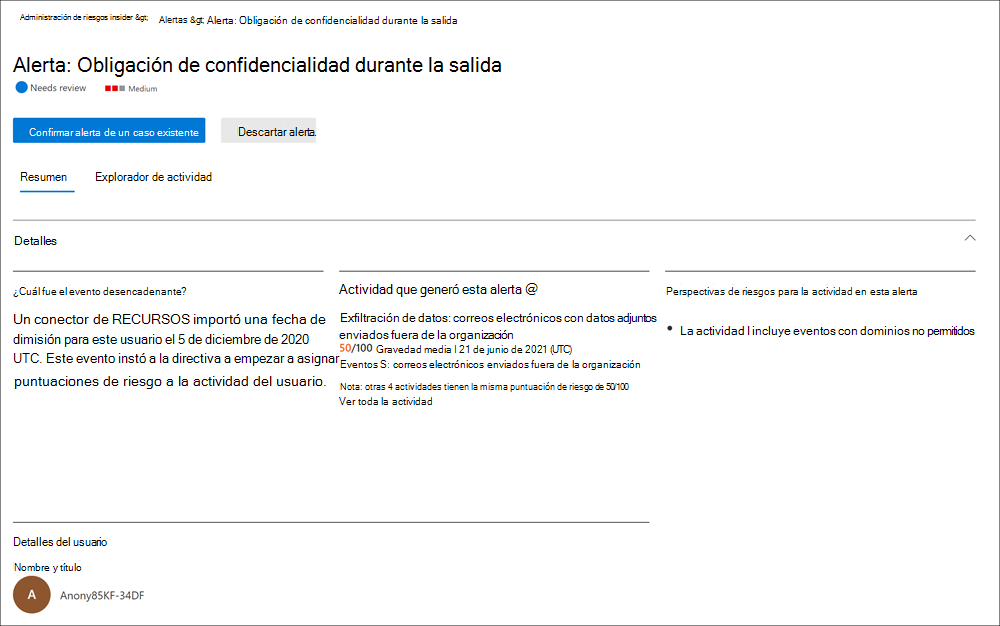

# Administración de riesgos de Insider en Microsoft 365Insider risk management in Microsoft 365

La administración de riesgos de Insiders es una solución de cumplimiento en Microsoft 365 que ayuda a minimizar los riesgos internos, ya que permite detectar, investigar y actuar en actividades malintencionadas e involuntarias en la organización.Insider risk management is a compliance solution in Microsoft 365 that helps minimize internal risks by enabling you to detect, investigate, and act on malicious and inadvertent activities in your organization. Las directivas de riesgo de Insider le permiten definir los tipos de riesgos que se deben identificar y detectar en la organización, como actuar en casos y reasignar casos a la exhibición avanzada de documentos electrónicos de Microsoft si es necesario.Insider risk policies allow you to define the types of risks to identify and detect in your organization, including acting on cases and escalating cases to Microsoft Advanced eDiscovery if needed. Los analistas de riesgos de la organización pueden emprender rápidamente las acciones adecuadas para asegurarse de que los usuarios cumplan los estándares de cumplimiento de la organización.Risk analysts in your organization can quickly take appropriate actions to make sure users are compliant with your organization's compliance standards.

Vea el vídeo a continuación para obtener información sobre cómo la administración de riesgos de Insider puede ayudar a su organización a evitar, detectar y contener riesgos mientras prioriza los valores de la organización, la cultura y la experiencia del usuario:Watch the video below to learn how insider risk management can help your organization prevent, detect, and contain risks while prioritizing your organization values, culture, and user experience:
 
 
>[!VIDEO https://www.microsoft.com/videoplayer/embed/RE4j9CN]

## Pain Points de riesgo modernoModern risk pain points

La administración y minimización de los riesgos en la organización comienza con la comprensión de los tipos de riesgos que se encuentran en el lugar de trabajo moderno.Managing and minimizing risk in your organization starts with understanding the types of risks found in the modern workplace. Algunos riesgos están controlados por eventos externos y factores que están fuera de un control directo.Some risks are driven by external events and factors that are outside of direct control. Otros riesgos están controlados por eventos internos y actividades de usuario que se pueden minimizar y evitar.Other risks are driven by internal events and user activities that can be minimized and avoided. Algunos ejemplos son los riesgos de comportamiento ilegal, inapropiado, no autorizado o poco ético y de acciones de los usuarios de la organización.Some examples are risks from illegal, inappropriate, unauthorized, or unethical behavior and actions by users in your organization. Estos comportamientos incluyen una amplia gama de riesgos internos de los usuarios:These behaviors include a broad range of internal risks from users:

- Pérdidas de datos confidenciales y derrame de datosLeaks of sensitive data and data spillage
- Violaciones de confidencialidadConfidentiality violations
- Robo de propiedad intelectual (IP)Intellectual property (IP) theft
- EstafaFraud
- Comercio de InsidersInsider trading
- Violaciones de cumplimiento de normativasRegulatory compliance violations

Los usuarios del lugar de trabajo moderno tienen acceso para crear, administrar y compartir datos en un amplio espectro de plataformas y servicios.Users in the modern workplace have access to create, manage, and share data across a broad spectrum of platforms and services. En la mayoría de los casos, las organizaciones tienen recursos y herramientas limitados para identificar y mitigar los riesgos en toda la organización, al tiempo que se cumplen los estándares de privacidad del usuario.In most cases, organizations have limited resources and tools to identify and mitigate organization-wide risks while also meeting user privacy standards.

La administración de riesgos de Insiders usa toda la amplitud de los indicadores de servicio y de terceros para ayudarle a identificar, clasificar y actuar con rapidez en la actividad de riesgos.Insider risk management uses the full breadth of service and 3rd-party indicators to help you quickly identify, triage, and act on risk activity. Mediante el uso de registros de Microsoft 365 y Microsoft Graph, la administración de riesgos de Insider le permite definir directivas específicas para identificar los indicadores de riesgo.By using logs from Microsoft 365 and Microsoft Graph, insider risk management allows you to define specific policies to identify risk indicators. Estas directivas permiten identificar actividades arriesgadas y actuar para mitigar estos riesgos.These policies allow you to identify risky activities and to act to mitigate these risks.

La administración de riesgos de Insider se centra en los siguientes principios:Insider risk management is centered around the following principles:

- **Transparencia** : equilibre la privacidad del usuario frente al riesgo de la organización con la arquitectura de privacidad por diseño.**Transparency** : Balance user privacy versus organization risk with privacy-by-design architecture.
- **Configurable** : directivas configurables basadas en la industria, la geográfica y los grupos empresariales.**Configurable** : Configurable policies based on industry, geographical, and business groups.
- **Integrado** : flujo de trabajo integrado en las soluciones de cumplimiento de Microsoft 365.**Integrated** : Integrated workflow across Microsoft 365 compliance solutions.
- **Accionable** : proporciona información para habilitar las notificaciones de usuario, las investigaciones de datos y las investigaciones del usuario.**Actionable** : Provides insights to enable user notifications, data investigations, and user investigations.

## Flujo de trabajoWorkflow

El flujo de trabajo de administración de riesgos de Insider le ayuda a identificar, investigar y emprender acciones para enfrentar los riesgos internos de la organización.The insider risk management workflow helps you identify, investigate, and take action to address internal risks in your organization. Con las plantillas de directivas centradas, la señalización exhaustiva de actividades en el servicio de Microsoft 365 y las herramientas de administración de alertas y casos, puede usar la información que requiere acción para identificar y actuar rápidamente en un comportamiento arriesgado.With focused policy templates, comprehensive activity signaling across the Microsoft 365 service, and alert and case management tools, you can use actionable insights to quickly identify and act on risky behavior.

La identificación y resolución de actividades de riesgo internas y problemas de cumplimiento de la administración de riesgos de Insider en Microsoft 365 usa el siguiente flujo de trabajo:Identifying and resolving internal risk activities and compliance issues with insider risk management in Microsoft 365 uses the following workflow:

### DirectivasPolicies

Las [directivas de administración de riesgos de Insider](insider-risk-management-policies.md) se crean usando las directivas predefinidas y las condiciones de directiva que definen qué eventos y indicadores de riesgos se examinan en la organización.[Insider risk management policies](insider-risk-management-policies.md) are created using pre-defined templates and policy conditions that define what triggering events and risk indicators are examined in your organization. Estas condiciones incluyen cómo se usan los indicadores de riesgo para las alertas, qué usuarios se incluyen en la Directiva, qué servicios se priorizan y el período de tiempo de supervisión.These conditions include how risk indicators are used for alerts, what users are included in the policy, which services are prioritized, and the monitoring time period.

Puede seleccionar entre las siguientes [plantillas de directiva para empezar rápidamente con la administración de riesgos de Insider:You can select from the following[policy templates to quickly get started with insider risk management:

- [Robo de datos al pertenecer a los usuariosData theft by departing users](insider-risk-management-policies.md#data-theft-by-departing-users)
- [Pérdidas de datos generalesGeneral data leaks](insider-risk-management-policies.md#general-data-leaks)
- [Pérdidas de datos por usuarios con prioridad (versión preliminar)Data leaks by priority users (preview)](insider-risk-management-policies.md#data-leaks-by-priority-users-preview)
- [Pérdidas de datos por usuarios descontentos (versión preliminar)Data leaks by disgruntled users (preview)](insider-risk-management-policies.md#data-leaks-by-disgruntled-users-preview)
- [Infracciones de directivas de seguridad generales (versión preliminar)General security policy violations (preview)](insider-risk-management-policies.md#general-security-policy-violations-preview)
- [Infracciones de la Directiva de seguridad al pertenecer a los usuarios (versión preliminar)Security policy violations by departing users (preview)](insider-risk-management-policies.md#security-policy-violations-by-departing-users-preview)
- [Infracciones de directivas de seguridad por usuarios con prioridad (versión preliminar)Security policy violations by priority users (preview)](insider-risk-management-policies.md#security-policy-violations-by-priority-users-preview)
- [Infracciones de directivas de seguridad por usuarios descontentos (versión preliminar)Security policy violations by disgruntled users (preview)](insider-risk-management-policies.md#security-policy-violations-by-disgruntled-users-preview)
- [Lenguaje ofensivo en el correo electrónicoOffensive language in email](insider-risk-management-policies.md#offensive-language-in-email)

### AlertasAlerts

Los indicadores de riesgo generan automáticamente alertas que coinciden con las condiciones de la Directiva y se muestran en el [Panel alertas](insider-risk-management-alerts.md).Alerts are automatically generated by risk indicators that match policy conditions and are displayed in the [Alerts dashboard](insider-risk-management-alerts.md). Este panel habilita una vista rápida de todas las alertas que necesitan revisar, abrir alertas a lo largo del tiempo y estadísticas de alertas de la organización.This dashboard enables a quick view of all alerts needing review, open alerts over time, and alert statistics for your organization. Todas las alertas de Directiva se muestran con la siguiente información para ayudarle a identificar rápidamente el estado de las alertas existentes y nuevas alertas que necesitan acción:All policy alerts are displayed with the following information to help you quickly identify the status of existing alerts and new alerts that need action:

- EstadoStatus
- SeveritySeverity
- Tiempo detectadoTime detected
- CaseCase
- Estado del casoCase status

### PrioridadesTriage

Las nuevas actividades de usuario que necesitan investigación generan automáticamente alertas a las que se asigna un estado de *revisión de necesidades* .New user activities that need investigation automatically generate alerts that are assigned a *Needs review* status. Los revisores pueden identificar y revisar rápidamente, evaluar y clasificar estas alertas.Reviewers can quickly identify and review, evaluate, and triage these alerts.

Las alertas se resuelven abriendo un nuevo caso, asignando la alerta a un caso existente o desechando la alerta.Alerts are resolved by opening a new case, assigning the alert to an existing case, or dismissing the alert. Mediante el uso de filtros de alerta, es fácil identificar rápidamente las alertas por estado, gravedad o tiempo detectado.Using alert filters, it's easy to quickly identify alerts by status, severity, or time detected. Como parte del proceso de evaluación de prioridades, los revisores pueden ver detalles de las alertas de las actividades identificadas por la Directiva, ver la actividad de los usuarios asociada a la coincidencia de la Directiva, ver la gravedad de la alerta y revisar la información de Perfil de usuario.As part of the triage process, reviewers can view alert details for the activities identified by the policy, view user activity associated with the policy match, see the severity of the alert, and review user profile information.

### InvestigarInvestigate

Los [casos](insider-risk-management-cases.md) se crean para las alertas que requieren una revisión y una investigación más detalladas de los detalles de la actividad y las circunstancias en que coincide la Directiva.[Cases](insider-risk-management-cases.md) are created for alerts that require deeper review and investigation of the activity details and circumstances around the policy match. El **Panel de caso** proporciona una vista general de todos los casos activos, casos abiertos a lo largo del tiempo, y estadísticas de casos para la organización.The **Case dashboard** provides an all-up view of all active cases, open cases over time, and case statistics for your organization. Los revisores pueden filtrar rápidamente los casos por estado, la fecha en la que se abrió el caso y la fecha en que se actualizó por última vez el caso.Reviewers can quickly filter cases by status, the date the case was opened, and the date the case was last updated.

Al seleccionar un caso en el panel del caso, se abre el caso de investigación y revisión.Selecting a case on the case dashboard opens the case for investigation and review. Este paso es el corazón del flujo de trabajo de administración de riesgos de Insider.This step is the heart of the insider risk management workflow. Esta área es donde se sintetizan las actividades de riesgo, las condiciones de la Directiva, los detalles de las alertas y los detalles del usuario en una vista integrada para los revisores.This area is where risk activities, policy conditions, alerts details, and user details are synthesized into an integrated view for reviewers. Las principales herramientas de investigación de esta área son:The primary investigation tools in this area are:

- **Actividad de usuario** : la actividad del usuario se muestra automáticamente en un gráfico interactivo que traza las actividades a lo largo del tiempo y por nivel de riesgo para las actividades de riesgo actuales o pasadas.**User activity** : User activity is automatically displayed in an interactive chart that plots activities over time and by risk level for current or past risk activities. Los revisores pueden filtrar y ver rápidamente todo el historial de riesgos para el usuario y profundizar en actividades específicas para obtener más información.Reviewers can quickly filter and view the entire risk history for the user and drill into specific activities for more details.
- **Explorador de contenido** : todos los archivos de datos y mensajes de correo electrónico asociados con actividades de alerta se capturan automáticamente y se muestran en el explorador de contenido.**Content Explorer** : All data files and email messages associated with alert activities are automatically captured and displayed in the Content Explorer. Los revisores pueden filtrar y ver los archivos y los mensajes por origen de datos, tipo de archivo, etiquetas, conversación y muchos más atributos.Reviewers can filter and view files and messages by data source, file type, tags, conversation, and many more attributes.
- **Notas del caso** : los revisores pueden proporcionar notas para un caso en la sección Notas de caso.**Case notes** : Reviewers can provide notes for a case in the Case Notes section. Esta lista consolida todas las notas en una vista central e incluye la información enviada por el revisor y la fecha.This list consolidates all notes in a central view and include reviewer and date submitted information.

### AcciónAction

Una vez que se han investigado los casos, los revisores pueden actuar rápidamente para resolver el caso o colaborar con otras partes interesadas de riesgo de la organización.After cases are investigated, reviewers can quickly act to resolve the case or collaborate with other risk stakeholders in your organization. Si los usuarios infringen accidental o involuntariamente condiciones de Directiva, se puede enviar una notificación de aviso simple al usuario desde plantillas de notificación que puede personalizar para su organización.If users accidentally or inadvertently violate policy conditions, a simple reminder notice can be sent to the user from notice templates you can customize for your organization. Estos avisos pueden servir como recordatorios sencillos o dirigir al usuario a un entrenamiento o guía de refresco para ayudar a evitar un comportamiento arriesgado futuro.These notices may serve as simple reminders or may direct the user to refresher training or guidance to help prevent future risky behavior. Para obtener más información, consulte [plantillas de aviso de administración de riesgos de Insider](insider-risk-management-notices.md).For more information, see [Insider risk management notice templates](insider-risk-management-notices.md).

En las situaciones más graves, es posible que necesite compartir la información del caso de administración de riesgos de Insider con otros revisores o servicios de la organización.In the more serious situations, you may need to share the insider risk management case information with other reviewers or services in your organization. La administración de riesgos de Insider se integra estrechamente con otras soluciones de cumplimiento de Microsoft 365 para ayudarle con la resolución de riesgos de un extremo a otro.Insider risk management is tightly integrated with other Microsoft 365 compliance solutions to help you with end-to-end risk resolution.

- **EDiscovery avanzado** : escalar un caso para investigación le permite transferir datos y administrar el caso a la exhibición avanzada de documentos electrónicos en Microsoft 365.**Advanced eDiscovery** : Escalating a case for investigation allows you to transfer data and management of the case to Advanced eDiscovery in Microsoft 365. EDiscovery avanzado proporciona un flujo de trabajo de un extremo a otro para preservar, recopilar, revisar, analizar y exportar contenido que responde a las investigaciones internas y externas de la organización.Advanced eDiscovery provides an end-to-end workflow to preserve, collect, review, analyze, and export content that's responsive to your organization's internal and external investigations. Permite a los equipos legales administrar todo el flujo de trabajo de notificación de retención legal.It allows legal teams to manage the entire legal hold notification workflow. Para obtener más información sobre los casos avanzados de eDiscovery, vea [información general sobre EDiscovery avanzado en Microsoft 365](overview-ediscovery-20.md).To learn more about Advanced eDiscovery cases, see [Overview of Advanced eDiscovery in Microsoft 365](overview-ediscovery-20.md).
- **Servicenow (versión preliminar)** : ServiceNow es una plataforma de informática en la nube que ayuda a las organizaciones a administrar flujos de trabajo digitales para operaciones empresariales.**ServiceNow (preview)** : ServiceNow is a popular cloud computing platform that helps organizations manage digital workflows for enterprise operations. La administración de riesgos de Insider permite compartir alertas de casos con el servicio de ServiceNow y le permite crear incidentes y solicitudes de cambio relacionadas con casos de riesgo de Insider.Insider risk management supports sharing case alerts with your ServiceNow service and allows you to create incidents and change requests related to individual insider risk cases. Para obtener más información sobre cómo compartir información de alertas con ServiceNow, consulte [compartir un caso con servicenow](insider-risk-management-cases.md#share-the-case).To learn more about sharing alert information with ServiceNow, see [Share a case with ServiceNow](insider-risk-management-cases.md#share-the-case).
- **Integración de API de administración de office 365 (versión preliminar)** : la administración de riesgos de Insider admite la exportación de información de alertas a servicios de administración de eventos e información de seguridad (Siem) a través de las API de administración de Office 365**Office 365 Management APIs integration (preview)** : Insider risk management supports exporting alert information to security information and event management (SIEM) services via the Office 365 Management APIs. Tener acceso a la información de alerta en la plataforma lo mejor que se adapte a los procesos de riesgo de su organización le ofrece más flexibilidad para actuar en las actividades de riesgo.Having access to alert information in the platform the best fits your organization's risk processes gives you more flexibility in how to act on risk activities. Para obtener más información sobre cómo exportar información de alertas con las API de administración 365 de Office, consulte [exportar alertas](insider-risk-management-settings.md#export-alerts-preview).To learn more about exporting alert information with Office 365 Management APIs, see [Export alerts](insider-risk-management-settings.md#export-alerts-preview).

>[!NOTE]
>La vista previa de ServiceNow finalizará el 30 2020 de noviembre y no continuará.The ServiceNow preview will end on November, 30 2020 and will not be continued. Gracias por sus comentarios y soporte técnico mientras determinamos los siguientes pasos.Thank you for your feedback and support while we determine next steps.

## EscenariosScenarios

La administración de riesgos de Insiders puede ayudarle a detectar, investigar y emprender acciones para mitigar los riesgos internos de su organización en varios escenarios comunes:Insider risk management can help you detect, investigate, and take action to mitigate internal risks in your organization in several common scenarios:

### Robo de datos al pertenecer a los usuariosData theft by departing users

Cuando los usuarios dejan una organización, ya sea voluntariamente o como resultado de la terminación, a menudo hay preocupaciones legítimas de que los datos de la empresa, el cliente y el usuario estén en riesgo.When users leave an organization, either voluntarily or as the result of termination, there is often legitimate concerns that company, customer, and user data are at risk. Es posible que los usuarios asuman inocentemente que los datos del proyecto no son de propiedad o que pueden verse tentados a tomar datos de la compañía para obtener un beneficio personal y infringir la Directiva de la compañía y los estándares legales.Users may innocently assume that project data isn't proprietary, or they may be tempted to take company data for personal gain and in violation of company policy and legal standards. Las directivas de administración de riesgos de Insider que usan el [robo de datos mediante](insider-risk-management-policies.md#policy-templates) la plantilla de directiva de los usuarios que se desvinculan automáticamente detectan actividades que normalmente están asociadas a este tipo de robo.Insider risk management policies that use the [Data theft by departing users](insider-risk-management-policies.md#policy-templates) policy template automatically detect activities typically associated with this type of theft. Con esta Directiva, recibirá automáticamente alertas para actividades sospechosas asociadas con el robo de datos al dejar de usar a los usuarios para que pueda realizar las acciones de investigación adecuadas.With this policy, you'll automatically receive alerts for suspicious activities associated with data theft by departing users so you can take appropriate investigative actions. Para esta plantilla de Directiva, se necesita configurar un [conector de Microsoft 365](import-hr-data.md) para la organización.Configuring a [Microsoft 365 HR connector](import-hr-data.md) for your organization is required for this policy template.

### Pérdida intencional o involuntaria de información confidencial o confidencialIntentional or unintentional leak of sensitive or confidential information

En la mayoría de los casos, los usuarios intentan manejar correctamente la información confidencial o confidencial.In most cases, users try their best to properly handle sensitive or confidential information. Pero, en ocasiones, es posible que los usuarios no puedan cometer errores e información fuera de su organización o infringir sus directivas de protección de la información.But occasionally users may make mistakes and information is accidentally shared outside your organization or in violation of your information protection policies. En otras circunstancias, los usuarios pueden perder o compartir intencionadamente información confidencial y confidencial con malas intenciones y para obtener una ganancia personal potencial.In other circumstances, users may intentionally leak or share sensitive and confidential information with malicious intent and for potential personal gain. Las directivas de administración de riesgos de Insider creadas mediante las siguientes plantillas de directiva de pérdidas de datos detectan automáticamente las actividades asociadas normalmente al uso compartido de información confidencial.Insider risk management policies created using the following Data leaks policy templates automatically detect activities typically associated with sharing sensitive or confidential information:

- [Pérdidas de datos generalesGeneral data leaks](insider-risk-management-policies.md#general-data-leaks)
- [Pérdidas de datos por usuarios con prioridad (versión preliminar)Data leaks by priority users (preview)](insider-risk-management-policies.md#data-leaks-by-priority-users-preview)
- [Pérdidas de datos por usuarios descontentos (versión preliminar)Data leaks by disgruntled users (preview)](insider-risk-management-policies.md#data-leaks-by-disgruntled-users-preview)

### Comportamiento ofensivo que infringe las directivas corporativasOffensive behavior that violates corporate policies

Las comunicaciones entre usuarios son a menudo una fuente de infracciones accidentales o malintencionadas de las directivas corporativas.User-to-user communications are often a source of inadvertent or malicious violations of corporate policies. Estas infracciones pueden incluir un lenguaje ofensivo, amenazas y acoso entre usuarios.These violations can include offensive language, threats, and harassment between users. Este tipo de actividad contribuye a un entorno de trabajo hostil y puede tener como resultado acciones legales contra los usuarios y la organización de mayor tamaño.This type of activity contributes to a hostile work environment and can result in legal actions against both users and the larger organization. La administración de riesgos de Insiders usa nuevos clasificadores de 365 de Microsoft integrados y el [lenguaje ofensivo en la plantilla de directiva de correo electrónico](insider-risk-management-policies.md#offensive-language-in-email) para minimizar estos riesgos.Insider risk management uses new built-in Microsoft 365 classifiers and the [Offensive language in email](insider-risk-management-policies.md#offensive-language-in-email) policy template to help minimize these risks. Esta plantilla de directiva ayuda a configurar y habilitar rápidamente una directiva para que detecte y le avise automáticamente de este tipo de comportamiento en su organización.This policy template helps you quickly configure and enable a policy to automatically detect and alert you of this kind of behavior in your organization.

## Infracciones de directivas de seguridad intencionadas o no intencionadas (versión preliminar)Intentional or unintentional security policy violations (preview)

Los usuarios suelen tener un alto grado de control al administrar sus dispositivos en el lugar de trabajo moderno.Users typically have a large degree of control when managing their devices in the modern workplace. Esto puede incluir permisos para instalar o desinstalar aplicaciones necesarias en el rendimiento de sus deberes o la capacidad de deshabilitar temporalmente las características de seguridad de dispositivos.This may include permissions to install or uninstall applications needed in the performance of their duties or the ability to temporarily disable device security features. Si esta actividad es inadvertida, accidental o malintencionada, esta conducta puede suponer un riesgo para la organización y es importante identificarla y actuar para minimizarla.Whether this activity is inadvertent, accidental, or malicious, this conduct can pose risk to your organization and is important to identify and act to minimize. Para ayudar a identificar estas actividades de seguridad arriesgadas, las siguientes plantillas de infracción de la Directiva de seguridad de Insider Risk Management califican los indicadores de riesgo de seguridad y usan alertas de la protección contra amenazas avanzada (ATP) de Microsoft defender para proporcionar información sobre las actividades relacionadas con la seguridad:To help identity these risky security activities, the following insider risk management security policy violation templates scores security risk indicators and uses Microsoft Defender Advanced Threat Protection (ATP) alerts to provide insights for security-related activities:

- [Infracciones de directivas de seguridad generales (versión preliminar)General security policy violations (preview)](insider-risk-management-policies.md#general-security-policy-violations-preview)
- [Infracciones de la Directiva de seguridad al pertenecer a los usuarios (versión preliminar)Security policy violations by departing users (preview)](insider-risk-management-policies.md#security-policy-violations-by-departing-users-preview)
- [Infracciones de directivas de seguridad por usuarios con prioridad (versión preliminar)Security policy violations by priority users (preview)](insider-risk-management-policies.md#security-policy-violations-by-priority-users-preview)
- [Infracciones de directivas de seguridad por usuarios descontentos (versión preliminar)Security policy violations by disgruntled users (preview)](insider-risk-management-policies.md#security-policy-violations-by-disgruntled-users-preview)

## Directivas para los usuarios en función de la ubicación, el nivel de acceso o el historial de riesgos (versión preliminar)Policies for users based on position, access level, or risk history (preview)

Los usuarios de la organización pueden tener distintos niveles de riesgo en función de su posición, el nivel de acceso a la información confidencial o el historial de riesgos.Users in your organization may have different levels of risk depending on their position, level of access to sensitive information, or risk history. Esto puede incluir a los miembros del equipo directivo de su organización, los administradores de ti que tienen numerosos datos y privilegios de acceso a la red, o bien a los usuarios con un historial de actividades arriesgadas.This may include members of your organization's executive leadership team, IT administrators that have extensive data and network access privileges, or users with a past history of risky activities. En estos casos, la inspección más detallada y la puntuación más agresiva son importantes para ayudar a exponer las alertas a la investigación y a la acción rápida.In these circumstances, closer inspection and more aggressive risk scoring are important to help surface alerts for investigation and quick action. Para ayudar a identificar las actividades arriesgadas para estos tipos de usuarios, puede crear grupos de usuarios prioritarios y crear directivas a partir de las siguientes plantillas de directiva:To help identify risky activities for these types of users, you can create priority user groups and create policies from the following policy templates:

- [Infracciones de directivas de seguridad por usuarios con prioridad (versión preliminar)Security policy violations by priority users (preview)](insider-risk-management-policies.md#security-policy-violations-by-priority-users-preview)
- [Pérdidas de datos por usuarios con prioridad (versión preliminar)Data leaks by priority users (preview)](insider-risk-management-policies.md#data-leaks-by-priority-users-preview)

## Acciones y comportamientos de usuarios descontentos (versión preliminar)Actions and behaviors by disgruntled users (preview)

Los eventos de esfuerzo de empleo pueden afectar al comportamiento del usuario de varias maneras relacionadas con los riesgos de Insider.Employment stresses events can impact user behavior in several ways that relate to insider risks. Estos sobrecargadores pueden ser una revisión deficiente del rendimiento, una degradación de la posición o el usuario que se coloca en un plan de revisión del rendimiento.These stressors may be a poor performance review, a position demotion, or the user being placement on a performance review plan. Aunque la mayoría de los usuarios no responden malintencionadamente a estos eventos, la tensión de estas acciones puede dar lugar a que algunos usuarios tomen acciones que, por lo general, no tienen en cuenta en circunstancias normales.Though most users do not respond maliciously to these events, the stress of these actions may result in some users to take actions they may not normally consider during normal circumstances. Para ayudar a identificar estos tipos de actividades de riesgo, las siguientes plantillas de directiva de administración de riesgos de Insider usan el conector de 365 de RRHH de Microsoft y comienzan los indicadores de riesgo relacionados con comportamientos que se pueden producir cerca de los eventos Stressor de empleo:To help identity these types risky activities, the following insider risk management policy templates use the Microsoft 365 HR connector and starts scoring risk indicators relating to behaviors that may occur near employment stressor events:

- [Pérdidas de datos por usuarios descontentos (versión preliminar)Data leaks by disgruntled users (preview)](insider-risk-management-policies.md#data-leaks-by-disgruntled-users-preview)
- [Infracciones de directivas de seguridad por usuarios descontentos (versión preliminar)Security policy violations by disgruntled users (preview)](insider-risk-management-policies.md#security-policy-violations-by-disgruntled-users-preview)

## ¿Está listo para empezar?Ready to get started?

- Consulte [planeación de la administración de riesgos de Insiders](insider-risk-management-plan.md) para obtener más sobre cómo prepararse para habilitar directivas de administración de riesgos de Insider en su organización.See [Plan for insider risk management](insider-risk-management-plan.md) for how to prepare to enable insider risk management policies in your organization.
- Vea Introducción a la configuración de la [Administración de riesgos de Insider](insider-risk-management-settings.md) para establecer la configuración global de las directivas de riesgos de Insider.See [Get started with insider risk management settings](insider-risk-management-settings.md) to configure global settings for insider risk policies.
- Consulte Introducción a la [Administración de riesgos de Insider](insider-risk-management-configure.md) para configurar los requisitos previos, crear directivas y empezar a recibir alertas.See [Get started with insider risk management](insider-risk-management-configure.md) to configure prerequisites, create policies, and start receiving alerts.
