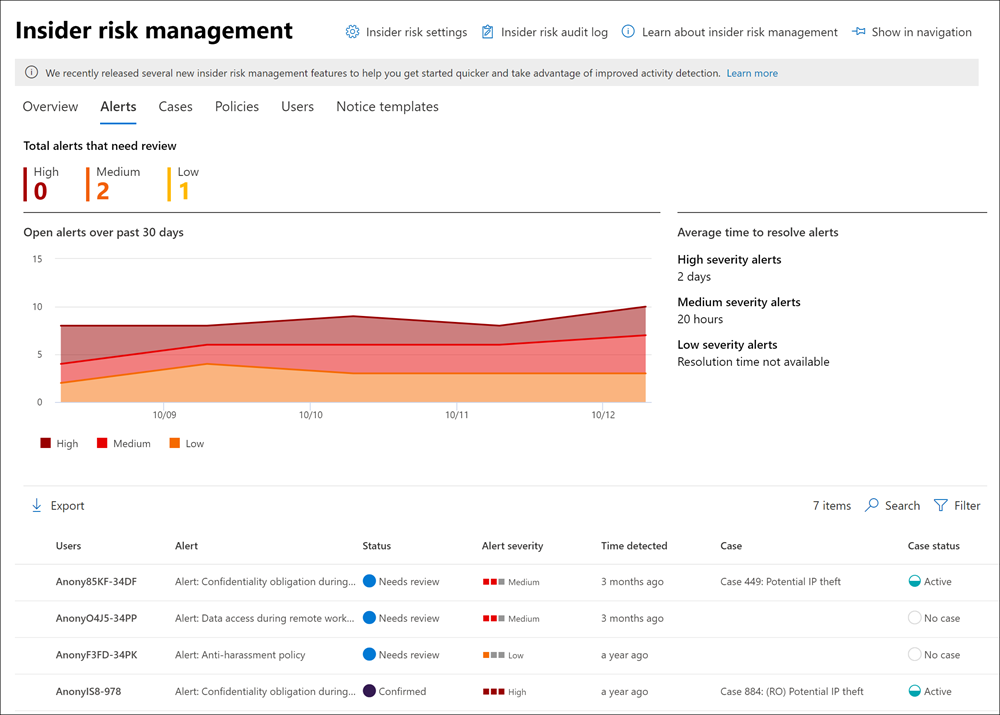

# Información sobre la administración de riesgos de insider en Microsoft 365Learn about insider risk management in Microsoft 365

La administración de riesgos de Insider es una solución de cumplimiento en Microsoft 365 que ayuda a minimizar los riesgos internos al permitirle detectar, investigar y actuar sobre actividades malintencionadas e involuntarias en su organización.Insider risk management is a compliance solution in Microsoft 365 that helps minimize internal risks by enabling you to detect, investigate, and act on malicious and inadvertent activities in your organization. Las directivas de riesgo de Insider permiten definir los tipos de riesgos que se deben identificar y detectar en la organización, como actuar en casos y escalar casos a exhibición de documentos electrónicos avanzada de Microsoft si es necesario.Insider risk policies allow you to define the types of risks to identify and detect in your organization, including acting on cases and escalating cases to Microsoft Advanced eDiscovery if needed. Los analistas de riesgos de la organización pueden tomar rápidamente las acciones adecuadas para asegurarse de que los usuarios cumplen con los estándares de cumplimiento de la organización.Risk analysts in your organization can quickly take appropriate actions to make sure users are compliant with your organization's compliance standards.

Vea el vídeo siguiente para obtener información sobre cómo la administración de riesgos de insider puede ayudar a su organización a prevenir, detectar y contener riesgos al priorizar los valores de la organización, la cultura y la experiencia del usuario:Watch the video below to learn how insider risk management can help your organization prevent, detect, and contain risks while prioritizing your organization values, culture, and user experience:
 
 
>[!VIDEO https://www.microsoft.com/videoplayer/embed/RE4j9CN]

## Puntos de dolor de riesgo modernosModern risk pain points

La administración y minimización de riesgos en la organización comienza por comprender los tipos de riesgos que se encuentran en el lugar de trabajo moderno.Managing and minimizing risk in your organization starts with understanding the types of risks found in the modern workplace. Algunos riesgos se controlan por eventos externos y factores que están fuera del control directo.Some risks are driven by external events and factors that are outside of direct control. Otros riesgos se deben a eventos internos y actividades de usuario que se pueden minimizar y evitar.Other risks are driven by internal events and user activities that can be minimized and avoided. Algunos ejemplos son riesgos de comportamientos y acciones ilegales, inapropiados, no autorizados o no éticos por parte de los usuarios de su organización.Some examples are risks from illegal, inappropriate, unauthorized, or unethical behavior and actions by users in your organization. Estos comportamientos incluyen una amplia gama de riesgos internos de los usuarios:These behaviors include a broad range of internal risks from users:

- Pérdidas de datos confidenciales y derrame de datosLeaks of sensitive data and data spillage
- Infracciones de confidencialidadConfidentiality violations
- Robo de propiedad intelectual (IP)Intellectual property (IP) theft
- FraudeFraud
- Operaciones de InsiderInsider trading
- Infracciones de cumplimiento normativoRegulatory compliance violations

Los usuarios en el lugar de trabajo moderno tienen acceso para crear, administrar y compartir datos en un amplio espectro de plataformas y servicios.Users in the modern workplace have access to create, manage, and share data across a broad spectrum of platforms and services. En la mayoría de los casos, las organizaciones tienen recursos y herramientas limitados para identificar y mitigar los riesgos de toda la organización, al tiempo que también se reúnen con los estándares de privacidad de los usuarios.In most cases, organizations have limited resources and tools to identify and mitigate organization-wide risks while also meeting user privacy standards.

La administración de riesgos de Insider usa toda la amplitud del servicio y los indicadores de terceros para ayudarle a identificar, recortar y actuar rápidamente en la actividad de riesgo.Insider risk management uses the full breadth of service and 3rd-party indicators to help you quickly identify, triage, and act on risk activity. Al usar registros de Microsoft 365 y Microsoft Graph, la administración de riesgos de insider permite definir directivas específicas para identificar indicadores de riesgo.By using logs from Microsoft 365 and Microsoft Graph, insider risk management allows you to define specific policies to identify risk indicators. Estas directivas permiten identificar actividades arriesgadas y actuar para mitigar estos riesgos.These policies allow you to identify risky activities and to act to mitigate these risks.

La administración de riesgos de Insider se centra en los siguientes principios:Insider risk management is centered around the following principles:

- **Transparencia: equilibra** la privacidad del usuario frente al riesgo de la organización con la arquitectura de privacidad por diseño.**Transparency**: Balance user privacy versus organization risk with privacy-by-design architecture.
- **Configurable:** directivas configurables basadas en grupos industriales, geográficos y empresariales.**Configurable**: Configurable policies based on industry, geographical, and business groups.
- **Integrado:** flujo de trabajo integrado en las soluciones de cumplimiento de Microsoft 365.**Integrated**: Integrated workflow across Microsoft 365 compliance solutions.
- **Actionable:** proporciona información para habilitar las notificaciones de revisor, las investigaciones de datos y las investigaciones de usuario.**Actionable**: Provides insights to enable reviewer notifications, data investigations, and user investigations.

## Identificación de posibles riesgos con análisis (versión preliminar)Identifying potential risks with analytics (preview)

El análisis de riesgos de Insider le permite realizar una evaluación de los posibles riesgos de insider en su organización sin configurar directivas de riesgo de insider.Insider risk analytics enables you to conduct an evaluation of potential insider risks in your organization without configuring any insider risk policies. Esta evaluación puede ayudar a su organización a identificar posibles áreas de mayor riesgo para el usuario y ayudar a determinar el tipo y el ámbito de las directivas de administración de riesgos internas que puede considerar la configuración.This evaluation can help your organization identify potential areas of higher user risk and help determine the type and scope of insider risk management policies you may consider configuring. Esta evaluación también puede ayudarle a determinar las necesidades de licencias adicionales o la optimización futura de las directivas de riesgos internas existentes.This evaluation may also help you determine needs for additional licensing or future optimization of existing insider risk policies.

Para obtener más información sobre el análisis de riesgos de insider, consulte Configuración de administración de riesgos [de Insider: Analytics](insider-risk-management-settings.md#analytics-preview).To learn more about insider risk analytics, see [Insider risk management settings: Analytics](insider-risk-management-settings.md#analytics-preview).

## Flujo de trabajoWorkflow

El flujo de trabajo de administración de riesgos internos le ayuda a identificar, investigar y tomar medidas para abordar los riesgos internos de la organización.The insider risk management workflow helps you identify, investigate, and take action to address internal risks in your organization. Con plantillas de directiva centradas, señalización de actividad completa en todo el servicio de Microsoft 365 y herramientas de administración de casos y alertas, puede usar información útil para identificar y actuar rápidamente en comportamientos de riesgo.With focused policy templates, comprehensive activity signaling across the Microsoft 365 service, and alert and case management tools, you can use actionable insights to quickly identify and act on risky behavior.

La identificación y resolución de actividades de riesgo internas y problemas de cumplimiento con la administración de riesgos internos en Microsoft 365 usa el siguiente flujo de trabajo:Identifying and resolving internal risk activities and compliance issues with insider risk management in Microsoft 365 uses the following workflow:

### DirectivasPolicies

[Las directivas de administración](insider-risk-management-policies.md) de riesgos de Insider se crean con plantillas predefinidas y condiciones de directiva que definen qué eventos desencadenantes e indicadores de riesgo se examinan en su organización.[Insider risk management policies](insider-risk-management-policies.md) are created using pre-defined templates and policy conditions that define what triggering events and risk indicators are examined in your organization. Estas condiciones incluyen cómo se usan los indicadores de riesgo para las alertas, qué usuarios se incluyen en la directiva, qué servicios se priorizan y el período de tiempo de supervisión.These conditions include how risk indicators are used for alerts, what users are included in the policy, which services are prioritized, and the monitoring time period.

Puede seleccionar entre las siguientes plantillas de directiva para empezar rápidamente con la administración de riesgos de insider:You can select from the following policy templates to quickly get started with insider risk management:

- [Robo de datos por parte de los usuarios que salenData theft by departing users](insider-risk-management-policies.md#data-theft-by-departing-users)
- [Pérdidas de datos generalesGeneral data leaks](insider-risk-management-policies.md#general-data-leaks)
- [Pérdidas de datos por usuarios prioritarios (versión preliminar)Data leaks by priority users (preview)](insider-risk-management-policies.md#data-leaks-by-priority-users-preview)
- [Pérdidas de datos por usuarios inconformes (versión preliminar)Data leaks by disgruntled users (preview)](insider-risk-management-policies.md#data-leaks-by-disgruntled-users-preview)
- [Infracciones de directivas de seguridad generales (versión preliminar)General security policy violations (preview)](insider-risk-management-policies.md#general-security-policy-violations-preview)
- [Infracciones de directivas de seguridad al salir de los usuarios (versión preliminar)Security policy violations by departing users (preview)](insider-risk-management-policies.md#security-policy-violations-by-departing-users-preview)
- [Infracciones de directivas de seguridad por parte de usuarios prioritarios (versión preliminar)Security policy violations by priority users (preview)](insider-risk-management-policies.md#security-policy-violations-by-priority-users-preview)
- [Infracciones de directivas de seguridad por parte de usuarios inconformes (versión preliminar)Security policy violations by disgruntled users (preview)](insider-risk-management-policies.md#security-policy-violations-by-disgruntled-users-preview)

### AlertasAlerts

Las alertas se generan automáticamente mediante indicadores de riesgo que coinciden con las condiciones de la directiva y se muestran en el panel [Alertas.](insider-risk-management-alerts.md)Alerts are automatically generated by risk indicators that match policy conditions and are displayed in the [Alerts dashboard](insider-risk-management-alerts.md). Este panel permite una vista rápida de todas las alertas que necesitan revisión, alertas abiertas con el tiempo y estadísticas de alertas para su organización.This dashboard enables a quick view of all alerts needing review, open alerts over time, and alert statistics for your organization. Todas las alertas de directiva se muestran con la siguiente información para ayudarle a identificar rápidamente el estado de las alertas existentes y las alertas nuevas que necesitan acción:All policy alerts are displayed with the following information to help you quickly identify the status of existing alerts and new alerts that need action:

- EstadoStatus
- SeveritySeverity
- Tiempo detectadoTime detected
- CaseCase
- Estado del casoCase status

### TriageTriage

Las nuevas actividades de usuario que necesitan investigación generan automáticamente alertas a las que se les asigna el *estado Necesita revisión.*New user activities that need investigation automatically generate alerts that are assigned a *Needs review* status. Los revisores pueden identificar y revisar, evaluar y evaluar rápidamente estas alertas.Reviewers can quickly identify and review, evaluate, and triage these alerts.

Las alertas se resuelven abriendo un nuevo caso, asignando la alerta a un caso existente o descartando la alerta.Alerts are resolved by opening a new case, assigning the alert to an existing case, or dismissing the alert. Con los filtros de alerta, es fácil identificar rápidamente las alertas por estado, gravedad o tiempo detectados.Using alert filters, it's easy to quickly identify alerts by status, severity, or time detected. Como parte del proceso de evaluación, los revisores pueden ver los detalles de alerta de las actividades identificadas por la directiva, ver la actividad de usuario asociada con la coincidencia de directiva, ver la gravedad de la alerta y revisar la información del perfil de usuario.As part of the triage process, reviewers can view alert details for the activities identified by the policy, view user activity associated with the policy match, see the severity of the alert, and review user profile information.

### InvestigaciónInvestigate

[Los casos](insider-risk-management-cases.md) se crean para alertas que requieren una revisión e investigación más profundas de los detalles y circunstancias de la actividad en torno a la coincidencia de directiva.[Cases](insider-risk-management-cases.md) are created for alerts that require deeper review and investigation of the activity details and circumstances around the policy match. El **panel Caso proporciona** una vista general de todos los casos activos, los casos abiertos con el tiempo y las estadísticas de casos de la organización.The **Case dashboard** provides an all-up view of all active cases, open cases over time, and case statistics for your organization. Los revisores pueden filtrar rápidamente los casos por estado, la fecha en que se abrió el caso y la fecha en que se actualizó por última vez el caso.Reviewers can quickly filter cases by status, the date the case was opened, and the date the case was last updated.

Al seleccionar un caso en el panel de casos, se abre el caso para su investigación y revisión.Selecting a case on the case dashboard opens the case for investigation and review. Este paso es el corazón del flujo de trabajo de administración de riesgos de insider.This step is the heart of the insider risk management workflow. Esta área es donde las actividades de riesgo, las condiciones de directiva, los detalles de alertas y los detalles del usuario se sintetizan en una vista integrada para revisores.This area is where risk activities, policy conditions, alerts details, and user details are synthesized into an integrated view for reviewers. Las herramientas de investigación principales en esta área son:The primary investigation tools in this area are:

- **Actividad de usuario:** la actividad del usuario se muestra automáticamente en un gráfico interactivo que traza las actividades con el tiempo y por nivel de riesgo para las actividades de riesgo actuales o pasadas.**User activity**: User activity is automatically displayed in an interactive chart that plots activities over time and by risk level for current or past risk activities. Los revisores pueden filtrar y ver rápidamente todo el historial de riesgos para el usuario y profundizar en actividades específicas para obtener más detalles.Reviewers can quickly filter and view the entire risk history for the user and drill into specific activities for more details.
- **Explorador de contenido:** todos los archivos de datos y mensajes de correo electrónico asociados con actividades de alerta se capturan y muestran automáticamente en el explorador de contenido.**Content explorer**: All data files and email messages associated with alert activities are automatically captured and displayed in the Content explorer. Los revisores pueden filtrar y ver archivos y mensajes por origen de datos, tipo de archivo, etiquetas, conversación y muchos más atributos.Reviewers can filter and view files and messages by data source, file type, tags, conversation, and many more attributes.
- **Notas del caso:** los revisores pueden proporcionar notas para un caso en la sección Notas del caso.**Case notes**: Reviewers can provide notes for a case in the Case Notes section. Esta lista consolida todas las notas en una vista central e incluye información de revisor y fecha enviada.This list consolidates all notes in a central view and include reviewer and date submitted information.

Además, el nuevo registro de [auditoría (versión preliminar)](insider-risk-management-audit-log.md) permite mantenerse informado de las acciones realizadas en las características de administración de riesgos internas.Additionally, the new [Audit log (preview)](insider-risk-management-audit-log.md) enables you to stay informed of the actions that were taken on insider risk management features. Este recurso permite una revisión independiente de las acciones realizadas por los usuarios asignados a uno o varios grupos de roles de administración de riesgos insider.This resource allows an independent review of the actions taken by users assigned to one or more insider risk management role groups.

### AcciónAction

Una vez que se investigan los casos, los revisores pueden actuar rápidamente para resolver el caso o colaborar con otras partes interesadas en riesgos de la organización.After cases are investigated, reviewers can quickly act to resolve the case or collaborate with other risk stakeholders in your organization. Si los usuarios infringen accidentalmente o inadvertidamente las condiciones de la directiva, se puede enviar un aviso simple al usuario desde plantillas de aviso que puede personalizar para su organización.If users accidentally or inadvertently violate policy conditions, a simple reminder notice can be sent to the user from notice templates you can customize for your organization. Estos avisos pueden servir como recordatorios sencillos o pueden dirigir al usuario a cursos de actualización o instrucciones para ayudar a evitar comportamientos de riesgo futuros.These notices may serve as simple reminders or may direct the user to refresher training or guidance to help prevent future risky behavior. Para obtener más información, vea Plantillas de aviso de [administración de riesgos de Insider](insider-risk-management-notices.md).For more information, see [Insider risk management notice templates](insider-risk-management-notices.md).

En las situaciones más graves, es posible que deba compartir la información de casos de administración de riesgos confidenciales con otros revisores o servicios de su organización.In the more serious situations, you may need to share the insider risk management case information with other reviewers or services in your organization. La administración de riesgos de Insider está estrechamente integrada con otras soluciones de cumplimiento de Microsoft 365 para ayudarle con la resolución de riesgos de un extremo a otro.Insider risk management is tightly integrated with other Microsoft 365 compliance solutions to help you with end-to-end risk resolution.

- Exhibición de documentos electrónicos avanzada: el escalado de un caso de investigación permite transferir datos y la administración del caso a **eDiscovery** avanzada en Microsoft 365.**Advanced eDiscovery**: Escalating a case for investigation allows you to transfer data and management of the case to Advanced eDiscovery in Microsoft 365. La exhibición de documentos electrónicos avanzada proporciona un flujo de trabajo completo para conservar, recopilar, revisar, analizar y exportar contenido que responde a las investigaciones internas y externas de la organización.Advanced eDiscovery provides an end-to-end workflow to preserve, collect, review, analyze, and export content that's responsive to your organization's internal and external investigations. Permite a los equipos legales administrar todo el flujo de trabajo de notificación de retención legal.It allows legal teams to manage the entire legal hold notification workflow. Para obtener más información sobre los casos de exhibición de documentos electrónicos avanzados, vea [Overview of Advanced eDiscovery in Microsoft 365](overview-ediscovery-20.md).To learn more about Advanced eDiscovery cases, see [Overview of Advanced eDiscovery in Microsoft 365](overview-ediscovery-20.md).
- **ServiceNow (versión preliminar):** ServiceNow es una popular plataforma informática en la nube que ayuda a las organizaciones a administrar flujos de trabajo digitales para operaciones empresariales.**ServiceNow (preview)**: ServiceNow is a popular cloud computing platform that helps organizations manage digital workflows for enterprise operations. La administración de riesgos de Insider admite el uso compartido de alertas de casos con su servicio ServiceNow y le permite crear incidentes y cambiar solicitudes relacionadas con casos de riesgo de insider individuales.Insider risk management supports sharing case alerts with your ServiceNow service and allows you to create incidents and change requests related to individual insider risk cases. Para obtener más información sobre cómo compartir información de alertas con ServiceNow, vea [Compartir un caso con ServiceNow](insider-risk-management-cases.md#share-the-case).To learn more about sharing alert information with ServiceNow, see [Share a case with ServiceNow](insider-risk-management-cases.md#share-the-case).
- Integración de api de administración de **Office 365 (versión preliminar):** la administración de riesgos de Insider admite la exportación de información de alertas a los servicios de administración de eventos y de información de seguridad (SIEM) a través de las API de administración de Office 365.**Office 365 Management APIs integration (preview)**: Insider risk management supports exporting alert information to security information and event management (SIEM) services via the Office 365 Management APIs. Tener acceso a la información de alertas en la plataforma lo mejor que se adapta a los procesos de riesgo de su organización le ofrece más flexibilidad en cómo actuar en las actividades de riesgo.Having access to alert information in the platform the best fits your organization's risk processes gives you more flexibility in how to act on risk activities. Para obtener más información sobre cómo exportar información de alertas con api de administración de Office 365, vea [Exportar alertas](insider-risk-management-settings.md#export-alerts-preview).To learn more about exporting alert information with Office 365 Management APIs, see [Export alerts](insider-risk-management-settings.md#export-alerts-preview).

>[!NOTE]
>Gracias por sus comentarios y soporte técnico durante la vista previa del conector servicenow.Thank you for your feedback and support during the preview of the ServiceNow connector. El 30 de noviembre de 2020 hemos decidido finalizar la versión preliminar del conector ServiceNow y dejar de admitir la administración de riesgos de insider.We've decided to end the preview of ServiceNow connector and discontinue support in insider risk management on November 30, 2020. Estamos evaluando activamente métodos alternativos para proporcionar a los clientes la integración de ServiceNow en la administración de riesgos de insider.We are actively evaluating alternative methods to provide customers with ServiceNow integration in insider risk management.

## EscenariosScenarios

La administración de riesgos de Insider puede ayudarle a detectar, investigar y tomar medidas para mitigar los riesgos internos de su organización en varios escenarios comunes:Insider risk management can help you detect, investigate, and take action to mitigate internal risks in your organization in several common scenarios:

### Robo de datos por parte de los usuarios que salenData theft by departing users

Cuando los usuarios abandonan una organización, ya sea de forma voluntaria o como resultado de la terminación, a menudo hay preocupaciones legítimas de que los datos de la empresa, el cliente y el usuario están en riesgo.When users leave an organization, either voluntarily or as the result of termination, there is often legitimate concerns that company, customer, and user data are at risk. Los usuarios pueden asumir inocentemente que los datos del proyecto no son propietarios, o pueden verse tentados a tomar datos de la compañía para obtener ganancias personales y infringiendo la directiva de la compañía y los estándares legales.Users may innocently assume that project data isn't proprietary, or they may be tempted to take company data for personal gain and in violation of company policy and legal standards. Las directivas de administración de riesgos de Insider que usan la [plantilla de](insider-risk-management-policies.md#policy-templates) directiva Robo de datos al salir de los usuarios detectan automáticamente las actividades asociadas normalmente a este tipo de robo.Insider risk management policies that use the [Data theft by departing users](insider-risk-management-policies.md#policy-templates) policy template automatically detect activities typically associated with this type of theft. Con esta directiva, recibirá automáticamente alertas de actividades sospechosas asociadas con el robo de datos al salir de los usuarios para que pueda realizar las acciones de investigación adecuadas.With this policy, you'll automatically receive alerts for suspicious activities associated with data theft by departing users so you can take appropriate investigative actions. Es necesario configurar [un conector de RRHH de Microsoft 365](import-hr-data.md) para su organización para esta plantilla de directiva.Configuring a [Microsoft 365 HR connector](import-hr-data.md) for your organization is required for this policy template.

### Filtración intencionada o no intencionada de información confidencial o confidencialIntentional or unintentional leak of sensitive or confidential information

En la mayoría de los casos, los usuarios intentan controlar correctamente la información confidencial o confidencial.In most cases, users try their best to properly handle sensitive or confidential information. Pero en ocasiones, los usuarios pueden cometer errores y la información se comparte accidentalmente fuera de la organización o en violación de las directivas de protección de la información.But occasionally users may make mistakes and information is accidentally shared outside your organization or in violation of your information protection policies. En otras circunstancias, los usuarios pueden filtrar intencionadamente o compartir información confidencial y confidencial con intenciones malintencionadas y con potencial ganancia personal.In other circumstances, users may intentionally leak or share sensitive and confidential information with malicious intent and for potential personal gain. Las directivas de administración de riesgos insider creadas con las siguientes plantillas de directiva de pérdida de datos detectan automáticamente actividades asociadas normalmente con el uso compartido de información confidencial o confidencial:Insider risk management policies created using the following Data leaks policy templates automatically detect activities typically associated with sharing sensitive or confidential information:

- [Pérdidas de datos generalesGeneral data leaks](insider-risk-management-policies.md#general-data-leaks)
- [Pérdidas de datos por usuarios prioritarios (versión preliminar)Data leaks by priority users (preview)](insider-risk-management-policies.md#data-leaks-by-priority-users-preview)
- [Pérdidas de datos por usuarios inconformes (versión preliminar)Data leaks by disgruntled users (preview)](insider-risk-management-policies.md#data-leaks-by-disgruntled-users-preview)

## Infracciones intencionadas o involuntarias de directivas de seguridad (versión preliminar)Intentional or unintentional security policy violations (preview)

Los usuarios suelen tener un gran grado de control al administrar sus dispositivos en el lugar de trabajo moderno.Users typically have a large degree of control when managing their devices in the modern workplace. Este control puede incluir permisos para instalar o desinstalar aplicaciones necesarias en el rendimiento de sus funciones o la capacidad de deshabilitar temporalmente las características de seguridad del dispositivo.This control may include permissions to install or uninstall applications needed in the performance of their duties or the ability to temporarily disable device security features. Independientemente de si esta actividad es involuntaria, accidental o malintencionada, esta conducta puede suponer un riesgo para la organización y es importante identificar y actuar para minimizar.Whether this activity is inadvertent, accidental, or malicious, this conduct can pose risk to your organization and is important to identify and act to minimize. Para ayudar a identificar estas actividades de seguridad de riesgo, las siguientes plantillas de infracción de directivas de seguridad de administración de riesgos insider obtienen indicadores de riesgo de seguridad y usan Alertas de Microsoft Defender para endpoints para proporcionar información sobre actividades relacionadas con la seguridad:To help identity these risky security activities, the following insider risk management security policy violation templates scores security risk indicators and uses Microsoft Defender for Endpoint alerts to provide insights for security-related activities:

- [Infracciones de directivas de seguridad generales (versión preliminar)General security policy violations (preview)](insider-risk-management-policies.md#general-security-policy-violations-preview)
- [Infracciones de directivas de seguridad al salir de los usuarios (versión preliminar)Security policy violations by departing users (preview)](insider-risk-management-policies.md#security-policy-violations-by-departing-users-preview)
- [Infracciones de directivas de seguridad por parte de usuarios prioritarios (versión preliminar)Security policy violations by priority users (preview)](insider-risk-management-policies.md#security-policy-violations-by-priority-users-preview)
- [Infracciones de directivas de seguridad por parte de usuarios inconformes (versión preliminar)Security policy violations by disgruntled users (preview)](insider-risk-management-policies.md#security-policy-violations-by-disgruntled-users-preview)

## Directivas para usuarios en función de la posición, el nivel de acceso o el historial de riesgos (versión preliminar)Policies for users based on position, access level, or risk history (preview)

Los usuarios de la organización pueden tener diferentes niveles de riesgo según su posición, nivel de acceso a información confidencial o historial de riesgos.Users in your organization may have different levels of risk depending on their position, level of access to sensitive information, or risk history. Esta estructura puede incluir miembros del equipo de liderazgo ejecutivo de su organización, administradores de TI con amplios privilegios de acceso a la red y datos, o usuarios con un historial pasado de actividades arriesgadas.This structure may include members of your organization's executive leadership team, IT administrators that have extensive data and network access privileges, or users with a past history of risky activities. En estas circunstancias, una inspección más estrecha y una puntuación de riesgos más agresiva son importantes para ayudar a las alertas de superficie para la investigación y la acción rápida.In these circumstances, closer inspection and more aggressive risk scoring are important to help surface alerts for investigation and quick action. Para ayudar a identificar actividades de riesgo para este tipo de usuarios, puede crear grupos de usuarios prioritarios y crear directivas a partir de las siguientes plantillas de directiva:To help identify risky activities for these types of users, you can create priority user groups and create policies from the following policy templates:

- [Infracciones de directivas de seguridad por parte de usuarios prioritarios (versión preliminar)Security policy violations by priority users (preview)](insider-risk-management-policies.md#security-policy-violations-by-priority-users-preview)
- [Pérdidas de datos por usuarios prioritarios (versión preliminar)Data leaks by priority users (preview)](insider-risk-management-policies.md#data-leaks-by-priority-users-preview)

## Acciones y comportamientos de usuarios inconformes (versión preliminar)Actions and behaviors by disgruntled users (preview)

El empleo subraya que los eventos pueden afectar al comportamiento de los usuarios de varias maneras relacionadas con los riesgos de insider.Employment stresses events can impact user behavior in several ways that relate to insider risks. Estos estresores pueden ser una revisión de rendimiento deficiente, una degradación de posición o la colocación del usuario en un plan de revisión de rendimiento.These stressors may be a poor performance review, a position demotion, or the user being placement on a performance review plan. Aunque la mayoría de los usuarios no responden malintencionadamente a estos eventos, el estrés de estas acciones puede provocar que algunos usuarios realicen acciones que normalmente no consideren en circunstancias normales.Though most users do not respond maliciously to these events, the stress of these actions may result in some users to take actions they may not normally consider during normal circumstances. Para ayudar a identificar estas actividades de riesgo, las siguientes plantillas de directiva de administración de riesgos de insider usan el conector de Recursos humanos de Microsoft 365 y comienzan a puntuar indicadores de riesgo relacionados con comportamientos que pueden producirse cerca de eventos de estrés laboral:To help identity these types risky activities, the following insider risk management policy templates use the Microsoft 365 HR connector and starts scoring risk indicators relating to behaviors that may occur near employment stressor events:

- [Pérdidas de datos por usuarios inconformes (versión preliminar)Data leaks by disgruntled users (preview)](insider-risk-management-policies.md#data-leaks-by-disgruntled-users-preview)
- [Infracciones de directivas de seguridad por parte de usuarios inconformes (versión preliminar)Security policy violations by disgruntled users (preview)](insider-risk-management-policies.md#security-policy-violations-by-disgruntled-users-preview)

## ¿Está listo para empezar?Ready to get started?

- Consulte [Plan for insider risk management](insider-risk-management-plan.md) para obtener información sobre cómo prepararse para habilitar las directivas de administración de riesgos de insider en su organización.See [Plan for insider risk management](insider-risk-management-plan.md) for how to prepare to enable insider risk management policies in your organization.
- Consulta Introducción a las opciones de administración de riesgos de [insider](insider-risk-management-settings.md) para configurar la configuración global para las directivas de riesgo de insider.See [Get started with insider risk management settings](insider-risk-management-settings.md) to configure global settings for insider risk policies.
- Consulte [Introducción a la administración de riesgos de insider](insider-risk-management-configure.md) para configurar requisitos previos, crear directivas y empezar a recibir alertas.See [Get started with insider risk management](insider-risk-management-configure.md) to configure prerequisites, create policies, and start receiving alerts.
