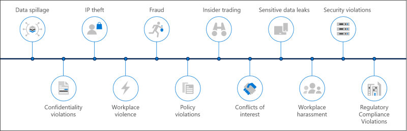

# Soluciones de riesgos internos en Microsoft 365Insider risk solutions in Microsoft 365

Los riesgos de Insider son una de las principales preocupaciones de los profesionales de seguridad y cumplimiento en el lugar de trabajo moderno.Insider risks are one of the top concerns of security and compliance professionals in the modern workplace. Los estudios de la industria han demostrado que los riesgos de Insiders se suelen asociar con actividades o eventos de usuario específicos.Industry studies have shown that insider risks are often associated with specific user events or activities. Proteger la organización frente a estos riesgos puede ser difícil de identificar y difícil de mitigar.Protecting your organization against these risks can be challenging to identify and difficult to mitigate. Los riesgos de Insider incluyen vulnerabilidades en varias áreas y pueden ocasionar problemas importantes para la organización, desde la pérdida de propiedad intelectual hasta el acoso del espacio de trabajo, entre otras cosas.Insider risks include vulnerabilities in a variety of areas and can cause major problems for your organization, ranging from the loss of intellectual property to workplace harassment, and more. La siguiente figura describe los riesgos comunes de Insider:The following figure outlines common insider risks:

Las características de prevención de riesgos de Microsoft 365 están diseñadas y integradas para los productos y soluciones de los riesgos de Insider.Microsoft 365 risk prevention features are designed and built-in to our insider risk products and solutions. Estas soluciones funcionan de manera conjunta y usan los indicadores avanzados de servicio y de terceros para ayudarle a identificar, clasificar y actuar con rapidez en la actividad de riesgos.These solutions work together and use advanced service and 3rd-party indicators to help you quickly identify, triage, and act on risk activity. La mayoría de las soluciones ofrecen un flujo de trabajo exhaustivo de detección, alerta y corrección para que los analistas de datos y los investigadores puedan usar para actuar con rapidez y minimizar estos riesgos.Most solutions offer a comprehensive detection, alert, and remediation workflow for your data analysts and investigators to use to quickly act on and minimize these risks.

| | AsociadosRisks | Cumplimiento de comunicacionesCommunication compliance | Administración de riesgos internosInsider risk management | Barreras de la informaciónInformation barriers | Administración del acceso con privilegiosPrivileged access management |
| :---- | :-------- | :--------------------------- | :-------------------------- |:-------------------------| :--------------------------------|
| | Derrame de datosData spillage |  |  |  |  |
| | Violaciones de confidencialidadConfidentiality violations |  |  |  |  |
| | Robo de IPIP theft |  |  |  |  |
| | Violencia del lugar de trabajoWorkplace violence |  |  |  |  |
| | EstafaFraud |  |  |  |  |
| | Infracciones de directivasPolicy violations |  |  |  |  |
| | Comercio de InsidersInsider trading |  |  |  |  |
| | Conflictos de interesesConflicts of interest |  |  |  |  |
| | Pérdidas de datos confidencialesSensitive data leaks |  |  |  |  |
| | Acoso del trabajoWorkplace harassment |  |  |  |  |
| | Violaciones de seguridadSecurity violations |  |  |  |  |
| | Violaciones de cumplimiento de normativasRegulatory compliance violations |  |  |  |  |

## Soluciones de riesgos internos de Microsoft 365Microsoft 365 insider risk solutions

Para ayudar a proteger su organización frente a los riesgos de Insider, use estas funciones y características de Microsoft 365.To help protect your organization against insider risks, use these Microsoft 365 capabilities and features.

| Solución/capacidadesSolution/capabilities | DescriptionDescription | LicenciasLicensing |
| :------------------------ | :-------------- | :------------ |
| Cumplimiento de comunicacionesCommunication compliance | El cumplimiento de la comunicación ayuda a minimizar los riesgos de comunicación al ayudarle a detectar, capturar y actuar en mensajes inapropiados de la organización.Communication compliance helps minimize communication risks by helping you detect, capture, and act on inappropriate messages in your organization. | Suscripción a Microsoft 365 E5 (versión de pago o de prueba)Microsoft 365 E5 subscription (paid or trial version)   Suscripción a Microsoft 365 E3 + complemento de cumplimiento de Microsoft 365 E5Microsoft 365 E3 subscription + the Microsoft 365 E5 Compliance add-on   Suscripción a Microsoft 365 E3 + complemento Microsoft 365 E5 del servicio de administración de riesgos de InsiderMicrosoft 365 E3 subscription + the Microsoft 365 E5 Insider Risk Management add-on   Suscripción a Microsoft 365 A5 (versión de pago o de prueba)Microsoft 365 A5 subscription (paid or trial version)   Suscripción a Microsoft 365 a3 + complemento de cumplimiento A5 de Microsoft 365Microsoft 365 A3 subscription + the Microsoft 365 A5 Compliance add-on   Suscripción a Microsoft 365 a3 + complemento de administración de riesgos de la A5 del Insider de Microsoft 365Microsoft 365 A3 subscription + the Microsoft 365 A5 Insider Risk Management add-on   Suscripción a Microsoft 365 G5 (versión de pago o de prueba)Microsoft 365 G5 subscription (paid or trial version)   Suscripción a Microsoft 365 G5 + complemento de cumplimiento de Microsoft 365 G5Microsoft 365 G5 subscription + the Microsoft 365 G5 Compliance add-on   Suscripción a Microsoft 365 G5 + complemento de administración de riesgos de Insider de Microsoft 365 G5Microsoft 365 G5 subscription + the Microsoft 365 G5 Insider Risk Management add-on   Suscripción a Office 365 Enterprise E5 (versión de pago o de prueba)Office 365 Enterprise E5 subscription (paid or trial version)   Suscripción a Office 365 A5 (versión de pago o de prueba)Office 365 A5 subscription (paid or trial version)   Office 365 Enterprise E3 subscription + el complemento Office 365 Advanced Compliance (ya no está disponible para las suscripciones nuevas)Office 365 Enterprise E3 subscription + the Office 365 Advanced Compliance add-on (no longer available for new subscriptions) |
| Administración de riesgos internosInsider risk management | La administración de riesgos de Insiders ayuda a minimizar los riesgos internos al permitirle detectar, investigar y actuar en actividades malintencionadas e involuntarias en su organización.Insider risk management helps minimize internal risks by enabling you to detect, investigate, and act on malicious and inadvertent activities in your organization. | Suscripción a Microsoft 365 E5 (versión de pago o de prueba) Microsoft 365 E3 subscription + el complemento de cumplimiento de Microsoft 365 E5Microsoft 365 E5 subscription (paid or trial version) Microsoft 365 E3 subscription + the Microsoft 365 E5 Compliance add-on   Suscripción a Microsoft 365 E3 + complemento Microsoft 365 E5 del servicio de administración de riesgos de InsiderMicrosoft 365 E3 subscription + the Microsoft 365 E5 Insider Risk Management add-on   Suscripción a Microsoft 365 A5 (versión de pago o de prueba)Microsoft 365 A5 subscription (paid or trial version)   Suscripción a Microsoft 365 a3 + complemento de cumplimiento A5 de Microsoft 365Microsoft 365 A3 subscription + the Microsoft 365 A5 Compliance add-on   Suscripción a Microsoft 365 a3 + complemento de administración de riesgos de la A5 del Insider de Microsoft 365Microsoft 365 A3 subscription + the Microsoft 365 A5 Insider Risk Management add-on |
| Barreras de informaciónInformation barriers | Las barreras de información le permiten restringir la comunicación y la colaboración entre dos grupos internos para evitar que se produzca un conflicto de intereses en la organización.Information barriers allow you to restrict communication and collaboration between two internal groups to avoid a conflict of interest from occurring in your organization.  | Microsoft 365 E5/A5Microsoft 365 E5/A5   Office 365 E5/A5Office 365 E5/A5   Cumplimiento avanzado de Office 365Office 365 Advanced Compliance   Microsoft 365 cumplimiento E5/A5Microsoft 365 Compliance E5/A5   Administración de riesgos de Insider de Microsoft 365Microsoft 365 Insider Risk Management |
| Administración del acceso con privilegiosPrivileged access management | La administración de acceso con privilegios permite el control de acceso granular a través de tareas de administración de Exchange Online privilegiadas en Office 365.Privileged access management allows granular access control over privileged Exchange Online admin tasks in Office 365. Puede ayudar a proteger a su organización de las infracciones que usan cuentas de administrador con privilegios existentes con acceso permanente a los datos confidenciales o al acceso a las opciones de configuración críticas.It can help protect your organization from breaches that use existing privileged admin accounts with standing access to sensitive data or access to critical configuration settings. | Microsoft 365 E5/A5Microsoft 365 E5/A5   Office 365 E5/A5Office 365 E5/A5   Cumplimiento de Microsoft 365 E5/A5Microsoft 365 E5/A5 Compliance   Microsoft 365 E5/protección y gobernanza de la información A5Microsoft 365 E5/A5 Information Protection and Governance |

## Implementación de soluciones de riesgo para Insider de Microsoft 365Deploy Microsoft 365 insider risk solutions

Para ayudar a proteger su organización frente a los riesgos de Insider, configure e implemente las siguientes soluciones de Microsoft 365:To help protect your organization against insider risks, set up and deploy the following Microsoft 365 solutions:

1. Configurar y crear [directivas de cumplimiento de comunicaciones](communication-compliance-solution-overview.md).Configure and create [communication compliance policies](communication-compliance-solution-overview.md).
2. Configure y cree [directivas de administración de riesgos de Insider](insider-risk-management-solution-overview.md).Configure and create [insider risk management policies](insider-risk-management-solution-overview.md).
3. Opcional: configurar y crear [directivas de barrera de información](information-barriers-solution-overview.md).Optional: Configure and create [information barrier policies](information-barriers-solution-overview.md).
4. Opcional: habilitar y configurar la [Administración del acceso con privilegios](privileged-access-management-solution-overview.md).Optional: Enable and configure [privileged access management](privileged-access-management-solution-overview.md).

## Ilustraciones con ejemplosIllustrations with examples

Para ayudarle a planear una estrategia integrada para implementar las capacidades de los riesgos de Insider de Microsoft 365, descargue el conjunto de ilustraciones *microsoft 365 Information Protection and Compliance* .To help you plan an integrated strategy for implementing Microsoft 365 insider risk capabilities, download the *Microsoft 365 information protection and compliance capabilities* set of illustrations. Para obtener las funcionalidades de riesgo de Insider, vea los temas de ilustración de arquitectura 5-7.For insider risk capabilities, see the architecture illustration topics 5-7. Siéntase libre de adaptar estas ilustraciones para su propio uso.Feel free to adapt these illustrations for your own use.

| ElementoItem | DescripciónDescription |
|:-----|:------------|
|   [Descargar como PDF](https://download.microsoft.com/download/3/a/6/3a6ab1a3-feb0-4ee2-8e77-62415a772e53/m365-compliance-illustrations.pdf) \| [Descargar como Visio](https://download.microsoft.com/download/3/a/6/3a6ab1a3-feb0-4ee2-8e77-62415a772e53/m365-compliance-illustrations.vsdx)  [Download as a PDF](https://download.microsoft.com/download/3/a/6/3a6ab1a3-feb0-4ee2-8e77-62415a772e53/m365-compliance-illustrations.pdf)  \| [Download as a Visio](https://download.microsoft.com/download/3/a/6/3a6ab1a3-feb0-4ee2-8e77-62415a772e53/m365-compliance-illustrations.vsdx)   Actualizado el 2020 de octubreUpdated October 2020|Incluye:Includes: <ul><li>  Protección de la información y prevención de la pérdida de datos de MicrosoftMicrosoft information protection and data loss prevention</li><li>Directivas y etiquetas de retenciónRetention policies and retention labels </li><li>Barreras de informaciónInformation barriers</li><li>Cumplimiento de comunicacionesCommunication compliance</li><li>Administración de riesgos internosInsider risk management</li><li>Ingesta de datos de tercerosThird-party data ingestion</li>|

## AprendizajeTraining

La formación de los administradores y el equipo de cumplimiento en los conceptos básicos de cada solución de riesgo de Insider puede ayudar a su organización a empezar más rápidamente con sus esfuerzos de implementación e implementación.Training your administrators and compliance team in the basics for each insider risk solution can help your organization get started more quickly with your deployment and implementation efforts. 

Microsoft 365 proporciona los siguientes recursos para ayudar a informar y entrenar a los usuarios de su organización:Microsoft 365 provides the following resources to help inform and train these users in your organization:

| Solución/áreaSolution/Area | RecursosResources |
|:------------------|:--------------|
| Administrar el riesgo de Insider en Microsoft 365Manage insider risk in Microsoft 365 |[Ruta de aprendizaje completaComplete learning path](/learn/paths/m365-compliance-insider)   Esta ruta de aprendizaje incluye todos los módulos de soluciones individuales para el cumplimiento de comunicaciones, la administración de riesgos de Insider, las barreras de información y la administración del acceso con privilegios.This learning path includes all the individual solution modules for communication compliance, insider risk management, information barriers, and privileged access management. Seleccione esta ruta de aprendizaje para completar todos los módulos.Select this learning path to complete all the modules. |
| Cumplimiento de comunicacionesCommunication compliance | [Módulo de aprendizaje: preparar el cumplimiento de la comunicación en Microsoft 365Learning module: Prepare communication compliance in Microsoft 365](/learn/modules/m365-compliance-insider-prepare-communication-compliance)   Este módulo le ayuda en los conceptos básicos sobre cómo identificar y corregir infracciones de directivas de código con el cumplimiento de la comunicación, cubrir los requisitos previos necesarios antes de crear directivas de cumplimiento de comunicaciones y obtener información sobre los tipos de plantillas de directivas integradas y predefinidas en el cumplimiento de la comunicación.This module helps you learn the basics on how to identify and remediate code-of-conduct policy violations with communication compliance, cover the prerequisites needed before creating communication compliance policies, and learn about the types of built-in, pre-defined policy templates in communication compliance. |
| Administración de riesgos internosInsider risk management | [Módulo de aprendizaje: administración de riesgos de Insider en Microsoft 365Learning module: Insider risk management in Microsoft 365](/learn/modules/m365-compliance-insider-manage-insider-risk)   Este módulo le ayuda a saber cómo la administración de riesgos de insideros en Microsoft 365 puede ayudar a prevenir, detectar y contener riesgos internos en una organización, obtener información sobre los tipos de plantillas integradas de directiva predefinidas, comprender los requisitos previos básicos necesarios antes de crear directivas de riesgo de Insider y explica los tipos de acciones que puede realizar en casos de administración de riesgos deThis module helps you learn how insider risk management in Microsoft 365 can help prevent, detect, and contain internal risks in an organization, learn about the types of built-in, pre-defined policy templates, understand the basic prerequisites needed before creating insider risk policies, and explains the types of actions you can take on insider risk management cases. |
| Barreras de informaciónInformation barriers | [Módulo de aprendizaje: Planeación de barreras de la informaciónLearning module: Plan for information barriers](/learn/modules/m365-compliance-insider-plan-information-barriers)   Este módulo le ayuda a saber cómo las directivas de barrera de información pueden ayudar a su organización a mantener el cumplimiento de las normas y regulaciones relevantes de la industria, enumera los tipos de situaciones en que las barreras de información serían aplicables, ayuda a explicar el proceso de creación de una directiva de barrera de información y ayuda a solucionar problemas inesperados después de que se hayan implementado obstáculos.This module helps you learn how information barrier policies can help your organization maintain compliance with relevant industry standards and regulations, lists the types of situations when information barriers would be applicable, helps explain the process of creating an information barrier policy, and helps explain how to troubleshoot unexpected issues after information barriers are in place. |
| Administración del acceso con privilegiosPrivileged access management | [Módulo de aprendizaje: implementar la administración de acceso con privilegiosLearning module: Implement privileged access management](/learn/modules/m365-compliance-insider-implement-privileged-access-management)   Este módulo le ayuda a comprender la diferencia entre la administración del acceso privilegiado y la administración de identidades privilegiada, comprender el flujo del proceso de administración de acceso privilegiado y comprender los conceptos básicos sobre cómo configurar y habilitar la administración del acceso privilegiado.This module helps you understand the difference between privileged access management and privileged identity management, understand the privileged access management process flow, and understand the basics of how to configure and enable privileged access management. |
