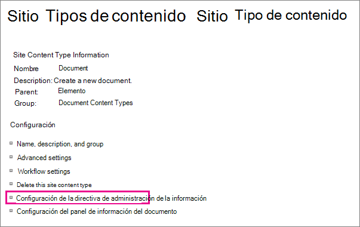

# Introduction to information management policies (Introducción a las directivas de administración de la información)Introduction to information management policies

Una directiva de administración de información es un conjunto de reglas para un tipo de contenido.An information management policy is a set of rules for a type of content. Las directivas de administración de información permiten a las organizaciones controlar y hacer un seguimiento de cosas como cuánto tiempo se mantiene el contenido o qué acciones pueden realizar los usuarios con ese contenido.Information management policies enable organizations to control and track things like how long content is retained or what actions users can take with that content. Las directivas de administración de información pueden ayudar a las organizaciones a cumplir normas legales o gubernamentales, o simplemente pueden forzar la aplicación de procesos empresariales internos.Information management policies can help organizations comply with legal or governmental regulations, or they can simply enforce internal business processes. 
  
Por ejemplo, una organización que debe seguir normativas gubernamentales que requieran demostrar "controles adecuados" de sus estados financieros puede crear una o más directivas de administración de la información que auditen acciones específicas en el proceso de creación y aprobación de todos los documentos relacionados con la presentación de documentos financieros.For example, an organization that must follow government regulations requiring that they demonstrate "adequate controls" of their financial statements might create one or more information management policies that audit specific actions in the authoring and approval process for all documents related to financial filings.
  
Para obtener información sobre procedimientos, vea [Crear y aplicar directivas de administración de información.](create-info-mgmt-policies.md)For how-to information, see [Create and apply information management policies](create-info-mgmt-policies.md).
  
## Características de las directivas de administración de la informaciónFeatures of information management policies

Existen cuatro categorías básicas de características de directiva predefinidas que las organizaciones pueden usar individualmente o en combinación para administrar el contenido y los procesos.There are four basic categories of predefined policy features that organizations can use individually or in combination to manage content and processes. 
  

  
La característica de directiva de auditoría ayuda a las organizaciones a analizar cómo se usan sus sistemas de administración de contenido mediante el registro de eventos y operaciones que se realizan en documentos y elementos de lista.The Auditing policy feature helps organizations analyze how their content management systems are used by logging events and operations that are performed on documents and list items. Puede configurar la característica de directiva de auditoría para registrar eventos como cuando un documento o elemento se edita, ve, desproteje, elimina o cambia sus permisos.You can configure the Auditing policy feature to log events such as when a document or item is edited, viewed, checked in, checked out, deleted, or has its permissions changed. Toda la información de auditoría se almacena en un único registro de auditoría en el servidor y los administradores del sitio pueden ejecutar informes en él.All of the audit information is stored in a single audit log on the server, and site administrators can run reports on it. 
  
La característica de directiva de expiración ayuda a las organizaciones a eliminar o quitar contenido no actualizado de sus sitios de una forma coherente y de seguimiento.The Expiration policy feature helps organizations delete or remove out-of-date content from their sites in a consistent, trackable way. Esto le ayuda a administrar tanto el costo como el riesgo asociado con la conservación de contenido no actualizado.This helps you manage both the cost and risk associated with retaining out-of-date content. Puede configurar una directiva de expiración para especificar que determinados tipos de contenido expiren en una fecha determinada o en un período de tiempo después de crear o modificar por última vez el documento.You can configure an Expiration policy to specify that certain types of content expire on a particular date or within a period of time after the document was created or last modified.
  
Las organizaciones también pueden crear e implementar características de directivas personalizadas para satisfacer necesidades específicas.Organizations can also create and deploy custom policy features to meet specific needs. Por ejemplo, es posible que una organización de fabricación desee definir una directiva de administración de la información para todos los borradores de documentos de especificación de diseño de productos que prohíban a los usuarios imprimir copias de estos documentos en impresoras no seguras.For example, a manufacturing organization might want to define an information management policy for all draft product-design specification documents that prohibits users from printing copies of these documents on nonsecure printers. Para definir este tipo de directiva de administración de información, puede crear e implementar una característica de directiva de restricción de impresión que se puede agregar a la directiva de administración de información relevante para el tipo de contenido de especificación de diseño de producto.To define this kind of information management policy, you can create and deploy a Printing Restriction policy feature that can be added to the relevant information management policy for the product design specification content type.
  
## Ubicaciones para usar una directiva de administración de informaciónLocations to use an information management policy

Para implementar una directiva de administración de información, debe agregarla a una lista, biblioteca o tipo de contenido de un sitio.To implement an information management policy, you must add it to a list, library, or content type in a site. La ubicación donde se crea o agrega una directiva de administración de información afecta a la frecuencia de aplicación de la directiva o a la extensión con la que se puede usar.The location where you create or add an information management policy affects how broadly the policy applies or how broadly it can be used. Puede:You can:
  
 **Crear una directiva de colección de sitios y, a continuación, agregar esta directiva a un tipo de contenido, lista o biblioteca** Puede crear una directiva de colección de sitios en la lista Directivas del sitio de nivel superior de una colección de sitios.**Create a site collection policy and then add this policy to a content type, list, or library** You can create a site collection policy in the Policies list in the top-level site of a site collection. Después de crear una directiva de colección de sitios, puede exportarla para que los administradores de otras colecciones de sitios puedan importarla a su lista de directivas.After you create a site collection policy, you can export it so that administrators of other site collections can import it into their Policies list. La creación de una directiva de colección de sitios exportable permite estandarizar las directivas de administración de la información en todos los sitios de la organización.Creating an exportable site collection policy enables you to standardize the information management policies across the sites in your organization. 
  
Cuando se agrega una directiva de colección de sitios a un tipo de contenido de sitio y se agrega una instancia de ese tipo de contenido de sitio a una lista o biblioteca, el propietario de esa lista o biblioteca no puede modificar la directiva de colección de sitios para la lista o biblioteca.When you add a site collection policy to a site content type, and an instance of that site content type is added to a list or library, the owner of that list or library cannot modify the site collection policy for the list or library. Agregar una directiva de colección de sitios a un tipo de contenido de sitio es una buena forma de garantizar que las directivas de colección de sitios se aplican en cada nivel de la jerarquía de sitios.Adding a site collection policy to a site content type is a good way to ensure that site collection policies are enforced at each level of your site hierarchy.
  

  
 Cree una directiva de administración de información para un tipo de contenido de sitio en la Galería de tipos de contenido del sitio de nivel superior y, a continuación, agregue ese tipo de contenido a una o varias listas **o bibliotecas.** También puede crear una directiva de administración de información directamente para un tipo de contenido de sitio y, a continuación, asociar una instancia de ese tipo de contenido de sitio con varias listas o bibliotecas.**Create an information management policy for a site content type in the top-level site's Site Content Type Gallery, and then add that content type to one or more lists or libraries** You can also create an information management policy directly for a site content type and then associate an instance of that site content type with multiple lists or libraries. Si crea una directiva de administración de información de esta forma, todos los elementos de la colección de sitios de ese tipo de contenido o un tipo de contenido que hereda de ese tipo de contenido tienen la directiva.If you create an information management policy this way, every item in the site collection of that content type or a content type that inherits from that content type has the policy. Sin embargo, si crea una directiva de administración de información directamente para un tipo de contenido de sitio, es más difícil volver a usar esta directiva de administración de información en otras colecciones de sitios, ya que las directivas que se crean de esta forma no se pueden exportar.However, if you create an information management policy directly for a site content type, it is more difficult to reuse this information management policy in other site collections, because policies that are created this way cannot be exported. 
  

  

  
Nota: Para controlar qué directivas se usan en una colección de sitios, los administradores de colecciones de sitios pueden deshabilitar la capacidad de establecer características de directiva directamente en un tipo de contenido.Note To control which policies are used in a site collection, site collection administrators can disable the ability to set policy features directly on a content type. Cuando esta restricción está en vigor, los usuarios que crean tipos de contenido se limitan a seleccionar directivas de la lista directivas de la colección de sitios.When this restriction is in effect, users who create content types are limited to selecting policies from the site collection Policies list.
  
 **Crear una directiva de administración de información para una lista o biblioteca** Si su organización necesita aplicar una directiva de administración de información específica a un conjunto de contenido muy limitado, puede crear una directiva de administración de información que se aplique solo a una lista o biblioteca individuales.**Create an information management policy for a list or library** If your organization needs to apply a specific information management policy to a very limited set of content, you can create an information management policy that applies only to an individual list or library. Este método de creación de una directiva de administración de información es el menos flexible, ya que la directiva se aplica solo a una ubicación y no se puede exportar ni reutilizar para otras ubicaciones.This method of creating an information management policy is the least flexible, because the policy applies only to one location, and it cannot be exported or reused for other locations. Sin embargo, a veces es posible que deba crear directivas de administración de información únicas con aplicabilidad limitada para abordar situaciones específicas.However, sometimes you may need to create unique information management policies with limited applicability to address specific situations. 
  

  
NotasNotes 
  
Puede crear una directiva de administración de información para una lista o biblioteca solo si esa lista o biblioteca no admite varios tipos de contenido.You can create an information management policy for a list or library only if that list or library does not support multiple content types. Si una lista o biblioteca admite varios tipos de contenido, debe definir una directiva de administración de información para cada tipo de contenido de lista individual asociado a esa lista o biblioteca.If a list or library supports multiple content types, you need to define an information management policy for each individual list content type that is associated with that list or library. (Las instancias de un tipo de contenido de sitio que están asociadas a una lista o biblioteca específica se conocen como tipos de contenido de lista).(Instances of a site content type that are associated with a specific list or library are known as list content types.)
  
Para controlar qué directivas se usan en una colección de sitios, los administradores de colecciones de sitios pueden deshabilitar la capacidad de establecer características de directiva directamente en una lista o biblioteca.To control which policies are used in a site collection, site collection administrators can disable the ability to set policy features directly on a list or library. Cuando esta restricción está en vigor, los usuarios que administran listas o bibliotecas se limitan a seleccionar directivas de la lista directivas de la colección de sitios.When this restriction is in effect, users who manage lists or libraries are limited to selecting policies from the site collection Policies list.
  
[Una directiva de administración de información es un conjunto de reglas para un tipo de contenido. Las directivas de administración de la información permiten a las organizaciones controlar y realizar un seguimiento de aspectos como cuánto tiempo se conserva el contenido o qué acciones pueden realizar los usuarios con ese contenido. Las directivas de administración de la información pueden ayudar a las organizaciones a cumplir con normativas legales o gubernamentales, o simplemente pueden aplicar procesos empresariales internos. Por ejemplo, una organización que debe seguir normativas gubernamentales que requieran demostrar "controles adecuados" de sus estados financieros puede crear una o más directivas de administración de la información que auditen acciones específicas en el proceso de creación y aprobación de todos los documentos relacionados con la presentación de documentos financieros. Para obtener información sobre procedimientos, vea Crear y aplicar directivas de administración de información.An information management policy is a set of rules for a type of content. Information management policies enable organizations to control and track things like how long content is retained or what actions users can take with that content. Information management policies can help organizations comply with legal or governmental regulations, or they can simply enforce internal business processes. For example, an organization that must follow government regulations requiring that they demonstrate "adequate controls" of their financial statements might create one or more information management policies that audit specific actions in the authoring and approval process for all documents related to financial filings.For how-to information, see Create and apply information management policies.](intro-to-info-mgmt-policies.md#__top)
  

