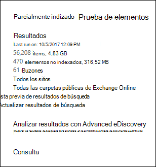
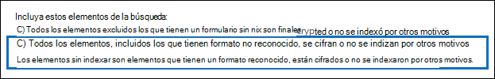

# <a name="investigating-partially-indexed-items-in-ediscovery"></a>Investigar elementos parcialmente indizados en eDiscovery

Una búsqueda de exhibición de documentos electrónicos que se ejecuta desde el centro de cumplimiento de Microsoft 365 incluye automáticamente elementos parcialmente indizados en los resultados de búsqueda estimados al ejecutar una búsqueda. Los elementos parcialmente indizados Exchange elementos de buzón de correo y documentos en SharePoint y OneDrive para la Empresa sitios que, por algún motivo, no se indizaron completamente para la búsqueda. La mayoría de los mensajes de correo electrónico y documentos del sitio se indizan correctamente porque se encuentran dentro de los [límites de indización de los mensajes de correo electrónico](limits-for-content-search.md#indexing-limits-for-email-messages). Sin embargo, algunos elementos pueden superar estos límites de indización y se indizarán parcialmente. Estos son otros motivos por los que los elementos no se pueden indizar para la búsqueda y se devuelven como elementos parcialmente indizados al ejecutar una búsqueda de exhibición de documentos electrónicos:
  
- Los mensajes de correo electrónico tienen un archivo adjunto sin un controlador válido, como archivos de imagen; esta es la causa más común de elementos de correo electrónico parcialmente indizados.

- Se han adjuntado demasiados archivos a un mensaje de correo electrónico.

- Un archivo adjuntado a un mensaje de correo electrónico es demasiado grande.

- El tipo de archivo se admite para indización pero se produjo un error de indización en un archivo específico.

Aunque varía, la mayoría de los clientes de organizaciones tienen menos del 1 % de contenido por volumen y menos del 12 % del contenido por tamaño que está parcialmente indizado. La razón de la diferencia entre el volumen y el tamaño es que los archivos más grandes tienen una mayor probabilidad de contener contenido que no se puede indizar por completo.
  
## <a name="why-does-the-partially-indexed-item-count-change-for-a-search"></a>¿Por qué cambia el recuento de elementos parcialmente indizados para una búsqueda?

Después de ejecutar una búsqueda de exhibición de documentos electrónicos, el número total y el tamaño de los elementos parcialmente indizados en las ubicaciones que se buscaron aparecen en las estadísticas de resultados de búsqueda que se muestran en las estadísticas detalladas de la búsqueda. Tenga en cuenta que se  *denominan elementos no indexados*  en las estadísticas de búsqueda. Estos son algunos aspectos que afectarán al número de elementos parcialmente indizados que se devuelven en los resultados de la búsqueda:
  
- Si un elemento se indiza parcialmente y coincide con la consulta de búsqueda, se incluye en el recuento (y el tamaño) de los elementos de resultados de búsqueda y los elementos parcialmente indizados. Sin embargo, cuando se exportan los resultados de esa misma búsqueda, el elemento se incluye solo con un conjunto de resultados de búsqueda; no se incluye como un elemento parcialmente indizado.

- Los elementos parcialmente indizados ubicados en sitios  SharePoint y OneDrive no se incluyen en la estimación de elementos parcialmente indizados que se muestran en las estadísticas detalladas de la búsqueda. Sin embargo, los elementos parcialmente indizados se pueden exportar al exportar los resultados de una búsqueda de exhibición de documentos electrónicos. Por ejemplo, si solo busca sitios, el número estimado de elementos parcialmente indizados será cero.
  
## <a name="calculating-the-ratio-of-partially-indexed-items-in-your-organization"></a>Cálculo de la relación de elementos parcialmente indizados en la organización

Para comprender la exposición de su organización a elementos parcialmente indizados, puede ejecutar una búsqueda de todo el contenido en todos los buzones (mediante una consulta de palabra clave en blanco). En el siguiente ejemplo, hay 56.208 (4.830 MB) elementos totalmente indexados y 470 (316 MB) elementos parcialmente indizados.
  

  
Puede determinar el porcentaje de elementos parcialmente indizados mediante los siguientes cálculos.
  
 **Para calcular la relación de elementos parcialmente indizados en la organización:**

`(Total number of partially indexed items/Total number of items) x 100`

`(470/56,208) x 100 = 0.84%`

Al usar los resultados de búsqueda del ejemplo anterior, el .84 % de todos los elementos de buzones se indizan parcialmente.
  
 **Para calcular el porcentaje del tamaño de los elementos parcialmente indizados en la organización:**

`(Size of all partially indexed items/Size of all items) x 100`

`(316 MB/4830 MB) x 100 = 6.54%`

Por lo tanto, en el ejemplo anterior, el 6,54 % del tamaño total de los elementos de buzón son de elementos parcialmente indizados. Como se ha indicado anteriormente, la mayoría de los clientes de organizaciones tienen menos del 1 % de contenido por volumen y menos del 12 % del contenido por tamaño que está parcialmente indizado.

## <a name="working-with-partially-indexed-items"></a>Trabajar con elementos parcialmente indizados

En los casos en que necesite examinar parcialmente los elementos para [](export-a-content-search-report.md) validar que no contienen información relevante, puede exportar un informe de búsqueda de contenido que contenga información sobre elementos parcialmente indizados. Al exportar un informe de búsqueda de contenido, asegúrese de elegir una de las opciones de exportación que incluye elementos parcialmente indizados.
  

  
Al exportar resultados de búsqueda de exhibición de documentos electrónicos o un informe de búsqueda mediante una de estas opciones, la exportación incluye un informe denominado Unindexed Items.csv. Este informe incluye la mayor parte de la misma información que el ResultsLog.csv archivo; sin embargo, el archivo Items.csv unindexed también incluye dos campos relacionados con elementos parcialmente indizados: **Etiquetas** de error y **Propiedades de error**. Estos campos contienen información sobre el error de indización de cada elemento parcialmente indizado. El uso de la información de estos dos campos puede ayudarle a determinar si el error de indización de un determinado impacto en la investigación. Si lo hace, puede realizar una búsqueda dirigida y recuperar y exportar mensajes de correo electrónico específicos y documentos SharePoint o OneDrive para que pueda examinarlos para determinar si son relevantes para la investigación. Para obtener instrucciones paso a paso, vea [Prepare a CSV file for a targeted search in Office 365](csv-file-for-an-id-list-content-search.md).

> [!NOTE]
> El archivo de Items.csv sin indizar también contiene campos **denominados Tipo de error** y **Mensaje de error**. Se trata de campos heredados que contienen información similar a la información de los campos **Etiquetas** de error y Propiedades de **error,** pero con información menos detallada. Puede omitir estos campos heredados de forma segura.
  
## <a name="errors-related-to-partially-indexed-items"></a>Errores relacionados con elementos parcialmente indizados

Las etiquetas de error están hechas de dos partes de información, el error y el tipo de archivo. Por ejemplo, en este par error/tipo de archivo:

```text
 parseroutputsize_xls
```

 `parseroutputsize` es el error y `xls` es el tipo de archivo del archivo en el que se produjo el error. En los casos en que el tipo de archivo no se reconoció o el tipo de archivo no se apliquen al error, verá el valor en `noformat` lugar del tipo de archivo.
  
A continuación se muestra una lista de errores de indización y una descripción de la posible causa del error.
  
| Etiqueta Error | Descripción |
|:-----|:-----|
| `attachmentcount` <br/> |Un mensaje de correo electrónico tenía demasiados datos adjuntos y algunos de estos datos adjuntos no se procesaron.  <br/> |
| `attachmentdepth` <br/> |El recuperador de contenido y el analizador de documentos encontraron demasiados niveles de datos adjuntos anidados dentro de otros datos adjuntos. Algunos de estos datos adjuntos no se procesaron.  <br/> |
| `attachmentrms` <br/> |Se ha producido un error de decodificación de datos adjuntos porque estaba protegido por RMS.  <br/> |
| `attachmentsize` <br/> |Un archivo adjunto a un mensaje de correo electrónico era demasiado grande y no se podía procesar.  <br/> |
| `indexingtruncated` <br/> |Al escribir el mensaje de correo electrónico procesado en el índice, una de las propiedades indizables era demasiado grande y se truncaba. Las propiedades truncadas se enumeran en el campo Propiedades de error.  <br/> |
| `invalidunicode` <br/> |Un mensaje de correo electrónico contenía texto que no se pudo procesar como Unicode válido. La indización de este elemento puede estar incompleta.  <br/> |
| `parserencrypted` <br/> |El contenido de los datos adjuntos o del mensaje de correo electrónico está cifrado y Microsoft 365 no se pudo descodificar el contenido.  <br/> |
| `parsererror` <br/> |Se produjo un error desconocido durante el análisis. Esto suele ser el resultado de un error de software o un bloqueo del servicio.  <br/> |
| `parserinputsize` <br/> |Un archivo adjunto era demasiado grande para que el analizador lo controlara y el análisis de los datos adjuntos no se realizó o no se completó.  <br/> |
| `parsermalformed` <br/> |El analizador no pudo controlar los datos adjuntos. Este resultado puede deberse a formatos de archivo antiguos, archivos creados por software incompatible o virus que pretenden ser algo distinto de lo declarado.  <br/> |
| `parseroutputsize` <br/> |El resultado del análisis de un archivo adjunto era demasiado grande y tenía que truncarse.  <br/> |
| `parserunknowntype` <br/> |Un archivo adjunto tenía un tipo de archivo Microsoft 365 no se pudo detectar.  <br/> |
| `parserunsupportedtype` <br/> |Un archivo adjunto tenía un tipo de archivo que Office 365 detectar, pero no se admite el análisis de ese tipo de archivo.  <br/> |
| `propertytoobig` <br/> |El valor de una propiedad de correo electrónico en Exchange Store era demasiado grande para recuperarse y no se pudo procesar el mensaje. Normalmente, esto solo sucede con la propiedad body de un mensaje de correo electrónico.  <br/> |
| `retrieverrms` <br/> |El recuperador de contenido no pudo descodificar un mensaje protegido por RMS.  <br/> |
| `wordbreakertruncated` <br/> |Se identificaron demasiadas palabras en el documento durante la indización. El procesamiento de la propiedad se detuvo al alcanzar el límite y la propiedad se trunca.  <br/> |

Los campos de error describen qué campos se ven afectados por el error de procesamiento enumerado en el campo Etiquetas de error. Si está buscando una propiedad como o , los errores en el cuerpo del mensaje no afectarán a los  `subject`  `participants` resultados de la búsqueda. Esto puede ser útil al determinar exactamente qué elementos parcialmente indizados es posible que necesite investigar más a fondo.
  
## <a name="using-a-powershell-script-to-determine-your-organizations-exposure-to-partially-indexed-email-items"></a>Uso de un script de PowerShell para determinar la exposición de la organización a elementos de correo electrónico parcialmente indizados

Los pasos siguientes muestran cómo ejecutar un script de PowerShell que busca todos los elementos de todos los buzones de Exchange y, a continuación, genera un informe sobre la relación de elementos de correo electrónico parcialmente indizados (por recuento y por tamaño) y muestra el número de elementos (y su tipo de archivo) para cada error de indización que se produce. Use las descripciones de etiquetas de error de la sección anterior para identificar el error de indización.
  
1. Guarde el texto siguiente en un archivo Windows PowerShell script mediante un sufijo de nombre de archivo de .ps1; por ejemplo, `PartiallyIndexedItems.ps1` .

   ```powershell
     write-host "**************************************************"
     write-host "     Security & Compliance Center      " -foregroundColor yellow -backgroundcolor darkgreen
     write-host "   eDiscovery Partially Indexed Item Statistics   " -foregroundColor yellow -backgroundcolor darkgreen
     write-host "**************************************************"
     " " 
     # Create a search with Error Tags Refinders enabled
     Remove-ComplianceSearch "RefinerTest" -Confirm:$false -ErrorAction 'SilentlyContinue'
     New-ComplianceSearch -Name "RefinerTest" -ContentMatchQuery "size>0" -RefinerNames ErrorTags -ExchangeLocation ALL
     Start-ComplianceSearch "RefinerTest"
     # Loop while search is in progress
     do{
         Write-host "Waiting for search to complete..."
         Start-Sleep -s 5
         $complianceSearch = Get-ComplianceSearch "RefinerTest"
     }while ($complianceSearch.Status -ne 'Completed')
     $refiners = $complianceSearch.Refiners | ConvertFrom-Json
     $errorTagProperties = $refiners.Entries | Get-Member -MemberType NoteProperty
     $partiallyIndexedRatio = $complianceSearch.UnindexedItems / $complianceSearch.Items
     $partiallyIndexedSizeRatio = $complianceSearch.UnindexedSize / $complianceSearch.Size
     " "
     "===== Partially indexed items ====="
     "         Total          Ratio"
     "Count    {0:N0}{1:P2}" -f $complianceSearch.Items.ToString("N0").PadRight(15, " "), $partiallyIndexedRatio
     "Size(GB) {0:N2}{1:P2}" -f ($complianceSearch.Size / 1GB).ToString("N2").PadRight(15, " "), $partiallyIndexedSizeRatio
     " "
     Write-Host ===== Reasons for partially indexed items =====
     foreach($errorTagProperty in $errorTagProperties)
     {
         $name = $refiners.Entries.($errorTagProperty.Name).Name
         $count = $refiners.Entries.($errorTagProperty.Name).TotalCount
         $frag = $name.Split("{_}")
         $errorTag = $frag[0]
         $fileType = $frag[1]
         if ($errorTag -ne $lastErrorTag)
         {
             $errorTag
         }
         "    " + $fileType + " => " + $count
         $lastErrorTag = $errorTag
     }
   ```

2. [Conectarse a PowerShell del Centro de seguridad y cumplimiento](/powershell/exchange/exchange-online-powershell).

3. En PowerShell & Centro de seguridad y cumplimiento, vaya a la carpeta donde guardó el script en el paso 1 y, a continuación, ejecute el script; por ejemplo:

   ```powershell
   .\PartiallyIndexedItems.ps1
   ```

Este es un ejemplo de la salida devuelta por el script.
  


> [!NOTE]
> Tenga en cuenta lo siguiente:
>  
> - El número total y el tamaño de los elementos de correo electrónico y la proporción de elementos de correo electrónico parcialmente indizados de su organización (por recuento y por tamaño).
> 
> - Etiquetas de error de lista y los tipos de archivo correspondientes para los que se produjo el error.
  
## <a name="see-also"></a>Vea también

[Elementos parcialmente indizados en eDiscovery](partially-indexed-items-in-content-search.md)