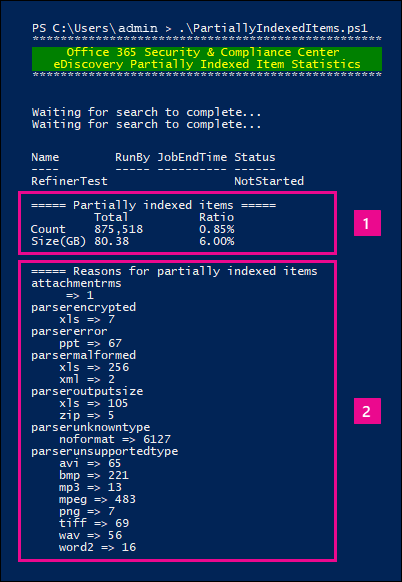

# <a name="investigating-partially-indexed-items-in-ediscovery"></a>Investigación de elementos parcialmente indexados en eDiscovery

Una búsqueda de exhibición de documentos electrónicos que se ejecuta desde el portal de cumplimiento Microsoft Purview incluye automáticamente elementos parcialmente indexados en los resultados de búsqueda estimados al ejecutar una búsqueda. Los elementos indizados parcialmente son elementos y documentos de buzón de Exchange en SharePoint y OneDrive para la Empresa sitios que, por alguna razón, no estaban completamente indexados para la búsqueda. La mayoría de los mensajes de correo electrónico y documentos de sitio se indexan correctamente porque están dentro de los [límites de indexación de los mensajes de correo electrónico](limits-for-content-search.md#indexing-limits-for-email-messages). Sin embargo, algunos elementos pueden superar estos límites de indexación y se indizarán parcialmente. Estas son otras razones por las que los elementos no se pueden indexar para la búsqueda y se devuelven como elementos indizados parcialmente al ejecutar una búsqueda de exhibición de documentos electrónicos:
  
- Los mensajes de correo electrónico tienen un archivo adjunto que no se puede abrir; esta es la causa más común de los elementos de correo electrónico parcialmente indexados.

- Se han adjuntado demasiados archivos a un mensaje de correo electrónico.

- Un archivo adjuntado a un mensaje de correo electrónico es demasiado grande.

- El tipo de archivo se admite para indización pero se produjo un error de indización en un archivo específico.

Aunque varía, la mayoría de las organizaciones los clientes tienen menos del 1 % del contenido por volumen y menos del 12 % del contenido por tamaño que se indexa parcialmente. La razón de la diferencia entre el volumen y el tamaño es que los archivos más grandes tienen una mayor probabilidad de contener contenido que no se puede indexar completamente.
  
## <a name="why-does-the-partially-indexed-item-count-change-for-a-search"></a>¿Por qué cambia el recuento de elementos parcialmente indexados para una búsqueda?

Después de ejecutar una búsqueda de eDiscovery, el número total y el tamaño de los elementos parcialmente indexados en las ubicaciones en las que se ha buscado se enumeran en las estadísticas de resultados de búsqueda que se muestran en las estadísticas detalladas de la búsqueda. Tenga en cuenta que se denominan  *elementos no indizados*  en las estadísticas de búsqueda. Estos son algunos aspectos que afectarán al número de elementos indizados parcialmente que se devuelven en los resultados de la búsqueda:
  
- Si un elemento se indexa parcialmente y coincide con la consulta de búsqueda, se incluye en el recuento (y el tamaño) de los elementos de resultados de búsqueda y en los elementos indizados parcialmente. Sin embargo, cuando se exportan los resultados de esa misma búsqueda, el elemento solo se incluye con el conjunto de resultados de búsqueda; no se incluye como un elemento parcialmente indexado.

- Los elementos indizados parcialmente ubicados en sitios de SharePoint y OneDrive *no se* incluyen en la estimación de elementos indizados parcialmente que se muestran en las estadísticas detalladas de la búsqueda. Sin embargo, los elementos indizados parcialmente se pueden exportar al exportar los resultados de una búsqueda de exhibición de documentos electrónicos. Por ejemplo, si solo busca sitios, el número estimado de elementos indizados parcialmente será cero.
  
## <a name="calculating-the-ratio-of-partially-indexed-items-in-your-organization"></a>Cálculo de la proporción de elementos indizados parcialmente en la organización

Para comprender la exposición de su organización a elementos parcialmente indexados, puede ejecutar una búsqueda de todo el contenido de todos los buzones de correo (mediante una consulta de palabra clave en blanco). En el ejemplo siguiente, hay 1.629.904 (146,46 GB) elementos totalmente indexados y 10.025 (10,27 GB) parcialmente indizados.
  

  
Puede determinar el porcentaje de elementos indizados parcialmente mediante los cálculos siguientes.
  
 **Para calcular la proporción de elementos indizados parcialmente en la organización:**

`(Total number of partially indexed items/Total number of items) x 100`

`(10025/1629904) x 100 = 0.62%`

Mediante el uso de los resultados de búsqueda del ejemplo anterior, el 0,62 % de todos los elementos de buzones de correo se indexa parcialmente.
  
 **Para calcular el porcentaje del tamaño de los elementos indizados parcialmente en la organización:**

`(Size of all partially indexed items/Size of all items) x 100`

`(10.27 GB/146.46 GB) x 100 = 7.0%`

Por lo tanto, en el ejemplo anterior, el 7 % del tamaño total de los elementos de buzón de correo procede de elementos parcialmente indexados. Como se indicó anteriormente, la mayoría de las organizaciones clientes tienen menos del 1 % del contenido por volumen y menos del 12 % del contenido por tamaño que se indexa parcialmente.

## <a name="working-with-partially-indexed-items"></a>Trabajar con elementos parcialmente indexados

En los casos en los que necesite examinar elementos parcialmente indizados para validar que no contienen información relevante, puede [exportar un informe de búsqueda de contenido](export-a-content-search-report.md) que contenga información sobre elementos indizados parcialmente. Al exportar un informe de búsqueda de contenido, asegúrese de elegir una de las opciones de exportación que incluye elementos parcialmente indexados.
  

  
Al exportar resultados de búsqueda de exhibición de documentos electrónicos o un informe de búsqueda mediante una de estas opciones, la exportación incluye un informe denominado Items.csv sin indexar. Este informe incluye la mayor parte de la misma información que el archivo ResultsLog.csv; sin embargo, el archivo de Items.csv sin indexar también incluye dos campos relacionados con elementos parcialmente indexados: **Etiquetas de error** y **Propiedades de error**. Estos campos contienen información sobre el error de indexación de cada elemento parcialmente indexado. El uso de la información de estos dos campos puede ayudarle a determinar si el error de indexación de un determinado afecta o no a la investigación. 

> [!NOTE]
> El archivo de Items.csv sin indexar también contiene campos **denominados Tipo de error** y **Mensaje de error**. Estos son campos heredados que contienen información similar a la información de los campos **Etiquetas de error** y **Propiedades de error** , pero con información menos detallada. Puede omitir estos campos heredados de forma segura.
  
## <a name="errors-related-to-partially-indexed-items"></a>Errores relacionados con elementos parcialmente indexados

Las etiquetas de error se componen de dos fragmentos de información: el error y el tipo de archivo. Por ejemplo, en este par error/tipo de archivo:

```text
 parseroutputsize_xls
```

 `parseroutputsize` es el error y `xls` es el tipo de archivo del archivo en el que se produjo el error. En los casos en los que no se reconoció el tipo de archivo o el tipo de archivo no se aplicó al error, verá el valor `noformat` en lugar del tipo de archivo.
  
A continuación se muestra una lista de errores de indexación y una descripción de la posible causa del error.
  
| Etiqueta de error | Description |
|:-----|:-----|
| `attachmentcount` <br/> |Un mensaje de correo electrónico tenía demasiados datos adjuntos y algunos de estos datos adjuntos no se procesaron.  <br/> |
| `attachmentdepth` <br/> |El recuperador de contenido y el analizador de documentos encontraron demasiados niveles de datos adjuntos anidados dentro de otros datos adjuntos. Algunos de estos datos adjuntos no se procesaron.  <br/> |
| `attachmentrms` <br/> |Error al descodificar datos adjuntos porque estaba protegido por RMS.  <br/> |
| `attachmentsize` <br/> |Un archivo adjunto a un mensaje de correo electrónico era demasiado grande y no se pudo procesar.  <br/> |
| `indexingtruncated` <br/> |Al escribir el mensaje de correo electrónico procesado en el índice, una de las propiedades indexables era demasiado grande y se truncaba. Las propiedades truncadas aparecen en el campo Propiedades de error.  <br/> |
| `invalidunicode` <br/> |Un mensaje de correo electrónico contenía texto que no se pudo procesar como Unicode válido. La indexación de este elemento puede estar incompleta.  <br/> |
| `parserencrypted` <br/> |El contenido de los datos adjuntos o el mensaje de correo electrónico está cifrado y Microsoft 365 no pudo descodificar el contenido.  <br/> |
| `parsererror` <br/> |Error desconocido durante el análisis. Esto suele deberse a un error de software o a un bloqueo del servicio.  <br/> |
| `parserinputsize` <br/> |Un archivo adjunto era demasiado grande para que el analizador controlara y el análisis de esos datos adjuntos no se produjo o no se completó.  <br/> |
| `parsermalformed` <br/> |El analizador no pudo controlar los datos adjuntos con un formato incorrecto. Este resultado puede deberse a formatos de archivo antiguos, archivos creados por software incompatible o virus que pretenden ser algo distinto de reclamado.  <br/> |
| `parseroutputsize` <br/> |La salida del análisis de datos adjuntos era demasiado grande y tenía que truncarse.  <br/> |
| `parserunknowntype` <br/> |Los datos adjuntos tenían un tipo de archivo que Microsoft 365 no pudo detectar.  <br/> |
| `parserunsupportedtype` <br/> |Los datos adjuntos tenían un tipo de archivo que Office 365 podría detectar, pero no se admite el análisis de ese tipo de archivo.  <br/> |
| `propertytoobig` <br/> |El valor de una propiedad de correo electrónico en la Tienda Exchange era demasiado grande para recuperarse y no se pudo procesar el mensaje. Normalmente, esto solo sucede en la propiedad body de un mensaje de correo electrónico.  <br/> |
| `retrieverrms` <br/> |El recuperador de contenido no pudo descodificar un mensaje protegido con RMS.  <br/> |
| `wordbreakertruncated` <br/> |Se identificaron demasiadas palabras en el documento durante la indexación. El procesamiento de la propiedad se detuvo al alcanzar el límite y la propiedad se trunca.  <br/> |

Los campos de error describen qué campos se ven afectados por el error de procesamiento que aparece en el campo Etiquetas de error. Si busca en una propiedad como  `subject` o  `participants`, los errores en el cuerpo del mensaje no afectarán a los resultados de la búsqueda. Esto puede ser útil al determinar exactamente qué elementos parcialmente indexados es posible que necesite investigar más a fondo.

<!--
## Using a PowerShell script to determine your organization's exposure to partially indexed email items

The following steps show you how to run a PowerShell script that searches for all items in all Exchange mailboxes, and then generates a report about your organization's ratio of partially indexed email items (by count and by size) and displays the number of items (and their file type) for each indexing error that occurs. Use the error tag descriptions in the previous section to identify the indexing error.
  
1. Save the following text to a Windows PowerShell script file by using a filename suffix of .ps1; for example, `PartiallyIndexedItems.ps1`.

   ```powershell
     write-host "**************************************************"
     write-host "     Security & Compliance PowerShell      " -foregroundColor yellow -backgroundcolor darkgreen
     write-host "   eDiscovery Partially Indexed Item Statistics   " -foregroundColor yellow -backgroundcolor darkgreen
     write-host "**************************************************"
     " " 
     # Create a search with Error Tags Refinders enabled
     Remove-ComplianceSearch "RefinerTest" -Confirm:$false -ErrorAction 'SilentlyContinue'
     New-ComplianceSearch -Name "RefinerTest" -ContentMatchQuery "size>0" -RefinerNames ErrorTags -ExchangeLocation ALL
     Start-ComplianceSearch "RefinerTest"
     # Loop while search is in progress
     do{
         Write-host "Waiting for search to complete..."
         Start-Sleep -s 5
         $complianceSearch = Get-ComplianceSearch "RefinerTest"
     }while ($complianceSearch.Status -ne 'Completed')
     $refiners = $complianceSearch.Refiners | ConvertFrom-Json
     $errorTagProperties = $refiners.Entries | Get-Member -MemberType NoteProperty
     $partiallyIndexedRatio = $complianceSearch.UnindexedItems / $complianceSearch.Items
     $partiallyIndexedSizeRatio = $complianceSearch.UnindexedSize / $complianceSearch.Size
     " "
     "===== Partially indexed items ====="
     "         Total          Ratio"
     "Count    {0:N0}{1:P2}" -f $complianceSearch.Items.ToString("N0").PadRight(15, " "), $partiallyIndexedRatio
     "Size(GB) {0:N2}{1:P2}" -f ($complianceSearch.Size / 1GB).ToString("N2").PadRight(15, " "), $partiallyIndexedSizeRatio
     " "
     Write-Host ===== Reasons for partially indexed items =====
     foreach($errorTagProperty in $errorTagProperties)
     {
         $name = $refiners.Entries.($errorTagProperty.Name).Name
         $count = $refiners.Entries.($errorTagProperty.Name).TotalCount
         $frag = $name.Split("{_}")
         $errorTag = $frag[0]
         $fileType = $frag[1]
         if ($errorTag -ne $lastErrorTag)
         {
             $errorTag
         }
         "    " + $fileType + " => " + $count
         $lastErrorTag = $errorTag
     }
   ```

2. [Connect to Security & Compliance PowerShell](/powershell/exchange/exchange-online-powershell).

3. In Security & Compliance PowerShell, go to the folder where you saved the script in step 1, and then run the script; for example:

   ```powershell
   .\PartiallyIndexedItems.ps1
   ```

Here's an example fo the output returned by the script.
  


> [!NOTE]
> Note the following:
>  
> - The total number and size of email items, and your organization's ratio of partially indexed email items (by count and by size).
> 
> - A list error tags and the corresponding file types for which the error occurred.
-->

## <a name="see-also"></a>Vea también

[Elementos indizados parcialmente en eDiscovery](partially-indexed-items-in-content-search.md)
