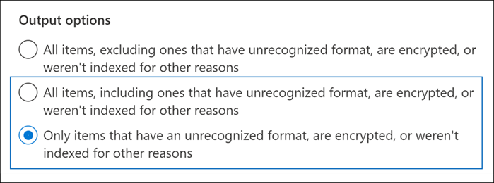

# <a name="investigating-partially-indexed-items-in-ediscovery"></a><span data-ttu-id="c0227-103">Investigar elementos parcialmente indizados en eDiscovery</span><span class="sxs-lookup"><span data-stu-id="c0227-103">Investigating partially indexed items in eDiscovery</span></span>

<span data-ttu-id="c0227-104">Una búsqueda de exhibición de documentos electrónicos que se ejecuta desde el centro de cumplimiento de Microsoft 365 incluye automáticamente elementos parcialmente indizados en los resultados de búsqueda estimados al ejecutar una búsqueda.</span><span class="sxs-lookup"><span data-stu-id="c0227-104">An eDiscovery search that you run from the Microsoft 365 compliance center automatically includes partially indexed items in the estimated search results when you run a search.</span></span> <span data-ttu-id="c0227-105">Los elementos parcialmente indizados Exchange elementos de buzón de correo y documentos en SharePoint y OneDrive para la Empresa sitios que, por algún motivo, no se indizaron completamente para la búsqueda.</span><span class="sxs-lookup"><span data-stu-id="c0227-105">Partially indexed items are Exchange mailbox items and documents on SharePoint and OneDrive for Business sites that for some reason weren't completely indexed for search.</span></span> <span data-ttu-id="c0227-106">La mayoría de los mensajes de correo electrónico y documentos del sitio se indizan correctamente porque se encuentran dentro de los [límites de indización de los mensajes de correo electrónico](limits-for-content-search.md#indexing-limits-for-email-messages).</span><span class="sxs-lookup"><span data-stu-id="c0227-106">Most email messages and site documents are successfully indexed because they fall within the [Indexing limits for email messages](limits-for-content-search.md#indexing-limits-for-email-messages).</span></span> <span data-ttu-id="c0227-107">Sin embargo, algunos elementos pueden superar estos límites de indización y se indizarán parcialmente.</span><span class="sxs-lookup"><span data-stu-id="c0227-107">However, some items may exceed these indexing limits, and will be partially indexed.</span></span> <span data-ttu-id="c0227-108">Estos son otros motivos por los que los elementos no se pueden indizar para la búsqueda y se devuelven como elementos parcialmente indizados al ejecutar una búsqueda de exhibición de documentos electrónicos:</span><span class="sxs-lookup"><span data-stu-id="c0227-108">Here are other reasons why items can't be indexed for search and are returned as partially indexed items when you run an eDiscovery search:</span></span>
  
- <span data-ttu-id="c0227-109">Los mensajes de correo electrónico tienen un archivo adjunto sin un controlador válido, como archivos de imagen; esta es la causa más común de elementos de correo electrónico parcialmente indizados.</span><span class="sxs-lookup"><span data-stu-id="c0227-109">Email messages have an attached file without a valid handler, such as image files; this is the most common cause of partially indexed email items.</span></span>

- <span data-ttu-id="c0227-110">Se han adjuntado demasiados archivos a un mensaje de correo electrónico.</span><span class="sxs-lookup"><span data-stu-id="c0227-110">Too many files attached to an email message.</span></span>

- <span data-ttu-id="c0227-111">Un archivo adjuntado a un mensaje de correo electrónico es demasiado grande.</span><span class="sxs-lookup"><span data-stu-id="c0227-111">A file attached to an email message is too large.</span></span>

- <span data-ttu-id="c0227-112">El tipo de archivo se admite para indización pero se produjo un error de indización en un archivo específico.</span><span class="sxs-lookup"><span data-stu-id="c0227-112">The file type is supported for indexing but an indexing error occurred for a specific file.</span></span>

<span data-ttu-id="c0227-113">Aunque varía, la mayoría de los clientes de organizaciones tienen menos del 1 % de contenido por volumen y menos del 12 % del contenido por tamaño que está parcialmente indizado.</span><span class="sxs-lookup"><span data-stu-id="c0227-113">Although it varies, most organizations customers have less than 1% of content by volume and less than 12% of content by size that is partially indexed.</span></span> <span data-ttu-id="c0227-114">La razón de la diferencia entre el volumen y el tamaño es que los archivos más grandes tienen una mayor probabilidad de contener contenido que no se puede indizar por completo.</span><span class="sxs-lookup"><span data-stu-id="c0227-114">The reason for the difference between the volume versus size is that larger files have a higher probability of containing content that can't be completely indexed.</span></span>
  
## <a name="why-does-the-partially-indexed-item-count-change-for-a-search"></a><span data-ttu-id="c0227-115">¿Por qué cambia el recuento de elementos parcialmente indizados para una búsqueda?</span><span class="sxs-lookup"><span data-stu-id="c0227-115">Why does the partially indexed item count change for a search?</span></span>

<span data-ttu-id="c0227-116">Después de ejecutar una búsqueda de exhibición de documentos electrónicos, el número total y el tamaño de los elementos parcialmente indizados en las ubicaciones que se buscaron aparecen en las estadísticas de resultados de búsqueda que se muestran en las estadísticas detalladas de la búsqueda.</span><span class="sxs-lookup"><span data-stu-id="c0227-116">After you run an eDiscovery search, the total number and size of partially indexed items in the locations that were searched are listed in the search result statistics that are displayed in the detailed statistics for the search.</span></span> <span data-ttu-id="c0227-117">Tenga en cuenta que se  *denominan elementos no indexados*  en las estadísticas de búsqueda.</span><span class="sxs-lookup"><span data-stu-id="c0227-117">Note these are called  *unindexed items*  in the search statistics.</span></span> <span data-ttu-id="c0227-118">Estos son algunos aspectos que afectarán al número de elementos parcialmente indizados que se devuelven en los resultados de la búsqueda:</span><span class="sxs-lookup"><span data-stu-id="c0227-118">Here are a few things that will affect the number of partially indexed items that are returned in the search results:</span></span>
  
- <span data-ttu-id="c0227-119">Si un elemento se indiza parcialmente y coincide con la consulta de búsqueda, se incluye en el recuento (y el tamaño) de los elementos de resultados de búsqueda y los elementos parcialmente indizados.</span><span class="sxs-lookup"><span data-stu-id="c0227-119">If an item is partially indexed and matches the search query, it's included in both the count (and size) of search result items and partially indexed items.</span></span> <span data-ttu-id="c0227-120">Sin embargo, cuando se exportan los resultados de esa misma búsqueda, el elemento se incluye solo con un conjunto de resultados de búsqueda; no se incluye como un elemento parcialmente indizado.</span><span class="sxs-lookup"><span data-stu-id="c0227-120">However, when the results of that same search are exported, the item is included only with set of search results; it's not included as a partially indexed item.</span></span>

- <span data-ttu-id="c0227-121">Los elementos parcialmente indizados ubicados en sitios  SharePoint y OneDrive no se incluyen en la estimación de elementos parcialmente indizados que se muestran en las estadísticas detalladas de la búsqueda.</span><span class="sxs-lookup"><span data-stu-id="c0227-121">Partially indexed items located in SharePoint and OneDrive sites *are not* included in the estimate of partially indexed items that's displayed in the detailed statistics for the search.</span></span> <span data-ttu-id="c0227-122">Sin embargo, los elementos parcialmente indizados se pueden exportar al exportar los resultados de una búsqueda de exhibición de documentos electrónicos.</span><span class="sxs-lookup"><span data-stu-id="c0227-122">However, partially indexed items can be exported when you export the results of an eDiscovery search.</span></span> <span data-ttu-id="c0227-123">Por ejemplo, si solo busca sitios, el número estimado de elementos parcialmente indizados será cero.</span><span class="sxs-lookup"><span data-stu-id="c0227-123">For example, if you only search sites, the estimated number partially indexed items will be zero.</span></span>
  
## <a name="calculating-the-ratio-of-partially-indexed-items-in-your-organization"></a><span data-ttu-id="c0227-124">Cálculo de la relación de elementos parcialmente indizados en la organización</span><span class="sxs-lookup"><span data-stu-id="c0227-124">Calculating the ratio of partially indexed items in your organization</span></span>

<span data-ttu-id="c0227-125">Para comprender la exposición de su organización a elementos parcialmente indizados, puede ejecutar una búsqueda de todo el contenido en todos los buzones (mediante una consulta de palabra clave en blanco).</span><span class="sxs-lookup"><span data-stu-id="c0227-125">To understand your organization's exposure to partially indexed items, you can run a search for all content in all mailboxes (by using a blank keyword query).</span></span> <span data-ttu-id="c0227-126">En el siguiente ejemplo, hay 1.629.904 (146,46 GB) elementos totalmente indizados y 10.025 (10,27 GB) elementos parcialmente indizados.</span><span class="sxs-lookup"><span data-stu-id="c0227-126">In the following example, there are 1,629,904 (146.46 GB) fully indexed items and 10,025 (10.27 GB) partially indexed items.</span></span>
  

  
<span data-ttu-id="c0227-128">Puede determinar el porcentaje de elementos parcialmente indizados mediante los siguientes cálculos.</span><span class="sxs-lookup"><span data-stu-id="c0227-128">You can determine the percentage of partially indexed items by using the following calculations.</span></span>
  
 <span data-ttu-id="c0227-129">**Para calcular la relación de elementos parcialmente indizados en la organización:**</span><span class="sxs-lookup"><span data-stu-id="c0227-129">**To calculate the ratio of partially indexed items in your organization:**</span></span>

`(Total number of partially indexed items/Total number of items) x 100`

`(10025/1629904) x 100 = 0.62%`

<span data-ttu-id="c0227-130">Al usar los resultados de búsqueda del ejemplo anterior, el 0,62 % de todos los elementos de buzones se indizan parcialmente.</span><span class="sxs-lookup"><span data-stu-id="c0227-130">By using the search results from the previous example, 0.62% of all mailboxes items are partially indexed.</span></span>
  
 <span data-ttu-id="c0227-131">**Para calcular el porcentaje del tamaño de los elementos parcialmente indizados en la organización:**</span><span class="sxs-lookup"><span data-stu-id="c0227-131">**To calculate the percentage of the size of partially indexed items in your organization:**</span></span>

`(Size of all partially indexed items/Size of all items) x 100`

`(10.27 GB/146.46 MB) x 100 = 7.0%`

<span data-ttu-id="c0227-132">Por lo tanto, en el ejemplo anterior, el 7 % del tamaño total de los elementos de buzón son de elementos parcialmente indizados.</span><span class="sxs-lookup"><span data-stu-id="c0227-132">So in the previous example, 7% of the total size of mailbox items are from partially indexed items.</span></span> <span data-ttu-id="c0227-133">Como se ha indicado anteriormente, la mayoría de los clientes de organizaciones tienen menos del 1 % de contenido por volumen y menos del 12 % del contenido por tamaño que está parcialmente indizado.</span><span class="sxs-lookup"><span data-stu-id="c0227-133">As previously stated, most organizations customers have less than 1% of content by volume and less than 12% of content by size that is partially indexed.</span></span>

## <a name="working-with-partially-indexed-items"></a><span data-ttu-id="c0227-134">Trabajar con elementos parcialmente indizados</span><span class="sxs-lookup"><span data-stu-id="c0227-134">Working with partially indexed items</span></span>

<span data-ttu-id="c0227-135">En los casos en que necesite examinar parcialmente los elementos para [](export-a-content-search-report.md) validar que no contienen información relevante, puede exportar un informe de búsqueda de contenido que contenga información sobre elementos parcialmente indizados.</span><span class="sxs-lookup"><span data-stu-id="c0227-135">In cases when you need to examine partially items to validate that they don't contain relevant information, you can [export a content search report](export-a-content-search-report.md) that contains information about partially indexed items.</span></span> <span data-ttu-id="c0227-136">Al exportar un informe de búsqueda de contenido, asegúrese de elegir una de las opciones de exportación que incluye elementos parcialmente indizados.</span><span class="sxs-lookup"><span data-stu-id="c0227-136">When you export a content search report, be sure to choose one of the export options that includes partially indexed items.</span></span>
  

  
<span data-ttu-id="c0227-138">Al exportar resultados de búsqueda de exhibición de documentos electrónicos o un informe de búsqueda mediante una de estas opciones, la exportación incluye un informe denominado Unindexed Items.csv.</span><span class="sxs-lookup"><span data-stu-id="c0227-138">When you export eDiscovery search results or a search report using one of these options, the export includes a report named Unindexed Items.csv.</span></span> <span data-ttu-id="c0227-139">Este informe incluye la mayor parte de la misma información que el ResultsLog.csv archivo; sin embargo, el archivo Items.csv unindexed también incluye dos campos relacionados con elementos parcialmente indizados: **Etiquetas** de error y **Propiedades de error**.</span><span class="sxs-lookup"><span data-stu-id="c0227-139">This report includes most of the same information as the ResultsLog.csv file; however, the Unindexed Items.csv file also includes two fields related to partially indexed items: **Error Tags** and **Error Properties**.</span></span> <span data-ttu-id="c0227-140">Estos campos contienen información sobre el error de indización de cada elemento parcialmente indizado.</span><span class="sxs-lookup"><span data-stu-id="c0227-140">These fields contain information about the indexing error for each partially indexed item.</span></span> <span data-ttu-id="c0227-141">El uso de la información de estos dos campos puede ayudarle a determinar si el error de indización de un determinado impacto en la investigación.</span><span class="sxs-lookup"><span data-stu-id="c0227-141">Using the information in these two fields can help you determine whether or not the indexing error for a particular impacts your investigation.</span></span> <span data-ttu-id="c0227-142">Si lo hace, puede realizar una búsqueda dirigida y recuperar y exportar mensajes de correo electrónico específicos y documentos SharePoint o OneDrive para que pueda examinarlos para determinar si son relevantes para la investigación.</span><span class="sxs-lookup"><span data-stu-id="c0227-142">If it does, you can perform a targeted search and retrieve and export specific email messages and SharePoint or OneDrive documents so that you can examine them to determine if they're relevant to your investigation.</span></span> <span data-ttu-id="c0227-143">Para obtener instrucciones paso a paso, vea [Prepare a CSV file for a targeted search in Office 365](csv-file-for-an-id-list-content-search.md).</span><span class="sxs-lookup"><span data-stu-id="c0227-143">For step-by-step instructions, see [Prepare a CSV file for a targeted search in Office 365](csv-file-for-an-id-list-content-search.md).</span></span>

> [!NOTE]
> <span data-ttu-id="c0227-144">El archivo de Items.csv sin indizar también contiene campos **denominados Tipo de error** y **Mensaje de error**.</span><span class="sxs-lookup"><span data-stu-id="c0227-144">The Unindexed Items.csv file also contains fields named **Error Type** and **Error Message**.</span></span> <span data-ttu-id="c0227-145">Se trata de campos heredados que contienen información similar a la información de los campos **Etiquetas** de error y Propiedades de **error,** pero con información menos detallada.</span><span class="sxs-lookup"><span data-stu-id="c0227-145">These are legacy fields that contain information that is similar to the information in the **Error Tags** and **Error Properties** fields, but with less detailed information.</span></span> <span data-ttu-id="c0227-146">Puede omitir estos campos heredados de forma segura.</span><span class="sxs-lookup"><span data-stu-id="c0227-146">You can safely ignore these legacy fields.</span></span>
  
## <a name="errors-related-to-partially-indexed-items"></a><span data-ttu-id="c0227-147">Errores relacionados con elementos parcialmente indizados</span><span class="sxs-lookup"><span data-stu-id="c0227-147">Errors related to partially indexed items</span></span>

<span data-ttu-id="c0227-148">Las etiquetas de error están hechas de dos partes de información, el error y el tipo de archivo.</span><span class="sxs-lookup"><span data-stu-id="c0227-148">Error tags are made up of two pieces of information, the error and the file type.</span></span> <span data-ttu-id="c0227-149">Por ejemplo, en este par error/tipo de archivo:</span><span class="sxs-lookup"><span data-stu-id="c0227-149">For example, in this error/file-type pair:</span></span>

```text
 parseroutputsize_xls
```

 <span data-ttu-id="c0227-150">`parseroutputsize` es el error y `xls` es el tipo de archivo del archivo en el que se produjo el error.</span><span class="sxs-lookup"><span data-stu-id="c0227-150">`parseroutputsize` is the error and `xls` is the file type of the file the error occurred on.</span></span> <span data-ttu-id="c0227-151">En los casos en que el tipo de archivo no se reconoció o el tipo de archivo no se apliquen al error, verá el valor en `noformat` lugar del tipo de archivo.</span><span class="sxs-lookup"><span data-stu-id="c0227-151">In cases where the file type wasn't recognized or the file type didn't apply to the error, you will see the value `noformat` in place of the file type.</span></span>
  
<span data-ttu-id="c0227-152">A continuación se muestra una lista de errores de indización y una descripción de la posible causa del error.</span><span class="sxs-lookup"><span data-stu-id="c0227-152">The following is a list of indexing errors and a description of the possible cause of the error.</span></span>
  
| <span data-ttu-id="c0227-153">Etiqueta Error</span><span class="sxs-lookup"><span data-stu-id="c0227-153">Error tag</span></span> | <span data-ttu-id="c0227-154">Descripción</span><span class="sxs-lookup"><span data-stu-id="c0227-154">Description</span></span> |
|:-----|:-----|
| `attachmentcount` <br/> |<span data-ttu-id="c0227-155">Un mensaje de correo electrónico tenía demasiados datos adjuntos y algunos de estos datos adjuntos no se procesaron.</span><span class="sxs-lookup"><span data-stu-id="c0227-155">An email message had too many attachments, and some of these attachments weren't processed.</span></span>  <br/> |
| `attachmentdepth` <br/> |<span data-ttu-id="c0227-156">El recuperador de contenido y el analizador de documentos encontraron demasiados niveles de datos adjuntos anidados dentro de otros datos adjuntos.</span><span class="sxs-lookup"><span data-stu-id="c0227-156">The content retriever and document parser found too many levels of attachments nested inside other attachments.</span></span> <span data-ttu-id="c0227-157">Algunos de estos datos adjuntos no se procesaron.</span><span class="sxs-lookup"><span data-stu-id="c0227-157">Some of these attachments were not processed.</span></span>  <br/> |
| `attachmentrms` <br/> |<span data-ttu-id="c0227-158">Se ha producido un error de decodificación de datos adjuntos porque estaba protegido por RMS.</span><span class="sxs-lookup"><span data-stu-id="c0227-158">An attachment failed decoding because it was RMS-protected.</span></span>  <br/> |
| `attachmentsize` <br/> |<span data-ttu-id="c0227-159">Un archivo adjunto a un mensaje de correo electrónico era demasiado grande y no se podía procesar.</span><span class="sxs-lookup"><span data-stu-id="c0227-159">A file attached to an email message was too large and couldn't be processed.</span></span>  <br/> |
| `indexingtruncated` <br/> |<span data-ttu-id="c0227-160">Al escribir el mensaje de correo electrónico procesado en el índice, una de las propiedades indizables era demasiado grande y se truncaba.</span><span class="sxs-lookup"><span data-stu-id="c0227-160">When writing the processed email message to the index, one of the indexable properties was too large and was truncated.</span></span> <span data-ttu-id="c0227-161">Las propiedades truncadas se enumeran en el campo Propiedades de error.</span><span class="sxs-lookup"><span data-stu-id="c0227-161">The truncated properties are listed in Error Properties field.</span></span>  <br/> |
| `invalidunicode` <br/> |<span data-ttu-id="c0227-162">Un mensaje de correo electrónico contenía texto que no se pudo procesar como Unicode válido.</span><span class="sxs-lookup"><span data-stu-id="c0227-162">An email message contained text that couldn't be processed as valid Unicode.</span></span> <span data-ttu-id="c0227-163">La indización de este elemento puede estar incompleta.</span><span class="sxs-lookup"><span data-stu-id="c0227-163">Indexing for this item may be incomplete.</span></span>  <br/> |
| `parserencrypted` <br/> |<span data-ttu-id="c0227-164">El contenido de los datos adjuntos o del mensaje de correo electrónico está cifrado y Microsoft 365 no se pudo descodificar el contenido.</span><span class="sxs-lookup"><span data-stu-id="c0227-164">The content of attachment or email message is encrypted, and Microsoft 365 couldn't decode the content.</span></span>  <br/> |
| `parsererror` <br/> |<span data-ttu-id="c0227-165">Se produjo un error desconocido durante el análisis.</span><span class="sxs-lookup"><span data-stu-id="c0227-165">An unknown error occurred during parsing.</span></span> <span data-ttu-id="c0227-166">Esto suele ser el resultado de un error de software o un bloqueo del servicio.</span><span class="sxs-lookup"><span data-stu-id="c0227-166">This typically results from a software bug or a service crash.</span></span>  <br/> |
| `parserinputsize` <br/> |<span data-ttu-id="c0227-167">Un archivo adjunto era demasiado grande para que el analizador lo controlara y el análisis de los datos adjuntos no se realizó o no se completó.</span><span class="sxs-lookup"><span data-stu-id="c0227-167">An attachment was too large for the parser to handle, and the parsing of that attachment didn't happen or wasn't completed.</span></span>  <br/> |
| `parsermalformed` <br/> |<span data-ttu-id="c0227-168">El analizador no pudo controlar los datos adjuntos.</span><span class="sxs-lookup"><span data-stu-id="c0227-168">An attachment was malformed and couldn't be handled by the parser.</span></span> <span data-ttu-id="c0227-169">Este resultado puede deberse a formatos de archivo antiguos, archivos creados por software incompatible o virus que pretenden ser algo distinto de lo declarado.</span><span class="sxs-lookup"><span data-stu-id="c0227-169">This result can be due to old file formats, files created by incompatible software, or viruses pretending to be something other than claimed.</span></span>  <br/> |
| `parseroutputsize` <br/> |<span data-ttu-id="c0227-170">El resultado del análisis de un archivo adjunto era demasiado grande y tenía que truncarse.</span><span class="sxs-lookup"><span data-stu-id="c0227-170">The output from the parsing of an attachment was too large and had to be truncated.</span></span>  <br/> |
| `parserunknowntype` <br/> |<span data-ttu-id="c0227-171">Un archivo adjunto tenía un tipo de archivo Microsoft 365 no se pudo detectar.</span><span class="sxs-lookup"><span data-stu-id="c0227-171">An attachment had a file type that Microsoft 365 couldn't detect.</span></span>  <br/> |
| `parserunsupportedtype` <br/> |<span data-ttu-id="c0227-172">Un archivo adjunto tenía un tipo de archivo que Office 365 detectar, pero no se admite el análisis de ese tipo de archivo.</span><span class="sxs-lookup"><span data-stu-id="c0227-172">An attachment had a file type that Office 365 could detect, but parsing that file type isn't supported.</span></span>  <br/> |
| `propertytoobig` <br/> |<span data-ttu-id="c0227-173">El valor de una propiedad de correo electrónico en Exchange Store era demasiado grande para recuperarse y no se pudo procesar el mensaje.</span><span class="sxs-lookup"><span data-stu-id="c0227-173">The value of an email property in Exchange Store was too large to be retrieved and the message couldn't be processed.</span></span> <span data-ttu-id="c0227-174">Normalmente, esto solo sucede con la propiedad body de un mensaje de correo electrónico.</span><span class="sxs-lookup"><span data-stu-id="c0227-174">This typically only happens to the body property of an email message.</span></span>  <br/> |
| `retrieverrms` <br/> |<span data-ttu-id="c0227-175">El recuperador de contenido no pudo descodificar un mensaje protegido por RMS.</span><span class="sxs-lookup"><span data-stu-id="c0227-175">The content retriever failed to decode an RMS-protected message.</span></span>  <br/> |
| `wordbreakertruncated` <br/> |<span data-ttu-id="c0227-176">Se identificaron demasiadas palabras en el documento durante la indización.</span><span class="sxs-lookup"><span data-stu-id="c0227-176">Too many words were identified in the document during indexing.</span></span> <span data-ttu-id="c0227-177">El procesamiento de la propiedad se detuvo al alcanzar el límite y la propiedad se trunca.</span><span class="sxs-lookup"><span data-stu-id="c0227-177">Processing of the property stopped when reaching the limit, and the property is truncated.</span></span>  <br/> |

<span data-ttu-id="c0227-178">Los campos de error describen qué campos se ven afectados por el error de procesamiento enumerado en el campo Etiquetas de error.</span><span class="sxs-lookup"><span data-stu-id="c0227-178">Error fields describe which fields are affected by the processing error listed in the Error Tags field.</span></span> <span data-ttu-id="c0227-179">Si está buscando una propiedad como o , los errores en el cuerpo del mensaje no afectarán a los  `subject`  `participants` resultados de la búsqueda.</span><span class="sxs-lookup"><span data-stu-id="c0227-179">If you're searching a property such as  `subject` or  `participants`, errors in the body of the message won't impact the results of your search.</span></span> <span data-ttu-id="c0227-180">Esto puede ser útil al determinar exactamente qué elementos parcialmente indizados es posible que necesite investigar más a fondo.</span><span class="sxs-lookup"><span data-stu-id="c0227-180">This can be useful when determining exactly which partially indexed items you might need to further investigate.</span></span>
  
## <a name="using-a-powershell-script-to-determine-your-organizations-exposure-to-partially-indexed-email-items"></a><span data-ttu-id="c0227-181">Uso de un script de PowerShell para determinar la exposición de la organización a elementos de correo electrónico parcialmente indizados</span><span class="sxs-lookup"><span data-stu-id="c0227-181">Using a PowerShell script to determine your organization's exposure to partially indexed email items</span></span>

<span data-ttu-id="c0227-182">Los pasos siguientes muestran cómo ejecutar un script de PowerShell que busca todos los elementos de todos los buzones de Exchange y, a continuación, genera un informe sobre la relación de elementos de correo electrónico parcialmente indizados (por recuento y por tamaño) y muestra el número de elementos (y su tipo de archivo) para cada error de indización que se produce.</span><span class="sxs-lookup"><span data-stu-id="c0227-182">The following steps show you how to run a PowerShell script that searches for all items in all Exchange mailboxes, and then generates a report about your organization's ratio of partially indexed email items (by count and by size) and displays the number of items (and their file type) for each indexing error that occurs.</span></span> <span data-ttu-id="c0227-183">Use las descripciones de etiquetas de error de la sección anterior para identificar el error de indización.</span><span class="sxs-lookup"><span data-stu-id="c0227-183">Use the error tag descriptions in the previous section to identify the indexing error.</span></span>
  
1. <span data-ttu-id="c0227-184">Guarde el texto siguiente en un archivo Windows PowerShell script mediante un sufijo de nombre de archivo de .ps1; por ejemplo, `PartiallyIndexedItems.ps1` .</span><span class="sxs-lookup"><span data-stu-id="c0227-184">Save the following text to a Windows PowerShell script file by using a filename suffix of .ps1; for example, `PartiallyIndexedItems.ps1`.</span></span>

   ```powershell
     write-host "**************************************************"
     write-host "     Security & Compliance Center      " -foregroundColor yellow -backgroundcolor darkgreen
     write-host "   eDiscovery Partially Indexed Item Statistics   " -foregroundColor yellow -backgroundcolor darkgreen
     write-host "**************************************************"
     " " 
     # Create a search with Error Tags Refinders enabled
     Remove-ComplianceSearch "RefinerTest" -Confirm:$false -ErrorAction 'SilentlyContinue'
     New-ComplianceSearch -Name "RefinerTest" -ContentMatchQuery "size>0" -RefinerNames ErrorTags -ExchangeLocation ALL
     Start-ComplianceSearch "RefinerTest"
     # Loop while search is in progress
     do{
         Write-host "Waiting for search to complete..."
         Start-Sleep -s 5
         $complianceSearch = Get-ComplianceSearch "RefinerTest"
     }while ($complianceSearch.Status -ne 'Completed')
     $refiners = $complianceSearch.Refiners | ConvertFrom-Json
     $errorTagProperties = $refiners.Entries | Get-Member -MemberType NoteProperty
     $partiallyIndexedRatio = $complianceSearch.UnindexedItems / $complianceSearch.Items
     $partiallyIndexedSizeRatio = $complianceSearch.UnindexedSize / $complianceSearch.Size
     " "
     "===== Partially indexed items ====="
     "         Total          Ratio"
     "Count    {0:N0}{1:P2}" -f $complianceSearch.Items.ToString("N0").PadRight(15, " "), $partiallyIndexedRatio
     "Size(GB) {0:N2}{1:P2}" -f ($complianceSearch.Size / 1GB).ToString("N2").PadRight(15, " "), $partiallyIndexedSizeRatio
     " "
     Write-Host ===== Reasons for partially indexed items =====
     foreach($errorTagProperty in $errorTagProperties)
     {
         $name = $refiners.Entries.($errorTagProperty.Name).Name
         $count = $refiners.Entries.($errorTagProperty.Name).TotalCount
         $frag = $name.Split("{_}")
         $errorTag = $frag[0]
         $fileType = $frag[1]
         if ($errorTag -ne $lastErrorTag)
         {
             $errorTag
         }
         "    " + $fileType + " => " + $count
         $lastErrorTag = $errorTag
     }
   ```

2. <span data-ttu-id="c0227-185">[Conectarse a PowerShell del Centro de seguridad y cumplimiento](/powershell/exchange/exchange-online-powershell).</span><span class="sxs-lookup"><span data-stu-id="c0227-185">[Connect to Security & Compliance Center PowerShell](/powershell/exchange/exchange-online-powershell).</span></span>

3. <span data-ttu-id="c0227-186">En PowerShell & Centro de seguridad y cumplimiento, vaya a la carpeta donde guardó el script en el paso 1 y, a continuación, ejecute el script; por ejemplo:</span><span class="sxs-lookup"><span data-stu-id="c0227-186">In Security & Compliance Center PowerShell, go to the folder where you saved the script in step 1, and then run the script; for example:</span></span>

   ```powershell
   .\PartiallyIndexedItems.ps1
   ```

<span data-ttu-id="c0227-187">Este es un ejemplo de la salida devuelta por el script.</span><span class="sxs-lookup"><span data-stu-id="c0227-187">Here's an example fo the output returned by the script.</span></span>
  


> [!NOTE]
> <span data-ttu-id="c0227-189">Tenga en cuenta lo siguiente:</span><span class="sxs-lookup"><span data-stu-id="c0227-189">Note the following:</span></span>
>  
> - <span data-ttu-id="c0227-190">El número total y el tamaño de los elementos de correo electrónico y la proporción de elementos de correo electrónico parcialmente indizados de su organización (por recuento y por tamaño).</span><span class="sxs-lookup"><span data-stu-id="c0227-190">The total number and size of email items, and your organization's ratio of partially indexed email items (by count and by size).</span></span>
> 
> - <span data-ttu-id="c0227-191">Etiquetas de error de lista y los tipos de archivo correspondientes para los que se produjo el error.</span><span class="sxs-lookup"><span data-stu-id="c0227-191">A list error tags and the corresponding file types for which the error occurred.</span></span>
  
## <a name="see-also"></a><span data-ttu-id="c0227-192">Vea también</span><span class="sxs-lookup"><span data-stu-id="c0227-192">See also</span></span>

[<span data-ttu-id="c0227-193">Elementos parcialmente indizados en eDiscovery</span><span class="sxs-lookup"><span data-stu-id="c0227-193">Partially indexed items in eDiscovery</span></span>](partially-indexed-items-in-content-search.md)