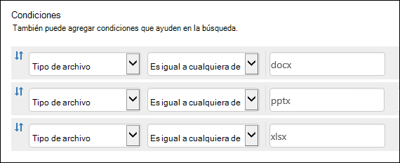
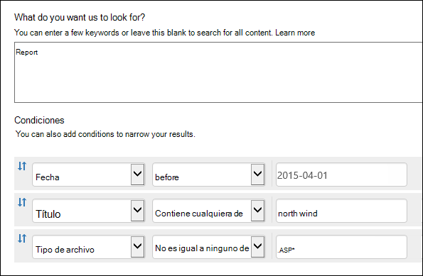
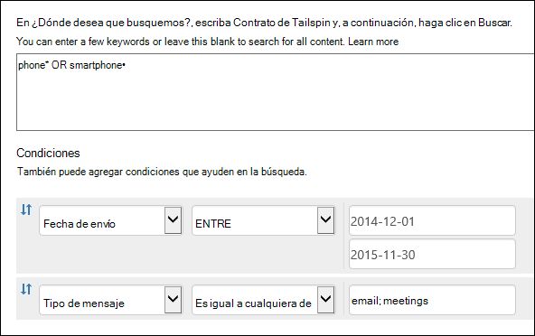
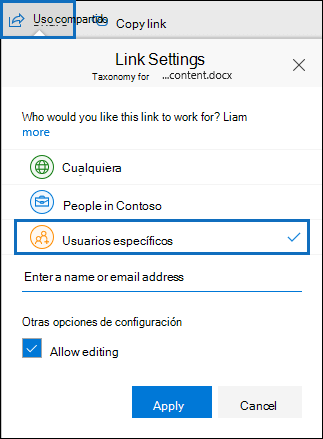

# <a name="keyword-queries-and-search-conditions-for-content-search-and-ediscovery"></a>Consultas de palabras clave y condiciones de búsqueda para búsqueda de contenido y exhibición de documentos electrónicos

En este tema se describen las propiedades de correo electrónico y documentos que puede buscar en elementos de correo electrónico en Exchange Online y documentos almacenados en sitios de SharePoint y OneDrive para la Empresa mediante la característica Búsqueda de contenido en el Centro de cumplimiento de Microsoft 365. También puede usar los **\* cmdlets -ComplianceSearch** en PowerShell del Centro de seguridad & cumplimiento para buscar estas propiedades. El tema también describe:
  
- Usar operadores de búsqueda booleanos, condiciones de búsqueda y otras técnicas de consulta de búsqueda para refinar los resultados de la búsqueda.

- Buscar tipos de datos confidenciales y tipos de datos confidenciales personalizados en SharePoint y OneDrive para la Empresa.

- Búsqueda de contenido del sitio que se comparte con usuarios externos a la organización

Para obtener instrucciones paso a paso sobre cómo crear una búsqueda de contenido, vea [Búsqueda de contenido.](content-search.md)

> [!NOTE]
> La búsqueda de contenido en el Centro de cumplimiento de Microsoft 365 y los cmdlets **\* -ComplianceSearch** correspondientes en PowerShell del Centro de seguridad & cumplimiento usan el lenguaje de consulta de palabras clave (KQL). Para obtener información más detallada, vea la referencia de sintaxis [del lenguaje de consulta de palabras clave.](https://go.microsoft.com/fwlink/?LinkId=269603) 
  
## <a name="searchable-email-properties"></a>Propiedades del correo electrónico que permiten búsquedas

En la tabla siguiente se enumeran las propiedades de los mensajes de correo electrónico que se pueden buscar mediante la característica búsqueda de contenido en el Centro de cumplimiento de Microsoft 365 o mediante el cmdlet **New-ComplianceSearch** o **Set-ComplianceSearch.** La tabla incluye un ejemplo de la sintaxis  _propiedad:valor_ de cada propiedad y una descripción de los resultados de búsqueda devueltos por los ejemplos. Puede escribir estos  `property:value` pares en el cuadro de palabras clave de una búsqueda de contenido. 

> [!NOTE]
> Al buscar propiedades de correo electrónico, no es posible buscar elementos en los que la propiedad especificada esté vacía o en blanco. Por ejemplo, el uso del par *property:value* de **subject:""** para buscar mensajes de correo electrónico con una línea de asunto vacía devolverá cero resultados. Esto también se aplica al buscar propiedades de sitio y contacto.
  
| Propiedad | Descripción de la propiedad | Ejemplos | Resultados de la búsqueda devueltos por los ejemplos |
|:-----|:-----|:-----|:-----|
|AttachmentNames|Los nombres de los archivos adjuntos a un mensaje de correo electrónico.|`attachmentnames:annualreport.ppt`  <br/> `attachmentnames:annual*` <br/> `attachmentnames:.pptx` |Los mensajes con un archivo adjunto denominado informeanual.ppt. En el segundo ejemplo, el uso del comodín devuelve los mensajes con la palabra "anual" en el nombre de un archivo adjunto. El tercer ejemplo devuelve todos los datos adjuntos con la extensión de archivo pptx.|
|Bcc|El campo CCO de un mensaje de correo electrónico. <sup>1</sup>|`bcc:pilarp@contoso.com`  <br/> `bcc:pilarp`  <br/> `bcc:"Pilar Pinilla"`|Todos los ejemplos devuelven los mensajes que incluyen a Pilar Pinilla en el campo CCO.|
|Category| Las categorías para buscar. Los usuarios pueden definir categorías mediante Outlook o Outlook en la Web (anteriormente conocido como Outlook Web App). Los valores posibles son:  <br/><br/>  azul  <br/>  verde  <br/>  naranja  <br/>  púrpura  <br/>  rojo  <br/>  amarillo|`category:"Red Category"`|Los mensajes a los que se ha asignado la categoría roja en los buzones de origen.|
|CC|El campo CC de un mensaje de correo electrónico. <sup>1</sup>|`cc:pilarp@contoso.com`  <br/> `cc:"Pilar Pinilla"`|En ambos ejemplos, los mensajes con Pilar Pinilla especificada en el campo CC.|
|Folderid|Identificador de carpeta (GUID) de una carpeta de buzón específica. Si usa esta propiedad, asegúrese de buscar en el buzón en el que se encuentra la carpeta especificada. Solo se buscará la carpeta especificada. No se buscará en ninguna subcarpeta de la carpeta. Para buscar subcarpetas, debe usar la propiedad Folderid de la subcarpeta que desea buscar.  <br/> Para obtener más información acerca de la búsqueda de la propiedad Folderid y el uso de un script para obtener los id. de carpeta de un buzón específico, vea [Use Content Search for targeted collections](use-content-search-for-targeted-collections.md).|`folderid:4D6DD7F943C29041A65787E30F02AD1F00000000013A0000`  <br/> `folderid:2370FB455F82FC44BE31397F47B632A70000000001160000 AND participants:garthf@contoso.com`|En el primer ejemplo se devuelven todos los elementos de la carpeta de buzón especificada. En el segundo ejemplo se devuelven todos los elementos de la carpeta de buzón especificada que se enviaron o recibieron garthf@contoso.com.|
|De|El remitente de un mensaje de correo electrónico.<sup>1</sup>|`from:pilarp@contoso.com`  <br/> `from:contoso.com`|Los mensajes enviados por el usuario especificado o enviados desde un dominio especificado.|
|HasAttachment|Indica si un mensaje tiene datos adjuntos. Use los valores **true** o **false**.|`from:pilar@contoso.com AND hasattachment:true`|Mensajes enviados por el usuario especificado que tienen datos adjuntos.|
|Importance|La importancia de un mensaje de correo electrónico, que un remitente puede especificar al enviar un mensaje. De manera predeterminada, los mensajes se envían con importancia normal, a menos que el remitente establezca la importancia como **alta** o **baja**.  |`importance:high`  <br/> `importance:medium`  <br/> `importance:low`|Los mensajes que están marcados con importancia alta, importancia media o importancia baja.|
|IsRead|Indica si se han leído los mensajes. Use los valores **true** o **false**.|`isread:true`  <br/> `isread:false`|El primer ejemplo devuelve mensajes con la propiedad IsRead establecida en **True**. El segundo ejemplo devuelve mensajes con la propiedad IsRead establecida en **False**.|
|ItemClass|Use esta propiedad para buscar tipos de datos de terceros específicos que su organización importó a Office 365. Use la siguiente sintaxis para esta propiedad:  `itemclass:ipm.externaldata.<third-party data type>*`|`itemclass:ipm.externaldata.Facebook* AND subject:contoso`  <br/> `itemclass:ipm.externaldata.Twitter* AND from:"Ann Beebe" AND "Northwind Traders"`|En el primer ejemplo se devuelven los elementos de Facebook que contienen la palabra "contoso" en la propiedad Subject. El segundo ejemplo devuelve elementos de Twitter publicados por Ann Beebe y que contienen la frase de palabra clave "Northwind Traders".  <br/> Para obtener una lista completa de los valores que se deben usar para tipos de datos de terceros para la propiedad ItemClass, vea Usar la búsqueda de contenido para buscar datos de terceros que se importaron a [Office 365.](use-content-search-to-search-third-party-data-that-was-imported.md)|
|Tipo| El tipo de mensaje de correo electrónico que se debe buscar. Valores posibles:  <br/>  contactos  <br/>  documentos  <br/>  correo electrónico  <br/>  externaldata  <br/>  faxes  <br/>  mensajería instantánea  <br/>  diarios  <br/>  reuniones  <br/>  microsoftteams (devuelve elementos de chats, reuniones y llamadas en Microsoft Teams)  <br/>  notas  <br/>  entradas  <br/>  fuentes rss  <br/>  tareas  <br/>  correo de voz|`kind:email`  <br/> `kind:email OR kind:im OR kind:voicemail`  <br/> `kind:externaldata`|El primer ejemplo devuelve mensajes de correo electrónico que cumplen los criterios de búsqueda. El segundo ejemplo devuelve mensajes de correo electrónico, conversaciones de mensajería instantánea (incluidas conversaciones y chats de Skype Empresarial en Microsoft Teams) y mensajes de voz que cumplen los criterios de búsqueda. El tercer ejemplo devuelve los elementos que se importaron a los buzones de Microsoft 365 desde orígenes de datos de terceros, como Twitter, Facebook y Cisco Jabber, que cumplen los criterios de búsqueda. Para obtener más información, vea Archivado de datos de terceros [en Office 365.](https://www.microsoft.com/?ref=go)|
|Participantes|Todos los campos de personas de un mensaje de correo electrónico. Estos campos son From, To, CC y<sup>CCO. 1</sup>|`participants:garthf@contoso.com`  <br/> `participants:contoso.com`|Los mensajes enviados por o a garthf@contoso.com. El segundo ejemplo devuelve todos los mensajes enviados por o a un usuario en el dominio contoso.com.|
|Received|La fecha en la que un destinatario recibió un mensaje de correo electrónico.|`received:04/15/2016`  <br/> `received>=01/01/2016 AND received<=03/31/2016`|Mensajes recibidos el 15 de abril de 2016. El segundo ejemplo devuelve todos los mensajes recibidos entre el 1 de enero de 2016 y el 31 de marzo de 2016.|
|Recipientes|Todos los campos de destinatario de un mensaje de correo electrónico. Estos campos son Para, CC y<sup>CCO. 1</sup>|`recipients:garthf@contoso.com`  <br/> `recipients:contoso.com`|Los mensajes enviados a garthf@contoso.com. El segundo ejemplo devuelve los mensajes enviados a cualquier destinatario en el dominio contoso.com.|
|Sent|La fecha en la que un remitente envió un mensaje de correo electrónico.|`sent:07/01/2016`  <br/> `sent>=06/01/2016 AND sent<=07/01/2016`|Mensajes que se enviaron en la fecha especificada o que se enviaron dentro del intervalo de fechas especificado.|
|Size|El tamaño de un elemento, en bytes.|`size>26214400`  <br/> `size:1..1048567`|¿Mensajes mayores que 25?? MB. El segundo ejemplo devuelve los mensajes que tienen un tamaño de entre 1 y 1 048 567 bytes (1 MB).|
|Subject|El texto en la línea de asunto de un mensaje de correo electrónico.  <br/> **Nota:** Cuando se usa la propiedad Subject en una consulta, la búsqueda devuelve todos los mensajes en los que la línea de asunto contiene el texto que está buscando. En otras palabras, la consulta no devuelve solo los mensajes que tienen una coincidencia exacta. Por ejemplo, si busca , los resultados incluirán mensajes con el asunto  `subject:"Quarterly Financials"` "Finanzas trimestrales 2018".|`subject:"Quarterly Financials"`  <br/> `subject:northwind`|Mensajes que contienen la frase "Finanzas trimestrales" en cualquier parte del texto de la línea de asunto. El segundo ejemplo devuelve todos los mensajes que contienen la palabra northwind en la línea de asunto.|
|To|El campo Para de un mensaje de correo electrónico.<sup>1</sup>|`to:annb@contoso.com`  <br/> `to:annb ` <br/> `to:"Ann Beebe"`|Todos los ejemplos devuelven mensajes en los que Ann Beebe está especificada en la línea Para.|
|||||
   
> [!NOTE]
> <sup>1</sup> Para el valor de una propiedad de destinatario, puede usar la dirección de correo electrónico (también denominada nombre *principal* de usuario o UPN), el nombre para mostrar o el alias para especificar un usuario. Por ejemplo, para especificar el usuario Ann Beebe, puede usar annb@contoso.com, annb o "Ann Beebe".

### <a name="recipient-expansion"></a>Expansión de destinatarios

Al buscar en cualquiera de las propiedades de destinatario (De, Para, CC, CCO, Participantes y Destinatarios), Microsoft 365 intenta expandir la identidad de cada usuario buscándolos en Azure Active Directory (Azure AD).  Si el usuario se encuentra en Azure AD, la consulta se expande para incluir la dirección de correo electrónico del usuario (o UPN), el alias, el nombre para mostrar y LegacyExchangeDN. Por ejemplo, una consulta como `participants:ronnie@contoso.com` expande a `participants:ronnie@contoso.com OR participants:ronnie OR participants:"Ronald Nelson" OR participants:"<LegacyExchangeDN>"` .

Para evitar la expansión de destinatarios, agregue un carácter comodín (asterisco) al final de la dirección de correo electrónico y use un nombre de dominio reducido; Por ejemplo, `participants:"ronnie@contoso*"` asegúrese de rodear la dirección de correo electrónico entre comillas dobles.

Sin embargo, tenga en cuenta que evitar la expansión de destinatarios en la consulta de búsqueda puede provocar que los elementos relevantes no se devuelvan en los resultados de la búsqueda. Los mensajes de correo electrónico en Exchange se pueden guardar con diferentes formatos de texto en los campos de destinatario. La expansión de destinatarios está pensada para ayudar a mitigar este hecho devolviendo mensajes que pueden contener diferentes formatos de texto. Por lo tanto, evitar la expansión de destinatarios puede provocar que la consulta de búsqueda no devuelva todos los elementos que puedan ser relevantes para la investigación.

> [!NOTE]
> Si necesita revisar o reducir los elementos devueltos por una consulta de búsqueda debido a la expansión de destinatarios, considere la posibilidad de usar eDiscovery avanzado. Puede buscar mensajes (aprovechando la expansión de destinatarios), agregarlos a un conjunto de revisión y, a continuación, usar filtros o consultas de conjunto de revisión para revisar o restringir los resultados. Para obtener más información, vea [Recopilar datos para un caso](collecting-data-for-ediscovery.md) y Consultar los datos en un conjunto de [revisión.](review-set-search.md)

## <a name="searchable-site-properties"></a>Propiedades de sitio que se pueden buscar

En la tabla siguiente se enumeran algunas de las propiedades de SharePoint y OneDrive para la Empresa que se pueden buscar mediante la característica búsqueda de contenido en el Centro de seguridad y cumplimiento de & o mediante el cmdlet **New-ComplianceSearch** o **Set-ComplianceSearch.** La tabla incluye un ejemplo de la sintaxis  _propiedad:valor_ de cada propiedad y una descripción de los resultados de búsqueda devueltos por los ejemplos. 
  
Para obtener una lista completa de las propiedades de SharePoint que se pueden buscar, vea Información general sobre las propiedades administradas y rastreadas [en SharePoint.](https://go.microsoft.com/fwlink/p/?LinkId=331599) Se pueden buscar las  **propiedades marcadas** con Un sí en la columna Consultable. 
  
| Propiedad | Descripción de la propiedad | Ejemplo | Resultados de la búsqueda devueltos por los ejemplos |
|:-----|:-----|:-----|:-----|
|Autor|El campo de autor de los documentos de Office, que persiste si se copia un documento. Por ejemplo, si un usuario crea un documento y lo envía por correo electrónico a otra persona que lo carga en SharePoint, el documento conservará el autor original. Asegúrese de usar el nombre para mostrar del usuario para esta propiedad.|`author:"Garth Fort"`|Todos los documentos que se han creado por Juan Casanova.|
|ContentType|El tipo de contenido de SharePoint de un elemento, como Elemento, Documento o Vídeo.|`contenttype:document`|Se devolverán todos los documentos.|
|Created|La fecha en la que se crea un elemento.|`created>=06/01/2016`|Todos los elementos creados el 1 de junio de 2016 o después.|
|CreatedBy|La persona que creó o cargó un elemento. Asegúrese de usar el nombre para mostrar del usuario para esta propiedad.|`createdby:"Garth Fort"`|Todos los elementos creados o cargados por Juan Casanova.|
|DetectedLanguage|El idioma de un elemento.|`detectedlanguage:english`|Todos los elementos en inglés.|
|DocumentLink|La ruta de acceso (URL) de una carpeta específica en un sitio de SharePoint o de OneDrive para la Empresa. Si usa esta propiedad, asegúrese de buscar en el sitio en el que se encuentra la carpeta especificada.  <br/> Para devolver elementos ubicados en subcarpetas de la carpeta que especifique para la propiedad documentlink, debe agregar / a la dirección URL de la \* carpeta especificada; por ejemplo,  `documentlink: "https://contoso.sharepoint.com/Shared Documents/*"`  <br/> <br/>Para obtener más información acerca de la búsqueda de la propiedad documentlink y el uso de un script para obtener las direcciones URL de vínculo de documento para carpetas en un sitio específico, vea Usar la búsqueda de contenido para [colecciones de destino.](use-content-search-for-targeted-collections.md)|`documentlink:"https://contoso-my.sharepoint.com/personal/garthf_contoso_com/Documents/Private"`  <br/> `documentlink:"https://contoso-my.sharepoint.com/personal/garthf_contoso_com/Documents/Shared with Everyone/*" AND filename:confidential`|El primer ejemplo devuelve todos los elementos de la carpeta de OneDrive para la Empresa especificada. El segundo ejemplo devuelve documentos de la carpeta de sitio especificada (y todas las subcarpetas) que contienen la palabra "confidential" en el nombre de archivo.|
|FileExtension|La extensión de un archivo; por ejemplo, docx, uno, pptx o xlsx.|`fileextension:xlsx`|Todos los archivos de Excel (Excel 2007 y versiones posteriores)|
|FileName|El nombre de un archivo.|`filename:"marketing plan"`  <br/> `filename:estimate`|El primer ejemplo devuelve archivos con la frase exacta "plan de marketing" en el título. El segundo ejemplo devuelve archivos con la palabra "estimación" en el nombre del archivo.|
|LastModifiedTime|La fecha de la última modificación de un elemento.|`lastmodifiedtime>=05/01/2016`  <br/> `lastmodifiedtime>=05/10/2016 AND lastmodifiedtime<=06/1/2016`|El primer ejemplo devuelve los elementos que se cambiaron el 1 de mayo de 2016 o después. El segundo ejemplo devuelve los elementos modificados entre el 1 de mayo de 2016 y el 1 de junio de 2016.|
|ModifiedBy|La última persona que modificó un elemento. Asegúrese de usar el nombre para mostrar del usuario para esta propiedad.|`modifiedby:"Garth Fort"`|Todos los elementos que Juan Casanova modificó por última vez.|
|Path|La ruta de acceso (URL) de un sitio específico en un sitio de SharePoint o de OneDrive para la Empresa.  <br/> Para devolver elementos ubicados en carpetas del sitio que especifique para la propiedad de ruta de acceso, debe agregar / a la dirección URL del sitio \* especificado; por ejemplo,  `path: "https://contoso.sharepoint.com/Shared Documents/*"`  <br/> <br/> **Nota:** El uso de la propiedad para buscar ubicaciones de OneDrive no devolverá archivos multimedia, como archivos .png, .tiff o .wav, en los  `Path` resultados de la búsqueda. Use otra propiedad de sitio en la consulta de búsqueda para buscar archivos multimedia en carpetas de OneDrive. <br/>|`path:"https://contoso-my.sharepoint.com/personal/garthf_contoso_com/"`  <br/> `path:"https://contoso-my.sharepoint.com/personal/garthf_contoso_com/*" AND filename:confidential`|En el primer ejemplo se devuelven todos los elementos del sitio de OneDrive para la Empresa especificado. El segundo ejemplo devuelve documentos del sitio especificado (y carpetas del sitio) que contienen la palabra "confidencial" en el nombre de archivo.|
|SharedWithUsersOWSUser|Documentos que se han compartido con el usuario especificado y que se muestran en la página **Compartidos conmigo** en el sitio de OneDrive para la Empresa del usuario. Se trata de documentos que otras personas de la organización han compartido explícitamente con el usuario especificado. Al exportar documentos que coinciden con una consulta de búsqueda que usa la propiedad SharedWithUsersOWSUser, los documentos se exportan desde la ubicación de contenido original de la persona que compartió el documento con el usuario especificado. Para obtener más información, vea [Buscar contenido del sitio compartido en la organización.](#searching-for-site-content-shared-within-your-organization)|`sharedwithusersowsuser:garthf`  <br/> `sharedwithusersowsuser:"garthf@contoso.com"`|Ambos ejemplos devuelven todos los documentos internos que se han compartido explícitamente con Garth Fort y que aparecen en la página Compartidos **conmigo** en la cuenta de OneDrive para la Empresa de Garth Fort.|
|Site|La dirección URL de un sitio o grupo de sitios de la organización.|`site:"https://contoso-my.sharepoint.com"`  <br/> `site:"https://contoso.sharepoint.com/sites/teams"`|El primer ejemplo devuelve elementos de los sitios de OneDrive para la Empresa para todos los usuarios de la organización. El segundo ejemplo devuelve los elementos de todos los sitios del equipo.|
|Size|El tamaño de un elemento, en bytes.|`size>=1`  <br/> `size:1..10000`|El primer ejemplo devuelve elementos mayores de 1 byte. El segundo ejemplo devuelve elementos que tienen un tamaño de entre 1 y 10 000 bytes.|
|El título|El título del documento. La propiedad Title es metadatos que se especifican en Microsoft Office documentos. Es diferente del nombre de archivo del documento.|`title:"communication plan"`|Cualquier documento que contenga la frase "plan de comunicación" en la propiedad Título de metadatos de un documento de Office.|
|||||

## <a name="searchable-contact-properties"></a>Propiedades de contactos que se pueden buscar

En la tabla siguiente se enumeran las propiedades de contacto que se indizan y que se pueden buscar mediante la búsqueda de contenido. Estas son las propiedades que los usuarios pueden configurar para los contactos (también denominados contactos personales) que se encuentran en la libreta de direcciones personal del buzón de un usuario. Para buscar contactos, puede seleccionar los buzones en los que buscar y, a continuación, usar una o más propiedades de contacto en la consulta de palabras clave.
  
> [!TIP]
> Para buscar valores que contengan espacios o caracteres especiales, use comillas dobles (" ") para contener la frase; por ejemplo, `businessaddress:"123 Main Street"` .
  
| Propiedad | Descripción de la propiedad |
|:-----|:-----|
|BusinessAddress|Dirección de la propiedad **Business Address.** La propiedad también se denomina dirección **de** trabajo en la página de propiedades del contacto.|
|BusinessPhone|El número de teléfono de cualquiera de las propiedades del número **de teléfono** empresarial.|
|CompanyName|Nombre de la propiedad **Company.**|
|Department|Nombre de la propiedad **Department.**|
|DisplayName|Nombre para mostrar del contacto. Este es el nombre de la **propiedad Nombre** completo del contacto.|
|EmailAddress|La dirección de cualquier propiedad de dirección de correo electrónico del contacto. Los usuarios pueden agregar varias direcciones de correo electrónico para un contacto. El uso de esta propiedad devolvería contactos que coincidan con cualquiera de las direcciones de correo electrónico del contacto.|
|FileAs|El **archivo como** propiedad. Esta propiedad se usa para especificar cómo aparece el contacto en la lista de contactos del usuario. Por ejemplo, un contacto podría aparecer como  *FirstName,LastName*  o  *LastName,FirstName*.|
|GivenName|Nombre de la **propiedad First** Name.|
|HomeAddress|Dirección de cualquiera de las propiedades **de** la dirección principal.|
|HomePhone|El número de teléfono de cualquiera de las **propiedades del número** de teléfono principal.|
|Propiedad IMAddress|La propiedad de dirección de mensajería instantánea, que suele ser una dirección de correo electrónico que se usa para la mensajería instantánea.|
|MiddleName|Nombre de la propiedad **De segundo** nombre.|
|MobilePhone|El número de teléfono de la propiedad **número** de teléfono móvil.|
|Nickname|Nombre de la propiedad **Nickname.**|
|OfficeLocation|El valor de **la propiedad de** ubicación de **Office u** Office.|
|OtherAddress|Valor de la propiedad **Other** address.|
|Surname|Nombre de la propiedad **Apellidos.**|
|El título|El título de la propiedad **Job title.**|
|||||

## <a name="searchable-sensitive-data-types"></a>Tipos de datos confidenciales que se pueden buscar

Puede usar las herramientas de búsqueda de exhibición de documentos electrónicos en el Centro de cumplimiento de Microsoft 365 para buscar datos confidenciales, como números de tarjeta de crédito o números de seguridad social, que se almacenan en documentos en sitios de SharePoint y OneDrive para la Empresa. Para ello, use la propiedad y el nombre (o identificador) de un tipo de información confidencial `SensitiveType` en una consulta de palabras clave. Por ejemplo, la consulta `SensitiveType:"Credit Card Number"` devuelve documentos que contienen un número de tarjeta de crédito. La consulta  `SensitiveType:"U.S. Social Security Number (SSN)"` devuelve documentos que contienen un número de la seguridad social de Estados Unidos.

Para ver una lista de los tipos de información  confidencial que puede buscar, vaya a Clasificaciones de datos Tipos de información confidencial en el Centro de cumplimiento de \>  Microsoft 365. También puede usar el cmdlet **Get-DlpSensitiveInformationType** en PowerShell del Centro de seguridad & cumplimiento para mostrar una lista de tipos de información confidencial.
  
Para obtener más información acerca de la creación de consultas mediante la propiedad, vea Formulario de una consulta para buscar datos `SensitiveType` [confidenciales almacenados en sitios.](form-a-query-to-find-sensitive-data-stored-on-sites.md)

### <a name="limitations-for-searching-sensitive-data-types"></a>Limitaciones para la búsqueda de tipos de datos confidenciales

- Para buscar tipos personalizados de información confidencial, debe especificar el identificador del tipo de información confidencial en la `SensitiveType` propiedad. El uso del nombre de un tipo personalizado de información confidencial (como se muestra en el ejemplo para los tipos de información confidencial integrados en la sección anterior) no devolverá resultados. Use la columna  **Publisher** en la página Tipos de información confidencial del Centro de cumplimiento (o la propiedad **Publisher** en PowerShell) para diferenciar entre los tipos de información confidencial integrados y personalizados. Los tipos de datos confidenciales integrados tienen un valor para `Microsoft Corporation` la **propiedad Publisher.**

  Para mostrar el nombre y el identificador de los tipos de datos confidenciales personalizados de la organización, ejecute el siguiente comando en PowerShell del Centro de seguridad & cumplimiento:

  ```powershell
  Get-DlpSensitiveInformationType | Where-Object {$_.Publisher -ne "Microsoft Corporation"} | FT Name,Id
  ```

  A continuación, puede usar el identificador de la propiedad de búsqueda para devolver documentos que contengan el tipo de datos `SensitiveType` confidenciales personalizado; por ejemplo, `SensitiveType:7e13277e-6b04-3b68-94ed-1aeb9d47de37`
  
- No puede usar tipos de información confidencial y la propiedad de búsqueda para buscar datos confidenciales en reposo en `SensitiveType` buzones de Exchange Online. Sin embargo, puede usar directivas de prevención de pérdida de datos (DLP) para proteger los datos confidenciales de correo electrónico en tránsito. Para obtener más información, vea [Información general sobre las directivas de](data-loss-prevention-policies.md) prevención de pérdida de datos y Buscar y encontrar datos [personales.](search-for-and-find-personal-data.md)
  
## <a name="search-operators"></a>Operadores de búsqueda

Los operadores de búsqueda booleanos, como **AND**, **OR** y **NOT,** le ayudan a definir búsquedas más precisas incluyendo o excluyendo palabras específicas en la consulta de búsqueda. Otras técnicas, como el uso de operadores de propiedad (como o ), comillas, paréntesis y caracteres comodín, ayudan a refinar `>=` `..` una consulta de búsqueda. En la siguiente tabla se muestran los operadores que puede usar para restringir o ampliar los resultados de la búsqueda. 
  
| Operador | Uso | Descripción |
|:-----|:-----|:-----|
|AND|palabra clave 1 AND palabra clave 2|Devuelve elementos que incluyen todas las palabras clave o  `property:value` expresiones especificadas. Por ejemplo, devolvería todos los mensajes enviados por Ann Beebe que contenían la  `from:"Ann Beebe" AND subject:northwind` palabra northwind en la línea de asunto. <sup>2</sup>|
|+|keyword1 + keyword2 + keyword3|Devuelve elementos que contienen  *o*  `keyword2` o  `keyword3` *y*  que también contienen  `keyword1`. Por tanto, este ejemplo es equivalente a la consulta  `(keyword2 OR keyword3) AND keyword1`.  <br/> La consulta `keyword1 + keyword2` (con un espacio después del símbolo) no es lo mismo que usar **+** el operador **AND.** This query would be equivalent to  `"keyword1 + keyword2"` and return items with the exact phase  `"keyword1 + keyword2"`.|
|OR|palabra clave 1 OR palabra clave 2|Devuelve elementos que incluyen una o varias de las palabras clave o  `property:value` expresiones especificadas. <sup>2</sup>|
|NOT|palabra clave 1 NOT palabra clave 2  <br/> NOT from:"Ann Beebe"  <br/> NOT kind:im|Excluye los elementos especificados por una palabra clave o una  `property:value` expresión. En el segundo ejemplo se excluyen los mensajes enviados por Ann Beebe. El tercer ejemplo excluye todas las conversaciones de mensajería instantánea, como las conversaciones de Skype Empresarial que se guardan en la carpeta de buzón historial de conversaciones. <sup>2</sup>|
|-|palabra clave 1 - palabra clave 2|Igual que el operador **NOT**. Por lo tanto, esta consulta devuelve elementos que contienen  `keyword1` y excluirían los elementos que contienen  `keyword2` .|
|NEAR|palabra clave 1 NEAR(n) palabra clave 2|Devuelve los elementos con palabras cercanas entre sí, donde "n" indica el número de palabras que las separan. Por ejemplo, devuelve cualquier elemento en el que la palabra "peor" esté a cinco `best NEAR(5) worst` palabras de "mejor". Si no se especifica ningún número, la distancia predeterminada es de ocho palabras. <sup>2</sup>|
|:|propiedad:valor|Los dos puntos (:) en la sintaxis especifica que el valor de la propiedad que se busca  `property:value` contiene el valor especificado. Por ejemplo,  `recipients:garthf@contoso.com` devuelve cualquier mensaje enviado a garthf@contoso.com.|
|=|property=value|Igual que el **operador :** .|
|\<|propiedad\<valor|Indica que la propiedad que se busca es menor que el valor especificado. <sup>1</sup>|
|\>|propiedad\>valor|Indica que la propiedad que se busca es mayor que el valor especificado.<sup>1</sup>|
|\<=|propiedad\<=valor|Indica que la propiedad que se busca es menor o igual que un valor especificado.<sup>1</sup>|
|\>=|propiedad\>=valor|Indica que la propiedad que se busca es mayor o igual que un valor especificado.<sup>1</sup>|
|..|property:value1.. value2|Indica que la propiedad que se busca es mayor o igual que el valor 1 y menor o igual que el valor 2.<sup>1</sup>|
|"  "|"valor razonable"  <br/> subject:"Finanzas trimestrales"|Use comillas dobles (" ") para buscar una frase o término exactos en las consultas de palabras  `property:value` clave y de búsqueda.|
|\*|cat\*  <br/> subject:set\*|Las búsquedas con caracteres comodín de prefijo (donde el asterisco se coloca al final de una palabra) coinciden con cero o más caracteres en palabras clave o consultas  `property:value`. Por ejemplo, devuelve documentos que contienen el conjunto de palabras, la configuración y la configuración (y otras palabras que comienzan con  `title:set*` "set") en el título del documento.  <br/><br/> **Nota:** Solo puede usar búsquedas con caracteres comodín de prefijo; por ejemplo, **cat _ o \* *_* set \* *_. No se_* \* admiten** las búsquedas de sufijos ( cat ), infix (**c \* t**) y subcadenas (**\* cat \***).|
|(  )| (razonable OR libre) AND from:contoso.com  <br/> (IPO OR inicial) AND (acciones OR cuotas)  <br/> (finanzas trimestrales)|Los paréntesis agrupan frases booleanas, elementos  `property:value` y palabras clave. Por ejemplo,  `(quarterly financials)` devuelve los elementos que contienen las palabras trimestral y finanzas.  |
|||||
   
> [!NOTE]
> <sup>1</sup> Use este operador para las propiedades que tienen valores numéricos o de fecha.<br/> <sup>2 Operadores</sup> de búsqueda booleanos deben estar en mayúsculas; por ejemplo, **AND**. Si usa un operador en minúsculas, como **y**, se tratará como una palabra clave en la consulta de búsqueda. 
  
## <a name="search-conditions"></a>Condiciones de búsqueda

Puede agregar condiciones a una consulta de búsqueda para restringir una búsqueda y devolver un conjunto de resultados más refinado. Cada condición agrega una cláusula a la consulta de búsqueda KQL que se crea y se ejecuta cuando se inicia la búsqueda.
  
[Condiciones para las propiedades comunes ](#conditions-for-common-properties)

[Condiciones para las propiedades de correo](#conditions-for-mail-properties)

[Condiciones para las propiedades de documento](#conditions-for-document-properties)

[Operadores usados con condiciones](#operators-used-with-conditions)

[Directrices para el uso de condiciones](#guidelines-for-using-conditions)

[Ejemplos](#examples-of-using-conditions-in-search-queries)
  
### <a name="conditions-for-common-properties"></a>Condiciones para las propiedades comunes

Cree una condición mediante propiedades comunes al buscar en buzones y sitios de la misma búsqueda. En la tabla siguiente se enumeran las propiedades disponibles para usar al agregar una condición.
  
| Condition | Descripción |
|:-----|:-----|
|Fecha|Para correo electrónico, la fecha en que un destinatario recibió un mensaje o en que un remitente envió un mensaje. Para los documentos, la fecha en que se modificó por última vez un documento.|
|Remitente/autor|Para correo electrónico, la persona que envió un mensaje. Para los documentos, la persona mencionada en el campo del autor de documentos de Office. Puede escribir más de un nombre, separados por comas. Dos o más valores están conectados de forma lógica por el operador de **OR**.|
|Tamaño (en bytes)|Para los correos electrónicos y documentos, el tamaño del elemento (en bytes).|
|Asunto/Título|Para correo electrónico, el texto en la línea de asunto de un mensaje. Para los documentos, el título del documento. Como se ha explicado anteriormente, la propiedad Title son metadatos especificados en Microsoft Office documentos. Puede escribir el nombre de más de un asunto o título, separados por comas. Dos o más valores están conectados de forma lógica por el operador de **OR**.|
|Etiqueta de cumplimiento|Tanto para el correo electrónico como para los documentos, las etiquetas de retención que se han asignado automáticamente a mensajes y documentos mediante directivas de etiquetas automáticas o etiquetas de retención que los usuarios han asignado manualmente. Las etiquetas de retención se usan para clasificar el correo electrónico y los documentos para el gobierno de la información y aplicar reglas de retención en función de la configuración definida por la etiqueta. Puede escribir parte del nombre de la etiqueta de retención y usar un carácter comodín o escribir el nombre completo de la etiqueta. Para obtener más información acerca de las etiquetas de retención, vea [Más información sobre las directivas de retención y las etiquetas de retención.](retention.md)|
|||
  
### <a name="conditions-for-mail-properties"></a>Condiciones para las propiedades de correo

Crear una condición mediante propiedades de correo al buscar buzones o carpetas públicas. En la tabla siguiente se enumeran las propiedades de correo electrónico que puede usar para una condición. Estas propiedades son un subconjunto de las propiedades de correo electrónico descritas anteriormente. Estas descripciones se repiten para su comodidad.
  
| Condition | Descripción |
|:-----|:-----|
|Tipo de mensaje| El tipo de mensaje para buscar. Se trata de la misma propiedad que la propiedad de correo electrónico Tipo. Valores posibles:  <br/><br/>  contactos  <br/>  documentos  <br/>  correo electrónico  <br/>  externaldata  <br/>  faxes  <br/>  mensajería instantánea  <br/>  diarios  <br/>  reuniones  <br/>  microsoftteams  <br/>  notas  <br/>  entradas  <br/>  fuentes rss  <br/>  tareas  <br/>  correo de voz|
|Participantes|Todos los campos de personas de un mensaje de correo electrónico. Estos campos son From, To, CC y CCO.|
|Tipo|La propiedad de clase de mensaje de un elemento de correo electrónico. Se trata de la misma propiedad que la propiedad de correo electrónico ItemClass. También es una condición de varios valores. Por lo tanto, para seleccionar varias clases de mensajes, mantenga presionada la tecla **CTRL** y, a continuación, haga clic en dos o más clases de mensaje en la lista desplegable que desea agregar a la condición. Cada clase de mensaje que seleccione en la lista estará conectada lógicamente por el operador **OR** en la consulta de búsqueda correspondiente.  <br/> Para obtener una lista de las clases de mensaje (y su identificador de  clase de mensaje correspondiente) que usa Exchange y que puede seleccionar en la lista de clases de mensaje, vea Tipos de elementos y Clases de [mensaje.](https://go.microsoft.com/fwlink/?linkid=848143)|
|Received|La fecha en la que un destinatario recibió un mensaje de correo electrónico. Se trata de la misma propiedad que la propiedad de correo electrónico Recibido.|
|Recipientes|Todos los campos de destinatario de un mensaje de correo electrónico. Estos campos son Para, CC y CCO.|
|Remitente|El remitente de un mensaje de correo electrónico.|
|Sent|La fecha en la que un remitente envió un mensaje de correo electrónico. Se trata de la misma propiedad que la propiedad de correo electrónico Enviado.|
|Subject|El texto en la línea de asunto de un mensaje de correo electrónico.|
|To|El destinatario de un mensaje de correo electrónico en el campo Para.|
|||
  
### <a name="conditions-for-document-properties"></a>Condiciones para las propiedades de documento

Cree una condición con propiedades de documento al buscar documentos en sitios de SharePoint y OneDrive para la Empresa. En la tabla siguiente se enumeran las propiedades del documento que puede usar para una condición. Estas propiedades son un subconjunto de las propiedades de sitio descritas anteriormente. Estas descripciones se repiten para su comodidad.
  
| Condition | Descripción |
|:-----|:-----|
|Autor|El campo de autor de los documentos de Office, que persiste si se copia un documento. Por ejemplo, si un usuario crea un documento y lo envía por correo electrónico a otra persona que lo carga en SharePoint, el documento conservará el autor original.|
|El título|El título del documento. La propiedad Título son metadatos que se especifican en los documentos de Office. Es diferente del nombre de archivo del documento.|
|Created|La fecha en la que se creó el documento.|
|Última modificación|La fecha en la que el documento se modificó por última vez.|
|Tipo de archivo|La extensión de un archivo; por ejemplo, docx, uno, pptx o xlsx. Se trata de la misma propiedad que la propiedad del sitio FileExtension.|
|||
  
### <a name="operators-used-with-conditions"></a>Operadores usados con condiciones

Cuando se agrega una condición, puede seleccionar un operador que sea pertinente para el tipo de propiedad de la condición. En la tabla siguiente se describen los operadores que se usan con condiciones y se enumera el equivalente que se usa en la consulta de búsqueda.
  
| Operador | Equivalente de consulta | Descripción |
|:-----|:-----|:-----|
|After|`property>date`|Se usa con condiciones de fecha. Devuelve los elementos que se enviaron, recibieron o modificaron después de la fecha especificada. |
|Antes|`property<date`|Se usa con condiciones de fecha. Devuelve los elementos que se enviaron, recibieron o modificaron antes de la fecha especificada.|
|Between|`date..date`|Se usa con condiciones de fecha y tamaño. Cuando se usa con una condición de fecha, devuelve los elementos que se enviaron, recibieron o modificaron durante el intervalo de fechas especificado. Cuando se usa con una condición de tamaño, devuelve los elementos cuyo tamaño está dentro del intervalo especificado.|
|Contiene cualquiera de|`(property:value) OR (property:value)`|Se usa con condiciones para las propiedades que especifican un valor de cadena. Devuelve elementos que contienen cualquier parte de uno o más valores de cadena especificados.|
|No contiene ninguno de|`-property:value`  <br/> `NOT property:value`|Se usa con condiciones para las propiedades que especifican un valor de cadena. Devuelve elementos que no contienen ninguna parte del valor de cadena especificado.|
|No es igual a ninguno de|`-property=value`  <br/> `NOT property=value`|Se usa con condiciones para las propiedades que especifican un valor de cadena. Devuelve elementos que no contienen la cadena especificada.|
|Igual a|`size=value`|Devuelve elementos que son iguales al tamaño especificado. <sup>1</sup>|
|Es igual a cualquiera de|`(property=value) OR (property=value)`|Se usa con condiciones para las propiedades que especifican un valor de cadena. Devuelve elementos que coinciden exactamente con uno o más valores de cadena especificados.|
|Mayor|`size>value`|Devuelve elementos en los que la propiedad especificada es mayor que el valor especificado. <sup>1</sup>|
|Mayor o igual|`size>=value`|Devuelve elementos en los que la propiedad especificada es mayor o igual que el valor especificado. <sup>1</sup>|
|Less|`size<value`|Devuelve elementos que son mayores o iguales que el valor específico. <sup>1</sup>|
|Menor o igual|`size<=value`|Devuelve elementos que son mayores o iguales que el valor específico. <sup>1</sup>|
|No es igual|`size<>value`|Devuelve elementos que no son iguales al tamaño especificado. <sup>1</sup>|
|||
   
> [!NOTE]
> <sup>1</sup> Este operador solo está disponible para las condiciones que usan la propiedad Size. 
  
### <a name="guidelines-for-using-conditions"></a>Directrices para el uso de condiciones

Tenga en cuenta lo siguiente al usar condiciones de búsqueda.
  
- Una condición se conecta lógicamente a la consulta de palabra clave (especificada en el cuadro de palabra clave) mediante el operador **AND**. Eso significa que los elementos tienen que satisfacer la consulta de palabra clave y la condición para que se incluyan en los resultados. De esta manera, las condiciones permiten restringir los resultados. 
    
- Si agrega dos o más condiciones únicas a una consulta de búsqueda (condiciones que especifican propiedades diferentes), esas condiciones están conectadas lógicamente por el **operador AND.** Esto significa que solo se devuelven los elementos que satisfacen todas las condiciones (además de cualquier consulta de palabras clave). 
    
- Si agrega más de una condición a la misma propiedad, las condiciones se conectan lógicamente mediante el operador **OR**. Eso significa que se devuelven los elementos que satisfacen la consulta de palabras clave y cualquiera de las condiciones. Por lo tanto, los grupos de las mismas condiciones se conectan entre sí mediante el operador **OR** y, después, los conjuntos de condiciones únicas se conectan mediante el operador **AND**. 
    
- Si agrega varios valores (separados por comas o punto y coma) a una sola condición, dichos valores se conectan mediante el **operador OR.** Eso significa que se devuelven los elementos que contengan cualquiera de los valores especificados para la propiedad en la condición. 
    
- La consulta de búsqueda que se crea mediante el cuadro  de palabras clave y las condiciones se muestra en la página Búsqueda, en el panel de detalles de la búsqueda seleccionada. En una consulta, todo lo que está a la derecha de la notación indica  `(c:c)` condiciones que se agregan a la consulta. 
    
- Las condiciones solo agregan propiedades a la consulta de búsqueda, no agregan operadores. Por este motivo, la consulta que se muestra en el panel de detalles no muestra operadores a la derecha de  `(c:c)` la notación. KQL agrega operadores lógicos (según las reglas explicadas anteriormente) al ejecutar la consulta. 
    
- Puede usar el control de arrastrar y colocar para volver a establecer el orden de las condiciones. Haga clic en el control de una condición y muévela hacia arriba o hacia abajo.
    
- Como se explicó anteriormente, algunas propiedades de condición permiten escribir varios valores. Cada valor se conecta lógicamente mediante el operador **OR**. Esto da como resultado la misma lógica que si se tuvieran varias instancias de la misma condición, donde cada una tiene un solo valor. En las ilustraciones siguientes se muestra un ejemplo de una sola condición con varios valores y un ejemplo de varias condiciones (para la misma propiedad) con un solo valor. Ambos ejemplos dan como resultado la misma consulta:  `(filetype:docx) OR (filetype:pptx) OR (filetype:xlsx)`
    
    
  
    
  
> [!TIP]
> Si una condición acepta varios valores, le recomendamos que use una sola condición y que especifique varios valores (separados por comas o por punto y coma). Esto ayuda a garantizar que la lógica de consulta que se aplica es la deseada. 
  
### <a name="examples-of-using-conditions-in-search-queries"></a>Ejemplos

Los ejemplos siguientes muestran la versión basada en GUI de una consulta de búsqueda con condiciones, la sintaxis de consulta de búsqueda que se muestra en el panel de detalles de la búsqueda seleccionada (que también devuelve el cmdlet **Get-ComplianceSearch)** y la lógica de la consulta KQL correspondiente. 
  
#### <a name="example-1"></a>Ejemplo 1

En este ejemplo se devuelven documentos de sitios de SharePoint y OneDrive para la Empresa que contienen un número de tarjeta de crédito y que se modificaron por última vez antes del 1 de enero de 2016.
  
 **GUI**
  

  
 **Sintaxis de la consulta de búsqueda**
  
 `SensitiveType:"Credit Card Number"(c:c)(lastmodifiedtime<2016-01-01)`
  
 **Lógica de la consulta de búsqueda**
  
 `SensitiveType:"Credit Card Number" AND (lastmodifiedtime<2016-01-01)`
  
#### <a name="example-2"></a>Ejemplo 2

Este ejemplo devuelve elementos de correo electrónico o documentos que contienen la palabra clave "informe", que se enviaron o crearon antes del 1 de abril de 2015 y que contienen la palabra "Northwind" en el campo de asunto de los mensajes de correo electrónico o en la propiedad Título de los documentos. La consulta excluye páginas web que cumplen los demás criterios de búsqueda. 
  
 **GUI**
  

  
 **Sintaxis de la consulta de búsqueda**
  
 `report(c:c)(date<2016-04-01)(subjecttitle:"northwind")(-filetype:aspx)`
  
 **Lógica de la consulta de búsqueda**
  
 `report AND (date<2016-04-01) AND (subjecttitle:"northwind") NOT (filetype:aspx)`
  
#### <a name="example-3"></a>Ejemplo 3

En este ejemplo se devuelven mensajes de correo electrónico o reuniones de calendario que se enviaron entre el 1 de diciembre de 2016 y el 30/11/2016 y que contienen palabras que empiezan por "phone" o "smartphone".
  
 **GUI**
  

  
 **Sintaxis de la consulta de búsqueda**
  
 `phone* OR smartphone*(c:c)(sent=2016-12-01..2016-11-30)(kind="email")(kind="meetings")`
  
 **Lógica de la consulta de búsqueda**
  
 `phone* OR smartphone* AND (sent=2016-12-01..2016-11-30) AND ((kind="email") OR (kind="meetings"))`
  
## <a name="special-characters"></a>Caracteres especiales

Algunos caracteres especiales no se incluyen en el índice de búsqueda y, por lo tanto, no se pueden buscar. Esto también incluye los caracteres especiales que representan operadores de búsqueda en la consulta de búsqueda. Esta es una lista de caracteres especiales que se reemplazan por un espacio en blanco en la consulta de búsqueda real o provocan un error de búsqueda.

`+ - = : ! @ # % ^ & ; _ / ? ( ) [ ] { }`

## <a name="searching-for-site-content-shared-with-external-users"></a>Búsqueda de contenido de sitio compartido con usuarios externos

También puede usar la característica Búsqueda de contenido en el Centro de seguridad y cumplimiento de & para buscar documentos almacenados en sitios de SharePoint y OneDrive para la Empresa que se han compartido con personas fuera de su organización. Esto puede ayudarle a identificar información confidencial o de propiedad que esté compartiéndose fuera de su organización. Para ello, use la propiedad  `ViewableByExternalUsers` en una consulta de palabras clave. Esta propiedad devuelve documentos o sitios que se han compartido con usuarios externos mediante uno de los siguientes métodos de uso compartido: 
  
- Una invitación para uso compartido que requiere que los usuarios inicien sesión en su organización como un usuario autenticado.
    
- Un vínculo de invitado anónimo, que permite a cualquier usuario con este vínculo tener acceso al recurso sin tener que autenticarse.
    
Aquí le mostramos otros ejemplos:
  
- La consulta devuelve todos los elementos que se han compartido con personas de fuera de la organización  `ViewableByExternalUsers:true AND SensitiveType:"Credit Card Number"` y contienen un número de tarjeta de crédito. 
    
- La consulta devuelve una lista de documentos en todos los sitios de grupo de la organización que  `ViewableByExternalUsers:true AND ContentType:document AND site:"https://contoso.sharepoint.com/Sites/Teams"` se han compartido con usuarios externos. 
    
> [!TIP]
> Una consulta de búsqueda como la que puede devolver una gran cantidad de archivos  `ViewableByExternalUsers:true AND ContentType:document` .aspx en los resultados de la búsqueda. Para eliminar estos (u otros tipos de archivos), puede usar la propiedad para excluir tipos de  `FileExtension` archivo específicos; por  `ViewableByExternalUsers:true AND ContentType:document NOT FileExtension:aspx` ejemplo. 
  
¿Qué se considera contenido que se comparte con personas externas de su organización? Documentos de los sitios de SharePoint y OneDrive para la Empresa de su organización que se comparten enviando una invitación para compartir o que se comparten en ubicaciones públicas. Por ejemplo, las siguientes actividades de usuario dan lugar a contenido que es visible para los usuarios externos:
  
- Un usuario comparte un archivo o una carpeta con una persona externa a su organización.
    
- Un usuario crea y envía un vínculo a un archivo compartido a una persona externa a su organización. Este vínculo permite al usuario externo ver (o editar) el archivo.
    
- Un usuario envía una invitación de uso compartido o un vínculo de invitado a una persona externa a su organización para ver (o editar) un archivo compartido.
    
### <a name="issues-using-the-viewablebyexternalusers-property"></a>Problemas al usar la propiedad ViewableByExternalUsers

Aunque la propiedad representa el estado de si un documento o sitio se comparte con usuarios externos, hay algunas advertencias sobre lo que esta propiedad hace y no  `ViewableByExternalUsers` refleja. En los siguientes escenarios, el valor de la propiedad no se actualizará y los resultados de una consulta de búsqueda de contenido que usa esta propiedad  `ViewableByExternalUsers` pueden ser imprecisos. 
  
- Cambios en la directiva de uso compartido, como desactivar el uso compartido externo para un sitio o para la organización. La propiedad aún mostrará documentos compartidos previamente como accesibles externamente aunque se haya revocado el acceso externo.
    
- Cambios en la pertenencia a grupos, como agregar o quitar usuarios externos a grupos de Microsoft 365 o grupos de seguridad de Microsoft 365. La propiedad no se actualizará automáticamente para los elementos a los que tiene acceso el grupo.
    
- Envío de invitaciones de uso compartido a usuarios externos en los que el destinatario no ha aceptado la invitación y, por lo tanto, aún no tiene acceso al contenido.
    
En estos escenarios, la propiedad no reflejará el estado de uso compartido actual hasta que el sitio o la biblioteca de documentos se vuelva a  `ViewableByExternalUsers` reenlazar y indexar. 

## <a name="searching-for-site-content-shared-within-your-organization"></a>Búsqueda de contenido de sitio compartido en la organización

Como se ha explicado anteriormente, puede usar la propiedad para buscar documentos que se hayan compartido  `SharedWithUsersOWSUser` entre personas de su organización. Cuando una persona comparte un archivo (o carpeta) con otro usuario dentro  de su organización, aparece un vínculo al archivo compartido en la página Compartido conmigo en la cuenta de OneDrive para la Empresa de la persona con la que se compartió el archivo. Por ejemplo, para buscar los documentos que se han compartido con Sara Davis, puede usar la consulta  `SharedWithUsersOWSUser:"sarad@contoso.com"` . Si exporta los resultados de esta búsqueda, se descargarán los documentos originales (ubicados en la ubicación de contenido de la persona que compartió los documentos con Sara).
  
Los documentos deben compartirse explícitamente con un usuario específico para que se devuelvan en los resultados de búsqueda al usar la  `SharedWithUsersOWSUser` propiedad. Por ejemplo, cuando una persona comparte un documento en su cuenta de OneDrive, tiene la opción de compartirlo con cualquier persona (dentro o fuera de la organización), compartirlo solo con personas dentro de la organización o compartirlo con una persona específica. Esta es una captura de pantalla de **la** ventana Compartir en OneDrive, que muestra las tres opciones de uso compartido. 
  

  
Solo los documentos que se comparten mediante la tercera opción (compartidos con usuarios específicos) se devolverán mediante una consulta de búsqueda que use la `SharedWithUsersOWSUser` propiedad. 

## <a name="searching-for-skype-for-business-conversations"></a>Buscar conversaciones de Skype Empresarial

Puede usar la siguiente consulta de palabra clave para buscar específicamente contenido en conversaciones de Skype Empresarial:

```powershell
kind:im
```

La consulta de búsqueda anterior también devuelve chats de Microsoft Teams. Para evitarlo, puede restringir los resultados de la búsqueda para incluir solo conversaciones de Skype Empresarial mediante la siguiente consulta de palabra clave:

```powershell
kind:im AND subject:conversation
```

La consulta de palabra clave anterior excluye los chats en Microsoft Teams porque las conversaciones de Skype Empresarial se guardan como mensajes de correo electrónico con una línea de asunto que comienza con la palabra "Conversación".

Para buscar conversaciones de Skype Empresarial que se produjeron dentro de un intervalo de fechas específico, use la siguiente consulta de palabra clave:

```powershell
kind:im AND subject:conversation AND (received=startdate..enddate)
```

## <a name="search-tips-and-tricks"></a>Trucos y sugerencias de búsqueda

- Las búsquedas de palabras clave no distinguen mayúsculas de minúsculas. Por ejemplo, tanto si escribe **gato** como **GATO**, obtendrá los mismos resultados. 

- Los operadores **booleanos AND**, **OR**, **NOT** y **NEAR** deben estar en mayúsculas. 

- A space between two keywords or two  `property:value` expressions is the same as using **AND**. Por ejemplo, devuelve todos los mensajes enviados por Sara Davis que  `from:"Sara Davis" subject:reorganization` contienen la palabra reorganización en la línea de asunto. 

- Use la sintaxis que coincida con el `property:value` formato. Los valores no distinguen mayúsculas de minúsculas y no pueden tener un espacio después del operador. Si hay un espacio, el valor previsto será una búsqueda de texto completo. Por ejemplo, busca "pilarp" como palabra clave, en lugar de buscar mensajes `to: pilarp` que se enviaron a pilarp. 

- Al buscar una propiedad de destinatario, como Para, De, Cc o los destinatarios, puede utilizar una dirección SMTP, un alias o un nombre para mostrar para indicar un destinatario. Por ejemplo, puede utilizar pilarp@contoso.com, pilarp o "Pilar Pinilla".

- Solo puede usar búsquedas con caracteres comodín de prefijo; por ejemplo, **cat _ o \* *_* set \* *_. No se_* \* admiten** las búsquedas de sufijos ( cat ), infix (**c \* t**) y subcadenas (**\* cat \***).

- Al buscar una propiedad, use comillas dobles (" ") si el valor de búsqueda consta de varias palabras. Por ejemplo, devuelve mensajes que contienen presupuesto en la línea de asunto y que contienen T1 en cualquier parte del mensaje o `subject:budget Q1` en cualquiera de las propiedades del mensaje.   El `subject:"budget Q1"` uso devuelve todos los mensajes que contienen el presupuesto **T1 en** cualquier parte de la línea de asunto.

- Para excluir de los resultados de la búsqueda el contenido marcado con un valor de propiedad determinado, coloque un signo menos (-) delante del nombre de la propiedad. Por ejemplo, `-from:"Sara Davis"` excluye los mensajes enviados por Sara Davis.

- Puede exportar elementos en función del tipo de mensaje. Por ejemplo, para exportar conversaciones y chats de Skype en Microsoft Teams, use la sintaxis `kind:im` . Para devolver solo mensajes de correo electrónico, usaría `kind:email` . Para devolver chats, reuniones y llamadas en Microsoft Teams, use `kind:microsoftteams` .
