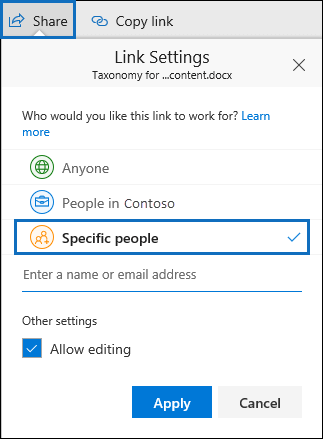

# <a name="keyword-queries-and-search-conditions-for-ediscovery"></a>Consultas de palabras clave y condiciones de búsqueda para eDiscovery

En este artículo se describen las propiedades de correo electrónico y documento que puede buscar en los elementos de correo electrónico y las conversaciones de chat de Microsoft Teams en Exchange Online, y los documentos almacenados en SharePoint y OneDrive para la Empresa sitios mediante las herramientas de búsqueda de eDiscovery en el portal de cumplimiento Microsoft Purview. Esto incluye búsqueda de contenido, Microsoft Purview eDiscovery (estándar) y Microsoft Purview eDiscovery (Premium) (las búsquedas de eDiscovery en eDiscovery (Premium) se denominan *colecciones*). También puede usar los **\*cmdlets -ComplianceSearch** de Security & Compliance PowerShell para buscar estas propiedades. En el artículo también se describe lo siguiente:

- Usar operadores de búsqueda booleanos, condiciones de búsqueda y otras técnicas de consulta de búsqueda para refinar los resultados de la búsqueda.
- Buscar tipos de datos confidenciales y tipos de datos confidenciales personalizados en SharePoint y OneDrive para la Empresa.
- Búsqueda de contenido del sitio compartido con usuarios fuera de la organización

Para obtener instrucciones paso a paso sobre cómo crear diferentes búsquedas de exhibición de documentos electrónicos, consulte:

- [Búsqueda de contenido](content-search.md)
- [Búsqueda de contenido en eDiscovery (estándar)](search-for-content-in-core-ediscovery.md)
- [Creación de una colección de borradores en eDiscovery (Premium)](create-draft-collection.md)

> [!NOTE]
> Las búsquedas de eDiscovery en el portal de cumplimiento y los cmdlets **-ComplianceSearch correspondientes\*** en PowerShell de cumplimiento de seguridad & usan el lenguaje de consulta de palabras clave (KQL). Para obtener información más detallada, vea [Referencia de sintaxis del lenguaje de consulta de palabras clave](/sharepoint/dev/general-development/keyword-query-language-kql-syntax-reference).

## <a name="searchable-email-properties"></a>Propiedades del correo electrónico que permiten búsquedas

En la tabla siguiente se enumeran las propiedades de mensaje de correo electrónico que se pueden buscar mediante las herramientas de búsqueda de eDiscovery en el portal de cumplimiento o mediante **new-compliancesearch** o el cmdlet **Set-ComplianceSearch** . La tabla incluye un ejemplo de la sintaxis  _propiedad:valor_ de cada propiedad y una descripción de los resultados de búsqueda devueltos por los ejemplos. Puede escribir estos  `property:value` pares en el cuadro palabras clave para una búsqueda de exhibición de documentos electrónicos.

> [!NOTE]
> Al buscar propiedades de correo electrónico, no es posible buscar elementos en los que la propiedad especificada esté vacía o en blanco. Por ejemplo, el uso del par *property:value* de **subject:""** para buscar mensajes de correo electrónico con una línea de asunto vacía devolverá cero resultados. Esto también se aplica al buscar propiedades de sitio y contacto.

|Propiedad|Descripción de la propiedad|Ejemplos|Resultados de la búsqueda devueltos por los ejemplos|
|---|---|---|---|
|AttachmentNames|Los nombres de los archivos adjuntos a un mensaje de correo electrónico.|`attachmentnames:annualreport.ppt` <p> `attachmentnames:annual*` <br/> `attachmentnames:.pptx`|Los mensajes con un archivo adjunto denominado informeanual.ppt. En el segundo ejemplo, el uso del carácter comodín ( * ) devuelve mensajes con la palabra "annual" en el nombre de archivo de un archivo adjunto. En el tercer ejemplo se devuelven todos los datos adjuntos con la extensión de archivo pptx.|
|Bcc|Campo CCO de un mensaje de correo electrónico. <sup>1</sup>|`bcc:pilarp@contoso.com` <p> `bcc:pilarp` <p> `bcc:"Pilar Pinilla"`|Todos los ejemplos devuelven los mensajes que incluyen a Pilar Pinilla en el campo CCO.<br>([Consulte Expansión de destinatarios](keyword-queries-and-search-conditions.md#recipient-expansion))|
|Category|Las categorías para buscar. Los usuarios pueden definir categorías mediante Outlook o Outlook en la Web (anteriormente conocidas como Outlook Web App). Los valores posibles son: <ul><li>azul<li>verde<li>naranja<li>púrpura<li>rojo<li>amarillo</li></ul>|`category:"Red Category"`|Los mensajes a los que se ha asignado la categoría roja en los buzones de origen.|
|CC|Campo Cc de un mensaje de correo electrónico. <sup>1</sup>|`cc:pilarp@contoso.com` <p> `cc:"Pilar Pinilla"`|En ambos ejemplos, los mensajes con Pilar Pinilla especificados en el campo Cc.<br>([Consulte Expansión de destinatarios](keyword-queries-and-search-conditions.md#recipient-expansion))|
|Folderid|Identificador de carpeta (GUID) de una carpeta de buzón específica. Si usa esta propiedad, asegúrese de buscar en el buzón en el que se encuentra la carpeta especificada. Solo se buscará la carpeta especificada. No se buscarán las subcarpetas de la carpeta. Para buscar subcarpetas, debe usar la propiedad Folderid para la subcarpeta que desea buscar. <p> Para obtener más información sobre cómo buscar la propiedad Folderid y usar un script para obtener los identificadores de carpeta de un buzón específico, vea [Usar búsqueda de contenido para colecciones de destino](use-content-search-for-targeted-collections.md).|`folderid:4D6DD7F943C29041A65787E30F02AD1F00000000013A0000` <p> `folderid:2370FB455F82FC44BE31397F47B632A70000000001160000 AND participants:garthf@contoso.com`|En el primer ejemplo se devuelven todos los elementos de la carpeta de buzón especificada. En el segundo ejemplo se devuelven todos los elementos de la carpeta de buzón de correo especificada enviadas o recibidas por garthf@contoso.com.|
|De|El remitente de un mensaje de correo electrónico.<sup>1</sup>|`from:pilarp@contoso.com` <p> `from:contoso.com`|Los mensajes enviados por el usuario especificado o enviados desde un dominio especificado.<br>([Consulte Expansión de destinatarios](keyword-queries-and-search-conditions.md#recipient-expansion))|
|HasAttachment|Indica si un mensaje tiene datos adjuntos. Use los valores **true** o **false**.|`from:pilar@contoso.com AND hasattachment:true`|Mensajes enviados por el usuario especificado que tienen datos adjuntos.|
|Importance|La importancia de un mensaje de correo electrónico, que un remitente puede especificar al enviar un mensaje. De manera predeterminada, los mensajes se envían con importancia normal, a menos que el remitente establezca la importancia como **alta** o **baja**.  |`importance:high` <p> `importance:medium` <p> `importance:low`|Los mensajes que están marcados con importancia alta, importancia media o importancia baja.|
|IsRead|Indica si se han leído los mensajes. Use los valores **true** o **false**.|`isread:true` <p> `isread:false`|El primer ejemplo devuelve mensajes con la propiedad IsRead establecida en **True**. El segundo ejemplo devuelve mensajes con la propiedad IsRead establecida en **False**.|
|ItemClass|Use esta propiedad para buscar tipos de datos de terceros específicos que la organización importó a Office 365. Use la sintaxis siguiente para esta propiedad:  `itemclass:ipm.externaldata.<third-party data type>*`|`itemclass:ipm.externaldata.Facebook* AND subject:contoso` <p> `itemclass:ipm.externaldata.Twitter* AND from:"Ann Beebe" AND "Northwind Traders"`|El primer ejemplo devuelve elementos de Facebook que contienen la palabra "contoso" en la propiedad Subject. El segundo ejemplo devuelve elementos de Twitter publicados por Ann Beebe y que contienen la frase de palabra clave "Northwind Traders". <p> Para obtener una lista completa de los valores que se usarán para los tipos de datos de terceros para la propiedad ItemClass, vea [Usar búsqueda de contenido para buscar datos de terceros importados a Office 365](use-content-search-to-search-third-party-data-that-was-imported.md).|
|Tipo|Tipo de mensaje de correo electrónico que se va a buscar. Valores posibles: <p>  contactos <p>  documentos <p>  correo electrónico <p>  externaldata <p>  faxes <p>  mensajería instantánea <p>  diarios <p>  reuniones <p>  microsoftteams (devuelve elementos de chats, reuniones y llamadas en Microsoft Teams) <p>  notas <p>  entradas <p>  fuentes rss <p>  tareas <p>  correo de voz|`kind:email` <p> `kind:email OR kind:im OR kind:voicemail` <p> `kind:externaldata`|El primer ejemplo devuelve mensajes de correo electrónico que cumplen los criterios de búsqueda. El segundo ejemplo devuelve mensajes de correo electrónico, conversaciones de mensajería instantánea (incluidas Skype Empresarial conversaciones y chats en Microsoft Teams) y mensajes de voz que cumplen los criterios de búsqueda. El tercer ejemplo devuelve elementos importados a buzones de Microsoft 365 de orígenes de datos de terceros, como Twitter, Facebook y Cisco Jabber, que cumplen los criterios de búsqueda. Para obtener más información, consulte [Archivado de datos de terceros en Office 365](https://www.microsoft.com/?ref=go).|
|Participantes|Todos los campos de personas de un mensaje de correo electrónico. Estos campos son From, To, Cc y Bcc.1<sup></sup>|`participants:garthf@contoso.com` <p> `participants:contoso.com`|Los mensajes enviados por o a garthf@contoso.com. El segundo ejemplo devuelve todos los mensajes enviados por o a un usuario en el dominio contoso.com.<br>([Consulte Expansión de destinatarios](keyword-queries-and-search-conditions.md#recipient-expansion))|
|Received|La fecha en la que un destinatario recibió un mensaje de correo electrónico.|`received:2021-04-15` <p> `received>=2021-01-01 AND received<=2021-03-31`|Mensajes recibidos el 15 de abril de 2021. El segundo ejemplo devuelve todos los mensajes recibidos entre el 1 de enero de 2021 y el 31 de marzo de 2021.|
|Recipientes|Todos los campos de destinatario de un mensaje de correo electrónico. Estos campos son To, Cc y Bcc.1<sup></sup>|`recipients:garthf@contoso.com` <p> `recipients:contoso.com`|Mensajes enviados a garthf@contoso.com. El segundo ejemplo devuelve los mensajes enviados a todos los destinatarios en el dominio contoso.com.<br>([Consulte Expansión de destinatarios](keyword-queries-and-search-conditions.md#recipient-expansion))|
|Sent|La fecha en la que un remitente envió un mensaje de correo electrónico.|`sent:2021-07-01` <p> `sent>=2021-06-01 AND sent<=2021-07-01`|Mensajes que se enviaron en la fecha especificada o que se enviaron dentro del intervalo de fechas especificado.|
|Size|El tamaño de un elemento, en bytes.|`size>26214400` <p> `size:1..1048567`|Mensajes de más de 25 MB. El segundo ejemplo devuelve los mensajes que tienen un tamaño de entre 1 y 1 048 567 bytes (1 MB).|
|Subject|El texto en la línea de asunto de un mensaje de correo electrónico. <p> **Nota:** Cuando se usa la propiedad Subject en una consulta, la búsqueda devuelve todos los mensajes en los que la línea de asunto contiene el texto que está buscando. En otras palabras, la consulta no devuelve solo los mensajes que tienen una coincidencia exacta. Por ejemplo, si busca  `subject:"Quarterly Financials"`, los resultados incluirán mensajes con el asunto "Quarterly Financials 2018".|`subject:"Quarterly Financials"` <p> `subject:northwind`|Mensajes que contienen la frase "Quarterly Financials" en cualquier parte del texto de la línea de asunto. El segundo ejemplo devuelve todos los mensajes que contienen la palabra northwind en la línea de asunto.|
|To|El campo Para de un mensaje de correo electrónico.<sup>1</sup>|`to:annb@contoso.com` <p> `to:annb ` <br/> `to:"Ann Beebe"`|Todos los ejemplos devuelven mensajes en los que Ann Beebe está especificada en la línea Para.|

> [!NOTE]
> <sup>1</sup> Para el valor de una propiedad de destinatario, puede usar la dirección de correo electrónico (también denominada *nombre principal de usuario* o UPN), nombre para mostrar o alias para especificar un usuario. Por ejemplo, para especificar el usuario Ann Beebe, puede usar annb@contoso.com, annb o "Ann Beebe".

### <a name="recipient-expansion"></a>Expansión de destinatarios

Al buscar en cualquiera de las propiedades de destinatario (From, To, Cc, Bcc, Participants y Recipients), Microsoft 365 intenta expandir la identidad de cada usuario buscándola en Azure Active Directory (Azure AD).  Si el usuario se encuentra en Azure AD, la consulta se expande para incluir la dirección de correo electrónico del usuario (o UPN), el alias, el nombre para mostrar y LegacyExchangeDN. Por ejemplo, una consulta como `participants:ronnie@contoso.com` se expande a `participants:ronnie@contoso.com OR participants:ronnie OR participants:"Ronald Nelson" OR participants:"<LegacyExchangeDN>"`.

Para evitar la expansión del destinatario, agregue un carácter comodín (asterisco) al final de la dirección de correo electrónico y use un nombre de dominio reducido; por ejemplo, `participants:"ronnie@contoso*"` asegúrese de rodear la dirección de correo electrónico con comillas dobles.

Sin embargo, tenga en cuenta que evitar la expansión de destinatarios en la consulta de búsqueda puede dar lugar a que los elementos pertinentes no se devuelvan en los resultados de la búsqueda. Los mensajes de correo electrónico en Exchange se pueden guardar con diferentes formatos de texto en los campos de destinatario. La expansión de destinatarios está pensada para ayudar a mitigar este hecho devolviendo mensajes que pueden contener diferentes formatos de texto. Por lo tanto, impedir la expansión de destinatarios puede dar lugar a que la consulta de búsqueda no devuelva todos los elementos que pueden ser relevantes para la investigación.

> [!NOTE]
> Si necesita revisar o reducir los elementos devueltos por una consulta de búsqueda debido a la expansión del destinatario, considere la posibilidad de usar eDiscovery (Premium). Puede buscar mensajes (aprovechando la expansión de destinatarios), agregarlos a un conjunto de revisión y, a continuación, usar consultas o filtros de conjuntos de revisiones para revisar o restringir los resultados. Para obtener más información, vea [Recopilar datos para un caso](collecting-data-for-ediscovery.md) y [Consultar los datos de un conjunto de revisión](review-set-search.md).

## <a name="searchable-site-properties"></a>Propiedades de sitio que se pueden buscar

En la tabla siguiente se enumeran algunas de las propiedades de SharePoint y OneDrive para la Empresa que se pueden buscar mediante las herramientas de búsqueda de eDiscovery en el portal de cumplimiento Microsoft Purview o mediante **New-ComplianceSearch** o el cmdlet **Set-ComplianceSearch**. La tabla incluye un ejemplo de la sintaxis  _propiedad:valor_ de cada propiedad y una descripción de los resultados de búsqueda devueltos por los ejemplos.

Para obtener una lista completa de las propiedades de SharePoint que se pueden buscar, vea [Información general sobre las propiedades rastreadas y administradas en SharePoint](/SharePoint/technical-reference/crawled-and-managed-properties-overview). Se pueden buscar propiedades marcadas con **sí** en la columna **Consultable** .

|Propiedad|Descripción de la propiedad|Ejemplo|Resultados de la búsqueda devueltos por los ejemplos|
|---|---|---|---|
|Autor|El campo de autor de los documentos de Office, que persiste si se copia un documento. Por ejemplo, si un usuario crea un documento y lo envía por correo electrónico a otra persona que luego lo carga en SharePoint, el documento conservará el autor original. Asegúrese de usar el nombre para mostrar del usuario para esta propiedad.|`author:"Garth Fort"`|Todos los documentos que se han creado por Juan Casanova.|
|ContentType|Tipo de contenido de SharePoint de un elemento, como Item, Document o Video.|`contenttype:document`|Se devolverán todos los documentos.|
|Fecha de creación|La fecha en la que se crea un elemento.|`created>=2021-06-01`|Todos los elementos creados a partir del 1 de junio de 2021.|
|CreatedBy|La persona que creó o cargó un elemento. Asegúrese de usar el nombre para mostrar del usuario para esta propiedad.|`createdby:"Garth Fort"`|Todos los elementos creados o cargados por Juan Casanova.|
|DetectedLanguage|El idioma de un elemento.|`detectedlanguage:english`|Todos los elementos en inglés.|
|DocumentLink|Ruta de acceso (URL) de una carpeta específica en un sitio de SharePoint o OneDrive para la Empresa. Si usa esta propiedad, asegúrese de buscar en el sitio en el que se encuentra la carpeta especificada. <p> Para devolver elementos ubicados en subcarpetas de la carpeta que especifique para la propiedad documentlink, debe agregar /\* a la dirección URL de la carpeta especificada; por ejemplo, `documentlink: "https://contoso.sharepoint.com/Shared Documents/*"` <p> <br/>Para obtener más información sobre cómo buscar la propiedad documentlink y usar un script para obtener las direcciones URL de vínculo de documento para carpetas en un sitio específico, vea [Usar búsqueda de contenido para colecciones de destino](use-content-search-for-targeted-collections.md).|`documentlink:"https://contoso-my.sharepoint.com/personal/garthf_contoso_com/Documents/Private"` <p> `documentlink:"https://contoso-my.sharepoint.com/personal/garthf_contoso_com/Documents/Shared with Everyone/*" AND filename:confidential`|En el primer ejemplo se devuelven todos los elementos de la carpeta OneDrive para la Empresa especificada. En el segundo ejemplo se devuelven documentos de la carpeta de sitio especificada (y todas las subcarpetas) que contienen la palabra "confidencial" en el nombre de archivo.|
|FileExtension|Extensión de un archivo; por ejemplo, docx, one, pptx o xlsx.|`fileextension:xlsx`|Todos los archivos de Excel (Excel 2007 y versiones posteriores)|
|FileName|El nombre de un archivo.|`filename:"marketing plan"` <p> `filename:estimate`|El primer ejemplo devuelve archivos con la frase exacta "plan de marketing" en el título. El segundo ejemplo devuelve archivos con la palabra "estimación" en el nombre del archivo.|
|LastModifiedTime|La fecha de la última modificación de un elemento.|`lastmodifiedtime>=2021-05-01` <p> `lastmodifiedtime>=2021-05-01 AND lastmodifiedtime<=2021-06-01`|El primer ejemplo devuelve elementos que se cambiaron el 1 de mayo de 2021 o después de . El segundo ejemplo devuelve elementos modificados entre el 1 de mayo de 2021 y el 1 de junio de 2021.|
|ModifiedBy|La última persona que modificó un elemento. Asegúrese de usar el nombre para mostrar del usuario para esta propiedad.|`modifiedby:"Garth Fort"`|Todos los elementos que Juan Casanova modificó por última vez.|
|Ruta de acceso|Ruta de acceso (URL) de un sitio específico en un sitio de SharePoint o OneDrive para la Empresa. <p> Para devolver elementos solo del sitio especificado, debe agregar el final `/` al final de la dirección URL; por ejemplo, `path: "https://contoso.sharepoint.com/sites/international/"` <p> Para devolver elementos ubicados en carpetas del sitio que especifique en la propiedad path, debe agregar `/*` al final de la dirección URL; por ejemplo,  `path: "https://contoso.sharepoint.com/Shared Documents/*"` <p> **Nota:** El uso de la `Path` propiedad para buscar ubicaciones de OneDrive no devolverá archivos multimedia, como archivos .png, .tiff o .wav, en los resultados de la búsqueda. Use otra propiedad de sitio en la consulta de búsqueda para buscar archivos multimedia en carpetas de OneDrive. <br/>|`path:"https://contoso-my.sharepoint.com/personal/garthf_contoso_com/"` <p> `path:"https://contoso-my.sharepoint.com/personal/garthf_contoso_com/*" AND filename:confidential`|En el primer ejemplo se devuelven todos los elementos del sitio de OneDrive para la Empresa especificado. En el segundo ejemplo se devuelven documentos del sitio especificado (y carpetas del sitio) que contienen la palabra "confidencial" en el nombre de archivo.|
|SharedWithUsersOWSUser|Documentos que se han compartido con el usuario especificado y que se muestran en la página **Compartido conmigo** del sitio OneDrive para la Empresa del usuario. Estos son documentos que otras personas de la organización han compartido explícitamente con el usuario especificado. Al exportar documentos que coinciden con una consulta de búsqueda que usa la propiedad SharedWithUsersOWSUser, los documentos se exportan desde la ubicación de contenido original de la persona que compartió el documento con el usuario especificado. Para obtener más información, consulte [Búsqueda de contenido de sitio compartido dentro de su organización](#searching-for-site-content-shared-within-your-organization).|`sharedwithusersowsuser:garthf` <p> `sharedwithusersowsuser:"garthf@contoso.com"`|Ambos ejemplos devuelven todos los documentos internos que se han compartido explícitamente con Garth Fort y que aparecen en la página **Compartido conmigo** de la cuenta OneDrive para la Empresa de Garth Fort.|
|Site|La dirección URL de un sitio o grupo de sitios de la organización.|`site:"https://contoso-my.sharepoint.com"` <p> `site:"https://contoso.sharepoint.com/sites/teams"`|El primer ejemplo devuelve elementos de los sitios de OneDrive para la Empresa para todos los usuarios de la organización. El segundo ejemplo devuelve los elementos de todos los sitios del equipo.|
|Size|El tamaño de un elemento, en bytes.|`size>=1` <p> `size:1..10000`|El primer ejemplo devuelve elementos mayores de 1 byte. El segundo ejemplo devuelve elementos que tienen un tamaño de entre 1 y 10 000 bytes.|
|Cargo|El título del documento. La propiedad Title es metadatos que se especifican en documentos de Microsoft Office. Es diferente del nombre de archivo del documento.|`title:"communication plan"`|Cualquier documento que contenga la frase "plan de comunicación" en la propiedad Título de metadatos de un documento de Office.|

## <a name="searchable-contact-properties"></a>Propiedades de contacto que se pueden buscar

En la tabla siguiente se enumeran las propiedades de contacto indexadas y que puede buscar mediante las herramientas de búsqueda de exhibición de documentos electrónicos. Estas son las propiedades que están disponibles para que los usuarios configuren para los contactos (también denominados contactos personales) que se encuentran en la libreta de direcciones personal del buzón de un usuario. Para buscar contactos, puede seleccionar los buzones para buscar y, a continuación, usar una o varias propiedades de contacto en la consulta de palabras clave.

> [!TIP]
> Para buscar valores que contengan espacios o caracteres especiales, use comillas dobles (" ") para contener la frase; por ejemplo, `businessaddress:"123 Main Street"`.

|Propiedad|Descripción de la propiedad|
|---|---|
|BusinessAddress|Dirección de la propiedad **Dirección de** negocio. La propiedad también se denomina dirección **de trabajo** en la página de propiedades de contacto.|
|BusinessPhone|Número de teléfono en cualquiera de las propiedades de número de **teléfono de empresa** .|
|CompanyName|Nombre de la propiedad **Company** .|
|Departamento|Nombre de la propiedad **Department** .|
|DisplayName|Nombre para mostrar del contacto. Este es el nombre de la propiedad **Full Name** del contacto.|
|EmailAddress|Dirección de cualquier propiedad de dirección de correo electrónico para el contacto. Los usuarios pueden agregar varias direcciones de correo electrónico para un contacto. El uso de esta propiedad devolvería contactos que coincidan con cualquiera de las direcciones de correo electrónico del contacto.|
|FileAs|La propiedad **File as** . Esta propiedad se usa para especificar cómo se muestra el contacto en la lista de contactos del usuario. Por ejemplo, un contacto podría aparecer como  *FirstName, LastName*  o  *LastName,FirstName*.|
|GivenName|Nombre de la propiedad **First Name** .|
|HomeAddress|Dirección de cualquiera de las propiedades de la dirección **principal** .|
|HomePhone|Número de teléfono en cualquiera **de las propiedades** del número de teléfono principal.|
|Propiedad IMAddress|La propiedad de dirección de MI, que suele ser una dirección de correo electrónico que se usa para la mensajería instantánea.|
|MiddleName|Nombre de la propiedad **Middle** name.|
|MobilePhone|Número de teléfono de la propiedad **Número de teléfono móvil** .|
|Nickname|Nombre de la propiedad **Nickname** .|
|OfficeLocation|Valor de la propiedad de **ubicación** de **Office** u Office.|
|OtherAddress|Valor de la propiedad **Other** address.|
|Surname|Nombre de la propiedad **Apellido** .|
|Cargo|Título de la propiedad **Job title** .|

## <a name="searchable-sensitive-data-types"></a>Tipos de datos confidenciales que se pueden buscar

Puede usar las herramientas de búsqueda de eDiscovery en el portal de cumplimiento para buscar datos confidenciales, como números de tarjeta de crédito o números de seguridad social, que se almacenan en documentos en SharePoint y OneDrive para la Empresa sitios. Para ello, use la `SensitiveType` propiedad y el nombre (o identificador) de un tipo de información confidencial en una consulta de palabras clave. Por ejemplo, la consulta `SensitiveType:"Credit Card Number"` devuelve documentos que contienen un número de tarjeta de crédito. La consulta  `SensitiveType:"U.S. Social Security Number (SSN)"` devuelve documentos que contienen un número de seguro social estadounidense.

Para ver una lista de los tipos de información confidencial que puede buscar, vaya a **Clasificaciones** \> de datos **Tipos de información confidencial** en el portal de cumplimiento. O bien, puede usar el cmdlet **Get-DlpSensitiveInformationType** en PowerShell de cumplimiento de seguridad & para mostrar una lista de tipos de información confidencial.

Para obtener más información sobre cómo crear consultas mediante la `SensitiveType` propiedad , vea [Formulario de una consulta para buscar datos confidenciales almacenados en sitios](form-a-query-to-find-sensitive-data-stored-on-sites.md).

### <a name="limitations-for-searching-sensitive-data-types"></a>Limitaciones para buscar tipos de datos confidenciales

- Para buscar tipos de información confidencial personalizados, debe especificar el identificador del tipo de información confidencial en la `SensitiveType` propiedad . El uso del nombre de un tipo de información confidencial personalizada (como se muestra en el ejemplo para los tipos de información confidencial integrados en la sección anterior) no devolverá ningún resultado. Use la columna **Publicador** en la página **Tipos de información confidencial** del centro de cumplimiento (o la propiedad **Publisher** en PowerShell) para diferenciar entre los tipos de información confidencial integrados y personalizados. Los tipos de datos confidenciales integrados tienen un valor de `Microsoft Corporation` para la propiedad **Publisher** .

  Para mostrar el nombre y el identificador de los tipos de datos confidenciales personalizados de su organización, ejecute el siguiente comando en PowerShell de seguridad & cumplimiento:

  ```powershell
  Get-DlpSensitiveInformationType | Where-Object {$_.Publisher -ne "Microsoft Corporation"} | FT Name,Id
  ```

  A continuación, puede usar el identificador en la `SensitiveType` propiedad de búsqueda para devolver documentos que contengan el tipo de datos confidenciales personalizado; por ejemplo, `SensitiveType:7e13277e-6b04-3b68-94ed-1aeb9d47de37`

- No puede usar tipos de información confidencial y la `SensitiveType` propiedad de búsqueda para buscar datos confidenciales en reposo en Exchange Online buzones. Esto incluye mensajes de chat 1:1, mensajes de chat de grupo 1:N y conversaciones de canal de equipo en Microsoft Teams porque todo este contenido se almacena en buzones de correo. Sin embargo, puede usar directivas de prevención de pérdida de datos (DLP) para proteger los datos de correo electrónico confidenciales en tránsito. Para obtener más información, consulte [Información sobre la prevención de pérdida de datos](dlp-learn-about-dlp.md) y [Búsqueda y búsqueda de datos personales](/compliance/regulatory/gdpr).

## <a name="search-operators"></a>Operadores de búsqueda

Los operadores de búsqueda booleanos, como **AND**, **OR** y **NOT**, le ayudan a definir búsquedas más precisas incluyendo o excluyendo palabras específicas en la consulta de búsqueda. Otras técnicas, como el uso de operadores de propiedad (como `>=` o `..`), comillas, paréntesis y caracteres comodín, le ayudan a refinar una consulta de búsqueda. En la siguiente tabla se muestran los operadores que puede usar para restringir o ampliar los resultados de la búsqueda.

|Operador|Uso|Descripción|
|---|---|---|
|AND|palabra clave 1 AND palabra clave 2|Devuelve elementos que incluyen todas las palabras clave o  `property:value` expresiones especificadas. Por ejemplo,  `from:"Ann Beebe" AND subject:northwind` devolvería todos los mensajes enviados por Ann Beebe que contenían la palabra northwind en la línea de asunto. <sup>2</sup>|
|+|keyword1 + keyword2 + keyword3|Devuelve elementos que contienen  *o*  `keyword2` o  `keyword3` *y*  que también contienen  `keyword1`. Por tanto, este ejemplo es equivalente a la consulta  `(keyword2 OR keyword3) AND keyword1`.  <p> La consulta  `keyword1 + keyword2` (con un espacio después del **+** símbolo) no es la misma que el uso del operador **AND** . This query would be equivalent to  `"keyword1 + keyword2"` and return items with the exact phase  `"keyword1 + keyword2"`.|
|OR|palabra clave 1 OR palabra clave 2|Devuelve elementos que incluyen una o varias de las palabras clave o  `property:value` expresiones especificadas. <sup>2</sup>|
|NOT|palabra clave 1 NOT palabra clave 2 <p> NOT from:"Ann Beebe" <p> NO kind:im|Excluye los elementos especificados por una palabra clave o una  `property:value` expresión. En el segundo ejemplo se excluyen los mensajes enviados por Ann Beebe. En el tercer ejemplo se excluyen las conversaciones de mensajería instantánea, como Skype Empresarial conversaciones que se guardan en la carpeta del buzón historial de conversaciones. <sup>2</sup>|
|-|palabra clave 1 - palabra clave 2|Igual que el operador **NOT**. Por lo tanto, esta consulta devuelve elementos que contienen  `keyword1` y excluirían los elementos que contienen  `keyword2`.|
|NEAR|palabra clave 1 NEAR(n) palabra clave 2|Devuelve los elementos con palabras cercanas entre sí, donde "n" indica el número de palabras que las separan. Por ejemplo, `best NEAR(5) worst` devuelve cualquier elemento donde la palabra "worst" esté dentro de cinco palabras de "best". Si no se especifica ningún número, la distancia predeterminada es de ocho palabras. <sup>2</sup>|
|:|propiedad:valor|Dos puntos (:) en la  `property:value` sintaxis especifica que el valor de la propiedad que se está buscando contiene el valor especificado. Por ejemplo,  `recipients:garthf@contoso.com` devuelve cualquier mensaje enviado a garthf@contoso.com.|
|=|property=value|Igual que el operador **:** .|
|\<|propiedad\<valor|Indica que la propiedad que se busca es menor que el valor especificado. <sup>1</sup>|
|\>|propiedad\>valor|Indica que la propiedad que se busca es mayor que el valor especificado.<sup>1</sup>|
|\<=|propiedad\<=valor|Indica que la propiedad que se busca es menor o igual que un valor especificado.<sup>1</sup>|
|\>=|propiedad\>=valor|Indica que la propiedad que se busca es mayor o igual que un valor especificado.<sup>1</sup>|
|..|property:value1.. value2|Indica que la propiedad que se busca es mayor o igual que el valor 1 y menor o igual que el valor 2.<sup>1</sup>|
|"  "|"valor razonable" <p> subject:"Finanzas trimestrales"|En una consulta de palabra clave (donde escribe el `property:value` par en el cuadro **Palabra clave** ), use comillas dobles (" ") para buscar una frase o un término exactos. Sin embargo, si usa la condición de [condición de búsqueda](#search-conditions) **Asunto** o **Asunto/Título**, no agregue comillas dobles al valor porque las comillas se agregan automáticamente al usar estas condiciones de búsqueda. Si agrega comillas al valor, se agregarán dos pares de comillas dobles al valor de condición y la consulta de búsqueda devolverá un error. |
|\*|cat\* <p> subject:set\*|Búsquedas de prefijos (también denominada *coincidencia de prefijos*) donde se coloca un carácter comodín ( * ) al final de una palabra en palabras clave o `property:value` consultas. En las búsquedas de prefijos, la búsqueda devuelve resultados con términos que contienen la palabra seguida de cero o más caracteres. Por ejemplo, `title:set*` devuelve documentos que contienen la palabra "set", "setup" y "setting" (y otras palabras que comienzan por "set") en el título del documento. <p> **Nota:** Solo puede usar búsquedas de prefijos; por ejemplo, **cat\**_ o _* set\**_. No se admiten las búsquedas de sufijos (_*\*cat**), las búsquedas de infijo (**c\*t**) y las búsquedas de subcadenas (**\*cat\***). <p> Además, agregar un punto ( \. ) a una búsqueda de prefijos cambiará los resultados que se devuelven. Esto se debe a que un punto se trata como una palabra irrelevante. Por ejemplo, la búsqueda de **cat\**_ y la búsqueda de _* cat devolverán\*** resultados diferentes. Se recomienda no usar un punto en una búsqueda de prefijos.|
|(  )| (razonable OR libre) AND from:contoso.com <p> (IPO OR inicial) AND (acciones OR cuotas) <p> (finanzas trimestrales)|Los paréntesis agrupan frases booleanas, elementos  `property:value` y palabras clave. Por ejemplo,  `(quarterly financials)` devuelve los elementos que contienen las palabras trimestral y finanzas.  |

> [!NOTE]
> <sup>1</sup> Use este operador para las propiedades que tienen valores numéricos o de fecha.<br/> <sup>2</sup> Los operadores de búsqueda booleanos deben estar en mayúsculas; por ejemplo, **AND**. Si usa un operador en minúsculas, como **y**, se tratará como una palabra clave en la consulta de búsqueda.

## <a name="search-conditions"></a>Condiciones de búsqueda

Puede agregar condiciones a una consulta de búsqueda para restringir una búsqueda y devolver un conjunto de resultados más refinado. Cada condición agrega una cláusula a la consulta de búsqueda KQL que se crea y se ejecuta cuando se inicia la búsqueda.

[Condiciones para las propiedades comunes ](#conditions-for-common-properties)

[Condiciones para las propiedades de correo](#conditions-for-mail-properties)

[Condiciones para las propiedades de documento](#conditions-for-document-properties)

[Operadores usados con condiciones](#operators-used-with-conditions)

[Directrices para el uso de condiciones](#guidelines-for-using-conditions)

[Ejemplos](#examples-of-using-conditions-in-search-queries)

### <a name="conditions-for-common-properties"></a>Condiciones para las propiedades comunes

Cree una condición mediante propiedades comunes al buscar en buzones y sitios de la misma búsqueda. En la tabla siguiente se enumeran las propiedades disponibles que se usarán al agregar una condición.

|Condición|Descripción|
|---|---|
|Fecha|Para correo electrónico, la fecha en que un destinatario recibió un mensaje o en que un remitente envió un mensaje. En el caso de los documentos, la fecha en que se modificó por última vez un documento.|
|Remitente/autor|Para correo electrónico, la persona que envió un mensaje. Para los documentos, la persona mencionada en el campo del autor de documentos de Office. Puede escribir más de un nombre, separados por comas. Dos o más valores están conectados de forma lógica por el operador de **OR**.<br>([Consulte Expansión de destinatarios](keyword-queries-and-search-conditions.md#recipient-expansion))|
|Tamaño (en bytes)|Para los correos electrónicos y documentos, el tamaño del elemento (en bytes).|
|Asunto o título|Para correo electrónico, el texto en la línea de asunto de un mensaje. Para los documentos, el título del documento. Como se explicó anteriormente, la propiedad Title es metadatos especificados en documentos de Microsoft Office. Puede escribir el nombre de más de un valor de asunto o título, separados por comas. Dos o más valores están conectados de forma lógica por el operador de **OR**. <p> **Nota**: No incluya comillas dobles en los valores de esta condición porque las comillas se agregan automáticamente al usar esta condición de búsqueda. Si agrega comillas al valor, se agregarán dos pares de comillas dobles al valor de condición y la consulta de búsqueda devolverá un error.|
|Etiqueta de retención|Tanto para el correo electrónico como para los documentos, etiquetas de retención que se pueden aplicar de forma automática o manual a mensajes y documentos. Las etiquetas de retención se pueden usar para declarar registros y ayudarle a administrar el ciclo de vida de los datos del contenido mediante la aplicación de reglas de retención y eliminación especificadas por la etiqueta. Puede escribir parte del nombre de la etiqueta de retención y usar un carácter comodín o escribir el nombre completo de la etiqueta. Para obtener más información sobre las etiquetas de retención, consulte [Información sobre las directivas de retención y las etiquetas de retención](retention.md).|

### <a name="conditions-for-mail-properties"></a>Condiciones para las propiedades de correo

Cree una condición mediante propiedades de correo al buscar buzones o carpetas públicas. En la tabla siguiente se enumeran las propiedades de correo electrónico que puede usar para una condición. Estas propiedades son un subconjunto de las propiedades de correo electrónico que se describieron anteriormente. Estas descripciones se repiten para su comodidad.

|Condición|Description|
|---|---|
|Tipo de mensaje|El tipo de mensaje para buscar. Se trata de la misma propiedad que la propiedad de correo electrónico Tipo. Valores posibles: <ul><li>contactos</li><li>documentos</li><li>correo electrónico</li><li>externaldata</li><li>fax</li><li>mensajería instantánea</li><li>diarios</li><li>reuniones</li><li>microsoftteams</li><li>notas</li><li>entradas</li><li>fuentes rss</li><li>tareas</li><li>correo de voz</li></ul>|
|Participantes|Todos los campos de personas de un mensaje de correo electrónico. Estos campos son From, To, Cc y Bcc. ([Consulte Expansión de destinatarios](keyword-queries-and-search-conditions.md#recipient-expansion))|
|Tipo|Propiedad de clase de mensaje para un elemento de correo electrónico. Esta es la misma propiedad que la propiedad de correo electrónico ItemClass. También es una condición de varios valores. Por lo tanto, para seleccionar varias clases de mensaje, mantenga presionada la tecla **CTRL** y, a continuación, haga clic en dos o más clases de mensaje en la lista desplegable que desea agregar a la condición. Cada clase de mensaje que seleccione en la lista se conectará lógicamente mediante el operador **OR** en la consulta de búsqueda correspondiente. <p> Para obtener una lista de las clases de mensaje (y su identificador de clase de mensaje correspondiente) que exchange usa y que puede seleccionar en la lista **Clase de** mensaje, vea [Tipos de elementos y Clases de mensaje](/office/vba/outlook/Concepts/Forms/item-types-and-message-classes).|
|Received|La fecha en la que un destinatario recibió un mensaje de correo electrónico. Se trata de la misma propiedad que la propiedad de correo electrónico Recibido.|
|Recipientes|Todos los campos de destinatario de un mensaje de correo electrónico. Estos campos son To, Cc y Bcc. ([Consulte Expansión de destinatarios](keyword-queries-and-search-conditions.md#recipient-expansion))|
|Remitente|El remitente de un mensaje de correo electrónico.|
|Sent|La fecha en la que un remitente envió un mensaje de correo electrónico. Se trata de la misma propiedad que la propiedad de correo electrónico Enviado.|
|Subject|El texto en la línea de asunto de un mensaje de correo electrónico. <p> **Nota**: No incluya comillas dobles en los valores de esta condición porque las comillas se agregan automáticamente al usar esta condición de búsqueda. Si agrega comillas al valor, se agregarán dos pares de comillas dobles al valor de condición y la consulta de búsqueda devolverá un error.|
|To|Destinatario de un mensaje de correo electrónico en el campo Para.|

### <a name="conditions-for-document-properties"></a>Condiciones para las propiedades de documento

Cree una condición mediante propiedades de documento al buscar documentos en SharePoint y OneDrive para la Empresa sitios. En la tabla siguiente se enumeran las propiedades del documento que puede usar para una condición. Estas propiedades son un subconjunto de las propiedades del sitio que se describieron anteriormente. Estas descripciones se repiten para su comodidad.

|Condición|Description|
|---|---|
|Autor|El campo de autor de los documentos de Office, que persiste si se copia un documento. Por ejemplo, si un usuario crea un documento y lo envía por correo electrónico a otra persona que luego lo carga en SharePoint, el documento conservará el autor original.|
|Cargo|El título del documento. La propiedad Título son metadatos que se especifican en los documentos de Office. Es diferente del nombre de archivo del documento.|
|Fecha de creación|La fecha en la que se creó el documento.|
|Última modificación|La fecha en la que el documento se modificó por última vez.|
|Tipo de archivo|Extensión de un archivo; por ejemplo, docx, one, pptx o xlsx. Se trata de la misma propiedad que la propiedad del sitio FileExtension. <p> **Nota:** Si incluye una condición de tipo File mediante el operador **Equals** o **Equals en una consulta de** búsqueda, no puede usar una búsqueda de prefijo (incluyendo el carácter comodín ( \* ) al final del tipo de archivo) para devolver todas las versiones de un tipo de archivo. Si lo hace, se omitirá el carácter comodín. Por ejemplo, si incluye la condición `Equals any of doc*`, solo se devolverán los archivos con una extensión de `.doc` . Los archivos con una extensión de `.docx` no se devolverán. Para devolver todas las versiones de un tipo de archivo, se usa el par *property:value* en una consulta de palabras clave; por ejemplo, `filetype:doc*`.|

### <a name="operators-used-with-conditions"></a>Operadores usados con condiciones

Cuando se agrega una condición, puede seleccionar un operador que sea pertinente para el tipo de propiedad de la condición. En la tabla siguiente se describen los operadores que se usan con condiciones y se enumera el equivalente que se usa en la consulta de búsqueda.

|Operador|Equivalente de consulta|Descripción|
|---|---|---|
|Después|`property>date`|Se usa con condiciones de fecha. Devuelve los elementos que se enviaron, recibieron o modificaron después de la fecha especificada. |
|Antes|`property<date`|Se usa con condiciones de fecha. Devuelve los elementos que se enviaron, recibieron o modificaron antes de la fecha especificada.|
|Between|`date..date`|Se usa con condiciones de fecha y tamaño. Cuando se usa con una condición de fecha, devuelve los elementos que se enviaron, recibieron o modificaron durante el intervalo de fechas especificado. Cuando se usa con una condición de tamaño, devuelve los elementos cuyo tamaño está dentro del intervalo especificado.|
|Contiene cualquiera de|`(property:value) OR (property:value)`|Se usa con condiciones para las propiedades que especifican un valor de cadena. Devuelve elementos que contienen cualquier parte de uno o más valores de cadena especificados.|
|No contiene ninguno de|`-property:value` <p> `NOT property:value`|Se usa con condiciones para las propiedades que especifican un valor de cadena. Devuelve elementos que no contienen ninguna parte del valor de cadena especificado.|
|No es igual a ninguno de|`-property=value` <p> `NOT property=value`|Se usa con condiciones para las propiedades que especifican un valor de cadena. Devuelve elementos que no contienen la cadena especificada.|
|Igual a|`size=value`|Devuelve elementos que son iguales al tamaño especificado. <sup>1</sup>|
|Es igual a cualquiera de|`(property=value) OR (property=value)`|Se usa con condiciones para las propiedades que especifican un valor de cadena. Devuelve elementos que coinciden con uno o varios valores de cadena especificados.|
|Mayor|`size>value`|Devuelve elementos donde la propiedad especificada es mayor que el valor especificado. <sup>1</sup>|
|Mayor o igual|`size>=value`|Devuelve elementos donde la propiedad especificada es mayor o igual que el valor especificado. <sup>1</sup>|
|Menos|`size<value`|Devuelve elementos que son mayores o iguales que el valor específico. <sup>1</sup>|
|Menor o igual|`size<=value`|Devuelve elementos que son mayores o iguales que el valor específico. <sup>1</sup>|
|No es igual|`size<>value`|Devuelve elementos que no son iguales al tamaño especificado. <sup>1</sup>|

> [!NOTE]
> <sup>1</sup> Este operador solo está disponible para las condiciones que usan la propiedad Size.

### <a name="guidelines-for-using-conditions"></a>Directrices para el uso de condiciones

Tenga en cuenta lo siguiente al usar condiciones de búsqueda.

- Una condición se conecta lógicamente a la consulta de palabra clave (especificada en el cuadro de palabra clave) mediante el operador **AND**. Eso significa que los elementos tienen que satisfacer la consulta de palabra clave y la condición para que se incluyan en los resultados. De esta manera, las condiciones permiten restringir los resultados.

- Si agrega dos o más condiciones únicas a una consulta de búsqueda (condiciones que especifican propiedades diferentes), dichas condiciones están conectadas lógicamente mediante el operador **Y**. Esto significa que solo se devuelven los elementos que satisfacen todas las condiciones (además de cualquier consulta de palabras clave).

- Si agrega más de una condición a la misma propiedad, las condiciones se conectan lógicamente mediante el operador **OR**. Eso significa que se devuelven los elementos que satisfacen la consulta de palabras clave y cualquiera de las condiciones. Por lo tanto, los grupos de las mismas condiciones se conectan entre sí mediante el operador **OR** y, después, los conjuntos de condiciones únicas se conectan mediante el operador **AND**.

- Si agrega varios valores (separados por comas o por punto y coma) a una única condición, esos valores se conectan mediante el operador **O**. Eso significa que se devuelven los elementos que contengan cualquiera de los valores especificados para la propiedad en la condición.

- Cualquier condición que use un operador con lógica **Contains** e Equals devolverá resultados de búsqueda similares para **búsquedas** de cadenas simples. Una búsqueda de cadenas simple es una cadena en la condición que no incluye un carácter comodín). Por ejemplo, una condición que usa **Equals cualquiera de** devolverá los mismos elementos que una condición que usa **Contains any of**.

- La consulta de búsqueda que se crea mediante el cuadro de palabras clave y las condiciones se muestra en la página **Buscar** , en el panel de detalles de la búsqueda seleccionada. En una consulta, todo a la derecha de la notación  `(c:c)` indica las condiciones que se agregan a la consulta.

- Las condiciones solo agregan propiedades a la consulta de búsqueda, no agregan operadores. Por este motivo, la consulta mostrada en el panel de detalles no muestra operadores a la derecha de la  `(c:c)` notación. KQL agrega operadores lógicos (según las reglas explicadas anteriormente) al ejecutar la consulta.

- Puede usar el control de arrastrar y colocar para volver a secuenciar el orden de las condiciones. Haga clic en el control de una condición y muévalo hacia arriba o hacia abajo.

- Como se explicó anteriormente, algunas propiedades de condición permiten escribir varios valores (separados por puntos y comas). Cada valor está conectado lógicamente por el operador **OR** y da como resultado la consulta `(filetype=docx) OR (filetype=pptx) OR (filetype=xlsx)`. En la ilustración siguiente se muestra un ejemplo de una condición con varios valores.

    

  > [!NOTE]
  > No puede agregar varias condiciones (haciendo clic en **Agregar condición** para la misma propiedad. En su lugar, debe proporcionar varios valores para la condición (separados por puntos y comas), como se muestra en el ejemplo anterior.

### <a name="examples-of-using-conditions-in-search-queries"></a>Ejemplos

En los ejemplos siguientes se muestra la versión basada en GUI de una consulta de búsqueda con condiciones, la sintaxis de consulta de búsqueda que se muestra en el panel de detalles de la búsqueda seleccionada (que también devuelve el cmdlet **Get-ComplianceSearch** ) y la lógica de la consulta KQL correspondiente.

#### <a name="example-1"></a>Ejemplo 1

En este ejemplo se devuelven documentos en SharePoint y OneDrive para la Empresa sitios que contienen un número de tarjeta de crédito y que se modificaron por última vez antes del 1 de enero de 2021.

**GUI**:


**Sintaxis de consulta de búsqueda**:

`SensitiveType:"Credit Card Number"(c:c)(lastmodifiedtime<2021-01-01)`

**Lógica de consulta de búsqueda**:

`SensitiveType:"Credit Card Number" AND (lastmodifiedtime<2021-01-01)`

Observe en la captura de pantalla anterior que la interfaz de usuario de búsqueda refuerza que el operador **AND** conecta la consulta y la condición de palabra clave.

#### <a name="example-2"></a>Ejemplo 2

En este ejemplo se devuelven elementos de correo electrónico o documentos que contienen la palabra clave "report", que se enviaron o crearon antes del 1 de abril de 2021 y que contienen la palabra "northwind" en el campo asunto de los mensajes de correo electrónico o en la propiedad title de los documentos. La consulta excluye páginas web que cumplen los demás criterios de búsqueda.

**GUI**:


**Sintaxis de consulta de búsqueda**:

`report(c:c)(date<2021-04-01)(subjecttitle:"northwind")(-filetype:aspx)`

**Lógica de consulta de búsqueda**:

`report AND (date<2021-04-01) AND (subjecttitle:"northwind") NOT (filetype:aspx)`

#### <a name="example-3"></a>Ejemplo 3

En este ejemplo se devuelven mensajes de correo electrónico o reuniones de calendario que se enviaron entre el 1 de diciembre de 2019 y el 30 de noviembre de 2020 y que contienen palabras que comienzan por "teléfono" o "smartphone".

**GUI**:


**Sintaxis de consulta de búsqueda**:

`phone* OR smartphone*(c:c)(sent=2019-12-01..2020-11-30)(kind="email")(kind="meetings")`

**Lógica de consulta de búsqueda**:

`phone* OR smartphone* AND (sent=2019-12-01..2020-11-30) AND ((kind="email") OR (kind="meetings"))`

## <a name="special-characters"></a>Caracteres especiales

Algunos caracteres especiales no se incluyen en el índice de búsqueda y, por tanto, no se pueden buscar. Esto también incluye los caracteres especiales que representan a los operadores de búsqueda en la consulta de búsqueda. Esta es una lista de caracteres especiales que se reemplazan por un espacio en blanco en la consulta de búsqueda real o provocan un error de búsqueda.

`+ - = : ! @ # % ^ & ; _ / ? ( ) [ ] { }`

## <a name="searching-for-site-content-shared-with-external-users"></a>Búsqueda de contenido de sitio compartido con usuarios externos

También puede usar herramientas de búsqueda de exhibición de documentos electrónicos en el centro de cumplimiento para buscar documentos almacenados en SharePoint y OneDrive para la Empresa sitios que se han compartido con personas ajenas a su organización. Esto puede ayudarle a identificar información confidencial o de propiedad que esté compartiéndose fuera de su organización. Para ello, use la  `ViewableByExternalUsers` propiedad en una consulta de palabra clave. Esta propiedad devuelve documentos o sitios que se han compartido con usuarios externos mediante uno de los métodos de uso compartido siguientes:

- Una invitación para compartir que requiere que los usuarios inicien sesión en su organización como un usuario autenticado.
- Un vínculo de invitado anónimo, que permite a cualquier usuario con este vínculo acceder al recurso sin tener que autenticarse.

Estos son algunos ejemplos:

- La consulta  `ViewableByExternalUsers:true AND SensitiveType:"Credit Card Number"` devuelve todos los elementos que se han compartido con personas ajenas a la organización y contienen un número de tarjeta de crédito.
- La consulta  `ViewableByExternalUsers:true AND ContentType:document AND site:"https://contoso.sharepoint.com/Sites/Teams"` devuelve una lista de documentos en todos los sitios de equipo de la organización que se han compartido con usuarios externos.

> [!TIP]
> Una consulta de búsqueda como  `ViewableByExternalUsers:true AND ContentType:document` podría devolver una gran cantidad de archivos .aspx en los resultados de la búsqueda. Para eliminar estos (u otros tipos de archivos), puede usar la  `FileExtension` propiedad para excluir tipos de archivo específicos; por ejemplo  `ViewableByExternalUsers:true AND ContentType:document NOT FileExtension:aspx`, .

¿Qué se considera contenido que se comparte con personas externas de su organización? Documentos de SharePoint de su organización y sitios de OneDrive para la Empresa que se comparten mediante el envío de una invitación de uso compartido o que se comparten en ubicaciones públicas. Por ejemplo, las siguientes actividades de usuario dan lugar a contenido que es visible para los usuarios externos:

- Un usuario comparte un archivo o una carpeta con una persona externa a su organización.
- Un usuario crea y envía un vínculo a un archivo compartido a una persona externa a su organización. Este vínculo permite al usuario externo ver (o editar) el archivo.
- Un usuario envía una invitación de uso compartido o un vínculo de invitado a una persona externa a su organización para ver (o editar) un archivo compartido.

### <a name="issues-using-the-viewablebyexternalusers-property"></a>Problemas con la propiedad ViewableByExternalUsers

Aunque la  `ViewableByExternalUsers` propiedad representa el estado de si un documento o sitio se comparte con usuarios externos, hay algunas advertencias sobre lo que hace y no refleja esta propiedad. En los escenarios siguientes, el valor de la  `ViewableByExternalUsers` propiedad no se actualizará y los resultados de una consulta de búsqueda que usa esta propiedad pueden ser inexactos.

- Cambios en la directiva de uso compartido, como desactivar el uso compartido externo para un sitio o para la organización. La propiedad seguirá mostrando documentos compartidos anteriormente como accesibles externamente aunque se haya revocado el acceso externo.
- Cambios en la pertenencia a grupos, como agregar o quitar usuarios externos a Grupos de Microsoft 365 o grupos de seguridad de Microsoft 365. La propiedad no se actualizará automáticamente para los elementos a los que el grupo tiene acceso.
- Enviar invitaciones de uso compartido a usuarios externos donde el destinatario no ha aceptado la invitación y, por tanto, aún no tiene acceso al contenido.

En estos escenarios, la  `ViewableByExternalUsers` propiedad no reflejará el estado de uso compartido actual hasta que el sitio o la biblioteca de documentos se vuelvan a rastrear y volver a indexar.

## <a name="searching-for-site-content-shared-within-your-organization"></a>Búsqueda de contenido de sitio compartido dentro de la organización

Como se explicó anteriormente, puede usar la  `SharedWithUsersOWSUser` propiedad para buscar documentos que se hayan compartido entre personas de su organización. Cuando una persona comparte un archivo (o carpeta) con otro usuario de su organización, aparece un vínculo al archivo compartido en la página **Compartido conmigo** de la cuenta de OneDrive para la Empresa de la persona con la que se ha compartido el archivo. Por ejemplo, para buscar los documentos que se han compartido con Sara Davis, puede usar la consulta  `SharedWithUsersOWSUser:"sarad@contoso.com"`. Si exporta los resultados de esta búsqueda, se descargarán los documentos originales (ubicados en la ubicación de contenido de la persona que compartió los documentos con Sara).

Los documentos deben compartirse explícitamente con un usuario específico para que se devuelvan en los resultados de búsqueda cuando se use la  `SharedWithUsersOWSUser` propiedad . Por ejemplo, cuando una persona comparte un documento en su cuenta de OneDrive, tiene la opción de compartirlo con cualquier persona (dentro o fuera de la organización), compartirlo solo con personas dentro de la organización o compartirlo con una persona específica. Esta es una captura de pantalla de la ventana **Compartir** en OneDrive, que muestra las tres opciones de uso compartido.



Solo los documentos que se comparten mediante la tercera opción (compartidos con **personas específicas**) se devolverán mediante una consulta de búsqueda que use la  `SharedWithUsersOWSUser` propiedad .

## <a name="searching-for-skype-for-business-conversations"></a>Buscar conversaciones Skype Empresarial

Puede usar la siguiente consulta de palabra clave para buscar específicamente contenido en Skype Empresarial conversaciones:

```powershell
kind:im
```

La consulta de búsqueda anterior también devuelve chats de Microsoft Teams. Para evitar esto, puede restringir los resultados de la búsqueda para incluir solo Skype Empresarial conversaciones mediante la siguiente consulta de palabra clave:

```powershell
kind:im AND subject:conversation
```

La consulta de palabra clave anterior excluye los chats en Microsoft Teams porque Skype Empresarial conversaciones se guardan como mensajes de correo electrónico con una línea subject que comienza con la palabra "Conversation".

Para buscar Skype Empresarial conversaciones que se produjeron dentro de un intervalo de fechas específico, use la siguiente consulta de palabra clave:

```powershell
kind:im AND subject:conversation AND (received=startdate..enddate)
```

## <a name="character-limits-for-searches"></a>Límites de caracteres para búsquedas

Hay un límite de 4000 caracteres para las consultas de búsqueda al buscar contenido en sitios de SharePoint y cuentas de OneDrive.
A continuación se muestra cómo se calcula el número total de caracteres de la consulta de búsqueda:

- Los caracteres de la consulta de búsqueda de palabras clave (incluidos los campos de usuario y filtro) cuentan con este límite.
- Los caracteres de cualquier propiedad de ubicación (como las direcciones URL de todos los sitios de SharePoint o las ubicaciones de OneDrive que se buscan) cuentan con este límite.
- Los caracteres de todos los filtros de permisos de búsqueda que se aplican al usuario que ejecuta el recuento de búsquedas con respecto al límite.

Para obtener más información sobre los límites de caracteres, vea [límites de búsqueda de eDiscovery](limits-for-content-search.md#search-limits).

> [!NOTE]
> El límite de 4000 caracteres se aplica a búsqueda de contenido, exhibición de documentos electrónicos (estándar) y exhibición de documentos electrónicos (Premium).

## <a name="search-tips-and-tricks"></a>Trucos y sugerencias de búsqueda

- Las búsquedas de palabras clave no distinguen mayúsculas de minúsculas. Por ejemplo, tanto si escribe **gato** como **GATO**, obtendrá los mismos resultados.

- Los operadores booleanos **AND**, **OR**, **NOT** y **NEAR** deben estar en mayúsculas.

- A space between two keywords or two  `property:value` expressions is the same as using **AND**. Por ejemplo,  `from:"Sara Davis" subject:reorganization` devuelve todos los mensajes enviados por Sara Davis que contienen la palabra reorganización en la línea de asunto.

- Use la sintaxis que coincida con el `property:value` formato. Los valores no distinguen mayúsculas de minúsculas y no pueden tener un espacio después del operador . Si hay un espacio, el valor previsto será una búsqueda de texto completo. Por ejemplo `to: pilarp` , busca "pilarp" como palabra clave, en lugar de para los mensajes que se enviaron a pilarp.

- Al buscar una propiedad de destinatario, como Para, De, Cc o los destinatarios, puede utilizar una dirección SMTP, un alias o un nombre para mostrar para indicar un destinatario. Por ejemplo, puede utilizar pilarp@contoso.com, pilarp o "Pilar Pinilla".

- Solo puede usar búsquedas de prefijos; por ejemplo, **cat\**_ o _* set\**_. No se admiten las búsquedas de sufijos (_*\*cat**), las búsquedas de infijo (**c\*t**) y las búsquedas de subcadenas (**\*cat\***).

- Al buscar en una propiedad, use comillas dobles (" ") si el valor de búsqueda consta de varias palabras. Por ejemplo `subject:budget Q1` , devuelve mensajes que contienen **presupuesto** en la línea de asunto y que contienen **Q1** en cualquier lugar del mensaje o en cualquiera de las propiedades del mensaje. El uso `subject:"budget Q1"` devuelve todos los mensajes que contienen **el presupuesto Q1** en cualquier lugar de la línea de asunto.

- Para excluir de los resultados de la búsqueda el contenido marcado con un valor de propiedad determinado, coloque un signo menos (-) delante del nombre de la propiedad. Por ejemplo, `-from:"Sara Davis"` excluye los mensajes enviados por Sara Davis.

- Puede exportar elementos en función del tipo de mensaje. Por ejemplo, para exportar conversaciones y chats de Skype en Microsoft Teams, use la sintaxis `kind:im`. Para devolver solo mensajes de correo electrónico, usaría `kind:email`. Para devolver chats, reuniones y llamadas en Microsoft Teams, use `kind:microsoftteams`.

- Como se explicó anteriormente, al buscar sitios, debe agregar el final `/` al final de la dirección URL cuando se usa la `path` propiedad para devolver solo los elementos de un sitio especificado. Si no incluye el final `/`, también se devolverán los elementos de un sitio con un nombre de ruta de acceso similar. Por ejemplo, si usa `path:sites/HelloWorld` elementos de sitios denominados `sites/HelloWorld_East` o `sites/HelloWorld_West` también se devolverán. Para devolver elementos solo del sitio HelloWorld, debe usar `path:sites/HelloWorld/`.
