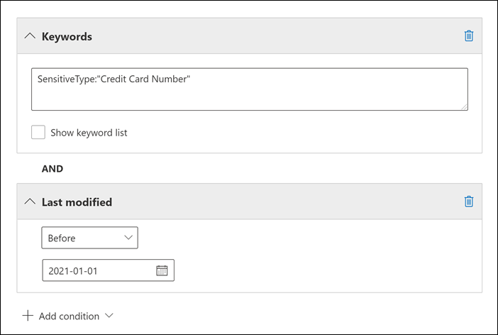

# <a name="keyword-queries-and-search-conditions-for-ediscovery"></a><span data-ttu-id="87df3-103">Consultas de palabras clave y condiciones de búsqueda para exhibición de documentos electrónicos</span><span class="sxs-lookup"><span data-stu-id="87df3-103">Keyword queries and search conditions for eDiscovery</span></span>

<span data-ttu-id="87df3-104">En este tema se describen las propiedades de correo electrónico y documento que puede buscar en elementos de correo electrónico y conversaciones de chat de Microsoft Teams en Exchange Online y documentos almacenados en sitios de SharePoint y OneDrive para la Empresa mediante las herramientas de búsqueda de exhibición de documentos electrónicos en el centro de cumplimiento de Microsoft 365.</span><span class="sxs-lookup"><span data-stu-id="87df3-104">This topic describes the email and document properties that you can search for in email items and Microsoft Teams chat conversations in Exchange Online, and documents stored on SharePoint and OneDrive for Business sites using the eDiscovery search tools in the Microsoft 365 compliance center.</span></span> <span data-ttu-id="87df3-105">Esto incluye búsqueda de contenido, exhibición de documentos electrónicos principal y Advanced eDiscovery (las búsquedas de exhibición de documentos electrónicos en Advanced eDiscovery se *denominan colecciones*).</span><span class="sxs-lookup"><span data-stu-id="87df3-105">This includes Content search, Core eDiscovery, and Advanced eDiscovery (eDiscovery searches in Advanced eDiscovery are called *collections*).</span></span> <span data-ttu-id="87df3-106">También puede usar los cmdlets **\* -ComplianceSearch** en PowerShell del Centro de seguridad & cumplimiento para buscar estas propiedades.</span><span class="sxs-lookup"><span data-stu-id="87df3-106">You can also use the **\*-ComplianceSearch** cmdlets in Security & Compliance Center PowerShell to search for these properties.</span></span> <span data-ttu-id="87df3-107">En el tema también se describe lo siguiente:</span><span class="sxs-lookup"><span data-stu-id="87df3-107">The topic also describes:</span></span>
  
- <span data-ttu-id="87df3-108">Usar operadores de búsqueda booleanos, condiciones de búsqueda y otras técnicas de consulta de búsqueda para refinar los resultados de búsqueda.</span><span class="sxs-lookup"><span data-stu-id="87df3-108">Using Boolean search operators, search conditions, and other search query techniques to refine your search results.</span></span>

- <span data-ttu-id="87df3-109">Búsqueda de tipos de datos confidenciales y tipos de datos confidenciales personalizados en SharePoint y OneDrive para la Empresa.</span><span class="sxs-lookup"><span data-stu-id="87df3-109">Searching for sensitive data types and custom sensitive data types in SharePoint and OneDrive for Business.</span></span>

- <span data-ttu-id="87df3-110">Búsqueda de contenido de sitio compartido con usuarios externos a la organización</span><span class="sxs-lookup"><span data-stu-id="87df3-110">Searching for site content that's shared with users outside of your organization</span></span>

<span data-ttu-id="87df3-111">Para obtener instrucciones paso a paso sobre cómo crear diferentes búsquedas de exhibición de documentos electrónicos, vea:</span><span class="sxs-lookup"><span data-stu-id="87df3-111">For step-by-step instructions on how to create different eDiscovery searches, see:</span></span>

- [<span data-ttu-id="87df3-112">Búsqueda de contenido</span><span class="sxs-lookup"><span data-stu-id="87df3-112">Content search</span></span>](content-search.md)

- [<span data-ttu-id="87df3-113">Buscar contenido en eDiscovery principal</span><span class="sxs-lookup"><span data-stu-id="87df3-113">Search for content in Core eDiscovery</span></span>](search-for-content-in-core-ediscovery.md)

- [<span data-ttu-id="87df3-114">Crear una colección borrador en Advanced eDiscovery</span><span class="sxs-lookup"><span data-stu-id="87df3-114">Create a draft collection in Advanced eDiscovery</span></span>](create-draft-collection.md)

> [!NOTE]
> <span data-ttu-id="87df3-115">Las búsquedas de exhibición de documentos electrónicos en el centro de cumplimiento de Microsoft 365 y los cmdlets **\* -ComplianceSearch** correspondientes en PowerShell del Centro de seguridad & cumplimiento usan el lenguaje de consulta de palabras clave (KQL).</span><span class="sxs-lookup"><span data-stu-id="87df3-115">eDiscovery searches in the Microsoft 365 compliance center and the corresponding **\*-ComplianceSearch** cmdlets in Security & Compliance Center PowerShell use the Keyword Query Language (KQL).</span></span> <span data-ttu-id="87df3-116">Para obtener información más detallada, vea [Keyword Query Language syntax reference](/sharepoint/dev/general-development/keyword-query-language-kql-syntax-reference).</span><span class="sxs-lookup"><span data-stu-id="87df3-116">For more detailed information, see [Keyword Query Language syntax reference](/sharepoint/dev/general-development/keyword-query-language-kql-syntax-reference).</span></span>
  
## <a name="searchable-email-properties"></a><span data-ttu-id="87df3-117">Propiedades del correo electrónico que permiten búsquedas</span><span class="sxs-lookup"><span data-stu-id="87df3-117">Searchable email properties</span></span>

<span data-ttu-id="87df3-118">En la tabla siguiente se enumeran las propiedades de mensajes de correo electrónico que se pueden buscar mediante las herramientas de búsqueda de exhibición de documentos electrónicos en el centro de cumplimiento de Microsoft 365 o mediante el cmdlet **New-ComplianceSearch** o **Set-ComplianceSearch.**</span><span class="sxs-lookup"><span data-stu-id="87df3-118">The following table lists email message properties that can be searched by using the eDiscovery search tools in the Microsoft 365 compliance center or by using the **New-ComplianceSearch** or the **Set-ComplianceSearch** cmdlet.</span></span> <span data-ttu-id="87df3-119">La tabla incluye un ejemplo de la sintaxis  _propiedad:valor_ de cada propiedad y una descripción de los resultados de búsqueda devueltos por los ejemplos.</span><span class="sxs-lookup"><span data-stu-id="87df3-119">The table includes an example of the  _property:value_ syntax for each property and a description of the search results returned by the examples.</span></span> <span data-ttu-id="87df3-120">Puede escribir estos  `property:value` pares en el cuadro palabras clave de una búsqueda de exhibición de documentos electrónicos.</span><span class="sxs-lookup"><span data-stu-id="87df3-120">You can type these  `property:value` pairs in the keywords box for an eDiscovery search.</span></span> 

> [!NOTE]
> <span data-ttu-id="87df3-121">Al buscar propiedades de correo electrónico, no es posible buscar elementos en los que la propiedad especificada esté vacía o en blanco.</span><span class="sxs-lookup"><span data-stu-id="87df3-121">When searching email properties, it's not possible to search for items in which the specified property is empty or blank.</span></span> <span data-ttu-id="87df3-122">Por ejemplo, el uso del par *property:value* de **subject:""** para buscar mensajes de correo electrónico con una línea de asunto vacía devolverá cero resultados.</span><span class="sxs-lookup"><span data-stu-id="87df3-122">For example, using the *property:value* pair of **subject:""** to search for email messages with an empty subject line will return zero results.</span></span> <span data-ttu-id="87df3-123">Esto también se aplica al buscar propiedades de sitio y de contacto.</span><span class="sxs-lookup"><span data-stu-id="87df3-123">This also applies when searching site and contact properties.</span></span>
  
| <span data-ttu-id="87df3-124">Propiedad</span><span class="sxs-lookup"><span data-stu-id="87df3-124">Property</span></span> | <span data-ttu-id="87df3-125">Descripción de la propiedad</span><span class="sxs-lookup"><span data-stu-id="87df3-125">Property description</span></span> | <span data-ttu-id="87df3-126">Ejemplos</span><span class="sxs-lookup"><span data-stu-id="87df3-126">Examples</span></span> | <span data-ttu-id="87df3-127">Resultados de la búsqueda devueltos por los ejemplos</span><span class="sxs-lookup"><span data-stu-id="87df3-127">Search results returned by the examples</span></span> |
|:-----|:-----|:-----|:-----|
|<span data-ttu-id="87df3-128">AttachmentNames</span><span class="sxs-lookup"><span data-stu-id="87df3-128">AttachmentNames</span></span>|<span data-ttu-id="87df3-129">Los nombres de los archivos adjuntos a un mensaje de correo electrónico.</span><span class="sxs-lookup"><span data-stu-id="87df3-129">The names of files attached to an email message.</span></span>|`attachmentnames:annualreport.ppt`  <br/> `attachmentnames:annual*` <br/> `attachmentnames:.pptx` |<span data-ttu-id="87df3-130">Los mensajes con un archivo adjunto denominado informeanual.ppt.</span><span class="sxs-lookup"><span data-stu-id="87df3-130">Messages that have an attached file named annualreport.ppt.</span></span> <span data-ttu-id="87df3-131">En el segundo ejemplo, el uso del comodín devuelve los mensajes con la palabra "anual" en el nombre de un archivo adjunto.</span><span class="sxs-lookup"><span data-stu-id="87df3-131">In the second example, using the wildcard returns messages with the word "annual" in the file name of an attachment.</span></span> <span data-ttu-id="87df3-132">El tercer ejemplo devuelve todos los datos adjuntos con la extensión de archivo pptx.</span><span class="sxs-lookup"><span data-stu-id="87df3-132">The third example returns all attachments with the pptx file extension.</span></span>|
|<span data-ttu-id="87df3-133">Bcc</span><span class="sxs-lookup"><span data-stu-id="87df3-133">Bcc</span></span>|<span data-ttu-id="87df3-134">Campo CCO de un mensaje de correo electrónico. <sup>1</sup></span><span class="sxs-lookup"><span data-stu-id="87df3-134">The Bcc field of an email message.<sup>1</sup></span></span>|`bcc:pilarp@contoso.com`  <br/> `bcc:pilarp`  <br/> `bcc:"Pilar Pinilla"`|<span data-ttu-id="87df3-135">Todos los ejemplos devuelven los mensajes que incluyen a Pilar Pinilla en el campo CCO.</span><span class="sxs-lookup"><span data-stu-id="87df3-135">All examples return messages with Pilar Pinilla included in the Bcc field.</span></span>|
|<span data-ttu-id="87df3-136">Category</span><span class="sxs-lookup"><span data-stu-id="87df3-136">Category</span></span>| <span data-ttu-id="87df3-137">Las categorías para buscar.</span><span class="sxs-lookup"><span data-stu-id="87df3-137">The categories to search.</span></span> <span data-ttu-id="87df3-138">Los usuarios pueden definir categorías mediante Outlook o Outlook en la web (anteriormente conocido como Outlook Web App).</span><span class="sxs-lookup"><span data-stu-id="87df3-138">Categories can be defined by users by using Outlook or Outlook on the web (formerly known as Outlook Web App).</span></span> <span data-ttu-id="87df3-139">Los valores posibles son:</span><span class="sxs-lookup"><span data-stu-id="87df3-139">The possible values are:</span></span>  <br/><br/>  <span data-ttu-id="87df3-140">azul</span><span class="sxs-lookup"><span data-stu-id="87df3-140">blue</span></span>  <br/>  <span data-ttu-id="87df3-141">verde</span><span class="sxs-lookup"><span data-stu-id="87df3-141">green</span></span>  <br/>  <span data-ttu-id="87df3-142">naranja</span><span class="sxs-lookup"><span data-stu-id="87df3-142">orange</span></span>  <br/>  <span data-ttu-id="87df3-143">púrpura</span><span class="sxs-lookup"><span data-stu-id="87df3-143">purple</span></span>  <br/>  <span data-ttu-id="87df3-144">rojo</span><span class="sxs-lookup"><span data-stu-id="87df3-144">red</span></span>  <br/>  <span data-ttu-id="87df3-145">amarillo</span><span class="sxs-lookup"><span data-stu-id="87df3-145">yellow</span></span>|`category:"Red Category"`|<span data-ttu-id="87df3-146">Los mensajes a los que se ha asignado la categoría roja en los buzones de origen.</span><span class="sxs-lookup"><span data-stu-id="87df3-146">Messages that have been assigned the red category in the source mailboxes.</span></span>|
|<span data-ttu-id="87df3-147">CC</span><span class="sxs-lookup"><span data-stu-id="87df3-147">Cc</span></span>|<span data-ttu-id="87df3-148">Campo Cc de un mensaje de correo electrónico. <sup>1</sup></span><span class="sxs-lookup"><span data-stu-id="87df3-148">The Cc field of an email message.<sup>1</sup></span></span>|`cc:pilarp@contoso.com`  <br/> `cc:"Pilar Pinilla"`|<span data-ttu-id="87df3-149">En ambos ejemplos, los mensajes con Pilar Pinilla especificados en el campo Cc.</span><span class="sxs-lookup"><span data-stu-id="87df3-149">In both examples, messages with Pilar Pinilla specified in the Cc field.</span></span>|
|<span data-ttu-id="87df3-150">Folderid</span><span class="sxs-lookup"><span data-stu-id="87df3-150">Folderid</span></span>|<span data-ttu-id="87df3-151">El identificador de carpeta (GUID) de una carpeta de buzón específica.</span><span class="sxs-lookup"><span data-stu-id="87df3-151">The folder ID (GUID) of a specific mailbox folder.</span></span> <span data-ttu-id="87df3-152">Si usa esta propiedad, asegúrese de buscar en el buzón en el que se encuentra la carpeta especificada.</span><span class="sxs-lookup"><span data-stu-id="87df3-152">If you use this property, be sure to search the mailbox that the specified folder is located in.</span></span> <span data-ttu-id="87df3-153">Solo se buscará la carpeta especificada.</span><span class="sxs-lookup"><span data-stu-id="87df3-153">Only the specified folder will be searched.</span></span> <span data-ttu-id="87df3-154">No se buscarán las subcarpetas de la carpeta.</span><span class="sxs-lookup"><span data-stu-id="87df3-154">Any subfolders in the folder won't be searched.</span></span> <span data-ttu-id="87df3-155">Para buscar subcarpetas, debe usar la propiedad Folderid para la subcarpeta que desea buscar.</span><span class="sxs-lookup"><span data-stu-id="87df3-155">To search subfolders, you need to use the Folderid property for the subfolder you want to search.</span></span>  <br/> <span data-ttu-id="87df3-156">Para obtener más información acerca de la búsqueda de la propiedad Folderid y el uso de un script para obtener los id. de carpeta para un buzón específico, vea [Use Content search for targeted collections](use-content-search-for-targeted-collections.md).</span><span class="sxs-lookup"><span data-stu-id="87df3-156">For more information about searching for the Folderid property and using a script to obtain the folder IDs for a specific mailbox, see [Use Content search for targeted collections](use-content-search-for-targeted-collections.md).</span></span>|`folderid:4D6DD7F943C29041A65787E30F02AD1F00000000013A0000`  <br/> `folderid:2370FB455F82FC44BE31397F47B632A70000000001160000 AND participants:garthf@contoso.com`|<span data-ttu-id="87df3-157">El primer ejemplo devuelve todos los elementos de la carpeta de buzón especificada.</span><span class="sxs-lookup"><span data-stu-id="87df3-157">The first example returns all items in the specified mailbox folder.</span></span> <span data-ttu-id="87df3-158">El segundo ejemplo devuelve todos los elementos de la carpeta de buzones de correo especificada que se enviaron o recibieron por garthf@contoso.com.</span><span class="sxs-lookup"><span data-stu-id="87df3-158">The second example returns all items in the specified mailbox folder that were sent or received by garthf@contoso.com.</span></span>|
|<span data-ttu-id="87df3-159">De</span><span class="sxs-lookup"><span data-stu-id="87df3-159">From</span></span>|<span data-ttu-id="87df3-160">El remitente de un mensaje de correo electrónico.<sup>1</sup></span><span class="sxs-lookup"><span data-stu-id="87df3-160">The sender of an email message.<sup>1</sup></span></span>|`from:pilarp@contoso.com`  <br/> `from:contoso.com`|<span data-ttu-id="87df3-161">Los mensajes enviados por el usuario especificado o enviados desde un dominio especificado.</span><span class="sxs-lookup"><span data-stu-id="87df3-161">Messages sent by the specified user or sent from a specified domain.</span></span>|
|<span data-ttu-id="87df3-162">HasAttachment</span><span class="sxs-lookup"><span data-stu-id="87df3-162">HasAttachment</span></span>|<span data-ttu-id="87df3-163">Indica si un mensaje tiene datos adjuntos.</span><span class="sxs-lookup"><span data-stu-id="87df3-163">Indicates whether a message has an attachment.</span></span> <span data-ttu-id="87df3-164">Use los valores **true** o **false**.</span><span class="sxs-lookup"><span data-stu-id="87df3-164">Use the values **true** or **false**.</span></span>|`from:pilar@contoso.com AND hasattachment:true`|<span data-ttu-id="87df3-165">Mensajes enviados por el usuario especificado que tienen datos adjuntos.</span><span class="sxs-lookup"><span data-stu-id="87df3-165">Messages sent by the specified user that have attachments.</span></span>|
|<span data-ttu-id="87df3-166">Importance</span><span class="sxs-lookup"><span data-stu-id="87df3-166">Importance</span></span>|<span data-ttu-id="87df3-p110">La importancia de un mensaje de correo electrónico, que un remitente puede especificar al enviar un mensaje. De manera predeterminada, los mensajes se envían con importancia normal, a menos que el remitente establezca la importancia como **alta** o **baja**.  </span><span class="sxs-lookup"><span data-stu-id="87df3-p110">The importance of an email message, which a sender can specify when sending a message. By default, messages are sent with normal importance, unless the sender sets the importance as **high** or **low**.</span></span>|`importance:high`  <br/> `importance:medium`  <br/> `importance:low`|<span data-ttu-id="87df3-169">Los mensajes que están marcados con importancia alta, importancia media o importancia baja.</span><span class="sxs-lookup"><span data-stu-id="87df3-169">Messages that are marked as high importance, medium importance, or low importance.</span></span>|
|<span data-ttu-id="87df3-170">IsRead</span><span class="sxs-lookup"><span data-stu-id="87df3-170">IsRead</span></span>|<span data-ttu-id="87df3-171">Indica si se han leído mensajes.</span><span class="sxs-lookup"><span data-stu-id="87df3-171">Indicates whether messages have been read.</span></span> <span data-ttu-id="87df3-172">Use los valores **true** o **false**.</span><span class="sxs-lookup"><span data-stu-id="87df3-172">Use the values **true** or **false**.</span></span>|`isread:true`  <br/> `isread:false`|<span data-ttu-id="87df3-173">El primer ejemplo devuelve mensajes con la propiedad IsRead establecida en **True**.</span><span class="sxs-lookup"><span data-stu-id="87df3-173">The first example returns messages with the IsRead property set to **True**.</span></span> <span data-ttu-id="87df3-174">El segundo ejemplo devuelve mensajes con la propiedad IsRead establecida en **False**.</span><span class="sxs-lookup"><span data-stu-id="87df3-174">The second example returns messages with the IsRead property set to **False**.</span></span>|
|<span data-ttu-id="87df3-175">ItemClass</span><span class="sxs-lookup"><span data-stu-id="87df3-175">ItemClass</span></span>|<span data-ttu-id="87df3-176">Use esta propiedad para buscar tipos de datos de terceros específicos que la organización importó a Office 365.</span><span class="sxs-lookup"><span data-stu-id="87df3-176">Use this property to search specific third-party data types that your organization imported to Office 365.</span></span> <span data-ttu-id="87df3-177">Use la siguiente sintaxis para esta propiedad:  `itemclass:ipm.externaldata.<third-party data type>*`</span><span class="sxs-lookup"><span data-stu-id="87df3-177">Use the following syntax for this property:  `itemclass:ipm.externaldata.<third-party data type>*`</span></span>|`itemclass:ipm.externaldata.Facebook* AND subject:contoso`  <br/> `itemclass:ipm.externaldata.Twitter* AND from:"Ann Beebe" AND "Northwind Traders"`|<span data-ttu-id="87df3-178">El primer ejemplo devuelve elementos de Facebook que contienen la palabra "contoso" en la propiedad Subject.</span><span class="sxs-lookup"><span data-stu-id="87df3-178">The first example returns Facebook items that contain the word "contoso" in the Subject property.</span></span> <span data-ttu-id="87df3-179">El segundo ejemplo devuelve elementos de Twitter publicados por Ann Beebe y que contienen la frase de palabra clave "Northwind Traders".</span><span class="sxs-lookup"><span data-stu-id="87df3-179">The second example returns Twitter items that were posted by Ann Beebe and that contain the keyword phrase "Northwind Traders".</span></span>  <br/> <span data-ttu-id="87df3-180">Para obtener una lista completa de los valores que se usarán para tipos de datos de terceros para la propiedad ItemClass, vea [Use Content search to search third-party data that was imported to Office 365](use-content-search-to-search-third-party-data-that-was-imported.md).</span><span class="sxs-lookup"><span data-stu-id="87df3-180">For a complete list of values to use for third-party data types for the ItemClass property, see [Use Content search to search third-party data that was imported to Office 365](use-content-search-to-search-third-party-data-that-was-imported.md).</span></span>|
|<span data-ttu-id="87df3-181">Tipo</span><span class="sxs-lookup"><span data-stu-id="87df3-181">Kind</span></span>| <span data-ttu-id="87df3-182">Tipo de mensaje de correo electrónico que se debe buscar.</span><span class="sxs-lookup"><span data-stu-id="87df3-182">The type of email message to search for.</span></span> <span data-ttu-id="87df3-183">Valores posibles:</span><span class="sxs-lookup"><span data-stu-id="87df3-183">Possible values:</span></span>  <br/>  <span data-ttu-id="87df3-184">contactos</span><span class="sxs-lookup"><span data-stu-id="87df3-184">contacts</span></span>  <br/>  <span data-ttu-id="87df3-185">documentos</span><span class="sxs-lookup"><span data-stu-id="87df3-185">docs</span></span>  <br/>  <span data-ttu-id="87df3-186">correo electrónico</span><span class="sxs-lookup"><span data-stu-id="87df3-186">email</span></span>  <br/>  <span data-ttu-id="87df3-187">externaldata</span><span class="sxs-lookup"><span data-stu-id="87df3-187">externaldata</span></span>  <br/>  <span data-ttu-id="87df3-188">faxes</span><span class="sxs-lookup"><span data-stu-id="87df3-188">faxes</span></span>  <br/>  <span data-ttu-id="87df3-189">mensajería instantánea</span><span class="sxs-lookup"><span data-stu-id="87df3-189">im</span></span>  <br/>  <span data-ttu-id="87df3-190">diarios</span><span class="sxs-lookup"><span data-stu-id="87df3-190">journals</span></span>  <br/>  <span data-ttu-id="87df3-191">reuniones</span><span class="sxs-lookup"><span data-stu-id="87df3-191">meetings</span></span>  <br/>  <span data-ttu-id="87df3-192">microsoftteams (devuelve elementos de chats, reuniones y llamadas en Microsoft Teams)</span><span class="sxs-lookup"><span data-stu-id="87df3-192">microsoftteams (returns items from chats, meetings, and calls in Microsoft Teams)</span></span>  <br/>  <span data-ttu-id="87df3-193">notas</span><span class="sxs-lookup"><span data-stu-id="87df3-193">notes</span></span>  <br/>  <span data-ttu-id="87df3-194">entradas</span><span class="sxs-lookup"><span data-stu-id="87df3-194">posts</span></span>  <br/>  <span data-ttu-id="87df3-195">fuentes rss</span><span class="sxs-lookup"><span data-stu-id="87df3-195">rssfeeds</span></span>  <br/>  <span data-ttu-id="87df3-196">tareas</span><span class="sxs-lookup"><span data-stu-id="87df3-196">tasks</span></span>  <br/>  <span data-ttu-id="87df3-197">correo de voz</span><span class="sxs-lookup"><span data-stu-id="87df3-197">voicemail</span></span>|`kind:email`  <br/> `kind:email OR kind:im OR kind:voicemail`  <br/> `kind:externaldata`|<span data-ttu-id="87df3-198">El primer ejemplo devuelve mensajes de correo electrónico que cumplen los criterios de búsqueda.</span><span class="sxs-lookup"><span data-stu-id="87df3-198">The first example returns email messages that meet the search criteria.</span></span> <span data-ttu-id="87df3-199">El segundo ejemplo devuelve mensajes de correo electrónico, conversaciones de mensajería instantánea (incluidas Skype Empresarial conversaciones y chats en Microsoft Teams) y mensajes de voz que cumplen los criterios de búsqueda.</span><span class="sxs-lookup"><span data-stu-id="87df3-199">The second example returns email messages, instant messaging conversations (including Skype for Business conversations and chats in Microsoft Teams), and voice messages that meet the search criteria.</span></span> <span data-ttu-id="87df3-200">El tercer ejemplo devuelve elementos que se importaron a buzones de correo en Microsoft 365 de orígenes de datos de terceros, como Twitter, Facebook y Cisco Jabber, que cumplen los criterios de búsqueda.</span><span class="sxs-lookup"><span data-stu-id="87df3-200">The third example returns items that were imported to mailboxes in Microsoft 365 from third-party data sources, such as Twitter, Facebook, and Cisco Jabber, that meet the search criteria.</span></span> <span data-ttu-id="87df3-201">Para obtener más información, vea [Archivado de datos de terceros en Office 365](https://www.microsoft.com/?ref=go).</span><span class="sxs-lookup"><span data-stu-id="87df3-201">For more information, see [Archiving third-party data in Office 365](https://www.microsoft.com/?ref=go).</span></span>|
|<span data-ttu-id="87df3-202">Participantes</span><span class="sxs-lookup"><span data-stu-id="87df3-202">Participants</span></span>|<span data-ttu-id="87df3-203">Todos los campos de personas de un mensaje de correo electrónico.</span><span class="sxs-lookup"><span data-stu-id="87df3-203">All the people fields in an email message.</span></span> <span data-ttu-id="87df3-204">Estos campos son From, To, Cc y CCO.<sup>1</sup></span><span class="sxs-lookup"><span data-stu-id="87df3-204">These fields are From, To, Cc, and Bcc.<sup>1</sup></span></span>|`participants:garthf@contoso.com`  <br/> `participants:contoso.com`|<span data-ttu-id="87df3-p118">Los mensajes enviados por o a garthf@contoso.com. El segundo ejemplo devuelve todos los mensajes enviados por o a un usuario en el dominio contoso.com.</span><span class="sxs-lookup"><span data-stu-id="87df3-p118">Messages sent by or sent to garthf@contoso.com. The second example returns all messages sent by or sent to a user in the contoso.com domain.</span></span>|
|<span data-ttu-id="87df3-207">Received</span><span class="sxs-lookup"><span data-stu-id="87df3-207">Received</span></span>|<span data-ttu-id="87df3-208">La fecha en la que un destinatario recibió un mensaje de correo electrónico.</span><span class="sxs-lookup"><span data-stu-id="87df3-208">The date that an email message was received by a recipient.</span></span>|`received:04/15/2016`  <br/> `received>=01/01/2016 AND received<=03/31/2016`|<span data-ttu-id="87df3-209">Mensajes recibidos el 15 de abril de 2016.</span><span class="sxs-lookup"><span data-stu-id="87df3-209">Messages that were received on April 15, 2016.</span></span> <span data-ttu-id="87df3-210">El segundo ejemplo devuelve todos los mensajes recibidos entre el 1 de enero de 2016 y el 31 de marzo de 2016.</span><span class="sxs-lookup"><span data-stu-id="87df3-210">The second example returns all messages received between January 1, 2016 and March 31, 2016.</span></span>|
|<span data-ttu-id="87df3-211">Recipientes</span><span class="sxs-lookup"><span data-stu-id="87df3-211">Recipients</span></span>|<span data-ttu-id="87df3-212">Todos los campos de destinatario de un mensaje de correo electrónico.</span><span class="sxs-lookup"><span data-stu-id="87df3-212">All recipient fields in an email message.</span></span> <span data-ttu-id="87df3-213">Estos campos son Para, Cc y CCO.<sup>1</sup></span><span class="sxs-lookup"><span data-stu-id="87df3-213">These fields are To, Cc, and Bcc.<sup>1</sup></span></span>|`recipients:garthf@contoso.com`  <br/> `recipients:contoso.com`|<span data-ttu-id="87df3-p121">Los mensajes enviados a garthf@contoso.com. El segundo ejemplo devuelve los mensajes enviados a cualquier destinatario en el dominio contoso.com.</span><span class="sxs-lookup"><span data-stu-id="87df3-p121">Messages sent to garthf@contoso.com. The second example returns messages sent to any recipient in the contoso.com domain.</span></span>|
|<span data-ttu-id="87df3-216">Sent</span><span class="sxs-lookup"><span data-stu-id="87df3-216">Sent</span></span>|<span data-ttu-id="87df3-217">La fecha en la que un remitente envió un mensaje de correo electrónico.</span><span class="sxs-lookup"><span data-stu-id="87df3-217">The date that an email message was sent by the sender.</span></span>|`sent:07/01/2016`  <br/> `sent>=06/01/2016 AND sent<=07/01/2016`|<span data-ttu-id="87df3-218">Mensajes que se enviaron en la fecha especificada o que se enviaron dentro del intervalo de fechas especificado.</span><span class="sxs-lookup"><span data-stu-id="87df3-218">Messages that were sent on the specified date or sent within the specified date range.</span></span>|
|<span data-ttu-id="87df3-219">Size</span><span class="sxs-lookup"><span data-stu-id="87df3-219">Size</span></span>|<span data-ttu-id="87df3-220">El tamaño de un elemento, en bytes.</span><span class="sxs-lookup"><span data-stu-id="87df3-220">The size of an item, in bytes.</span></span>|`size>26214400`  <br/> `size:1..1048567`|<span data-ttu-id="87df3-221">Mensajes de más de 25?? MB.</span><span class="sxs-lookup"><span data-stu-id="87df3-221">Messages larger than 25??MB.</span></span> <span data-ttu-id="87df3-222">El segundo ejemplo devuelve los mensajes que tienen un tamaño de entre 1 y 1 048 567 bytes (1 MB).</span><span class="sxs-lookup"><span data-stu-id="87df3-222">The second example returns messages from 1 through 1,048,567 bytes (1 MB) in size.</span></span>|
|<span data-ttu-id="87df3-223">Subject</span><span class="sxs-lookup"><span data-stu-id="87df3-223">Subject</span></span>|<span data-ttu-id="87df3-224">El texto en la línea de asunto de un mensaje de correo electrónico.</span><span class="sxs-lookup"><span data-stu-id="87df3-224">The text in the subject line of an email message.</span></span>  <br/> <span data-ttu-id="87df3-225">**Nota:** Cuando se usa la propiedad Subject en una consulta, la búsqueda devuelve todos los mensajes en los que la línea de asunto contiene el texto que está buscando.</span><span class="sxs-lookup"><span data-stu-id="87df3-225">**Note:** When you use the Subject property in a query, the search returns all messages in which the subject line contains the text you're searching for.</span></span> <span data-ttu-id="87df3-226">En otras palabras, la consulta no devuelve solo los mensajes que tienen una coincidencia exacta.</span><span class="sxs-lookup"><span data-stu-id="87df3-226">In other words, the query doesn't return only those messages that have an exact match.</span></span> <span data-ttu-id="87df3-227">Por ejemplo, si busca , los resultados incluirán mensajes con el  `subject:"Quarterly Financials"` asunto "Finanzas trimestrales 2018".</span><span class="sxs-lookup"><span data-stu-id="87df3-227">For example, if you search for  `subject:"Quarterly Financials"`, your results will include messages with the subject "Quarterly Financials 2018".</span></span>|`subject:"Quarterly Financials"`  <br/> `subject:northwind`|<span data-ttu-id="87df3-228">Mensajes que contienen la frase "Finanzas trimestrales" en cualquier lugar del texto de la línea de asunto.</span><span class="sxs-lookup"><span data-stu-id="87df3-228">Messages that contain the phrase "Quarterly Financials" anywhere in the text of the subject line.</span></span> <span data-ttu-id="87df3-229">El segundo ejemplo devuelve todos los mensajes que contienen la palabra northwind en la línea de asunto.</span><span class="sxs-lookup"><span data-stu-id="87df3-229">The second example returns all messages that contain the word northwind in the subject line.</span></span>|
|<span data-ttu-id="87df3-230">To</span><span class="sxs-lookup"><span data-stu-id="87df3-230">To</span></span>|<span data-ttu-id="87df3-231">El campo Para de un mensaje de correo electrónico.<sup>1</sup></span><span class="sxs-lookup"><span data-stu-id="87df3-231">The To field of an email message.<sup>1</sup></span></span>|`to:annb@contoso.com`  <br/> `to:annb ` <br/> `to:"Ann Beebe"`|<span data-ttu-id="87df3-232">Todos los ejemplos devuelven mensajes en los que Ann Beebe está especificada en la línea Para.</span><span class="sxs-lookup"><span data-stu-id="87df3-232">All examples return messages where Ann Beebe is specified in the To: line.</span></span>|
|||||
   
> [!NOTE]
> <span data-ttu-id="87df3-233"><sup>1</sup> Para el valor de una propiedad de destinatario, puede usar la dirección de correo electrónico (también denominada nombre *principal* de usuario o UPN), nombre para mostrar o alias para especificar un usuario.</span><span class="sxs-lookup"><span data-stu-id="87df3-233"><sup>1</sup> For the value of a recipient property, you can use email address (also called *user principal name* or UPN), display name, or alias to specify a user.</span></span> <span data-ttu-id="87df3-234">Por ejemplo, para especificar el usuario Ann Beebe, puede usar annb@contoso.com, annb o "Ann Beebe".</span><span class="sxs-lookup"><span data-stu-id="87df3-234">For example, you can use annb@contoso.com, annb, or "Ann Beebe" to specify the user Ann Beebe.</span></span>

### <a name="recipient-expansion"></a><span data-ttu-id="87df3-235">Expansión de destinatarios</span><span class="sxs-lookup"><span data-stu-id="87df3-235">Recipient expansion</span></span>

<span data-ttu-id="87df3-236">Al buscar en cualquiera de las propiedades del destinatario (From, To, Cc, CCO, Participants y Recipients), Microsoft 365 intenta expandir la identidad de cada usuario buscándolos en Azure Active Directory (Azure AD).</span><span class="sxs-lookup"><span data-stu-id="87df3-236">When searching any of the recipient properties (From, To, Cc, Bcc, Participants, and Recipients), Microsoft 365 attempts to expand the identity of each user by looking them up in Azure Active Directory (Azure AD).</span></span>  <span data-ttu-id="87df3-237">Si el usuario se encuentra en Azure AD, la consulta se expande para incluir la dirección de correo electrónico del usuario (o UPN), alias, nombre para mostrar y LegacyExchangeDN.</span><span class="sxs-lookup"><span data-stu-id="87df3-237">If the user is found in Azure AD, the query is expanded to include the user's email address (or UPN), alias, display name, and LegacyExchangeDN.</span></span> <span data-ttu-id="87df3-238">Por ejemplo, una consulta como `participants:ronnie@contoso.com` expande a `participants:ronnie@contoso.com OR participants:ronnie OR participants:"Ronald Nelson" OR participants:"<LegacyExchangeDN>"` .</span><span class="sxs-lookup"><span data-stu-id="87df3-238">For example, a query such as `participants:ronnie@contoso.com` expands to `participants:ronnie@contoso.com OR participants:ronnie OR participants:"Ronald Nelson" OR participants:"<LegacyExchangeDN>"`.</span></span>

<span data-ttu-id="87df3-239">Para evitar la expansión de destinatarios, agregue un carácter de comodín (asterisco) al final de la dirección de correo electrónico y use un nombre de dominio reducido; por ejemplo, `participants:"ronnie@contoso*"` asegúrese de rodear la dirección de correo electrónico entre comillas dobles.</span><span class="sxs-lookup"><span data-stu-id="87df3-239">To prevent recipient expansion, add a wild card character (asterisk) to the end of the email address and use a reduced domain name; for example, `participants:"ronnie@contoso*"` Be sure to surround the email address with double quotation marks.</span></span>

<span data-ttu-id="87df3-240">Sin embargo, tenga en cuenta que impedir la expansión de destinatarios en la consulta de búsqueda puede provocar que los elementos relevantes no se devuelvan en los resultados de la búsqueda.</span><span class="sxs-lookup"><span data-stu-id="87df3-240">However, be aware that preventing recipient expansion in the search query may result in relevant items not being returned in the search results.</span></span> <span data-ttu-id="87df3-241">Los mensajes de correo Exchange pueden guardarse con diferentes formatos de texto en los campos de destinatario.</span><span class="sxs-lookup"><span data-stu-id="87df3-241">Email messages in Exchange can be saved with different text formats in the recipient fields.</span></span> <span data-ttu-id="87df3-242">La expansión de destinatarios está diseñada para ayudar a mitigar este hecho mediante la devolución de mensajes que pueden contener diferentes formatos de texto.</span><span class="sxs-lookup"><span data-stu-id="87df3-242">Recipient expansion is intended to help mitigate this fact by returning messages that may contain different text formats.</span></span> <span data-ttu-id="87df3-243">Por lo tanto, impedir la expansión de destinatarios puede provocar que la consulta de búsqueda no devuelva todos los elementos que puedan ser relevantes para la investigación.</span><span class="sxs-lookup"><span data-stu-id="87df3-243">So preventing recipient expansion may result in the search query not returning all items that may be relevant to your investigation.</span></span>

> [!NOTE]
> <span data-ttu-id="87df3-244">Si necesita revisar o reducir los elementos devueltos por una consulta de búsqueda debido a la expansión de destinatarios, considere la posibilidad de usar Advanced eDiscovery.</span><span class="sxs-lookup"><span data-stu-id="87df3-244">If you need to review or reduce the items returned by a search query due to recipient expansion, consider using Advanced eDiscovery.</span></span> <span data-ttu-id="87df3-245">Puede buscar mensajes (aprovechando la expansión de destinatarios), agregarlos a un conjunto de revisión y, a continuación, usar consultas o filtros de conjunto de revisión para revisar o restringir los resultados.</span><span class="sxs-lookup"><span data-stu-id="87df3-245">You can search for messages (taking advantage of recipient expansion), add them to a review set, and then use review set queries or filters to review or narrow the results.</span></span> <span data-ttu-id="87df3-246">Para obtener más información, vea [Recopilar datos para un caso](collecting-data-for-ediscovery.md) y Consultar los datos de un conjunto de [revisión.](review-set-search.md)</span><span class="sxs-lookup"><span data-stu-id="87df3-246">For more information, see [Collect data for a case](collecting-data-for-ediscovery.md) and [Query the data in a review set](review-set-search.md).</span></span>

## <a name="searchable-site-properties"></a><span data-ttu-id="87df3-247">Propiedades de sitio que se pueden buscar</span><span class="sxs-lookup"><span data-stu-id="87df3-247">Searchable site properties</span></span>

<span data-ttu-id="87df3-248">En la tabla siguiente se enumeran algunas de las propiedades SharePoint y OneDrive para la Empresa que se pueden buscar mediante las herramientas de búsqueda de exhibición de documentos electrónicos en el Centro de cumplimiento de Microsoft 365 o mediante **new-compliancesearch** o el cmdlet **Set-ComplianceSearch.**</span><span class="sxs-lookup"><span data-stu-id="87df3-248">The following table lists some of the SharePoint and OneDrive for Business properties that can be searched by using the eDiscovery search tools in the Microsoft 365 compliance Center or by using the **New-ComplianceSearch** or the **Set-ComplianceSearch** cmdlet.</span></span> <span data-ttu-id="87df3-249">La tabla incluye un ejemplo de la sintaxis  _propiedad:valor_ de cada propiedad y una descripción de los resultados de búsqueda devueltos por los ejemplos.</span><span class="sxs-lookup"><span data-stu-id="87df3-249">The table includes an example of the  _property:value_ syntax for each property and a description of the search results returned by the examples.</span></span> 
  
<span data-ttu-id="87df3-250">Para obtener una lista completa de SharePoint propiedades que se pueden buscar, vea [Overview of crawled and managed properties in SharePoint](/SharePoint/technical-reference/crawled-and-managed-properties-overview).</span><span class="sxs-lookup"><span data-stu-id="87df3-250">For a complete list of SharePoint properties that can be searched, see [Overview of crawled and managed properties in SharePoint](/SharePoint/technical-reference/crawled-and-managed-properties-overview).</span></span> <span data-ttu-id="87df3-251">Se pueden buscar propiedades  **marcadas con un sí** en la columna Consultable.</span><span class="sxs-lookup"><span data-stu-id="87df3-251">Properties marked with a **Yes** in the **Queryable** column can be searched.</span></span>
  
| <span data-ttu-id="87df3-252">Propiedad</span><span class="sxs-lookup"><span data-stu-id="87df3-252">Property</span></span> | <span data-ttu-id="87df3-253">Descripción de la propiedad</span><span class="sxs-lookup"><span data-stu-id="87df3-253">Property description</span></span> | <span data-ttu-id="87df3-254">Ejemplo</span><span class="sxs-lookup"><span data-stu-id="87df3-254">Example</span></span> | <span data-ttu-id="87df3-255">Resultados de la búsqueda devueltos por los ejemplos</span><span class="sxs-lookup"><span data-stu-id="87df3-255">Search results returned by the examples</span></span> |
|:-----|:-----|:-----|:-----|
|<span data-ttu-id="87df3-256">Autor</span><span class="sxs-lookup"><span data-stu-id="87df3-256">Author</span></span>|<span data-ttu-id="87df3-257">El campo de autor de los documentos de Office, que persiste si se copia un documento.</span><span class="sxs-lookup"><span data-stu-id="87df3-257">The author field from Office documents, which persists if a document is copied.</span></span> <span data-ttu-id="87df3-258">Por ejemplo, si un usuario crea un documento y lo envía por correo electrónico a otra persona que, a continuación, lo carga en SharePoint, el documento conservará el autor original.</span><span class="sxs-lookup"><span data-stu-id="87df3-258">For example, if a user creates a document and the emails it to someone else who then uploads it to SharePoint, the document will still retain the original author.</span></span> <span data-ttu-id="87df3-259">Asegúrese de usar el nombre para mostrar del usuario para esta propiedad.</span><span class="sxs-lookup"><span data-stu-id="87df3-259">Be sure to use the user's display name for this property.</span></span>|`author:"Garth Fort"`|<span data-ttu-id="87df3-260">Todos los documentos que se han creado por Juan Casanova.</span><span class="sxs-lookup"><span data-stu-id="87df3-260">All documents that are authored by Garth Fort.</span></span>|
|<span data-ttu-id="87df3-261">ContentType</span><span class="sxs-lookup"><span data-stu-id="87df3-261">ContentType</span></span>|<span data-ttu-id="87df3-262">El SharePoint de contenido de un elemento, como Item, Document o Video.</span><span class="sxs-lookup"><span data-stu-id="87df3-262">The SharePoint content type of an item, such as Item, Document, or Video.</span></span>|`contenttype:document`|<span data-ttu-id="87df3-263">Se devolverán todos los documentos.</span><span class="sxs-lookup"><span data-stu-id="87df3-263">All documents would be returned.</span></span>|
|<span data-ttu-id="87df3-264">Created</span><span class="sxs-lookup"><span data-stu-id="87df3-264">Created</span></span>|<span data-ttu-id="87df3-265">La fecha en la que se crea un elemento.</span><span class="sxs-lookup"><span data-stu-id="87df3-265">The date that an item is created.</span></span>|`created>=06/01/2016`|<span data-ttu-id="87df3-266">Todos los elementos creados en o después del 1 de junio de 2016.</span><span class="sxs-lookup"><span data-stu-id="87df3-266">All items created on or after June 1, 2016.</span></span>|
|<span data-ttu-id="87df3-267">CreatedBy</span><span class="sxs-lookup"><span data-stu-id="87df3-267">CreatedBy</span></span>|<span data-ttu-id="87df3-268">La persona que creó o cargó un elemento.</span><span class="sxs-lookup"><span data-stu-id="87df3-268">The person that created or uploaded an item.</span></span> <span data-ttu-id="87df3-269">Asegúrese de usar el nombre para mostrar del usuario para esta propiedad.</span><span class="sxs-lookup"><span data-stu-id="87df3-269">Be sure to use the user's display name for this property.</span></span>|`createdby:"Garth Fort"`|<span data-ttu-id="87df3-270">Todos los elementos creados o cargados por Juan Casanova.</span><span class="sxs-lookup"><span data-stu-id="87df3-270">All items created or uploaded by Garth Fort.</span></span>|
|<span data-ttu-id="87df3-271">DetectedLanguage</span><span class="sxs-lookup"><span data-stu-id="87df3-271">DetectedLanguage</span></span>|<span data-ttu-id="87df3-272">El idioma de un elemento.</span><span class="sxs-lookup"><span data-stu-id="87df3-272">The language of an item.</span></span>|`detectedlanguage:english`|<span data-ttu-id="87df3-273">Todos los elementos en inglés.</span><span class="sxs-lookup"><span data-stu-id="87df3-273">All items in English.</span></span>|
|<span data-ttu-id="87df3-274">DocumentLink</span><span class="sxs-lookup"><span data-stu-id="87df3-274">DocumentLink</span></span>|<span data-ttu-id="87df3-275">La ruta de acceso (URL) de una carpeta específica en un SharePoint o OneDrive para la Empresa sitio.</span><span class="sxs-lookup"><span data-stu-id="87df3-275">The path (URL) of a specific folder on a SharePoint or OneDrive for Business site.</span></span> <span data-ttu-id="87df3-276">Si usa esta propiedad, asegúrese de buscar en el sitio en el que se encuentra la carpeta especificada.</span><span class="sxs-lookup"><span data-stu-id="87df3-276">If you use this property, be sure to search the site that the specified folder is located in.</span></span>  <br/> <span data-ttu-id="87df3-277">Para devolver elementos ubicados en subcarpetas de la carpeta que especifique para la propiedad documentlink, debe agregar / a la dirección URL de la \* carpeta especificada; por ejemplo,  `documentlink: "https://contoso.sharepoint.com/Shared Documents/*"`</span><span class="sxs-lookup"><span data-stu-id="87df3-277">To return items located in subfolders of the folder that you specify for the documentlink property, you have to add /\* to the URL of the specified folder; for example,  `documentlink: "https://contoso.sharepoint.com/Shared Documents/*"`</span></span>  <br/> <br/><span data-ttu-id="87df3-278">Para obtener más información acerca de la búsqueda de la propiedad documentlink y el uso de un script para obtener las direcciones URL de vínculo de documento para carpetas de un sitio específico, vea [Use Content search for targeted collections](use-content-search-for-targeted-collections.md).</span><span class="sxs-lookup"><span data-stu-id="87df3-278">For more information about searching for the documentlink property and using a script to obtain the documentlink URLs for folders on a specific site, see [Use Content search for targeted collections](use-content-search-for-targeted-collections.md).</span></span>|`documentlink:"https://contoso-my.sharepoint.com/personal/garthf_contoso_com/Documents/Private"`  <br/> `documentlink:"https://contoso-my.sharepoint.com/personal/garthf_contoso_com/Documents/Shared with Everyone/*" AND filename:confidential`|<span data-ttu-id="87df3-279">El primer ejemplo devuelve todos los elementos de la carpeta OneDrive para la Empresa especificada.</span><span class="sxs-lookup"><span data-stu-id="87df3-279">The first example returns all items in the specified OneDrive for Business folder.</span></span> <span data-ttu-id="87df3-280">El segundo ejemplo devuelve documentos de la carpeta de sitio especificada (y todas las subcarpetas) que contienen la palabra "confidencial" en el nombre del archivo.</span><span class="sxs-lookup"><span data-stu-id="87df3-280">The second example returns documents in the specified site folder (and all subfolders) that contain the word "confidential" in the file name.</span></span>|
|<span data-ttu-id="87df3-281">FileExtension</span><span class="sxs-lookup"><span data-stu-id="87df3-281">FileExtension</span></span>|<span data-ttu-id="87df3-282">La extensión de un archivo; por ejemplo, docx, uno, pptx o xlsx.</span><span class="sxs-lookup"><span data-stu-id="87df3-282">The extension of a file; for example, docx, one, pptx, or xlsx.</span></span>|`fileextension:xlsx`|<span data-ttu-id="87df3-283">Todos Excel archivos (Excel 2007 y versiones posteriores)</span><span class="sxs-lookup"><span data-stu-id="87df3-283">All Excel files (Excel 2007 and later)</span></span>|
|<span data-ttu-id="87df3-284">FileName</span><span class="sxs-lookup"><span data-stu-id="87df3-284">FileName</span></span>|<span data-ttu-id="87df3-285">El nombre de un archivo.</span><span class="sxs-lookup"><span data-stu-id="87df3-285">The name of a file.</span></span>|`filename:"marketing plan"`  <br/> `filename:estimate`|<span data-ttu-id="87df3-p135">El primer ejemplo devuelve archivos con la frase exacta "plan de marketing" en el título. El segundo ejemplo devuelve archivos con la palabra "estimación" en el nombre del archivo.</span><span class="sxs-lookup"><span data-stu-id="87df3-p135">The first example returns files with the exact phrase "marketing plan" in the title. The second example returns files with the word "estimate" in the file name.</span></span>|
|<span data-ttu-id="87df3-288">LastModifiedTime</span><span class="sxs-lookup"><span data-stu-id="87df3-288">LastModifiedTime</span></span>|<span data-ttu-id="87df3-289">La fecha de la última modificación de un elemento.</span><span class="sxs-lookup"><span data-stu-id="87df3-289">The date that an item was last changed.</span></span>|`lastmodifiedtime>=05/01/2016`  <br/> `lastmodifiedtime>=05/10/2016 AND lastmodifiedtime<=06/1/2016`|<span data-ttu-id="87df3-290">El primer ejemplo devuelve los elementos que se cambiaron el 1 de mayo de 2016 o después de ellos.</span><span class="sxs-lookup"><span data-stu-id="87df3-290">The first example returns items that were changed on or after May 1, 2016.</span></span> <span data-ttu-id="87df3-291">El segundo ejemplo devuelve elementos modificados entre el 1 de mayo de 2016 y el 1 de junio de 2016.</span><span class="sxs-lookup"><span data-stu-id="87df3-291">The second example returns items changed between May 1, 2016 and June 1, 2016.</span></span>|
|<span data-ttu-id="87df3-292">ModifiedBy</span><span class="sxs-lookup"><span data-stu-id="87df3-292">ModifiedBy</span></span>|<span data-ttu-id="87df3-293">La última persona que modificó un elemento.</span><span class="sxs-lookup"><span data-stu-id="87df3-293">The person who last changed an item.</span></span> <span data-ttu-id="87df3-294">Asegúrese de usar el nombre para mostrar del usuario para esta propiedad.</span><span class="sxs-lookup"><span data-stu-id="87df3-294">Be sure to use the user's display name for this property.</span></span>|`modifiedby:"Garth Fort"`|<span data-ttu-id="87df3-295">Todos los elementos que Juan Casanova modificó por última vez.</span><span class="sxs-lookup"><span data-stu-id="87df3-295">All items that were last changed by Garth Fort.</span></span>|
|<span data-ttu-id="87df3-296">Path</span><span class="sxs-lookup"><span data-stu-id="87df3-296">Path</span></span>|<span data-ttu-id="87df3-297">La ruta de acceso (URL) de un sitio específico en un SharePoint o OneDrive para la Empresa sitio.</span><span class="sxs-lookup"><span data-stu-id="87df3-297">The path (URL) of a specific site in a SharePoint or OneDrive for Business site.</span></span><br/><br/><span data-ttu-id="87df3-298">Para devolver elementos solo del sitio especificado, debe agregar el final al final de la `/` dirección URL; por ejemplo, `path: "https://contoso.sharepoint.com/sites/international/"`</span><span class="sxs-lookup"><span data-stu-id="87df3-298">To return items only from the specified site, you have to add the trailing `/` to the end of the URL; for example, `path: "https://contoso.sharepoint.com/sites/international/"`</span></span> <br/><br/> <span data-ttu-id="87df3-299">Para devolver elementos ubicados en carpetas del sitio que especifique en la propiedad path, debe agregar al final de `/*` la dirección URL; por ejemplo,  `path: "https://contoso.sharepoint.com/Shared Documents/*"`</span><span class="sxs-lookup"><span data-stu-id="87df3-299">To return items located in folders in the site that you specify in the path property, you have to add `/*` to the end of the URL; for example,  `path: "https://contoso.sharepoint.com/Shared Documents/*"`</span></span>  <br/><br/> <span data-ttu-id="87df3-300">**Nota:** El uso de la propiedad para buscar OneDrive no devolverá archivos multimedia, como archivos .png, .tiff o .wav, en los resultados `Path` de la búsqueda.</span><span class="sxs-lookup"><span data-stu-id="87df3-300">**Note:** Using the  `Path` property to search OneDrive locations won't return media files, such as .png, .tiff, or .wav files, in the search results.</span></span> <span data-ttu-id="87df3-301">Use una propiedad de sitio diferente en la consulta de búsqueda para buscar archivos multimedia en OneDrive carpetas.</span><span class="sxs-lookup"><span data-stu-id="87df3-301">Use a different site property in your search query to search for media files in OneDrive folders.</span></span> <br/>|`path:"https://contoso-my.sharepoint.com/personal/garthf_contoso_com/"`  <br/> `path:"https://contoso-my.sharepoint.com/personal/garthf_contoso_com/*" AND filename:confidential`|<span data-ttu-id="87df3-302">El primer ejemplo devuelve todos los elementos del sitio OneDrive para la Empresa especificado.</span><span class="sxs-lookup"><span data-stu-id="87df3-302">The first example returns all items in the specified OneDrive for Business site.</span></span> <span data-ttu-id="87df3-303">El segundo ejemplo devuelve documentos del sitio especificado (y carpetas del sitio) que contienen la palabra "confidencial" en el nombre de archivo.</span><span class="sxs-lookup"><span data-stu-id="87df3-303">The second example returns documents in the specified site (and folders in the site) that contain the word "confidential" in the file name.</span></span>|
|<span data-ttu-id="87df3-304">SharedWithUsersOWSUser</span><span class="sxs-lookup"><span data-stu-id="87df3-304">SharedWithUsersOWSUser</span></span>|<span data-ttu-id="87df3-305">Documentos que se han compartido con el usuario especificado y que se muestran en la página **Compartido conmigo** en el sitio OneDrive para la Empresa usuario.</span><span class="sxs-lookup"><span data-stu-id="87df3-305">Documents that have been shared with the specified user and displayed on the **Shared with me** page in the user's OneDrive for Business site.</span></span> <span data-ttu-id="87df3-306">Se trata de documentos que otras personas de la organización han compartido explícitamente con el usuario especificado.</span><span class="sxs-lookup"><span data-stu-id="87df3-306">These are documents that have been explicitly shared with the specified user by other people in your organization.</span></span> <span data-ttu-id="87df3-307">Al exportar documentos que coinciden con una consulta de búsqueda que usa la propiedad SharedWithUsersOWSUser, los documentos se exportan desde la ubicación de contenido original de la persona que compartió el documento con el usuario especificado.</span><span class="sxs-lookup"><span data-stu-id="87df3-307">When you export documents that match a search query that uses the SharedWithUsersOWSUser property, the documents are exported from the original content location of the person who shared the document with the specified user.</span></span> <span data-ttu-id="87df3-308">Para obtener más información, vea [Searching for site content shared within your organization](#searching-for-site-content-shared-within-your-organization).</span><span class="sxs-lookup"><span data-stu-id="87df3-308">For more information, see [Searching for site content shared within your organization](#searching-for-site-content-shared-within-your-organization).</span></span>|`sharedwithusersowsuser:garthf`  <br/> `sharedwithusersowsuser:"garthf@contoso.com"`|<span data-ttu-id="87df3-309">Ambos ejemplos devuelven todos los documentos internos que se han compartido explícitamente con Garth Fort y que aparecen en la página **Compartido conmigo** en la cuenta de OneDrive para la Empresa Garth Fort.</span><span class="sxs-lookup"><span data-stu-id="87df3-309">Both examples return all internal documents that have been explicitly shared with Garth Fort and that appear on the **Shared with me** page in Garth Fort's OneDrive for Business account.</span></span>|
|<span data-ttu-id="87df3-310">Site</span><span class="sxs-lookup"><span data-stu-id="87df3-310">Site</span></span>|<span data-ttu-id="87df3-311">La dirección URL de un sitio o grupo de sitios de la organización.</span><span class="sxs-lookup"><span data-stu-id="87df3-311">The URL of a site or group of sites in your organization.</span></span>|`site:"https://contoso-my.sharepoint.com"`  <br/> `site:"https://contoso.sharepoint.com/sites/teams"`|<span data-ttu-id="87df3-312">El primer ejemplo devuelve elementos de los OneDrive para la Empresa para todos los usuarios de la organización.</span><span class="sxs-lookup"><span data-stu-id="87df3-312">The first example returns items from the OneDrive for Business sites for all users in the organization.</span></span> <span data-ttu-id="87df3-313">El segundo ejemplo devuelve los elementos de todos los sitios del equipo.</span><span class="sxs-lookup"><span data-stu-id="87df3-313">The second example returns items from all team sites.</span></span>|
|<span data-ttu-id="87df3-314">Size</span><span class="sxs-lookup"><span data-stu-id="87df3-314">Size</span></span>|<span data-ttu-id="87df3-315">El tamaño de un elemento, en bytes.</span><span class="sxs-lookup"><span data-stu-id="87df3-315">The size of an item, in bytes.</span></span>|`size>=1`  <br/> `size:1..10000`|<span data-ttu-id="87df3-p142">El primer ejemplo devuelve elementos mayores de 1 byte. El segundo ejemplo devuelve elementos que tienen un tamaño de entre 1 y 10 000 bytes.</span><span class="sxs-lookup"><span data-stu-id="87df3-p142">The first example returns items larger than 1 byte. The second example returns items from 1 through 10,000 bytes in size.</span></span>|
|<span data-ttu-id="87df3-318">Title</span><span class="sxs-lookup"><span data-stu-id="87df3-318">Title</span></span>|<span data-ttu-id="87df3-319">El título del documento.</span><span class="sxs-lookup"><span data-stu-id="87df3-319">The title of the document.</span></span> <span data-ttu-id="87df3-320">La propiedad Title es metadatos que se especifican en Microsoft Office documentos.</span><span class="sxs-lookup"><span data-stu-id="87df3-320">The Title property is metadata that's specified in Microsoft Office documents.</span></span> <span data-ttu-id="87df3-321">Es diferente del nombre de archivo del documento.</span><span class="sxs-lookup"><span data-stu-id="87df3-321">It's different from the file name of the document.</span></span>|`title:"communication plan"`|<span data-ttu-id="87df3-322">Cualquier documento que contenga la frase "plan de comunicación" en la propiedad Título de metadatos de un documento de Office.</span><span class="sxs-lookup"><span data-stu-id="87df3-322">Any document that contains the phrase "communication plan" in the Title metadata property of an Office document.</span></span>|
|||||

## <a name="searchable-contact-properties"></a><span data-ttu-id="87df3-323">Propiedades de contacto que se pueden buscar</span><span class="sxs-lookup"><span data-stu-id="87df3-323">Searchable contact properties</span></span>

<span data-ttu-id="87df3-324">En la tabla siguiente se enumeran las propiedades de contacto indizadas y que puede buscar mediante herramientas de búsqueda de exhibición de documentos electrónicos.</span><span class="sxs-lookup"><span data-stu-id="87df3-324">The following table lists the contact properties that are indexed and that you can search for using eDiscovery search tools.</span></span> <span data-ttu-id="87df3-325">Estas son las propiedades que están disponibles para que los usuarios configuren los contactos (también denominados contactos personales) que se encuentran en la libreta de direcciones personal del buzón de un usuario.</span><span class="sxs-lookup"><span data-stu-id="87df3-325">These are the properties that are available for users to configure for the contacts (also called personal contacts) that are located in the personal address book of a user's mailbox.</span></span> <span data-ttu-id="87df3-326">Para buscar contactos, puede seleccionar los buzones para buscar y, a continuación, usar una o más propiedades de contacto en la consulta de palabras clave.</span><span class="sxs-lookup"><span data-stu-id="87df3-326">To search for contacts, you can select the mailboxes to search and then use one or more contact properties in the keyword query.</span></span>
  
> [!TIP]
> <span data-ttu-id="87df3-327">Para buscar valores que contengan espacios o caracteres especiales, use comillas dobles (" ") para contener la frase; por ejemplo, `businessaddress:"123 Main Street"` .</span><span class="sxs-lookup"><span data-stu-id="87df3-327">To search for values that contain spaces or special characters, use double quotation marks ("  ") to contain the phrase; for example, `businessaddress:"123 Main Street"`.</span></span>
  
| <span data-ttu-id="87df3-328">Propiedad</span><span class="sxs-lookup"><span data-stu-id="87df3-328">Property</span></span> | <span data-ttu-id="87df3-329">Descripción de la propiedad</span><span class="sxs-lookup"><span data-stu-id="87df3-329">Property description</span></span> |
|:-----|:-----|
|<span data-ttu-id="87df3-330">BusinessAddress</span><span class="sxs-lookup"><span data-stu-id="87df3-330">BusinessAddress</span></span>|<span data-ttu-id="87df3-331">La dirección de la **propiedad Dirección** de negocio.</span><span class="sxs-lookup"><span data-stu-id="87df3-331">The address in the **Business Address** property.</span></span> <span data-ttu-id="87df3-332">La propiedad también se denomina dirección **de** trabajo en la página de propiedades de contacto.</span><span class="sxs-lookup"><span data-stu-id="87df3-332">The property is also called the **Work** address on the contact properties page.</span></span>|
|<span data-ttu-id="87df3-333">BusinessPhone</span><span class="sxs-lookup"><span data-stu-id="87df3-333">BusinessPhone</span></span>|<span data-ttu-id="87df3-334">Número de teléfono en cualquiera de las **propiedades de número Teléfono** empresa.</span><span class="sxs-lookup"><span data-stu-id="87df3-334">The phone number in any of the **Business Phone** number properties.</span></span>|
|<span data-ttu-id="87df3-335">CompanyName</span><span class="sxs-lookup"><span data-stu-id="87df3-335">CompanyName</span></span>|<span data-ttu-id="87df3-336">El nombre de la **propiedad Company.**</span><span class="sxs-lookup"><span data-stu-id="87df3-336">The name in the **Company** property.</span></span>|
|<span data-ttu-id="87df3-337">Departamento</span><span class="sxs-lookup"><span data-stu-id="87df3-337">Department</span></span>|<span data-ttu-id="87df3-338">Nombre de la **propiedad Department.**</span><span class="sxs-lookup"><span data-stu-id="87df3-338">The name in the **Department** property.</span></span>|
|<span data-ttu-id="87df3-339">DisplayName</span><span class="sxs-lookup"><span data-stu-id="87df3-339">DisplayName</span></span>|<span data-ttu-id="87df3-340">Nombre para mostrar del contacto.</span><span class="sxs-lookup"><span data-stu-id="87df3-340">The display name of the contact.</span></span> <span data-ttu-id="87df3-341">Este es el nombre de la **propiedad Nombre completo** del contacto.</span><span class="sxs-lookup"><span data-stu-id="87df3-341">This is the name in the **Full Name** property of the contact.</span></span>|
|<span data-ttu-id="87df3-342">EmailAddress</span><span class="sxs-lookup"><span data-stu-id="87df3-342">EmailAddress</span></span>|<span data-ttu-id="87df3-343">La dirección de cualquier propiedad de dirección de correo electrónico del contacto.</span><span class="sxs-lookup"><span data-stu-id="87df3-343">The address for any email address property for the contact.</span></span> <span data-ttu-id="87df3-344">Los usuarios pueden agregar varias direcciones de correo electrónico para un contacto.</span><span class="sxs-lookup"><span data-stu-id="87df3-344">Users can add multiple email addresses for a contact.</span></span> <span data-ttu-id="87df3-345">El uso de esta propiedad devolvería contactos que coincidan con cualquiera de las direcciones de correo electrónico del contacto.</span><span class="sxs-lookup"><span data-stu-id="87df3-345">Using this property would return contacts that match any of the contact's email addresses.</span></span>|
|<span data-ttu-id="87df3-346">FileAs</span><span class="sxs-lookup"><span data-stu-id="87df3-346">FileAs</span></span>|<span data-ttu-id="87df3-347">El **archivo como** propiedad.</span><span class="sxs-lookup"><span data-stu-id="87df3-347">The **File as** property.</span></span> <span data-ttu-id="87df3-348">Esta propiedad se usa para especificar cómo aparece el contacto en la lista de contactos del usuario.</span><span class="sxs-lookup"><span data-stu-id="87df3-348">This property is used to specify how the contact is listed in the user's contact list.</span></span> <span data-ttu-id="87df3-349">Por ejemplo, un contacto podría aparecer como  *FirstName,LastName*  o  *LastName,FirstName*.</span><span class="sxs-lookup"><span data-stu-id="87df3-349">For example, a contact could be listed as  *FirstName,LastName*  or  *LastName,FirstName*.</span></span>|
|<span data-ttu-id="87df3-350">GivenName</span><span class="sxs-lookup"><span data-stu-id="87df3-350">GivenName</span></span>|<span data-ttu-id="87df3-351">El nombre de la **propiedad First Name.**</span><span class="sxs-lookup"><span data-stu-id="87df3-351">The name in the **First Name** property.</span></span>|
|<span data-ttu-id="87df3-352">HomeAddress</span><span class="sxs-lookup"><span data-stu-id="87df3-352">HomeAddress</span></span>|<span data-ttu-id="87df3-353">La dirección en cualquiera de las **propiedades de** la dirección principal.</span><span class="sxs-lookup"><span data-stu-id="87df3-353">The address in any of the **Home** address properties.</span></span>|
|<span data-ttu-id="87df3-354">HomePhone</span><span class="sxs-lookup"><span data-stu-id="87df3-354">HomePhone</span></span>|<span data-ttu-id="87df3-355">El número de teléfono en cualquiera de las **propiedades del número** de teléfono principal.</span><span class="sxs-lookup"><span data-stu-id="87df3-355">The phone number in any of the **Home** phone number properties.</span></span>|
|<span data-ttu-id="87df3-356">Propiedad IMAddress</span><span class="sxs-lookup"><span data-stu-id="87df3-356">IMAddress</span></span>|<span data-ttu-id="87df3-357">La propiedad im address, que suele ser una dirección de correo electrónico usada para la mensajería instantánea.</span><span class="sxs-lookup"><span data-stu-id="87df3-357">The IM address property, which is typically an email address used for instant messaging.</span></span>|
|<span data-ttu-id="87df3-358">MiddleName</span><span class="sxs-lookup"><span data-stu-id="87df3-358">MiddleName</span></span>|<span data-ttu-id="87df3-359">El nombre de la **propiedad Middle** name.</span><span class="sxs-lookup"><span data-stu-id="87df3-359">The name in the **Middle** name property.</span></span>|
|<span data-ttu-id="87df3-360">MobilePhone</span><span class="sxs-lookup"><span data-stu-id="87df3-360">MobilePhone</span></span>|<span data-ttu-id="87df3-361">El número de teléfono de la **propiedad Número** de teléfono móvil.</span><span class="sxs-lookup"><span data-stu-id="87df3-361">The phone number in the **Mobile** phone number property.</span></span>|
|<span data-ttu-id="87df3-362">Nickname</span><span class="sxs-lookup"><span data-stu-id="87df3-362">Nickname</span></span>|<span data-ttu-id="87df3-363">El nombre de la **propiedad Nickname.**</span><span class="sxs-lookup"><span data-stu-id="87df3-363">The name in the **Nickname** property.</span></span>|
|<span data-ttu-id="87df3-364">OfficeLocation</span><span class="sxs-lookup"><span data-stu-id="87df3-364">OfficeLocation</span></span>|<span data-ttu-id="87df3-365">El valor de **Office** o **Office propiedad location.**</span><span class="sxs-lookup"><span data-stu-id="87df3-365">The value in **Office** or **Office location** property.</span></span>|
|<span data-ttu-id="87df3-366">OtherAddress</span><span class="sxs-lookup"><span data-stu-id="87df3-366">OtherAddress</span></span>|<span data-ttu-id="87df3-367">Valor de la **propiedad Other** address.</span><span class="sxs-lookup"><span data-stu-id="87df3-367">The value for the **Other** address property.</span></span>|
|<span data-ttu-id="87df3-368">Surname</span><span class="sxs-lookup"><span data-stu-id="87df3-368">Surname</span></span>|<span data-ttu-id="87df3-369">El nombre de la **propiedad Apellido.**</span><span class="sxs-lookup"><span data-stu-id="87df3-369">The name in the **Last** name property.</span></span>|
|<span data-ttu-id="87df3-370">Title</span><span class="sxs-lookup"><span data-stu-id="87df3-370">Title</span></span>|<span data-ttu-id="87df3-371">El título de la **propiedad Job title.**</span><span class="sxs-lookup"><span data-stu-id="87df3-371">The title in the **Job title** property.</span></span>|
|||||

## <a name="searchable-sensitive-data-types"></a><span data-ttu-id="87df3-372">Tipos de datos confidenciales que se pueden buscar</span><span class="sxs-lookup"><span data-stu-id="87df3-372">Searchable sensitive data types</span></span>

<span data-ttu-id="87df3-373">Puede usar las herramientas de búsqueda de exhibición de documentos electrónicos en el Centro de cumplimiento de Microsoft 365 para buscar datos confidenciales, como números de tarjeta de crédito o números de seguridad social, que se almacenan en documentos en SharePoint y OneDrive para la Empresa web.</span><span class="sxs-lookup"><span data-stu-id="87df3-373">You can use eDiscovery search tools in the Microsoft 365 compliance center to search for sensitive data, such as credit card numbers or social security numbers, that is stored in documents on SharePoint and OneDrive for Business sites.</span></span> <span data-ttu-id="87df3-374">Para ello, use la propiedad y el nombre (o identificador) de un tipo de `SensitiveType` información confidencial en una consulta de palabra clave.</span><span class="sxs-lookup"><span data-stu-id="87df3-374">You can do this by using the `SensitiveType` property and the name (or ID) of a sensitive information type in a keyword query.</span></span> <span data-ttu-id="87df3-375">Por ejemplo, la consulta `SensitiveType:"Credit Card Number"` devuelve documentos que contienen un número de tarjeta de crédito.</span><span class="sxs-lookup"><span data-stu-id="87df3-375">For example, the query `SensitiveType:"Credit Card Number"` returns documents that contain a credit card number.</span></span> <span data-ttu-id="87df3-376">La consulta devuelve documentos que contienen un número de seguridad  `SensitiveType:"U.S. Social Security Number (SSN)"` social de Estados Unidos.</span><span class="sxs-lookup"><span data-stu-id="87df3-376">The query  `SensitiveType:"U.S. Social Security Number (SSN)"` returns documents that contain a U.S. social security number.</span></span>

<span data-ttu-id="87df3-377">Para ver una lista de los tipos de información  confidencial que puede buscar, vaya a Clasificaciones de datos Tipos de información confidencial en el centro de Microsoft 365 \>  cumplimiento.</span><span class="sxs-lookup"><span data-stu-id="87df3-377">To see a list of the sensitive information types that you can search for, go to **Data classifications** \> **Sensitive info types** in the Microsoft 365 compliance center.</span></span> <span data-ttu-id="87df3-378">También puede usar el cmdlet **Get-DlpSensitiveInformationType** en PowerShell del Centro de seguridad & cumplimiento para mostrar una lista de tipos de información confidencial.</span><span class="sxs-lookup"><span data-stu-id="87df3-378">Or you can use the **Get-DlpSensitiveInformationType** cmdlet in Security & Compliance Center PowerShell to display a list of sensitive information types.</span></span>
  
<span data-ttu-id="87df3-379">Para obtener más información acerca de cómo crear consultas con la propiedad, vea `SensitiveType` Form a query to find sensitive data stored on [sites](form-a-query-to-find-sensitive-data-stored-on-sites.md).</span><span class="sxs-lookup"><span data-stu-id="87df3-379">For more information about creating queries using the `SensitiveType` property, see [Form a query to find sensitive data stored on sites](form-a-query-to-find-sensitive-data-stored-on-sites.md).</span></span>

### <a name="limitations-for-searching-sensitive-data-types"></a><span data-ttu-id="87df3-380">Limitaciones para buscar tipos de datos confidenciales</span><span class="sxs-lookup"><span data-stu-id="87df3-380">Limitations for searching sensitive data types</span></span>

- <span data-ttu-id="87df3-381">Para buscar tipos de información confidencial personalizados, debe especificar el identificador del tipo de información confidencial en la `SensitiveType` propiedad.</span><span class="sxs-lookup"><span data-stu-id="87df3-381">To search for custom sensitive information types, you have to specify the ID of the sensitive information type in the `SensitiveType` property.</span></span> <span data-ttu-id="87df3-382">El uso del nombre de un tipo de información confidencial personalizado (como se muestra en el ejemplo para los tipos de información confidencial integrados de la sección anterior) no devolverá ningún resultado.</span><span class="sxs-lookup"><span data-stu-id="87df3-382">Using the name of a custom sensitive information type (as shown in the example for built-in sensitive information types in the previous section) will return no results.</span></span> <span data-ttu-id="87df3-383">Use la **columna Publisher** de la página **Tipos** de información confidencial del centro de cumplimiento (o la propiedad **Publisher** en PowerShell) para diferenciar entre los tipos de información confidencial integrados y personalizados.</span><span class="sxs-lookup"><span data-stu-id="87df3-383">Use the **Publisher** column on the **Sensitive info types** page in the compliance center (or the **Publisher** property in PowerShell) to differentiate between built-in and custom sensitive information types.</span></span> <span data-ttu-id="87df3-384">Los tipos de datos confidenciales integrados tienen un valor de `Microsoft Corporation` para la **Publisher** propiedad.</span><span class="sxs-lookup"><span data-stu-id="87df3-384">Built-in sensitive data types have a value of `Microsoft Corporation` for the **Publisher** property.</span></span>

  <span data-ttu-id="87df3-385">Para mostrar el nombre y el identificador de los tipos de datos confidenciales personalizados de la organización, ejecute el siguiente comando en PowerShell del Centro de seguridad & cumplimiento:</span><span class="sxs-lookup"><span data-stu-id="87df3-385">To display the name and ID for the custom sensitive data types in your organization, run the following command in Security & Compliance Center PowerShell:</span></span>

  ```powershell
  Get-DlpSensitiveInformationType | Where-Object {$_.Publisher -ne "Microsoft Corporation"} | FT Name,Id
  ```

  <span data-ttu-id="87df3-386">A continuación, puede usar el identificador de la propiedad de búsqueda para devolver documentos que contengan el tipo de datos `SensitiveType` confidencial personalizado; por ejemplo, `SensitiveType:7e13277e-6b04-3b68-94ed-1aeb9d47de37`</span><span class="sxs-lookup"><span data-stu-id="87df3-386">Then you can use the ID in the `SensitiveType` search property to return documents that contain the custom sensitive data type; for example, `SensitiveType:7e13277e-6b04-3b68-94ed-1aeb9d47de37`</span></span>
  
- <span data-ttu-id="87df3-387">No puede usar tipos de información confidencial y la propiedad de búsqueda para buscar datos confidenciales en reposo en `SensitiveType` Exchange Online buzones de correo.</span><span class="sxs-lookup"><span data-stu-id="87df3-387">You can't use sensitive information types and the `SensitiveType` search property to search for sensitive data at-rest in Exchange Online mailboxes.</span></span> <span data-ttu-id="87df3-388">Esto incluye mensajes de chat 1:1, mensajes de chat de grupo 1:N y conversaciones de canal de equipo en microsoft teams porque todo este contenido se almacena en buzones.</span><span class="sxs-lookup"><span data-stu-id="87df3-388">This includes 1:1 chat messages, 1:N group chat messages, and team channel conversations in Microsoft teams because all of this content is stored in mailboxes.</span></span> <span data-ttu-id="87df3-389">Sin embargo, puede usar directivas de prevención de pérdida de datos (DLP) para proteger los datos confidenciales de correo electrónico en tránsito.</span><span class="sxs-lookup"><span data-stu-id="87df3-389">However, you can use data loss prevention (DLP) policies to protect sensitive email data in transit.</span></span> <span data-ttu-id="87df3-390">Para obtener más información, vea [Learn about data loss prevention](dlp-learn-about-dlp.md) y Search for and find personal [data](/compliance/regulatory/gdpr).</span><span class="sxs-lookup"><span data-stu-id="87df3-390">For more information, see [Learn about data loss prevention](dlp-learn-about-dlp.md) and [Search for and find personal data](/compliance/regulatory/gdpr).</span></span>
  
## <a name="search-operators"></a><span data-ttu-id="87df3-391">Operadores de búsqueda</span><span class="sxs-lookup"><span data-stu-id="87df3-391">Search operators</span></span>

<span data-ttu-id="87df3-392">Los operadores de búsqueda booleanos, como **AND**, **OR** y **NOT**, le ayudan a definir búsquedas más precisas al incluir o excluir palabras específicas en la consulta de búsqueda.</span><span class="sxs-lookup"><span data-stu-id="87df3-392">Boolean search operators, such as **AND**, **OR**, and **NOT**, help you define more-precise searches by including or excluding specific words in the search query.</span></span> <span data-ttu-id="87df3-393">Otras técnicas, como el uso de operadores de propiedades (como o ), comillas, paréntesis y caracteres comodín, le ayudan `>=` `..` a refinar una consulta de búsqueda.</span><span class="sxs-lookup"><span data-stu-id="87df3-393">Other techniques, such as using property operators (such as `>=` or `..`), quotation marks, parentheses, and wildcards, help you refine a search query.</span></span> <span data-ttu-id="87df3-394">En la siguiente tabla se muestran los operadores que puede usar para restringir o ampliar los resultados de la búsqueda.</span><span class="sxs-lookup"><span data-stu-id="87df3-394">The following table lists the operators that you can use to narrow or broaden search results.</span></span> 
  
| <span data-ttu-id="87df3-395">Operador</span><span class="sxs-lookup"><span data-stu-id="87df3-395">Operator</span></span> | <span data-ttu-id="87df3-396">Uso</span><span class="sxs-lookup"><span data-stu-id="87df3-396">Usage</span></span> | <span data-ttu-id="87df3-397">Descripción</span><span class="sxs-lookup"><span data-stu-id="87df3-397">Description</span></span> |
|:-----|:-----|:-----|
|<span data-ttu-id="87df3-398">AND</span><span class="sxs-lookup"><span data-stu-id="87df3-398">AND</span></span>|<span data-ttu-id="87df3-399">palabra clave 1 AND palabra clave 2</span><span class="sxs-lookup"><span data-stu-id="87df3-399">keyword1 AND keyword2</span></span>|<span data-ttu-id="87df3-400">Devuelve elementos que incluyen todas las palabras clave o  `property:value` expresiones especificadas.</span><span class="sxs-lookup"><span data-stu-id="87df3-400">Returns items that include all of the specified keywords or  `property:value` expressions.</span></span> <span data-ttu-id="87df3-401">Por ejemplo, devolvería todos los mensajes enviados por Ann Beebe que contenían la  `from:"Ann Beebe" AND subject:northwind` palabra northwind en la línea de asunto.</span><span class="sxs-lookup"><span data-stu-id="87df3-401">For example,  `from:"Ann Beebe" AND subject:northwind` would return all messages sent by Ann Beebe that contained the word northwind in the subject line.</span></span> <span data-ttu-id="87df3-402"><sup>2</sup></span><span class="sxs-lookup"><span data-stu-id="87df3-402"><sup>2</sup></span></span>|
|+|<span data-ttu-id="87df3-403">keyword1 + keyword2 + keyword3</span><span class="sxs-lookup"><span data-stu-id="87df3-403">keyword1 + keyword2 + keyword3</span></span>|<span data-ttu-id="87df3-p155">Devuelve elementos que contienen  *o*  `keyword2` o  `keyword3` *y*  que también contienen  `keyword1`. Por tanto, este ejemplo es equivalente a la consulta  `(keyword2 OR keyword3) AND keyword1`.  </span><span class="sxs-lookup"><span data-stu-id="87df3-p155">Returns items that contain  *either*  `keyword2` or  `keyword3` *and*  that also contain  `keyword1`. Therefore, this example is equivalent to the query  `(keyword2 OR keyword3) AND keyword1`.  </span></span><br/> <span data-ttu-id="87df3-406">La consulta `keyword1 + keyword2` (con un espacio después del **+** símbolo) no es lo mismo que usar el **operador AND.**</span><span class="sxs-lookup"><span data-stu-id="87df3-406">The query  `keyword1 + keyword2` (with a space after the **+** symbol) isn't the same as using the **AND** operator.</span></span> <span data-ttu-id="87df3-407">This query would be equivalent to  `"keyword1 + keyword2"` and return items with the exact phase  `"keyword1 + keyword2"`.</span><span class="sxs-lookup"><span data-stu-id="87df3-407">This query would be equivalent to  `"keyword1 + keyword2"` and return items with the exact phase  `"keyword1 + keyword2"`.</span></span>|
|<span data-ttu-id="87df3-408">OR</span><span class="sxs-lookup"><span data-stu-id="87df3-408">OR</span></span>|<span data-ttu-id="87df3-409">palabra clave 1 OR palabra clave 2</span><span class="sxs-lookup"><span data-stu-id="87df3-409">keyword1 OR keyword2</span></span>|<span data-ttu-id="87df3-410">Devuelve elementos que incluyen una o varias de las palabras clave o  `property:value` expresiones especificadas.</span><span class="sxs-lookup"><span data-stu-id="87df3-410">Returns items that include one or more of the specified keywords or  `property:value` expressions.</span></span> <span data-ttu-id="87df3-411"><sup>2</sup></span><span class="sxs-lookup"><span data-stu-id="87df3-411"><sup>2</sup></span></span>|
|<span data-ttu-id="87df3-412">NOT</span><span class="sxs-lookup"><span data-stu-id="87df3-412">NOT</span></span>|<span data-ttu-id="87df3-413">palabra clave 1 NOT palabra clave 2</span><span class="sxs-lookup"><span data-stu-id="87df3-413">keyword1 NOT keyword2</span></span>  <br/> <span data-ttu-id="87df3-414">NOT from:"Ann Beebe"</span><span class="sxs-lookup"><span data-stu-id="87df3-414">NOT from:"Ann Beebe"</span></span>  <br/> <span data-ttu-id="87df3-415">NOT kind:im</span><span class="sxs-lookup"><span data-stu-id="87df3-415">NOT kind:im</span></span>|<span data-ttu-id="87df3-416">Excluye los elementos especificados por una palabra clave o una  `property:value` expresión.</span><span class="sxs-lookup"><span data-stu-id="87df3-416">Excludes items specified by a keyword or a  `property:value` expression.</span></span> <span data-ttu-id="87df3-417">En el segundo ejemplo se excluyen los mensajes enviados por Ann Beebe.</span><span class="sxs-lookup"><span data-stu-id="87df3-417">In the second example excludes messages sent by Ann Beebe.</span></span> <span data-ttu-id="87df3-418">En el tercer ejemplo se excluyen las conversaciones de mensajería instantánea, como las Skype Empresarial que se guardan en la carpeta de buzón historial de conversaciones.</span><span class="sxs-lookup"><span data-stu-id="87df3-418">The third example excludes any instant messaging conversations, such as Skype for Business conversations that are saved to the Conversation History mailbox folder.</span></span> <span data-ttu-id="87df3-419"><sup>2</sup></span><span class="sxs-lookup"><span data-stu-id="87df3-419"><sup>2</sup></span></span>|
|-|<span data-ttu-id="87df3-420">palabra clave 1 - palabra clave 2</span><span class="sxs-lookup"><span data-stu-id="87df3-420">keyword1 -keyword2</span></span>|<span data-ttu-id="87df3-421">Igual que el operador **NOT**.</span><span class="sxs-lookup"><span data-stu-id="87df3-421">The same as the **NOT** operator.</span></span> <span data-ttu-id="87df3-422">Por lo tanto, esta consulta devuelve elementos que contienen  `keyword1` y excluirían los elementos que contienen  `keyword2` .</span><span class="sxs-lookup"><span data-stu-id="87df3-422">So this query returns items that contain  `keyword1` and would exclude items that contain  `keyword2`.</span></span>|
|<span data-ttu-id="87df3-423">NEAR</span><span class="sxs-lookup"><span data-stu-id="87df3-423">NEAR</span></span>|<span data-ttu-id="87df3-424">palabra clave 1 NEAR(n) palabra clave 2</span><span class="sxs-lookup"><span data-stu-id="87df3-424">keyword1 NEAR(n) keyword2</span></span>|<span data-ttu-id="87df3-425">Devuelve los elementos con palabras cercanas entre sí, donde "n" indica el número de palabras que las separan.</span><span class="sxs-lookup"><span data-stu-id="87df3-425">Returns items with words that are near each other, where n equals the number of words apart.</span></span> <span data-ttu-id="87df3-426">Por ejemplo, devuelve cualquier elemento donde la `best NEAR(5) worst` palabra "peor" se encuentra dentro de cinco palabras de "best".</span><span class="sxs-lookup"><span data-stu-id="87df3-426">For example, `best NEAR(5) worst` returns any item where the word "worst" is within five words of "best".</span></span> <span data-ttu-id="87df3-427">Si no se especifica ningún número, la distancia predeterminada es de ocho palabras.</span><span class="sxs-lookup"><span data-stu-id="87df3-427">If no number is specified, the default distance is eight words.</span></span> <span data-ttu-id="87df3-428"><sup>2</sup></span><span class="sxs-lookup"><span data-stu-id="87df3-428"><sup>2</sup></span></span>|
|<span data-ttu-id="87df3-429">:</span><span class="sxs-lookup"><span data-stu-id="87df3-429">:</span></span>|<span data-ttu-id="87df3-430">propiedad:valor</span><span class="sxs-lookup"><span data-stu-id="87df3-430">property:value</span></span>|<span data-ttu-id="87df3-431">Dos puntos (:) en la sintaxis especifica que el valor de la propiedad que se busca  `property:value` contiene el valor especificado.</span><span class="sxs-lookup"><span data-stu-id="87df3-431">The colon (:) in the  `property:value` syntax specifies that the value of the property being searched for contains the specified value.</span></span> <span data-ttu-id="87df3-432">Por ejemplo,  `recipients:garthf@contoso.com` devuelve cualquier mensaje enviado a garthf@contoso.com.</span><span class="sxs-lookup"><span data-stu-id="87df3-432">For example,  `recipients:garthf@contoso.com` returns any message sent to garthf@contoso.com.</span></span>|
|=|<span data-ttu-id="87df3-433">property=value</span><span class="sxs-lookup"><span data-stu-id="87df3-433">property=value</span></span>|<span data-ttu-id="87df3-434">Igual que el **operador :** .</span><span class="sxs-lookup"><span data-stu-id="87df3-434">The same as the **:** operator.</span></span>|
|\<|<span data-ttu-id="87df3-435">propiedad\<valor</span><span class="sxs-lookup"><span data-stu-id="87df3-435">property\<value</span></span>|<span data-ttu-id="87df3-p162">Indica que la propiedad que se busca es menor que el valor especificado. <sup>1</sup></span><span class="sxs-lookup"><span data-stu-id="87df3-p162">Denotes that the property being searched is less than the specified value. <sup>1</sup></span></span>|
|\>|<span data-ttu-id="87df3-438">propiedad\>valor</span><span class="sxs-lookup"><span data-stu-id="87df3-438">property\>value</span></span>|<span data-ttu-id="87df3-439">Indica que la propiedad que se busca es mayor que el valor especificado.<sup>1</sup></span><span class="sxs-lookup"><span data-stu-id="87df3-439">Denotes that the property being searched is greater than the specified value.<sup>1</sup></span></span>|
|\<=|<span data-ttu-id="87df3-440">propiedad\<=valor</span><span class="sxs-lookup"><span data-stu-id="87df3-440">property\<=value</span></span>|<span data-ttu-id="87df3-441">Indica que la propiedad que se busca es menor o igual que un valor especificado.<sup>1</sup></span><span class="sxs-lookup"><span data-stu-id="87df3-441">Denotes that the property being searched is less than or equal to a specific value.<sup>1</sup></span></span>|
|\>=|<span data-ttu-id="87df3-442">propiedad\>=valor</span><span class="sxs-lookup"><span data-stu-id="87df3-442">property\>=value</span></span>|<span data-ttu-id="87df3-443">Indica que la propiedad que se busca es mayor o igual que un valor especificado.<sup>1</sup></span><span class="sxs-lookup"><span data-stu-id="87df3-443">Denotes that the property being searched is greater than or equal to a specific value.<sup>1</sup></span></span>|
|<span data-ttu-id="87df3-444">..</span><span class="sxs-lookup"><span data-stu-id="87df3-444">..</span></span>|<span data-ttu-id="87df3-445">property:value1.. value2</span><span class="sxs-lookup"><span data-stu-id="87df3-445">property:value1..value2</span></span>|<span data-ttu-id="87df3-446">Indica que la propiedad que se busca es mayor o igual que el valor 1 y menor o igual que el valor 2.<sup>1</sup></span><span class="sxs-lookup"><span data-stu-id="87df3-446">Denotes that the property being searched is greater than or equal to value1 and less than or equal to value2.<sup>1</sup></span></span>|
|<span data-ttu-id="87df3-447">"  "</span><span class="sxs-lookup"><span data-stu-id="87df3-447">"  "</span></span>|<span data-ttu-id="87df3-448">"valor razonable"</span><span class="sxs-lookup"><span data-stu-id="87df3-448">"fair value"</span></span>  <br/> <span data-ttu-id="87df3-449">subject:"Finanzas trimestrales"</span><span class="sxs-lookup"><span data-stu-id="87df3-449">subject:"Quarterly Financials"</span></span>|<span data-ttu-id="87df3-450">Use comillas dobles (" ") para buscar una frase o término exactos en las consultas de palabra clave  `property:value` y búsqueda.</span><span class="sxs-lookup"><span data-stu-id="87df3-450">Use double quotation marks ("  ") to search for an exact phrase or term in keyword and  `property:value` search queries.</span></span>|
|\*|<span data-ttu-id="87df3-451">cat\*</span><span class="sxs-lookup"><span data-stu-id="87df3-451">cat\*</span></span>  <br/> <span data-ttu-id="87df3-452">subject:set\*</span><span class="sxs-lookup"><span data-stu-id="87df3-452">subject:set\*</span></span>|<span data-ttu-id="87df3-453">Las búsquedas con caracteres comodín de prefijo (donde el asterisco se coloca al final de una palabra) coinciden con cero o más caracteres en palabras clave o consultas  `property:value`.</span><span class="sxs-lookup"><span data-stu-id="87df3-453">Prefix wildcard searches (where the asterisk is placed at the end of a word) match for zero or more characters in keywords or  `property:value` queries.</span></span> <span data-ttu-id="87df3-454">Por ejemplo, devuelve documentos que contienen el conjunto de palabras, la configuración y la configuración (y otras palabras que empiezan por  `title:set*` "set") en el título del documento.</span><span class="sxs-lookup"><span data-stu-id="87df3-454">For example,  `title:set*` returns documents that contain the word set, setup, and setting (and other words that start with "set") in the document title.</span></span>  <br/><br/> <span data-ttu-id="87df3-455">**Nota:** Solo puede usar búsquedas de caracteres comodín de prefijo; por ejemplo, **cat _ o \* *_* set \* *_. Las búsquedas de sufijos (_* \* cat** ), las búsquedas de infix (**c \* t**) y las búsquedas de subcadenas (**\* cat \***) no se admiten.</span><span class="sxs-lookup"><span data-stu-id="87df3-455">**Note:** You can use only prefix wildcard searches; for example, **cat\**_ or _\* set\**_. Suffix searches (_*\*cat*\* ), infix searches (**c\*t**), and substring searches (**\*cat\***) are not supported.</span></span><br/><br/><span data-ttu-id="87df3-456">Además, agrega un punto ( \.</span><span class="sxs-lookup"><span data-stu-id="87df3-456">Also, adding a period ( \.</span></span> <span data-ttu-id="87df3-457">) a un prefijo de búsqueda de comodín cambiará los resultados que se devuelven.</span><span class="sxs-lookup"><span data-stu-id="87df3-457">) to a prefix wild card search will change the results that are returned.</span></span> <span data-ttu-id="87df3-458">Esto se debe a que un punto se trata como una palabra de detenerse.</span><span class="sxs-lookup"><span data-stu-id="87df3-458">That's because a period is treated as a stop word.</span></span> <span data-ttu-id="87df3-459">Por ejemplo, la búsqueda de **cat _ y la búsqueda de \* *_* \* cat.** devolverán resultados diferentes.</span><span class="sxs-lookup"><span data-stu-id="87df3-459">For example, searching for **cat\**_ and searching for _\* cat.\**\* will return different results.</span></span> <span data-ttu-id="87df3-460">Se recomienda no usar un punto en una búsqueda de comodín de prefijo.</span><span class="sxs-lookup"><span data-stu-id="87df3-460">We recommend not using a period in a prefix wild card search.</span></span> |
|<span data-ttu-id="87df3-461">(  )</span><span class="sxs-lookup"><span data-stu-id="87df3-461">(  )</span></span>|<span data-ttu-id="87df3-462"> (razonable OR libre) AND from:contoso.com</span><span class="sxs-lookup"><span data-stu-id="87df3-462">(fair OR free) AND (from:contoso.com)</span></span>  <br/> <span data-ttu-id="87df3-463">(IPO OR inicial) AND (acciones OR cuotas)</span><span class="sxs-lookup"><span data-stu-id="87df3-463">(IPO OR initial) AND (stock OR shares)</span></span>  <br/> <span data-ttu-id="87df3-464">(finanzas trimestrales)</span><span class="sxs-lookup"><span data-stu-id="87df3-464">(quarterly financials)</span></span>|<span data-ttu-id="87df3-p165">Los paréntesis agrupan frases booleanas, elementos  `property:value` y palabras clave. Por ejemplo,  `(quarterly financials)` devuelve los elementos que contienen las palabras trimestral y finanzas.  </span><span class="sxs-lookup"><span data-stu-id="87df3-p165">Parentheses group together Boolean phrases,  `property:value` items, and keywords. For example,  `(quarterly financials)` returns items that contain the words quarterly and financials.</span></span>|
|||||
   
> [!NOTE]
> <span data-ttu-id="87df3-467"><sup>1</sup> Use este operador para las propiedades que tienen valores numéricos o de fecha.</span><span class="sxs-lookup"><span data-stu-id="87df3-467"><sup>1</sup> Use this operator for properties that have date or numeric values.</span></span><br/> <span data-ttu-id="87df3-468"><sup>2</sup> Los operadores de búsqueda booleanos deben estar en mayúsculas; por ejemplo, **AND**.</span><span class="sxs-lookup"><span data-stu-id="87df3-468"><sup>2</sup> Boolean search operators must be uppercase; for example, **AND**.</span></span> <span data-ttu-id="87df3-469">Si usa un operador en minúsculas, como **y**, se tratará como una palabra clave en la consulta de búsqueda.</span><span class="sxs-lookup"><span data-stu-id="87df3-469">If you use a lowercase operator, such as **and**, it will be treated as a keyword in the search query.</span></span> 
  
## <a name="search-conditions"></a><span data-ttu-id="87df3-470">Condiciones de búsqueda</span><span class="sxs-lookup"><span data-stu-id="87df3-470">Search conditions</span></span>

<span data-ttu-id="87df3-471">Puede agregar condiciones a una consulta de búsqueda para restringir una búsqueda y devolver un conjunto de resultados más refinado.</span><span class="sxs-lookup"><span data-stu-id="87df3-471">You can add conditions to a search query to narrow a search and return a more refined set of results.</span></span> <span data-ttu-id="87df3-472">Cada condición agrega una cláusula a la consulta de búsqueda KQL que se crea y se ejecuta cuando se inicia la búsqueda.</span><span class="sxs-lookup"><span data-stu-id="87df3-472">Each condition adds a clause to the KQL search query that is created and run when you start the search.</span></span>
  
[<span data-ttu-id="87df3-473">Condiciones para las propiedades comunes </span><span class="sxs-lookup"><span data-stu-id="87df3-473">Conditions for common properties</span></span>](#conditions-for-common-properties)

[<span data-ttu-id="87df3-474">Condiciones para las propiedades de correo</span><span class="sxs-lookup"><span data-stu-id="87df3-474">Conditions for mail properties</span></span>](#conditions-for-mail-properties)

[<span data-ttu-id="87df3-475">Condiciones para las propiedades de documento</span><span class="sxs-lookup"><span data-stu-id="87df3-475">Conditions for document properties</span></span>](#conditions-for-document-properties)

[<span data-ttu-id="87df3-476">Operadores usados con condiciones</span><span class="sxs-lookup"><span data-stu-id="87df3-476">Operators used with conditions</span></span>](#operators-used-with-conditions)

[<span data-ttu-id="87df3-477">Directrices para el uso de condiciones</span><span class="sxs-lookup"><span data-stu-id="87df3-477">Guidelines for using conditions</span></span>](#guidelines-for-using-conditions)

[<span data-ttu-id="87df3-478">Ejemplos</span><span class="sxs-lookup"><span data-stu-id="87df3-478">Examples of using conditions in search queries</span></span>](#examples-of-using-conditions-in-search-queries)
  
### <a name="conditions-for-common-properties"></a><span data-ttu-id="87df3-479">Condiciones para las propiedades comunes</span><span class="sxs-lookup"><span data-stu-id="87df3-479">Conditions for common properties</span></span>

<span data-ttu-id="87df3-480">Cree una condición mediante propiedades comunes al buscar en buzones y sitios de la misma búsqueda.</span><span class="sxs-lookup"><span data-stu-id="87df3-480">Create a condition using common properties when searching mailboxes and sites in the same search.</span></span> <span data-ttu-id="87df3-481">En la tabla siguiente se enumeran las propiedades disponibles que se deben usar al agregar una condición.</span><span class="sxs-lookup"><span data-stu-id="87df3-481">The following table lists the available properties to use when adding a condition.</span></span>
  
| <span data-ttu-id="87df3-482">Condición</span><span class="sxs-lookup"><span data-stu-id="87df3-482">Condition</span></span> | <span data-ttu-id="87df3-483">Descripción</span><span class="sxs-lookup"><span data-stu-id="87df3-483">Description</span></span> |
|:-----|:-----|
|<span data-ttu-id="87df3-484">Fecha</span><span class="sxs-lookup"><span data-stu-id="87df3-484">Date</span></span>|<span data-ttu-id="87df3-485">Para correo electrónico, la fecha en que un destinatario recibió un mensaje o en que un remitente envió un mensaje.</span><span class="sxs-lookup"><span data-stu-id="87df3-485">For email, the date a message was received by a recipient or sent by the sender.</span></span> <span data-ttu-id="87df3-486">En el caso de los documentos, la fecha en que se modificó por última vez un documento.</span><span class="sxs-lookup"><span data-stu-id="87df3-486">For documents, the date a document was last modified.</span></span>|
|<span data-ttu-id="87df3-487">Sender/Author</span><span class="sxs-lookup"><span data-stu-id="87df3-487">Sender/Author</span></span>|<span data-ttu-id="87df3-488">Para correo electrónico, la persona que envió un mensaje.</span><span class="sxs-lookup"><span data-stu-id="87df3-488">For email, the person who sent a message.</span></span> <span data-ttu-id="87df3-489">Para los documentos, la persona mencionada en el campo del autor de documentos de Office.</span><span class="sxs-lookup"><span data-stu-id="87df3-489">For documents, the person cited in the author field from Office documents.</span></span> <span data-ttu-id="87df3-490">Puede escribir más de un nombre, separados por comas.</span><span class="sxs-lookup"><span data-stu-id="87df3-490">You can type more than one name, separated by commas.</span></span> <span data-ttu-id="87df3-491">Dos o más valores están conectados de forma lógica por el operador de **OR**.</span><span class="sxs-lookup"><span data-stu-id="87df3-491">Two or more values are logically connected by the **OR** operator.</span></span>|
|<span data-ttu-id="87df3-492">Tamaño (en bytes)</span><span class="sxs-lookup"><span data-stu-id="87df3-492">Size (in bytes)</span></span>|<span data-ttu-id="87df3-493">Para los correos electrónicos y documentos, el tamaño del elemento (en bytes).</span><span class="sxs-lookup"><span data-stu-id="87df3-493">For both email and documents, the size of the item (in bytes).</span></span>|
|<span data-ttu-id="87df3-494">Asunto/Título</span><span class="sxs-lookup"><span data-stu-id="87df3-494">Subject/Title</span></span>|<span data-ttu-id="87df3-495">Para correo electrónico, el texto en la línea de asunto de un mensaje.</span><span class="sxs-lookup"><span data-stu-id="87df3-495">For email, the text in the subject line of a message.</span></span> <span data-ttu-id="87df3-496">Para los documentos, el título del documento.</span><span class="sxs-lookup"><span data-stu-id="87df3-496">For documents, the title of the document.</span></span> <span data-ttu-id="87df3-497">Como se explicó anteriormente, la propiedad Title es metadatos especificados en Microsoft Office documentos.</span><span class="sxs-lookup"><span data-stu-id="87df3-497">As previously explained, the Title property is metadata specified in Microsoft Office documents.</span></span> <span data-ttu-id="87df3-498">Puede escribir el nombre de más de un asunto o título, separados por comas.</span><span class="sxs-lookup"><span data-stu-id="87df3-498">You can type the name of more than one subject/title, separated by commas.</span></span> <span data-ttu-id="87df3-499">Dos o más valores están conectados de forma lógica por el operador de **OR**.</span><span class="sxs-lookup"><span data-stu-id="87df3-499">Two or more values are logically connected by the **OR** operator.</span></span>|
|<span data-ttu-id="87df3-500">Etiqueta de retención</span><span class="sxs-lookup"><span data-stu-id="87df3-500">Retention label</span></span>|<span data-ttu-id="87df3-501">Tanto para el correo electrónico como para los documentos, las etiquetas de retención que los usuarios han asignado a los mensajes y documentos automáticamente mediante directivas de etiqueta automática o etiquetas de retención que han sido asignadas manualmente por los usuarios.</span><span class="sxs-lookup"><span data-stu-id="87df3-501">For both email and documents, retention labels that have been assigned to messages and documents automatically by auto-label policies or retention labels that have been manually assigned by users.</span></span> <span data-ttu-id="87df3-502">Las etiquetas de retención se usan para clasificar el correo electrónico y los documentos para el gobierno de la información y aplicar reglas de retención en función de la configuración definida por la etiqueta.</span><span class="sxs-lookup"><span data-stu-id="87df3-502">Retention labels are used to classify email and documents for information governance and enforce retention rules based on the settings defined by the label.</span></span> <span data-ttu-id="87df3-503">Puede escribir parte del nombre de la etiqueta de retención y usar un comodín o escribir el nombre completo de la etiqueta.</span><span class="sxs-lookup"><span data-stu-id="87df3-503">You can type part of the retention label name and use a wildcard or type the complete label name.</span></span> <span data-ttu-id="87df3-504">Para obtener más información acerca de las etiquetas de retención, vea [Learn about retention policies and retention labels](retention.md).</span><span class="sxs-lookup"><span data-stu-id="87df3-504">For more information about retention labels, see [Learn about retention policies and retention labels](retention.md).</span></span>|
|||
  
### <a name="conditions-for-mail-properties"></a><span data-ttu-id="87df3-505">Condiciones para las propiedades de correo</span><span class="sxs-lookup"><span data-stu-id="87df3-505">Conditions for mail properties</span></span>

<span data-ttu-id="87df3-506">Cree una condición con propiedades de correo al buscar buzones o carpetas públicas.</span><span class="sxs-lookup"><span data-stu-id="87df3-506">Create a condition using mail properties when searching mailboxes or public folders.</span></span> <span data-ttu-id="87df3-507">En la tabla siguiente se enumeran las propiedades de correo electrónico que puede usar para una condición.</span><span class="sxs-lookup"><span data-stu-id="87df3-507">The following table lists the email properties that you can use for a condition.</span></span> <span data-ttu-id="87df3-508">Estas propiedades son un subconjunto de las propiedades de correo electrónico descritas anteriormente.</span><span class="sxs-lookup"><span data-stu-id="87df3-508">These properties are a subset of the email properties that were previously described.</span></span> <span data-ttu-id="87df3-509">Estas descripciones se repiten para su comodidad.</span><span class="sxs-lookup"><span data-stu-id="87df3-509">These descriptions are repeated for your convenience.</span></span>
  
| <span data-ttu-id="87df3-510">Condición</span><span class="sxs-lookup"><span data-stu-id="87df3-510">Condition</span></span> | <span data-ttu-id="87df3-511">Descripción</span><span class="sxs-lookup"><span data-stu-id="87df3-511">Description</span></span> |
|:-----|:-----|
|<span data-ttu-id="87df3-512">Tipo de mensaje</span><span class="sxs-lookup"><span data-stu-id="87df3-512">Message kind</span></span>| <span data-ttu-id="87df3-513">El tipo de mensaje para buscar.</span><span class="sxs-lookup"><span data-stu-id="87df3-513">The message type to search.</span></span> <span data-ttu-id="87df3-514">Se trata de la misma propiedad que la propiedad de correo electrónico Tipo.</span><span class="sxs-lookup"><span data-stu-id="87df3-514">This is the same property as the Kind email property.</span></span> <span data-ttu-id="87df3-515">Valores posibles:</span><span class="sxs-lookup"><span data-stu-id="87df3-515">Possible values:</span></span>  <br/><br/>  <span data-ttu-id="87df3-516">contactos</span><span class="sxs-lookup"><span data-stu-id="87df3-516">contacts</span></span>  <br/>  <span data-ttu-id="87df3-517">documentos</span><span class="sxs-lookup"><span data-stu-id="87df3-517">docs</span></span>  <br/>  <span data-ttu-id="87df3-518">correo electrónico</span><span class="sxs-lookup"><span data-stu-id="87df3-518">email</span></span>  <br/>  <span data-ttu-id="87df3-519">externaldata</span><span class="sxs-lookup"><span data-stu-id="87df3-519">externaldata</span></span>  <br/>  <span data-ttu-id="87df3-520">faxes</span><span class="sxs-lookup"><span data-stu-id="87df3-520">faxes</span></span>  <br/>  <span data-ttu-id="87df3-521">mensajería instantánea</span><span class="sxs-lookup"><span data-stu-id="87df3-521">im</span></span>  <br/>  <span data-ttu-id="87df3-522">diarios</span><span class="sxs-lookup"><span data-stu-id="87df3-522">journals</span></span>  <br/>  <span data-ttu-id="87df3-523">reuniones</span><span class="sxs-lookup"><span data-stu-id="87df3-523">meetings</span></span>  <br/>  <span data-ttu-id="87df3-524">microsoftteams</span><span class="sxs-lookup"><span data-stu-id="87df3-524">microsoftteams</span></span>  <br/>  <span data-ttu-id="87df3-525">notas</span><span class="sxs-lookup"><span data-stu-id="87df3-525">notes</span></span>  <br/>  <span data-ttu-id="87df3-526">entradas</span><span class="sxs-lookup"><span data-stu-id="87df3-526">posts</span></span>  <br/>  <span data-ttu-id="87df3-527">fuentes rss</span><span class="sxs-lookup"><span data-stu-id="87df3-527">rssfeeds</span></span>  <br/>  <span data-ttu-id="87df3-528">tareas</span><span class="sxs-lookup"><span data-stu-id="87df3-528">tasks</span></span>  <br/>  <span data-ttu-id="87df3-529">correo de voz</span><span class="sxs-lookup"><span data-stu-id="87df3-529">voicemail</span></span>|
|<span data-ttu-id="87df3-530">Participantes</span><span class="sxs-lookup"><span data-stu-id="87df3-530">Participants</span></span>|<span data-ttu-id="87df3-531">Todos los campos de personas de un mensaje de correo electrónico.</span><span class="sxs-lookup"><span data-stu-id="87df3-531">All the people fields in an email message.</span></span> <span data-ttu-id="87df3-532">Estos campos son From, To, Cc y CCO.</span><span class="sxs-lookup"><span data-stu-id="87df3-532">These fields are From, To, Cc, and Bcc.</span></span>|
|<span data-ttu-id="87df3-533">Tipo</span><span class="sxs-lookup"><span data-stu-id="87df3-533">Type</span></span>|<span data-ttu-id="87df3-534">La propiedad de clase de mensaje para un elemento de correo electrónico.</span><span class="sxs-lookup"><span data-stu-id="87df3-534">The message class property for an email item.</span></span> <span data-ttu-id="87df3-535">Esta es la misma propiedad que la propiedad de correo electrónico ItemClass.</span><span class="sxs-lookup"><span data-stu-id="87df3-535">This is the same property as the ItemClass email property.</span></span> <span data-ttu-id="87df3-536">También es una condición de varios valores.</span><span class="sxs-lookup"><span data-stu-id="87df3-536">It's also a multi-value condition.</span></span> <span data-ttu-id="87df3-537">Por lo tanto, para seleccionar varias clases de mensaje, mantenga presionada la tecla **CTRL** y, a continuación, haga clic en dos o más clases de mensaje en la lista desplegable que desea agregar a la condición.</span><span class="sxs-lookup"><span data-stu-id="87df3-537">So to select multiple message classes, hold the **CTRL** key and then click two or more message classes in the drop-down list that you want to add to the condition.</span></span> <span data-ttu-id="87df3-538">Cada clase de mensaje que seleccione en la lista estará conectada lógicamente por el operador **OR** en la consulta de búsqueda correspondiente.</span><span class="sxs-lookup"><span data-stu-id="87df3-538">Each message class that you select in the list will be logically connected by the **OR** operator in the corresponding search query.</span></span>  <br/> <span data-ttu-id="87df3-539">Para obtener una lista de las clases de mensaje (y su identificador de clase de  mensaje correspondiente) que usa Exchange y que puede seleccionar en la lista Clase de mensaje, vea Tipos de elementos y clases [de mensaje](/office/vba/outlook/Concepts/Forms/item-types-and-message-classes).</span><span class="sxs-lookup"><span data-stu-id="87df3-539">For a list of the message classes (and their corresponding message class ID) that are used by Exchange and that you can select in the **Message class** list, see [Item Types and Message Classes](/office/vba/outlook/Concepts/Forms/item-types-and-message-classes).</span></span>|
|<span data-ttu-id="87df3-540">Cantidad.Recibida</span><span class="sxs-lookup"><span data-stu-id="87df3-540">Received</span></span>|<span data-ttu-id="87df3-p177">La fecha en la que un destinatario recibió un mensaje de correo electrónico. Se trata de la misma propiedad que la propiedad de correo electrónico Recibido.</span><span class="sxs-lookup"><span data-stu-id="87df3-p177">The date that an email message was received by a recipient. This is the same property as the Received email property.</span></span>|
|<span data-ttu-id="87df3-543">Recipientes</span><span class="sxs-lookup"><span data-stu-id="87df3-543">Recipients</span></span>|<span data-ttu-id="87df3-544">Todos los campos de destinatario de un mensaje de correo electrónico.</span><span class="sxs-lookup"><span data-stu-id="87df3-544">All recipient fields in an email message.</span></span> <span data-ttu-id="87df3-545">Estos campos son Para, Cc y CCO.</span><span class="sxs-lookup"><span data-stu-id="87df3-545">These fields are To, Cc, and Bcc.</span></span>|
|<span data-ttu-id="87df3-546">Remitente</span><span class="sxs-lookup"><span data-stu-id="87df3-546">Sender</span></span>|<span data-ttu-id="87df3-547">El remitente de un mensaje de correo electrónico.</span><span class="sxs-lookup"><span data-stu-id="87df3-547">The sender of an email message.</span></span>|
|<span data-ttu-id="87df3-548">Sent</span><span class="sxs-lookup"><span data-stu-id="87df3-548">Sent</span></span>|<span data-ttu-id="87df3-549">La fecha en la que un remitente envió un mensaje de correo electrónico.</span><span class="sxs-lookup"><span data-stu-id="87df3-549">The date that an email message was sent by the sender.</span></span> <span data-ttu-id="87df3-550">Se trata de la misma propiedad que la propiedad de correo electrónico Enviado.</span><span class="sxs-lookup"><span data-stu-id="87df3-550">This is the same property as the Sent email property.</span></span>|
|<span data-ttu-id="87df3-551">Subject</span><span class="sxs-lookup"><span data-stu-id="87df3-551">Subject</span></span>|<span data-ttu-id="87df3-552">El texto en la línea de asunto de un mensaje de correo electrónico.</span><span class="sxs-lookup"><span data-stu-id="87df3-552">The text in the subject line of an email message.</span></span>|
|<span data-ttu-id="87df3-553">To</span><span class="sxs-lookup"><span data-stu-id="87df3-553">To</span></span>|<span data-ttu-id="87df3-554">El destinatario de un mensaje de correo electrónico en el campo Para.</span><span class="sxs-lookup"><span data-stu-id="87df3-554">The recipient of an email message in the To field.</span></span>|
|||
  
### <a name="conditions-for-document-properties"></a><span data-ttu-id="87df3-555">Condiciones para las propiedades de documento</span><span class="sxs-lookup"><span data-stu-id="87df3-555">Conditions for document properties</span></span>

<span data-ttu-id="87df3-556">Cree una condición mediante propiedades de documento al buscar documentos en SharePoint y OneDrive para la Empresa sitios.</span><span class="sxs-lookup"><span data-stu-id="87df3-556">Create a condition using document properties when searching for documents on SharePoint and OneDrive for Business sites.</span></span> <span data-ttu-id="87df3-557">En la tabla siguiente se enumeran las propiedades del documento que puede usar para una condición.</span><span class="sxs-lookup"><span data-stu-id="87df3-557">The following table lists the document properties that you can use for a condition.</span></span> <span data-ttu-id="87df3-558">Estas propiedades son un subconjunto de las propiedades del sitio descritas anteriormente.</span><span class="sxs-lookup"><span data-stu-id="87df3-558">These properties are a subset of the site properties that were previously described.</span></span> <span data-ttu-id="87df3-559">Estas descripciones se repiten para su comodidad.</span><span class="sxs-lookup"><span data-stu-id="87df3-559">These descriptions are repeated for your convenience.</span></span>
  
| <span data-ttu-id="87df3-560">Condición</span><span class="sxs-lookup"><span data-stu-id="87df3-560">Condition</span></span> | <span data-ttu-id="87df3-561">Descripción</span><span class="sxs-lookup"><span data-stu-id="87df3-561">Description</span></span> |
|:-----|:-----|
|<span data-ttu-id="87df3-562">Autor</span><span class="sxs-lookup"><span data-stu-id="87df3-562">Author</span></span>|<span data-ttu-id="87df3-563">El campo de autor de los documentos de Office, que persiste si se copia un documento.</span><span class="sxs-lookup"><span data-stu-id="87df3-563">The author field from Office documents, which persists if a document is copied.</span></span> <span data-ttu-id="87df3-564">Por ejemplo, si un usuario crea un documento y lo envía por correo electrónico a otra persona que, a continuación, lo carga en SharePoint, el documento conservará el autor original.</span><span class="sxs-lookup"><span data-stu-id="87df3-564">For example, if a user creates a document and the emails it to someone else who then uploads it to SharePoint, the document will still retain the original author.</span></span>|
|<span data-ttu-id="87df3-565">Title</span><span class="sxs-lookup"><span data-stu-id="87df3-565">Title</span></span>|<span data-ttu-id="87df3-566">El título del documento.</span><span class="sxs-lookup"><span data-stu-id="87df3-566">The title of the document.</span></span> <span data-ttu-id="87df3-567">La propiedad Título son metadatos que se especifican en los documentos de Office.</span><span class="sxs-lookup"><span data-stu-id="87df3-567">The Title property is metadata that's specified in Office documents.</span></span> <span data-ttu-id="87df3-568">Es diferente del nombre de archivo del documento.</span><span class="sxs-lookup"><span data-stu-id="87df3-568">It's different than the file name of the document.</span></span>|
|<span data-ttu-id="87df3-569">Created</span><span class="sxs-lookup"><span data-stu-id="87df3-569">Created</span></span>|<span data-ttu-id="87df3-570">La fecha en la que se creó el documento.</span><span class="sxs-lookup"><span data-stu-id="87df3-570">The date that a document is created.</span></span>|
|<span data-ttu-id="87df3-571">Última modificación</span><span class="sxs-lookup"><span data-stu-id="87df3-571">Last modified</span></span>|<span data-ttu-id="87df3-572">La fecha en la que el documento se modificó por última vez.</span><span class="sxs-lookup"><span data-stu-id="87df3-572">The date that a document was last changed.</span></span>|
|<span data-ttu-id="87df3-573">Tipo de archivo</span><span class="sxs-lookup"><span data-stu-id="87df3-573">File type</span></span>|<span data-ttu-id="87df3-574">La extensión de un archivo; por ejemplo, docx, uno, pptx o xlsx.</span><span class="sxs-lookup"><span data-stu-id="87df3-574">The extension of a file; for example, docx, one, pptx, or xlsx.</span></span> <span data-ttu-id="87df3-575">Se trata de la misma propiedad que la propiedad del sitio FileExtension.</span><span class="sxs-lookup"><span data-stu-id="87df3-575">This is the same property as the FileExtension site property.</span></span>|
|||
  
### <a name="operators-used-with-conditions"></a><span data-ttu-id="87df3-576">Operadores usados con condiciones</span><span class="sxs-lookup"><span data-stu-id="87df3-576">Operators used with conditions</span></span>

<span data-ttu-id="87df3-p184">Cuando se agrega una condición, puede seleccionar un operador que sea pertinente para el tipo de propiedad de la condición. En la tabla siguiente se describen los operadores que se usan con condiciones y se enumera el equivalente que se usa en la consulta de búsqueda.</span><span class="sxs-lookup"><span data-stu-id="87df3-p184">When you add a condition, you can select an operator that is relevant to type of property for the condition. The following table describes the operators that are used with conditions and lists the equivalent that is used in the search query.</span></span>
  
| <span data-ttu-id="87df3-579">Operador</span><span class="sxs-lookup"><span data-stu-id="87df3-579">Operator</span></span> | <span data-ttu-id="87df3-580">Equivalente de consulta</span><span class="sxs-lookup"><span data-stu-id="87df3-580">Query equivalent</span></span> | <span data-ttu-id="87df3-581">Descripción</span><span class="sxs-lookup"><span data-stu-id="87df3-581">Description</span></span> |
|:-----|:-----|:-----|
|<span data-ttu-id="87df3-582">After</span><span class="sxs-lookup"><span data-stu-id="87df3-582">After</span></span>|`property>date`|<span data-ttu-id="87df3-p185">Se usa con condiciones de fecha. Devuelve los elementos que se enviaron, recibieron o modificaron después de la fecha especificada. </span><span class="sxs-lookup"><span data-stu-id="87df3-p185">Used with date conditions. Returns items that were sent, received, or modified after the specified date.</span></span>|
|<span data-ttu-id="87df3-585">Antes</span><span class="sxs-lookup"><span data-stu-id="87df3-585">Before</span></span>|`property<date`|<span data-ttu-id="87df3-p186">Se usa con condiciones de fecha. Devuelve los elementos que se enviaron, recibieron o modificaron antes de la fecha especificada.</span><span class="sxs-lookup"><span data-stu-id="87df3-p186">Used with date conditions. Returns items that were sent, received, or modified before the specified date.</span></span>|
|<span data-ttu-id="87df3-588">Between</span><span class="sxs-lookup"><span data-stu-id="87df3-588">Between</span></span>|`date..date`|<span data-ttu-id="87df3-589">Se usa con condiciones de fecha y tamaño.</span><span class="sxs-lookup"><span data-stu-id="87df3-589">Use with date and size conditions.</span></span> <span data-ttu-id="87df3-590">Cuando se usa con una condición de fecha, devuelve los elementos que se enviaron, recibieron o modificaron durante el intervalo de fechas especificado.</span><span class="sxs-lookup"><span data-stu-id="87df3-590">When used with a date condition, returns items there were sent, received, or modified within the specified date range.</span></span> <span data-ttu-id="87df3-591">Cuando se usa con una condición de tamaño, devuelve los elementos cuyo tamaño está dentro del intervalo especificado.</span><span class="sxs-lookup"><span data-stu-id="87df3-591">When used with a size condition, returns items whose size is within the specified range.</span></span>|
|<span data-ttu-id="87df3-592">Contiene cualquiera de</span><span class="sxs-lookup"><span data-stu-id="87df3-592">Contains any of</span></span>|`(property:value) OR (property:value)`|<span data-ttu-id="87df3-593">Se usa con condiciones para las propiedades que especifican un valor de cadena.</span><span class="sxs-lookup"><span data-stu-id="87df3-593">Used with conditions for properties that specify a string value.</span></span> <span data-ttu-id="87df3-594">Devuelve elementos que contienen cualquier parte de uno o más valores de cadena especificados.</span><span class="sxs-lookup"><span data-stu-id="87df3-594">Returns items that contain any part of one or more specified string values.</span></span>|
|<span data-ttu-id="87df3-595">No contiene ninguno de</span><span class="sxs-lookup"><span data-stu-id="87df3-595">Doesn't contain any of</span></span>|`-property:value`  <br/> `NOT property:value`|<span data-ttu-id="87df3-p189">Se usa con condiciones para las propiedades que especifican un valor de cadena. Devuelve elementos que no contienen ninguna parte del valor de cadena especificado.</span><span class="sxs-lookup"><span data-stu-id="87df3-p189">Used with conditions for properties that specify a string value. Returns items that don't contain any part of the specified string value.</span></span>|
|<span data-ttu-id="87df3-598">No es igual a ninguno de</span><span class="sxs-lookup"><span data-stu-id="87df3-598">Doesn't equal any of</span></span>|`-property=value`  <br/> `NOT property=value`|<span data-ttu-id="87df3-p190">Se usa con condiciones para las propiedades que especifican un valor de cadena. Devuelve elementos que no contienen la cadena especificada.</span><span class="sxs-lookup"><span data-stu-id="87df3-p190">Used with conditions for properties that specify a string value. Returns items that don't contain the specific string.</span></span>|
|<span data-ttu-id="87df3-601">Igual a</span><span class="sxs-lookup"><span data-stu-id="87df3-601">Equals</span></span>|`size=value`|<span data-ttu-id="87df3-602">Devuelve elementos que son iguales al tamaño especificado. <sup>1</sup></span><span class="sxs-lookup"><span data-stu-id="87df3-602">Returns items that are equal to the specified size.<sup>1</sup></span></span>|
|<span data-ttu-id="87df3-603">Es igual a cualquiera de</span><span class="sxs-lookup"><span data-stu-id="87df3-603">Equals any of</span></span>|`(property=value) OR (property=value)`|<span data-ttu-id="87df3-p191">Se usa con condiciones para las propiedades que especifican un valor de cadena. Devuelve elementos que coinciden exactamente con uno o más valores de cadena especificados.</span><span class="sxs-lookup"><span data-stu-id="87df3-p191">Used with conditions for properties that specify a string value. Returns items that are an exact match of one or more specified string values.</span></span>|
|<span data-ttu-id="87df3-606">Mayor</span><span class="sxs-lookup"><span data-stu-id="87df3-606">Greater</span></span>|`size>value`|<span data-ttu-id="87df3-607">Devuelve elementos donde la propiedad especificada es mayor que el valor especificado. <sup>1</sup></span><span class="sxs-lookup"><span data-stu-id="87df3-607">Returns items where the specified property is greater than the specified value.<sup>1</sup></span></span>|
|<span data-ttu-id="87df3-608">Mayor o igual</span><span class="sxs-lookup"><span data-stu-id="87df3-608">Greater or equal</span></span>|`size>=value`|<span data-ttu-id="87df3-609">Devuelve elementos donde la propiedad especificada es mayor o igual que el valor especificado. <sup>1</sup></span><span class="sxs-lookup"><span data-stu-id="87df3-609">Returns items where the specified property is greater than or equal to the specified value.<sup>1</sup></span></span>|
|<span data-ttu-id="87df3-610">Menos</span><span class="sxs-lookup"><span data-stu-id="87df3-610">Less</span></span>|`size<value`|<span data-ttu-id="87df3-611">Devuelve elementos que son mayores o iguales que el valor específico. <sup>1</sup></span><span class="sxs-lookup"><span data-stu-id="87df3-611">Returns items that are greater than or equal to the specific value.<sup>1</sup></span></span>|
|<span data-ttu-id="87df3-612">Menor o igual</span><span class="sxs-lookup"><span data-stu-id="87df3-612">Less or equal</span></span>|`size<=value`|<span data-ttu-id="87df3-613">Devuelve elementos que son mayores o iguales que el valor específico. <sup>1</sup></span><span class="sxs-lookup"><span data-stu-id="87df3-613">Returns items that are greater than or equal to the specific value.<sup>1</sup></span></span>|
|<span data-ttu-id="87df3-614">No es igual</span><span class="sxs-lookup"><span data-stu-id="87df3-614">Not equal</span></span>|`size<>value`|<span data-ttu-id="87df3-615">Devuelve elementos que no son iguales al tamaño especificado. <sup>1</sup></span><span class="sxs-lookup"><span data-stu-id="87df3-615">Returns items that don't equal the specified size.<sup>1</sup></span></span>|
|||
   
> [!NOTE]
> <span data-ttu-id="87df3-616"><sup>1</sup> Este operador solo está disponible para las condiciones que usan la propiedad Size.</span><span class="sxs-lookup"><span data-stu-id="87df3-616"><sup>1</sup> This operator is available only for conditions that use the Size property.</span></span> 
  
### <a name="guidelines-for-using-conditions"></a><span data-ttu-id="87df3-617">Directrices para el uso de condiciones</span><span class="sxs-lookup"><span data-stu-id="87df3-617">Guidelines for using conditions</span></span>

<span data-ttu-id="87df3-618">Tenga en cuenta lo siguiente al usar condiciones de búsqueda.</span><span class="sxs-lookup"><span data-stu-id="87df3-618">Keep the following in mind when using search conditions.</span></span>
  
- <span data-ttu-id="87df3-619">Una condición se conecta lógicamente a la consulta de palabra clave (especificada en el cuadro de palabra clave) mediante el operador **AND**.</span><span class="sxs-lookup"><span data-stu-id="87df3-619">A condition is logically connected to the keyword query (specified in the keyword box) by the **AND** operator.</span></span> <span data-ttu-id="87df3-620">Eso significa que los elementos tienen que satisfacer la consulta de palabra clave y la condición para que se incluyan en los resultados.</span><span class="sxs-lookup"><span data-stu-id="87df3-620">That means that items have to satisfy both the keyword query and the condition to be included in the results.</span></span> <span data-ttu-id="87df3-621">De esta manera, las condiciones permiten restringir los resultados.</span><span class="sxs-lookup"><span data-stu-id="87df3-621">This is how conditions help to narrow your results.</span></span> 
    
- <span data-ttu-id="87df3-622">Si agrega dos o más condiciones únicas a una consulta de búsqueda (condiciones que especifican propiedades diferentes), esas condiciones se conectan lógicamente mediante el **operador AND.**</span><span class="sxs-lookup"><span data-stu-id="87df3-622">If you add two or more unique conditions to a search query (conditions that specify different properties), those conditions are logically connected by the **AND** operator.</span></span> <span data-ttu-id="87df3-623">Esto significa que solo se devuelven los elementos que satisfacen todas las condiciones (además de cualquier consulta de palabras clave).</span><span class="sxs-lookup"><span data-stu-id="87df3-623">That means only items that satisfy all the conditions (in addition to any keyword query) are returned.</span></span> 
    
- <span data-ttu-id="87df3-624">Si agrega más de una condición a la misma propiedad, las condiciones se conectan lógicamente mediante el operador **OR**.</span><span class="sxs-lookup"><span data-stu-id="87df3-624">If you add more than one condition for the same property, those conditions are logically connected by the **OR** operator.</span></span> <span data-ttu-id="87df3-625">Eso significa que se devuelven los elementos que satisfacen la consulta de palabras clave y cualquiera de las condiciones.</span><span class="sxs-lookup"><span data-stu-id="87df3-625">That means items that satisfy the keyword query and any one of the conditions are returned.</span></span> <span data-ttu-id="87df3-626">Por lo tanto, los grupos de las mismas condiciones se conectan entre sí mediante el operador **OR** y, después, los conjuntos de condiciones únicas se conectan mediante el operador **AND**.</span><span class="sxs-lookup"><span data-stu-id="87df3-626">So, groups of the same conditions are connected to each other by the **OR** operator and then sets of unique conditions are connected by the **AND** operator.</span></span> 
    
- <span data-ttu-id="87df3-627">Si agrega varios valores (separados por comas o punto y comas) a una sola condición, dichos valores están conectados por el **operador OR.**</span><span class="sxs-lookup"><span data-stu-id="87df3-627">If you add multiple values (separated by commas or semi-colons) to a single condition, those values are connected by the **OR** operator.</span></span> <span data-ttu-id="87df3-628">Eso significa que se devuelven los elementos que contengan cualquiera de los valores especificados para la propiedad en la condición.</span><span class="sxs-lookup"><span data-stu-id="87df3-628">That means items are returned if they contain any of the specified values for the property in the condition.</span></span> 
    
- <span data-ttu-id="87df3-629">La consulta de búsqueda que se crea mediante el cuadro  de palabras clave y las condiciones se muestra en la página Búsqueda, en el panel de detalles de la búsqueda seleccionada.</span><span class="sxs-lookup"><span data-stu-id="87df3-629">The search query that is created by using the keywords box and conditions is displayed on the **Search** page, in the details pane for the selected search.</span></span> <span data-ttu-id="87df3-630">En una consulta, todo a la derecha de la notación  `(c:c)` indica las condiciones que se agregan a la consulta.</span><span class="sxs-lookup"><span data-stu-id="87df3-630">In a query, everything to the right of the notation  `(c:c)` indicates conditions that are added to the query.</span></span> 
    
- <span data-ttu-id="87df3-631">Las condiciones solo agregan propiedades a la consulta de búsqueda, no agregan operadores.</span><span class="sxs-lookup"><span data-stu-id="87df3-631">Conditions only add properties to the search query; the don't add operators.</span></span> <span data-ttu-id="87df3-632">Por este motivo, la consulta que se muestra en el panel de detalles no muestra operadores a la derecha de la  `(c:c)` notación.</span><span class="sxs-lookup"><span data-stu-id="87df3-632">This is why the query displayed in the detail pane doesn't show operators to the right of the  `(c:c)` notation.</span></span> <span data-ttu-id="87df3-633">KQL agrega operadores lógicos (según las reglas explicadas anteriormente) al ejecutar la consulta.</span><span class="sxs-lookup"><span data-stu-id="87df3-633">KQL adds the logical operators (according to the previously explained rules) when the executing the query.</span></span> 
    
- <span data-ttu-id="87df3-634">Puede usar el control de arrastrar y colocar para volver a establecer el orden de las condiciones.</span><span class="sxs-lookup"><span data-stu-id="87df3-634">You can use the drag and drop control to resequence the order of conditions.</span></span> <span data-ttu-id="87df3-635">Haga clic en el control de una condición y muévela hacia arriba o hacia abajo.</span><span class="sxs-lookup"><span data-stu-id="87df3-635">Click on the control for a condition and move it up or down.</span></span>
    
- <span data-ttu-id="87df3-636">Como se explicó anteriormente, algunas propiedades de condición permiten escribir varios valores (separados por dos puntos).</span><span class="sxs-lookup"><span data-stu-id="87df3-636">As previously explained, some condition properties allow you to type multiple values (separated by semi-colons).</span></span> <span data-ttu-id="87df3-637">Cada valor está conectado lógicamente por el **operador OR** y da como resultado la consulta `(filetype:docx) OR (filetype:pptx) OR (filetype:xlsx)` .</span><span class="sxs-lookup"><span data-stu-id="87df3-637">Each value is logically connected by the **OR** operator, and results in the query `(filetype:docx) OR (filetype:pptx) OR (filetype:xlsx)`.</span></span> <span data-ttu-id="87df3-638">En la ilustración siguiente se muestra un ejemplo de una condición con varios valores.</span><span class="sxs-lookup"><span data-stu-id="87df3-638">The following illustration shows an example of a condition with multiple values.</span></span>

    
  
  > [!NOTE]
  > <span data-ttu-id="87df3-640">No puede agregar varias condiciones (haciendo clic en **Agregar condición** para la misma propiedad.</span><span class="sxs-lookup"><span data-stu-id="87df3-640">You can't add multiple conditions (by clicking **Add condition** for the same property.</span></span> <span data-ttu-id="87df3-641">En su lugar, debe proporcionar varios valores para la condición (separada por dos puntos), como se muestra en el ejemplo anterior.</span><span class="sxs-lookup"><span data-stu-id="87df3-641">Instead, you have to provide multiple values for the condition (separated by semi-colons), as shown in the previous example.</span></span>
  
### <a name="examples-of-using-conditions-in-search-queries"></a><span data-ttu-id="87df3-642">Ejemplos</span><span class="sxs-lookup"><span data-stu-id="87df3-642">Examples of using conditions in search queries</span></span>

<span data-ttu-id="87df3-643">Los ejemplos siguientes muestran la versión basada en GUI de una consulta de búsqueda con condiciones, la sintaxis de consulta de búsqueda que se muestra en el panel de detalles de la búsqueda seleccionada (que también devuelve el cmdlet **Get-ComplianceSearch)** y la lógica de la consulta KQL correspondiente.</span><span class="sxs-lookup"><span data-stu-id="87df3-643">The following examples show the GUI-based version of a search query with conditions, the search query syntax that is displayed in the details pane of the selected search (which is also returned by the **Get-ComplianceSearch** cmdlet), and the logic of the corresponding KQL query.</span></span>
  
#### <a name="example-1"></a><span data-ttu-id="87df3-644">Ejemplo 1</span><span class="sxs-lookup"><span data-stu-id="87df3-644">Example 1</span></span>

<span data-ttu-id="87df3-645">En este ejemplo se devuelven documentos SharePoint y OneDrive para la Empresa que contienen un número de tarjeta de crédito y se modificaron por última vez antes del 1 de enero de 2021.</span><span class="sxs-lookup"><span data-stu-id="87df3-645">This example returns documents on SharePoint and OneDrive for Business sites that contain a credit card number and were last modified before January 1, 2021.</span></span>
  
 <span data-ttu-id="87df3-646">**GUI**</span><span class="sxs-lookup"><span data-stu-id="87df3-646">**GUI**</span></span>
  

  
 <span data-ttu-id="87df3-648">**Sintaxis de la consulta de búsqueda**</span><span class="sxs-lookup"><span data-stu-id="87df3-648">**Search query syntax**</span></span>
  
 `SensitiveType:"Credit Card Number"(c:c)(lastmodifiedtime<2021-01-01)`
  
 <span data-ttu-id="87df3-649">**Lógica de la consulta de búsqueda**</span><span class="sxs-lookup"><span data-stu-id="87df3-649">**Search query logic**</span></span>
  
 `SensitiveType:"Credit Card Number" AND (lastmodifiedtime<2021-01-01)`
  
<span data-ttu-id="87df3-650">Observe en la captura de pantalla anterior que la interfaz de usuario de búsqueda refuerza que la consulta y la condición de palabra clave están conectadas por el **operador AND.**</span><span class="sxs-lookup"><span data-stu-id="87df3-650">Notice in the previous screenshot that the search UI reinforces that the keyword query and condition are connected by the **AND** operator.</span></span>

#### <a name="example-2"></a><span data-ttu-id="87df3-651">Ejemplo 2</span><span class="sxs-lookup"><span data-stu-id="87df3-651">Example 2</span></span>

<span data-ttu-id="87df3-652">En este ejemplo se devuelven elementos de correo electrónico o documentos que contienen la palabra clave "report", que se enviaron o crearon antes del 1 de abril de 2021 y que contienen la palabra "northwind" en el campo asunto de los mensajes de correo electrónico o en la propiedad title de los documentos.</span><span class="sxs-lookup"><span data-stu-id="87df3-652">This example returns email items or documents that contain the keyword "report", that were sent or created before April 1, 2021, and that contain the word "northwind" in the subject field of email messages or in the title property of documents.</span></span> <span data-ttu-id="87df3-653">La consulta excluye páginas web que cumplen los demás criterios de búsqueda.</span><span class="sxs-lookup"><span data-stu-id="87df3-653">The query excludes Web pages that meet the other search criteria.</span></span>
  
 <span data-ttu-id="87df3-654">**GUI**</span><span class="sxs-lookup"><span data-stu-id="87df3-654">**GUI**</span></span>
  

  
 <span data-ttu-id="87df3-656">**Sintaxis de la consulta de búsqueda**</span><span class="sxs-lookup"><span data-stu-id="87df3-656">**Search query syntax**</span></span>
  
 `report(c:c)(date<2021-04-01)(subjecttitle:"northwind")(-filetype:aspx)`
  
 <span data-ttu-id="87df3-657">**Lógica de la consulta de búsqueda**</span><span class="sxs-lookup"><span data-stu-id="87df3-657">**Search query logic**</span></span>
  
 `report AND (date<2021-04-01) AND (subjecttitle:"northwind") NOT (filetype:aspx)`
  
#### <a name="example-3"></a><span data-ttu-id="87df3-658">Ejemplo 3</span><span class="sxs-lookup"><span data-stu-id="87df3-658">Example 3</span></span>

<span data-ttu-id="87df3-659">En este ejemplo se devuelven mensajes de correo electrónico o reuniones de calendario que se enviaron entre el 12/1/2019 y el 11/30/2020 y que contienen palabras que empiezan por "teléfono" o "smartphone".</span><span class="sxs-lookup"><span data-stu-id="87df3-659">This example returns email messages or calendar meetings that were sent between 12/1/2019 and 11/30/2020 and that contain words that start with "phone" or "smartphone".</span></span>
  
 <span data-ttu-id="87df3-660">**GUI**</span><span class="sxs-lookup"><span data-stu-id="87df3-660">**GUI**</span></span>
  

  
 <span data-ttu-id="87df3-662">**Sintaxis de la consulta de búsqueda**</span><span class="sxs-lookup"><span data-stu-id="87df3-662">**Search query syntax**</span></span>
  
 `phone* OR smartphone*(c:c)(sent=2019-12-01..2020-11-30)(kind="email")(kind="meetings")`
  
 <span data-ttu-id="87df3-663">**Lógica de la consulta de búsqueda**</span><span class="sxs-lookup"><span data-stu-id="87df3-663">**Search query logic**</span></span>
  
 `phone* OR smartphone* AND (sent=2029-12-01..2020-11-30) AND ((kind="email") OR (kind="meetings"))`
  
## <a name="special-characters"></a><span data-ttu-id="87df3-664">Caracteres especiales</span><span class="sxs-lookup"><span data-stu-id="87df3-664">Special characters</span></span>

<span data-ttu-id="87df3-665">Algunos caracteres especiales no se incluyen en el índice de búsqueda y, por lo tanto, no se pueden buscar.</span><span class="sxs-lookup"><span data-stu-id="87df3-665">Some special characters are not included in the search index and therefore are not searchable.</span></span> <span data-ttu-id="87df3-666">Esto también incluye los caracteres especiales que representan operadores de búsqueda en la consulta de búsqueda.</span><span class="sxs-lookup"><span data-stu-id="87df3-666">This also includes the special characters that represent search operators in the search query.</span></span> <span data-ttu-id="87df3-667">Esta es una lista de caracteres especiales que se reemplazan por un espacio en blanco en la consulta de búsqueda real o causan un error de búsqueda.</span><span class="sxs-lookup"><span data-stu-id="87df3-667">Here's a list of special characters that are either replaced by a blank space in the actual search query or cause a search error.</span></span>

`+ - = : ! @ # % ^ & ; _ / ? ( ) [ ] { }`

## <a name="searching-for-site-content-shared-with-external-users"></a><span data-ttu-id="87df3-668">Búsqueda de contenido de sitio compartido con usuarios externos</span><span class="sxs-lookup"><span data-stu-id="87df3-668">Searching for site content shared with external users</span></span>

<span data-ttu-id="87df3-669">También puede usar las herramientas de búsqueda de exhibición de documentos electrónicos en el centro de cumplimiento para buscar documentos almacenados en sitios SharePoint y OneDrive para la Empresa que se hayan compartido con personas ajenas a su organización.</span><span class="sxs-lookup"><span data-stu-id="87df3-669">You can also use eDiscovery search tools in the compliance center to search for documents stored on SharePoint and OneDrive for Business sites that have been shared with people outside of your organization.</span></span> <span data-ttu-id="87df3-670">Esto puede ayudarle a identificar información confidencial o de propiedad que esté compartiéndose fuera de su organización.</span><span class="sxs-lookup"><span data-stu-id="87df3-670">This can help you identify sensitive or proprietary information that's being shared outside your organization.</span></span> <span data-ttu-id="87df3-671">Para ello, use la propiedad  `ViewableByExternalUsers` en una consulta de palabras clave.</span><span class="sxs-lookup"><span data-stu-id="87df3-671">You can do this by using the  `ViewableByExternalUsers` property in a keyword query.</span></span> <span data-ttu-id="87df3-672">Esta propiedad devuelve documentos o sitios que se han compartido con usuarios externos mediante uno de los siguientes métodos de uso compartido:</span><span class="sxs-lookup"><span data-stu-id="87df3-672">This property returns documents or sites that have been shared with external users by using one of the following sharing methods:</span></span> 
  
- <span data-ttu-id="87df3-673">Una invitación para compartir que requiere que los usuarios inicien sesión en la organización como un usuario autenticado.</span><span class="sxs-lookup"><span data-stu-id="87df3-673">A sharing invitation that requires users to sign in to your organization as an authenticated user.</span></span>

- <span data-ttu-id="87df3-674">Un vínculo de invitado anónimo, que permite a cualquier persona con este vínculo tener acceso al recurso sin tener que autenticarse.</span><span class="sxs-lookup"><span data-stu-id="87df3-674">An anonymous guest link, which allows anyone with this link to access the resource without having to be authenticated.</span></span>

<span data-ttu-id="87df3-675">Estos son algunos ejemplos:</span><span class="sxs-lookup"><span data-stu-id="87df3-675">Here are some examples:</span></span>
  
- <span data-ttu-id="87df3-676">La consulta devuelve todos los elementos que se han compartido con personas de fuera de  `ViewableByExternalUsers:true AND SensitiveType:"Credit Card Number"` la organización y contienen un número de tarjeta de crédito.</span><span class="sxs-lookup"><span data-stu-id="87df3-676">The query  `ViewableByExternalUsers:true AND SensitiveType:"Credit Card Number"` returns all items that have been shared with people outside your organization and contain a credit card number.</span></span>
  
- <span data-ttu-id="87df3-677">La consulta devuelve una lista de documentos en todos los sitios de grupo de la organización que  `ViewableByExternalUsers:true AND ContentType:document AND site:"https://contoso.sharepoint.com/Sites/Teams"` se han compartido con usuarios externos.</span><span class="sxs-lookup"><span data-stu-id="87df3-677">The query  `ViewableByExternalUsers:true AND ContentType:document AND site:"https://contoso.sharepoint.com/Sites/Teams"` returns a list of documents on all team sites in the organization that have been shared with external users.</span></span>

> [!TIP]
> <span data-ttu-id="87df3-678">Una consulta de búsqueda como puede devolver una gran cantidad de archivos  `ViewableByExternalUsers:true AND ContentType:document` .aspx en los resultados de búsqueda.</span><span class="sxs-lookup"><span data-stu-id="87df3-678">A search query such as  `ViewableByExternalUsers:true AND ContentType:document` might return a lot of .aspx files in the search results.</span></span> <span data-ttu-id="87df3-679">Para eliminar estos (u otros tipos de archivos), puede usar la propiedad  `FileExtension` para excluir tipos de archivo específicos; por  `ViewableByExternalUsers:true AND ContentType:document NOT FileExtension:aspx` ejemplo.</span><span class="sxs-lookup"><span data-stu-id="87df3-679">To eliminate these (or other types of files), you can use the  `FileExtension` property to exclude specific file types; for example  `ViewableByExternalUsers:true AND ContentType:document NOT FileExtension:aspx`.</span></span>
  
<span data-ttu-id="87df3-680">¿Qué se considera contenido que se comparte con personas externas de su organización?</span><span class="sxs-lookup"><span data-stu-id="87df3-680">What is considered content that is shared with people outside your organization?</span></span> <span data-ttu-id="87df3-681">Documentos en los sitios de SharePoint y OneDrive para la Empresa que se comparten mediante el envío de una invitación para compartir o que se comparten en ubicaciones públicas.</span><span class="sxs-lookup"><span data-stu-id="87df3-681">Documents in your organization's SharePoint and OneDrive for Business sites that are shared by sending a sharing invitation or that are shared in public locations.</span></span> <span data-ttu-id="87df3-682">Por ejemplo, las siguientes actividades de usuario dan lugar a contenido que es visible para los usuarios externos:</span><span class="sxs-lookup"><span data-stu-id="87df3-682">For example, the following user activities result in content that is viewable by external users:</span></span>
  
- <span data-ttu-id="87df3-683">Un usuario comparte un archivo o una carpeta con una persona externa a su organización.</span><span class="sxs-lookup"><span data-stu-id="87df3-683">A user shares a file or folder with a person outside your organization.</span></span>
  
- <span data-ttu-id="87df3-684">Un usuario crea y envía un vínculo a un archivo compartido a una persona externa a su organización.</span><span class="sxs-lookup"><span data-stu-id="87df3-684">A user creates and sends a link to a shared file to a person outside your organization.</span></span> <span data-ttu-id="87df3-685">Este vínculo permite al usuario externo ver (o editar) el archivo.</span><span class="sxs-lookup"><span data-stu-id="87df3-685">This link allows the external user to view (or edit) the file.</span></span>
  
- <span data-ttu-id="87df3-686">Un usuario envía una invitación de uso compartido o un vínculo de invitado a una persona externa a su organización para ver (o editar) un archivo compartido.</span><span class="sxs-lookup"><span data-stu-id="87df3-686">A user sends a sharing invitation or a guest link to a person outside your organization to view (or edit) a shared file.</span></span>
  
### <a name="issues-using-the-viewablebyexternalusers-property"></a><span data-ttu-id="87df3-687">Problemas al usar la propiedad ViewableByExternalUsers</span><span class="sxs-lookup"><span data-stu-id="87df3-687">Issues using the ViewableByExternalUsers property</span></span>

<span data-ttu-id="87df3-688">Aunque la propiedad representa el estado de si un documento o sitio se comparte con usuarios externos, hay algunas advertencias sobre lo que esta propiedad hace y no  `ViewableByExternalUsers` refleja.</span><span class="sxs-lookup"><span data-stu-id="87df3-688">While the  `ViewableByExternalUsers` property represents the status of whether a document or site is shared with external users, there are some caveats to what this property does and doesn't reflect.</span></span> <span data-ttu-id="87df3-689">En los siguientes escenarios, el valor de la propiedad no se actualizará y los resultados de una consulta de búsqueda que usa esta propiedad  `ViewableByExternalUsers` pueden ser inexactos.</span><span class="sxs-lookup"><span data-stu-id="87df3-689">In the following scenarios, the value of the  `ViewableByExternalUsers` property won't be updated, and the results of a search query that uses this property may be inaccurate.</span></span> 
  
- <span data-ttu-id="87df3-690">Cambios en la directiva de uso compartido, como desactivar el uso compartido externo para un sitio o para la organización.</span><span class="sxs-lookup"><span data-stu-id="87df3-690">Changes to sharing policy, such as turning off external sharing for a site or for the organization.</span></span> <span data-ttu-id="87df3-691">La propiedad todavía mostrará documentos compartidos previamente como accesibles externamente, aunque el acceso externo podría haber sido revocado.</span><span class="sxs-lookup"><span data-stu-id="87df3-691">The property will still show previously shared documents as being externally accessible even though external access might have been revoked.</span></span>
    
- <span data-ttu-id="87df3-692">Cambios en la pertenencia a grupos, como agregar o quitar usuarios externos a Microsoft 365 grupos o Microsoft 365 de seguridad.</span><span class="sxs-lookup"><span data-stu-id="87df3-692">Changes to group membership, such as adding or removing external users to Microsoft 365 Groups or Microsoft 365 security groups.</span></span> <span data-ttu-id="87df3-693">La propiedad no se actualizará automáticamente para los elementos a los que el grupo tiene acceso.</span><span class="sxs-lookup"><span data-stu-id="87df3-693">The property won't automatically be updated for items the group has access to.</span></span>
    
- <span data-ttu-id="87df3-694">Enviar invitaciones de uso compartido a usuarios externos donde el destinatario no ha aceptado la invitación y, por lo tanto, aún no tiene acceso al contenido.</span><span class="sxs-lookup"><span data-stu-id="87df3-694">Sending sharing invitations to external users where the recipient hasn't accepted the invitation, and therefore doesn't yet have access to the content.</span></span>
    
<span data-ttu-id="87df3-695">En estos escenarios, la propiedad no reflejará el estado de uso compartido actual hasta que el sitio o la biblioteca de documentos se vuelvan a abrir y  `ViewableByExternalUsers` vuelvan a indizar.</span><span class="sxs-lookup"><span data-stu-id="87df3-695">In these scenarios, the  `ViewableByExternalUsers` property won't reflect the current sharing status until the site or document library is recrawled and reindexed.</span></span> 

## <a name="searching-for-site-content-shared-within-your-organization"></a><span data-ttu-id="87df3-696">Búsqueda de contenido de sitio compartido en la organización</span><span class="sxs-lookup"><span data-stu-id="87df3-696">Searching for site content shared within your organization</span></span>

<span data-ttu-id="87df3-697">Como se ha explicado anteriormente, puede usar la propiedad para buscar documentos que se hayan  `SharedWithUsersOWSUser` compartido entre personas de su organización.</span><span class="sxs-lookup"><span data-stu-id="87df3-697">As previously explained, you can use the  `SharedWithUsersOWSUser` property so search for documents that have been shared between people in your organization.</span></span> <span data-ttu-id="87df3-698">Cuando una persona comparte un archivo (o carpeta) con otro usuario dentro de su organización, aparece un vínculo al archivo compartido en la página Compartido **conmigo** en la cuenta de OneDrive para la Empresa de la persona con la que se compartió el archivo.</span><span class="sxs-lookup"><span data-stu-id="87df3-698">When a person shares a file (or folder) with another user inside your organization, a link to the shared file appears on the **Shared with me** page in the OneDrive for Business account of the person who the file was shared with.</span></span> <span data-ttu-id="87df3-699">Por ejemplo, para buscar los documentos que se han compartido con Sara Davis, puede usar la consulta  `SharedWithUsersOWSUser:"sarad@contoso.com"` .</span><span class="sxs-lookup"><span data-stu-id="87df3-699">For example, to search for the documents that have been shared with Sara Davis, you can use the query  `SharedWithUsersOWSUser:"sarad@contoso.com"`.</span></span> <span data-ttu-id="87df3-700">Si exporta los resultados de esta búsqueda, se descargarán los documentos originales (ubicados en la ubicación de contenido de la persona que compartió los documentos con Sara).</span><span class="sxs-lookup"><span data-stu-id="87df3-700">If you export the results of this search, the original documents (located in the content location of the person who shared the documents with Sara) will be downloaded.</span></span>
  
<span data-ttu-id="87df3-701">Los documentos deben compartirse explícitamente con un usuario específico para que se devuelvan en los resultados de búsqueda al usar la  `SharedWithUsersOWSUser` propiedad.</span><span class="sxs-lookup"><span data-stu-id="87df3-701">Documents must be explicitly shared with a specific user to be returned in search results when using the  `SharedWithUsersOWSUser` property.</span></span> <span data-ttu-id="87df3-702">Por ejemplo, cuando una persona comparte un documento en su cuenta de OneDrive, tiene la opción de compartirlo con cualquier persona (dentro o fuera de la organización), compartirlo solo con personas dentro de la organización o compartirlo con una persona específica.</span><span class="sxs-lookup"><span data-stu-id="87df3-702">For example, when a person shares a document in their OneDrive account, they have the option to share it with anyone (inside or outside the organization), share it only with people inside the organization, or share it with a specific person.</span></span> <span data-ttu-id="87df3-703">Esta es una captura de pantalla de **la** ventana Compartir en OneDrive, que muestra las tres opciones de uso compartido.</span><span class="sxs-lookup"><span data-stu-id="87df3-703">Here's a screenshot of the **Share** window in OneDrive, that shows the three sharing options.</span></span> 
  

  
<span data-ttu-id="87df3-705">Solo los documentos que se comparten mediante la tercera opción (compartida con personas **específicas)** se devolverán mediante una consulta de búsqueda que use la  `SharedWithUsersOWSUser` propiedad.</span><span class="sxs-lookup"><span data-stu-id="87df3-705">Only documents that are shared by using the third option (shared with **Specific people**) will be returned by a search query that uses the  `SharedWithUsersOWSUser` property.</span></span> 

## <a name="searching-for-skype-for-business-conversations"></a><span data-ttu-id="87df3-706">Búsqueda de Skype Empresarial conversaciones</span><span class="sxs-lookup"><span data-stu-id="87df3-706">Searching for Skype for Business conversations</span></span>

<span data-ttu-id="87df3-707">Puede usar la siguiente consulta de palabras clave para buscar específicamente contenido en Skype Empresarial conversaciones:</span><span class="sxs-lookup"><span data-stu-id="87df3-707">You can use the following keyword query to specifically search for content in Skype for Business conversations:</span></span>

```powershell
kind:im
```

<span data-ttu-id="87df3-708">La consulta de búsqueda anterior también devuelve chats de Microsoft Teams.</span><span class="sxs-lookup"><span data-stu-id="87df3-708">The previous search query also returns chats from Microsoft Teams.</span></span> <span data-ttu-id="87df3-709">Para evitar esto, puede restringir los resultados de la búsqueda para incluir solo conversaciones Skype Empresarial mediante la siguiente consulta de palabras clave:</span><span class="sxs-lookup"><span data-stu-id="87df3-709">To prevent this, you can narrow the search results to include only Skype for Business conversations by using the following keyword query:</span></span>

```powershell
kind:im AND subject:conversation
```

<span data-ttu-id="87df3-710">La consulta de palabra clave anterior excluye los chats en Microsoft Teams porque Skype Empresarial conversaciones se guardan como mensajes de correo electrónico con una línea asunto que comienza con la palabra "Conversación".</span><span class="sxs-lookup"><span data-stu-id="87df3-710">The previous keyword query excludes chats in Microsoft Teams because Skype for Business conversations are saved as email messages with a Subject line that starts with the word "Conversation".</span></span>

<span data-ttu-id="87df3-711">Para buscar conversaciones Skype Empresarial que se produjeron dentro de un intervalo de fechas específico, use la siguiente consulta de palabra clave:</span><span class="sxs-lookup"><span data-stu-id="87df3-711">To search for Skype for Business conversations that occurred within a specific date range, use the following keyword query:</span></span>

```powershell
kind:im AND subject:conversation AND (received=startdate..enddate)
```

## <a name="search-tips-and-tricks"></a><span data-ttu-id="87df3-712">Trucos y sugerencias de búsqueda</span><span class="sxs-lookup"><span data-stu-id="87df3-712">Search tips and tricks</span></span>

- <span data-ttu-id="87df3-713">Las búsquedas de palabras clave no distinguen mayúsculas de minúsculas.</span><span class="sxs-lookup"><span data-stu-id="87df3-713">Keyword searches are not case-sensitive.</span></span> <span data-ttu-id="87df3-714">Por ejemplo, tanto si escribe **gato** como **GATO**, obtendrá los mismos resultados.</span><span class="sxs-lookup"><span data-stu-id="87df3-714">For example, **cat** and **CAT** return the same results.</span></span>

- <span data-ttu-id="87df3-715">Los operadores **booleanos AND**, **OR**, **NOT** y **NEAR** deben estar en mayúsculas.</span><span class="sxs-lookup"><span data-stu-id="87df3-715">The Boolean operators **AND**, **OR**, **NOT**, and **NEAR** must be uppercase.</span></span> 

- <span data-ttu-id="87df3-716">A space between two keywords or two  `property:value` expressions is the same as using **AND**.</span><span class="sxs-lookup"><span data-stu-id="87df3-716">A space between two keywords or two  `property:value` expressions is the same as using **AND**.</span></span> <span data-ttu-id="87df3-717">Por ejemplo, devuelve todos los mensajes enviados por Sara Davis que  `from:"Sara Davis" subject:reorganization` contienen la palabra reorganización en la línea de asunto.</span><span class="sxs-lookup"><span data-stu-id="87df3-717">For example,  `from:"Sara Davis" subject:reorganization` returns all messages sent by Sara Davis that contain the word reorganization in the subject line.</span></span> 

- <span data-ttu-id="87df3-718">Use la sintaxis que coincida con el `property:value` formato.</span><span class="sxs-lookup"><span data-stu-id="87df3-718">Use syntax that matches the `property:value` format.</span></span> <span data-ttu-id="87df3-719">Los valores no distinguen mayúsculas de minúsculas y no pueden tener un espacio después del operador.</span><span class="sxs-lookup"><span data-stu-id="87df3-719">Values are not case-sensitive, and they can't have a space after the operator.</span></span> <span data-ttu-id="87df3-720">Si hay un espacio, el valor previsto será una búsqueda de texto completo.</span><span class="sxs-lookup"><span data-stu-id="87df3-720">If there is a space, your intended value will be a full-text search.</span></span> <span data-ttu-id="87df3-721">Por ejemplo, busca "pilarp" como palabra clave, en lugar de los mensajes que `to: pilarp` se enviaron a pilarp.</span><span class="sxs-lookup"><span data-stu-id="87df3-721">For example `to: pilarp` searches for "pilarp" as a keyword, rather than for messages that were sent to pilarp.</span></span> 

- <span data-ttu-id="87df3-p216">Al buscar una propiedad de destinatario, como Para, De, Cc o los destinatarios, puede utilizar una dirección SMTP, un alias o un nombre para mostrar para indicar un destinatario. Por ejemplo, puede utilizar pilarp@contoso.com, pilarp o "Pilar Pinilla".</span><span class="sxs-lookup"><span data-stu-id="87df3-p216">When searching a recipient property, such as To, From, Cc, or Recipients, you can use an SMTP address, alias, or display name to denote a recipient. For example, you can use pilarp@contoso.com, pilarp, or "Pilar Pinilla".</span></span>

- <span data-ttu-id="87df3-724">Solo puede usar búsquedas de caracteres comodín de prefijo; por ejemplo, **cat _ o \* *_* set \* *_. Las búsquedas de sufijos (_* \* cat**), las búsquedas de infix (**c \* t**) y las búsquedas de subcadenas (**\* cat \***) no se admiten.</span><span class="sxs-lookup"><span data-stu-id="87df3-724">You can use only prefix wildcard searches; for example, **cat\**_ or _\* set\**_. Suffix searches (_\*\*cat**), infix searches (**c\*t**), and substring searches (**\*cat\*\*\*) are not supported.</span></span>

- <span data-ttu-id="87df3-725">Al buscar una propiedad, use comillas dobles (" ") si el valor de búsqueda consta de varias palabras.</span><span class="sxs-lookup"><span data-stu-id="87df3-725">When searching a property, use double quotation marks ("  ") if the search value consists of multiple words.</span></span> <span data-ttu-id="87df3-726">Por ejemplo, devuelve mensajes que contienen presupuesto en la línea de asunto y que contienen Q1 en cualquier lugar del mensaje o `subject:budget Q1` en cualquiera de las propiedades del mensaje.  </span><span class="sxs-lookup"><span data-stu-id="87df3-726">For example `subject:budget Q1` returns messages that contain **budget** in the subject line and that contain **Q1** anywhere in the message or in any of the message properties.</span></span> <span data-ttu-id="87df3-727">El `subject:"budget Q1"` uso devuelve todos los mensajes que contienen el presupuesto **Q1 en** cualquier lugar de la línea de asunto.</span><span class="sxs-lookup"><span data-stu-id="87df3-727">Using `subject:"budget Q1"` returns all messages that contain **budget Q1** anywhere in the subject line.</span></span>

- <span data-ttu-id="87df3-728">Para excluir de los resultados de la búsqueda el contenido marcado con un valor de propiedad determinado, coloque un signo menos (-) delante del nombre de la propiedad.</span><span class="sxs-lookup"><span data-stu-id="87df3-728">To exclude content marked with a certain property value from your search results, place a minus sign (-) before the name of the property.</span></span> <span data-ttu-id="87df3-729">Por ejemplo, `-from:"Sara Davis"` excluye los mensajes enviados por Sara Davis.</span><span class="sxs-lookup"><span data-stu-id="87df3-729">For example, `-from:"Sara Davis"` excludes any messages sent by Sara Davis.</span></span>

- <span data-ttu-id="87df3-730">Puede exportar elementos en función del tipo de mensaje.</span><span class="sxs-lookup"><span data-stu-id="87df3-730">You can export items based on message type.</span></span> <span data-ttu-id="87df3-731">Por ejemplo, para exportar Skype conversaciones y chats en Microsoft Teams, use la sintaxis `kind:im` .</span><span class="sxs-lookup"><span data-stu-id="87df3-731">For example, to export Skype conversations and chats in Microsoft Teams, use the syntax `kind:im`.</span></span> <span data-ttu-id="87df3-732">Para devolver solo mensajes de correo electrónico, usaría `kind:email` .</span><span class="sxs-lookup"><span data-stu-id="87df3-732">To return only email messages, you would use `kind:email`.</span></span> <span data-ttu-id="87df3-733">Para devolver chats, reuniones y llamadas en Microsoft Teams, use `kind:microsoftteams` .</span><span class="sxs-lookup"><span data-stu-id="87df3-733">To return chats, meetings, and calls in Microsoft Teams, use `kind:microsoftteams`.</span></span>

- <span data-ttu-id="87df3-734">Como se explicó anteriormente, al buscar sitios, debe agregar el final al final de la dirección URL al usar la propiedad para devolver solo los elementos de `/` `path` un sitio especificado.</span><span class="sxs-lookup"><span data-stu-id="87df3-734">As previously explained, when searching sites you have to add the trailing `/` to the end of the URL when using the `path` property to return only items in a specified site.</span></span> <span data-ttu-id="87df3-735">Si no incluye el final, también se devolverán los elementos de un sitio con un nombre de ruta de acceso `/` similar.</span><span class="sxs-lookup"><span data-stu-id="87df3-735">If you don't include the trailing `/`, items from a site with a similar path name will also be returned.</span></span> <span data-ttu-id="87df3-736">Por ejemplo, si usa elementos de sitios con nombre `path:sites/HelloWorld` `sites/HelloWorld_East` o también se `sites/HelloWorld_West` devolverían.</span><span class="sxs-lookup"><span data-stu-id="87df3-736">For example, if you use `path:sites/HelloWorld` then items from sites named `sites/HelloWorld_East` or `sites/HelloWorld_West` would also be returned.</span></span> <span data-ttu-id="87df3-737">Para devolver elementos solo del sitio HelloWorld, debe usar `path:sites/HelloWorld/` .</span><span class="sxs-lookup"><span data-stu-id="87df3-737">To return items only from the HelloWorld site, you have to use `path:sites/HelloWorld/`.</span></span>
