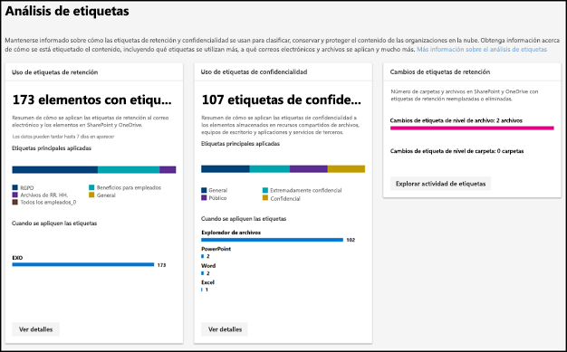
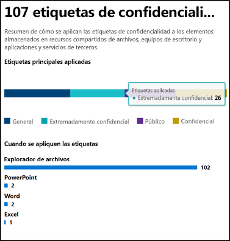
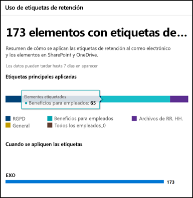
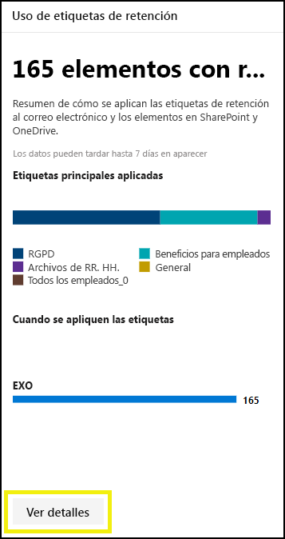
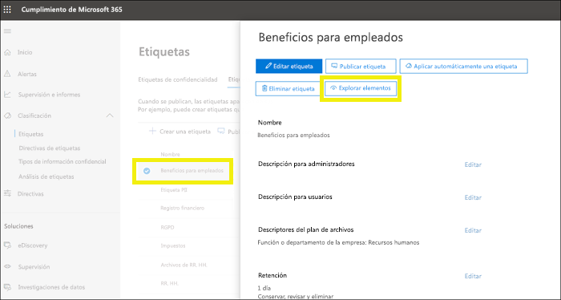
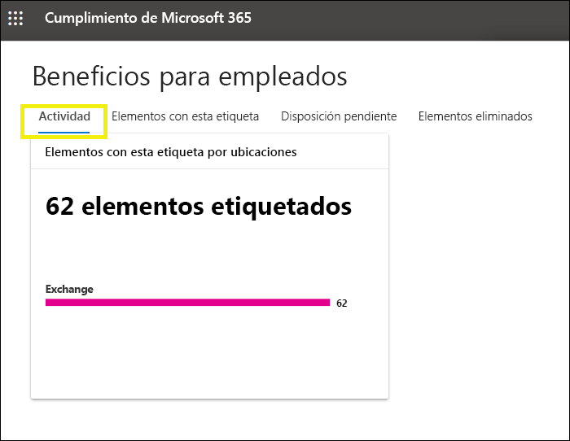
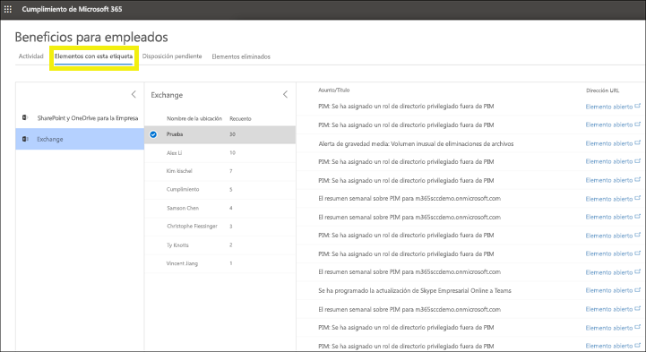

# Ver el uso de etiquetas con el análisis de etiquetasView label usage with label analytics

Después de crear sus etiquetas de retención y de confidencialidad, le interesará ver cómo se utilizan en el espacio empresarial.After you create your retention labels and sensitivity labels, you’ll want to see how they’re being used across your tenant. Con el análisis de etiquetas en el Centro de cumplimiento de Microsoft 365 y el Centro de seguridad de Microsoft 365, puede ver rápidamente las etiquetas que más se usan y dónde se aplicanWith label analytics in the Microsoft 365 compliance center and Microsoft 365 security center, you can quickly see which labels are used the most and where they’re being applied.

Por ejemplo, con el análisis de etiquetas, puede ver:For example, with label analytics, you can view the:

- El número total de etiquetas de retención y etiquetas de confidencialidad aplicadas al contenido.Total number of retention labels and sensitivity labels applied to content.
- Las etiquetas principales y el número de veces que se ha aplicado cada etiqueta.Top labels and the count of how many times each label was applied.
- Las ubicaciones en las que se aplican las etiquetas y el número de veces en cada ubicación.Locations where labels are applied and the count for each location.
- El número de archivos y carpetas cuya etiqueta de retención se ha cambiado o eliminado.Count for how many files and folders had their retention label changed or removed.

Puede encontrar el análisis de etiquetas en el [Centro de cumplimiento de Microsoft 365](https://compliance.microsoft.com/labelanalytics) o [Centro de seguridad de Microsoft 365](https://security.microsoft.com/labelanalytics) > **Clasificación**  >  **Análisis de etiquetas**.You can find label analytics in the [Microsoft 365 compliance center](https://compliance.microsoft.com/labelanalytics) or [Microsoft 365 security center](https://security.microsoft.com/labelanalytics) > **Classification** > **Label analytics**.

## Uso de etiquetas de confidencialidadSensitivity label usage

Los datos sobre el uso de las etiqueta de confidencialidad se extraen de los informes de Azure Information Protection: para obtener más información, vea [Informes centrales de Azure Information Protection](https://docs.microsoft.com/azure/information-protection/reports-aip).The data on sensitivity label usage is pulled from the reports for Azure Information Protection – for more information, see [Central reporting for Azure Information Protection](https://docs.microsoft.com/azure/information-protection/reports-aip).

Tenga en cuenta que los informes de Azure Information Protection tienen [requisitos previos](/azure/information-protection/reports-aip#prerequisites) que también se aplican a los análisis de etiquetas en las etiquetas de confidencialidad en el Centro de seguridad de Microsoft 365 y el Centro de cumplimiento de Microsoft 365.Note that the Azure Information Protection reports have [prerequisites](/azure/information-protection/reports-aip#prerequisites) that also apply to label analytics on sensitivity labels in the Microsoft 365 compliance center and Microsoft 365 security center. Por ejemplo, necesita una suscripción de Azure que incluya Log Analytics porque estos informes son el resultado de enviar eventos de auditoría de protección de información de clientes de Azure Information Protection y escáneres a una ubicación centralizada basada en el servicio Log Analytics de Azure.For example, you need an Azure subscription that includes the Log Analytics because these reports are a result of sending information protection audit events from Azure Information Protection clients and scanners to a centralized location based on Azure Log Analytics service.

Para el uso de etiquetas de confidencialidad:For sensitivity label usage:

- No hay ninguna latencia en los datos.There is no latency in the data. Se trata de un informe en tiempo real.This is a real-time report.
- Para ver la cantidad de cada etiqueta principal, seleccione el gráfico de barras y lea la información sobre herramientas que aparece.To see the count for each top label, point to the bar graph and read the tool tip that appears.
- El informe muestra dónde se aplican las etiquetas de confidencialidad por aplicación (mientras que las etiquetas de retención se muestran por ubicación).The report shows where sensitivity labels are applied per app (whereas retention labels are shown per location).

## Uso de etiquetas de retenciónRetention label usage

Este informe muestra una vista rápida de cuáles son las etiquetas principales y dónde se aplican.This report shows a quick view of what the top labels are and where they’re applied. Para obtener más información sobre cómo se etiqueta contenido en SharePoint y OneDrive, vea [Ver la actividad de etiqueta de documentos](view-label-activity-for-documents.md).For more detailed information on how content in SharePoint and OneDrive is labeled, see [View label activity for documents](view-label-activity-for-documents.md).

Para el uso de etiquetas de retención:For retention label usage:

- Los datos se agregan semanalmente, por lo que pueden tardar hasta siete días en aparecer en el informe.Data is aggregated weekly, so it may take up to seven days for data to appear in the report.
- Para ver la cantidad de cada etiqueta principal, seleccione el gráfico de barras y lea la información sobre herramientas que aparece.To see the count for each top label, point to the bar graph and read the tool tip that appears.
- El informe muestra dónde se aplican las etiquetas de retención por ubicación (mientras que las etiquetas de confidencialidad se muestran por aplicación).The report shows where retention labels are applied per location (whereas sensitivity labels are shown per app).
- Para las etiquetas de retención, este es un resumen de todos los datos del espacio empresarial; no se filtra para un intervalo de fechas específico.For retention labels, this is a summary of the all-time data in your tenant; it’s not filtered to a specific date range. Por el contrario, el [Explorador de actividad de etiquetas](view-label-activity-for-documents.md) muestra los datos de solo los últimos 30 días.By contrast, the [Label Activity Explorer](view-label-activity-for-documents.md) shows data from only the past 30 days.

## Ver todo el contenido con una etiqueta de retención específicaView all content with a specific retention label

En el informe de uso de etiquetas de retención, puede explorar rápidamente todo el contenido con esa etiqueta aplicada.From the retention label usage report, you can quickly explore all content with that label applied. (Tenga en cuenta que estamos trabajando actualmente en esta característica, por lo que requerirá menos pasos para ver todo el contenido con la etiqueta).(Note that we're currently working on this feature, so that it will take fewer steps to view all the labeled content.)

Primero, elija **Ver detalles** en la parte inferior del informe.First, choose **View Details** at the bottom of the report.

Después elija una etiqueta de retención > **Explorar elementos** en el panel derecho.Then choose a retention label > **Explore items** in the right pane.

Para esa etiqueta, puede elegir la ficha **Actividad** para ver el número de elementos con esa etiqueta según la ubicación.For that label, you can choose the **Activity** tab to view a count of items with that label by location.

También puede elegir la ficha **Elementos con esta etiqueta**. Después, puede explorar ubicaciones específicas:You can also choose the **Items with this label** tab. Then you can drill into specific locations:

- Para Exchange Online, verá una lista de buzones con el número de elementos con la etiqueta en cada buzón.For Exchange Online, you see a list of mailboxes with the count of labeled items in each mailbox.
- En SharePoint Online y OneDrive para la Empresa, verá una lista de colecciones de sitios y cuentas de OneDrive con el número de elementos etiquetados en cada ubicación.For SharePoint Online and OneDrive for Business, you see a list of site collections and OneDrive accounts with the count of labeled items in each location.

Al elegir una colección de sitios o un buzón, puede ver una lista de los elementos con esa etiqueta de retención en esa ubicación.When you choose a mailbox or site collection, you can view a list of items with that retention label in that location.

## PermisosPermissions

Para ver el análisis de etiquetas, debe tener asignado uno de los roles siguientes de Azure Active Directory:To view label analytics, you must be assigned one of the following roles in Azure Active Directory:

- Administrador globalGlobal administrator
- Administrador de cumplimientoCompliance administrator
- Administrador de seguridadSecurity administrator
- Lector de seguridadSecurity reader

Además, tenga en cuenta que estos informes usan Azure Monitor para almacenar los datos en un área de trabajo de Log Analytics que pertenezca a su organización.In addition, note these reports use Azure Monitor to store the data in a Log Analytics workspace that your organization owns. Por lo tanto, el usuario debería agregarse como un lector para el espacio de trabajo de supervisión de Azure que contiene los datos. Para obtener más información, vea [Permisos necesarios para los análisis de Azure Information Protection](https://docs.microsoft.com/azure/information-protection/reports-aip#permissions-required-for-azure-information-protection-analytics).Therefore, the user should be added as a reader to the Azure Monitoring workspace that holds the data - for more information, see [Permissions required for Azure Information Protection analytics](https://docs.microsoft.com/azure/information-protection/reports-aip#permissions-required-for-azure-information-protection-analytics).

