# <a name="overview-of-retention-labels"></a><span data-ttu-id="7ff69-104">Introducción a las etiquetas de retención</span><span class="sxs-lookup"><span data-stu-id="7ff69-104">Overview of retention labels</span></span>

<span data-ttu-id="7ff69-p102">Es posible que su organización disponga de distintos tipos de contenido que haya que usar de manera diferente para cumplir con las normativas del sector y las directivas internas. Por ejemplo:</span><span class="sxs-lookup"><span data-stu-id="7ff69-p102">Across your organization, you probably have different types of content that require different actions taken on them in order to comply with industry regulations and internal policies. For example, you might have:</span></span>
  
- <span data-ttu-id="7ff69-107">Formularios fiscales que sea necesario **conservar** durante un período de tiempo mínimo.</span><span class="sxs-lookup"><span data-stu-id="7ff69-107">Tax forms that need to be **retained** for a minimum period of time.</span></span> 
    
- <span data-ttu-id="7ff69-108">Materiales de prensa que deban **eliminarse de forma permanente** cuando alcancen una determinada antigüedad.</span><span class="sxs-lookup"><span data-stu-id="7ff69-108">Press materials that need to be **permanently deleted** when they reach a certain age.</span></span> 
    
- <span data-ttu-id="7ff69-109">Información sobre la competencia que sea necesario **conservar** y, después, **eliminar de forma permanente**.</span><span class="sxs-lookup"><span data-stu-id="7ff69-109">Competitive research that needs to be both **retained** and then **permanently deleted**.</span></span> 
    
- <span data-ttu-id="7ff69-110">Visados de trabajo que tengan que **marcarse como registros** para que no se puedan editar ni eliminar.</span><span class="sxs-lookup"><span data-stu-id="7ff69-110">Work visas that must be **marked as a record** so that they can't be edited or deleted.</span></span> 
    
<span data-ttu-id="7ff69-p103">En todos estos casos, las etiquetas de retención de Office 365 pueden ayudarle a realizar las acciones adecuadas en el contenido adecuado. Con las etiquetas de retención, puede clasificar los datos de su organización para administrarlos mejor y aplicar reglas de retención basadas en esa clasificación.</span><span class="sxs-lookup"><span data-stu-id="7ff69-p103">In all of these cases, retention labels in Office 365 can help you take the right actions on the right content. With retention labels, you can classify data across your organization for governance, and enforce retention rules based on that classification.</span></span>
  
<span data-ttu-id="7ff69-113">Con las etiquetas de retención, puede:</span><span class="sxs-lookup"><span data-stu-id="7ff69-113">With retention labels, you can:</span></span>
  
- <span data-ttu-id="7ff69-p104">**Permitir que los usuarios de la organización apliquen manualmente una etiqueta de retención** a contenido de Outlook en la Web, Outlook 2010 y versiones posteriores, OneDrive para la Empresa, SharePoint Online y Grupos de Office 365. Con frecuencia, los usuarios son los que mejor saben con qué tipo de contenido están trabajando, por lo que pueden clasificarlo correctamente y aplicar la directiva adecuada.</span><span class="sxs-lookup"><span data-stu-id="7ff69-p104">**Enable people in your organization to apply a retention label manually** to content in Outlook on the web, Outlook 2010 and later, OneDrive, SharePoint, and Office 365 groups. Users often know best what type of content they're working with, so they can classify it and have the appropriate policy applied.</span></span> 
    
- <span data-ttu-id="7ff69-116">**Aplicar etiquetas de retención a contenido automáticamente** si coincide con condiciones específicas, como:</span><span class="sxs-lookup"><span data-stu-id="7ff69-116">**Apply retention labels to content automatically** if it matches specific conditions, such as when the content contains:</span></span> 
    
    - <span data-ttu-id="7ff69-117">Tipos específicos de información confidencial.</span><span class="sxs-lookup"><span data-stu-id="7ff69-117">Specific types of sensitive information.</span></span>
    
    - <span data-ttu-id="7ff69-118">Palabras clave específicas que coinciden con una consulta que haya creado.</span><span class="sxs-lookup"><span data-stu-id="7ff69-118">Specific keywords that match a query you create.</span></span>
    
    - <span data-ttu-id="7ff69-119">Coincidencias de patrón para un clasificador que se puede entrenar.</span><span class="sxs-lookup"><span data-stu-id="7ff69-119">Pattern matches for a trainable classifier.</span></span>
    
  <span data-ttu-id="7ff69-120">La capacidad de aplicar etiquetas de retención automáticamente al contenido ofrece las ventajas siguientes:</span><span class="sxs-lookup"><span data-stu-id="7ff69-120">The ability to apply retention labels to content automatically is important because:</span></span>
    
     - <span data-ttu-id="7ff69-121">No es necesario formar a los usuarios para que conozcan todas las clasificaciones.</span><span class="sxs-lookup"><span data-stu-id="7ff69-121">You don't need to train your users on all of your classifications.</span></span>
    
     - <span data-ttu-id="7ff69-122">No es necesario depender de los usuarios para clasificar todo el contenido correctamente.</span><span class="sxs-lookup"><span data-stu-id="7ff69-122">You don't need to rely on users to classify all content correctly.</span></span>
    
   - <span data-ttu-id="7ff69-123">Los usuarios ya no necesitan conocer las directivas de gobierno de datos; en su lugar, pueden centrarse en su trabajo.</span><span class="sxs-lookup"><span data-stu-id="7ff69-123">Users no longer need to know about data governance policies - they can instead focus on their work.</span></span>

  > [!NOTE]
  > <span data-ttu-id="7ff69-124">La función para aplicar etiquetas automáticamente requiere un mínimo de una licencia de Office 365 Enterprise E5 para cada usuario que tenga permisos para editar el contenido que se ha etiquetado automáticamente en un sitio o cuyo buzón está seleccionado para etiquetado automático.</span><span class="sxs-lookup"><span data-stu-id="7ff69-124">The capability to apply labels automatically requires a minimum of an Office 365 Enterprise E5 license for each user who has permissions to edit content that's been automatically labeled in a site or their mailbox is selected for automatic labeling.</span></span> <span data-ttu-id="7ff69-125">Esta licencia no es necesaria para los usuarios que solo tengan acceso de solo lectura al contenido o que respondan a los mensajes de correo electrónico con etiquetas.</span><span class="sxs-lookup"><span data-stu-id="7ff69-125">Users who simply have read-only access to content or reply to labeled emails do not require this license.</span></span>
      
- <span data-ttu-id="7ff69-p106">**Implementar la administración de registros en todo Office 365**, tanto en correos electrónicos como en documentos. Puede usar una etiqueta de retención para clasificar contenido como un registro. Cuando ocurra esto, la etiqueta no se puede cambiar ni quitar, y el contenido no se puede editar ni eliminar.</span><span class="sxs-lookup"><span data-stu-id="7ff69-p106">**Implement records management across Office 365**, including both email and documents. You can use a retention label to classify content as a record. When this happens, the label can't be changed or removed, and the content can't be edited or deleted.</span></span> 

- <span data-ttu-id="7ff69-129">**Aplique una etiqueta de retención predeterminada a una biblioteca de documentos, carpeta o conjunto de documentos** en SharePoint, para que todos los documentos que llegan a esa ubicación hereden la etiqueta de retención predeterminada.</span><span class="sxs-lookup"><span data-stu-id="7ff69-129">**Apply a default retention label to a document library, folder, or document set** in SharePoint, so that all documents that arrive in that location inherit the default retention label.</span></span>  
    
<span data-ttu-id="7ff69-130">Las etiquetas de retención se crean en el Centro de cumplimiento de Microsoft 365, el Centro de seguridad de Microsoft 365 o el Centro de seguridad y cumplimiento de Office 365.</span><span class="sxs-lookup"><span data-stu-id="7ff69-130">You create retention labels in the Microsoft 365 compliance center, Microsoft 365 security center, or Office 365 Security & Compliance Center.</span></span>

## <a name="how-retention-labels-work-with-retention-label-policies"></a><span data-ttu-id="7ff69-131">Funcionamiento de las etiquetas de retención con directivas de etiquetas de retención</span><span class="sxs-lookup"><span data-stu-id="7ff69-131">How retention labels work with retention label policies</span></span>

<span data-ttu-id="7ff69-132">Hacer que las etiquetas de retención estén disponibles para las personas de su organización para que puedan clasificar contenido es un proceso de dos pasos: primero se crean las etiquetas de retención y, después, se publican en las ubicaciones que elija.</span><span class="sxs-lookup"><span data-stu-id="7ff69-132">Making retention labels available to people in your organization so that they can classify content is a two-step process: first you create the retention labels, and then you publish them to the locations you choose.</span></span> <span data-ttu-id="7ff69-133">Al publicar etiquetas de retención, se crea una directiva de etiqueta de retención.</span><span class="sxs-lookup"><span data-stu-id="7ff69-133">When you publish retention labels, a retention label policy gets created.</span></span>
  
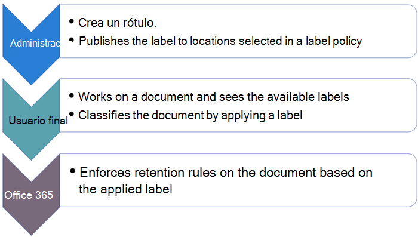
  
<span data-ttu-id="7ff69-135">Las etiquetas de retención son bloques de creación independientes y reutilizables que se incluyen en una o más directivas de etiquetas de retención.</span><span class="sxs-lookup"><span data-stu-id="7ff69-135">Retention labels are independent, reusable building blocks that are included in one or more retention label policies.</span></span> <span data-ttu-id="7ff69-136">La finalidad principal de una directiva de etiqueta es agrupar un conjunto de etiquetas de retención y especificar las ubicaciones donde quiere que aparezcan.</span><span class="sxs-lookup"><span data-stu-id="7ff69-136">The primary purpose of a retention label policy is to group a set of retention labels and specify the locations where you want those labels to appear.</span></span>
  

  
1. <span data-ttu-id="7ff69-138">Al publicar etiquetas de retención, estas se incluyen en una directiva de etiqueta de retención.</span><span class="sxs-lookup"><span data-stu-id="7ff69-138">When you publish retention labels, they're included in a retention label policy.</span></span> <span data-ttu-id="7ff69-139">Por favor, tenga en cuenta que los nombres de las etiquetas de retención son inmutables y no pueden editarse una vez que se han creado.</span><span class="sxs-lookup"><span data-stu-id="7ff69-139">Please note, retention label names are immutable and cannot be edited once created.</span></span>


2. <span data-ttu-id="7ff69-140">Se puede incluir una única etiqueta de retención en varias directivas de etiqueta de retención.</span><span class="sxs-lookup"><span data-stu-id="7ff69-140">A single retention label can be included in many retention label policies.</span></span>

3. <span data-ttu-id="7ff69-141">También puede incluirse una sola ubicación en numerosas directivas de etiqueta de retención.</span><span class="sxs-lookup"><span data-stu-id="7ff69-141">A single location can also be included in many retention label policies.</span></span>    
    
3. <span data-ttu-id="7ff69-142">Las directivas de etiquetas de retención especifican las ubicaciones donde se publicarán las etiquetas de retención.</span><span class="sxs-lookup"><span data-stu-id="7ff69-142">Retention label policies specify the locations to publish the retention labels.</span></span>
    
## <a name="only-one-retention-label-at-a-time"></a><span data-ttu-id="7ff69-143">Solo una etiqueta de retención a la vez</span><span class="sxs-lookup"><span data-stu-id="7ff69-143">Only one retention label at a time</span></span>

<span data-ttu-id="7ff69-144">Es importante saber que solo se puede asignar una etiqueta de retención al contenido (como un correo electrónico o un documento):</span><span class="sxs-lookup"><span data-stu-id="7ff69-144">It's important to know that content like an email or document can have only a single retention label assigned to it at a time:</span></span>
  
- <span data-ttu-id="7ff69-145">En el caso de las etiquetas de retención asignadas manualmente por los usuarios finales, estos pueden quitar o cambiar la etiqueta de retención asignada.</span><span class="sxs-lookup"><span data-stu-id="7ff69-145">For retention labels assigned manually by end users, people can remove or change the retention label that's assigned.</span></span>
    
- <span data-ttu-id="7ff69-146">Si el contenido tiene asignada una etiqueta de aplicación automática, un usuario final puede reemplazarla por una etiqueta de retención asignada manualmente.</span><span class="sxs-lookup"><span data-stu-id="7ff69-146">If content has an auto-apply label assigned, an auto-apply label can be replaced by a retention label assigned manually by an end user.</span></span>
    
- <span data-ttu-id="7ff69-147">Si el contenido tiene una etiqueta de retención asignada manualmente por un usuario final, una etiqueta de aplicación automática no puede reemplazar a la etiqueta de retención asignada de forma manual.</span><span class="sxs-lookup"><span data-stu-id="7ff69-147">If content has a retention label assigned manually by an end user, an auto-apply label cannot replace the manually assigned retention label.</span></span>
    
- <span data-ttu-id="7ff69-148">Si hay varias reglas que asignan una etiqueta de aplicación automática y el contenido cumple las condiciones de varias reglas, se asignará la etiqueta de retención de la regla más antigua.</span><span class="sxs-lookup"><span data-stu-id="7ff69-148">If there are multiple rules that assign an auto-apply label and content meets the conditions of multiple rules, the retention label for the oldest rule is assigned.</span></span>
    
<span data-ttu-id="7ff69-p110">Las etiquetas asignadas manualmente se asignan de manera explícita; las etiquetas de aplicación automática se asignan de forma implícita; una etiqueta de retención explícita tiene precedencia sobre una etiqueta implícita. Para obtener más información, vea la sección siguiente [Los principios de retención o qué tiene precedencia](#the-principles-of-retention-or-what-takes-precedence).</span><span class="sxs-lookup"><span data-stu-id="7ff69-p110">Manually assigned labels are explicitly assigned; auto-apply labels are implicitly assigned; an explicit retention label takes precedence over an implicit label. For more information, see the below section on [The principles of retention, or what takes precedence?](#the-principles-of-retention-or-what-takes-precedence).</span></span>

<span data-ttu-id="7ff69-p111">Toda la información de esta sección se aplica solo a las etiquetas de retención. Tenga en cuenta que un elemento de contenido puede tener una etiqueta de confidencialidad aplicada, además de una etiqueta de retención.</span><span class="sxs-lookup"><span data-stu-id="7ff69-p111">All of the information in this section applies only to retention labels. Note that an item of content can also have one sensitivity label applied to it, in addition to one retention label.</span></span>
  
## <a name="how-long-it-takes-for-retention-labels-to-take-effect"></a><span data-ttu-id="7ff69-153">Tiempo que tardan las etiquetas de retención en aplicarse</span><span class="sxs-lookup"><span data-stu-id="7ff69-153">How long it takes for retention labels to take effect</span></span>

<span data-ttu-id="7ff69-154">Al publicar o aplicar automáticamente etiquetas de retención, no surten efecto inmediatamente:</span><span class="sxs-lookup"><span data-stu-id="7ff69-154">When you publish or auto-apply retention labels, they don't take effect immediately:</span></span>
  
1. <span data-ttu-id="7ff69-155">Primero, la directiva de etiquetas tiene que sincronizarse desde el centro de administración con las ubicaciones en la directiva.</span><span class="sxs-lookup"><span data-stu-id="7ff69-155">First the label policy needs to be synced from the admin center to the locations in the policy.</span></span>
    
2. <span data-ttu-id="7ff69-156">Después, la ubicación puede necesitar tiempo para hacer que las etiquetas de retención publicadas estén disponibles para los usuarios finales o para aplicar automáticamente las etiquetas en el contenido.</span><span class="sxs-lookup"><span data-stu-id="7ff69-156">Then the location may require time to make published retention labels available to end users or time to auto-apply labels to content.</span></span> <span data-ttu-id="7ff69-157">El tiempo que se tarda depende de la ubicación y el tipo de etiqueta de retención.</span><span class="sxs-lookup"><span data-stu-id="7ff69-157">How long this takes depends on the location and type of retention label.</span></span>
    
### <a name="published-retention-labels"></a><span data-ttu-id="7ff69-158">Etiquetas de retención publicadas</span><span class="sxs-lookup"><span data-stu-id="7ff69-158">Published retention labels</span></span>

<span data-ttu-id="7ff69-p113">Si publica etiquetas de retención en SharePoint o OneDrive, puede que tarden un día en mostrarse a los usuarios finales. Además, si publica etiquetas de retención en Exchange, pueden tardar hasta siete días en mostrarse a los usuarios finales y, además, el buzón necesita contener como mínimo 10 MB de datos.</span><span class="sxs-lookup"><span data-stu-id="7ff69-p113">If you publish retention labels to SharePoint or OneDrive, it can take one day for those retention labels to appear for end users. In addition, if you publish retention labels to Exchange, it can take 7 days for those retention labels to appear for end users, and the mailbox needs to contain at least 10 MB of data.</span></span>
  

  
### <a name="auto-apply-retention-labels"></a><span data-ttu-id="7ff69-162">Aplicar automáticamente etiquetas de retención</span><span class="sxs-lookup"><span data-stu-id="7ff69-162">Auto-apply retention labels</span></span>

<span data-ttu-id="7ff69-163">Si aplica automáticamente etiquetas de retención a contenido que coincida con condiciones específicas, estas pueden tardar hasta siete días en aplicarse a todo el contenido existente que coincida con las condiciones.</span><span class="sxs-lookup"><span data-stu-id="7ff69-163">If you auto-apply retention labels to content matching specific conditions, it can take seven days for the retention labels to be applied to all existing content that matches the conditions.</span></span>
  

  
### <a name="how-to-check-on-the-status-of-retention-labels-published-to-exchange"></a><span data-ttu-id="7ff69-165">Cómo comprobar el estado de las etiquetas de retención publicadas en Exchange</span><span class="sxs-lookup"><span data-stu-id="7ff69-165">How to check on the status of retention labels published to Exchange</span></span>

<span data-ttu-id="7ff69-p114">En Exchange Online, las etiquetas de retención se publican para los usuarios finales mediante un proceso que se ejecuta cada siete días. Con PowerShell, puede ver cuándo se ha ejecutado este proceso por última vez y, por tanto, determinar cuándo volverá a ejecutarse.</span><span class="sxs-lookup"><span data-stu-id="7ff69-p114">In Exchange Online, retention labels are made available to end users by a process that runs every seven days. By using Powershell, you can see when this process last ran and thus determine when it will run again.</span></span>
  
1. <span data-ttu-id="7ff69-168">[Conexión a PowerShell de Exchange Online](https://go.microsoft.com/fwlink/?linkid=799773).</span><span class="sxs-lookup"><span data-stu-id="7ff69-168">[Connect to Exchange Online PowerShell](https://go.microsoft.com/fwlink/?linkid=799773).</span></span>
    
2. <span data-ttu-id="7ff69-169">Ejecute estos comandos.</span><span class="sxs-lookup"><span data-stu-id="7ff69-169">Run these commands.</span></span>
    
   ```powershell
   $logProps = Export-MailboxDiagnosticLogs <user> -ExtendedProperties
   ```

   ```powershell
   $xmlprops = [xml]($logProps.MailboxLog)
   ```

   ```powershell
   $xmlprops.Properties.MailboxTable.Property | ? {$_.Name -like "ELC*"}
   ```

<span data-ttu-id="7ff69-170">En los resultados, la propiedad `ELCLastSuccessTimeStamp` (UTC) muestra cuándo fue la última vez que el sistema procesó el buzón.</span><span class="sxs-lookup"><span data-stu-id="7ff69-170">In the results, the `ELCLastSuccessTimeStamp` (UTC) property shows when the system last processed your mailbox.</span></span> <span data-ttu-id="7ff69-171">Si esto no ha ocurrido desde el momento en que se creó la directiva, las etiquetas no van a aparecer.</span><span class="sxs-lookup"><span data-stu-id="7ff69-171">If it has not happened since the time you created the policy, the labels are not going to appear.</span></span> <span data-ttu-id="7ff69-172">Para forzar el procesamiento, ejecute `Start-ManagedFolderAssistant -Identity <user>`.</span><span class="sxs-lookup"><span data-stu-id="7ff69-172">To force processing, run  `Start-ManagedFolderAssistant -Identity <user>`.</span></span>
    
<span data-ttu-id="7ff69-173">Si las etiquetas no aparecen en Outlook en la Web y cree que tendrían que aparecer, asegúrese de vaciar la caché del explorador (CTRL+F5).</span><span class="sxs-lookup"><span data-stu-id="7ff69-173">If labels aren't appearing in Outlook on the web and you think they should be, make sure to clear the cache in your browser (CTRL+F5).</span></span>
    
## <a name="retention-label-policies-and-locations"></a><span data-ttu-id="7ff69-174">Ubicaciones y directivas de etiquetas de retención</span><span class="sxs-lookup"><span data-stu-id="7ff69-174">Retention label policies and locations</span></span>

<span data-ttu-id="7ff69-175">En función de la finalidad de las etiquetas de retención, pueden publicarse en distintas ubicaciones.</span><span class="sxs-lookup"><span data-stu-id="7ff69-175">Different types of retention labels can be published to different locations, depending on what the retention label does.</span></span>
  
|<span data-ttu-id="7ff69-176">**Si la etiqueta de retención es...**</span><span class="sxs-lookup"><span data-stu-id="7ff69-176">**If the retention label is…**</span></span>|<span data-ttu-id="7ff69-177">**La directiva de etiquetas se puede aplicar en…**</span><span class="sxs-lookup"><span data-stu-id="7ff69-177">**Then the label policy can be applied to…**</span></span>|
|:-----|:-----|
|<span data-ttu-id="7ff69-178">Se publica a los usuarios finales</span><span class="sxs-lookup"><span data-stu-id="7ff69-178">Published to end users</span></span>  <br/> |<span data-ttu-id="7ff69-179">Exchange, SharePoint, OneDrive, Grupos de Office 365</span><span class="sxs-lookup"><span data-stu-id="7ff69-179">Exchange, SharePoint, OneDrive, Office 365 groups</span></span>  <br/> |
|<span data-ttu-id="7ff69-180">Se aplica automáticamente basándose en tipos de información confidencial</span><span class="sxs-lookup"><span data-stu-id="7ff69-180">Auto-applied based on sensitive information types</span></span>  <br/> |<span data-ttu-id="7ff69-181">Exchange (solo todos los buzones), SharePoint, OneDrive</span><span class="sxs-lookup"><span data-stu-id="7ff69-181">Exchange (all mailboxes only), SharePoint, OneDrive</span></span>  <br/> |
|<span data-ttu-id="7ff69-182">Se aplica automáticamente basándose en una consulta</span><span class="sxs-lookup"><span data-stu-id="7ff69-182">Auto-applied based on a query</span></span>  <br/> |<span data-ttu-id="7ff69-183">Exchange, SharePoint, OneDrive, Grupos de Office 365</span><span class="sxs-lookup"><span data-stu-id="7ff69-183">Exchange, SharePoint, OneDrive, Office 365 groups</span></span>  <br/> |
   
<span data-ttu-id="7ff69-184">En Exchange, las etiquetas de aplicación automática (tanto para consultas como para tipos de información confidencial) solo se aplican a mensajes nuevos enviados (datos en tránsito), no a todos los elementos que estén actualmente en el buzón (datos en reposo).</span><span class="sxs-lookup"><span data-stu-id="7ff69-184">In Exchange, auto-apply retention labels (for both queries and sensitive information types) are applied only to messages newly sent (data in transit), not to all items currently in the mailbox (data at rest).</span></span> <span data-ttu-id="7ff69-185">Además, las etiquetas de aplicación automática para tipos de información confidencial solo se pueden aplicar a todos los buzones; es decir, no puede seleccionar los buzones específicos.</span><span class="sxs-lookup"><span data-stu-id="7ff69-185">Also, auto-apply retention labels for sensitive information types can apply only to all mailboxes; you can't select the specific mailboxes.</span></span>
  
<span data-ttu-id="7ff69-186">Las carpetas públicas de Exchange y Skype no admiten las etiquetas.</span><span class="sxs-lookup"><span data-stu-id="7ff69-186">Exchange public folders and Skype do not support labels.</span></span>
  
## <a name="how-retention-labels-enforce-retention"></a><span data-ttu-id="7ff69-187">Cómo las etiquetas de retención aplican la retención</span><span class="sxs-lookup"><span data-stu-id="7ff69-187">How retention labels enforce retention</span></span>

<span data-ttu-id="7ff69-188">Las etiquetas de retención pueden aplicar las mismas acciones de retención que una directiva de retención.</span><span class="sxs-lookup"><span data-stu-id="7ff69-188">Retention labels can enforce the same retention actions that a retention policy can.</span></span> <span data-ttu-id="7ff69-189">Puede usar etiquetas de retención para implementar un plan de contenido sofisticado (o un plan de archivos).</span><span class="sxs-lookup"><span data-stu-id="7ff69-189">You can use retention labels to implement a sophisticated content plan (or file plan).</span></span> <span data-ttu-id="7ff69-190">Para obtener más información sobre cómo funciona la retención, vea [Introducción a las directivas de retención](retention-policies.md).</span><span class="sxs-lookup"><span data-stu-id="7ff69-190">For more information on how retention works, see [Overview of retention policies](retention-policies.md).</span></span>
  
<span data-ttu-id="7ff69-p118">Además, una etiqueta de retención tiene dos opciones de retención que solo están disponibles en una etiqueta de retención, pero no están disponibles en una directiva de retención. Con una etiqueta de retención, puede:</span><span class="sxs-lookup"><span data-stu-id="7ff69-p118">In addition, a retention label has two retention options that are available only in a retention label and not in a retention policy. With a retention label, you can:</span></span>
  
- <span data-ttu-id="7ff69-p119">Desencadenar una revisión para eliminación al finalizar el período de retención para que los documentos de OneDrive y SharePoint tengan que revisarse antes de ser eliminados. Para obtener más información, vea [Información general sobre revisiones para eliminación](disposition-reviews.md).</span><span class="sxs-lookup"><span data-stu-id="7ff69-p119">Trigger a disposition review at the end of the retention period, so that SharePoint and OneDrive documents must be reviewed before they can be deleted. For more information, see [Overview of disposition reviews](disposition-reviews.md).</span></span>
    
- <span data-ttu-id="7ff69-195">Iniciar el período de retención desde el momento en que se etiquete el contenido, en lugar de la antigüedad del contenido o la fecha de la última modificación.</span><span class="sxs-lookup"><span data-stu-id="7ff69-195">Start the retention period from when the content was labeled, instead of the age of the content or when it was last modified.</span></span> <span data-ttu-id="7ff69-196">Esta opción solo se aplica al contenido de los sitios de SharePoint y las cuentas de OneDrive.</span><span class="sxs-lookup"><span data-stu-id="7ff69-196">This option applies only to content in SharePoint sites and OneDrive accounts.</span></span> <span data-ttu-id="7ff69-197">Para el correo electrónico de Exchange, el período de retención siempre se basa en la fecha en la que se ha enviado o recibido el mensaje, independientemente de la opción que elija aquí.</span><span class="sxs-lookup"><span data-stu-id="7ff69-197">For Exchange email, the retention period is always based on the date when the message was sent or received, no matter which option you choose here.</span></span>
    

  
## <a name="where-published-retention-labels-can-appear-to-end-users"></a><span data-ttu-id="7ff69-199">Ubicaciones donde los usuarios pueden ver las etiquetas de retención publicadas</span><span class="sxs-lookup"><span data-stu-id="7ff69-199">Where published retention labels can appear to end users</span></span>

<span data-ttu-id="7ff69-200">Si los usuarios finales asignarán la etiqueta de retención al contenido, puede publicarla en:</span><span class="sxs-lookup"><span data-stu-id="7ff69-200">If your retention label will be assigned to content by end users, you can publish it to:</span></span>
  
- <span data-ttu-id="7ff69-201">Outlook en la Web</span><span class="sxs-lookup"><span data-stu-id="7ff69-201">Outlook on the web</span></span>
    
- <span data-ttu-id="7ff69-202">Outlook 2010 y versiones posteriores</span><span class="sxs-lookup"><span data-stu-id="7ff69-202">Outlook 2010 and later</span></span>
    
- <span data-ttu-id="7ff69-203">OneDrive</span><span class="sxs-lookup"><span data-stu-id="7ff69-203">OneDrive</span></span>
    
- <span data-ttu-id="7ff69-204">SharePoint</span><span class="sxs-lookup"><span data-stu-id="7ff69-204">SharePoint</span></span>
    
- <span data-ttu-id="7ff69-205">Grupos de Office 365 (tanto en el sitio de grupo como el buzón de grupo de Outlook en la Web)</span><span class="sxs-lookup"><span data-stu-id="7ff69-205">Office 365 groups (both the group site and group mailbox in Outlook on the web)</span></span>
    
<span data-ttu-id="7ff69-206">En las secciones siguientes, se explica cómo se mostrarán las etiquetas en diferentes aplicaciones para los usuarios de su organización.</span><span class="sxs-lookup"><span data-stu-id="7ff69-206">The sections below show how labels appear in different apps to people in your organization.</span></span>
  
### <a name="outlook-on-the-web"></a><span data-ttu-id="7ff69-207">Outlook en la Web</span><span class="sxs-lookup"><span data-stu-id="7ff69-207">Outlook on the web</span></span>

<span data-ttu-id="7ff69-208">Para etiquetar un elemento en Outlook en la Web, haga clic con el botón derecho en el elemento \> **Asignar directiva** \> y seleccione la etiqueta de retención.</span><span class="sxs-lookup"><span data-stu-id="7ff69-208">To label an item in Outlook on the web, right-click the item \> **Assign policy** \> choose the retention label.</span></span> 
  
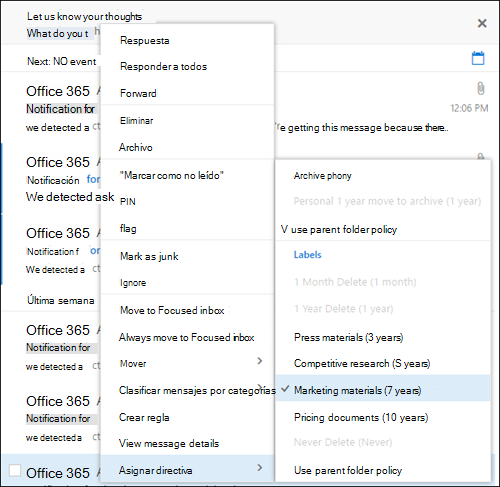
  
<span data-ttu-id="7ff69-p121">Después de aplicarla, puede ver la etiqueta de retención y la acción que realiza en la parte superior del elemento. Si un correo electrónico se clasifica y tiene asociado un período de retención, podrá ver rápidamente cuándo expirará el correo electrónico.</span><span class="sxs-lookup"><span data-stu-id="7ff69-p121">After the retention label is applied, you can view that retention label and what action it takes at the top of the item. If an email is classified and has an associated retention period, you can know at a glance when the email will expire.</span></span>
  

  
<span data-ttu-id="7ff69-213">También puede aplicar etiquetas de retención a carpetas, en cuyo caso:</span><span class="sxs-lookup"><span data-stu-id="7ff69-213">You can also apply retention labels to folders, in which case:</span></span>
  
- <span data-ttu-id="7ff69-p122">Se asignará automáticamente la misma etiqueta de retención en todos los elementos de la carpeta, **excepto** en los elementos donde se haya aplicado de forma explícita una etiqueta de retención. Los elementos etiquetados de forma explícita mantienen la etiqueta de retención existente. Para obtener más información, vea la sección siguiente sobre los principios de retención.</span><span class="sxs-lookup"><span data-stu-id="7ff69-p122">All items in the folder automatically get the same retention label, **except** for items that have had a retention label applied explicitly to them. Explicitly labeled items keep their existing retention label. For more information, see the below section on the principles of retention.</span></span> 
    
- <span data-ttu-id="7ff69-217">Si cambia o quita la etiqueta de retención predeterminada de una carpeta, también se cambiará o quitará la etiqueta de retención de todos los elementos de la carpeta, **excepto** en los elementos con etiquetas de retención explícitas.</span><span class="sxs-lookup"><span data-stu-id="7ff69-217">If you change or remove the default retention label for a folder, the retention label's also changed or removed for all items in the folder, **except** items with explicit retention labels.</span></span> 
    
- <span data-ttu-id="7ff69-218">Si mueve un elemento con una etiqueta de retención predeterminada de una carpeta a otra carpeta con una etiqueta de retención predeterminada distinta, el elemento obtendrá la nueva etiqueta de retención predeterminada.</span><span class="sxs-lookup"><span data-stu-id="7ff69-218">If you move an item with a default retention label from one folder to another folder with a different default retention label, the item gets the new default retention label.</span></span>
    
- <span data-ttu-id="7ff69-219">Si mueve un elemento con una etiqueta de retención predeterminada de una carpeta a otra sin una etiqueta de retención predeterminada, se quitará la etiqueta de retención predeterminada anterior.</span><span class="sxs-lookup"><span data-stu-id="7ff69-219">If you move an item with a default retention label from one folder to another folder with no default retention label, the old default retention label is removed.</span></span>
    
### <a name="outlook-2010-and-later"></a><span data-ttu-id="7ff69-220">Outlook 2010 y versiones posteriores</span><span class="sxs-lookup"><span data-stu-id="7ff69-220">Outlook 2010 and later</span></span>

<span data-ttu-id="7ff69-221">Para etiquetar un elemento en el cliente de escritorio de Outlook, seleccione el elemento.</span><span class="sxs-lookup"><span data-stu-id="7ff69-221">To label an item in the Outlook desktop client, select the item.</span></span> <span data-ttu-id="7ff69-222">En la pestaña **Inicio** de la cinta de opciones, haga clic en **Asignar directiva**, y luego elija la etiqueta de retención.</span><span class="sxs-lookup"><span data-stu-id="7ff69-222">On the **Home** tab on the ribbon, click **Assign Policy**, and then choose the retention label.</span></span> 
  
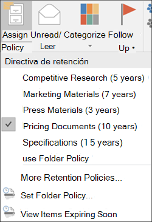
  
<span data-ttu-id="7ff69-224">También puede hacer clic con el botón derecho en un elemento, hacer clic en **Asignar directiva** en el menú contextual y después, seleccionar la etiqueta de retención.</span><span class="sxs-lookup"><span data-stu-id="7ff69-224">You can also right-click an item, click **Assign Policy** in the context menu, and then choose the retention label.</span></span> 

<span data-ttu-id="7ff69-225">Después de aplicar la etiqueta de retención, puede ver dicha etiqueta y la acción que realiza en la parte superior del elemento.</span><span class="sxs-lookup"><span data-stu-id="7ff69-225">After the retention label is applied, you can view that retention label and what action it takes at the top of the item.</span></span> <span data-ttu-id="7ff69-226">Si un correo electrónico tiene una etiqueta de retención aplicada con un período de retención asociado, puede observar a simple vista cuándo va a expirar el correo electrónico.</span><span class="sxs-lookup"><span data-stu-id="7ff69-226">If an email has a retention label applied that has an associated retention period, you can see at a glance when the email expires.</span></span>
  
<span data-ttu-id="7ff69-227">También puede aplicar etiquetas de retención a carpetas.</span><span class="sxs-lookup"><span data-stu-id="7ff69-227">You can also apply retention labels to folders.</span></span> <span data-ttu-id="7ff69-228">Esto funciona tanto en Outlook 2010 y versiones posteriores, como en Outlook en la Web.</span><span class="sxs-lookup"><span data-stu-id="7ff69-228">This works the same in Outlook 2010 and later as it does in Outlook on the web.</span></span> <span data-ttu-id="7ff69-229">Vea la sección anterior para obtener más información.</span><span class="sxs-lookup"><span data-stu-id="7ff69-229">See the previous section for more info.</span></span>
  
### <a name="onedrive-and-sharepoint"></a><span data-ttu-id="7ff69-230">OneDrive y SharePoint</span><span class="sxs-lookup"><span data-stu-id="7ff69-230">OneDrive and SharePoint</span></span>

<span data-ttu-id="7ff69-231">Para etiquetar un documento (incluidos archivos de OneNote) en OneDrive o SharePoint, seleccione el elemento \> en la esquina superior derecha, haga clic en **Abrir el panel de detalles** \> **Aplicar etiqueta de retención** \> y seleccione la etiqueta de retención.</span><span class="sxs-lookup"><span data-stu-id="7ff69-231">To label a document (including OneNote files) in OneDrive or SharePoint, select the item \> in the upper-right corner, choose **Open the details pane** \> **Apply retention label** \> choose the retention label.</span></span> 
  
<span data-ttu-id="7ff69-232">También puede aplicar una etiqueta de retención a una carpeta o un conjunto de documentos, así como establecer una etiqueta de retención predeterminada para una biblioteca de documentos.</span><span class="sxs-lookup"><span data-stu-id="7ff69-232">You can also apply a retention label to a folder or document set, and you can set a default retention label for a document library.</span></span> <span data-ttu-id="7ff69-233">Vea la siguiente sección para obtener más información.</span><span class="sxs-lookup"><span data-stu-id="7ff69-233">See the section below for more information.</span></span>
  
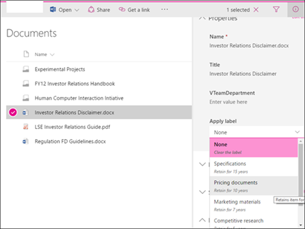
  
<span data-ttu-id="7ff69-235">Después de aplicar una etiqueta de retención a un elemento, puede verla en el panel de detalles cuando esté seleccionado el elemento.</span><span class="sxs-lookup"><span data-stu-id="7ff69-235">After a retention label is applied to an item, you can view it in the details pane when that item's selected.</span></span>
  
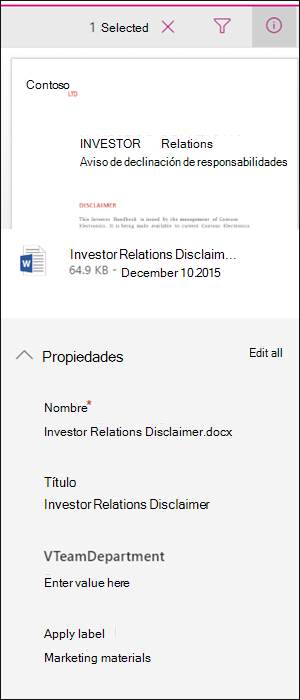
  
<span data-ttu-id="7ff69-p127">También puede crear una vista de la biblioteca que contenga la columna **Etiquetas** o la columna **El elemento es un registro** para ver rápidamente las etiquetas de retención asignadas a todos los elementos y conocer qué elementos son registros. Pero tenga en cuenta que no puede filtrar la vista por la columna **El elemento es un registro**.</span><span class="sxs-lookup"><span data-stu-id="7ff69-p127">You can also create a view of the library that contains the **Labels** column or **Item is a Record** column, so that you can see at a glance the retention labels assigned to all items and which items are records. Note, however, that you can't filter the view by the **Item is a Record** column.</span></span> 
  
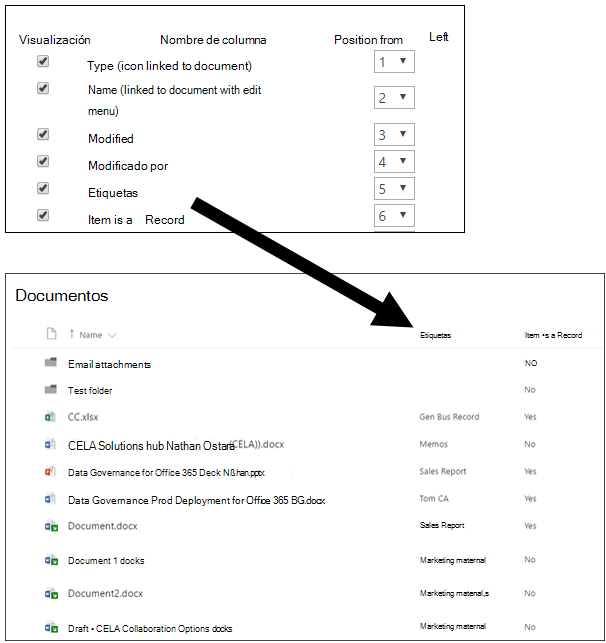
  
### <a name="office-365-groups"></a><span data-ttu-id="7ff69-240">Grupos de Office 365</span><span class="sxs-lookup"><span data-stu-id="7ff69-240">Office 365 groups</span></span>

<span data-ttu-id="7ff69-p128">Al publicar etiquetas de retención en un grupo de Office 365, las etiquetas de retención aparecen tanto en el sitio de grupo como en el buzón de grupo de Outlook en la Web. La experiencia de aplicar una etiqueta de retención al contenido es idéntica a la que se muestra anteriormente para el correo electrónico y los documentos.</span><span class="sxs-lookup"><span data-stu-id="7ff69-p128">When you publish retention labels to an Office 365 group, the retention labels appear in both the group site and group mailbox in Outlook on the web. The experience of applying a retention label to content is identical to that shown above for email and documents.</span></span>

<span data-ttu-id="7ff69-p129">Para conservar el contenido de un grupo de Office 365, necesita usar la ubicación de los grupos de Office 365. Aunque un grupo de Office 365 tiene un buzón de Exchange, una directiva de retención que incluya la ubicación completa de Exchange no incluye contenido en buzones de grupo de Office 365.</span><span class="sxs-lookup"><span data-stu-id="7ff69-p129">To retain content for an Office 365 group, you need to use the Office 365 groups location. Even though an Office 365 group has an Exchange mailbox, a retention policy that includes the entire Exchange location won't include content in Office 365 group mailboxes.</span></span>

<span data-ttu-id="7ff69-245">Además, no es posible usar la ubicación de Exchange para incluir o excluir un buzón de grupo específico.</span><span class="sxs-lookup"><span data-stu-id="7ff69-245">In addition, it's not possible to use the Exchange location to include or exclude a specific group mailbox.</span></span> <span data-ttu-id="7ff69-246">Aunque la ubicación de Exchange inicialmente permite seleccionar un buzón de grupo, cuando intenta guardar la directiva de retención, recibe el error de que "RemoteGroupMailbox" no es una selección válida para la ubicación de Exchange.</span><span class="sxs-lookup"><span data-stu-id="7ff69-246">Although the Exchange location initially allows a group mailbox to be selected, when you try to save the retention policy, you receive an error that "RemoteGroupMailbox" is not a valid selection for the Exchange location.</span></span>
  
## <a name="applying-a-retention-label-automatically-based-on-conditions"></a><span data-ttu-id="7ff69-247">Aplicar automáticamente una etiqueta de retención según las condiciones</span><span class="sxs-lookup"><span data-stu-id="7ff69-247">Applying a retention label automatically based on conditions</span></span>

<span data-ttu-id="7ff69-248">Una de las características más eficaces de las etiquetas es la capacidad de aplicarlas automáticamente al contenido que coincide con determinadas condiciones.</span><span class="sxs-lookup"><span data-stu-id="7ff69-248">One of the most powerful features of retention labels is the ability to apply them automatically to content that matches certain conditions.</span></span> <span data-ttu-id="7ff69-249">En este caso, no es necesario que las personas de la organización apliquen las etiquetas de retención.</span><span class="sxs-lookup"><span data-stu-id="7ff69-249">In this case, people in your organization don't need to apply the retention labels.</span></span> <span data-ttu-id="7ff69-250">Office 365 realiza el trabajo por ellos.</span><span class="sxs-lookup"><span data-stu-id="7ff69-250">Office 365 does the work for them.</span></span>
  

  
<span data-ttu-id="7ff69-252">Las etiquetas de retención de aplicación automática son realmente útiles porque:</span><span class="sxs-lookup"><span data-stu-id="7ff69-252">Auto-apply retention labels are powerful because:</span></span>
  
- <span data-ttu-id="7ff69-253">No es necesario formar a los usuarios para que conozcan todas las clasificaciones.</span><span class="sxs-lookup"><span data-stu-id="7ff69-253">You don't need to train your users on all of your classifications.</span></span>
    
- <span data-ttu-id="7ff69-254">No es necesario depender de los usuarios para clasificar todo el contenido correctamente.</span><span class="sxs-lookup"><span data-stu-id="7ff69-254">You don't need to rely on users to classify all content correctly.</span></span>
    
- <span data-ttu-id="7ff69-255">Los usuarios ya no necesitan conocer las directivas de gobierno de datos; en su lugar, pueden centrarse en su trabajo.</span><span class="sxs-lookup"><span data-stu-id="7ff69-255">Users no longer need to know about data governance policies - they can focus on their work.</span></span>
    
<span data-ttu-id="7ff69-256">Puede aplicar automáticamente etiquetas de retención en contenido cuando este coincida con:</span><span class="sxs-lookup"><span data-stu-id="7ff69-256">You can choose to apply retention labels to content automatically when that content contains:</span></span>
  
- [<span data-ttu-id="7ff69-257">Tipos específicos de información confidencial</span><span class="sxs-lookup"><span data-stu-id="7ff69-257">Specific types of sensitive information</span></span>](#auto-apply-retention-labels-to-content-with-specific-types-of-sensitive-information)
    
- [<span data-ttu-id="7ff69-258">Palabras clave específicas que coinciden con una consulta que haya creado</span><span class="sxs-lookup"><span data-stu-id="7ff69-258">Specific keywords that match a query you create</span></span>](#auto-apply-labels-to-content-with-keywords-or-searchable-properties)

- [<span data-ttu-id="7ff69-259">Una coincidencia para clasificadores que se pueden entrenar</span><span class="sxs-lookup"><span data-stu-id="7ff69-259">A match for trainable classifers</span></span>](#auto-apply-labels-to-content-by-using-trainable-classifers)
    


<span data-ttu-id="7ff69-261">La aplicación automática de las etiquetas de retención configuradas para las dos primeras opciones necesita una suscripción a Office 365 Enterprise E5.</span><span class="sxs-lookup"><span data-stu-id="7ff69-261">Auto-applying retention labels that are configured for the first two options requires an Office 365 Enterprise E5 subscription.</span></span> <span data-ttu-id="7ff69-262">Si usa la opción para clasificadores que se pueden entrenar, esta funcionalidad tiene [requisitos de licencia adicionales](classifier-getting-started-with.md#licensing-requirements).</span><span class="sxs-lookup"><span data-stu-id="7ff69-262">If you use the option for trainable classifers, this capability has [additional licensing requirements](classifier-getting-started-with.md#licensing-requirements).</span></span>

<span data-ttu-id="7ff69-263">Las etiquetas de retención aplicadas automáticamente puede tardar hasta siete días en aplicarse a todo el contenido que coincida con las condiciones que ha configurado.</span><span class="sxs-lookup"><span data-stu-id="7ff69-263">It can take up to seven days for auto-apply retention labels to be applied to all content that matches the conditions you've configured.</span></span>
  
> [!TIP]
> <span data-ttu-id="7ff69-264">Vea [Administrar el ciclo de vida de los documentos de SharePoint con etiquetas de retención](auto-apply-retention-labels-scenario.md) para obtener más información sobre cómo usar las propiedades administradas en SharePoint para aplicar automáticamente las etiquetas de retención e implementar la retención basada en eventos.</span><span class="sxs-lookup"><span data-stu-id="7ff69-264">See [Manage the lifecycle of SharePoint documents with retention labels](auto-apply-retention-labels-scenario.md) for a detailed scenario about using managed properties in SharePont to auto-apply retention labels and implement event-driven retention.</span></span>

### <a name="auto-apply-retention-labels-to-content-with-specific-types-of-sensitive-information"></a><span data-ttu-id="7ff69-265">Aplicar automáticamente etiquetas de retención a contenido con tipos específicos de información confidencial</span><span class="sxs-lookup"><span data-stu-id="7ff69-265">Auto-apply retention labels to content with specific types of sensitive information</span></span>

<span data-ttu-id="7ff69-266">Al crear etiquetas de retención de aplicación automática para información confidencial, verá la misma lista de plantillas de directiva que cuando se crea una directiva de prevención de pérdida de datos (DLP).</span><span class="sxs-lookup"><span data-stu-id="7ff69-266">When you create auto-apply retention labels for sensitive information, you see the same list of policy templates as when you create a data loss prevention (DLP) policy.</span></span> <span data-ttu-id="7ff69-267">Cada plantilla de directiva está preconfigurada para buscar determinados tipos de información confidencial.</span><span class="sxs-lookup"><span data-stu-id="7ff69-267">Each policy template is preconfigured to look for specific types of sensitive information.</span></span> <span data-ttu-id="7ff69-268">Por ejemplo, la plantilla que se muestra aquí busca números de ITIN, SSN y pasaporte de Estados Unidos.</span><span class="sxs-lookup"><span data-stu-id="7ff69-268">For example, the template shown here looks for U.S. ITIN, SSN, and passport numbers.</span></span> <span data-ttu-id="7ff69-269">Para obtener más información sobre DLP, vea [Información general sobre directivas de prevención de pérdida de datos](data-loss-prevention-policies.md).</span><span class="sxs-lookup"><span data-stu-id="7ff69-269">To learn more about DLP, see [Overview of data loss prevention policies](data-loss-prevention-policies.md).</span></span>
  

  
<span data-ttu-id="7ff69-p134">Después de seleccionar una plantilla de directiva, puede agregar o quitar los tipos de información confidencial, así como cambiar el recuento de instancias y la precisión de coincidencia. En el ejemplo que se muestra aquí, solo se aplicará automáticamente una etiqueta de retención cuando:</span><span class="sxs-lookup"><span data-stu-id="7ff69-p134">After you select a policy template, you can add or remove any types of sensitive information, and you can change the instance count and match accuracy. In the example shown here, a retention label will be auto-applied only when:</span></span>
  
- <span data-ttu-id="7ff69-p135">El contenido tenga entre 1 y 9 instancias de alguno de estos tres tipos de información confidencial. Puede eliminar el valor **máximo** para que cambie a **cualquiera**.</span><span class="sxs-lookup"><span data-stu-id="7ff69-p135">The content contains between 1 and 9 instances of any of these three sensitive information types. You can delete the **max** value so that it changes to **any**.</span></span>
    
- <span data-ttu-id="7ff69-p136">El tipo de información confidencial detectado tiene una precisión de coincidencia (o nivel de confianza) mínima de 75. Muchos tipos de información confidencial se definen con varios patrones, donde un patrón con una precisión de coincidencia más alta necesita encontrar más evidencias (como palabras clave, fechas o direcciones), mientras que un patrón con una precisión de coincidencia inferior necesita menos evidencias. En resumen, cuanto menor sea la precisión de coincidencia **mínima**, más fácil será que el contenido coincida con la condición.</span><span class="sxs-lookup"><span data-stu-id="7ff69-p136">The type of sensitive information that's detected has a match accuracy (or confidence level) of at least 75. Many sensitive information types are defined with multiple patterns, where a pattern with a higher match accuracy requires more evidence to be found (such as keywords, dates, or addresses), while a pattern with a lower match accuracy requires less evidence. Simply put, the lower the **min** match accuracy, the easier it is for content to match the condition.</span></span> 
    
<span data-ttu-id="7ff69-278">Para obtener más información acerca de estas opciones, vea [Ajustar reglas para que sea más o menos fáciles que coincidan](data-loss-prevention-policies.md#tuning-rules-to-make-them-easier-or-harder-to-match).</span><span class="sxs-lookup"><span data-stu-id="7ff69-278">For more information on these options, see [Tuning rules to make them easier or harder to match](data-loss-prevention-policies.md#tuning-rules-to-make-them-easier-or-harder-to-match).</span></span>
    

  
### <a name="auto-apply-labels-to-content-with-keywords-or-searchable-properties"></a><span data-ttu-id="7ff69-280">Aplicar automáticamente etiquetas a contenido con palabras clave o propiedades que se puedan buscar</span><span class="sxs-lookup"><span data-stu-id="7ff69-280">Auto-apply labels to content with keywords or searchable properties</span></span>

<span data-ttu-id="7ff69-p137">Puede aplicar automáticamente etiquetas a contenido que cumpla determinadas condiciones. Las condiciones disponibles ahora permiten aplicar una etiqueta a contenido que coincida con palabras, frases o propiedades que puedan buscarse. Puede restringir la consulta con operadores de búsqueda como Y, O y NO.</span><span class="sxs-lookup"><span data-stu-id="7ff69-p137">You can auto-apply labels to content that satisfies certain conditions. The conditions now available support applying a label to content that contains specific words, phrases, or values of searchable properties. You can refine your query by using search operators like AND, OR, and NOT.</span></span>

<span data-ttu-id="7ff69-284">Para obtener más información sobre la sintaxis de consultas, vea:</span><span class="sxs-lookup"><span data-stu-id="7ff69-284">For more information on query syntax, see:</span></span>

- [<span data-ttu-id="7ff69-285">Referencia de la sintaxis del lenguaje de consultas de palabras clave (KQL)</span><span class="sxs-lookup"><span data-stu-id="7ff69-285">Keyword Query Language (KQL) syntax reference</span></span>](https://docs.microsoft.com/sharepoint/dev/general-development/keyword-query-language-kql-syntax-reference)

<span data-ttu-id="7ff69-p138">Las etiquetas basadas en consultas usan el índice de búsqueda para identificar el contenido. Para obtener más información sobre las propiedades de búsqueda válidas, vea:</span><span class="sxs-lookup"><span data-stu-id="7ff69-p138">Query-based labels use the search index to identify content. For more information on valid searchable properties, see:</span></span>

- <span data-ttu-id="7ff69-288">[Consultas de palabras clave y condiciones de búsqueda para la búsqueda de contenido](keyword-queries-and-search-conditions.md).</span><span class="sxs-lookup"><span data-stu-id="7ff69-288">[Keyword queries and search conditions for Content Search](keyword-queries-and-search-conditions.md)</span></span>
- [<span data-ttu-id="7ff69-289">Información general sobre las propiedades administradas y rastreadas en SharePoint Server</span><span class="sxs-lookup"><span data-stu-id="7ff69-289">Overview of crawled and managed properties in SharePoint Server</span></span>](https://docs.microsoft.com/SharePoint/technical-reference/crawled-and-managed-properties-overview)

<span data-ttu-id="7ff69-290">Consultas de ejemplos:</span><span class="sxs-lookup"><span data-stu-id="7ff69-290">Examples queries:</span></span>

- <span data-ttu-id="7ff69-291">Exchange</span><span class="sxs-lookup"><span data-stu-id="7ff69-291">Exchange</span></span>
    - <span data-ttu-id="7ff69-292">asunto:"Finanzas trimestrales"</span><span class="sxs-lookup"><span data-stu-id="7ff69-292">subject:"Quarterly Financials"</span></span>
    - <span data-ttu-id="7ff69-293">destinatarios: jorgem</span><span class="sxs-lookup"><span data-stu-id="7ff69-293">recipients:garthf</span></span><!--nolink--><span data-ttu-id="7ff69-294">@contoso.com</span><span class="sxs-lookup"><span data-stu-id="7ff69-294">@contoso.com</span></span>
- <span data-ttu-id="7ff69-295">SharePoint y OneDrive para la Empresa</span><span class="sxs-lookup"><span data-stu-id="7ff69-295">SharePoint and OneDrive for Business</span></span>
    - <span data-ttu-id="7ff69-296">contenttype:contract</span><span class="sxs-lookup"><span data-stu-id="7ff69-296">contenttype:contract</span></span>
    - <span data-ttu-id="7ff69-297">sitio:https</span><span class="sxs-lookup"><span data-stu-id="7ff69-297">site:https</span></span><!--nolink--><span data-ttu-id="7ff69-298">://contoso.sharepoint.com/sites/teams/procurement AND contenttype:contract</span><span class="sxs-lookup"><span data-stu-id="7ff69-298">://contoso.sharepoint.com/sites/teams/procurement AND contenttype:contract</span></span>

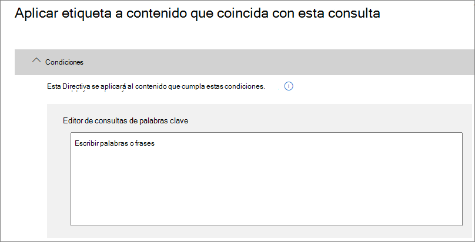


### <a name="auto-apply-labels-to-content-by-using-trainable-classifers"></a><span data-ttu-id="7ff69-300">Aplicar automáticamente etiquetas al contenido con clasificadores que se pueden entrenar</span><span class="sxs-lookup"><span data-stu-id="7ff69-300">Auto-apply labels to content by using trainable classifers</span></span>

<span data-ttu-id="7ff69-301">Si elige la opción para un clasificador que se puede entrenar, puede seleccionar uno de los clasificadores integrado o un clasificador personalizado.</span><span class="sxs-lookup"><span data-stu-id="7ff69-301">When you choose the option for a trainable classifier, you can select one of the built-in classifiers, or a custom classifier.</span></span> <span data-ttu-id="7ff69-302">Los clasificadores integrados incluyen **lenguaje ofensivo**, **currículum vítae**, **código fuente**, **acoso**, **blasfemia** y **amenazas**.</span><span class="sxs-lookup"><span data-stu-id="7ff69-302">The built-in classifers include **Offensive Language**, **Resumes**, **SourceCode**, **Harassment**, **Profanity**, and **Threat**.</span></span>

<span data-ttu-id="7ff69-303">Para aplicar una etiqueta automáticamente usando esta opción, los buzones y sitios de SharePoint Online deben tener al menos 10 MB de datos.</span><span class="sxs-lookup"><span data-stu-id="7ff69-303">To automatically apply a label by using this option, SharePoint Online sites and mailboxes must have at least 10 MB of data.</span></span>

<span data-ttu-id="7ff69-304">Para obtener más información sobre los clasificadores que se pueden entrenar, consulte [Introducción al entrenamiento de clasificadores (vista previa)](classifier-getting-started-with.md).</span><span class="sxs-lookup"><span data-stu-id="7ff69-304">For more information about trainable classifers, see [Getting started with trainable classifiers (preview)](classifier-getting-started-with.md).</span></span>

<span data-ttu-id="7ff69-305">Para obtener un ejemplo de configuración, consulte [cómo preparar y usar un clasificador listo para usar](classifier-using-a-ready-to-use-classifier.md#how-to-prepare-for-and-use-a-ready-to-use-classifier).</span><span class="sxs-lookup"><span data-stu-id="7ff69-305">For an example configuration, see [How to prepare for and use a ready to use classifier](classifier-using-a-ready-to-use-classifier.md#how-to-prepare-for-and-use-a-ready-to-use-classifier).</span></span>

## <a name="applying-a-default-retention-label-to-all-content-in-a-sharepoint-library-folder-or-document-set"></a><span data-ttu-id="7ff69-306">Aplicar una etiqueta de retención predeterminada a todo el contenido de una biblioteca, carpeta o conjunto de documentos de SharePoint</span><span class="sxs-lookup"><span data-stu-id="7ff69-306">Applying a default retention label to all content in a SharePoint library, folder, or document set</span></span>

<span data-ttu-id="7ff69-307">Además de permitir que los usuarios apliquen una etiqueta de retención a documentos individuales, también puede aplicar una etiqueta de retención predeterminada a una biblioteca de SharePoint, carpeta o conjunto de documentos, para que todos los documentos en esa ubicación obtengan la etiqueta de retención predeterminada (las etiquetas predeterminadas son característica E5).</span><span class="sxs-lookup"><span data-stu-id="7ff69-307">In addition to enabling people to apply a retention label to individual documents, you can also apply a default retention label to a SharePoint library, folder, or document set, so that all documents in that location get the default retention label (default labels are an E5 feature).</span></span>
  
<span data-ttu-id="7ff69-308">Para una biblioteca de documentos, esto se realiza en la página **Configuración de biblioteca** de la biblioteca de documentos.</span><span class="sxs-lookup"><span data-stu-id="7ff69-308">For a document library, this is done on the **Library settings** page for a document library.</span></span> <span data-ttu-id="7ff69-309">Al seleccionar la etiqueta de retención predeterminada, también se puede elegir aplicarla a los elementos existentes en la biblioteca.</span><span class="sxs-lookup"><span data-stu-id="7ff69-309">When you choose the default retention label, you can also choose to apply it to existing items in the library.</span></span> 
  
<span data-ttu-id="7ff69-310">Por ejemplo, si tiene una etiqueta para los materiales de marketing y sabe que una biblioteca de documentos específica solo contiene ese tipo de contenido, puede hacer que la etiqueta “Materiales de marketing” sea la predeterminada para todos los documentos de esa biblioteca.</span><span class="sxs-lookup"><span data-stu-id="7ff69-310">For example, if you have a tag for marketing materials, and you know a specific document library contains only that type of content, you can make the Marketing Materials tag the default for all documents in that library.</span></span>
  
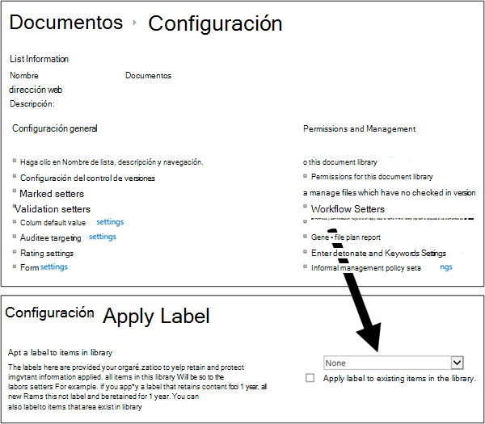
  
<span data-ttu-id="7ff69-312">Si aplica una etiqueta de retención predeterminada a elementos existentes de una biblioteca, carpeta o conjunto de documentos:</span><span class="sxs-lookup"><span data-stu-id="7ff69-312">If you apply a default retention label to existing items in the library, folder, or document set:</span></span>
  
- <span data-ttu-id="7ff69-313">Todos los elementos de la biblioteca, la carpeta o el conjunto de documentos reciben automáticamente la misma etiqueta de retención, **excepto** los elementos a los que se les ha aplicado explícitamente una etiqueta de retención (como los registros).</span><span class="sxs-lookup"><span data-stu-id="7ff69-313">All items in the library, folder, or document set automatically get the same retention label, **except** for items that have had a retention label applied explicitly to them (such as records).</span></span> <span data-ttu-id="7ff69-314">Los elementos etiquetados explícitamente mantienen su etiqueta existente.</span><span class="sxs-lookup"><span data-stu-id="7ff69-314">Explicitly labeled items keep their existing label.</span></span> <span data-ttu-id="7ff69-315">Para obtener más información, vea la sección siguiente sobre [Los principios de la retención, o lo que tiene prioridad](#the-principles-of-retention-or-what-takes-precedence).</span><span class="sxs-lookup"><span data-stu-id="7ff69-315">For more information, see the below section on [The principles of retention, or what takes precedence](#the-principles-of-retention-or-what-takes-precedence).</span></span>
    
- <span data-ttu-id="7ff69-316">Si cambia o elimina la etiqueta de retención predeterminada de una biblioteca, carpeta o conjunto de documentos, la etiqueta de retención también se cambia o elimina para todos los elementos de la biblioteca, la carpeta o el conjunto de documentos, **excepto** los elementos con etiquetas de retención explícitas (como los registros).</span><span class="sxs-lookup"><span data-stu-id="7ff69-316">If you change or remove the default retention label for a library, folder, or document set, the retention label is also changed or removed for all items in the library, folder, or document set, **except** items with explicit retention labels (such as records).</span></span>
    
- <span data-ttu-id="7ff69-317">Si mueve un elemento con una etiqueta de retención predeterminada de una biblioteca, carpeta o conjunto de documentos a otra biblioteca, carpeta o conjunto de documentos, el elemento mantendrá su etiqueta de retención predeterminada existente, incluso si la nueva ubicación tiene otra etiqueta de retención predeterminada.</span><span class="sxs-lookup"><span data-stu-id="7ff69-317">If you move an item with a default retention label from one library, folder, or document set to another library, folder, or document set, the item keeps its existing default retention label, even if the new location has a different default retention label.</span></span>

<span data-ttu-id="7ff69-318">\*\* Registros: \*\*Si se aplica un sello de registro predeterminado a una biblioteca, carpeta o conjunto de documentos, entonces se aplica un sello de registro a todos los elementos individuales dentro de esas ubicaciones.</span><span class="sxs-lookup"><span data-stu-id="7ff69-318">**Records:** If you apply a default record label to a library, folder, or document set, then a record label is applied to all the individual items within those locations.</span></span> <span data-ttu-id="7ff69-319">Cuando mueves un nuevo elemento a un lugar con una etiqueta de registro, ese elemento es etiquetado como un registro.</span><span class="sxs-lookup"><span data-stu-id="7ff69-319">When you move a new item into a location with a record label, that item is labeled a record.</span></span> <span data-ttu-id="7ff69-320">Sin embargo, si cambia la etiqueta de retención predeterminada por una etiqueta que no declare el contenido como registro, esa acción **no** elimina la etiqueta de registro de los elementos individuales; esos elementos conservan su etiqueta de registro.</span><span class="sxs-lookup"><span data-stu-id="7ff69-320">However, if you change the default retention label to a label that doesn't declare content as a record, that action **does not** remove the record label from the individual items; those items retain their record label.</span></span> <span data-ttu-id="7ff69-321">Sólo el administrador de la colección del sitio puede eliminar o cambiar explícitamente la etiqueta de retención de los artículos de registro.</span><span class="sxs-lookup"><span data-stu-id="7ff69-321">Only a site collection admin can explicitly remove or change the retention label of record items.</span></span>

<span data-ttu-id="7ff69-322">Para obtener más información sobre las etiquetas de retención que declaran al contenido como registro, vea [Información general de los registros](records.md).</span><span class="sxs-lookup"><span data-stu-id="7ff69-322">For more information about retention labels that declare content as a record, see [Overview of records](records.md).</span></span>
    
## <a name="applying-a-retention-label-to-email-by-using-rules"></a><span data-ttu-id="7ff69-323">Aplicar una etiqueta de retención a correo electrónico mediante reglas</span><span class="sxs-lookup"><span data-stu-id="7ff69-323">Applying a retention label to email by using rules</span></span>

<span data-ttu-id="7ff69-324">En Outlook 2010 o versiones posteriores, puede crear reglas para aplicar una etiqueta de retención o directiva de retención.</span><span class="sxs-lookup"><span data-stu-id="7ff69-324">In Outlook 2010 or later, you can create rules to apply a retention label or retention policy.</span></span>
  
<span data-ttu-id="7ff69-325">Por ejemplo, puede crear una regla que aplique una etiqueta de retención específica a todos los mensajes enviados a un grupo de distribución específico o desde este.</span><span class="sxs-lookup"><span data-stu-id="7ff69-325">For example, you can create a rule that applies a specific retention label to all messages sent to or from a specific distribution group.</span></span>
  
<span data-ttu-id="7ff69-326">Para crear una regla, haga clic con el botón derecho en un elemento \> **Reglas** \> **Crear regla** \> **Opciones avanzadas** \> **Asistente para reglas** \> **aplicar directiva de retención**.</span><span class="sxs-lookup"><span data-stu-id="7ff69-326">To create a rule, right-click an item \> **Rules** \> **Create Rule** \> **Advanced Options** \> **Rules Wizard** \> **apply retention policy**.</span></span>
  

  
## <a name="classifying-content-without-applying-any-actions"></a><span data-ttu-id="7ff69-328">Clasificar contenido sin aplicar acciones</span><span class="sxs-lookup"><span data-stu-id="7ff69-328">Classifying content without applying any actions</span></span>

<span data-ttu-id="7ff69-p143">Al crear una etiqueta de retención, puede hacerlo sin activar ninguna retención u otras acciones, como se muestra abajo. En este caso, puede usar una etiqueta de retención simplemente como una etiqueta de texto, sin exigir ninguna acción.</span><span class="sxs-lookup"><span data-stu-id="7ff69-p143">When you create a retention label, you can do so without turning on any retention or other actions, as shown below. In this case, you can use a retention label simply as a text label, without enforcing any actions.</span></span>
  
<span data-ttu-id="7ff69-331">Por ejemplo, puede crear una etiqueta de retención llamada “Revisar más tarde” sin ninguna acción y, después, aplicar automáticamente esa etiqueta de retención al contenido con tipos de información confidencial o contenido consultado.</span><span class="sxs-lookup"><span data-stu-id="7ff69-331">For example, you can create a retention label named "Review later" with no actions, and then auto-apply that retention label to content with sensitive information types or queried content.</span></span>
  
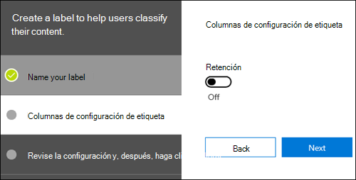
  
## <a name="using-retention-labels-for-records-management"></a><span data-ttu-id="7ff69-333">Uso de etiquetas de retención para la administración de registros</span><span class="sxs-lookup"><span data-stu-id="7ff69-333">Using retention labels for records management</span></span>
    
<span data-ttu-id="7ff69-334">Puede usar las etiquetas de retención para declarar el contenido como un registro.</span><span class="sxs-lookup"><span data-stu-id="7ff69-334">You can use retention labels to declare content as a record.</span></span> <span data-ttu-id="7ff69-335">Esto le permite implementar una estrategia de administración de registros única y consistente para todo Office 365.</span><span class="sxs-lookup"><span data-stu-id="7ff69-335">This lets you implement a single, consistent records-management strategy across Office 365.</span></span> <span data-ttu-id="7ff69-336">Para obtener más información, vea [Introducción a registros](records.md). </span><span class="sxs-lookup"><span data-stu-id="7ff69-336">For more information, see [Overview of records](records.md).</span></span>
  
## <a name="using-a-retention-label-as-a-condition-in-a-dlp-policy"></a><span data-ttu-id="7ff69-337">Usar una etiqueta de retención como condición en una directiva DLP</span><span class="sxs-lookup"><span data-stu-id="7ff69-337">Using a retention label as a condition in a DLP policy</span></span>

<span data-ttu-id="7ff69-p145">Una etiqueta de retención puede exigir acciones de retención en el contenido. Además, puede usar una etiqueta de retención como una condición en una directiva de prevención de pérdida de datos (DLP) y la directiva DLP puede exigir otras acciones (como restringir el acceso) en contenido que coincida con una etiqueta específica.</span><span class="sxs-lookup"><span data-stu-id="7ff69-p145">A retention label can enforce retention actions on content. In addition, you can use a retention label as a condition in a data loss prevention (DLP) policy, and the DLP policy can enforce other actions, such as restricting access, on content that contains a specific label.</span></span> 
  
<span data-ttu-id="7ff69-340">Para obtener más información, vea [Usar una etiqueta como una condición en una directiva DLP](data-loss-prevention-policies.md#using-a-label-as-a-condition-in-a-dlp-policy).</span><span class="sxs-lookup"><span data-stu-id="7ff69-340">For more information, see [Using a label as a condition in a DLP policy](data-loss-prevention-policies.md#using-a-label-as-a-condition-in-a-dlp-policy).</span></span>
  
## <a name="monitor-retention-labels"></a><span data-ttu-id="7ff69-341">Supervisar etiquetas de retención.</span><span class="sxs-lookup"><span data-stu-id="7ff69-341">Monitor retention labels</span></span>

<span data-ttu-id="7ff69-p146">Después de publicar o aplicar automáticamente las etiquetas de retención, puede comprobar que se hayan aplicado en el contenido según lo previsto. Para supervisar las etiquetas de retención, puede usar el:</span><span class="sxs-lookup"><span data-stu-id="7ff69-p146">After you publish or auto-apply your retention labels, you'll want to verify that they're being applied to content as you intended. To monitor your retention labels, you can use the:</span></span>
  
- <span data-ttu-id="7ff69-p147">**Explorador de actividad de etiquetas**. Con el explorador (que se muestra abajo), puede buscar y visualizar rápidamente la actividad de etiquetas de retención de todo el contenido en SharePoint y OneDrive para la Empresa en los últimos 30 días. Para obtener más información, vea [Ver actividad de etiquetas para documentos](view-label-activity-for-documents.md).</span><span class="sxs-lookup"><span data-stu-id="7ff69-p147">**Label Activity Explorer**. With the explorer (shown below), you can quickly search and view retention label activity for all content across SharePoint and OneDrive for Business over the past 30 days. For more information, see [View label activity for documents](view-label-activity-for-documents.md).</span></span>

- <span data-ttu-id="7ff69-347">Página de **Análisis de etiquetas**</span><span class="sxs-lookup"><span data-stu-id="7ff69-347">**Label analytics** page.</span></span> <span data-ttu-id="7ff69-348">En el Centro de cumplimiento de Microsoft 365 y el Centro de seguridad de Microsoft 365, puede ver rápidamente las etiquetas principales y dónde se aplican</span><span class="sxs-lookup"><span data-stu-id="7ff69-348">In the Microsoft 365 compliance center and Microsoft 365 security center, you can quickly view your top labels and where they're applied.</span></span> <span data-ttu-id="7ff69-349">También puede ver todo el contenido con una etiqueta específica.</span><span class="sxs-lookup"><span data-stu-id="7ff69-349">You can also view all content with a specific label.</span></span> <span data-ttu-id="7ff69-350">Para obtener más información, vea [Ver el uso de etiquetas con el análisis de etiquetas](label-analytics.md).</span><span class="sxs-lookup"><span data-stu-id="7ff69-350">For more information, see [View label usage with label analytics](label-analytics.md).</span></span>
    
- <span data-ttu-id="7ff69-p149">**Informes de gobierno de datos**. Con estos informes, puede ver rápidamente actividades y tendencias de etiquetas de retención de todo el contenido en Exchange, SharePoint y OneDrive para la Empresa en los últimos 90 días. Para obtener más información, vea [Ver los informes de gobierno de datos](view-the-data-governance-reports.md).</span><span class="sxs-lookup"><span data-stu-id="7ff69-p149">**Data governance reports**. With these reports, you can quickly view retention label trends and activity for all content across Exchange, SharePoint, and OneDrive for Business over the past 90 days. For more information, see [View the data governance reports](view-the-data-governance-reports.md).</span></span>
    
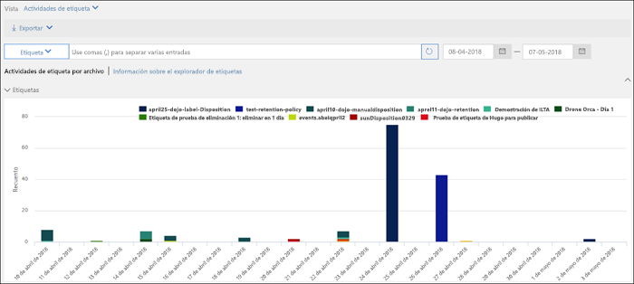
  
## <a name="using-content-search-to-find-all-content-with-a-specific-retention-label-applied-to-it"></a><span data-ttu-id="7ff69-355">Usar Búsqueda de contenido para encontrar todo el contenido que tenga aplicada una etiqueta de retención específica</span><span class="sxs-lookup"><span data-stu-id="7ff69-355">Using Content Search to find all content with a specific retention label applied to it</span></span>

<span data-ttu-id="7ff69-356">Después de asignar etiquetas de retención a contenido (ya sea por los usuarios o aplicadas automáticamente), puede usar Búsqueda de contenido para encontrar todo el contenido clasificado con una etiqueta de retención específica.</span><span class="sxs-lookup"><span data-stu-id="7ff69-356">After retention labels are assigned to content, either by users or auto-applied, you can use content search to find all content that's classified with a specific retention label.</span></span>
  
<span data-ttu-id="7ff69-p150">Al crear una búsqueda de contenido, seleccione la condición **Etiqueta de cumplimiento** y, después, escriba el nombre completo de la etiqueta o una parte del nombre de la etiqueta y use un comodín. Para obtener más información, vea [Consultas de palabras clave y condiciones de búsqueda para Búsqueda de contenido](keyword-queries-and-search-conditions.md).</span><span class="sxs-lookup"><span data-stu-id="7ff69-p150">When you create a content search, choose the **Compliance Tag** condition, and then enter the complete label name or part of the label name and use a wildcard. For more information, see [Keyword queries and search conditions for Content Search](keyword-queries-and-search-conditions.md).</span></span>
  
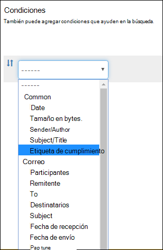
  
## <a name="the-principles-of-retention-or-what-takes-precedence"></a><span data-ttu-id="7ff69-360">Los principios de retención o qué tiene precedencia</span><span class="sxs-lookup"><span data-stu-id="7ff69-360">The principles of retention, or what takes precedence?</span></span>

<span data-ttu-id="7ff69-p151">Es posible (o incluso probable) que se apliquen varias directivas de retención a contenido, cada una con una acción (conservar, eliminar o ambas) y un período de retención. ¿Qué tiene precedencia? En general, puede estar seguro de que el contenido conservado por una directiva no se puede eliminar de forma permanente con otra directiva.</span><span class="sxs-lookup"><span data-stu-id="7ff69-p151">It's possible or even likely that content might have several retention policies applied to it, each with a different action (retain, delete, or both) and retention period. What takes precedence? At the highest level, rest assured that content being retained by one policy can't be permanently deleted by another policy.</span></span>
  

  
<span data-ttu-id="7ff69-365">Para entender cómo se aplican a contenido distintas etiquetas con acciones de retención, tenga en cuenta estos principios de retención:</span><span class="sxs-lookup"><span data-stu-id="7ff69-365">To understand how different labels with retention actions are applied to content, keep these principles of retention in mind:</span></span>
  
1. <span data-ttu-id="7ff69-p152">**La retención tiene prioridad sobre la eliminación.** Imagine que una directiva de retención dice que es necesario eliminar el correo electrónico de Exchange después de tres años, pero otra directiva de retención dice que se conserve durante cinco años y, después, se elimine. Todo el contenido que alcance los tres años de antigüedad se eliminará y quedará oculto para el usuario, pero se seguirá conservando en la carpeta Elementos recuperables hasta que alcance los cinco años, momento en que se eliminará de forma permanente.</span><span class="sxs-lookup"><span data-stu-id="7ff69-p152">**Retention wins over deletion.** Suppose that one retention policy says to delete Exchange email after three years, but another retention policy says to retain Exchange email for five years and then delete it. Any content that reaches three years old will be deleted and hidden from the users' view, but still retained in the Recoverable Items folder until the content reaches five years old, when it will be permanently deleted.</span></span> 
    
2. <span data-ttu-id="7ff69-p153">**El período de retención más largo tiene prioridad.** Si el contenido está sujeto a varias directivas de retención, se conservará hasta el final del período de retención más largo.</span><span class="sxs-lookup"><span data-stu-id="7ff69-p153">**The longest retention period wins.** If content's subject to multiple policies that retain content, it will be retained until the end of the longest retention period.</span></span> 
    
3. <span data-ttu-id="7ff69-p154">**La inclusión explícita tiene prioridad sobre la inclusión implícita.** Esto significa que:</span><span class="sxs-lookup"><span data-stu-id="7ff69-p154">**Explicit inclusion wins over implicit inclusion.** This means:</span></span> 
    
    1. <span data-ttu-id="7ff69-373">Si un usuario asigna manualmente una etiqueta de retención con configuración de retención a un elemento, como un correo electrónico de Exchange o un documento de OneDrive, esa etiqueta de retención tiene prioridad sobre una directiva asignada en el nivel de sitio o buzón, y una etiqueta de retención predeterminada asignada por la biblioteca de documentos.</span><span class="sxs-lookup"><span data-stu-id="7ff69-373">If a retention label with retention settings is manually assigned by a user to an item, such as an Exchange email or OneDrive document, that retention label takes precedence over both a policy assigned at the site or mailbox level and a default retention label assigned by the document library.</span></span> <span data-ttu-id="7ff69-374">Por ejemplo, si la etiqueta de retención explícita dice que la conservación es de 10 años, pero la directiva de retención asignada al sitio dice que la conservación es de solo cinco años, la etiqueta de retención tendrá prioridad.</span><span class="sxs-lookup"><span data-stu-id="7ff69-374">For example, if the explicit retention label says to retain for 10 years, but the retention policy assigned to the site says to retain for only five years, the retention label takes precedence.</span></span> <span data-ttu-id="7ff69-375">Las etiquetas de retención de aplicación automática se consideran implícitas, no explícitas, porque Office 365 las aplica automáticamente.</span><span class="sxs-lookup"><span data-stu-id="7ff69-375">Auto-applied retention labels are considered implicit, not explicit, because they're applied automatically by Office 365.</span></span>
    
    2. <span data-ttu-id="7ff69-376">Si una directiva de retención incluye una ubicación específica (como el buzón de un usuario o una cuenta de OneDrive para la Empresa), tendrá precedencia sobre cualquier otra directiva de retención que se aplique a los buzones de todos los usuarios o a las cuentas de OneDrive para la Empresa, pero que no incluyan específicamente ese buzón de usuario.</span><span class="sxs-lookup"><span data-stu-id="7ff69-376">If a retention policy includes a specific location, such as a specific user's mailbox or OneDrive for Business account, that policy takes precedence over another retention policy that applies to all users' mailboxes or OneDrive for Business accounts but doesn't specifically include that user's mailbox.</span></span>
    
4. <span data-ttu-id="7ff69-p156">**El período de eliminación más corto tiene prioridad.** De forma similar, si el contenido está sujeto a varias directivas que eliminan contenido (sin retención), se eliminará al final del período de retención más corto.</span><span class="sxs-lookup"><span data-stu-id="7ff69-p156">**The shortest deletion period wins.** Similarly, if content's subject to multiple policies that delete content (with no retention), it will be deleted at the end of the shortest retention period.</span></span> 
    
<span data-ttu-id="7ff69-379">Tenga en cuenta que los principios de retención funcionan como un flujo de desempate de arriba abajo: si las reglas aplicadas por todas las directivas o etiquetas son las mismas en un nivel, el flujo baja al siguiente nivel para determinar la precedencia de la regla que se aplica.</span><span class="sxs-lookup"><span data-stu-id="7ff69-379">Understand that the principles of retention work as a tie-breaking flow from top to bottom: If the rules applied by all policies or labels are the same at one level, the flow moves down to the next level to determine precedence for which rule is applied.</span></span>
  
<span data-ttu-id="7ff69-p157">Por último, una etiqueta o directiva de retención no puede eliminar de forma permanente ningún contenido si está en suspensión para eDiscovery. Cuando se levante la suspensión, el contenido volverá a estar disponible para el proceso de limpieza descrito anteriormente.</span><span class="sxs-lookup"><span data-stu-id="7ff69-p157">Finally, a retention policy or label cannot permanently delete any content that's on hold for eDiscovery. When the hold is released, the content again becomes eligible for the cleanup process described above.</span></span>
  
## <a name="use-retention-labels-instead-of-these-features"></a><span data-ttu-id="7ff69-382">Usar etiquetas de retención en lugar de estas características</span><span class="sxs-lookup"><span data-stu-id="7ff69-382">Use retention labels instead of these features</span></span>

<span data-ttu-id="7ff69-p158">Las etiquetas de retención se pueden publicar fácilmente para toda la organización, así como su contenido, en Office 365, incluidos Exchange, SharePoint, OneDrive y Grupos de Office 365. Si necesita clasificar contenido o administrar registros en cualquier lugar en Office 365, le recomendamos que use etiquetas de retención.</span><span class="sxs-lookup"><span data-stu-id="7ff69-p158">Retention labels can easily be made available to an entire organization and its content across Office 365, including Exchange, SharePoint, OneDrive, and Office 365 groups. If you need to classify content or manage records anywhere in Office 365, we recommend that you use retention labels.</span></span>
  
<span data-ttu-id="7ff69-385">Hay otras características que ya se han usado para clasificar contenido o administrar registros en Office 365.</span><span class="sxs-lookup"><span data-stu-id="7ff69-385">There are several other features that have previously been used to classify content or manage records in Office 365.</span></span> <span data-ttu-id="7ff69-386">Se muestran a continuación.</span><span class="sxs-lookup"><span data-stu-id="7ff69-386">These are listed below.</span></span> <span data-ttu-id="7ff69-387">Estas características seguirán funcionando en paralelo con las etiquetas de retención.</span><span class="sxs-lookup"><span data-stu-id="7ff69-387">These features will continue to work side by side with retention labels.</span></span> <span data-ttu-id="7ff69-388">Aunque en algunos casos la implementación de etiquetas de retención difiere de las características anteriores, la evolución de las etiquetas de retención determinará el futuro de la administración de registros en Office 365.</span><span class="sxs-lookup"><span data-stu-id="7ff69-388">While there are instances where the implementation of retention labels differs from previous features, the evolution of retention labels will drive the future of records management across Office 365.</span></span> <span data-ttu-id="7ff69-389">Por lo tanto, en adelante, se recomienda usar etiquetas de retención para el gobierno de datos en lugar de estas características.</span><span class="sxs-lookup"><span data-stu-id="7ff69-389">Therefore, moving forward, for data governance, we recommend that you use retention labels instead of these features.</span></span>
  
### <a name="exchange-online"></a><span data-ttu-id="7ff69-390">Exchange Online</span><span class="sxs-lookup"><span data-stu-id="7ff69-390">Exchange Online</span></span>

- <span data-ttu-id="7ff69-391">[Etiquetas de retención y directivas de retención](https://go.microsoft.com/fwlink/?linkid=846125), lo que también se conoce como [administración de registros de mensajes (MRM)](https://go.microsoft.com/fwlink/?linkid=846126) (solo eliminación)</span><span class="sxs-lookup"><span data-stu-id="7ff69-391">[Retention tags and retention policies](https://go.microsoft.com/fwlink/?linkid=846125), also known as [messaging records management (MRM)](https://go.microsoft.com/fwlink/?linkid=846126) (Deletion only)</span></span> 
    
### <a name="sharepoint-online-and-onedrive-for-business"></a><span data-ttu-id="7ff69-392">SharePoint Online y OneDrive para la Empresa</span><span class="sxs-lookup"><span data-stu-id="7ff69-392">SharePoint Online and OneDrive for Business</span></span>

- <span data-ttu-id="7ff69-393">[Configuración de administración de registros local](https://support.office.com/article/7707a878-780c-4be6-9cb0-9718ecde050a) (retención)</span><span class="sxs-lookup"><span data-stu-id="7ff69-393">[Configuring in place records management](https://support.office.com/article/7707a878-780c-4be6-9cb0-9718ecde050a) (Retention)</span></span> 
    
- <span data-ttu-id="7ff69-394">[Introducción al Centro de registros](https://support.office.com/article/bae6ca5a-7b19-40e0-b433-e3613a747c2c) (retención)</span><span class="sxs-lookup"><span data-stu-id="7ff69-394">[Introduction to the Records Center](https://support.office.com/article/bae6ca5a-7b19-40e0-b433-e3613a747c2c) (Retention)</span></span> 
    
- <span data-ttu-id="7ff69-395">[Directivas de administración de información](intro-to-info-mgmt-policies.md) (solo eliminación)</span><span class="sxs-lookup"><span data-stu-id="7ff69-395">[Information management policies](intro-to-info-mgmt-policies.md) (Deletion only)</span></span> 
    
## <a name="permissions"></a><span data-ttu-id="7ff69-396">Permisos</span><span class="sxs-lookup"><span data-stu-id="7ff69-396">Permissions</span></span>

<span data-ttu-id="7ff69-397">Los miembros de su equipo de cumplimiento que vayan a crear las etiquetas de retención necesitan permisos para el Centro de &amp;Seguridad y Cumplimiento.</span><span class="sxs-lookup"><span data-stu-id="7ff69-397">Members of your compliance team who will create retention labels need permissions to the Security &amp; Compliance Center.</span></span> <span data-ttu-id="7ff69-398">De forma predeterminada, el administrador de inquilinos tendrá acceso a esta ubicación y puede otorgar acceso a los oficiales de cumplimiento y a otros usuarios al Centro de &amp;Cumplimiento y Seguridad, sin concederles todos los permisos de un administrador de inquilinos. Para hacerlo, le recomendamos que vaya a la página **Permisos** del Centro de &amp;Cumplimiento y Seguridad, edite el grupo de roles del **Administrador de Cumplimiento** y agregue miembros a ese grupo de roles.</span><span class="sxs-lookup"><span data-stu-id="7ff69-398">By default, your tenant admin has access to this location and can give compliance officers and other people access to the Security &amp; Compliance Center, without giving them all of the permissions of a tenant admin. To do this, we recommend that you go to the **Permissions** page of the Security &amp; Compliance Center, edit the **Compliance Administrator** role group, and add members to that role group.</span></span> 
  
<span data-ttu-id="7ff69-399">Para obtener más información, vea [Conceder acceso a los usuarios al Centro de seguridad y cumplimiento de Office 365](../security/office-365-security/grant-access-to-the-security-and-compliance-center.md).</span><span class="sxs-lookup"><span data-stu-id="7ff69-399">For more information, see [Give users access to the Office 365 Security &amp; Compliance Center](../security/office-365-security/grant-access-to-the-security-and-compliance-center.md).</span></span>
  
<span data-ttu-id="7ff69-p161">Estos permisos solo son necesarios para crear y aplicar etiquetas de retención y una directiva de etiquetas. La aplicación de directivas no necesita acceso al contenido.</span><span class="sxs-lookup"><span data-stu-id="7ff69-p161">These permissions are required only to create and apply retention labels and a label policy. Policy enforcement does not require access to the content.</span></span>  
## <a name="find-the-powershell-cmdlets-for-labels"></a><span data-ttu-id="7ff69-402">Encontrar los cmdlets de PowerShell para etiquetas</span><span class="sxs-lookup"><span data-stu-id="7ff69-402">Find the PowerShell cmdlets for labels</span></span>

<span data-ttu-id="7ff69-403">Para usar los cmdlets de etiquetas, necesita:</span><span class="sxs-lookup"><span data-stu-id="7ff69-403">To use the label cmdlets, you need to:</span></span>
  
1. [<span data-ttu-id="7ff69-404">Conectarse a PowerShell del Centro de seguridad y cumplimiento de Office 365</span><span class="sxs-lookup"><span data-stu-id="7ff69-404">Connect to the Office 365 Security & Compliance Center Powershell</span></span>](https://docs.microsoft.com/powershell/exchange/office-365-scc/connect-to-scc-powershell/connect-to-scc-powershell)
    
2. <span data-ttu-id="7ff69-405">Use estos cmdlets del Centro de seguridad y cumplimiento de Office 365:</span><span class="sxs-lookup"><span data-stu-id="7ff69-405">Use these Office 365 Security & Compliance Center cmdlets:</span></span>

  - [<span data-ttu-id="7ff69-406">Get-ComplianceTag</span><span class="sxs-lookup"><span data-stu-id="7ff69-406">Get-ComplianceTag</span></span>](https://docs.microsoft.com/powershell/module/exchange/policy-and-compliance-retention/get-compliancetag)

  - [<span data-ttu-id="7ff69-407">New-ComplianceTag</span><span class="sxs-lookup"><span data-stu-id="7ff69-407">New-ComplianceTag</span></span>](https://docs.microsoft.com/powershell/module/exchange/policy-and-compliance-retention/new-compliancetag)

  - [<span data-ttu-id="7ff69-408">Remove-ComplianceTag</span><span class="sxs-lookup"><span data-stu-id="7ff69-408">Remove-ComplianceTag</span></span>](https://docs.microsoft.com/powershell/module/exchange/policy-and-compliance-retention/remove-compliancetag)

  - [<span data-ttu-id="7ff69-409">Set-ComplianceTag</span><span class="sxs-lookup"><span data-stu-id="7ff69-409">Set-ComplianceTag</span></span>](https://docs.microsoft.com/powershell/module/exchange/policy-and-compliance-retention/set-compliancetag)

  - [<span data-ttu-id="7ff69-410">Enable-ComplianceTagStorage</span><span class="sxs-lookup"><span data-stu-id="7ff69-410">Enable-ComplianceTagStorage</span></span>](https://docs.microsoft.com/powershell/module/exchange/policy-and-compliance-retention/enable-compliancetagstorage)

  - [<span data-ttu-id="7ff69-411">Get-ComplianceTagStorage</span><span class="sxs-lookup"><span data-stu-id="7ff69-411">Get-ComplianceTagStorage</span></span>](https://docs.microsoft.com/powershell/module/exchange/policy-and-compliance-retention/get-compliancetagstorage)

  - [<span data-ttu-id="7ff69-412">Get-RetentionCompliancePolicy</span><span class="sxs-lookup"><span data-stu-id="7ff69-412">Get-RetentionCompliancePolicy</span></span>](https://docs.microsoft.com/powershell/module/exchange/policy-and-compliance-retention/get-retentioncompliancepolicy)

  - [<span data-ttu-id="7ff69-413">New-RetentionCompliancePolicy</span><span class="sxs-lookup"><span data-stu-id="7ff69-413">New-RetentionCompliancePolicy</span></span>](https://docs.microsoft.com/powershell/module/exchange/policy-and-compliance-retention/new-retentioncompliancepolicy)

  - [<span data-ttu-id="7ff69-414">Remove-RetentionCompliancePolicy</span><span class="sxs-lookup"><span data-stu-id="7ff69-414">Remove-RetentionCompliancePolicy</span></span>](https://docs.microsoft.com/powershell/module/exchange/policy-and-compliance-retention/remove-retentioncompliancepolicy)

  - [<span data-ttu-id="7ff69-415">Set-RetentionCompliancePolicy</span><span class="sxs-lookup"><span data-stu-id="7ff69-415">Set-RetentionCompliancePolicy</span></span>](https://docs.microsoft.com/powershell/module/exchange/policy-and-compliance-retention/set-retentioncompliancepolicy)

  - [<span data-ttu-id="7ff69-416">Get-RetentionComplianceRule</span><span class="sxs-lookup"><span data-stu-id="7ff69-416">Get-RetentionComplianceRule</span></span>](https://docs.microsoft.com/powershell/module/exchange/policy-and-compliance-retention/get-retentioncompliancerule)

  - [<span data-ttu-id="7ff69-417">New-RetentionComplianceRule</span><span class="sxs-lookup"><span data-stu-id="7ff69-417">New-RetentionComplianceRule</span></span>](https://docs.microsoft.com/powershell/module/exchange/policy-and-compliance-retention/new-retentioncompliancerule)

  - [<span data-ttu-id="7ff69-418">Remove-RetentionComplianceRule</span><span class="sxs-lookup"><span data-stu-id="7ff69-418">Remove-RetentionComplianceRule</span></span>](https://docs.microsoft.com/powershell/module/exchange/policy-and-compliance-retention/remove-retentioncompliancerule)

  - [<span data-ttu-id="7ff69-419">Set-RetentionComplianceRule</span><span class="sxs-lookup"><span data-stu-id="7ff69-419">Set-RetentionComplianceRule</span></span>](https://docs.microsoft.com/powershell/module/exchange/policy-and-compliance-retention/set-retentioncompliancerule)
