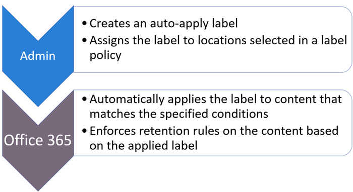

# Obtenga información sobre las etiquetas de retenciónLearn about retention labels

>*[Instrucciones de licencias de Microsoft 365 para la seguridad y el cumplimiento](https://aka.ms/ComplianceSD).**[Microsoft 365 licensing guidance for security & compliance](https://aka.ms/ComplianceSD).*

Across your organization, you probably have different types of content that require different actions taken on them in order to comply with industry regulations and internal policies.Across your organization, you probably have different types of content that require different actions taken on them in order to comply with industry regulations and internal policies. For example, you might have:For example, you might have:
  
- Formularios fiscales que deben **conservarse** durante un período mínimo de tiempo.Tax forms that need to be **retained** for a minimum period of time. 
    
- Materiales de prensa que deben **eliminarse de forma permanente** cuando llegan a una determinada edad.Press materials that need to be **permanently deleted** when they reach a certain age. 
    
- Información sobre la competencia que sea necesario **conservar** y, después, **eliminar de forma permanente**.Competitive research that needs to be both **retained** and then **permanently deleted**. 
    
- Visados de trabajo que tengan que **marcarse como registros** para que no se puedan editar ni eliminar.Work visas that must be **marked as a record** so that they can't be edited or deleted. 
    
In all of these cases, retention labels can help you take the right actions on the right content.In all of these cases, retention labels can help you take the right actions on the right content. With retention labels, you can classify data across your organization for governance, and enforce retention rules based on that classification.With retention labels, you can classify data across your organization for governance, and enforce retention rules based on that classification.
  
Con las etiquetas de retención, puede:With retention labels, you can:
  
- **Enable people in your organization to apply a retention label manually** to content in Outlook on the web, Outlook 2010 and later, OneDrive, SharePoint, and Microsoft 365 Groups.**Enable people in your organization to apply a retention label manually** to content in Outlook on the web, Outlook 2010 and later, OneDrive, SharePoint, and Microsoft 365 Groups. Users often know best what type of content they're working with, so they can classify it and have the appropriate policy applied.Users often know best what type of content they're working with, so they can classify it and have the appropriate policy applied. 
    
- **Aplicar etiquetas de retención a contenido automáticamente** si coincide con condiciones específicas, como:**Apply retention labels to content automatically** if it matches specific conditions, such as when the content contains: 
    
    - Tipos específicos de información confidencial.Specific types of sensitive information.
    
    - Palabras clave específicas que coinciden con una consulta que haya creado.Specific keywords that match a query you create.
    
    - Coincidencias de patrón para un clasificador que se puede entrenar.Pattern matches for a trainable classifier.
    
  La capacidad de aplicar etiquetas de retención automáticamente al contenido ofrece las ventajas siguientes:The ability to apply retention labels to content automatically is important because:
    
     - No es necesario formar a los usuarios para que conozcan todas las clasificaciones.You don't need to train your users on all of your classifications.
    
     - No es necesario depender de los usuarios para clasificar todo el contenido correctamente.You don't need to rely on users to classify all content correctly.
    
   - Los usuarios ya no necesitan conocer las directivas de gobierno de datos; en su lugar, pueden centrarse en su trabajo.Users no longer need to know about data governance policies - they can instead focus on their work.

- \*\* Aplicar una etiqueta de retención predeterminada a una biblioteca, carpeta o conjunto de documentos\*\* en SharePoint, de modo que todos los documentos almacenados en esa ubicación hereden la etiqueta de retención predeterminada.**Apply a default retention label to a document library, folder, or document set** in SharePoint, so that all documents that are stored in that location inherit the default retention label.

Además, las etiquetas de retención admiten la [administración de registros](records-management.md) de correo electrónico y documentos en todas las aplicaciones y servicios de Microsoft 365.Additionally, retention labels support [records management](records-management.md) for email and documents across Microsoft 365 apps and services. Puede usar las etiquetas de retención para clasificar el contenido como un registro.You can use a retention label to classify content as a record. Cuando esto sucede y el contenido permanece en Microsoft 365, la etiqueta no se puede cambiar o quitar, y el contenido no se puede modificar ni eliminar.When this happens and the content remains in Microsoft 365, the label can't be changed or removed, and the content can't be edited or deleted. 

Las etiquetas de retención, al igual que las [etiquetas de confidencialidad de ](sensitivity-labels.md), no se conservan si el contenido se mueve fuera de Microsoft 365.Retention labels, unlike [sensitivity labels](sensitivity-labels.md), do not persist if the content is moved outside Microsoft 365.

No hay límite en el número de etiquetas de retención que se apoyan para un inquilino.There is no limit to the number of retention labels that are supported for a tenant. Sin embargo, 10 000 es el número máximo de directivas que se admiten para un inquilino y éstas incluyen las directivas que aplican las etiquetas (directivas de etiquetas de retención y directivas de retención de aplicación automática), así como las directivas de retención.However, 10,000 is the maximum number of policies that are supported for a tenant and these include the policies that apply the labels (retention label policies and auto-apply retention policies), as well as retention policies.

## Cómo funcionan las etiquetas de retención con las directivas de etiquetas de retenciónHow retention labels work with retention label policies

Poner etiquetas de retención a disposición de las personas de su organización para que puedan clasificar el contenido es un proceso de dos pasos:Making retention labels available to people in your organization so that they can classify content is a two-step process: 

1. Crear las etiquetas de retenciónCreate the retention labels

2. Publicar las etiquetas de retención utilizando una directiva de etiquetas de retenciónPublish the retention labels by using a retention label policy
  

  
Las etiquetas de retención son bloques de creación independientes y reutilizables que se incluyen en una o más directivas de etiquetas de retención.Retention labels are independent, reusable building blocks that are included in one or more retention label policies. La finalidad principal de una directiva de etiqueta es agrupar un conjunto de etiquetas de retención y especificar las ubicaciones donde quiere que aparezcan.The primary purpose of a retention label policy is to group a set of retention labels and specify the locations where you want those labels to appear.
  

  
1. Al publicar etiquetas de retención, estas se incluyen en una directiva de etiqueta de retención.When you publish retention labels, they're included in a retention label policy. Los nombres de las etiquetas de retención son inmutables, lo que significa que no pueden ser editadas después de ser creadas.Retention label names are immutable, which means that they cannot be edited after they're created.

2. Se puede incluir una única etiqueta de retención en varias directivas de etiqueta de retención.A single retention label can be included in many retention label policies.

3. También puede incluirse una sola ubicación en numerosas directivas de etiqueta de retención.A single location can also be included in many retention label policies.
    
3. Las directivas de etiquetas de retención especifican las ubicaciones donde se publicarán las etiquetas de retención.Retention label policies specify the locations to publish the retention labels.
    
## Solo una etiqueta de retención a la vezOnly one retention label at a time

Es importante saber que solo se puede asignar una etiqueta de retención al contenido (como un correo electrónico o un documento):It's important to know that content like an email or document can have only a single retention label assigned to it at a time:
  
- En el caso de las etiquetas de retención asignadas manualmente por los usuarios finales, estos pueden quitar o cambiar la etiqueta de retención asignada.For retention labels assigned manually by end users, people can remove or change the retention label that's assigned.
    
- Si el contenido tiene asignada una etiqueta de aplicación automática, un usuario final puede reemplazarla por una etiqueta de retención asignada manualmente.If content has an auto-apply label assigned, an auto-apply label can be replaced by a retention label assigned manually by an end user.
    
- Si el contenido tiene una etiqueta de retención asignada manualmente por un usuario final, una etiqueta de aplicación automática no puede reemplazar a la etiqueta de retención asignada de forma manual.If content has a retention label assigned manually by an end user, an auto-apply label cannot replace the manually assigned retention label.
    
- Si hay varias reglas que asignan una etiqueta de aplicación automática y el contenido cumple las condiciones de varias reglas, se asignará la etiqueta de retención de la regla más antigua.If there are multiple rules that assign an auto-apply label and content meets the conditions of multiple rules, the retention label for the oldest rule is assigned.
    
Para comprender cómo y por qué se aplica una etiqueta de retención en lugar de otra, es útil comprender la diferencia entre asignar explícitamente una etiqueta y asignar implícitamente una etiqueta:To understand how and why one retention label is applied rather than another, it's helpful to understand the difference between explicitly assign a label, and implicitly assigned a label:

- Las etiquetas asignadas manualmente se asignan explícitamenteManually assigned labels are explicitly assigned
- Las etiquetas aplicadas automáticamente se asignan implícitamenteAutomatically applied labels are implicitly assigned

Una etiqueta de retención asignada explícitamente tiene prioridad sobre una etiqueta de retención asignada implícitamente.An explicitly assigned retention label takes precedence over an implicitly assigned retention label. Para más información, consulte la sección [Los principios de la retención, ¿o qué tiene prioridad?](#the-principles-of-retention-or-what-takes-precedence)en esta página.For more information, see the [The principles of retention, or what takes precedence?](#the-principles-of-retention-or-what-takes-precedence) section on this page.

## Ubicaciones y directivas de etiquetas de retenciónRetention label policies and locations

En función de la finalidad de las etiquetas de retención, pueden publicarse en distintas ubicaciones.Different types of retention labels can be published to different locations, depending on what the retention label does.
  
|**Si la etiqueta de retención es...****If the retention label is…**|**La directiva de etiquetas se puede aplicar en…****Then the label policy can be applied to…**|
|:-----|:-----|
|Se publica a los usuarios finalesPublished to end users    |Exchange, SharePoint, OneDrive, Grupos de Microsoft 365Exchange, SharePoint, OneDrive, Microsoft 365 Groups    |
|Se aplica automáticamente basándose en los tipos de información confidencialAuto-applied based on sensitive information types    |Exchange (solo todos los buzones), SharePoint, OneDriveExchange (all mailboxes only), SharePoint, OneDrive    |
|Se aplica automáticamente basándose en una consultaAuto-applied based on a query    |Exchange, SharePoint, OneDrive, Grupos de Microsoft 365Exchange, SharePoint, OneDrive, Microsoft 365 Groups    |
   
En Exchange, las etiquetas de aplicación automática (tanto para consultas como para tipos de información confidencial) solo se aplican a mensajes nuevos enviados (datos en tránsito), no a todos los elementos que estén actualmente en el buzón (datos en reposo).In Exchange, auto-apply retention labels (for both queries and sensitive information types) are applied only to messages newly sent (data in transit), not to all items currently in the mailbox (data at rest). Además, las etiquetas de aplicación automática para tipos de información confidencial solo se pueden aplicar a todos los buzones; es decir, no puede seleccionar los buzones específicos.Also, auto-apply retention labels for sensitive information types can apply only to all mailboxes; you can't select the specific mailboxes.
  
Las carpetas públicas de Exchange, Skype y los chats y mensajes de canal de Teams no admiten etiquetas de retención.Exchange public folders, Skype, and Teams channel messages and chats do not support retention labels.

## Cómo las etiquetas de retención aplican la retenciónHow retention labels enforce retention

Las etiquetas de retención pueden hacer cumplir las mismas acciones de retención que una directiva de retención: retener y luego eliminar, o sólo retener o sólo eliminar.Retention labels can enforce the same retention actions that a retention policy can - retain and then delete, or retain-only, or delete-only. Puede usar etiquetas de retención para implementar un sofisticado plan de archivos que identifique archivos específicos para diferentes configuraciones de retención.You can use retention labels to implement a sophisticated file plan that identifies specific files for different retention settings. Para obtener más información acerca de cómo funciona la retención, consulte [Más información acerca de las políticas de retención](retention-policies.md).For more information about how retention works, see [Learn about retention policies](retention-policies.md).

In addition, a retention label has two retention options that are available only in a retention label and not in a retention policy.In addition, a retention label has two retention options that are available only in a retention label and not in a retention policy. With a retention label, you can:With a retention label, you can:
  
- Activar una revisión de la disposición al final del período de retención, de modo que los documentos de SharePoint y OneDrive deben ser revisados antes de que puedan ser eliminados.Trigger a disposition review at the end of the retention period, so that SharePoint and OneDrive documents must be reviewed before they can be deleted. Para obtener más información, consulte [Revisiones de la disposición](disposition.md#disposition-reviews).For more information, see [Disposition reviews](disposition.md#disposition-reviews).
    
- Iniciar el período de retención desde el momento en que se etiquete el contenido, en lugar de la antigüedad del contenido o la fecha de la última modificación.Start the retention period from when the content was labeled, instead of the age of the content or when it was last modified. Cuando se usa esta opción:When you use this option:
    - Solo se aplica al contenido en los sitios de SharePoint y las cuentas de OneDrive.It applies only to content in SharePoint sites and OneDrive accounts. Para el correo de Exchange, el período de retención siempre se basa en la fecha en la que se ha enviado o recibido el mensaje.For Exchange email, the retention period is always based on the date when the message was sent or received.
    - No puede cambiar el período de retención después de guardar la etiqueta.You can't change the retention period after the label is saved.
    

Otra de las principales diferencias es que cuando aplica una etiqueta de retención en lugar de una directiva de retención a archivos de SharePoint y la etiqueta está configurada para conservar el contenido, los usuarios no pueden eliminar el archivo mientras se aplica el período de retención.Another important difference is that when you apply a retention label rather than a retention policy to files in SharePoint, and the label is configured to retain content, users can't delete the file while the retention period is enforced. Los usuarios pueden eliminar contenido cuando la misma etiqueta se aplica a los archivos en OneDrive y a los mensajes de correo electrónico, a menos que la etiqueta marque el contenido como un registro.Users can delete content when the same label is applied to files in OneDrive and to emails, unless the label marks the content as a record.

## Ubicaciones donde los usuarios pueden ver las etiquetas de retención publicadasWhere published retention labels can appear to end users

Si los usuarios finales asignarán la etiqueta de retención al contenido, puede publicarla en:If your retention label will be assigned to content by end users, you can publish it to:
  
- Outlook y Outlook en la WebOutlook and Outlook on the web
    
- OneDriveOneDrive
    
- SharePointSharePoint
    
- Grupos de Microsoft 365 (tanto en el sitio de grupo como el buzón de grupo de Outlook en la Web)Microsoft 365 groups (both the group site and group mailbox in Outlook on the web)
    
En las secciones siguientes, se explica cómo se mostrarán las etiquetas en diferentes aplicaciones para las personas de su organización.The sections that follow explain how labels appear in different apps to people in your organization.
  

### OutlookOutlook

Para etiquetar un elemento en el cliente de escritorio de Outlook, seleccione el elemento.To label an item in the Outlook desktop client, select the item. En la pestaña **Inicio** de la cinta de opciones, haga clic en **Asignar directiva**, y luego elija la etiqueta de retención.On the **Home** tab on the ribbon, click **Assign Policy**, and then choose the retention label. 
  

  
También puede hacer clic con el botón derecho en un elemento, hacer clic en **Asignar directiva** en el menú contextual y después, seleccionar la etiqueta de retención.You can also right-click an item, click **Assign Policy** in the context menu, and then choose the retention label. 

Después de aplicar la etiqueta de retención, puede ver dicha etiqueta y la acción que realiza en la parte superior del elemento.After the retention label is applied, you can view that retention label and what action it takes at the top of the item. Si un correo electrónico tiene una etiqueta de retención aplicada con un período de retención asociado, puede observar a simple vista cuándo va a expirar el correo electrónico.If an email has a retention label applied that has an associated retention period, you can see at a glance when the email expires.
  
También puede aplicar etiquetas de retención a carpetas, en cuyo caso:You can also apply retention labels to folders, in which case:
  
- Todos los elementos de la carpeta reciben automáticamente la misma etiqueta de retención, **excepto**los elementos a los que se les ha aplicado explícitamente una etiqueta de retención.All items in the folder automatically get the same retention label, **except** for items that have had a retention label applied explicitly to them. Los artículos explícitamente etiquetados mantienen su actual etiqueta de retención.Explicitly labeled items keep their existing retention label. Para más información, consulte [Los principios de la retención, o ¿qué tiene prioridad?](#the-principles-of-retention-or-what-takes-precedence)en esta página.For more information, see [The principles of retention, or what takes precedence?](#the-principles-of-retention-or-what-takes-precedence) section on this page. 
    
- Si cambia o elimina la etiqueta de retención predeterminada de una carpeta, la etiqueta de retención también se cambia o elimina para todos los elementos de la carpeta,**excepto** los elementos con etiquetas de retención asignadas explícitamente.If you change or remove the default retention label for a folder, the retention label's also changed or removed for all items in the folder, **except** items with explicitly assigned retention labels. 
    
- Si mueve un elemento con una etiqueta de retención predeterminada de una carpeta a otra carpeta con una etiqueta de retención predeterminada distinta, el elemento obtendrá la nueva etiqueta de retención predeterminada.If you move an item with a default retention label from one folder to another folder with a different default retention label, the item gets the new default retention label.
    
- Si mueve un elemento con una etiqueta de retención predeterminada de una carpeta a otra sin una etiqueta de retención predeterminada, se quitará la etiqueta de retención predeterminada anterior.If you move an item with a default retention label from one folder to another folder with no default retention label, the old default retention label is removed.

### Outlook en la WebOutlook on the web

Para etiquetar un elemento en Outlook en la Web, haga clic con el botón derecho en el elemento \> **Asignar directiva** \> y seleccione la etiqueta de retención.To label an item in Outlook on the web, right-click the item \> **Assign policy** \> choose the retention label. 
  

  
After the retention label is applied, you can view that retention label and what action it takes at the top of the item.After the retention label is applied, you can view that retention label and what action it takes at the top of the item. If an email is classified and has an associated retention period, you can know at a glance when the email will expire.If an email is classified and has an associated retention period, you can know at a glance when the email will expire.
  

  
Al igual que con Outlook en la web, también puede aplicar etiquetas de retención a las carpetas.As with Outlook on the web, you can also apply retention labels to folders. 

### OneDrive y SharePointOneDrive and SharePoint

Para etiquetar un documento (incluidos archivos de OneNote) en OneDrive o SharePoint, seleccione el elemento \> en la esquina superior derecha, haga clic en **Abrir el panel de detalles** \> **Aplicar etiqueta de retención** \> y seleccione la etiqueta de retención.To label a document (including OneNote files) in OneDrive or SharePoint, select the item \> in the upper-right corner, choose **Open the details pane** \> **Apply retention label** \> choose the retention label. 
  
También puede aplicar una etiqueta de retención a una carpeta o conjunto de documentos, y puede establecer una [etiqueta de retención predeterminada para una biblioteca de documentos](#applying-a-default-retention-label-to-all-content-in-a-sharepoint-library-folder-or-document-set).You can also apply a retention label to a folder or document set, and you can set a [default retention label for a document library](#applying-a-default-retention-label-to-all-content-in-a-sharepoint-library-folder-or-document-set).
  

  
Después de aplicar una etiqueta de retención a un elemento, puede verla en el panel de detalles cuando esté seleccionado el elemento.After a retention label is applied to an item, you can view it in the details pane when that item's selected.
  

  
Para SharePoint, pero no para OneDrive, puede crear una vista de la biblioteca que contiene la columna de **Etiquetas** o el **elemento es una columna de Registro**.For SharePoint, but not OneDrive, you can create a view of the library that contains the **Labels** column or **Item is a Record** column. Esta vista permite ver rápidamente las etiquetas de retención asignadas a todos los artículos y qué artículos son registros.This view lets you see at a glance the retention labels assigned to all items and which items are records. Sin embargo, tenga en cuenta que no puede filtrar la vista por el **Elemento es una columna de registro**.Note, however, that you can't filter the view by the **Item is a Record** column. Para obtener instrucciones sobre cómo agregar columnas, consulte [Mostrar u ocultar columnas en una lista o biblioteca](https://support.microsoft.com/es-ES/office/show-or-hide-columns-in-a-list-or-library-b820db0d-9e3e-4ff9-8b8b-0b2dbefa87e2).For instructions how to add columns, see [Show or hide columns in a list or library](https://support.microsoft.com/es-ES/office/show-or-hide-columns-in-a-list-or-library-b820db0d-9e3e-4ff9-8b8b-0b2dbefa87e2).

### Grupos de Microsoft 365Microsoft 365 groups

Cuando se publican las etiquetas de retención en los grupos de Microsoft 365 ([anteriormente grupos de Office 365](https://techcommunity.microsoft.com/t5/microsoft-365-blog/office-365-groups-will-become-microsoft-365-groups/ba-p/1303601)), las etiquetas de retención aparecen tanto en el sitio del grupo como en el buzón del grupo en Outlook en la web.When you publish retention labels to Microsoft 365 groups ([formerly Office 365 groups](https://techcommunity.microsoft.com/t5/microsoft-365-blog/office-365-groups-will-become-microsoft-365-groups/ba-p/1303601)), the retention labels appear in both the group site and group mailbox in Outlook on the web. La experiencia de aplicar una etiqueta de retención al contenido es idéntica a la del correo electrónico y los documentos.The experience of applying a retention label to content is identical to that for email and documents.

Para retener el contenido de un grupo de Microsoft 365, utilice la ubicación de los **grupos de Office 365 groups**.To retain content for a Microsoft 365 group, use the **Office 365 groups** location. Aunque un grupo de Microsoft 365 tiene un buzón de Exchange, una directiva de retención que incluya toda la ubicación de Exchange no incluirá contenido en los buzones de grupo de Microsoft 365.Even though a Microsoft 365 group has an Exchange mailbox, a retention policy that includes the entire Exchange location won't include content in Microsoft 365 group mailboxes.

Además, no es posible usar la ubicación de Exchange para incluir o excluir un buzón de grupo específico.In addition, it's not possible to use the Exchange location to include or exclude a specific group mailbox. Aunque la ubicación de Exchange inicialmente permite seleccionar un buzón de grupo, cuando intenta guardar la directiva de retención, recibe el error de que "RemoteGroupMailbox" no es una selección válida para la ubicación de Exchange.Although the Exchange location initially allows a group mailbox to be selected, when you try to save the retention policy, you receive an error that "RemoteGroupMailbox" is not a valid selection for the Exchange location.
  
En primer lugar, cree y configure las etiquetas de confidencialidad que quiera que estén disponibles para las aplicaciones y otros servicios.First, create and configure the sensitivity labels that you want to make available for apps and other services. Por ejemplo, las etiquetas que quiere que vean los usuarios para que se apliquen desde las aplicaciones de Office.For example, the labels you want users to see and apply from Office apps. 

A continuación, cree una o varias directivas de etiqueta que contengan las etiquetas y las configuraciones de directiva que configure.Then, create one or more label policies that contain the labels and policy settings that you configure. La directiva de etiquetas se encarga de publicar las etiquetas y la configuración de los usuarios y las ubicaciones que elija.It's the label policy that publishes the labels and settings for your chosen users and locations.

## Aplicar automáticamente una etiqueta de retención según las condicionesApplying a retention label automatically based on conditions

Una de las características más eficaces de las etiquetas es la capacidad de aplicarlas automáticamente al contenido que coincide con determinadas condiciones.One of the most powerful features of retention labels is the ability to apply them automatically to content that matches certain conditions. En este caso, no es necesario que las personas de la organización apliquen las etiquetas de retención.In this case, people in your organization don't need to apply the retention labels. Microsoft 365 realiza el trabajo por ellos.Microsoft 365 does the work for them.
  

  
Las etiquetas de retención auto aplicadas son poderosas porque:Auto-applying retention labels are powerful because:
  
- No es necesario formar a los usuarios para que conozcan todas las clasificaciones.You don't need to train your users on all of your classifications.
    
- No es necesario depender de los usuarios para clasificar todo el contenido correctamente.You don't need to rely on users to classify all content correctly.
    
- Los usuarios ya no necesitan conocer las directivas de gobierno de datos; en su lugar, pueden centrarse en su trabajo.Users no longer need to know about data governance policies - they can focus on their work.
    
Puede aplicar automáticamente etiquetas de retención en contenido cuando este coincida con:You can choose to apply retention labels to content automatically when that content contains:
  
- [Tipos específicos de información confidencialSpecific types of sensitive information](create-retention-labels.md#auto-apply-labels-to-content-with-specific-types-of-sensitive-information)
    
- [Palabras clave específicas que coinciden con una consulta que haya creadoSpecific keywords that match a query you create](create-retention-labels.md#auto-apply-labels-to-content-with-keywords-or-searchable-properties)

- [Una coincidencia para clasificadores que se pueden entrenarA match for trainable classifiers](create-retention-labels.md#auto-apply-labels-to-content-by-using-trainable-classifiers)
    

> [!TIP]
> Vea [Administrar el ciclo de vida de los documentos de SharePoint con etiquetas de retención](auto-apply-retention-labels-scenario.md) para obtener más información sobre cómo usar las propiedades administradas en SharePoint para aplicar automáticamente las etiquetas de retención e implementar la retención basada en eventos.See [Manage the lifecycle of SharePoint documents with retention labels](auto-apply-retention-labels-scenario.md) for a detailed scenario about using managed properties in SharePoint to auto-apply retention labels and implement event-driven retention.

## Aplicar una etiqueta de retención predeterminada a todo el contenido de una biblioteca, carpeta o conjunto de documentos de SharePointApplying a default retention label to all content in a SharePoint library, folder, or document set

Además de permitir que los usuarios apliquen una etiqueta de retención a documentos individuales, también puede aplicar una etiqueta de retención predeterminada a una biblioteca, carpeta o conjunto de documentos de SharePoint para aplicar la etiqueta de retención predeterminada a todos los documentos de esa ubicación.In addition to enabling people to apply a retention label to individual documents, you can also apply a default retention label to a SharePoint library, folder, or document set, so that all documents in that location get the default retention label.
  
Para una biblioteca de documentos, esto se realiza en la página **Configuración de biblioteca** de la biblioteca de documentos.For a document library, this is done on the **Library settings** page for a document library. Al seleccionar la etiqueta de retención predeterminada, también se puede elegir aplicarla a los elementos existentes en la biblioteca.When you choose the default retention label, you can also choose to apply it to existing items in the library. 
  
Por ejemplo, si tiene una etiqueta para los materiales de marketing y sabe que una biblioteca de documentos específica solo contiene ese tipo de contenido, puede hacer que la etiqueta “Materiales de marketing” sea la predeterminada para todos los documentos de esa biblioteca.For example, if you have a tag for marketing materials, and you know a specific document library contains only that type of content, you can make the Marketing Materials tag the default for all documents in that library.
  

  
Si aplica una etiqueta de retención predeterminada a elementos existentes de una biblioteca, carpeta o conjunto de documentos:If you apply a default retention label to existing items in the library, folder, or document set:
  
- Todos los elementos de la biblioteca, la carpeta o el conjunto de documentos reciben automáticamente la misma etiqueta de retención, **excepto** los elementos a los que se les ha aplicado explícitamente una etiqueta de retención (como los registros).All items in the library, folder, or document set automatically get the same retention label, **except** for items that have had a retention label applied explicitly to them (such as records). Los elementos etiquetados explícitamente mantienen su etiqueta existente.Explicitly labeled items keep their existing label. Para obtener más información, vea la sección siguiente sobre [Los principios de la retención, o lo que tiene prioridad](#the-principles-of-retention-or-what-takes-precedence).For more information, see the below section on [The principles of retention, or what takes precedence](#the-principles-of-retention-or-what-takes-precedence).
    
- Si cambia o elimina la etiqueta de retención predeterminada de una biblioteca, una carpeta o un conjunto de documentos, la etiqueta de retención también se cambia o elimina para todos los elementos de la biblioteca, la carpeta o el conjunto de documentos, **excepto** los elementos con etiquetas de retención explícitas (como los registros).If you change or remove the default retention label for a library, folder, or document set, the retention label is also changed or removed for all items in the library, folder, or document set, **except** items with explicit retention labels (such as records).
    
- Si mueve un elemento con una etiqueta de retención predeterminada de una colección de sitios, biblioteca, carpeta o conjunto de documentos a otra colección de sitios, biblioteca, carpeta o conjunto de documentos con una etiqueta distinta, el elemento mantendrá su etiqueta de retención predeterminada existente, incluso si la nueva ubicación tiene otra etiqueta de retención predeterminada.If you move an item with a default retention label from one site collection, library, folder, or document set to another site collection, library, folder, or document set that has a different label, the item keeps its existing default retention label, even if the new location has a different default retention label. Si el elemento no tiene una etiqueta antes de moverlo, llevará la etiqueta de retención predeterminada de la nueva ubicación.If the item does not have a label before moving, it will take on the default retention label of the new location.

**Registros:** Si se aplica un sello de registro predeterminado a una biblioteca, una carpeta o un conjunto de documentos, entonces se aplica un sello de registro a todos los elementos individuales dentro de esas ubicaciones.**Records:** If you apply a default record label to a library, folder, or document set, then a record label is applied to all the individual items within those locations. Cuando mueve un nuevo elemento a una ubicación con una etiqueta de registro, ese elemento se etiqueta como registro.When you move a new item into a location with a record label, that item is labeled a record. Sin embargo, si cambia la etiqueta de retención predeterminada por una etiqueta que no declare el contenido como registro, esa acción no elimina la etiqueta de registro de los elementos individuales; esos elementos conservan su etiqueta de registro.However, if you change the default retention label to a label that doesn't declare content as a record, that action does not remove the record label from the individual items; those items retain their record label. Sólo el administrador de la colección del sitio puede eliminar o cambiar explícitamente la etiqueta de retención de los artículos de registro.Only a site collection admin can explicitly remove or change the retention label of record items.

Para obtener más información sobre las etiquetas de retención que declaran el contenido como un registro, consulte[Más información sobre de los registros](records.md).For more information about retention labels that declare content as a record, see [Learn about records](records.md).

## Aplicar una etiqueta de retención al correo electrónico mediante el uso de reglasApplying a retention label to email by using rules

En Outlook, puede crear reglas para aplicar una etiqueta de retención o una directiva de retención.In Outlook, you can create rules to apply a retention label or retention policy.
  
Por ejemplo, puede crear una regla que aplique una etiqueta de retención específica a todos los mensajes enviados a un grupo de distribución específico o desde este.For example, you can create a rule that applies a specific retention label to all messages sent to or from a specific distribution group.
  
Para crear una regla, haga clic con el botón derecho en un elemento \> **Reglas** \> **Crear regla** \> **Opciones avanzadas** \> **Asistente para reglas** \> **aplicar directiva de retención**.To create a rule, right-click an item \> **Rules** \> **Create Rule** \> **Advanced Options** \> **Rules Wizard** \> **apply retention policy**.
  

  
## Clasificar contenido sin aplicar accionesClassifying content without applying any actions

Cuando se crea una etiqueta de retención, se puede hacer sin activar ninguna retención u otras acciones.When you create a retention label, you can do so without turning on any retention or other actions. En este caso, se puede utilizar una etiqueta de retención simplemente como una etiqueta de texto, sin imponer ninguna acción.In this case, you can use a retention label simply as a text label, without enforcing any actions.
  
Por ejemplo, puede crear una etiqueta de retención llamada “Revisar más tarde” sin ninguna acción y, después, aplicar automáticamente esa etiqueta de retención al contenido con tipos de información confidencial o contenido consultado.For example, you can create a retention label named "Review later" with no actions, and then auto-apply that retention label to content with sensitive information types or queried content.
  

  
## Uso de etiquetas de retención para la administración de registrosUsing retention labels for records management
    
Puede usar las etiquetas de retención para declarar el contenido como un registro.You can use retention labels to declare content as a record. Esto le permite implementar una estrategia de administración de registros única y coherente en todo Microsoft 365.This lets you implement a single, consistent records-management strategy across Microsoft 365. Para más información, vea [Información sobre registros](records.md).For more information, see [Learn about records](records.md).
  
## Usar una etiqueta de retención como condición en una directiva DLPUsing a retention label as a condition in a DLP policy

A retention label can enforce retention actions on content.A retention label can enforce retention actions on content. In addition, you can use a retention label as a condition in a data loss prevention (DLP) policy, and the DLP policy can enforce other actions, such as restricting access, on content that contains a specific label.In addition, you can use a retention label as a condition in a data loss prevention (DLP) policy, and the DLP policy can enforce other actions, such as restricting access, on content that contains a specific label. 
  
Para obtener más información, vea [Usar una etiqueta de retención como una condición en una directiva DLP](data-loss-prevention-policies.md#using-a-retention-label-as-a-condition-in-a-dlp-policy).For more information, see [Using a retention label as a condition in a DLP policy](data-loss-prevention-policies.md#using-a-retention-label-as-a-condition-in-a-dlp-policy).
  

## Los principios de retención o qué tiene precedenciaThe principles of retention, or what takes precedence?

It's possible or even likely that content might have several retention policies applied to it, each with a different action (retain, delete, or both) and retention period.It's possible or even likely that content might have several retention policies applied to it, each with a different action (retain, delete, or both) and retention period. What takes precedence?What takes precedence? At the highest level, rest assured that content being retained by one policy can't be permanently deleted by another policy.At the highest level, rest assured that content being retained by one policy can't be permanently deleted by another policy.
  

  
Para entender cómo se aplican a contenido distintas etiquetas con acciones de retención, tenga en cuenta estos principios de retención:To understand how different labels with retention actions are applied to content, keep these principles of retention in mind:
  
1. **Retention wins over deletion.****Retention wins over deletion.** Suppose that one retention policy says to delete Exchange email after three years, but another retention policy says to retain Exchange email for five years and then delete it.Suppose that one retention policy says to delete Exchange email after three years, but another retention policy says to retain Exchange email for five years and then delete it. Any content that reaches three years old will be deleted and hidden from the users' view, but still retained in the Recoverable Items folder until the content reaches five years old, when it will be permanently deleted.Any content that reaches three years old will be deleted and hidden from the users' view, but still retained in the Recoverable Items folder until the content reaches five years old, when it will be permanently deleted. 
    
2. **The longest retention period wins.****The longest retention period wins.** If content's subject to multiple policies that retain content, it will be retained until the end of the longest retention period.If content's subject to multiple policies that retain content, it will be retained until the end of the longest retention period. 
    
3. **Explicit inclusion wins over implicit inclusion.****Explicit inclusion wins over implicit inclusion.** This means:This means: 
    
    1. Si un usuario asigna manualmente una etiqueta de retención con configuración de retención a un elemento, como un correo electrónico de Exchange o un documento de OneDrive, esa etiqueta de retención tiene prioridad sobre una directiva asignada en el nivel de sitio o buzón, y una etiqueta de retención predeterminada asignada por la biblioteca de documentos.If a retention label with retention settings is manually assigned by a user to an item, such as an Exchange email or OneDrive document, that retention label takes precedence over both a policy assigned at the site or mailbox level and a default retention label assigned by the document library. Por ejemplo, si la etiqueta de retención explícita dice que la conservación es de 10 años, pero la directiva de retención asignada al sitio dice que la conservación es de solo cinco años, la etiqueta de retención tendrá prioridad.For example, if the explicit retention label says to retain for 10 years, but the retention policy assigned to the site says to retain for only five years, the retention label takes precedence. Las etiquetas de retención autoaplicadas se consideran implícitas, no explícitas, porque son aplicadas automáticamente por Microsoft 365.Auto-applied retention labels are considered implicit, not explicit, because they're applied automatically by Microsoft 365.
    
    2. Si una directiva de retención incluye una ubicación específica, como el buzón de un usuario específico o una cuenta de OneDrive, esa directiva tiene prioridad sobre otra directiva de retención que se aplica a los buzones de todos los usuarios o a las cuentas de OneDrive pero que no incluye específicamente el buzón de ese usuario.If a retention policy includes a specific location, such as a specific user's mailbox or OneDrive account, that policy takes precedence over another retention policy that applies to all users' mailboxes or OneDrive accounts but doesn't specifically include that user's mailbox.
    
4. **The shortest deletion period wins.****The shortest deletion period wins.** Similarly, if content's subject to multiple policies that delete content (with no retention), it will be deleted at the end of the shortest retention period.Similarly, if content's subject to multiple policies that delete content (with no retention), it will be deleted at the end of the shortest retention period. 
    
Tenga en cuenta que los principios de retención funcionan como un flujo de desempate de arriba abajo: si las reglas aplicadas por todas las directivas o etiquetas son las mismas en un nivel, el flujo baja al siguiente nivel para determinar la precedencia de la regla que se aplica.Understand that the principles of retention work as a tie-breaking flow from top to bottom: If the rules applied by all policies or labels are the same at one level, the flow moves down to the next level to determine precedence for which rule is applied.
  
Por último, una directiva o etiqueta de retención no puede eliminar permanentemente ningún contenido que esté en espera para el eDiscovery.Finally, a retention policy or retention label cannot permanently delete any content that's on hold for eDiscovery. Cuando se libera la retención, el contenido vuelve a ser apto para el proceso de limpieza descrito anteriormente.When the hold is released, the content again becomes eligible for the cleanup process described above.

### Precedencia para el etiquetado automático con los clasificadores que se pueden entrenarPrecedence for auto-labeling with trainable classifiers

Todas las etiquetas de retención configuradas para los clasificadores que se pueden entrenar se evalúan de forma simultánea.All retention labels that are configured for trainable classifiers are evaluated simultaneously. Si un elemento es detectado por más de un clasificador que se puede entrenar, se usarán los siguientes criterios para determinar la etiqueta de retención que se aplicará:If an item is detected by more than one trainable classifier, the following criteria is used to determine which retention label to apply:

1. Las etiquetas de retención configuradas para solo retención o retención y, a continuación, eliminar; tienen mayor prioridad sobre las etiquetas de retención que están configuradas para solo eliminación.Retention labels configured for retain-only or retain and then delete have a higher priority over retention labels that are configured for delete-only.

2. Para las etiquetas de retención configuradas para solo retención o retención y, a continuación, eliminar; tiene mayor prioridad la etiqueta de retención configurada para el período de retención más largo.For retention labels that are configured for retain-only or retain and then delete, the retention label that is configured for the longest retention period wins.

3. Para las etiquetas de retención configuradas para solo eliminar, tiene mayor prioridad la etiqueta de retención configurada para el período más corto.For retention labels that are configured for delete-only, the retention label that has been configured for the shortest period wins.

4. Las etiquetas de retención con la misma acción y el mismo periodo provocan que se seleccione una etiqueta de retención no determinista.Retention labels with the same action and the same period result in a retention label selection that is non-deterministic.

## Supervisar etiquetas de retención.Monitor retention labels

Después de que publique o aplique automáticamente sus etiquetas de retención, querrá verificar que se aplican al contenido como usted desea.After you publish or auto-apply your retention labels, you'll want to verify that they're being applied to content as you intended. Para controlar sus etiquetas de retención:To monitor your retention labels:
  
- **Explorador de actividad de etiqueta**.**Label Activity Explorer**. Con el explorador (ejemplo en la siguiente imagen), puede buscar y ver rápidamente la actividad de las etiquetas de retención de todo el contenido de SharePoint y OneDrive en los últimos 30 días.With the explorer (example in the next picture), you can quickly search and view retention label activity for all content across SharePoint and OneDrive over the past 30 days. Para obtener más información, consulte [Ver la actividad de etiqueta de documentos](view-label-activity-for-documents.md).For more information, see [View label activity for documents](view-label-activity-for-documents.md).

- Página de **Análisis de etiquetas****Label analytics** page. En el centro de cumplimiento de Microsoft 365 y en el centro de seguridad de Microsoft 365, puede ver rápidamente las etiquetas de retención más importantes y dónde se aplican.In the Microsoft 365 compliance center and Microsoft 365 security center, you can quickly view your top retention labels and where they're applied. También puede ver todo el contenido con una etiqueta de retención específica.You can also view all content with a specific retention label. Para obtener más información, consulte [Ver el uso de etiquetas con el análisis de etiquetas](label-analytics.md).For more information, see [View label usage with label analytics](label-analytics.md).
    
- **Informes de gobierno de datos**.**Data governance reports**. Con estos informes, puede ver rápidamente las tendencias de las etiquetas de retención y la actividad de todo el contenido de Exchange, SharePoint y OneDrive en los últimos 90 días.With these reports, you can quickly view retention label trends and activity for all content across Exchange, SharePoint, and OneDrive over the past 90 days. Para obtener más información, consulte [Ver los informes de gobierno de datos](view-the-data-governance-reports.md).For more information, see [View the data governance reports](view-the-data-governance-reports.md).
    

## Usar Búsqueda de contenido para encontrar todo el contenido que tenga aplicada una etiqueta de retención específicaUsing Content Search to find all content with a specific retention label applied to it

Después de asignar etiquetas de retención a contenido (ya sea por los usuarios o aplicadas automáticamente), puede usar Búsqueda de contenido para encontrar todo el contenido clasificado con una etiqueta de retención específica.After retention labels are assigned to content, either by users or auto-applied, you can use content search to find all content that's classified with a specific retention label.
  
Cuando cree una búsqueda de contenido, elija la condición de **Etiqueta de cumplimiento**, y luego introduzca el nombre completo de la etiqueta de retención o parte del nombre de la etiqueta y utilice un comodín.When you create a content search, choose the **Compliance Tag** condition, and then enter the complete retention label name or part of the label name and use a wildcard. Para obtener más información, consulte [Consultas de palabras clave y condiciones de búsqueda para la Búsqueda de Contenido](keyword-queries-and-search-conditions.md).For more information, see [Keyword queries and search conditions for Content Search](keyword-queries-and-search-conditions.md).
  

  
## Usar etiquetas de retención en lugar de las características más antiguasUse retention labels instead of older features

Las etiquetas de retención pueden ponerse fácilmente a disposición de toda una organización y su contenido en todos los grupos de Microsoft 365, incluidos los grupos de Exchange, SharePoint, OneDrive y Microsoft 365.Retention labels can easily be made available to an entire organization and its content across Microsoft 365, including Exchange, SharePoint, OneDrive, and Microsoft 365 groups. Si necesita retener o eliminar contenido, o administrar registros en cualquier lugar de Microsoft 365, le recomendamos que utilice etiquetas de retención.If you need to retain or delete content, or manage records anywhere in Microsoft 365, we recommend that you use retention labels.
  
Hay varias otras características que se han utilizado anteriormente para retener o eliminar contenido o para administrar registros en Microsoft 365.There are several other features that have previously been used to retain or delete content or to manage records in Microsoft 365. Estas características seguirán funcionando en paralelo con las etiquetas de retención.These features will continue to work side by side with retention labels. Si bien hay casos en los que la aplicación de etiquetas de retención difiere de las características anteriores, la evolución de las etiquetas de retención impulsará el futuro de la gestión de registros en todo Microsoft 365.While there are instances where the implementation of retention labels differs from previous features, the evolution of retention labels will drive the future of records management across Microsoft 365. Por lo tanto, avanzando, para el gobierno de los datos, recomendamos que se utilicen etiquetas de retención en lugar de las siguientes características antiguas.Therefore, moving forward, for data governance, we recommend that you use retention labels instead of the following older features.
  
### Exchange OnlineExchange Online

- [Etiquetas de retención y directivas de retención](https://go.microsoft.com/fwlink/?linkid=846125), lo que también se conoce como [administración de registros de mensajes (MRM)](https://go.microsoft.com/fwlink/?linkid=846126) (solo eliminación)[Retention tags and retention policies](https://go.microsoft.com/fwlink/?linkid=846125), also known as [messaging records management (MRM)](https://go.microsoft.com/fwlink/?linkid=846126) (deletion only) 
    
### SharePoint y OneDriveSharePoint and OneDrive

- [ Configuración de la administración de registros en el lugar](https://support.office.com/article/7707a878-780c-4be6-9cb0-9718ecde050a) (retención)[Configuring in place records management](https://support.office.com/article/7707a878-780c-4be6-9cb0-9718ecde050a) (retention) 
    
- [Introducción al Centro de registros](https://support.office.com/article/bae6ca5a-7b19-40e0-b433-e3613a747c2c) (retención)[Introduction to the Records Center](https://support.office.com/article/bae6ca5a-7b19-40e0-b433-e3613a747c2c) (retention) 
    
- [Directivas de administración de información](intro-to-info-mgmt-policies.md) (solo eliminación)[Information management policies](intro-to-info-mgmt-policies.md) (deletion only) 
    
## Siguientes pasosNext steps

Si está listo para crear y publicar etiquetas de retención, vea [Crear, publicar y aplicar automáticamente etiquetas de retención](create-retention-labels.md).If you are ready to create and publish retention labels, see [Create, publish, and auto-apply retention labels](create-retention-labels.md).
