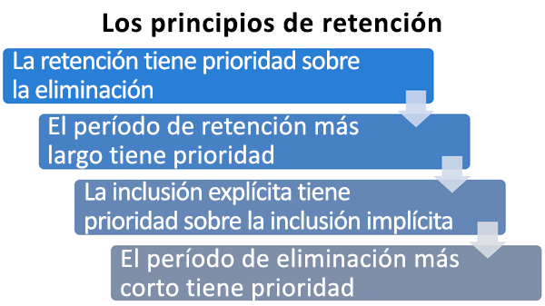

# Obtenga información sobre las etiquetas de retención

>*[Instrucciones de licencias de Microsoft 365 para la seguridad y el cumplimiento](https://aka.ms/ComplianceSD).*

Across your organization, you probably have different types of content that require different actions taken on them in order to comply with industry regulations and internal policies. For example, you might have:
  
- Formularios fiscales que deben **conservarse** durante un período mínimo de tiempo. 
    
- Materiales de prensa que deben **eliminarse de forma permanente** cuando llegan a una determinada edad. 
    
- Información sobre la competencia que sea necesario **conservar** y, después, **eliminar de forma permanente**. 
    
- Visados de trabajo que tengan que **marcarse como registros** para que no se puedan editar ni eliminar. 
    
In all of these cases, retention labels can help you take the right actions on the right content. With retention labels, you can classify data across your organization for governance, and enforce retention rules based on that classification.
  
Con las etiquetas de retención, puede:
  
- **Enable people in your organization to apply a retention label manually** to content in Outlook on the web, Outlook 2010 and later, OneDrive, SharePoint, and Microsoft 365 Groups. Users often know best what type of content they're working with, so they can classify it and have the appropriate policy applied. 
    
- **Aplicar etiquetas de retención a contenido automáticamente** si coincide con condiciones específicas, como: 
    
    - Tipos específicos de información confidencial.
    
    - Palabras clave específicas que coinciden con una consulta que haya creado.
    
    - Coincidencias de patrón para un clasificador que se puede entrenar.
    
  La capacidad de aplicar etiquetas de retención automáticamente al contenido ofrece las ventajas siguientes:
    
     - No es necesario formar a los usuarios para que conozcan todas las clasificaciones.
    
     - No es necesario depender de los usuarios para clasificar todo el contenido correctamente.
    
   - Los usuarios ya no necesitan conocer las directivas de gobierno de datos; en su lugar, pueden centrarse en su trabajo.

- ** Aplicar una etiqueta de retención predeterminada a una biblioteca, carpeta o conjunto de documentos** en SharePoint, de modo que todos los documentos almacenados en esa ubicación hereden la etiqueta de retención predeterminada.

Además, las etiquetas de retención admiten la [administración de registros](records-management.md) de correo electrónico y documentos en todas las aplicaciones y servicios de Microsoft 365. Puede usar las etiquetas de retención para clasificar el contenido como un registro. Cuando esto sucede y el contenido permanece en Microsoft 365, la etiqueta no se puede cambiar o quitar, y el contenido no se puede modificar ni eliminar. 

Las etiquetas de retención, al igual que las [etiquetas de confidencialidad de ](sensitivity-labels.md), no se conservan si el contenido se mueve fuera de Microsoft 365.

No hay límite en el número de etiquetas de retención que se apoyan para un inquilino. Sin embargo, 10 000 es el número máximo de directivas que se admiten para un inquilino y éstas incluyen las directivas que aplican las etiquetas (directivas de etiquetas de retención y directivas de retención de aplicación automática), así como las directivas de retención.

## Cómo funcionan las etiquetas de retención con las directivas de etiquetas de retención

Poner etiquetas de retención a disposición de las personas de su organización para que puedan clasificar el contenido es un proceso de dos pasos: 

1. Crear las etiquetas de retención

2. Publicar las etiquetas de retención utilizando una directiva de etiquetas de retención
  

  
Las etiquetas de retención son bloques de creación independientes y reutilizables que se incluyen en una o más directivas de etiquetas de retención. La finalidad principal de una directiva de etiqueta es agrupar un conjunto de etiquetas de retención y especificar las ubicaciones donde quiere que aparezcan.
  

  
1. Al publicar etiquetas de retención, estas se incluyen en una directiva de etiqueta de retención. Los nombres de las etiquetas de retención son inmutables, lo que significa que no pueden ser editadas después de ser creadas.

2. Se puede incluir una única etiqueta de retención en varias directivas de etiqueta de retención.

3. También puede incluirse una sola ubicación en numerosas directivas de etiqueta de retención.
    
3. Las directivas de etiquetas de retención especifican las ubicaciones donde se publicarán las etiquetas de retención.
    
## Solo una etiqueta de retención a la vez

Es importante saber que solo se puede asignar una etiqueta de retención al contenido (como un correo electrónico o un documento):
  
- En el caso de las etiquetas de retención asignadas manualmente por los usuarios finales, estos pueden quitar o cambiar la etiqueta de retención asignada.
    
- Si el contenido tiene asignada una etiqueta de aplicación automática, un usuario final puede reemplazarla por una etiqueta de retención asignada manualmente.
    
- Si el contenido tiene una etiqueta de retención asignada manualmente por un usuario final, una etiqueta de aplicación automática no puede reemplazar a la etiqueta de retención asignada de forma manual.
    
- Si hay varias reglas que asignan una etiqueta de aplicación automática y el contenido cumple las condiciones de varias reglas, se asignará la etiqueta de retención de la regla más antigua.
    
Para comprender cómo y por qué se aplica una etiqueta de retención en lugar de otra, es útil comprender la diferencia entre asignar explícitamente una etiqueta y asignar implícitamente una etiqueta:

- Las etiquetas asignadas manualmente se asignan explícitamente
- Las etiquetas aplicadas automáticamente se asignan implícitamente

Una etiqueta de retención asignada explícitamente tiene prioridad sobre una etiqueta de retención asignada implícitamente. Para más información, consulte la sección [Los principios de la retención, ¿o qué tiene prioridad?](#the-principles-of-retention-or-what-takes-precedence)en esta página.

## Ubicaciones y directivas de etiquetas de retención

En función de la finalidad de las etiquetas de retención, pueden publicarse en distintas ubicaciones.
  
|**Si la etiqueta de retención es...**|**La directiva de etiquetas se puede aplicar en…**|
|:-----|:-----|
|Se publica a los usuarios finales    |Exchange, SharePoint, OneDrive, Grupos de Microsoft 365    |
|Se aplica automáticamente basándose en los tipos de información confidencial    |Exchange (solo todos los buzones), SharePoint, OneDrive    |
|Se aplica automáticamente basándose en una consulta    |Exchange, SharePoint, OneDrive, Grupos de Microsoft 365    |
   
En Exchange, las etiquetas de aplicación automática (tanto para consultas como para tipos de información confidencial) solo se aplican a mensajes nuevos enviados (datos en tránsito), no a todos los elementos que estén actualmente en el buzón (datos en reposo). Además, las etiquetas de aplicación automática para tipos de información confidencial solo se pueden aplicar a todos los buzones; es decir, no puede seleccionar los buzones específicos.
  
Las carpetas públicas de Exchange, Skype y los chats y mensajes de canal de Teams no admiten etiquetas de retención.

## Cómo las etiquetas de retención aplican la retención

Las etiquetas de retención pueden hacer cumplir las mismas acciones de retención que una directiva de retención: retener y luego eliminar, o sólo retener o sólo eliminar. Puede usar etiquetas de retención para implementar un sofisticado plan de archivos que identifique archivos específicos para diferentes configuraciones de retención. Para obtener más información acerca de cómo funciona la retención, consulte [Más información acerca de las políticas de retención](retention-policies.md).

In addition, a retention label has two retention options that are available only in a retention label and not in a retention policy. With a retention label, you can:
  
- Activar una revisión de la disposición al final del período de retención, de modo que los documentos de SharePoint y OneDrive deben ser revisados antes de que puedan ser eliminados. Para obtener más información, consulte [Revisiones de la disposición](disposition.md#disposition-reviews).
    
- Iniciar el período de retención desde el momento en que se etiquete el contenido, en lugar de la antigüedad del contenido o la fecha de la última modificación. Cuando se usa esta opción:
    - Solo se aplica al contenido en los sitios de SharePoint y las cuentas de OneDrive. Para el correo de Exchange, el período de retención siempre se basa en la fecha en la que se ha enviado o recibido el mensaje.
    - No puede cambiar el período de retención después de guardar la etiqueta.
    

Otra de las principales diferencias es que cuando aplica una etiqueta de retención en lugar de una directiva de retención a archivos de SharePoint y la etiqueta está configurada para conservar el contenido, los usuarios no pueden eliminar el archivo mientras se aplica el período de retención. Los usuarios pueden eliminar contenido cuando la misma etiqueta se aplica a los archivos en OneDrive y a los mensajes de correo electrónico, a menos que la etiqueta marque el contenido como un registro.

## Ubicaciones donde los usuarios pueden ver las etiquetas de retención publicadas

Si los usuarios finales asignarán la etiqueta de retención al contenido, puede publicarla en:
  
- Outlook y Outlook en la Web
    
- OneDrive
    
- SharePoint
    
- Grupos de Microsoft 365 (tanto en el sitio de grupo como el buzón de grupo de Outlook en la Web)
    
En las secciones siguientes, se explica cómo se mostrarán las etiquetas en diferentes aplicaciones para las personas de su organización.
  

### Outlook

Para etiquetar un elemento en el cliente de escritorio de Outlook, seleccione el elemento. En la pestaña **Inicio** de la cinta de opciones, haga clic en **Asignar directiva**, y luego elija la etiqueta de retención. 
  

  
También puede hacer clic con el botón derecho en un elemento, hacer clic en **Asignar directiva** en el menú contextual y después, seleccionar la etiqueta de retención. 

Después de aplicar la etiqueta de retención, puede ver dicha etiqueta y la acción que realiza en la parte superior del elemento. Si un correo electrónico tiene una etiqueta de retención aplicada con un período de retención asociado, puede observar a simple vista cuándo va a expirar el correo electrónico.
  
También puede aplicar etiquetas de retención a carpetas, en cuyo caso:
  
- Todos los elementos de la carpeta reciben automáticamente la misma etiqueta de retención, **excepto**los elementos a los que se les ha aplicado explícitamente una etiqueta de retención. Los artículos explícitamente etiquetados mantienen su actual etiqueta de retención. Para más información, consulte [Los principios de la retención, o ¿qué tiene prioridad?](#the-principles-of-retention-or-what-takes-precedence)en esta página. 
    
- Si cambia o elimina la etiqueta de retención predeterminada de una carpeta, la etiqueta de retención también se cambia o elimina para todos los elementos de la carpeta,**excepto** los elementos con etiquetas de retención asignadas explícitamente. 
    
- Si mueve un elemento con una etiqueta de retención predeterminada de una carpeta a otra carpeta con una etiqueta de retención predeterminada distinta, el elemento obtendrá la nueva etiqueta de retención predeterminada.
    
- Si mueve un elemento con una etiqueta de retención predeterminada de una carpeta a otra sin una etiqueta de retención predeterminada, se quitará la etiqueta de retención predeterminada anterior.

### Outlook en la Web

Para etiquetar un elemento en Outlook en la Web, haga clic con el botón derecho en el elemento \> **Asignar directiva** \> y seleccione la etiqueta de retención. 
  

  
After the retention label is applied, you can view that retention label and what action it takes at the top of the item. If an email is classified and has an associated retention period, you can know at a glance when the email will expire.
  

  
Al igual que con Outlook en la web, también puede aplicar etiquetas de retención a las carpetas. 

### OneDrive y SharePoint

Para etiquetar un documento (incluidos archivos de OneNote) en OneDrive o SharePoint, seleccione el elemento \> en la esquina superior derecha, haga clic en **Abrir el panel de detalles** \> **Aplicar etiqueta de retención** \> y seleccione la etiqueta de retención. 
  
También puede aplicar una etiqueta de retención a una carpeta o conjunto de documentos, y puede establecer una [etiqueta de retención predeterminada para una biblioteca de documentos](#applying-a-default-retention-label-to-all-content-in-a-sharepoint-library-folder-or-document-set).
  

  
Después de aplicar una etiqueta de retención a un elemento, puede verla en el panel de detalles cuando esté seleccionado el elemento.
  

  
Para SharePoint, pero no para OneDrive, puede crear una vista de la biblioteca que contiene la columna de **Etiquetas** o el **elemento es una columna de Registro**. Esta vista permite ver rápidamente las etiquetas de retención asignadas a todos los artículos y qué artículos son registros. Sin embargo, tenga en cuenta que no puede filtrar la vista por el **Elemento es una columna de registro**. Para obtener instrucciones sobre cómo agregar columnas, consulte [Mostrar u ocultar columnas en una lista o biblioteca](https://support.microsoft.com/es-ES/office/show-or-hide-columns-in-a-list-or-library-b820db0d-9e3e-4ff9-8b8b-0b2dbefa87e2).

### Grupos de Microsoft 365

Cuando se publican las etiquetas de retención en los grupos de Microsoft 365 ([anteriormente grupos de Office 365](https://techcommunity.microsoft.com/t5/microsoft-365-blog/office-365-groups-will-become-microsoft-365-groups/ba-p/1303601)), las etiquetas de retención aparecen tanto en el sitio del grupo como en el buzón del grupo en Outlook en la web. La experiencia de aplicar una etiqueta de retención al contenido es idéntica a la del correo electrónico y los documentos.

Para retener el contenido de un grupo de Microsoft 365, utilice la ubicación de los **grupos de Office 365 groups**. Aunque un grupo de Microsoft 365 tiene un buzón de Exchange, una directiva de retención que incluya toda la ubicación de Exchange no incluirá contenido en los buzones de grupo de Microsoft 365.

Además, no es posible usar la ubicación de Exchange para incluir o excluir un buzón de grupo específico. Aunque la ubicación de Exchange inicialmente permite seleccionar un buzón de grupo, cuando intenta guardar la directiva de retención, recibe el error de que "RemoteGroupMailbox" no es una selección válida para la ubicación de Exchange.
  
En primer lugar, cree y configure las etiquetas de confidencialidad que quiera que estén disponibles para las aplicaciones y otros servicios. Por ejemplo, las etiquetas que quiere que vean los usuarios para que se apliquen desde las aplicaciones de Office. 

A continuación, cree una o varias directivas de etiqueta que contengan las etiquetas y las configuraciones de directiva que configure. La directiva de etiquetas se encarga de publicar las etiquetas y la configuración de los usuarios y las ubicaciones que elija.

## Aplicar automáticamente una etiqueta de retención según las condiciones

Una de las características más eficaces de las etiquetas es la capacidad de aplicarlas automáticamente al contenido que coincide con determinadas condiciones. En este caso, no es necesario que las personas de la organización apliquen las etiquetas de retención. Microsoft 365 realiza el trabajo por ellos.
  

  
Las etiquetas de retención auto aplicadas son poderosas porque:
  
- No es necesario formar a los usuarios para que conozcan todas las clasificaciones.
    
- No es necesario depender de los usuarios para clasificar todo el contenido correctamente.
    
- Los usuarios ya no necesitan conocer las directivas de gobierno de datos; en su lugar, pueden centrarse en su trabajo.
    
Puede aplicar automáticamente etiquetas de retención en contenido cuando este coincida con:
  
- [Tipos específicos de información confidencial](create-retention-labels.md#auto-apply-labels-to-content-with-specific-types-of-sensitive-information)
    
- [Palabras clave específicas que coinciden con una consulta que haya creado](create-retention-labels.md#auto-apply-labels-to-content-with-keywords-or-searchable-properties)

- [Una coincidencia para clasificadores que se pueden entrenar](create-retention-labels.md#auto-apply-labels-to-content-by-using-trainable-classifiers)
    

> [!TIP]
> Vea [Administrar el ciclo de vida de los documentos de SharePoint con etiquetas de retención](auto-apply-retention-labels-scenario.md) para obtener más información sobre cómo usar las propiedades administradas en SharePoint para aplicar automáticamente las etiquetas de retención e implementar la retención basada en eventos.

## Aplicar una etiqueta de retención predeterminada a todo el contenido de una biblioteca, carpeta o conjunto de documentos de SharePoint

Además de permitir que los usuarios apliquen una etiqueta de retención a documentos individuales, también puede aplicar una etiqueta de retención predeterminada a una biblioteca, carpeta o conjunto de documentos de SharePoint para aplicar la etiqueta de retención predeterminada a todos los documentos de esa ubicación.
  
Para una biblioteca de documentos, esto se realiza en la página **Configuración de biblioteca** de la biblioteca de documentos. Al seleccionar la etiqueta de retención predeterminada, también se puede elegir aplicarla a los elementos existentes en la biblioteca. 
  
Por ejemplo, si tiene una etiqueta para los materiales de marketing y sabe que una biblioteca de documentos específica solo contiene ese tipo de contenido, puede hacer que la etiqueta “Materiales de marketing” sea la predeterminada para todos los documentos de esa biblioteca.
  

  
Si aplica una etiqueta de retención predeterminada a elementos existentes de una biblioteca, carpeta o conjunto de documentos:
  
- Todos los elementos de la biblioteca, la carpeta o el conjunto de documentos reciben automáticamente la misma etiqueta de retención, **excepto** los elementos a los que se les ha aplicado explícitamente una etiqueta de retención (como los registros). Los elementos etiquetados explícitamente mantienen su etiqueta existente. Para obtener más información, vea la sección siguiente sobre [Los principios de la retención, o lo que tiene prioridad](#the-principles-of-retention-or-what-takes-precedence).
    
- Si cambia o elimina la etiqueta de retención predeterminada de una biblioteca, una carpeta o un conjunto de documentos, la etiqueta de retención también se cambia o elimina para todos los elementos de la biblioteca, la carpeta o el conjunto de documentos, **excepto** los elementos con etiquetas de retención explícitas (como los registros).
    
- Si mueve un elemento con una etiqueta de retención predeterminada de una colección de sitios, biblioteca, carpeta o conjunto de documentos a otra colección de sitios, biblioteca, carpeta o conjunto de documentos con una etiqueta distinta, el elemento mantendrá su etiqueta de retención predeterminada existente, incluso si la nueva ubicación tiene otra etiqueta de retención predeterminada. Si el elemento no tiene una etiqueta antes de moverlo, llevará la etiqueta de retención predeterminada de la nueva ubicación.

**Registros:** Si se aplica un sello de registro predeterminado a una biblioteca, una carpeta o un conjunto de documentos, entonces se aplica un sello de registro a todos los elementos individuales dentro de esas ubicaciones. Cuando mueve un nuevo elemento a una ubicación con una etiqueta de registro, ese elemento se etiqueta como registro. Sin embargo, si cambia la etiqueta de retención predeterminada por una etiqueta que no declare el contenido como registro, esa acción no elimina la etiqueta de registro de los elementos individuales; esos elementos conservan su etiqueta de registro. Sólo el administrador de la colección del sitio puede eliminar o cambiar explícitamente la etiqueta de retención de los artículos de registro.

Para obtener más información sobre las etiquetas de retención que declaran el contenido como un registro, consulte[Más información sobre de los registros](records.md).

## Aplicar una etiqueta de retención al correo electrónico mediante el uso de reglas

En Outlook, puede crear reglas para aplicar una etiqueta de retención o una directiva de retención.
  
Por ejemplo, puede crear una regla que aplique una etiqueta de retención específica a todos los mensajes enviados a un grupo de distribución específico o desde este.
  
Para crear una regla, haga clic con el botón derecho en un elemento \> **Reglas** \> **Crear regla** \> **Opciones avanzadas** \> **Asistente para reglas** \> **aplicar directiva de retención**.
  

  
## Clasificar contenido sin aplicar acciones

Cuando se crea una etiqueta de retención, se puede hacer sin activar ninguna retención u otras acciones. En este caso, se puede utilizar una etiqueta de retención simplemente como una etiqueta de texto, sin imponer ninguna acción.
  
Por ejemplo, puede crear una etiqueta de retención llamada “Revisar más tarde” sin ninguna acción y, después, aplicar automáticamente esa etiqueta de retención al contenido con tipos de información confidencial o contenido consultado.
  

  
## Uso de etiquetas de retención para la administración de registros
    
Puede usar las etiquetas de retención para declarar el contenido como un registro. Esto le permite implementar una estrategia de administración de registros única y coherente en todo Microsoft 365. Para más información, vea [Información sobre registros](records.md).
  
## Usar una etiqueta de retención como condición en una directiva DLP

A retention label can enforce retention actions on content. In addition, you can use a retention label as a condition in a data loss prevention (DLP) policy, and the DLP policy can enforce other actions, such as restricting access, on content that contains a specific label. 
  
Para obtener más información, vea [Usar una etiqueta de retención como una condición en una directiva DLP](data-loss-prevention-policies.md#using-a-retention-label-as-a-condition-in-a-dlp-policy).
  

## Los principios de retención o qué tiene precedencia

It's possible or even likely that content might have several retention policies applied to it, each with a different action (retain, delete, or both) and retention period. What takes precedence? At the highest level, rest assured that content being retained by one policy can't be permanently deleted by another policy.
  

  
Para entender cómo se aplican a contenido distintas etiquetas con acciones de retención, tenga en cuenta estos principios de retención:
  
1. **Retention wins over deletion.** Suppose that one retention policy says to delete Exchange email after three years, but another retention policy says to retain Exchange email for five years and then delete it. Any content that reaches three years old will be deleted and hidden from the users' view, but still retained in the Recoverable Items folder until the content reaches five years old, when it will be permanently deleted. 
    
2. **The longest retention period wins.** If content's subject to multiple policies that retain content, it will be retained until the end of the longest retention period. 
    
3. **Explicit inclusion wins over implicit inclusion.** This means: 
    
    1. Si un usuario asigna manualmente una etiqueta de retención con configuración de retención a un elemento, como un correo electrónico de Exchange o un documento de OneDrive, esa etiqueta de retención tiene prioridad sobre una directiva asignada en el nivel de sitio o buzón, y una etiqueta de retención predeterminada asignada por la biblioteca de documentos. Por ejemplo, si la etiqueta de retención explícita dice que la conservación es de 10 años, pero la directiva de retención asignada al sitio dice que la conservación es de solo cinco años, la etiqueta de retención tendrá prioridad. Las etiquetas de retención autoaplicadas se consideran implícitas, no explícitas, porque son aplicadas automáticamente por Microsoft 365.
    
    2. Si una directiva de retención incluye una ubicación específica, como el buzón de un usuario específico o una cuenta de OneDrive, esa directiva tiene prioridad sobre otra directiva de retención que se aplica a los buzones de todos los usuarios o a las cuentas de OneDrive pero que no incluye específicamente el buzón de ese usuario.
    
4. **The shortest deletion period wins.** Similarly, if content's subject to multiple policies that delete content (with no retention), it will be deleted at the end of the shortest retention period. 
    
Tenga en cuenta que los principios de retención funcionan como un flujo de desempate de arriba abajo: si las reglas aplicadas por todas las directivas o etiquetas son las mismas en un nivel, el flujo baja al siguiente nivel para determinar la precedencia de la regla que se aplica.
  
Por último, una directiva o etiqueta de retención no puede eliminar permanentemente ningún contenido que esté en espera para el eDiscovery. Cuando se libera la retención, el contenido vuelve a ser apto para el proceso de limpieza descrito anteriormente.

### Precedencia para el etiquetado automático con los clasificadores que se pueden entrenar

Todas las etiquetas de retención configuradas para los clasificadores que se pueden entrenar se evalúan de forma simultánea. Si un elemento es detectado por más de un clasificador que se puede entrenar, se usarán los siguientes criterios para determinar la etiqueta de retención que se aplicará:

1. Las etiquetas de retención configuradas para solo retención o retención y, a continuación, eliminar; tienen mayor prioridad sobre las etiquetas de retención que están configuradas para solo eliminación.

2. Para las etiquetas de retención configuradas para solo retención o retención y, a continuación, eliminar; tiene mayor prioridad la etiqueta de retención configurada para el período de retención más largo.

3. Para las etiquetas de retención configuradas para solo eliminar, tiene mayor prioridad la etiqueta de retención configurada para el período más corto.

4. Las etiquetas de retención con la misma acción y el mismo periodo provocan que se seleccione una etiqueta de retención no determinista.

## Supervisar etiquetas de retención.

Después de que publique o aplique automáticamente sus etiquetas de retención, querrá verificar que se aplican al contenido como usted desea. Para controlar sus etiquetas de retención:
  
- **Explorador de actividad de etiqueta**. Con el explorador (ejemplo en la siguiente imagen), puede buscar y ver rápidamente la actividad de las etiquetas de retención de todo el contenido de SharePoint y OneDrive en los últimos 30 días. Para obtener más información, consulte [Ver la actividad de etiqueta de documentos](view-label-activity-for-documents.md).

- Página de **Análisis de etiquetas** En el centro de cumplimiento de Microsoft 365 y en el centro de seguridad de Microsoft 365, puede ver rápidamente las etiquetas de retención más importantes y dónde se aplican. También puede ver todo el contenido con una etiqueta de retención específica. Para obtener más información, consulte [Ver el uso de etiquetas con el análisis de etiquetas](label-analytics.md).
    
- **Informes de gobierno de datos**. Con estos informes, puede ver rápidamente las tendencias de las etiquetas de retención y la actividad de todo el contenido de Exchange, SharePoint y OneDrive en los últimos 90 días. Para obtener más información, consulte [Ver los informes de gobierno de datos](view-the-data-governance-reports.md).
    

## Usar Búsqueda de contenido para encontrar todo el contenido que tenga aplicada una etiqueta de retención específica

Después de asignar etiquetas de retención a contenido (ya sea por los usuarios o aplicadas automáticamente), puede usar Búsqueda de contenido para encontrar todo el contenido clasificado con una etiqueta de retención específica.
  
Cuando cree una búsqueda de contenido, elija la condición de **Etiqueta de cumplimiento**, y luego introduzca el nombre completo de la etiqueta de retención o parte del nombre de la etiqueta y utilice un comodín. Para obtener más información, consulte [Consultas de palabras clave y condiciones de búsqueda para la Búsqueda de Contenido](keyword-queries-and-search-conditions.md).
  

  
## Usar etiquetas de retención en lugar de las características más antiguas

Las etiquetas de retención pueden ponerse fácilmente a disposición de toda una organización y su contenido en todos los grupos de Microsoft 365, incluidos los grupos de Exchange, SharePoint, OneDrive y Microsoft 365. Si necesita retener o eliminar contenido, o administrar registros en cualquier lugar de Microsoft 365, le recomendamos que utilice etiquetas de retención.
  
Hay varias otras características que se han utilizado anteriormente para retener o eliminar contenido o para administrar registros en Microsoft 365. Estas características seguirán funcionando en paralelo con las etiquetas de retención. Si bien hay casos en los que la aplicación de etiquetas de retención difiere de las características anteriores, la evolución de las etiquetas de retención impulsará el futuro de la gestión de registros en todo Microsoft 365. Por lo tanto, avanzando, para el gobierno de los datos, recomendamos que se utilicen etiquetas de retención en lugar de las siguientes características antiguas.
  
### Exchange Online

- [Etiquetas de retención y directivas de retención](https://go.microsoft.com/fwlink/?linkid=846125), lo que también se conoce como [administración de registros de mensajes (MRM)](https://go.microsoft.com/fwlink/?linkid=846126) (solo eliminación) 
    
### SharePoint y OneDrive

- [ Configuración de la administración de registros en el lugar](https://support.office.com/article/7707a878-780c-4be6-9cb0-9718ecde050a) (retención) 
    
- [Introducción al Centro de registros](https://support.office.com/article/bae6ca5a-7b19-40e0-b433-e3613a747c2c) (retención) 
    
- [Directivas de administración de información](intro-to-info-mgmt-policies.md) (solo eliminación) 
    
## Siguientes pasos

Si está listo para crear y publicar etiquetas de retención, vea [Crear, publicar y aplicar automáticamente etiquetas de retención](create-retention-labels.md).
