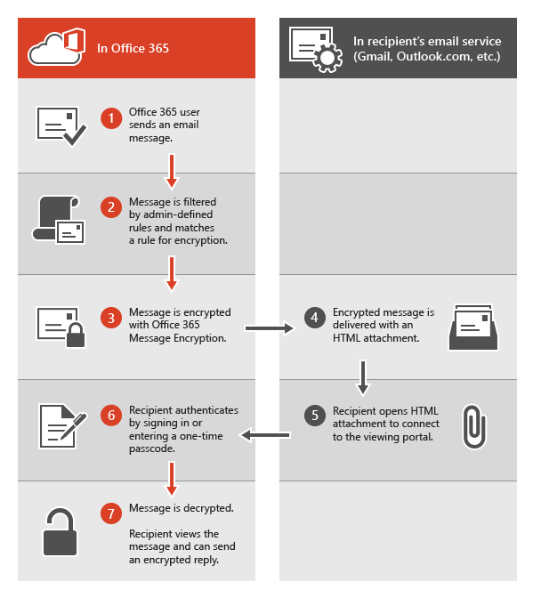

# Información heredada para el cifrado de mensajes de Office 365Legacy information for Office 365 Message Encryption

Si todavía no ha movido su organización a las nuevas capacidades de OME, pero ya ha implementado OME, la información de este artículo se aplica a su organización.If you haven't yet moved your organization to the new OME capabilities, but you have already deployed OME, then the information in this article applies to your organization. Microsoft recomienda que cree un plan para cambiar a las nuevas funciones de OME en cuanto sea razonable para su organización.Microsoft recommends that you make a plan to move to the new OME capabilities as soon as it is reasonable for your organization. Para obtener instrucciones, vea [configurar las nuevas funciones de cifrado de mensajes de Office 365 basadas en Azure Information Protection](set-up-new-message-encryption-capabilities.md).For instructions, see [Set up new Office 365 Message Encryption capabilities built on top of Azure Information Protection](set-up-new-message-encryption-capabilities.md). Si desea obtener más información sobre cómo funcionan las nuevas funciones en primer lugar, consulte [Office 365 Message Encryption](ome.md).If you want to find out more about how the new capabilities work first, see [Office 365 Message Encryption](ome.md). En el resto de este artículo se hace referencia al comportamiento OME antes de la publicación de las nuevas capacidades de OME.The rest of this article refers to OME behavior before the release of the new OME capabilities.
  
Con el cifrado de mensajes de Office 365, su organización puede enviar y recibir mensajes de correo electrónico cifrados entre usuarios de dentro y fuera de la organización.With Office 365 Message Encryption, your organization can send and receive encrypted email messages between people inside and outside your organization. El cifrado de mensajes de Office 365 funciona con Outlook.com, Yahoo, gmail y otros servicios de correo electrónico.Office 365 Message Encryption works with Outlook.com, Yahoo, Gmail, and other email services. El cifrado de mensajes de correo electrónico ayuda a garantizar que solo los destinatarios deseados puedan ver el contenido de los mensajes.Email message encryption helps ensure that only intended recipients can view message content.
  
Aquí le mostramos otros ejemplos:Here are some examples:
  
- Un empleado del Banco envía extractos de tarjeta de crédito a los clientesA bank employee sends credit card statements to customers

- Un representante de la compañía de seguros proporciona detalles de directivas a los clientesAn insurance company representative provides policy details to customers

- Un intermediario de hipoteca solicita información financiera a un cliente para una solicitud de préstamoA mortgage broker requests financial information from a customer for a loan application

- Un proveedor de asistencia sanitaria envía información sobre el cuidado de la salud a los pacientesA health care provider sends health care information to patients

- Un abogado envía información confidencial a un cliente o a otro abogadoAn attorney sends confidential information to a customer or another attorney

## Cómo funciona el cifrado de mensajes de Office 365 sin las nuevas funcionesHow Office 365 Message Encryption works without the new capabilities

El cifrado de mensajes de Office 365 es un servicio en línea que se basa en Microsoft Azure Rights Management (Azure RMS).Office 365 Message Encryption is an online service that's built on Microsoft Azure Rights Management (Azure RMS). Con Azure RMS, los administradores pueden definir reglas de flujo de correo para determinar las condiciones de cifrado.With Azure RMS, administrators can define mail flow rules to determine the conditions for encryption. Por ejemplo, una regla puede requerir el cifrado de todos los mensajes dirigidos a un destinatario específico.For example, a rule can require the encryption of all messages addressed to a specific recipient.
  
Vea este breve vídeo para ver cómo funciona el cifrado de mensajes de Office 365 sin las nuevas funciones.Watch this short video to see how Office 365 Message Encryption works without the new capabilities.
  
> [!VIDEO https://www.microsoft.com/videoplayer/embed/c55540e7-f7f0-42f5-b254-4b2d2fbb1d63?autoplay=false]
  
Cuando alguien envía un mensaje de correo electrónico en Exchange online que coincide con una regla de cifrado, el mensaje se envía con un archivo adjunto HTML.When someone sends an email message in Exchange Online that matches an encryption rule, the message is sent with an HTML attachment. El destinatario abre los datos adjuntos HTML y sigue las instrucciones para ver el mensaje cifrado en el portal de cifrado de mensajes de Office 365.The recipient opens the HTML attachment and follows instructions to view the encrypted message on the Office 365 Message Encryption portal. El destinatario puede elegir ver el mensaje iniciando sesión con una cuenta Microsoft o una escuela o un trabajo asociado con Office 365, o mediante un código de acceso único.The recipient can choose to view the message by signing in with a Microsoft account or a work or school associated with Office 365, or by using a one-time pass code. El proceso de inicio de sesión ayuda a garantizar que solo los destinatarios previstos puedan ver los mensajes cifrados.Both options help ensure that only the intended recipient can view the encrypted message. Este proceso es muy diferente para las nuevas capacidades de OME.This process is very different for the new OME capabilities.
  
En el siguiente diagrama se resume el paso de un mensaje de correo electrónico a través del proceso de cifrado y descrifrado.The following diagram summarizes the passage of an email message through the encryption and decryption process.
  

  
Para obtener más información, vea [información de servicio para el cifrado de mensajes de Office 365 heredado antes de la publicación de las nuevas capacidades de OME](legacy-information-for-message-encryption.md#LegacyServiceInfo).For more information, see [Service information for legacy Office 365 Message Encryption prior to the release of the new OME capabilities](legacy-information-for-message-encryption.md#LegacyServiceInfo).
  
## Definición de reglas de flujo de correo para el cifrado de mensajes de Office 365 que no usan las nuevas funciones de OMEDefining mail flow rules for Office 365 Message Encryption that don't use the new OME capabilities

Para habilitar el cifrado de mensajes de Office 365 sin las nuevas funciones, los administradores de Exchange Online y Exchange Online Protection definen las reglas de flujo de correo de Exchange.To enable Office 365 Message Encryption without the new capabilities, Exchange Online and Exchange Online Protection administrators define Exchange mail flow rules. Estas reglas determinan en qué condiciones se deben cifrar los mensajes de correo electrónico, así como las condiciones para quitar el cifrado de mensajes.These rules determine under what conditions email messages should be encrypted, as well as conditions for removing message encryption. Cuando se establece una acción de cifrado para una regla, los mensajes que coinciden con las condiciones de la regla se cifran antes de enviarse.When an encryption action is set for a rule, any messages that match the rule conditions are encrypted before they're sent.
  
Las reglas de flujo de correo son flexibles, lo que permite combinar condiciones para que pueda cumplir requisitos de seguridad específicos en una sola regla.Mail flow rules are flexible, letting you combine conditions so you can meet specific security requirements in a single rule. Por ejemplo, puede crear una regla para cifrar todos los mensajes que contengan palabras clave especificadas y que estén dirigidos a destinatarios externos.For example, you can create a rule to encrypt all messages that contain specified keywords and are addressed to external recipients. El cifrado de mensajes de Office 365 también cifra las respuestas de destinatarios de correo electrónico cifrado y puede crear una regla que descifre esas respuestas como comodidad para los usuarios de correo electrónico.Office 365 Message Encryption also encrypts replies from recipients of encrypted email, and you can create a rule that decrypts those replies as a convenience for your email users. De este modo, los usuarios de la organización no tendrán que iniciar sesión en el portal de cifrado para ver las respuestas.That way, users in your organization won't have to sign in to the encryption portal to view replies.
  
Para obtener más información acerca de cómo crear reglas de flujo de correo de Exchange, vea [definir reglas para el cifrado de mensajes de Office 365](define-mail-flow-rules-to-encrypt-email.md).For more information about how to create Exchange mail flow rules, see [Define Rules for Office 365 Message Encryption](define-mail-flow-rules-to-encrypt-email.md).
  
## Enviar, ver y responder mensajes de correo electrónico cifradoSending, viewing, and replying to encrypted email messages

Con el cifrado de mensajes de Office 365, los mensajes de correo electrónico se cifran automáticamente en función de las reglas definidas por el administrador.With Office 365 Message Encryption, email messages are encrypted automatically, based on administrator-defined rules. Un correo electrónico que lleva un mensaje cifrado llega a la bandeja de entrada del destinatario con un archivo HTML adjunto.An email that bears an encrypted message arrives in the recipient's Inbox with an attached HTML file.
  
Los destinatarios siguen las instrucciones del mensaje para abrir los datos adjuntos y autenticarse con una cuenta de Microsoft o una escuela o trabajo asociado con Office 365.Recipients follow instructions in the message to open the attachment and authenticate by using a Microsoft account or a work or school associated with Office 365. Si los destinatarios no tienen ninguna cuenta, se les conducirá a crear una cuenta de Microsoft que les permitirá iniciar sesión para ver el mensaje cifrado.If recipients don't have either account, they're directed to create a Microsoft account that will let them sign in to view the encrypted message. Como alternativa, los destinatarios pueden elegir obtener un código de acceso único para ver el mensaje.Alternatively, recipients can choose to get a one-time pass code to view the message. Después de iniciar sesión o usar un código de acceso único, los destinatarios pueden ver el mensaje descifrado y enviar una respuesta cifrada.After signing in or using a one-time pass code, recipients can view the decrypted message and send an encrypted reply.
  
## Personalizar mensajes cifrados con el cifrado de mensajes de Office 365Customize encrypted messages with Office 365 Message Encryption

Como administrador de Exchange Online y Exchange Online Protection, puede personalizar los mensajes cifrados.As an Exchange Online and Exchange Online Protection administrator, you can customize your encrypted messages. Por ejemplo, puede Agregar la marca y el logotipo de su compañía, especificar una introducción y agregar texto de declinación de responsabilidades en los mensajes cifrados y en el portal donde los destinatarios ven los mensajes cifrados.For example, you can add your company's brand and logo, specify an introduction, and add disclaimer text in encrypted messages and in the portal where recipients view your encrypted messages. Con los cmdlets de Windows PowerShell, puede personalizar los siguientes aspectos de la experiencia de visualización para los destinatarios de los mensajes de correo electrónico cifrados:Using Windows PowerShell cmdlets, you can customize the following aspects of the viewing experience for recipients of encrypted email messages:
  
- Texto de introducción del correo electrónico que contiene el mensaje cifradoIntroductory text of the email that contains the encrypted message

- Texto de declinación de responsabilidades del correo electrónico que contiene el mensaje cifradoDisclaimer text of the email that contains the encrypted message

- Texto del portal que aparecerá en el portal de visualización de mensajesPortal text that will appear in the message viewing portal

- Logotipo que aparecerá en el mensaje de correo electrónico y en el portal de visualizaciónLogo that will appear in the email message and viewing portal

También puede volver a la apariencia predeterminada en cualquier momento.You can also revert back to the default look and feel at any time.
  
El siguiente ejemplo muestra un logotipo personalizado para ContosoPharma en los datos adjuntos de correo electrónico:The following example shows a custom logo for ContosoPharma in the email attachment:
  

  
 **Para personalizar los mensajes de correo electrónico de cifrado y el portal de cifrado con la marca de la organización****To customize encryption email messages and the encryption portal with your organization's brand**
  
1. Conéctese a Exchange online mediante PowerShell remoto, tal como se describe en [Connect to Exchange Online Using Remote PowerShell](https://docs.microsoft.com/office365/enterprise/powershell/connect-to-exchange-online-tenants-with-remote-windows-powershell-for-delegated).Connect to Exchange Online using Remote PowerShell, as described in [Connect to Exchange Online Using Remote PowerShell](https://docs.microsoft.com/office365/enterprise/powershell/connect-to-exchange-online-tenants-with-remote-windows-powershell-for-delegated).

2. Use el cmdlet Set-OMEConfiguration como se describe aquí: [set-OMEConfiguration](https://technet.microsoft.com/3ef0aec0-ce28-411d-abe8-7236f082af1b) o use la siguiente tabla para obtener instrucciones.Use the Set-OMEConfiguration cmdlet as described here: [Set-OMEConfiguration](https://technet.microsoft.com/3ef0aec0-ce28-411d-abe8-7236f082af1b) or use the following table for guidance.

   **Opciones de personalización de cifrado****Encryption customization options**

|**Para personalizar esta característica de la experiencia de cifrado****To customize this feature of the encryption experience**|**Usar estos comandos de Windows PowerShell****Use these Windows PowerShell commands**|
|:-----|:-----|
|Texto predeterminado que acompaña a los mensajes de correo electrónico cifradosDefault text that accompanies encrypted email messages    El texto predeterminado aparece por encima de las instrucciones para ver los mensajes cifradosThe default text appears above the instructions for viewing encrypted messages    | `Set-OMEConfiguration -Identity <OMEConfigurationIdParameter> -EmailText "<string of up to 1024 characters>"`   **Ejemplo:** `Set-OMEConfiguration -Identity "OME Configuration" -EmailText "Encrypted message from ContosoPharma secure messaging system"`**Example:** `Set-OMEConfiguration -Identity "OME Configuration" -EmailText "Encrypted message from ContosoPharma secure messaging system"`   |
|Declaración de declinación de responsabilidades en el correo electrónico que contiene el mensaje cifradoDisclaimer statement in the email that contains the encrypted message    | `Set-OMEConfiguration -Identity <OMEConfigurationIdParameter> DisclaimerText "<your disclaimer statement, string of up to 1024 characters>"`   **Ejemplo:** `Set-OMEConfiguration -Identity "OME Configuration" -DisclaimerText "This message is confidential for the use of the addressee only"`**Example:** `Set-OMEConfiguration -Identity "OME Configuration" -DisclaimerText "This message is confidential for the use of the addressee only"`   |
|Texto que aparece en la parte superior del portal de visualización de correo cifradoText that appears at the top of the encrypted mail viewing portal    | `Set-OMEConfiguration -Identity <OMEConfigurationIdParameter> -PortalText "<text for your portal, string of up to 128 characters>"`   **Ejemplo:** `Set-OMEConfiguration -Identity "OME Configuration" -PortalText "ContosoPharma secure email portal"`**Example:** `Set-OMEConfiguration -Identity "OME Configuration" -PortalText "ContosoPharma secure email portal"`   |
|LogotipoLogo    | `Set-OMEConfiguration -Identity <OMEConfigurationIdParameter> -Image <Byte[]>`   **Ejemplo:** `Set-OMEConfiguration -Identity "OME configuration" -Image (Get-Content "C:\Temp\contosologo.png" -Encoding byte)`**Example:** `Set-OMEConfiguration -Identity "OME configuration" -Image (Get-Content "C:\Temp\contosologo.png" -Encoding byte)`   Formatos de archivo compatibles: .png, .jpg, .bmp o .tiffSupported file formats: .png, .jpg, .bmp, or .tiff    Tamaño óptimo del archivo de logotipo: menos de 40 KBOptimal size of logo file: less than 40 KB    Tamaño óptimo de la imagen de logotipo: 170 píxelesOptimal size of logo image: 170x70 pixels    |

 **Para quitar personalizaciones de marca de los mensajes de correo electrónico de cifrado y el portal de cifrado****To remove brand customizations from encryption email messages and the encryption portal**
  
1. Conéctese a Exchange online mediante PowerShell remoto, tal como se describe en [Connect to Exchange Online Using Remote PowerShell](https://technet.microsoft.com/library/jj984289%28v=exchg.150%29.aspx).Connect to Exchange Online using Remote PowerShell, as described in [Connect to Exchange Online Using Remote PowerShell](https://technet.microsoft.com/library/jj984289%28v=exchg.150%29.aspx).

2. Use el cmdlet Set-OMEConfiguration tal y como se describe aquí: [set-OMEConfiguration](https://technet.microsoft.com/3ef0aec0-ce28-411d-abe8-7236f082af1b).Use the Set-OMEConfiguration cmdlet as described here: [Set-OMEConfiguration](https://technet.microsoft.com/3ef0aec0-ce28-411d-abe8-7236f082af1b). Para quitar las personalizaciones de marca de la organización de los valores de DisclaimerText, EmailText y PortalText, establezca el valor en una cadena vacía `""` .To remove your organization's branded customizations from the DisclaimerText, EmailText, and PortalText values, set the value to an empty string,  `""`. Para todos los valores de imagen, como el logotipo, establezca el valor en `"$null"` .For all image values, such as Logo, set the value to  `"$null"`.

   **Opciones de personalización de cifrado****Encryption customization options**

|**Para revertir esta característica de la experiencia de cifrado de nuevo a la imagen y el texto predeterminados****To revert this feature of the encryption experience back to the default text and image**|**Usar estos comandos de Windows PowerShell****Use these Windows PowerShell commands**|
|:-----|:-----|
|Texto predeterminado que acompaña a los mensajes de correo electrónico cifradosDefault text that accompanies encrypted email messages    El texto predeterminado aparece por encima de las instrucciones para ver los mensajes cifradosThe default text appears above the instructions for viewing encrypted messages    | `Set-OMEConfiguration -Identity <OMEConfigurationIdParameter> -EmailText "<empty string>"`   **Ejemplo:** `Set-OMEConfiguration -Identity "OME Configuration" -EmailText ""`**Example:** `Set-OMEConfiguration -Identity "OME Configuration" -EmailText ""`   |
|Declaración de declinación de responsabilidades en el correo electrónico que contiene el mensaje cifradoDisclaimer statement in the email that contains the encrypted message    | `Set-OMEConfiguration -Identity <OMEConfigurationIdParameter> DisclaimerText "<empty string>"`   **Ejemplo:** `Set-OMEConfiguration -Identity "OME Configuration" -DisclaimerText ""`**Example:** `Set-OMEConfiguration -Identity "OME Configuration" -DisclaimerText ""`   |
|Texto que aparece en la parte superior del portal de visualización de correo cifradoText that appears at the top of the encrypted mail viewing portal    | `Set-OMEConfiguration -Identity <OMEConfigurationIdParameter> -PortalText "<empty string>"`   **Ejemplo de volver a su valor predeterminado:**`Set-OMEConfiguration -Identity "OME Configuration" -PortalText ""`**Example reverting back to default:** `Set-OMEConfiguration -Identity "OME Configuration" -PortalText ""`   |
|LogotipoLogo    | `Set-OMEConfiguration -Identity <OMEConfigurationIdParameter> -Image <"$null">`   **Ejemplo de volver a su valor predeterminado:**`Set-OMEConfiguration -Identity "OME configuration" -Image $null`**Example reverting back to default:** `Set-OMEConfiguration -Identity "OME configuration" -Image $null`   |

## Información de servicio para el cifrado de mensajes de Office 365 heredado antes de la publicación de las nuevas capacidades de OMEService information for legacy Office 365 Message Encryption prior to the release of the new OME capabilities

En la siguiente tabla se proporcionan detalles técnicos para el servicio de cifrado de mensajes de Office 365 antes de la publicación de las nuevas capacidades de OME.The following table provides technical details for the Office 365 Message Encryption service prior to the release of the new OME capabilities.
  
|**Detalles del servicio****Service details**|**Descripción****Description**|
|:-----|:-----|
|Requisitos de dispositivo de clienteClient device requirements    |Los mensajes cifrados se pueden ver en cualquier dispositivo de cliente, siempre y cuando los datos adjuntos HTML puedan abrirse en un explorador moderno que admita el envío de formularios.Encrypted messages can be viewed on any client device, as long as the HTML attachment can be opened in a modern browser that supports Form Post.    |
|Algoritmo de cifrado y compatibilidad con FIPS (Estándar federal de procesamiento de información)Encryption algorithm and Federal Information Processing Standards (FIPS) compliance    |El Cifrado de mensajes de Office 365 emplea las mismas claves de cifrado que Microsoft Azure Information Rights Management (IRM) y admite el modo criptográfico 2 (clave de 2048 bits para RSA y de 256 bits para sistemas SHA-1).Office 365 Message Encryption uses the same encryption keys as Windows Azure Information Rights Management (IRM) and supports Cryptographic Mode 2 (2K key for RSA and 256 bits key for SHA-1 systems). Para obtener más información acerca de los modos criptográficos de IRM subyacentes, consulte [modos criptográficos de AD RMS](https://technet.microsoft.com/library/hh867439%28WS.10%29.aspx).For more information about the underlying IRM cryptographic modes, see [AD RMS Cryptographic Modes](https://technet.microsoft.com/library/hh867439%28WS.10%29.aspx).    |
|Tipos de mensaje admitidosSupported message types    |Solo se admite el cifrado de mensajes de Office 365 para los elementos que tienen un identificador de clase de mensaje de **IPM.Note**.Office 365 Message Encryption is only supported for items that have a message class ID of **IPM.Note**. Para obtener más información, vea [tipos de elementos y clases de mensajes](https://msdn.microsoft.com/library/office/ff861573.aspx).For more information, see [Item types and message classes](https://msdn.microsoft.com/library/office/ff861573.aspx).    |
|Límites de tamaño de mensajeMessage size limits    |El Cifrado de mensajes de Office 365 es capaz de cifrar mensajes de hasta 25 megabytes.Office 365 Message Encryption can encrypt messages of up to 25 megabytes. Para obtener más información sobre los límites de tamaño de los mensajes, vea [límites de Exchange Online](https://technet.microsoft.com/library/exchange-online-limits.aspx).For more details about message size limits, see [Exchange Online Limits](https://technet.microsoft.com/library/exchange-online-limits.aspx).    |
|Directivas de retención de correo electrónico de Exchange OnlineExchange Online email retention policies    |Exchange online no almacena los mensajes cifrados.Exchange Online doesn't store the encrypted messages.    |
|Compatibilidad de idiomas en el cifrado de mensajes de Office 365Language support for Office 365 Message Encryption    | El cifrado de mensajes de Office 365 admite los idiomas de 365 de Microsoft, como se indica a continuación:Office 365 Message encryption supports Microsoft 365 languages, as follows:     Los mensajes de correo electrónico entrantes y los archivos HTML adjuntos se localizan según la configuración de idioma del remitente.Incoming email messages and attached HTML files are localized based on the sender's language settings.     El portal de visualización se localiza en función de la configuración del explorador del destinatario.The viewing portal is localized based on the recipient's browser settings.     El cuerpo (contenido) del mensaje cifrado no se localiza.The body (content) of the encrypted message isn't localized.    |
|Información de privacidad del Portal OME y la aplicación Visor OMEPrivacy information for OME Portal and OME Viewer App    |El vínculo [Office 365 Messaging Encryption Portal privacy statement](https://privacy.microsoft.com/privacystatement) proporciona más información sobre el uso de su información privada por parte de Microsoft.The [Office 365 Messaging Encryption Portal privacy statement](https://privacy.microsoft.com/privacystatement) provides detailed information about what Microsoft does and doesn't do with your private information.    |

## Preguntas más frecuentes acerca de OME heredadosFrequently Asked Questions about legacy OME

¿Tiene alguna pregunta sobre el cifrado de mensajes de Office 365?Got questions about Office 365 Message Encryption? Aquí encontrará algunas respuestas.Here are some answers. Si no encuentra lo que necesita, consulte los [foros de Microsoft Tech Community para Office 365](https://techcommunity.microsoft.com/t5/Office-365/ct-p/Office365).If you can't find what you need, check the [Microsoft Tech Community forums for Office 365](https://techcommunity.microsoft.com/t5/Office-365/ct-p/Office365).
  
 **P. mis usuarios envían mensajes de correo electrónico cifrados a destinatarios fuera de la organización. ¿Hay algo que los destinatarios externos tengan que hacer para leer y responder a los mensajes de correo electrónico cifrados con el cifrado de mensajes de Office 365?****Q. My users send encrypted email messages to recipients outside our organization. Is there anything that external recipients have to do in order to read and reply to email messages that are encrypted with Office 365 Message Encryption?**
  
Los destinatarios externos a la organización que reciben mensajes cifrados de Microsoft 365 pueden verlos de dos maneras:Recipients outside your organization who receive Microsoft 365 encrypted messages can view them in one of two ways:
  
- Iniciando sesión con una cuenta de Microsoft o una cuenta profesional o educativa asociada con Office 365.By signing in with a Microsoft account or a work or school account associated with Office 365.

- Mediante un código de paso único.By using a one-time pass code.

 **P. ¿los mensajes cifrados de Microsoft 365 se almacenan en la nube o en servidores de Microsoft?****Q. Are Microsoft 365 encrypted messages stored in the cloud or on Microsoft servers?**
  
No, los mensajes cifrados se conservan en el sistema de correo electrónico del destinatario y, cuando el destinatario abre el mensaje, se publica temporalmente para verlo en los servidores de Microsoft.No, the encrypted messages are kept on the recipient's email system, and when the recipient opens the message, it is temporarily posted for viewing on Microsoft servers. Pero los mensajes no se almacenan ahí.The messages are not stored there.
  
 **P. ¿Puedo personalizar los mensajes de correo electrónico cifrado con mi marca?****Q. Can I customize encrypted email messages with my brand?**
  
Sí.Yes. Puede usar cmdlets de Windows PowerShell para personalizar el texto predeterminado que aparece en la parte superior de los mensajes de correo electrónico cifrados, el texto de aviso de declinación de responsabilidades y el logotipo que quiera usar para el mensaje de correo electrónico y el portal de cifrado.You can use Windows PowerShell cmdlets to customize the default text that appears at the top of encrypted email messages, the disclaimer text, and the logo that you want to use for the email message and the encryption portal. Para más información, consulte [Add branding to encrypted messages](add-your-organization-brand-to-encrypted-messages.md).For details, see [Add branding to encrypted messages](add-your-organization-brand-to-encrypted-messages.md).
  
 **P. ¿Requiere el servicio una licencia para cada usuario de la organización?****Q. Does the service require a license for every user in my organization?**
  
Se requiere una licencia para cada usuario de la organización que envíe correo electrónico cifrado.A license is required for every user in the organization who sends encrypted email.
  
 **P. ¿Requieren los destinatarios externos suscripciones?****Q. Do external recipients require subscriptions?**
  
No, los destinatarios externos no requieren una suscripción para leer o responder los mensajes cifrados.No, external recipients do not require a subscription to read or reply to encrypted messages.
  
 **P. ¿en qué se diferencia el cifrado de mensajes de Office 365 de Rights Management Services (RMS)?****Q. How is Office 365 Message Encryption different from Rights Management Services (RMS)?**
  
RMS proporciona funciones de protección de derechos de la información para los correos electrónicos internos de una organización al proporcionar plantillas integradas, como: no reenviar y confidencial de la empresa.RMS provides Information Rights Protection capabilities for an organization's internal emails by providing built-in templates, such as: Do not forward and Company Confidential. El cifrado de mensajes de Office 365 es compatible con el cifrado para los mensajes de correo electrónico que se envían a destinatarios externos, así como destinatarios internos.Office 365 Message Encryption supports email message encryption for messages that are sent to external recipients as well as internal recipients.
  
 **P. ¿en qué se diferencia el cifrado de mensajes de Office 365 de S/MIME?****Q. How is Office 365 Message Encryption different from S/MIME?**
  
S/MIME es básicamente una tecnología de cifrado del lado cliente y requiere la administración de certificados complicados y la publicación de infraestructura.S/MIME is essentially a client-side encryption technology, and requires complicated certificate management and publishing infrastructure. El cifrado de mensajes de Office 365 usa reglas de flujo de correo (también conocidas como reglas de transporte) y no depende de la publicación de certificados.Office 365 Message Encryption uses mail flow rules (also known as transport rules) and does not depend on certificate publishing.
  
 **P. ¿Puedo leer los mensajes cifrados en dispositivos móviles?****Q. Can I read the encrypted messages over mobile devices?**
  
Sí, puede ver los mensajes en Android y iOS descargando las aplicaciones del visor de OME de Google Play Store y de la App Store de Apple.Yes, you can view messages on Android and iOS by downloading the OME Viewer apps from the Google Play store and the Apple App store. Abra los datos adjuntos en formato HTML en la aplicación del Visor de OME y, a continuación, siga las instrucciones para abrir el mensaje cifrado.Open the HTML attachment in the OME Viewer app and then follow the instructions to open your encrypted message. Para otros dispositivos móviles, puede abrir los datos adjuntos en formato HTML siempre que el cliente de correo permita la publicación de formularios.For other mobile devices, you can open the HTML attachment as long as your mail client supports Form Post.
  
 **P. ¿Se cifran las respuestas y los mensajes reenviados?****Q. Are replies and forwarded messages encrypted?**
  
Sí. Las respuestas se siguen cifrando durante todo el período de la conversación.Yes. Responses continue to be encrypted throughout the duration of the thread.
  
 **P. ¿el cifrado de mensajes de Office 365 proporciona localización?****Q. Does Office 365 Message Encryption provide localization?**
  
El correo electrónico entrante y el contenido HTML se localiza según la configuración de correo electrónico del remitente. El portal de visualización se localiza según la configuración del explorador del destinatario. Sin embargo, el cuerpo (contenido) del mensaje cifrado no se localiza.Incoming email and HTML content is localized based on sender email settings. The viewing portal is localized based on recipient's browser settings. However, the actual body (content) of encrypted message isn't localized.
  
 **P. ¿Qué método de cifrado se usa para el cifrado de mensajes de Office 365?****Q. What encryption method is used for Office 365 Message Encryption?**
  
El cifrado de mensajes de Office 365 usa Rights Management Services (RMS) como infraestructura de cifrado.Office 365 Message Encryption uses Rights Management Services (RMS) as its encryption infrastructure. El método de cifrado utilizado depende de dónde obtiene las claves de RMS utilizadas para cifrar y descifrar mensajes.The encryption method used depends on where you obtain the RMS keys used to encrypt and decrypt messages.
  
- Si usa Microsoft Azure RMS para obtener las claves, se usa el modo criptográfico 2.If you use Microsoft Azure RMS to obtain the keys, Cryptographic Mode 2 is used. El modo criptográfico 2 es una implementación criptográfica de AD RMS actualizada y mejorada.Cryptographic Mode 2 is an updated and enhanced AD RMS cryptographic implementation. Es compatible con RSA 2048 para firma y cifrado, y admite SHA-256 para firma.It supports RSA 2048 for signature and encryption, and supports SHA-256 for signature.

- Si usa Active Directory (AD) RMS para obtener las claves, se utiliza el modo criptográfico 1 o el modo criptográfico 2. El método empleado depende de la implementación local de AD RMS. El modo criptográfico 1 es la implementación criptográfica original de AD RMS. Es compatible con RSA 1024 para firma y cifrado, y admite SHA-1 para firma. Este modo sigue siendo compatible con todas las versiones actuales de RMS.If you use Active Directory (AD) RMS to obtain the keys, either Cryptographic Mode 1 or Cryptographic Mode 2 is used. The method used depends on your on-premises AD RMS deployment. Cryptographic Mode 1 is the original AD RMS cryptographic implementation. It supports RSA 1024 for signature and encryption, and supports SHA-1 for signature. This mode continues to be supported by all current versions of RMS.

Para obtener más información, consulte [modos criptográficos de AD RMS](https://go.microsoft.com/fwlink/p/?LinkId=398616).For more information, see [AD RMS Cryptographic Modes](https://go.microsoft.com/fwlink/p/?LinkId=398616).
  
 **P. ¿por qué algunos mensajes cifrados dicen que provienen de** Office365@messaging.microsoft.com?**Q. Why do some encrypted messages say they come from** Office365@messaging.microsoft.com?
  
Cuando se envía una respuesta cifrada desde el portal de cifrado o a través de la aplicación del Visor de OME, la dirección de correo electrónico de envío se establece en Office365@messaging.microsoft.com porque el mensaje cifrado se envía a través de un extremo de Microsoft. Esto ayuda a evitar que los mensajes cifrados se marquen como correo no deseado. El nombre mostrado en el correo electrónico y la dirección del portal de cifrado no se modifican a causa de este etiquetado. Además, este etiquetado solo se aplica a los mensajes enviados a través del portal, no a través de cualquier otro cliente de correo electrónico.When an encrypted reply is sent from the encryption portal or through the OME Viewer app, the sending email address is set to Office365@messaging.microsoft.com because the encrypted message is sent through a Microsoft endpoint. This helps to prevent encrypted messages from being marked as spam. The displayed name on the email and the address within the encryption portal aren't changed because of this labeling. Also, this labeling only applies to messages sent through the portal, not through any other email client.
  
 **P. soy un suscriptor de Exchange Hosted Encryption (EHE). ¿Dónde puedo obtener más información sobre la actualización al cifrado de mensajes de Office 365?****Q. I am an Exchange Hosted Encryption (EHE) subscriber. Where can I learn more about the upgrade to Office 365 Message Encryption?**
  
Todos los clientes de EHE se han actualizado a Cifrado de mensajes de Office 365.All EHE customers have been upgraded to Office 365 Message Encryption. Para obtener más información, visite el [centro de actualización de Exchange Hosted Encryption](https://go.microsoft.com/fwlink/p/?LinkID=511077).For more information, visit the [Exchange Hosted Encryption Upgrade Center](https://go.microsoft.com/fwlink/p/?LinkID=511077).
  
 **P. ¿es necesario que abra las direcciones URL, las direcciones IP o los puertos del firewall de mi organización para que admitan el cifrado de mensajes de Office 365?****Q. Do I need to open any URLs, IP addresses, or ports in my organization's firewall to support Office 365 Message Encryption?**
  
Sí.Yes. Debe agregar direcciones URL para Exchange Online para que la lista de permitidos de la organización habilite la autenticación de los mensajes cifrados por parte del servicio de cifrado de mensajes de Office 365.You have to add URLs for Exchange Online to the allow list for your organization to enable authentication for messages encrypted by Office 365 Message Encryption. Para obtener una lista de direcciones URL de Exchange Online, consulte [direcciones URL e intervalos de direcciones IP de 365 de Microsoft](https://docs.microsoft.com/office365/enterprise/urls-and-ip-address-ranges).For a list of Exchange Online URLs, see [Microsoft 365 URLs and IP address ranges](https://docs.microsoft.com/office365/enterprise/urls-and-ip-address-ranges).
  
 **P. ¿a cuántos destinatarios puedo enviar un mensaje cifrado de Microsoft 365?****Q. How many recipients can I send an Microsoft 365 encrypted message to?**
  
El límite de destinatarios es de 500 destinatarios por mensaje o, cuando se combina después de la expansión de la lista de distribución, 11.980 caracteres en el campo para, lo **que** ocurra primero.The recipient limit is 500 recipients per message, or, when combined after distribution list expansion, 11,980 characters in the message's **To** field, whichever comes first.
  
 **P. ¿Es posible revocar un mensaje enviado a un destinatario concreto?****Q. Is it possible to revoke a message sent to a particular recipient?**
  
No.No. No puede revocar un mensaje a una persona determinada después de enviarlo.You can't revoke a message to a particular person after it's sent.
  
 **P. ¿Puedo ver un informe de los mensajes cifrados que se han recibido y leído?****Q. Can I view a report of encrypted messages that have been received and read?**
  
No hay un informe que muestre si se ha visto un mensaje cifrado, pero hay disponibles informes de Microsoft 365 que puede aprovechar para determinar el número de mensajes que coincidieron con una regla de flujo de correo específica (también denominada regla de transporte), por ejemplo.There isn't a report that shows if an encrypted message has been viewed, but there are Microsoft 365 reports available that you can leverage to determine the number of messages that matched a specific mail flow rule (also known as a transport rule), for instance.
  
 **P. ¿Qué hace Microsoft con la información que proporciono a través del Portal OME y la aplicación Visor OME?****Q. What does Microsoft do with the information I provide through the OME Portal and the OME Viewer App?**
  
La [declaración de privacidad del portal de cifrado de Office 365 Messaging](https://privacy.microsoft.com/privacystatement) proporciona información detallada sobre lo que Microsoft hace y qué no hace con la información privada.The [Office 365 Messaging Encryption Portal privacy statement](https://privacy.microsoft.com/privacystatement) provides detailed information about what Microsoft does and doesn't do with your private information.

## ¿Qué hago si no recibo el código de un solo paso después de solicitarlo?What do I do if I don’t receive the one-time pass code after I requested it?

En primer lugar, Compruebe la carpeta de correo no deseado o no deseado en el cliente de correo electrónico.First, check the junk or spam folder in your email client. La configuración de DKIM y DMARC para su organización puede hacer que estos mensajes de correo electrónico terminen filtrados como correo no deseado.DKIM and DMARC settings for your organization may cause these emails to end up filtered as spam.

A continuación, Compruebe la cuarentena en el centro de seguridad & cumplimiento.Next, check quarantine in the Security & Compliance Center. A menudo, los mensajes que contienen un código de acceso único, en especial los primeros que recibe la organización, terminan en cuarentena.Often, messages containing a one-time pass code, especially the first ones your organization receives, end up in quarantine.
