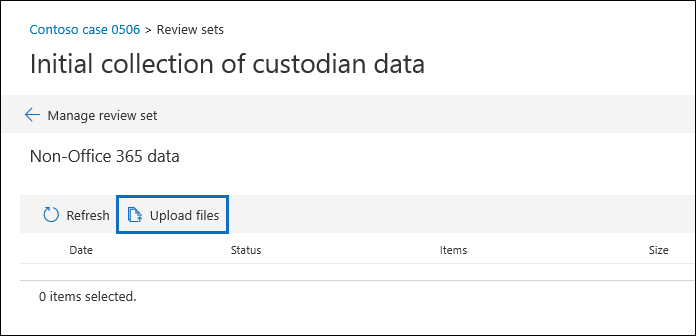

# Cargar datos que no son de Microsoft 365 en un conjunto de revisiónLoad non-Microsoft 365 data into a review set

No todos los documentos que debe analizar en eDiscovery avanzado se encuentran en Microsoft 365.Not all documents that you need to analyze in Advanced eDiscovery are located in Microsoft 365. Con la característica de importación de datos que no es de Microsoft 365 en eDiscovery avanzado, puede cargar documentos que no se encuentran en Microsoft 365 a un conjunto de revisión.With the non-Microsoft 365 data import feature in Advanced eDiscovery, you can upload documents that aren't located in Microsoft 365 to a review set. En este artículo se muestra cómo traer documentos que no son de Microsoft 365 en eDiscovery avanzado para su análisis.This article shows you how to bring your non-Microsoft 365 documents into Advanced eDiscovery for analysis.

## Requisitos para cargar contenido no de Office 365Requirements to upload non-Office 365 content

El uso de la característica de carga que no es de Microsoft 365 que se describe en este artículo requiere lo siguiente:Using the upload non-Microsoft 365 feature described in this article requires that you have the following:

- Todos los custodios a los que quiera asociar contenido que no pertenezca a Microsoft 365 deben tener asignada la licencia correspondiente.All custodians that you want to associate non-Microsoft 365 content to must be assigned the appropriate license. Para obtener más información, vea Introducción [a la exhibición avanzada de](get-started-with-advanced-ediscovery.md#step-1-verify-and-assign-appropriate-licenses)documentos electrónicos.For more information, see [Get started with Advanced eDiscovery](get-started-with-advanced-ediscovery.md#step-1-verify-and-assign-appropriate-licenses).

- Un caso de exhibición avanzada de documentos electrónicos existente.An existing Advanced eDiscovery case.

- Los custodios deben agregarse al caso antes de que pueda cargar y asociar los datos que no son de Microsoft 365.Custodians must be added to the case before you can upload and associate the non-Microsoft 365 data to them.

- Los datos que no son de Microsoft 365 deben ser un tipo de archivo admitido por la exhibición avanzada de documentos electrónicos.Non-Microsoft 365 data must be a file type that's supported by Advanced eDiscovery. Para obtener más información, consulte [tipos de archivo admitidos en EDiscovery avanzado](supported-filetypes-ediscovery20.md).For more information, see [Supported file types in Advanced eDiscovery](supported-filetypes-ediscovery20.md).

- Todos los archivos que se cargan en un conjunto de revisión deben estar ubicados en carpetas, donde cada carpeta está asociada a un custodio específico.All files that are uploaded to a review set must be located in folders, where each folder is associated with a specific custodian. Los nombres de estas carpetas deben usar el siguiente formato de nomenclatura: *alias@domainname*.The names for these folders must use the following naming format: *alias@domainname*. El alias@domainname debe ser el alias y el dominio de Microsoft 365 del usuario.The alias@domainname must be the user's Microsoft 365 alias and domain. Puede recopilar todas las carpetas de alias@domainname en una carpeta raíz.You can collect all the alias@domainname folders in a root folder. La carpeta raíz solo puede contener las carpetas de alias@domainname.The root folder can only contain the alias@domainname folders. No se admiten los archivos separados en la carpeta raíz.Loose files in the root folder aren't supported.

   La estructura de carpetas para los datos que no son de Microsoft 365 que desea cargar sería similar al ejemplo siguiente:The folder structure for the non-Microsoft 365 data that you want to upload would be similar to the following example:

   - c:\nonO365\abraham.mcmahon@contoso.comc:\nonO365\abraham.mcmahon@contoso.com
   - c:\nonO365\jewell.gordon@contoso.comc:\nonO365\jewell.gordon@contoso.com
   - c:\nonO365\staci.gonzalez@contoso.comc:\nonO365\staci.gonzalez@contoso.com

   Donde abraham.mcmahon@contoso.com, jewell.gordon@contoso.com y staci.gonzalez@contoso.com son las direcciones SMTP de los custodios en el caso.Where abraham.mcmahon@contoso.com, jewell.gordon@contoso.com, and staci.gonzalez@contoso.com are the SMTP addresses of custodians in the case.

   

- Una cuenta asignada al grupo de roles eDiscovery Manager (y agregada como administrador de exhibición de documentos electrónicos).An account that is assigned to the eDiscovery Manager role group (and added as eDiscovery Administrator).

- La herramienta AzCopy v 8.1 instalada en un equipo que tiene acceso a la estructura de carpetas de contenido que no es de Microsoft 365.The AzCopy v8.1 tool installed on a computer that has access to the non-Microsoft 365 content folder structure. Para instalar AzCopy, consulte [transferir datos con azcopy v 8.1 en Windows](https://docs.microsoft.com/previous-versions/azure/storage/storage-use-azcopy).To install AzCopy, see [Transfer data with the AzCopy v8.1 on Windows](https://docs.microsoft.com/previous-versions/azure/storage/storage-use-azcopy). Asegúrese de instalar AzCopy en la ubicación predeterminada, que es **% ProgramFiles (x86)% \ Microsoft SDKs\Azure\AzCopy**.Be sure to install AzCopy in the default location, which is **%ProgramFiles(x86)%\Microsoft SDKs\Azure\AzCopy**. Debe usar AzCopy v 8.1.You must use AzCopy v8.1. Es posible que otras versiones de AzCopy no funcionen al cargar datos que no son de Microsoft 365 en eDiscovery avanzado.Other versions of AzCopy may not work when loading non-Microsoft 365 data in Advanced eDiscovery.

## Cargar contenido que no es de Microsoft 365 en eDiscovery avanzadoUpload non-Microsoft 365 content into Advanced eDiscovery

1. Como administrador de eDiscovery o administrador de exhibición de documentos electrónicos, abra eDiscovery avanzado y vaya al caso de que se carguen los datos que no son de Microsoft 365.As an eDiscovery Manager or eDiscovery Administrator, open Advanced eDiscovery, and go to the case that the non-Microsoft 365 data will be uploaded to.  

2. Haga clic en **revisar conjuntos**y, a continuación, seleccione el conjunto de revisiones para cargar los datos que no son de Microsoft 365 en.Click **Review sets**, and then select the review set to upload the non-Microsoft 365 data to.  Si no tiene un conjunto de revisión, puede crear uno.If you don't have a review set, you can create one. 
 
3. En el conjunto de revisiones, haga clic en **administrar conjunto de revisiones**y, a continuación, haga clic en **Ver cargas** en el mosaico de **datos que no es de Microsoft 365** .In the review set, click **Manage review set**, and then click **View uploads** on the **Non-Microsoft 365 data** tile.

4. Haga clic en **cargar archivos** para iniciar el Asistente para importación de datos.Click **Upload files** to start the data import wizard.

   

   El primer paso del asistente prepara una ubicación de almacenamiento de Azure segura proporcionada por Microsoft para cargar los archivos en.The first step in the wizard prepares a secure Microsoft-provided Azure Storage location to upload the files to.  Una vez completada la preparación, el botón **cargar archivos** se activa.When the preparation is completed, the **Next: Upload files** button becomes active.

   
 
5. Haga clic en **siguiente: cargar archivos**.Click **Next: Upload files**.

6. En la página **cargar archivos** , haga lo siguiente:On the **Upload files** page, do the following:

   

   a.a. En el cuadro **ruta de acceso a la ubicación de los archivos** , compruebe o escriba la ubicación de la carpeta raíz donde almacenó los datos que no son de Microsoft 365 que desea cargar.In the **Path to location of files** box, verify or type the location of the root folder where you've stored the non-Microsoft 365 data you want to upload. Por ejemplo, para la ubicación de los archivos de ejemplo que se muestran en la **sección antes de comenzar**, debe escribir **%USERPROFILE\Downloads\nonO365**.For example, for the location of the example files shown in the **Before you begin section**, you would type **%USERPROFILE\Downloads\nonO365**. Si se proporciona la ubicación correcta, se asegurará de que el comando AzCopy que se muestra en Box en la ruta se haya actualizado correctamente.Providing the correct location ensures the AzCopy command displayed in box under the path is properly updated.

   b.b. Haga clic en **copiar al portapapeles** para copiar el comando que se muestra en el cuadro.Click **Copy to clipboard** to copy the command that is displayed in the box.

7. Inicie un símbolo del sistema de Windows, pegue el comando que copió en el paso anterior y, a continuación, presione **entrar** para iniciar el comando AzCopy.Start a Windows command prompt, paste the command that you copied in the previous step, and then press **Enter** to start the AzCopy command.  Después de iniciar el comando, los archivos que no son de Microsoft 365 se cargarán en la ubicación de almacenamiento de Azure que se preparó en el paso 4.After you start the command, the non-Microsoft 365 files will be uploaded to the Azure Storage location that was prepared in step 4.

   

   > [!NOTE]
   > Como se indicó anteriormente, debe usar AzCopy v 8.1 para usar correctamente el comando que se proporciona en la página **cargar archivos** .As previously stated, you must use AzCopy v8.1 to successfully use the command that's provided on the **Upload files** page. Si el comando AzCopy proporcionado no se produce, consulte [solucionar problemas de azcopy en EDiscovery avanzado](troubleshooting-azcopy.md).If the supplied AzCopy command fails, please see [Troubleshoot AzCopy in Advanced eDiscovery](troubleshooting-azcopy.md).

8. Vuelva al centro de cumplimiento de & de seguridad y haga clic en **siguiente: procesar archivos** en el asistente.Go back to the Security & Compliance Center, and click **Next: Process files** in the wizard.  Esto inicia el procesamiento, la extracción de texto y la indización de los archivos que no son de Microsoft 365 que se cargaron en la ubicación de almacenamiento de Azure.This initiates processing, text extraction, and indexing of the non-Microsoft 365 files that were uploaded to the Azure Storage location.  

9. Realice un seguimiento del progreso del procesamiento de los archivos en la página **procesar archivos** o en la ficha **trabajos** mediante la visualización de un trabajo denominado **adición de datos que no son de Microsoft 365 a un conjunto de revisión**.Track the progress of processing the files on the **Process files** page or on the **Jobs** tab by viewing a job named **Adding non-Microsoft 365 data to a review set**.  Una vez finalizado el trabajo, los nuevos archivos estarán disponibles en el conjunto de revisión.After the job is finished, the new files will be available in the review set.

   

10. Una vez finalizado el procesamiento, puede cerrar el asistente.After the processing is finished, you can close the wizard.
