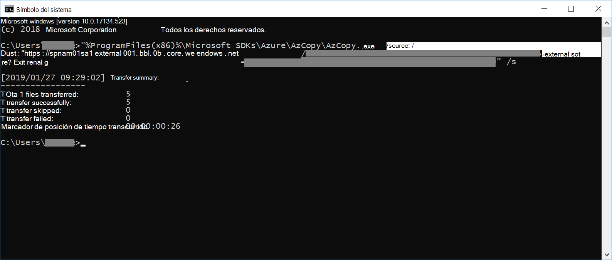

# Cargar datos que no son de Microsoft 365 en pruebasLoad non-Microsoft 365 data into evidence

No todos los documentos que puede que necesite analizar en una investigación de datos se ubicarán en Microsoft 365.Not all documents that you may need to analyze in a data investigation will be located in Microsoft 365. Con la característica de importación de contenido que no es de Microsoft 365, puede cargar documentos que no vivan en Microsoft 365 en pruebas para que puedan analizarse en una investigación de datos.With the Non-Microsoft 365 content import feature you can upload documents that don't live in Microsoft 365 into evidence so they can be analyzed in a data investigation.

## Requisitos para cargar contenido no de Office 365Requirements to upload non-Office 365 content

Para usar la característica de carga que no es de Microsoft 365, tal y como se describe en este procedimiento, es necesario que:Using the upload Non-Microsoft 365 feature as described in this procedure requires that you have:

- Una suscripción A Microsoft 365 o A Office 365 E5.A Microsoft 365 or Office 365 E5 subscription.

- Todas las personas de interés cuyo contenido que no sea de Microsoft 365 se cargarán deben tener la licencia del complemento E5 o E5 adecuada.All people of interest whose non-Microsoft 365 content will be uploaded must have the appropriate E5 or E5 add-on license.

- Un caso de eDiscovery existente.An existing eDiscovery case.

- Todos los archivos para carga recopilados en carpetas en las que hay una carpeta por custodio y el nombre de las carpetas se encuentran en este formato *alias@domainname*.All the files for uploading gathered into folders where there is one folder per custodian and the folders' name is in this format *alias@domainname*. El *alias@domainname* debe ser el alias y el dominio del usuario.The *alias@domainname* must be user's alias and domain. Puede recopilar todas las carpetas de *alias@domainname* en una carpeta raíz.You can collect all the *alias@domainname* folders into a root folder. La carpeta raíz solo puede contener las carpetas *alias@domainname* , no debe haber archivos sueltos en la carpeta raíz.The root folder can only contain the *alias@domainname* folders, there must be no loose files in the root folder.

- Una cuenta que sea un administrador de eDiscovery o un administrador de exhibición de documentos electrónicos herramientas de almacenamiento de Microsoft Azure instaladas en un equipo que tenga acceso a la estructura de carpetas de contenido que no son de Microsoft 365.An account that is either an eDiscovery Manager or eDiscovery Administrator Microsoft Azure Storage Tools installed on a computer that has access to the non-Microsoft 365 content folder structure.

- Instale AzCopy, que puede hacer desde [Introducción a azcopy](https://docs.microsoft.com/azure/storage/common/storage-use-azcopy).Install AzCopy, which you can do from [Get started with AzCopy](https://docs.microsoft.com/azure/storage/common/storage-use-azcopy).

## Cargar contenido que no es de Microsoft 365 en una investigación de datosUpload non-Microsoft 365 content in to a data investigation

1. Abra **investigaciones de datos** y vaya a la investigación en la que se cargarán los datos que no son de Microsoft 365.Open **Data Investigations** and go to the investigation that the non-Microsoft 365 data will be uploaded to.  Haga clic en la pestaña **evidencia** y, a continuación, seleccione el conjunto de evidencias en el que desea cargar los datos.Click the **Evidence** tab, then select the evidence set you wish to load the data to.  Si aún no ha creado un conjunto de evidencias, puede hacerlo ahora.If you have not already created an evidence set, you can do so now.  Por último, haga clic en **administrar evidencias** y **Ver cargas** en la sección de datosFinally, click **Manage evidence** then **View uploads** in the data section

2. Haga clic en el botón **cargar archivos** para iniciar el Asistente para importación de datos que no es de Microsoft 365.Click the **Upload files** button to start the Non-Microsoft 365 data import wizard.

3. El primer paso del asistente simplemente prepara un BLOB seguro de Azure para los archivos que se van a cargar.The first step in the wizard simply prepares a secure Azure blob for the files to be uploaded.  Una vez completada la preparación, haga clic en el botón **cargar archivos** .After the preparation is complete, click the **Next: Upload files** button.

 
4. En el paso **cargar archivos** , especifique la **ruta de acceso a la ubicación de los archivos**, aquí es donde se ubican los datos que no son de Microsoft 365 que tiene previsto importar.In the **Upload files** step, specify the **Path to location of files**, this is where the Non-Microsoft 365 data you plan on importing is located.  La configuración de la ubicación correcta asegura que el comando AzCopy se haya actualizado correctamente.Setting the correct location ensures the AzCopy command is properly updated.

> [!NOTE]
> Si todavía no ha instalado AzCopy, puede hacerlo desde aquí:https://docs.microsoft.com/azure/storage/common/storage-use-azcopyIf you have not already installed AzCopy, you can do this from here: https://docs.microsoft.com/azure/storage/common/storage-use-azcopy

5. Copie el comando predefinido haciendo clic en el vínculo **copiar al portapapeles** .Copy the predefined command by clicking the **Copy to clipboard** link. Inicie un símbolo del sistema de Windows, pegue el comando y presione Entrar.Start a windows command prompt, paste the command and press enter.  Los archivos se cargarán en el almacenamiento de blobs seguro de Azure para el paso siguiente.The files will be uploaded to the secure Azure blob storage for the next step.

6. Por último, vuelva al cumplimiento de & de seguridad y haga clic en el botón **siguiente: procesar archivos** .Finally, return back to the Security & Compliance and click the **Next: Process files** button.  Esto inicia el procesamiento, la extracción de texto y la indización de los archivos cargados.This initiates processing, text extraction, and indexing of the uploaded files.  Puede realizar un seguimiento del progreso del procesamiento aquí o en la pestaña **trabajos** .  Una vez completados, los nuevos archivos están disponibles en el conjunto de evidencias.You can track the progress of processing here or in the **Jobs** tab.  Once completed, the new files are available in the evidence set.  Una vez finalizado el procesamiento, puede descartar el asistente.After processing is complete, you can dismiss the wizard.

