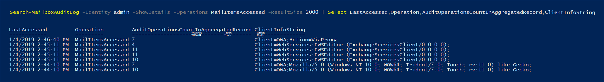

# <a name="use-advanced-audit-to-investigate-compromised-accounts"></a>Usar auditoría avanzada para investigar cuentas comprometidas

Una cuenta de usuario comprometida (también denominada *adquisición de cuenta*) es un tipo de ataque en el que un atacante obtiene acceso a una cuenta de usuario y opera como el usuario. En ocasiones, estos tipos de ataques provocan más daño de lo que el atacante podría haber planeado. Al investigar cuentas de correo electrónico comprometidas, tiene que asumir que se han comprometido más datos de correo de los que se indican mediante el seguimiento de la presencia real del atacante. Según el tipo de datos de los mensajes de correo electrónico, tiene que asumir que la información confidencial se ha visto comprometida o puede enfrentarse a sanciones, a menos que pueda demostrar que la información confidencial no se ha expuesto. Por ejemplo, las organizaciones reguladas por HIPAA se enfrentan a multas considerables si hay evidencia de que la información sanitaria del paciente (PHI) se ha expuesto. En estos casos, es poco probable que los atacantes estén interesados en la PHI, pero las organizaciones deben informar de las vulneraciones de datos, a menos que puedan probar lo contrario.

Para ayudarle con la investigación de las cuentas de correo electrónico, ahora estamos realizando auditorías de los accesos a los datos por parte de protocolos de correo y clientes con la acción de auditoría del buzón *MailItemsAccessed*. Esta nueva acción de auditoría ayudará a los investigadores a entender mejor las vulneraciones de datos del correo electrónico y le ayudarán a identificar el alcance de los elementos de correo específicos que se pueden ver comprometidos. El objetivo del uso de esta nueva acción de auditoría son las actividades forenses de defensa para ayudarle a confirmar que no se han comprometido los datos de un elemento de correo determinado. Si un atacante ha obtenido acceso a una parte específica del correo, Exchange Online realiza una auditoría del evento incluso aunque no haya ninguna indicación de que el elemento de correo se haya leído realmente.

## <a name="the-mailitemsaccessed-mailbox-auditing-action"></a>La acción de auditoría del buzón MailItemsAccessed

La nueva acción MailItemsAccessed forma parte de la nueva función de [auditoría avanzada](advanced-audit.md). Forma parte de las [auditorías del buzón de Exchange](https://docs.microsoft.com/office365/securitycompliance/enable-mailbox-auditing#mailbox-auditing-actions) y está habilitada de forma predeterminada para los usuarios que tienen asignada una licencia de Office 365 o Microsoft 365 E5 o para las organizaciones con una suscripción al complemento de Cumplimiento de Microsoft 365 E5.

La acción de auditoría del buzón MailItemsAccessed abarca todos los protocolos de correo: POP, IMAP, MAPI, EWS, Exchange ActiveSync y REST. También cubre los dos tipos de acceso al correo: *sincronización* y *enlace*.

### <a name="auditing-sync-access"></a>Auditoría del acceso de sincronización

Las operaciones de sincronización solo se registran cuando se obtiene acceso a un buzón mediante una versión de escritorio del cliente de Outlook para Windows o Mac. Durante la operación de sincronización, estos clientes suelen descargar un amplio conjunto de elementos de correo desde la nube a un equipo local. El volumen de auditoría para las operaciones de sincronización es inmenso. Por lo tanto, en lugar de generar un registro de auditoría para cada elemento de correo que está sincronizando, solo generamos un evento de auditoría para la carpeta de correo que contiene los elementos que se han sincronizado. Esto presupone que *todos* los elementos de correo de la carpeta sincronizada se han visto comprometidos. El tipo de acceso se registra en el campo OperationsProperties del registro de auditoría. 

Vea el paso 2 de la sección [usar registros de auditoría de MailItemsAccessed para investigaciones forenses](#use-mailitemsaccessed-audit-records-for-forensic-investigations) para ver un ejemplo de cómo mostrar el tipo de acceso de sincronización en un registro de auditoría.

### <a name="auditing-bind-access"></a>Auditoría del acceso de enlace

Una operación de enlace es un acceso individual a un mensaje de correo electrónico. Para el acceso de enlace, el identificador de mensaje de Internet de mensajes individuales se grabará en el registro de auditoría. La acción de auditoría MailItemsAccessed registra las operaciones de enlace y las agrega en un único registro de auditoría. Todas las operaciones de enlace que tienen lugar dentro de un intervalo de 2 minutos se agregan en un único registro de auditoría en el campo Carpetas de la propiedad AuditData. Cada mensaje al que se haya obtenido acceso se identifica por su identificador de mensaje de Internet. El número de operaciones de enlace agregadas al registro se muestra en el campo OperationCount en la propiedad AuditData.

Vea el paso 4 de la sección [usar registros de auditoría de MailItemsAccessed para investigaciones forenses](#use-mailitemsaccessed-audit-records-for-forensic-investigations) para ver un ejemplo de cómo mostrar el tipo de acceso de enlace en un registro de auditoría.

### <a name="throttling-of-mailitemsaccessed-audit-records"></a>Limitación de registros de auditoría de MailItemsAccessed

Si se generan más de 1 000 registros de auditoría de MailItemsAccessed en menos de 24 horas, Exchange Online dejará de generar registros de auditoría para actividad de MailItemsAccessed. Cuando un buzón está limitado, la actividad de MailItemsAccessed no se registrará durante 24 horas después de que se haya limitado el buzón. Si esto ocurre, es posible que se haya puesto en peligro el buzón durante este período. El registro de la actividad de MailItemsAccessed se reanudará tras un período de 24 horas.  

Aquí se muestran algunas cosas que debe tener en cuenta sobre la limitación:

- Menos del 1 % de todos los buzones de Exchange Online están limitados

- Cuando un buzón está limitado, los registros de auditoría de actividad de MailItemsAccessed son los únicos para los que no se realiza auditoría. Otras acciones de auditoría del buzón no se verán afectadas.

- Los buzones solo se limitan para las operaciones de enlace. Los registros de auditoría para las operaciones de sincronización no están limitados.

- Si un buzón está limitado, puede suponer que probablemente existe actividad de MailItemsAccessed que no se ha grabado en los registros de auditoría.

Vea el paso 1 de la sección [usar registros de auditoría de MailItemsAccessed para investigaciones forenses](#use-mailitemsaccessed-audit-records-for-forensic-investigations) para ver un ejemplo de cómo mostrar la propiedad IsThrottled en un registro de auditoría.

## <a name="use-mailitemsaccessed-audit-records-for-forensic-investigations"></a>Usar registros de auditoría de MailItemsAccessed para investigaciones forenses

La auditoría del buzón genera registros de auditoría para obtener acceso a los mensajes de correo electrónico para que pueda asegurarse de que los mensajes de correo electrónico no se han visto comprometidos. Por este motivo, en los casos en los que no se está seguro de que se haya tenido acceso a ciertos datos, damos por sentado que ha sido así, registrando toda la actividad de acceso al correo.

El uso de registros de auditoría de MailItemsAccessed para propósitos forenses suele realizarse después de que se haya resuelto la violación de datos y se haya eliminado el atacante. Para comenzar la investigación, debe identificar el conjunto de buzones que se han visto comprometidos y determinar el período de tiempo en el que el atacante ha tenido acceso a los buzones de su organización. Después, puede usar los cmdlets **Search-UnifiedAuditLog** o **Search-MailboxAuditLog** en el [PowerShell de Exchange Online](https://docs.microsoft.com/powershell/exchange/exchange-online/connect-to-exchange-online-powershell/connect-to-exchange-online-powershell) para buscar registros de auditoría que correspondan a la violación de datos. 

Puede ejecutar uno de los siguientes comandos para buscar registros de auditoría de MailItemsAccessed:

**Registro de auditoría unificado**

```powershell
Search-UnifiedAuditLog -StartDate 01/06/2020 -EndDate 01/20/2020 -UserIds <user1,user2> -Operations MailItemsAccessed -ResultSize 1000
```

**Registro de auditoría de buzones de correo**

```powershell
Search-MailboxAuditLog -Identity <user> -StartDate 01/06/2020 -EndDate 01/20/2020 -Operations MailItemsAccessed -ResultSize 1000 -ShowDetails
```

> [!TIP]
> Una de las principales diferencias entre estos dos cmdlets es que puede usar el cmdlet **Search-UnifiedAuditLog** para buscar registros de auditoría de la actividad realizada por uno o más usuarios. El motivo es que *UserIds* es un parámetro de varios valores. El cmdlet **Search-MailboxAuditLog** busca el registro de auditoría del buzón de un único usuario.

Estos son los pasos para usar los registros de auditoría de MailItemsAccessed para investigar un ataque a un usuario comprometido. Cada paso muestra la sintaxis de comando para los cmdlets **Search-UnifiedAuditLog** o **Search-MailboxAuditLog**.

1. Compruebe si el buzón se ha limitado. Si es así, algunos de los registros de auditoría de buzón no se han registrado. En el caso de que los registros de auditoría tengan "IsThrottled" establecido en "true", debe suponer que, durante un período de 24 horas después de que se haya generado el registro, el acceso al buzón no se ha auditado y que todos los datos de correo se han visto comprometidos.

   Para buscar registros de MailItemsAccessed en los que el buzón estaba limitado, ejecute el siguiente comando:

   **Registro de auditoría unificado**
 
   ```powershell
   Search-UnifiedAuditLog -StartDate 01/06/2020 -EndDate 01/20/2020 -UserIds <user1,user2> -Operations MailItemsAccessed -ResultSize 1000 | Where {$_.AuditData -like '*"IsThrottled","Value":"True"*'} | FL
   ```

   **Registro de auditoría de buzones de correo**

   ```powershell
   Search-MailboxAuditLog -StartDate 01/06/2020 -EndDate 01/20/2020 -Identity <user> -Operations MailItemsAccessed -ResultSize 10000 -ShowDetails | Where {$_.OperationProperties -like "*IsThrottled:True*"} | FL
   ```

2. Busque actividades de sincronización. Si un atacante usa un cliente de correo electrónico para descargar los mensajes de un buzón, puede desconectar el equipo de Internet y tener acceso a los mensajes de forma local sin interactuar con el servidor. Esto quiere decir que la auditoría de buzón no podría auditar estas actividades.

   Para buscar registros de MailItemsAccessed en que se accedió a los elementos de correo con una operación de sincronización, ejecute el siguiente comando:

   **Registro de auditoría unificado**

   ```powershell
   Search-UnifiedAuditLog -StartDate 01/06/2020 -EndDate 02/20/2020 -UserIds <user1,user2> -Operations MailItemsAccessed -ResultSize 1000 | Where {$_.AuditData -like '*"MailAccessType","Value":"Sync"*'} | FL
   ```

   **Registro de auditoría de buzones de correo**

   ```powershell
   Search-MailboxAuditLog -StartDate 01/06/2020 -EndDate 01/20/2020 -Identity <user> -Operations MailItemsAccessed -ResultSize 10000 -ShowDetails | Where {$_.OperationProperties -like "*MailAccessType:Sync*"} | FL
   ```

3. Compruebe las actividades de sincronización para determinar si alguna de ellas se ha producido en el mismo contexto que la usada por el acceso del atacante al buzón. El contexto se identifica y se diferencia por la dirección IP del equipo cliente usado para tener acceso al buzón y al protocolo de correo. Para obtener más información, vea la sección [identificar los contextos de acceso de diferentes registros de auditoría](#identifying-the-access-contexts-of-different-audit-records).

   Use las propiedades que se enumeran a continuación para investigar. Estas propiedades se encuentran en las propiedades OperationProperties o AuditData. Si cualquiera de las sincronizaciones tiene lugar en el mismo contexto que la actividad del atacante, debe asumir que el atacante ha sincronizado todos los elementos de correo con su cliente, lo que significa que es posible que se haya visto comprometido todo el buzón.

   |Propiedad         | Description |
   |:---------------- | :----------|
   |ClientInfoString | Describe el protocolo, cliente (incluye la versión).|
   |ClientIPAddress  | Dirección IP del equipo cliente.|
   |SessionId        | El ID. de la sesión le ayuda a diferenciar las acciones de un atacante frente a las actividades cotidianas del usuario en la misma cuenta (en el caso de una cuenta comprometida)|
   |UserId           | UPN del usuario que lee el mensaje.|
   |||

4. Busque actividades de enlace. Después de seguir los pasos 2 y 3, puede estar seguro de que todos los demás accesos del atacante a los mensajes de correo electrónico se capturarán en los registros de auditoría de MailItemsAccessed que tengan una propiedad MailAccessType con el valor de "bind".

   Para buscar registros de MailItemsAccessed en que se accedió a los elementos de correo con una operación de enlace, ejecute el siguiente comando:

   **Registro de auditoría unificado**

   ```powershell
   Search-UnifiedAuditLog -StartDate 01/06/2020 -EndDate 01/20/2020 -UserIds <user1,user2> -Operations MailItemsAccessed -ResultSize 1000 | Where {$_.AuditData -like '*"MailAccessType","Value":"Bind"*'} | FL
   ```
 
   **Registro de auditoría de buzones de correo**
   
   ```powershell
   Search-MailboxAuditLog -StartDate 01/06/2020 -EndDate 01/20/2020 -Identity <user> -Operations MailItemsAccessed -ResultSize 10000 -ShowDetails | Where {$_.OperationProperties -like "*MailAccessType:Bind*"} | FL
   ```

   Los mensajes de correo electrónico a los que se ha accedido se identifican por su ID. de mensaje de Internet. También puede comprobar si los registros de auditoría tienen el mismo contexto que los de la otra actividad del atacante. Para obtener más información, vea la sección [identificar los contextos de acceso de diferentes registros de auditoría](#identifying-the-access-contexts-of-different-audit-records).
 
   Puede usar los datos de auditoría para las operaciones de enlace de dos maneras diferentes:

     - Acceda o recopile todos los mensajes de correo electrónico a los que el atacante accedió mediante el identificador de mensaje de Internet para buscarlos y comprobar si alguno de estos mensajes contiene información confidencial.

     - Use el identificador de mensaje de Internet para buscar registros de auditoría relacionados con un conjunto de mensajes de correo electrónico potencialmente confidenciales. Esto es útil si solo le preocupa un pequeño número de mensajes.

## <a name="filtering-of-duplicate-audit-records"></a>Filtrar registros de auditoría duplicados

Los registros de auditoría duplicados para las mismas operaciones de enlace que tienen lugar dentro de un margen de una hora se filtran para quitar ruido de auditoría. Las operaciones de sincronización también se filtran en intervalos de una hora. La excepción a este proceso de desduplicación se produce si, para el mismo Id. de mensaje de Internet, cualquiera de las propiedades que se describen en la tabla siguiente es diferente. Si una de estas propiedades es diferente en una operación duplicada, se generará un nuevo registro de auditoría. Este proceso se describe con más detalle en la sección siguiente.

| Propiedad| Description|
|:--------|:---------|
|ClientIPAddress | Dirección IP del equipo del cliente.|
|ClientInfoString| El protocolo de cliente, cliente usado para tener acceso al buzón.| 
|ParentFolder    | La ruta de acceso completa a la carpeta del elemento de correo al que se obtuvo acceso. |
|Logon_type      | Tipo de inicio de sesión del usuario que realizó la acción. Los tipos de inicio de sesión (y el valor de enumeración correspondiente) son propietario (0), administrador (1) y delegado (2).|
|MailAccessType  | Si el acceso es una operación de enlace o sincronización.|
|MailboxUPN      | El UPN del buzón en que se encuentra el correo que se está leyendo.|
|User            | UPN del usuario que lee el mensaje.|
|SessionId       | El ID. de la sesión le ayuda a diferenciar las acciones de un atacante y las actividades cotidianas de un usuario en el mismo buzón (en caso de que una cuenta sea comprometida). Para obtener más información sobre las sesiones, vea [Contextualización de la actividad del atacante en sesiones de Exchange Online](https://techcommunity.microsoft.com/t5/exchange-team-blog/contextualizing-attacker-activity-within-sessions-in-exchange/ba-p/608801).|
||||

## <a name="identifying-the-access-contexts-of-different-audit-records"></a>Identificar los contextos de acceso de diferentes registros de auditoría

Es común que un atacante pueda obtener acceso a un buzón al mismo tiempo que el propietario del buzón obtiene acceso a él. Para diferenciar el acceso del atacante y el del propietario del buzón, hay propiedades de registro de auditoría que definen el contexto del acceso. Como se ha explicado anteriormente, cuando los valores de estas propiedades son diferentes, incluso si la actividad tiene lugar en el intervalo de agregación, se generan registros de auditoría independientes. En el ejemplo siguiente, hay tres registros de auditoría diferentes. Cada uno se diferencia por las propiedades de Id. de sesión y ClientIPAddress. También se identifican los mensajes a los que se ha accedido.

|Registro de auditoría 1  |Registro de auditoría 2  |Registro de auditoría 3|
|---------|---------|---------|
|ClientIPAddress**1**<br/>SessionId**2**|ClientIPAddress**2**<br/>SessionId**2**|ClientIPAddress**1**<br/>SessionId**3**|
|InternetMessageId**A**<br/>InternetMessageId**D**<br/>InternetMessageId**E**<br/>InternetMessageId**F**<br/>|InternetMessageId**A**<br/>InternetMessageId**C**|InternetMessageId**B** |
||||

Si alguna de las propiedades que aparecen en la tabla de la [sección anterior](#filtering-of-duplicate-audit-records) es diferente, se generará un registro de auditoría independiente para realizar un seguimiento del nuevo contexto. Los accesos se ordenarán en registros de auditoría separados en función del contexto en el que se haya producido la actividad.

Por ejemplo, en los registros de auditoría que se muestran en la siguiente captura de pantalla, aunque estamos accediendo al correo de EWSEditor y a OWA de forma simultánea, la actividad de acceso se intercala en diferentes registros de auditoría dependiendo del contexto en el que se haya producido el acceso. En este caso, el contexto se define con valores diferentes para la propiedad ClientInfoString.


