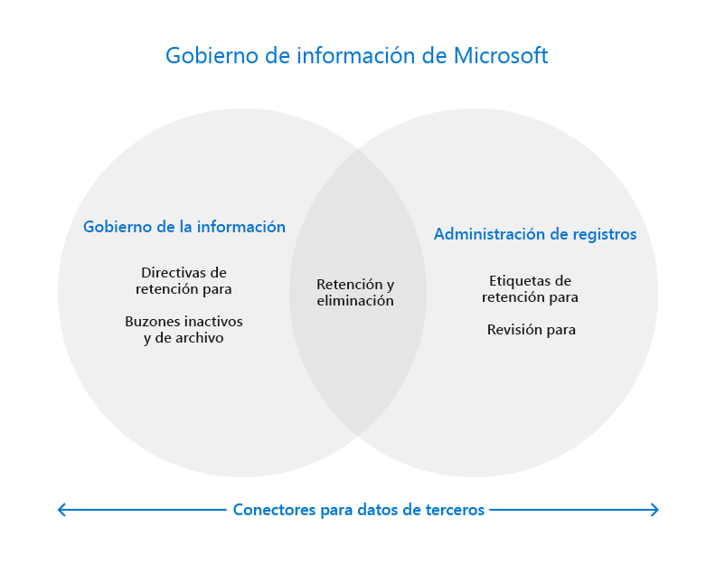

# Gobierno de la información de Microsoft en Microsoft 365

>*[Instrucciones de licencias de Microsoft 365 para la seguridad y el cumplimiento](/office365/servicedescriptions/microsoft-365-service-descriptions/microsoft-365-tenantlevel-services-licensing-guidance/microsoft-365-security-compliance-licensing-guidance).*

Use las funciones de Gobierno de la información de Microsoft (a veces abreviado como MIG) para regir los datos de acuerdo a los requisitos normativos o de cumplimiento.

Desde el [punto de vista de las licencias](#licensing-requirements), puede haber una superposición considerable entre el gobierno de información, la administración de registros y los conectores de datos. Las tres áreas admiten la retención y eliminación de datos en Microsoft 365. Los conectores se usan en soluciones de cumplimiento que no son el gobierno de información y la administración de registros. 

Use el siguiente gráfico para identificar los principales componentes configurables de estas tres soluciones diferentes que tienen su propio nodo en el centro de cumplimiento:

¿Quiere saber cómo proteger los datos? Obtenga información sobre la [Microsoft Information Protection en Microsoft 365](information-protection.md).

## Información de gobierno

Para retener lo que necesita y eliminar lo que no:
 
|Funcionalidad|¿Qué problemas se solucionan?|Introducción|
|:------|:------------|:--------------------|:-----------------------------|
|[Directivas de retención para cargas de trabajo de Microsoft 365, con etiquetas de retención para excepciones](retention.md) | Conservar o eliminar contenido con la administración de directivas para correo electrónico, documentos y mensajes de Teams y Yammer | [Crear y configurar directivas de retención](create-retention-policies.md)    [Crear etiquetas de retención para excepciones a las directivas de retención](create-retention-labels-information-governance.md)|
|[Buzones de archivo](archive-mailboxes.md)| Proporciona a los usuarios espacio de almacenamiento adicional en el buzón | [Habilitar buzones de archivo](enable-archive-mailboxes.md) |
|[Buzones de correo inactivos](inactive-mailboxes-in-office-365.md)| Conservar el contenido del buzón después de que los empleados abandonen la organización para que este contenido siga siendo accesible para los administradores, los responsables de cumplimiento y los administradores de registros | [Crear y administrar buzones inactivos](create-and-manage-inactive-mailboxes.md)|
|[Importar servicio para archivos PST](importing-pst-files-to-office-365.md)| Importación en masa de archivos PST a buzones de Exchange Online para conservar y buscar mensajes de correo electrónico de requisitos de cumplimiento o normativos | [Usar la carga en la red para importar los archivos PST de su organización a Microsoft 365](use-network-upload-to-import-pst-files.md)|

## Administración de registros

Administración del ciclo de vida de elementos de gran valor para obligaciones legales, empresariales o reglamentarias:

|Funcionalidad|¿Qué problemas se solucionan?|Introducción|
|:------|:------------|---------------------|:----------------------------|
|[Administración de registros](records-management.md)| Una única solución para correo electrónico y documentos que incorpora horarios y requisitos flexibles de retención y eliminación para admitir el ciclo de vida completo del contenido con declaración de registros y eliminación defendible cuando sea necesario |[Introducción a la administración de registros](get-started-with-records-management.md) |

## Conectores para datos de terceros

Amplíe las herramientas de cumplimiento a datos de terceros importados y archivados desde plataformas de redes sociales, plataformas de mensajería instantánea y plataformas de colaboración en documentos:

|Funcionalidad|¿Qué problemas se solucionan?|Introducción|
|:------|:------------|:--------------------|:-----------------------------|
|[Conectores de datos](archiving-third-party-data.md)| Importe, archive y aplique soluciones de cumplimiento a datos de terceros desde plataformas de redes sociales, plataformas de mensajería instantánea y plataformas de colaboración en documentos| [Conectores de terceros](archiving-third-party-data.md#third-party-data-connectors)|

## Requisitos de licencias

Los requisitos de licencia para el Gobierno de información de Microsoft dependen de los escenarios y las características que use, en lugar del establecimiento de los requisitos de licencia para cada funcionalidad que se muestra en esta página. Para comprender los requisitos y opciones de licencia, consulte las siguientes secciones de la [documentación de licencias de Microsoft 365](/office365/servicedescriptions/microsoft-365-service-descriptions/microsoft-365-tenantlevel-services-licensing-guidance/microsoft-365-security-compliance-licensing-guidance): 
- [Gobierno de información](/office365/servicedescriptions/microsoft-365-service-descriptions/microsoft-365-tenantlevel-services-licensing-guidance/microsoft-365-security-compliance-licensing-guidance#information-governance) 
- [Administración de registros](/office365/servicedescriptions/microsoft-365-service-descriptions/microsoft-365-tenantlevel-services-licensing-guidance/microsoft-365-security-compliance-licensing-guidance#records-management) 
- [Conectores de datos](/office365/servicedescriptions/microsoft-365-service-descriptions/microsoft-365-tenantlevel-services-licensing-guidance/microsoft-365-security-compliance-licensing-guidance#data-connectors)

Los requisitos de licencias adicionales se incluirán en las instrucciones de documentación. Por ejemplo, las licencias específicas para administrar los buzones pueden requerir licencias de Exchange Online.

