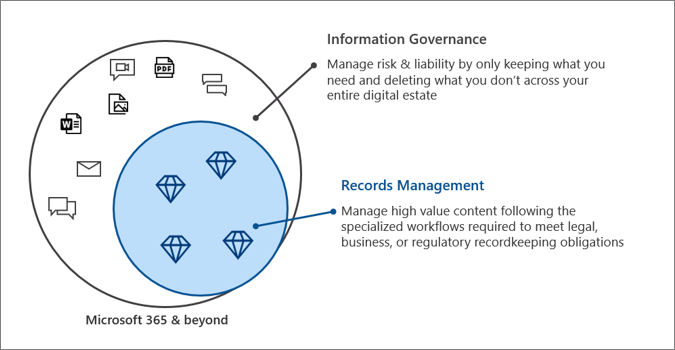

# Gobierno de información de Microsoft en Microsoft 365Microsoft Information Governance in Microsoft 365

>*[Guía de licencias de Microsoft 365 para la seguridad y el cumplimiento](https://aka.ms/ComplianceSD).**[Microsoft 365 licensing guidance for security & compliance](https://aka.ms/ComplianceSD).*

Use las capacidades de Microsoft Information Governance (a veces abreviado para MIG) para regir los datos según los requisitos normativos o de cumplimiento.Use Microsoft Information Governance (sometimes abbreviated to MIG) capabilities to govern your data for compliance or regulatory requirements.

¿Desea proteger sus datos?Looking to protect your data? Consulte [protección de la información de Microsoft en microsoft 365](information-protection.md).See [Microsoft Information Protection in Microsoft 365](information-protection.md).

## Gobierno de la informaciónInformation governance

Para mantener lo que necesita y eliminar lo que no:To keep what you need and delete what you don't:
 
|FuncionalidadCapability|¿Qué problemas soluciona?What problems does it solve?|IntroducciónGet started|
|:------|:------------|:--------------------|:-----------------------------|
|[Directivas de retención y etiquetas de retenciónRetention policies and retention labels](retention.md)| Conservar o eliminar contenido con la administración de directivas y un flujo de trabajo de eliminación para correo electrónico, documentos, mensajes instantáneos y mucho másRetain or delete content with policy management and a deletion workflow for email, documents, instant messages, and more   Escenario de ejemplo: [aplicar una etiqueta de retención a contenido automáticamente](apply-retention-labels-automatically.md)Example scenario: [Apply a retention label to content automatically](apply-retention-labels-automatically.md) | [Introducción a las directivas y etiquetas de retenciónGet started with retention policies and retention labels](get-started-with-retention.md)|
|[Servicio de importaciónImport service](importing-pst-files-to-office-365.md)| Importación masiva de archivos PST a buzones de Exchange Online para retener y buscar mensajes de correo electrónico para cumplir los requisitos normativos o de cumplimientoBulk-import PST files to Exchange Online mailboxes to retain and search email messages for compliance or regulatory requirements | [Usar la carga en la red para importar los archivos PST de su organización a Microsoft 365Use network upload to import your organization's PST files to Microsoft 365](use-network-upload-to-import-pst-files.md)|
|[Archivar datos de tercerosArchive third-party data](archiving-third-party-data.md)| Importar, archivar y aplicar soluciones de cumplimiento a datos de terceros desde plataformas de medios sociales, plataformas de mensajería instantánea y plataformas de colaboración de documentosImport, archive, and apply compliance solutions to third-party data from social media platforms, instant messaging platforms, and document collaboration platforms| [Conectores de tercerosThird-party connectors](archiving-third-party-data.md#third-party-data-connectors)|
|[Buzones de correo inactivosInactive mailboxes](inactive-mailboxes-in-office-365.md)| Conservar el contenido del buzón después de que los empleados abandonen la organizaciónRetain mailbox content after employees leave the organization | [Crear y administrar buzones inactivosCreate and manage inactive mailboxes](create-and-manage-inactive-mailboxes.md)|

## Administración de registrosRecords management

Para administrar contenido de gran valor para obligaciones legales, empresariales o regulatorias:To manage high-value content for legal, business, or regulatory obligations:

|FuncionalidadCapability|¿Qué problemas soluciona?What problems does it solve?|IntroducciónGet started|
|:------|:------------|---------------------|:----------------------------|
|[Administración de registrosRecords management](records-management.md)| Una única solución para el correo electrónico y los documentos que incorporan programaciones y requisitos de retención en un plan de archivos que admite todo el ciclo de vida del contenido con la declaración, retención y eliminación de los registros.A single solution for email and documents that incorporates retention schedules and requirements into a file plan that supports the full lifecycle of your content with records declaration, retention, and disposition   Escenario de ejemplo: [disposición de registros](disposition.md#disposition-of-records)Example scenario: [Disposition of records](disposition.md#disposition-of-records)|[Introducción a la administración de registrosGet started with records management](get-started-with-records-management.md) |

