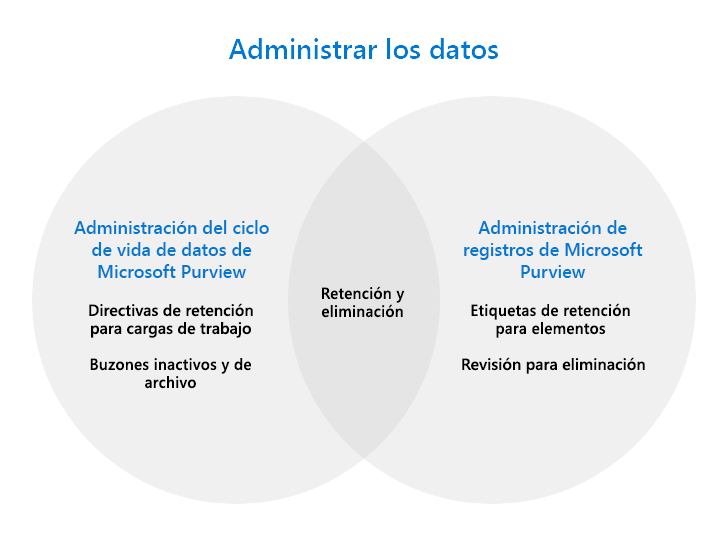

# Controlar los datos con Microsoft Purview

>*[Instrucciones de licencias de Microsoft 365 para la seguridad y el cumplimiento](/office365/servicedescriptions/microsoft-365-service-descriptions/microsoft-365-tenantlevel-services-licensing-guidance/microsoft-365-security-compliance-licensing-guidance).*

[!include[Purview banner](../includes/purview-rebrand-banner.md)]

Use las capacidades de **Administración del ciclo de vida de los datos de Microsoft Purview** (anteriormente, Microsoft Information Governance) y **Administración de registros de Microsoft Purview** para controlar los datos según los requisitos normativos o de cumplimiento.

> [!TIP]
> ¿Quiere asignar y administrar sus datos en todo el patrimonio de datos, incluidas varias nubes y software como servicio (SaaS)? Use [Microsoft Purview Mapa de datos, Microsoft Purview Catálogo de datos y Microsoft Purview Información de recursos en los datos](/azure/purview/overview).

Desde el [punto de vista de las licencias](#licensing-requirements), puede haber una superposición considerable entre la administración del ciclo de vida de los datos y la administración de registros. Ambas soluciones admiten la retención y eliminación de datos para aplicaciones y servicios de Microsoft 365.

Use el siguiente gráfico para identificar los componentes configurables principales de estas soluciones que tienen su propia área de configuración en el portal de cumplimiento de Microsoft Purview:

¿Quiere saber cómo proteger los datos? Consulte [Protección de los datos con Microsoft Purview](information-protection.md).

## Administración del ciclo de vida de datos de Microsoft Purview

Para retener lo que necesita y eliminar lo que no:
 
|Funcionalidad|¿Qué problemas se solucionan?|
|:------|:------------|:----------------|
|[Directivas de retención para cargas de trabajo de Microsoft 365, con etiquetas de retención para excepciones](retention.md) | Le permite conservar o eliminar contenido con la administración de directivas para correo electrónico, documentos y mensajes de Teams y Yammer. |
|[Buzones de correo inactivos](inactive-mailboxes-in-office-365.md)| Le permite conservar el contenido del buzón después de que los empleados abandonen la organización para que este contenido siga siendo accesible para los administradores, los responsables de cumplimiento y los administradores de registros. |
|[Buzones de archivo](archive-mailboxes.md)| Proporciona a los usuarios espacio de almacenamiento adicional en el buzón.|
|[Importar servicio para archivos PST](importing-pst-files-to-office-365.md)| Admite la importación en masa de archivos PST a buzones de Exchange Online para conservar y buscar mensajes de correo electrónico de requisitos de cumplimiento o normativos |

¿Quiere obtener más información? Consulte [Más información sobre la administración del ciclo de vida de los datos](data-lifecycle-management.md).

¿Está listo para empezar a usar algunas o todas estas funcionalidades? Consulte [Introducción a la administración del ciclo de vida de los datos](get-started-with-data-lifecycle-management.md).

## Administración de registros de Microsoft Purview

Administre los elementos de gran valor para los requisitos de mantenimiento de registros empresariales, legales o normativos:

|Funcionalidad|¿Qué problemas se solucionan?|
|:---------|:---------------------------|
|[Plan de archivos](file-plan-manager.md)| Permite crear etiquetas de retención de forma interactiva o importarlas de forma masiva y exportarlas para su análisis. Las etiquetas admiten información administrativa adicional (opcional) para ayudarle a identificar y realizar un seguimiento de los requisitos empresariales o normativos. |
|[Etiquetas de retención para elementos individuales, directivas de retención si es necesario para la retención de línea base](retention.md)| Las etiquetas admiten programaciones flexibles de retención y eliminación que se pueden aplicar manual o automáticamente, con la declaración de registros cuando sea necesario. |
|[Revisión de eliminación y prueba de eliminación](disposition.md)| Revisión manual del contenido antes de su eliminación permanente, con prueba de eliminación de registros.|

¿Quiere obtener más información? Consulte [Más información sobre la administración de registros](records-management.md)

¿Está listo para empezar a usar algunas o todas estas funcionalidades? Consulte [Introducción a la administración de registros](get-started-with-records-management.md).

## Requisitos de licencias

Para comprender los requisitos y opciones de licencia, consulte las siguientes secciones de la [documentación de licencias de Microsoft 365](/office365/servicedescriptions/microsoft-365-service-descriptions/microsoft-365-tenantlevel-services-licensing-guidance/microsoft-365-security-compliance-licensing-guidance): 
- [Administración del ciclo de vida de datos de Microsoft Purview](/office365/servicedescriptions/microsoft-365-service-descriptions/microsoft-365-tenantlevel-services-licensing-guidance/microsoft-365-security-compliance-licensing-guidance#microsoft-purview-data-lifecycle-management)
- [Administración de registros de Microsoft Purview](/office365/servicedescriptions/microsoft-365-service-descriptions/microsoft-365-tenantlevel-services-licensing-guidance/microsoft-365-security-compliance-licensing-guidance#microsoft-purview-records-management)

Los requisitos de licencias adicionales se incluirán en las instrucciones de documentación. Por ejemplo, las licencias específicas para administrar los buzones pueden requerir licencias de Exchange Online.