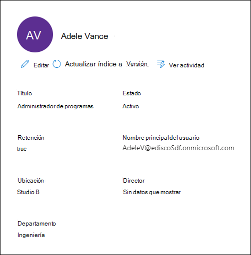
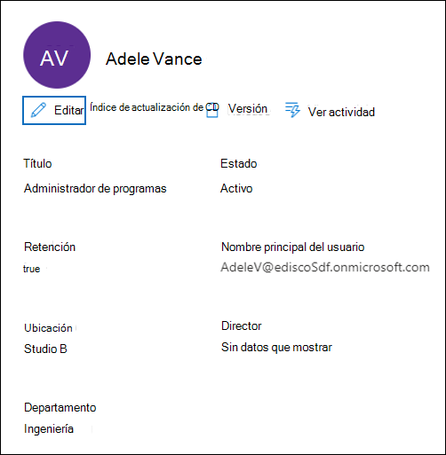

# Administrar custodios en un Advanced eDiscovery caso

La página Custodios de la pestaña Orígenes de un caso Advanced eDiscovery contiene una lista de todos los custodios que se han agregado al caso.  Después de agregar custodios a un caso, los detalles sobre cada custodio se recopilan automáticamente desde Azure Active Directory y se pueden ver en Advanced eDiscovery.

## Ver detalles del custodio

Para ver los detalles sobre un custodio, haga clic en el custodio de la lista de la pestaña **Custodios.** Se muestra una página desplegable que contiene la siguiente información sobre el custodio:

- Información de contacto

  - **Nombre para mostrar:** el nombre que se muestra en la libreta de direcciones del custodio. Esta suele ser la combinación del nombre, la inicial central y el apellido del custodio.
  
   - **Mail/SMTP:** la dirección SMTP principal del custodio, por ejemplo, brianj@contoso.onmicrosoft.com. También se muestra el nombre principal de usuario (UPN) del custodio.

  - **Título:** título del trabajo del custodio.

  - **Departamento:** nombre del departamento en el que trabaja el custodio.

  - **Administrador:** administrador del custodio. El administrador designado recibirá cualquier comunicación de escalamiento para este custodio.
  
- Información de ubicación

  - **Ciudad:** la ciudad en la que se encuentra el custodio.

  - **Estado:** el estado o la provincia en la dirección del custodio.

  - **País o región:** el país o región donde se encuentra el custodio.

  - **Office:** la ubicación de la oficina en el lugar de negocios del custodio.

- Información del caso

  - **Estado de** retención: indica si el custodio se ha puesto en espera. 

  - **Estado de la** comunicación: indica si se ha emitido un aviso de retención al custodio. Si se ha emitido un aviso al custodio, este valor de esta propiedad **se publica**. Si no se ha emitido un aviso al custodio, el estado **es Un-published**. 

  - **Status:** el estado del custodio dentro del caso. Un estado **de Active** indica que el custodio forma parte del caso. Si un custodio se libera de un caso, el estado cambia a **Liberado**. 

- Orígenes de datos e información de indización

    - **Orígenes de** datos: muestra el recuento y el tipo de orígenes de datos (buzones, sitios y Teams) que están asociados con el custodio y forman parte del caso.

    - **Hora de actualización del índice:** indica la hora y la fecha de la última vez que se desencadenó el trabajo de indización avanzada. Esta propiedad también indicará cuándo está en curso el proceso de indización avanzado.

## Editar un custodio

A medida que avanza el caso, puede descubrir que puede haber orígenes de datos adicionales relevantes para un administrador específico & caso. En otros escenarios, es posible que desee quitar determinados orígenes de datos que se han revisado y que se consideran no relevantes.

Para actualizar los orígenes de datos asociados con un custodio:

1. Vaya a **eDiscovery > Advanced eDiscovery** y abra el caso.
  
2. Haga clic en **la pestaña** Orígenes.
  
3. En la **página Custodios,** seleccione un custodio de la lista y haga clic **en Editar** en la página desplegable.

    
  
4. Haga **clic en La pestaña** Elegir orígenes de datos para cambiar la configuración del buzón de Exchange y la cuenta OneDrive, haga clic en Elegir orígenes de **datos**.
  
5. Haga clic **en** la pestaña Seleccionar orígenes de datos adicionales para agregar o quitar Teams, SharePoint o Exchange buzones asociados con el custodio. 

    Para obtener más información acerca de los orígenes de datos asociados con un custodio, vea [Agregar custodios a un caso](add-custodians-to-case.md). 
  
6. Haga **clic en Colocar retenciones de custodia** para habilitar o deshabilitar la retención del custodio.

## Volver a indizar los datos de custodia

En la mayoría de los flujos de trabajo de exhibición de documentos electrónicos para investigaciones legales, se busca un subconjunto de datos de un custodio después de agregarlo a un caso legal. Debido a tamaños de archivo muy grandes o posibles daños en los datos, es posible que algunos elementos de los orígenes de datos asociados con un custodio se indexe parcialmente. Con la [funcionalidad de indización](indexing-custodian-data.md) avanzada en el Advanced eDiscovery, la mayoría de los elementos parcialmente indizados se pueden corregir automáticamente al volver a indizar estos elementos a petición.

Cuando se agrega un custodio a un caso, los datos ubicados en los orígenes de datos asociados con el custodio se indizan automáticamente (mediante el proceso de indización avanzado). Esto significa que puede dejar los datos en su lugar en lugar de tener que descargarlos y corregirlos y, a continuación, buscarlos sin conexión). Sin embargo, durante el ciclo de vida de un caso legal, los nuevos orígenes de datos podrían asociarse con un custodio. En este caso, puede volver a indizar los datos del custodio al volver a ejecutar el proceso de indización avanzada para corregir los elementos parcialmente indizados y actualizar el índice de los datos del custodio.

Para desencadenar el proceso de re indexación para que se alome a elementos parcialmente indizados:

1. Vaya a **eDiscovery > Advanced eDiscovery** y abra el caso.

2. Haga clic en **la pestaña** Orígenes.

3. En la **página Custodios,** seleccione un custodio cuyos datos deben volver a indizarse.

4. En la página desplegable, haga clic **en Actualizar índice**.

   Se muestra un cuadro de diálogo que dice que se ha creado el trabajo de índice.

Volver a indizar los datos de custodia es un proceso de larga ejecución; el trabajo correspondiente que se crea se denomina **Re-indexing custodian data**. Puede realizar un seguimiento del progreso en **la** pestaña Trabajos o en la pestaña **Custodios** supervisando el estado en la columna Estado del trabajo **de indización.**

Para obtener más información, vea:

- [Trabajar con errores de proceso](processing-data-for-case.md)

- [Administrar trabajos](managing-jobs-ediscovery20.md)

## Liberar a un custodio de un caso

Un custodio se libera en situaciones en las que se cierra un caso, el custodio ya no tiene la obligación de conservar el contenido de un caso o cuando se considera que el custodio ya no es relevante para el caso. 

Si libera a un custodio después de publicar un aviso de retención, se enviará un aviso de liberación al custodio. Además, se quitan las retenciones realizadas en orígenes de datos asociados con el custodio. Si el custodio se colocó en una retención silenciosa *,* donde no se emitieron notificaciones de retención legal, no se enviará un aviso de liberación, pero se quitarán las retenciones de los orígenes de datos asociados con ese custodio.

Para liberar a un custodio: 

1. Vaya a **eDiscovery > Advanced eDiscovery** y abra el caso.

2. Haga clic en **la pestaña** Orígenes.

3. En la **página Custodios** y, a continuación, seleccione el custodio que está siendo liberado del caso.

4. En la página desplegable, haga clic **en Liberar custodio**.

   Se muestra una página de advertencia que explica que si se coloca una retención en un origen de datos asociado con el custodio, se eliminará la retención y se aplicará cualquier otra retención asociada con un caso Advanced eDiscovery diferente. Esto incluye otros tipos de características de conservación y retención (como una Microsoft 365 de retención).

5. Haga **clic en** Sí para confirmar que desea liberar al custodio. 

    El estado de este usuario en la pestaña **Custodios** se establece en **Liberado** y el estado de retención en la página desplegable se cambia a **False**.  

> [!NOTE]
> Un custodio puede estar implicado simultáneamente en varios casos legales. Cuando un custodio se libera de un caso, las retenciones y notificaciones en otros asuntos no se verán afectadas.

## Custodios de edición masiva

Puede usar el editor en masa para editar varios custodios a la vez. Para ello, solo tiene que seleccionar dos o más custodios en la pestaña **Custodios** para mostrar el editor en masa y, a continuación, haga clic en una de las tareas.

