# Administrador de cumplimiento de Microsoft (clásico)Microsoft Compliance Manager (classic)

> [!IMPORTANT]
> **El Administrador de cumplimiento ahora está disponible de forma general en el [Centro de cumplimiento de Microsoft 365](https://compliance.microsoft.com/). Recomendamos encarecidamente a los clientes que dejen de usar el Administrador de cumplimiento (clásico) y cambien al nuevo Administrador de cumplimiento para beneficiarse de su experiencia de usuario enriquecida y de la asignación de controles actualizados. Para más información, consulte la documentación del [Administrador de cumplimiento](compliance-manager.md) para configurar y empezar a usar el nuevo Administrador de cumplimiento en el Centro de cumplimiento de Microsoft 365.****Compliance Manager is now generally available in the [Microsoft 365 compliance center](https://compliance.microsoft.com/). We highly recommend customers discontinue using Compliance Manager (classic) and move to the new Compliance Manager to benefit from its rich user experience and updated control mapping. Please refer to our [Compliance Manager documentation](compliance-manager.md) to set up and start using the new Compliance Manager in the Microsoft 365 compliance center.**

 *El Administrador de cumplimiento no está disponible en Office 365 ofrecido por 21Vianet, Office 365 Germany, Office 365 U.S. Government Community High (GCC High) u Office 365 Department of Defense.**Compliance Manager isn't available in Office 365 operated by 21Vianet, Office 365 Germany, Office 365 U.S. Government Community High (GCC High), or Office 365 Department of Defense.*
  
El Administrador de cumplimiento, una herramienta de evaluación de riesgos basada en flujo de trabajo en el [Portal de confianza de servicios](https://docs.microsoft.com/microsoft-365/compliance/get-started-with-service-trust-portal) de Microsoft, le permite realizar un seguimiento, asignar y verificar las actividades de cumplimiento reglamentario de su organización en relación con los Servicios profesionales de Microsoft y los Servicios en la nube de Microsoft, como Microsoft Office 365, Microsoft Dynamics 365 y Microsoft Azure.Compliance Manager, a workflow-based risk assessment tool in the Microsoft [Service Trust Portal](https://docs.microsoft.com/microsoft-365/compliance/get-started-with-service-trust-portal), enables you to track, assign, and verify your organization's regulatory compliance activities related to Microsoft Professional Services and Microsoft cloud services, such as Microsoft Office 365, Microsoft Dynamics 365, and Microsoft Azure. 

Administrador de cumplimiento:Compliance Manager:
  
- Combina la información detallada proporcionada por Microsoft a auditores y entidades reguladoras como parte de distintas auditorías de terceros de los Servicios en la nube de Microsoft en relación con distintas normas (como ISO 27001, ISO 27018 y NIST) e información que Microsoft recopila internamente para su cumplimiento con reglamentos (como HIPAA y el Reglamento general de protección de datos de la UE o RGPD) con su propia autoevaluación del cumplimiento de su organización de estas normas y reglamentos.Combines the detailed information provided by Microsoft to auditors and regulators as part of various third-party audits of Microsoft 's cloud services against various standards (for example, ISO 27001, ISO 27018, and NIST) and information that Microsoft compiles internally for its compliance with regulations (such as HIPAA and the EU General Data Protection Regulation, or GDPR) with your own self-assessment of your organization's compliance with these standards and regulations.
    
- Le permite asignar, realizar un seguimiento y registrar actividades relacionadas con evaluaciones y cumplimiento, lo que puede ayudar a su organización a cruzar las barreras de los equipos para alcanzar los objetivos de cumplimiento.Enables you to assign, track, and record compliance and assessment-related activities, which can help your organization cross team barriers to achieve your organization's compliance goals.
    
- Proporciona una puntuación de cumplimiento para realizar un seguimiento de su progreso y priorizar los controles de auditoría que permitirán reducir la exposición a los riesgos de su organización.Provides a Compliance Score to help you track your progress and prioritize the auditing controls that will help reduce your organization's exposure to risk.
    
- Proporciona un repositorio seguro para que pueda cargar y administrar evidencias y otros artefactos relacionados con sus actividades de cumplimiento.Provides a secure repository for you to upload and manage evidence and other artifacts related to your compliance activities.
    
- Proporciona informes detallados enriquecidos en Microsoft Excel donde se documentan las actividades de cumplimiento realizadas por Microsoft y su organización, y que pueden proporcionarse a auditores, entidades reguladoras y otras partes interesadas de cumplimiento.Produces richly detailed reports in Microsoft Excel that document the compliance activities performed by Microsoft and your organization, which can be provided to auditors, regulators, and other compliance stakeholders.
    
> [!IMPORTANT]
> El Administrador de cumplimiento es un panel que proporciona un resumen de su nivel de cumplimiento y protección de datos, así como recomendaciones para mejorar el cumplimiento y la protección de datos. Las acciones de cliente proporcionadas en el Administrador de cumplimiento son recomendaciones; cada organización necesita evaluar la efectividad de estas recomendaciones en su respectivo entorno reglamentario antes de la implementación. Las recomendaciones que aparecen en el Administrador de cumplimiento no han que interpretarse como una garantía de cumplimiento.Compliance Manager is a dashboard that provides a summary of your data protection and compliance stature and recommendations to improve data protection and compliance. The Customer Actions provided in Compliance Manager are recommendations; it is up to each organization to evaluate the effectiveness of these recommendations in their respective regulatory environment prior to implementation. Recommendations found in Compliance Manager should not be interpreted as a guarantee of compliance.

    
## ¿Qué es el Administrador de cumplimiento?What is Compliance Manager?

El Administrador de cumplimiento es una herramienta de evaluación de riesgos basada en flujo de trabajo diseñada para ayudarle a administrar el cumplimiento reglamentario dentro del modelo de responsabilidad compartida de la nube. El Administrador de cumplimiento proporciona un panel con una vista de normas y reglamentos, así como evaluaciones que contienen detalles de la implementación de controles de Microsoft, resultados de pruebas, una guía para la implementación de controles de cliente y seguimiento que su organización puede usar. El Administrador de cumplimiento ofrece definiciones de controles de evaluación de certificaciones, una guía para la implementación y prueba de controles, puntuaciones de ponderación de riesgos de controles, administración de acceso basado en roles y flujo de trabajo de asignación de acciones de control integrado para realizar un seguimiento de la implementación de controles, el estado de las pruebas y la administración de evidencias. El Administrador de cumplimiento optimiza la carga de trabajo de cumplimiento, ya que permite a los clientes agrupar evaluaciones de forma lógica y aplicar pruebas de controles de evaluación en controles idénticos o relacionados, lo que reduce la duplicación del esfuerzo que, de otra forma, podría ser necesario para satisfacer requisitos de control idénticos en distintas certificaciones.Compliance Manager is a workflow-based risk assessment tool designed to help you manage regulatory compliance within the shared responsibility model of the cloud. Compliance Manager provides you with a dashboard view of standards and regulations and assessments that contain Microsoft's control implementation details and test results and customer control implementation guidance and tracking for your organization to enter. Compliance Manager provides certification assessment control definitions, guidance on implementation and testing of controls, risk-weighted scoring of controls, role-based access management, and an in-place control action assignment workflow to track control implementation, testing status and evidence management. Compliance Manager optimizes compliance workload by enabling customers to logically group assessments together and apply assessment control testing to identical or related controls, reducing the duplication of effort that might otherwise be required to satisfy identical control requirements across different certifications.

## Evaluaciones en el Administrador de cumplimientoAssessments in Compliance Manager

El componente principal del Administrador de cumplimiento se denomina una *evaluación*. Se trata de una evaluación de un servicio Microsoft en relación con una norma de certificación o un reglamento de protección de datos (como ISO 27001:2013 y el RGPD). Las evaluaciones le permiten conocer la posición ante el cumplimiento y la protección de datos de su organización en relación con la norma del sector seleccionada para el servicio en la nube de Microsoft correspondiente. Las evaluaciones se completan mediante la implementación de los controles que se asignan con la norma de certificación evaluada.The core component of Compliance Manager is called an *Assessment*. An Assessment is an assessment of a Microsoft service against a certification standard or data protection regulation (such as ISO 27001:2013, and the GDPR). Assessments help you to discern your organization's data protection and compliance posture against the selected industry standard for the selected Microsoft cloud service. Assessments are completed by the implementation of the controls that map to the certification standard being assessed. 
  
La estructura de una evaluación se basa en la responsabilidad compartida entre Microsoft y su organización para evaluar riesgos de seguridad y cumplimiento en la nube, así como para implementar las medidas de protección de datos especificadas por una norma de cumplimiento, una norma de protección de datos, un reglamento o una ley.The structure of an Assessment is based on the responsibility that is shared between Microsoft and your organization for assessing security and compliance risks in the cloud and for implementing the data protection safeguards specified by a compliance standard, a data protection standard, a regulation, or a law.
  
Una evaluación está formada por varios componentes:An Assessment is made of several components, which are:
  
- **Servicios dentro del ámbito**: cada evaluación se aplica a un conjunto específico de servicios Microsoft, que se indican en la sección Servicios en la nube dentro del ámbito.**In-Scope Services** - Each assessment applies to a specific set of Microsoft services, which are listed in the In-Scope Cloud Services section. 
    
- **Controles administrados de Microsoft**: por cada servicio en la nube, Microsoft implementa y administra un conjunto de *controles* como parte del cumplimiento de Microsoft de varias normas y reglamentos. Estos controles se organizan en *familias de controles* que se alinean con la estructura de la certificación o reglamento que se corresponda con la evaluación. Para cada control administrado por Microsoft, el Administrador de cumplimiento proporciona detalles sobre cómo Microsoft implementó el control, además de información sobre cómo y cuándo un auditor externo independiente aprobó y validó esa implementación.**Microsoft-Managed Controls** - For each cloud service, Microsoft implements and manages a set of  *controls*  as part of Microsoft's compliance with various standards and regulations. These controls are organized into  *control families*  that align with the structure from the corresponding certification or regulation that the Assessment is aligned to. For each Microsoft-managed control, Compliance Manager provides details about how Microsoft implemented the control, along with how and when that implementation was tested and validated by an independent third-party auditor. 
    
    Este es un ejemplo de tres controles administrados por Microsoft en la familia de controles **Seguridad** de una evaluación de Office 365 y RGPD.Here's an example of three Microsoft-managed controls in the **Security** control family from an Assessment of Office 365 and the GDPR. 

    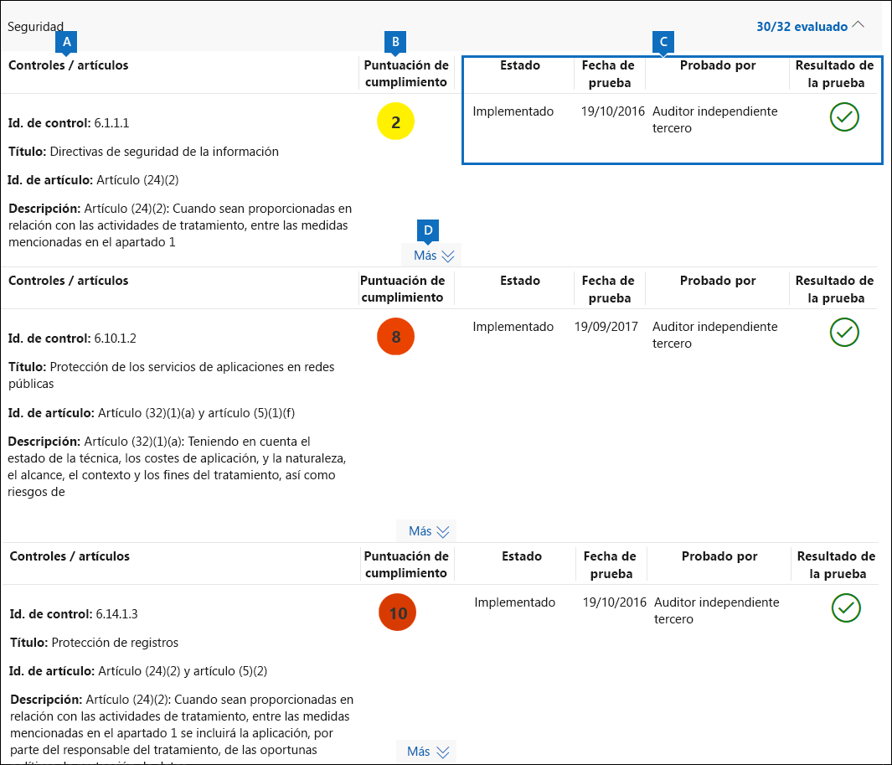
  
  a. Especifica la siguiente información de la certificación o reglamento asignado al control administrado por Microsoft.a. Specifies the following information from the certification or regulation that maps to the Microsoft-managed control.

  - **Id. de control**: el número de artículo o sección de la certificación o reglamento al que se asigna el control.**Control ID** - The section or article number from the certification or regulation that the control maps to.
    
  - **Título**: el título de la certificación o reglamento correspondiente.**Title** - The title from the corresponding certification or regulation.
    
  - **Id. de artículo**: este campo solo se incluye para evaluaciones del RGPD y especifica el número de artículo del RGPD correspondiente.**Article ID** - This field is included only for GDPR assessments, as it specifies the corresponding GDPR article number.
    
  - **Descripción**: texto de la norma o reglamento que se asigna al control administrado por Microsoft seleccionado.**Description** - Text of the standard or regulation that maps to the selected Microsoft-managed control.

  b. La puntuación de cumplimiento para el control, que indica el nivel de riesgo (debido al incumplimiento o error de control) asociado a cada control administrado por Microsoft. Para obtener más información, vea [Información sobre la puntuación de cumplimiento](#understanding-the-compliance-score). Tenga en cuenta que las puntuaciones de cumplimiento se califican de 1 a 10 y se codifican mediante colores. El color amarillo indica controles de riesgo bajo, el naranja indica controles de riesgo medio y el rojo indica controles de riesgo alto.b. The Compliance Score for the control, which indicates the level of risk (due to non-compliance or control failure) associated with each Microsoft-managed control. See [Understanding the Compliance Score](#understanding-the-compliance-score) for more information. Note that Compliance Scores are rated from 1 to 10 and are color-coded. Yellow indicates low risk controls, orange indicates medium-risk controls, and red indicated high-risk controls. 
    
  c. Información sobre el estado de la implementación de un control, la fecha en que se probó el control, quién realizó la prueba y el resultado de la prueba.c. Information about the implementation status of a control, the date the control was tested, who performed the test, and the test result.
    
  d. Por cada control, puede hacer clic en **Más** para ver información adicional, como detalles sobre la implementación de Microsoft del control y detalles sobre cómo un auditor externo independiente probó y validó el control.d. For each control, you can click **More** to see additional information, including details about Microsoft's implementation of the control and details about how the control was tested and validated by an independent third-party auditor. 
    
- **Controles administrados por el cliente**: esta es la colección de controles administrados por su organización. Su organización es responsable de implementar estos controles como parte de su proceso de cumplimiento para una norma o reglamento específicos. Los controles administrados por el cliente también se organizan en familias de controles para la certificación o reglamento correspondientes. Use los controles administrados por el cliente para implementar las acciones recomendadas sugeridas por Microsoft como parte de sus actividades de cumplimiento. Su organización puede usar la guía prescriptiva y las acciones de cliente recomendadas en cada control administrado por el cliente para administrar el proceso de evaluación e implementación de dicho control.**Customer-Managed Controls** - This is the collection of controls that are managed by your organization. Your organization is responsible for implementing these controls as part of your compliance process for a given standard or regulation. Customer-managed controls are also organized into control families for the corresponding certification or regulation. Use the customer-managed controls to implement the recommended actions suggested by Microsoft as part of your compliance activities. Your organization can use the prescriptive guidance and recommended Customer Actions in each customer-managed control to manage the implementation and assessment process for that control.
    
    Los controles administrados por el cliente en las evaluaciones también tienen integrada una función de administración de flujos de trabajo que puede usar para administrar y realizar un seguimiento del progreso de su organización en relación con la finalización de la evaluación. Por ejemplo, un responsable de cumplimiento normativo de su organización puede asignar una acción a un administrador de TI que tenga la responsabilidad y los permisos necesarios para realizar las acciones recomendadas para el control. Cuando se complete ese control, el administrador de TI puede cargar evidencias de sus tareas de implementación (por ejemplo, capturas de pantalla de configuración u opciones de directiva) y, después, volver a asignar la acción al responsable de cumplimiento normativo para que evalúe las evidencias recopiladas, pruebe la implementación del control y registre la fecha de implementación y los resultados de pruebas en el Administrador de cumplimiento. Para obtener más información, vea la sección [Administrar el proceso de evaluación en el artículo](#managing-the-assessment-process).Customer-managed controls in Assessments also have built-in workflow management functionality that you can use to manage and track your organization's progress towards completing the Assessment. For example, a Compliance Officer in your organization can assign an Action Item to an IT admin who has the responsibility and necessary permissions to perform the actions that are recommended for the control. When that work is complete, the IT admin can upload evidence of their implementation tasks (for example, screenshots of configuration or policy settings) and then assign the Action Item back to the Compliance Officer to evaluate the collected evidence, test the implementation of the control, and record the implementation date and test results in Compliance Manager. For more information, see the [Managing the assessment process](#managing-the-assessment-process) section in the article. 
  
## Permisos y control de acceso basado en rolesPermissions and role-based access control

El administrador de cumplimiento utiliza un modelo de permisos de control de acceso basado en roles.Compliance Manager uses a role-based access control permission model. Solo los usuarios a los que se les asigne un rol pueden acceder al administrador de cumplimiento, y las acciones permitidas por cada usuario están restringidas según el tipo de rol.Only users who are assigned a user role may access Compliance Manager, and the actions allowed by each user are restricted by role type.
  
Tenga en cuenta que ya no hay un rol predeterminado **acceso de invitado**Note that there is no longer a default **Guest access** role. Se debe asignar un rol a cada usuario para que tenga acceso y trabaje en administrador de cumplimientoEach user must be assigned a role in order to access and work within Compliance Manager.
  
En la tabla siguiente, se describen los permisos del Administrador de cumplimiento y las acciones que permite realizar al usuario. En la tabla, también se indica el rol al que se asigna cada permiso.The following table describes each Compliance Manager permission and what it allows the user do. The table also indicates the role that each permission is assigned to.
  
||**Lector del Administrador de cumplimiento****Compliance Manager Reader**|**Colaborador del Administrador de cumplimiento****Compliance Manager Contributor**|**Evaluador del Administrador de cumplimiento****Compliance Manager Assessor**|**Administrador del Administrador de cumplimiento****Compliance Manager Administrator**|**Administrador del portal****Portal Admin**|
|:-----|:-----|:-----|:-----|:-----|:-----|
|**Leer datos**: los usuarios pueden leer datos, pero no pueden editarlos.**Read data** - Users can read but not edit data.    |             |             |             |             |            |
|**Editar datos**: los usuarios pueden editar todos los campos, excepto “Resultado de la prueba” y “Fecha de la prueba”.**Edit data** - Users can edit all fields, except the Test Result and Test Date fields.    ||            |             |             |             |
|**Editar resultados de pruebas**: los usuarios pueden editar los campos “Resultado de la prueba” y “Fecha de la prueba”.**Edit test results** - Users can edit the Test Result and Test Date fields.    ||  |             |             |             |
|**Administrar evaluaciones**: los usuarios pueden crear, archivar y eliminar evaluaciones.**Manage assessments** - Users can create, archive, and delete Assessments.    |||  |             |             |
|**Administrar usuarios**: los usuarios pueden agregar a otros usuarios de su organización a los roles Lector, Colaborador, Evaluador y Administrador. Solo los usuarios con el rol Administrador global de su organización pueden agregar o quitar usuarios del rol Administrador del portal.  **Manage users** - Users can add other users in their organization to the Reader, Contributor, Assessor, and Administrator roles. Only those users with the Global Administrator role in your organization can add or remove users from the Portal Admin role.    ||||  |             |
   
## Información sobre la puntuación de cumplimientoUnderstanding the Compliance Score

En el tablero de instrumentos, el Administrador de cumplimiento muestra la puntuación total de las evaluaciones de Office 365 en la esquina superior derecha de la bandeja.On the Dashboard, Compliance Manager displays a total score for Office 365 assessments in the upper right-hand corner of the tile. Esta es la puntuación total de cumplimiento total de la evaluación, y es la acumulación de puntos recibidos por cada evaluación de control que ha sido calificada como Implementada y Probada en la evaluación.This is the overall total Compliance Score for the Assessment, and is the accumulation of points received for each control assessment that has been marked as Implemented and Tested in the Assessment. Al agregar una Valoración, verá que la puntuación de cumplimiento ya está activada hasta finalizar, debido a que ya se han aplicado los puntos para los controles administrados por Microsoft que han sido implementados además de ser probados y aplicados por terceros independientes.When adding an Assessment, you will see that the Compliance Score is already on the way towards completion because the points for the Microsoft-managed controls that have been implemented by Microsoft and tested by independent third parties are already applied.
  
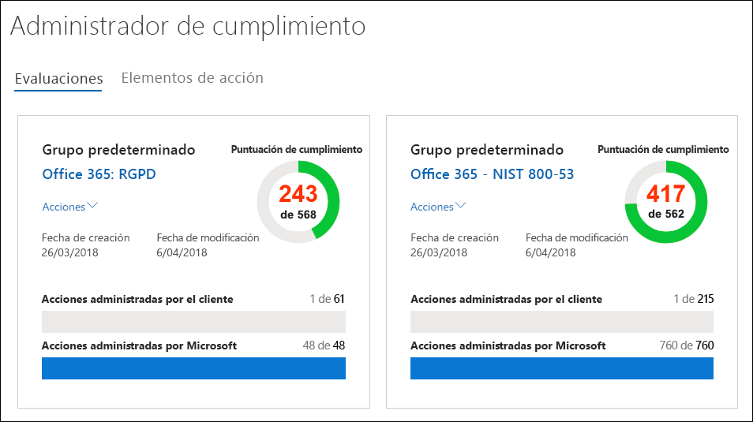
  
Los puntos restantes provienen de la evaluación correcta de controles de cliente y de la implementación y prueba de los controles administrados por el cliente, cada uno con un valor específico que contribuye a la puntuación de cumplimiento global.The remaining points come from the successful customer control assessment, from the implementation and testing of the customer-managed controls, each of which has a specific value that contributes to the overall compliance score. 
  
Cada evaluación muestra una puntuación de cumplimiento basada en el riesgo para ayudarle a evaluar el nivel de riesgo (debido a un incumplimiento o fallo de control) asociado con cada control (incluidos los controles administrados por Microsoft y los administrados por el cliente) en una evaluación.Each Assessment displays a risk-based Compliance Score to help you assess the level of risk (due to non-compliance or control failure) associated with each control (including both Microsoft managed and customer-managed controls) in an Assessment. Se asigna una cantidad de puntos posibles (denominada clasificación de gravedad) a todos los controles administrados por el cliente, con una escala de 1 a 10, donde se asignan más puntos a los controles asociados a un mayor factor de riesgo si el control produce errores, mientras que se asignan menos puntos a los controles con riesgo bajo.Each customer-managed control is assigned a possible number of points (called a  \*severity ranking) on a scale from 1 to 10, where more points are awarded for controls associated with a higher risk factor if the control fails, and fewer points are awarded for lower-risk controls. 
  
Por ejemplo, el control de evaluación “Administración de acceso de usuario” que se muestra abajo tiene una clasificación de riesgo de gravedad muy alta y se muestra un valor asignado de 10.For example, the User Access Management assessment control shown below has a very high severity risk ranking, and displays an assigned value of 10.
  
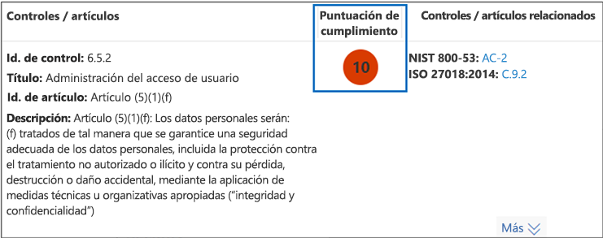
  
 En comparación, el control de evaluación “Copia de seguridad de la información” que se muestra abajo tiene una clasificación de riesgo de gravedad inferior y se muestra con un valor asignado de 3.By comparison, the Information Backup assessment control shown below has a lower severity risk ranking, and displays an assigned value of 3. 
  
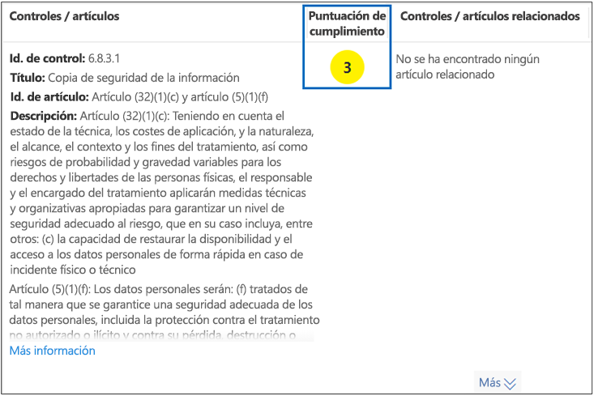
  
El Administrador de cumplimiento asigna una clasificación de gravedad predeterminada a cada control. Las clasificaciones de riesgos se calculan basándose en los criterios siguientes:The Compliance Manager assigns a default severity ranking to each control. Risk rankings are calculated based on the following criteria:
  
- Si un control evita que ocurran incidentes (clasificación más alta), detecta los incidentes que han ocurrido o soluciona el impacto de un incidente (clasificación más baja).Whether a control prevents incidents from happening (highest ranking), detects incidents that have happened, or corrects the impact of an incident (lowest ranking). En términos de clasificación de gravedad, a un control obligatorio que previene una amenaza se le asigna el mayor número de puntos; a los controles que son detectables o correctivos (independientemente de si son obligatorios o discrecionales) se les asigna el menor número de puntos.In terms of severity ranking, a mandatory control that prevents a threat is assigned the highest number of points; controls that are detective or corrective (regardless of whether they're mandatory or discretionary) are assigned the lowest number of points.
    
- Si un control (después de su implementación) es obligatorio y, por lo tanto, los usuarios no pueden omitirlo (por ejemplo, usuarios que tengan que restablecer la contraseña y que esta cumpla con requisitos de caracteres y longitud); o bien si un control es discrecional y los usuarios pueden omitirlo (por ejemplo, reglas empresariales que obligan a los usuarios a bloquear la pantalla cuando dejan el equipo sin supervisión).Whether a control (after it's been implemented) is mandatory and therefore can't be by-passed by users (for example, users having to reset their password and meet password length and character requirements) or discretionary and can be by-passed by users (for example, business rules that require users to lock their screens when their computers are unattended).
    
- Controles relacionados con riesgos de disponibilidad, integridad y confidencialidad de los datos, si estos riesgos provienen de amenazas internas o externas, y si la amenaza es malintencionada o accidental. Por ejemplo, los controles que impedirían que un atacante externo se introduzca en la red y obtenga acceso a información de identificación personal tendrían asignados más puntos que un control relacionado con impedir que un empleado configure por error un parámetro del enrutador de red que produzca una interrupción de la red.Controls related to risks to data confidentiality, integrity, and availability, whether these risks come from internal or external threats, and whether the threat is malicious or accidental. For example, controls that would help prevent an external attacker from breaching that network and gaining access to personally identifiable information would be assigned more points than a control related to preventing an employee from accidentally mis-configuring a network router setting that results in a network outage).
    
- Los riesgos relacionados con factores externos y jurídicos de cada control, como contratos, reglamentos y compromisos públicos.Risks related to legal and external drivers, such as contracts, regulations, and public commitments, for each control.
    
Los valores de puntuación de cumplimiento para el control se aplican *en su totalidad* en la puntuación de cumplimiento total basándose en una operación correcta o error (si el control se implementa y se completa correctamente la prueba de evaluación posterior o si no lo hace; no existe un crédito parcial para una implementación parcial). Solo se agregarán los puntos asignados a la puntuación de cumplimiento total cuando el **Estado de la implementación** del control se establezca en **Implementado** o **Implementación alternativa**, y el **Resultado de la prueba** se establezca en **Correcto**.The displayed Compliance Score values for the control are applied  *in their entirety*  to the Total Compliance Score on a pass/fail basis--either the control is implemented and passes the subsequent assessment test or it does not; there is no partial credit for a partial implementation. Only when the control has its **Implementation Status** set to **Implemented** or **Alternative Implementation** and the **Test Result** is set to **Passed** are the assigned points added to the Total Compliance Score. 
  
Lo más importante es que la puntuación de cumplimiento puede ayudarle a identificar los controles que tiene que implementar, porque le indica cuáles tienen un riesgo potencial más alto si se produce un error relacionado con el control.Most importantly, the Compliance Score can help you prioritize which controls to focus on for implementation by indicating which controls that have a higher potential risk if there is a failure related to a control. Además de la priorización basada en el riesgo, cuando los controles de la evaluación están relacionados con otros controles (ya sea dentro de la misma evaluación o en otra evaluación dentro de la misma agrupación de evaluaciones), si se completa con éxito un solo control, se puede conseguir una reducción significativa del esfuerzo basado en la sincronización de los resultados de las pruebas de control.In addition to risk-based prioritization, when assessment controls are related to other controls (either within the same assessment or in another assessment in the same assessment grouping), completing a single control successfully can result in a significant reduction of effort based on the synchronization of control test results.
  
Por ejemplo, en la imagen siguiente, la evaluación “Office 365: RGPD” se completó al 46 %, con 51 de 111 evaluaciones de control completadas para una puntuación de cumplimiento total de 289 de un máximo posible de 600.For example, in the image below we see that the Office 365 - GDPR Assessment is currently 46% assessed, with 51 of 111 control assessments completed for a Total Compliance score of 289 out of a possible 600.
  
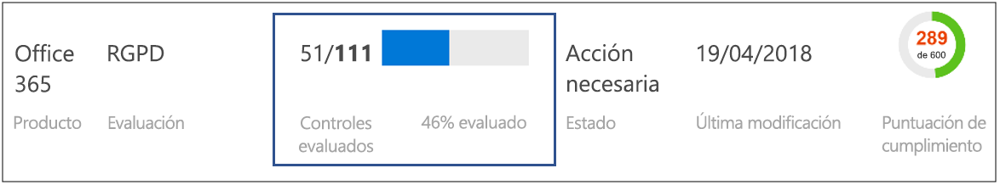
  
Dentro de la evaluación, el control de RGPD 7.5.5 está relacionado con otros 5 controles (7.4.1, 7.4.3, 7.4.4, 7.4.8 y 7.4.9) cada uno con una calificación de riesgo de gravedad moderada a alta de 6 o 8).Within the assessment GDPR control 7.5.5 is related to 5 other controls (7.4.1, 7.4.3, 7.4.4, 7.4.8, and 7.4.9) each with a moderate to high severity risk rating score of 6 or 8). Usando el filtro de evaluación, se han seleccionado todos estos controles, haciéndolos visibles en la vista de evaluación, y se puede ver a continuación que ninguno de ellos ha sido evaluado.Using the assessment filter, we have selected all of these controls, making them visible in the assessment view, and can see below that none of them have been assessed. 
  
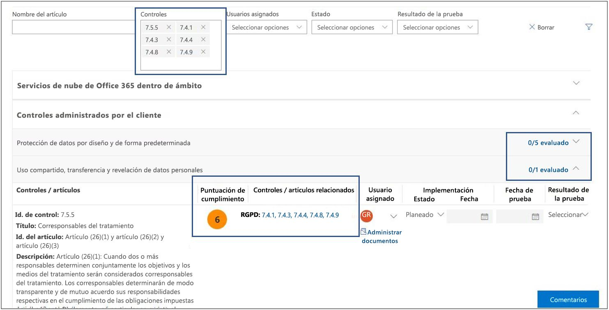 Como los seis controles están relacionados, al finalizar alguno de ellos, se sincronizarán esos resultados de pruebas en todos los controles relacionados de esta evaluación (así como en todos los controles relacionados en una evaluación que se encuentre en la misma agrupación de evaluaciones). Al finalizar la implementación y las pruebas del control 7.5.5 del RGPD, el área de detalle del control se actualiza para indicar que se evaluaron los seis controles, con un incremento correspondiente en el número de controles evaluados hasta 57 y el 51 % evaluados, y un cambio en la puntuación de cumplimiento total de +40.As those 6 controls are related, the completion of any one them will result in a synchronization of those test results across the related controls within this assessment (just as it will for any related controls in an assessment that is in the same assessment grouping). Upon completion of the implementation and testing of GDPR control 7.5.5, the control detail area refreshes to show that all 6 controls have been assessed, with a corresponding increase in the number of assessed controls to 57 and 51% assessed, and a change in total Compliance Score of +40. 
  
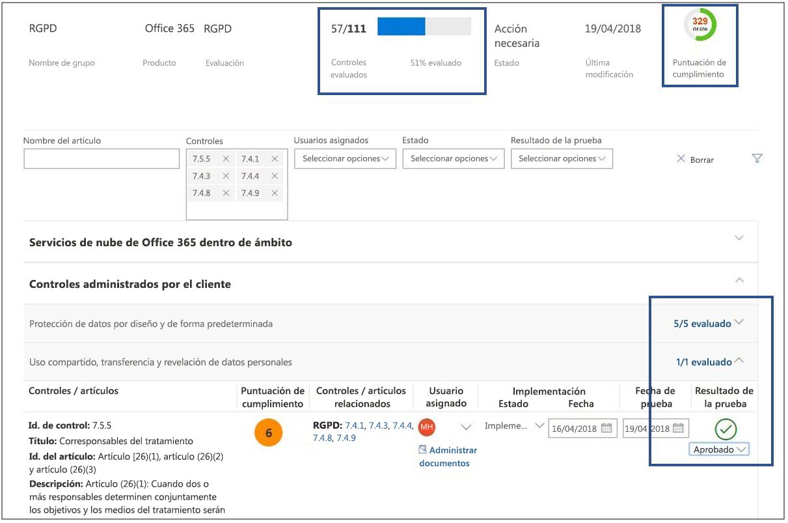
  
Este cuadro de diálogo de confirmación de la actualización se mostrará si va a cambiar el estado de la implementación de un control relacionado de forma que afecte al resto de los controles relacionados.This confirmation update dialog box will appear if you are about to change the Implementation Status of a related control in a way that will impact the other related controls.
  
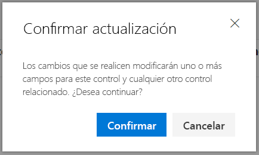
  
> [!NOTE]
> Actualmente, solo se incluye una puntuación de cumplimiento en las evaluaciones para los servicios en la nube de Office 365. En las evaluaciones para Azure y Dynamics, se muestra un estado de evaluación.Currently, only Assessments for Office 365 cloud services include a Compliance Score. Assessments for Azure and Dynamics show an assessment status. 

## Metodología de puntuación de cumplimientoCompliance Score methodology

La puntuación de cumplimiento, al igual que Microsoft Secure Score, es similar a otros sistemas de puntuación basada en el comportamiento; la actividad de su organización puede incrementar su puntuación de cumplimiento si realiza actividades relacionadas con la seguridad, privacidad y protección de datos.The Compliance Score, like the Microsoft Secure Score, is similar to other behavior-based scoring systems; your organization's activity can increase its Compliance Score by performing activities related to data protection, privacy, and security.
  
> [!NOTE]
> La puntuación de cumplimiento no indica una medida absoluta de cumplimiento organizativo con cualquier norma o reglamento específico. Expresa el alcance hasta el que se adoptaron controles que pueden reducir los riesgos en la privacidad individual y los datos personales. Ningún servicio puede garantizar que cumpla con una norma o reglamento y, además, la puntuación de cumplimiento no puede interpretarse como una garantía en ningún caso.The Compliance Score does not express an absolute measure of organizational compliance with any particular standard or regulation. It expresses the extent to which you have adopted controls which can reduce the risks to personal data and individual privacy. No service can guarantee that you are compliant with a standard or regulation, and the Compliance Score should not be interpreted as a guarantee in any way. 
  
Las evaluaciones del Administrador de cumplimiento se basan en el modelo de responsabilidad compartida para la informática en la nube. En el modelo de responsabilidad compartida, Microsoft y cada cliente comparten la responsabilidad para la protección de los datos de los clientes cuando los datos se almacenan en nuestra nube.Assessments in Compliance Manager are based on the shared responsibility model for cloud computing. In the shared responsibility model, Microsoft and each customer share responsibility for the protection of the customer's data when that data is stored in our cloud.
  
Como se muestra en la Evaluación de RGPD de Office 365 a continuación, Microsoft y los clientes son responsables de realizar diferentes acciones que están diseñadas para cumplir los requisitos del reglamento o estándar que se evaluará.As shown in the Office 365 GDPR Assessment below, Microsoft and customers are each responsible for performing a variety of Actions that are designed to satisfy the requirements of the standard or regulation being assessed. Racionalizar y comprender lo que se requiere.To rationalize and understand the required. Actuando a través de una variedad de estándares y regulaciones, el Administrador de Cumplimiento trata todos los estándares y reglamentos como si fueran marcos de control.Actions across a variety of standards and regulations, Compliance Manager treats all standards and regulations as if they were control frameworks. Por tanto, las acciones realizadas por Microsoft y por clientes para cada evaluación implican la implementación y la validación de los distintos controles.Thus, the Actions performed by Microsoft and by customers for each Assessment involve the implementation and validation of various controls.
  
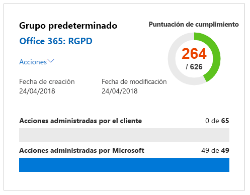
  
Este es el flujo de trabajo básico para una acción típica:Here's the basic workflow for a typical Action:
  
1. El responsable de cumplimiento, riesgo, privacidad o protección de datos de una organización asigna la tarea a un miembro de la organización para implementar un control. Esa persona puede ser:The Compliance, Risk, Privacy, and/or Data Protection Officer of an organization assigns the task to someone in the organization to implement a control. That person could be:

    - Un propietario de la directiva de la empresaA business policy owner
    
    - Un implementador de TIAn IT implementer
    
    - Otra persona de la organización que tenga responsabilidad para realizar la tareaAnother individual in the organization who has responsibility for performing the task
    
2. Esa persona realiza las tareas necesarias para implementar el control, carga evidencias de implementación en el Administrador de cumplimiento y marca como implementados los controles vinculados a la acción. Una vez completadas las tareas, asigna la acción a un evaluador para su validación. Los evaluadores pueden ser:That individual performs the tasks necessary to implement the control, uploads evidence of implementation into Compliance Manager, and marks the control(s) tied to the Action as implemented. Once these tasks are completed, they assign the Action to an Assessor for validation. Assessors can be:
    
    - Evaluadores internos que realicen la validación de controles dentro de una organización.Internal assessors that perform validation of controls within an organization
    
    - Evaluadores externos que examinen, verifiquen y certifiquen el cumplimiento, como las organizaciones independientes de terceros que auditan los servicios en la nube de Microsoft.External assessors that examine, verify, and certify compliance, such as the third-party independent organizations that audit Microsoft's cloud services
    
3. El evaluador valida el control, examina las evidencias y marca los controles como evaluados, además de indicar los resultados de una evaluación (por ejemplo, correcta).The Assessor validates the control and examines the evidence and marks the control(s) as assessed and the results of the assessment (e.g., passed).
    
Después de evaluar todos los controles asociados con una evaluación, esta se considerará completada.Once all the controls associated with an Assessment have been assessed, the Assessment is considered completed.
  
En cada evaluación del Administrador de cumplimiento, se carga previamente información que proporciona detalles sobre las acciones realizadas por Microsoft para cumplir con los requisitos de los controles de los que Microsoft es responsable. En esta información, se incluyen detalles sobre cómo Microsoft implementó cada control y cómo un auditor externo evaluó y verificó la implementación realizada por Microsoft. Por este motivo, los controles administrados por Microsoft para cada evaluación se marcan como evaluados y la puntuación de cumplimiento para la evaluación refleja esto.Every Assessment in Compliance Manager comes pre-loaded with information that provides details about the Actions taken by Microsoft to satisfy the requirements of the controls for which Microsoft is responsible. This information includes details about how Microsoft has implemented each control and how and when Microsoft's implementation was assessed and verified by a third-party auditor. For this reason, the Microsoft Managed Controls for each Assessment are marked as Assessed, and the Compliance Score for the Assessment reflects this.
  
En cada evaluación, se incluye una puntuación de cumplimiento total basada en el modelo de responsabilidad compartida. La implementación y prueba de controles para Office 365 realizada por Microsoft contribuye a una parte del total posible de puntos asociados a una evaluación del RGPD. Cuando el cliente implemente y pruebe cada una de las acciones de cliente, la puntuación de cumplimiento de la evaluación se incrementará por el valor asignado al control.Each Assessment includes a total Compliance Score based on the shared responsibility model. Microsoft's implementation and testing of controls for Office 365 contributes a portion of the total possible points associated with a GDPR assessment. As the customer implements and tests each of the customer Actions, the Compliance Score for the Assessment will increase by the value assigned to the control. 
  
 ### Metodología de puntuación basada en riesgosRisk-based scoring methodology
  
El Administrador de cumplimiento usa una metodología de puntuación basada en riesgos con una escala de 1 a 10 que asigna un valor superior a los controles que representan un mayor riesgo en caso de que el control produzca errores o no cumpla los requisitos. El sistema de calificación usado por la puntuación de cumplimiento se basa en varios factores clave, como los siguientes:Compliance Manager uses a risk-based scoring methodology with a scale from 1-10 that assigns a higher value to controls that represent a higher risk in the event the control fails or is non-compliant. The scoring system used by Compliance Score is based on several key factors, such as:
  
- La esencia del controlThe essence of the control
    
- El nivel de riesgo del control basado en los tipos de amenazasThe level of risk of the control based on the kinds of threats
    
- Los factores externos del controlThe external drivers for the control
    
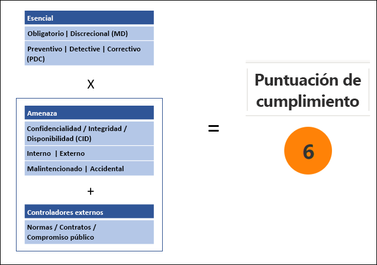
  
 ### Esencia del controlEssence of the control
  
La esencia del control depende de si el control es obligatorio o discrecional, y si es preventivo, de investigación o correctivo.The essence of the control is based on whether the control is Mandatory or Discretionary, and whether it is Preventative, Detective, or Corrective.
  
 ### Obligatorio o discrecionalMandatory or discretionary
  
 Los *controles obligatorios* son controles que no se pueden omitir, ya sea de forma intencionada o por error. Un ejemplo de un control obligatorio común es una directiva de contraseñas administrada centralmente que establece requisitos de longitud, complejidad y expiración de contraseñas. Los usuarios tienen que cumplir con estos requisitos para obtener acceso al sistema.*Mandatory controls*  are controls that cannot be bypassed either intentionally or accidentally. An example of a common mandatory control is a centrally-managed password policy that sets requirements for password length, complexity, and expiration. Users must comply with these requirements in order to access the system. 
  
 Los *controles discrecionales* dependen de que los usuarios comprendan la directiva y actúen en consecuencia. Por ejemplo, una directiva que exija a los usuarios bloquear su equipo cuando lo dejen desatendido es un control discrecional, ya que depende del comportamiento del usuario.*Discretionary controls*  rely upon users to understand policy and act accordingly. For example, a policy requiring users to lock their computer when they leave it is a discretionary control because it relies on the user. 
  
 ### Preventivo, de investigación o correctivoPreventative, detective, or corrective
  
 Los *controles preventivos* son los que impiden riesgos específicos. Por ejemplo, proteger la información en reposo con cifrado es un control preventivo frente a ataques, infracciones, etc. La separación de las responsabilidades es un control preventivo para administrar conflictos de intereses y proteger contra el fraude.*Preventative controls*  are those that prevent specific risks. For example, protecting information at rest using encryption is a preventative control against attacks, breaches, etc. Separation of duties is a preventative control to manage conflict of interest and to guard against fraud. 
  
 Los *controles de investigación* son aquellos que supervisan de forma activa los sistemas para identificar comportamientos o condiciones irregulares que representen un riesgo, o bien pueden usarse para detectar intrusiones o determinar si se produjo una infracción. La auditoría de acceso del sistema y la auditoría de acciones administrativas con privilegios elevados son tipos de controles de supervisión de investigación; las auditorías de cumplimiento reglamentario son un tipo de control identificativo usado para encontrar problemas de procesos.*Detective controls*  are those that actively monitor systems to identify irregular conditions or behaviors that represent risk or that can be used to detect intrusions or determine if a breach has occurred. System access auditing and privileged administrative actions auditing are types of detective monitoring controls; regulatory compliance audits are a type of detective control used to find process issues. 
  
 Los *controles correctivos* son los que intentan contener los efectos adversos de un incidente de seguridad a un mínimo, realizar acciones correctivas para reducir el efecto inmediato y, si es posible, revertir los daños. Una respuesta a un incidente de privacidad es un control correctivo para limitar los daños y restaurar los sistemas a un estado operativo después de una infracción.*Corrective controls*  are those that try to keep the adverse effects of a security incident to a minimum, take corrective action to reduce the immediate effect, and reverse the damage, if possible. Privacy incident response is a corrective control to limit damage and restore systems to an operational state after a breach. 
  
Al evaluar cada control con estos factores, determinamos la esencia del control y le asignamos un valor relativo al riesgo que representa.By evaluating each control using these factors, we determine the essence of the control and assign it a value relative to the risk that it represents.
  
 **Amenaza****Threat**
  
| | | |
|:-----|:-----|:-----|
||**Obligatorio****Mandatory**   |**Discrecional****Discretionary**   |
|**Preventivo****Preventative**   |Riesgo altoHigh risk    |Riesgo medioMedium risk    |
|**Investigación****Detective**   |Riesgo medioMedium risk    |Riesgo bajoLow risk    |
|**Correctivo****Corrective**   |Riesgo medioMedium risk    |Riesgo bajoLow risk    |
   
Una amenaza hace referencia a cualquier acción que implica un riesgo para el estándar de seguridad básico y aceptado universalmente basado en tres factores: confidencialidad, integridad y disponibilidad:Threat refers to anything that poses a risk to the fundamental, universally-accepted security standard known as the CIA triad for data: Confidentiality, Integrity, and Availability:
  
- Confidencialidad significa que solo las partes autorizadas y de confianza pueden leer y comprender la información.Confidentiality means that information can be read and understood only by trusted, authorized parties.
    
- Integridad quiere decir que partes no autorizadas no modificaron ni destruyeron la información.Integrity means that information has not been modified or destroyed by unauthorized parties.
    
- Disponibilidad quiere decir que puede obtener acceso a la información fácilmente con un nivel elevado de calidad de servicio.Availability means that information can be accessed readily with a high level of quality of service.
    
Un error en cualquiera de estas características se considera un peligro para el sistema en su totalidad. Las amenazas pueden provenir tanto de orígenes internos como externos, y la intención del actor puede ser accidental o malintencionada. Estos factores se calculan en una matriz de amenazas que asigna niveles de amenaza alto, moderado o bajo a cada combinación de escenarios.A failure of any of these characteristics is considered a compromise of the system as a whole. Threats can come from both internal and external sources, and an actor's intent can be accidental or malicious. These factors are estimated in a threat matrix that assigns threat levels of either High, Moderate, or Low to each combination of scenarios.

| |**Interna****Internal** | |**Externa****External** | | | |
|:-----|:-----|:-----|:-----|:-----|:-----|:-----|
||*Malintencionada**Malicious* |*Accidental**Accidental* |*Malintencionada**Malicious* |*Accidental**Accidental* |||
|**Confidencialidad****Confidentiality** |(A, M o B)(H, M, or L)    |(A, M o B)(H, M, or L)    |(A, M o B)(H, M, or L)    |(A, M o B)(H, M, or L)|
|**Integridad****Integrity** |(A, M o B)(H, M, or L)    |(A, M o B)(H, M, or L)    |(A, M o B)(H, M, or L)    |(A, M o B)(H, M, or L)|
|**Disponibilidad****Availability** |(A, M o B)(H, M, or L)    |(A, M o B)(H, M, or L)    |(A, M o B)(H, M, or L)    |(A, M o B)(H, M, or L)|
   
 **Factores externos****External drivers**
  
|**Contratos****Contracts**|**Reglamentos****Regulations**|**Compromisos públicos****Public commitments**|
|:-----|:-----|:-----|
|(A, M o B)(H, M, or L)    |(A, M o B)(H, M, or L)    |(A, M o B)(H, M, or L)    |
   
Los factores externos (como los compromisos públicos, contratos y reglamentos vigentes) pueden afectar a los controles diseñados para proteger los datos e impedir infracciones de datos, y se asignan valores de riesgo alto, moderado o bajo a cada uno de estos factores.External factors such as applicable regulations, contracts, and public commitments can influence controls designed to protect data and prevent data breaches, and each of these factors are assigned risk values or High, Moderate or Low.
  
El número estimado de repeticiones de estos valores de riesgo de alto, moderado o bajo en los 15 posibles escenarios de riesgos representados en la matriz de Estándar de seguridad/Amenaza y jurídico/factores externos se combinan para proporcionar una ponderación de riesgos, que tiene en cuenta la probabilidad y el número de repeticiones de riesgos con un valor asignado como importante, y se consideran al calcular la clasificación de gravedad del control.The estimated number of occurrences of these risk values of High, Moderate, or Low across the 15 possible risk scenarios represented in the CIA/Threat and Legal/External Drivers are combined to provide a risk weighting, which considers the likelihood and number of occurrences of risks at a given value as significant and is taken into consideration when calculating the severity ranking of the control.
  
Basándose en la clasificación de gravedad del control, se asignará un valor de puntuación de cumplimiento entre 1 (bajo) y 10 (alto), agrupados en las siguientes categorías de riesgos:Based on the control's severity ranking, the control is assigned its compliance score value, a number between 1 (low) and 10 (high), grouped into the following categories of risk:
  
|**Nivel de riesgo****Risk level**|**Valor del control****Control value**|
|:-----|:-----|
|BajoLow    |1-31-3    |
|ModeradoModerate    |66    |
|AltoHigh    |88    |
|GraveSevere    |1010    |
   
Al dar prioridad a los controles de evaluación con los valores de puntuación de cumplimiento más elevados, la organización se centrará en los elementos de mayor riesgo y recibirá una respuesta más positiva proporcionalmente, ya que se agregarán más puntos a la puntuación de cumplimiento total por la evaluación completada de cada control.By prioritizing assessment controls with the highest compliance score values, the organization will be concentrating on the highest risk items and receive proportionally higher positive feedback in the form of more points added to the total compliance score for the assessment for each control assessment completed.
  
### Resumen de la metodología de puntuaciónSummary of scoring methodology
  
La puntuación de cumplimiento es un componente básico de la forma en que el Administrador de cumplimiento ayuda a las organizaciones a comprender y administrar su cumplimiento. La puntuación de cumplimiento de una evaluación es una expresión del cumplimiento de la compañía en relación con una norma o reglamento como un número que, cuanto mayor sea la puntuación (hasta el número máximo de puntos asignados para la evaluación), mejor será la posición ante el cumplimiento de la compañía. Comprender la metodología de puntuación de cumplimiento en la que se asignan valores de gravedad de riesgo entre 1 y 10 (de menor a mayor) a los controles de evaluación y cómo se suman las evaluaciones de control completadas a la puntuación de cumplimiento total es esencial para que las organizaciones puedan priorizar sus acciones.The Compliance Score is a core component of the way that Compliance Manager helps organizations understand and manage their compliance. The Compliance Score for an assessment is an expression of the company's compliance with a given standard or regulation as a number, where the higher the score (up to the maximum number of points allocated for the Assessment), the better the company's compliance posture. Understanding the compliance scoring methodology in which assessment controls are assigned risk severity values between 1- 10 (low to high), and how completed control assessments add to the total compliance score is crucial to organizations for prioritizing their actions.

## Agrupación de evaluacionesGrouping Assessments

Al crear una evaluación, se le pide que cree un grupo al que asignarla o que la asigne a un grupo existente.When you create a new Assessment, you're prompted to create a group to assign the Assessment to or assign the Assessment to an existing group. Los grupos le permiten organizar lógicamente las evaluaciones, así como compartir información común y tareas de flujo de trabajo entre las evaluaciones que tienen los mismos controles administrados por cliente (o relacionados).Groups allow you to logically organize Assessments and share common information and workflow tasks between Assessments that have the same or related customer-managed controls.
  
Por ejemplo, puede agrupar evaluaciones por año, equipos, departamentos o agencias dentro de su organización. Estos son algunos ejemplos de grupos y las evaluaciones que pueden contener.For example, you could group Assessments by year or teams, departments, or agencies within your organization or group them by year. Here are some examples of groups and the Assessments they might contain.
  
- Evaluaciones del RGPD: 2018GDPR Assessments — 2018
    
  - Office 365 + RGPDOffice 365 + GDPR
    
  - Azure + RGPDAzure + GDPR
    
  - Dynamics + RGPDDynamics + GDPR
    
- Evaluaciones de Azure: 2018Azure Assessments — 2018
    
  - Azure + RGPDAzure + GDPR
    
  - Azure + ISO 27001:2013Azure + ISO 27001:2013
    
  - Azure + ISO 27018:2014Azure + ISO 27018:2014
    
- Evaluaciones de privacidad y seguridad de los datosData Security and Privacy Assessments
    
  - Office 365 + ISO 27001:2013Office 365 + ISO 27001:2013
    
  - Office 365 + ISO 27018:2014Office 365 + ISO 27018:2014
    
  - Azure + ISO 27001:2013Azure + ISO 27001:2013
    
  - Azure + ISO 27018:2014Azure + ISO 27018:2014
    
> [!TIP]
> Le recomendamos que determine una estrategia de agrupación para su organización antes de agregar nuevas evaluaciones.We recommend that your determine a grouping strategy for your organization before adding new assessments. 
  
Estos son los requisitos para agrupar evaluaciones:These are the requirements for grouping Assessments:
  
- Los nombres de grupo (también denominados \*id. de grupo) tienen que ser únicos en la organización.Group names (also called  \*Group IDs) must be unique within your organization. 
    
- Los grupos pueden contener evaluaciones para la misma certificación o reglamento, pero cada grupo solo puede contener una evaluación para par específico de certificación o servicio en la nube. Por ejemplo, un grupo no puede contener dos evaluaciones para Office 365 y el RGPD. De forma similar, un grupo puede contener varias evaluaciones para el mismo servicio en la nube, siempre que el reglamento o certificación correspondiente para cada uno sea distinto.Groups can contain Assessments for the same certification/regulation, but each group can only contain one Assessment for a specific cloud service/certification pair. For example, a group can't contain two Assessments for Office 365 and GDPR. Similarly, a group can contain multiple Assessments for the same cloud service as long as the corresponding certification/regulation for each one is different.
    
Después de agregar una evaluación a una agrupación de evaluaciones, la agrupación no se puede modificar.Once an assessment has been added to an assessment grouping, the grouping cannot be changed. Puede cambiar el nombre del grupo de evaluaciones, lo que cambiará el nombre de la agrupación de evaluaciones de todas las evaluaciones asociadas con ese grupo.You can rename the assessment group, which changes the name of the assessment grouping for all of the assessments associated with that group. Puede crear una evaluación y un grupo de evaluaciones, y copiar la información de una evaluación existente, lo que creará un duplicado de esa evaluación y otro grupo de evaluaciones.You can create an assessment and a new assessment group and copy information from an existing assessment, which effectively creates a duplicate of that assessment in a different assessment group. El archivado de una evaluación rompe la relación entre dicha evaluación y el grupo de evaluación.Archiving an assessment breaks the relationship between that assessment and the assessment group. Cualquier otra actualización de evaluaciones relacionadas no se verá reflejada en la evaluación archivada.Any further updates to other related assessments are no longer reflected in the archived assessment.
  
Como se ha explicado anteriormente, una de las ventajas más importantes de los grupos se hace patente cuando dos evaluaciones diferentes del mismo grupo comparten un control administrado por el cliente (y, por lo tanto, las acciones de cliente son las mismas para cada control). Así, la cumplimentación de los detalles de la implementación, la información de pruebas y el estado del control en una evaluación se sincroniza con el mismo control de cualquier otra evaluación del grupo.As previous explained, one key advantage of using groups is that when two different Assessments in the same group share the same customer-managed control (and therefore the customer actions would be the same for each control), then the completion of implementation details, testing information, and status for the control in one Assessment would be synchronized to the same control in any other Assessment in the group. Es decir, si las evaluaciones comparten un control y están en el mismo grupo, solo tendrá que administrar el proceso de evaluación de un control.In other words, if Assessments share the same control and those Assessments are in the same group, you'd only have to manage the assessment process for the control in one Assessment. Los resultados de ese control se sincronizarán automáticamente con otras evaluaciones.The results for that control will be automatically synchronized to other Assessments. Por ejemplo, ISO 27001 e ISO 27018 tienen un control relacionado con las directivas de contraseñas.For example, ISO 27001 and ISO 27018 both have a control related to password policies. Si el Estado de la prueba del control es "Correcto" o "Superado" en una evaluación, el control se actualiza (y se marca como "Correcto" o "Superado") en la otra, siempre que ambas evaluaciones formen parte del mismo grupo de evaluaciones.If the Test Status for the control is set to "Passed" in one Assessment, the control is updated (and marked as "Passed") in the other Assessment, as long as both assessments are part of the same Assessment Group.
  
Tomemos como ejemplo estos dos controles de evaluación relacionados, cada uno vinculado con el cifrado de datos en redes públicas, el control 6.10.1.2 en la evaluación del RGPD de Office 365, y el control SC-13 en la evaluación Office 365 - NIST 800-53.As an example of this, consider these two related assessment controls, each having to do with encryption of data on public networks, control 6.10.1.2 in the Office 365 — GDPR assessment, and control SC-13 in the Office 365 — NIST 800-53 assessment. Estos son controles de evaluación relacionados, en dos evaluaciones distintas, ambas en el grupo predeterminado.These are related assessment controls, in two different assessments, both in the Default Group. Inicialmente, ninguna evaluación completa evaluaciones de control de cliente, ya que estas dos evaluaciones se muestran en el Panel del Administrador de cumplimiento.Initially, neither assessment has completed any customer control assessments, as is displayed on the Compliance Manager Dashboard that shows these two Assessments.
  
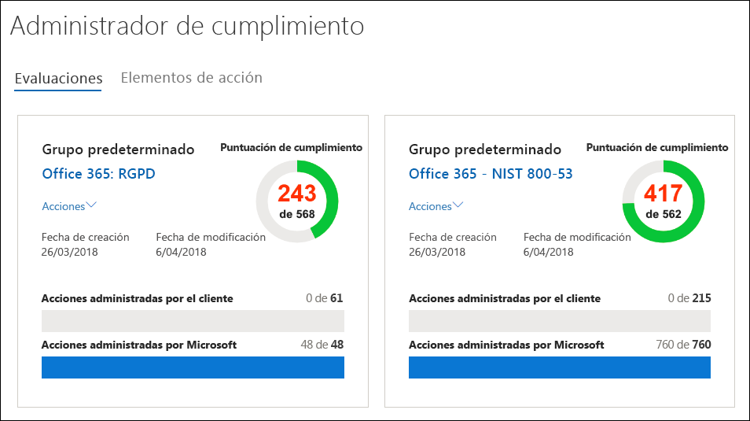
  
Al hacer clic en la evaluación **Office 365: RGPD** y usar los controles de filtro para ver el control del RGPD 6.10.1.2, vemos que el control SC-13 de NIST 800-53 se muestra como un control relacionado.By clicking the **Office 365 — GDPR** assessment, and using the filter controls to view GDPR control 6.10.1.2, we see that NIST 800-53 control SC-13 is listed as a related control.
  
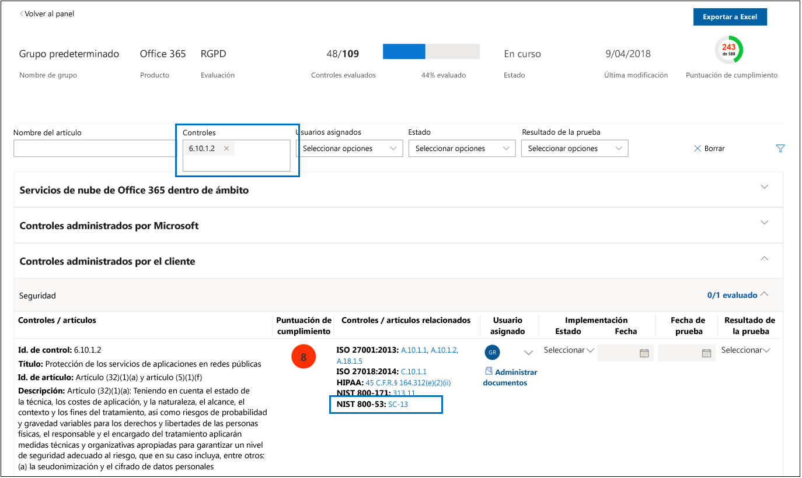
  
 Aquí se muestra la finalización de la implementación y pruebas del control del RGPD 6.10.1.2.Here we show the completion of the implementation and testing of GDPR control 6.10.1.2. 
  
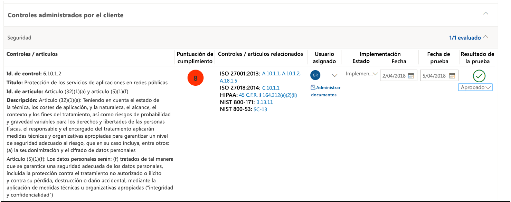
  
Al navegar al control relacionado en la evaluación agrupada, vemos que el SC-13 de NIST 800-53 también se marcó como completado con la misma fecha y hora, sin ningún esfuerzo de pruebas o implementación.By navigating to the related control in the grouped assessment, we see that NIST 800-53 SC-13 has also been marked as completed with the same date and time, with no additional implementation or testing effort.
  
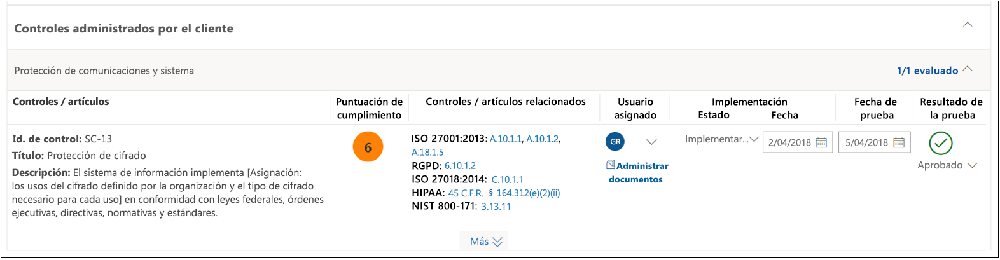
  
De nuevo en el panel, podemos ver que cada evaluación tiene una evaluación de control completada y que la puntuación de cumplimiento total de cada evaluación se incrementó en ocho (el valor de la puntuación de cumplimiento del control compartido).Back at the Dashboard, we can see that each assessment has one control assessment completed and that the total Compliance Score for each assessment has increased by 8 (the compliance score value of that shared control).
  
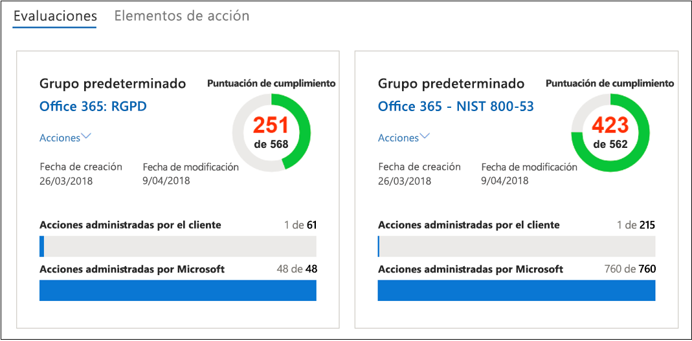

## Funciones administrativasAdministrative functions

Hay funciones administrativas específicas que solo están disponibles en la cuenta de administrador del espacio empresarial y solo serán visibles al iniciar sesión como administrador global.There are specific administrative functions that are only available to the tenant administrator account, and will only be visible when logged in as a global administrator.
  
> [!NOTE]
> El permiso “Acceso a documentos restringidos” en la lista desplegable permitirá a los administradores conceder a los usuarios acceso a documentos restringidos que Microsoft comparte en el Portal de confianza de servicios. La característica “Documentos restringidos” no está disponible actualmente, pero lo estará próximamente.The Access to Restricted Documents permission in the drop-down list will allow administrators to give users access to restricted documents that Microsoft shares on the Service Trust Portal. The Restricted Documents feature isn't available, but is coming soon. 
  
### Asignar roles del Administrador de cumplimiento a usuariosAssigning Compliance Manager roles to users

Cada rol del Administrador de cumplimiento tiene permisos ligeramente distintos. Puede ver los permisos asignados a cada rol, ver qué usuarios se encuentran en cada rol y agregar o quitar usuarios de ese rol mediante el Portal de confianza de servicios; para hacerlo, seleccione el elemento de menú **Administrador** y, después, haga clic en **Configuración**.Each Compliance Manager role has slightly different permissions. You can view the permissions assigned to each role, see which users are in which roles, and add or remove users from that role through the Service Trust Portal by selecting the **Admin** menu item, and then choosing **Settings**. 
  

  
Para agregar o quitar usuarios de los roles del Administrador de cumplimiento.To add or remove users from Compliance Manager roles.
  
1. Vaya a [https://servicetrust.microsoft.com](https://servicetrust.microsoft.com).Go to [https://servicetrust.microsoft.com](https://servicetrust.microsoft.com).
    
2. Inicie sesión con su cuenta de administrador global de Azure Active Directory.Sign in with your Azure Active Directory global administrator account.
    
3. En la barra de menús superior del Portal de confianza de servicios, haga clic en **Administrador** y, después, seleccione **Configuración**.On the Service Trust Portal top menu bar, click **Admin** and then choose **Settings**. 
    
4. En la lista desplegable **Seleccionar rol**, haga clic en el rol que quiera administrar.In the **Select Role** drop-down list, click the role that you want to manage. 
    
5. Los usuarios agregados a cada rol se muestran en la página **Seleccionar rol**.Users added to each role are listed on the **Select Role** page. 
    
6. Para agregar usuarios al rol, haga clic en **Agregar**. En el cuadro de diálogo **Agregar usuarios**, haga clic en el campo del usuario. Puede desplazarse por la lista de usuarios disponibles, o bien puede empezar a escribir el nombre de usuario para filtrar la lista según el término de búsqueda. Haga clic en el usuario para agregar esa cuenta a la lista **Agregar usuarios** que se aprovisionarán con ese rol. Para agregar varios usuarios de forma simultánea, empiece a escribir un nombre de usuario para filtrar la lista y, después, haga clic en el usuario para agregarlo a la lista. Haga clic en **Guardar** para aprovisionar el rol seleccionado a esos usuarios.To add users to this role, click **Add**. In the **Add Users** dialog, click the user field. You can scroll through the list of available users or begin typing the user name to filter the list based on your search term. Click the user to add that account to the **Add Users** list to be provisioned with that role. If you would like to add multiple users concurrently, begin typing a user name to filter the list, and then click the user to add to the list. Click **Save** to provision the selected role to these users. 
    
    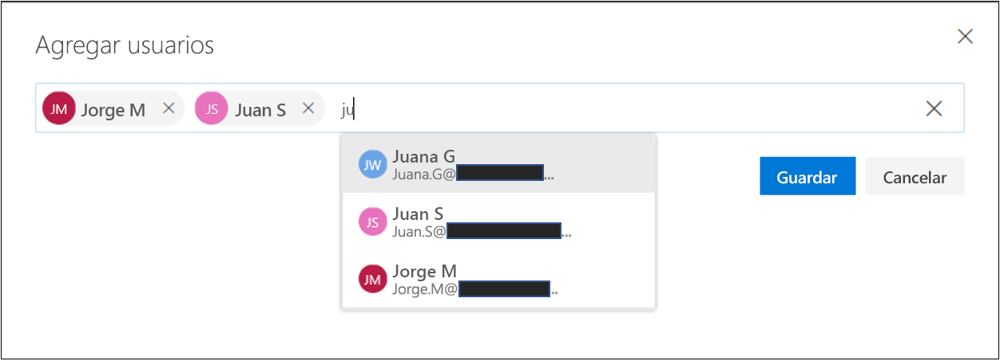
  
7. Para quitar usuarios de este rol, seleccione los usuarios y, después, haga clic en **Eliminar**.To remove users from this role, select the user(s) and click **Delete**. 
    
    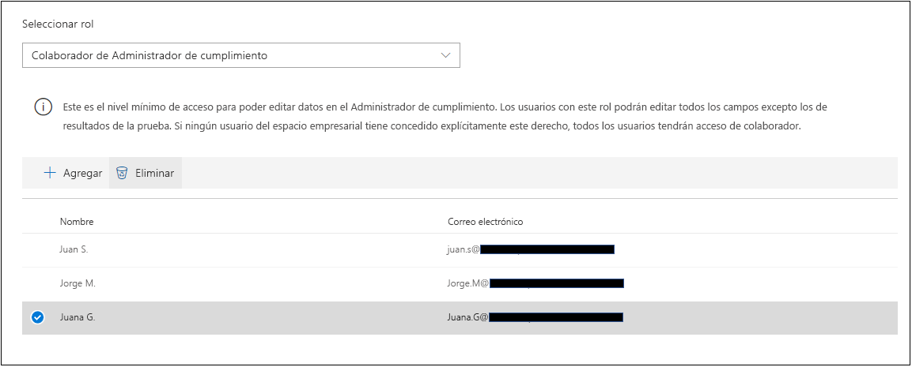
 
## Configuración de privacidad del usuarioUser Privacy settings

Algunos reglamentos exigen que una organización pueda eliminar los datos de historial de usuario. Para facilitar esto, el Administrador de cumplimiento proporciona las funciones de **Configuración de privacidad del usuario**, que permiten a los administradores:Certain regulations require that an organization must be able to delete user history data. To enable this, Compliance Manager provides the **User Privacy Settings** functions, that allow administrators to: 
  
- [Buscar un usuarioSearch for a user](#search-for-a-user)

- [Exportar un informe de historial de datos de cuentaExport a report of account data history](#export-a-report-of-account-data-history)

- [Reasignar accionesReassign action items](#reassign-action-items)

- [Eliminar el historial de datos de usuariosDelete user data history](#delete-user-data-history)
    
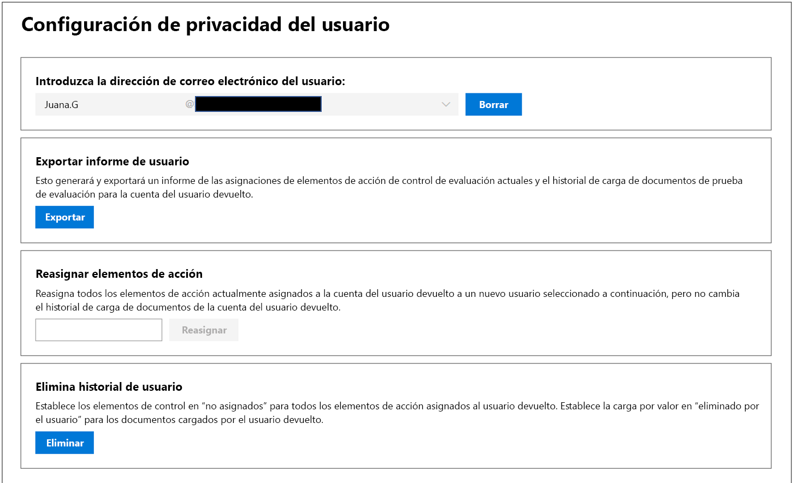
  
### Buscar un usuarioSearch for a user

Para buscar una cuenta de usuario:To search for a user account:
  
1. Especifique la dirección de correo electrónico del usuario escribiendo el alias (la información a la izquierda del símbolo @) y elija el nombre de dominio haciendo clic en la lista de sufijos de dominios a la derecha.Enter the user email address by typing in the alias (the information to the left of the @ symbol) and choosing the domain name by clicking the domain suffix list on the right. Si este es un espacio empresarial con varios dominios registrados, puede volver a comprobar el sufijo de nombre de dominio de dirección de correo electrónico para asegurarse de que es correcto.If this is tenant with multiple registered domains, you can double check the email address domain name suffix to ensure that it is correct.
    
2. Después de especificar correctamente el nombre de usuario, haga clic en **Buscar**.When you have the username correctly entered, click **Search**. 
    
3. Si no se encuentra la cuenta de usuario, se mostrará el mensaje de error “Usuario no encontrado” en la página. Compruebe la información de la dirección de correo electrónico del usuario, realice las correcciones necesarias y haga clic en **Buscar** para volver a intentarlo.If the user account is not found, the error message 'User not found' will be displayed on the page. Check the user's email address information, make corrections as necessary and click **Search** to try again. 
    
4. Si se encuentra la cuenta de usuario, el texto del botón cambiará de **Buscar** a **Borrar**, lo que indica que la cuenta de usuario encontrada es el contexto operativo para las funciones adicionales que se muestran debajo y que, al ejecutar esas funciones, se aplicarán en la cuenta de usuario.If user account is found, the text of the button changes from **Search** to **Clear**, which indicates that the returned user account is the operating context for the additional functions that will be displayed below, that running those functions will apply to this user account. 
    
5. Para borrar los resultados de la búsqueda y buscar otro usuario, haga clic en **Borrar**.To clear search results and search for a different user, click **Clear**. 
    
### Exportar un informe de historial de datos de cuentaExport a report of account data history

Una vez que se haya identificado la cuenta de usuario, puede que desee generar un informe de las dependencias que se encuentran vinculadas a esta cuenta.Once the user account has been identified, you may wish to generate a report of dependencies that exist linked to this account. Esta información le permitirá reasignar los elementos de acción abiertos o garantizar el acceso a evidencias cargadas anteriormente.This information allows you to reassign open action items or ensure access to previously uploaded evidence. 
  
 Para generar y exportar un informe:To generate and export a report:
  
1. Haga clic en **Exportar** para generar y descargar un informe de los elementos de acción de control de Administrador de cumplimiento asignados a la cuenta de usuario devuelta, así como la lista de documentos que ha cargado el usuario.Click **Export** to generate and download a report of the Compliance Manager control action items currently assigned to the returned user account and the list of documents uploaded by that user. Si no hay acciones asignadas ni documentos cargados, un mensaje de error indicará "No hay datos para este usuario".If there are no assigned actions or uploaded documents, an error message will state "No data for this user". 
    
2. El informe se descargará en segundo plano desde la ventana del explorador activa (si no ve un mensaje emergente de descarga, consulte el historial de descargas del explorador).The report downloads in the background of the active browser window — if you don't see a download popup you want to check your browser download history.
    
3. Abra el documento para revisar los datos del informe.Open the document to review the report data.
    
> [!NOTE]
> No es un informe histórico que conserva y muestra los cambios de estado en el historial de asignaciones de acciones. El informe generado es una instantánea de las acciones de control asignadas en el momento en que se ejecutó el informe (con la marca de fecha y hora escrita en el informe). Por ejemplo, si posteriormente se reasignan acciones y vuelve a generarse el informe para el mismo usuario, se obtendrá un informe de instantánea con datos distintos.This is not a historical report that retains and displays state changes to action item assignment history. The generated report is a snapshot of the control action items assigned at the time that the report is run (date and time stamp written into the report). For instance, any subsequent reassignment of action items will result in different snapshot report data if this report is generated again for the same user. 
  
### Reasignar accionesReassign action items

Esta función permite a una organización quitar las dependencias activas o pendientes de la cuenta del usuario al reasignar todas las propiedades de acciones (tanto de acciones completadas como activas) de la cuenta de usuario encontrada al nuevo usuario seleccionado abajo. Esta acción no cambia el historial de carga de documentos de la cuenta de usuario encontrada.This function enables an organization to remove any active or outstanding dependencies on the user account by reassigning all action item ownership (which includes both active and completed action items) from the returned user account to a new user selected below. This action does not change document upload history for the returned user account. 
  
 Para reasignar acciones a otro usuario:To reassign action items to another user:
  
1. Haga clic en el cuadro de entrada para buscar y seleccionar otro usuario de la organización a quien quiera asignar las acciones del usuario encontrado.Click the input box to browse for and select another user within the organization to whom the returned user's action items should be assigned.
    
2. Seleccione **Reemplazar** para reasignar todas las acciones de control del usuario encontrado al nuevo usuario seleccionado.Select **Replace** to reassign all control action items from the returned user to the newly selected user. 
    
3. Aparecerá un cuadro de diálogo de confirmación que indica: "Esto reasignará todos los elementos de acción de control del usuario actual al usuario seleccionado.A confirmation dialog box appears stating "This will reassign all control action items from the current user to the selected user. No se puede deshacer esta acción.This action cannot be undone. ¿Realmente desea continuar?"Are you sure you want to continue?"
    
4. Para continuar, haga clic en **Aceptar**; de lo contrario, haga clic en **Cancelar**.To continue click **OK**, otherwise click **Cancel**. 
    
> [!NOTE]
> Todas las acciones (tanto activas como completadas) se asignarán al nuevo usuario seleccionado. Pero esta acción no afecta al historial de carga de documentos; en los documentos cargados por el usuario asignado anteriormente, se seguirán mostrando la fecha y hora, y el nombre del usuario asignado anteriormente.All action items (both active and completed) will be assigned to the newly selected user. However, this action does not affect the document upload history; any documents uploaded by the previously assigned user will still show the date/time and name of the previously assigned user. 
  
El proceso para cambiar el historial de carga de documentos con el fin de quitar el usuario asignado anteriormente tendrá que realizarse de forma manual. En ese caso, el administrador tendrá que:Changing the document upload history to remove the previously assigned user will have to be done as a manual process. In that case, the administrator will need to:
  
1. Abrir el informe exportado que se descargó anteriormente.Open the previously downloaded Export report.
  
2. Identificar la acción de control deseada y buscar su ubicación.Identify and navigate to the desired control action item.
  
3. Hacer clic en **Administrar documentos** para abrir el repositorio de evidencias de ese control.Click **Manage Documents** to navigate to the evidence repository for that control. 
  
4. Descargar el documento.Download the document.
  
5. Eliminar el documento del repositorio de evidencias.Delete the document in the evidence repository.
  
6. Volver a cargar el documento. Ahora, el documento tendrá una nueva fecha y hora de carga, y contendrá la información “Cargado por <nombre de usuario>”.Re-upload the document. The document will now have a new upload date, time and Uploaded By username. 
  
### Eliminar el historial de datos de usuariosDelete user data history

Esto establece las acciones de control como “Sin asignar” para todas las acciones asignadas al usuario encontrado. También establece el valor de “Cargado por” en “Usuario quitado” en todos los documentos cargados por el usuario encontrado.This sets control action items to 'unassigned' for all action items assigned to the returned user. This also sets uploaded by value to 'user removed' for any documents uploaded by the returned user
  
 Para eliminar el historial de carga de documentos y acciones de la cuenta de usuario:To delete the user account action item and document upload history:
  
1. Haga clic en **Eliminar**.Click **Delete**. 

    Se mostrará un cuadro de diálogo de confirmación con el siguiente mensaje: “Se eliminarán todas las asignaciones de acciones de control y el historial de carga de documentos del usuario seleccionado. Esta acción no se puede deshacer. ¿Está seguro de que quiere continuar?”.A confirmation dialog will be displayed, stating "This will remove all control action item assignments and the document upload history for the selected user. This action cannot be undone. Are you sure you want to continue?"
    
3. Para continuar, haga clic en **Aceptar**; de lo contrario, haga clic en **Cancelar**.To continue click **OK**, otherwise click **Cancel**. 
  
## Uso del Administrador de cumplimientoUsing Compliance Manager

El Administrador de cumplimiento proporciona herramientas para asignar, realizar un seguimiento y registrar actividades relacionadas con evaluaciones y cumplimiento, lo que puede ayudar a su organización a cruzar las barreras de los equipos para alcanzar los objetivos de cumplimiento.Compliance Manager provides you with tools to assign, track, and record compliance and assessment-related activities, and to help your organization cross team barriers to achieve your organization's compliance goals.
  
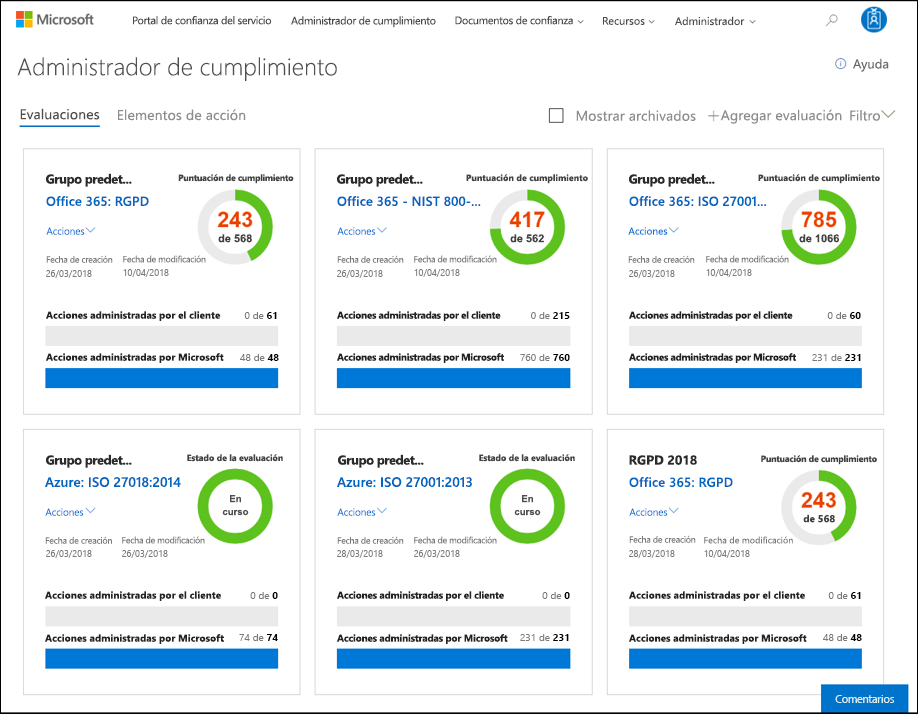

## Obtener acceso al Administrador de cumplimientoAccessing Compliance Manager

Para obtener acceso al Administrador de cumplimiento, vaya al Portal de confianza de servicios. Cualquier usuario con una cuenta Microsoft o una cuenta de organización de Azure Active Directory puede obtener acceso al Administrador de cumplimiento.You access Compliance Manager from the Service Trust Portal. Anyone with a Microsoft account or Azure Active Directory organizational account can access Compliance Manager.
  

  
1. Vaya a [https://servicetrust.microsoft.com](https://servicetrust.microsoft.com/).Go to [https://servicetrust.microsoft.com](https://servicetrust.microsoft.com/).
    
2. Inicie sesión con su cuenta de usuario de Azure Active Directory (Azure AD).Sign in with your Azure Active Directory (Azure AD) user account.
    
3. En el Portal de confianza de servicios, haga clic en **Administrador de cumplimiento**.In the Service Trust Portal, click **Compliance Manager**. 
    
4. Cuando se muestre el acuerdo de confidencialidad, léalo y, después, haga clic en **Acepto** para continuar. Solo tendrá que hacerlo una vez; después, se mostrará el panel del Administrador de cumplimiento.When the Non-Disclosure Agreement is displayed, read it, and then click **Agree** to continue. You'll only have to do this once, and then the Compliance Manager dashboard is displayed. 

    Para ayudarle a empezar, agregamos las siguientes evaluaciones de forma predeterminada:To get you started, we've added the following Assessments by default:
    
    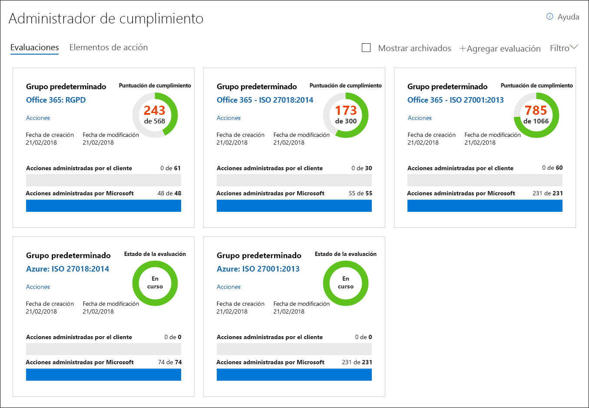
    
5. Haga clic en el  **Ayuda** para realizar un paseo breve por el Administrador de cumplimiento.Click  **Help** to take a short tour of Compliance Manager. 
  
## Ver accionesViewing action items

El Administrador de cumplimiento proporciona una vista útil de todas las acciones de evaluaciones de control asignadas, lo que le permite realizar acciones en estas de forma rápida y sencilla.Compliance Manager provides a convenient view of all your assigned control assessment action items, enabling you to quickly and easily take action on them. Para ver todas las acciones o seleccionar las acciones que se correspondan con una certificación específica, haga clic en la pestaña asociada con esa evaluación.You can view all action items or select the action items that correspond with a specific certification by clicking the tab associated with that assessment. Por ejemplo, en la imagen siguiente, se seleccionó la pestaña RGPD, donde se muestran controles relacionados con la evaluación del RGPD.For instance, in the image below, the GDPR tab has been selected, showing controls that related to the GDPR assessment.
  
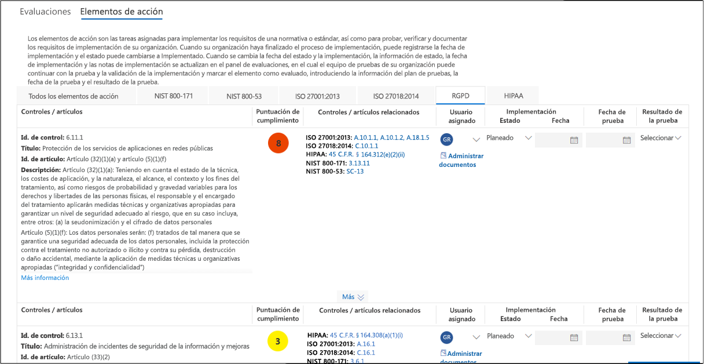
  
Para ver las acciones:To view your action items:
  
1. Vaya al panel del Administrador de cumplimiento.Go to the Compliance Manager dashboard
    
2. Haga clic en el vínculo **Acciones**; la página se actualizará y se mostrarán las acciones asignadas a su usuario.Click the **Action Items** link, and the page will refresh to show the action items that have been assigned to you. 
    
    De forma predeterminada, se muestran todas las acciones. Si tiene acciones de varias certificaciones, los nombres de las certificaciones se mostrarán en pestañas en la parte superior del control de evaluación. Para ver las acciones de una certificación específica, haga clic en esa pestaña.By default, all action items are shown. If you have action items across multiple certifications, the names of the certifications will be listed in tabs across the top of the assessment control. To see the action items for a specific certification, click that tab.

## Agregar una evaluaciónAdding an Assessment

Para agregar una evaluación al Administrador de cumplimiento:To add an Assessment to Compliance Manager:
  
1. En el panel del Administrador de cumplimiento, haga clic en  **Agregar evaluación**.In the Compliance Manager dashboard, click  **Add Assessment**. 
    
2. En la ventana **Agregar una evaluación**, puede crear un grupo al que agregar la evaluación, o bien puede agregarlo a un grupo existente (el grupo integrado se denomina “Grupo inicial”). Según la opción que seleccione, escriba el nombre del nuevo grupo, o bien seleccione un grupo existente en la lista desplegable. Para obtener más información, vea [Agrupar evaluaciones](#grouping-assessments).In the **Add an Assessment** window, you can create a new group to add the Assessment to or you can add it to an existing group (the built-in group is named "Initial Group".) Depending on the option you choose, either type the name of a new group or select an existing group from the drop-down list. For more information, see [Grouping Assessments](#grouping-assessments).
    
    Si crea un grupo, también tendrá la opción de copiar la información de otro existente para la nueva evaluación.If you create a group, you also have the option to copy information from an existing group to the new Assessment. Esto significa que la información que se agregó en los campos Detalles de la implementación, Plan de pruebas y Respuesta de la administración de los controles administrados por el cliente de evaluaciones del grupo del que está copiando se pegan en los mismos controles administrados por el cliente (o los relacionados) en la nueva evaluación.That means any information that was added to the Implementation Details and Test Plan and Management Response fields of customer-managed controls from Assessments in the group that you're copying from are copied to the same (or related) customer-managed controls in the new Assessment. Si agrega una evaluación nueva a un grupo existente, la información común de las evaluaciones de ese grupo se copiará a la nueva.If you're adding a new Assessment to an existing group, common information from Assessments in that group will be copied to the new Assessment. Para obtener más información, vea [Copiar la información de evaluaciones existentes](#copying-information-from-existing-assessments).For more information, see [Copying information from existing Assessments](#copying-information-from-existing-assessments).
    
3. Haga clic en **Siguiente** y siga este procedimiento:Click **Next**, and do the following:
    
    a.a. Elija un servicio en la nube de Microsoft de la lista desplegable **Seleccionar un producto** para evaluar el cumplimiento.Choose a Microsoft cloud service to assess for compliance from the **Select a product** drop-down list. 
    
    b.b. Elija una certificación para evaluar el servicio en la nube seleccionado en la lista desplegable **Seleccionar una certificación**.Choose a certification to assess the selected cloud service against from the **Select a certification** drop-down list. 
    
4. Haga clic en **Agregar al panel** para crear la evaluación; la evaluación se agregará al panel del Administrador de cumplimiento como un nuevo icono al final de la lista de iconos existentes.Click **Add to Dashboard** to create the Assessment; the assessment will be added to the Compliance Manager dashboard as a new tile at the end of the list of existing tiles. 
    
    En el **icono de evaluación** del panel del Administrador de cumplimiento, se muestra la agrupación de evaluaciones, el nombre de la evaluación (creado automáticamente como una combinación del nombre del servicio y la certificación seleccionada), la fecha en que se creó y cuándo se modificó por última vez, la puntuación de cumplimiento total (que es la suma de todos los valores de riesgo de control asignados que se implementaron, probaron y completaron correctamente) e indicadores de progreso en la parte inferior que indican el número de controles evaluados.The **Assessment Tile** on the Compliance Manager dashboard, displays the assessment grouping, the name of the assessment (automatically created as a combination of the Service name and the certification selected), the date it was created and when it was last modified, the Total Compliance Score (which is the sum of all of the assigned control risk values that have been implemented, tested, and passed), and progress indicators along the bottom that show the number of controls that have been assessed. 
    
5. Haga clic en el nombre de la evaluación para abrirla y vea los detalles de la evaluación.Click the Assessment name to open it, and view the details of the Assessment.
    
6. Haga clic en el menú **Acciones** para ver las acciones asignadas, cambiar el nombre del grupo de evaluaciones, exportar el informe de evaluación o archivar la evaluación.Click the **Actions** menu to view your assigned action items, rename the assessment group, export the assessment report, or archive the assessment. 
    
    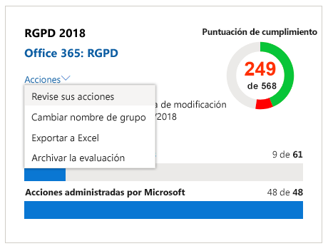

## Copiar información de evaluaciones existentesCopying information from existing Assessments

Como se ha explicado anteriormente, al crear un grupo de evaluación, tiene la opción de copiar la información de las evaluaciones de un grupo existente a la nueva evaluación en el grupo nuevo.As previously explained, when you create an assessment group, you have the option to copy information from Assessments in an existing group to the new Assessment in the new group. De esta manera, puede aplicar el trabajo de pruebas y evaluación realizado a los mismos controles administrados por el cliente en la nueva evaluación.This allows you to apply the assessment and testing work that's been completed to the same customer-managed controls in the new Assessment. Por ejemplo, si tiene un grupo para todas las evaluaciones relacionadas con el RGPD en su organización, puede copiar la información común de tareas de evaluación existentes al agregar una nueva evaluación al grupo.For example, if you have a group for all GDPR-related Assessments in your organization, you can copy common information from existing assessment work when add a new Assessment to the group.
  
Puede copiar la siguiente información del cliente en una nueva evaluación:You can copy the following information from customer to a new Assessment:
  
- Usuarios de la evaluación. Un usuario de evaluación es un usuario al que se asignó el control.Assessment Users. An Assessment user is a user who the control is assigned to.
    
- Estado, fecha de la prueba y resultados de pruebas.Status, Test Date, and Test Results.
    
- Detalles de la implementación e información sobre el plan de pruebas.Implementation details and test plan information.
    
Asimismo, se sincroniza la información de controles administrados por el cliente compartidos en el mismo grupo de evaluación.Similarly, information from shared customer-managed controls within the same Assessment group is synchronized. También se sincroniza la información de controles administrados por el cliente relacionados en la misma evaluación.And information in related customer-managed controls within the same Assessment is also synchronized.

## Ver evaluacionesViewing Assessments

1. Busque el icono de evaluación que se corresponda con la evaluación que quiera ver y, después, haga clic en el nombre de la evaluación para abrirla y ver controles administrados por el cliente y por Microsoft asociados a la evaluación, además de una lista de los servicios en la nube que están dentro del ámbito de la evaluación.Locate the Assessment Tile corresponding to the assessment you wish to view, then click the assessment name to open it and view the Microsoft and customer-managed controls associated with the Assessment, along with a list of the cloud services that are in-scope for the Assessment. Este es un ejemplo de la evaluación para Office 365 y el RGPD.Here's an example of the Assessment for Office 365 and GDPR.
    
    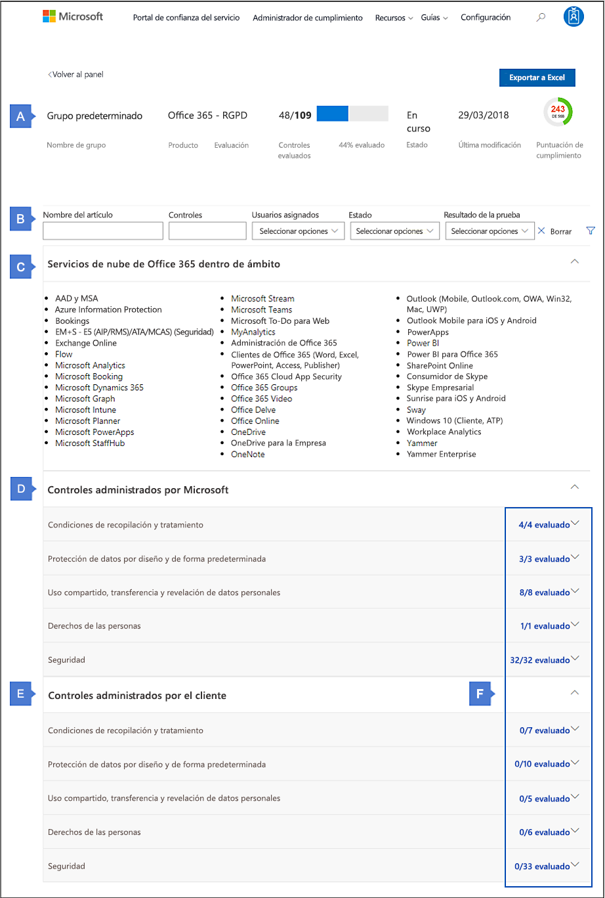
  
1. En esta sección, se muestra información de resumen de la evaluación, como el nombre de la agrupación de evaluaciones, el producto, el nombre de la evaluación y el número de controles de evaluación.This section shows the Assessment summary information, including the name of the Assessment Grouping, Product, Assessment name, number of Assess controls
    
2. En esta sección, se muestran los controles del filtro de evaluación. Para obtener una explicación más detallada de cómo usar los controles del filtro de evaluación, vea la sección [Administrar el proceso de evaluación](#managing-the-assessment-process).This section shows the Assessment Filter controls. For a more detailed explanation of how to use the Assessment Filter controls see the [Managing the assessment process](#managing-the-assessment-process) section. 
    
3. En esta sección, se muestran los servicios en la nube individuales que están dentro del ámbito de la evaluación.This section shows the individual cloud services that are in-scope for the assessment.
    
4. Esta sección contiene los controles administrados por Microsoft.This section contains Microsoft-managed controls. Los controles relacionados se organizan en familias.Related controls are organized by control family. Haga clic en una familia para expandirla y mostrar los controles individuales.Click a control family to expand it and display individual controls.
    
5. Esta sección contiene los controles administrados por el cliente, que también se organizan en familias.This section contains customer-managed controls, which are also organized by control family. Haga clic en una familia para expandirla y mostrar los controles individuales.Click a control family to expand it and display individual controls.
    
6. Muestra el número total de controles de la familia y cuántos de ellos se han evaluado.Displays the total number of controls in the control family, and how many of those controls have been assessed. Una función principal del Administrador de cumplimiento es seguir el progreso de su organización en la evaluación de los controles administrados por el cliente.A key capability of Compliance Manager is tracking your organization's progress on assessing the customer-managed controls. Para obtener más información, vea la sección [Introducción a la Puntuación de cumplimiento](#understanding-the-compliance-score).For more information, see the [Understanding the Compliance Score](#understanding-the-compliance-score) section. 

## Administrar el proceso de evaluaciónManaging the assessment process

Inicialmente, el creador de una evaluación es su único usuario.The creator of an Assessment is initially the only Assessment User. Para cada control administrado por el cliente, puede asignar un elemento de acción a una persona de su organización. De esta manera, dicha persona se convierte en un usuario de evaluación que puede realizar las acciones de cliente recomendadas, así como recopilar y cargar las pruebas.For each customer-managed control, you can assign an Action Item to a person in your organization so that person becomes an Assessment User who can perform the recommended Customer Actions, and gather and upload evidence. Al asignar un elemento de acción, puede enviar un correo electrónico a esa persona con información sobre las acciones de cliente recomendadas y la prioridad del elemento de acción.When you assign an Action Item, you can choose to send an email to the person that contains details including the recommended Customer Actions and the Action Item priority. La notificación por correo electrónico incluye un vínculo al panel **Elementos de acción**, en el que se enumeran todos los elementos de acción asignados a ese usuario.The email notification includes a link to the **Action Items** dashboard, which lists all Action Items assigned to that person. 
  
Esta es una lista de las tareas que puede realizar con las características de flujo de trabajo del Administrador de cumplimiento.Here's a list of tasks that you can perform using the workflow features of Compliance Manager.
  
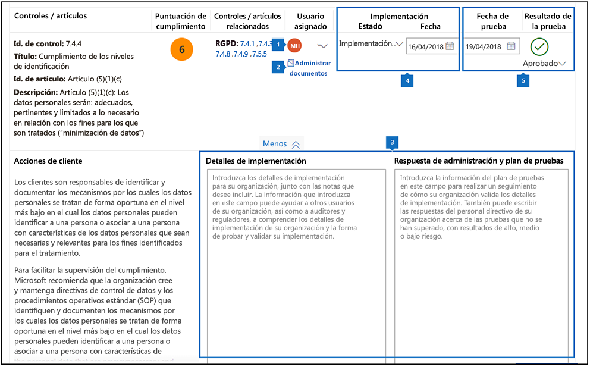
  
1. **Usar las opciones de filtro para encontrar controles de evaluación específicos**: el Administrador de cumplimiento proporciona **opciones de filtro**, que ofrecen criterios de selección altamente granulares para mostrar controles de evaluación, lo que le permitirá dedicarse de forma precisa a áreas específicas de sus esfuerzos de cumplimiento.**Use the Filter Options to find specific assessment controls** - Compliance Manager provides **Filter Options**, giving you highly granular selection criteria for displaying assessment controls, helping you to precisely target specific areas of your compliance efforts. 
    
    Haga clic en el icono de embudo de la parte derecha de la página para mostrar u ocultar los controles de **Opciones de filtro**.Click the funnel icon on the right-hand side of the page to show or hide the **Filter Options** controls. Estos controles le permiten especificar criterios de filtro, y en la parte inferior solo se mostrarán los controles de evaluación que se correspondan con esos criterios.These controls allow you to specify filter criteria, and only the assessment controls that fit those criteria will be displayed below. 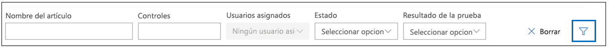
  
    - **Artículos**: filtra el nombre del artículo y devuelve los controles de evaluación asociados con ese artículo.**Articles** - filters on the article name and returns the assessment controls associated to that article. Por ejemplo, al escribir “Artículo (5)”, se muestra una lista de selección de artículos cuyo nombre contiene esa cadena (es decir, artículo (5)(1)(a), artículo (5)(1)(b), artículo (5)(1)(c), etc.). Si selecciona el artículo (5)(1)(c) se le mostrarán solo los controles asociados con dicho artículo.For instance, typing in "Article (5)" returns a selection list of articles whose name includes that string, i.e. Article (5)(1)(a), Article (5)(1)(b), Article (5)(1)(c), etc. Selecting Article (5)(1)(c) will return the controls associated with Article (5)(1)(c). Este es un campo de selección múltiple que usa un operador “O” con varios valores (por ejemplo, si selecciona el artículo (5)(1)(a) y, después, agrega el artículo (5)(1)(c), el filtro mostrará los controles asociados con el artículo (5)(1)(a) o con el artículo (5)(1)(c)).This is multiselect field that uses an OR operator with multiple values — for instance, if you select Article (5)(1)(a) and then add Article (5)(1)(c), the filter will return controls associated with either Article (5)(1)(a) or Article (5)(1)(c). 
    
      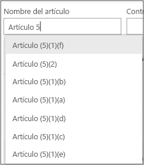
  
    - **Controles**: muestra la lista de controles cuyos nombres coinciden con el filtro (por ejemplo, al escribir 7.3, se mostrará una lista de selección de elementos como, 7.3.1, 7.3.4, 7.3.5, etc.). Es un campo de selección múltiple que usa un operador OR con varios valores (por ejemplo, si selecciona 7.3.1 y, después, agrega 7.3.4, el filtro mostrará los controles asociados con 7.3.1 o 7.3.4).**Controls** - returns the list of controls whose names fit the filter, i.e. typing in 7.3 returns a selection list of items like 7.3.1, 7.3.4, 7.3.5, etc. This is multiselect field that uses an OR operator with multiple values — for instance, if you select 7.3.1 and then add 7.3.4, the filter returns controls associated with either 7.3.1 or 7.3.4. 
    
      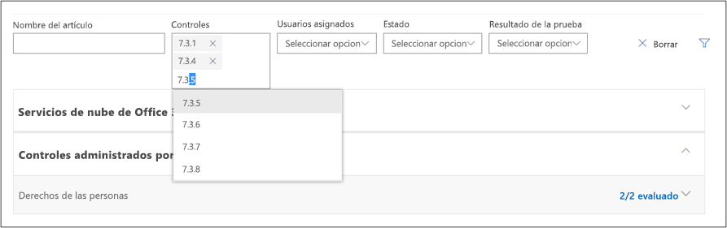
  
    - **Usuarios asignados**: muestra la lista de controles asignados al usuario seleccionado.**Assigned Users** - returns the list of controls who are assigned to the selected user. 
    
    - **Estado**: muestra la lista de controles con el estado seleccionado.**Status** - returns the list of controls with the selected status. 
    
    - **Resultado de la prueba**: muestra la lista de controles con el resultado de la prueba seleccionada.**Test Result** - returns the list of controls with the selected test result. 
    
    Al aplicar condiciones de filtro, la vista de los controles cambiará para corresponderse con las condiciones de filtro. Expanda las secciones de las familias de controles para mostrar los detalles de controles abajo.As you apply filter conditions, the view of applicable controls will change to correspond to your filter conditions. Expand the control family sections to show the control details below. 
    
    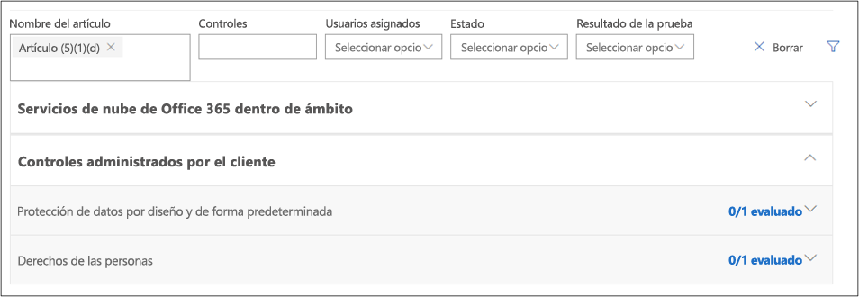
  
2. Si, no se muestran resultados después de seleccionar los filtros deseados, quiere decir que no hay controles que se correspondan con las condiciones de filtro especificadas. Por ejemplo, si selecciona un **Usuario asignado** específico y, después, elige un nombre de **control** que no se corresponde con el control asignado a ese usuario, no se mostrará ninguna evaluación en la página inferior.If after selecting the desired filters no results are shown, that means there are no controls that correspond to the specified filter conditions. For instance, if you select a particular **Assigned User** and then choose a **Control** name that does correspond to the control assigned to that user, no assessments will be shown in the page below. 
    
3. **Asignar una acción a un usuario**: puede asignar una acción a un usuario para implementar los requisitos de una certificación o reglamento, o bien para probar, verificar y documentar los requisitos de implementación de la organización. Al asignar una acción, puede enviar un correo electrónico a la persona con detalles como las acciones de cliente recomendadas y la prioridad de la acción. También puede cancelar la asignación o reasignar una acción a otro usuario.**Assign an Action Item to a user** - You can assign an Action Item to a person to implement the requirements of a certification/regulation, or to test, verify, and document your organization's implementation requirements. When you assign an Action Item, you can choose to send an email to the person that contains details including the recommended Customer Actions and the Action Item priority. You can also unassign or reassign an Action Item to a different person. 
    
4. **Administrar documentos** Los controles administrados por el cliente también cuentan con una ubicación para administrar documentos relacionados con la realización de tareas de implementación, así como para realizar tareas de validación y pruebas.**Manage documents** - Customer-managed controls also have a place to manage documents that are related to performing implementation tasks and for performing testing and validation tasks. Cualquier persona que tenga permisos para editar datos en el Administrador de cumplimiento puede cargar documentos haciendo clic en **Administrar documentos**.Anyone with permissions to edit data in Compliance Manager can upload documents by clicking **Manage Documents**. Cuando se hayan cargado documentos, podrá hacer clic en **Administrar documentos** para ver y descargar los archivos.After a documented has been uploaded, you can click **Manage Documents** to view and download files. 
    
5. **Proporcionar detalles de pruebas de implementación**: todos los controles administrados por el cliente tienen un campo editable donde los usuarios pueden agregar detalles de la implementación para documentar los pasos realizados por la organización para cumplir con los requisitos de la certificación o reglamento, así como para validar y documentar la forma en que la organización cumple esos requisitos.**Provide implementation and testing details** - Every customer-managed control has an editable field where users can add implementation details that document the steps taken by your organization to meet the requirements of the certification/regulation, and to validate and document how your organization meets those requirements.
    
6. **Establecer el estado**: establece el estado de cada elemento como parte del proceso de evaluación. Los valores de estado disponibles son **Implementado**, **Implementación alternativa**, **Planeado** y **No está en el ámbito**.**Set Status** - Set the Status for each item as part of the assessment process. Available status values are **Implemented**, **Alternative Implementation**, **Planned**, and **Not in Scope**. 
    
7. **Escribir la fecha y el resultado de la prueba** La persona con el rol Evaluador de Administrador de cumplimiento puede comprobar que se realizan las pruebas adecuadas, así como revisar los detalles de la implementación, el plan de pruebas, los resultados de las pruebas y cualquier evidencia cargada y, después, establecer los valores de Fecha de la prueba y Resultado de la prueba.**Enter test date and test result** - The person with the Compliance Manager Assessor role can verify that proper testing performed, review the implementation details, test plan, test results, and any uploaded evidence, and then set the Test Date and Test Result. Los valores disponibles para Resultado de la prueba son **Correcto**, **Erróneo - Riesgo bajo**, **Erróneo - Riesgo medio** y **Erróneo - Riesgo alto**.Available test result values are **Passed**, **Failed-Low Risk**, **Failed-Medium Risk**, and **Failed-High Risk**. 

## Administrar accionesManaging action items

Las personas involucradas en el proceso de evaluación de la organización pueden usar el Administrador de cumplimiento para revisar los controles administrados por el cliente de todas las evaluaciones en las que son usuarios.The people involved in the assessment process in your organization can use Compliance Manager to review the customer-managed controls from all Assessments for which they are users. Cuando un usuario inicia sesión en Administrador de cumplimiento y abre el panel **Elementos de acción**, ve una lista de los que tiene asignados.When a user signs in to Compliance Manager and opens the **Action Items** dashboard, a list of Action Items assigned to them is displayed. Según el rol de Administrador de cumplimiento asignado al usuario, este podrá proporcionar detalles sobre la prueba o la implementación, actualizar el estado o asignar elementos de acción.Depending on the Compliance Manager role assigned to the user, they can provide implementation or test details, update the Status, or assign Action Items. 
  
Como los controles de certificación suelen implementarlos una persona y probarlos otra, la acción de control se puede asignar de forma inicial a una persona para la implementación y, una vez completada, esa persona puede reasignar la acción de control a la siguiente persona para realizar pruebas de control y cargar las evidencias. La asignación o reasignación de acciones de control puede realizarla cualquiera de los usuarios que tenga un rol del Administrador de cumplimiento con permisos suficientes, que permita la administración centralizada de asignaciones de control o el enrutamiento descentralizado de acciones de control, desde implementador a evaluador, según corresponda.As certification controls are generally implemented by one person and tested by another, the control action item can be initially assigned to one person for implementation, and once that is complete, that person can reassign the control action item to the next person for control testing and uploading of evidence. This assignment/reassignment of control actions can be performed by any users who have a Compliance Manager role with sufficient permissions, allowing for central management of control assignments, or decentralized routing of control action items, from implementer to tester as appropriate.
  
Para asignar una acción:To assign an action item:
  
1. En el panel del Administrador de cumplimiento, busque el icono de evaluación junto a la evaluación con la que quiera trabajar y, después, haga clic en el nombre para ir a la página de detalles.On the Compliance Manager dashboard, locate the assessment tile of the assessment you wish to work with and click on the name of the assessment to go to the assessment details page.
    
2. Puede hacer clic en **Filtrar** y usar los controles de filtro para encontrar el control de evaluación específico que quiera asignar.You can click **Filter** and use the filter controls to find the specific assessment control you wish to assign, or 
    
3. También puede ir a la sección Controles administrados por el cliente, expandir la familia de controles y desplazarse por la lista de controles hasta que encuentre el control de evaluación que quiera asignar.Scroll down to the Customer-Managed Controls section, expand the control family, and scroll through the list of control until you have located the assessment control to be assigned
    
4. En la columna **Usuario asignado**, haga clic en **Asignar**.Under the **Assigned User** column, click **Assign**. 
    
5. En el cuadro de diálogo “Asignar acción”, haga clic en el campo **Asignar a** para rellenar la lista de usuarios a los que puede asignar la acción. Puede desplazarse por la lista para encontrar el nombre de usuario que prefiera, o bien puede empezar a escribir en el campo para buscarlo.In the Assign Action Item dialog box, click the **Assign To** field to populate the list of users to whom the action can be assigned. You can scroll through the list to find the target user or start typing in the field to search for the username. 
    
6. Haga clic en un usuario para asignarle esta acción.Click the user to assign them this action item.
    
7. Para enviar una notificación por correo electrónico al usuario, asegúrese de que esté activada la casilla **Enviar notificación por correo electrónico**.If you wish to send an email notification to the user notifying them, ensure that the **Send Email Notification** checkbox is checked. 
    
8. Escriba las notas que quiera que se muestren al usuario y haga clic en **Asignar**.Type any notes you wish to be displayed to that user and click **Assign**. 
 
    El usuario recibirá una notificación de la asignación de acción, así como las notas que especifique.The user will receive notification of their action item assignment and any notes you have provided.
    
Las notas asociadas a la acción persisten en la sección de notas y estarán disponibles la próxima vez que se asigne la acción. Estas notas no son de solo lectura (la persona que asigne la acción puede editarlas, reemplazarlas o quitarlas).The notes that are associated with the action item are persisted in the notes section, available for the next time the action item is assigned. These notes are not read-only, can be edited, replaced or removed by the person assigning the action item.

## Exportar información de una evaluaciónExporting information from an Assessment

Puede exportar una evaluación a un archivo de Excel para que las partes interesadas de cumplimiento lo revisen, o bien para facilitarlo a auditores y organismos reguladores.You can export an Assessment to an Excel file, which can be reviewed by compliance stakeholders in your organization, and provided to auditors and regulators. Este informe de evaluación es una instantánea de la evaluación en la fecha y hora en que se creó el informe, y contiene los detalles de los controles administrados por Microsoft y por el cliente para esa evaluación, incluido el estado de la implementación de controles, la fecha de pruebas de control y los resultados de pruebas, y proporciona vínculos a los documentos de evidencias cargados.This assessment report is a snapshot of the assessment as of the date and time that the report is created, and it contains the details of both the Microsoft-managed controls and the customer-managed controls for that assessment, including control implementation status, control test date and test results, and provides links to the uploaded evidence documents. Le recomendamos que exporte el informe de evaluación antes de archivar una evaluación, ya que en las evaluaciones archivadas no se conservan los vínculos a los documentos cargados.It is recommended that you export the assessment report prior to archiving an assessment, as archived assessments do not retain their links to uploaded documents.
  
Para exportar un informe de evaluación:To export an Assessment report:
  
- En el panel del Administrador de cumplimiento, haga clic en **Acciones** en el icono de la evaluación que quiera exportar y, después, seleccione **Exportar a Excel**.On the Compliance Manager dashboard, click **Actions** on the tile of the assessment you wish to export, and then choose **Export to Excel**

  O bienOr
    
- Si está en la página de detalles de la evaluación, haga clic en el botón **Exportar a Excel**, que se encuentra en la esquina superior derecha de la página, encima de la puntuación de cumplimiento de la evaluación.If you are viewing the Assessment details page, click on the **Export to Excel** button, which is located in the upper right-hand corner of the page above the assessment's Compliance Score.
    
El informe de evaluación se descargará en la sesión del explorador. Si no ve un mensaje emergente para informarle de esto, abra la carpeta de descargas del explorador.The assessment report will be downloaded in your browser session. If you don't see a popup informing you of this, you may wish to check your browser's downloads folder.

## Archivar una evaluaciónArchiving an Assessment

Si completó una evaluación y ya no la necesita por fines de cumplimiento, puede archivarla. Al archivar una evaluación, se quita del panel Evaluaciones.When you have completed an Assessment and no longer need it for compliance purposes, you can archive it. When an Assessment is archived, it is removed from Assessments dashboard.
  
> [!NOTE]
> Al archivar una evaluación, ya no se puede recuperar ni restaurar a un estado de lectura y escritura en curso. Tenga en cuenta que, en las evaluaciones archivadas, no se conservan los vínculos a los documentos de evidencia cargados, por lo que es muy recomendable que realice una exportación de la evaluación antes de archivarla, ya que el informe de evaluación exportado contendrá los vínculos a los documentos de evidencias, lo que le permitirá seguir obteniendo acceso a estos.When an Assessment is Archived, it cannot be 'unarchived' or restored to a read-write in progress state. Please note that Archived Assessments do not retain their links to uploaded evidence documents, so it is highly recommended that you perform an Export of the Assessment before archiving it, as the exported assessment report will contain links to the evidence documents, enabling you to continue to access them. 
  
Para archivar una evaluación:To archive an assessment:
  
1. En el icono de panel de la evaluación que quiera archivar, haga clic en **Acciones**.On the dashboard tile of the desired assessment, click **Actions**. 
    
2. Seleccione **Archivar evaluación**.Select **Archive Assessment**. 
 
    Se mostrará el cuadro de diálogo **Archivar evaluaciones**, donde se le pedirá que confirme que quiere archivar la evaluación.The **Archive Assessments** dialog is displayed, asking you to confirm that you want to archive the assessment.
    
4. Para continuar con el archivado, haga clic en **Archivar**; de lo contrario, haga clic en **Cancelar**.To continue with archiving, click **Archive**, or else click **Cancel**. 
    
Para ver las evaluaciones archivadas:To view archived Assessments:
  
1. En el panel del Administrador de cumplimiento, active la casilla **Mostrar archivados**.On the Compliance Manager dashboard, check the **Show Archived** checkbox. 
    
    Las evaluaciones archivadas se mostrarán en una nueva sección visible debajo del resto de las evaluaciones activas, en la parte inferior de una barra titulada **Evaluaciones archivadas**.The archived assessments will appear in a newly visible section below the rest of the active assessments under a bar titled **Archived Assessments**.
    
3. Haga clic en el nombre de la evaluación que quiera ver.Click the name of the assessment you wish to view.
    
Al visualizar una evaluación archivada, ninguno de los controles que pueden editarse normalmente (por ejemplo, “Implementación” o “Resultados de pruebas”) estarán activos, ni tampoco se mostrará el botón **Documentos administrados**.When viewing an archived assessment, none of the normally editable controls (i.e. Implementation, Test Results) will be active, and the **Managed Documents** button will be absent.

## Uso de la búsquedaUsing search

  
Haga clic en el icono de lupa de la esquina superior derecha de la página para expandir el campo de búsqueda, escriba los términos de búsqueda y presione Entrar. Se mostrará el control de búsqueda con el término de búsqueda en el campo de entrada del panel de búsqueda y, en la parte inferior, se mostrarán los resultados de la búsqueda.Click the magnifying glass in the upper right-hand corner of the page by to expand the Search input field, enter your search terms and press Enter. The Search control will appear, with the search term in the search pane input field, and search results will appear beneath.
  
De forma predeterminada, la búsqueda muestra resultados de documentos, y puede usar las listas desplegables “Filtrar por” para restringir la lista de documentos mostrados con el fin de agregar o quitar resultados de la búsqueda de la vista. Puede usar varios atributos de filtro al mismo tiempo para restringir los documentos mostrados a elementos específicos, como servicios en la nube, categorías de cumplimiento o procedimientos de seguridad, regiones del mundo o sectores. Haga clic en el vínculo del nombre del documento para descargar el documento.By default, Search returns Document results, and you can use the Filter By dropdown lists to refine the list of documents displayed, to add or remove search results from view. You can use multiple filter attributes at the same time to narrow the returned documents to specific cloud services, categories of compliance or security practices, regions of the world, or industries. Click the document name link to download the document.
  

  
Haga clic en el vínculo Administrador de cumplimiento para mostrar los resultados de búsqueda para los controles de evaluación del Administrador de cumplimiento.Click on the Compliance Manager link to display Search results for Compliance Manager assessment controls. En la lista de resultados de búsqueda, se muestra la fecha en la que se creó la evaluación, el nombre de la agrupación de evaluaciones, el servicio en la nube aplicable y si los controles están administrados por Microsoft o por el cliente.The listed search results show the date the assessment was created, the name of the assessment grouping, the applicable cloud service, and whether the controls are Microsoft or Customer Managed.
  

  
> [!NOTE]
> Los informes y documentos del Portal de confianza de servicios pueden descargarse como mínimo durante 12 meses después de su publicación, o bien hasta que se publique una nueva versión del documento.Service Trust Portal reports and documents are available to download for at least twelve months after publishing or until a new version of document becomes available. 
 
## Soporte de localizaciónLocalization support

El Portal de confianza de servicios de permite ver el contenido de la página en distintos idiomas. Para cambiar el idioma de la página, haga clic en el icono de globo de la esquina inferior izquierda de la página y seleccionar el idioma que prefiera.Service Trust Portal enables you to view the page content in different languages. To change the page language, simply click on the globe icon in the lower left corner of the page and select the language of your choice. 
  

## Registro de cambios de controles administrados por el clienteChange log for Customer-Managed Controls

El Administrador de cumplimiento se diseñó para actualizarlo de forma periódica con el fin de mantenerse al día de los cambios en los requisitos reglamentarios, así como de los cambios en nuestros servicios en la nube.Compliance Manager is designed to be regularly updated to keep pace with changes in regulatory requirements, as well as changes in our cloud services. En estas actualizaciones, se incluyen cambios en los Controles administrados por el cliente.These updates include changes to the Customer-Managed Controls. Se proporciona un registro de cambios que le ayudará a comprender el impacto de estos cambios, incluidos los detalles sobre el contenido que se haya agregado o modificado, así como una guía sobre cómo afectan los cambios a las evaluaciones existentes.A Change Log is provided to help you understand the impact of these changes, including the details of the content being added or changed, and guidance as to what effect the changes have on existing Assessments. En general, hay dos tipos de cambio:Generally, there are two types of changes:
  
- Un cambio **mayor** es un cambio importante en una acción de cliente, como agregar o quitar un control o pasos numerados específicos, o bien un cambio en la guía sobre responsabilidades, recomendaciones o evidencias. En el caso de los cambios mayores, le recomendamos que vuelva a evaluar la implementación o evaluación del control afectado.A **Major** change is a significant change to a Customer Action, such as the addition or removal of a control or specific numbered steps, or a change in the guidance around responsibilities, recommendations, or evidence. For Major changes, we recommend that you re-evaluate your implementation and/or assessment of the affected control.
    
- Un cambio **menor** es un cambio insignificante en las acciones de cliente, como corregir un error de escritura o problemas de formato, o bien actualizar o corregir hipervínculos. En el caso de los cambios menores, no suele ser necesario volver a evaluar el control, pero le recomendamos que actualice la acción de cliente.A **Minor** change is an insignificant change to a Customer Actions, such as fixing a typo or formatting issues, or updating or correcting hyperlinks. Minor changes generally do not require the control to be re-evaluated; however, we do recommend that you review the updated Customer Action.
  
### Controles administrados por el cliente: Registro de cambios de julio de 2018Customer-managed controls - Change Log for July 2018

|**Id. de control****Control ID**|**Evaluación****Assessment**|**Tipo de cambio****Type of change**|**Descripción del cambio****Description of change**|**Acciones recomendadas para clientes****Recommended actions for customers**|
|:-----|:-----|:-----|:-----|:-----|:-----|:-----|:-----|:-----|
|45 C.F.R. § 164.308(a)(7)(ii)(A)45 C.F.R. § 164.308(a)(7)(ii)(A)  |Office 365: HIPAAOffice 365: HIPAA|MayorMajor|Se agregó el control de HITECH a la evaluación de HIPAA para Office 365.Added HITECH control to HIPAA Assessment for Office 365 |Se revisaron el control agregado y las acciones de cliente recomendadas.Review the added control and recommended Customer Actions  |
|45 C.F.R.  164.312(a)(6)(ii)45 C.F.R.  164.312(a)(6)(ii)|Office 365: HIPAAOffice 365: HIPAA|MayorMajor|Se agregó el control de HITECH a la evaluación de HIPAA para Office 365.Added HITECH control to HIPAA Assessment for Office 365|Se revisaron el control agregado y las acciones de cliente recomendadas.Review the added control and recommended Customer Actions |
45 C.F.R. § 164.312(c)(1)45 C.F.R. § 164.312(c)(1)| Office 365: HIPAAOffice 365: HIPAA|MayorMajor| Se agregó el control de HITECH a la evaluación de HIPAA para Office 365.Added HITECH control to HIPAA Assessment for Office 365 |Se revisaron el control agregado y las acciones de cliente recomendadas.Review the added control and recommended Customer Actions  |
45 C.F.R.  § 164.316(b)(2)(iii)45 C.F.R.  § 164.316(b)(2)(iii)| Office 365: HIPAAOffice 365: HIPAA|MayorMajor|Se agregó el control de HITECH a la evaluación de HIPAA para Office 365.Added HITECH control to HIPAA Assessment for Office 365|Se revisaron el control agregado y las acciones de cliente recomendadas.Review the added control and recommended Customer Actions |
|

### Controles administrados por el cliente: Registro de cambios de abril de 2018Customer-managed controls - Change Log for April 2018

|**RGPD****GDPR**|**HIPAA****HIPAA**|**ISO 27001****ISO 27001**|**ISO 27018****ISO 27018**|**NIST 800-53****NIST 800-53**|**NIST 800-171****NIST 800-171**|**Tipo de cambio****Type of change**|**Descripción del cambio****Description of change**|**Acciones recomendadas para clientes****Recommended actions for customers**|
|:-----|:-----|:-----|:-----|:-----|:-----|:-----|:-----|:-----|
|6.13.26.13.2    |||C.16.1.1C.16.1.1    |||MayorMajor    |La referencia numérica anterior era 6.12.1.1.Previously numbered as 6.12.1.1.    Se agregaron detalles a las recomendaciones.Added details to recommendations.    |Vuelva a evaluar el control: revise la guía actualizada en las acciones de cliente y siga los pasos recomendados para implementar y evaluar el control.Re-assess the control: Review the updated guidance in the Customer Actions and follow the recommended steps for implementing and assessing the control.    |
||||||3.1.63.1.6    |MayorMajor    |Se agregaron pasos a la guía, como habilitar la auditoría y buscar en los registros de auditoría.Added steps to guidance that include enabling auditing and searching audit logs.    |Revise las recomendaciones actualizadas en las acciones de cliente.Review the updated recommendations in the Customer Actions.    |
|6.8.26.8.2    |||A.10.2A.10.2    |||MayorMajor    |La referencia numérica anterior era 6.7.2.9.Previously numbered as 6.7.2.9.    Guía actualizada con acciones y recomendaciones adicionales.Updated guidance with additional recommendations and action items.    |Vuelva a evaluar el control: revise la guía actualizada en las acciones de cliente y siga los pasos recomendados para implementar y evaluar el control.Re-assess the control: Review the updated guidance in the Customer Actions and follow the recommended steps for implementing and assessing the control.    |
|6.6.46.6.4    |45 C.F.R. § 164.312(a)(2)(i)45 C.F.R. § 164.312(a)(2)(i)              45 C.F.R. § 164.312(d)45 C.F.R. § 164.312(d)    |A.9.4.2A.9.4.2    ||IA-2IA-2    |3.5.13.5.1    |MayorMajor    |La referencia numérica anterior era 6.5.2.3.Previously numbered as 6.5.2.3.    Guía actualizada con acciones y recomendaciones adicionales.Updated guidance with additional recommendations and action items.    |Vuelva a evaluar el control: revise la guía actualizada en las acciones de cliente y siga los pasos recomendados para implementar y evaluar el control.Re-assess the control: Review the updated guidance in the Customer Actions and follow the recommended steps for implementing and assessing the control.    |
|6.13.16.13.1    |45 C.F.R. § 164.308(a)(1)(i)45 C.F.R. § 164.308(a)(1)(i)    |A.16.1A.16.1    |C.16.1C.16.1    |IR-4(a)IR-4(a)    |3.6.13.6.1    |MayorMajor    |La referencia numérica anterior era 6.12.1.Previously numbered as 6.12.1.    Guía actualizada con acciones y recomendaciones adicionales.Updated guidance with additional recommendations and action items.    |Vuelva a evaluar el control: revise la guía actualizada en las acciones de cliente y siga los pasos recomendados para implementar y evaluar el control.Re-assess the control: Review the updated guidance in the Customer Actions and follow the recommended steps for implementing and assessing the control.    |
|6.76.7    ||||||MayorMajor    |La referencia numérica anterior era 6.6.1.1.Previously numbered as 6.6.1.1.    Guía actualizada con acciones y recomendaciones adicionales.Updated guidance with additional recommendations and action items.    |Vuelva a evaluar el control: revise la guía actualizada en las acciones de cliente y siga los pasos recomendados para implementar y evaluar el control.Re-assess the control: Review the updated guidance in the Customer Actions and follow the recommended steps for implementing and assessing the control.    |
|6.6.56.6.5    |||A.10.8A.10.8    |IA-3IA-3    |3.5.23.5.2    |MayorMajor    |La referencia numérica anterior era 6.5.4.2.Previously numbered as 6.5.4.2.    Guía actualizada con acciones y recomendaciones adicionales.Updated guidance with additional recommendations and action items.    |Vuelva a evaluar el control: revise la guía actualizada en las acciones de cliente y siga los pasos recomendados para implementar y evaluar el control.Re-assess the control: Review the updated guidance in the Customer Actions and follow the recommended steps for implementing and assessing the control.    |
|6.15.16.15.1    ||||||MayorMajor    |La referencia numérica anterior era 6.14.1.3.Previously numbered as 6.14.1.3.    Guía actualizada con acciones y recomendaciones adicionales.Updated guidance with additional recommendations and action items.    |Vuelva a evaluar el control: revise la guía actualizada en las acciones de cliente y siga los pasos recomendados para implementar y evaluar el control.Re-assess the control: Review the updated guidance in the Customer Actions and follow the recommended steps for implementing and assessing the control.    |
|||||AC-2(h)(2)AC-2(h)(2)    ||MenorMinor    |Se agregó un vínculo a la hoja Habilitar auditoría.Added link to Enable Auditing blade.    |No es necesario realizar ninguna acción.No action necessary.    |
|||||AC-2(7)(b)AC-2(7)(b)    ||MenorMinor    |Se agregó un vínculo a la hoja Habilitar auditoría.Added link to Enable Auditing blade.    |No es necesario realizar ninguna acción.No action necessary.    |
|||||AC-2(h)(1)AC-2(h)(1)    ||MenorMinor    |Se agregó un vínculo a la hoja Habilitar auditoría.Added link to Enable Auditing blade.    |No es necesario realizar ninguna acción.No action necessary.    |
||45 C.F.R. § 164.308(a)(5)(ii)(C)45 C.F.R. § 164.308(a)(5)(ii)(C)    |||AC-2(g)AC-2(g)    ||MenorMinor    |Se agregó un vínculo a la hoja Habilitar auditoría.Added link to Enable Auditing blade.    |No es necesario realizar ninguna acción.No action necessary.    |
|||||AC-2(12)AC-2(12)    ||MenorMinor    |Se agregó un vínculo a la hoja Habilitar auditoría.Added link to Enable Auditing blade.    |No es necesario realizar ninguna acción.No action necessary.    |
||45 C.F.R. § 164.312(b)45 C.F.R. § 164.312(b)    |A.12.4.3A.12.4.3    ||AU-2(d)AU-2(d)    ||MenorMinor    |Se agregó un vínculo a la hoja Habilitar auditoría.Added link to Enable Auditing blade.    |No es necesario realizar ninguna acción.No action necessary.    |
|||||AC-2(4)AC-2(4)    ||MenorMinor    |Se agregó un vínculo a la hoja Habilitar auditoría.Added link to Enable Auditing blade.    |No es necesario realizar ninguna acción.No action necessary.    |
||||||3.1.73.1.7    |MenorMinor    |Se agregó un vínculo a la hoja Habilitar auditoría.Added link to Enable Auditing blade.    |No es necesario realizar ninguna acción.No action necessary.    |
|||A.16.1.7A.16.1.7    |C.12.4.2, parte 2C.12.4.2, Part 2    |||MenorMinor    |Se agregó un vínculo a la hoja Habilitar auditoría.Added link to Enable Auditing blade.    |No es necesario realizar ninguna acción.No action necessary.    |
|||||AC-2(h)(3)AC-2(h)(3)    ||MenorMinor    |Se agregó un vínculo a la hoja Habilitar auditoría.Added link to Enable Auditing blade.    |No es necesario realizar ninguna acción.No action necessary.    |
|||A.12.4.2A.12.4.2    ||||MenorMinor    |Se agregó un vínculo a la hoja Habilitar auditoría.Added link to Enable Auditing blade.    |No es necesario realizar ninguna acción.No action necessary.    |
|||A.7.2.8A.7.2.8    ||||MenorMinor    |Se agregaron vínculos a la hoja Búsqueda de contenido y al portal de solicitudes del interesado.Added links to Content Search blade and to DSR portal.    |No es necesario realizar ninguna acción.No action necessary.    |
||45 C.F.R. § 164.308(a)(3)(ii)(C)45 C.F.R. § 164.308(a)(3)(ii)(C)    |||||MenorMinor    |Se agregaron vínculos a la hoja Habilitar auditoría y a los temas de soporte técnico del rol de administrador de Office 365.Added links to Enable Auditing blade and to Office 365 admin role support topics.    |No es necesario realizar ninguna acción.No action necessary.    |
|5.2.15.2.1    ||||||MenorMinor    |La referencia numérica anterior era 5.2.2.Previously numbered as 5.2.2.    Se proporcionó información adicional en la guía sobre las responsabilidades del cliente.Clarified customer responsibilities within guidance.    |Revise las recomendaciones actualizadas en las acciones de cliente.Review the updated recommendations in the Customer Actions.    |
|6.11.16.11.1    |45 C.F.R. § 164.312(e)(2)(ii)45 C.F.R. § 164.312(e)(2)(ii)    |A.10.1.1          A.10.1.2          A.18.1.5A.10.1.1          A.10.1.2          A.18.1.5    |C.10.1.1C.10.1.1    |SC-13SC-13    |3.13.113.13.11    |MenorMinor    |La referencia numérica anterior era 6.10.1.2.Previously numbered as 6.10.1.2.    Se corrigió un error de escritura.Fixed typo.    |No es necesario realizar ninguna acción.No action necessary.    |
|7.5.17.5.1    ||||||MenorMinor    |La referencia numérica anterior era A.7.4.1.Previously numbered as A.7.4.1.    Se corrigió un error de escritura.Fixed typo.    |No es necesario realizar ninguna acción.No action necessary.    |
|||A.8.2.3A.8.2.3    |||3.1.33.1.3    |MenorMinor    |Se quitó una frase adicional innecesaria.Removed extra unnecessary sentence.    |No es necesario realizar ninguna acción.No action necessary.    |
||45 C.F.R. § 164.308(a)(4)(i)45 C.F.R. § 164.308(a)(4)(i)    |A.6.1.2A.6.1.2    ||AC-5(a)AC-5(a)    |3.1.2          3.1.43.1.2          3.1.4    |MenorMinor    |Guía actualizada con acciones y recomendaciones adicionales.Updated guidance with additional recommendations and action items.    |Revise las recomendaciones actualizadas en las acciones de cliente.Review the updated recommendations in the Customer Actions.    |
||45 C.F.R. § 164.308(a)(7)(ii)(E)45 C.F.R. § 164.308(a)(7)(ii)(E)    |||RA-2(a)RA-2(a)    ||MenorMinor    |Se actualizó el vínculo al tema de ayuda del servicio de importación para usar FWLink.Updated import service help topic link to use FWLink.    |No es necesario realizar ninguna acción.No action necessary.    |
|

### Referencia de cambio de id. de control de evaluación del RGPD: Registro de cambios de febrero de 2018GDPR Assessment Control ID Change Reference - Change Log for February 2018 

|**Id. de control anterior (versión preliminar de noviembre de 2017)****Previous Control ID (November 2017 Preview)**|**Nuevo id. de control (versión disponible para el público en general de febrero de 2018)****New Control ID (February 2018 GA release)**|
|:-----|:-----|
|5.2.25.2.2    |5.2.15.2.1    |
|5.2.35.2.3    |5.2.25.2.2    |
|5.2.45.2.4    |5.2.35.2.3    |
|6.1.1.16.1.1.1    |6.26.2    |
|6.10.1.26.10.1.2    |6.11.16.11.1    |
|6.10.2.56.10.2.5    |6.11.26.11.2    |
|6.11.1.26.11.1.2    |6.126.12    |
|6.12.16.12.1    |6.13.16.13.1    |
|6.12.1.16.12.1.1    |6.13.26.13.2    |
|6.12.1.56.12.1.5    |6.13.36.13.3    |
|6.14.1.36.14.1.3    |6.15.16.15.1    |
|6.14.2.16.14.2.1    |6.15.26.15.2    |
|6.14.2.36.14.2.3    |6.15.36.15.3    |
|6.2.1.16.2.1.1    |6.36.3    |
|6.3.2.26.3.2.2    |6.46.4    |
|6.4.3.16.4.3.1    |6.5.26.5.2    |
|6.4.3.26.4.3.2    |6.8.16.8.1    |
|6.4.3.36.4.3.3    |6.5.36.5.3    |
|6.5.26.5.2    |6.6.16.6.1    |
|6.5.2.16.5.2.1    |6.6.26.6.2    |
|6.5.2.26.5.2.2    |6.6.36.6.3    |
|6.5.2.36.5.2.3    |6.6.46.6.4    |
|6.5.4.26.5.4.2    |6.6.56.6.5    |
|6.6.1.16.6.1.1    |6.76.7      |
|6.7.2.76.7.2.7    |6.8.16.8.1    |
|6.7.2.96.7.2.9    |6.8.26.8.2    |
|6.8.1.46.8.1.4    |6.9.16.9.1    |
|6.8.4.16.8.4.1    |6.9.36.9.3    |
|6.8.4.26.8.4.2    |6.9.46.9.4    |
|6.9.2.16.9.2.1    |6.10.16.10.1   |
|6.9.2.36.9.2.3    |6.10.26.10.2   |
|A.7.1.1A.7.1.1    |7.2.17.2.1    |
|A.7.1.2A.7.1.2    |7.2.27.2.2    |
|A.7.1.3A.7.1.3    |7.2.37.2.3    |
|A.7.1.4A.7.1.4    |7.2.47.2.4    |
|A.7.1.5A.7.1.5    |7.2.57.2.5    |
|A.7.1.6A.7.1.6    |7.2.67.2.6    |
|A.7.1.7A.7.1.7    |7.2.77.2.7    |
|A.7.2.1A.7.2.1    |7.3.17.3.1    |
|A.7.2.10A.7.2.10   |7.3.97.3.9    |
|A.7.2.11A.7.2.11   |7.3.107.3.10   |
|A.7.2.2A.7.2.2    |7.3.27.3.2    |
|A.7.2.3A.7.2.3    |7.3.37.3.3    |
|A.7.2.4A.7.2.4    |7.3.47.3.4    |
|A.7.2.5A.7.2.5    |7.3.57.3.5    |
|A.7.2.6A.7.2.6    |7.3.67.3.6    |
|A.7.2.7A.7.2.7    |7.3.77.3.7    |
|A.7.2.8A.7.2.8    |7.3.87.3.8    |
|A.7.3.1A.7.3.1    |7.4.17.4.1    |
|A.7.3.10A.7.3.10   |7.4.107.4.10   |
|A.7.3.2A.7.3.2    |7.4.27.4.2    |
|A.7.3.3A.7.3.3    |7.4.37.4.3    |
|A.7.3.4A.7.3.4    |7.4.47.4.4    |
|A.7.3.5A.7.3.5    |7.4.57.4.5    |
|A.7.3.6A.7.3.6    |7.4.67.4.6    |
|A.7.3.7A.7.3.7    |7.4.77.4.7    |
|A.7.3.8A.7.3.8    |7.4.87.4.8    |
|A.7.3.9A.7.3.9    |7.4.97.4.9    |
|A.7.4.1A.7.4.1    |7.5.17.5.1    |
|A.7.4.2A.7.4.2    |7.5.27.5.2    |
|A.7.4.3A.7.4.3    |7.5.37.5.3    |
|A.7.4.4A.7.4.4    |7.5.47.5.4    |
|A.7.4.5A.7.4.5    |7.5.57.5.5    |
|B.8.1.1B.8.1.1    |8.2.18.2.1    |
|B.8.1.2B.8.1.2    |8.2.28.2.2    |
|B.8.1.3B.8.1.3    |8.2.38.2.3    |
|B.8.1.4B.8.1.4    |8.2.48.2.4    |
|B.8.1.5B.8.1.5    |8.2.58.2.5    |
|B.8.1.6B.8.1.6    |8.2.68.2.6    |
|B.8.2.1B.8.2.1    |8.3.18.3.1    |
|B.8.3.1B.8.3.1    |8.4.18.4.1    |
|B.8.3.2B.8.3.2    |8.4.28.4.2    |
|B.8.3.3B.8.3.3    |8.4.38.4.3    |
|B.8.4.1B.8.4.1    |8.5.18.5.1    |
|B.8.4.2B.8.4.2    |8.5.28.5.2    |
|B.8.4.3B.8.4.3    |8.5.48.5.4    |
|B.8.4.4B.8.4.4    |8.5.58.5.5    |
|B.8.4.5B.8.4.5    |8.5.38.5.3    |
|B.8.4.6B.8.4.6    |8.5.68.5.6    |
|B.8.4.7B.8.4.7    |8.5.78.5.7    |
|B.8.4.8B.8.4.8    |8.5.88.5.8    |
|
