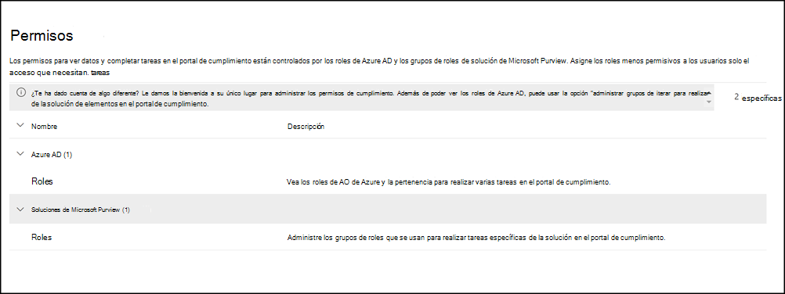

# Permisos en el centro de Microsoft 365 cumplimientoPermissions in the Microsoft 365 compliance center

El Microsoft 365 de cumplimiento se ha actualizado recientemente y ahora admite la administración directa de permisos para los usuarios que realizan tareas de cumplimiento en Microsoft 365.The Microsoft 365 compliance center has been recently updated and now supports directly  managing permissions for users who perform compliance tasks in Microsoft 365. Esta actualización significa que Office 365 ya no tendrá que usar el Centro de seguridad & cumplimiento para administrar los permisos de las soluciones de cumplimiento.This update means you'll no longer have to use the Office 365 Security & Compliance Center to manage permissions for compliance solutions. Con la nueva página Permisos en el centro de cumplimiento de Microsoft 365, puede administrar permisos a los usuarios para tareas de cumplimiento en características como administración de **dispositivos,** prevención de pérdida de datos, exhibición de documentos electrónicos, administración de riesgos insider, retención y muchas otras.Using the new **Permissions** page in the Microsoft 365 compliance center, you can manage permissions to users for compliance tasks in features like device management, data loss prevention, eDiscovery, insider risk management, retention, and many others. Los usuarios solo pueden realizar las tareas de cumplimiento a las que se les conceda acceso explícitamente.Users can perform only the compliance tasks that you explicitly grant them access to.

Para ver la pestaña Permisos en el centro de cumplimiento de Microsoft 365, los  usuarios deben ser administradores globales  o deben tener asignado el rol administración de roles (un rol se asigna solo al grupo de roles Administración de la organización). To view the **Permissions** tab in the Microsoft 365 compliance center, users need to be a global administrator or need to be assigned the *Role Management* role (a role is assigned only to the *Organization Management* role group). El *rol Administración de* roles permite a los usuarios ver, crear y modificar grupos de roles.The *Role Management* role allows users to view, create, and modify role groups.

Los permisos del centro Microsoft 365 cumplimiento se basan en el modelo de permisos de control de acceso basado en roles (RBAC).Permissions in the Microsoft 365 compliance center are based on the role-based access control (RBAC) permissions model. RBAC es el mismo modelo de permisos que usa la mayoría de los servicios de Microsoft 365, por lo que si está familiarizado con la estructura de permisos de estos servicios, la concesión de permisos en el centro de cumplimiento de Microsoft 365 será familiar.RBAC is the same permissions model that's used by most Microsoft 365 services, so if you're familiar with the permission structure in these services, granting permissions in the Microsoft 365 compliance center will be familiar. Es importante recordar que los permisos administrados en el centro de cumplimiento de Microsoft 365 no cubren la administración de todos los permisos necesarios en cada servicio individual.It's important to remember that the permissions managed in the Microsoft 365 compliance center don't cover the management of all the permissions needed in each individual service. Todavía tendrá que administrar ciertos permisos específicos del servicio en el Centro de administración para el servicio específico.You'll still need to manage certain service-specific permissions in the admin center for the specific service. Por ejemplo, si necesita asignar permisos para las directivas de archivado, auditoría y retención, deberá administrar estos permisos en el Centro de administración de Exchange administración.For example, if you need to assign permissions for archiving, auditing, and retention policies, you'll need to manage these permissions in the Exchange admin center.

## Relación de los miembros, los roles y los grupos de rolesRelationship of members, roles, and role groups

Un rol concede permisos para realizar un conjunto de tareas; por ejemplo, el rol Administración de casos permite a los usuarios trabajar con casos de exhibición de documentos electrónicos.A role grants permissions to do a set of tasks; for example, the Case Management role lets users work with eDiscovery cases.

Un grupo de roles es un conjunto de roles que permiten a los usuarios realizar su trabajo en las soluciones de cumplimiento del centro Microsoft 365 cumplimiento.A role group is a set of roles that enable users do their jobs across compliance solutions the Microsoft 365 compliance center. Por ejemplo, al agregar usuarios al grupo de roles De administración de riesgos de *Insider,* los administradores, analistas, investigadores y auditores designados se configuran para los permisos de administración de riesgos insider necesarios en un solo grupo.For example, by adding users to the *Insider Risk Management* role group, designated administrators, analysts, investigators, and auditors are configured for the necessary insider risk management permissions in a single group. El Microsoft 365 de cumplimiento incluye grupos de roles predeterminados para tareas y funciones para cada solución de cumplimiento a la que necesite asignar personas.The Microsoft 365 compliance center includes default role groups for tasks and functions for each compliance solution that you'll need to assign people to. Por lo general, se recomienda simplemente agregar usuarios individuales como miembros a los grupos de roles de cumplimiento predeterminados según sea necesario.Generally, we recommend simply adding individual users as members to the default compliance role groups as needed.

## Permisos necesarios para usar características en el centro de Microsoft 365 cumplimientoPermissions needed to use features in the Microsoft 365 compliance center

Para ver todos los grupos de roles predeterminados que están disponibles en el centro de cumplimiento de Microsoft 365 y los roles que se asignan a los grupos de roles de forma predeterminada, vea permisos en el Centro de seguridad [& cumplimiento](/microsoft-365/security/office-365-security/permissions-in-the-security-and-compliance-center).To view all of the default role groups that are available in the Microsoft 365 compliance center and the roles that are assigned to the role groups by default, see the [Permissions in the Security & Compliance Center](/microsoft-365/security/office-365-security/permissions-in-the-security-and-compliance-center).

La administración de permisos en el Microsoft 365 de cumplimiento solo proporciona a los usuarios acceso a las características de cumplimiento que están disponibles en el centro Microsoft 365 cumplimiento.Managing permissions in the Microsoft 365 compliance center only gives users access to the compliance features that are available within the Microsoft 365 compliance center. Si desea conceder permisos a otras características que no están en el centro de cumplimiento de Microsoft 365, como las reglas de flujo de correo de Exchange (también conocidas como reglas de transporte), deberá usar el Centro de administración de Exchange.If you want to grant permissions to other features that aren't in the Microsoft 365 compliance center, such as Exchange mail flow rules (also known as transport rules), you'll need to use the Exchange admin center.

## Roles de Azure en el centro Microsoft 365 cumplimientoAzure roles in the Microsoft 365 compliance center

Los roles que aparecen en la sección **Roles de Azure AD** de la Microsoft 365 de permisos del centro de cumplimiento son Azure Active Directory  >   roles. The roles that appear in the **Azure AD** > **Roles** section of the Microsoft 365 compliance center **Permissions** page are Azure Active Directory roles. Estos roles están diseñados para alinearse con las funciones de trabajo en el grupo de TI de su organización, lo que facilita otorgar a una persona todos los permisos necesarios para realizar su trabajo.These roles are designed to align with job functions in your organization's IT group, making it easy to give a person all the permissions necessary to get their job done. Puede ver los usuarios asignados actualmente a cada función seleccionando un rol de administrador y viendo los detalles del panel de funciones.You can view the users currently assigned to each role by selecting an Admin role and viewing the role panel details. Para administrar miembros de un rol de Azure AD, seleccione Administrar miembros en Azure AD.To manage members of an Azure AD role, select Manage members in Azure AD. Esta opción le redirige al Portal de administración de Azure.This choice redirects you to the Azure management portal.

|FunciónRole|DescripciónDescription|
|:---|:----------|
|**Administrador global****Global administrator**|Acceso a todas las características administrativas en todos los servicios de Microsoft 365.Access to all administrative features in all Microsoft 365 services. Los administradores globales son los únicos que pueden asignar otros roles de administrador.Only global administrators can assign other administrator roles. Para más información, consulte [Administrador global / Administrador de empresa](/azure/active-directory/roles/permissions-reference#global-administrator--company-administrator).For more information, see [Global Administrator / Company Administrator](/azure/active-directory/roles/permissions-reference#global-administrator--company-administrator).|
|**Administrador de datos de cumplimiento****Compliance data administrator**|Realizar un seguimiento de los datos de su organización a través de Microsoft 365, asegurarse de que están protegidos y obtener información sobre los problemas para ayudar a reducir los riesgos.Keep track of your organization's data across Microsoft 365, make sure it's protected, and get insights into any issues to help mitigate risks. Para obtener más información, consulte [Administrador de datos de cumplimiento](/azure/active-directory/roles/permissions-reference#compliance-data-administrator).For more information, see [Compliance Data Administrator](/azure/active-directory/roles/permissions-reference#compliance-data-administrator).|
|**Administrador de cumplimiento****Compliance administrator**|Ayudar a que su organización cumpla con los requisitos normativos, administrar casos de eDiscovery y mantener directivas de gobierno de datos en todas las ubicaciones, identidades y aplicaciones de Microsoft 365.Help your organization stay compliant with any regulatory requirements, manage eDiscovery cases, and maintain data governance policies across Microsoft 365 locations, identities, and apps. Para obtener más información, consulte [Administrador de cumplimiento](/azure/active-directory/roles/permissions-reference#compliance-administrator).For more information, see [Compliance Administrator](/azure/active-directory/roles/permissions-reference#compliance-administrator).|
|**Operador de seguridad****Security operator**|Ver, investigar y responder a las amenazas activas a usuarios, dispositivos y contenido de Microsoft 365.View, investigate, and respond to active threats to your Microsoft 365 users, devices, and content. Para obtener más información, vea [Operador de seguridad de seguridad](/azure/active-directory/roles/permissions-reference#security-operator).For more information, see [Security Operator](/azure/active-directory/roles/permissions-reference#security-operator).|
|**Lector de seguridad****Security reader**|Ver e investigar amenazas activas a usuarios, dispositivos y contenido de Microsoft 365, pero, a diferencia del operador de seguridad, no tienen permisos para responder realizando una acción.View and investigate active threats to your Microsoft 365 users, devices, and content, but (unlike the Security operator) they do not have permissions to respond by taking action. Para obtener más información, vea [Lector de seguridad](/azure/active-directory/roles/permissions-reference#security-reader).For more information, see [Security Reader](/azure/active-directory/roles/permissions-reference#security-reader).|
|**Administrador de seguridad****Security administrator**|Controlar la seguridad global de la organización mediante la administración de directivas de seguridad, la revisión de análisis de seguridad y los informes en los productos de Microsoft 365, así como mantenerse al día con el panorama de amenazas.Control your organization's overall security by managing security policies, reviewing security analytics and reports across Microsoft 365 products, and staying up-to-speed on the threat landscape. Para obtener más información, vea [Administrador de seguridad](/azure/active-directory/roles/permissions-reference#security-administrator).For more information, see [Security Administrator](/azure/active-directory/roles/permissions-reference#security-administrator).|
|**Lector global****Global reader**|La versión de solo lectura del rol de **Administrador global**.The read-only version of the **Global administrator** role. Ver todas las configuraciones e información administrativa en Microsoft 365.View all settings and administrative information across Microsoft 365. Para más información, vea [Lector global](/azure/active-directory/roles/permissions-reference#global-reader).For more information, see [Global Reader](/azure/active-directory/roles/permissions-reference#global-reader).|
|**Administrador de simulación de ataques****Attack simulation administrator**|Cree y administre todos los aspectos de la creación de simulación de ataque, el inicio/programación de una simulación y la revisión de los resultados de la simulación.Create and manage all aspects of attack simulation creation, launch/scheduling of a simulation, and the review of simulation results. Para obtener más información, vea [Attack Simulation Administrator](/azure/active-directory/roles/permissions-reference#attack-simulation-administrator).For more information, see [Attack Simulation Administrator](/azure/active-directory/roles/permissions-reference#attack-simulation-administrator).|
|**Autor de carga de ataques****Attack payload author**|Crea cargas de ataque pero no las inicias ni programas.Create attack payloads but not actually launch or schedule them. Para obtener más información, vea [Attack Payload Author](/azure/active-directory/roles/permissions-reference#attack-payload-author).For more information, see [Attack Payload Author](/azure/active-directory/roles/permissions-reference#attack-payload-author).|
|

## Agregar usuarios a un grupo de roles de cumplimientoAdd users to a compliance role group

Siga estos pasos para agregar usuarios a un grupo de roles de cumplimiento:Complete the following steps to add users to a compliance role group:

1. Inicie sesión en el área de permisos del centro de [Microsoft 365 de cumplimiento](https://compliance.microsoft.com/permissions) con credenciales para una cuenta de administrador de su Microsoft 365 organización.Sign into the permissions area of the [Microsoft 365 compliance center](https://compliance.microsoft.com/permissions) using credentials for an admin account in your Microsoft 365 organization.
2. En el centro Microsoft 365 cumplimiento, vaya a **Permisos**.In the Microsoft 365 compliance center, go to **Permissions**. Seleccione el vínculo para ver y administrar roles de cumplimiento en Microsoft 365.Select the link to view and manage compliance roles in Microsoft 365.
3. Expanda la **sección Centro de cumplimiento** y seleccione **Roles**.Expand the **Compliance center** section and select **Roles**.
4. En la **página Roles del Centro** de cumplimiento, seleccione un grupo de roles de cumplimiento al que desee agregar usuarios y, a continuación, seleccione Editar grupo **de** roles en el panel de detalles.On the **Compliance center roles** page, select a compliance role group you want to add users to, then select **Edit role group** on the details pane.
5. Seleccione **Elegir miembros** en el panel de navegación izquierdo y, a continuación, seleccione **Editar**.Select **Choose members** from the left navigation pane, then select **Edit**.
6. Seleccione **Agregar** y, a continuación, active la casilla para todos los usuarios que desee agregar al grupo de roles.Select **Add** and then select the checkbox for all users you want to add to the role group.
7. Seleccione **Agregar** y, después, **Listo**.Select **Add**, then select **Done**.
8. Seleccione **Guardar** para agregar los usuarios al grupo de roles.Select **Save** to add the users to the role group. Seleccione **Cerrar** para completar los pasos.Select **Close** to complete the steps.

## Quitar usuarios de un grupo de roles de cumplimientoRemove users from a compliance role group

Siga estos pasos para quitar usuarios de un grupo de roles de cumplimiento:Complete the following steps to remove users from a compliance role group:

1. Inicie sesión en el área de permisos del centro de [Microsoft 365 de cumplimiento](https://compliance.microsoft.com/permissions) con credenciales para una cuenta de administrador de su Microsoft 365 organización.Sign into the permissions area of the [Microsoft 365 compliance center](https://compliance.microsoft.com/permissions) using credentials for an admin account in your Microsoft 365 organization.
2. En el centro Microsoft 365 cumplimiento, vaya a **Permisos**.In the Microsoft 365 compliance center, go to **Permissions**. Seleccione el vínculo para ver y administrar roles de cumplimiento en Microsoft 365.Select the link to view and manage compliance roles in Microsoft 365.
3. Expanda la sección Centro de cumplimiento y seleccione **Roles**.Expand the Compliance center section and select **Roles**.
4. En la **página Roles del centro** de cumplimiento, seleccione un grupo de roles de cumplimiento del que desea quitar usuarios y, a continuación, seleccione Editar grupo **de** roles en el panel de detalles.On the **Compliance center roles** page, select a compliance role group you want to remove users from, then select **Edit role group** on the details pane.
5. Seleccione **Elegir miembros** en el panel de navegación izquierdo y, a continuación, seleccione **Editar**.Select **Choose members** from the left navigation pane, then select **Edit**.
6. Seleccione **Quitar** y, a continuación, active la casilla para todos los usuarios que desee quitar del grupo de roles.Select **Remove** and then select the checkbox for all users you want to remove from the role group.
7. Seleccione **Quitar** y, a continuación, **Seleccione Listo**.Select **Remove**, then select **Done**.
8. Seleccione **Guardar** para quitar los usuarios del grupo de roles.Select **Save** to remove the users from the role group. Seleccione **Cerrar** para completar los pasos.Select **Close** to complete the steps.
