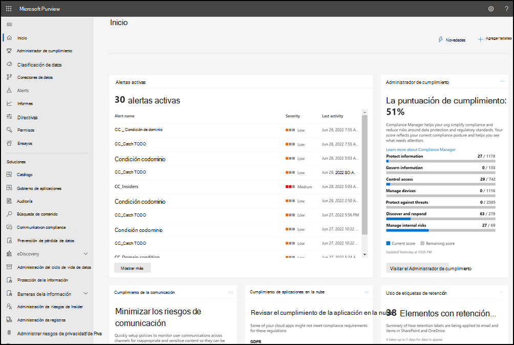
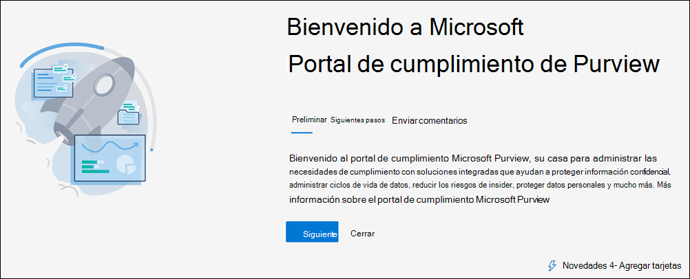
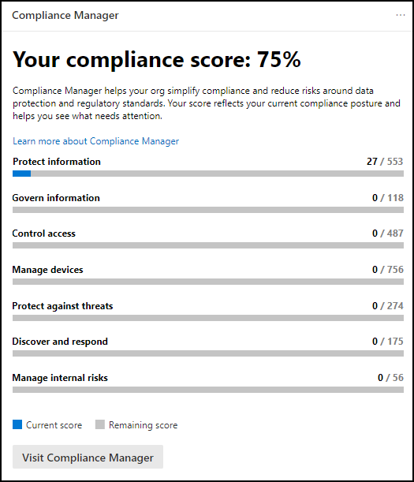
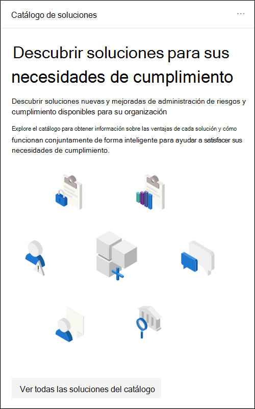
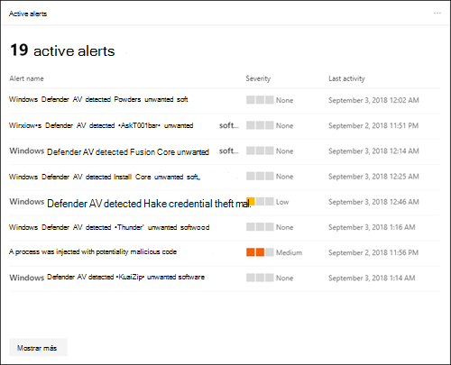
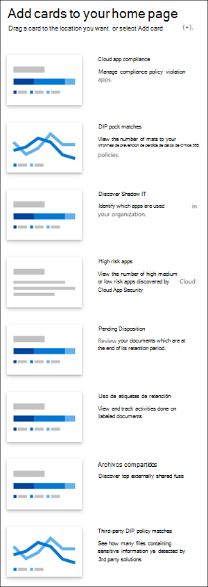
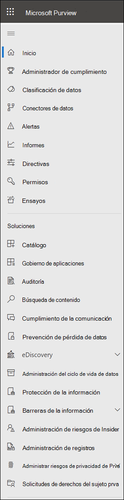
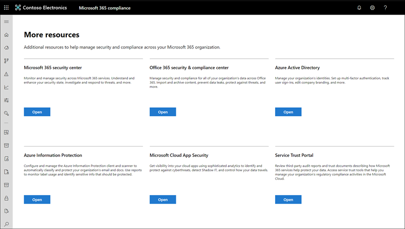

# Centro de cumplimiento de Microsoft 365

Si está interesado en la posición de cumplimiento de su organización, le encantará el Centro de cumplimiento de [Microsoft 365](https://compliance.microsoft.com). El Centro de cumplimiento de Microsoft 365 proporciona un fácil acceso a los datos y herramientas que necesita para administrar a las necesidades de cumplimiento de su organización.

Lea este artículo para familiarizarse con el Centro de cumplimiento de Microsoft 365, cómo obtenerlo, las preguntas más frecuentes y los pasos [siguientes](#next-steps).

## Bienvenido al cumplimiento de Microsoft 365

Cuando vaya a su centro de cumplimiento de Microsoft 365 por primera vez, recibirá el siguiente mensaje de bienvenida:

El banner de bienvenida le ofrece algunos punteros sobre cómo empezar, con los pasos siguientes y una invitación para que nos dé sus comentarios.

## Sección Tarjeta

Cuando visite por primera vez el Centro de cumplimiento de Microsoft 365, la sección de tarjetas de la página principal le muestra de un vistazo cómo está su organización con el cumplimiento de datos, qué soluciones están disponibles para su organización y un resumen de las alertas activas.

Desde aquí, puede:

- Revisa la **tarjeta del Administrador de cumplimiento de Microsoft,** que te lleva a la solución administrador de [cumplimiento.](compliance-manager.md) El Administrador de cumplimiento ayuda a simplificar la forma en que administra el cumplimiento. Calcula una puntuación basada en riesgos que mide su progreso hacia la realización de acciones recomendadas que ayudan a reducir los riesgos en torno a la protección de datos y los estándares normativos. También proporciona capacidades de flujo de trabajo y asignación de control integrada para ayudarle a llevar a cabo acciones de mejora de forma eficaz.

    

- Revise la nueva **tarjeta de catálogo** de  soluciones, que se vincula a colecciones de soluciones integradas que puede usar para ayudarle a administrar escenarios de cumplimiento de extremo a extremo. Las funciones y herramientas de una solución pueden incluir una combinación de directivas, alertas, informes y mucho más.

    

- Revisa la **tarjeta alertas** activas, que  incluye un resumen de las alertas más activas e incluye un vínculo donde puedes ver información más detallada, como Gravedad, Estado, Categoría, etc.

    

También puede usar  la característica Agregar tarjetas para agregar tarjetas adicionales, como una que muestra el cumplimiento de la aplicación en la nube de su organización y otra que muestra datos sobre usuarios con archivos compartidos, con vínculos a [Cloud App Security](/cloud-app-security/) u otras herramientas donde puede explorar datos.

## Navegación sencilla a más características y capacidades de cumplimiento

Además de los vínculos en las tarjetas de la página principal, verá un panel de navegación en el lado izquierdo de la pantalla que le permite acceder fácilmente a las alertas, [informes,](reports-in-security-and-compliance.md) [directivas,](alert-policies.md)soluciones de cumplimiento, etc. Para agregar o quitar opciones para un panel de navegación personalizado, use el control de navegación **Personalizar** en el panel de navegación. Se abre la opción **Personalizar la configuración del panel de** navegación para que pueda configurar los elementos que aparecen en el panel de navegación.

|  |  |
|---------|---------|
|  | Seleccione **Inicio** para volver a la página principal del Centro de cumplimiento de Microsoft 365.   Visite **el Administrador de cumplimiento** para comprobar la puntuación de cumplimiento y empezar a administrar el cumplimiento [de](compliance-manager.md) su organización.    Seleccione la **sección Clasificación de** datos para obtener acceso a [clasificadores capacitados,](classifier-learn-about.md)definiciones de entidad de tipo de información [confidencial,](sensitive-information-type-entity-definitions.md)exploradores de contenido [y](data-classification-activity-explorer.md) actividad.    Seleccione **Conectores de datos para** configurar [conectores para](archiving-third-party-data.md) importar y archivar datos en su suscripción de Microsoft 365.    Vaya a **Alertas** para ver y resolver [alertas](alert-policies.md)   Visita **Informes** para ver datos sobre el uso y retención de [etiquetas, coincidencias](view-the-dlp-reports.md)e invalidaciones de directivas DLP, archivos compartidos, aplicaciones [de terceros](/cloud-app-security/discovered-apps)en uso y mucho más.    Vaya a **Directivas para** configurar directivas para controlar datos, administrar dispositivos y recibir [alertas.](../security/office-365-security/alerts.md) También puede obtener acceso a sus [directivas de dlp](data-loss-prevention-policies.md) y [retención.](retention.md)   Seleccione **Permisos para** administrar quién en su organización tiene acceso al Centro de cumplimiento de Microsoft 365 para ver contenido y completar tareas.    Use los vínculos de la **sección Soluciones** para obtener acceso a las soluciones de cumplimiento de su organización. Entre ellos se incluyen:    [Catalog](microsoft-365-solution-catalog.md)   Descubra, aprenda y comience a usar las soluciones inteligentes de administración de riesgos y cumplimiento disponibles para su organización.    [Auditoría](search-the-audit-log-in-security-and-compliance.md)   Use el registro de auditoría para investigar problemas comunes de compatibilidad y cumplimiento.    [Búsqueda de contenido](search-for-content.md)   Use la búsqueda de contenido para buscar rápidamente correo electrónico en buzones de Exchange, documentos en sitios de SharePoint y ubicaciones de OneDrive y conversaciones de mensajería instantánea en Microsoft Teams y Skype Empresarial.    [Cumplimiento de las comunicaciones](communication-compliance.md)   Minimice los riesgos de comunicación capturando automáticamente mensajes inapropiados, investigando posibles infracciones de directivas y tomando medidas para corregir.    [Prevención de pérdida de datos (DLP)](data-loss-prevention-policies.md)   Detecte contenido confidencial mientras se usa y comparte en toda la organización, en la nube y en los dispositivos, y ayuda a evitar la pérdida accidental de datos.    [Solicitudes de interesados](/compliance/regulatory/gdpr-manage-gdpr-data-subject-requests-with-the-dsr-case-tool)   Busque y exporte los datos personales de un usuario para ayudarle a responder a las solicitudes del interesado para el Reglamento general de protección de datos (RGPD).    [Exhibición de documentos electrónicos (eDiscovery)](overview-ediscovery-20.md)   Expanda esta sección para usar la eDiscovery básica y avanzada para conservar, recopilar, revisar, analizar y exportar contenido que responda a las investigaciones internas y externas de su organización.    [Información de gobierno](manage-information-governance.md)   Administre el ciclo de vida del contenido con características para importar, almacenar y clasificar datos críticos para la empresa, de modo que pueda mantener lo que necesita y eliminar lo que no.    [Protección de la información](information-protection.md)   Descubra, clasifique y proteja contenido confidencial y crítico para la empresa durante todo su ciclo de vida en toda la organización.    [Administración de riesgos internos](insider-risk-management.md)   Detecte actividades de riesgo en toda la organización para ayudarle a identificar, investigar y tomar medidas rápidamente en riesgos y amenazas internas.    [Administración de registros](records-management.md)   Automatice y simplifique la programación de retención de registros normativos, legales y críticos para la empresa en su organización.

## ¿Cómo puedo obtener el centro de cumplimiento?

- Si aún no tiene el nuevo centro de cumplimiento de Microsoft 365, lo tendrá pronto. El Centro de cumplimiento de Microsoft 365 suele estar disponible ahora para los clientes de SKU de Microsoft 365.

- Para visitar el Centro de cumplimiento de Microsoft 365, como administrador global, administrador de cumplimiento o administrador de datos de cumplimiento, vaya a [https://compliance.microsoft.com](https://compliance.microsoft.com) e inicie sesión.

## Preguntas frecuentes

**¿Por qué voy al Centro de seguridad & cumplimiento para completar algunas tareas, como definir determinadas directivas?**

Todavía estamos desarrollando el centro de cumplimiento de Microsoft 365 y agregamos más funcionalidad y soluciones en los próximos meses. Mientras tanto, hay algunas tareas que deben completarse en el Centro de seguridad y & cumplimiento ( [https://protection.office.com](https://protection.office.com) ). En esos casos, se le dirigirá automáticamente a la ubicación donde puede completar la tarea a mano, como crear o editar una directiva de supervisión.

**¿Por qué no veo el nuevo centro de cumplimiento de Microsoft 365 todavía?**

En primer lugar, asegúrese de que tiene las licencias y permisos adecuados. A continuación, inicie sesión en [https://compliance.microsoft.com](https://compliance.microsoft.com) . Si aún no ve el nuevo centro de cumplimiento, lo tendrá pronto.

**Algunas de mis características de cumplimiento no están disponibles en el Centro de cumplimiento de Microsoft 365. ¿Qué hago?**

Seguimos agregando funcionalidad al Centro de cumplimiento de Microsoft 365. Si no encuentra algo, como la búsqueda del registro de auditoría, use el Centro de seguridad & cumplimiento ( [https://protection.office.com](https://protection.office.com) ). Las configuraciones se guardan automáticamente en el Centro de seguridad & cumplimiento y en el nuevo Centro de cumplimiento de Microsoft 365.

Para ir allí, en el Centro de cumplimiento de Microsoft 365, en el panel de navegación de la parte izquierda de la pantalla, elija Más recursos y, a continuación, en Centro de seguridad & cumplimiento de **Office 365,** elija **Abrir**.

## Pasos siguientes

- **Visite El Administrador de cumplimiento de Microsoft** para ver la puntuación de cumplimiento y empezar a administrar el cumplimiento de su organización. Para obtener más información, vea [Compliance Manager](compliance-manager.md).

- **Configure directivas de administración de** riesgos internos para ayudar a minimizar los riesgos internos y permitirle detectar, investigar y tomar medidas para actividades de riesgo en su organización. Consulte [Administración de riesgos de Insider](insider-risk-management.md).

- **Revise las directivas de prevención de pérdida de** datos de su organización y realice los cambios necesarios según sea necesario. Para obtener más información, vea [Overview of data loss prevention policies](data-loss-prevention-policies.md).

- **Familiarizarse con Microsoft Cloud App Security y configurarlo.** Consulte [Inicio rápido: Introducción a Microsoft Cloud App Security](/cloud-app-security/getting-started-with-cloud-app-security).

- **Obtenga información sobre y cree directivas de cumplimiento de comunicaciones** para identificar y corregir rápidamente las infracciones de directivas de código de conducta corporativas. Vea [Cumplimiento de comunicaciones en Microsoft 365](communication-compliance.md).

- **Visite su centro de cumplimiento de Microsoft 365** a menudo y asegúrese de revisar las alertas o posibles riesgos que surjan. Vaya a [https://compliance.microsoft.com](https://compliance.microsoft.com) e inicie sesión.