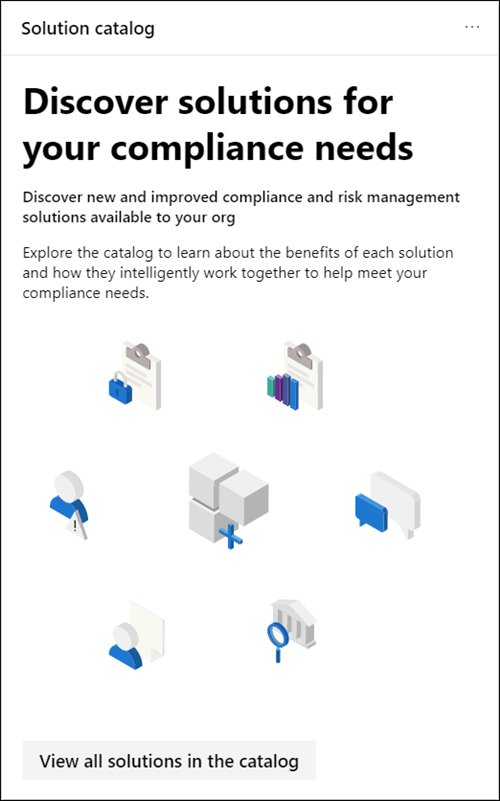

# Información general del centro de cumplimiento de Microsoft 365Overview of the Microsoft 365 compliance center

## Información generalOverview

Si está interesado en la postura de cumplimiento de su organización, le va a encantar el [centro de cumplimiento de Microsoft 365](https://compliance.microsoft.com).If you're interested in your organization's compliance posture, you're going to love the [Microsoft 365 compliance center](https://compliance.microsoft.com). El centro de cumplimiento de Microsoft 365 proporciona acceso sencillo a los datos y las herramientas que necesita para administrar las necesidades de cumplimiento de su organización.The Microsoft 365 compliance center provides easy access to the data and tools you need to manage to your organization's compliance needs.

Lea este artículo para familiarizarse con el centro de cumplimiento de Microsoft 365, [Cómo obtenerlo](#how-do-i-get-the-compliance-center), las [preguntas más](#frequently-asked-questions)frecuentes y los [pasos siguientes](#next-steps).Read this article to get acquainted with the Microsoft 365 compliance center, [how to get it](#how-do-i-get-the-compliance-center), [frequently asked questions](#frequently-asked-questions), and your [next steps](#next-steps).

## Bienvenido a Microsoft 365 cumplimiento normativoWelcome to Microsoft 365 compliance

Cuando vaya a su centro de cumplimiento de Microsoft 365 por primera vez, verá el siguiente mensaje de bienvenida:When you go to your Microsoft 365 compliance center for the first time, you're greeted with the following welcome message:

El banner de bienvenida le proporciona algunos punteros sobre cómo empezar, con los siguientes pasos y una invitación para que le envíenos sus comentarios.The welcome banner gives you some pointers on how to get started, with next steps, and an invitation for you to give us feedback.

## Sección tarjetaCard section

La primera vez que visite el centro de cumplimiento de Microsoft 365, en la sección tarjeta de la Página principal se muestra de un vistazo cómo está haciendo su organización con el cumplimiento de datos, qué soluciones hay disponibles para su organización y un resumen de todas las alertas activas.When you first visit the Microsoft 365 compliance center, the card section on the home page shows you at a glance how your organization is doing with data compliance, what solutions are available for your organization, and a summary of any active alerts.

Desde aquí, puede:From here, you can:

- Revise la tarjeta de **puntuación de cumplimiento de Microsoft** , que le conduce a la nueva solución de puntuación de [cumplimiento](compliance-score.md) .Review the **Microsoft Compliance Score** card, which leads you to the new [Compliance Score](compliance-score.md) solution. Calcula una puntuación basada en riesgos que mide el progreso para completar las acciones recomendadas que ayudan a reducir los riesgos en torno a la protección de datos y a los estándares normativos.It calculates a risk-based score that measures your progress toward completing recommended actions that help reduce risks around data protection and regulatory standards. También proporciona funciones de flujo de trabajo y una asignación de control integrada para ayudarle a llevar a cabo dichas acciones de manera eficaz.It also provides workflow capabilities and built-in control mapping to help you efficiently carry out those actions.

    

- Revise la nueva tarjeta de **Catálogo de soluciones** , que vincula a colecciones de [soluciones integradas](microsoft-365-solution-catalog.md) que puede usar para administrar escenarios de cumplimiento de un extremo a otro.Review the new **Solution catalog** card, which links to collections of [integrated solutions](microsoft-365-solution-catalog.md) you can use to help you manage end-to-end compliance scenarios. Las herramientas y capacidades de una solución pueden incluir una combinación de directivas, alertas, informes y mucho más.A solution's capabilities and tools might include a combination of policies, alerts, reports, and more.

    

- Revise la tarjeta de **alertas activa** , que incluye un resumen de las [alertas más activas](alert-policies.md) e incluye un vínculo en el que puede ver información más detallada, como gravedad, estado, categoría y más.Review the **Active alerts** card, which includes a summary of the most [active alerts](alert-policies.md) and includes a link where you can view more detailed information, such as Severity, Status, Category, and more.

    

También puede usar la característica **Agregar tarjetas** para agregar tarjetas adicionales, como una que muestre el cumplimiento de aplicaciones en la nube de su organización y otra que muestre datos sobre los usuarios con archivos compartidos, con vínculos a [Cloud App Security](https://docs.microsoft.com/cloud-app-security/) u otras herramientas en las que puede explorar datos.You can also use the **Add cards** feature to add additional cards, such as one showing your organization's cloud app compliance, and another showing data about users with shared files, with links to [Cloud App Security](https://docs.microsoft.com/cloud-app-security/) or other tools where you can explore data.

## Navegación sencilla a más características y capacidades de cumplimientoEasy navigation to more compliance features and capabilities

Además de los vínculos de las tarjetas en la Página principal, verá un panel de navegación en la parte izquierda de la pantalla que le proporcionará acceso sencillo a sus [avisos](../security/office-365-security/alerts.md), [informes](reports-in-security-and-compliance.md), [directivas](alert-policies.md), soluciones de cumplimiento y mucho más.In addition to links in cards on the home page, you'll see a navigation pane on the left side of the screen that gives you easy access to your [alerts](../security/office-365-security/alerts.md), [reports](reports-in-security-and-compliance.md), [policies](alert-policies.md), compliance solutions, and more.

|  |  |
|---------|---------|
|  | Seleccione **Inicio** para volver a la Página principal del centro de cumplimiento de Microsoft 365.Select **Home** to return to the Microsoft 365 compliance center main page.    Seleccione la sección **clasificación de datos** para acceder a [clasificadores](classifier-getting-started-with.md)que se puedan entrenar, [tipos de información confidencial](what-the-sensitive-information-types-look-for.md), exploradores de contenido y [actividades](data-classification-activity-explorer.md) .Select the **Data classification** section to access [trainable classifiers](classifier-getting-started-with.md), [sensitive info types](what-the-sensitive-information-types-look-for.md), content and [activity](data-classification-activity-explorer.md) explorers.    Seleccione **conectores de datos** para [configurar los conectores](archiving-third-party-data.md) para importar y archivar datos en su suscripción de Microsoft 365.Select **Data connectors** to [configure connectors](archiving-third-party-data.md) to import and archive data in your Microsoft 365 subscription.    Ir a **alertas** para ver y resolver [alertas](alert-policies.md)Go to **Alerts** to view and resolve [alerts](alert-policies.md)   Visite **Reports** para ver los datos sobre el [uso y la retención de etiquetas](sensitivity-labels.md), las [coincidencias de directivas de DLP y las invalidaciones](view-the-dlp-reports.md), [los archivos compartidos](https://docs.microsoft.com/cloud-app-security/file-filters), las [aplicaciones de terceros en uso](https://docs.microsoft.com/cloud-app-security/discovered-apps)y mucho más.Visit **Reports** to view data about [label usage and retention](sensitivity-labels.md), [DLP policy matches and overrides](view-the-dlp-reports.md), [shared files](https://docs.microsoft.com/cloud-app-security/file-filters), [third-party apps in use](https://docs.microsoft.com/cloud-app-security/discovered-apps), and more.    Vaya a **directivas** para configurar las directivas para regir los datos, administrar dispositivos y recibir [alertas](../security/office-365-security/alerts.md).Go to **Policies** to set up policies to govern data, manage devices, and receive [alerts](../security/office-365-security/alerts.md). También puede acceder a su [DLP](data-loss-prevention-policies.md) y a las directivas de [retención](retention-policies.md) .You can also access your [DLP](data-loss-prevention-policies.md) and [retention](retention-policies.md) policies.   Seleccione **permisos** para administrar quién en su organización tiene acceso al centro de cumplimiento de Microsoft 365 para ver el contenido y completar las tareas.Select **Permissions** to manage who in your organization has access to the Microsoft 365 compliance center to view content and complete tasks.    Use los vínculos de la sección **soluciones** para acceder a las soluciones de cumplimiento de la organización.Use the links in the **Solutions** section to access your organization's compliance solutions. Entre ellos se incluyen:These include:    [CatalogCatalog](microsoft-365-solution-catalog.md)   Descubra, aprenda y empiece a usar las soluciones de administración de riesgos y cumplimiento inteligente disponibles para su organización.Discover, learn about, and start using the intelligent compliance and risk management solutions available to your organization.    [Protección de la informaciónInformation protection](protect-information.md)   Descubra, clasifique y proteja contenido crítico y empresarial importante durante su ciclo de vida en toda la organización.Discover, classify, and protect sensitive and business-critical content throughout its lifecycle across your organization.    [Protección contra la pérdida de datosData loss protection](data-loss-prevention-policies.md)   Detectar contenido confidencial mientras se usa y se comparte en la organización, en la nube y en dispositivos, y ayuda a evitar la pérdida de datos accidental.Detect sensitive content as it's used and shared throughout your organization, in the cloud and on devices, and helps prevent accidental data loss.    [Administración de registrosRecords management](records-management.md)   Automatizar y simplificar la programación de retención para los registros normativos, legales y empresariales críticos de la organización.Automate and simplify the retention schedule for regulatory, legal and business-critical records in your organization.    [Gobierno de la informaciónInformation governance](manage-information-governance.md)   Administre su ciclo de vida del contenido mediante el uso de características para importar, almacenar y clasificar datos críticos para la empresa de modo que pueda conservar lo que necesita y eliminar lo que no.Manage your content lifecycle using features to import, store, and classify business-critical data so you can keep what you need and delete what you don't.    [Solicitudes de interesadosData subject requests](manage-gdpr-data-subject-requests-with-the-dsr-case-tool.md)   Busque y exporte los datos personales de un usuario para ayudarle a responder a las solicitudes de los interesados en el Reglamento General de protección de datos (RGPD).Find and export a user’s personal data to help you respond to data subject requests for the General Data Protection Regulation (GDPR).    [Búsqueda de contenidoContent search](search-for-content.md)   Use la búsqueda de contenido para encontrar rápidamente el correo electrónico en buzones de Exchange, documentos en sitios de SharePoint y ubicaciones de OneDrive, y conversaciones de mensajería instantánea en Microsoft Teams y Skype empresarial.Use Content search to quickly find email in Exchange mailboxes, documents in SharePoint sites and OneDrive locations, and instant messaging conversations in Microsoft Teams and Skype for Business.    [LasAudit](search-the-audit-log-in-security-and-compliance.md)   Use el registro de auditoría para investigar problemas comunes de compatibilidad y cumplimiento normativo.Use the Audit log to investigate common support and compliance issues.    [Exhibición de documentos electrónicos (eDiscovery)eDiscovery](overview-ediscovery-20.md)   Expanda esta sección para usar la exhibición de documentos electrónicos principal y avanzada para conservar, recopilar, revisar, analizar y exportar contenido que responde a las investigaciones internas y externas de su organización.Expand this section to use the core and Advanced eDiscovery for preserving, collecting, reviewing, analyzing, and exporting content that's responsive to your organization's internal and external investigations.    [Investigaciones de datosData investigations](overview-data-investigations.md)   Buscar en las ubicaciones de contenido para identificar datos confidenciales, malintencionados o mal colocados en Microsoft 365 para que pueda investigar y corregir cualquier incidente, como la derramación de datos.Search across content locations to identify sensitive, malicious, or misplaced data across Microsoft 365 so you can investigate and remediate any incidents, such as data spillage.    [Cumplimiento con la comunidadCommunication compliance](communication-compliance.md)   Minimice los riesgos de comunicación mediante la captura automática de mensajes inapropiados, la investigación de posibles infracciones de directivas y la realización de pasos para la corrección.Minimize communication risks by automatically capturing inappropriate messages, investigating possible policy violations, and taking steps to remediate.

## ¿Cómo obtengo el centro de cumplimiento?How do I get the compliance center?

- Si aún no tiene el nuevo centro de cumplimiento de Microsoft 365, lo tendrá pronto.If you don't have the new Microsoft 365 compliance center already, you'll have it soon. El centro de cumplimiento de Microsoft 365 suele estar disponible para los clientes de SKU de Microsoft 365.The Microsoft 365 compliance center is generally available now to Microsoft 365 SKU customers.

- Para visitar el centro de cumplimiento de Microsoft 365, como administrador global, administrador de cumplimiento o administrador de datos de [https://compliance.microsoft.com](https://compliance.microsoft.com) cumplimiento, vaya a e inicie sesión.To visit the Microsoft 365 compliance center, as a global administrator, compliance administrator, or compliance data administrator go to [https://compliance.microsoft.com](https://compliance.microsoft.com) and sign in.

## Preguntas más frecuentesFrequently asked questions

**¿Por qué me he extraído al centro de cumplimiento de & de seguridad de Office 365 para completar algunas tareas, como la definición de determinadas directivas?****Why am I taken to the Office 365 Security & Compliance Center to complete some tasks, such as defining certain policies?**

Todavía estamos desarrollando el centro de cumplimiento de Microsoft 365 y agregamos más funcionalidad y soluciones en los próximos meses.We're still developing the Microsoft 365 compliance center, and we add more functionality and solutions over the coming months. Mientras tanto, hay algunas tareas que deben completarse en el centro de seguridad & cumplimiento de Office 365 ([https://protection.office.com](https://protection.office.com)).In the meantime, there are a few tasks that must be completed in the Office 365 Security & Compliance Center ([https://protection.office.com](https://protection.office.com)). En estos casos, se le redirigirá automáticamente a la ubicación donde puede completar la tarea en cuestión, como la creación o edición de una directiva de supervisión.In those cases, you'll be directed automatically to the location where you can complete the task at hand, such as creating or editing a supervision policy.

**¿Por qué no veo todavía el nuevo centro de cumplimiento de Microsoft 365?****Why don't I see the new Microsoft 365 compliance center yet?**

En primer lugar, asegúrese de que tiene las licencias y los permisos adecuados.First, make sure that you have the appropriate licenses and permissions. A continuación, inicie sesión [https://compliance.microsoft.com](https://compliance.microsoft.com)en.Then, sign in at [https://compliance.microsoft.com](https://compliance.microsoft.com). Si aún no ve el nuevo centro de cumplimiento, lo tendrá pronto.If you don't see the new compliance center yet, you'll have it soon.

**Algunas de mis características de cumplimiento no están disponibles en el centro de cumplimiento de Microsoft 365. ¿Qué hago?****Some of my compliance features aren't available in the Microsoft 365 compliance center. What do I do?**

Todavía estamos agregando funcionalidad al centro de cumplimiento de Microsoft 365.We're still adding functionality to the Microsoft 365 compliance center. Si no encuentra algo, como la búsqueda de registros de auditoría, use el centro de seguridad & cumplimiento de[https://protection.office.com](https://protection.office.com)Office 365 ().If you can't find something, such as audit log search, use the Office 365 Security & Compliance Center ([https://protection.office.com](https://protection.office.com)). Las configuraciones se guardan tanto en el centro de cumplimiento de & de seguridad de Office 365 como en el nuevo centro de cumplimiento de Microsoft 365 automáticamente.Your configurations are saved in both the existing Office 365 Security & Compliance Center and in the new Microsoft 365 compliance center automatically.

Para ir allí, en el centro de cumplimiento de Microsoft 365, en el panel de navegación de la izquierda de la pantalla, elija **más recursos**y, a continuación, en **Office 365 Security & el centro de cumplimiento**, elija **abrir**.To go there, in the Microsoft 365 compliance center, in the navigation pane on the left side of the screen, choose **More resources**, and then, under **Office 365 security & compliance center**, choose **Open**.

## Pasos siguientesNext steps

- **Revise su puntuación de cumplimiento de Microsoft** para mejorar la puntuación de cumplimiento.**Review your Microsoft Compliance Score** to improve your compliance score. Para obtener más información, consulte [calificación de cumplimiento (vista previa)](compliance-score.md).To learn more, see [Compliance Score (Preview)](compliance-score.md).

- **Revise las directivas de prevención de pérdida de datos de la organización** y realice los cambios necesarios según sea necesario.**Review your organization's data loss prevention policies** and make required changes as necessary. Para obtener más información sobre, consulte [información general sobre las directivas de prevención de pérdida de datos](data-loss-prevention-policies.md).To learn more about, see [Overview of data loss prevention policies](data-loss-prevention-policies.md).

- **Familiarícese con y configure Microsoft Cloud App Security**.**Get acquainted with and set up Microsoft Cloud App Security**. Consulte [QuickStart: Introducción a Microsoft Cloud App Security](https://docs.microsoft.com/cloud-app-security/getting-started-with-cloud-app-security).See [Quickstart: Get started with Microsoft Cloud App Security](https://docs.microsoft.com/cloud-app-security/getting-started-with-cloud-app-security).

- **Obtenga información sobre y cree directivas de cumplimiento de comunicaciones** para identificar y corregir rápidamente las infracciones de directivas corporativas sobre código de conducta.**Learn about and create communication compliance policies** to quickly identify and remediate corporate code-of-conduct policy violations. Consulte [cumplimiento de la comunicación en Microsoft 365](communication-compliance.md).See [Communication compliance in Microsoft 365](communication-compliance.md).

- **Visite el centro de cumplimiento de Microsoft 365 con frecuencia**y asegúrese de revisar las alertas o los posibles riesgos que surjan.**Visit your Microsoft 365 compliance center often**, and make sure to review any alerts or potential risks that arise. Vaya a [https://compliance.microsoft.com](https://compliance.microsoft.com) e inicie sesión.Go to [https://compliance.microsoft.com](https://compliance.microsoft.com) and sign in.