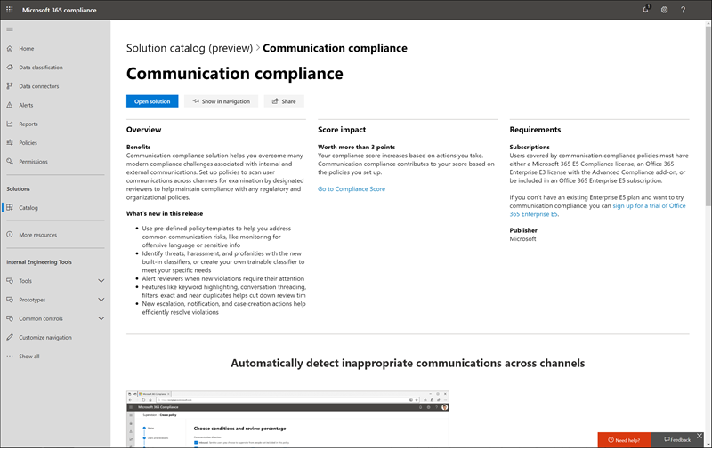

# Información general sobre el catálogo de soluciones de Microsoft 365 (versión preliminar)Overview of the Microsoft 365 solution catalog (preview)

## Información generalOverview

¿Necesita una forma rápida de empezar a trabajar con las tareas de cumplimiento en Microsoft 365?Are you looking for a way to quickly get started with compliance tasks in Microsoft 365? Consulte el nuevo [Catálogo de soluciones de Microsoft 365](https://compliance.microsoft.com/solutioncatalog) para descubrir, aprender y comenzar rápidamente con soluciones de administración de riesgos y cumplimiento de normas.Check out the new [Microsoft 365 solution catalog](https://compliance.microsoft.com/solutioncatalog) to discover, learn, and quickly get started with compliance and risk management solutions.

Las soluciones de cumplimiento de Microsoft 365 son colecciones de capacidades integradas que puede usar para ayudarle a administrar escenarios de cumplimiento de un extremo a otro.Compliance solutions in Microsoft 365 are collections of integrated capabilities you can use to help you manage end-to-end compliance scenarios. Las herramientas y capacidades de una solución pueden incluir una combinación de directivas, alertas, informes y mucho más.A solution's capabilities and tools might include a combination of policies, alerts, reports, and more.

Lea este artículo para familiarizarse con el nuevo catálogo de soluciones en el centro de cumplimiento de Microsoft 365, [Cómo obtenerlo](#how-do-i-get-this), las [preguntas más](#frequently-asked-questions)frecuentes y los [pasos siguientes](#next-steps).Read this article to get acquainted with the new solution catalog in the Microsoft 365 compliance center, [how to get it](#how-do-i-get-this), [frequently asked questions](#frequently-asked-questions), and your [next steps](#next-steps).

## Organización del catálogoCatalog organization

El catálogo de soluciones está organizado en secciones que contienen tarjetas de información para cada solución de cumplimiento disponible en la suscripción a Microsoft 365.The solution catalog is organized into sections that contain information cards for each compliance solution available in your Microsoft 365 subscription. Cada sección contiene tarjetas para soluciones agrupadas por área de cumplimiento.Each section contains cards for solutions grouped by compliance area.

Al seleccionar **Ver** para una tarjeta de solución, verá información detallada sobre la solución de cumplimiento y cómo comenzar.When you select **View** for a solution card, you'll see detailed information about the compliance solution and how to get started. Esta información incluye una introducción, los requisitos previos a la configuración, los recursos de aprendizaje, los controles que permiten anclar la tarjeta al panel de navegación y una opción para compartir la solución como un vínculo, un correo electrónico o un mensaje de Microsoft Teams.This information includes an overview, pre-configuration requirements, learning resources, controls that allow you to pin the card to the navigation pane, and an option to share the solution as a link, email, or Microsoft Teams message.

## Sección de gobierno de & Information ProtectionInformation protection & governance section

La sección de **gobierno de Information protection &** le muestra de un vistazo cómo puede usar las soluciones de cumplimiento de Microsoft 365 para proteger y controlar los datos de su organización.The **Information protection & governance** section shows you at a glance how you can use Microsoft 365 compliance solutions to protect and govern data in your organization.

Desde aquí, verá tarjetas para las siguientes soluciones:From here, you'll see cards for the following solutions:

- [Prevención de pérdida de datos](data-loss-prevention-policies.md): detecta contenido confidencial mientras se usa y se comparte en la organización, en la nube y en dispositivos, y ayuda a evitar la pérdida de datos accidental.[Data loss prevention](data-loss-prevention-policies.md): Detects sensitive content as it's used and shared throughout your organization, in the cloud and on devices, and helps prevent accidental data loss.
- [Gobierno](manage-information-governance.md)de la información: administra el ciclo de vida del contenido mediante soluciones para importar, almacenar y clasificar los datos críticos para el negocio de modo que pueda conservar lo que necesita y eliminar lo que no.[Information governance](manage-information-governance.md): Manages your content lifecycle using solutions to import, store, and classify business-critical data so you can keep what you need and delete what you don’t.
- [Protección](protect-information.md)de la información: detecta, clasifica y protege contenido crítico y empresarial importante durante su ciclo de vida en toda la organización.[Information protection](protect-information.md): Discovers, classifies, and protects sensitive and business-critical content throughout its lifecycle across your organization.
- [Administración de registros](records-management.md): usa una clasificación inteligente para automatizar y simplificar la programación de retención para los registros normativos, legales y empresariales de la organización.[Records management](records-management.md): Uses intelligent classification to automate and simplify the retention schedule for regulatory, legal, and business-critical records in your organization.

## Sección de administración de riesgos de InsiderInsider risk management section

La sección **Administración de riesgos de Insider** de la Página principal muestra de un vistazo cómo su organización puede identificar, analizar y corregir los riesgos internos antes de que puedan dañarlos.The **Insider risk management** section on the home page shows you at a glance how your organization can identify, analyze, and remediate internal risks before they cause harm.

Desde aquí, puede ir a una tarjeta para la siguiente solución:From here, you can go to a card for the following solution:

- [Cumplimiento](communication-compliance.md)de la comunicación: minimiza los riesgos de comunicación al ayudarle a capturar mensajes inapropiados de forma automática, investigar posibles infracciones de directivas y tomar medidas para corregirlo.[Communication compliance](communication-compliance.md): Minimizes communication risks by helping you automatically capture inappropriate messages, investigate possible policy violations, and take steps to remediate.

## Sección de respuesta de & de detecciónDiscovery & response section

La sección de **& respuesta de detección** de la Página principal muestra de un vistazo cómo su organización puede buscar, investigar y responder a los problemas de cumplimiento con los datos relevantes de manera rápida.The **Discovery & response** section on the home page shows you at a glance how your organization can quickly find, investigate, and respond to compliance issues with relevant data.

Desde aquí, verá tarjetas para las siguientes soluciones:From here, you'll see cards for the following solutions:

- [Audit](search-the-audit-log-in-security-and-compliance.md): registra la actividad de usuario y de administrador de su organización para que pueda buscar en el registro de auditoría e investigar una lista completa de actividades en todas las ubicaciones y servicios.[Audit](search-the-audit-log-in-security-and-compliance.md): Records user and admin activity from your organization so you can search the audit log and investigate a comprehensive list of activities across all locations and services.
- [Investigaciones de datos](overview-data-investigations.md): busca en las ubicaciones de contenido para identificar datos confidenciales, malintencionados o mal colocados en ubicaciones de Microsoft 365, de modo que pueda investigar y corregir cualquier incidente, como la derramación de datos.[Data investigations](overview-data-investigations.md): Searches across content locations to identify sensitive, malicious, or misplaced data across Microsoft 365 locations so you can investigate and remediate any incidents, such as data spillage.
- [Solicitudes de interesados de datos](manage-gdpr-data-subject-requests-with-the-dsr-case-tool.md): busca y exporta los datos personales de un usuario para ayudarle a responder a las solicitudes del interesado para RGPD.[Data subject requests](manage-gdpr-data-subject-requests-with-the-dsr-case-tool.md): Finds and exports a user’s personal data to help you respond to data subject requests for GDPR.
- [Exhibición de documentos electrónicos (eDiscovery)eDiscovery](manage-legal-investigations.md)
    - [Exhibición](ediscovery-cases.md)de documentos electrónicos principal: busca en las ubicaciones de contenido para identificar, conservar y exportar datos en respuesta a solicitudes de descubrimiento legal y casos de exhibición de documentos electrónicos.[Core eDiscovery](ediscovery-cases.md): Searches across content locations to identify, preserve, and export data in response to legal discovery requests and eDiscovery cases.
    - [Exhibición avanzada](overview-ediscovery-20.md)de documentos electrónicos: se basa en las funcionalidades de eDiscovery al ofrecer análisis inteligentes y aprendizaje automático para ayudarle a analizar aún más los datos relevantes para las solicitudes de detección.[Advanced eDiscovery](overview-ediscovery-20.md): Builds on eDiscovery capabilities by providing intelligent analytics and  machine learning to help you further analyze data that’s relevant to discovery requests.

## ¿Cómo obtengo esto?How do I get this?

- Si aún no tiene el nuevo catálogo de soluciones de Microsoft 365, lo tendrá pronto.If you don't have the new Microsoft 365 solution catalog already, you'll have it soon. Estamos habilitando el catálogo de soluciones para todas las suscripciones de Microsoft 365 en un lanzamiento incremental.We're enabling the solution catalog for all Microsoft 365 subscriptions in an incremental rollout.

- Para visitar el catálogo de soluciones de 365 de Microsoft [https://compliance.microsoft.com](https://compliance.microsoft.com) , vaya a e inicie sesión como administrador global, administrador de cumplimiento o administrador de datos de cumplimiento.To visit the Microsoft 365 solution catalog, go to [https://compliance.microsoft.com](https://compliance.microsoft.com) and sign in as a global administrator, compliance administrator, or compliance data administrator. Seleccione **Catálogo** en el panel de navegación de la parte izquierda de la pantalla para abrir la Página principal del catálogo.Select **Catalog** in the navigation pane on the left side of the screen to open the catalog home page.

- Para obtener más información acerca de los requisitos, consulte [licencias y permisos necesarios](../security/office-365-security/microsoft-security-and-compliance.md#required-licenses-and-permissions).To learn more about requirements, see [Required licenses and permissions](../security/office-365-security/microsoft-security-and-compliance.md#required-licenses-and-permissions).

## Preguntas más frecuentesFrequently asked questions

**¿Por qué no veo todavía el nuevo catálogo de soluciones de Microsoft 365?****Why don't I see the new Microsoft 365 solution catalog yet?**

En primer lugar, asegúrese de que tiene las [licencias y los permisos](../security/office-365-security/microsoft-security-and-compliance.md#required-licenses-and-permissions)adecuados.First, make sure that you have the appropriate [licenses and permissions](../security/office-365-security/microsoft-security-and-compliance.md#required-licenses-and-permissions). A continuación, inicie sesión [https://compliance.microsoft.com](https://compliance.microsoft.com) como administrador global, administrador de cumplimiento o administrador de datos de cumplimiento.Then, sign in at [https://compliance.microsoft.com](https://compliance.microsoft.com) as a global administrator, compliance administrator, or compliance data administrator. Si todavía no ve el nuevo catálogo de soluciones en el panel de navegación izquierdo, lo tendrá pronto.If you still don't see the new solution catalog in the left navigation pane yet, you'll have it soon.

**Algunas de las características de cumplimiento que aparecen en la página Catálogo de soluciones no están disponibles en el centro de cumplimiento de Microsoft 365. ¿Qué hago?****Some of the compliance features listed on the solution catalog page aren't available in the Microsoft 365 compliance center. What do I do?**

Todavía estamos agregando funcionalidad al centro de cumplimiento de Microsoft 365 y al catálogo de soluciones.We're still adding functionality to the Microsoft 365 compliance center and the solution catalog. Si no encuentra una solución específica en el área de navegación, será accesible cuando la solución esté disponible en su suscripción.If you can't find a specific solution in the navigation area, it will be accessible when the solution is available in your subscription.

Si está buscando una solución de cumplimiento existente y no está disponible en el centro de cumplimiento de Microsoft 365, puede tener acceso a las soluciones en el centro de seguridad y cumplimiento de Office 365 en el [https://protection.office.com](https://protection.office.com)centro de seguridad y cumplimiento de Office existente yendo a.If you are looking for an existing compliance solution and it’s not available in the Microsoft 365 compliance center yet, you can always access solutions in the existing Office 365 security and compliance center by going to [https://protection.office.com](https://protection.office.com). Como alternativa, puede hacer clic en la pestaña **más recursos** en el panel de navegación izquierdo del centro de cumplimiento de Microsoft 365 y seleccionar la tarjeta del centro de seguridad y cumplimiento de Office 365.Alternatively, you can click on the **More resources** tab in the left navigation of the Microsoft 365 compliance center and select the Office 365 security and compliance center card.  

## Pasos siguientesNext steps

- **Revise su puntuación de cumplimiento de Microsoft**, una puntuación personalizada basada en riesgos para ayudarle a comprender el estado de cumplimiento de la organización con respecto a los estándares y regulaciones clave.**Review your Microsoft Compliance Score**, a personalized, risk-based score to help you understand your organization's state of compliance with key standards and regulations. Proporciona las acciones recomendadas que puede realizar para fortalecer su postura general de cumplimiento y proporciona funciones de flujo de trabajo que le ayudarán a llevar a cabo esas acciones de manera eficaz.It provides recommended actions you can take to strengthen your overall compliance posture, and provides workflow capabilities to help you efficiently carry out those actions. Para obtener más información, consulte [calificación de cumplimiento (vista previa)](compliance-score.md).To learn more, see [Compliance Score (Preview)](compliance-score.md).

- **Microsoft Information Protection**, obtenga información sobre cómo las soluciones de Microsoft 365 le ayudarán a descubrir, clasificar y proteger información confidencial en cualquier lugar en que se encuentre o viaje.**Microsoft Information Protection**, learn how Microsoft 365 solutions help you discover, classify, and protect sensitive information wherever it lives or travels.
    - **Familiarícese con y configure Microsoft Cloud App Security**.**Get acquainted with and set up Microsoft Cloud App Security**. Consulte [QuickStart: Introducción a Microsoft Cloud App Security](https://docs.microsoft.com/cloud-app-security/getting-started-with-cloud-app-security).See [Quickstart: Get started with Microsoft Cloud App Security](https://docs.microsoft.com/cloud-app-security/getting-started-with-cloud-app-security).
    - Empezar **a trabajar con clasificadores**.**Get started with classifiers**. Clasificar el contenido y, a continuación, etiquetarlo para que se pueda proteger y administrar correctamente es el punto de partida de la disciplina de protección de la información.Classifying content and then labeling it so it can be protected and handled properly is the starting place for the information protection discipline. Consulte [Introducción a los clasificadores capacitados](classifier-getting-started-with.md).See [Getting started with trainable classifiers](classifier-getting-started-with.md).

- **Obtenga información sobre y cree directivas de cumplimiento de comunicaciones** para identificar y corregir rápidamente las infracciones de directivas corporativas sobre código de conducta.**Learn about and create Communication compliance policies** to quickly identify and remediate corporate code-of-conduct policy violations. Consulte [cumplimiento de la comunicación en Microsoft 365](communication-compliance.md).See [Communication compliance in Microsoft 365](communication-compliance.md).

- **Visite con frecuencia el catálogo de soluciones de Microsoft 365**y asegúrese de revisar las nuevas soluciones para ayudarle con sus necesidades de cumplimiento.**Visit your Microsoft 365 solution catalog often**, and make sure to review new solutions to help you with your compliance needs. Inicie sesión en [https://compliance.microsoft.com](https://compliance.microsoft.com) y, a continuación, seleccione **Catálogo** en el panel de navegación izquierdo.Sign in at [https://compliance.microsoft.com](https://compliance.microsoft.com) and then select **Catalog** in the left navigation pane.