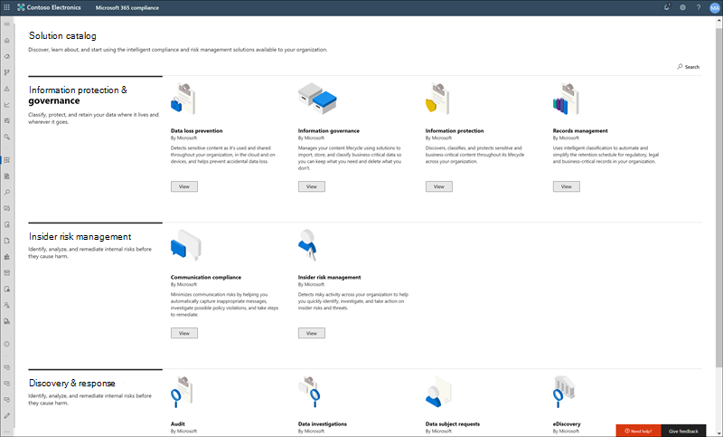
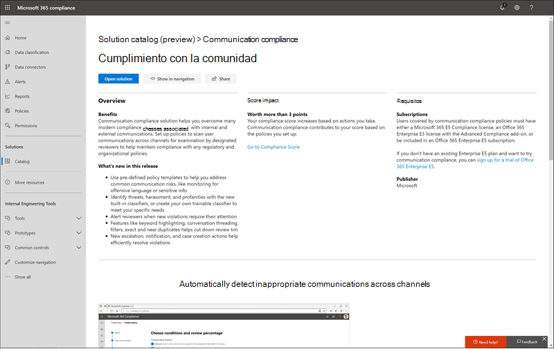
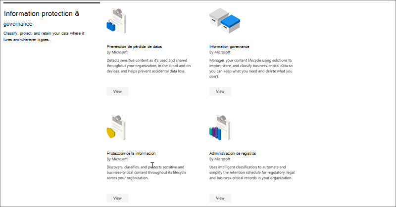
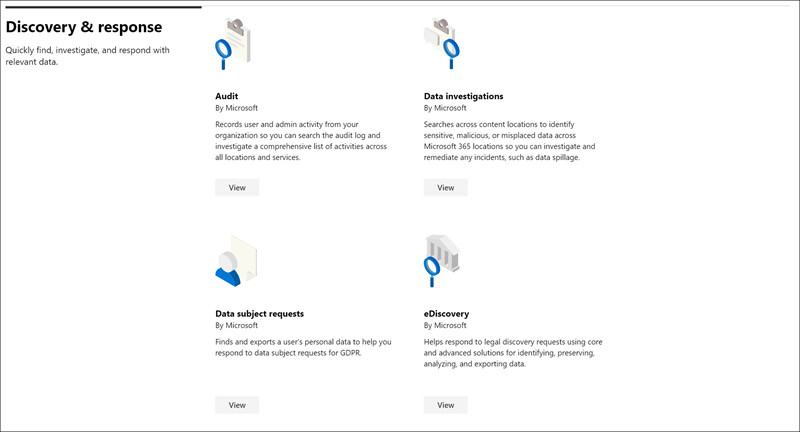

# Catálogo de soluciones de Microsoft 365

¿Necesita una forma rápida de empezar a trabajar con las tareas de cumplimiento en Microsoft 365? Consulte el [Catálogo de soluciones de 365 de Microsoft](https://compliance.microsoft.com/solutioncatalog) para descubrir, aprender y comenzar rápidamente con soluciones de administración de riesgos y cumplimiento de normas.

Las soluciones de cumplimiento de Microsoft 365 son colecciones de capacidades integradas que puede usar para ayudarle a administrar escenarios de cumplimiento de un extremo a otro. Las herramientas y capacidades de una solución pueden incluir una combinación de directivas, alertas, informes y mucho más.

Lea este artículo para familiarizarse con el nuevo catálogo de soluciones en el centro de cumplimiento de Microsoft 365, [Cómo obtenerlo](#how-do-i-get-this), las [preguntas más](#frequently-asked-questions)frecuentes y los [pasos siguientes](#next-steps).

## Organización del catálogo

El catálogo de soluciones está organizado en secciones que contienen tarjetas de información para cada solución de cumplimiento disponible en la suscripción a Microsoft 365. Cada sección contiene tarjetas para soluciones agrupadas por área de cumplimiento.

Al seleccionar **Ver** para una tarjeta de solución, verá información detallada sobre la solución de cumplimiento y cómo comenzar. Esta información incluye una introducción, los requisitos previos a la configuración, los recursos de aprendizaje, los controles que permiten anclar la tarjeta al panel de navegación y una opción para compartir la solución como un vínculo, un correo electrónico o un mensaje de Microsoft Teams.

## Sección de gobierno de & Information Protection

La sección de **gobierno de Information protection &** le muestra de un vistazo cómo puede usar las soluciones de cumplimiento de Microsoft 365 para proteger y controlar los datos de su organización.

Desde aquí, verá tarjetas para las siguientes soluciones:

- [Prevención de pérdida de datos](data-loss-prevention-policies.md): detecta contenido confidencial mientras se usa y se comparte en la organización, en la nube y en dispositivos, y ayuda a evitar la pérdida de datos accidental.
- [Gobierno](manage-information-governance.md)de la información: administra el ciclo de vida del contenido mediante soluciones para importar, almacenar y clasificar los datos críticos para el negocio de modo que pueda conservar lo que necesita y eliminar lo que no.
- [Protección](protect-information.md)de la información: detecta, clasifica y protege contenido crítico y empresarial importante durante su ciclo de vida en toda la organización.
- [Administración de registros](records-management.md): usa una clasificación inteligente para automatizar y simplificar la programación de retención para los registros normativos, legales y empresariales de la organización.

## Sección de administración de riesgos de Insider

La sección **Administración de riesgos de Insider** de la Página principal muestra de un vistazo cómo su organización puede identificar, analizar y emprender acciones sobre riesgos internos antes de que puedan dañarlos.

Desde aquí, verá tarjetas para las siguientes soluciones:

- [Cumplimiento](communication-compliance.md)de la comunicación: minimiza los riesgos de comunicación al ayudarle a capturar mensajes inapropiados de forma automática, investigar posibles infracciones de directivas y tomar medidas para minimizar los daños.
- [Administración de riesgos de Insider](insider-risk-management.md): detecte una actividad arriesgada en toda la organización para ayudarle a identificar, investigar y realizar acciones rápidamente en los riesgos y las amenazas de Insider.

## Sección de respuesta de & de detección

La sección de **& respuesta de detección** de la Página principal muestra de un vistazo cómo su organización puede buscar, investigar y responder a los problemas de cumplimiento con los datos relevantes de manera rápida.

Desde aquí, verá tarjetas para las siguientes soluciones:

- [Audit](search-the-audit-log-in-security-and-compliance.md): registra la actividad de usuario y de administrador de su organización para que pueda buscar en el registro de auditoría e investigar una lista completa de actividades en todas las ubicaciones y servicios.
- [Investigaciones de datos](overview-data-investigations.md): busca en las ubicaciones de contenido para identificar datos confidenciales, malintencionados o mal colocados en ubicaciones de Microsoft 365, de modo que pueda investigar y corregir cualquier incidente, como la derramación de datos.
- [Solicitudes de interesados de datos](manage-gdpr-data-subject-requests-with-the-dsr-case-tool.md): busca y exporta los datos personales de un usuario para ayudarle a responder a las solicitudes del interesado para RGPD.
- [Exhibición de documentos electrónicos (eDiscovery)](manage-legal-investigations.md)
    - [Exhibición](ediscovery-cases.md)de documentos electrónicos principal: busca en las ubicaciones de contenido para identificar, conservar y exportar datos en respuesta a solicitudes de descubrimiento legal y casos de exhibición de documentos electrónicos.
    - [Exhibición avanzada](overview-ediscovery-20.md)de documentos electrónicos: se basa en las funcionalidades de eDiscovery al ofrecer análisis inteligentes y aprendizaje automático para ayudarle a analizar aún más los datos relevantes para las solicitudes de detección.

## ¿Cómo obtengo esto?

Para visitar el catálogo de soluciones de 365 de Microsoft, vaya a [https://compliance.microsoft.com](https://compliance.microsoft.com) e inicie sesión como administrador global, administrador de cumplimiento o administrador de datos de cumplimiento. Seleccione **Catálogo** en el panel de navegación de la parte izquierda de la pantalla para abrir la Página principal del catálogo.

## Preguntas más frecuentes

**¿Por qué no veo el catálogo de soluciones de Microsoft 365?**

En primer lugar, asegúrese de que tiene las licencias y los permisos adecuados. A continuación, inicie sesión [https://compliance.microsoft.com](https://compliance.microsoft.com) como administrador global, administrador de cumplimiento o administrador de datos de cumplimiento.

**Algunas de las características de cumplimiento que aparecen en la página Catálogo de soluciones no están disponibles en el centro de cumplimiento de Microsoft 365. ¿Qué hago?**

Siempre estamos trabajando para agregar nuevas funciones al centro de cumplimiento de Microsoft 365 y al catálogo de soluciones. Si no encuentra una solución específica en el área de navegación, será accesible cuando la solución esté disponible en su suscripción.

Si está buscando una solución de cumplimiento existente y no está disponible en el centro de cumplimiento de Microsoft 365, puede acceder a las soluciones en el centro de cumplimiento de seguridad existente &amp; yendo a [https://protection.office.com](https://protection.office.com) . Como alternativa, puede hacer clic en la pestaña **más recursos** en el panel de navegación izquierdo del centro de cumplimiento de Microsoft 365 y seleccionar la tarjeta del centro de seguridad y cumplimiento de Office 365.  

## Siguientes pasos

- **Visite el administrador de cumplimiento de Microsoft**, que le ayudará a comprender el estado de cumplimiento de la organización con respecto a los estándares y regulaciones clave. Proporciona las acciones recomendadas que puede realizar para fortalecer su postura general de cumplimiento y proporciona funciones de flujo de trabajo que le ayudarán a llevar a cabo esas acciones de manera eficaz. Para obtener más información, consulte [Administrador de cumplimiento](compliance-manager.md).

- **Configure las directivas de administración de riesgos de Insider** para ayudar a minimizar los riesgos internos y permitirle detectar, investigar y emprender acciones para actividades arriesgadas en su organización. Consulte [Administración de riesgos de Insider](insider-risk-management.md).

- **Obtenga información sobre y cree directivas de cumplimiento de comunicaciones** para identificar y corregir rápidamente las infracciones de directivas corporativas sobre código de conducta. Consulte [cumplimiento](communication-compliance.md)de la comunicación.

- **Microsoft Information Protection**, obtenga información sobre cómo las soluciones de Microsoft 365 le ayudarán a descubrir, clasificar y proteger información confidencial en cualquier lugar en que se encuentre o viaje.
    - **Familiarícese con y configure Microsoft Cloud App Security**. Consulte [QuickStart: Introducción a Microsoft Cloud App Security](https://docs.microsoft.com/cloud-app-security/getting-started-with-cloud-app-security).
    - Empezar **a trabajar con clasificadores**. Clasificar el contenido y, a continuación, etiquetarlo para que se pueda proteger y administrar correctamente es el punto de partida de la disciplina de protección de la información. Vea [más información sobre los clasificadores que se capacitan (versión preliminar)](classifier-learn-about.md).

- **Visite con frecuencia el catálogo de soluciones de Microsoft 365**y asegúrese de revisar las nuevas soluciones para ayudarle con sus necesidades de cumplimiento. Inicie sesión en [https://compliance.microsoft.com](https://compliance.microsoft.com) y, a continuación, seleccione **Catálogo** en el panel de navegación izquierdo.
