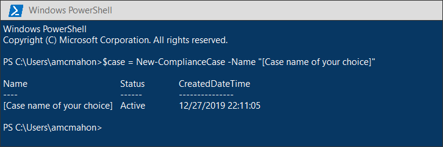
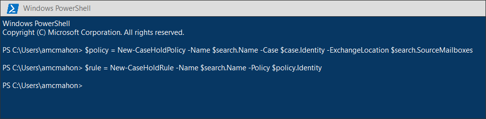
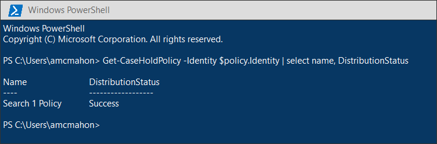
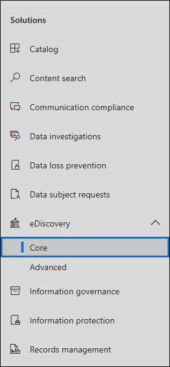

# <a name="migrate-legacy-ediscovery-searches-and-holds-to-the-microsoft-365-compliance-center"></a>Migrar las búsquedas y suspensiones de eDiscovery heredado al centro de cumplimiento de Microsoft 365

El centro de cumplimiento de Microsoft 365 ofrece una mejor experiencia para el uso de la exhibición de documentos electrónicos, incluidos: mayor confiabilidad, mejor rendimiento y muchas características adaptadas a los flujos de trabajo de eDiscovery, incluidos casos para organizar el contenido por importancia, revisar conjuntos para Revise el contenido y los análisis para ayudar a retener los datos para su revisión, como la agrupación casi duplicada, el procesamiento de subprocesos de correo electrónico, el análisis de temas y la codificación predictiva.

Para ayudar a los clientes a aprovechar la funcionalidad nueva y mejorada, en este artículo se proporcionan instrucciones básicas sobre cómo migrar las búsquedas y las suspensiones de exhibición de documentos electrónicos local desde el centro de administración de Exchange al centro de cumplimiento de Microsoft 365.

> [!NOTE]
> Como hay varios escenarios diferentes, en este artículo se proporcionan instrucciones generales para la transición de búsquedas y retenciones a un caso básico de eDiscovery en el centro de cumplimiento de Microsoft 365. El uso de casos de eDiscovery no siempre es necesario, pero agregan una capa adicional de seguridad permitiéndole asignar permisos para controlar quién tiene acceso a los casos de eDiscovery en su organización.

## <a name="before-you-begin"></a>Antes de empezar

- Debe ser miembro del grupo de roles eDiscovery Manager en el centro de seguridad & cumplimiento de Office 365 para ejecutar los comandos de PowerShell que se describen en este artículo. También debe ser miembro del grupo de roles de administración de detección en el centro de administración de Exchange.

- En este artículo se proporcionan instrucciones sobre cómo crear una suspensión de exhibición de documentos electrónicos. La Directiva de retención se aplicará a los buzones de correo a través de un proceso asincrónico. Al crear una retención de exhibición de documentos electrónicos, debe crear una CaseHoldPolicy y CaseHoldRule, de lo contrario, no se creará la retención y las ubicaciones de contenido no se pondrán en retención.

## <a name="step-1-connect-to-exchange-online-powershell-and-office-365-security--compliance-center-powershell"></a>Paso 1: conectarse a PowerShell de Exchange Online PowerShell y Office 365 Security & cumplimiento del centro de cumplimiento

El primer paso consiste en conectarse a PowerShell de Exchange Online PowerShell y Office 365 Security & cumplimiento del centro de cumplimiento. Puede copiar la siguiente secuencia de comandos, pegarla en una ventana de PowerShell y, a continuación, ejecutarla. Se le pedirán las credenciales de la organización a la que desea conectarse. 

```powershell
$UserCredential = Get-Credential
$sccSession = New-PSSession -ConfigurationName Microsoft.Exchange -ConnectionUri https://ps.compliance.protection.outlook.com/powershell-liveid -Credential $UserCredential -Authentication Basic -AllowRedirection
Import-PSSession $Session -AllowClobber -DisableNameChecking
$exoSession = New-PSSession -ConfigurationName Microsoft.Exchange -ConnectionUri https://ps.outlook.com/powershell-liveid/ -Credential $UserCredential -Authentication Basic -AllowRedirection
Import-PSSession $exoSession -AllowClobber -DisableNameChecking
```

Debe ejecutar los comandos en los siguientes pasos en esta sesión de PowerShell.

## <a name="step-2-get-a-list-of-in-place-ediscovery-searches-by-using-get-mailboxsearch"></a>Paso 2: obtener una lista de búsquedas de exhibición de documentos electrónicos local mediante Get-MailboxSearch

Una vez que se haya autenticado, puede obtener una lista de búsquedas de exhibición de documentos electrónicos local mediante la ejecución del cmdlet **Get-MailboxSearch** . Copie y pegue el siguiente comando en PowerShell y, a continuación, ejecútelo. Se mostrará una lista de búsquedas con sus nombres y el estado de las suspensiones locales.

```powershell
Get-MailboxSearch
```

La salida del cmdlet será similar a la siguiente:


## <a name="step-3-get-information-about-the-in-place-ediscovery-searches-and-in-place-holds-you-want-to-migrate"></a>Paso 3: obtener información sobre las búsquedas de exhibición de documentos electrónicos local y las suspensiones locales que desea migrar

De nuevo, usará el cmdlet **Get-MailboxSearch** , pero esta vez para obtener las propiedades de la búsqueda. Puede almacenar estas propiedades en una variable para usarla más adelante. En el ejemplo siguiente se almacenan los resultados del cmdlet **Get-MailboxSearch** en una variable y, a continuación, se muestran las propiedades de la búsqueda.

```powershell
$search = Get-MailboxSearch -Identity "Search 1"
```

```powershell
$search | FL
```

La salida de estos dos comandos será similar a la siguiente:


> [!NOTE]
> La duración de la conservación local en este ejemplo es indefinida (*ItemHoldPeriod: Unlimited*). Esto es típico para escenarios de eDiscovery y de investigación legal. Si la duración de retención tiene un valor diferente a indefinido, es probable que la razón sea que la retención se usa para conservar el contenido en un escenario de retención. En lugar de usar los cmdlets de exhibición de documentos electrónicos en el centro de seguridad & cumplimiento del centro de cumplimiento de 365 Office PowerShell para escenarios de retención, se recomienda usar [New-HoldCompliancePolicy](https://docs.microsoft.com/powershell/module/exchange/policy-and-compliance-retention/new-holdcompliancepolicy) y [New-HoldComplianceRule](https://docs.microsoft.com/powershell/module/exchange/policy-and-compliance-retention/new-holdcompliancerule) para conservar el contenido. El resultado de usar estos cmdlets será similar a usar **New-CaseHoldPolicy** y **New-CaseHoldRule**, pero podrá especificar un período de retención y una acción de retención, como la eliminación de contenido una vez que expire el período de retención. Además, el uso de cmdlets de retención no requiere que se asocien las suspensiones de retención con un caso de exhibición de documentos electrónicos.

## <a name="step-4-create-a-case-in-the-microsoft-365-compliance-center"></a>Paso 4: crear un caso en el centro de cumplimiento de Microsoft 365

Para crear una retención de exhibición de documentos electrónicos, tiene que crear un caso de exhibición de documentos electrónicos con el que asociar la suspensión. En el ejemplo siguiente se crea un caso de exhibición de documentos electrónicos con el nombre de su elección. Se almacenarán las propiedades del nuevo caso en una variable para usarla más adelante. Puede ver esas propiedades ejecutando el `$case | FL` comando después de crear el caso.

```powershell
$case = New-ComplianceCase -Name "[Case name of your choice]"
```



## <a name="step-5-create-the-ediscovery-hold"></a>Paso 5: crear la retención de exhibición de documentos electrónicos

Una vez creado el caso, puede crear la retención y asociarla al caso que haya creado en el paso anterior. Es importante recordar que debe crear una directiva de suspensión de casos y una regla de suspensión de casos. Si la regla de suspensión de casos no se crea después de crear la Directiva de suspensión de casos, la retención de exhibición de documentos electrónicos no se creará y el contenido no se pondrá en retención.

Ejecute los siguientes comandos para volver a crear la suspensión de exhibición de documentos electrónicos que desea migrar. En estos ejemplos se usan las propiedades de la conservación local del paso 3 que desea migrar.

```powershell
$policy = New-CaseHoldPolicy -Name $search.Name -Case $case.Identity -ExchangeLocation $search.SourceMailboxes
```

```powershell
$rule = New-CaseHoldRule -Name $search.Name -Policy $policy.Identity
```



## <a name="step-6-verify-the-ediscovery-hold"></a>Paso 6: comprobar la conservación de la exhibición de documentos electrónicos

Para asegurarse de que no haya problemas en la creación de la retención, es conveniente comprobar que el estado de la distribución de la retención es correcto. Distribución significa que la suspensión se ha aplicado a todas las ubicaciones de contenido especificadas en el parámetro *ExchangeLocation* en el paso anterior. Para ello, puede ejecutar el cmdlet **Get-CaseHoldPolicy** . Como las propiedades guardadas en la variable *$Policy* que creó en el paso anterior no se actualizan automáticamente en la variable, deberá volver a ejecutar el cmdlet para comprobar que la distribución se ha realizado correctamente. Las directivas de suspensión de casos pueden tardar entre 5 minutos y 24 horas en distribuirse correctamente.

Ejecute el siguiente comando para comprobar que la conservación de eDiscovery se ha distribuido correctamente.

```powershell
Get-CaseHoldPolicy -Identity $policy.Identity | Select name, DistributionStatus
```

El valor de **Success** para la propiedad *DistributionStatus* indica que la retención se colocó correctamente en las ubicaciones de contenido. Si aún no se ha completado la distribución, se muestra un valor de **pendiente** .



## <a name="step-7-create-the-search"></a>Paso 7: crear la búsqueda

El último paso consiste en volver a crear la búsqueda que identificó en el paso 3 y asociarla con el caso. Después de crear la búsqueda, puede ejecutarla con el cmdlet **Start-ComplianceSearch** o ejecutarla en un momento posterior.

```powershell
New-ComplianceSearch -Name $search.Name -ExchangeLocation $search.SourceMailboxes -ContentMatchQuery $search.SearchQuery -Case $case.name
```


## <a name="step-8-verify-the-case-hold-and-search-in-the-microsoft-365-compliance-center"></a>Paso 8: comprobar el caso, la retención y la búsqueda en el centro de cumplimiento de Microsoft 365

Para asegurarse de que todo está configurado correctamente, vaya al centro de cumplimiento de Microsoft 365 en [https://compliance.microsoft.com](https://compliance.microsoft.com)y haga clic en **eDiscovery > Core**.



El caso que ha creado en el paso 3 se incluye en la página **principal de eDiscovery** . Abra el caso y observe la retención que ha creado en el paso 4 en la lista de la ficha **suspensiones** . Puede hacer clic en la retención para ver los detalles, incluido el número de buzones a los que se aplica la retención y el estado de distribución.


La búsqueda que creó en el paso 7 aparece en la lista de la ficha **búsquedas** en el caso de exhibición de documentos electrónicos.


Si migra una búsqueda de exhibición de documentos electrónicos local, pero no la asocia a un caso de exhibición de documentos electrónicos, se mostrará en la página búsqueda de contenido en el centro de cumplimiento de Microsoft 365.

## <a name="more-information"></a>Más información

- Para obtener más información acerca de las suspensiones de exhibición de documentos electrónicos local & en el centro de administración de Exchange, consulte:
  
  - [Exhibición de documentos electrónicos en contexto](https://docs.microsoft.com/exchange/security-and-compliance/in-place-ediscovery/in-place-ediscovery)

  - [Conservación local y retención por juicio](https://docs.microsoft.com/exchange/security-and-compliance/in-place-and-litigation-holds)

- Para obtener más información acerca de los cmdlets de PowerShell que se usan en el artículo, vea:

  - [Get-MailboxSearch](https://docs.microsoft.com/powershell/module/exchange/policy-and-compliance-content-search/get-mailboxsearch)
  
  - [New-ComplianceCase](https://docs.microsoft.com/powershell/module/exchange/policy-and-compliance-ediscovery/new-compliancecase)

  - [New-CaseHoldPolicy](https://docs.microsoft.com/powershell/module/exchange/policy-and-compliance-ediscovery/new-caseholdpolicy)
  
  - [New-CaseHoldRule](https://docs.microsoft.com/powershell/module/exchange/policy-and-compliance-ediscovery/new-caseholdrule)

  - [Get-CaseHoldPolicy](https://docs.microsoft.com/powershell/module/exchange/policy-and-compliance-ediscovery/get-caseholdpolicy)
  
  - [New-ComplianceSearch](https://docs.microsoft.com/powershell/module/exchange/policy-and-compliance-content-search/new-compliancesearch)

  - [Start-ComplianceSearch](https://docs.microsoft.com/powershell/module/exchange/policy-and-compliance-content-search/start-compliancesearch)

- Para obtener más información acerca del centro de cumplimiento de Microsoft 365, consulte [Overview of the microsoft 365 Compliance Center](microsoft-365-compliance-center.md).
