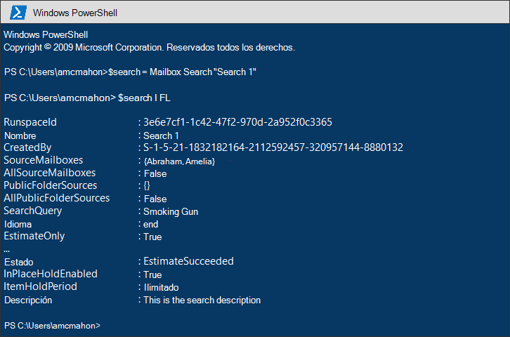
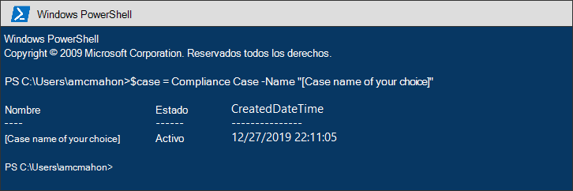
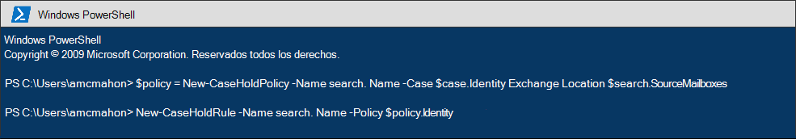
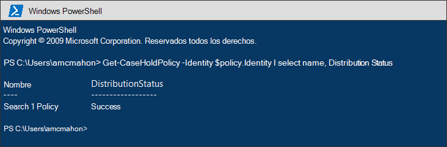
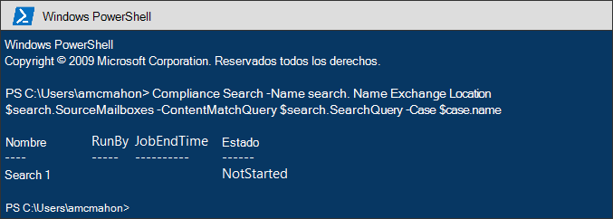
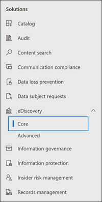
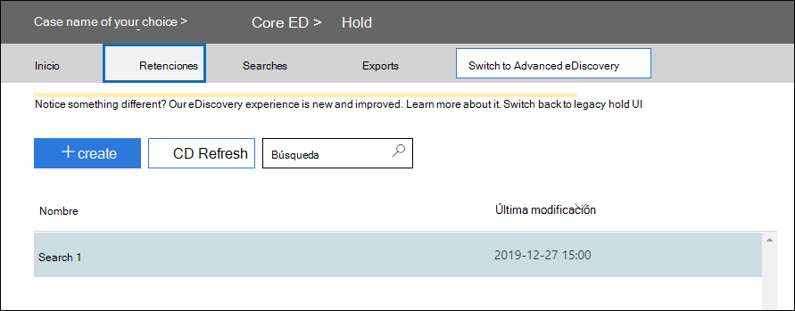
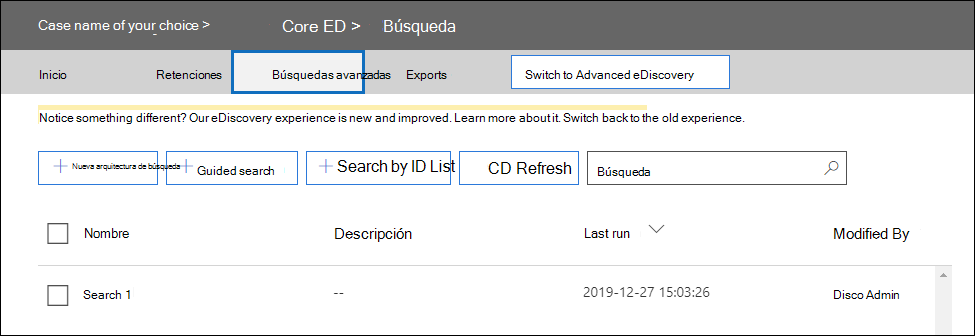

# <a name="migrate-legacy-ediscovery-searches-and-holds-to-the-microsoft-365-compliance-center"></a>Migrar búsquedas y retenciones de exhibición de documentos electrónicos heredadas al Centro de cumplimiento de Microsoft 365

El Centro de cumplimiento de Microsoft 365 proporciona una experiencia mejorada para el uso de la exhibición de documentos electrónicos, incluidos: mayor confiabilidad, mejor rendimiento y muchas características adaptadas a flujos de trabajo de exhibición de documentos electrónicos, incluidos casos para organizar el contenido por asunto, conjuntos de revisión para revisar el contenido y análisis para ayudar a eliminar datos para su revisión, como agrupación casi duplicada, subprocesos de correo electrónico, análisis de temas y codificación predictiva.

Para ayudar a los clientes a aprovechar las nuevas y mejoradas funciones, en este artículo se proporcionan instrucciones básicas sobre cómo migrar las búsquedas y retenciones de exhibición de documentos electrónicos de In-Place desde el Centro de administración de Exchange al Centro de cumplimiento de Microsoft 365.

> [!NOTE]
> Dado que hay muchos escenarios diferentes, en este artículo se proporcionan instrucciones generales para realizar búsquedas y retenciones de transición a un caso principal de exhibición de documentos electrónicos en el Centro de cumplimiento de Microsoft 365. El uso de casos de exhibición de documentos electrónicos no siempre es necesario, pero agregan un nivel adicional de seguridad al permitirle asignar permisos para controlar quién tiene acceso a los casos de exhibición de documentos electrónicos en su organización.

## <a name="before-you-begin"></a>Antes de empezar

- Debe ser miembro del grupo de roles administrador de exhibición de documentos electrónicos en el Centro de seguridad y cumplimiento de & para ejecutar los comandos de PowerShell que se describen en este artículo. También debe ser miembro del grupo de roles Administración de la detección en el Centro de administración de Exchange.

- En este artículo se proporcionan instrucciones sobre cómo crear una retención de exhibición de documentos electrónicos. La directiva de retención se aplicará a los buzones a través de un proceso asincrónico. Al crear una retención de exhibición de documentos electrónicos, debe crear tanto CaseHoldPolicy como CaseHoldRule; de lo contrario, no se creará la retención y las ubicaciones de contenido no se colocarán en retención.

## <a name="step-1-connect-to-exchange-online-powershell-and-security--compliance-center-powershell"></a>Paso 1: Conectarse a PowerShell de Exchange Online y PowerShell del Centro de & cumplimiento

El primer paso es conectarse a PowerShell de Exchange Online y PowerShell del Centro de & cumplimiento. Puede copiar el siguiente script, pegarlo en una ventana de PowerShell y, a continuación, ejecutarlo. Se le pedirán las credenciales de la organización a la que desea conectarse. 

```powershell
$UserCredential = Get-Credential
$sccSession = New-PSSession -ConfigurationName Microsoft.Exchange -ConnectionUri https://ps.compliance.protection.outlook.com/powershell-liveid -Credential $UserCredential -Authentication Basic -AllowRedirection
Import-PSSession $sccSession -DisableNameChecking
$exoSession = New-PSSession -ConfigurationName Microsoft.Exchange -ConnectionUri https://ps.outlook.com/powershell-liveid/ -Credential $UserCredential -Authentication Basic -AllowRedirection
Import-PSSession $exoSession -AllowClobber -DisableNameChecking
```

Debe ejecutar los comandos en los siguientes pasos de esta sesión de PowerShell.

## <a name="step-2-get-a-list-of-in-place-ediscovery-searches-by-using-get-mailboxsearch"></a>Paso 2: Obtener una lista de In-Place búsquedas de exhibición de documentos electrónicos mediante Get-MailboxSearch

Después de autenticarse, puede obtener una lista de búsquedas de exhibición In-Place eDiscovery ejecutando el cmdlet **Get-MailboxSearch.** Copie y pegue el siguiente comando en PowerShell y, a continuación, ejecutarlo. Se mostrará una lista de búsquedas con sus nombres y el estado de cualquier In-Place retenciones.

```powershell
Get-MailboxSearch
```

El resultado del cmdlet será similar al siguiente:


## <a name="step-3-get-information-about-the-in-place-ediscovery-searches-and-in-place-holds-you-want-to-migrate"></a>Paso 3: Obtener información sobre las In-Place de exhibición de documentos electrónicos y In-Place que desea migrar

De nuevo, usará el cmdlet **Get-MailboxSearch,** pero esta vez para obtener las propiedades de la búsqueda. Puede almacenar estas propiedades en una variable para usarlas más adelante. En el ejemplo siguiente se almacenan los resultados del cmdlet **Get-MailboxSearch** en una variable y, a continuación, se muestran las propiedades de la búsqueda.

```powershell
$search = Get-MailboxSearch -Identity "Search 1"
```

```powershell
$search | FL
```

El resultado de estos dos comandos será similar al siguiente:



> [!NOTE]
> La duración de la In-Place en este ejemplo es indefinida (*ItemHoldPeriod: Unlimited*). Esto es típico para escenarios de exhibición de documentos electrónicos e investigación legal. Si la duración de retención es diferente del valor indefinido, es probable que el motivo se deba a que la suspensión se usa para retener contenido en un escenario de retención. En lugar de usar los cmdlets de exhibición de documentos electrónicos en PowerShell del Centro de seguridad y cumplimiento de & para escenarios de retención, se recomienda usar [New-RetentionCompliancePolicy](https://docs.microsoft.com/powershell/module/exchange/new-retentioncompliancepolicy) y [New-RetentionComplianceRule](https://docs.microsoft.com/powershell/module/exchange/new-retentioncompliancerule) para conservar el contenido. El resultado de usar estos cmdlets será similar al uso de **New-CaseHoldPolicy** y **New-CaseHoldRule,** pero podrá especificar un período de retención y una acción de retención, como eliminar contenido después de que expire el período de retención. Además, el uso de los cmdlets de retención no requiere que asocie las retenciones de retención con un caso de exhibición de documentos electrónicos.

## <a name="step-4-create-a-case-in-the-microsoft-365-compliance-center"></a>Paso 4: Crear un caso en el Centro de cumplimiento de Microsoft 365

Para crear una retención de exhibición de documentos electrónicos, debe crear un caso de exhibición de documentos electrónicos con el que asociar la retención. En el siguiente ejemplo se crea un caso de exhibición de documentos electrónicos con el nombre que prefiera. Almacenaremos las propiedades del nuevo caso en una variable para su uso más adelante. Puede ver esas propiedades ejecutando el `$case | FL` comando después de crear el caso.

```powershell
$case = New-ComplianceCase -Name "[Case name of your choice]"
```


## <a name="step-5-create-the-ediscovery-hold"></a>Paso 5: Crear la retención de exhibición de documentos electrónicos

Después de crear el caso, puede crear la retención y asociarla con el caso que creó en el paso anterior. Es importante recordar que debe crear una directiva de retención de casos y una regla de retención de casos. Si la regla de retención de casos no se crea después de crear la directiva de retención de casos, no se creará la retención de eDiscovery y no se colocará ningún contenido en retención.

Ejecute los siguientes comandos para volver a crear la retención de exhibición de documentos electrónicos que desea migrar. Estos ejemplos usan las propiedades del In-Place de retención del paso 3 que desea migrar. El primer comando crea una nueva directiva de retención de casos y guarda las propiedades en una variable. El segundo comando crea la regla de retención de mayúsculas y minúsculas correspondiente.

```powershell
$policy = New-CaseHoldPolicy -Name $search.Name -Case $case.Identity -ExchangeLocation $search.SourceMailboxes
```

```powershell
New-CaseHoldRule -Name $search.Name -Policy $policy.Identity
```



## <a name="step-6-verify-the-ediscovery-hold"></a>Paso 6: Comprobar la retención de exhibición de documentos electrónicos

Para asegurarse de que no haya problemas en la creación de la retención, es bueno comprobar que el estado de distribución de la retención es correcto. La distribución significa que la retención se ha aplicado a todas las ubicaciones de contenido especificadas en el parámetro *ExchangeLocation* en el paso anterior. Para ello, puede ejecutar el cmdlet **Get-CaseHoldPolicy.** Dado que las propiedades guardadas en la variable $policy que creó en el paso anterior no se actualizan automáticamente en la variable, debe volver *a* ejecutar el cmdlet para comprobar que la distribución es correcta. Las directivas de retención de casos pueden tardar entre 5 y 24 horas en distribuirse correctamente.

Ejecute el siguiente comando para comprobar que la retención de exhibición de documentos electrónicos se ha distribuido correctamente.

```powershell
Get-CaseHoldPolicy -Identity $policy.Identity | Select name, DistributionStatus
```

El valor success **de** la *propiedad DistributionStatus* indica que la retención se ha colocado correctamente en las ubicaciones de contenido. Si la distribución aún no se ha completado, se muestra el valor **Pendiente.**



## <a name="step-7-create-the-search"></a>Paso 7: Crear la búsqueda

El último paso es volver a crear la búsqueda que identificó en el paso 3 y asociarla con el caso. Después de crear la búsqueda, puede ejecutarla con el cmdlet **Start-ComplianceSearch** o ejecutarla más adelante.

```powershell
New-ComplianceSearch -Name $search.Name -ExchangeLocation $search.SourceMailboxes -ContentMatchQuery $search.SearchQuery -Case $case.name
```



## <a name="step-8-verify-the-case-hold-and-search-in-the-microsoft-365-compliance-center"></a>Paso 8: Comprobar el caso, la retención y la búsqueda en el Centro de cumplimiento de Microsoft 365

Para asegurarse de que todo está configurado correctamente, vaya al Centro de cumplimiento de Microsoft 365 en y haga clic en [https://compliance.microsoft.com](https://compliance.microsoft.com) **eDiscovery > Core**.



El caso que creó en el paso 3 aparece en la **página de eDiscovery** principal. Abra el caso y, a continuación, observe la retención que creó en el paso 4 en la lista de la **pestaña Retenciones.** Puede hacer clic en la retención para ver los detalles, incluido el número de buzones a los que se aplica la retención y el estado de distribución.



La búsqueda que creó en el paso 7 aparece en la lista en la pestaña **Búsquedas** del caso de eDiscovery.



Si migra una búsqueda de exhibición de documentos electrónicos de In-Place pero no la asocia a un caso de exhibición de documentos electrónicos, aparecerá en la página Búsqueda de contenido en el Centro de cumplimiento de Microsoft 365.

## <a name="more-information"></a>Más información

- Para obtener más información acerca In-Place las retenciones & eDiscovery en el Centro de administración de Exchange, vea:
  
  - [Exhibición de documentos electrónicos en contexto](https://docs.microsoft.com/exchange/security-and-compliance/in-place-ediscovery/in-place-ediscovery)

  - [Conservación local y retención por juicio](https://docs.microsoft.com/exchange/security-and-compliance/in-place-and-litigation-holds)

- Para obtener más información acerca de los cmdlets de PowerShell usados en el artículo, vea:

  - [Get-MailboxSearch](https://docs.microsoft.com/powershell/module/exchange/get-mailboxsearch)
  
  - [New-ComplianceCase](https://docs.microsoft.com/powershell/module/exchange/new-compliancecase)

  - [New-CaseHoldPolicy](https://docs.microsoft.com/powershell/module/exchange/new-caseholdpolicy)
  
  - [New-CaseHoldRule](https://docs.microsoft.com/powershell/module/exchange/new-caseholdrule)

  - [Get-CaseHoldPolicy](https://docs.microsoft.com/powershell/module/exchange/get-caseholdpolicy)
  
  - [New-ComplianceSearch](https://docs.microsoft.com/powershell/module/exchange/new-compliancesearch)

  - [Start-ComplianceSearch](https://docs.microsoft.com/powershell/module/exchange/start-compliancesearch)

- Para obtener más información acerca del Centro de cumplimiento de Microsoft 365, vea Información general sobre el Centro de cumplimiento de [Microsoft 365.](microsoft-365-compliance-center.md)
