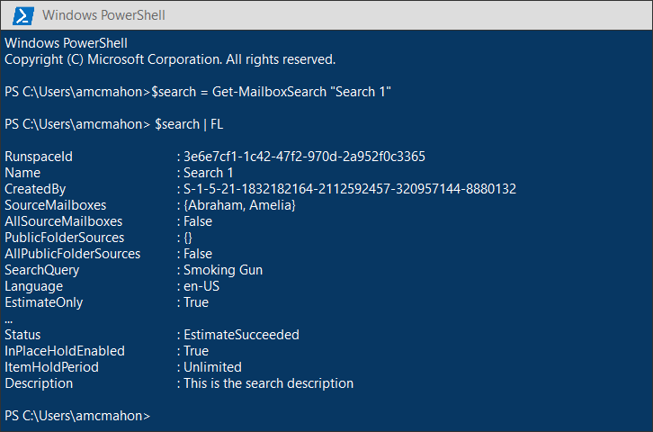

# <a name="migrate-legacy-ediscovery-searches-and-holds-to-the-microsoft-365-compliance-center"></a><span data-ttu-id="1dda5-102">Migrar las búsquedas y suspensiones de eDiscovery heredado al centro de cumplimiento de Microsoft 365</span><span class="sxs-lookup"><span data-stu-id="1dda5-102">Migrate legacy eDiscovery searches and holds to the Microsoft 365 compliance center</span></span>

<span data-ttu-id="1dda5-103">El centro de cumplimiento de Microsoft 365 ofrece una mejor experiencia para el uso de la exhibición de documentos electrónicos, incluidos: mayor confiabilidad, mejor rendimiento y muchas características adaptadas a los flujos de trabajo de eDiscovery, incluidos casos para organizar el contenido por importancia, revisar conjuntos para Revise el contenido y los análisis para ayudar a retener los datos para su revisión, como la agrupación casi duplicada, el procesamiento de subprocesos de correo electrónico, el análisis de temas y la codificación predictiva.</span><span class="sxs-lookup"><span data-stu-id="1dda5-103">The Microsoft 365 compliance center provides an improved experience for eDiscovery usage, including: higher reliability, better performance and many features tailored to eDiscovery workflows including cases to organize your content by matter, review sets to review content and analytics to help cull data for review such as near-duplicate grouping, email threading, themes analysis, and predictive coding.</span></span>

<span data-ttu-id="1dda5-104">Para ayudar a los clientes a aprovechar la funcionalidad nueva y mejorada, en este artículo se proporcionan instrucciones básicas sobre cómo migrar las búsquedas y las suspensiones de exhibición de documentos electrónicos local desde el centro de administración de Exchange al centro de cumplimiento de Microsoft 365.</span><span class="sxs-lookup"><span data-stu-id="1dda5-104">To help customers take advantage of the new and improved functionality, this article provides basic guidance on how to migrate In-Place eDiscovery searches and holds from the Exchange admin center to the Microsoft 365 compliance center.</span></span>

> [!NOTE]
> <span data-ttu-id="1dda5-105">Como hay varios escenarios diferentes, en este artículo se proporcionan instrucciones generales para la transición de búsquedas y retenciones a un caso básico de eDiscovery en el centro de cumplimiento de Microsoft 365.</span><span class="sxs-lookup"><span data-stu-id="1dda5-105">Because there are many different scenarios, this article provides general guidance to transition searches and holds to a core eDiscovery case in the Microsoft 365 compliance center.</span></span> <span data-ttu-id="1dda5-106">El uso de casos de eDiscovery no siempre es necesario, pero agregan una capa adicional de seguridad permitiéndole asignar permisos para controlar quién tiene acceso a los casos de eDiscovery en su organización.</span><span class="sxs-lookup"><span data-stu-id="1dda5-106">Using eDiscovery cases aren't always required, but they add an extra layer of security by letting you assign permissions to control who has access to the eDiscovery cases in your organization.</span></span>

## <a name="before-you-begin"></a><span data-ttu-id="1dda5-107">Antes de empezar</span><span class="sxs-lookup"><span data-stu-id="1dda5-107">Before you begin</span></span>

- <span data-ttu-id="1dda5-108">Debe ser miembro del grupo de roles eDiscovery Manager en el centro de seguridad & cumplimiento de Office 365 para ejecutar los comandos de PowerShell que se describen en este artículo.</span><span class="sxs-lookup"><span data-stu-id="1dda5-108">You have to be a member of the eDiscovery Manager role group in the Office 365 Security & Compliance Center to run the PowerShell commands described in this article.</span></span> <span data-ttu-id="1dda5-109">También debe ser miembro del grupo de roles de administración de detección en el centro de administración de Exchange.</span><span class="sxs-lookup"><span data-stu-id="1dda5-109">You also have to be a member of the Discovery Management role group in the Exchange admin center.</span></span>

- <span data-ttu-id="1dda5-110">En este artículo se proporcionan instrucciones sobre cómo crear una suspensión de exhibición de documentos electrónicos.</span><span class="sxs-lookup"><span data-stu-id="1dda5-110">This article provides guidance on how to create an eDiscovery hold.</span></span> <span data-ttu-id="1dda5-111">La Directiva de retención se aplicará a los buzones de correo a través de un proceso asincrónico.</span><span class="sxs-lookup"><span data-stu-id="1dda5-111">The hold policy will be applied to mailboxes through an asynchronous process.</span></span> <span data-ttu-id="1dda5-112">Al crear una retención de exhibición de documentos electrónicos, debe crear una CaseHoldPolicy y CaseHoldRule, de lo contrario, no se creará la retención y las ubicaciones de contenido no se pondrán en retención.</span><span class="sxs-lookup"><span data-stu-id="1dda5-112">When creating an eDiscovery hold, you must create both a CaseHoldPolicy and CaseHoldRule, otherwise the hold will not be created and content locations will not be placed on hold.</span></span>

## <a name="step-1-connect-to-exchange-online-powershell-and-office-365-security--compliance-center-powershell"></a><span data-ttu-id="1dda5-113">Paso 1: conectarse a PowerShell de Exchange Online PowerShell y Office 365 Security & cumplimiento del centro de cumplimiento</span><span class="sxs-lookup"><span data-stu-id="1dda5-113">Step 1: Connect to Exchange Online PowerShell and Office 365 Security & Compliance Center PowerShell</span></span>

<span data-ttu-id="1dda5-114">El primer paso consiste en conectarse a PowerShell de Exchange Online PowerShell y Office 365 Security & cumplimiento del centro de cumplimiento.</span><span class="sxs-lookup"><span data-stu-id="1dda5-114">The first step is to connect to Exchange Online PowerShell and Office 365 Security & Compliance Center PowerShell.</span></span> <span data-ttu-id="1dda5-115">Puede copiar la siguiente secuencia de comandos, pegarla en una ventana de PowerShell y, a continuación, ejecutarla.</span><span class="sxs-lookup"><span data-stu-id="1dda5-115">You can copy the following script, paste it into a PowerShell window and then run it.</span></span> <span data-ttu-id="1dda5-116">Se le pedirán las credenciales de la organización a la que desea conectarse.</span><span class="sxs-lookup"><span data-stu-id="1dda5-116">You'll be prompted for credentials for the organization that you want to connect to.</span></span> 

```powershell
$UserCredential = Get-Credential
$sccSession = New-PSSession -ConfigurationName Microsoft.Exchange -ConnectionUri https://ps.compliance.protection.outlook.com/powershell-liveid -Credential $UserCredential -Authentication Basic -AllowRedirection
Import-PSSession $sccSession -DisableNameChecking
$exoSession = New-PSSession -ConfigurationName Microsoft.Exchange -ConnectionUri https://ps.outlook.com/powershell-liveid/ -Credential $UserCredential -Authentication Basic -AllowRedirection
Import-PSSession $exoSession -AllowClobber -DisableNameChecking
```

<span data-ttu-id="1dda5-117">Debe ejecutar los comandos en los siguientes pasos en esta sesión de PowerShell.</span><span class="sxs-lookup"><span data-stu-id="1dda5-117">You need to run the commands in the following steps in this PowerShell session.</span></span>

## <a name="step-2-get-a-list-of-in-place-ediscovery-searches-by-using-get-mailboxsearch"></a><span data-ttu-id="1dda5-118">Paso 2: obtener una lista de búsquedas de exhibición de documentos electrónicos local mediante Get-MailboxSearch</span><span class="sxs-lookup"><span data-stu-id="1dda5-118">Step 2: Get a list of In-Place eDiscovery searches by using Get-MailboxSearch</span></span>

<span data-ttu-id="1dda5-119">Una vez que se haya autenticado, puede obtener una lista de búsquedas de exhibición de documentos electrónicos local mediante la ejecución del cmdlet **Get-MailboxSearch** .</span><span class="sxs-lookup"><span data-stu-id="1dda5-119">After you've authenticated, you can get a list of In-Place eDiscovery searches by running the **Get-MailboxSearch** cmdlet.</span></span> <span data-ttu-id="1dda5-120">Copie y pegue el siguiente comando en PowerShell y, a continuación, ejecútelo.</span><span class="sxs-lookup"><span data-stu-id="1dda5-120">Copy and paste the following command into PowerShell and then run it.</span></span> <span data-ttu-id="1dda5-121">Se mostrará una lista de búsquedas con sus nombres y el estado de las suspensiones locales.</span><span class="sxs-lookup"><span data-stu-id="1dda5-121">A list of searches will be listed with their names and the status of any In-Place Holds.</span></span>

```powershell
Get-MailboxSearch
```

<span data-ttu-id="1dda5-122">La salida del cmdlet será similar a la siguiente:</span><span class="sxs-lookup"><span data-stu-id="1dda5-122">The cmdlet output will be similar to the following:</span></span>


## <a name="step-3-get-information-about-the-in-place-ediscovery-searches-and-in-place-holds-you-want-to-migrate"></a><span data-ttu-id="1dda5-124">Paso 3: obtener información sobre las búsquedas de exhibición de documentos electrónicos local y las suspensiones locales que desea migrar</span><span class="sxs-lookup"><span data-stu-id="1dda5-124">Step 3: Get information about the In-Place eDiscovery searches and In-Place Holds you want to migrate</span></span>

<span data-ttu-id="1dda5-125">De nuevo, usará el cmdlet **Get-MailboxSearch** , pero esta vez para obtener las propiedades de la búsqueda.</span><span class="sxs-lookup"><span data-stu-id="1dda5-125">Again you will use the **Get-MailboxSearch** cmdlet, but this time to get the properties of the search.</span></span> <span data-ttu-id="1dda5-126">Puede almacenar estas propiedades en una variable para usarla más adelante.</span><span class="sxs-lookup"><span data-stu-id="1dda5-126">You can store these properties in a variable for use later.</span></span> <span data-ttu-id="1dda5-127">En el ejemplo siguiente se almacenan los resultados del cmdlet **Get-MailboxSearch** en una variable y, a continuación, se muestran las propiedades de la búsqueda.</span><span class="sxs-lookup"><span data-stu-id="1dda5-127">The following example stores the results of the **Get-MailboxSearch** cmdlet in a variable and then displays the properties of the search.</span></span>

```powershell
$search = Get-MailboxSearch -Identity "Search 1"
```

```powershell
$search | FL
```

<span data-ttu-id="1dda5-128">La salida de estos dos comandos será similar a la siguiente:</span><span class="sxs-lookup"><span data-stu-id="1dda5-128">The output of these two commands will be similar to the following:</span></span>



> [!NOTE]
> <span data-ttu-id="1dda5-130">La duración de la conservación local en este ejemplo es indefinida (*ItemHoldPeriod: Unlimited*).</span><span class="sxs-lookup"><span data-stu-id="1dda5-130">The duration of the In-Place Hold in this example is indefinite (*ItemHoldPeriod: Unlimited*).</span></span> <span data-ttu-id="1dda5-131">Esto es típico para escenarios de eDiscovery y de investigación legal.</span><span class="sxs-lookup"><span data-stu-id="1dda5-131">This is typical for eDiscovery and legal investigation scenarios.</span></span> <span data-ttu-id="1dda5-132">Si la duración de retención tiene un valor diferente a indefinido, es probable que la razón sea que la retención se usa para conservar el contenido en un escenario de retención.</span><span class="sxs-lookup"><span data-stu-id="1dda5-132">If the hold duration has is different value than indefinite, the reason is likely because the hold is being used to retain content in a retention scenario.</span></span> <span data-ttu-id="1dda5-133">En lugar de usar los cmdlets de exhibición de documentos electrónicos en el centro de seguridad & cumplimiento del centro de cumplimiento de 365 Office PowerShell para escenarios de retención, se recomienda usar [New-RetentionCompliancePolicy](https://docs.microsoft.com/powershell/module/exchange/policy-and-compliance-retention/new-retentioncompliancepolicy) y [New-RetentionComplianceRule](https://docs.microsoft.com/powershell/module/exchange/policy-and-compliance-retention/new-retentioncompliancerule) para conservar el contenido.</span><span class="sxs-lookup"><span data-stu-id="1dda5-133">Instead of using the eDiscovery cmdlets in Office 365 Security & Compliance Center PowerShell for retention scenarios, we recommend that you use [New-RetentionCompliancePolicy](https://docs.microsoft.com/powershell/module/exchange/policy-and-compliance-retention/new-retentioncompliancepolicy) and [New-RetentionComplianceRule](https://docs.microsoft.com/powershell/module/exchange/policy-and-compliance-retention/new-retentioncompliancerule) to retain content.</span></span> <span data-ttu-id="1dda5-134">El resultado de usar estos cmdlets será similar a usar **New-CaseHoldPolicy** y **New-CaseHoldRule**, pero podrá especificar un período de retención y una acción de retención, como la eliminación de contenido una vez que expire el período de retención.</span><span class="sxs-lookup"><span data-stu-id="1dda5-134">The result of using these cmdlets will be similar to using **New-CaseHoldPolicy** and **New-CaseHoldRule**, but you'll able to specify a retention period and a retention action, such as deleting content after the retention period expires.</span></span> <span data-ttu-id="1dda5-135">Además, el uso de cmdlets de retención no requiere que se asocien las suspensiones de retención con un caso de exhibición de documentos electrónicos.</span><span class="sxs-lookup"><span data-stu-id="1dda5-135">Also, using the retention cmdlets don't require you to associate the retention holds with an eDiscovery case.</span></span>

## <a name="step-4-create-a-case-in-the-microsoft-365-compliance-center"></a><span data-ttu-id="1dda5-136">Paso 4: crear un caso en el centro de cumplimiento de Microsoft 365</span><span class="sxs-lookup"><span data-stu-id="1dda5-136">Step 4: Create a case in the Microsoft 365 Compliance center</span></span>

<span data-ttu-id="1dda5-137">Para crear una retención de exhibición de documentos electrónicos, tiene que crear un caso de exhibición de documentos electrónicos con el que asociar la suspensión.</span><span class="sxs-lookup"><span data-stu-id="1dda5-137">To create an eDiscovery hold, you have to create an eDiscovery case to associate the hold with.</span></span> <span data-ttu-id="1dda5-138">En el ejemplo siguiente se crea un caso de exhibición de documentos electrónicos con el nombre de su elección.</span><span class="sxs-lookup"><span data-stu-id="1dda5-138">The following example creates an eDiscovery case using a name of your choice.</span></span> <span data-ttu-id="1dda5-139">Se almacenarán las propiedades del nuevo caso en una variable para usarla más adelante.</span><span class="sxs-lookup"><span data-stu-id="1dda5-139">We will store the properties of the new case in a variable for use later.</span></span> <span data-ttu-id="1dda5-140">Puede ver esas propiedades ejecutando el `$case | FL` comando después de crear el caso.</span><span class="sxs-lookup"><span data-stu-id="1dda5-140">You can view those properties by running the `$case | FL` command after you create the case.</span></span>

```powershell
$case = New-ComplianceCase -Name "[Case name of your choice]"
```


## <a name="step-5-create-the-ediscovery-hold"></a><span data-ttu-id="1dda5-142">Paso 5: crear la retención de exhibición de documentos electrónicos</span><span class="sxs-lookup"><span data-stu-id="1dda5-142">Step 5: Create the eDiscovery hold</span></span>

<span data-ttu-id="1dda5-143">Una vez creado el caso, puede crear la retención y asociarla al caso que haya creado en el paso anterior.</span><span class="sxs-lookup"><span data-stu-id="1dda5-143">After the case is created, you can create the hold and associate it with the case that you created in the previous step.</span></span> <span data-ttu-id="1dda5-144">Es importante recordar que debe crear una directiva de suspensión de casos y una regla de suspensión de casos.</span><span class="sxs-lookup"><span data-stu-id="1dda5-144">It's important to remember that you must create both a case hold policy and a case hold rule.</span></span> <span data-ttu-id="1dda5-145">Si la regla de suspensión de casos no se crea después de crear la Directiva de suspensión de casos, la retención de exhibición de documentos electrónicos no se creará y el contenido no se pondrá en retención.</span><span class="sxs-lookup"><span data-stu-id="1dda5-145">If the case hold rule isn't created after you created case hold policy, the eDiscovery hold will not be created and any content won't be placed on hold.</span></span>

<span data-ttu-id="1dda5-146">Ejecute los siguientes comandos para volver a crear la suspensión de exhibición de documentos electrónicos que desea migrar.</span><span class="sxs-lookup"><span data-stu-id="1dda5-146">Run the following commands to re-create the eDiscovery hold that you want to migrate.</span></span> <span data-ttu-id="1dda5-147">En estos ejemplos se usan las propiedades de la conservación local del paso 3 que desea migrar.</span><span class="sxs-lookup"><span data-stu-id="1dda5-147">These examples use the properties from In-Place Hold from Step 3 that you want to migrate.</span></span> <span data-ttu-id="1dda5-148">El primer comando crea una nueva Directiva de suspensión de casos y guarda las propiedades en una variable.</span><span class="sxs-lookup"><span data-stu-id="1dda5-148">The first command creates a new case hold policy and saves the properties to a variable.</span></span> <span data-ttu-id="1dda5-149">El segundo comando crea la regla de suspensión de casos correspondiente.</span><span class="sxs-lookup"><span data-stu-id="1dda5-149">The second command creates the corresponding case hold rule.</span></span>

```powershell
$policy = New-CaseHoldPolicy -Name $search.Name -Case $case.Identity -ExchangeLocation $search.SourceMailboxes
```

```powershell
New-CaseHoldRule -Name $search.Name -Policy $policy.Identity
```


## <a name="step-6-verify-the-ediscovery-hold"></a><span data-ttu-id="1dda5-151">Paso 6: comprobar la conservación de la exhibición de documentos electrónicos</span><span class="sxs-lookup"><span data-stu-id="1dda5-151">Step 6: Verify the eDiscovery hold</span></span>

<span data-ttu-id="1dda5-152">Para asegurarse de que no haya problemas en la creación de la retención, es conveniente comprobar que el estado de la distribución de la retención es correcto.</span><span class="sxs-lookup"><span data-stu-id="1dda5-152">To make sure there were no issues in creating the hold, it's good to check that the hold distribution status is successful.</span></span> <span data-ttu-id="1dda5-153">Distribución significa que la suspensión se ha aplicado a todas las ubicaciones de contenido especificadas en el parámetro *ExchangeLocation* en el paso anterior.</span><span class="sxs-lookup"><span data-stu-id="1dda5-153">Distribution means that the hold has been applied to all the content locations specified in the *ExchangeLocation* parameter in the previous step.</span></span> <span data-ttu-id="1dda5-154">Para ello, puede ejecutar el cmdlet **Get-CaseHoldPolicy** .</span><span class="sxs-lookup"><span data-stu-id="1dda5-154">To do this, you can run the **Get-CaseHoldPolicy** cmdlet.</span></span> <span data-ttu-id="1dda5-155">Como las propiedades guardadas en la variable *$Policy* que creó en el paso anterior no se actualizan automáticamente en la variable, deberá volver a ejecutar el cmdlet para comprobar que la distribución se ha realizado correctamente.</span><span class="sxs-lookup"><span data-stu-id="1dda5-155">Because the properties saved to the *$policy* variable that you created in the previous step aren't automatically updated in the variable, you need to rerun the cmdlet to verify that distribution is successful.</span></span> <span data-ttu-id="1dda5-156">Las directivas de suspensión de casos pueden tardar entre 5 minutos y 24 horas en distribuirse correctamente.</span><span class="sxs-lookup"><span data-stu-id="1dda5-156">It can take between 5 minutes and 24 hours for case hold policies to be successfully distributed.</span></span>

<span data-ttu-id="1dda5-157">Ejecute el siguiente comando para comprobar que la conservación de eDiscovery se ha distribuido correctamente.</span><span class="sxs-lookup"><span data-stu-id="1dda5-157">Run the following command to verify that the eDiscovery hold has been successfully distributed.</span></span>

```powershell
Get-CaseHoldPolicy -Identity $policy.Identity | Select name, DistributionStatus
```

<span data-ttu-id="1dda5-158">El valor de **Success** para la propiedad *DistributionStatus* indica que la retención se colocó correctamente en las ubicaciones de contenido.</span><span class="sxs-lookup"><span data-stu-id="1dda5-158">The value of **Success** for the *DistributionStatus* property indicates the hold was successfully placed on the content locations.</span></span> <span data-ttu-id="1dda5-159">Si aún no se ha completado la distribución, se muestra un valor de **pendiente** .</span><span class="sxs-lookup"><span data-stu-id="1dda5-159">If the distribution is not yet complete, a value of **Pending** is displayed.</span></span>


## <a name="step-7-create-the-search"></a><span data-ttu-id="1dda5-161">Paso 7: crear la búsqueda</span><span class="sxs-lookup"><span data-stu-id="1dda5-161">Step 7: Create the search</span></span>

<span data-ttu-id="1dda5-162">El último paso consiste en volver a crear la búsqueda que identificó en el paso 3 y asociarla con el caso.</span><span class="sxs-lookup"><span data-stu-id="1dda5-162">The last step is to re-create the search that you identified in Step 3 and associate it with the case.</span></span> <span data-ttu-id="1dda5-163">Después de crear la búsqueda, puede ejecutarla con el cmdlet **Start-ComplianceSearch** o ejecutarla en un momento posterior.</span><span class="sxs-lookup"><span data-stu-id="1dda5-163">After you create the search, you can run it by using the **Start-ComplianceSearch** cmdlet or run at a later time.</span></span>

```powershell
New-ComplianceSearch -Name $search.Name -ExchangeLocation $search.SourceMailboxes -ContentMatchQuery $search.SearchQuery -Case $case.name
```


## <a name="step-8-verify-the-case-hold-and-search-in-the-microsoft-365-compliance-center"></a><span data-ttu-id="1dda5-165">Paso 8: comprobar el caso, la retención y la búsqueda en el centro de cumplimiento de Microsoft 365</span><span class="sxs-lookup"><span data-stu-id="1dda5-165">Step 8: Verify the case, hold, and search in the Microsoft 365 compliance center</span></span>

<span data-ttu-id="1dda5-166">Para asegurarse de que todo está configurado correctamente, vaya al centro de cumplimiento de Microsoft 365 en [https://compliance.microsoft.com](https://compliance.microsoft.com)y haga clic en **eDiscovery > Core**.</span><span class="sxs-lookup"><span data-stu-id="1dda5-166">To make sure that everything is set up correctly, go to the Microsoft 365 compliance center at [https://compliance.microsoft.com](https://compliance.microsoft.com), and click **eDiscovery > Core**.</span></span>


<span data-ttu-id="1dda5-168">El caso que ha creado en el paso 3 se incluye en la página **principal de eDiscovery** .</span><span class="sxs-lookup"><span data-stu-id="1dda5-168">The case that you created in Step 3 is listed on the **Core eDiscovery** page.</span></span> <span data-ttu-id="1dda5-169">Abra el caso y observe la retención que ha creado en el paso 4 en la lista de la ficha **suspensiones** . Puede hacer clic en la retención para ver los detalles, incluido el número de buzones a los que se aplica la retención y el estado de distribución.</span><span class="sxs-lookup"><span data-stu-id="1dda5-169">Open the case and then notice the hold that you created in Step 4 in listed on the **Holds** tab. You can click the hold to see details, including the number of mailboxes the hold is applied to and the distribution status.</span></span>


<span data-ttu-id="1dda5-171">La búsqueda que creó en el paso 7 aparece en la lista de la ficha **búsquedas** en el caso de exhibición de documentos electrónicos.</span><span class="sxs-lookup"><span data-stu-id="1dda5-171">The search that you created in Step 7 is listed on the listed on the **Searches** tab of the eDiscovery case.</span></span>


<span data-ttu-id="1dda5-173">Si migra una búsqueda de exhibición de documentos electrónicos local, pero no la asocia a un caso de exhibición de documentos electrónicos, se mostrará en la página búsqueda de contenido en el centro de cumplimiento de Microsoft 365.</span><span class="sxs-lookup"><span data-stu-id="1dda5-173">If you migrate an In-Place eDiscovery search but don't associate it with an eDiscovery case, it will be listed on the Content search page in the Microsoft 365 compliance center.</span></span>

## <a name="more-information"></a><span data-ttu-id="1dda5-174">Más información</span><span class="sxs-lookup"><span data-stu-id="1dda5-174">More information</span></span>

- <span data-ttu-id="1dda5-175">Para obtener más información acerca de las suspensiones de exhibición de documentos electrónicos local & en el centro de administración de Exchange, consulte:</span><span class="sxs-lookup"><span data-stu-id="1dda5-175">For more information about In-Place eDiscovery & Holds in the Exchange admin center, see:</span></span>
  
  - [<span data-ttu-id="1dda5-176">Exhibición de documentos electrónicos en contexto</span><span class="sxs-lookup"><span data-stu-id="1dda5-176">In-Place eDiscovery</span></span>](https://docs.microsoft.com/exchange/security-and-compliance/in-place-ediscovery/in-place-ediscovery)

  - [<span data-ttu-id="1dda5-177">Conservación local y retención por juicio</span><span class="sxs-lookup"><span data-stu-id="1dda5-177">In-Place Hold and Litigation Hold</span></span>](https://docs.microsoft.com/exchange/security-and-compliance/in-place-and-litigation-holds)

- <span data-ttu-id="1dda5-178">Para obtener más información acerca de los cmdlets de PowerShell que se usan en el artículo, vea:</span><span class="sxs-lookup"><span data-stu-id="1dda5-178">For more information about the PowerShell cmdlets used in the article, see:</span></span>

  - [<span data-ttu-id="1dda5-179">Get-MailboxSearch</span><span class="sxs-lookup"><span data-stu-id="1dda5-179">Get-MailboxSearch</span></span>](https://docs.microsoft.com/powershell/module/exchange/policy-and-compliance-content-search/get-mailboxsearch)
  
  - [<span data-ttu-id="1dda5-180">New-ComplianceCase</span><span class="sxs-lookup"><span data-stu-id="1dda5-180">New-ComplianceCase</span></span>](https://docs.microsoft.com/powershell/module/exchange/policy-and-compliance-ediscovery/new-compliancecase)

  - [<span data-ttu-id="1dda5-181">New-CaseHoldPolicy</span><span class="sxs-lookup"><span data-stu-id="1dda5-181">New-CaseHoldPolicy</span></span>](https://docs.microsoft.com/powershell/module/exchange/policy-and-compliance-ediscovery/new-caseholdpolicy)
  
  - [<span data-ttu-id="1dda5-182">New-CaseHoldRule</span><span class="sxs-lookup"><span data-stu-id="1dda5-182">New-CaseHoldRule</span></span>](https://docs.microsoft.com/powershell/module/exchange/policy-and-compliance-ediscovery/new-caseholdrule)

  - [<span data-ttu-id="1dda5-183">Get-CaseHoldPolicy</span><span class="sxs-lookup"><span data-stu-id="1dda5-183">Get-CaseHoldPolicy</span></span>](https://docs.microsoft.com/powershell/module/exchange/policy-and-compliance-ediscovery/get-caseholdpolicy)
  
  - [<span data-ttu-id="1dda5-184">New-ComplianceSearch</span><span class="sxs-lookup"><span data-stu-id="1dda5-184">New-ComplianceSearch</span></span>](https://docs.microsoft.com/powershell/module/exchange/policy-and-compliance-content-search/new-compliancesearch)

  - [<span data-ttu-id="1dda5-185">Start-ComplianceSearch</span><span class="sxs-lookup"><span data-stu-id="1dda5-185">Start-ComplianceSearch</span></span>](https://docs.microsoft.com/powershell/module/exchange/policy-and-compliance-content-search/start-compliancesearch)

- <span data-ttu-id="1dda5-186">Para obtener más información acerca del centro de cumplimiento de Microsoft 365, consulte [Overview of the microsoft 365 Compliance Center](microsoft-365-compliance-center.md).</span><span class="sxs-lookup"><span data-stu-id="1dda5-186">For more information about the Microsoft 365 compliance center, see [Overview of the Microsoft 365 compliance center](microsoft-365-compliance-center.md).</span></span>
